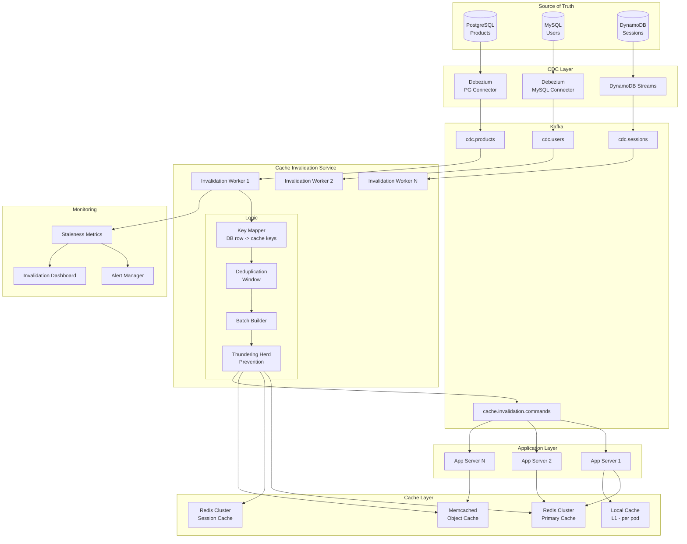

# Cache Invalidation Pipeline at Scale

## Problem Statement

At billion-request scale, applications rely on caching layers (Redis, Memcached) to serve sub-millisecond responses. When underlying data changes, stale caches serve incorrect data—showing wrong prices, outdated inventory, or stale user profiles. The challenge: invalidate or refresh 1M+ cache entries per second with sub-second propagation delay, prevent thundering herds on cache misses, and handle failures gracefully without serving stale data or overwhelming the source database.

## Architecture Diagram



## Component Breakdown

### Key Mapping Service

Maps database changes to affected cache keys. A single DB row change may invalidate multiple cache keys (denormalized views).

```python
class CacheKeyMapper:
    """
    Maps a database change event to all cache keys that need invalidation.
    Handles denormalized cache entries and composite keys.
    """
    
    def __init__(self):
        self.mappings = {}
        self._register_mappings()
    
    def _register_mappings(self):
        # Product changes affect multiple cache patterns
        self.mappings['products'] = [
            lambda row: f"product:{row['id']}",
            lambda row: f"product:slug:{row['slug']}",
            lambda row: f"category:{row['category_id']}:products",
            lambda row: f"search:category:{row['category_id']}",
            lambda row: f"homepage:featured" if row.get('featured') else None,
            lambda row: f"seller:{row['seller_id']}:products",
        ]
        
        # User changes
        self.mappings['users'] = [
            lambda row: f"user:{row['id']}",
            lambda row: f"user:email:{row['email']}",
            lambda row: f"user:{row['id']}:profile",
        ]
        
        # Inventory changes (high frequency)
        self.mappings['inventory'] = [
            lambda row: f"product:{row['product_id']}:stock",
            lambda row: f"product:{row['product_id']}",  # Invalidate full product too
        ]
    
    def get_keys_to_invalidate(self, table: str, row: dict) -> list:
        keys = []
        for mapper in self.mappings.get(table, []):
            key = mapper(row)
            if key:
                keys.append(key)
        return keys
```

### Thundering Herd Prevention

```python
import asyncio
import time
from typing import Optional

class ThunderingHerdPrevention:
    """
    Prevents thundering herd on cache invalidation.
    Uses probabilistic early expiration and lock-based refresh.
    """
    
    def __init__(self, redis_client, lock_ttl_ms: int = 5000):
        self.redis = redis_client
        self.lock_ttl = lock_ttl_ms
    
    async def invalidate_with_protection(self, key: str, strategy: str = 'lock'):
        if strategy == 'lock':
            await self._lock_based_invalidation(key)
        elif strategy == 'stale_while_revalidate':
            await self._stale_while_revalidate(key)
        elif strategy == 'probabilistic':
            await self._probabilistic_refresh(key)
    
    async def _lock_based_invalidation(self, key: str):
        """
        Instead of deleting, mark as stale.
        First requester acquires lock and refreshes.
        Others get stale value while refresh happens.
        """
        # Mark key as stale (don't delete!)
        await self.redis.execute_command(
            'SET', f"{key}:stale", '1', 'EX', 5
        )
        # Key still exists with old value
        # Next reader sees stale marker, attempts refresh lock
    
    async def _stale_while_revalidate(self, key: str):
        """
        Set a soft TTL before hard TTL.
        After soft TTL, serve stale + background refresh.
        """
        # Store with metadata: value + soft_expiry + hard_expiry
        meta_key = f"{key}:meta"
        await self.redis.hset(meta_key, mapping={
            'stale_at': str(int(time.time())),  # Mark stale now
            'expires_at': str(int(time.time()) + 30),  # Hard expire in 30s
        })
    
    async def read_with_herd_protection(self, key: str, refresh_fn) -> Optional[str]:
        """
        Read pattern with thundering herd protection.
        """
        value = await self.redis.get(key)
        is_stale = await self.redis.get(f"{key}:stale")
        
        if value and not is_stale:
            return value  # Cache hit, not stale
        
        if value and is_stale:
            # Try to acquire refresh lock
            lock_acquired = await self.redis.set(
                f"{key}:lock", '1', nx=True, ex=self.lock_ttl // 1000
            )
            
            if lock_acquired:
                # We won the lock - refresh in background
                asyncio.create_task(self._refresh_key(key, refresh_fn))
            
            return value  # Return stale value while refresh happens
        
        # Cache miss - single-flight refresh
        lock_acquired = await self.redis.set(
            f"{key}:lock", '1', nx=True, ex=self.lock_ttl // 1000
        )
        
        if lock_acquired:
            new_value = await refresh_fn()
            await self.redis.set(key, new_value, ex=3600)
            await self.redis.delete(f"{key}:lock", f"{key}:stale")
            return new_value
        else:
            # Another instance refreshing, wait briefly
            await asyncio.sleep(0.05)
            return await self.redis.get(key)
    
    async def _refresh_key(self, key: str, refresh_fn):
        try:
            new_value = await refresh_fn()
            await self.redis.set(key, new_value, ex=3600)
            await self.redis.delete(f"{key}:stale", f"{key}:lock")
        except Exception:
            await self.redis.delete(f"{key}:lock")
```

### Batch Invalidation Worker

```python
class CacheInvalidationWorker:
    """
    Consumes CDC events and performs batch cache invalidation.
    Handles 1M+ invalidations/sec through batching and pipelining.
    """
    
    def __init__(self, kafka_consumer, redis_cluster, config):
        self.consumer = kafka_consumer
        self.redis = redis_cluster
        self.key_mapper = CacheKeyMapper()
        self.herd_prevention = ThunderingHerdPrevention(redis_cluster)
        self.batch_size = config.get('batch_size', 1000)
        self.batch_timeout_ms = config.get('batch_timeout_ms', 100)
        self.dedup_window = {}
        self.metrics = MetricsCollector()
    
    async def run(self):
        batch = []
        last_flush = time.time()
        
        while True:
            messages = self.consumer.poll(timeout_ms=50, max_records=500)
            
            for msg in messages:
                change_event = msg.value
                table = change_event['source']['table']
                row = change_event.get('after') or change_event.get('before')
                
                keys = self.key_mapper.get_keys_to_invalidate(table, row)
                
                for key in keys:
                    # Deduplication: skip if same key invalidated within window
                    if key in self.dedup_window:
                        if time.time() - self.dedup_window[key] < 0.5:
                            continue
                    
                    self.dedup_window[key] = time.time()
                    batch.append(key)
            
            # Flush on batch size or timeout
            if len(batch) >= self.batch_size or \
               (batch and time.time() - last_flush > self.batch_timeout_ms / 1000):
                await self._flush_batch(batch)
                batch = []
                last_flush = time.time()
            
            # Clean dedup window periodically
            if len(self.dedup_window) > 100000:
                cutoff = time.time() - 1.0
                self.dedup_window = {k: v for k, v in self.dedup_window.items() if v > cutoff}
    
    async def _flush_batch(self, keys: list):
        """Pipeline batch invalidation to Redis"""
        start = time.time()
        
        # Use Redis pipeline for batch efficiency
        pipe = self.redis.pipeline(transaction=False)
        
        for key in keys:
            # Strategy: Set stale marker instead of DELETE
            pipe.set(f"{key}:stale", '1', ex=10)
        
        await pipe.execute()
        
        # Metrics
        elapsed = time.time() - start
        self.metrics.record('invalidation_batch_size', len(keys))
        self.metrics.record('invalidation_batch_latency_ms', elapsed * 1000)
        self.metrics.record('invalidations_per_sec', len(keys) / elapsed)
    
    async def _notify_local_caches(self, keys: list):
        """Publish to Kafka for L1 cache invalidation in app pods"""
        for key_batch in chunks(keys, 100):
            self.producer.send(
                'cache.invalidation.commands',
                value={'keys': key_batch, 'timestamp': time.time()}
            )
```

### Cache Strategies Comparison

| Strategy | Write Path | Invalidation | Consistency | Use Case |
|----------|-----------|--------------|-------------|----------|
| Cache-Aside + CDC Invalidate | App writes DB only | CDC triggers delete/stale | ~1-2s stale window | Most common |
| Write-Through | App writes cache + DB | Synchronous | Strong | Low-latency reads, moderate writes |
| Write-Behind | App writes cache, async DB | N/A (cache is source) | Eventual | High write throughput |
| Refresh-Ahead | CDC triggers cache refresh | Proactive populate | ~1-2s stale window | Predictable hot keys |

### Write-Through with CDC Backup
```python
class WriteThroughWithCDCBackup:
    """
    Primary: Write-through (app updates cache on write)
    Backup: CDC invalidation catches missed updates
    """
    
    async def write(self, key: str, value: dict):
        # Write to DB
        await self.db.update(key, value)
        # Write to cache (synchronous)
        await self.redis.set(f"product:{key}", json.dumps(value), ex=3600)
    
    # CDC consumer catches:
    # 1. Direct DB writes (migrations, scripts)
    # 2. Failed cache writes (Redis was down)
    # 3. Multi-key invalidation (denormalized entries)
```

## Scaling Strategies

### Redis Cluster Sizing for 1M invalidations/sec
```
Redis Cluster:
- 6 primary shards + 6 replicas
- Instance: r6g.2xlarge (52GB RAM, 10Gbps network)
- Pipeline batch: 1000 commands per pipeline
- Effective throughput: ~200K ops/sec per shard
- 6 shards × 200K = 1.2M ops/sec capacity

Invalidation Workers:
- 12 worker instances (2 per Redis shard)
- Each worker: 100K invalidations/sec
- Consumer group with 24 Kafka partitions
```

### Multi-Level Cache Architecture
```
L1: In-process cache (Caffeine/Guava)
  - TTL: 5-30 seconds
  - Size: 10K entries per pod
  - Invalidation: Kafka broadcast topic

L2: Redis Cluster
  - TTL: 1 hour
  - Size: 100M entries
  - Invalidation: CDC pipeline (this doc)

L3: CDN (Cloudflare/CloudFront)
  - TTL: 5 minutes
  - Invalidation: API call on critical changes
  - Purge API rate-limited: batch critical keys
```

## Failure Handling

| Failure | Impact | Mitigation |
|---------|--------|------------|
| CDC connector down | No invalidations flowing | Alert on lag, fallback to TTL |
| Kafka unavailable | Invalidations queued | Short cache TTLs as safety net |
| Redis cluster failover | Brief cache unavailability | App falls through to DB |
| Worker crash | Partition rebalance | Auto-recovery from Kafka offset |
| Stale marker lost | Thundering herd on key | Max staleness TTL (10s) |
| Network partition | Split cache views | Reconciliation on heal |

### Safety Net: Bounded Staleness
```python
# Every cache entry has a hard TTL as safety net
# Even if invalidation pipeline fails completely,
# data becomes fresh within TTL

CACHE_TTL_CONFIG = {
    'product_price': 60,       # 1 minute max staleness
    'product_details': 300,    # 5 minutes
    'user_profile': 600,       # 10 minutes
    'inventory_count': 30,     # 30 seconds
    'category_listing': 120,   # 2 minutes
}
```

## Cost Optimization

| Component | Monthly Cost | Optimization |
|-----------|-------------|--------------|
| Redis Cluster (12 nodes) | ~$7,200 | Use r6g (Graviton), eviction policy |
| Kafka (invalidation topics) | Shared with CDC | Low additional cost |
| Invalidation workers (12) | ~$1,400 | Spot instances, auto-scale |
| CDN purge API calls | ~$200 | Batch purges, wildcard purge |
| Monitoring | ~$300 | Prometheus + Grafana |
| **Total** | **~$9,100/month** | For 1M invalidations/sec |

### Memory Optimization
```
- Use Redis hash for grouped keys (save 30% memory)
- Compress large values with LZ4
- Use short key names (prefix:id vs long_prefix_name:id)
- Eviction policy: allkeys-lfu for best hit rate
- Don't cache low-cardinality data (< 100 entries)
```

## Real-World Companies

| Company | Scale | Approach |
|---------|-------|----------|
| **Facebook** | Billions of invalidations/day | TAO + lease-based invalidation |
| **Netflix** | Millions/sec | EVCache + CDC pipeline |
| **Uber** | Real-time pricing cache | CDC + custom invalidation |
| **Twitter** | Timeline cache | Fanout on write + CDC invalidation |
| **Pinterest** | Object cache | Debezium CDC + Redis |
| **Shopify** | Product/inventory cache | CDC pipeline to Redis Cluster |
| **DoorDash** | Menu + restaurant cache | CDC-driven invalidation |

## Production Metrics to Track

```yaml
critical_metrics:
  - cache_staleness_p99_ms: < 2000    # Time from DB write to cache fresh
  - invalidation_lag_ms: < 1000        # CDC to invalidation applied
  - thundering_herd_events: < 10/min   # Concurrent cache misses same key
  - cache_hit_rate: > 95%              # Overall hit rate
  - invalidation_throughput: > 1M/sec  # Sustained throughput
  
alerts:
  - invalidation_lag > 5s for 2min     # Pipeline stalled
  - hit_rate < 90% for 5min            # Mass invalidation or failure
  - thundering_herd > 100/min          # Herd prevention failing
  - worker_consumer_lag > 10000        # Workers can't keep up
```
