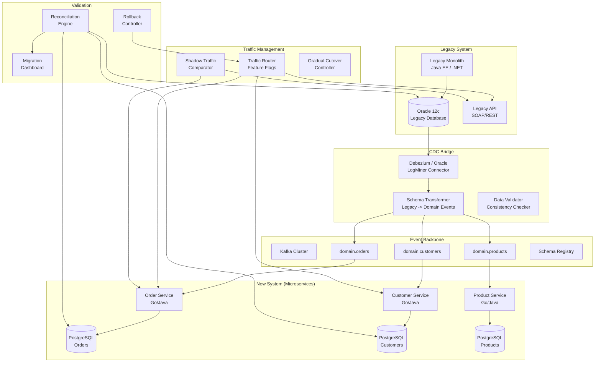

# Legacy System Migration using CDC (Strangler Fig Pattern)

## Problem Statement

Organizations with legacy monolithic databases (Oracle, DB2, mainframes) need to migrate to modern architectures without big-bang cutovers. A billion-dollar business cannot afford downtime or data loss during migration. The strangler fig pattern uses CDC to continuously replicate from legacy to new systems, enabling gradual traffic shifting with instant rollback. The challenge: handling schema differences, data transformations, maintaining consistency during the transition period, and avoiding dangerous dual-write patterns.

## Architecture Diagram



## Component Breakdown

### Why Not Dual-Write

```
DANGER: Dual-write pattern (writing to both old and new simultaneously)

Problems:
1. Partial failure: Write succeeds in legacy, fails in new (or vice versa)
2. Ordering: Concurrent writes may arrive in different order
3. Transactions: No distributed transaction across heterogeneous systems
4. Complexity: Application must handle all failure modes
5. Testing: Nearly impossible to verify correctness

Solution: CDC from single source of truth (legacy DB)
- Legacy remains source of truth during migration
- CDC captures ALL changes reliably (including batch jobs, scripts)
- New system is always consistent (eventually)
- No application code changes in legacy required
```

### Schema Transformation Layer

```python
class LegacySchemaTransformer:
    """
    Transforms legacy Oracle schema to domain events.
    Handles: column renames, type changes, denormalization,
    splitting monolithic tables into bounded contexts.
    """
    
    def __init__(self):
        self.transformers = {
            'CUST_MASTER': self._transform_customer,
            'ORD_HDR': self._transform_order_header,
            'ORD_DTL': self._transform_order_detail,
            'PROD_CATALOG': self._transform_product,
        }
    
    def transform(self, cdc_event: dict) -> list:
        """May produce multiple domain events from one legacy change"""
        table = cdc_event['source']['table']
        transformer = self.transformers.get(table)
        if not transformer:
            return []
        return transformer(cdc_event)
    
    def _transform_customer(self, event: dict) -> list:
        legacy = event['after']
        
        # Legacy: single row with everything
        # New: separate customer and address entities
        customer_event = {
            'event_type': 'CustomerUpdated',
            'entity_id': str(legacy['CUST_ID']),
            'data': {
                'customer_id': str(legacy['CUST_ID']),
                'email': legacy['EMAIL_ADDR'].lower().strip(),
                'first_name': self._title_case(legacy['CUST_FNAME']),
                'last_name': self._title_case(legacy['CUST_LNAME']),
                'phone': self._normalize_phone(legacy['PHONE_NBR']),
                'status': self._map_status(legacy['CUST_STAT_CD']),
                'created_at': self._oracle_date_to_iso(legacy['CRT_DT']),
                'updated_at': self._oracle_date_to_iso(legacy['UPD_DT']),
            },
            'metadata': {
                'source': 'legacy_cdc',
                'legacy_table': 'CUST_MASTER',
                'migration_version': '2.1',
                'transformed_at': datetime.utcnow().isoformat()
            }
        }
        
        address_event = {
            'event_type': 'AddressUpdated',
            'entity_id': str(legacy['CUST_ID']),
            'data': {
                'customer_id': str(legacy['CUST_ID']),
                'street': legacy['ADDR_LINE1'],
                'city': legacy['CITY'],
                'state': legacy['STATE_CD'],
                'zip': legacy['ZIP_CD'],
                'country': self._map_country(legacy['CNTRY_CD']),
            }
        }
        
        return [customer_event, address_event]
    
    def _map_status(self, legacy_code: str) -> str:
        mapping = {'A': 'active', 'I': 'inactive', 'S': 'suspended', 'D': 'deleted'}
        return mapping.get(legacy_code, 'unknown')
    
    def _normalize_phone(self, phone: str) -> str:
        digits = ''.join(c for c in (phone or '') if c.isdigit())
        if len(digits) == 10:
            return f"+1{digits}"
        return f"+{digits}" if digits else None
```

### Gradual Traffic Shifting

```python
class TrafficRouter:
    """
    Routes traffic between legacy and new system based on feature flags.
    Supports: percentage-based, user-based, entity-based routing.
    """
    
    def __init__(self, feature_flag_client, metrics):
        self.flags = feature_flag_client
        self.metrics = metrics
    
    async def route_request(self, request: Request) -> Response:
        service = self._determine_service(request)
        route = self._get_routing_decision(service, request)
        
        if route == 'new':
            response = await self._call_new_service(request)
            self.metrics.increment(f'route.{service}.new')
        elif route == 'shadow':
            # Send to both, return legacy response, compare async
            legacy_response = await self._call_legacy(request)
            asyncio.create_task(self._shadow_compare(request, legacy_response))
            response = legacy_response
            self.metrics.increment(f'route.{service}.shadow')
        else:
            response = await self._call_legacy(request)
            self.metrics.increment(f'route.{service}.legacy')
        
        return response
    
    def _get_routing_decision(self, service: str, request: Request) -> str:
        # Phase 1: Shadow mode (0% new, compare results)
        # Phase 2: Canary (1-5% to new)
        # Phase 3: Gradual increase (5% -> 25% -> 50% -> 100%)
        # Phase 4: Legacy decommission
        
        flag = self.flags.get(f'migration.{service}.routing')
        
        if flag['mode'] == 'shadow':
            return 'shadow'
        elif flag['mode'] == 'percentage':
            user_id = request.get_user_id()
            if hash(user_id) % 100 < flag['new_percentage']:
                return 'new'
            return 'legacy'
        elif flag['mode'] == 'full_new':
            return 'new'
        return 'legacy'
    
    async def _shadow_compare(self, request, legacy_response):
        """Compare legacy vs new system responses without impacting user"""
        try:
            new_response = await self._call_new_service(request)
            
            differences = self._deep_compare(
                legacy_response.json(),
                new_response.json(),
                ignore_fields=['timestamps', 'internal_ids']
            )
            
            if differences:
                self.metrics.increment('shadow.mismatch')
                await self._log_mismatch(request, legacy_response, new_response, differences)
            else:
                self.metrics.increment('shadow.match')
        except Exception as e:
            self.metrics.increment('shadow.error')
            log.warning(f"Shadow comparison failed: {e}")
```

### Data Validation and Reconciliation

```python
class MigrationReconciler:
    """
    Continuous validation that new system data matches legacy.
    Runs during entire migration period.
    """
    
    def __init__(self, legacy_db, new_db, alert_service):
        self.legacy = legacy_db
        self.new = new_db
        self.alerts = alert_service
    
    async def run_reconciliation(self, entity: str):
        """Compare entity counts and sample data"""
        
        # Count comparison
        legacy_count = await self.legacy.execute(
            f"SELECT COUNT(*) FROM {LEGACY_TABLE_MAP[entity]}"
        )
        new_count = await self.new.execute(
            f"SELECT COUNT(*) FROM {entity}"
        )
        
        drift_pct = abs(legacy_count - new_count) / legacy_count * 100
        
        if drift_pct > 0.01:  # > 0.01% difference
            await self.alerts.warn(
                f"Count mismatch for {entity}: legacy={legacy_count}, new={new_count}"
            )
        
        # Sample comparison (random 1000 records)
        sample_ids = await self.legacy.execute(
            f"SELECT CUST_ID FROM CUST_MASTER ORDER BY DBMS_RANDOM.RANDOM FETCH FIRST 1000 ROWS ONLY"
        )
        
        mismatches = 0
        for record_id in sample_ids:
            legacy_record = await self._get_legacy_record(entity, record_id)
            new_record = await self._get_new_record(entity, record_id)
            
            if not self._records_match(legacy_record, new_record):
                mismatches += 1
                await self._log_mismatch_detail(entity, record_id, legacy_record, new_record)
        
        mismatch_rate = mismatches / len(sample_ids)
        self.metrics.gauge(f'reconciliation.{entity}.mismatch_rate', mismatch_rate)
        
        if mismatch_rate > 0.001:  # > 0.1% mismatch
            await self.alerts.critical(
                f"High mismatch rate for {entity}: {mismatch_rate:.4%}"
            )
```

### Rollback Strategy

```python
class MigrationRollback:
    """
    Instant rollback capability at any point during migration.
    """
    
    async def rollback(self, service: str, reason: str):
        """
        Rollback steps:
        1. Route 100% traffic back to legacy (instant)
        2. Stop CDC consumers in new system
        3. Investigate and fix
        4. Re-sync new system from legacy
        5. Resume gradual cutover
        """
        log.critical(f"ROLLBACK initiated for {service}. Reason: {reason}")
        
        # Step 1: Instant traffic switch (< 1 second)
        await self.feature_flags.set(f'migration.{service}.routing', {
            'mode': 'legacy'  # All traffic to legacy
        })
        
        # Step 2: Stop new system writes
        await self.kafka_consumer_manager.pause(f'{service}-migration-consumer')
        
        # Step 3: Alert team
        await self.pagerduty.trigger(
            f"Migration rollback: {service}",
            details={'reason': reason, 'timestamp': datetime.utcnow().isoformat()}
        )
        
        # Legacy continues serving as if nothing happened
        # No data loss because legacy was always the source of truth
```

## Data Flow

```
Migration Phases:

Phase 0: Preparation (1-2 weeks)
- Set up CDC from legacy database
- Build schema transformers
- Deploy new services (no traffic)
- Initial data load into new system
- Verify data consistency

Phase 1: Shadow Mode (2-4 weeks)
- CDC continuously syncing legacy -> new
- All traffic still goes to legacy
- Shadow requests sent to new system
- Compare responses, fix discrepancies
- Target: < 0.01% mismatch rate

Phase 2: Canary (1-2 weeks)
- 1-5% of read traffic to new system
- Monitor error rates, latency, correctness
- Instant rollback if issues detected
- Writes still go to legacy (CDC syncs to new)

Phase 3: Gradual Cutover (2-4 weeks)
- Increase: 5% -> 10% -> 25% -> 50% -> 75% -> 100%
- At each stage: validate for 2-3 days
- Monitor reconciliation metrics
- Write cutover happens last (most critical)

Phase 4: Write Cutover
- Stop CDC from legacy
- Switch writes to new system
- Start reverse CDC (new -> legacy) for rollback safety
- Monitor for 2 weeks

Phase 5: Decommission (after confidence period)
- Stop reverse CDC
- Decommission legacy system
- Archive legacy data
```

## Scaling Strategies

| Challenge | Solution |
|-----------|----------|
| Initial load of 500M rows | Parallel chunked reads from replica |
| CDC lag during peak | Scale Kafka consumers, batch processing |
| Schema transform CPU | Horizontally scale transform workers |
| Shadow traffic doubling load | Rate-limit shadow to 10% sample |
| Reconciliation at scale | Probabilistic sampling, not full scan |

## Failure Handling

| Failure | Impact | Mitigation |
|---------|--------|------------|
| CDC connector crash | New system falls behind | Auto-restart, alert on lag |
| Transform bug | Incorrect data in new system | Replay from Kafka, fix transformer |
| New service crash | Users on new system affected | Instant route to legacy |
| Legacy DB change (DDL) | Transform may break | Schema history, alert on DDL |
| Network between regions | Replication lag | Buffer in Kafka, catch up |

## Cost Optimization

| Phase | Additional Cost | Duration | Notes |
|-------|----------------|----------|-------|
| Setup | ~$5,000/mo | 1 month | CDC infra + dev |
| Shadow | ~$8,000/mo | 1 month | Running both systems |
| Gradual | ~$12,000/mo | 2 months | Both at near-full capacity |
| Post-cutover | ~$2,000/mo | 1 month | Legacy still running for safety |
| Steady state | -$5,000/mo | Ongoing | New system cheaper than Oracle |

**Total migration cost: ~$40,000-60,000 in infrastructure (6 month migration)**
**ROI: Oracle license savings of $200K+/year**

## Real-World Companies

| Company | Migration | Duration |
|---------|-----------|----------|
| **Amazon** | Oracle to DynamoDB/Aurora | Multi-year, service by service |
| **Netflix** | Oracle to Cassandra/Aurora | ~2 years with CDC |
| **Airbnb** | Monolith to microservices | Strangler fig over 3 years |
| **Shopify** | MySQL monolith to sharded | CDC-based gradual migration |
| **Uber** | PostgreSQL to custom (Schemaless) | Service-by-service CDC |
| **Twitter** | MySQL to Manhattan (custom) | Dual-read verification |
| **SoundCloud** | Monolith to microservices | Event-driven strangler |
