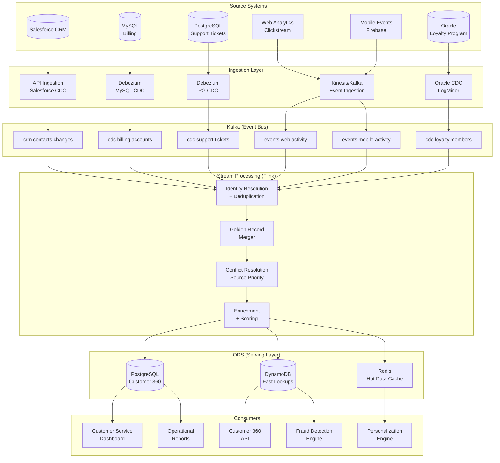

# Operational Data Store (ODS) Architecture

## Problem Statement

Organizations have customer data fragmented across 50+ OLTP systems—CRM, billing, support tickets, web analytics, mobile app events, loyalty programs. No single system has a complete view. Business operations need a unified, near-real-time (< 5 minute latency) "golden record" for each customer to power: customer service dashboards, fraud detection, real-time personalization, and operational reporting. Unlike a data warehouse (batch, historical), an ODS must support low-latency point queries while ingesting 100K+ changes/second from multiple sources.

## Architecture Diagram



## Component Breakdown

### Identity Resolution

```python
class IdentityResolver:
    """
    Resolves customer identity across disparate systems.
    A customer may be: billing_id=12345, crm_id=SF-789, loyalty_id=L-456, email=john@example.com
    All map to a single golden_customer_id.
    """
    
    def __init__(self, identity_graph_db):
        self.graph = identity_graph_db  # PostgreSQL or Neo4j
    
    def resolve(self, event: dict) -> str:
        """Returns the canonical golden_customer_id for any source identifier"""
        source = event['source_system']
        identifiers = self._extract_identifiers(event)
        
        # Try to find existing mapping
        golden_id = None
        for id_type, id_value in identifiers.items():
            existing = self.graph.query("""
                SELECT golden_id FROM identity_mapping
                WHERE id_type = %s AND id_value = %s
            """, (id_type, id_value))
            
            if existing:
                golden_id = existing['golden_id']
                break
        
        if not golden_id:
            # New customer - create golden record
            golden_id = self._generate_golden_id()
        
        # Register all identifiers for this golden_id
        for id_type, id_value in identifiers.items():
            self.graph.upsert("""
                INSERT INTO identity_mapping (golden_id, id_type, id_value, source, updated_at)
                VALUES (%s, %s, %s, %s, NOW())
                ON CONFLICT (id_type, id_value) DO UPDATE SET updated_at = NOW()
            """, (golden_id, id_type, id_value, source))
        
        return golden_id
    
    def _extract_identifiers(self, event: dict) -> dict:
        identifiers = {}
        field_map = {
            'email': 'email',
            'phone': 'phone',
            'billing_id': 'billing_customer_id',
            'crm_id': 'salesforce_contact_id',
            'loyalty_id': 'loyalty_member_id',
        }
        for id_type, field in field_map.items():
            if event.get(field):
                identifiers[id_type] = event[field].lower().strip()
        return identifiers
    
    def merge_identities(self, golden_id_1: str, golden_id_2: str):
        """Merge two golden records (detected as same person)"""
        # Keep the older golden_id as canonical
        canonical = min(golden_id_1, golden_id_2)
        deprecated = max(golden_id_1, golden_id_2)
        
        # Update all mappings
        self.graph.execute("""
            UPDATE identity_mapping SET golden_id = %s WHERE golden_id = %s
        """, (canonical, deprecated))
        
        # Merge golden records
        self._merge_golden_records(canonical, deprecated)
```

### Golden Record Merger

```python
class GoldenRecordMerger:
    """
    Builds the 360-degree customer view from multiple source systems.
    Each source has a priority for each field.
    """
    
    # Source priority by field (higher = more authoritative)
    FIELD_PRIORITY = {
        'email': {'crm': 10, 'billing': 8, 'support': 5, 'web': 3},
        'phone': {'crm': 10, 'billing': 9, 'support': 4, 'web': 2},
        'name': {'crm': 10, 'billing': 7, 'loyalty': 6, 'web': 2},
        'address': {'billing': 10, 'crm': 8, 'loyalty': 5},
        'preferences': {'loyalty': 10, 'web': 8, 'mobile': 8},
    }
    
    def merge(self, golden_id: str, source: str, new_data: dict) -> dict:
        """Merge new source data into existing golden record"""
        current = self.get_golden_record(golden_id)
        
        for field, value in new_data.items():
            if value is None:
                continue
            
            current_source = current.get(f'_source_{field}')
            current_priority = self._get_priority(field, current_source)
            new_priority = self._get_priority(field, source)
            
            if new_priority >= current_priority or current.get(field) is None:
                current[field] = value
                current[f'_source_{field}'] = source
                current[f'_updated_{field}'] = datetime.utcnow().isoformat()
        
        # Always merge additive fields
        current['source_systems'] = list(set(current.get('source_systems', []) + [source]))
        current['last_activity_at'] = datetime.utcnow().isoformat()
        current['update_count'] = current.get('update_count', 0) + 1
        
        self.save_golden_record(golden_id, current)
        return current
    
    def _get_priority(self, field: str, source: str) -> int:
        return self.FIELD_PRIORITY.get(field, {}).get(source, 0)
```

### ODS Data Model (PostgreSQL)

```sql
-- Golden customer record
CREATE TABLE customer_360 (
    golden_id UUID PRIMARY KEY,
    
    -- Identity
    email VARCHAR(255),
    phone VARCHAR(20),
    first_name VARCHAR(100),
    last_name VARCHAR(100),
    
    -- Demographics
    date_of_birth DATE,
    gender VARCHAR(10),
    preferred_language VARCHAR(5),
    
    -- Address
    address_street TEXT,
    address_city VARCHAR(100),
    address_state VARCHAR(50),
    address_zip VARCHAR(20),
    address_country VARCHAR(2),
    
    -- Computed / Aggregated
    lifetime_value DECIMAL(12, 2),
    total_orders INT DEFAULT 0,
    loyalty_tier VARCHAR(20),
    risk_score DECIMAL(5, 3),
    churn_probability DECIMAL(5, 3),
    
    -- Activity
    last_purchase_at TIMESTAMP,
    last_login_at TIMESTAMP,
    last_support_ticket_at TIMESTAMP,
    last_activity_at TIMESTAMP,
    
    -- Metadata
    source_systems TEXT[],
    created_at TIMESTAMP DEFAULT NOW(),
    updated_at TIMESTAMP DEFAULT NOW(),
    version BIGINT DEFAULT 1
);

-- Recent activity (time-series per customer)
CREATE TABLE customer_activity (
    golden_id UUID REFERENCES customer_360(golden_id),
    activity_at TIMESTAMP NOT NULL,
    activity_type VARCHAR(50) NOT NULL,
    source_system VARCHAR(50),
    details JSONB,
    PRIMARY KEY (golden_id, activity_at, activity_type)
) PARTITION BY RANGE (activity_at);

-- Indexes for operational queries
CREATE INDEX idx_customer_email ON customer_360(email);
CREATE INDEX idx_customer_phone ON customer_360(phone);
CREATE INDEX idx_customer_risk ON customer_360(risk_score) WHERE risk_score > 0.7;
CREATE INDEX idx_customer_churn ON customer_360(churn_probability) WHERE churn_probability > 0.5;
```

### DynamoDB Model (Fast Lookups)

```python
# DynamoDB table design for sub-10ms lookups
TABLE_DESIGN = {
    'TableName': 'customer-360',
    'KeySchema': [
        {'AttributeName': 'PK', 'KeyType': 'HASH'},   # CUSTOMER#<golden_id>
        {'AttributeName': 'SK', 'KeyType': 'RANGE'},   # PROFILE | ACTIVITY#<timestamp> | ORDER#<id>
    ],
    'GlobalSecondaryIndexes': [
        {
            'IndexName': 'email-index',
            'KeySchema': [
                {'AttributeName': 'email', 'KeyType': 'HASH'},
            ],
        },
        {
            'IndexName': 'phone-index',
            'KeySchema': [
                {'AttributeName': 'phone', 'KeyType': 'HASH'},
            ],
        }
    ],
    'BillingMode': 'PAY_PER_REQUEST',
}

# Access patterns:
# 1. Get customer by golden_id: PK=CUSTOMER#123, SK=PROFILE
# 2. Get recent activity: PK=CUSTOMER#123, SK begins_with ACTIVITY#
# 3. Look up by email: GSI email-index
# 4. Look up by phone: GSI phone-index
```

## Data Flow

```
1. Source system change occurs (billing update, support ticket, web click)
2. CDC/event captures change and publishes to Kafka
3. Flink consumer reads event
4. Identity resolver maps source ID → golden_customer_id
5. Golden record merger applies field-level merge with source priority
6. Enrichment adds computed scores (LTV, churn, risk)
7. Merged record written to:
   - PostgreSQL (operational queries, reports)
   - DynamoDB (fast API lookups)
   - Redis (hot customer cache, 1-hour TTL)
8. Downstream consumers read from ODS

End-to-end latency targets:
- CDC-sourced changes: < 5 seconds
- Event-sourced (web/mobile): < 2 seconds
- API-sourced (CRM sync): < 30 seconds (batch API polling)
```

## Scaling Strategies

| Component | Approach | Capacity |
|-----------|----------|----------|
| Kafka ingestion | 48 partitions per source topic | 200K events/sec |
| Flink processing | 24 task slots, keyed by golden_id | 100K merges/sec |
| PostgreSQL ODS | Read replicas + partitioning | 50K reads/sec |
| DynamoDB | On-demand scaling | Unlimited reads/writes |
| Redis cache | Cluster mode, 6 shards | 500K reads/sec |
| Identity resolution | In-memory cache + DB | 100K resolutions/sec |

## Failure Handling

| Failure | Impact | Mitigation |
|---------|--------|------------|
| Source CDC down | Golden record stale for that source | Alert, TTL-based staleness indicator |
| Identity mismatch | Wrong records merged | Audit log, split capability |
| Flink crash | Processing paused | Auto-restart from checkpoint |
| DynamoDB throttle | API latency spike | On-demand mode, retry with backoff |
| Duplicate events | Over-counting activity | Idempotent upserts, dedup window |

### Staleness Tracking
```python
# Each field tracks when it was last refreshed from its source
# If source hasn't updated a field in > expected_interval, mark as potentially stale

FRESHNESS_SLA = {
    'billing': timedelta(minutes=5),    # CDC, near real-time
    'crm': timedelta(minutes=30),       # API polling
    'web': timedelta(minutes=1),        # Real-time events
    'loyalty': timedelta(hours=1),      # Batch sync
}
```

## Cost Optimization

| Component | Monthly Cost | Notes |
|-----------|-------------|-------|
| Kafka (shared) | ~$2,000 | Shared CDC infrastructure |
| Flink cluster | ~$3,000 | 6x m5.xlarge |
| PostgreSQL ODS | ~$2,500 | r6g.2xlarge + read replicas |
| DynamoDB | ~$1,500 | On-demand, ~50M reads/day |
| Redis (cache) | ~$1,200 | r6g.xlarge cluster |
| Identity resolution | ~$500 | Included in Flink |
| **Total** | **~$10,700/month** | 50M customers, real-time |

## Real-World Companies

| Company | ODS Use Case | Scale |
|---------|-------------|-------|
| **Amazon** | Customer 360 for recommendations | Billions of events/day |
| **Capital One** | Real-time fraud + customer view | 100M+ customers |
| **Salesforce** | Customer Data Platform (CDP) | Multi-tenant ODS |
| **Segment** | Customer Data Infrastructure | Unified customer profiles |
| **Twilio Segment** | Identity resolution + profiles | Billions of events |
| **Mastercard** | Transaction enrichment | Real-time operational |
| **UnitedHealth** | Patient 360 view | Multi-source health records |
