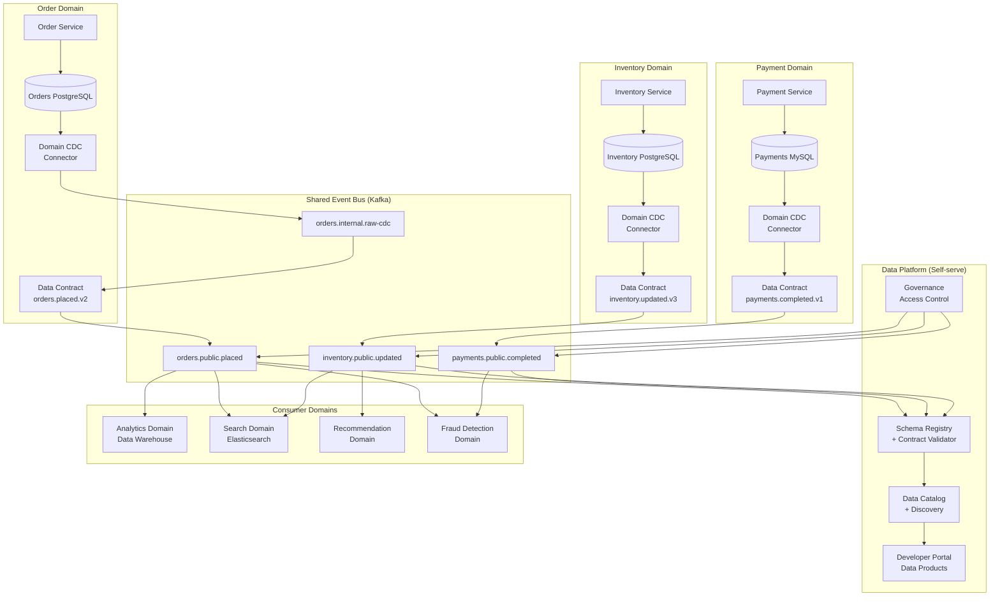

# Event-driven Data Mesh with CDC

## Problem Statement

Centralized data teams become bottlenecks as organizations scale to hundreds of domains. Data mesh decentralizes ownership: each domain owns its data products. But domains still need to share data. The challenge: how do 50+ domain teams publish and consume data changes without tight coupling, while maintaining data contracts, schema compatibility, discoverability, and governance? CDC enables domains to publish changes from their operational databases as first-class data products without modifying application code.

## Architecture Diagram



## Component Breakdown

### Domain Data Product Structure

```
Each domain owns:
1. Operational Database (internal, private)
2. CDC Connector (captures all changes)
3. Internal CDC Topic (raw, unfiltered - domain internal)
4. Transformation Layer (filter, transform, redact PII)
5. Public Event Topic (the "data product")
6. Data Contract (schema + SLA + documentation)
7. Monitoring (freshness, quality, throughput)
```

### Data Contract Definition

```yaml
# orders.public.placed.contract.yaml
apiVersion: datacontract/v1
kind: DataContract
metadata:
  name: orders.placed
  domain: order-domain
  owner: order-team@company.com
  version: "2.1.0"
  
schema:
  type: avro
  registry: "http://schema-registry:8081"
  subject: "orders.public.placed-value"
  compatibility: BACKWARD  # Can add fields, can't remove/rename
  
  fields:
    - name: order_id
      type: string
      format: uuid
      description: "Unique order identifier"
      pii: false
      required: true
    - name: customer_id
      type: string
      description: "Anonymized customer identifier"
      pii: false
      required: true
    - name: total_amount
      type: decimal
      precision: 10
      scale: 2
      required: true
    - name: currency
      type: string
      enum: [USD, EUR, GBP, JPY]
      required: true
    - name: items
      type: array
      items:
        type: record
        fields:
          - name: product_id
            type: string
          - name: quantity
            type: int
          - name: unit_price
            type: decimal
    - name: placed_at
      type: timestamp-millis
      required: true

quality:
  freshness:
    maxDelaySeconds: 30
    sla: 99.9%
  completeness:
    requiredFields: [order_id, customer_id, total_amount, placed_at]
  volume:
    expectedEventsPerHour:
      min: 1000
      max: 500000

sla:
  availability: 99.95%
  throughput: "50K events/sec peak"
  retention: "7 days (streaming), unlimited (lake)"

access:
  classification: internal
  approvalRequired: false
  consumers:
    - analytics-domain
    - fraud-domain
    - search-domain
```

### Schema Registry with Compatibility Enforcement

```python
class DataContractEnforcer:
    """
    Validates that domain CDC output conforms to published data contract.
    Sits between internal CDC and public topic.
    """
    
    def __init__(self, schema_registry, contract_store):
        self.registry = schema_registry
        self.contracts = contract_store
    
    def validate_and_publish(self, domain: str, event: dict) -> bool:
        contract = self.contracts.get_active(domain, event['event_type'])
        
        # 1. Schema validation
        schema_valid = self.registry.validate(
            subject=contract.schema_subject,
            data=event
        )
        if not schema_valid:
            self.metrics.increment(f'{domain}.schema_violation')
            self.route_to_dlq(event, 'schema_violation')
            return False
        
        # 2. PII check - ensure no PII leaks to public topic
        pii_fields = contract.get_pii_fields()
        for field in pii_fields:
            if field in event and not self._is_redacted(event[field]):
                self.metrics.increment(f'{domain}.pii_leak_prevented')
                self.route_to_dlq(event, 'pii_not_redacted')
                return False
        
        # 3. Quality checks
        for rule in contract.quality_rules:
            if not rule.check(event):
                self.metrics.increment(f'{domain}.quality_violation.{rule.name}')
                # Quality violations logged but not blocked (soft enforcement)
        
        # 4. Publish to public topic
        self.publish(contract.public_topic, event)
        return True
```

### Event Versioning Strategy

```python
class EventVersionManager:
    """
    Manages multiple versions of domain events simultaneously.
    Supports consumer migration at their own pace.
    """
    
    def publish_event(self, event: dict, version: str):
        """
        Publish to versioned topic.
        Multiple versions can coexist during migration.
        """
        # Topic naming: {domain}.public.{event_type}.v{major}
        topic = f"{event['domain']}.public.{event['type']}.v{version.split('.')[0]}"
        
        # Header contains exact version for consumers
        headers = {
            'event-version': version,
            'event-type': event['type'],
            'domain': event['domain'],
            'correlation-id': event.get('correlation_id', str(uuid.uuid4()))
        }
        
        self.producer.send(topic, value=event, headers=headers)
    
    def handle_version_upgrade(self, domain: str, event_type: str, 
                                old_version: str, new_version: str):
        """
        During version upgrade:
        1. New version topic created
        2. Both old and new populated simultaneously
        3. Consumers migrate at their own pace
        4. Old version deprecated after all consumers migrated
        5. Old version removed after grace period
        """
        # Adapter that transforms old format to new
        adapter = self.get_upgrade_adapter(event_type, old_version, new_version)
        
        # Dual-publish during migration window
        self.dual_publish_config[f"{domain}.{event_type}"] = {
            'old_topic': f"{domain}.public.{event_type}.v{old_version.split('.')[0]}",
            'new_topic': f"{domain}.public.{event_type}.v{new_version.split('.')[0]}",
            'adapter': adapter,
            'deprecation_date': datetime.utcnow() + timedelta(days=90)
        }
```

### Domain Boundary Enforcement

```yaml
# Kafka ACLs enforcing domain boundaries
# Each domain can only write to its own topics

# Order domain service account
kafka-acls:
  - principal: "User:order-domain-sa"
    operations: [WRITE, DESCRIBE]
    resource: "Topic:orders.*"
    
  - principal: "User:order-domain-sa"
    operations: [READ]
    resource: "Topic:payments.public.*"  # Can consume public payment events
    
  # Cannot write to other domains
  - principal: "User:order-domain-sa"
    operations: [WRITE]
    resource: "Topic:payments.*"
    permission: DENY

# Payment domain
  - principal: "User:payment-domain-sa"
    operations: [WRITE, DESCRIBE]
    resource: "Topic:payments.*"
    
  - principal: "User:payment-domain-sa"
    operations: [READ]
    resource: "Topic:orders.public.*"
```

## Data Flow

```
Domain Publishing Flow:
1. Application writes to domain database
2. Domain-owned CDC connector captures change
3. Raw change published to internal topic (domain private)
4. Domain transformer:
   - Filters (only relevant changes)
   - Transforms (domain model → public event model)
   - Redacts (remove PII, internal fields)
   - Enriches (add context needed by consumers)
5. Contract validator checks schema + quality
6. Published to public topic (the data product)
7. Schema registered in Schema Registry
8. Metadata published to Data Catalog

Domain Consuming Flow:
1. Consumer discovers data product in catalog
2. Requests access (auto-approved or manual based on classification)
3. Consumer reads from public topic
4. Consumes at own pace (independent consumer group)
5. Schema deserialization via Schema Registry
6. Consumer responsible for own processing + storage
```

## Scaling Strategies

| Aspect | Approach |
|--------|----------|
| Domains | Each domain independently scalable |
| Topics | Partitioned by entity key within domain |
| Schema Registry | Shared service, replicated |
| Catalog | Centralized, cached |
| CDC connectors | 1 per domain database |
| Platform team | Provides self-serve tooling, not data |

### Self-Serve Platform Components
```
What platform team provides:
- Kafka cluster (shared, multi-tenant)
- Schema Registry
- CDC connector templates (Helm charts)
- Data contract tooling (validation, testing)
- Catalog + discovery portal
- Monitoring dashboards (per domain)
- Topic provisioning automation

What domain teams own:
- Their CDC connector configuration
- Schema design and evolution
- Data quality
- Consumer SLA compliance
- Documentation
```

## Failure Handling

| Failure | Impact | Resolution |
|---------|--------|------------|
| Domain CDC down | Domain's public events stale | Domain team alerted, their responsibility |
| Schema incompatible change | Consumers break | Blocked by compatibility check |
| Consumer lag | Consumer's data stale | Consumer team monitors their lag |
| Contract violation | Events to DLQ | Domain team fixes transformer |
| Kafka partition leader | Brief unavailability | Auto-recovery, replication |

### Domain SLA Monitoring
```python
# Each domain data product has freshness SLA
# Platform monitors and alerts domain owners

class DataProductMonitor:
    def check_freshness(self, domain: str, product: str):
        last_event_ts = self.get_latest_event_timestamp(domain, product)
        contract = self.get_contract(domain, product)
        max_delay = contract['quality']['freshness']['maxDelaySeconds']
        
        actual_delay = (datetime.utcnow() - last_event_ts).total_seconds()
        
        if actual_delay > max_delay:
            self.alert_domain_owner(domain, product, actual_delay, max_delay)
            self.metrics.gauge(f'data_product.{domain}.{product}.freshness_violation', 1)
```

## Cost Optimization

| Component | Monthly Cost | Ownership |
|-----------|-------------|-----------|
| Kafka cluster (shared) | ~$8,000 | Platform team |
| Schema Registry | ~$400 | Platform team |
| Data Catalog | ~$500 | Platform team |
| CDC connectors (per domain) | ~$200-500 each | Domain team |
| Domain transformers | ~$300-1000 each | Domain team |
| **Platform total** | **~$9,000/month** | Shared infrastructure |
| **Per-domain cost** | **~$500-1,500/month** | Domain-specific |

## Real-World Companies

| Company | Approach | Scale |
|---------|----------|-------|
| **Zalando** | Data Mesh pioneers, Nakadi event bus | 500+ data products |
| **Netflix** | Domain-oriented data platform | Thousands of datasets |
| **JP Morgan** | Domain data products | Financial data mesh |
| **Thoughtworks** | Coined "Data Mesh" (Zhamak Dehghani) | Consulting + implementation |
| **Saxo Bank** | Event-driven data mesh | Financial services |
| **Adevinta** | CDC-based domain events | Marketplace platform |
| **HelloFresh** | Domain event streaming | Recipe + logistics domains |
