# CDC Patterns Comparison (Log-based vs Query-based vs Trigger-based)

## Problem Statement

Organizations choosing a CDC strategy face a fundamental tradeoff: log-based CDC offers zero-impact capture but requires database-specific configuration; query-based CDC is universal but adds load and misses deletes; trigger-based CDC captures everything but significantly impacts write performance. At scale, the wrong choice means either missing data changes, degrading production database performance, or building unmaintainable custom solutions. This document provides a comprehensive comparison to guide technology selection.

## Architecture Diagram

```mermaid
graph TB
    subgraph "Log-based CDC"
        DB_LOG[(Database)]
        BINLOG[Transaction Log<br/>Binlog/WAL/Redo]
        DBZ_LOG[Debezium / Maxwell<br/>/ AWS DMS]
        K_LOG[Kafka Topics]
        
        DB_LOG -->|"Writes normally"| BINLOG
        BINLOG -->|"Read async"| DBZ_LOG
        DBZ_LOG --> K_LOG
    end

    subgraph "Query-based CDC"
        DB_QUERY[(Database)]
        POLL[Polling Service<br/>Airbyte/Fivetran]
        DIFF[Change Detection<br/>timestamp/version]
        K_QUERY[Kafka / S3]
        
        DB_QUERY -->|"SELECT WHERE updated > X"| POLL
        POLL --> DIFF
        DIFF --> K_QUERY
    end

    subgraph "Trigger-based CDC"
        DB_TRIG[(Database)]
        TRIGGER[Database Triggers<br/>AFTER INSERT/UPDATE/DELETE]
        SHADOW[Shadow/Audit Table]
        READER[Change Reader<br/>Service]
        K_TRIG[Kafka Topics]
        
        DB_TRIG -->|"Trigger fires"| TRIGGER
        TRIGGER -->|"Write change"| SHADOW
        SHADOW --> READER
        READER --> K_TRIG
    end

    subgraph "Comparison"
        PERF[Performance<br/>Impact]
        COMPLETE[Completeness]
        COMPLEX[Complexity]
        LATENCY[Latency]
    end
```



## Comprehensive Comparison

| Criterion | Log-based | Query-based | Trigger-based |
|-----------|-----------|-------------|---------------|
| **Performance impact** | Near-zero (reads log) | Medium (polling queries) | High (trigger per write) |
| **Latency** | Sub-second | Seconds to minutes | Sub-second |
| **Captures deletes** | Yes | No (unless soft-delete) | Yes |
| **Captures all changes** | Yes (every intermediate) | No (only latest state) | Yes |
| **Before/after values** | Yes (depends on config) | No (only current) | Yes |
| **Schema changes** | Captured automatically | May break queries | Must update triggers |
| **Database support** | DB-specific | Universal | Universal |
| **Operational complexity** | Medium-High | Low | Medium |
| **Initial snapshot** | Built-in | Natural (first query) | Requires separate load |
| **Scalability** | Excellent | Limited by query load | Poor (write amplification) |
| **Best for** | Production OLTP at scale | Small DBs, SaaS, legacy | Audit requirements |

## Log-based CDC (Deep Dive)

### How It Works
```
Database writes are ALWAYS persisted to a transaction log before acknowledging:
- MySQL: Binary Log (binlog)
- PostgreSQL: Write-Ahead Log (WAL)
- Oracle: Redo Log (via LogMiner/XStream)
- SQL Server: Transaction Log (via CT/CDC features)
- MongoDB: Oplog (operation log)

CDC tools read this log as a "logical replication client":
- No impact on application queries
- Captures ALL changes (including batch jobs, migrations)
- Preserves exact order of operations
- Provides before + after state
```

### Debezium (Most Popular)

```json
{
  "connector.class": "io.debezium.connector.postgresql.PostgresConnector",
  "plugin.name": "pgoutput",
  "slot.name": "debezium_slot",
  "database.hostname": "pg-primary",
  "database.port": "5432",
  "database.dbname": "myapp",
  "table.include.list": "public.orders,public.users",
  "snapshot.mode": "initial",
  "tombstones.on.delete": true,
  "decimal.handling.mode": "string"
}
```

**Pros:**
- Zero performance impact on source DB
- Sub-second latency
- Captures all operations (INSERT, UPDATE, DELETE)
- Before and after images
- Handles schema changes
- Exactly-once with Kafka Connect

**Cons:**
- Database-specific configuration required
- Requires access to transaction log (DBA involvement)
- Replication slot management (PostgreSQL WAL bloat risk)
- Complex monitoring (slot lag, connector health)
- Not available for all databases

### Maxwell (MySQL-specific)

```yaml
# Maxwell config (simpler MySQL-only alternative to Debezium)
host: mysql-primary
user: maxwell
password: secret
producer: kafka
kafka.bootstrap.servers: kafka:9092
kafka_topic: maxwell.%{database}.%{table}
output_ddl: true
gtid_mode: true
```

**When to use over Debezium:**
- MySQL only
- Simpler setup (single binary)
- Don't need Kafka Connect framework
- Lower operational overhead for small deployments

### AWS DMS (Managed)

```json
{
  "rules": [
    {
      "rule-type": "selection",
      "rule-id": "1",
      "rule-name": "include-orders",
      "object-locator": {
        "schema-name": "public",
        "table-name": "orders"
      },
      "rule-action": "include"
    }
  ],
  "target-endpoint": {
    "engine-name": "kinesis",
    "kinesis-settings": {
      "stream-arn": "arn:aws:kinesis:us-east-1:123:stream/cdc-orders",
      "message-format": "json-unformatted"
    }
  }
}
```

**When to use:**
- AWS-native environment
- Don't want to manage Kafka Connect
- Cross-engine migration (Oracle → PostgreSQL)
- Less control needed over CDC format

## Query-based CDC (Deep Dive)

### How It Works
```
Periodically query the database for changes:
1. Track a "high watermark" (timestamp or version column)
2. SELECT * FROM table WHERE updated_at > :last_watermark
3. Emit results as change events
4. Update watermark

Requirements:
- Every table must have an updated_at or version column
- Column must be indexed
- Column must be updated on every write
```

### Implementation

```python
class QueryBasedCDC:
    """
    Simple polling-based CDC. Universal but limited.
    """
    
    def __init__(self, db_connection, state_store):
        self.db = db_connection
        self.state = state_store  # Stores watermarks
    
    def poll_changes(self, table: str, watermark_column: str = 'updated_at'):
        last_watermark = self.state.get_watermark(table)
        
        # Query for changes since last poll
        changes = self.db.execute(f"""
            SELECT * FROM {table}
            WHERE {watermark_column} > %s
            ORDER BY {watermark_column} ASC
            LIMIT 10000
        """, (last_watermark,))
        
        if changes:
            new_watermark = changes[-1][watermark_column]
            self.state.set_watermark(table, new_watermark)
        
        return changes
    
    # LIMITATIONS:
    # 1. Cannot detect DELETEs (row is gone)
    # 2. Cannot capture intermediate states (only latest)
    # 3. Adds query load to production DB
    # 4. Clock skew can miss changes or duplicate
    # 5. Requires indexed timestamp column on every table
```

### Tools: Airbyte / Fivetran Query-based

```yaml
# Airbyte source configuration (query-based)
source:
  type: postgres
  config:
    host: pg-replica.internal
    port: 5432
    database: myapp
    replication_method:
      method: standard  # Query-based (not CDC)
      cursor_field: updated_at
    sync_frequency: 5m
```

**When query-based is appropriate:**
- Source doesn't support log-based CDC (SaaS APIs, legacy DBs)
- Very small tables (< 100K rows)
- Only need latest state (not intermediate changes)
- Cannot get DBA access to configure replication
- Acceptable to miss deletes

### Hybrid: Query + Soft Delete

```sql
-- Make query-based CDC work for deletes
ALTER TABLE orders ADD COLUMN deleted_at TIMESTAMP NULL;
ALTER TABLE orders ADD COLUMN is_deleted BOOLEAN DEFAULT FALSE;

-- Application uses soft delete
UPDATE orders SET is_deleted = TRUE, deleted_at = NOW() WHERE id = :id;
-- Instead of: DELETE FROM orders WHERE id = :id;

-- CDC query catches "deletes"
SELECT * FROM orders WHERE updated_at > :watermark OR deleted_at > :watermark;
```

## Trigger-based CDC (Deep Dive)

### How It Works
```
Database triggers fire on every INSERT/UPDATE/DELETE:
1. AFTER trigger captures change
2. Writes to audit/shadow table
3. External process reads shadow table
4. Publishes to event stream
```

### Implementation

```sql
-- Trigger-based CDC setup
CREATE TABLE order_changes (
    change_id BIGSERIAL PRIMARY KEY,
    operation CHAR(1) NOT NULL,  -- I=Insert, U=Update, D=Delete
    changed_at TIMESTAMP DEFAULT NOW(),
    table_name VARCHAR(100),
    record_id BIGINT,
    old_data JSONB,
    new_data JSONB,
    transaction_id BIGINT DEFAULT txid_current()
);

-- Trigger function
CREATE OR REPLACE FUNCTION capture_order_changes()
RETURNS TRIGGER AS $$
BEGIN
    IF TG_OP = 'INSERT' THEN
        INSERT INTO order_changes (operation, table_name, record_id, new_data)
        VALUES ('I', TG_TABLE_NAME, NEW.id, to_jsonb(NEW));
        RETURN NEW;
    ELSIF TG_OP = 'UPDATE' THEN
        INSERT INTO order_changes (operation, table_name, record_id, old_data, new_data)
        VALUES ('U', TG_TABLE_NAME, NEW.id, to_jsonb(OLD), to_jsonb(NEW));
        RETURN NEW;
    ELSIF TG_OP = 'DELETE' THEN
        INSERT INTO order_changes (operation, table_name, record_id, old_data)
        VALUES ('D', TG_TABLE_NAME, OLD.id, to_jsonb(OLD));
        RETURN OLD;
    END IF;
END;
$$ LANGUAGE plpgsql;

CREATE TRIGGER orders_cdc_trigger
    AFTER INSERT OR UPDATE OR DELETE ON orders
    FOR EACH ROW EXECUTE FUNCTION capture_order_changes();
```

### Performance Impact Analysis

```
Trigger overhead per write:
- Additional INSERT to audit table per source write
- JSONB serialization of OLD and NEW records
- Index maintenance on audit table

Measured impact (PostgreSQL, 10K TPS):
- Without triggers: 10K TPS, 2ms avg latency
- With triggers: 7K TPS (-30%), 4ms avg latency (+100%)
- With triggers + unlogged audit table: 8.5K TPS (-15%), 3ms avg latency

Optimization:
- Use UNLOGGED TABLE for audit (risk: lost on crash)
- Batch trigger writes (PostgreSQL doesn't support natively)
- Partition audit table by time (fast cleanup)
- Async trigger processing (pgq extension)
```

**When trigger-based is appropriate:**
- Regulatory/audit requirements (must capture WHO changed WHAT)
- Database doesn't have accessible transaction log
- Need custom logic in capture (filtering, transformation)
- Very low write volume (< 1K TPS)
- Legacy systems where no other option exists

## Decision Matrix

```
┌──────────────────────────────────────────────────────────────┐
│ Use LOG-BASED when:                                          │
│ ✓ Production OLTP database                                   │
│ ✓ High write throughput (> 1K TPS)                          │
│ ✓ Need real-time (sub-second) latency                       │
│ ✓ Must capture deletes and intermediate states              │
│ ✓ Database supports it (MySQL, PG, Oracle, SQL Server, Mongo)│
│ ✓ Can configure replication slots/binlog                    │
├──────────────────────────────────────────────────────────────┤
│ Use QUERY-BASED when:                                        │
│ ✓ SaaS data sources (APIs only)                             │
│ ✓ Cannot access transaction log                              │
│ ✓ Small tables (< 1M rows)                                  │
│ ✓ Minutes-level latency acceptable                          │
│ ✓ Only need latest state (not history)                      │
│ ✓ Source has indexed timestamp column                        │
├──────────────────────────────────────────────────────────────┤
│ Use TRIGGER-BASED when:                                      │
│ ✓ Audit/compliance requirement                               │
│ ✓ Need to capture user context (who made change)            │
│ ✓ Low write volume (< 500 TPS)                              │
│ ✓ Custom capture logic needed                                │
│ ✓ No other option available                                  │
│ ✗ AVOID for high-throughput production systems              │
└──────────────────────────────────────────────────────────────┘
```

## Performance Impact Comparison

| Metric | Log-based | Query-based | Trigger-based |
|--------|-----------|-------------|---------------|
| Write latency impact | 0% | 0% (reads only) | +50-100% |
| Read load on DB | 0% | 5-20% (polling) | 0% |
| Write throughput impact | 0% | 0% | -15 to -30% |
| Storage overhead | 0% (uses existing log) | 0% | +50-100% (audit table) |
| CPU overhead | 0% | 5-10% (query processing) | +20-40% (trigger execution) |
| Max sustainable TPS | Unlimited* | ~5K TPS per table | ~2K TPS per table |

*Limited by downstream processing, not source

## Tool Comparison

| Tool | Type | Databases | Managed | Cost |
|------|------|-----------|---------|------|
| Debezium | Log-based | MySQL, PG, Oracle, SQL Server, MongoDB, DB2 | Self-hosted | Open source |
| Maxwell | Log-based | MySQL only | Self-hosted | Open source |
| AWS DMS | Log-based | Most major DBs | Fully managed | $$$ |
| Fivetran | Query + Log | 300+ connectors | Fully managed | $$$$ |
| Airbyte | Query + Log | 300+ connectors | Self-hosted or cloud | Open source / $$ |
| Striim | Log-based | Enterprise DBs | Self-hosted | $$$$ |
| Oracle GoldenGate | Log-based | Oracle + others | Self-hosted | $$$$ |
| Qlik Replicate | Log-based | Enterprise DBs | Self-hosted | $$$ |

## Scaling Strategies

### Log-based at Scale
```
- Debezium: 1 connector per source DB (can't parallelize within)
- Scale by: more Kafka partitions for consumers
- Handle: 100K+ changes/sec per connector
- Bottleneck: usually downstream processing, not capture
```

### Query-based at Scale
```
- Parallel queries across tables
- Read from replica to avoid production impact
- Increase poll interval to reduce load
- Bottleneck: DB query capacity, index performance
```

### Trigger-based at Scale
```
- Minimize trigger logic (just write to audit table)
- Partition audit table by time
- Separate reader process with batch consumption
- Consider: pgq extension for PostgreSQL (queue-based)
- Bottleneck: source DB write performance
```

## Failure Handling

| Failure | Log-based | Query-based | Trigger-based |
|---------|-----------|-------------|---------------|
| Source DB crash | Resume from log position | Resume from watermark | Audit table may lose unlogged data |
| Connector crash | Resume from saved offset | Resume from watermark | Reader resumes from last position |
| Log/binlog purged | Requires re-snapshot | N/A | N/A |
| Replication slot bloat | WAL disk full → DB crash | N/A | Audit table disk full |
| Schema change | Auto-handled (Debezium) | May break query | Must update trigger |

## Cost Optimization

| Approach | Infrastructure Cost | Operational Cost | Total (10 tables) |
|----------|--------------------|--------------------|-------------------|
| Debezium + Kafka | ~$4,000/month | Medium (1 engineer %) | ~$6,000/month |
| AWS DMS | ~$2,000/month | Low (managed) | ~$3,000/month |
| Fivetran | ~$5,000/month | Very Low (SaaS) | ~$5,500/month |
| Query-based (custom) | ~$500/month | High (maintenance) | ~$3,000/month |
| Trigger-based | ~$200/month | Very High (performance tuning) | ~$4,000/month |

## Real-World Companies

| Company | Approach | Why |
|---------|----------|-----|
| **Uber** | Log-based (custom) | Performance critical, high TPS |
| **Netflix** | Log-based (Debezium + custom) | Zero-impact capture |
| **LinkedIn** | Log-based (Brooklin) | Scale + reliability |
| **Airbnb** | Hybrid (log + query for SaaS) | Mixed source landscape |
| **Shopify** | Log-based (Debezium) | E-commerce scale |
| **Stripe** | Log-based + triggers (audit) | Financial audit + real-time |
| **Segment** | Query-based (customer sources) | SaaS integrations |
| **Fivetran** | Query-based + log-based | Product supports both |
