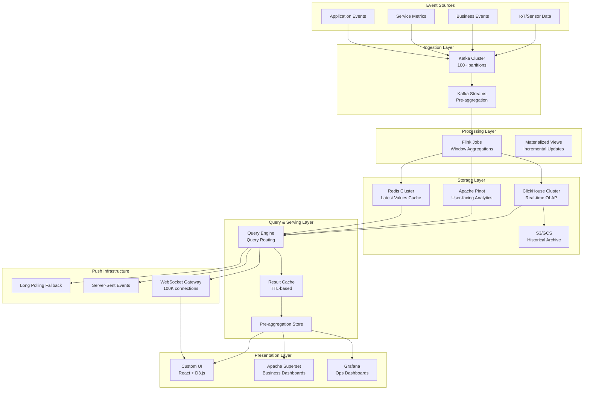

# Real-Time Dashboard Architecture (Ops/Business)

## Problem Statement

At billion-scale operations, business and engineering teams need dashboards that reflect the current state of systems and KPIs within seconds—not minutes. Traditional BI tools polling relational databases collapse under 1000+ concurrent users viewing dashboards with sub-second refresh requirements. The challenge: deliver real-time visibility across 100K+ metrics to thousands of simultaneous viewers without overwhelming backend data stores.

## Architecture Diagram



## Component Breakdown

### 1. Event Ingestion (Kafka)

```yaml
# Kafka cluster configuration for dashboard ingestion
kafka_cluster:
  brokers: 12
  partitions_per_topic: 128
  replication_factor: 3
  retention_hours: 72
  throughput: 2M events/sec

topics:
  - name: "events.raw.business"
    partitions: 64
    key: "tenant_id"
  - name: "events.raw.operational"
    partitions: 128
    key: "service_name"
  - name: "events.aggregated.1m"
    partitions: 32
    key: "metric_name"
```

### 2. Pre-Aggregation (Flink)

```java
// Flink streaming aggregation for dashboard metrics
DataStream<MetricEvent> events = env
    .addSource(new KafkaSource<>("events.raw.operational"))
    .keyBy(event -> event.getMetricKey())
    .window(TumblingProcessingTimeWindows.of(Time.seconds(10)))
    .aggregate(new MetricAggregator());

// Multi-window aggregation for different dashboard granularities
events
    .keyBy(MetricEvent::getDimension)
    .window(TumblingEventTimeWindows.of(Time.minutes(1)))
    .allowedLateness(Time.seconds(30))
    .aggregate(new DashboardAggregator())
    .addSink(new ClickHouseSink("metrics_1m"));

// Real-time counters pushed to Redis
events
    .keyBy(MetricEvent::getCounterKey)
    .process(new RealTimeCounterProcess())
    .addSink(new RedisSink());
```

### 3. ClickHouse Storage

```sql
-- ClickHouse table for real-time dashboard metrics
CREATE TABLE dashboard_metrics ON CLUSTER '{cluster}'
(
    timestamp DateTime64(3),
    metric_name LowCardinality(String),
    dimensions Map(String, String),
    value Float64,
    count UInt64,
    min Float64,
    max Float64,
    sum Float64,
    p50 Float64,
    p95 Float64,
    p99 Float64
)
ENGINE = ReplicatedMergeTree('/clickhouse/{cluster}/dashboard_metrics/{shard}', '{replica}')
PARTITION BY toDate(timestamp)
ORDER BY (metric_name, timestamp)
TTL timestamp + INTERVAL 30 DAY
SETTINGS index_granularity = 8192;

-- Materialized view for 1-minute rollups
CREATE MATERIALIZED VIEW dashboard_metrics_1m
ENGINE = ReplicatedAggregatingMergeTree
ORDER BY (metric_name, timestamp_1m)
AS SELECT
    toStartOfMinute(timestamp) AS timestamp_1m,
    metric_name,
    dimensions,
    avgState(value) AS avg_value,
    maxState(value) AS max_value,
    countState() AS event_count
FROM dashboard_metrics
GROUP BY timestamp_1m, metric_name, dimensions;
```

### 4. Apache Pinot (User-Facing)

```json
{
  "tableName": "business_metrics_REALTIME",
  "tableType": "REALTIME",
  "segmentsConfig": {
    "timeColumnName": "timestamp",
    "replication": "3",
    "retentionTimeUnit": "DAYS",
    "retentionTimeValue": "7"
  },
  "tableIndexConfig": {
    "starTreeIndexConfigs": [{
      "dimensionsSplitOrder": ["country", "product", "channel"],
      "functionColumnPairs": ["SUM__revenue", "COUNT__orders"],
      "maxLeafRecords": 10000
    }],
    "sortedColumn": ["timestamp"],
    "invertedIndexColumns": ["country", "product"]
  },
  "ingestionConfig": {
    "streamIngestionConfig": {
      "streamConfigMaps": [{
        "streamType": "kafka",
        "stream.kafka.topic.name": "events.aggregated.1m",
        "stream.kafka.broker.list": "kafka:9092",
        "realtime.segment.flush.threshold.rows": "500000"
      }]
    }
  }
}
```

### 5. WebSocket Push Infrastructure

```typescript
// WebSocket gateway for real-time dashboard updates
class DashboardWebSocketGateway {
  private subscriptions: Map<string, Set<WebSocket>> = new Map();
  private redisSubscriber: Redis;

  constructor() {
    this.redisSubscriber = new Redis({ host: 'redis-cluster' });
    this.redisSubscriber.psubscribe('dashboard:*');
    this.redisSubscriber.on('pmessage', this.broadcastUpdate.bind(this));
  }

  handleConnection(ws: WebSocket, dashboardId: string) {
    // Register subscription
    if (!this.subscriptions.has(dashboardId)) {
      this.subscriptions.set(dashboardId, new Set());
    }
    this.subscriptions.get(dashboardId)!.add(ws);

    // Send initial state
    this.sendInitialState(ws, dashboardId);

    // Heartbeat
    const interval = setInterval(() => ws.ping(), 30000);
    ws.on('close', () => {
      clearInterval(interval);
      this.subscriptions.get(dashboardId)?.delete(ws);
    });
  }

  private broadcastUpdate(pattern: string, channel: string, message: string) {
    const dashboardId = channel.replace('dashboard:', '');
    const subscribers = this.subscriptions.get(dashboardId);
    if (!subscribers) return;

    const payload = JSON.stringify({
      type: 'metric_update',
      data: JSON.parse(message),
      timestamp: Date.now()
    });

    subscribers.forEach(ws => {
      if (ws.readyState === WebSocket.OPEN) {
        ws.send(payload);
      }
    });
  }
}
```

## Refresh Strategies

### Polling vs Push Decision Matrix

| Scenario | Strategy | Latency | Cost |
|----------|----------|---------|------|
| Ops dashboards (NOC) | WebSocket push | <1s | High (persistent connections) |
| Business KPIs | SSE push | 1-5s | Medium |
| Historical reports | Polling (30s) | 30s | Low |
| Ad-hoc exploration | On-demand query | Variable | Pay-per-query |
| Mobile dashboards | Long polling | 5-10s | Low |

### Hybrid Approach

```python
# Smart refresh strategy based on dashboard characteristics
class RefreshStrategy:
    def determine_strategy(self, dashboard: Dashboard) -> str:
        if dashboard.has_real_time_panels and dashboard.active_viewers > 0:
            return "websocket_push"
        elif dashboard.refresh_interval < 10:
            return "sse_push"
        elif dashboard.is_background_tab:
            return "pause_until_focus"
        else:
            return "polling"

    def optimize_push_frequency(self, panel: Panel, viewer_count: int):
        # Batch updates when many viewers watch same dashboard
        if viewer_count > 100:
            return max(panel.min_refresh, 5)  # Min 5s for popular dashboards
        return panel.min_refresh
```

## Drill-Down Support

```sql
-- Tiered aggregation for drill-down
-- Level 0: Global (pre-computed every 10s)
SELECT sum(revenue), count(orders) FROM metrics_10s WHERE timestamp > now() - 1h;

-- Level 1: By dimension (pre-computed every 1m)
SELECT country, sum(revenue) FROM metrics_1m WHERE timestamp > now() - 1h GROUP BY country;

-- Level 2: By sub-dimension (computed on-demand, cached 30s)
SELECT country, city, product, sum(revenue)
FROM metrics_raw
WHERE timestamp > now() - 1h AND country = 'US'
GROUP BY country, city, product;
```

## Scaling Strategies

### Horizontal Scaling

| Component | Scale Trigger | Action |
|-----------|--------------|--------|
| WebSocket Gateway | >50K connections/node | Add gateway nodes behind L4 LB |
| ClickHouse | Query latency >500ms | Add shards, increase replicas |
| Pinot | Segment scan time >200ms | Add servers, tune star-tree index |
| Redis Cache | Memory >80% | Scale cluster, adjust TTLs |
| Flink | Backpressure >60% | Increase parallelism |

### Connection Management

```yaml
# WebSocket gateway scaling
websocket_gateway:
  instances: 20
  max_connections_per_instance: 50000
  total_capacity: 1_000_000
  load_balancer: "HAProxy with sticky sessions"
  connection_draining_timeout: 30s
  heartbeat_interval: 30s
  max_message_size: 64KB
```

## Failure Handling

| Failure | Detection | Recovery |
|---------|-----------|----------|
| WebSocket disconnect | Heartbeat timeout | Auto-reconnect with exponential backoff |
| ClickHouse node down | Health check (5s) | Route to replica, alert if >1 node |
| Flink job failure | Checkpoint timeout | Restart from last checkpoint |
| Cache miss storm | Hit rate <80% | Circuit breaker + direct DB query limit |
| Kafka lag spike | Consumer lag >10K | Scale consumers, alert on >100K |

## Cost Optimization

```yaml
cost_model:
  clickhouse_cluster:
    nodes: 12 (r6g.4xlarge)
    monthly: $18,000
    optimization: "Tiered storage - hot/warm/cold"

  pinot_cluster:
    nodes: 8 (r6g.2xlarge)
    monthly: $8,000
    optimization: "Star-tree indexes reduce query cost 10x"

  websocket_infrastructure:
    gateways: 20 (c6g.xlarge)
    monthly: $6,000
    optimization: "Connection pooling, idle timeout 5min"

  kafka:
    brokers: 12 (m6g.2xlarge)
    monthly: $12,000
    optimization: "Tiered storage, compact old topics"

  total_monthly: ~$50,000
  cost_per_dashboard_user: $50/month
  cost_per_metric: $0.001/month
```

## Real-World Companies

| Company | Scale | Stack |
|---------|-------|-------|
| **Uber** | 100K+ metrics, real-time | Kafka → Flink → Pinot → Custom UI |
| **LinkedIn** | 2M metrics/sec | Kafka → Samza → Pinot → Grafana |
| **Netflix** | Billions of events/day | Kafka → Flink → Druid → Custom Atlas |
| **Cloudflare** | 1M+ dashboard users | Kafka → ClickHouse → Grafana |
| **Stripe** | Financial real-time KPIs | Kafka → Flink → ClickHouse → Custom |
| **Datadog** | 10T+ data points/day | Custom ingestion → Custom TSDB → Custom UI |

## Key Design Decisions

1. **Pre-aggregate aggressively** — 90% of dashboard queries hit pre-computed rollups
2. **Push over poll for <10s latency** — WebSocket for ops, SSE for business
3. **Separate stores for OLAP vs real-time** — ClickHouse for analytics, Redis for latest-value
4. **Fan-out at the edge** — One DB query serves 1000 viewers via broadcast
5. **Graceful degradation** — Fall back to polling if push infrastructure fails
