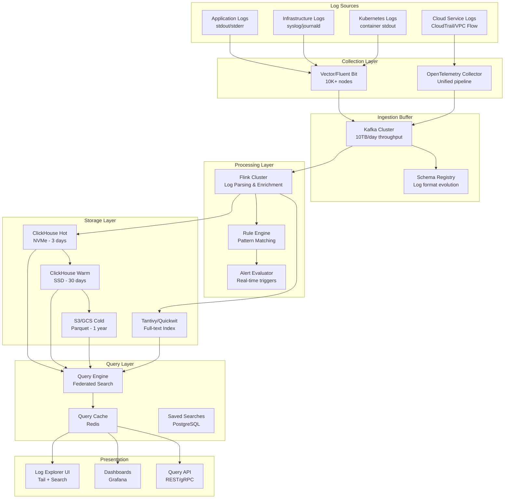

# Log Analytics Platform at Scale (ELK Alternative)

## Problem Statement

At 10TB+ logs/day, the traditional ELK (Elasticsearch, Logstash, Kibana) stack becomes prohibitively expensive and operationally complex. Elasticsearch's inverted index storage amplifies raw log size by 2-3x, JVM garbage collection causes query latency spikes, and cluster management at scale requires dedicated teams. Organizations need a cost-effective platform that handles full-text search, structured analytics, real-time alerting, and long-term retention without the operational burden of managing massive Elasticsearch clusters.

## Architecture Diagram



## Component Breakdown

### 1. Log Collection (Vector)

```toml
# vector.toml - High-performance log collector
[sources.kubernetes_logs]
type = "kubernetes_logs"
auto_partial_merge = true
max_line_bytes = 65536

[transforms.parse_structured]
type = "remap"
inputs = ["kubernetes_logs"]
source = '''
  # Parse JSON logs
  parsed, err = parse_json(.message)
  if err == null {
    . = merge(., parsed)
  }

  # Extract timestamp
  .timestamp = parse_timestamp!(.timestamp, format: "%+")

  # Add metadata
  .cluster = get_env_var!("CLUSTER_NAME")
  .environment = get_env_var!("ENVIRONMENT")

  # Classify log level
  .level = downcase(.level) ?? "info"

  # Truncate oversized messages
  if length(.message) > 16384 {
    .message = slice!(.message, start: 0, end: 16384)
    .truncated = true
  }
'''

[transforms.sample_debug]
type = "sample"
inputs = ["parse_structured"]
rate = 10  # Keep 1 in 10 debug logs
condition.type = "vrl"
condition.source = '.level == "debug"'

[transforms.route_by_level]
type = "route"
inputs = ["sample_debug"]
[transforms.route_by_level.route]
error = '.level == "error" || .level == "fatal"'
warning = '.level == "warn"'
info = '.level == "info" || .level == "debug"'

[sinks.kafka_errors]
type = "kafka"
inputs = ["route_by_level.error"]
bootstrap_servers = "kafka:9092"
topic = "logs.error"
encoding.codec = "json"
buffer.max_events = 10000
batch.timeout_secs = 1

[sinks.kafka_all]
type = "kafka"
inputs = ["route_by_level._unmatched", "route_by_level.info", "route_by_level.warning"]
bootstrap_servers = "kafka:9092"
topic = "logs.all"
encoding.codec = "json"
compression = "zstd"
buffer.max_events = 50000
batch.timeout_secs = 5
```

### 2. Flink Log Processing

```java
public class LogParsingJob {
    public static void main(String[] args) {
        StreamExecutionEnvironment env = StreamExecutionEnvironment.getExecutionEnvironment();
        env.setParallelism(64);
        env.enableCheckpointing(60000, CheckpointingMode.AT_LEAST_ONCE);

        DataStream<LogEvent> rawLogs = env
            .addSource(new KafkaSource<>("logs.all", new LogEventDeserializer()))
            .name("kafka-source");

        // Multi-pattern parsing pipeline
        DataStream<ParsedLog> parsed = rawLogs
            .process(new LogParsingFunction())  // Grok + regex + JSON
            .name("log-parser");

        // Enrichment with service metadata
        DataStream<EnrichedLog> enriched = parsed
            .keyBy(ParsedLog::getServiceName)
            .connect(serviceMetadataStream.broadcast(serviceStateDesc))
            .process(new EnrichmentFunction())
            .name("enrichment");

        // Error pattern detection
        enriched
            .filter(log -> log.getLevel().equals("error"))
            .keyBy(EnrichedLog::getErrorPattern)
            .window(TumblingProcessingTimeWindows.of(Time.minutes(1)))
            .aggregate(new ErrorRateAggregator())
            .filter(rate -> rate.getCount() > threshold)
            .addSink(new AlertSink());

        // Write to ClickHouse
        enriched.addSink(new ClickHouseSink<>("logs", 50000, Duration.ofSeconds(5)));
    }
}

// Grok-based log parser supporting multiple formats
public class LogParsingFunction extends ProcessFunction<LogEvent, ParsedLog> {
    private final List<GrokPattern> patterns = Arrays.asList(
        new GrokPattern("nginx", "%{IPORHOST:client_ip} .* \\[%{HTTPDATE:timestamp}\\] \"%{WORD:method} %{URIPATH:path}"),
        new GrokPattern("java_exception", "%{TIMESTAMP_ISO8601:timestamp} %{LOGLEVEL:level} .* - %{GREEDYDATA:message}"),
        new GrokPattern("json", "\\{.*\\}")
    );

    @Override
    public void processElement(LogEvent event, Context ctx, Collector<ParsedLog> out) {
        for (GrokPattern pattern : patterns) {
            ParsedLog result = pattern.tryParse(event);
            if (result != null) {
                out.collect(result);
                return;
            }
        }
        // Fallback: treat as unstructured
        out.collect(ParsedLog.unstructured(event));
    }
}
```

### 3. ClickHouse Storage Schema

```sql
-- Hot tier: NVMe storage, 3-day retention
CREATE TABLE logs ON CLUSTER '{cluster}'
(
    timestamp DateTime64(3),
    level LowCardinality(String),
    service LowCardinality(String),
    environment LowCardinality(String),
    host LowCardinality(String),
    trace_id String,
    span_id String,
    message String,
    attributes Map(String, String),
    -- Bloom filter for full-text search
    message_tokens Array(String) MATERIALIZED splitByNonAlpha(lower(message))
)
ENGINE = ReplicatedMergeTree('/clickhouse/{cluster}/logs/{shard}', '{replica}')
PARTITION BY toDate(timestamp)
ORDER BY (service, level, timestamp)
TTL timestamp + INTERVAL 3 DAY TO VOLUME 'warm',
    timestamp + INTERVAL 30 DAY TO VOLUME 'cold',
    timestamp + INTERVAL 365 DAY DELETE
SETTINGS
    index_granularity = 8192,
    storage_policy = 'tiered';

-- Bloom filter index for log search
ALTER TABLE logs ADD INDEX idx_message message_tokens TYPE bloom_filter(0.01) GRANULARITY 4;
ALTER TABLE logs ADD INDEX idx_trace trace_id TYPE bloom_filter(0.001) GRANULARITY 1;

-- Materialized view for error rate metrics
CREATE MATERIALIZED VIEW log_error_rates
ENGINE = ReplicatedAggregatingMergeTree
ORDER BY (service, minute)
AS SELECT
    toStartOfMinute(timestamp) AS minute,
    service,
    countState() AS total_count,
    countIfState(level = 'error') AS error_count,
    uniqState(host) AS host_count
FROM logs
GROUP BY minute, service;
```

### 4. Full-Text Search (Quickwit)

```yaml
# quickwit.yaml - Rust-based full-text search engine
version: 0.7
index_id: logs
doc_mapping:
  field_mappings:
    - name: timestamp
      type: datetime
      fast: true
    - name: message
      type: text
      tokenizer: default
      record: position  # Enable phrase queries
    - name: service
      type: text
      tokenizer: raw
      fast: true
    - name: level
      type: text
      tokenizer: raw
      fast: true
    - name: trace_id
      type: text
      tokenizer: raw
  timestamp_field: timestamp

indexing_settings:
  commit_timeout_secs: 30
  merge_policy:
    type: stable_log
    min_level_num_docs: 100000
    merge_factor: 10

search_settings:
  default_search_fields:
    - message
```

### 5. Retention Tiers

```yaml
retention_policy:
  hot_tier:
    storage: NVMe SSD
    duration: 3 days
    query_latency: <100ms
    cost_per_tb: $200/month

  warm_tier:
    storage: SSD (gp3)
    duration: 30 days
    query_latency: <1s
    cost_per_tb: $50/month

  cold_tier:
    storage: S3 + Parquet
    duration: 365 days
    query_latency: 5-30s
    cost_per_tb: $5/month
    format: "Parquet with ZSTD compression"
    partition_by: "service/date"

  archive_tier:
    storage: S3 Glacier
    duration: 7 years (compliance)
    query_latency: hours
    cost_per_tb: $1/month
```

## Alert Rules

```yaml
# Alert rule configuration
alert_rules:
  - name: "high_error_rate"
    query: "level:error AND service:{service}"
    window: 5m
    threshold:
      type: percentage
      value: 5  # >5% error rate
      baseline: "total logs for service"
    severity: critical
    destinations: ["pagerduty", "slack"]

  - name: "new_error_pattern"
    type: anomaly
    description: "Previously unseen error message pattern"
    model: "error_fingerprint_clustering"
    sensitivity: medium
    destinations: ["slack"]

  - name: "log_volume_spike"
    query: "service:{service}"
    window: 10m
    threshold:
      type: "stddev"
      multiplier: 3
      baseline_window: 7d
    severity: warning
```

## Scaling Strategies

| Component | 1TB/day | 10TB/day | 50TB/day |
|-----------|---------|----------|----------|
| Vector agents | 500 nodes | 5000 nodes | 25000 nodes |
| Kafka brokers | 6 | 24 | 60 |
| Flink TMs | 16 | 64 | 200 |
| ClickHouse nodes | 6 | 24 | 60 |
| Quickwit nodes | 4 | 16 | 40 |

### ClickHouse Sharding

```sql
-- Distributed table across shards
CREATE TABLE logs_distributed ON CLUSTER '{cluster}'
AS logs
ENGINE = Distributed('{cluster}', 'default', 'logs', sipHash64(service));
```

## Failure Handling

| Failure | Impact | Mitigation |
|---------|--------|------------|
| Collector crash | Log gap | DaemonSet auto-restart, file-based buffer |
| Kafka broker loss | Temporary slowdown | Replication factor 3, ISR ≥ 2 |
| Flink job failure | Processing delay | Checkpoint restart, Kafka retention = 72h |
| ClickHouse node down | Query degradation | 2 replicas per shard, automatic failover |
| Full-text index lag | Search delay | Graceful degradation to ClickHouse LIKE |

## Cost Optimization

```yaml
cost_at_10tb_per_day:
  ingestion:
    kafka: $15,000/month  # 24 brokers
    flink: $8,000/month   # 64 task managers

  storage:
    clickhouse_hot: $12,000/month   # 3 days × 10TB (compressed 5:1)
    clickhouse_warm: $8,000/month   # 30 days
    s3_cold: $3,000/month           # 365 days
    quickwit: $6,000/month          # 7-day full-text index

  query:
    query_nodes: $4,000/month
    cache: $2,000/month

  total: ~$58,000/month
  vs_elasticsearch: ~$250,000/month  # 4.3x cheaper
  cost_per_gb_ingested: $0.19
```

## Real-World Companies

| Company | Scale | Stack |
|---------|-------|-------|
| **Cloudflare** | 30TB logs/day | Kafka → custom → ClickHouse |
| **Uber** | 100+ PB stored | Kafka → Flink → HDFS/ClickHouse |
| **Coinbase** | Multi-TB/day | Vector → Kafka → ClickHouse |
| **GitLab** | 10TB/day | Fluentd → Kafka → ClickHouse (replaced ES) |
| **Booking.com** | 50TB/day | Custom → Kafka → ClickHouse |
| **Spotify** | Massive scale | Custom → GCS → BigQuery |

## Key Design Decisions

1. **ClickHouse over Elasticsearch** — 5-10x cheaper storage, faster analytical queries
2. **Separate full-text from analytics** — Quickwit for grep-style search, ClickHouse for aggregations
3. **Parse at ingestion** — Structured logs query 10x faster than raw text search
4. **Sample debug logs** — Keep 10% of debug, 100% of error/warn
5. **Tiered retention** — 95% of queries hit last 3 days, cold storage for compliance
