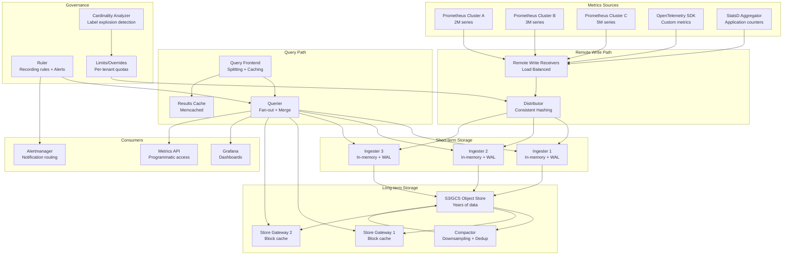

# Metrics Aggregation Pipeline (Prometheus at Scale)

## Problem Statement

A single Prometheus instance handles ~10M active time-series before hitting memory limits. At enterprise scale with 10M+ time-series across hundreds of clusters, challenges include: global querying across federated instances, long-term storage beyond local disk retention, cardinality explosions from dynamic labels (container IDs, request IDs), multi-tenant isolation, and maintaining sub-second query performance over months of historical data. The solution requires a horizontally scalable metrics pipeline with a unified global view.

## Architecture Diagram



## Component Breakdown

### 1. Cortex/Mimir Architecture

```yaml
# Grafana Mimir configuration
mimir:
  target: all  # Or individual components

  distributor:
    ring:
      kvstore:
        store: memberlist
    ha_tracker:
      enable_ha_tracker: true
      kvstore:
        store: consul

  ingester:
    ring:
      replication_factor: 3
      kvstore:
        store: memberlist
    instance_limits:
      max_series: 5000000
      max_ingestion_rate: 500000

  limits:
    max_global_series_per_user: 10000000
    max_label_names_per_series: 30
    max_label_value_length: 2048
    ingestion_rate: 1000000
    ingestion_burst_size: 2000000
    max_fetched_series_per_query: 500000
    max_fetched_chunks_per_query: 2000000
    compactor_blocks_retention_period: 365d

  blocks_storage:
    backend: s3
    s3:
      bucket_name: metrics-blocks
      endpoint: s3.us-east-1.amazonaws.com
    tsdb:
      block_ranges_period: [2h]
      retention_period: 24h
      ship_interval: 1m

  compactor:
    sharding_ring:
      kvstore:
        store: memberlist
    data_dir: /data/compactor
    compaction_interval: 1h
    deletion_delay: 12h

  store_gateway:
    sharding_ring:
      replication_factor: 2
    bucket_store:
      sync_interval: 15m
      index_cache:
        backend: memcached
        memcached:
          addresses: memcached:11211
          max_item_size: 5MB
      chunks_cache:
        backend: memcached
        memcached:
          addresses: memcached:11211

  query_frontend:
    align_queries_with_step: true
    cache_results: true
    results_cache:
      backend: memcached
      memcached:
        addresses: memcached:11211
    split_queries_by_interval: 24h
    max_retries: 5
```

### 2. Thanos Architecture (Alternative)

```yaml
# Thanos sidecar + global query
thanos:
  sidecar:
    prometheus_url: "http://localhost:9090"
    objstore_config:
      type: S3
      config:
        bucket: thanos-metrics
        endpoint: s3.amazonaws.com
        access_key: ${AWS_ACCESS_KEY}
        secret_key: ${AWS_SECRET_KEY}

  query:
    stores:
      - "dnssrv+_grpc._tcp.thanos-store.monitoring.svc"
      - "dnssrv+_grpc._tcp.thanos-sidecar.monitoring.svc"
    replica_labels: ["prometheus_replica"]
    auto_downsampling: true
    partial_response: true

  compactor:
    retention:
      resolution_raw: 30d
      resolution_5m: 180d
      resolution_1h: 365d
    consistency_delay: 30m
    downsample:
      concurrency: 4

  store:
    index_cache_size: 4GB
    chunk_pool_size: 8GB
    max_time: -2h  # Don't serve recent data (sidecars handle it)
```

### 3. Cardinality Management

```python
# Cardinality analysis and enforcement
class CardinalityManager:
    def __init__(self, mimir_client, limits_db):
        self.mimir = mimir_client
        self.limits = limits_db

    def analyze_cardinality(self, tenant_id: str) -> CardinalityReport:
        """Identify series contributing most to cardinality."""
        # Get top cardinality labels
        result = self.mimir.query(f'''
            topk(20,
                count by (__name__)({'{__name__=~".+"}'}))
        ''', tenant=tenant_id)

        # Identify label explosion
        high_cardinality_labels = []
        for metric in result:
            label_analysis = self.mimir.query(f'''
                count(
                    count by ({{label}})({metric.name})
                )
            ''', tenant=tenant_id)

            for label, count in label_analysis.items():
                if count > 10000:
                    high_cardinality_labels.append({
                        'metric': metric.name,
                        'label': label,
                        'cardinality': count,
                        'recommendation': self._get_recommendation(label, count)
                    })

        return CardinalityReport(
            total_series=self._get_total_series(tenant_id),
            top_metrics=result,
            high_cardinality_labels=high_cardinality_labels
        )

    def enforce_limits(self, tenant_id: str, max_series: int):
        """Drop metrics exceeding cardinality budget."""
        relabel_configs = [
            {
                'source_labels': ['__name__'],
                'regex': 'debug_.*',
                'action': 'drop'
            },
            {
                'source_labels': ['container_id'],
                'action': 'labeldrop'  # Remove high-cardinality label
            }
        ]
        self.limits.set_relabel_configs(tenant_id, relabel_configs)
```

### 4. Downsampling Strategy

```yaml
downsampling:
  # Raw resolution: 15s scrape interval
  raw:
    retention: 30 days
    storage_per_series: ~100KB/day

  # 5-minute resolution
  5m:
    aggregations: [min, max, sum, count]
    retention: 180 days
    storage_reduction: 20x
    storage_per_series: ~5KB/day

  # 1-hour resolution
  1h:
    aggregations: [min, max, sum, count]
    retention: 2 years
    storage_reduction: 240x
    storage_per_series: ~0.4KB/day

  # Storage calculation for 10M series
  total_storage:
    raw_30d: "10M × 100KB × 30 = 30TB"
    5m_180d: "10M × 5KB × 180 = 9TB"
    1h_730d: "10M × 0.4KB × 730 = 2.9TB"
    total: "~42TB in object storage"
```

### 5. Multi-Tenancy

```yaml
# Per-tenant configuration
tenants:
  team_platform:
    max_series: 5000000
    ingestion_rate: 500000/s
    query_concurrency: 32
    retention: 365d
    priority: high

  team_product:
    max_series: 2000000
    ingestion_rate: 200000/s
    query_concurrency: 16
    retention: 180d
    priority: medium

  team_experimental:
    max_series: 500000
    ingestion_rate: 50000/s
    query_concurrency: 4
    retention: 30d
    priority: low
    # Cost-saving: aggressive downsampling
    downsample_raw_after: 7d
```

## Recording Rules for Performance

```yaml
# Recording rules to pre-compute expensive queries
groups:
  - name: service_slos
    interval: 30s
    rules:
      - record: service:request_duration:p99_5m
        expr: histogram_quantile(0.99, sum(rate(http_request_duration_seconds_bucket[5m])) by (le, service))

      - record: service:error_rate:ratio_5m
        expr: |
          sum(rate(http_requests_total{status=~"5.."}[5m])) by (service)
          /
          sum(rate(http_requests_total[5m])) by (service)

      - record: service:availability:ratio_5m
        expr: 1 - service:error_rate:ratio_5m

  - name: infrastructure
    interval: 1m
    rules:
      - record: node:cpu:utilization_avg_5m
        expr: 1 - avg(rate(node_cpu_seconds_total{mode="idle"}[5m])) by (node)

      - record: cluster:memory:utilization
        expr: |
          sum(container_memory_usage_bytes) by (cluster)
          /
          sum(machine_memory_bytes) by (cluster)
```

## Scaling Strategies

| Component | Scaling Method | Trigger |
|-----------|---------------|---------|
| Distributor | Horizontal, stateless | Ingestion rate >80% capacity |
| Ingester | Horizontal + resharding | Series per ingester >5M |
| Store Gateway | Horizontal, shard blocks | Query latency >2s on cold data |
| Query Frontend | Horizontal, stateless | Query queue depth >100 |
| Compactor | Vertical (CPU-bound) | Compaction lag >4h |

### Deployment Sizing

```yaml
# 10M active series deployment
cluster_sizing:
  distributors:
    replicas: 6
    cpu: 4 cores
    memory: 8GB

  ingesters:
    replicas: 12
    cpu: 8 cores
    memory: 32GB  # Holds 2h of data in-memory
    disk: 100GB NVMe (WAL)

  store_gateways:
    replicas: 6
    cpu: 4 cores
    memory: 16GB  # Block index cache

  compactors:
    replicas: 3
    cpu: 8 cores
    memory: 16GB
    disk: 500GB SSD (temporary)

  query_frontends:
    replicas: 4
    cpu: 2 cores
    memory: 4GB

  queriers:
    replicas: 8
    cpu: 4 cores
    memory: 16GB

  memcached:
    index_cache: 3 × 16GB
    chunks_cache: 6 × 32GB
    results_cache: 3 × 8GB
```

## Failure Handling

| Failure | Impact | Recovery |
|---------|--------|----------|
| Ingester crash | Potential data loss (last few seconds) | WAL replay, replication factor 3 |
| S3 outage | No long-term queries | Ingesters buffer, queries return partial |
| Compactor stuck | Growing storage, slower queries | Alert on lag, manual intervention |
| Query timeout | User-facing error | Split query, increase resources |
| Cardinality explosion | OOM on ingesters | Auto-drop via relabel, alert team |

## Cost Optimization

```yaml
cost_model_10m_series:
  compute:
    ingesters: $8,000/month    # 12 × r6g.2xlarge
    store_gateways: $3,600/month
    compactors: $2,400/month
    queriers: $4,800/month
    other: $3,200/month

  storage:
    s3: $1,000/month           # 42TB × $0.023/GB
    s3_requests: $500/month

  cache:
    memcached: $4,500/month    # 12 nodes

  total: ~$28,000/month
  cost_per_series: $0.0028/month

  optimizations:
    - "Drop unused metrics (saves 20-40%)"
    - "Aggressive downsampling for old data"
    - "Recording rules replace repeated expensive queries"
    - "Query result caching (80%+ hit rate)"
```

## Real-World Companies

| Company | Scale | Stack |
|---------|-------|-------|
| **Grafana Labs** | Multi-billion series (hosted) | Mimir (built it) |
| **Apple** | Massive internal | Thanos + custom |
| **Shopify** | 100M+ series | Thanos |
| **DigitalOcean** | 10M+ series | Cortex → Mimir |
| **Wise** | Multi-cluster global | Thanos with global query |
| **Red Hat** | OpenShift customers | Thanos (built into product) |

## Key Design Decisions

1. **Mimir over Thanos** for greenfield — simpler operations, better multi-tenancy
2. **Object storage as source of truth** — infinitely scalable, cheap, durable
3. **Recording rules aggressively** — pre-compute dashboard queries, 100x speedup
4. **Cardinality limits are non-negotiable** — one runaway label can OOM the cluster
5. **Cache everything** — index, chunks, and query results; 80%+ cache hit target
