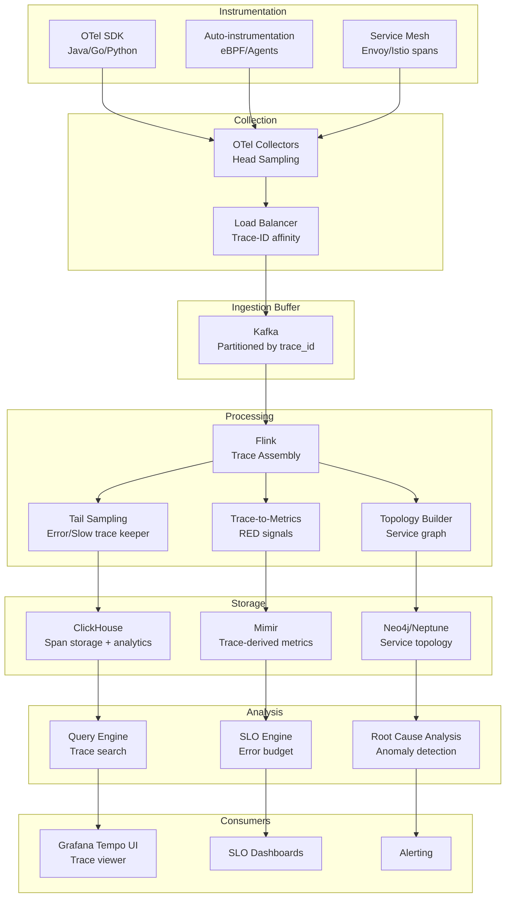

# Distributed Tracing Analytics Pipeline

## Problem Statement

At 1M+ spans/sec, distributed tracing becomes both indispensable and unmanageable. Full-fidelity trace storage is prohibitively expensive ($100K+/month), yet sampling too aggressively means missing critical error traces. The challenge: ingest millions of spans per second, assemble them into complete traces, store them cost-effectively with intelligent sampling, and enable analytics like SLO computation, service dependency mapping, and latency breakdown—all while keeping query latency under seconds.

## Architecture Diagram



## Component Breakdown

### 1. OpenTelemetry Collection with Head Sampling

```yaml
# otel-collector-config.yaml
receivers:
  otlp:
    protocols:
      grpc:
        endpoint: 0.0.0.0:4317
        max_recv_msg_size_mib: 16
      http:
        endpoint: 0.0.0.0:4318

processors:
  batch:
    send_batch_size: 10000
    timeout: 5s

  # Head sampling: probabilistic at collection time
  probabilistic_sampler:
    hash_seed: 42
    sampling_percentage: 10  # Keep 10% of traces

  # Always keep error/slow traces
  tail_sampling:
    decision_wait: 10s
    policies:
      - name: errors
        type: status_code
        status_code: {status_codes: [ERROR]}
      - name: slow-requests
        type: latency
        latency: {threshold_ms: 5000}
      - name: probabilistic
        type: probabilistic
        probabilistic: {sampling_percentage: 5}

  resource:
    attributes:
      - key: cluster
        value: "prod-us-east-1"
        action: upsert

exporters:
  kafka:
    brokers: ["kafka-1:9092", "kafka-2:9092"]
    topic: "spans"
    encoding: otlp_proto
    producer:
      compression: zstd
      max_message_bytes: 10485760

service:
  pipelines:
    traces:
      receivers: [otlp]
      processors: [batch, resource, tail_sampling]
      exporters: [kafka]
```

### 2. Flink Trace Assembly

```java
public class TraceAssemblyJob {
    public static void main(String[] args) {
        StreamExecutionEnvironment env = StreamExecutionEnvironment.getExecutionEnvironment();
        env.setParallelism(128);

        DataStream<Span> spans = env
            .addSource(new KafkaSource<>("spans", new SpanDeserializer()))
            .assignTimestampsAndWatermarks(
                WatermarkStrategy.<Span>forBoundedOutOfOrderness(Duration.ofSeconds(30))
                    .withTimestampAssigner((span, ts) -> span.getStartTimeUnixNano() / 1_000_000)
            );

        // Assemble traces using session windows
        DataStream<Trace> traces = spans
            .keyBy(Span::getTraceId)
            .window(EventTimeSessionWindows.withGap(Time.seconds(60)))
            .allowedLateness(Time.minutes(5))
            .process(new TraceAssemblyFunction());

        // Tail sampling on assembled traces
        DataStream<Trace> sampled = traces
            .process(new TailSamplingFunction());

        // Trace-to-metrics: compute RED signals
        DataStream<MetricPoint> metrics = traces
            .flatMap(new TraceToMetricsMapper());

        // Topology extraction
        DataStream<ServiceEdge> topology = traces
            .flatMap(new TopologyExtractor());

        sampled.addSink(new ClickHouseSink<>("traces"));
        metrics.addSink(new PromRemoteWriteSink());
        topology.addSink(new GraphDBSink());
    }
}

// Tail sampling: keep interesting traces
public class TailSamplingFunction extends ProcessFunction<Trace, Trace> {
    @Override
    public void processElement(Trace trace, Context ctx, Collector<Trace> out) {
        boolean keep = false;

        // Always keep errors
        if (trace.hasErrorSpan()) keep = true;
        // Always keep slow traces (>p99)
        else if (trace.getDuration() > getP99Threshold(trace.getRootService())) keep = true;
        // Keep traces touching critical services
        else if (trace.touchesService("payment-service")) keep = true;
        // Probabilistic for the rest
        else if (ThreadLocalRandom.current().nextDouble() < 0.01) keep = true;

        if (keep) out.collect(trace);
    }
}

// Extract RED metrics from every trace (before sampling)
public class TraceToMetricsMapper implements FlatMapFunction<Trace, MetricPoint> {
    @Override
    public void flatMap(Trace trace, Collector<MetricPoint> out) {
        for (Span span : trace.getSpans()) {
            if (span.getKind() == SpanKind.SERVER) {
                // Rate
                out.collect(new MetricPoint("traces_total",
                    Map.of("service", span.getService(), "operation", span.getOperation()),
                    1.0, span.getEndTime()));

                // Error
                if (span.getStatus() == StatusCode.ERROR) {
                    out.collect(new MetricPoint("traces_errors_total",
                        Map.of("service", span.getService(), "operation", span.getOperation()),
                        1.0, span.getEndTime()));
                }

                // Duration histogram
                out.collect(new MetricPoint("traces_duration_seconds",
                    Map.of("service", span.getService(), "operation", span.getOperation()),
                    span.getDurationMs() / 1000.0, span.getEndTime()));
            }
        }
    }
}
```

### 3. ClickHouse Storage

```sql
CREATE TABLE spans ON CLUSTER '{cluster}'
(
    trace_id FixedString(32),
    span_id FixedString(16),
    parent_span_id FixedString(16),
    service_name LowCardinality(String),
    operation_name LowCardinality(String),
    span_kind LowCardinality(String),
    start_time DateTime64(9),
    duration_ns UInt64,
    status_code LowCardinality(String),
    status_message String,
    attributes Map(String, String),
    resource_attributes Map(String, String),
    events Nested(
        timestamp DateTime64(9),
        name String,
        attributes Map(String, String)
    ),
    links Nested(
        trace_id FixedString(32),
        span_id FixedString(16)
    )
)
ENGINE = ReplicatedMergeTree
PARTITION BY toDate(start_time)
ORDER BY (service_name, operation_name, start_time, trace_id)
TTL start_time + INTERVAL 14 DAY
SETTINGS index_granularity = 8192;

-- Index for trace lookup by ID
ALTER TABLE spans ADD INDEX idx_trace_id trace_id TYPE bloom_filter(0.001) GRANULARITY 1;

-- Materialized view: service-level aggregates
CREATE MATERIALIZED VIEW service_metrics_5m
ENGINE = AggregatingMergeTree
ORDER BY (service_name, operation_name, time_bucket)
AS SELECT
    toStartOfFiveMinutes(start_time) AS time_bucket,
    service_name,
    operation_name,
    countState() AS request_count,
    countIfState(status_code = 'ERROR') AS error_count,
    quantileState(0.5)(duration_ns) AS p50_duration,
    quantileState(0.95)(duration_ns) AS p95_duration,
    quantileState(0.99)(duration_ns) AS p99_duration
FROM spans
WHERE span_kind = 'SERVER'
GROUP BY time_bucket, service_name, operation_name;
```

### 4. Sampling Strategies

```yaml
sampling_strategies:
  head_sampling:
    description: "Decision at trace start, before full trace is available"
    pros: ["Simple", "Low overhead", "Reduces network traffic"]
    cons: ["Cannot sample based on trace outcome"]
    config:
      default_rate: 0.1  # 10%
      per_service_overrides:
        payment-service: 1.0    # 100% for critical
        health-check: 0.001     # 0.1% for noise

  tail_sampling:
    description: "Decision after full trace assembled"
    pros: ["Can keep errors/slow traces", "Intelligent selection"]
    cons: ["Requires buffering", "Higher resource usage"]
    policies:
      - type: always_sample
        condition: "has_error OR duration > p99_threshold"
      - type: rate_limiting
        condition: "per-service rate limit 100 traces/sec"
      - type: probabilistic
        condition: "1% of remaining"

  hybrid:
    description: "Head sampling + tail sampling correction"
    implementation: |
      1. Head sample at 10% in collector
      2. Buffer all spans for 60s in Flink
      3. If error/slow detected, request full trace from buffer
      4. Store decision in distributed cache for late spans

  cost_comparison:
    no_sampling: "$500K/month at 1M spans/sec"
    head_10pct: "$50K/month"
    tail_intelligent: "$80K/month (compute) + $20K/month (storage)"
    hybrid: "$60K/month (best ROI)"
```

### 5. SLO Computation

```python
# SLO engine computing error budgets from trace-derived metrics
class SLOEngine:
    def compute_slo(self, service: str, window: str = "30d") -> SLOStatus:
        # Query trace-derived metrics
        total = self.query(f'sum(increase(traces_total{{service="{service}"}}[{window}]))')
        errors = self.query(f'sum(increase(traces_errors_total{{service="{service}"}}[{window}]))')

        slo_target = self.get_slo_target(service)  # e.g., 99.9%
        error_budget_total = total * (1 - slo_target / 100)
        error_budget_consumed = errors / error_budget_total if error_budget_total > 0 else 0

        # Latency SLO
        p99 = self.query(f'histogram_quantile(0.99, traces_duration_seconds{{service="{service}"}})')
        latency_target = self.get_latency_target(service)  # e.g., 500ms

        return SLOStatus(
            service=service,
            availability_slo=slo_target,
            current_availability=(1 - errors/total) * 100,
            error_budget_remaining=1 - error_budget_consumed,
            latency_p99=p99,
            latency_target=latency_target,
            burn_rate=self._calculate_burn_rate(service, window)
        )

    def _calculate_burn_rate(self, service: str, window: str) -> float:
        """Multi-window burn rate for alerting."""
        # Fast burn: 14.4x in 1h (pages immediately)
        # Slow burn: 1x over 3d (ticket)
        short_window_errors = self.query(
            f'sum(rate(traces_errors_total{{service="{service}"}}[1h]))'
            f'/ sum(rate(traces_total{{service="{service}"}}[1h]))'
        )
        budget_rate = (1 - self.get_slo_target(service) / 100)
        return short_window_errors / budget_rate if budget_rate > 0 else 0
```

## Scaling Strategies

| Component | 100K spans/sec | 1M spans/sec | 10M spans/sec |
|-----------|---------------|--------------|---------------|
| OTel Collectors | 20 pods | 100 pods | 500 pods |
| Kafka partitions | 64 | 256 | 1024 |
| Flink parallelism | 32 | 128 | 512 |
| ClickHouse nodes | 6 | 24 | 60 |

## Failure Handling

| Failure | Impact | Recovery |
|---------|--------|----------|
| Collector crash | Spans dropped (seconds) | K8s restart, client retry |
| Kafka partition leader loss | Brief ingestion pause | ISR failover (<10s) |
| Flink checkpoint failure | Reprocessing from offset | Restart, accept duplicates |
| Trace assembly timeout | Incomplete traces | Emit partial trace, flag it |
| ClickHouse overload | Query degradation | Shed load, prioritize recent data |

## Cost Optimization

```yaml
cost_at_1m_spans_per_sec:
  before_sampling:
    raw_volume: "86.4B spans/day × 1KB avg = 86TB/day"

  after_tail_sampling:
    stored_volume: "~2% kept = 1.7TB/day"
    metrics_derived: "Full fidelity RED metrics from 100%"

  infrastructure:
    collectors: $8,000/month
    kafka: $12,000/month
    flink: $15,000/month
    clickhouse: $18,000/month
    metrics_store: $5,000/month
    total: ~$58,000/month

  vs_commercial:
    datadog_apm: "$500K+/month at this scale"
    savings: "8-10x cheaper"
```

## Real-World Companies

| Company | Scale | Stack |
|---------|-------|-------|
| **Uber** | Billions of spans/day | Jaeger + custom (M3/ClickHouse) |
| **Netflix** | 1M+ spans/sec | Custom Edgar + Zipkin |
| **Shopify** | 100M+ spans/day | OTel → Kafka → ClickHouse |
| **Pinterest** | Massive scale | Custom → Kafka → Flink → HBase |
| **Grafana Labs** | Hosted tracing | Tempo (object storage backend) |
| **Google** | Origin of Dapper | Proprietary |

## Key Design Decisions

1. **Tail sampling is essential** — 100% metrics fidelity with 1-2% storage cost
2. **Trace-to-metrics** — derive RED signals from ALL traces before sampling
3. **ClickHouse over Elasticsearch** — 5x cheaper, better for analytics
4. **Trace-ID partitioning in Kafka** — ensures all spans of a trace go to same Flink instance
5. **SLOs from traces** — single source of truth for reliability measurement
