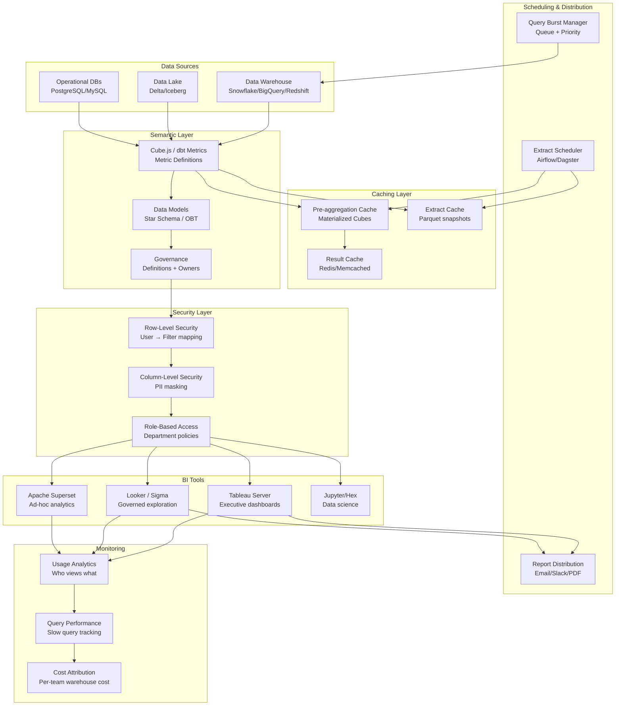

# Enterprise BI Platform Architecture

## Problem Statement

Enterprise BI platforms must serve 10K+ users across an organization—from executives needing one-click KPI summaries to analysts running complex ad-hoc queries. Challenges include: maintaining a single source of truth via a semantic layer, ensuring sub-second dashboard loads through intelligent caching, enforcing row-level security across departments, governing data access and definitions, and scheduling thousands of extracts without overwhelming the data warehouse. The platform must balance self-service flexibility with governance and cost control.

## Architecture Diagram



## Component Breakdown

### 1. Semantic Layer (Cube.js)

```yaml
# cube.js schema definition
cubes:
  - name: orders
    sql_table: warehouse.analytics.fact_orders
    data_source: snowflake

    joins:
      - name: customers
        sql: "{CUBE}.customer_id = {customers}.id"
        relationship: many_to_one
      - name: products
        sql: "{CUBE}.product_id = {products}.id"
        relationship: many_to_one

    measures:
      - name: total_revenue
        sql: revenue
        type: sum
        format: currency
        description: "Total revenue after discounts, before tax"

      - name: order_count
        type: count
        description: "Number of orders placed"

      - name: avg_order_value
        sql: "{total_revenue} / NULLIF({order_count}, 0)"
        type: number
        format: currency

      - name: conversion_rate
        sql: "{order_count} / NULLIF({sessions.count}, 0)"
        type: number
        format: percent

    dimensions:
      - name: created_at
        sql: created_at
        type: time
      - name: status
        sql: status
        type: string
      - name: channel
        sql: acquisition_channel
        type: string

    pre_aggregations:
      - name: daily_by_channel
        measures: [total_revenue, order_count]
        dimensions: [channel]
        time_dimension: created_at
        granularity: day
        refresh_key:
          every: "1 hour"
        partition_granularity: month

      - name: hourly_overview
        measures: [total_revenue, order_count, avg_order_value]
        time_dimension: created_at
        granularity: hour
        refresh_key:
          every: "10 minutes"
        build_range_start:
          sql: "SELECT DATE_SUB(NOW(), INTERVAL 7 DAY)"
```

### 2. Row-Level Security

```python
# Row-level security implementation
class RowLevelSecurityEngine:
    def __init__(self, policy_store):
        self.policies = policy_store

    def apply_rls(self, query: Query, user: User) -> Query:
        """Inject WHERE clauses based on user's access policies."""
        policies = self.policies.get_policies(user.roles, query.tables)

        for policy in policies:
            if policy.type == "department_filter":
                query.add_filter(f"{policy.table}.department IN ({user.departments})")
            elif policy.type == "region_filter":
                query.add_filter(f"{policy.table}.region IN ({user.allowed_regions})")
            elif policy.type == "customer_segment":
                query.add_filter(f"{policy.table}.segment_tier <= {user.max_segment_access}")
            elif policy.type == "time_window":
                query.add_filter(f"{policy.table}.date >= DATEADD(day, -{policy.lookback_days}, CURRENT_DATE)")

        return query

    def mask_columns(self, result_set: DataFrame, user: User) -> DataFrame:
        """Apply column-level masking for PII."""
        masking_rules = self.policies.get_masking_rules(user.roles)
        for col, rule in masking_rules.items():
            if col in result_set.columns:
                if rule == "hash":
                    result_set[col] = result_set[col].apply(lambda x: hashlib.sha256(str(x).encode()).hexdigest()[:8])
                elif rule == "redact":
                    result_set[col] = "***REDACTED***"
                elif rule == "partial":
                    result_set[col] = result_set[col].apply(lambda x: str(x)[:3] + "***")
        return result_set

# Policy configuration
rls_policies:
  finance_team:
    - table: fact_revenue
      access: all_regions
      columns_masked: [customer_email, phone]
  marketing_team:
    - table: fact_revenue
      filter: "region IN ('US', 'EU')"
      columns_masked: [customer_email, phone, revenue]
  executive:
    - table: "*"
      access: all
      columns_masked: []
```

### 3. Cache Warming Strategy

```python
# Intelligent cache warming based on usage patterns
class CacheWarmingScheduler:
    def __init__(self, usage_analytics, cube_client):
        self.usage = usage_analytics
        self.cube = cube_client

    def generate_warming_schedule(self) -> List[WarmingTask]:
        tasks = []

        # Priority 1: Executive dashboards (warm before 7 AM)
        exec_dashboards = self.usage.get_dashboards_by_role("executive")
        for dash in exec_dashboards:
            tasks.append(WarmingTask(
                query=dash.underlying_queries,
                priority=1,
                schedule="0 6 * * *",  # 6 AM daily
                cache_ttl=3600
            ))

        # Priority 2: Most-viewed dashboards from last 7 days
        popular = self.usage.get_top_dashboards(limit=50, window="7d")
        for dash in popular:
            tasks.append(WarmingTask(
                query=dash.underlying_queries,
                priority=2,
                schedule="*/30 * * * *",  # Every 30 min
                cache_ttl=1800
            ))

        # Priority 3: Predictive warming based on access patterns
        predicted = self.usage.predict_next_hour_queries()
        for query in predicted:
            tasks.append(WarmingTask(
                query=query,
                priority=3,
                schedule="dynamic",
                cache_ttl=900
            ))

        return tasks

    def warm_cache(self, task: WarmingTask):
        """Execute query and store result in cache."""
        # Run through semantic layer to populate pre-aggregation
        result = self.cube.execute_query(task.query, cache_bypass=True)
        self.cube.cache_result(task.query, result, ttl=task.cache_ttl)
```

### 4. Extract Scheduling

```yaml
# Airflow DAG for BI extract scheduling
extract_scheduling:
  warehouse_slots:
    total_concurrent_queries: 100
    reserved_for_extracts: 30
    reserved_for_interactive: 50
    burst_capacity: 20

  priority_queues:
    critical:
      max_concurrent: 10
      max_wait_time: 5m
      examples: ["executive_daily", "finance_close"]
    high:
      max_concurrent: 15
      max_wait_time: 15m
      examples: ["team_dashboards", "scheduled_reports"]
    normal:
      max_concurrent: 20
      max_wait_time: 1h
      examples: ["ad_hoc_extracts", "export_jobs"]
    low:
      max_concurrent: 5
      max_wait_time: 4h
      examples: ["backfill", "historical_analysis"]

  cost_controls:
    per_query_timeout: 300s
    per_query_max_bytes_scanned: 1TB
    per_user_daily_budget: $50
    per_team_monthly_budget: $5000
    auto_kill_runaway_queries: true
```

### 5. Governance Framework

```yaml
data_governance:
  catalog:
    tool: "DataHub / Atlan"
    features:
      - metric_definitions
      - data_owners
      - freshness_sla
      - quality_scores

  certification_levels:
    certified:
      description: "Verified, documented, SLA-backed"
      badge: "gold"
      requirements: ["owner assigned", "tests passing", "docs complete"]
    verified:
      description: "Reviewed but no SLA"
      badge: "silver"
    experimental:
      description: "Use at your own risk"
      badge: "none"
      warning: "This data is not certified for production use"

  usage_tracking:
    events_captured:
      - dashboard_view
      - query_execution
      - data_download
      - share_action
    retention: 2 years
    reports:
      - "unused_dashboards (>90 days no views)"
      - "most_queried_tables"
      - "cost_per_team"
      - "data_access_audit"
```

## Scaling for 10K Users

```yaml
scaling_strategy:
  concurrent_users: 10000
  peak_queries_per_minute: 5000

  caching_impact:
    cache_hit_rate_target: 85%
    queries_hitting_warehouse: 750/min
    avg_query_cost_cached: $0.00
    avg_query_cost_uncached: $0.05

  infrastructure:
    bi_tool_servers: 8 (horizontal scale)
    semantic_layer: 12 pods (stateless)
    cache_cluster: "Redis 6-node cluster, 192GB"
    warehouse_size: "Snowflake 2XL (64 nodes)"

  optimization_techniques:
    - "Pre-aggregation covers 80% of queries"
    - "Result caching for identical queries"
    - "Query deduplication (same query in-flight)"
    - "Staggered refresh schedules"
    - "Read replicas for BI workloads"
```

## Failure Handling

| Failure | Impact | Recovery |
|---------|--------|----------|
| Warehouse outage | No fresh data | Serve from cache + stale data notice |
| Cache miss storm | Warehouse overload | Circuit breaker, queue queries |
| Semantic layer crash | Query errors | Multiple replicas, stateless restart |
| Extract timeout | Missing report | Retry with smaller partition, alert |
| RLS misconfiguration | Data leak risk | Audit trail, deny-by-default, test framework |

## Cost Optimization

```yaml
cost_model_10k_users:
  data_warehouse:
    snowflake: $80,000/month
    optimization: "Auto-suspend, pre-agg reduces scans 80%"

  bi_tools:
    tableau_licenses: $50,000/month  # 500 creators + 9500 viewers
    superset_infra: $5,000/month     # Open source alternative

  semantic_layer:
    cube_cloud: $10,000/month
    # or self-hosted: $3,000/month

  caching:
    redis: $3,000/month
    pre_agg_storage: $2,000/month

  total: ~$150,000/month
  cost_per_user: $15/month

  savings_strategies:
    - "Viewer licenses instead of creator ($15 vs $70/user)"
    - "Pre-aggregation reduces warehouse spend 60%"
    - "Auto-suspend warehouses during off-hours"
    - "Archive unused dashboards after 90 days"
```

## Real-World Companies

| Company | Scale | Stack |
|---------|-------|-------|
| **Airbnb** | 10K+ analysts | Minerva (custom semantic) + Superset + Druid |
| **Netflix** | Company-wide | Custom + Tableau + Druid |
| **Uber** | 10K+ users | Custom semantic + Presto + Superset |
| **Spotify** | Thousands of users | Looker + BigQuery + custom |
| **LinkedIn** | Enterprise-wide | Custom + UMP + Pinot |
| **Stripe** | Financial BI | Mode + Looker + Redshift |

## Key Design Decisions

1. **Semantic layer is mandatory** — single source of truth for metric definitions
2. **Cache aggressively** — 85%+ cache hit rate is the target for 10K users
3. **RLS at the semantic layer** — not per-tool; one policy, all tools
4. **Cost attribution per team** — makes teams accountable for query efficiency
5. **Tiered tool access** — Tableau for execs, Superset for analysts, notebooks for DS
