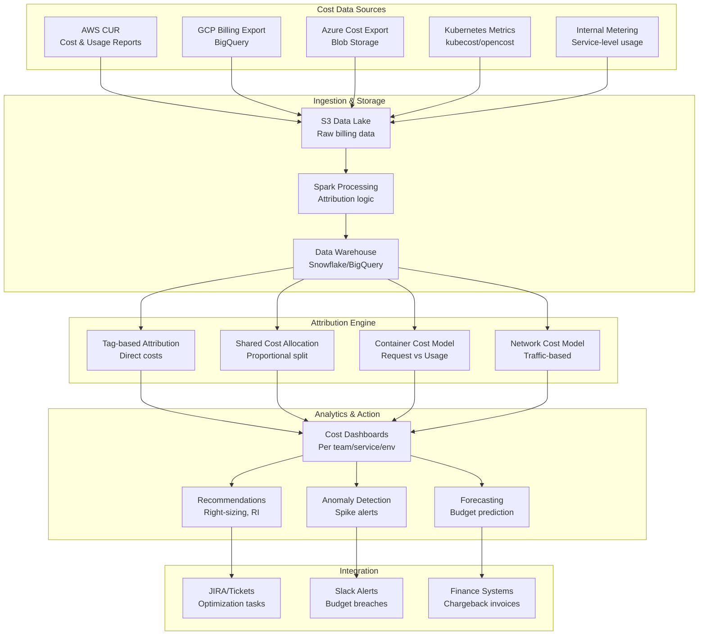

# Cloud Cost Attribution and Chargeback Pipeline

## Problem Statement

Organizations spending $1M+/month on cloud infrastructure struggle to answer: "Which team/service/customer is responsible for this cost?" AWS bills arrive as massive CSVs with millions of line items, shared resources (Kubernetes clusters, databases, networking) resist simple attribution, and container workloads dynamically share nodes. Without accurate cost attribution, teams have no incentive to optimize, finance cannot forecast, and engineering leadership cannot make informed build-vs-buy decisions.

## Architecture Diagram



## Component Breakdown

### 1. AWS CUR Processing

```python
# Spark job to process AWS Cost and Usage Reports
from pyspark.sql import SparkSession, functions as F

spark = SparkSession.builder.appName("cost-attribution").getOrCreate()

# Read CUR data (Parquet format from AWS)
cur = spark.read.parquet("s3://billing-data/cur/year=2024/month=*/*.parquet")

# Normalize and enrich
enriched = (cur
    .withColumn("team", F.coalesce(
        F.col("resourceTags_user_team"),
        F.col("resourceTags_user_owner"),
        F.lit("unattributed")
    ))
    .withColumn("service_name", F.coalesce(
        F.col("resourceTags_user_service"),
        F.col("resourceTags_kubernetes_io_service"),
        F.lit("unknown")
    ))
    .withColumn("environment", F.coalesce(
        F.col("resourceTags_user_environment"),
        F.when(F.col("resourceTags_user_name").contains("prod"), "production")
         .when(F.col("resourceTags_user_name").contains("staging"), "staging")
         .otherwise("unknown")
    ))
    .withColumn("cost_date", F.to_date("lineItem_UsageStartDate"))
    .withColumn("unblended_cost", F.col("lineItem_UnblendedCost").cast("double"))
    .withColumn("amortized_cost",
        F.coalesce(
            F.col("savingsPlan_SavingsPlanEffectiveCost"),
            F.col("reservation_EffectiveCost"),
            F.col("lineItem_UnblendedCost")
        ).cast("double")
    )
)

# Write to warehouse
enriched.write.mode("overwrite").partitionBy("cost_date").saveAsTable("cost.enriched_cur")
```

### 2. Shared Resource Allocation

```python
class SharedCostAllocator:
    """Allocate shared infrastructure costs to teams."""

    def allocate_kubernetes_costs(self, cluster_cost: float, namespace_metrics: DataFrame) -> DataFrame:
        """Split cluster cost based on resource requests and usage."""
        # Weight: 60% by resource requests, 40% by actual usage
        REQUEST_WEIGHT = 0.6
        USAGE_WEIGHT = 0.4

        total_requests = namespace_metrics.agg(
            F.sum("cpu_requests").alias("total_cpu_req"),
            F.sum("memory_requests").alias("total_mem_req")
        ).collect()[0]

        total_usage = namespace_metrics.agg(
            F.sum("cpu_usage_avg").alias("total_cpu_use"),
            F.sum("memory_usage_avg").alias("total_mem_use")
        ).collect()[0]

        allocated = namespace_metrics.withColumn(
            "cpu_request_share",
            F.col("cpu_requests") / F.lit(total_requests.total_cpu_req)
        ).withColumn(
            "cpu_usage_share",
            F.col("cpu_usage_avg") / F.lit(total_usage.total_cpu_use)
        ).withColumn(
            "allocated_cost",
            F.lit(cluster_cost) * (
                F.lit(REQUEST_WEIGHT) * (F.col("cpu_request_share") + F.col("memory_request_share")) / 2 +
                F.lit(USAGE_WEIGHT) * (F.col("cpu_usage_share") + F.col("memory_usage_share")) / 2
            )
        )
        return allocated

    def allocate_shared_services(self, costs: DataFrame, usage_metrics: DataFrame) -> DataFrame:
        """Allocate shared services (load balancers, NAT gateways, etc.)."""
        allocation_rules = {
            "nat_gateway": "proportional_to_egress_bytes",
            "load_balancer": "proportional_to_request_count",
            "cloudfront": "proportional_to_bandwidth",
            "route53": "equal_split_across_services",
            "support_plan": "proportional_to_total_spend"
        }

        for service, method in allocation_rules.items():
            service_cost = costs.filter(F.col("service") == service)
            if method == "proportional_to_egress_bytes":
                metrics = usage_metrics.filter(F.col("metric") == "egress_bytes")
                allocated = self._proportional_allocate(service_cost, metrics, "team")
            elif method == "equal_split_across_services":
                allocated = self._equal_split(service_cost, usage_metrics.select("team").distinct())
            costs = costs.union(allocated)

        return costs
```

### 3. Container Cost Splitting (OpenCost)

```yaml
# OpenCost / Kubecost configuration
opencost:
  allocation:
    # CPU cost model
    cpu:
      price_per_core_hour: 0.031  # Based on instance type mix
      allocation_method: "max(requests, usage)"

    # Memory cost model
    memory:
      price_per_gib_hour: 0.004
      allocation_method: "max(requests, usage)"

    # GPU cost
    gpu:
      price_per_gpu_hour: 1.50
      allocation_method: "requests"  # GPUs are dedicated

    # Network cost
    network:
      internet_egress_per_gb: 0.09
      cross_zone_per_gb: 0.01
      allocation_method: "actual_bytes"

    # Storage (PV) cost
    storage:
      price_per_gib_month: 0.10
      allocation_method: "provisioned"

  # Idle cost handling
  idle_costs:
    method: "distribute_proportionally"
    # Cluster runs at 60% utilization = 40% idle
    # Distribute idle cost proportional to non-idle allocation

  # Shared namespaces
  shared_namespaces:
    - name: "kube-system"
      allocation: "proportional_to_node_usage"
    - name: "istio-system"
      allocation: "proportional_to_request_count"
    - name: "monitoring"
      allocation: "equal_across_teams"
```

### 4. Anomaly Detection

```python
class CostAnomalyDetector:
    def detect_anomalies(self, cost_history: DataFrame) -> List[CostAnomaly]:
        anomalies = []

        # Per-service daily cost analysis
        daily_costs = cost_history.groupBy("service_name", "cost_date").agg(
            F.sum("amortized_cost").alias("daily_cost")
        )

        for service in daily_costs.select("service_name").distinct().collect():
            service_costs = daily_costs.filter(F.col("service_name") == service.service_name)

            # Calculate rolling statistics
            stats = service_costs.withColumn(
                "rolling_mean", F.avg("daily_cost").over(Window.orderBy("cost_date").rowsBetween(-30, -1))
            ).withColumn(
                "rolling_std", F.stddev("daily_cost").over(Window.orderBy("cost_date").rowsBetween(-30, -1))
            ).withColumn(
                "z_score", (F.col("daily_cost") - F.col("rolling_mean")) / F.col("rolling_std")
            )

            # Flag anomalies (>3 standard deviations)
            spikes = stats.filter(F.col("z_score") > 3).collect()
            for spike in spikes:
                anomalies.append(CostAnomaly(
                    service=service.service_name,
                    date=spike.cost_date,
                    expected=spike.rolling_mean,
                    actual=spike.daily_cost,
                    z_score=spike.z_score,
                    estimated_excess=spike.daily_cost - spike.rolling_mean
                ))

        return anomalies
```

### 5. Forecasting

```python
# Cost forecasting using Prophet
from prophet import Prophet

class CostForecaster:
    def forecast_team_cost(self, team: str, horizon_days: int = 90) -> Forecast:
        # Get historical daily cost
        history = self.get_daily_costs(team, lookback_days=365)
        df = history.select(
            F.col("cost_date").alias("ds"),
            F.col("daily_cost").alias("y")
        ).toPandas()

        model = Prophet(
            yearly_seasonality=True,
            weekly_seasonality=True,
            changepoint_prior_scale=0.05
        )
        # Add known events (Black Friday, releases, etc.)
        model.add_country_holidays(country_name='US')
        model.fit(df)

        future = model.make_future_dataframe(periods=horizon_days)
        forecast = model.predict(future)

        return Forecast(
            team=team,
            predictions=forecast[['ds', 'yhat', 'yhat_lower', 'yhat_upper']],
            monthly_forecast=forecast.tail(horizon_days).groupby(
                forecast['ds'].dt.to_period('M')
            )['yhat'].sum(),
            confidence_interval=0.95
        )
```

## Scaling Strategies

| Data Volume | Processing | Approach |
|-------------|-----------|----------|
| <$100K/month | Daily batch | Single Spark job, small warehouse |
| $100K-$1M/month | Daily + alerts | Distributed Spark, anomaly detection |
| $1M-$10M/month | Near real-time | Streaming cost events, ML forecasting |
| >$10M/month | Continuous | Dedicated FinOps team + platform |

## Failure Handling

| Failure | Impact | Recovery |
|---------|--------|----------|
| CUR delivery delay | Stale cost data | Alert, use estimates from CloudWatch |
| Missing tags | Unattributed costs | Tag compliance enforcement, default attribution |
| K8s metrics gap | Inaccurate container split | Fall back to namespace-level requests |
| Forecast model drift | Wrong projections | Retrain monthly, alert on high residuals |

## Cost Optimization Recommendations Engine

```yaml
recommendations:
  right_sizing:
    - type: "ec2_downsize"
      condition: "avg_cpu < 20% for 14 days"
      savings_estimate: "30-50% per instance"

  reserved_instances:
    - type: "ri_purchase"
      condition: "stable on-demand usage > 720h/month"
      savings_estimate: "40-60%"

  spot_instances:
    - type: "spot_migration"
      condition: "fault-tolerant workload, no state"
      savings_estimate: "60-80%"

  waste_elimination:
    - type: "unused_resources"
      checks: ["unattached EBS", "idle RDS", "unused EIPs", "empty S3 buckets"]
      typical_savings: "$50K-$200K/month for large orgs"
```

## Real-World Companies

| Company | Scale | Stack |
|---------|-------|-------|
| **Airbnb** | $100M+/year cloud | Custom + Spark + internal tooling |
| **Netflix** | $1B+/year AWS | Custom cost attribution platform |
| **Spotify** | Large GCP spend | GCP billing export + custom |
| **Uber** | Multi-cloud $100M+ | Custom FinOps platform |
| **Shopify** | $100M+/year | Kubecost + custom Spark pipeline |

## Key Design Decisions

1. **Amortized cost, not on-demand** — reflects actual spend after RI/SP
2. **Container costs need dedicated model** — tags alone don't work for K8s
3. **Shared costs must be allocated** — "unattributed" creates perverse incentives
4. **Anomaly detection is table stakes** — catch runaway resources in hours not months
5. **Show unit economics** — cost per customer/request/transaction drives optimization
