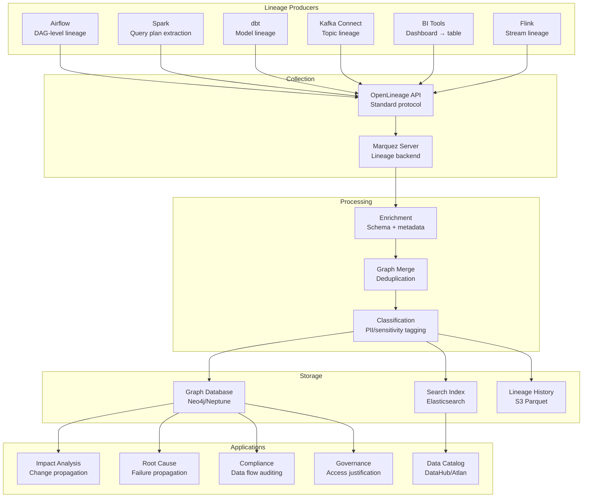

# End-to-End Data Lineage Tracking

## Problem Statement

In a modern data platform with hundreds of pipelines, thousands of tables, and dozens of tools (Spark, Airflow, dbt, Kafka, BI tools), understanding "where did this data come from?" and "what breaks if I change this column?" becomes nearly impossible without automated lineage tracking. At scale, manual documentation is always stale. Organizations need automated, column-level lineage across heterogeneous systems to enable impact analysis, debugging, compliance (GDPR "right to explanation"), and trust in data.

## Architecture Diagram



## Component Breakdown

### 1. OpenLineage Integration

```python
# Airflow OpenLineage integration
from openlineage.airflow import DAG
from openlineage.client import OpenLineageClient

# Automatic lineage extraction from Airflow operators
dag = DAG(
    'revenue_pipeline',
    schedule_interval='@daily',
    openlineage_config={
        'transport': {'type': 'kafka', 'config': {'bootstrap.servers': 'kafka:9092', 'topic': 'lineage'}},
        'facets': {'spark': True, 'sql': True, 'schema': True}
    }
)

# Spark lineage listener (SparkListener)
# spark-defaults.conf
spark.extraListeners=io.openlineage.spark.agent.OpenLineageSparkListener
spark.openlineage.transport.type=kafka
spark.openlineage.transport.topicName=lineage
spark.openlineage.transport.bootstrapServers=kafka:9092
spark.openlineage.namespace=production
```

```yaml
# dbt integration (dbt-openlineage)
# profiles.yml addition
openlineage:
  transport:
    type: http
    url: "http://marquez:5000/api/v1/lineage"
  namespace: "dbt_production"
```

### 2. Column-Level Lineage Extraction

```python
# SQL-based column lineage parser
from sqllineage.runner import LineageRunner

class ColumnLineageExtractor:
    def extract_from_sql(self, sql: str) -> ColumnLineage:
        """Parse SQL to extract column-level dependencies."""
        runner = LineageRunner(sql)

        lineage = ColumnLineage()
        for target_col in runner.get_column_lineage():
            source_cols = runner.get_column_lineage_source(target_col)
            lineage.add_edge(
                sources=source_cols,
                target=target_col,
                transformation=self._classify_transform(sql, target_col)
            )
        return lineage

    def extract_from_spark_plan(self, query_plan: LogicalPlan) -> ColumnLineage:
        """Extract lineage from Spark's analyzed logical plan."""
        lineage = ColumnLineage()

        def traverse(node, target_columns=None):
            if isinstance(node, Project):
                for expr in node.projectList:
                    sources = self._extract_references(expr)
                    lineage.add_edge(sources=sources, target=expr.name)
            for child in node.children:
                traverse(child)

        traverse(query_plan)
        return lineage

    def _classify_transform(self, sql: str, column: str) -> str:
        """Classify transformation type for governance."""
        sql_lower = sql.lower()
        if f"hash({column})" in sql_lower or "sha256" in sql_lower:
            return "pseudonymization"
        elif "case when" in sql_lower:
            return "conditional_logic"
        elif "sum(" in sql_lower or "avg(" in sql_lower:
            return "aggregation"
        else:
            return "direct_mapping"
```

### 3. Graph Storage (Neo4j)

```cypher
// Node types
CREATE (ds:Dataset {
    name: "warehouse.analytics.fact_orders",
    namespace: "snowflake_prod",
    schema_version: 42,
    classification: "confidential",
    owner: "data-platform-team"
})

CREATE (col:Column {
    name: "customer_email",
    dataset: "fact_orders",
    type: "STRING",
    classification: "PII",
    pii_type: "email"
})

CREATE (job:Job {
    name: "revenue_daily_etl",
    namespace: "airflow_prod",
    owner: "analytics-team",
    schedule: "@daily"
})

// Lineage edges
CREATE (source_col)-[:DERIVES {
    transformation: "direct_mapping",
    job: "revenue_daily_etl",
    timestamp: datetime()
}]->(target_col)

// Impact analysis query: What breaks if I change column X?
MATCH path = (source:Column {name: "customer_id", dataset: "raw_events"})
    -[:DERIVES*1..10]->(downstream)
RETURN downstream.dataset, downstream.name, length(path) AS hops
ORDER BY hops;

// Root cause: Where did bad data in table Y come from?
MATCH path = (target:Dataset {name: "revenue_dashboard"})
    <-[:DERIVES*1..10]-(upstream)
WHERE upstream.last_updated > datetime() - duration('PT1H')
RETURN upstream, path;
```

### 4. Impact Analysis

```python
class ImpactAnalyzer:
    def __init__(self, graph_client):
        self.graph = graph_client

    def analyze_schema_change(self, dataset: str, column: str, change_type: str) -> ImpactReport:
        """Determine impact of dropping/renaming a column."""
        # Find all downstream dependencies
        downstream = self.graph.query("""
            MATCH (source:Column {name: $column, dataset: $dataset})
                -[:DERIVES*1..20]->(target)
            RETURN target.dataset AS dataset, target.name AS column,
                   labels(target) AS type, length(path) AS distance
        """, column=column, dataset=dataset)

        # Classify impact
        report = ImpactReport(
            source=f"{dataset}.{column}",
            change_type=change_type,
            direct_impacts=[d for d in downstream if d['distance'] == 1],
            indirect_impacts=[d for d in downstream if d['distance'] > 1],
            affected_dashboards=self._find_affected_dashboards(downstream),
            affected_teams=self._find_affected_teams(downstream),
            risk_level=self._assess_risk(downstream)
        )
        return report

    def _assess_risk(self, downstream) -> str:
        affected_count = len(downstream)
        has_pii = any(d.get('classification') == 'PII' for d in downstream)
        has_revenue = any('revenue' in d['dataset'].lower() for d in downstream)

        if has_revenue or affected_count > 50:
            return "critical"
        elif has_pii or affected_count > 20:
            return "high"
        elif affected_count > 5:
            return "medium"
        return "low"
```

### 5. Automated Classification

```python
class DataClassifier:
    """Automatically classify columns based on lineage and content."""

    PII_PATTERNS = {
        'email': r'.*email.*|.*e_mail.*',
        'phone': r'.*phone.*|.*mobile.*|.*tel.*',
        'ssn': r'.*ssn.*|.*social_security.*',
        'ip_address': r'.*ip_addr.*|.*ip_address.*|.*client_ip.*',
        'name': r'.*first_name.*|.*last_name.*|.*full_name.*',
    }

    def classify_column(self, dataset: str, column: str) -> Classification:
        # Rule-based classification from column name
        for pii_type, pattern in self.PII_PATTERNS.items():
            if re.match(pattern, column, re.IGNORECASE):
                return Classification(type="PII", subtype=pii_type, confidence=0.9)

        # Lineage-based: if derived from PII source, inherit classification
        sources = self.graph.get_upstream_columns(dataset, column)
        for source in sources:
            if source.classification == "PII":
                transform = self.graph.get_transformation(source, f"{dataset}.{column}")
                if transform not in ["aggregation", "pseudonymization"]:
                    return Classification(type="PII", subtype=source.pii_type,
                                        confidence=0.8, reason="inherited_from_lineage")

        return Classification(type="non_sensitive", confidence=0.7)
```

## Cross-System Lineage

```yaml
cross_system_tracking:
  # End-to-end flow example
  flow: "MySQL → Kafka → Spark → S3 → Snowflake → dbt → Tableau"

  integration_points:
    kafka_connect:
      lineage_source: "connector metadata"
      granularity: "topic → table mapping"

    spark:
      lineage_source: "query plan listener"
      granularity: "column-level"

    dbt:
      lineage_source: "manifest.json + catalog.json"
      granularity: "column-level with tests"

    airflow:
      lineage_source: "OpenLineage extractors"
      granularity: "task-level with inlets/outlets"

    tableau:
      lineage_source: "Metadata API"
      granularity: "dashboard → table → column"
```

## Scaling Strategies

| Component | Small (100 datasets) | Medium (10K datasets) | Large (100K+ datasets) |
|-----------|---------------------|----------------------|----------------------|
| Graph DB | Single Neo4j | Neo4j cluster | Neptune/JanusGraph |
| Lineage events/day | 10K | 1M | 50M |
| Query latency | <100ms | <500ms | <2s (cached) |

## Failure Handling

| Failure | Impact | Recovery |
|---------|--------|----------|
| Lineage event loss | Gap in graph | Kafka retention + periodic full scan |
| Graph DB corruption | Impact analysis down | Replay from event history (S3) |
| Parser failure | Missing column lineage | Fallback to table-level, alert |
| Cross-system gap | Broken lineage chain | Manual stitching UI, reconciliation job |

## Cost Optimization

```yaml
cost_model:
  graph_database: $5,000/month (Neo4j Aura)
  kafka_for_events: $2,000/month
  processing: $3,000/month
  search_index: $2,000/month
  history_storage: $500/month
  total: ~$12,500/month
```

## Real-World Companies

| Company | Scale | Stack |
|---------|-------|-------|
| **Google** | Millions of datasets | Custom (GOODS system) |
| **LinkedIn** | 100K+ datasets | DataHub (open-sourced) |
| **Airbnb** | Tens of thousands | Dataportal + custom |
| **Uber** | Company-wide | Databook + OpenLineage |
| **WeWork** | Marquez origin | Marquez (open-sourced) |
| **Spotify** | Backstage integration | Custom + Backstage |

## Key Design Decisions

1. **OpenLineage as standard** — vendor-neutral, integrates with all major tools
2. **Column-level is essential** — table-level lineage is too coarse for impact analysis
3. **Graph DB for traversal** — relational DB cannot efficiently answer "all downstream N hops"
4. **Event-driven collection** — push lineage at runtime, not periodic scanning
5. **Classification from lineage** — PII propagation tracking is a compliance requirement
