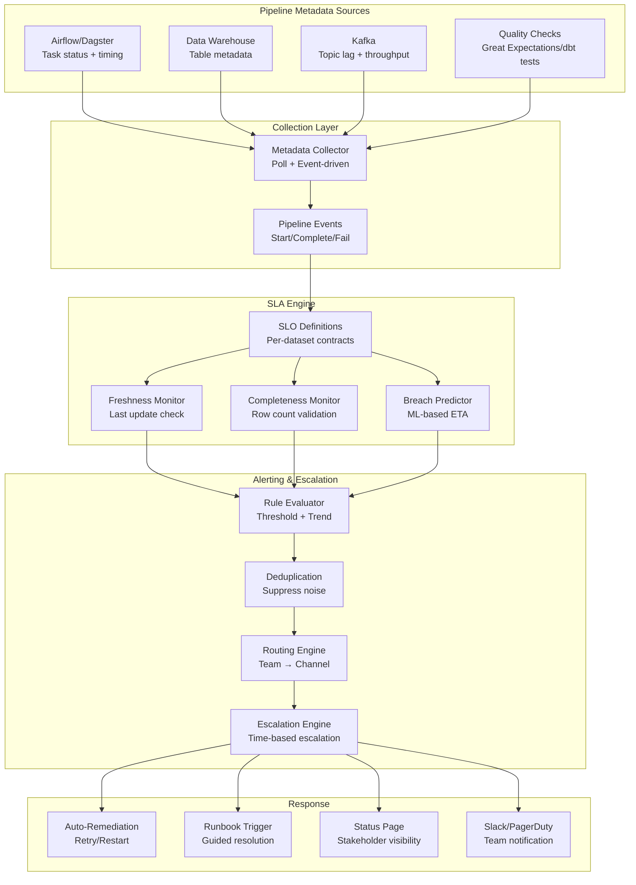

# SLA Monitoring for Data Pipelines

## Problem Statement

Data pipelines are notoriously unreliable—upstream schema changes, infrastructure failures, data volume spikes, and processing bugs cause freshness delays and completeness gaps. When a revenue dashboard shows yesterday's numbers at 10 AM instead of today's, executives lose trust. Without proactive SLA monitoring, teams discover data issues from angry stakeholders rather than automated systems. At scale (1000+ pipelines, 100+ teams), manual monitoring is impossible; the platform needs automated freshness tracking, completeness validation, breach prediction, and intelligent escalation.

## Architecture Diagram



## Component Breakdown

### 1. SLO Definition Framework

```yaml
# SLO contract definition for a critical dataset
slo_contracts:
  - dataset: "warehouse.analytics.fact_revenue"
    owner: "analytics-team"
    stakeholders: ["finance", "executive"]
    tier: "critical"  # critical / high / medium / low

    freshness:
      max_delay: "2h"  # Data should be no older than 2 hours
      expected_update_time: "06:00 UTC"
      grace_period: "30m"
      measurement: "max(event_timestamp) vs current_time"

    completeness:
      method: "row_count_comparison"
      baseline: "previous_day_count * 0.8"  # At least 80% of yesterday
      partition_check: true  # Each date partition must have data
      null_thresholds:
        revenue: 0.01  # <1% nulls
        customer_id: 0.0  # 0% nulls

    quality:
      tests:
        - "revenue >= 0"
        - "order_date <= current_date"
        - "unique(order_id)"
      dbt_tests: ["not_null", "unique", "accepted_values"]

    dependencies:
      upstream:
        - dataset: "raw.events.orders"
          expected_freshness: "1h"
        - dataset: "raw.events.payments"
          expected_freshness: "1h"

    alerting:
      warning:
        condition: "freshness > 1.5h OR completeness < 90%"
        channels: ["slack:#data-alerts"]
      critical:
        condition: "freshness > 2h OR completeness < 70%"
        channels: ["pagerduty:analytics-oncall", "slack:#data-incidents"]
      escalation:
        - after: "30m"
          to: "engineering-manager"
        - after: "2h"
          to: "vp-engineering"

  - dataset: "warehouse.ml.feature_store"
    owner: "ml-platform"
    tier: "high"
    freshness:
      max_delay: "4h"
      expected_update_time: "08:00 UTC"
    completeness:
      method: "feature_coverage"
      min_entities_with_features: 0.95
```

### 2. Freshness Monitor

```python
class FreshnessMonitor:
    def __init__(self, warehouse_client, slo_store):
        self.warehouse = warehouse_client
        self.slos = slo_store

    def check_freshness(self, dataset: str) -> FreshnessStatus:
        slo = self.slos.get(dataset)

        # Get latest data timestamp
        result = self.warehouse.query(f"""
            SELECT MAX({slo.freshness.timestamp_column}) as latest_ts,
                   COUNT(*) as recent_rows
            FROM {dataset}
            WHERE {slo.freshness.timestamp_column} >= DATEADD(hour, -24, CURRENT_TIMESTAMP())
        """)

        latest_ts = result.latest_ts
        current_delay = (datetime.utcnow() - latest_ts).total_seconds() / 3600

        # Compare against SLO
        status = FreshnessStatus(
            dataset=dataset,
            latest_data_timestamp=latest_ts,
            current_delay_hours=current_delay,
            slo_max_delay_hours=slo.freshness.max_delay_hours,
            is_breached=current_delay > slo.freshness.max_delay_hours,
            is_warning=current_delay > slo.freshness.max_delay_hours * 0.75,
            trend=self._calculate_trend(dataset)
        )
        return status

    def _calculate_trend(self, dataset: str) -> str:
        """Is the pipeline catching up or falling further behind?"""
        recent_updates = self.get_update_history(dataset, last_n=10)
        if len(recent_updates) < 2:
            return "unknown"
        intervals = [recent_updates[i] - recent_updates[i+1] for i in range(len(recent_updates)-1)]
        if intervals[-1] > intervals[0] * 1.5:
            return "degrading"
        elif intervals[-1] < intervals[0] * 0.8:
            return "recovering"
        return "stable"
```

### 3. Breach Prediction

```python
class BreachPredictor:
    """Predict SLA breaches before they happen."""

    def predict_breach(self, dataset: str) -> BreachPrediction:
        slo = self.slos.get(dataset)

        # Get pipeline execution history
        history = self.get_execution_history(dataset, days=30)

        # Features for prediction
        features = {
            'day_of_week': datetime.utcnow().weekday(),
            'hour_of_day': datetime.utcnow().hour,
            'upstream_delay': self._get_upstream_delay(slo.dependencies),
            'data_volume_ratio': self._get_volume_ratio(dataset),
            'recent_failure_rate': self._recent_failure_rate(dataset, hours=24),
            'infrastructure_load': self._get_cluster_load(),
        }

        # Simple model: historical completion time + current state
        avg_duration = history['duration_minutes'].mean()
        p95_duration = history['duration_minutes'].quantile(0.95)

        pipeline_start = self.get_last_start_time(dataset)
        if pipeline_start:
            elapsed = (datetime.utcnow() - pipeline_start).total_seconds() / 60
            estimated_remaining = max(0, p95_duration - elapsed)
            predicted_completion = datetime.utcnow() + timedelta(minutes=estimated_remaining)
        else:
            # Pipeline hasn't started yet
            predicted_completion = self._predict_start_time(dataset) + timedelta(minutes=p95_duration)

        slo_deadline = self._get_slo_deadline(slo)
        breach_probability = self._calculate_probability(predicted_completion, slo_deadline, history)

        return BreachPrediction(
            dataset=dataset,
            predicted_completion=predicted_completion,
            slo_deadline=slo_deadline,
            breach_probability=breach_probability,
            contributing_factors=self._identify_factors(features),
            recommended_action=self._recommend_action(breach_probability)
        )

    def _recommend_action(self, probability: float) -> str:
        if probability > 0.9:
            return "IMMEDIATE: Trigger manual pipeline run or notify stakeholders of delay"
        elif probability > 0.7:
            return "WARN: Scale up processing resources, check for blockers"
        elif probability > 0.5:
            return "MONITOR: Increased monitoring, prepare contingency"
        return "OK: No action needed"
```

### 4. Auto-Remediation

```python
class AutoRemediation:
    ACTIONS = {
        'pipeline_stuck': [
            {'action': 'restart_task', 'condition': 'running > 3x avg_duration'},
            {'action': 'clear_downstream', 'condition': 'upstream_complete AND task_failed'},
        ],
        'freshness_breach': [
            {'action': 'trigger_backfill', 'condition': 'last_run_failed AND retries < 3'},
            {'action': 'switch_to_fallback', 'condition': 'retries >= 3'},
        ],
        'completeness_issue': [
            {'action': 'rerun_partition', 'condition': 'partial_data AND source_complete'},
            {'action': 'alert_upstream_owner', 'condition': 'source_incomplete'},
        ]
    }

    def remediate(self, incident: Incident) -> RemediationResult:
        actions = self.ACTIONS.get(incident.type, [])

        for action_config in actions:
            if self.evaluate_condition(action_config['condition'], incident):
                result = self.execute_action(action_config['action'], incident)
                if result.success:
                    return RemediationResult(
                        action_taken=action_config['action'],
                        success=True,
                        message=f"Auto-remediation successful: {action_config['action']}"
                    )

        # Escalate to human
        return RemediationResult(
            action_taken="escalate",
            success=False,
            message="Auto-remediation exhausted, escalating to on-call"
        )
```

### 5. Stakeholder Communication

```python
class StakeholderCommunicator:
    def generate_status_update(self, incidents: List[Incident]) -> StatusUpdate:
        # Non-technical summary for business stakeholders
        affected_reports = self._get_affected_reports(incidents)

        return StatusUpdate(
            summary=f"{len(incidents)} data pipelines delayed",
            business_impact=self._assess_business_impact(affected_reports),
            affected_dashboards=affected_reports,
            eta=self._estimate_resolution(incidents),
            workaround="Use yesterday's data; affected metrics marked with ⚠️",
            next_update_in="30 minutes"
        )

    def send_status_page_update(self, update: StatusUpdate):
        """Post to internal status page visible to all stakeholders."""
        self.status_page.post(
            title=update.summary,
            severity="major" if update.business_impact == "high" else "minor",
            body=f"""
## Current Status
{update.summary}

## Impact
{update.business_impact}

## Affected Reports
{chr(10).join(f'- {r}' for r in update.affected_dashboards)}

## ETA
{update.eta}

## Workaround
{update.workaround}
            """,
            notify_subscribers=True
        )
```

## Scaling Strategies

| Pipelines | Check Frequency | Architecture |
|-----------|----------------|--------------|
| <100 | Every 5 min | Single scheduler + DB |
| 100-1000 | Every 1 min | Distributed checks + Redis |
| 1000-10000 | Continuous | Event-driven + streaming evaluation |

## Failure Handling

| Failure | Impact | Recovery |
|---------|--------|----------|
| Monitor itself down | Blind spot | Watchdog process, multi-region |
| False positive alert | Alert fatigue | Confirmation window, dedup |
| Warehouse unreachable | Cannot check freshness | Cache last known state, alert |
| Auto-remediation loop | Repeated failures | Circuit breaker (max 3 retries) |

## Cost Optimization

```yaml
cost_model:
  monitoring_infrastructure: $5,000/month
  warehouse_queries_for_checks: $3,000/month  # Metadata queries are cheap
  alerting_tools: $2,000/month
  status_page: $500/month
  total: ~$10,500/month

  roi:
    incidents_caught_proactively: "80% (vs 20% without)"
    mean_time_to_detect: "5 min (vs 2-4 hours)"
    stakeholder_trust_impact: "Immeasurable"
```

## Real-World Companies

| Company | Scale | Stack |
|---------|-------|-------|
| **Airbnb** | 10K+ pipelines | Custom SLA system + Airflow |
| **Netflix** | Thousands of jobs | Custom metadata-driven monitors |
| **Uber** | Company-wide | Custom pipeline SLA framework |
| **LinkedIn** | Massive pipeline ecosystem | Custom + DataHub integration |
| **Monte Carlo** | Product (hundreds of customers) | Automated data observability |
| **Bigeye** | Product | ML-based data monitoring |

## Key Design Decisions

1. **SLO contracts, not just alerts** — define expectations upfront with stakeholders
2. **Predict before breach** — react to trends, not just thresholds
3. **Auto-remediate common issues** — retry/restart before paging humans
4. **Non-technical status updates** — stakeholders need impact, not stack traces
5. **Tier-based monitoring** — critical pipelines checked every minute, low-priority hourly
