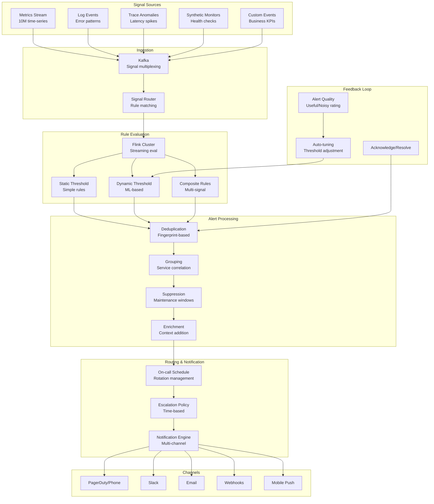

# Real-time Alerting System (PagerDuty/OpsGenie Style)

## Problem Statement

At scale with 100K+ alert rules monitoring thousands of services, the alerting system itself becomes a critical distributed system. Challenges include: evaluating complex rules against high-velocity metric streams in real-time, deduplicating related alerts to avoid fatigue, correlating incidents across services, routing to the right on-call engineer with context, and supporting dynamic thresholds that adapt to seasonality. A single missed critical alert costs $100K+ in downtime; too many false alerts erode trust and response times.

## Architecture Diagram



## Component Breakdown

### 1. Flink Rule Evaluation Engine

```java
public class AlertRuleEvaluator {
    public static void main(String[] args) {
        StreamExecutionEnvironment env = StreamExecutionEnvironment.getExecutionEnvironment();
        env.setParallelism(128);

        // Metric stream
        DataStream<MetricPoint> metrics = env
            .addSource(new KafkaSource<>("metrics.stream"))
            .keyBy(MetricPoint::getRuleGroupKey);

        // Dynamic rule broadcast
        BroadcastStream<AlertRule> rules = env
            .addSource(new RuleChangeSource())  // From DB + Kafka
            .broadcast(ruleStateDescriptor);

        // Evaluate rules
        DataStream<RawAlert> alerts = metrics
            .connect(rules)
            .process(new RuleEvaluationFunction())
            .name("rule-evaluation");

        // Static threshold evaluation
        DataStream<RawAlert> staticAlerts = alerts
            .filter(a -> a.getRuleType() == RuleType.STATIC);

        // Dynamic threshold (requires historical context)
        DataStream<RawAlert> dynamicAlerts = metrics
            .keyBy(MetricPoint::getMetricKey)
            .process(new DynamicThresholdFunction())
            .name("dynamic-threshold");

        // Merge all alert streams
        staticAlerts.union(dynamicAlerts)
            .keyBy(RawAlert::getFingerprint)
            .process(new DeduplicationFunction())
            .addSink(new AlertProcessingSink());
    }
}

// Dynamic threshold using exponential moving average + seasonality
public class DynamicThresholdFunction extends KeyedProcessFunction<String, MetricPoint, RawAlert> {
    private ValueState<DynamicModel> modelState;

    @Override
    public void processElement(MetricPoint point, Context ctx, Collector<RawAlert> out) {
        DynamicModel model = modelState.value();
        if (model == null) {
            model = new DynamicModel(point.getMetricKey());
        }

        // Update model with new data point
        model.update(point.getValue(), point.getTimestamp());

        // Check if current value is anomalous
        double expected = model.predict(point.getTimestamp());
        double stddev = model.getStddev();
        double sensitivity = getRuleSensitivity(point.getMetricKey());  // 2-4 sigma

        if (Math.abs(point.getValue() - expected) > sensitivity * stddev) {
            out.collect(new RawAlert(
                point.getMetricKey(),
                "dynamic_threshold",
                String.format("Value %.2f deviates from expected %.2f (±%.2f)",
                    point.getValue(), expected, sensitivity * stddev),
                point.getTimestamp()
            ));
        }

        modelState.update(model);
    }
}
```

### 2. Deduplication & Grouping

```python
class AlertDeduplicator:
    """Deduplicate alerts using fingerprinting and grouping."""

    def compute_fingerprint(self, alert: RawAlert) -> str:
        """Stable fingerprint for deduplication."""
        # Fingerprint = hash of (rule_id + key labels)
        key_labels = sorted([
            f"{k}={v}" for k, v in alert.labels.items()
            if k in ['service', 'cluster', 'alertname']
        ])
        return hashlib.md5("|".join(key_labels).encode()).hexdigest()

    def process(self, alert: RawAlert) -> Optional[Alert]:
        fingerprint = self.compute_fingerprint(alert)
        existing = self.active_alerts.get(fingerprint)

        if existing:
            # Update existing alert (don't create new)
            existing.last_seen = alert.timestamp
            existing.occurrence_count += 1
            # Only re-notify if resolved and re-fired
            if existing.state == 'resolved':
                existing.state = 'firing'
                return existing  # Re-notify
            return None  # Suppress duplicate
        else:
            # New alert
            new_alert = Alert(
                fingerprint=fingerprint,
                state='firing',
                first_seen=alert.timestamp,
                labels=alert.labels,
                annotations=alert.annotations
            )
            self.active_alerts[fingerprint] = new_alert
            return new_alert


class AlertGrouper:
    """Group related alerts to reduce noise."""

    def group_alerts(self, alerts: List[Alert]) -> List[AlertGroup]:
        groups = []

        # Group by service + time window
        by_service = defaultdict(list)
        for alert in alerts:
            by_service[alert.labels.get('service', 'unknown')].append(alert)

        for service, service_alerts in by_service.items():
            if len(service_alerts) > 3:
                # Multiple alerts from same service = likely single incident
                groups.append(AlertGroup(
                    title=f"Multiple issues in {service} ({len(service_alerts)} alerts)",
                    alerts=service_alerts,
                    severity=max(a.severity for a in service_alerts),
                    likely_root_cause=self._identify_root_cause(service_alerts)
                ))
            else:
                for alert in service_alerts:
                    groups.append(AlertGroup(title=alert.title, alerts=[alert]))

        return groups
```

### 3. Alert Fatigue Reduction

```yaml
fatigue_reduction:
  # Flap detection
  flap_suppression:
    min_duration: 5m  # Alert must fire for 5m before notifying
    resolve_delay: 10m  # Must be resolved 10m before clearing
    max_flaps_per_hour: 3  # After 3 flaps, suppress for 1h

  # Time-of-day routing
  time_based_routing:
    business_hours:  # 9 AM - 6 PM local
      critical: "pagerduty + slack"
      warning: "slack only"
      info: "suppress"
    off_hours:
      critical: "pagerduty"
      warning: "suppress until morning"
      info: "suppress"

  # Alert scoring
  scoring:
    factors:
      - name: "historical_actionability"
        weight: 0.3
        description: "% of times this alert led to action"
      - name: "blast_radius"
        weight: 0.25
        description: "Number of users/services affected"
      - name: "revenue_impact"
        weight: 0.25
        description: "Estimated revenue at risk"
      - name: "novelty"
        weight: 0.2
        description: "First time vs recurring"

  # Auto-silence after N ignores
  auto_silence:
    condition: "ignored 5 times in 7 days"
    action: "demote severity + notify rule owner"

  # Correlation
  correlation_rules:
    - pattern: "high_cpu AND high_memory AND pod_restart"
      collapse_to: "service_resource_exhaustion"
    - pattern: "upstream_5xx AND downstream_timeout"
      collapse_to: "cascading_failure"
      root_cause: "upstream service"
```

### 4. Escalation Engine

```python
class EscalationEngine:
    def get_escalation_policy(self, alert: Alert) -> EscalationPolicy:
        service = alert.labels.get('service')
        severity = alert.severity

        return EscalationPolicy(
            steps=[
                EscalationStep(
                    delay=timedelta(minutes=0),
                    targets=[self.get_oncall(service, 'primary')],
                    channels=['pagerduty', 'slack_dm']
                ),
                EscalationStep(
                    delay=timedelta(minutes=15),
                    targets=[self.get_oncall(service, 'secondary')],
                    channels=['pagerduty', 'phone']
                ),
                EscalationStep(
                    delay=timedelta(minutes=30),
                    targets=[self.get_manager(service)],
                    channels=['phone', 'sms']
                ),
                EscalationStep(
                    delay=timedelta(hours=1),
                    targets=[self.get_vp_engineering()],
                    channels=['phone']
                ),
            ],
            repeat_after=timedelta(hours=4),
            auto_resolve_after=timedelta(hours=24)
        )

    def process_acknowledgement(self, alert_id: str, user: str):
        """Stop escalation when acknowledged."""
        alert = self.active_alerts[alert_id]
        alert.state = 'acknowledged'
        alert.acknowledged_by = user
        alert.acknowledged_at = datetime.utcnow()
        self.cancel_pending_escalations(alert_id)
```

### 5. Rule Management at Scale

```yaml
# Rule management for 100K+ rules
rule_management:
  storage:
    backend: "PostgreSQL + Redis cache"
    partitioning: "by team/namespace"

  deployment:
    method: "GitOps (rules as code)"
    review: "PR-based with validation"
    canary: "New rules in shadow mode for 24h"
    rollback: "Instant via config version"

  validation:
    checks:
      - "Query is valid PromQL/SQL"
      - "Labels include required fields (team, service, severity)"
      - "Runbook URL is populated"
      - "No overlapping rules (would cause duplicates)"
      - "Cardinality check (won't create >1000 alert instances)"

  performance:
    rule_evaluation_budget: 10ms per rule
    total_evaluation_cycle: 15s
    optimization: "Rule indexing by metric name for O(1) lookup"
```

## Scaling Strategies

| Alert Rules | Metrics Volume | Architecture |
|-------------|---------------|--------------|
| 1K rules | 100K series | Single evaluator |
| 10K rules | 1M series | Sharded by metric namespace |
| 100K rules | 10M series | Flink cluster, 128 parallelism |
| 1M rules | 100M series | Multi-region, tiered evaluation |

## Failure Handling

| Failure | Impact | Recovery |
|---------|--------|----------|
| Evaluator crash | Alerts not firing | Flink HA restart (<30s), dead-man's switch |
| Notification failure | Alert not delivered | Multi-channel retry, fallback channel |
| Kafka lag | Delayed alerts | Scale consumers, alert on alerter lag |
| False positive storm | Team overwhelmed | Auto-suppress, incident commander |

## Cost Optimization

```yaml
cost_model:
  rule_evaluation_infra: $15,000/month  # Flink cluster
  notification_services: $5,000/month   # PagerDuty/Twilio
  storage_alert_history: $2,000/month
  on_call_compensation: $50,000/month   # People cost
  total_infra: ~$22,000/month

  roi:
    mttr_reduction: "30 min → 5 min = 83% improvement"
    false_positive_reduction: "60% through dynamic thresholds"
    incidents_auto_resolved: "30% without human intervention"
```

## Real-World Companies

| Company | Scale | Stack |
|---------|-------|-------|
| **PagerDuty** | 100M+ events/month | Custom distributed evaluation |
| **Datadog** | Billions of evaluations/day | Custom + Kafka + Cassandra |
| **Grafana** | Open source Alertmanager | Cortex ruler + Alertmanager |
| **Netflix** | Massive scale | Custom Atlas alerting |
| **LinkedIn** | Company-wide | Custom + ThirdEye |
| **Uber** | 100K+ rules | Custom uMonitor |

## Key Design Decisions

1. **Dynamic over static thresholds** — reduces false positives 60%+
2. **Deduplication before routing** — one incident = one page, not twenty
3. **Alert scoring** — prioritize by business impact, not just severity label
4. **Dead-man's switch** — alert if the alerting system itself is down
5. **Feedback loop** — track actionability rate, auto-suppress noisy alerts
