# Audit and Compliance Data Pipeline (SOX/HIPAA/PCI)

## Problem Statement

Regulated industries must prove who accessed what data, when, why, and what they did with it. SOX requires financial data access auditing, HIPAA mandates healthcare data access logging, PCI-DSS requires cardholder data access tracking. At scale, this means capturing billions of access events per day across databases, APIs, file systems, and applications—storing them immutably for 7+ years, enabling real-time anomaly detection, and generating compliance reports that satisfy auditors. A single gap in the audit trail can result in multi-million dollar fines.

## Architecture Diagram

```mermaid
graph TB
    subgraph "Access Event Sources"
        DB[Database Audit Logs<br/>Query logs + row access]
        API[API Gateway<br/>Request/Response logs]
        APP[Application Layer<br/>Business action logs]
        FILE[File System<br/>S3/HDFS access logs]
        IAM[IAM/Auth<br/>Login/Permission changes]
    end

    subgraph "Collection"
        AGENT[Audit Agents<br/>Low-overhead capture]
        KAFKA[Kafka<br/>Tamper-evident ingestion]
    end

    subgraph "Processing"
        FLINK[Flink<br/>Real-time enrichment]
        HASH[Hash Chain<br/>Tamper detection]
        CLASSIFY[Data Classification<br/>Sensitivity tagging]
    end

    subgraph "Immutable Storage"
        WORM[WORM Storage<br/>S3 Object Lock / Glacier]
        LEDGER[QLDB / Blockchain<br/>Tamper-proof ledger]
        INDEX[Search Index<br/>Investigation queries]
    end

    subgraph "Analysis"
        ANOMALY[Anomaly Detection<br/>Unusual access patterns]
        COMPLIANCE[Compliance Engine<br/>Automated checks]
        REPORT[Report Generator<br/>Audit-ready reports]
    end

    subgraph "Response"
        ALERT[Security Alerts<br/>SOC team]
        DASH[Compliance Dashboard<br/>Real-time status]
        EXPORT[Audit Export<br/>Regulator-ready packages]
    end

    DB --> AGENT
    API --> AGENT
    APP --> AGENT
    FILE --> AGENT
    IAM --> AGENT

    AGENT --> KAFKA
    KAFKA --> FLINK

    FLINK --> HASH
    FLINK --> CLASSIFY

    HASH --> WORM
    HASH --> LEDGER
    CLASSIFY --> INDEX

    INDEX --> ANOMALY
    INDEX --> COMPLIANCE
    COMPLIANCE --> REPORT

    ANOMALY --> ALERT
    COMPLIANCE --> DASH
    REPORT --> EXPORT
```



## Component Breakdown

### 1. Audit Event Collection

```python
# Unified audit event schema
@dataclass
class AuditEvent:
    event_id: str              # Globally unique ID
    timestamp: datetime        # UTC, nanosecond precision
    actor: Actor               # Who (user/service/system)
    action: str                # What (READ/WRITE/DELETE/EXPORT)
    resource: Resource         # On what (table/file/API)
    outcome: str               # SUCCESS/FAILURE/DENIED
    context: Dict[str, str]    # Why (request_id, session, IP)
    data_classification: str   # PII/PHI/PCI/FINANCIAL
    previous_hash: str         # Chain link for tamper detection

@dataclass
class Actor:
    user_id: str
    user_email: str
    role: str
    service_account: Optional[str]
    ip_address: str
    session_id: str
    auth_method: str  # SSO/API_KEY/SERVICE_TOKEN

@dataclass
class Resource:
    type: str         # DATABASE/FILE/API/APPLICATION
    system: str       # snowflake/s3/salesforce
    name: str         # table name / file path / endpoint
    columns: List[str]  # Specific columns accessed (if applicable)
    record_count: int   # Number of records accessed
    filter_applied: str # WHERE clause / query filter
```

```yaml
# Database audit log capture (PostgreSQL example)
postgresql_audit:
  pgaudit:
    log_statement: "all"
    log_parameter: "on"
    log_catalog: "off"
    log_relation: "on"
    log_level: "log"

  # Custom trigger for sensitive tables
  sensitive_tables:
    - table: "patient_records"
      classification: "PHI"
      capture: "row_level"  # Log which rows were accessed
    - table: "credit_cards"
      classification: "PCI"
      capture: "all_access"
    - table: "financial_transactions"
      classification: "SOX"
      capture: "all_modifications"
```

### 2. Tamper-Proof Storage

```python
class TamperProofAuditStore:
    """Hash-chained audit log with WORM storage."""

    def __init__(self, s3_client, qldb_client):
        self.s3 = s3_client
        self.qldb = qldb_client
        self.last_hash = self._get_last_hash()

    def store_event(self, event: AuditEvent) -> str:
        # Compute hash chain
        event_data = json.dumps(asdict(event), default=str, sort_keys=True)
        current_hash = hashlib.sha256(
            f"{self.last_hash}|{event_data}".encode()
        ).hexdigest()
        event.previous_hash = self.last_hash

        # Store in WORM S3 (Object Lock - Compliance mode)
        self.s3.put_object(
            Bucket='audit-logs-immutable',
            Key=f"year={event.timestamp.year}/month={event.timestamp.month:02d}/"
                f"day={event.timestamp.day:02d}/{event.event_id}.json",
            Body=event_data,
            ObjectLockMode='COMPLIANCE',
            ObjectLockRetainUntilDate=event.timestamp + timedelta(days=2555),  # 7 years
            ContentType='application/json'
        )

        # Store hash in QLDB (quantum ledger - cryptographic verification)
        self.qldb.execute_statement(
            "INSERT INTO audit_hashes {'event_id': ?, 'hash': ?, 'timestamp': ?}",
            event.event_id, current_hash, event.timestamp.isoformat()
        )

        self.last_hash = current_hash
        return current_hash

    def verify_integrity(self, start_date: date, end_date: date) -> IntegrityReport:
        """Verify no events have been tampered with."""
        events = self._load_events(start_date, end_date)
        previous_hash = self._get_hash_before(start_date)

        broken_links = []
        for event in events:
            expected_hash = hashlib.sha256(
                f"{previous_hash}|{json.dumps(asdict(event), default=str, sort_keys=True)}".encode()
            ).hexdigest()

            stored_hash = self.qldb.get_hash(event.event_id)
            if expected_hash != stored_hash:
                broken_links.append(event.event_id)

            previous_hash = stored_hash

        return IntegrityReport(
            period=f"{start_date} to {end_date}",
            events_verified=len(events),
            integrity_intact=len(broken_links) == 0,
            broken_links=broken_links
        )
```

### 3. Anomaly Detection

```python
class AccessAnomalyDetector:
    """Detect unusual data access patterns."""

    def analyze_access(self, actor: str, window: str = "1h") -> List[Anomaly]:
        anomalies = []

        # 1. Volume anomaly: accessing more records than usual
        current_volume = self.get_access_volume(actor, window)
        baseline = self.get_baseline_volume(actor)
        if current_volume > baseline * 5:
            anomalies.append(Anomaly(
                type="volume_spike",
                severity="high",
                detail=f"Accessed {current_volume} records vs baseline {baseline}"
            ))

        # 2. Time anomaly: accessing data at unusual hours
        hour = datetime.utcnow().hour
        usual_hours = self.get_usual_access_hours(actor)
        if hour not in usual_hours:
            anomalies.append(Anomaly(
                type="unusual_time",
                severity="medium",
                detail=f"Access at {hour}:00 UTC, usual hours: {usual_hours}"
            ))

        # 3. Scope anomaly: accessing data they don't normally access
        accessed_tables = self.get_accessed_tables(actor, window)
        usual_tables = self.get_usual_tables(actor)
        new_tables = accessed_tables - usual_tables
        if new_tables:
            anomalies.append(Anomaly(
                type="new_resource_access",
                severity="medium",
                detail=f"First-time access to: {new_tables}"
            ))

        # 4. Bulk export detection
        exports = self.get_exports(actor, window)
        if exports > 0 and self.is_sensitive_data(exports):
            anomalies.append(Anomaly(
                type="bulk_export_sensitive",
                severity="critical",
                detail=f"Exported {exports} sensitive records"
            ))

        return anomalies
```

### 4. Automated Compliance Checks

```yaml
compliance_frameworks:
  SOX:
    controls:
      - id: "SOX-AC-1"
        name: "Financial Data Access Control"
        check: "All access to financial tables requires approved role"
        query: |
          SELECT * FROM audit_events
          WHERE resource.classification = 'FINANCIAL'
            AND actor.role NOT IN ('finance_analyst', 'finance_admin', 'auditor')
            AND outcome = 'SUCCESS'
        frequency: "daily"
        evidence: "Zero unauthorized access events"

      - id: "SOX-CM-1"
        name: "Change Management"
        check: "All schema changes have approved change ticket"
        query: |
          SELECT * FROM audit_events
          WHERE action IN ('ALTER_TABLE', 'DROP_TABLE', 'CREATE_TABLE')
            AND context.change_ticket IS NULL
        frequency: "daily"

  HIPAA:
    controls:
      - id: "HIPAA-AC-1"
        name: "PHI Access Logging"
        check: "100% of PHI access is logged with patient identifier"
        validation: "audit_coverage_percentage >= 100%"

      - id: "HIPAA-AC-2"
        name: "Minimum Necessary"
        check: "Users only access PHI relevant to their role"
        query: |
          SELECT actor.user_id, COUNT(DISTINCT resource.name) as tables_accessed
          FROM audit_events
          WHERE resource.classification = 'PHI'
          GROUP BY actor.user_id
          HAVING tables_accessed > role_table_limit(actor.role)

  PCI_DSS:
    controls:
      - id: "PCI-10.2"
        name: "Cardholder Data Access"
        check: "All access to cardholder data is logged"
        retention: "1 year online, 7 years archive"
        tamper_proof: true
```

### 5. Audit Report Generation

```python
class ComplianceReportGenerator:
    def generate_sox_report(self, quarter: str) -> SOXReport:
        """Generate quarterly SOX compliance report."""
        return SOXReport(
            period=quarter,
            sections=[
                self._access_control_section(quarter),
                self._change_management_section(quarter),
                self._segregation_of_duties_section(quarter),
                self._data_integrity_section(quarter)
            ],
            findings=self._get_findings(quarter),
            evidence_links=self._get_evidence_links(quarter),
            sign_off_required=["CISO", "CFO", "External Auditor"]
        )

    def generate_auditor_package(self, request: AuditorRequest) -> AuditPackage:
        """Generate evidence package for external auditors."""
        events = self.query_events(
            start=request.period_start,
            end=request.period_end,
            filters=request.scope_filters
        )

        return AuditPackage(
            events=events,
            integrity_proof=self.verify_integrity(request.period_start, request.period_end),
            statistics=self._compute_statistics(events),
            anomalies_detected=self._get_anomalies(request.period_start, request.period_end),
            remediation_actions=self._get_remediations(request.period_start, request.period_end),
            format="PDF + CSV + cryptographic_proof"
        )
```

## Scaling Strategies

| Events/Day | Storage | Architecture |
|------------|---------|--------------|
| 10M | 10GB/day | Single pipeline, S3 + Elasticsearch |
| 1B | 1TB/day | Kafka + Flink + ClickHouse + S3 |
| 10B+ | 10TB/day | Multi-region, tiered storage, distributed QLDB |

## Failure Handling

| Failure | Impact | Recovery |
|---------|--------|----------|
| Agent failure | Gap in audit trail | Alert immediately, buffer locally, compliance risk |
| Kafka unavailable | Events buffered on source | Local WAL, replay when recovered |
| WORM write failure | Unprotected events | Retry with backoff, alert security team |
| Hash chain break | Integrity question | Investigate, document, notify auditors |

## Cost Optimization

```yaml
cost_model_1b_events_day:
  ingestion: $10,000/month
  hot_storage_90d: $15,000/month  # ClickHouse for queries
  worm_storage_7yr: $5,000/month  # S3 Object Lock + Glacier
  qldb_ledger: $3,000/month
  processing: $8,000/month
  total: ~$41,000/month

  vs_compliance_fine: "$10M+ (HIPAA), $5M+ (PCI), Unlimited (SOX)"
  roi: "Infinite - cost of non-compliance is existential"
```

## Real-World Companies

| Company | Regulation | Stack |
|---------|-----------|-------|
| **JPMorgan** | SOX/PCI | Custom + Splunk + immutable storage |
| **Epic Systems** | HIPAA | Custom audit trail + SQL Server |
| **Stripe** | PCI-DSS | Custom + immutable logging |
| **AWS** | CloudTrail | S3 + Athena + Organizations |
| **Snowflake** | Multi-reg | Access History + Account Usage |

## Key Design Decisions

1. **Hash chains are mandatory** — prove no events deleted or modified
2. **WORM storage in compliance mode** — even admins cannot delete
3. **Real-time anomaly detection** — catch insider threats in minutes not months
4. **Column-level capture** — "accessed the table" isn't enough; need "which columns"
5. **Automated compliance checks** — continuous compliance, not annual audit panic
