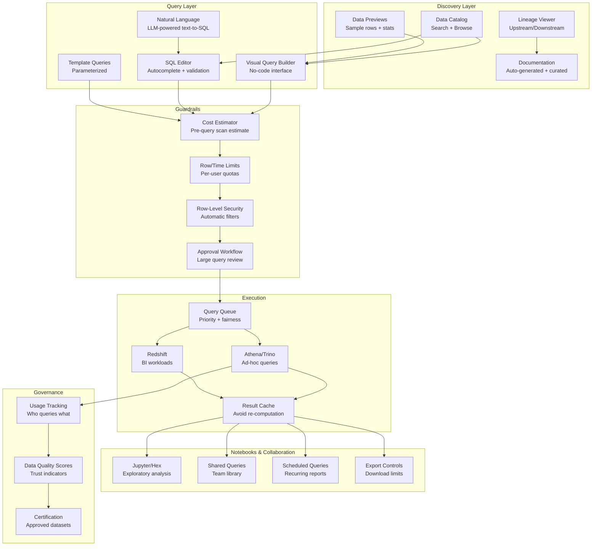

# Self-Serve Analytics Platform (Democratize Data)

## Problem Statement

Data teams become bottlenecks when every business question requires a data engineer to write a query. At scale (1000+ knowledge workers needing data access), the backlog grows to weeks. Self-serve analytics must empower non-technical users to find, query, and visualize data safely—without causing $50K query accidents, exposing PII, or overwhelming the warehouse. The challenge: balance empowerment with guardrails, providing the power of SQL with the safety of a controlled environment.

## Architecture Diagram



## Component Breakdown

### 1. Data Catalog & Discovery

```yaml
data_catalog:
  search:
    engine: "Elasticsearch / Algolia"
    indexed_fields:
      - table_name
      - column_names
      - descriptions
      - tags
      - owner
      - sample_values
      - related_queries

  auto_documentation:
    column_stats:
      - type, nullability, uniqueness
      - min/max/avg for numerics
      - top-10 values for categoricals
      - freshness (last update time)
    generated_description: "LLM-based from column name + stats + usage patterns"

  trust_signals:
    certified: "Gold badge - verified by data team"
    popular: "Used by 50+ people this month"
    fresh: "Updated < 1 hour ago"
    tested: "dbt tests passing"
    documented: "Description + owner assigned"
```

### 2. Visual Query Builder

```typescript
// Visual query builder component
interface QueryBuilderConfig {
  tables: TableMetadata[];
  maxRows: number;
  maxCostDollars: number;
  allowedOperations: ('select' | 'filter' | 'group' | 'sort' | 'join')[];
}

class VisualQueryBuilder {
  buildQuery(selections: UserSelections): SQLQuery {
    const sql = new SQLBuilder();

    // SELECT
    sql.select(selections.columns.map(col => {
      if (col.aggregation) return `${col.aggregation}(${col.name}) as ${col.alias}`;
      return col.name;
    }));

    // FROM with automatic joins
    sql.from(selections.primaryTable);
    for (const join of this.inferJoins(selections)) {
      sql.join(join.table, join.condition, join.type);
    }

    // WHERE (user filters + RLS filters)
    for (const filter of selections.filters) {
      sql.where(this.buildFilterClause(filter));
    }

    // GROUP BY (auto-inferred from aggregations)
    if (selections.columns.some(c => c.aggregation)) {
      const groupCols = selections.columns.filter(c => !c.aggregation);
      sql.groupBy(groupCols.map(c => c.name));
    }

    // Apply guardrails
    sql.limit(Math.min(selections.limit || 10000, this.config.maxRows));

    return sql.build();
  }

  private inferJoins(selections: UserSelections): JoinSpec[] {
    // Use foreign key metadata to auto-join tables
    const tables = new Set(selections.columns.map(c => c.table));
    return this.catalog.findJoinPath([...tables]);
  }
}
```

### 3. Natural Language to SQL

```python
class TextToSQLEngine:
    """LLM-powered natural language query interface."""

    def __init__(self, llm_client, catalog):
        self.llm = llm_client
        self.catalog = catalog

    def query(self, natural_language: str, user: User) -> SQLResult:
        # Get relevant schema context
        relevant_tables = self.catalog.search(natural_language, limit=5)
        schema_context = self._build_schema_context(relevant_tables)

        # Generate SQL
        prompt = f"""Given these tables:
{schema_context}

User question: {natural_language}

Generate a SQL query. Rules:
- Use only tables/columns shown above
- Add LIMIT 1000 unless aggregating
- Never SELECT * on large tables
- Use appropriate date filters

SQL:"""

        generated_sql = self.llm.generate(prompt)

        # Validate generated SQL
        validation = self.validate(generated_sql, user)
        if not validation.is_safe:
            return SQLResult(error=f"Query blocked: {validation.reason}")

        # Explain in plain English
        explanation = self.llm.generate(f"Explain this SQL in plain English:\n{generated_sql}")

        return SQLResult(
            sql=generated_sql,
            explanation=explanation,
            confidence=self._assess_confidence(natural_language, generated_sql),
            needs_review=validation.cost_estimate > 10.0
        )
```

### 4. Guardrails & Cost Control

```python
class QueryGuardrails:
    """Prevent expensive/dangerous queries from non-expert users."""

    TIER_LIMITS = {
        'viewer': {'max_scan_gb': 10, 'max_rows': 10000, 'max_runtime_sec': 60},
        'analyst': {'max_scan_gb': 100, 'max_rows': 1000000, 'max_runtime_sec': 300},
        'power_user': {'max_scan_gb': 1000, 'max_rows': 10000000, 'max_runtime_sec': 900},
        'admin': {'max_scan_gb': None, 'max_rows': None, 'max_runtime_sec': 3600},
    }

    def validate_query(self, sql: str, user: User) -> ValidationResult:
        limits = self.TIER_LIMITS[user.tier]

        # Estimate cost before execution
        plan = self.warehouse.explain(sql)
        estimated_scan_gb = plan.estimated_bytes_scanned / 1e9
        estimated_cost = estimated_scan_gb * 5.0 / 1000  # $5/TB scanned

        if limits['max_scan_gb'] and estimated_scan_gb > limits['max_scan_gb']:
            return ValidationResult(
                is_safe=False,
                reason=f"Query would scan {estimated_scan_gb:.1f}GB (limit: {limits['max_scan_gb']}GB)",
                suggestion="Add date filter or reduce scope"
            )

        # Check for dangerous patterns
        dangerous_patterns = [
            (r'SELECT\s+\*\s+FROM\s+\w+\s*$', "SELECT * without WHERE clause"),
            (r'CROSS\s+JOIN', "CROSS JOIN creates cartesian product"),
            (r'NOT\s+IN\s*\(SELECT', "NOT IN subquery - use NOT EXISTS instead"),
        ]
        for pattern, warning in dangerous_patterns:
            if re.search(pattern, sql, re.IGNORECASE):
                return ValidationResult(is_safe=False, reason=warning)

        # Apply daily budget
        today_spend = self.get_user_spend_today(user.id)
        if today_spend + estimated_cost > user.daily_budget:
            return ValidationResult(
                is_safe=False,
                reason=f"Daily budget exceeded (${today_spend:.2f} + ${estimated_cost:.2f} > ${user.daily_budget})"
            )

        return ValidationResult(is_safe=True, estimated_cost=estimated_cost)
```

### 5. Template Queries

```yaml
# Parameterized query templates for common questions
templates:
  - name: "Revenue by Channel"
    description: "Daily revenue breakdown by acquisition channel"
    category: "Marketing"
    parameters:
      - name: date_range
        type: date_range
        default: "last 30 days"
      - name: country
        type: select
        options_query: "SELECT DISTINCT country FROM dim_geography"
        default: "all"
    sql: |
      SELECT
        date_trunc('day', order_date) as day,
        channel,
        SUM(revenue) as total_revenue,
        COUNT(*) as order_count
      FROM fact_orders
      WHERE order_date BETWEEN :start_date AND :end_date
        AND country = :country
      GROUP BY 1, 2
      ORDER BY 1 DESC
    visualization: "line_chart"
    certified: true
    used_by: 150  # users in last 30 days

  - name: "Customer Cohort Retention"
    description: "Month-over-month retention by signup cohort"
    category: "Product"
    skill_level: "intermediate"
    parameters:
      - name: cohort_months
        type: integer
        default: 6
    sql: |
      WITH cohorts AS (
        SELECT user_id, DATE_TRUNC('month', first_order_date) as cohort
        FROM dim_customers
      )
      SELECT cohort, months_since_signup, COUNT(DISTINCT user_id) as users
      FROM cohorts c
      JOIN fact_orders o ON c.user_id = o.user_id
      GROUP BY 1, 2
```

## Data Literacy Program

```yaml
data_literacy:
  onboarding:
    - "Data platform tour (15 min video)"
    - "Finding data in the catalog (hands-on)"
    - "Your first query (template-based)"
    - "Understanding data freshness and quality"

  skill_levels:
    beginner:
      access: "Templates + Visual Builder"
      training: "2-hour workshop"
      support: "Slack channel + office hours"
    intermediate:
      access: "SQL editor + limited scan"
      training: "SQL fundamentals course"
      certification: "Pass query assessment"
    advanced:
      access: "Full SQL + notebooks + scheduling"
      training: "Advanced analytics course"
      certification: "Portfolio review by data team"

  support_model:
    slack_channel: "#data-help (response <4h)"
    office_hours: "Tue/Thu 2-3 PM with data team"
    documentation: "Searchable wiki with examples"
    champions: "One data-savvy person per team as liaison"
```

## Scaling Strategies

| Users | Approach | Infrastructure |
|-------|----------|---------------|
| <100 | Single Athena + basic catalog | $5K/month |
| 100-1000 | Trino cluster + caching + templates | $30K/month |
| 1000-10000 | Multi-engine + semantic layer + tiered access | $100K/month |

## Failure Handling

| Failure | Impact | Recovery |
|---------|--------|----------|
| Runaway query | Warehouse slowdown | Auto-kill after timeout, user notified |
| Cache miss storm | Warehouse spike | Circuit breaker, queue with priority |
| LLM generates wrong SQL | Bad results | Confidence score, "verify" prompt, human review |
| Quota exhausted | User blocked | Clear communication, escalation path |

## Cost Optimization

```yaml
cost_model_1000_users:
  warehouse_compute: $40,000/month
  platform_infrastructure: $10,000/month
  catalog_tooling: $5,000/month
  llm_api_calls: $3,000/month
  total: ~$58,000/month
  cost_per_user: $58/month

  savings_from_self_serve:
    data_team_tickets_avoided: "500/month × 2h avg = 1000h saved"
    data_engineer_cost_saved: "$80,000/month equivalent"
    faster_time_to_insight: "Days → Minutes"
    net_roi: "2-3x cost savings"
```

## Real-World Companies

| Company | Scale | Stack |
|---------|-------|-------|
| **Airbnb** | Company-wide | Dataportal + Minerva + Superset |
| **Spotify** | Thousands of users | Backstage + BigQuery + Looker |
| **Netflix** | Data-driven culture | Custom + Presto + various |
| **Uber** | 10K+ users | Querybuilder + Presto + Custom |
| **Meta** | 50K+ employees | Custom (Scuba, Hive, Presto) |

## Key Design Decisions

1. **Templates first, SQL second** — 80% of questions are variants of 20 templates
2. **Cost estimation before execution** — prevent $10K query accidents
3. **Certification tiers** — unlock capabilities as users demonstrate competence
4. **LLM-assisted, not LLM-dependent** — text-to-SQL with human verification
5. **Usage tracking drives improvement** — know which datasets and templates matter
