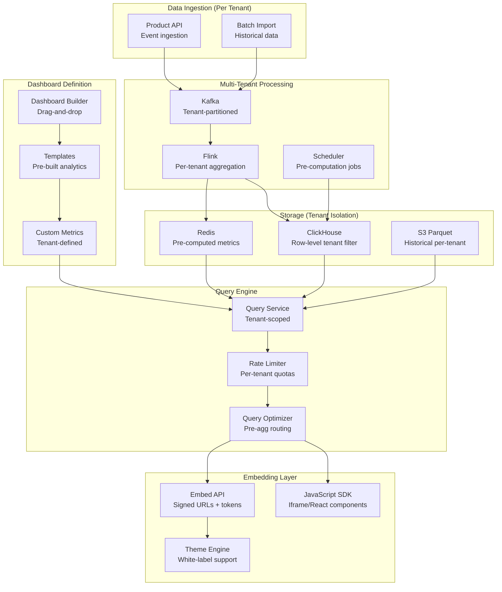

# Embedded Analytics Pipeline (Customer-Facing Analytics)

## Problem Statement

SaaS products increasingly offer analytics as a feature—showing customers their own data in dashboards embedded within the product. At 10K+ tenants, each with different data volumes and query patterns, the challenges are: strict tenant data isolation (tenant A must never see tenant B's data), sub-second query response for interactive dashboards, fair resource allocation (one large tenant shouldn't degrade others), white-label customization, and managing cost at scale where you can't pass $50/month analytics infrastructure cost to a $10/month customer.

## Architecture Diagram



## Component Breakdown

### 1. Tenant Isolation Strategy

```yaml
isolation_strategies:
  # Option 1: Row-level isolation (most common at scale)
  row_level:
    description: "Single table, tenant_id column with mandatory filter"
    pros: ["Simple ops", "Efficient storage", "Easy to scale"]
    cons: ["Requires careful query enforcement", "Noisy neighbor risk"]
    implementation: |
      -- Every query MUST include tenant filter
      SELECT metric, value FROM analytics_events
      WHERE tenant_id = :tenant_id AND date >= :start
    best_for: "10K+ tenants, similar data volumes"

  # Option 2: Schema-per-tenant
  schema_per_tenant:
    description: "Separate schema/database per tenant"
    pros: ["Strong isolation", "Easy to reason about"]
    cons: ["Connection overhead", "Schema migrations at scale"]
    best_for: "Enterprise customers, <1000 tenants"

  # Option 3: Hybrid
  hybrid:
    description: "Row-level for small tenants, dedicated for large"
    implementation:
      small_tenants: "Shared ClickHouse cluster with row filter"
      large_tenants: "Dedicated ClickHouse nodes"
      threshold: "Tenants with >100M rows get dedicated resources"
```

```python
# Mandatory tenant isolation middleware
class TenantIsolationMiddleware:
    def process_query(self, query: str, tenant_id: str) -> str:
        """Ensure every query is scoped to tenant."""
        parsed = sqlparse.parse(query)[0]

        # Verify tenant_id filter exists
        if not self._has_tenant_filter(parsed, tenant_id):
            # Inject tenant filter
            query = self._inject_tenant_filter(query, tenant_id)

        # Validate no cross-tenant joins
        if self._has_cross_tenant_access(parsed, tenant_id):
            raise SecurityError("Cross-tenant data access detected")

        return query

    def _inject_tenant_filter(self, query: str, tenant_id: str) -> str:
        """Add WHERE tenant_id = X to all table references."""
        # Using query rewriting engine
        return QueryRewriter.add_filter(query, f"tenant_id = '{tenant_id}'")
```

### 2. Per-Tenant Pre-Aggregation

```python
class TenantAggregationEngine:
    """Pre-compute common metrics per tenant for sub-second response."""

    # Standard metric templates
    METRIC_TEMPLATES = {
        'daily_active_users': """
            SELECT tenant_id, date, COUNT(DISTINCT user_id) as value
            FROM events WHERE event_type = 'session_start'
            GROUP BY tenant_id, date
        """,
        'revenue_by_day': """
            SELECT tenant_id, date, SUM(amount) as value
            FROM transactions
            GROUP BY tenant_id, date
        """,
        'feature_usage': """
            SELECT tenant_id, date, feature_name, COUNT(*) as value
            FROM events WHERE event_type = 'feature_used'
            GROUP BY tenant_id, date, feature_name
        """
    }

    def pre_aggregate(self, tenant_id: str, date: str):
        """Run pre-aggregation for a specific tenant."""
        for metric_name, query_template in self.METRIC_TEMPLATES.items():
            result = self.clickhouse.execute(query_template, {
                'tenant_id': tenant_id, 'date': date
            })
            # Store in Redis for instant access
            cache_key = f"metric:{tenant_id}:{metric_name}:{date}"
            self.redis.set(cache_key, json.dumps(result), ex=86400)

    def schedule_aggregations(self):
        """Smart scheduling based on tenant tier and activity."""
        for tenant in self.get_active_tenants():
            if tenant.tier == 'enterprise':
                frequency = '5m'  # Near real-time
            elif tenant.tier == 'pro':
                frequency = '1h'
            else:
                frequency = '6h'  # Free tier

            self.scheduler.schedule(
                self.pre_aggregate, tenant.id,
                frequency=frequency, priority=tenant.tier
            )
```

### 3. Query Quotas & Rate Limiting

```python
class TenantQueryQuota:
    """Per-tenant query quotas to prevent noisy neighbor."""

    PLAN_QUOTAS = {
        'free': {
            'queries_per_minute': 10,
            'max_query_time_sec': 5,
            'max_data_scanned_mb': 100,
            'max_concurrent': 2,
            'dashboard_refresh_interval': 300,  # 5 min minimum
        },
        'pro': {
            'queries_per_minute': 100,
            'max_query_time_sec': 30,
            'max_data_scanned_mb': 1000,
            'max_concurrent': 10,
            'dashboard_refresh_interval': 60,
        },
        'enterprise': {
            'queries_per_minute': 1000,
            'max_query_time_sec': 120,
            'max_data_scanned_mb': 10000,
            'max_concurrent': 50,
            'dashboard_refresh_interval': 10,
        }
    }

    def check_quota(self, tenant_id: str, query: Query) -> QuotaResult:
        plan = self.get_tenant_plan(tenant_id)
        quotas = self.PLAN_QUOTAS[plan]

        # Rate limit check
        current_rate = self.redis.incr(f"rate:{tenant_id}", expire=60)
        if current_rate > quotas['queries_per_minute']:
            return QuotaResult(allowed=False, reason="Rate limit exceeded",
                             retry_after_seconds=60 - self.redis.ttl(f"rate:{tenant_id}"))

        # Concurrent query check
        active = self.get_active_queries(tenant_id)
        if len(active) >= quotas['max_concurrent']:
            return QuotaResult(allowed=False, reason="Max concurrent queries reached")

        return QuotaResult(allowed=True, timeout=quotas['max_query_time_sec'])
```

### 4. Embedding SDK

```typescript
// JavaScript SDK for embedding analytics
class EmbeddedAnalytics {
  private token: string;
  private baseUrl: string;
  private theme: ThemeConfig;

  static init(config: {
    apiKey: string;
    tenantId: string;
    theme?: ThemeConfig;
    container?: string;
  }): EmbeddedAnalytics {
    return new EmbeddedAnalytics(config);
  }

  // Embed a pre-built dashboard
  renderDashboard(dashboardId: string, options: RenderOptions): void {
    const signedUrl = this.generateSignedUrl(dashboardId, {
      tenant: this.tenantId,
      expires: Date.now() + 3600000,
      filters: options.filters,
    });

    const iframe = document.createElement('iframe');
    iframe.src = signedUrl;
    iframe.style.cssText = 'width:100%;height:100%;border:none;';
    document.getElementById(options.container).appendChild(iframe);
  }

  // Embed individual chart
  renderChart(config: ChartConfig): void {
    const container = document.getElementById(config.container);
    const chart = new AnalyticsChart(container, {
      type: config.type,  // 'line', 'bar', 'pie', 'table'
      query: config.query,
      theme: this.theme,
      refreshInterval: config.refreshInterval || 60,
    });
    chart.load(this.fetchData.bind(this));
  }

  // Query API directly
  async query(params: QueryParams): Promise<QueryResult> {
    const response = await fetch(`${this.baseUrl}/api/v1/query`, {
      method: 'POST',
      headers: {
        'Authorization': `Bearer ${this.token}`,
        'X-Tenant-ID': this.tenantId,
      },
      body: JSON.stringify(params),
    });
    return response.json();
  }
}

// Usage in customer's application
const analytics = EmbeddedAnalytics.init({
  apiKey: 'pk_live_xxx',
  tenantId: 'customer_123',
  theme: {
    primaryColor: '#1a73e8',
    fontFamily: 'Inter',
    borderRadius: '8px',
    darkMode: false,
  }
});

analytics.renderDashboard('usage-overview', {
  container: 'analytics-container',
  filters: { dateRange: 'last_30_days' },
});
```

### 5. White-Label Customization

```yaml
white_label_config:
  branding:
    logo: "customer_uploaded_url"
    colors:
      primary: "#1a73e8"
      secondary: "#34a853"
      background: "#ffffff"
      text: "#202124"
    fonts:
      heading: "Inter"
      body: "Inter"
    border_radius: "8px"

  custom_domain:
    enabled: true  # analytics.customer-domain.com
    ssl: "auto (Let's Encrypt)"

  feature_flags:
    show_powered_by: false  # Enterprise only
    allow_csv_export: true
    allow_api_access: true
    custom_metrics: true
    scheduled_reports: true

  localization:
    supported: ["en", "es", "fr", "de", "ja", "pt"]
    number_format: "locale-aware"
    date_format: "locale-aware"
    timezone: "customer-configured"
```

## Scaling for 10K Tenants

```yaml
architecture_at_10k_tenants:
  total_data: "50TB across all tenants"
  median_tenant_data: "500MB"
  p99_tenant_data: "50GB"
  total_queries_per_second: 5000

  infrastructure:
    clickhouse:
      nodes: 12 (shared cluster)
      dedicated_for_large: 3 nodes (top 10 tenants)
    redis:
      cluster_size: "6 nodes, 96GB"
      pre_aggregated_keys: "50M"
    api_servers:
      instances: 20 (stateless)
      autoscale: "based on QPS"

  cost_per_tenant:
    free_tier: "$0.50/month"
    pro_tier: "$5/month"
    enterprise_tier: "$50/month"
    # Revenue per tenant must exceed infra cost
```

## Failure Handling

| Failure | Impact | Recovery |
|---------|--------|----------|
| ClickHouse node down | Query degradation | Replica failover, cache serves |
| Cache miss for tenant | Slower response | Direct DB query with timeout |
| Quota exhaustion | Tenant blocked | Clear error message, upgrade path |
| Pre-agg job failure | Stale metrics | Serve stale + "updating" badge |
| Tenant data corruption | Wrong metrics | Isolation prevents cross-tenant, rebuild from events |

## Cost Optimization

```yaml
cost_model_10k_tenants:
  clickhouse: $15,000/month
  redis_cache: $4,000/month
  api_servers: $8,000/month
  kafka: $5,000/month
  flink_processing: $6,000/month
  total: ~$38,000/month
  cost_per_tenant: $3.80/month avg

  optimization_strategies:
    - "Aggressive pre-aggregation (90% queries from cache)"
    - "Tiered compute: free tenants share, enterprise get priority"
    - "Cold storage for inactive tenants (auto-archive after 90 days)"
    - "Query result caching: same dashboard = one DB hit for all viewers"
```

## Real-World Companies

| Company | Tenants | Stack |
|---------|---------|-------|
| **Mixpanel** | 100K+ customers | Custom + ClickHouse |
| **Amplitude** | Tens of thousands | Custom analytics engine |
| **Metabase** | Embedded offering | Java + various DBs |
| **Cube.js** | Embedded analytics | ClickHouse/Postgres + pre-agg |
| **Preset (Superset)** | Multi-tenant | Apache Superset + Trino |
| **Sigma Computing** | Enterprise | Snowflake direct + caching |

## Key Design Decisions

1. **Row-level isolation at scale** — schema-per-tenant doesn't scale past 1000
2. **Pre-aggregate everything** — sub-second response is non-negotiable for UX
3. **Tiered resource allocation** — free/pro/enterprise get different compute budgets
4. **Signed embed URLs** — secure, stateless, cacheable
5. **Cache before query** — 90%+ of dashboard loads should hit pre-computed results
