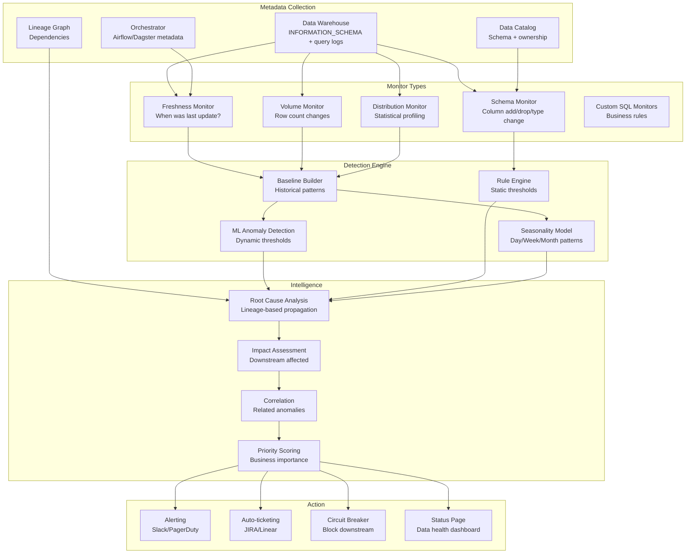

# Data Observability Platform (Monte Carlo/Elementary Style)

## Problem Statement

Data pipelines break silently—tables stop updating, row counts drop 50%, distributions shift, schemas change without notice. Unlike application monitoring (where errors are loud), data issues manifest as "the dashboard looks wrong" reported by a VP two days later. At scale with 10K+ tables and 1000+ pipelines, manual monitoring is impossible. A data observability platform must automatically detect freshness issues, volume anomalies, schema changes, distribution shifts, and lineage-based impact—without requiring manual threshold configuration for every table.

## Architecture Diagram



## Component Breakdown

### 1. Auto-Generated Monitors

```python
class AutoMonitorGenerator:
    """Automatically create monitors for all tables without configuration."""

    def generate_monitors(self, table: TableMetadata) -> List[Monitor]:
        monitors = []

        # Freshness monitor (every table)
        monitors.append(FreshnessMonitor(
            table=table.name,
            check_column=self._find_timestamp_column(table),
            expected_frequency=self._infer_update_frequency(table),
            sensitivity=self._get_sensitivity(table)
        ))

        # Volume monitor (every table with sufficient history)
        if table.history_days > 7:
            monitors.append(VolumeMonitor(
                table=table.name,
                model='seasonal_decomposition',
                min_history_days=14,
                anomaly_threshold=3.0  # 3 sigma
            ))

        # Schema monitor (every table)
        monitors.append(SchemaMonitor(
            table=table.name,
            track=['column_add', 'column_drop', 'type_change', 'nullable_change'],
            alert_on=['column_drop', 'type_change']  # Silent on additions
        ))

        # Distribution monitors (numeric and categorical columns)
        for col in table.columns:
            if col.type in ('INTEGER', 'FLOAT', 'DECIMAL'):
                monitors.append(DistributionMonitor(
                    table=table.name,
                    column=col.name,
                    checks=['null_rate', 'mean', 'stddev', 'min', 'max', 'quantiles'],
                    model='robust_zscore'
                ))
            elif col.type == 'STRING' and col.cardinality < 1000:
                monitors.append(DistributionMonitor(
                    table=table.name,
                    column=col.name,
                    checks=['null_rate', 'unique_count', 'top_values_shift'],
                    model='chi_squared'
                ))

        return monitors

    def _infer_update_frequency(self, table: TableMetadata) -> timedelta:
        """Learn update frequency from query history."""
        update_times = self.warehouse.query(f"""
            SELECT query_start_time
            FROM information_schema.query_history
            WHERE query_type = 'INSERT' AND query_text ILIKE '%{table.name}%'
            ORDER BY query_start_time DESC LIMIT 100
        """)
        intervals = [update_times[i] - update_times[i+1] for i in range(len(update_times)-1)]
        return statistics.median(intervals)
```

### 2. ML-Based Anomaly Detection

```python
class DataAnomalyDetector:
    """Detect anomalies using seasonality-aware models."""

    def detect_volume_anomaly(self, table: str, current_count: int) -> Optional[Anomaly]:
        # Get historical daily counts
        history = self.get_volume_history(table, days=90)

        # Decompose into trend + seasonality + residual
        from statsmodels.tsa.seasonal import seasonal_decompose
        decomposition = seasonal_decompose(history, period=7)  # Weekly seasonality

        # Get expected value for current time
        expected = decomposition.trend.iloc[-1] + decomposition.seasonal.iloc[-1 % 7]
        residual_std = decomposition.resid.std()

        z_score = (current_count - expected) / residual_std

        if abs(z_score) > 3.0:
            return Anomaly(
                type='volume',
                table=table,
                severity='critical' if abs(z_score) > 5 else 'warning',
                expected=expected,
                actual=current_count,
                z_score=z_score,
                message=f"Row count {current_count:,} deviates from expected {expected:,.0f} "
                        f"({z_score:+.1f} sigma)"
            )
        return None

    def detect_distribution_shift(self, table: str, column: str) -> Optional[Anomaly]:
        """Detect when a column's distribution changes significantly."""
        # Compare current window vs baseline
        current = self.get_column_stats(table, column, window='1d')
        baseline = self.get_column_stats(table, column, window='30d')

        # KL-divergence for categorical, KS-test for numeric
        if current.type == 'categorical':
            divergence = self._kl_divergence(baseline.distribution, current.distribution)
            if divergence > 0.1:  # Threshold from calibration
                return Anomaly(type='distribution_shift', table=table, column=column,
                             detail=f"KL divergence: {divergence:.3f}")
        else:
            ks_stat, p_value = stats.ks_2samp(baseline.values, current.values)
            if p_value < 0.001:
                return Anomaly(type='distribution_shift', table=table, column=column,
                             detail=f"KS statistic: {ks_stat:.3f}, p-value: {p_value:.6f}")
        return None
```

### 3. Root Cause Analysis

```python
class RootCauseAnalyzer:
    """Use lineage to trace anomalies to their source."""

    def analyze(self, anomaly: Anomaly) -> RootCauseReport:
        # Get upstream lineage
        upstream_tables = self.lineage.get_upstream(anomaly.table, max_depth=5)

        # Check each upstream for anomalies in the same time window
        upstream_anomalies = []
        for upstream in upstream_tables:
            upstream_issues = self.get_recent_anomalies(upstream.name, window='6h')
            if upstream_issues:
                upstream_anomalies.extend(upstream_issues)

        # Find the root: the furthest upstream table with an anomaly
        if upstream_anomalies:
            root = max(upstream_anomalies, key=lambda a: a.depth_from_target)
            propagation_path = self.lineage.get_path(root.table, anomaly.table)

            return RootCauseReport(
                target_anomaly=anomaly,
                probable_root_cause=root,
                propagation_path=propagation_path,
                confidence=0.85,
                explanation=f"Issue originated in {root.table} ({root.type}: {root.message}) "
                           f"and propagated through {len(propagation_path)} tables"
            )

        # No upstream issues: this table is likely the root cause
        return RootCauseReport(
            target_anomaly=anomaly,
            probable_root_cause=anomaly,
            propagation_path=[],
            confidence=0.6,
            explanation="No upstream anomalies detected. Issue likely originates at this table."
        )

    def assess_impact(self, anomaly: Anomaly) -> ImpactAssessment:
        """Determine downstream impact of an anomaly."""
        downstream = self.lineage.get_downstream(anomaly.table, max_depth=10)

        return ImpactAssessment(
            tables_affected=len(downstream),
            dashboards_affected=self._find_affected_dashboards(downstream),
            teams_affected=self._find_affected_teams(downstream),
            sla_at_risk=[t for t in downstream if t.has_sla],
            customer_facing=[t for t in downstream if t.is_customer_facing],
            blast_radius='critical' if len(downstream) > 50 else 'high' if len(downstream) > 10 else 'low'
        )
```

### 4. Schema Change Detection

```python
class SchemaMonitor:
    def detect_changes(self, table: str) -> List[SchemaChange]:
        current_schema = self.warehouse.get_schema(table)
        previous_schema = self.store.get_last_known_schema(table)

        if not previous_schema:
            self.store.save_schema(table, current_schema)
            return []

        changes = []
        current_cols = {c.name: c for c in current_schema.columns}
        previous_cols = {c.name: c for c in previous_schema.columns}

        # Detect additions
        for name in set(current_cols) - set(previous_cols):
            changes.append(SchemaChange(
                type='column_added', column=name,
                detail=f"Type: {current_cols[name].type}",
                severity='info'
            ))

        # Detect removals (breaking!)
        for name in set(previous_cols) - set(current_cols):
            changes.append(SchemaChange(
                type='column_dropped', column=name,
                severity='critical',
                downstream_impact=self.lineage.get_column_downstream(table, name)
            ))

        # Detect type changes
        for name in set(current_cols) & set(previous_cols):
            if current_cols[name].type != previous_cols[name].type:
                changes.append(SchemaChange(
                    type='type_changed', column=name,
                    detail=f"{previous_cols[name].type} → {current_cols[name].type}",
                    severity='high'
                ))

        self.store.save_schema(table, current_schema)
        return changes
```

### 5. Data Health Score

```python
class DataHealthScorer:
    """Compute overall health score for each table."""

    def compute_score(self, table: str) -> HealthScore:
        signals = {
            'freshness': self._freshness_score(table),      # 0-100
            'volume': self._volume_score(table),            # 0-100
            'schema_stability': self._schema_score(table),  # 0-100
            'distribution': self._distribution_score(table),# 0-100
            'test_pass_rate': self._test_score(table),     # 0-100
        }

        weights = {
            'freshness': 0.30,
            'volume': 0.25,
            'schema_stability': 0.15,
            'distribution': 0.20,
            'test_pass_rate': 0.10,
        }

        overall = sum(signals[k] * weights[k] for k in signals)

        return HealthScore(
            table=table,
            overall=overall,
            signals=signals,
            status='healthy' if overall > 80 else 'degraded' if overall > 50 else 'critical',
            trend=self._get_trend(table)  # improving/stable/degrading
        )
```

## Scaling Strategies

| Tables Monitored | Checks/Hour | Architecture |
|-----------------|-------------|--------------|
| 100 | 1K | Single service + PostgreSQL |
| 1K | 50K | Distributed workers + Redis queue |
| 10K | 500K | Event-driven + streaming anomaly detection |
| 100K | 5M | Fully distributed, ML at edge |

## Failure Handling

| Failure | Impact | Recovery |
|---------|--------|----------|
| Monitor service down | Blind spot | Heartbeat watchdog, multi-instance |
| Warehouse query timeout | Missed check | Retry with backoff, prioritize critical tables |
| False positive storm | Alert fatigue | Auto-suppress if >20 alerts in 5min, require confirmation |
| ML model drift | Poor detection | Weekly model retraining, fallback to static thresholds |

## Cost Optimization

```yaml
cost_model_10k_tables:
  metadata_queries: $8,000/month    # Warehouse compute for checks
  compute: $5,000/month             # Detection engine
  storage: $2,000/month             # History + baselines
  alerting: $1,000/month
  total: ~$16,000/month
  cost_per_table: $1.60/month

  optimization:
    - "Profile only changed partitions (skip unchanged)"
    - "Adaptive check frequency (hourly for critical, daily for cold)"
    - "Sample large tables (1% sample for distribution checks)"
    - "Use warehouse metadata views (free) before running queries"
```

## Real-World Companies

| Company | Approach | Stack |
|---------|----------|-------|
| **Monte Carlo** | Product | Custom ML + multi-warehouse connectors |
| **Elementary** | Open source | dbt native + configurable |
| **Bigeye** | Product | ML-based, warehouse-native |
| **Soda** | Open source + cloud | Python checks + SodaCL |
| **Datadog** | Product feature | Integrated with existing monitoring |
| **Metaplane** | Product | Anomaly detection + lineage |

## Key Design Decisions

1. **Auto-generated monitors** — zero-config coverage for all tables from day 1
2. **Seasonality-aware ML** — Monday counts differ from Saturday; model must know
3. **Lineage-powered RCA** — don't just alert on symptoms, find the root cause
4. **Health scores** — single number for executives, drill-down for engineers
5. **Circuit breaker pattern** — block downstream pipelines when upstream is broken
