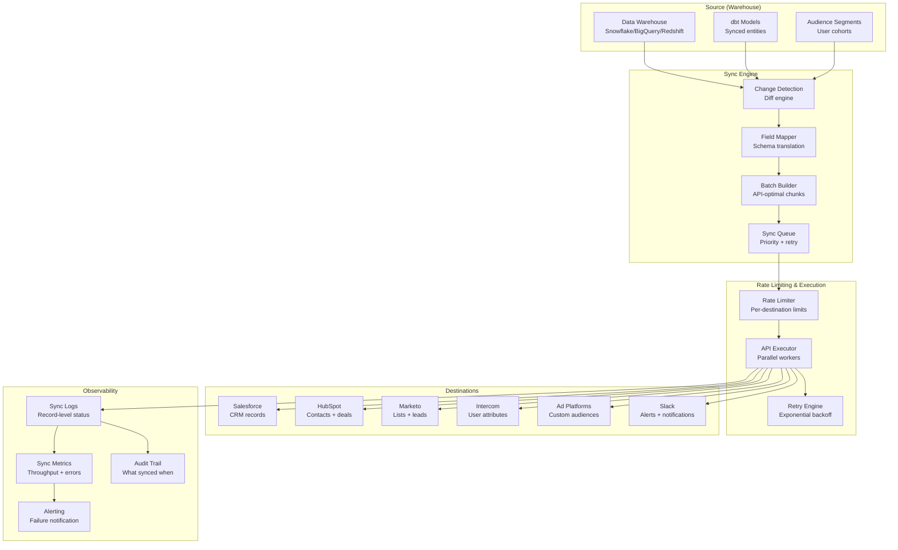

# Reverse ETL Pipeline (Census/Hightouch Style)

## Problem Statement

Data warehouses contain rich, consolidated customer profiles, segments, and metrics—but the tools that need this data (Salesforce, HubSpot, Marketo, Intercom, ad platforms) are disconnected. Sales reps want lead scores in their CRM, marketers need segments in their email tools, and support needs health scores in their ticketing system. Manually exporting CSVs is error-prone and stale within hours. At 100M+ records synced across dozens of destinations, the challenge is: efficiently detect what changed, respect API rate limits, handle field mapping complexity, resolve conflicts, and maintain sync reliability.

## Architecture Diagram



## Component Breakdown

### 1. Change Detection (CDC from Warehouse)

```python
class WarehouseCDC:
    """Detect which records changed since last sync."""

    def detect_changes(self, sync_config: SyncConfig) -> ChangeSet:
        last_sync = self.get_last_sync_state(sync_config.sync_id)

        if sync_config.cdc_strategy == 'timestamp':
            return self._timestamp_based(sync_config, last_sync)
        elif sync_config.cdc_strategy == 'hash':
            return self._hash_based(sync_config, last_sync)
        elif sync_config.cdc_strategy == 'full_diff':
            return self._full_diff(sync_config, last_sync)

    def _timestamp_based(self, config: SyncConfig, last_sync: SyncState) -> ChangeSet:
        """Use updated_at column for incremental detection."""
        query = f"""
            SELECT * FROM {config.source_model}
            WHERE updated_at > '{last_sync.last_successful_at}'
        """
        changed_records = self.warehouse.query(query)
        return ChangeSet(
            inserts=[r for r in changed_records if r['created_at'] > last_sync.last_successful_at],
            updates=[r for r in changed_records if r['created_at'] <= last_sync.last_successful_at],
            deletes=[]  # Timestamp-based can't detect deletes
        )

    def _hash_based(self, config: SyncConfig, last_sync: SyncState) -> ChangeSet:
        """Compare row hashes for accurate change detection."""
        query = f"""
            WITH current_state AS (
                SELECT
                    {config.primary_key} as pk,
                    MD5(CONCAT_WS('|', {', '.join(config.sync_columns)})) as row_hash
                FROM {config.source_model}
            ),
            previous_state AS (
                SELECT pk, row_hash FROM _sync_state_{config.sync_id}
            )
            SELECT
                c.pk,
                CASE
                    WHEN p.pk IS NULL THEN 'INSERT'
                    WHEN c.row_hash != p.row_hash THEN 'UPDATE'
                END as change_type
            FROM current_state c
            LEFT JOIN previous_state p ON c.pk = p.pk
            WHERE p.pk IS NULL OR c.row_hash != p.row_hash

            UNION ALL

            SELECT p.pk, 'DELETE' as change_type
            FROM previous_state p
            LEFT JOIN current_state c ON p.pk = c.pk
            WHERE c.pk IS NULL
        """
        return self.warehouse.query(query)

    def _full_diff(self, config: SyncConfig, last_sync: SyncState) -> ChangeSet:
        """Full table comparison - accurate but expensive."""
        # Snapshot comparison using warehouse-native features
        query = f"""
            SELECT * FROM {config.source_model}
            MINUS
            SELECT * FROM {config.source_model} AT(TIMESTAMP => '{last_sync.last_successful_at}')
        """
        return self.warehouse.query(query)
```

### 2. Field Mapping & Transformation

```yaml
# Sync configuration with field mapping
syncs:
  - id: "lead_score_to_salesforce"
    source:
      model: "analytics.customer_360"
      primary_key: "customer_id"
      cdc_strategy: "hash"

    destination:
      type: "salesforce"
      object: "Contact"
      match_key: "Email"  # How to find existing records

    field_mappings:
      - source: "email"
        destination: "Email"
        type: "identifier"  # Used for matching

      - source: "lead_score"
        destination: "Lead_Score__c"
        type: "number"
        on_null: "skip"  # Don't overwrite with null

      - source: "segment"
        destination: "Customer_Segment__c"
        type: "picklist"
        value_mapping:
          "high_value": "Enterprise"
          "mid_value": "Mid-Market"
          "low_value": "SMB"

      - source: "last_activity_date"
        destination: "Last_Data_Activity__c"
        type: "datetime"
        timezone: "UTC"

      - source: "health_score"
        destination: "Health_Score__c"
        type: "number"
        transform: "ROUND(value, 0)"

    schedule: "every 1 hour"
    batch_size: 200  # Salesforce bulk API limit
    conflict_resolution: "warehouse_wins"  # or "destination_wins", "most_recent"
```

### 3. Rate Limiting & Execution

```python
class DestinationExecutor:
    """Execute syncs respecting destination API limits."""

    RATE_LIMITS = {
        'salesforce': {
            'api_calls_per_day': 100000,
            'bulk_api_batches': 10000,
            'records_per_batch': 10000,
            'concurrent_batches': 5,
        },
        'hubspot': {
            'api_calls_per_second': 10,
            'batch_size': 100,
            'daily_limit': 500000,
        },
        'marketo': {
            'api_calls_per_day': 50000,
            'records_per_call': 300,
            'concurrent_requests': 10,
        }
    }

    async def execute_sync(self, sync: SyncConfig, changes: ChangeSet):
        limiter = self.get_rate_limiter(sync.destination.type)
        destination = self.get_destination_client(sync.destination)

        # Split into optimal batches
        batches = self.create_batches(changes, sync.destination.type)

        results = SyncResults()
        for batch in batches:
            await limiter.acquire()  # Wait for rate limit slot

            try:
                if sync.destination.type == 'salesforce' and len(batch) > 200:
                    # Use Bulk API for large batches
                    result = await destination.bulk_upsert(
                        object=sync.destination.object,
                        external_id=sync.destination.match_key,
                        records=batch
                    )
                else:
                    # Use REST API for small batches
                    result = await destination.upsert_batch(batch)

                results.add_batch_result(result)

            except RateLimitError as e:
                await asyncio.sleep(e.retry_after)
                # Re-queue batch
                await self.queue.push(batch, priority='retry')

            except APIError as e:
                results.add_errors(batch, e)
                if e.is_retryable:
                    await self.retry_queue.push(batch, delay=self._backoff_delay(batch.retry_count))

        return results
```

### 4. Conflict Resolution

```python
class ConflictResolver:
    """Handle conflicts when both warehouse and destination have changes."""

    def resolve(self, warehouse_record: dict, destination_record: dict,
                strategy: str, field_configs: List[FieldMapping]) -> dict:

        if strategy == 'warehouse_wins':
            return warehouse_record

        elif strategy == 'destination_wins':
            # Only sync fields not modified in destination
            result = destination_record.copy()
            for field in field_configs:
                dest_field = field.destination
                if not self._was_modified_in_destination(dest_field, destination_record):
                    result[dest_field] = warehouse_record[field.source]
            return result

        elif strategy == 'most_recent':
            # Compare timestamps
            wh_updated = warehouse_record.get('updated_at')
            dest_updated = destination_record.get('LastModifiedDate')
            if wh_updated > dest_updated:
                return warehouse_record
            return destination_record

        elif strategy == 'field_level':
            # Per-field conflict resolution
            result = {}
            for field in field_configs:
                if field.conflict_resolution == 'warehouse':
                    result[field.destination] = warehouse_record[field.source]
                elif field.conflict_resolution == 'max':
                    result[field.destination] = max(
                        warehouse_record[field.source],
                        destination_record[field.destination]
                    )
                elif field.conflict_resolution == 'never_overwrite':
                    result[field.destination] = destination_record[field.destination]
            return result
```

### 5. Sync Observability

```python
class SyncObservability:
    def record_sync_result(self, sync_id: str, result: SyncResults):
        metrics = {
            'records_synced': result.total_processed,
            'records_inserted': result.inserts,
            'records_updated': result.updates,
            'records_deleted': result.deletes,
            'records_failed': result.failures,
            'sync_duration_seconds': result.duration.total_seconds(),
            'api_calls_used': result.api_calls,
        }

        # Store for dashboard
        self.metrics_store.record(sync_id, metrics)

        # Alert on issues
        if result.failure_rate > 0.05:  # >5% failure rate
            self.alert(f"Sync {sync_id}: {result.failure_rate*100:.1f}% failure rate "
                      f"({result.failures}/{result.total_processed} records)")

        if result.duration > sync_config.expected_duration * 2:
            self.alert(f"Sync {sync_id}: took {result.duration} "
                      f"(expected {sync_config.expected_duration})")

    def generate_sync_report(self, sync_id: str, period: str) -> SyncReport:
        return SyncReport(
            total_records_synced=self._total_synced(sync_id, period),
            sync_success_rate=self._success_rate(sync_id, period),
            avg_sync_latency=self._avg_latency(sync_id, period),
            common_errors=self._top_errors(sync_id, period),
            field_coverage=self._field_fill_rates(sync_id)
        )
```

## Scaling to 100M Records

```yaml
scaling_strategies:
  incremental_sync:
    description: "Only sync changed records"
    typical_change_rate: "1-5% per sync cycle"
    100m_records_synced: "1-5M records per hourly sync"

  parallel_execution:
    destinations_in_parallel: 20
    partitions_per_destination: 10
    effective_throughput: "500K records/hour per destination"

  warehouse_optimization:
    change_detection_query: "Clustered on updated_at for fast scans"
    state_table: "Materialized view of current hash state"
    cost: "$50/month for incremental queries vs $5000/month for full scans"

  destination_optimization:
    salesforce: "Bulk API 2.0 - 10K records per batch"
    hubspot: "Batch API - 100 per call, 10 concurrent"
    marketo: "Batch API - 300 per call"
```

## Failure Handling

| Failure | Impact | Recovery |
|---------|--------|----------|
| Destination API down | Sync paused | Exponential backoff, alert after 3 retries |
| Rate limit hit | Sync slowed | Queue backpressure, respect Retry-After |
| Record validation error | Single record skipped | Log error, continue batch, retry later |
| Warehouse query timeout | Sync delayed | Smaller increments, optimize query |
| Duplicate detection failure | Duplicate in destination | Idempotent upsert keys, dedup on retry |

## Cost Optimization

```yaml
cost_model_100m_records:
  warehouse_queries: $5,000/month  # Incremental change detection
  compute: $3,000/month            # Sync workers
  destination_api_costs:
    salesforce: "$0 (included in license)"
    hubspot: "$0 (included in license)"
    marketo: "$0 (within limits)"
    ad_platforms: "Varies"
  infrastructure: $4,000/month
  total: ~$12,000/month

  vs_manual:
    csv_export_labor: "$20,000/month (analyst time)"
    data_staleness_cost: "Lost deals from outdated CRM data"
    error_rate_manual: "5-10% vs <0.1% automated"
```

## Real-World Companies

| Company | Scale | Stack |
|---------|-------|-------|
| **Census** | Product | Warehouse-native reverse ETL |
| **Hightouch** | Product | Model-based syncs |
| **Rudderstack** | Reverse ETL feature | Open source + cloud |
| **Airbyte** | Reverse ETL (newer) | Open source |
| **Fivetran** | Reverse ETL | HVR-based approach |
| **Salesforce Data Cloud** | Native | CDP + reverse sync |

## Key Design Decisions

1. **Hash-based CDC** — accurate change detection without relying on timestamps
2. **Destination-native batch sizes** — respect each API's optimal batch size
3. **Idempotent upserts** — safe to retry without creating duplicates
4. **Field-level conflict resolution** — not all fields should be overwritten
5. **Incremental by default** — full syncs are expensive and disruptive
