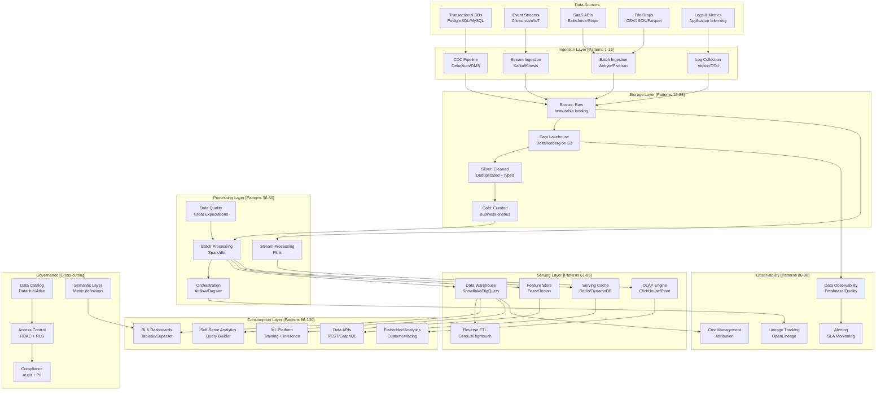

# Unified Data Platform Architecture (Complete Reference)

## Problem Statement

Building a modern data platform requires combining dozens of patterns—batch and streaming ingestion, lakehouse storage, transformation, serving, observability, and governance—into a coherent whole. Organizations spending $1M+/month face architectural sprawl: duplicated data, inconsistent metrics, ungoverned access, and operational complexity. This document provides the complete reference architecture showing how all 99 patterns fit together, when to use what, how to structure teams, and how to manage costs at enterprise scale.

## Complete Architecture Diagram



## How All 99 Patterns Fit Together

### Layer 1: Ingestion (Patterns 1-15)

| Pattern | Use When | Technology |
|---------|----------|-----------|
| CDC (Debezium) | Need real-time DB replication | Debezium → Kafka → Lakehouse |
| Event streaming | Clickstream, IoT, app events | Kafka/Kinesis direct to lakehouse |
| Batch connectors | SaaS APIs, file drops | Airbyte/Fivetran → scheduled loads |
| Log collection | Application telemetry | Vector/OTel → Kafka → ClickHouse |

### Layer 2: Storage (Patterns 16-35)

| Pattern | Use When | Technology |
|---------|----------|-----------|
| Data Lakehouse | Default for all structured/semi-structured | Delta Lake / Apache Iceberg on S3 |
| Medallion architecture | Organizing data maturity levels | Bronze → Silver → Gold |
| Streaming tables | Real-time data availability | Kafka → Delta streaming tables |
| Cold archive | Compliance, rarely accessed | S3 Glacier, 7-year retention |

### Layer 3: Processing (Patterns 36-60)

| Pattern | Use When | Technology |
|---------|----------|-----------|
| dbt transformations | SQL-based modeling | dbt Core/Cloud |
| Spark batch | Heavy computation, ML prep | Spark on EMR/Databricks |
| Flink streaming | Real-time aggregation, CEP | Flink on Kubernetes |
| Orchestration | Dependency management | Airflow/Dagster |
| Data quality | Validation gates | Great Expectations/Soda |

### Layer 4: Serving (Patterns 61-85)

| Pattern | Use When | Technology |
|---------|----------|-----------|
| Data warehouse | BI queries, ad-hoc analytics | Snowflake/BigQuery/Redshift |
| Real-time OLAP | Sub-second dashboards | ClickHouse/Apache Pinot |
| Feature store | ML feature serving | Feast/Tecton |
| Key-value serving | API-driven data products | Redis/DynamoDB |
| Reverse ETL | Activate data in SaaS tools | Census/Hightouch |

### Layer 5: Consumption (Patterns 86-100)

| Pattern | Use When | Technology |
|---------|----------|-----------|
| BI dashboards | Business reporting | Tableau/Looker/Superset |
| Self-serve analytics | Democratize data access | Query builder + guardrails |
| Embedded analytics | Customer-facing | Multi-tenant + SDK |
| ML platform | Model training + serving | MLflow/SageMaker |
| Data APIs | Programmatic access | REST/GraphQL + caching |

## Decision Framework: When to Use What

```yaml
decision_tree:
  latency_requirement:
    real_time_ms: "Flink + ClickHouse/Pinot + WebSocket"
    near_real_time_sec: "Kafka + Spark Structured Streaming + Redis"
    minutes: "Micro-batch Spark + Snowflake"
    hourly_daily: "Batch Spark/dbt + Snowflake + BI tool"

  data_volume:
    small_gb: "PostgreSQL + dbt + Metabase"
    medium_tb: "Snowflake + dbt + Looker"
    large_pb: "Lakehouse + Spark + Trino + specialized serving"

  user_type:
    executives: "Pre-built dashboards, push notifications"
    analysts: "Self-serve SQL, notebooks"
    data_scientists: "Feature store, lakehouse direct access"
    engineers: "APIs, streaming, programmatic access"
    customers: "Embedded analytics, white-label"

  budget_monthly:
    under_10k: "Snowflake + dbt Cloud + Metabase + Airbyte"
    10k_100k: "Lakehouse + Snowflake + Airflow + BI tool"
    100k_1m: "Full platform with streaming + multiple serving layers"
    over_1m: "Multi-region, dedicated teams per layer"
```

## Team Structure at Scale

```yaml
team_structure:
  # $1M+/month platform
  platform_engineering:
    headcount: 8-12
    responsibilities:
      - "Infrastructure provisioning (Terraform)"
      - "Kafka cluster management"
      - "Spark/Flink cluster operations"
      - "Security, networking, IAM"
      - "Cost optimization"
      - "SRE for data infrastructure"

  data_engineering:
    headcount: 15-25
    responsibilities:
      - "Ingestion pipeline development"
      - "dbt model development"
      - "Data quality framework"
      - "Orchestration (Airflow DAGs)"
      - "Streaming pipeline development"

  analytics_engineering:
    headcount: 8-15
    responsibilities:
      - "Semantic layer / metric definitions"
      - "BI dashboard development"
      - "Self-serve platform management"
      - "Data governance / catalog"

  ml_engineering:
    headcount: 5-10
    responsibilities:
      - "Feature engineering"
      - "Model training pipelines"
      - "ML serving infrastructure"
      - "Experiment tracking"

  data_observability:
    headcount: 3-5
    responsibilities:
      - "Monitoring framework"
      - "SLA management"
      - "Incident response"
      - "Cost attribution"

  total_headcount: 40-65
  avg_cost_per_engineer: $250,000/year (fully loaded)
  people_cost: $10-16M/year
```

## Cost Model at $1M+/Month Scale

```yaml
cost_breakdown:
  compute:
    spark_emr: $200,000/month
    flink_kubernetes: $50,000/month
    airflow: $15,000/month
    total_compute: $265,000/month

  storage:
    s3_data_lake: $80,000/month    # 5PB raw
    snowflake_warehouse: $300,000/month
    clickhouse: $50,000/month
    redis_cache: $20,000/month
    total_storage: $450,000/month

  streaming:
    kafka_msk: $80,000/month
    kinesis: $20,000/month
    total_streaming: $100,000/month

  tools_and_services:
    fivetran: $50,000/month
    dbt_cloud: $15,000/month
    observability: $30,000/month
    bi_tools: $60,000/month
    total_tools: $155,000/month

  networking:
    data_transfer: $50,000/month
    vpc_endpoints: $10,000/month
    total_networking: $60,000/month

  grand_total: ~$1,030,000/month

  optimization_levers:
    reserved_instances: "Save 30-40% on compute ($100K/month)"
    spot_instances: "Save 60% on Spark ($80K/month)"
    storage_tiering: "Save 40% on S3 ($30K/month)"
    query_optimization: "Save 20% on Snowflake ($60K/month)"
    potential_savings: "$270K/month (26%)"
```

## Migration Path: Startup to Enterprise

```yaml
evolution:
  stage_1_startup:
    budget: "$1-5K/month"
    stack: "PostgreSQL + dbt + Metabase + Fivetran"
    team: "1 data engineer"
    data_volume: "<100GB"

  stage_2_growth:
    budget: "$10-50K/month"
    stack: "Snowflake + dbt + Airflow + Looker + Airbyte"
    team: "3-5 data engineers"
    data_volume: "1-10TB"
    add: "Kafka for events, basic quality checks"

  stage_3_scale:
    budget: "$50-200K/month"
    stack: "Lakehouse + Snowflake + Kafka + Flink + BI"
    team: "10-20 engineers"
    data_volume: "10-100TB"
    add: "Real-time pipelines, feature store, observability"

  stage_4_enterprise:
    budget: "$200K-1M/month"
    stack: "Full platform (all patterns)"
    team: "20-40 engineers"
    data_volume: "100TB-1PB"
    add: "Multi-region, governance, self-serve, embedded"

  stage_5_hyperscale:
    budget: "$1M+/month"
    stack: "Custom + managed services + multi-cloud"
    team: "40-65+ engineers"
    data_volume: "1PB+"
    add: "Custom serving layers, ML at scale, global deployment"
```

## Architecture Principles

```yaml
principles:
  1_single_source_of_truth:
    description: "One definition per metric, one gold table per entity"
    implementation: "Semantic layer + data catalog + certified datasets"

  2_immutable_raw_layer:
    description: "Never modify raw data; all transformations create new tables"
    implementation: "Bronze layer append-only, versioned with lakehouse"

  3_schema_on_read_to_schema_on_write:
    description: "Accept anything at ingestion, enforce schema at serving"
    implementation: "Bronze=schema-on-read, Gold=strict schema"

  4_separation_of_storage_and_compute:
    description: "Scale independently, pay only for what you use"
    implementation: "S3 + Spark/Snowflake/Trino/ClickHouse (all queryable)"

  5_declarative_over_imperative:
    description: "Define what you want, not how to get it"
    implementation: "dbt models, Terraform infra, declarative pipelines"

  6_observability_is_not_optional:
    description: "If you can't measure it, you can't manage it"
    implementation: "Data observability from day 1, not afterthought"

  7_governance_enables_not_blocks:
    description: "Make the right thing easy, the wrong thing hard"
    implementation: "Self-serve with guardrails, not gatekeeping"

  8_cost_awareness_everywhere:
    description: "Every team knows their data platform cost"
    implementation: "Cost attribution, budgets, optimization recommendations"
```

## Anti-Patterns to Avoid

| Anti-Pattern | Why It's Bad | Better Approach |
|-------------|-------------|-----------------|
| Direct OLTP queries for analytics | Kills production DB | CDC → warehouse |
| One massive Airflow DAG | Unmaintainable, slow | Modular DAGs with clear boundaries |
| Everyone has admin warehouse access | Security + cost risk | RBAC + RLS + quotas |
| No data contracts | Breaking changes | Schema registry + contracts |
| Storing everything forever | Cost explosion | Retention policies + tiering |
| Premature real-time | Complexity without benefit | Start batch, add streaming where needed |
| Building everything custom | Slow, expensive | Buy commodity, build differentiators |

## Real-World Reference Architectures

| Company | Scale | Notable Choices |
|---------|-------|----------------|
| **Netflix** | Exabytes | Custom everything, open-sourced heavily |
| **Uber** | Petabytes | Kafka + Flink + Pinot + custom |
| **Airbnb** | Petabytes | Spark + Hive → Trino + Minerva |
| **Spotify** | Petabytes | GCP native + Beam + BigQuery |
| **LinkedIn** | Exabytes | Kafka + Spark + Pinot + Venice |
| **Stripe** | Financial scale | Spark + Airflow + custom serving |
| **Shopify** | Commerce data | Kafka + Flink + ClickHouse |

## Summary: Pattern Selection Quick Reference

```
Need real-time dashboards? → Pattern 86 (ClickHouse + WebSocket)
Need log analytics? → Pattern 87 (Kafka → Flink → ClickHouse)
Need metrics at scale? → Pattern 88 (Mimir/Thanos)
Need distributed tracing? → Pattern 89 (OTel → Flink → ClickHouse)
Need enterprise BI? → Pattern 90 (Semantic layer + caching)
Need cost visibility? → Pattern 91 (CUR + Spark + attribution)
Need lineage? → Pattern 92 (OpenLineage + graph DB)
Need pipeline SLAs? → Pattern 93 (Freshness + completeness monitors)
Need alerting? → Pattern 94 (Flink rule eval + dedup + routing)
Need compliance? → Pattern 95 (Immutable audit + WORM)
Need self-serve? → Pattern 96 (Catalog + guardrails + NL query)
Need customer analytics? → Pattern 97 (Multi-tenant + embedding)
Need data observability? → Pattern 98 (Auto-monitors + ML anomaly)
Need reverse ETL? → Pattern 99 (CDC from warehouse + sync)
Need everything? → Pattern 100 (This document - unified reference)
```

The key insight: **start simple, add complexity only when pain demands it.** Most companies need patterns 86-100 only after mastering patterns 1-85. Build incrementally, measure everything, and let the architecture evolve with the business.
