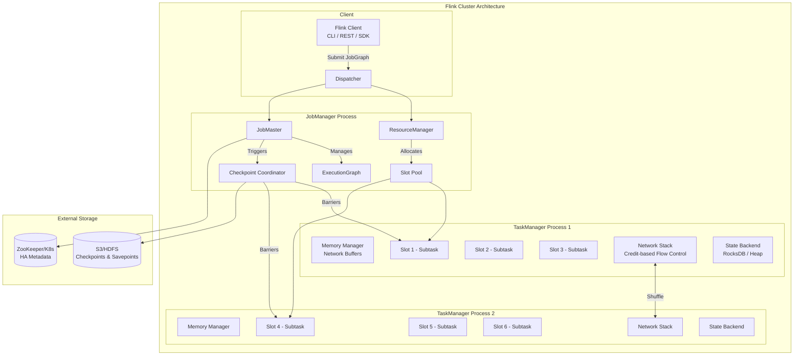
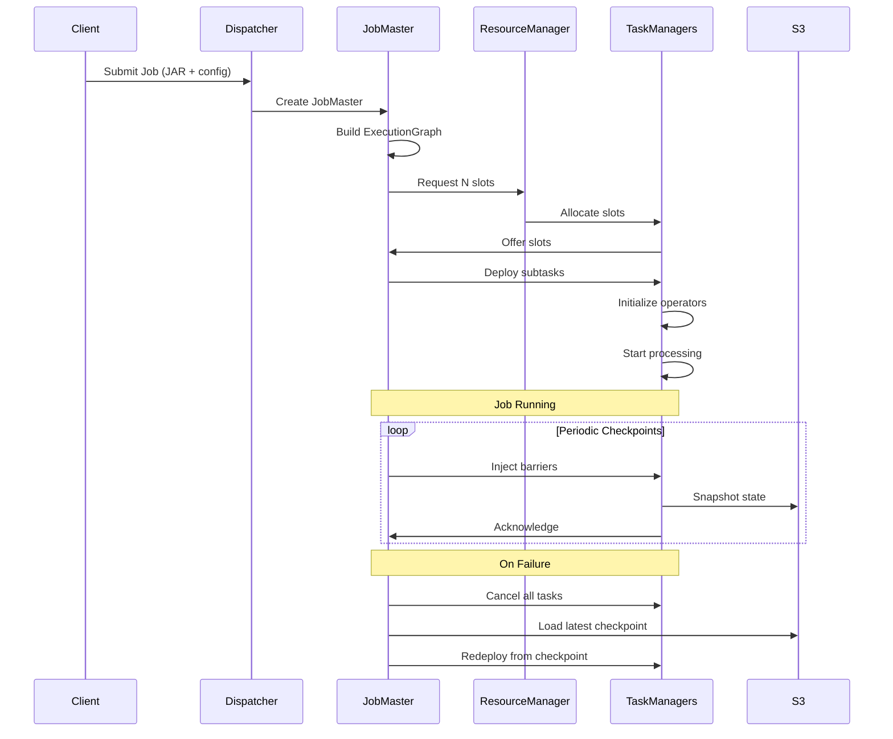
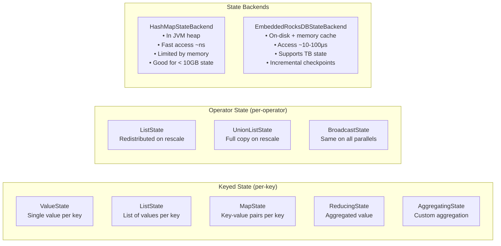
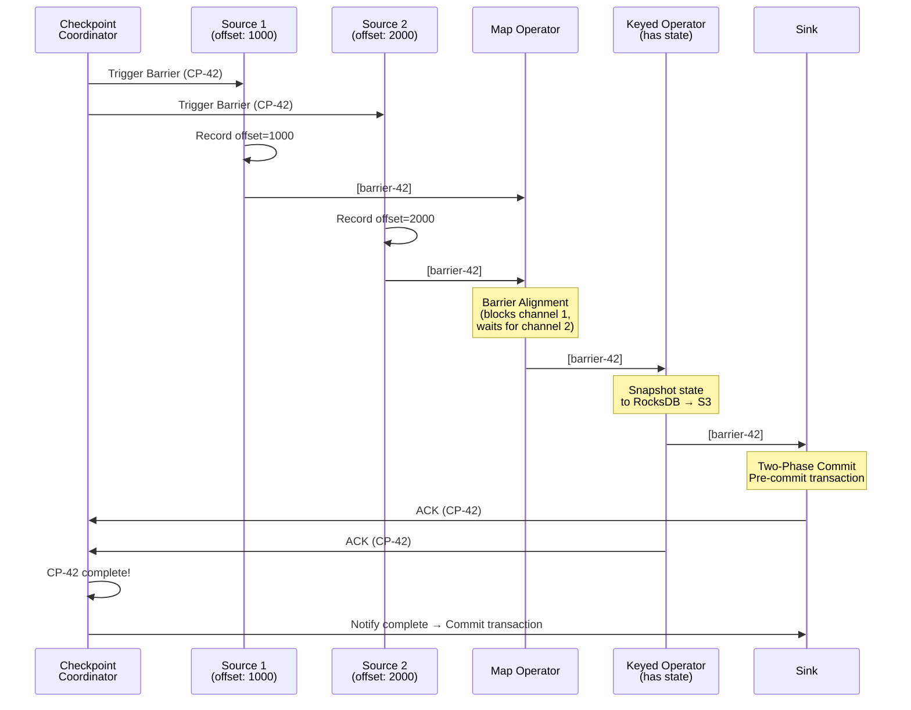
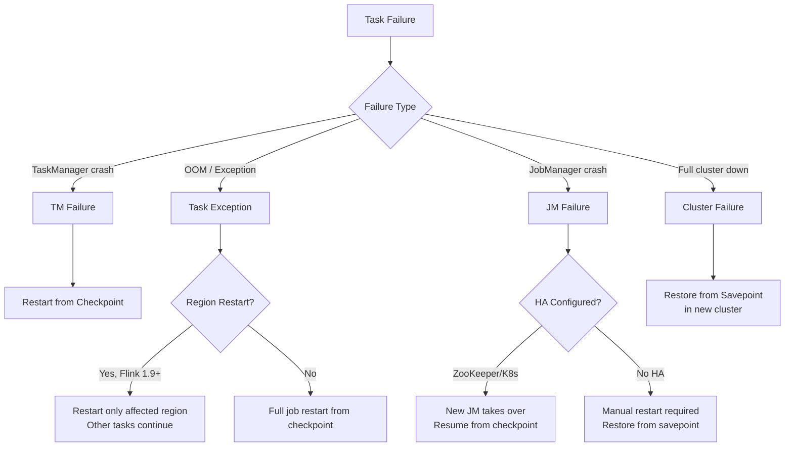
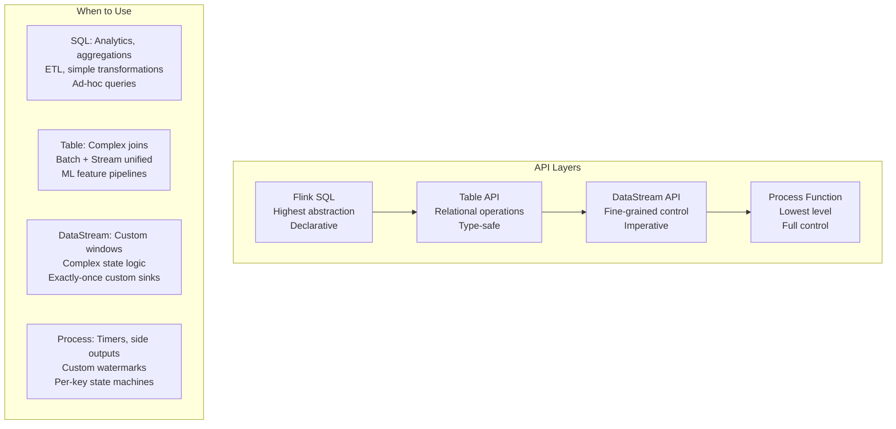

# Apache Flink Architecture Internals - Production Deep Dive

> Understanding Flink's internals is critical for production operations. This document covers every concept you need to operate Flink at billion-scale with confidence.

---

## Core Architecture



---

## Execution Model

### Job Lifecycle



### Parallelism & Task Chains

```
Source (parallelism=4) → Map (parallelism=4) → KeyBy → Reduce (parallelism=8) → Sink (parallelism=4)

Physical Execution:
┌─────────────────────────────┐     ┌─────────────────────────────┐
│ TaskManager 1               │     │ TaskManager 2               │
│ ┌─────────────────────────┐ │     │ ┌─────────────────────────┐ │
│ │ Slot 1                  │ │     │ │ Slot 3                  │ │
│ │ [Source→Map] chain (p0) │ │     │ │ [Source→Map] chain (p2) │ │
│ │ [Reduce] (p0, p1)      │ │     │ │ [Reduce] (p4, p5)      │ │
│ │ [Sink] (p0)            │ │     │ │ [Sink] (p2)            │ │
│ └─────────────────────────┘ │     │ └─────────────────────────┘ │
│ ┌─────────────────────────┐ │     │ ┌─────────────────────────┐ │
│ │ Slot 2                  │ │     │ │ Slot 4                  │ │
│ │ [Source→Map] chain (p1) │ │     │ │ [Source→Map] chain (p3) │ │
│ │ [Reduce] (p2, p3)      │ │     │ │ [Reduce] (p6, p7)      │ │
│ │ [Sink] (p1)            │ │     │ │ [Sink] (p3)            │ │
│ └─────────────────────────┘ │     │ └─────────────────────────┘ │
└─────────────────────────────┘     └─────────────────────────────┘
```

**Operator Chaining Rules:**
- Same parallelism
- Same slot sharing group
- Connected by FORWARD partitioning
- Not disabled explicitly

---

## State Management

### State Types



### RocksDB State Backend Internals (Production Default)

```
┌──────────────────────────────────────────────────────────────────────┐
│ RocksDB per Keyed Operator Instance                                   │
│                                                                        │
│  ┌──────────────┐    ┌──────────────────────────────────────────┐    │
│  │ Write Buffer │    │ Block Cache (LRU)                         │    │
│  │ (MemTable)   │    │ ┌────────┐ ┌────────┐ ┌────────┐       │    │
│  │ 64-256MB     │    │ │Block 1 │ │Block 2 │ │Block N │       │    │
│  └──────┬───────┘    │ └────────┘ └────────┘ └────────┘       │    │
│         │ Flush      └──────────────────────────────────────────┘    │
│         ▼                                                             │
│  ┌──────────────────────────────────────────────────────────────┐    │
│  │ SST Files (Sorted String Table) on Local Disk                 │    │
│  │ Level 0: [sst_001] [sst_002] [sst_003]  ← Recently flushed  │    │
│  │ Level 1: [sst_010] [sst_011] [sst_012]  ← Compacted         │    │
│  │ Level 2: [sst_020] [sst_021] ... [sst_050] ← Larger         │    │
│  │ Level 3: [sst_100] [sst_101] ... [sst_200] ← Largest        │    │
│  └──────────────────────────────────────────────────────────────┘    │
│                                                                        │
│  Key Format: [key-group][key][namespace][state-name] → [value]        │
└──────────────────────────────────────────────────────────────────────┘
```

**Production RocksDB Tuning:**

```yaml
# flink-conf.yaml production settings
state.backend.rocksdb.memory.managed: true
state.backend.rocksdb.memory.write-buffer-ratio: 0.4
state.backend.rocksdb.memory.high-prio-pool-ratio: 0.1
state.backend.rocksdb.block.cache-size: 256mb
state.backend.rocksdb.writebuffer.count: 3
state.backend.rocksdb.writebuffer.size: 128mb
state.backend.rocksdb.compaction.level.max-size-level-base: 320mb
state.backend.rocksdb.thread.num: 4

# Enable incremental checkpoints (CRITICAL for large state)
state.backend.incremental: true
```

---

## Checkpointing & Exactly-Once

### Checkpoint Algorithm (Chandy-Lamport Variant)



### Unaligned Checkpoints (Flink 1.11+)

```
Problem: Barrier alignment causes backpressure amplification

Aligned:    [data][data][BARRIER][data][data]  ← must wait for all inputs
                                                   blocked channels buffer data

Unaligned:  [data][BARRIER][data][data][data]  ← barrier overtakes in-flight data
                                                   in-flight data stored in checkpoint

Trade-off:
  Aligned:   Smaller checkpoints, but higher latency under backpressure
  Unaligned: Larger checkpoints, but consistent latency
```

**When to use Unaligned Checkpoints:**
- Backpressure is frequent and causes checkpoint timeouts
- Checkpoint duration varies wildly (> 5x normal)
- You can tolerate larger checkpoint sizes

```yaml
# Enable unaligned checkpoints
execution.checkpointing.unaligned: true
execution.checkpointing.aligned-checkpoint-timeout: 30s  # fallback
```

---

## Watermarks & Event Time

### Watermark Generation Strategies

```mermaid
graph TB
    subgraph "Watermark Strategies"
        A[Bounded Out-of-Orderness<br/>WM = max_event_time - tolerance]
        B[Punctuated Watermarks<br/>Emitted based on special events]
        C[Idle Source Detection<br/>Mark partitions as idle after timeout]
        D[Custom Watermark Strategy<br/>Business-logic based generation]
    end

    subgraph "Watermark Propagation"
        S1[Source 1<br/>WM = 10:00:05] --> OP[Operator<br/>WM = min(inputs)]
        S2[Source 2<br/>WM = 10:00:03] --> OP
        S3[Source 3<br/>WM = IDLE] --> OP
        OP -->|WM = 10:00:03| NEXT[Downstream]
    end
```

### Production Watermark Configuration

```java
// Production watermark strategy with idle detection
WatermarkStrategy
    .<Event>forBoundedOutOfOrderness(Duration.ofSeconds(30))
    .withTimestampAssigner((event, timestamp) -> event.getEventTime())
    .withIdleness(Duration.ofMinutes(1));  // Mark source idle after 1 min

// For multi-partition Kafka sources (CRITICAL)
// Each partition generates its own watermark
// Overall watermark = min(all partition watermarks)
// Idle partitions don't hold back the watermark
```

### Late Data Handling

```
Timeline:
═══════════════════════════════════════════════════════════════════
Window [10:00, 10:05)    Watermark    Allowed Lateness    Dropped
    ├────────────────────┤    │              │               │
    │ Normal processing  │    │              │               │
    │ event @10:02 ✓     │    │              │               │
    │ event @10:04 ✓     │    │              │               │
    ├────────────────────┤    │              │               │
    │ Window fires       │◄───┤ WM=10:05     │               │
    │ (first result)     │    │              │               │
    ├────────────────────┤    │              │               │
    │ Late event @10:03  │    │              │               │
    │ UPDATES window ✓   │    │◄─────────────┤ lateness=5min │
    ├────────────────────┤    │              │               │
    │ Very late @10:01   │    │              │               │
    │ WM now = 10:11     │    │              │               │
    │ SIDE OUTPUT ✗      │◄───┼──────────────┼───────────────┤
    └────────────────────┘    │              │               │
```

---

## Memory Model

```
┌─────────────────────────────────────────────────────────────────┐
│                    TaskManager Memory Layout                       │
├─────────────────────────────────────────────────────────────────┤
│                                                                   │
│  Total Process Memory (e.g., 8GB)                                │
│  ┌───────────────────────────────────────────────────────────┐  │
│  │ JVM Heap (taskmanager.memory.task.heap.size)              │  │
│  │ ┌─────────────────────────────────────────────────────┐  │  │
│  │ │ User code (operators, UDFs)                          │  │  │
│  │ │ Heap State Backend (if used)                         │  │  │
│  │ │ Typically: 1-4GB                                     │  │  │
│  │ └─────────────────────────────────────────────────────┘  │  │
│  ├───────────────────────────────────────────────────────────┤  │
│  │ Managed Memory (taskmanager.memory.managed.fraction)      │  │
│  │ ┌─────────────────────────────────────────────────────┐  │  │
│  │ │ RocksDB state (block cache + write buffers)          │  │  │
│  │ │ Batch operators (sort, hash-join)                    │  │  │
│  │ │ Python processes                                     │  │  │
│  │ │ Typically: 40% of total Flink memory                 │  │  │
│  │ └─────────────────────────────────────────────────────┘  │  │
│  ├───────────────────────────────────────────────────────────┤  │
│  │ Network Memory (taskmanager.memory.network.fraction)      │  │
│  │ ┌─────────────────────────────────────────────────────┐  │  │
│  │ │ Network buffers for shuffle (32KB each)              │  │  │
│  │ │ Upstream/downstream buffering                        │  │  │
│  │ │ Typically: 10% of total (min 64MB, max 1GB)         │  │  │
│  │ └─────────────────────────────────────────────────────┘  │  │
│  ├───────────────────────────────────────────────────────────┤  │
│  │ Framework Memory                                          │  │
│  │ ┌─────────────────────────────────────────────────────┐  │  │
│  │ │ Flink framework internals (256MB heap + 128MB off)   │  │  │
│  │ └─────────────────────────────────────────────────────┘  │  │
│  ├───────────────────────────────────────────────────────────┤  │
│  │ JVM Metaspace + Overhead                                  │  │
│  │ ┌─────────────────────────────────────────────────────┐  │  │
│  │ │ Class metadata: 256MB                                │  │  │
│  │ │ JVM overhead: 10% (threads, GC, etc.)               │  │  │
│  │ └─────────────────────────────────────────────────────┘  │  │
│  └───────────────────────────────────────────────────────────┘  │
└─────────────────────────────────────────────────────────────────┘
```

**Production Memory Configuration:**

```yaml
# 8GB TaskManager example
taskmanager.memory.process.size: 8192m
taskmanager.memory.task.heap.size: 2048m
taskmanager.memory.managed.fraction: 0.4
taskmanager.memory.network.fraction: 0.1
taskmanager.memory.network.min: 128m
taskmanager.memory.network.max: 1024m
taskmanager.memory.framework.heap.size: 256m
taskmanager.memory.framework.off-heap.size: 128m
taskmanager.memory.jvm-metaspace.size: 256m
taskmanager.memory.jvm-overhead.fraction: 0.1
```

---

## Network Stack & Backpressure

### Credit-Based Flow Control

```
┌─────────────────┐         Network Channel          ┌─────────────────┐
│  Upstream Task  │                                   │ Downstream Task │
│                 │    ┌─────────────────────────┐    │                 │
│  Result         │    │  Buffers in Flight      │    │  Input Gate     │
│  Partition      │───▶│  [buf][buf][buf][buf]   │───▶│                 │
│                 │    └─────────────────────────┘    │                 │
│  Backlog: 50    │◀── Credits Available: 3 ─────────│  Exclusive: 2   │
│  (records in    │    (downstream can receive)       │  Floating: 8    │
│   local buffer) │                                   │  (shared pool)  │
└─────────────────┘                                   └─────────────────┘

Flow:
1. Downstream grants credits (available buffers)
2. Upstream sends data only if credits > 0
3. If downstream is slow → credits deplete → upstream blocks
4. This IS backpressure — it's a feature, not a bug
```

### Backpressure Detection

```
Healthy Pipeline:
Source ──[100%]──▶ Map ──[100%]──▶ Window ──[100%]──▶ Sink
  busy: 30%         busy: 20%       busy: 50%         busy: 40%

Backpressured Pipeline:
Source ──[blocked]──▶ Map ──[blocked]──▶ Window ──[100%]──▶ Sink (SLOW!)
  busy: 95%            busy: 95%          busy: 95%         busy: 99%
  backpressured: HIGH  backpressured: HIGH  backpressured: LOW

The LAST operator with LOW backpressure + HIGH busy = BOTTLENECK
```

---

## Savepoints vs Checkpoints

| Aspect | Checkpoint | Savepoint |
|--------|-----------|-----------|
| **Purpose** | Automatic failure recovery | Planned manual backup |
| **Trigger** | Periodic (automatic) | Manual (CLI/API) |
| **Format** | State-backend specific (may be incremental) | Canonical format (portable) |
| **Lifecycle** | Auto-deleted (retained N) | Persisted until manually deleted |
| **Use Case** | Crash recovery | Upgrades, A/B testing, migration |
| **Performance** | Optimized (incremental) | Full snapshot (slower) |
| **Compatibility** | Same job only | Job changes (with UID mapping) |

**Savepoint Best Practices:**

```java
// ALWAYS set UIDs on stateful operators for savepoint compatibility
stream
    .keyBy(event -> event.getUserId())
    .process(new FraudDetector())
    .uid("fraud-detector-v1")        // ← CRITICAL for savepoint restore
    .name("Fraud Detection Process")
    .keyBy(result -> result.getRegion())
    .window(TumblingEventTimeWindows.of(Time.minutes(5)))
    .uid("5min-region-window")       // ← CRITICAL
    .aggregate(new FraudAggregator());
```

---

## Fault Tolerance Strategies

### Restart Strategies

```yaml
# Fixed-delay restart (production default)
restart-strategy: fixed-delay
restart-strategy.fixed-delay.attempts: 10
restart-strategy.fixed-delay.delay: 30s

# Exponential-delay (better for cascading failures)
restart-strategy: exponential-delay
restart-strategy.exponential-delay.initial-backoff: 1s
restart-strategy.exponential-delay.max-backoff: 120s
restart-strategy.exponential-delay.backoff-multiplier: 2.0
restart-strategy.exponential-delay.reset-backoff-threshold: 600s
restart-strategy.exponential-delay.jitter-factor: 0.1

# Failure-rate (allow N failures in time window)
restart-strategy: failure-rate
restart-strategy.failure-rate.max-failures-per-interval: 5
restart-strategy.failure-rate.failure-rate-interval: 300s
restart-strategy.failure-rate.delay: 10s
```

### Recovery Scenarios



---

## Key Configuration Reference (Production)

```yaml
# ═══════════════════════════════════════════════════════════════
# PRODUCTION FLINK CONFIGURATION (flink-conf.yaml)
# ═══════════════════════════════════════════════════════════════

# --- Checkpointing ---
execution.checkpointing.interval: 120000        # 2 minutes
execution.checkpointing.timeout: 600000         # 10 minutes
execution.checkpointing.min-pause: 60000        # 1 min between checkpoints
execution.checkpointing.max-concurrent-checkpoints: 1
execution.checkpointing.externalized-checkpoint-retention: RETAIN_ON_CANCELLATION
state.checkpoints.num-retained: 3

# --- State Backend ---
state.backend: rocksdb
state.backend.incremental: true
state.checkpoints.dir: s3://flink-state/checkpoints
state.savepoints.dir: s3://flink-state/savepoints

# --- High Availability ---
high-availability: zookeeper
high-availability.zookeeper.quorum: zk1:2181,zk2:2181,zk3:2181
high-availability.zookeeper.path.root: /flink
high-availability.storageDir: s3://flink-state/ha

# --- Network ---
taskmanager.network.memory.floating-buffers-per-gate: 256
taskmanager.network.memory.buffers-per-channel: 2
taskmanager.network.request-backoff.initial: 100
taskmanager.network.request-backoff.max: 10000

# --- Slots & Parallelism ---
taskmanager.numberOfTaskSlots: 4
parallelism.default: 32

# --- Web UI ---
rest.port: 8081
web.submit.enable: false  # Disable in production

# --- Classloader ---
classloader.resolve-order: parent-first
classloader.parent-first-patterns.additional: org.apache.kafka;org.apache.avro

# --- Metrics ---
metrics.reporters: prom
metrics.reporter.prom.factory.class: org.apache.flink.metrics.prometheus.PrometheusReporterFactory
metrics.reporter.prom.port: 9249
metrics.latency.interval: 5000
metrics.latency.granularity: operator
```

---

## DataStream API vs Table API vs Flink SQL



---

## Summary: Production Checklist

- [ ] RocksDB state backend with incremental checkpoints
- [ ] State UIDs on ALL stateful operators
- [ ] Watermark strategy with idle source detection
- [ ] Appropriate restart strategy (exponential-delay preferred)
- [ ] High Availability configured (ZK or K8s)
- [ ] Memory model properly configured (managed memory for RocksDB)
- [ ] Network buffers sized for your parallelism
- [ ] Metrics exporter enabled (Prometheus)
- [ ] Checkpoint/Savepoint directories on durable storage (S3)
- [ ] Classloader isolation for conflicting dependencies
- [ ] GC tuning for large heaps (G1GC with appropriate regions)
