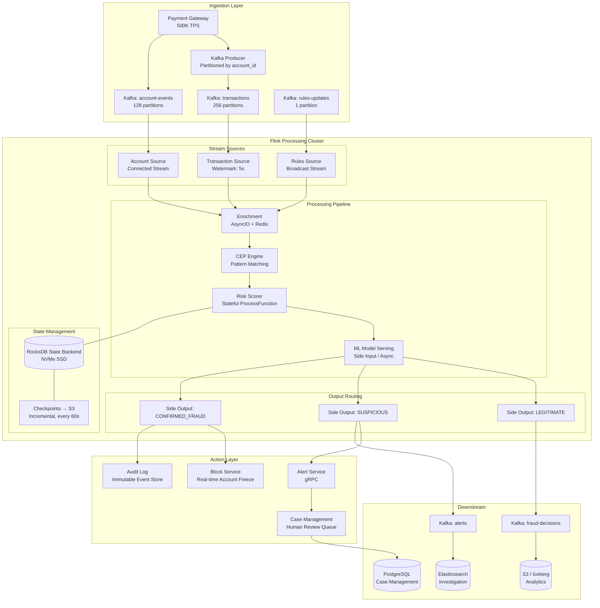
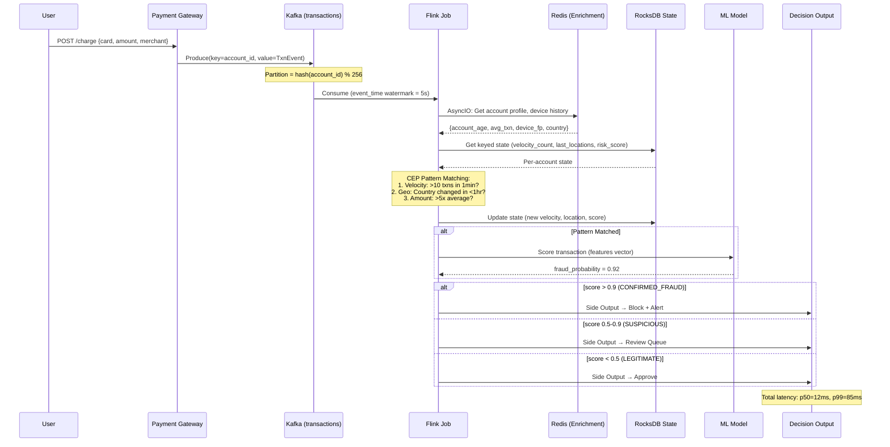
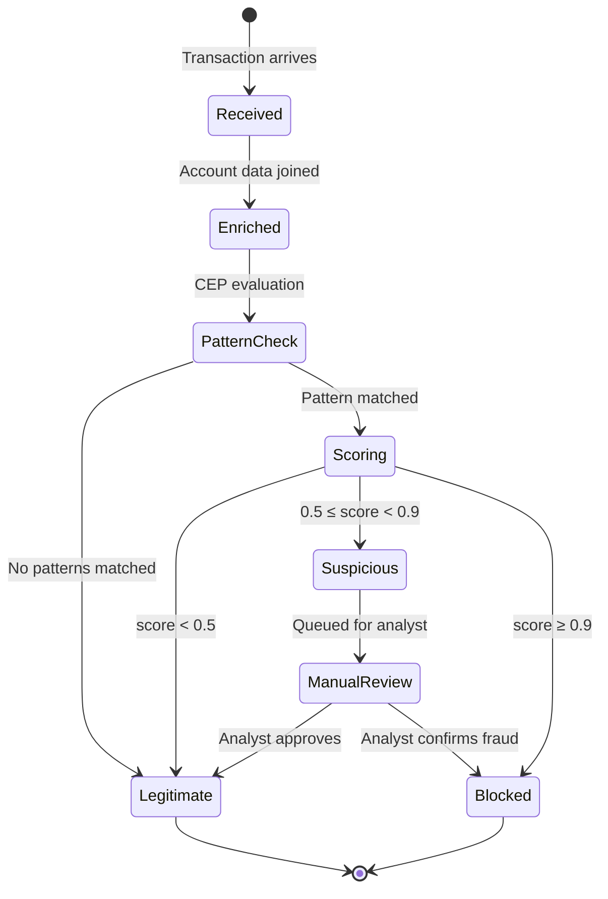
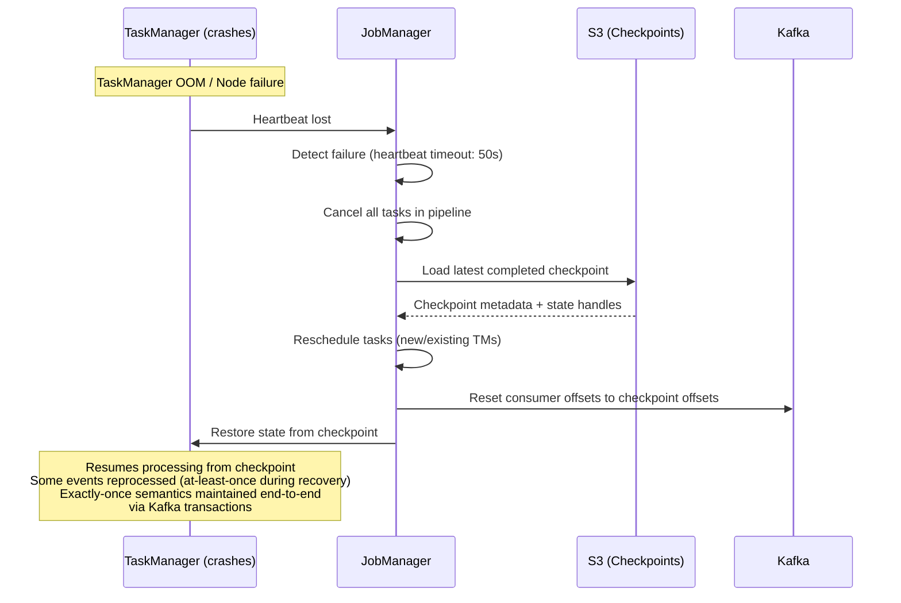

# Real-Time Fraud Detection Pipeline at Scale

## 1. Problem Statement

### The Scale of Payment Fraud

| Metric | Value |
|--------|-------|
| Global card fraud losses (2023) | $33.8B (projected $50B by 2027) |
| Transaction volume (Stripe-scale) | 500,000 TPS peak |
| Decision latency requirement | p99 < 100ms |
| False positive rate target | < 0.5% |
| True positive (fraud catch) rate | > 95% |
| Unique accounts in state | 500M+ |
| State size | 100GB - 2TB |
| Rules engine updates | Real-time, zero downtime |
| Compliance | PCI-DSS Level 1, SOX, GDPR |

### Why This is Hard

1. **Latency vs Accuracy tradeoff** - You have 100ms to make a decision that requires checking user history, velocity patterns, geo-anomalies, device fingerprints, and ML model scores
2. **State explosion** - Maintaining behavioral profiles for 500M accounts requires distributed state with sub-millisecond access
3. **Pattern complexity** - Fraud is multi-step: test transactions → escalation → burst. Single-event rules miss 60% of sophisticated fraud
4. **Exactly-once** - Double-charging or double-refunding is unacceptable. Financial correctness is paramount
5. **Regulatory** - PCI-DSS mandates audit trails, encryption at rest/in-transit, and access controls on cardholder data

### Business Impact

- **1ms latency increase** = $1M annual revenue loss (checkout abandonment)
- **0.1% false positive reduction** = $50M saved (legitimate transactions not blocked)
- **1% fraud catch improvement** = $500M fraud prevented

---

## 2. Architecture Diagram



---

## 3. Data Flow Diagram



### Transaction State Machine



---

## 4. Flink Concepts Deep Dive

### 4.1 Complex Event Processing (CEP)

CEP allows defining **temporal patterns** across event streams. Instead of evaluating each transaction independently, CEP detects multi-step fraud sequences:

**Why CEP for Fraud:**
- Card testing: Small transaction → slightly larger → burst of large transactions (all within 5 minutes)
- Account takeover: Password reset → profile change → high-value purchase
- Money laundering: Multiple small deposits just below reporting threshold ($9,999) across accounts

**How it works internally:**
- Flink CEP compiles patterns into a **Non-deterministic Finite Automaton (NFA)**
- Each incoming event is evaluated against all active pattern instances
- State is maintained per-key (account_id), so patterns are isolated per user
- Time constraints use event time, so out-of-order events are handled correctly

### 4.2 Stateful Processing

Each Flink operator maintains **per-key state** that survives failures via checkpointing.

For fraud detection, per-account state includes:
- Rolling velocity counters (transactions per minute/hour/day)
- Last N transaction locations (for geo-anomaly)
- Historical average transaction amount (for amount anomaly)
- Device fingerprint history
- Current risk score (decays over time)
- Account state machine position (normal, warned, restricted, blocked)

**Why stateful > stateless:**
- Querying an external DB for every transaction at 500K TPS would require 500K reads/s with p99 < 5ms
- Local RocksDB state provides sub-millisecond reads with zero network hop
- State is automatically partitioned and co-located with processing

### 4.3 RocksDB State Backend

**Why RocksDB (not heap):**

| Aspect | Heap (FsStateBackend) | RocksDB |
|--------|----------------------|---------|
| Max state size | ~10GB (JVM heap) | Terabytes (disk) |
| Access latency | ~100ns | ~1-10μs |
| Serialization | On checkpoint only | On every access |
| GC pressure | High (large heap) | None (off-heap) |
| Incremental checkpoints | No | Yes |

With 500M accounts × 200 bytes state each = **100GB minimum state**. This cannot fit in JVM heap.

**RocksDB tuning for fraud detection:**
```
state.backend.rocksdb.block.cache-size: 256mb
state.backend.rocksdb.writebuffer.size: 64mb
state.backend.rocksdb.writebuffer.count: 4
state.backend.rocksdb.compaction.style: LEVEL
state.backend.rocksdb.use-bloom-filter: true
state.backend.rocksdb.bloom-filter.bits-per-key: 10
```

### 4.4 Keyed State (ValueState, MapState)

```
KeyedState per account_id:
├── ValueState<RiskScore>          → Current composite risk score
├── ValueState<Long>               → Last activity timestamp
├── MapState<String, Integer>      → Velocity counters per time window
├── MapState<String, GeoLocation>  → Recent transaction locations
├── ListState<DeviceFingerprint>   → Known devices
└── ValueState<AccountStateMachine> → Current fraud state
```

- **ValueState**: Single value per key. Used for risk score, last-seen timestamp
- **MapState**: Key-value map per key. Used for per-merchant velocity, per-country counters
- **ListState**: Append-only list per key. Used for device history, recent transactions

### 4.5 Event Time Processing

Payment events arrive out of order due to:
- Network partitions between payment processors
- Retries from mobile clients
- Batch settlement events arriving alongside real-time auth events

**Watermark strategy:**
- Bounded out-of-orderness: 5 seconds
- Late events (beyond watermark): routed to side output for reprocessing
- Idleness detection: 30s timeout for idle partitions

Without event time, a fraudster could manipulate detection by causing network delays.

### 4.6 Side Outputs

Three decision categories require different downstream handling:

```java
// Output tags
OutputTag<FraudDecision> LEGITIMATE = new OutputTag<>("legitimate"){};
OutputTag<FraudDecision> SUSPICIOUS = new OutputTag<>("suspicious"){};
OutputTag<FraudDecision> CONFIRMED_FRAUD = new OutputTag<>("confirmed-fraud"){};
```

- **LEGITIMATE** → Kafka `fraud-decisions` topic → Gateway approves
- **SUSPICIOUS** → Alert service → Case management queue → Analyst reviews
- **CONFIRMED_FRAUD** → Block service (real-time) + Audit log + Alert

### 4.7 Connected Streams

Two streams connected and co-partitioned by `account_id`:
1. **Transaction stream** (500K TPS) - the events being scored
2. **Account events stream** (50K TPS) - profile updates, password resets, address changes

When connected, both streams are routed to the same operator instance for the same key, enabling:
- Detecting "profile change then large purchase" patterns
- Updating enrichment data in-line without external lookups

### 4.8 Broadcast State Pattern

**Problem:** Fraud rules change frequently. Compliance team adds new rules, ML models update thresholds, regional regulations change. You cannot restart a 500K TPS pipeline to update rules.

**Solution:** Broadcast state.

- Rules are published to a single-partition Kafka topic
- Flink broadcasts each rule update to ALL parallel operator instances
- Each instance stores rules in `BroadcastState` (a map accessible from all keys)
- Transaction processing reads rules from local broadcast state — zero latency

```
Rules topic (1 partition) → Broadcast to all 256 parallel instances
                            Each instance: BroadcastState<String, FraudRule>
```

---

## 5. Production Code Examples (Java)

### 5.1 Fraud CEP Pattern Definition

```java
import org.apache.flink.cep.CEP;
import org.apache.flink.cep.PatternStream;
import org.apache.flink.cep.pattern.Pattern;
import org.apache.flink.cep.pattern.conditions.SimpleCondition;
import org.apache.flink.cep.pattern.conditions.IterativeCondition;
import org.apache.flink.streaming.api.windowing.time.Time;

public class FraudPatternDefinitions {

    /**
     * Pattern: Card Testing Attack
     * Small test transaction ($1-5) followed by large transaction (>$500)
     * within 10 minutes from same account.
     */
    public static Pattern<Transaction, ?> cardTestingPattern() {
        return Pattern.<Transaction>begin("test-charge")
            .where(new SimpleCondition<Transaction>() {
                @Override
                public boolean filter(Transaction tx) {
                    return tx.getAmount().compareTo(BigDecimal.valueOf(5.0)) <= 0
                        && tx.getAmount().compareTo(BigDecimal.ZERO) > 0;
                }
            })
            .followedBy("large-charge")
            .where(new SimpleCondition<Transaction>() {
                @Override
                public boolean filter(Transaction tx) {
                    return tx.getAmount().compareTo(BigDecimal.valueOf(500.0)) > 0;
                }
            })
            .within(Time.minutes(10));
    }

    /**
     * Pattern: Velocity Attack
     * More than 10 transactions within 1 minute from same account.
     */
    public static Pattern<Transaction, ?> velocityPattern() {
        return Pattern.<Transaction>begin("rapid-fire")
            .where(new SimpleCondition<Transaction>() {
                @Override
                public boolean filter(Transaction tx) {
                    return tx.getStatus() == TransactionStatus.AUTHORIZED;
                }
            })
            .timesOrMore(10)
            .within(Time.minutes(1));
    }

    /**
     * Pattern: Geo-Impossible Travel
     * Transactions from two countries more than 500km apart
     * within 1 hour (impossible physical travel).
     */
    public static Pattern<Transaction, ?> geoAnomalyPattern() {
        return Pattern.<Transaction>begin("location-a")
            .where(new SimpleCondition<Transaction>() {
                @Override
                public boolean filter(Transaction tx) {
                    return tx.getGeoLocation() != null;
                }
            })
            .followedBy("location-b")
            .where(new IterativeCondition<Transaction>() {
                @Override
                public boolean filter(Transaction tx, Context<Transaction> ctx) throws Exception {
                    Transaction first = ctx.getEventsForPattern("location-a").iterator().next();
                    double distance = GeoUtils.haversineKm(
                        first.getGeoLocation(), tx.getGeoLocation());
                    return distance > 500.0; // 500km+ apart
                }
            })
            .within(Time.hours(1));
    }

    /**
     * Pattern: Structuring (Anti-Money Laundering)
     * Multiple deposits just below $10,000 reporting threshold
     * within 24 hours.
     */
    public static Pattern<Transaction, ?> structuringPattern() {
        return Pattern.<Transaction>begin("below-threshold")
            .where(new SimpleCondition<Transaction>() {
                @Override
                public boolean filter(Transaction tx) {
                    BigDecimal amount = tx.getAmount();
                    return amount.compareTo(BigDecimal.valueOf(8000)) >= 0
                        && amount.compareTo(BigDecimal.valueOf(10000)) < 0
                        && tx.getType() == TransactionType.DEPOSIT;
                }
            })
            .timesOrMore(3)
            .within(Time.hours(24));
    }
}
```

### 5.2 Stateful Risk Scoring ProcessFunction

```java
import org.apache.flink.api.common.state.*;
import org.apache.flink.api.common.time.Time;
import org.apache.flink.configuration.Configuration;
import org.apache.flink.streaming.api.functions.KeyedProcessFunction;
import org.apache.flink.util.Collector;
import org.apache.flink.util.OutputTag;

public class RiskScoringFunction 
    extends KeyedProcessFunction<String, EnrichedTransaction, FraudDecision> {

    // Side outputs
    public static final OutputTag<FraudDecision> SUSPICIOUS = 
        new OutputTag<FraudDecision>("suspicious"){};
    public static final OutputTag<FraudDecision> CONFIRMED_FRAUD = 
        new OutputTag<FraudDecision>("confirmed-fraud"){};

    // State descriptors
    private transient ValueState<Double> riskScoreState;
    private transient ValueState<Long> lastActivityState;
    private transient MapState<String, Integer> velocityState;
    private transient MapState<String, GeoPoint> recentLocationsState;
    private transient ValueState<AccountRiskProfile> profileState;

    @Override
    public void open(Configuration parameters) {
        // Risk score with TTL (expire inactive accounts after 90 days)
        StateTtlConfig ttlConfig = StateTtlConfig.newBuilder(Time.days(90))
            .setUpdateType(StateTtlConfig.UpdateType.OnReadAndWrite)
            .setStateVisibility(StateTtlConfig.StateVisibility.NeverReturnExpired)
            .cleanupInRocksdbCompactFilter(1000)
            .build();

        ValueStateDescriptor<Double> riskDesc = 
            new ValueStateDescriptor<>("risk-score", Double.class);
        riskDesc.enableTimeToLive(ttlConfig);
        riskScoreState = getRuntimeContext().getState(riskDesc);

        ValueStateDescriptor<Long> lastActivityDesc = 
            new ValueStateDescriptor<>("last-activity", Long.class);
        lastActivityDesc.enableTimeToLive(ttlConfig);
        lastActivityState = getRuntimeContext().getState(lastActivityDesc);

        MapStateDescriptor<String, Integer> velocityDesc = 
            new MapStateDescriptor<>("velocity", String.class, Integer.class);
        velocityDesc.enableTimeToLive(StateTtlConfig.newBuilder(Time.hours(1)).build());
        velocityState = getRuntimeContext().getMapState(velocityDesc);

        MapStateDescriptor<String, GeoPoint> geoDesc = 
            new MapStateDescriptor<>("locations", String.class, GeoPoint.class);
        geoDesc.enableTimeToLive(StateTtlConfig.newBuilder(Time.hours(24)).build());
        recentLocationsState = getRuntimeContext().getMapState(geoDesc);

        ValueStateDescriptor<AccountRiskProfile> profileDesc = 
            new ValueStateDescriptor<>("profile", AccountRiskProfile.class);
        profileDesc.enableTimeToLive(ttlConfig);
        profileState = getRuntimeContext().getState(profileDesc);
    }

    @Override
    public void processElement(EnrichedTransaction tx, Context ctx, 
                               Collector<FraudDecision> out) throws Exception {
        
        String accountId = ctx.getCurrentKey();
        long eventTime = tx.getEventTime();

        // Initialize profile if new account
        AccountRiskProfile profile = profileState.value();
        if (profile == null) {
            profile = AccountRiskProfile.newAccount(accountId);
        }

        // --- Feature Extraction ---
        double baseScore = riskScoreState.value() != null ? riskScoreState.value() : 0.0;

        // 1. Velocity check
        String minuteKey = String.valueOf(eventTime / 60000);
        Integer minuteCount = velocityState.get(minuteKey);
        int currentVelocity = (minuteCount != null ? minuteCount : 0) + 1;
        velocityState.put(minuteKey, currentVelocity);

        double velocityScore = 0.0;
        if (currentVelocity > 10) velocityScore = 0.8;
        else if (currentVelocity > 5) velocityScore = 0.4;

        // 2. Amount anomaly
        double amountScore = 0.0;
        double avgAmount = profile.getAverageTransactionAmount();
        if (avgAmount > 0 && tx.getAmount() > avgAmount * 5) {
            amountScore = 0.6;
        }
        if (avgAmount > 0 && tx.getAmount() > avgAmount * 10) {
            amountScore = 0.9;
        }

        // 3. Geo-anomaly
        double geoScore = 0.0;
        Long lastActivity = lastActivityState.value();
        if (lastActivity != null && tx.getGeoLocation() != null) {
            GeoPoint lastLocation = recentLocationsState.get("last");
            if (lastLocation != null) {
                double distance = GeoUtils.haversineKm(lastLocation, tx.getGeoLocation());
                long timeDiffHours = (eventTime - lastActivity) / 3_600_000;
                // Impossible travel: >500km in <1hr
                if (distance > 500 && timeDiffHours < 1) {
                    geoScore = 0.85;
                }
            }
        }

        // 4. Account age factor
        double ageScore = 0.0;
        if (profile.getAccountAgeDays() < 7) ageScore = 0.3;

        // 5. Time-decay previous risk score
        double decayedScore = baseScore * 0.95; // 5% decay per event

        // --- Composite Score ---
        double compositeScore = Math.min(1.0, 
            decayedScore * 0.2 +
            velocityScore * 0.25 +
            amountScore * 0.25 +
            geoScore * 0.2 +
            ageScore * 0.1
        );

        // --- Update State ---
        riskScoreState.update(compositeScore);
        lastActivityState.update(eventTime);
        if (tx.getGeoLocation() != null) {
            recentLocationsState.put("last", tx.getGeoLocation());
        }
        profile.recordTransaction(tx.getAmount());
        profileState.update(profile);

        // --- Decision ---
        FraudDecision decision = FraudDecision.builder()
            .transactionId(tx.getTransactionId())
            .accountId(accountId)
            .riskScore(compositeScore)
            .velocityScore(velocityScore)
            .amountScore(amountScore)
            .geoScore(geoScore)
            .timestamp(eventTime)
            .build();

        if (compositeScore >= 0.9) {
            decision.setVerdict(Verdict.BLOCK);
            ctx.output(CONFIRMED_FRAUD, decision);
            // Register timer to auto-review in 24h
            ctx.timerService().registerEventTimeTimer(eventTime + 86_400_000L);
        } else if (compositeScore >= 0.5) {
            decision.setVerdict(Verdict.REVIEW);
            ctx.output(SUSPICIOUS, decision);
        } else {
            decision.setVerdict(Verdict.APPROVE);
            out.collect(decision); // Main output = legitimate
        }
    }

    @Override
    public void onTimer(long timestamp, OnTimerContext ctx, 
                        Collector<FraudDecision> out) throws Exception {
        // Auto-decay risk score after 24h if no new suspicious activity
        Double currentScore = riskScoreState.value();
        if (currentScore != null && currentScore > 0.5) {
            riskScoreState.update(currentScore * 0.7); // Significant decay
        }
    }
}
```

### 5.3 Broadcast State for Dynamic Rules

```java
import org.apache.flink.api.common.state.BroadcastState;
import org.apache.flink.api.common.state.MapStateDescriptor;
import org.apache.flink.api.common.state.ReadOnlyBroadcastState;
import org.apache.flink.streaming.api.functions.co.BroadcastProcessFunction;
import org.apache.flink.util.Collector;

public class DynamicRuleEvaluator 
    extends BroadcastProcessFunction<EnrichedTransaction, FraudRule, ScoredTransaction> {

    public static final MapStateDescriptor<String, FraudRule> RULES_DESCRIPTOR =
        new MapStateDescriptor<>("fraud-rules", String.class, FraudRule.class);

    @Override
    public void processElement(EnrichedTransaction tx, ReadOnlyContext ctx, 
                               Collector<ScoredTransaction> out) throws Exception {
        
        ReadOnlyBroadcastState<String, FraudRule> rules = 
            ctx.getBroadcastState(RULES_DESCRIPTOR);

        double maxScore = 0.0;
        String triggeredRule = null;

        // Evaluate all active rules against this transaction
        for (Map.Entry<String, FraudRule> entry : rules.immutableEntries()) {
            FraudRule rule = entry.getValue();
            
            if (!rule.isEnabled()) continue;
            if (!rule.appliesTo(tx.getMerchantCategory())) continue;

            double score = rule.evaluate(tx);
            if (score > maxScore) {
                maxScore = score;
                triggeredRule = rule.getRuleId();
            }
        }

        out.collect(ScoredTransaction.builder()
            .transaction(tx)
            .ruleScore(maxScore)
            .triggeredRuleId(triggeredRule)
            .build());
    }

    @Override
    public void processBroadcastElement(FraudRule rule, Context ctx, 
                                        Collector<ScoredTransaction> out) throws Exception {
        BroadcastState<String, FraudRule> state = ctx.getBroadcastState(RULES_DESCRIPTOR);
        
        if (rule.isDeleted()) {
            state.remove(rule.getRuleId());
            LOG.info("Removed rule: {}", rule.getRuleId());
        } else {
            state.put(rule.getRuleId(), rule);
            LOG.info("Updated rule: {} (version={})", rule.getRuleId(), rule.getVersion());
        }
    }
}

// Example FraudRule model
@Data
@Builder
public class FraudRule implements Serializable {
    private String ruleId;
    private String name;
    private int version;
    private boolean enabled;
    private boolean deleted;
    private RuleType type; // VELOCITY, AMOUNT, GEO, DEVICE, CUSTOM
    private String merchantCategoryFilter; // null = all
    private Map<String, Object> parameters;
    // e.g., {"max_velocity": 10, "window_minutes": 1, "score": 0.8}
    
    public boolean appliesTo(String merchantCategory) {
        return merchantCategoryFilter == null 
            || merchantCategoryFilter.equals(merchantCategory);
    }

    public double evaluate(EnrichedTransaction tx) {
        switch (type) {
            case VELOCITY:
                int maxVelocity = (int) parameters.get("max_velocity");
                return tx.getRecentVelocity() > maxVelocity 
                    ? (double) parameters.get("score") : 0.0;
            case AMOUNT:
                double maxAmount = (double) parameters.get("max_amount");
                return tx.getAmount() > maxAmount 
                    ? (double) parameters.get("score") : 0.0;
            case GEO:
                List<String> blockedCountries = (List<String>) parameters.get("blocked_countries");
                return blockedCountries.contains(tx.getCountryCode()) 
                    ? (double) parameters.get("score") : 0.0;
            default:
                return 0.0;
        }
    }
}
```

### 5.4 Complete Job Topology

```java
import org.apache.flink.streaming.api.environment.StreamExecutionEnvironment;
import org.apache.flink.streaming.api.datastream.*;
import org.apache.flink.streaming.api.CheckpointingMode;
import org.apache.flink.connector.kafka.source.KafkaSource;
import org.apache.flink.connector.kafka.sink.KafkaSink;
import org.apache.flink.api.common.eventtime.WatermarkStrategy;

public class FraudDetectionJob {

    public static void main(String[] args) throws Exception {
        StreamExecutionEnvironment env = StreamExecutionEnvironment.getExecutionEnvironment();

        // --- Checkpointing Configuration ---
        env.enableCheckpointing(60_000, CheckpointingMode.EXACTLY_ONCE);
        env.getCheckpointConfig().setMinPauseBetweenCheckpoints(30_000);
        env.getCheckpointConfig().setCheckpointTimeout(600_000); // 10min for large state
        env.getCheckpointConfig().setMaxConcurrentCheckpoints(1);
        env.getCheckpointConfig().setTolerableCheckpointFailureNumber(3);
        env.getCheckpointConfig().enableUnalignedCheckpoints(); // Reduce backpressure during CP

        // RocksDB state backend (configured via flink-conf.yaml in production)
        // state.backend: rocksdb
        // state.checkpoints.dir: s3://fraud-detection-checkpoints/
        // state.backend.incremental: true

        // --- Sources ---
        KafkaSource<Transaction> transactionSource = KafkaSource.<Transaction>builder()
            .setBootstrapServers("kafka-broker:9092")
            .setTopics("transactions")
            .setGroupId("fraud-detection-v1")
            .setValueOnlyDeserializer(new TransactionDeserializer())
            .setProperty("isolation.level", "read_committed")
            .build();

        KafkaSource<AccountEvent> accountSource = KafkaSource.<AccountEvent>builder()
            .setBootstrapServers("kafka-broker:9092")
            .setTopics("account-events")
            .setGroupId("fraud-detection-v1")
            .setValueOnlyDeserializer(new AccountEventDeserializer())
            .build();

        KafkaSource<FraudRule> rulesSource = KafkaSource.<FraudRule>builder()
            .setBootstrapServers("kafka-broker:9092")
            .setTopics("fraud-rules")
            .setGroupId("fraud-detection-v1")
            .setValueOnlyDeserializer(new FraudRuleDeserializer())
            .setStartingOffsets(OffsetsInitializer.earliest()) // Always load all rules
            .build();

        // --- Watermark Strategy ---
        WatermarkStrategy<Transaction> txnWatermark = WatermarkStrategy
            .<Transaction>forBoundedOutOfOrderness(Duration.ofSeconds(5))
            .withTimestampAssigner((tx, ts) -> tx.getEventTime())
            .withIdleness(Duration.ofSeconds(30));

        // --- Stream Definitions ---
        DataStream<Transaction> transactions = env
            .fromSource(transactionSource, txnWatermark, "transactions")
            .uid("transaction-source")
            .setParallelism(256); // Match Kafka partitions

        DataStream<AccountEvent> accountEvents = env
            .fromSource(accountSource, WatermarkStrategy.noWatermarks(), "account-events")
            .uid("account-source")
            .setParallelism(128);

        BroadcastStream<FraudRule> rulesBroadcast = env
            .fromSource(rulesSource, WatermarkStrategy.noWatermarks(), "rules-source")
            .uid("rules-source")
            .setParallelism(1)
            .broadcast(DynamicRuleEvaluator.RULES_DESCRIPTOR);

        // --- Enrichment via AsyncIO ---
        DataStream<EnrichedTransaction> enriched = AsyncDataStream
            .unorderedWait(
                transactions.keyBy(Transaction::getAccountId),
                new AsyncRedisEnrichment(), // Fetches account profile from Redis
                50, TimeUnit.MILLISECONDS,  // Timeout
                1000                         // Max concurrent requests
            )
            .uid("async-enrichment")
            .setParallelism(256);

        // --- Connect with Account Events ---
        DataStream<EnrichedTransaction> withAccountData = enriched
            .keyBy(EnrichedTransaction::getAccountId)
            .connect(accountEvents.keyBy(AccountEvent::getAccountId))
            .process(new AccountDataConnector())
            .uid("account-connector")
            .setParallelism(256);

        // --- Apply Dynamic Rules (Broadcast) ---
        DataStream<ScoredTransaction> ruleScored = withAccountData
            .connect(rulesBroadcast)
            .process(new DynamicRuleEvaluator())
            .uid("dynamic-rules")
            .setParallelism(256);

        // --- CEP Pattern Detection ---
        KeyedStream<ScoredTransaction, String> keyedScored = 
            ruleScored.keyBy(ScoredTransaction::getAccountId);

        PatternStream<ScoredTransaction> cardTestingStream = CEP.pattern(
            keyedScored, FraudPatternDefinitions.cardTestingPattern());

        DataStream<PatternAlert> cepAlerts = cardTestingStream
            .process(new CardTestingPatternHandler())
            .uid("cep-card-testing")
            .setParallelism(256);

        // --- Final Risk Scoring ---
        SingleOutputStreamOperator<FraudDecision> decisions = ruleScored
            .keyBy(ScoredTransaction::getAccountId)
            .process(new RiskScoringFunction())
            .uid("risk-scorer")
            .setParallelism(256);

        // --- Output Routing ---
        // Main output: Legitimate transactions
        DataStream<FraudDecision> legitimate = decisions;
        DataStream<FraudDecision> suspicious = decisions.getSideOutput(RiskScoringFunction.SUSPICIOUS);
        DataStream<FraudDecision> confirmedFraud = decisions.getSideOutput(RiskScoringFunction.CONFIRMED_FRAUD);

        // --- Sinks ---
        legitimate.sinkTo(KafkaSink.<FraudDecision>builder()
            .setBootstrapServers("kafka-broker:9092")
            .setRecordSerializer(new FraudDecisionSerializer("fraud-decisions-legitimate"))
            .setDeliveryGuarantee(DeliveryGuarantee.EXACTLY_ONCE)
            .setTransactionalIdPrefix("fraud-legit")
            .build())
            .uid("sink-legitimate")
            .setParallelism(128);

        suspicious.sinkTo(KafkaSink.<FraudDecision>builder()
            .setBootstrapServers("kafka-broker:9092")
            .setRecordSerializer(new FraudDecisionSerializer("fraud-alerts"))
            .setDeliveryGuarantee(DeliveryGuarantee.EXACTLY_ONCE)
            .setTransactionalIdPrefix("fraud-suspicious")
            .build())
            .uid("sink-suspicious")
            .setParallelism(64);

        confirmedFraud.sinkTo(KafkaSink.<FraudDecision>builder()
            .setBootstrapServers("kafka-broker:9092")
            .setRecordSerializer(new FraudDecisionSerializer("fraud-confirmed"))
            .setDeliveryGuarantee(DeliveryGuarantee.EXACTLY_ONCE)
            .setTransactionalIdPrefix("fraud-confirmed")
            .build())
            .uid("sink-confirmed")
            .setParallelism(32);

        env.execute("Fraud Detection Pipeline v1");
    }
}
```

---

## 6. Scaling Strategy

### 6.1 Kafka Partitioning

```yaml
# Topic configuration for 500K TPS
transactions:
  partitions: 256
  replication-factor: 3
  configs:
    retention.ms: 604800000        # 7 days
    segment.bytes: 1073741824      # 1GB segments
    min.insync.replicas: 2
    compression.type: lz4
    message.max.bytes: 1048576     # 1MB max message
    
# Partition key: account_id
# This ensures all transactions for one account go to same partition
# → Same Flink subtask → Local state access
```

**Why 256 partitions:**
- 500K TPS / 256 = ~2K TPS per partition
- Each Flink subtask handles 1 partition
- 256 subtasks × 8 cores per TaskManager = 32 TaskManagers
- Room to scale to 512 partitions without rebalancing

### 6.2 Flink Parallelism

```yaml
# flink-conf.yaml
taskmanager.numberOfTaskSlots: 8
taskmanager.memory.process.size: 32g
taskmanager.memory.managed.fraction: 0.4  # For RocksDB
taskmanager.memory.network.fraction: 0.1
taskmanager.memory.jvm-overhead.fraction: 0.1

# Job-level
parallelism.default: 256
pipeline.max-parallelism: 512  # Allow future scaling without state migration
```

### 6.3 State Size Management

```yaml
# State TTL to prevent unbounded growth
- Active accounts (any txn in 90 days): Keep full profile
- Velocity counters: TTL = 1 hour
- Location history: TTL = 24 hours  
- Risk scores: TTL = 90 days
- Inactive accounts: Automatically expired by RocksDB compaction filter

# Expected state sizes:
# - 500M accounts × 200 bytes avg = 100GB active state
# - With RocksDB compression (LZ4): ~40GB on disk
# - Block cache: 256MB per TM × 32 TMs = 8GB total cache
```

### 6.4 Checkpoint Tuning

```yaml
# Checkpointing for 100GB+ state
execution.checkpointing.interval: 60s
execution.checkpointing.mode: EXACTLY_ONCE
execution.checkpointing.timeout: 600000        # 10 minutes
execution.checkpointing.min-pause: 30000
execution.checkpointing.max-concurrent: 1
execution.checkpointing.unaligned.enabled: true  # Critical for large state

# Incremental checkpoints (only changed SST files)
state.backend.incremental: true
# Without incremental: 100GB uploaded every 60s = impossible
# With incremental: ~1-5GB delta every 60s = feasible

# Checkpoint storage
state.checkpoints.dir: s3://fraud-checkpoints/prod/
state.savepoints.dir: s3://fraud-savepoints/prod/
state.checkpoints.num-retained: 3
```

---

## 7. Production Deployment (Kubernetes)

### Flink Kubernetes Deployment

```yaml
apiVersion: flink.apache.org/v1beta1
kind: FlinkDeployment
metadata:
  name: fraud-detection
  namespace: flink-prod
spec:
  image: fraud-detection:v2.3.1
  flinkVersion: v1_18
  flinkConfiguration:
    # State backend
    state.backend: rocksdb
    state.backend.incremental: "true"
    state.checkpoints.dir: s3://fraud-checkpoints/prod/
    state.backend.rocksdb.localdir: /mnt/nvme/rocksdb
    
    # Checkpointing
    execution.checkpointing.interval: "60000"
    execution.checkpointing.unaligned.enabled: "true"
    
    # Network
    taskmanager.network.memory.buffers-per-channel: "8"
    taskmanager.network.memory.floating-buffers-per-gate: "16"
    
    # Restart strategy
    restart-strategy: exponential-delay
    restart-strategy.exponential-delay.initial-backoff: 1s
    restart-strategy.exponential-delay.max-backoff: 60s
    restart-strategy.exponential-delay.backoff-multiplier: "2.0"
    restart-strategy.exponential-delay.reset-backoff-threshold: 300s
    
    # High availability
    high-availability.type: kubernetes
    high-availability.storageDir: s3://fraud-ha/prod/
    
    # Metrics
    metrics.reporters: prom
    metrics.reporter.prom.factory.class: org.apache.flink.metrics.prometheus.PrometheusReporterFactory
    metrics.reporter.prom.port: "9249"

  serviceAccount: flink-operator
  
  jobManager:
    resource:
      memory: "4096m"
      cpu: 2
    replicas: 2  # HA
    
  taskManager:
    resource:
      memory: "32768m"
      cpu: 8
    replicas: 32
    podTemplate:
      spec:
        containers:
          - name: flink-main-container
            volumeMounts:
              - name: nvme-storage
                mountPath: /mnt/nvme
            resources:
              requests:
                memory: "32Gi"
                cpu: "8"
                ephemeral-storage: "200Gi"
              limits:
                memory: "32Gi"
                cpu: "8"
                ephemeral-storage: "200Gi"
        volumes:
          - name: nvme-storage
            ephemeral:
              volumeClaimTemplate:
                spec:
                  accessModes: ["ReadWriteOnce"]
                  storageClassName: nvme-ssd
                  resources:
                    requests:
                      storage: 200Gi
        tolerations:
          - key: "workload-type"
            operator: "Equal"
            value: "flink"
            effect: "NoSchedule"
        nodeSelector:
          node-type: flink-compute
          
  job:
    jarURI: s3://fraud-detection-jars/fraud-detection-2.3.1.jar
    entryClass: com.company.fraud.FraudDetectionJob
    parallelism: 256
    upgradeMode: savepoint
    savepointTriggerNonce: 0
    allowNonRestoredState: false
```

### Resource Summary

| Component | Instances | CPU | Memory | Storage |
|-----------|-----------|-----|--------|---------|
| JobManager | 2 (HA) | 2 | 4 GB | - |
| TaskManager | 32 | 8 | 32 GB | 200 GB NVMe |
| **Total** | 34 | 260 | 1,032 GB | 6.4 TB |

---

## 8. Monitoring

### Key Metrics Dashboard

```yaml
# Critical Flink metrics for fraud detection
metrics:
  # Throughput
  - name: flink_taskmanager_job_task_numRecordsInPerSecond
    alert: < 400000 for 5m  # Expected ~500K, alert if drops 20%
    
  - name: flink_taskmanager_job_task_numRecordsOutPerSecond
    alert: < 400000 for 5m

  # Latency
  - name: fraud_decision_latency_p99
    alert: > 100ms  # SLA breach
    
  - name: fraud_decision_latency_p50
    alert: > 20ms   # Degradation signal

  # Backpressure
  - name: flink_taskmanager_job_task_backPressuredTimeMsPerSecond
    alert: > 500 for 2m  # >50% time backpressured
    
  - name: flink_taskmanager_job_task_busyTimeMsPerSecond
    alert: > 900 for 5m  # >90% busy = near capacity

  # Checkpointing
  - name: flink_jobmanager_job_lastCheckpointDuration
    alert: > 300000  # > 5 minutes
    
  - name: flink_jobmanager_job_numberOfFailedCheckpoints
    alert: > 0 in 10m

  # State size
  - name: flink_taskmanager_job_task_operator_state_size
    alert: growth > 10% per hour  # State leak detection

  # Business metrics
  - name: fraud_blocked_transactions_per_minute
    alert: > 1000  # Sudden spike = possible false positive storm
    
  - name: fraud_false_positive_rate
    alert: > 0.5%
```

### Prometheus Alerting Rules

```yaml
groups:
  - name: fraud-detection-critical
    rules:
      - alert: FraudPipelineLatencySLABreach
        expr: histogram_quantile(0.99, fraud_decision_latency_bucket) > 0.1
        for: 2m
        labels:
          severity: critical
          team: fraud-platform
        annotations:
          summary: "p99 latency exceeds 100ms SLA"
          
      - alert: FraudPipelineBackpressure
        expr: avg(flink_taskmanager_job_task_backPressuredTimeMsPerSecond) > 500
        for: 3m
        labels:
          severity: warning
        annotations:
          summary: "Pipeline backpressured - check downstream sinks"
          runbook: "Scale TaskManagers or check Kafka sink throughput"
          
      - alert: CheckpointFailing
        expr: increase(flink_jobmanager_job_numberOfFailedCheckpoints[10m]) > 2
        labels:
          severity: critical
        annotations:
          summary: "Checkpoints failing - exactly-once at risk"
          
      - alert: FalsePositiveSpike
        expr: fraud_blocked_rate / fraud_total_rate > 0.01
        for: 5m
        labels:
          severity: critical
        annotations:
          summary: "Block rate >1% - possible rule misconfiguration"
```

### Backpressure Handling

1. **Identify bottleneck**: Flink Web UI shows which operator is backpressured
2. **Common causes and fixes**:
   - Slow sink (Kafka/DB) → Increase sink parallelism or batch size
   - State access bottleneck → Increase RocksDB cache, check compaction
   - Skewed keys → Add pre-aggregation or split hot keys
   - Checkpoint alignment → Enable unaligned checkpoints
3. **Emergency**: If latency SLA breached, temporarily reduce CEP pattern complexity via broadcast rule update

---

## 9. Failure Handling

### What Happens When Flink Crashes



### Exactly-Once Guarantees

**End-to-end exactly-once requires:**
1. **Source**: Kafka consumer offsets committed only on checkpoint
2. **Processing**: State restored to checkpoint on failure
3. **Sink**: Kafka producer uses transactions, committed on checkpoint

**Timeline:**
```
Checkpoint N completes (offset=1000, state=S1)
  → Process events 1001-1100
  → TaskManager crashes
  → Restore checkpoint N (offset=1000, state=S1)
  → Reprocess events 1001-1100 (same state, same output)
  → Kafka transactions ensure duplicates not visible to consumers
```

### Recovery Time

| Scenario | Recovery Time |
|----------|--------------|
| Single TaskManager failure | 30-60s (heartbeat + reschedule + state restore) |
| JobManager failure (with HA) | 10-30s (standby takeover) |
| Full cluster failure | 2-5 min (new pods + full state restore from S3) |
| Corrupted checkpoint | Restore from savepoint (manual, 5-10 min) |

### Handling During Recovery

- **Gateway behavior**: Queue transactions in Kafka (Kafka handles backlog)
- **Latency spike**: Expected p99 spike to 5-30s during catch-up
- **Catch-up rate**: Pipeline processes at 2-3x normal rate until caught up
- **Data loss**: Zero (Kafka retains events, state restored from checkpoint)

---

## 10. Real Companies Using Flink for Fraud Detection

### Stripe

- **Scale**: Processes payments for millions of businesses
- **Flink use**: Real-time fraud scoring (Radar product)
- **Architecture**: Kafka → Flink → ML model serving → decision in <100ms
- **Key insight**: Uses Flink for feature computation that feeds ML models, not just rule-based detection

### PayPal

- **Scale**: 5B+ transactions/year, 400M+ active accounts
- **Flink use**: Replaced batch fraud detection with streaming
- **Result**: Reduced fraud detection latency from hours to milliseconds
- **Architecture**: Multi-layer: real-time Flink scoring + near-real-time graph analysis + batch model retraining

### Ant Financial (Alipay)

- **Scale**: Largest Flink deployment globally, processes Singles' Day peaks (500K+ TPS)
- **Flink use**: Real-time risk engine processing all Alipay transactions
- **Key innovation**: Custom Flink fork (Blink) with optimized state backend for their scale
- **State size**: Petabytes of state across thousands of nodes

### Capital One

- **Scale**: Major US bank, millions of card transactions daily
- **Flink use**: Real-time transaction monitoring and anomaly detection
- **Architecture**: AWS-based, Kinesis → Flink → DynamoDB + SNS alerts
- **Compliance**: FFIEC, PCI-DSS, SOX compliance built into pipeline

### Coinbase

- **Scale**: Cryptocurrency exchange with unique fraud patterns
- **Flink use**: Detecting wash trading, market manipulation, unauthorized withdrawals
- **Key challenge**: Blockchain transactions are irreversible — must catch fraud before execution
- **Architecture**: Flink CEP for multi-step withdrawal patterns + ML for account takeover

### Netflix (Payment Fraud)

- **Scale**: 230M+ subscribers, global payment processing
- **Flink use**: Subscription fraud, account sharing detection, payment failure prediction
- **Architecture**: Flink for real-time signals feeding into a broader ML platform

### Common Patterns Across Companies

1. **Layered defense**: Real-time rules (Flink) + ML models + human review
2. **Feature stores**: Flink computes real-time features, stored for model training and serving
3. **Feedback loops**: Analyst decisions flow back to update rules via broadcast state
4. **Shadow mode**: New rules deployed in "score but don't block" mode before activation
5. **A/B testing**: Multiple scoring strategies evaluated simultaneously via side outputs

---

## Summary: Why Flink for Fraud Detection

| Requirement | Why Flink Wins |
|-------------|---------------|
| Sub-100ms latency | Event-at-a-time processing, local state (no DB roundtrip) |
| 500K TPS | Horizontal scaling, efficient serialization, backpressure |
| Complex patterns | CEP library with temporal pattern matching |
| Stateful processing | First-class keyed state with RocksDB for TB-scale |
| Exactly-once | Checkpoint barriers + Kafka transactions |
| Dynamic rules | Broadcast state pattern — zero-downtime updates |
| Fault tolerance | Automatic recovery from distributed checkpoints |
| Event time | Watermarks handle out-of-order events correctly |
