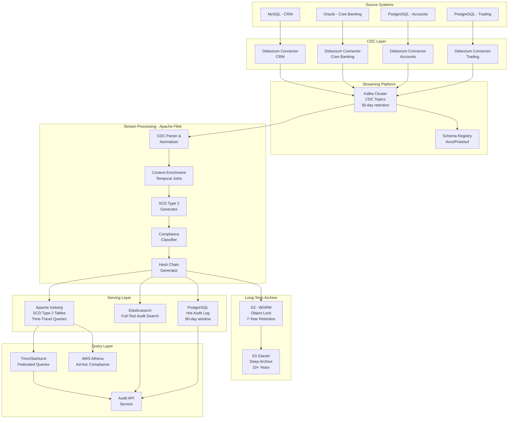
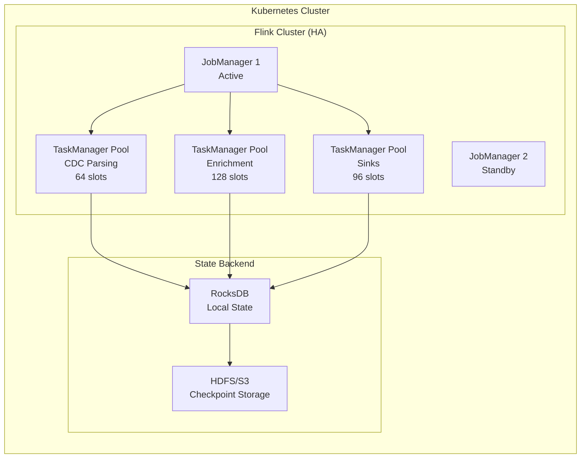
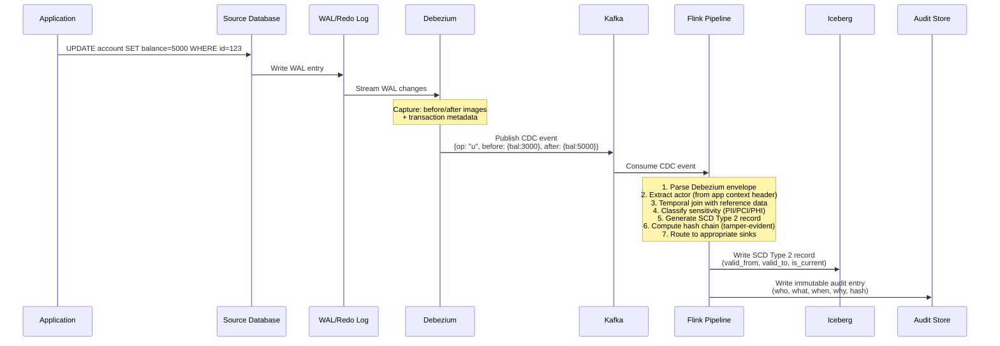
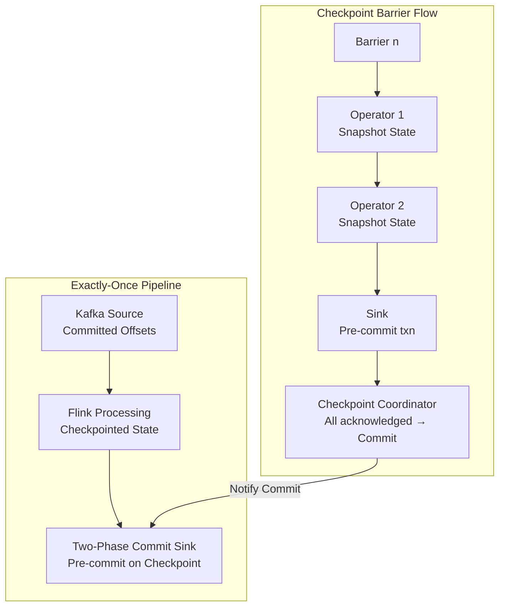
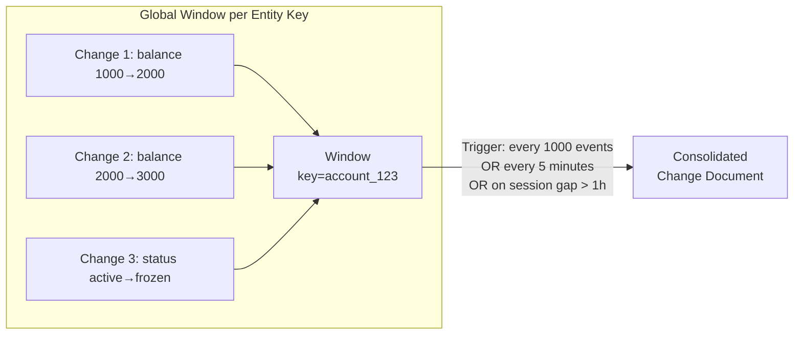
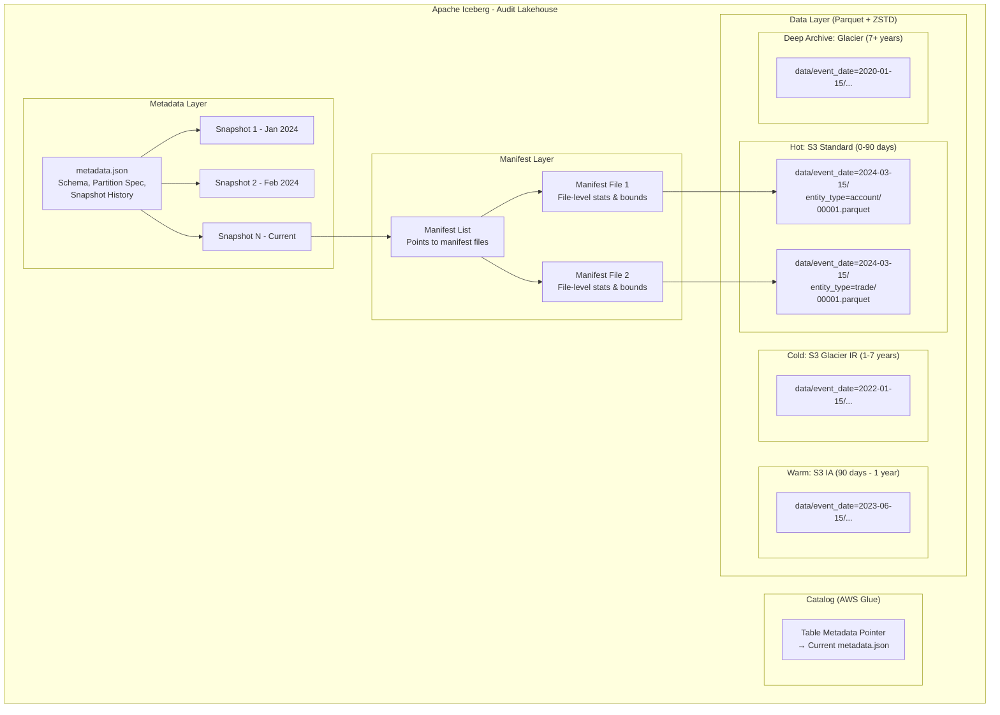
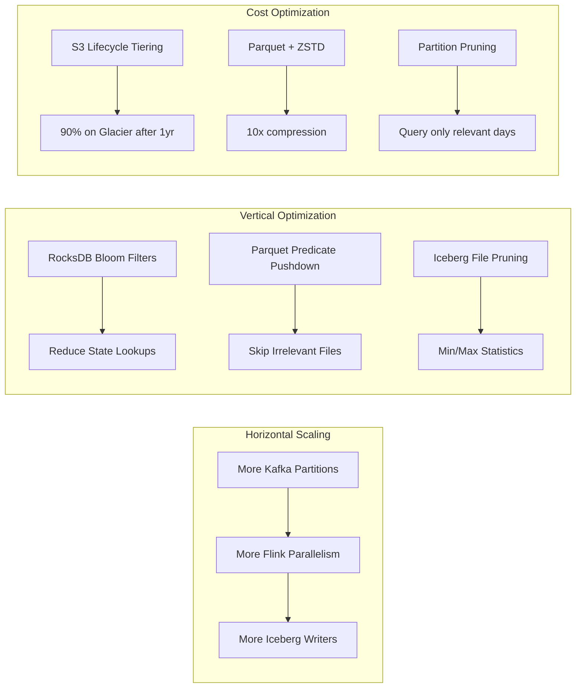
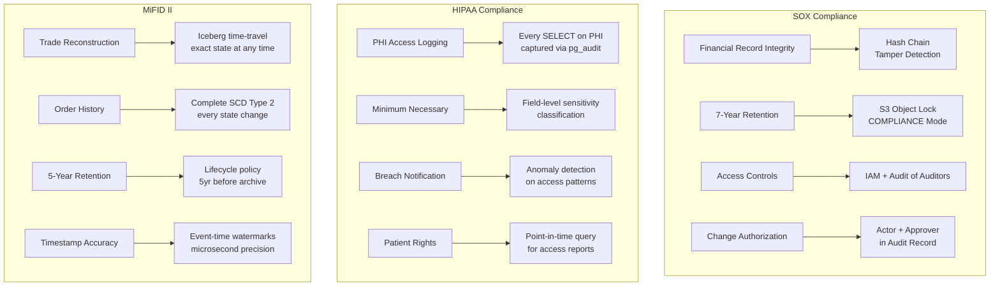
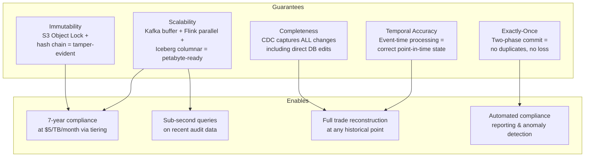

# Maintaining History & Audit Trails at Scale

## Production Pattern: CDC → Flink → Iceberg SCD Type 2 + Immutable Audit Log

> Goldman Sachs / Epic Systems / Bloomberg style — 1B+ records, 7-year retention, petabyte-scale compliance

---

## 1. Problem Statement

### Why This Exists

Every regulated industry must answer one question with absolute certainty:

> **"What was the exact state of record X at time T, who changed it, and why?"**

Failure to answer = fines in the hundreds of millions, criminal liability, and loss of operating licenses.

### Regulatory Requirements

| Regulation | Industry | Retention | Key Requirement |
|-----------|----------|-----------|-----------------|
| **SOX (Sarbanes-Oxley)** | Finance | 7 years | Complete audit trail of all financial record changes; tamper-evident |
| **HIPAA** | Healthcare | 6 years | Every access and modification to PHI must be logged with actor identity |
| **PCI-DSS** | Payments | 1 year (online), 7 years (archive) | Track all access to cardholder data; immutable logs |
| **GDPR Article 30** | All (EU) | Duration of processing + proof period | Records of processing activities; demonstrate lawful basis at any point |
| **MiFID II** | Financial Trading | 5-7 years | Every order, trade, and communication — reconstruct any trade at any time |
| **Basel III/IV** | Banking | 7+ years | Full lineage of risk calculations; reproduce any historical risk figure |
| **FINRA Rule 17a-4** | Broker-Dealers | 6 years | WORM (Write Once Read Many) storage; non-rewritable, non-erasable |

### The Technical Challenge

```
Source Systems:
- 500+ microservices writing to 200+ PostgreSQL/Oracle databases
- 1B+ record changes per day across all systems
- Average record changes 3x/day → 3B change events/day

Storage Requirements:
- 7 years × 365 days × 3B events/day = ~7.6 trillion audit records
- Average event size: 2KB → ~15 PB raw (before compression)
- Must support sub-second point-in-time queries
- Must be cryptographically tamper-evident
- Must handle late-arriving data (corrections, reconciliations)

Query Patterns:
- "Show me all changes to customer X's account between March and June 2021"
- "What was the portfolio value at market close on 2023-03-10?"
- "Who accessed patient record Y in the last 90 days?"
- "Reconstruct the complete state of the trading book at 14:30:00 UTC on 2022-09-15"
```

### Why Naive Approaches Fail

| Approach | Why It Fails |
|----------|-------------|
| Application-level audit triggers | Misses direct DB changes, schema migrations, bulk ops; adds latency |
| Database triggers | Doesn't scale, couples audit to source, missed during failovers |
| Periodic snapshots | Can't answer "what changed between snapshots"; massive storage waste |
| Event sourcing everywhere | Requires full application rewrite; read performance degrades |
| Simple CDC + append log | No enrichment, no temporal queries, no compliance metadata |

---

## 2. Architecture Diagram

### High-Level Architecture



### Deployment Architecture



---

## 3. Data Flow Diagram

### Change Capture → Enrichment → Storage



### Enriched Audit Record Structure

```mermaid
graph LR
    subgraph "Raw CDC Event"
        A[op: update]
        B[before: {...}]
        C[after: {...}]
        D[source: {db, table, lsn}]
        E[ts_ms: 1234567890]
    end

    subgraph "Enriched Audit Record"
        F[event_id: UUID]
        G[entity_type: account]
        H[entity_id: 123]
        I[actor_id: user_456]
        J[actor_role: trader]
        K[action: UPDATE]
        L[changed_fields: balance]
        M[before_state: {bal:3000}]
        N[after_state: {bal:5000}]
        O[business_reason: client_deposit]
        P[sensitivity: PCI]
        Q[timestamp: 2024-01-15T10:30:00Z]
        R[hash: sha256_prev+current]
        S[valid_from / valid_to]
    end

    A --> F
    B --> M
    C --> N
    D --> G
    D --> H
    E --> Q
```

---

## 4. Flink Concepts Used

### 4.1 CDC Processing (Debezium Format Handling)

**What it is:** Flink natively understands Debezium's CDC format — every message contains the operation type (`c`reate, `u`pdate, `d`elete, `r`ead/snapshot), the before/after images of the row, and source metadata (LSN, transaction ID, timestamp).

**Why it matters for audit:** The before/after images ARE the audit trail. Debezium guarantees we capture every committed change in transaction order, even if the application doesn't log it.

**How Flink processes it:**

```
Debezium JSON envelope:
{
  "op": "u",
  "before": {"id": 123, "balance": 3000, "updated_at": "2024-01-15T10:29:00Z"},
  "after":  {"id": 123, "balance": 5000, "updated_at": "2024-01-15T10:30:00Z"},
  "source": {
    "connector": "postgresql",
    "db": "trading",
    "schema": "public",
    "table": "accounts",
    "lsn": 234567890,
    "txId": 98765,
    "ts_ms": 1705312200000
  },
  "ts_ms": 1705312200050
}
```

Flink's `DebeziumJsonDeserializationSchema` converts this into a `RowData` with `RowKind` flags:
- `+I` = INSERT (op: c)
- `-U` = UPDATE_BEFORE (op: u, before image)
- `+U` = UPDATE_AFTER (op: u, after image)
- `-D` = DELETE (op: d)

This allows Flink to maintain a changelog stream that can be materialized into a table at any point.

### 4.2 Table API & Flink SQL — Temporal Table Joins

**What it is:** Flink SQL provides first-class support for temporal tables — tables that change over time and can be queried at a specific point in time.

**Why it matters:** When enriching an audit event, you need to join with reference data *as it existed at the time of the event*, not as it exists now. If a user's role changed from "analyst" to "manager" on Jan 20, an audit event from Jan 15 must show "analyst."

**How it works:**

```sql
-- The reference table (user roles) is itself a CDC stream
-- Flink maintains a versioned view keyed by user_id

-- Temporal join: get the user's role AT THE TIME of the audit event
SELECT 
    a.event_id,
    a.entity_id,
    a.actor_id,
    u.role AS actor_role_at_time,  -- Role as of event time, not current
    u.department,
    a.action,
    a.event_time
FROM audit_events a
JOIN user_roles FOR SYSTEM_TIME AS OF a.event_time AS u
    ON a.actor_id = u.user_id;
```

Flink stores the versioned state of `user_roles` in RocksDB, keyed by `(user_id, event_time)`, enabling O(1) temporal lookups.

### 4.3 Temporal Table Joins (Deep Dive)

**Processing-time vs Event-time temporal joins:**

| Aspect | Processing-Time Join | Event-Time Join |
|--------|---------------------|-----------------|
| Semantics | Joins with latest version at processing time | Joins with version valid at event time |
| Use case | Real-time dashboards | Audit trail enrichment |
| State size | Only latest version per key | All versions within watermark |
| Determinism | Non-deterministic (depends on processing speed) | Fully deterministic (reproducible) |

For audit, you MUST use event-time temporal joins — processing-time joins would produce different results on replay, violating audit reproducibility.

**State management:** Flink keeps versions in a sorted map per key. When the watermark advances past a version's `valid_to`, that version can be garbage collected (if no longer needed for late events within allowed lateness).

### 4.4 Exactly-Once Semantics

**Why it's critical:** In audit, duplicates are as dangerous as data loss. A duplicate trade record could trigger false compliance alerts; a missing record means you can't prove an action occurred.

**How Flink achieves exactly-once end-to-end:**



**The guarantee chain:**
1. Kafka source commits offsets only after checkpoint completes
2. Flink snapshots all operator state atomically at checkpoint barriers
3. Sinks pre-commit (but don't finalize) at checkpoint
4. Only when ALL operators acknowledge → coordinator triggers commit on all sinks
5. On failure → restore from last successful checkpoint → sinks abort uncommitted transactions

### 4.5 Two-Phase Commit Sink

**What it is:** A sink protocol where writes are "staged" during normal processing, "pre-committed" when a checkpoint barrier arrives, and "committed" only when the checkpoint coordinator confirms success.

**For Iceberg:**
```
Normal processing → Write to uncommitted data files
Checkpoint barrier → Flush files, record manifest (pre-commit)
Checkpoint success → Commit manifest to Iceberg catalog (atomic)
Checkpoint failure → Abort, discard uncommitted files
```

**For PostgreSQL audit log:**
```
Normal processing → Accumulate in transaction (not committed)
Checkpoint barrier → PREPARE TRANSACTION 'txn_id' (2PC)
Checkpoint success → COMMIT PREPARED 'txn_id'
Checkpoint failure → ROLLBACK PREPARED 'txn_id'
```

This ensures that either ALL sinks commit or NONE do — maintaining consistency across Iceberg + PostgreSQL + S3.

### 4.6 State TTL (Time-To-Live)

**The problem:** Temporal joins require keeping historical versions of reference data. Without bounds, state grows unbounded — for a 7-year audit trail, you'd need 7 years of user role history in Flink state.

**The solution:** State TTL with tiered approach:

```
Hot state (in Flink): Last 24 hours of reference data versions
    → Handles 99.9% of events (most arrive within seconds)

Warm state (RocksDB on SSD): Last 7 days
    → Handles late-arriving events from batch reconciliation

Cold lookup (on-demand from Iceberg): Anything older
    → Async enrichment for very late corrections
```

**Configuration:**
```java
StateTtlConfig ttlConfig = StateTtlConfig.newBuilder(Time.days(7))
    .setUpdateType(StateTtlConfig.UpdateType.OnReadAndWrite)
    .setStateVisibility(StateTtlConfig.StateVisibility.NeverReturnExpired)
    .cleanupInRocksdbCompactFilter(1000)  // Clean during compaction
    .build();
```

**For audit:** Events arriving after state TTL expiry are routed to a "late enrichment" side output, processed via batch lookup against Iceberg's time-travel capability.

### 4.7 Global Windows with Custom Triggers

**Use case:** Accumulating the complete change history of a single entity into a consolidated record for compliance reporting.

**Example:** "Show me all changes to account 123 in the last 24 hours as a single document."



**Custom trigger logic:**
- Fire every N events (batch efficiency)
- Fire on time interval (SLA guarantee)
- Fire on session gap (entity quiescent = complete history segment)
- Fire on special events (end-of-day, account closure)

### 4.8 Changelog Stream Processing

**What it is:** Flink treats every table as a changelog stream internally. You can switch between Table (relational) and DataStream (changelog) representations freely.

**For audit:**
```
Source (changelog) → Enrich (table operations) → SCD Type 2 (changelog) → Sink
```

The changelog nature means Flink naturally handles:
- Retractions (UPDATE = retract old + insert new)
- Out-of-order corrections
- Idempotent replay from checkpoints

---

## 5. Production Code Examples

### 5.1 CDC Source Configuration with Debezium

```java
import org.apache.flink.streaming.api.environment.StreamExecutionEnvironment;
import org.apache.flink.table.api.bridge.java.StreamTableEnvironment;
import com.ververica.cdc.connectors.postgres.PostgreSQLSource;
import com.ververica.cdc.debezium.JsonDebeziumDeserializationSchema;

public class AuditPipelineJob {

    public static void main(String[] args) throws Exception {
        StreamExecutionEnvironment env = StreamExecutionEnvironment.getExecutionEnvironment();
        
        // Critical for exactly-once audit guarantees
        env.enableCheckpointing(60_000); // 1 minute
        env.getCheckpointConfig().setCheckpointingMode(CheckpointingMode.EXACTLY_ONCE);
        env.getCheckpointConfig().setMinPauseBetweenCheckpoints(30_000);
        env.getCheckpointConfig().setCheckpointTimeout(600_000); // 10 min timeout
        env.getCheckpointConfig().setMaxConcurrentCheckpoints(1);
        env.getCheckpointConfig().enableExternalizedCheckpoints(
            ExternalizedCheckpointCleanup.RETAIN_ON_CANCELLATION);
        
        // RocksDB state backend for large state (temporal join versions)
        env.setStateBackend(new EmbeddedRocksDBStateBackend(true)); // incremental
        env.getCheckpointConfig().setCheckpointStorage("s3://audit-checkpoints/flink/");

        StreamTableEnvironment tableEnv = StreamTableEnvironment.create(env);

        // Register CDC source via Flink SQL
        tableEnv.executeSql("""
            CREATE TABLE accounts_cdc (
                id BIGINT,
                account_number STRING,
                customer_id BIGINT,
                balance DECIMAL(18, 2),
                currency STRING,
                status STRING,
                risk_rating STRING,
                updated_at TIMESTAMP(3),
                -- Debezium metadata
                db_name STRING METADATA FROM 'database_name' VIRTUAL,
                schema_name STRING METADATA FROM 'schema_name' VIRTUAL,
                table_name STRING METADATA FROM 'table_name' VIRTUAL,
                op_ts TIMESTAMP_LTZ(3) METADATA FROM 'op_ts' VIRTUAL,
                PRIMARY KEY (id) NOT ENFORCED
            ) WITH (
                'connector' = 'postgres-cdc',
                'hostname' = 'trading-db-primary.internal',
                'port' = '5432',
                'username' = 'cdc_replication_user',
                'password' = '${secret_value:cdc-password}',
                'database-name' = 'trading',
                'schema-name' = 'public',
                'table-name' = 'accounts',
                'slot.name' = 'flink_audit_accounts',
                'publication.name' = 'audit_publication',
                'decoding.plugin.name' = 'pgoutput',
                'debezium.snapshot.mode' = 'initial',
                'debezium.slot.drop.on.stop' = 'false',
                'debezium.heartbeat.interval.ms' = '5000',
                'scan.incremental.snapshot.enabled' = 'true',
                'scan.incremental.snapshot.chunk.size' = '8096'
            )
        """);

        // Register user context source (for actor enrichment)
        tableEnv.executeSql("""
            CREATE TABLE user_roles_cdc (
                user_id BIGINT,
                username STRING,
                role STRING,
                department STRING,
                clearance_level STRING,
                valid_from TIMESTAMP(3),
                updated_at TIMESTAMP(3),
                PRIMARY KEY (user_id) NOT ENFORCED,
                WATERMARK FOR updated_at AS updated_at - INTERVAL '5' SECOND
            ) WITH (
                'connector' = 'postgres-cdc',
                'hostname' = 'iam-db.internal',
                'port' = '5432',
                'username' = 'cdc_replication_user',
                'password' = '${secret_value:cdc-password}',
                'database-name' = 'identity',
                'schema-name' = 'public',
                'table-name' = 'user_roles',
                'slot.name' = 'flink_audit_roles'
            )
        """);
    }
}
```

### 5.2 SCD Type 2 Implementation in Flink

```java
import org.apache.flink.streaming.api.datastream.DataStream;
import org.apache.flink.streaming.api.functions.KeyedProcessFunction;
import org.apache.flink.api.common.state.ValueState;
import org.apache.flink.api.common.state.ValueStateDescriptor;
import org.apache.flink.util.Collector;

/**
 * SCD Type 2 processor: maintains full history of every entity.
 * 
 * For each incoming change:
 * 1. Close the current version (set valid_to = event_time, is_current = false)
 * 2. Open a new version (valid_from = event_time, valid_to = '9999-12-31', is_current = true)
 * 3. Emit both the "close" and "open" records downstream
 */
public class SCDType2Processor 
    extends KeyedProcessFunction<Long, CDCEvent, AuditRecord> {

    // State: current active version of each entity
    private transient ValueState<AuditRecord> currentVersionState;
    // State: hash of previous record (for hash chain)
    private transient ValueState<String> previousHashState;
    // State: sequence number for ordering within same millisecond
    private transient ValueState<Long> sequenceState;

    @Override
    public void open(Configuration parameters) {
        ValueStateDescriptor<AuditRecord> versionDesc = 
            new ValueStateDescriptor<>("current-version", AuditRecord.class);
        // No TTL — we always need the current version reference
        currentVersionState = getRuntimeContext().getState(versionDesc);

        ValueStateDescriptor<String> hashDesc = 
            new ValueStateDescriptor<>("prev-hash", String.class);
        previousHashState = getRuntimeContext().getState(hashDesc);

        ValueStateDescriptor<Long> seqDesc = 
            new ValueStateDescriptor<>("sequence", Long.class);
        sequenceState = getRuntimeContext().getState(seqDesc);
    }

    @Override
    public void processElement(CDCEvent event, Context ctx, Collector<AuditRecord> out) 
            throws Exception {
        
        AuditRecord currentVersion = currentVersionState.value();
        String previousHash = previousHashState.value();
        long sequence = sequenceState.value() != null ? sequenceState.value() + 1 : 0;

        Instant eventTime = Instant.ofEpochMilli(ctx.timestamp());

        // Step 1: Close current version (if exists)
        if (currentVersion != null) {
            AuditRecord closedVersion = currentVersion.toBuilder()
                .validTo(eventTime)
                .isCurrent(false)
                .build();
            out.collect(closedVersion); // Emit retraction/update
        }

        // Step 2: Build new version
        String changeHash = computeHashChain(previousHash, event);
        
        AuditRecord newVersion = AuditRecord.builder()
            .eventId(UUID.randomUUID().toString())
            .entityType(event.getTableName())
            .entityId(event.getEntityId())
            .sequenceNumber(sequence)
            .operation(event.getOperation()) // INSERT, UPDATE, DELETE
            .beforeState(event.getBefore())  // null for INSERT
            .afterState(event.getAfter())    // null for DELETE
            .changedFields(computeChangedFields(event.getBefore(), event.getAfter()))
            .actorId(event.getActorId())     // From enrichment
            .actorRole(event.getActorRole())
            .businessReason(event.getBusinessReason())
            .sensitivityClass(event.getSensitivityClass()) // PII, PCI, PHI
            .validFrom(eventTime)
            .validTo(Instant.parse("9999-12-31T23:59:59Z"))
            .isCurrent(true)
            .hashChain(changeHash)           // Tamper-evident chain
            .sourceDatabase(event.getSourceDb())
            .sourceTable(event.getSourceTable())
            .sourceLSN(event.getLsn())
            .sourceTransactionId(event.getTxId())
            .eventTimestamp(eventTime)
            .processingTimestamp(Instant.now())
            .build();

        // Step 3: Update state
        currentVersionState.update(newVersion);
        previousHashState.update(changeHash);
        sequenceState.update(sequence);

        // Step 4: Emit new version
        out.collect(newVersion);
    }

    /**
     * Hash chain: each record's hash includes the previous record's hash.
     * Tamper with any historical record → all subsequent hashes break.
     * Similar to blockchain principle but simpler (no consensus needed).
     */
    private String computeHashChain(String previousHash, CDCEvent event) {
        String payload = String.join("|",
            previousHash != null ? previousHash : "GENESIS",
            event.getEntityId().toString(),
            event.getOperation(),
            Objects.toString(event.getBefore(), ""),
            Objects.toString(event.getAfter(), ""),
            String.valueOf(event.getTimestamp())
        );
        return DigestUtils.sha256Hex(payload);
    }

    private Set<String> computeChangedFields(JsonNode before, JsonNode after) {
        if (before == null || after == null) return Set.of("*");
        Set<String> changed = new HashSet<>();
        Iterator<String> fields = after.fieldNames();
        while (fields.hasNext()) {
            String field = fields.next();
            if (!after.get(field).equals(before.get(field))) {
                changed.add(field);
            }
        }
        return changed;
    }
}
```

### 5.3 Temporal Join for Enrichment

```java
// Using Flink SQL — the most elegant approach for temporal joins
public class AuditEnrichmentSQL {

    public static void registerEnrichmentQuery(StreamTableEnvironment tableEnv) {
        
        // Create the enriched audit view using temporal join
        tableEnv.executeSql("""
            CREATE TEMPORARY VIEW enriched_audit AS
            SELECT
                -- Event identification
                MD5(CONCAT(
                    a.id, '_', a.op_ts, '_', CAST(a.balance AS STRING)
                )) AS event_id,
                
                -- Entity info
                'account' AS entity_type,
                a.id AS entity_id,
                a.account_number,
                
                -- Actor info (temporal join — role AT TIME of event)
                ctx.user_id AS actor_id,
                ctx.username AS actor_name,
                ctx.role AS actor_role_at_time,
                ctx.department AS actor_department,
                ctx.clearance_level,
                
                -- Change details  
                a.balance AS current_balance,
                
                -- Compliance classification
                CASE
                    WHEN a.balance > 10000 THEN 'HIGH_VALUE'
                    WHEN a.status = 'frozen' THEN 'RESTRICTED'
                    ELSE 'STANDARD'
                END AS risk_classification,
                
                -- Regulatory flags
                CASE
                    WHEN a.balance > 10000 THEN TRUE  -- CTR threshold
                    ELSE FALSE
                END AS requires_ctr_filing,
                
                -- Timestamps
                a.op_ts AS event_time,
                CURRENT_TIMESTAMP AS processing_time,
                
                -- Source lineage
                a.db_name AS source_database,
                a.schema_name AS source_schema,
                a.table_name AS source_table
                
            FROM accounts_cdc a
            -- Temporal join: get user role as of event time
            LEFT JOIN user_roles_cdc FOR SYSTEM_TIME AS OF a.op_ts AS ctx
                ON a.customer_id = ctx.user_id
        """);
    }
}
```

### 5.4 Iceberg Sink with Exactly-Once

```java
import org.apache.iceberg.flink.sink.FlinkSink;
import org.apache.iceberg.flink.TableLoader;
import org.apache.iceberg.PartitionSpec;
import org.apache.iceberg.Schema;
import org.apache.iceberg.types.Types;

public class IcebergAuditSink {

    public static void configureIcebergSink(
            StreamExecutionEnvironment env,
            DataStream<AuditRecord> auditStream) {

        // Iceberg table schema — SCD Type 2 with audit metadata
        // Table created via catalog DDL (shown below in SQL section)
        
        TableLoader tableLoader = TableLoader.fromCatalog(
            CatalogLoader.hadoop(
                "audit_catalog",
                new Configuration(),
                Map.of(
                    "type", "iceberg",
                    "catalog-type", "glue",  // AWS Glue Catalog
                    "warehouse", "s3://audit-lakehouse/warehouse",
                    "io-impl", "org.apache.iceberg.aws.s3.S3FileIO"
                )
            ),
            TableIdentifier.of("audit_db", "account_history")
        );

        FlinkSink.forRow(auditStream, auditSchema())
            .tableLoader(tableLoader)
            .distributionMode(DistributionMode.HASH)  // Partition-aware writes
            .writeParallelism(32)
            .upsert(false)  // Append-only for audit (immutable!)
            .set("write.format.default", "parquet")
            .set("write.parquet.compression-codec", "zstd")
            .set("write.target-file-size-bytes", "134217728")  // 128MB files
            .set("write.metadata.delete-after-commit.enabled", "true")
            .set("write.metadata.previous-versions-max", "100")
            // Exactly-once via two-phase commit
            .set("flink.write.commit-on-checkpoint", "true")
            .append();
    }

    // Flink SQL alternative — simpler for many use cases
    public static void configureIcebergSinkSQL(StreamTableEnvironment tableEnv) {
        
        tableEnv.executeSql("""
            CREATE TABLE audit_iceberg_sink (
                event_id STRING,
                entity_type STRING,
                entity_id BIGINT,
                sequence_number BIGINT,
                operation STRING,
                before_state STRING,  -- JSON
                after_state STRING,   -- JSON
                changed_fields ARRAY<STRING>,
                actor_id BIGINT,
                actor_name STRING,
                actor_role STRING,
                actor_department STRING,
                business_reason STRING,
                sensitivity_class STRING,
                risk_classification STRING,
                valid_from TIMESTAMP(3),
                valid_to TIMESTAMP(3),
                is_current BOOLEAN,
                hash_chain STRING,
                source_database STRING,
                source_table STRING,
                source_lsn BIGINT,
                source_transaction_id BIGINT,
                event_timestamp TIMESTAMP(3),
                processing_timestamp TIMESTAMP(3),
                -- Partitioning columns
                event_date DATE,
                entity_type_partition STRING
            ) PARTITIONED BY (event_date, entity_type_partition)
            WITH (
                'connector' = 'iceberg',
                'catalog-name' = 'audit_catalog',
                'catalog-type' = 'glue',
                'warehouse' = 's3://audit-lakehouse/warehouse',
                'catalog-database' = 'audit_db',
                'catalog-table' = 'account_history',
                'format-version' = '2',
                'write.format.default' = 'parquet',
                'write.parquet.compression-codec' = 'zstd',
                'write.upsert.enabled' = 'false',
                'write.distribution-mode' = 'hash'
            )
        """);

        // Insert enriched audit records
        tableEnv.executeSql("""
            INSERT INTO audit_iceberg_sink
            SELECT
                event_id,
                entity_type,
                entity_id,
                ROW_NUMBER() OVER (PARTITION BY entity_id ORDER BY event_time) as sequence_number,
                operation,
                before_state,
                after_state,
                changed_fields,
                actor_id,
                actor_name,
                actor_role_at_time,
                actor_department,
                business_reason,
                sensitivity_class,
                risk_classification,
                event_time AS valid_from,
                LEAD(event_time) OVER (PARTITION BY entity_id ORDER BY event_time) AS valid_to,
                CASE WHEN LEAD(event_time) OVER (PARTITION BY entity_id ORDER BY event_time) IS NULL
                     THEN TRUE ELSE FALSE END AS is_current,
                hash_chain,
                source_database,
                source_table,
                source_lsn,
                source_transaction_id,
                event_time AS event_timestamp,
                processing_time AS processing_timestamp,
                CAST(event_time AS DATE) AS event_date,
                entity_type AS entity_type_partition
            FROM enriched_audit
        """);
    }
}
```

### 5.5 Flink SQL for Audit Trail Queries

```sql
-- ============================================================
-- POINT-IN-TIME QUERY: What was account state at specific time?
-- ============================================================
SELECT 
    entity_id,
    after_state,
    actor_name,
    actor_role,
    valid_from,
    valid_to
FROM audit_db.account_history
WHERE entity_id = 123
  AND valid_from <= TIMESTAMP '2024-01-15 10:30:00'
  AND valid_to > TIMESTAMP '2024-01-15 10:30:00'
;

-- ============================================================
-- CHANGE HISTORY: All changes to an entity in a time range
-- ============================================================
SELECT 
    event_timestamp,
    operation,
    changed_fields,
    before_state,
    after_state,
    actor_name,
    actor_role,
    business_reason,
    hash_chain
FROM audit_db.account_history
WHERE entity_id = 123
  AND event_date BETWEEN DATE '2024-01-01' AND DATE '2024-03-31'
ORDER BY event_timestamp ASC
;

-- ============================================================
-- COMPLIANCE: High-value transactions requiring CTR filing
-- ============================================================
SELECT 
    entity_id,
    actor_name,
    actor_department,
    JSON_VALUE(after_state, '$.balance') AS new_balance,
    JSON_VALUE(before_state, '$.balance') AS old_balance,
    CAST(JSON_VALUE(after_state, '$.balance') AS DECIMAL) - 
        CAST(JSON_VALUE(before_state, '$.balance') AS DECIMAL) AS change_amount,
    event_timestamp,
    hash_chain
FROM audit_db.account_history
WHERE operation = 'UPDATE'
  AND changed_fields CONTAINS 'balance'
  AND ABS(
      CAST(JSON_VALUE(after_state, '$.balance') AS DECIMAL) - 
      CAST(JSON_VALUE(before_state, '$.balance') AS DECIMAL)
  ) > 10000
  AND event_date >= CURRENT_DATE - INTERVAL '90' DAY
ORDER BY event_timestamp DESC
;

-- ============================================================
-- TAMPER DETECTION: Verify hash chain integrity
-- ============================================================
SELECT 
    event_id,
    entity_id,
    sequence_number,
    hash_chain,
    LAG(hash_chain) OVER (PARTITION BY entity_id ORDER BY sequence_number) AS expected_prev_hash,
    CASE 
        WHEN sequence_number = 0 THEN 'GENESIS'
        WHEN hash_chain = SHA256(CONCAT(
            LAG(hash_chain) OVER (PARTITION BY entity_id ORDER BY sequence_number),
            '|', CAST(entity_id AS STRING),
            '|', operation,
            '|', COALESCE(before_state, ''),
            '|', COALESCE(after_state, ''),
            '|', CAST(event_timestamp AS STRING)
        )) THEN 'VALID'
        ELSE 'TAMPERED'
    END AS integrity_status
FROM audit_db.account_history
WHERE entity_id = 123
ORDER BY sequence_number
;

-- ============================================================
-- ICEBERG TIME-TRAVEL: Query table as it existed at a past time
-- (Useful for reproducing past compliance reports)
-- ============================================================
-- Trino syntax:
SELECT * FROM audit_db.account_history 
FOR TIMESTAMP AS OF TIMESTAMP '2024-01-15 00:00:00';

-- Or by snapshot ID:
SELECT * FROM audit_db.account_history 
FOR VERSION AS OF 7654321098;
```

---

## 6. Storage Architecture

### Iceberg Table Design



### Partitioning Strategy

```
Partition scheme: (event_date, entity_type)

Why:
- event_date: All compliance queries are time-bounded; enables partition pruning
- entity_type: Different entities have different access patterns and retention

Sort order within partitions: (entity_id, sequence_number)
- Enables efficient range scans for entity history
- Iceberg's file-level min/max stats skip irrelevant files

File size target: 128MB (compressed Parquet)
- Small enough for parallel reads
- Large enough to avoid small-file problem
```

### Compaction Strategy

```yaml
# Iceberg maintenance jobs (run via Flink batch or Spark)
compaction:
  # Rewrite small files from streaming into optimal sizes
  schedule: "every 2 hours"
  target_file_size: 128MB
  min_input_files: 5  # Only compact if 5+ small files
  
  # Sort-order compaction for query performance
  sort_compaction:
    schedule: "daily at 02:00 UTC"
    sort_order: [entity_id, sequence_number]
    partitions: "event_date = today - 1"  # Yesterday's data
    
  # Expire old snapshots (keep enough for time-travel SLA)
  snapshot_expiry:
    retain_last: 100
    max_age: "30 days"  # Can time-travel 30 days via Iceberg
    # Note: data itself is retained forever; only metadata snapshots expire
    
  # Orphan file cleanup
  orphan_cleanup:
    schedule: "weekly"
    older_than: "7 days"
```

### Storage Tiering with S3 Lifecycle

```json
{
  "Rules": [
    {
      "ID": "AuditHotToWarm",
      "Filter": {"Prefix": "warehouse/audit_db/account_history/"},
      "Transitions": [
        {"Days": 90, "StorageClass": "STANDARD_IA"},
        {"Days": 365, "StorageClass": "GLACIER_IR"},
        {"Days": 2555, "StorageClass": "DEEP_ARCHIVE"}
      ],
      "Status": "Enabled"
    }
  ]
}
```

### WORM Compliance (Object Lock)

```
S3 Object Lock configuration:
- Mode: GOVERNANCE (allows override with special IAM permission)
  OR
- Mode: COMPLIANCE (nobody can delete, not even root — for FINRA 17a-4)
- Retention: 7 years from write date
- Legal Hold: can be applied per-object for litigation preservation
```

---

## 7. Query Patterns

### Architecture for Different Query Types

```mermaid
graph TD
    subgraph "Query Patterns"
        Q1[Point-in-Time<br/>'State at time T']
        Q2[Change History<br/>'All changes to X']
        Q3[Compliance Report<br/>'Who accessed what']
        Q4[Anomaly Detection<br/>'Unusual patterns']
        Q5[Forensic Investigation<br/>'Full reconstruction']
    end

    subgraph "Query Engines"
        TRINO[Trino<br/>Sub-second on hot data<br/>Federated across tiers]
        ATH[Athena<br/>Serverless ad-hoc<br/>Pay per query]
        PG[PostgreSQL<br/>Hot audit log<br/>Last 90 days, indexed]
        ES2[Elasticsearch<br/>Full-text search<br/>Actor/reason search]
    end

    subgraph "Access Pattern"
        HOT[Hot Path<br/>p99 < 100ms<br/>PostgreSQL]
        WARM[Warm Path<br/>p99 < 5s<br/>Trino on Iceberg S3 Std]
        COLD[Cold Path<br/>p99 < 30s<br/>Trino on Iceberg S3 IA]
        ARCHIVE[Archive Path<br/>Hours (restore)<br/>Glacier retrieval]
    end

    Q1 --> TRINO
    Q2 --> TRINO
    Q3 --> ATH
    Q4 --> TRINO
    Q5 --> ATH

    Q1 --> PG
    Q2 --> PG
    Q3 --> ES2
    Q4 --> ES2

    PG --> HOT
    TRINO --> WARM
    TRINO --> COLD
    ATH --> ARCHIVE
```

### Query Performance Targets

| Query Type | SLA | Engine | Data Source |
|-----------|-----|--------|-------------|
| "Current state of entity X" | < 10ms | PostgreSQL (indexed) | Hot audit log |
| "State of X at time T (last 90 days)" | < 100ms | PostgreSQL (indexed) | Hot audit log |
| "State of X at time T (last 1 year)" | < 3s | Trino | Iceberg (S3 Standard) |
| "All changes to X (last 7 years)" | < 10s | Trino | Iceberg (all tiers) |
| "Compliance report for department Y" | < 60s | Athena | Iceberg (full scan on partition) |
| "Forensic reconstruction (archived)" | < 4 hours | Athena + Glacier restore | Deep Archive |

---

## 8. Scaling

### Throughput Design

```
Target: 1B CDC events/day = ~12,000 events/second sustained, 50K burst

Kafka:
- 6 brokers, 128 partitions per CDC topic
- 3x replication, 30-day retention
- Throughput: 200MB/s sustained

Flink:
- 3 JobManagers (HA via ZooKeeper)
- 256 TaskManager slots across 32 nodes
- Parallelism: 64 (CDC source) → 128 (enrichment) → 32 (Iceberg sink)
- Checkpoint interval: 60s (balance latency vs overhead)
- State size: ~500GB in RocksDB (temporal join state for 7-day window)

Iceberg:
- Write throughput: 200MB/s (32 parallel writers × 128MB files)
- Commits: 1 per checkpoint interval (every 60s)
- Files per day: ~50,000 (compacted to ~5,000 daily)

Storage growth:
- Raw events: 2KB average × 1B/day = 2TB/day raw
- Parquet + ZSTD: ~10x compression = 200GB/day
- Annual: 73TB/year
- 7-year total: ~500TB (within budget for S3 tiered storage)
```

### Scaling Levers



### Backpressure Handling

```
When Iceberg writes slow down (compaction, S3 throttling):
1. Flink's backpressure propagates upstream naturally
2. Kafka acts as buffer (30-day retention = massive cushion)
3. Flink checkpoint intervals increase adaptively
4. Alert on checkpoint duration > 5 minutes

When source database spikes:
1. Debezium captures to Kafka at wire speed
2. Kafka absorbs burst (hundreds of GB buffer)
3. Flink processes at steady state, catching up over time
4. Monitoring: consumer lag alert if > 5 minutes behind
```

---

## 9. Compliance Mapping

### Regulation → Technical Implementation



### Compliance Requirements Matrix

| Requirement | SOX | HIPAA | PCI-DSS | GDPR Art 30 | MiFID II | Technical Solution |
|------------|-----|-------|---------|-------------|----------|-------------------|
| Immutability | Yes | Yes | Yes | - | Yes | S3 Object Lock + hash chain |
| Complete history | Yes | Yes | Yes | Yes | Yes | SCD Type 2, no deletions |
| Actor identity | Yes | Yes | Yes | Yes | Yes | Temporal join with IAM |
| Timestamp precision | - | - | - | - | Yes (μs) | Event-time processing, NTP sync |
| Retention period | 7yr | 6yr | 1yr+7yr | Varies | 5-7yr | S3 lifecycle tiering |
| Point-in-time query | Yes | Yes | - | Yes | Yes | Iceberg time-travel |
| Tamper evidence | Yes | - | Yes | - | Yes | SHA-256 hash chain |
| Encryption at rest | Yes | Yes | Yes | Yes | Yes | S3 SSE-KMS, Parquet encryption |
| Encryption in transit | - | Yes | Yes | Yes | - | TLS 1.3 everywhere |
| Right to erasure | - | - | - | Yes | - | Crypto-shredding (delete key, not data) |
| Access audit (audit of audit) | Yes | Yes | Yes | - | - | CloudTrail on S3 + pg_audit |

### GDPR Right to Erasure vs Immutability

The tension: GDPR requires deletion capability, but audit regulations require immutability.

**Solution: Crypto-shredding**
```
1. PII fields encrypted with per-entity key (envelope encryption)
2. Keys stored in AWS KMS with key policy
3. "Deletion" = destroy the encryption key
4. Audit record remains (proves record existed) but PII is irrecoverable
5. Non-PII fields (amounts, timestamps, operations) remain readable

Technical: Parquet column-level encryption with Iceberg
- PII columns: encrypted with entity-specific DEK
- DEK wrapped by KMS CMK
- Delete request → schedule key deletion (72hr window) → data becomes unreadable
```

---

## 10. Real Companies

### Goldman Sachs — Trade Audit & Regulatory Reporting

**Scale:** 500M+ financial events/day across equities, fixed income, commodities, derivatives.

**Architecture:**
- Proprietary CDC from internal trading platforms (SecDB, Marquee)
- Kafka (internal fork, 10K+ topics) → Flink for real-time enrichment
- Data lake (Iceberg-like internal system "Legend") for historical queries
- Every trade reconstructible to microsecond precision for MiFID II
- Hash-chained audit logs for SOX section 404 compliance

**Key challenge:** Multi-asset class normalization — a single trade touches 20+ systems (order management, risk, settlement, reporting). Flink temporal joins correlate across all systems using trade ID + event time.

**Retention:** 7+ years of complete trade lifecycle, including every intermediate state (pending, partially filled, filled, amended, cancelled).

### Epic Systems — Healthcare PHI Audit Trail

**Scale:** 250M+ patient records across 2,800+ hospitals. Every access, view, modification logged.

**Architecture:**
- CDC from InterSystems Caché / Epic Clarity databases
- Real-time streaming to immutable audit store
- Every time a nurse views a patient chart → logged with: who, what patient, what fields, when, from where (IP/device)
- "Break-the-glass" access (emergency override) triggers immediate alert + audit escalation

**Key requirements (HIPAA):**
- Track not just modifications but READ access to PHI
- "Minimum necessary" enforcement: flag when users access records outside their assigned patients
- Patient right to access log: "Show me everyone who viewed my record in the last 3 years"
- Breach detection: ML on audit stream (unusual access patterns → HIPAA breach notification within 72 hours)

**Flink role:** Real-time anomaly detection on audit stream. If a user accesses 100+ patient records in an hour (unusual for their role), trigger investigation.

### Bloomberg — Market Data & Communication Audit

**Scale:** 300B+ market data ticks/day + all terminal communications (chat, email, voice).

**Architecture:**
- Every Bloomberg Terminal interaction is captured
- Market data: complete tick-by-tick history for every instrument
- Communications: full content preservation for regulatory surveillance (FINRA, FCA, MAS)
- Flink processes communication streams for:
  - Trade reconstruction (link chat messages to subsequent trades)
  - Insider trading detection (NLP on messages + correlation with market movements)
  - MiFID II telephone recording obligations

**Storage:** Petabytes of immutable communication archives. WORM-compliant storage. Average query: "Show me all communications between Trader X and Client Y in the 48 hours before Trade Z."

**Key insight:** Bloomberg's audit isn't just "what changed in a database" — it's multi-modal (structured data + unstructured communications + market data) all correlated by entity and time. Flink's temporal join capability is critical for this cross-stream correlation.

---

## Summary: Why This Architecture Works



**Cost at scale (approximate for 1B events/day, 7-year retention):**

| Component | Monthly Cost |
|-----------|-------------|
| Kafka (6 brokers, i3.2xlarge) | $8,000 |
| Flink (32 nodes, r5.4xlarge) | $35,000 |
| S3 Standard (first 90 days: ~18TB) | $400 |
| S3 IA (90d-1yr: ~55TB) | $700 |
| S3 Glacier IR (1-7yr: ~400TB) | $1,600 |
| PostgreSQL RDS (hot audit, r5.4xlarge) | $3,000 |
| Trino cluster (8 nodes) | $12,000 |
| **Total** | **~$61,000/month** |

For a Goldman Sachs or Bloomberg, this is a rounding error compared to regulatory fines ($100M+) for non-compliance.
