# Real-Time Aggregation Pipeline at Scale

## 1. Problem Statement

### The Challenge

Build a real-time aggregation system (Uber/DoorDash/Amazon style) that:

| Requirement | Target |
|-------------|--------|
| Ingestion throughput | 10M events/second |
| Window granularities | 1-min, 5-min, 1-hour, 1-day |
| Late data tolerance | Up to 7 days late |
| Dashboard query latency | p99 < 200ms |
| Data freshness | < 5 seconds from event to dashboard |
| Accuracy | Exactly-once semantics for revenue metrics |
| Availability | 99.99% uptime |

### Business Context

```
Order placed in NYC at 14:32:07 UTC
  → Within 5 seconds, appears in:
    - Real-time revenue dashboard (1-min granularity)
    - Operational metrics (5-min moving averages)
    - Hourly/daily roll-ups for finance
  → If event arrives 3 days late (mobile offline, retry):
    - Correct the historical 1-min bucket
    - Propagate correction to 5-min, 1-hr, 1-day
    - Alert if correction exceeds threshold
```

### Event Schema

```json
{
  "event_id": "uuid-v4",
  "event_type": "ORDER_COMPLETED",
  "event_time": 1700000000000,
  "processing_time": 1700000005000,
  "order_id": "ORD-123456",
  "merchant_id": "M-789",
  "city_id": "NYC",
  "region": "US-EAST",
  "amount_cents": 4599,
  "currency": "USD",
  "items_count": 3,
  "delivery_time_seconds": 1800,
  "customer_id": "C-456",
  "driver_id": "D-101"
}
```

### Scale Numbers (Uber-like)

- 10M events/sec peak (orders, driver pings, ETA updates, pricing events)
- 500K unique merchants
- 50 cities, 200 regions
- 150+ metric dimensions
- 30TB/day raw event volume
- 5000+ concurrent dashboard users

---

## 2. Architecture Diagram

### End-to-End Data Flow

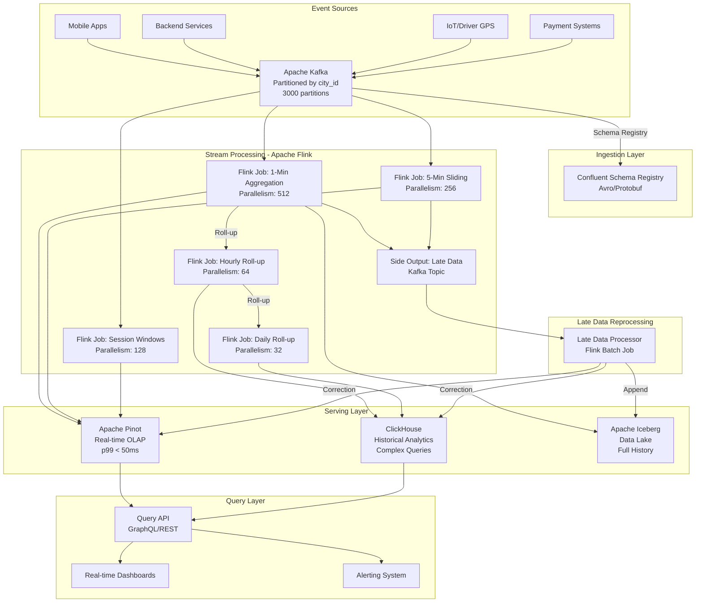

### Detailed Flink Pipeline Architecture

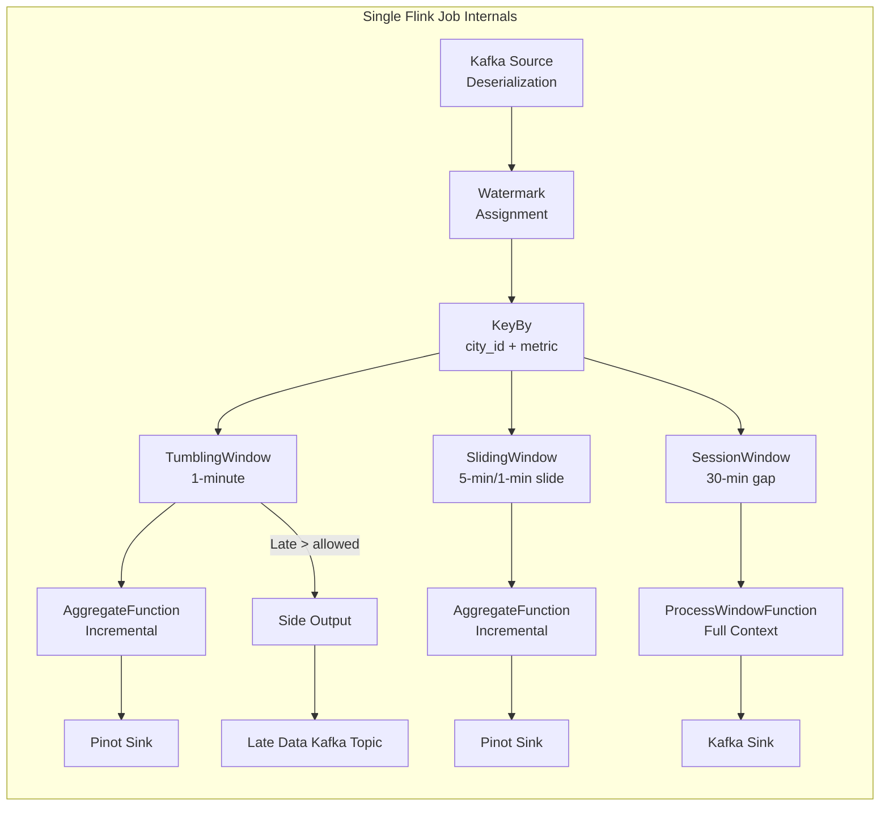

---

## 3. Flink Concepts Used

### 3.1 Tumbling Windows

**What**: Fixed-size, non-overlapping time windows. Every event belongs to exactly one window.

**Use case**: 1-minute revenue aggregation buckets. Each minute gets exactly one aggregated result.

```
Timeline: ──|──1min──|──1min──|──1min──|──
Events:     ****  ** | * ***  | **      |
Result:     count=6  | count=4| count=2 |
```

```mermaid
gantt
    title Tumbling Windows (1-minute)
    dateFormat HH:mm
    axisFormat %H:%M
    section Windows
    Window 1 [count=156]: 14:00, 1m
    Window 2 [count=203]: 14:01, 1m
    Window 3 [count=178]: 14:02, 1m
    Window 4 [count=195]: 14:03, 1m
```

**Why tumbling for this use case**:
- Dashboards need discrete time buckets ("revenue in the last minute")
- No double-counting - each event counted once
- Natural alignment with wall-clock time for human consumption
- Efficient: O(1) memory per key (just the accumulator)

**Trade-off**: Boundary effects - an event at 14:00:59.999 and 14:01:00.001 are in different windows despite being 2ms apart. Sliding windows solve this for trend analysis.

### 3.2 Sliding Windows

**What**: Fixed-size windows that advance by a slide interval. Windows overlap, so events belong to multiple windows.

**Use case**: "5-minute rolling average order value, updated every minute" for trend detection.

```
Window 1: [14:00 - 14:05)
Window 2: [14:01 - 14:06)  ← overlaps with Window 1 by 4 minutes
Window 3: [14:02 - 14:07)
```

**Memory implication**: With 5-min window and 1-min slide, each event is in 5 windows simultaneously. Flink handles this efficiently with panes - it computes partial aggregates per slide interval and combines them.

```mermaid
gantt
    title Sliding Windows (5-min window, 1-min slide)
    dateFormat HH:mm
    axisFormat %H:%M
    section Window A
    Win A: 14:00, 5m
    section Window B
    Win B: 14:01, 5m
    section Window C
    Win C: 14:02, 5m
    section Window D
    Win D: 14:03, 5m
```

**Pane optimization** (Flink internal):
```
Slide = 1 min, Window = 5 min → 5 panes per window
Pane[14:00-14:01] + Pane[14:01-14:02] + ... + Pane[14:04-14:05] = Window[14:00-14:05]
Next window reuses 4 of 5 panes, only computes 1 new pane.
```

### 3.3 Session Windows

**What**: Dynamic windows that group events by activity. A new window starts when no event arrives within a defined gap duration.

**Use case**: User engagement sessions - "how long does a customer browse before ordering?"

```
User clicks: ─●──●●─────●──●──────────────────●──●●─
                 session 1          gap>30min     session 2
              [  12 min  ]                      [ 8 min ]
```

**Why session windows for this use case**:
- Understanding user engagement patterns
- Attributing multiple actions to a single "visit"
- Computing session-level metrics (items viewed, time-to-order)

**Complexity**: Session windows require merging - if two events arrive that bridge a gap, windows must be merged. This is expensive with large state.

### 3.4 Window Functions

#### AggregateFunction (Incremental)

**What**: Processes each element as it arrives, maintaining a compact accumulator. Never stores all elements.

```
Element arrives → merge into accumulator → discard element
Memory: O(accumulator_size) regardless of event count
```

**Perfect for**: Sum, count, min, max, average - anything expressible as a fold.

#### ProcessWindowFunction (Full Window)

**What**: Buffers ALL elements until window fires, then processes them all at once.

```
Elements arrive → store in state → window fires → iterate all elements
Memory: O(number_of_elements_in_window)
```

**Use when**: You need access to all elements (percentiles, distinct counts, complex business logic).

#### Hybrid Approach (Best Practice)

Combine both: AggregateFunction does incremental pre-aggregation, ProcessWindowFunction gets the pre-aggregated result plus window metadata.

```java
// Memory: O(accumulator) not O(events)
// But still get window context (start, end, key)
stream.keyBy(...)
      .window(...)
      .aggregate(new MyAggFunction(), new MyProcessFunction());
```

### 3.5 Watermarks

**What**: A declaration by the system that "no events with timestamp < W will arrive anymore." Drives window firing.

**Strategy for this use case**: BoundedOutOfOrdernessWatermarks

```
Watermark logic:
  current_watermark = max_event_time_seen - max_out_of_orderness
  
For order events: max_out_of_orderness = 30 seconds
  (most events arrive within 30s of their event time)
  
For driver GPS: max_out_of_orderness = 5 seconds
  (GPS events are near-real-time)
```

**Why bounded out-of-orderness**:
- Events from mobile apps can be delayed (network issues)
- Payment confirmations might lag behind order placement
- 30s covers 99.9% of normal-path delays
- Beyond 30s → handled by allowed lateness

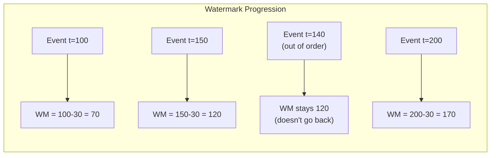

**Watermark alignment across sources**: When consuming from multiple Kafka partitions, Flink takes the minimum watermark across all partitions assigned to a subtask. An idle partition can stall watermarks → use `withIdleness(Duration.ofMinutes(1))`.

### 3.6 Allowed Lateness

**What**: After the watermark passes the window end, keep the window state for an additional duration to accept late events and emit updated results.

```
Window [14:00 - 14:01) with allowed lateness = 5 minutes:
  - Watermark passes 14:01 → window fires (first result)
  - Event arrives at 14:03 with event_time 14:00:30 → ACCEPTED
    → Window fires again with updated result
  - Event arrives at 14:07 with event_time 14:00:30 → REJECTED (too late)
    → Sent to side output
```

**Configuration for this pipeline**:
```
1-min windows: allowedLateness = 5 minutes (covers retries)
5-min windows: allowedLateness = 15 minutes
1-hr windows:  allowedLateness = 2 hours
```

**State implications**: Allowed lateness means window state is kept longer. With 1-min windows and 5-min lateness, you maintain state for 6 minutes per window. At 500K keys × 6 windows = 3M window states.

### 3.7 Side Outputs for Late Data

**What**: Events that arrive after watermark + allowed lateness are emitted to a separate output stream instead of being dropped.

**Use case**: An order from 3 days ago arrives (mobile app was offline). It's too late for the 1-min window's allowed lateness, but we still need to correct the historical aggregate.

**Flow**:
```
Late event (3 days old)
  → Flink window rejects (past allowed lateness)
  → Side output → Kafka "late-data" topic
  → Batch correction job (runs hourly)
  → Updates Pinot/ClickHouse with corrected values
  → Writes correction record to Iceberg for audit
```

### 3.8 Triggers

**What**: Define WHEN a window emits results. Default: fires once when watermark passes window end.

#### Trigger Types for This Use Case

| Trigger | Use | Example |
|---------|-----|---------|
| EventTimeTrigger (default) | Final result at window end | 1-min aggregation |
| ContinuousEventTimeTrigger | Early speculative results | Emit every 10s during 1-min window |
| CountTrigger | Emit after N events | After every 1000 orders |
| PurgingTrigger | Emit and clear state | When you want "delta" not "cumulative" |
| Custom | Complex logic | Emit early if revenue > $1M in window |

**Why custom triggers matter**:
- Dashboards need sub-window-size latency (can't wait full minute)
- ContinuousEventTimeTrigger(10s) gives dashboard updates every 10s
- Mark early results as `SPECULATIVE`, final result as `FINAL`

### 3.9 Window Assigners

**What**: Determines which window(s) an element belongs to.

**Custom multi-granularity assigner**: Assign each event to windows at multiple granularities simultaneously.

```java
// Instead of 3 separate jobs, one custom assigner:
// Event at 14:02:35 gets assigned to:
//   - 1-min window [14:02, 14:03)
//   - 5-min window [14:00, 14:05)
//   - 1-hr window  [14:00, 15:00)
```

**Trade-off**: Single job = shared state/compute but harder to scale independently. Separate jobs = more resource usage but independent scaling.

### 3.10 Incremental Aggregation

**Why AggregateFunction > ProcessWindowFunction for memory**:

| Metric | AggregateFunction | ProcessWindowFunction |
|--------|------------------|----------------------|
| Memory per window | O(accumulator) ~100 bytes | O(events) ~100MB at 10K events |
| GC pressure | Minimal | Massive spikes at window fire |
| Checkpoint size | Tiny | Huge (all buffered events) |
| Latency at fire | Instant (result ready) | High (must iterate all events) |

At 10M events/sec with 1-min windows:
- ProcessWindowFunction: Buffer 600M events per minute → OOM
- AggregateFunction: Maintain ~500K accumulators (one per key) → ~50MB

---

## 4. Production Code Examples

### 4.1 Multi-Granularity Windowed Aggregation

```java
public class OrderMetricsAggregationJob {

    public static void main(String[] args) throws Exception {
        StreamExecutionEnvironment env = StreamExecutionEnvironment.getExecutionEnvironment();
        
        // Production configuration
        env.setParallelism(512);
        env.enableCheckpointing(60_000, CheckpointingMode.EXACTLY_ONCE);
        env.getCheckpointConfig().setMinPauseBetweenCheckpoints(30_000);
        env.getCheckpointConfig().setCheckpointTimeout(600_000);
        env.getCheckpointConfig().setMaxConcurrentCheckpoints(1);
        env.setStateBackend(new EmbeddedRocksDBStateBackend(true));
        env.getCheckpointConfig().setCheckpointStorage("s3://flink-state/checkpoints/order-metrics");
        
        // Configure RocksDB for large state
        env.setStateBackend(new EmbeddedRocksDBStateBackend(true)); // incremental
        Configuration rocksConfig = new Configuration();
        rocksConfig.set(RocksDBConfigurableOptions.WRITE_BUFFER_SIZE, MemorySize.ofMebiBytes(256));
        rocksConfig.set(RocksDBConfigurableOptions.MAX_WRITE_BUFFER_NUMBER, 4);
        rocksConfig.set(RocksDBConfigurableOptions.BLOCK_CACHE_SIZE, MemorySize.ofMebiBytes(512));
        
        // Kafka source with exactly-once
        KafkaSource<OrderEvent> source = KafkaSource.<OrderEvent>builder()
            .setBootstrapServers("kafka-broker-1:9092,kafka-broker-2:9092,kafka-broker-3:9092")
            .setTopics("order-events")
            .setGroupId("order-metrics-aggregation")
            .setStartingOffsets(OffsetsInitializer.committedOffsets(OffsetResetStrategy.EARLIEST))
            .setDeserializer(new OrderEventDeserializationSchema())
            .setProperty("isolation.level", "read_committed")
            .build();
        
        // Watermark strategy: 30s bounded out-of-orderness
        WatermarkStrategy<OrderEvent> watermarkStrategy = WatermarkStrategy
            .<OrderEvent>forBoundedOutOfOrderness(Duration.ofSeconds(30))
            .withTimestampAssigner((event, ts) -> event.getEventTime())
            .withIdleness(Duration.ofMinutes(1)); // handle idle partitions
        
        DataStream<OrderEvent> events = env
            .fromSource(source, watermarkStrategy, "kafka-orders")
            .uid("kafka-source")
            .name("Kafka Order Events");
        
        // Key by city for dashboard dimensions
        KeyedStream<OrderEvent, String> keyedByCityAndType = events
            .keyBy(event -> event.getCityId() + "|" + event.getEventType());
        
        // === 1-MINUTE TUMBLING WINDOW ===
        OutputTag<OrderEvent> lateDataTag = new OutputTag<OrderEvent>("late-data"){};
        
        SingleOutputStreamOperator<AggregatedMetric> oneMinAgg = keyedByCityAndType
            .window(TumblingEventTimeWindows.of(Time.minutes(1)))
            .trigger(ContinuousEventTimeTrigger.of(Time.seconds(10))) // early results every 10s
            .allowedLateness(Time.minutes(5))
            .sideOutputLateData(lateDataTag)
            .aggregate(
                new OrderMetricsAggregateFunction(),
                new MetricWindowProcessFunction("1m")
            )
            .uid("1-min-window")
            .name("1-Minute Aggregation");
        
        // === 5-MINUTE SLIDING WINDOW ===
        SingleOutputStreamOperator<AggregatedMetric> fiveMinAgg = keyedByCityAndType
            .window(SlidingEventTimeWindows.of(Time.minutes(5), Time.minutes(1)))
            .allowedLateness(Time.minutes(15))
            .aggregate(
                new OrderMetricsAggregateFunction(),
                new MetricWindowProcessFunction("5m")
            )
            .uid("5-min-window")
            .name("5-Minute Sliding Aggregation");
        
        // === 1-HOUR TUMBLING WINDOW ===
        SingleOutputStreamOperator<AggregatedMetric> oneHourAgg = keyedByCityAndType
            .window(TumblingEventTimeWindows.of(Time.hours(1)))
            .allowedLateness(Time.hours(2))
            .trigger(ContinuousEventTimeTrigger.of(Time.minutes(1))) // update every minute
            .aggregate(
                new OrderMetricsAggregateFunction(),
                new MetricWindowProcessFunction("1h")
            )
            .uid("1-hr-window")
            .name("1-Hour Aggregation");
        
        // Sink 1-min and 5-min to Pinot (real-time)
        oneMinAgg.addSink(new PinotSinkFunction("order_metrics_1m"))
            .uid("pinot-sink-1m").name("Pinot 1-Min Sink");
        fiveMinAgg.addSink(new PinotSinkFunction("order_metrics_5m"))
            .uid("pinot-sink-5m").name("Pinot 5-Min Sink");
        
        // Sink hourly to ClickHouse (historical)
        oneHourAgg.addSink(new ClickHouseSinkFunction("order_metrics_1h"))
            .uid("clickhouse-sink-1h").name("ClickHouse Hourly Sink");
        
        // Late data to Kafka for reprocessing
        DataStream<OrderEvent> lateData = oneMinAgg.getSideOutput(lateDataTag);
        lateData.sinkTo(
            KafkaSink.<OrderEvent>builder()
                .setBootstrapServers("kafka-broker-1:9092")
                .setRecordSerializer(new OrderEventSerializer("order-events-late"))
                .setDeliveryGuarantee(DeliveryGuarantee.EXACTLY_ONCE)
                .build()
        ).uid("late-data-sink").name("Late Data Kafka Sink");
        
        env.execute("Order Metrics Real-Time Aggregation");
    }
}
```

### 4.2 Custom AggregateFunction for Revenue/Count/Avg

```java
public class OrderMetricsAggregateFunction 
    implements AggregateFunction<OrderEvent, OrderMetricsAccumulator, OrderMetricsResult> {
    
    @Override
    public OrderMetricsAccumulator createAccumulator() {
        return new OrderMetricsAccumulator();
    }
    
    @Override
    public OrderMetricsAccumulator add(OrderEvent event, OrderMetricsAccumulator acc) {
        acc.orderCount++;
        acc.totalRevenueCents += event.getAmountCents();
        acc.totalItemsCount += event.getItemsCount();
        acc.totalDeliveryTimeSeconds += event.getDeliveryTimeSeconds();
        acc.minAmountCents = Math.min(acc.minAmountCents, event.getAmountCents());
        acc.maxAmountCents = Math.max(acc.maxAmountCents, event.getAmountCents());
        
        // HyperLogLog for distinct customers (approximate)
        acc.customerHLL.offer(event.getCustomerId());
        
        // Track p95 delivery time with T-Digest
        acc.deliveryTimeDigest.add(event.getDeliveryTimeSeconds());
        
        // Revenue by payment method (for breakdown)
        acc.revenueByPayment.merge(
            event.getPaymentMethod(), 
            event.getAmountCents(), 
            Long::sum
        );
        
        return acc;
    }
    
    @Override
    public OrderMetricsResult getResult(OrderMetricsAccumulator acc) {
        return OrderMetricsResult.builder()
            .orderCount(acc.orderCount)
            .totalRevenueCents(acc.totalRevenueCents)
            .avgOrderValueCents(acc.orderCount > 0 ? acc.totalRevenueCents / acc.orderCount : 0)
            .avgDeliveryTimeSeconds(acc.orderCount > 0 ? acc.totalDeliveryTimeSeconds / acc.orderCount : 0)
            .p95DeliveryTimeSeconds(acc.deliveryTimeDigest.quantile(0.95))
            .distinctCustomers(acc.customerHLL.cardinality())
            .minOrderValueCents(acc.minAmountCents)
            .maxOrderValueCents(acc.maxAmountCents)
            .totalItemsCount(acc.totalItemsCount)
            .revenueByPayment(acc.revenueByPayment)
            .build();
    }
    
    @Override
    public OrderMetricsAccumulator merge(OrderMetricsAccumulator a, OrderMetricsAccumulator b) {
        // Critical for session window merging and rescaling
        OrderMetricsAccumulator merged = new OrderMetricsAccumulator();
        merged.orderCount = a.orderCount + b.orderCount;
        merged.totalRevenueCents = a.totalRevenueCents + b.totalRevenueCents;
        merged.totalItemsCount = a.totalItemsCount + b.totalItemsCount;
        merged.totalDeliveryTimeSeconds = a.totalDeliveryTimeSeconds + b.totalDeliveryTimeSeconds;
        merged.minAmountCents = Math.min(a.minAmountCents, b.minAmountCents);
        merged.maxAmountCents = Math.max(a.maxAmountCents, b.maxAmountCents);
        
        // Merge HLL sketches (approximate distinct counts are mergeable!)
        merged.customerHLL = HyperLogLog.merge(a.customerHLL, b.customerHLL);
        
        // Merge T-Digest (approximate percentiles are mergeable!)
        merged.deliveryTimeDigest = TDigest.merge(a.deliveryTimeDigest, b.deliveryTimeDigest);
        
        // Merge revenue maps
        merged.revenueByPayment = new HashMap<>(a.revenueByPayment);
        b.revenueByPayment.forEach((k, v) -> merged.revenueByPayment.merge(k, v, Long::sum));
        
        return merged;
    }
}

@Data
public class OrderMetricsAccumulator {
    long orderCount = 0;
    long totalRevenueCents = 0;
    long totalItemsCount = 0;
    long totalDeliveryTimeSeconds = 0;
    long minAmountCents = Long.MAX_VALUE;
    long maxAmountCents = Long.MIN_VALUE;
    HyperLogLog customerHLL = new HyperLogLog(14); // ~16KB, 0.8% error
    TDigest deliveryTimeDigest = TDigest.createMergingDigest(100);
    Map<String, Long> revenueByPayment = new HashMap<>();
}
```

### 4.3 ProcessWindowFunction with Window Metadata

```java
public class MetricWindowProcessFunction 
    extends ProcessWindowFunction<OrderMetricsResult, AggregatedMetric, String, TimeWindow> {
    
    private final String granularity;
    
    public MetricWindowProcessFunction(String granularity) {
        this.granularity = granularity;
    }
    
    @Override
    public void process(
            String key,
            Context context,
            Iterable<OrderMetricsResult> results,
            Collector<AggregatedMetric> out) {
        
        // With AggregateFunction + ProcessWindowFunction, results has exactly 1 element
        OrderMetricsResult result = results.iterator().next();
        
        String[] keyParts = key.split("\\|");
        String cityId = keyParts[0];
        String eventType = keyParts[1];
        
        TimeWindow window = context.window();
        
        // Determine if this is an early/on-time/late firing
        FiringType firingType;
        long currentWatermark = context.currentWatermark();
        if (currentWatermark < window.getEnd()) {
            firingType = FiringType.EARLY;  // speculative result
        } else if (context.currentProcessingTime() - window.getEnd() < 60_000) {
            firingType = FiringType.ON_TIME; // normal firing
        } else {
            firingType = FiringType.LATE;    // late data update
        }
        
        AggregatedMetric metric = AggregatedMetric.builder()
            .windowStart(window.getStart())
            .windowEnd(window.getEnd())
            .granularity(granularity)
            .cityId(cityId)
            .eventType(eventType)
            .firingType(firingType)
            .orderCount(result.getOrderCount())
            .totalRevenueCents(result.getTotalRevenueCents())
            .avgOrderValueCents(result.getAvgOrderValueCents())
            .avgDeliveryTimeSeconds(result.getAvgDeliveryTimeSeconds())
            .p95DeliveryTimeSeconds(result.getP95DeliveryTimeSeconds())
            .distinctCustomers(result.getDistinctCustomers())
            .computedAt(System.currentTimeMillis())
            .build();
        
        out.collect(metric);
    }
}
```

### 4.4 Custom Trigger for Early Results

```java
public class EarlyResultsTrigger extends Trigger<OrderEvent, TimeWindow> {
    
    private final long earlyInterval; // emit speculative results every N ms
    private final long lateFireDelay; // delay after watermark for final result
    
    // State: track if on-time result was already emitted
    private final ValueStateDescriptor<Boolean> onTimeFiredDesc = 
        new ValueStateDescriptor<>("onTimeFired", Boolean.class, false);
    
    public EarlyResultsTrigger(Duration earlyInterval, Duration lateFireDelay) {
        this.earlyInterval = earlyInterval.toMillis();
        this.lateFireDelay = lateFireDelay.toMillis();
    }
    
    @Override
    public TriggerResult onElement(OrderEvent event, long timestamp, TimeWindow window, TriggerContext ctx) {
        // Register end-of-window timer
        ctx.registerEventTimeTimer(window.maxTimestamp());
        
        // Register first early firing timer
        ValueState<Boolean> onTimeFired = ctx.getPartitionedState(onTimeFiredDesc);
        if (!onTimeFired.value()) {
            long firstEarlyFire = window.getStart() + earlyInterval;
            if (firstEarlyFire < window.getEnd()) {
                ctx.registerProcessingTimeTimer(firstEarlyFire);
            }
        }
        
        return TriggerResult.CONTINUE;
    }
    
    @Override
    public TriggerResult onEventTime(long time, TimeWindow window, TriggerContext ctx) {
        if (time == window.maxTimestamp()) {
            // Window end reached - emit final result
            ValueState<Boolean> onTimeFired = ctx.getPartitionedState(onTimeFiredDesc);
            onTimeFired.update(true);
            return TriggerResult.FIRE; // FIRE, not FIRE_AND_PURGE (keep for late data)
        }
        return TriggerResult.CONTINUE;
    }
    
    @Override
    public TriggerResult onProcessingTime(long time, TimeWindow window, TriggerContext ctx) {
        ValueState<Boolean> onTimeFired = ctx.getPartitionedState(onTimeFiredDesc);
        if (!onTimeFired.value()) {
            // Schedule next early firing
            long nextFire = time + earlyInterval;
            if (nextFire < window.getEnd()) {
                ctx.registerProcessingTimeTimer(nextFire);
            }
            return TriggerResult.FIRE; // emit speculative result
        }
        return TriggerResult.CONTINUE;
    }
    
    @Override
    public void clear(TimeWindow window, TriggerContext ctx) {
        ctx.deleteEventTimeTimer(window.maxTimestamp());
        ctx.getPartitionedState(onTimeFiredDesc).clear();
    }
}
```

### 4.5 Pinot Sink Connector

```java
public class PinotSinkFunction extends RichSinkFunction<AggregatedMetric> 
    implements CheckpointedFunction {
    
    private final String tableName;
    private transient PinotControllerClient pinotClient;
    private transient List<AggregatedMetric> buffer;
    private transient ListState<AggregatedMetric> checkpointedState;
    
    private static final int BATCH_SIZE = 1000;
    private static final Duration FLUSH_INTERVAL = Duration.ofSeconds(5);
    private transient long lastFlushTime;
    
    public PinotSinkFunction(String tableName) {
        this.tableName = tableName;
    }
    
    @Override
    public void open(Configuration parameters) {
        pinotClient = PinotControllerClient.builder()
            .controllerUrl("http://pinot-controller:9000")
            .connectionTimeout(Duration.ofSeconds(30))
            .retryPolicy(RetryPolicy.exponentialBackoff(3, Duration.ofMillis(100)))
            .build();
        buffer = new ArrayList<>();
        lastFlushTime = System.currentTimeMillis();
    }
    
    @Override
    public void invoke(AggregatedMetric metric, Context context) throws Exception {
        buffer.add(metric);
        
        if (buffer.size() >= BATCH_SIZE || 
            System.currentTimeMillis() - lastFlushTime > FLUSH_INTERVAL.toMillis()) {
            flush();
        }
    }
    
    private void flush() throws Exception {
        if (buffer.isEmpty()) return;
        
        try {
            // Convert to Pinot JSON format and ingest
            String jsonBatch = buffer.stream()
                .map(this::toJson)
                .collect(Collectors.joining("\n"));
            
            pinotClient.ingestJson(tableName, jsonBatch);
            
            // Metrics
            getRuntimeContext().getMetricGroup()
                .counter("pinot_records_written")
                .inc(buffer.size());
                
            buffer.clear();
            lastFlushTime = System.currentTimeMillis();
        } catch (PinotException e) {
            getRuntimeContext().getMetricGroup()
                .counter("pinot_write_failures")
                .inc();
            
            if (e.isRetryable()) {
                // Will retry on next invoke/flush
                LOG.warn("Pinot write failed, will retry: {}", e.getMessage());
            } else {
                throw e; // Fail the job for non-retryable errors
            }
        }
    }
    
    @Override
    public void snapshotState(FunctionSnapshotContext context) throws Exception {
        checkpointedState.clear();
        for (AggregatedMetric metric : buffer) {
            checkpointedState.add(metric);
        }
    }
    
    @Override
    public void initializeState(FunctionInitializationContext context) throws Exception {
        ListStateDescriptor<AggregatedMetric> desc = new ListStateDescriptor<>(
            "pinot-buffer", AggregatedMetric.class);
        checkpointedState = context.getOperatorStateStore().getListState(desc);
        
        buffer = new ArrayList<>();
        if (context.isRestored()) {
            for (AggregatedMetric m : checkpointedState.get()) {
                buffer.add(m);
            }
        }
    }
    
    @Override
    public void close() throws Exception {
        flush();
        if (pinotClient != null) pinotClient.close();
    }
    
    private String toJson(AggregatedMetric m) {
        return String.format(
            "{\"window_start\":%d,\"window_end\":%d,\"granularity\":\"%s\"," +
            "\"city_id\":\"%s\",\"event_type\":\"%s\",\"firing_type\":\"%s\"," +
            "\"order_count\":%d,\"total_revenue_cents\":%d," +
            "\"avg_order_value_cents\":%d,\"avg_delivery_time_seconds\":%d," +
            "\"p95_delivery_time_seconds\":%.1f,\"distinct_customers\":%d," +
            "\"computed_at\":%d}",
            m.getWindowStart(), m.getWindowEnd(), m.getGranularity(),
            m.getCityId(), m.getEventType(), m.getFiringType(),
            m.getOrderCount(), m.getTotalRevenueCents(),
            m.getAvgOrderValueCents(), m.getAvgDeliveryTimeSeconds(),
            m.getP95DeliveryTimeSeconds(), m.getDistinctCustomers(),
            m.getComputedAt()
        );
    }
}
```

---

## 5. Multi-Granularity Architecture

### The Problem

Computing 1-min, 5-min, 1-hr, and 1-day aggregations from 10M events/sec. Naive approach: 4 independent window computations = 4x the compute cost.

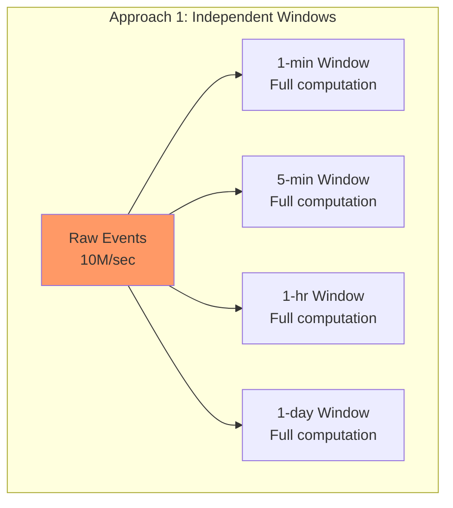

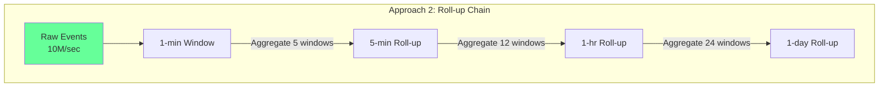

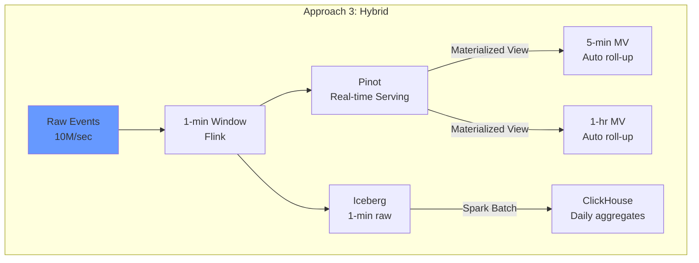

### Approach 1: Independent Windows

```java
// Simple: 4 separate window operations
stream.keyBy(k).window(TumblingEventTimeWindows.of(Time.minutes(1))).aggregate(...)
stream.keyBy(k).window(TumblingEventTimeWindows.of(Time.minutes(5))).aggregate(...)
stream.keyBy(k).window(TumblingEventTimeWindows.of(Time.hours(1))).aggregate(...)
stream.keyBy(k).window(TumblingEventTimeWindows.of(Time.days(1))).aggregate(...)
```

| Pros | Cons |
|------|------|
| Simple to implement | 4x compute cost |
| Independent scaling per granularity | 4x state size |
| Independent lateness handling | Possible inconsistency between granularities |
| One failure doesn't affect others | Higher Kafka read amplification |

**When to use**: Low event volume (<100K/sec), or when granularities need very different processing logic.

### Approach 2: Roll-up from Finest Granularity

```java
// 1-min aggregation outputs to internal Kafka topic
DataStream<AggregatedMetric> oneMin = stream
    .keyBy(e -> e.getCityId())
    .window(TumblingEventTimeWindows.of(Time.minutes(1)))
    .aggregate(new OrderMetricsAggregateFunction(), new MetricWindowProcessFunction("1m"));

// 5-min aggregation consumes 1-min results
DataStream<AggregatedMetric> fiveMin = oneMin
    .keyBy(m -> m.getCityId())
    .window(TumblingEventTimeWindows.of(Time.minutes(5)))
    .aggregate(new MetricRollupAggregateFunction(), new MetricWindowProcessFunction("5m"));

// 1-hr aggregation consumes 5-min results  
DataStream<AggregatedMetric> oneHour = fiveMin
    .keyBy(m -> m.getCityId())
    .window(TumblingEventTimeWindows.of(Time.hours(1)))
    .aggregate(new MetricRollupAggregateFunction(), new MetricWindowProcessFunction("1h"));
```

**Critical requirement for roll-ups**: The accumulator/result must support **merging**. This works for:
- SUM (additive) - revenue, count
- MIN/MAX - trivially mergeable
- AVG - store sum + count, merge both, divide at query time
- HyperLogLog - mergeable sketches for distinct count
- T-Digest - mergeable for approximate percentiles

**Does NOT work for**:
- Exact distinct count (must use HLL approximation)
- Exact percentiles (must use T-Digest approximation)
- Arbitrary custom functions that aren't associative/commutative

| Pros | Cons |
|------|------|
| ~75% less compute | More complex pipeline |
| Guaranteed consistency across granularities | Late data must propagate through chain |
| Less state (only finest granularity sees raw events) | Single point of failure at 1-min level |

### Approach 3: Hybrid with Serving Layer Materialized Views

**Best for production at scale**. Let Flink do what it's good at (1-min aggregation) and let the serving layer handle roll-ups.

```sql
-- Pinot: Create a materialized roll-up table
-- Pinot auto-aggregates at ingestion time based on config
{
  "tableName": "order_metrics_5m",
  "tableType": "REALTIME",
  "segmentsConfig": {
    "timeType": "MILLISECONDS",
    "retentionTimeUnit": "DAYS",
    "retentionTimeValue": "7",
    "segmentPushType": "APPEND"
  },
  "tableIndexConfig": {
    "aggregateMetrics": true  -- Pinot pre-aggregates on ingestion
  },
  "ingestionConfig": {
    "transformConfigs": [{
      "columnName": "window_5m_start",
      "transformFunction": "round(window_start, 300000)"  -- Round to 5-min
    }]
  }
}
```

**Production recommendation**: Approach 3 for most teams. Approach 2 when you need exact control over roll-up semantics (e.g., weighted averages that can't be expressed in Pinot).

---

## 6. Serving Layer Deep Dive

### Comparison Matrix

| Feature | Apache Pinot | ClickHouse | Apache Druid |
|---------|-------------|------------|--------------|
| **p99 Query Latency** | 10-50ms | 50-500ms | 20-100ms |
| **Ingestion Latency** | < 1 second | 1-5 seconds | 1-10 seconds |
| **Best For** | Real-time dashboards | Ad-hoc analytics | Time-series OLAP |
| **Concurrency** | 10K+ QPS | 100-500 QPS | 1K+ QPS |
| **Freshness** | Sub-second | Seconds | Seconds |
| **Late Data Handling** | Upsert tables | ReplacingMergeTree | Kill & fill |
| **Storage Efficiency** | Medium | High (great compression) | Medium |
| **SQL Support** | Partial (PQL-like) | Full ANSI SQL | Partial (Druid SQL) |
| **Join Support** | Lookup joins only | Full joins | Limited |
| **Scaling Model** | Segment-based, horizontal | Shard + replica | Segment-based |
| **Used By** | Uber, LinkedIn, Stripe | Cloudflare, eBay | Netflix, Airbnb |

### Architecture Decision

```
┌─────────────────────────────────────────────────────────────┐
│                    Query Routing Layer                        │
├─────────────────────────────────────────────────────────────┤
│                                                              │
│  "Last 5 minutes" ──→ Pinot (real-time segments)            │
│  "Last 1 hour"    ──→ Pinot (recent offline segments)       │
│  "Last 7 days"    ──→ ClickHouse (pre-aggregated)           │
│  "Last 90 days"   ──→ ClickHouse (historical)              │
│  "Ad-hoc drill"   ──→ ClickHouse (full SQL)                │
│  "Audit/replay"   ──→ Iceberg (raw events, Spark/Trino)    │
│                                                              │
└─────────────────────────────────────────────────────────────┘
```

### Why Pinot for Real-Time

1. **Star-tree index**: Pre-computes aggregations at ingestion time for common query patterns
2. **Upsert tables**: Late data can update existing rows (correction support)
3. **Pluggable stream ingestion**: Native Kafka consumer, sub-second freshness
4. **Tenant isolation**: Multi-tenant with resource quotas per dashboard

### Why ClickHouse for Historical

1. **Columnar compression**: 10-20x compression ratio on metric data
2. **Materialized views**: Automatic roll-ups at insert time
3. **Full SQL**: Complex analytical queries, JOINs, subqueries
4. **ReplacingMergeTree**: Handles late data corrections via versioned rows

---

## 7. Late Data Strategy

### Multi-Level Late Data Handling

```mermaid
graph TB
    subgraph "Level 1: Within Watermark (< 30s late)"
        L1[Event arrives < 30s late]
        L1 --> |"Normal processing"| WIN[Assigned to correct window<br/>No special handling needed]
    end
    
    subgraph "Level 2: Within Allowed Lateness (30s - 5min late)"
        L2[Event arrives 30s-5min late]
        L2 --> |"Watermark passed"| LATE_FIRE[Window re-fires<br/>Updated result emitted]
        LATE_FIRE --> UPSERT[Upsert to Pinot<br/>Dashboard auto-corrects]
    end
    
    subgraph "Level 3: Beyond Allowed Lateness (5min - 7days late)"
        L3[Event arrives > 5min late]
        L3 --> |"Side output"| KAFKA_LATE[Kafka: late-events topic]
        KAFKA_LATE --> BATCH[Hourly batch correction job]
        BATCH --> |"Read current aggregate"| READ[Read from Pinot/CH]
        READ --> |"Recompute"| WRITE[Write corrected value]
    end
    
    subgraph "Level 4: Beyond 7 days"
        L4[Event arrives > 7 days late]
        L4 --> |"Dead letter"| DLQ[Dead Letter Queue]
        DLQ --> |"Manual review"| ALERT2[Alert + Manual correction]
    end
```

### Late Data Correction Job

```java
public class LateDataCorrectionJob {
    
    /**
     * Runs every hour. Reads late events from Kafka, 
     * groups by original window, recomputes, and upserts.
     */
    public static void main(String[] args) throws Exception {
        StreamExecutionEnvironment env = StreamExecutionEnvironment.getExecutionEnvironment();
        env.setRuntimeMode(RuntimeExecutionMode.BATCH); // Batch mode for bounded source
        
        // Read late events accumulated in the last hour
        KafkaSource<OrderEvent> lateSource = KafkaSource.<OrderEvent>builder()
            .setTopics("order-events-late")
            .setBounded(OffsetsInitializer.timestamp(System.currentTimeMillis()))
            .build();
        
        DataStream<OrderEvent> lateEvents = env.fromSource(lateSource, 
            WatermarkStrategy.noWatermarks(), "late-events");
        
        // Group by their ORIGINAL window
        lateEvents
            .keyBy(e -> e.getCityId() + "|" + computeWindowKey(e.getEventTime(), 60_000))
            .process(new CorrectionProcessFunction())
            .addSink(new PinotUpsertSink("order_metrics_1m"));
        
        env.execute("Late Data Correction - Hourly");
    }
}
```

### Accuracy Guarantees

| Time Since Event | Accuracy | Mechanism |
|-----------------|----------|-----------|
| 0-30 seconds | Exact | Within watermark, normal processing |
| 30s - 5 min | Exact (delayed) | Allowed lateness, window re-fire |
| 5 min - 1 hour | Corrected within 1hr | Hourly batch correction |
| 1 hour - 7 days | Corrected within 2hrs | Same batch job, longer lookback |
| > 7 days | Manual correction | Alert, DLQ, manual intervention |

---

## 8. Scaling to 10M Events/Second

### Capacity Planning

```
10M events/sec
× 500 bytes/event (avg)
= 5 GB/sec ingestion throughput
= 18 TB/hour
= 432 TB/day (before compression)

Kafka:
  - 3000 partitions (across 3 topics)
  - 100 brokers (30 partitions per broker)
  - 10 GB/sec aggregate write throughput
  - 3x replication = 30 GB/sec disk write

Flink:
  - 512 TaskManager slots for 1-min job
  - 256 slots for 5-min job
  - 128 slots for session windows
  - Total: ~900 slots → 150 TaskManagers × 6 slots each
  - Memory: 150 TMs × 32GB = 4.8TB total memory
  - State: ~2TB in RocksDB (across all TMs)
```

### Key Scaling Strategies

**1. Kafka Partitioning**
```
Partition key = city_id (50 cities)
Problem: 50 partitions isn't enough parallelism
Solution: city_id + hash(order_id) % 60 = 3000 partitions
         Flink re-keys by city_id for window aggregation
```

**2. Flink Parallelism Tuning**
```yaml
# 1-min window job
parallelism: 512
maxParallelism: 2048  # Allow future scaling without state migration
taskmanager.memory.managed.size: 8gb  # For RocksDB
taskmanager.memory.network.fraction: 0.15  # For shuffle
```

**3. State Backend Optimization (RocksDB)**
```yaml
state.backend.rocksdb.memory.managed: true
state.backend.rocksdb.block.cache-size: 512mb
state.backend.rocksdb.writebuffer.size: 256mb
state.backend.rocksdb.writebuffer.count: 4
state.backend.rocksdb.compaction.style: LEVEL
state.backend.incremental-checkpoints: true
```

**4. Network Buffer Tuning**
```yaml
taskmanager.network.memory.buffers-per-channel: 4
taskmanager.network.memory.floating-buffers-per-gate: 16
# Prevents back-pressure from cascading
```

**5. Checkpoint Optimization**
```
- Incremental checkpoints (only changed state)
- Checkpoint interval: 60s (balance between recovery time and overhead)
- Unaligned checkpoints: enabled (prevents back-pressure during checkpoint)
- State size per checkpoint: ~200GB (incremental: ~5GB delta)
- Checkpoint duration target: < 30s
- Storage: S3 with multipart upload
```

### Back-Pressure Handling

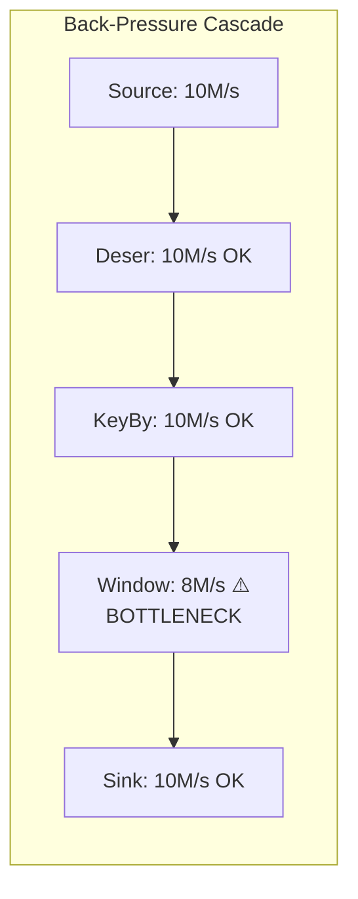

**Mitigation**:
- Identify bottleneck via Flink Web UI (back-pressure tab)
- Scale up parallelism for windowed operator specifically
- Enable unaligned checkpoints to prevent checkpoint barriers from amplifying back-pressure
- Use async I/O for sink operations

---

## 9. Monitoring

### Key Metrics Dashboard

```
┌──────────────────────────────────────────────────────────────┐
│ FLINK AGGREGATION PIPELINE - OPERATIONAL DASHBOARD           │
├──────────────────────────────────────────────────────────────┤
│                                                              │
│ Throughput:     ████████████████████░░  9.2M/sec (92% cap)  │
│ Latency (e2e):  p50=1.2s  p95=3.4s  p99=8.1s              │
│ Checkpoint:     Duration=18s  Size=4.2GB  Interval=60s      │
│ Back-pressure:  Source=0%  Window=12%  Sink=3%              │
│                                                              │
│ Window Completeness (1-min):                                 │
│   On-time:  99.2%                                           │
│   Late (accepted): 0.7%                                     │
│   Late (side output): 0.1%                                  │
│   Dropped: 0.0%                                             │
│                                                              │
│ State Size:  1.8TB total  (512 subtasks × ~3.5GB each)      │
│ GC Pauses:   p99=45ms  (target: <100ms)                    │
│                                                              │
│ ALERTS:                                                      │
│   ⚠️  Late data ratio > 1% for city=Mumbai (1.3%)           │
│   ✅  All windows firing within SLA                          │
│   ✅  Checkpoint completing within timeout                   │
└──────────────────────────────────────────────────────────────┘
```

### Critical Alerts

| Alert | Condition | Action |
|-------|-----------|--------|
| Checkpoint failing | 3 consecutive failures | Page on-call, check state size/S3 |
| Watermark stalled | No advance for 5 min | Check for idle Kafka partitions |
| Late data ratio high | > 2% of events in side output | Increase allowed lateness or investigate source |
| Consumer lag growing | Lag > 5 min and increasing | Scale up parallelism |
| Window result delay | Time between window end and result > 2x window size | Check back-pressure |
| State size growing | > 20% growth in 24h | Check for state leak (windows not being cleaned) |
| GC pause > 200ms | p99 GC > 200ms | Increase memory, tune RocksDB cache |
| Pinot ingestion lag | Pinot segments behind > 30s | Check Pinot cluster health |

### Monitoring Implementation

```java
// Custom metrics in the AggregateFunction
public class InstrumentedAggregateFunction extends OrderMetricsAggregateFunction {
    
    private transient Counter lateEventsCounter;
    private transient Counter onTimeEventsCounter;
    private transient Histogram windowSizeHistogram;
    private transient Gauge<Long> oldestWindowGauge;
    
    @Override
    public void open(Configuration parameters) {
        MetricGroup metrics = getRuntimeContext().getMetricGroup()
            .addGroup("order_aggregation");
        
        lateEventsCounter = metrics.counter("late_events");
        onTimeEventsCounter = metrics.counter("on_time_events");
        windowSizeHistogram = metrics.histogram("window_event_count", 
            new DescriptiveStatisticsHistogram(1000));
    }
}
```

### Data Quality Monitoring

```sql
-- Query Pinot to verify aggregation accuracy
-- Compare Flink real-time result vs batch recomputation

SELECT 
    window_start,
    city_id,
    SUM(CASE WHEN source = 'realtime' THEN order_count ELSE 0 END) as rt_count,
    SUM(CASE WHEN source = 'batch_verify' THEN order_count ELSE 0 END) as batch_count,
    ABS(rt_count - batch_count) / batch_count * 100 as drift_pct
FROM order_metrics_verification
WHERE window_start > ago('1h')
GROUP BY window_start, city_id
HAVING drift_pct > 1.0  -- Alert if >1% drift
ORDER BY drift_pct DESC
```

---

## 10. Real Companies

### Uber - UMetric

**Scale**: 50M+ trips/day, real-time pricing, ETA, supply-demand metrics.

**Architecture**:
- **UMetric**: Unified metric computation platform built on Flink
- Multi-granularity: 1-min for ops, 5-min for ML features, hourly for finance
- Flink processes driver GPS pings (millions/sec) into city-level supply metrics
- Custom watermark strategy per event source (GPS vs payment vs trip events)
- Apache Pinot as primary real-time serving layer
- Custom "metric store" abstraction over Pinot + Hive

**Key learnings from Uber**:
1. Separate "metric definition" from "metric computation" - data scientists define metrics in YAML, platform generates Flink jobs
2. Late data is the norm, not exception - mobile app events can be hours late
3. Exactly-once semantics required for financial metrics (revenue) but not for operational metrics (GPS counts)

### LinkedIn - Unified Streaming Platform

**Scale**: Trillions of events/day across all products.

**Architecture**:
- Unified streaming infrastructure (Flink) serves 1000+ use cases
- "Unified Metrics Platform" computes engagement metrics (views, clicks, impressions)
- Custom window assigners for LinkedIn-specific "business day" windows (timezone-aware)
- Venice (LinkedIn's derived data store) as serving layer
- Brooklin for cross-DC replication of aggregated results

**Key innovations**:
1. **Self-serve platform**: Engineers define aggregations via config, platform auto-generates Flink SQL jobs
2. **Tiered serving**: Hot (Venice) → Warm (Pinot) → Cold (HDFS)
3. **Automatic backfill**: When metric definition changes, auto-triggers batch recomputation

### DoorDash - Real-Time Order Metrics

**Scale**: Millions of orders/day, real-time store health monitoring.

**Architecture**:
- Flink for real-time store performance metrics (preparation time, delivery time)
- "Store Health Score" computed as sliding 30-min window over order completion metrics
- Triggers automatic store deactivation if health score drops below threshold
- Apache Flink + Kafka + Redis (real-time serving for latency-critical alerts)
- ClickHouse for historical analytics

**Key pattern**:
1. **Alert-driven architecture**: Real-time aggregations directly feed alerting rules
2. **Session windows** for "dasher active session" tracking (gap = 10 min)
3. **Hybrid late data**: Redis TTL for recent corrections, batch job for older corrections

### Common Patterns Across All Three

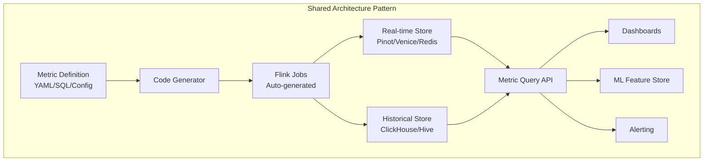

**Universal lessons**:
1. **Platform, not job**: Build a metric platform that generates Flink jobs from declarations
2. **Multi-tier serving**: No single store handles all query patterns
3. **Approximate is OK**: HLL for distinct counts, T-Digest for percentiles - exact is too expensive
4. **Late data is a feature, not a bug**: Design for corrections from day one
5. **Observability tax**: 15-20% of pipeline complexity is monitoring/alerting infrastructure
