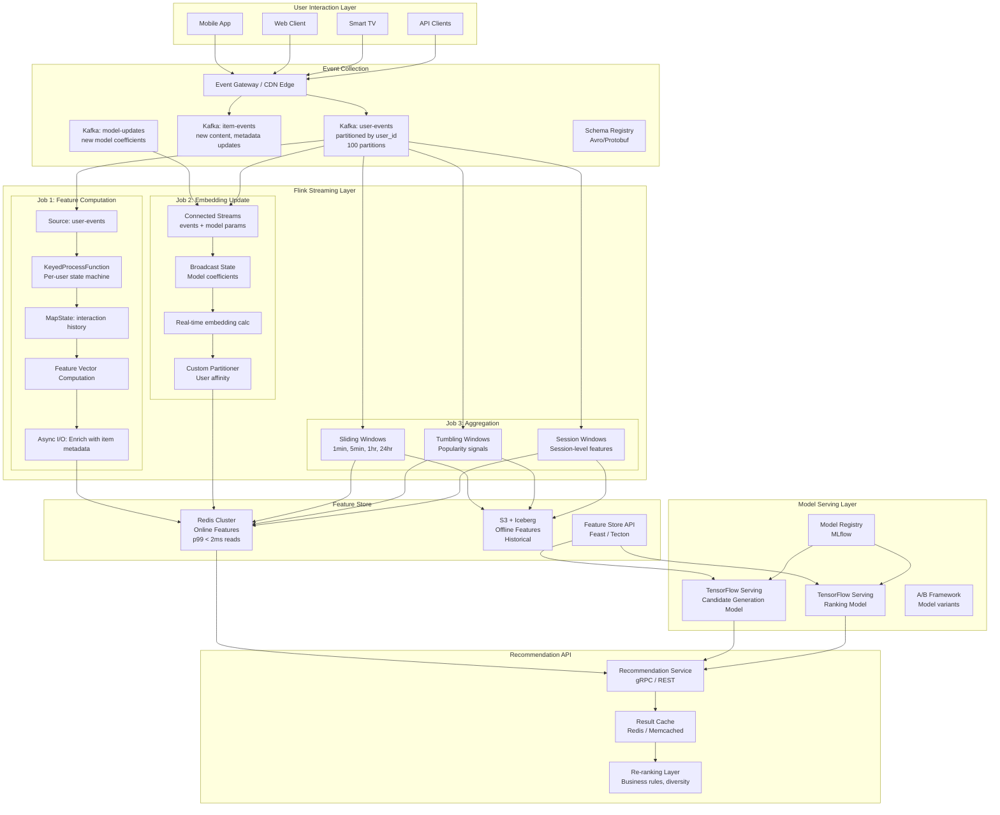
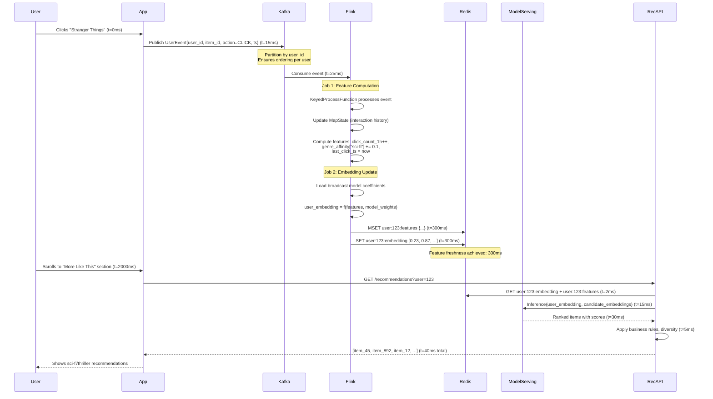
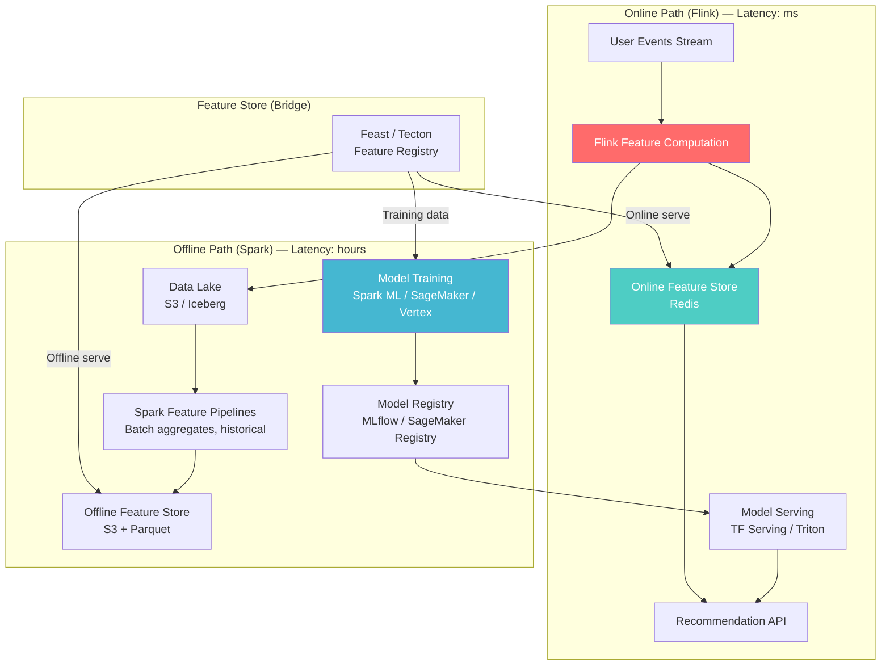
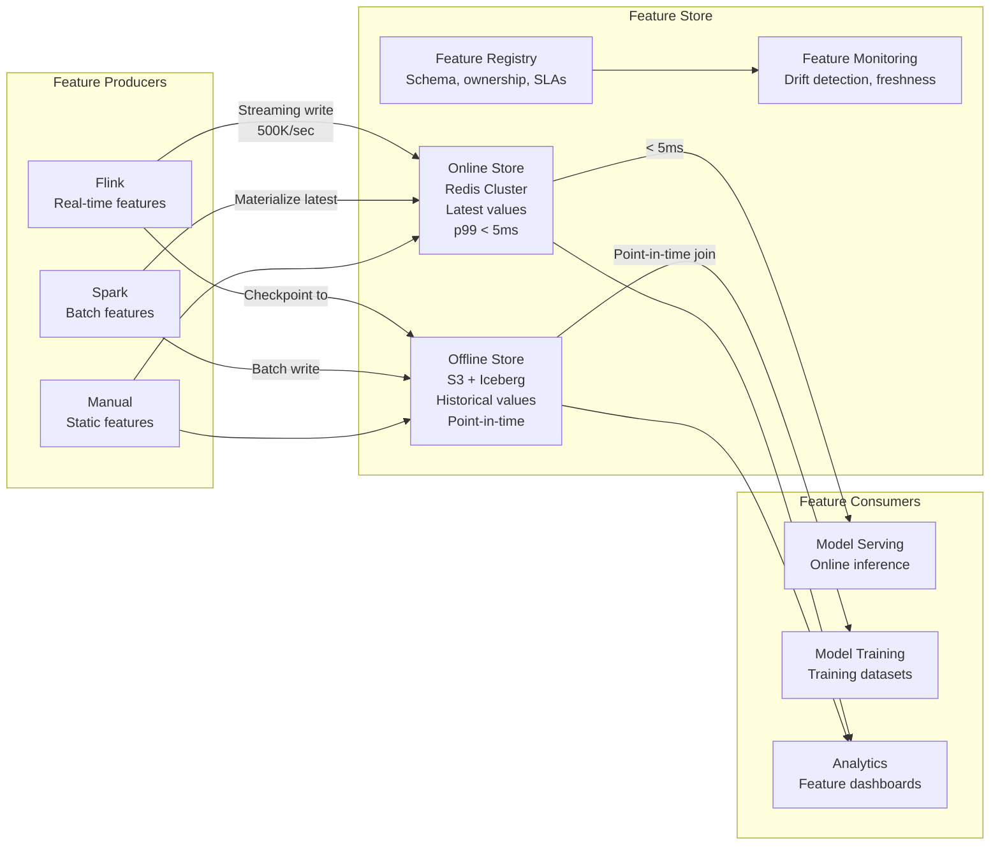
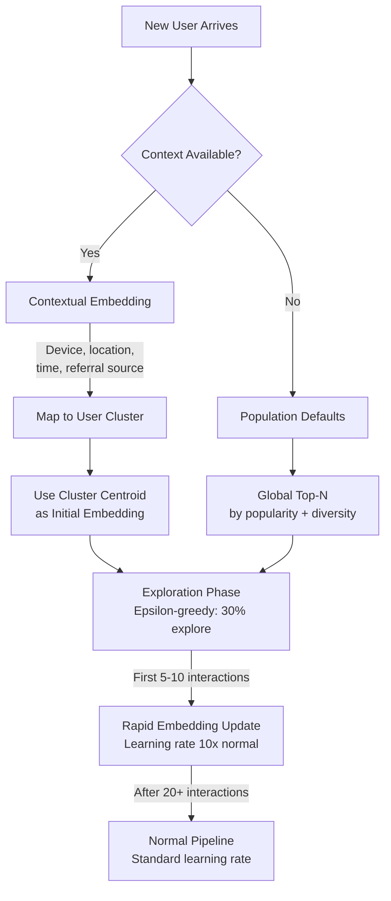

# Real-Time Recommendation System Data Pipeline

## 1. Problem Statement

Building a Netflix/Spotify/YouTube-scale recommendation system that serves personalized content to 100M+ daily active users with the following hard requirements:

| Requirement | Target | Why It's Hard |
|-------------|--------|---------------|
| Feature freshness | < 1 second from event to updated feature | Traditional batch pipelines have hours of latency; user interest shifts in seconds |
| User embedding updates | Real-time | A user who just watched a horror movie should immediately get horror recommendations |
| User behavior profiles | Maintained per-user with sliding windows | 100M users × hundreds of features = billions of state entries |
| Recommendation serving latency | p99 < 50ms | Includes feature lookup + model inference + ranking |
| Cold start | New users/items get quality recommendations immediately | No historical data available; must leverage contextual and population signals |
| Throughput | 10B events/day (~115K events/sec sustained, 500K peak) | Spikes during prime time, product launches, viral content |
| Feature consistency | Online/offline feature parity | Training/serving skew causes model degradation silently |

### The Core Challenge

The fundamental tension is between **freshness** and **scale**. Batch systems (Spark) handle scale but sacrifice freshness. Simple streaming systems handle freshness but collapse under the state management burden of 100M user profiles. Flink uniquely solves both through its managed keyed state, event-time processing, and exactly-once guarantees.

### What Goes Wrong Without Real-Time Features

```
User watches "Inception" at 8:00 PM
Batch pipeline runs at midnight
Features updated at 2:00 AM
User opens app at 8:05 PM → still gets romance recommendations from yesterday's session
Result: Poor engagement, user churns
```

With Flink streaming features:
```
User watches "Inception" at 8:00:00 PM
Flink updates user embedding at 8:00:00.3 PM (300ms)
Feature store updated at 8:00:00.5 PM (500ms)
User scrolls down at 8:00:05 PM → gets sci-fi/thriller recommendations
Result: 15-30% improvement in click-through rate
```

---

## 2. Architecture Diagram



---

## 3. End-to-End Data Flow

### From User Click to Updated Recommendation



### Event Schema (Protobuf)

```protobuf
message UserEvent {
    string user_id = 1;
    string item_id = 2;
    EventType action = 3;  // VIEW, CLICK, PLAY, COMPLETE, PURCHASE, SKIP
    int64 timestamp_ms = 4;
    string session_id = 5;
    map<string, string> context = 6;  // device, location, referrer
    float duration_seconds = 7;       // for PLAY events
    float completion_ratio = 8;       // 0.0 - 1.0
}

message ItemMetadata {
    string item_id = 1;
    repeated string genres = 2;
    repeated string tags = 3;
    float[] content_embedding = 4;    // Pre-computed by offline pipeline
    int64 release_timestamp = 5;
    float global_popularity = 6;
}
```

---

## 4. Flink Concepts Used

### 4.1 Async I/O — Non-Blocking External Lookups

**Why:** Flink operators are single-threaded per parallel instance. If you make a synchronous HTTP call to a model serving endpoint or Redis, you block the entire operator. With 100K events/sec per instance, even 5ms blocking calls would reduce throughput to 200 events/sec.

**How Async I/O works:**

```
Without Async I/O:
Event 1 → [Process 5ms] → [HTTP call 10ms BLOCKED] → [Process 5ms] → Event 2...
Throughput: 50 events/sec per instance

With Async I/O (capacity=100):
Event 1 → [Process] → [HTTP call fires, non-blocking] → Event 2 → [Process] → [HTTP call fires]...
                        ↓                                                        ↓
                   [Response arrives, emit]                              [Response arrives, emit]
Throughput: 10,000+ events/sec per instance
```

**Key parameters:**
- `capacity` — Maximum concurrent async requests in-flight. Set based on downstream service capacity.
- `timeout` — If response doesn't arrive, event is sent to side output or retried.
- `OutputMode.ORDERED` — Maintains event order (adds latency). Use for exactly-once sinks.
- `OutputMode.UNORDERED` — Better throughput, events emitted as responses arrive. Safe when downstream is idempotent.

**Retry and circuit breaker** must be implemented in the `AsyncFunction` — Flink doesn't provide this natively. Use Resilience4j or similar.

### 4.2 Broadcast State Pattern — Distributing Model Parameters

**Why:** ML models are retrained periodically (every hour or daily). When new model weights are published, ALL parallel Flink instances must receive the update simultaneously. You cannot key model updates by user_id because every user needs the latest model.

**How it works:**

```
Regular keyed stream (user events):       Partition 0: user_1, user_5, user_9...
                                          Partition 1: user_2, user_6, user_10...
                                          Partition 2: user_3, user_7, user_11...

Broadcast stream (model updates):         ALL partitions receive the SAME update
                                          Partition 0: model_v42
                                          Partition 1: model_v42
                                          Partition 2: model_v42
```

**State descriptor:** `MapStateDescriptor<String, ModelCoefficients>` — Stored in each parallel instance's local state. When a model update arrives, `processBroadcastElement()` is called on every instance.

**Critical gotcha:** You CANNOT modify keyed state from `processBroadcastElement()`. The broadcast side has no key context. You can only read/write the broadcast state. Keyed state modifications happen in `processElement()` which reads from broadcast state.

### 4.3 Connected Streams — Enriching Events with Profile Data

**Why:** User events need to be enriched with user profile data (demographics, subscription tier, historical preferences) before feature computation. Connected streams allow two different typed streams to be processed together in the same operator with shared state.

```
Stream 1: UserEvent (high volume, ~100K/sec)
Stream 2: ProfileUpdate (low volume, ~1K/sec, from user service CDC)

Connected → CoProcessFunction with shared keyed state
  - processElement1(UserEvent): Read profile from state, enrich event, emit
  - processElement2(ProfileUpdate): Update profile in keyed state
```

**Why not just a join?** Regular joins require windowing. Profile updates are sparse and irregular. A connected stream with keyed state gives you always-fresh profile data without window boundaries.

### 4.4 KeyedProcessFunction — Per-User State Machines

**Why:** Each user's behavior follows patterns (browse → click → engage → purchase). Tracking where each user is in this funnel, per session, requires per-key state and timers.

**Capabilities beyond regular ProcessFunction:**
- Access to keyed state (scoped to current key = user_id)
- Register event-time and processing-time timers
- Access to current key
- Side outputs for different event categories

**State machine transitions:**
```
ANONYMOUS → BROWSING (first page view)
BROWSING → INTERESTED (click on item)
INTERESTED → ENGAGED (play > 30 sec / scroll details)
ENGAGED → CONVERTING (add to list / start checkout)
CONVERTING → CONVERTED (purchase / subscribe)
Any → CHURNING (no activity for session_timeout)
```

Each state transition emits different features with different weights for the recommendation model.

### 4.5 MapState — Per-User Item Interaction History

**Why:** To compute features like "genres the user interacted with in the last hour" or "items similar to recently watched," you need an efficient per-user map of `item_id → InteractionDetails`.

**MapState vs ListState vs ValueState:**
- `ValueState<Map<K,V>>` — Serializes/deserializes ENTIRE map on every access. O(n) for any operation. Unusable for 1000+ entries.
- `ListState<T>` — Append-only. Cannot efficiently lookup or delete specific items.
- `MapState<K,V>` — RocksDB-backed. Each entry is a separate RocksDB key. O(1) get/put/delete. Can iterate. Perfect for user histories.

**RocksDB behavior:** Each `MapState` entry becomes a key in RocksDB: `<key_group><key><namespace><map_key> → <map_value>`. This means MapState with 1000 entries per user across 100M users = 100B RocksDB entries. Size management via State TTL is critical.

### 4.6 State TTL — Expiring Old Interactions

**Why:** Without TTL, state grows unbounded. A user who interacted with 10,000 items over 2 years would accumulate massive state. For recommendations, only recent behavior (7-30 days) matters for real-time features.

**Configuration options:**
- `UpdateType.OnCreateAndWrite` — TTL resets when state is written. Items user keeps re-engaging with stay alive.
- `UpdateType.OnReadAndWrite` — TTL resets on read too. Keeps accessed state alive longer.
- `StateTtlConfig.CleanupStrategies`:
  - `cleanupFullSnapshot()` — Cleans on checkpoint. Zero runtime overhead but state may briefly exceed limits.
  - `cleanupIncrementally(10, true)` — Checks 10 entries per state access. Amortized cleanup.
  - `cleanupInRocksdbCompactFilter()` — Best for RocksDB. Cleans during compaction. Zero read/write overhead.

### 4.7 Custom Partitioning — User Affinity for Cache Efficiency

**Why:** Default hash partitioning distributes users randomly across Flink instances. If you have a local cache (e.g., user profile cache, item metadata cache) in each operator instance, random distribution means terrible cache hit rates.

Custom partitioning ensures:
- Same user always goes to the same instance (cache-friendly)
- Hot users (power users generating many events) are spread across instances (load-balanced)
- Related users (same geography, similar behavior) may co-locate for efficient collaborative filtering signals

**Implementation:** A `Partitioner<String>` that uses consistent hashing with virtual nodes to balance load while maintaining affinity.

### 4.8 Timers — Periodic Profile Recalculation

**Why:** Some features are time-decayed (e.g., "genre affinity decays by 50% every 24 hours without interaction"). You can't wait for the next event to trigger decay—a user who goes inactive for a week should have stale features decayed, not frozen.

**Types:**
- **Event-time timers:** Fire when watermark passes timer timestamp. Deterministic in replay.
- **Processing-time timers:** Fire based on wall clock. Non-deterministic but lower latency.

**Pattern:** Register a processing-time timer every 5 minutes per user. On fire, recompute time-decayed features and push to feature store. If user has been inactive > threshold, emit "decay" event and re-register timer with exponential backoff (15min → 1hr → 6hr → stop).

---

## 5. Production Code Examples (Java)

### 5.1 Async I/O for Model Serving Calls

```java
public class ModelServingAsyncFunction 
    extends RichAsyncFunction<EnrichedEvent, ScoredEvent> {

    private transient AsyncHttpClient httpClient;
    private transient RateLimiter rateLimiter;
    private final String modelServingEndpoint;
    private final int maxRetries;

    public ModelServingAsyncFunction(String endpoint, int maxRetries) {
        this.modelServingEndpoint = endpoint;
        this.maxRetries = maxRetries;
    }

    @Override
    public void open(Configuration parameters) {
        this.httpClient = Dsl.asyncHttpClient(
            Dsl.config()
                .setMaxConnections(500)
                .setMaxConnectionsPerHost(100)
                .setConnectTimeout(1000)
                .setRequestTimeout(5000)
                .setKeepAlive(true)
                .setPooledConnectionIdleTimeout(60000)
                .build()
        );
        // 10K requests/sec rate limit to protect model serving
        this.rateLimiter = RateLimiter.create(10000);
    }

    @Override
    public void asyncInvoke(EnrichedEvent event, ResultFuture<ScoredEvent> resultFuture) {
        rateLimiter.acquire();
        
        InferenceRequest request = InferenceRequest.newBuilder()
            .setUserId(event.getUserId())
            .addAllFeatures(event.getFeatureVector())
            .addAllCandidateItems(event.getCandidateItemIds())
            .build();

        CompletableFuture<Response> future = httpClient
            .preparePost(modelServingEndpoint + "/v1/models/ranking:predict")
            .setHeader("Content-Type", "application/json")
            .setBody(request.toJson())
            .execute()
            .toCompletableFuture();

        // Retry with exponential backoff
        CompletableFuture<ScoredEvent> resultWithRetry = retryWithBackoff(
            future, event, 0
        );

        resultWithRetry.whenComplete((result, throwable) -> {
            if (throwable != null) {
                // Emit to side output for dead letter queue
                resultFuture.complete(Collections.singleton(
                    ScoredEvent.failed(event, throwable.getMessage())
                ));
            } else {
                resultFuture.complete(Collections.singleton(result));
            }
        });
    }

    private CompletableFuture<ScoredEvent> retryWithBackoff(
            CompletableFuture<Response> future, EnrichedEvent event, int attempt) {
        return future.thenApply(response -> {
            if (response.getStatusCode() == 200) {
                float[] scores = parseScores(response.getResponseBody());
                return ScoredEvent.success(event, scores);
            }
            throw new RuntimeException("Model serving returned " + response.getStatusCode());
        }).exceptionallyCompose(ex -> {
            if (attempt >= maxRetries) {
                return CompletableFuture.failedFuture(ex);
            }
            long delayMs = (long) Math.pow(2, attempt) * 100; // 100ms, 200ms, 400ms
            return CompletableFuture.supplyAsync(() -> null, 
                CompletableFuture.delayedExecutor(delayMs, TimeUnit.MILLISECONDS))
                .thenCompose(ignored -> retryWithBackoff(
                    reissueRequest(event), event, attempt + 1));
        });
    }

    @Override
    public void timeout(EnrichedEvent event, ResultFuture<ScoredEvent> resultFuture) {
        // Fallback: use cached scores or popularity-based ranking
        resultFuture.complete(Collections.singleton(
            ScoredEvent.timeout(event)
        ));
    }

    @Override
    public void close() {
        if (httpClient != null) httpClient.close();
    }
}

// Usage in pipeline
DataStream<ScoredEvent> scoredEvents = AsyncDataStream.unorderedWait(
    enrichedEvents,
    new ModelServingAsyncFunction("http://tf-serving.internal:8501", 3),
    5000,                    // timeout ms
    TimeUnit.MILLISECONDS,
    100                      // max concurrent requests (capacity)
);
```

### 5.2 Broadcast State for Model Coefficient Updates

```java
public class EmbeddingComputeFunction 
    extends KeyedBroadcastProcessFunction<String, UserEvent, ModelUpdate, UserEmbedding> {

    // Broadcast state: accessible from all parallel instances
    private final MapStateDescriptor<String, float[]> modelStateDescriptor =
        new MapStateDescriptor<>(
            "model-coefficients",
            BasicTypeInfo.STRING_TYPE_INFO,
            PrimitiveArrayTypeInfo.FLOAT_PRIMITIVE_ARRAY_TYPE_INFO
        );

    // Keyed state: per-user feature accumulator
    private ValueState<UserFeatures> userFeaturesState;
    private ValueState<float[]> currentEmbeddingState;
    private MapState<String, Float> genreAffinityState;

    @Override
    public void open(Configuration parameters) {
        ValueStateDescriptor<UserFeatures> featuresDesc = new ValueStateDescriptor<>(
            "user-features", UserFeatures.class);
        // TTL: expire user state after 30 days of inactivity
        StateTtlConfig ttlConfig = StateTtlConfig.newBuilder(Time.days(30))
            .setUpdateType(StateTtlConfig.UpdateType.OnCreateAndWrite)
            .setStateVisibility(StateTtlConfig.StateVisibility.NeverReturnExpired)
            .cleanupInRocksdbCompactFilter()
            .build();
        featuresDesc.enableTimeToLive(ttlConfig);
        this.userFeaturesState = getRuntimeContext().getState(featuresDesc);

        ValueStateDescriptor<float[]> embeddingDesc = new ValueStateDescriptor<>(
            "user-embedding", PrimitiveArrayTypeInfo.FLOAT_PRIMITIVE_ARRAY_TYPE_INFO);
        embeddingDesc.enableTimeToLive(ttlConfig);
        this.currentEmbeddingState = getRuntimeContext().getState(embeddingDesc);

        MapStateDescriptor<String, Float> genreDesc = new MapStateDescriptor<>(
            "genre-affinity", String.class, Float.class);
        genreDesc.enableTimeToLive(ttlConfig);
        this.genreAffinityState = getRuntimeContext().getMapState(genreDesc);
    }

    @Override
    public void processElement(UserEvent event, ReadOnlyContext ctx, Collector<UserEmbedding> out) 
            throws Exception {
        // Read current model from broadcast state
        ReadOnlyBroadcastState<String, float[]> modelState = 
            ctx.getBroadcastState(modelStateDescriptor);
        
        float[] userWeights = modelState.get("user_tower_weights");
        float[] biasVector = modelState.get("bias_vector");
        
        if (userWeights == null) {
            // Model not yet received; buffer event or use default
            return;
        }

        // Update per-user features based on event
        UserFeatures features = userFeaturesState.value();
        if (features == null) {
            features = UserFeatures.createDefault();
        }
        features.update(event);
        userFeaturesState.update(features);

        // Update genre affinity
        for (String genre : event.getItemGenres()) {
            Float current = genreAffinityState.get(genre);
            float weight = getActionWeight(event.getAction()); // click=0.1, play=0.3, complete=0.5
            genreAffinityState.put(genre, (current != null ? current : 0f) + weight);
        }

        // Compute new user embedding: embedding = sigmoid(W * features + b)
        float[] featureVector = features.toVector(); // 128-dim
        float[] embedding = matMul(userWeights, featureVector);
        addInPlace(embedding, biasVector);
        sigmoidInPlace(embedding);

        currentEmbeddingState.update(embedding);

        // Emit updated embedding
        out.collect(new UserEmbedding(
            event.getUserId(),
            embedding,
            System.currentTimeMillis(),
            features.getVersion()
        ));
    }

    @Override
    public void processBroadcastElement(ModelUpdate update, Context ctx, 
            Collector<UserEmbedding> out) throws Exception {
        // Update broadcast state — this runs on ALL parallel instances
        BroadcastState<String, float[]> state = ctx.getBroadcastState(modelStateDescriptor);
        
        state.put("user_tower_weights", update.getUserTowerWeights());
        state.put("bias_vector", update.getBiasVector());
        state.put("model_version", floatArrayFromVersion(update.getVersion()));
        
        LOG.info("Updated model to version {} on subtask {}", 
            update.getVersion(), getRuntimeContext().getIndexOfThisSubtask());
    }

    private float getActionWeight(EventType action) {
        switch (action) {
            case VIEW: return 0.05f;
            case CLICK: return 0.1f;
            case PLAY_START: return 0.2f;
            case PLAY_COMPLETE: return 0.5f;
            case ADD_TO_LIST: return 0.4f;
            case PURCHASE: return 1.0f;
            case SKIP: return -0.1f;
            case DISLIKE: return -0.5f;
            default: return 0.0f;
        }
    }
}
```

### 5.3 User Behavior State Machine

```java
public class UserBehaviorStateMachine 
    extends KeyedProcessFunction<String, UserEvent, BehaviorSignal> {

    private enum UserState {
        NEW, BROWSING, INTERESTED, ENGAGED, CONVERTING, CONVERTED, CHURNING
    }

    private ValueState<UserState> currentState;
    private ValueState<Long> lastActivityTimestamp;
    private ValueState<String> currentSessionId;
    private MapState<String, Integer> sessionEventCounts; // event_type → count
    private ValueState<Integer> consecutiveSkips;

    private static final long SESSION_TIMEOUT_MS = 30 * 60 * 1000; // 30 min
    private static final long CHURN_TIMEOUT_MS = 7 * 24 * 60 * 60 * 1000L; // 7 days

    @Override
    public void open(Configuration parameters) {
        StateTtlConfig ttl = StateTtlConfig.newBuilder(Time.days(30))
            .setUpdateType(StateTtlConfig.UpdateType.OnCreateAndWrite)
            .cleanupInRocksdbCompactFilter()
            .build();

        ValueStateDescriptor<UserState> stateDesc = 
            new ValueStateDescriptor<>("user-state", UserState.class);
        stateDesc.enableTimeToLive(ttl);
        currentState = getRuntimeContext().getState(stateDesc);

        ValueStateDescriptor<Long> lastActivityDesc = 
            new ValueStateDescriptor<>("last-activity", Long.class);
        lastActivityDesc.enableTimeToLive(ttl);
        lastActivityTimestamp = getRuntimeContext().getState(lastActivityDesc);

        currentSessionId = getRuntimeContext().getState(
            new ValueStateDescriptor<>("session-id", String.class));
        
        sessionEventCounts = getRuntimeContext().getMapState(
            new MapStateDescriptor<>("session-counts", String.class, Integer.class));
        
        consecutiveSkips = getRuntimeContext().getState(
            new ValueStateDescriptor<>("consecutive-skips", Integer.class));
    }

    @Override
    public void processElement(UserEvent event, Context ctx, Collector<BehaviorSignal> out) 
            throws Exception {
        UserState state = currentState.value();
        if (state == null) state = UserState.NEW;

        Long lastActivity = lastActivityTimestamp.value();
        long now = event.getTimestamp();

        // Check for session boundary
        if (lastActivity != null && (now - lastActivity) > SESSION_TIMEOUT_MS) {
            // New session — emit session summary signal
            out.collect(BehaviorSignal.sessionEnd(
                ctx.getCurrentKey(), currentSessionId.value(), sessionEventCounts));
            sessionEventCounts.clear();
            currentSessionId.update(event.getSessionId());
            state = UserState.BROWSING;
        }

        // State transitions
        UserState newState = transition(state, event);
        
        if (newState != state) {
            // Emit transition signal — these are high-value features
            out.collect(BehaviorSignal.stateTransition(
                ctx.getCurrentKey(), state, newState, event));
            currentState.update(newState);
        }

        // Track consecutive negative signals
        if (event.getAction() == EventType.SKIP) {
            Integer skips = consecutiveSkips.value();
            consecutiveSkips.update((skips != null ? skips : 0) + 1);
            if (consecutiveSkips.value() >= 5) {
                out.collect(BehaviorSignal.disengagement(ctx.getCurrentKey()));
            }
        } else {
            consecutiveSkips.update(0);
        }

        // Update counters
        String actionKey = event.getAction().name();
        Integer count = sessionEventCounts.get(actionKey);
        sessionEventCounts.put(actionKey, (count != null ? count : 0) + 1);
        lastActivityTimestamp.update(now);

        // Register churn detection timer
        ctx.timerService().deleteProcessingTimeTimer(lastActivity != null ? lastActivity + CHURN_TIMEOUT_MS : 0);
        ctx.timerService().registerProcessingTimeTimer(now + CHURN_TIMEOUT_MS);
    }

    @Override
    public void onTimer(long timestamp, OnTimerContext ctx, Collector<BehaviorSignal> out) 
            throws Exception {
        // Timer fired — user has been inactive for CHURN_TIMEOUT_MS
        UserState state = currentState.value();
        if (state != null && state != UserState.CHURNING) {
            currentState.update(UserState.CHURNING);
            out.collect(BehaviorSignal.churnRisk(ctx.getCurrentKey(), state));
        }
    }

    private UserState transition(UserState current, UserEvent event) {
        switch (current) {
            case NEW:
            case CHURNING:
                return UserState.BROWSING;
            case BROWSING:
                if (event.getAction() == EventType.CLICK) return UserState.INTERESTED;
                break;
            case INTERESTED:
                if (event.getAction() == EventType.PLAY_START || 
                    event.getAction() == EventType.VIEW && event.getDuration() > 30)
                    return UserState.ENGAGED;
                break;
            case ENGAGED:
                if (event.getAction() == EventType.ADD_TO_LIST || 
                    event.getAction() == EventType.PURCHASE)
                    return UserState.CONVERTING;
                break;
            case CONVERTING:
                if (event.getAction() == EventType.PURCHASE)
                    return UserState.CONVERTED;
                break;
            case CONVERTED:
                // Stay converted for this session
                break;
        }
        return current;
    }
}
```

### 5.4 Real-Time Feature Vector Computation

```java
public class FeatureVectorComputer 
    extends KeyedProcessFunction<String, UserEvent, FeatureVector> {

    // Sliding window feature state
    private MapState<Long, EventSummary> hourlyBuckets;   // bucket_hour → summary
    private MapState<String, Float> genreScores;
    private MapState<String, Long> recentItems;            // item_id → timestamp
    private ValueState<FeatureAccumulator> accumulator;

    // Feature dimensions
    private static final int EMBEDDING_DIM = 64;
    private static final int GENRE_DIM = 20;
    private static final int TEMPORAL_DIM = 12;
    private static final int BEHAVIORAL_DIM = 16;
    private static final int TOTAL_DIM = EMBEDDING_DIM + GENRE_DIM + TEMPORAL_DIM + BEHAVIORAL_DIM;
    // = 112 features per user

    @Override
    public void open(Configuration parameters) {
        StateTtlConfig ttl = StateTtlConfig.newBuilder(Time.days(7))
            .setUpdateType(StateTtlConfig.UpdateType.OnCreateAndWrite)
            .cleanupInRocksdbCompactFilter()
            .build();

        MapStateDescriptor<Long, EventSummary> hourlyDesc = new MapStateDescriptor<>(
            "hourly-buckets", Long.class, EventSummary.class);
        hourlyDesc.enableTimeToLive(ttl);
        hourlyBuckets = getRuntimeContext().getMapState(hourlyDesc);

        MapStateDescriptor<String, Float> genreDesc = new MapStateDescriptor<>(
            "genre-scores", String.class, Float.class);
        genreDesc.enableTimeToLive(ttl);
        genreScores = getRuntimeContext().getMapState(genreDesc);

        MapStateDescriptor<String, Long> recentDesc = new MapStateDescriptor<>(
            "recent-items", String.class, Long.class);
        recentDesc.enableTimeToLive(StateTtlConfig.newBuilder(Time.hours(24))
            .setUpdateType(StateTtlConfig.UpdateType.OnCreateAndWrite)
            .cleanupInRocksdbCompactFilter()
            .build());
        recentItems = getRuntimeContext().getMapState(recentDesc);

        accumulator = getRuntimeContext().getState(
            new ValueStateDescriptor<>("accumulator", FeatureAccumulator.class));
    }

    @Override
    public void processElement(UserEvent event, Context ctx, Collector<FeatureVector> out) 
            throws Exception {
        long now = event.getTimestamp();
        long hourBucket = now / 3600000; // hour-level bucket

        // --- Update hourly aggregates ---
        EventSummary summary = hourlyBuckets.get(hourBucket);
        if (summary == null) summary = new EventSummary();
        summary.addEvent(event);
        hourlyBuckets.put(hourBucket, summary);

        // --- Update genre scores with exponential decay ---
        for (String genre : event.getItemGenres()) {
            Float current = genreScores.get(genre);
            float actionWeight = getActionWeight(event.getAction());
            genreScores.put(genre, (current != null ? current * 0.99f : 0f) + actionWeight);
        }

        // --- Track recent items ---
        recentItems.put(event.getItemId(), now);

        // --- Compute feature vector ---
        float[] features = new float[TOTAL_DIM];
        int offset = 0;

        // Behavioral features (16 dims)
        FeatureAccumulator acc = accumulator.value();
        if (acc == null) acc = new FeatureAccumulator();
        acc.update(event);
        accumulator.update(acc);
        
        features[offset++] = acc.getTotalClicks();
        features[offset++] = acc.getTotalPlays();
        features[offset++] = acc.getAvgSessionLength();
        features[offset++] = acc.getClickThroughRate();
        features[offset++] = acc.getCompletionRate();
        features[offset++] = acc.getSkipRate();
        features[offset++] = acc.getDaysSinceFirstEvent();
        features[offset++] = acc.getEventsLast1h();
        features[offset++] = acc.getEventsLast24h();
        features[offset++] = acc.getUniqueItemsLast7d();
        features[offset++] = acc.getAvgDwellTime();
        features[offset++] = acc.getPeakHourOfDay();
        features[offset++] = acc.getDayOfWeekEntropy();
        features[offset++] = acc.getConsecutiveActiveDays();
        features[offset++] = acc.getReturnFrequency();
        features[offset++] = acc.getExplorationScore(); // diversity of genres explored

        // Temporal features (12 dims) — sliding window counts
        long currentHour = now / 3600000;
        float[] windowCounts = new float[]{0, 0, 0, 0}; // 1h, 6h, 24h, 7d
        for (Map.Entry<Long, EventSummary> entry : hourlyBuckets.entries()) {
            long diff = currentHour - entry.getKey();
            if (diff <= 1) windowCounts[0] += entry.getValue().getCount();
            if (diff <= 6) windowCounts[1] += entry.getValue().getCount();
            if (diff <= 24) windowCounts[2] += entry.getValue().getCount();
            if (diff <= 168) windowCounts[3] += entry.getValue().getCount();
        }
        System.arraycopy(normalizeWindows(windowCounts), 0, features, offset, 12);
        offset += 12;

        // Genre affinity features (20 dims) — top genres normalized
        float[] genreVector = computeGenreVector(genreScores, GENRE_DIM);
        System.arraycopy(genreVector, 0, features, offset, GENRE_DIM);
        offset += GENRE_DIM;

        // User embedding placeholder (64 dims) — filled by downstream embedding update
        // Leave zeros; will be populated by broadcast state operator
        offset += EMBEDDING_DIM;

        out.collect(new FeatureVector(
            event.getUserId(),
            features,
            now,
            acc.getVersion()
        ));

        // Register timer for decay computation
        ctx.timerService().registerProcessingTimeTimer(now + 300_000); // 5 min
    }

    @Override
    public void onTimer(long timestamp, OnTimerContext ctx, Collector<FeatureVector> out) 
            throws Exception {
        // Periodic decay: reduce genre scores, clean old buckets
        long currentHour = System.currentTimeMillis() / 3600000;
        
        // Remove buckets older than 7 days
        List<Long> toRemove = new ArrayList<>();
        for (Long bucket : hourlyBuckets.keys()) {
            if (currentHour - bucket > 168) toRemove.add(bucket);
        }
        for (Long bucket : toRemove) hourlyBuckets.remove(bucket);

        // Decay genre scores
        for (Map.Entry<String, Float> entry : genreScores.entries()) {
            float decayed = entry.getValue() * 0.95f;
            if (decayed < 0.01f) {
                genreScores.remove(entry.getKey());
            } else {
                genreScores.put(entry.getKey(), decayed);
            }
        }
    }
}
```

### 5.5 Redis Feature Store Sink

```java
public class RedisFeatureStoreSink extends RichSinkFunction<FeatureVector> 
    implements CheckpointedFunction {

    private transient JedisCluster jedisCluster;
    private transient List<FeatureVector> buffer;
    private ListState<FeatureVector> checkpointedBuffer;

    private final int batchSize;
    private final String keyPrefix;
    private final int ttlSeconds;

    public RedisFeatureStoreSink(String keyPrefix, int batchSize, int ttlSeconds) {
        this.keyPrefix = keyPrefix;
        this.batchSize = batchSize;
        this.ttlSeconds = ttlSeconds;
    }

    @Override
    public void open(Configuration parameters) {
        Set<HostAndPort> nodes = new HashSet<>();
        nodes.add(new HostAndPort("redis-cluster-1", 6379));
        nodes.add(new HostAndPort("redis-cluster-2", 6379));
        nodes.add(new HostAndPort("redis-cluster-3", 6379));
        
        GenericObjectPoolConfig<Connection> poolConfig = new GenericObjectPoolConfig<>();
        poolConfig.setMaxTotal(128);
        poolConfig.setMaxIdle(32);
        poolConfig.setMinIdle(8);
        poolConfig.setTestOnBorrow(true);
        
        jedisCluster = new JedisCluster(nodes, 2000, 2000, 3, "password", poolConfig);
        buffer = new ArrayList<>(batchSize);
    }

    @Override
    public void invoke(FeatureVector vector, SinkFunction.Context context) throws Exception {
        buffer.add(vector);
        
        if (buffer.size() >= batchSize) {
            flush();
        }
    }

    private void flush() throws Exception {
        if (buffer.isEmpty()) return;

        // Group by Redis hash slot for pipeline efficiency
        Map<Integer, List<FeatureVector>> bySlot = buffer.stream()
            .collect(Collectors.groupingBy(v -> 
                JedisClusterCRC16.getSlot(keyPrefix + v.getUserId())));

        for (List<FeatureVector> slotBatch : bySlot.values()) {
            // Pipeline within same slot
            for (FeatureVector vector : slotBatch) {
                String key = keyPrefix + vector.getUserId();
                byte[] value = vector.serialize(); // MessagePack or Protobuf
                
                jedisCluster.setex(
                    key.getBytes(),
                    ttlSeconds,
                    value
                );
                
                // Also store individual features for selective reads
                String hashKey = keyPrefix + "hash:" + vector.getUserId();
                Map<String, String> featureMap = vector.toFeatureMap();
                jedisCluster.hset(hashKey, featureMap);
                jedisCluster.expire(hashKey, ttlSeconds);
            }
        }

        // Metrics
        getRuntimeContext().getMetricGroup()
            .counter("features-written")
            .inc(buffer.size());
        
        buffer.clear();
    }

    @Override
    public void snapshotState(FunctionSnapshotContext context) throws Exception {
        checkpointedBuffer.clear();
        for (FeatureVector v : buffer) {
            checkpointedBuffer.add(v);
        }
    }

    @Override
    public void initializeState(FunctionInitializationContext context) throws Exception {
        ListStateDescriptor<FeatureVector> descriptor = new ListStateDescriptor<>(
            "buffered-features", FeatureVector.class);
        checkpointedBuffer = context.getOperatorStateStore().getListState(descriptor);
        
        if (context.isRestored()) {
            buffer = new ArrayList<>(batchSize);
            for (FeatureVector v : checkpointedBuffer.get()) {
                buffer.add(v);
            }
        }
    }

    @Override
    public void close() {
        try { flush(); } catch (Exception ignored) {}
        if (jedisCluster != null) jedisCluster.close();
    }
}
```

---

## 6. ML Integration Architecture



### Online Feature Computation (Flink)

Features computed in real-time with sub-second latency:

| Feature | Computation | Freshness |
|---------|-------------|-----------|
| `clicks_last_1h` | Sliding window counter | < 500ms |
| `genre_affinity_vector` | Exponentially decayed weighted sum | < 500ms |
| `user_embedding` | Matrix multiply with broadcast model weights | < 1s |
| `session_depth` | Per-session event counter | < 200ms |
| `last_interaction_item_embedding` | Async lookup to item store | < 1s |
| `time_since_last_click` | Current time - last activity state | < 200ms |

### Offline Feature Computation (Spark)

Features computed in batch with daily/hourly cadence:

| Feature | Computation | Freshness |
|---------|-------------|-----------|
| `lifetime_value_score` | Aggregate purchase history | Daily |
| `content_diversity_index` | Shannon entropy of genre consumption over 90 days | Daily |
| `social_graph_embedding` | Graph neural network on friend interactions | Daily |
| `seasonal_preference_vector` | Historical preference by time-of-year | Weekly |
| `collaborative_filtering_embedding` | ALS matrix factorization on rating matrix | Daily |

### Model Training Pipeline

```
1. Feature Store exports training dataset (Feast offline store)
   → Point-in-time correct joins (no data leakage)
   
2. Spark preprocesses: normalization, encoding, feature crosses
   
3. Training (distributed):
   - Candidate generation: Two-tower model (user tower + item tower)
   - Ranking: Wide & Deep or DCN-v2
   - Framework: TensorFlow / PyTorch on SageMaker / Vertex AI
   
4. Evaluation: A/B metrics on holdout, offline AUC/NDCG
   
5. Model Registry: Version, lineage, approval workflow
   
6. Deploy to TF Serving: Canary → Shadow → Full rollout
   
7. Publish model weights to Kafka (model-updates topic)
   → Flink broadcast state picks up new coefficients
```

### Model Serving Architecture

```
Request flow:
1. API receives request for user_123
2. Fetch user features from Redis (2ms)
3. Candidate generation: ANN search in item embedding space (Faiss/ScaNN) → 1000 candidates (5ms)
4. Fetch item features for candidates from Redis (3ms)  
5. Ranking model scores 1000 items (15ms on GPU, batched)
6. Re-ranking: diversity, freshness, business rules (2ms)
7. Return top-50 items (total: ~30ms p50, ~50ms p99)
```

---

## 7. Feature Store Pattern



### Online Features (Redis)

**Storage format:**
```
Key: "features:user:{user_id}"
Value: MessagePack({
    "clicks_1h": 12,
    "genre_affinity": [0.8, 0.1, 0.05, ...],  // 20 dims
    "embedding": [0.23, -0.45, ...],            // 64 dims
    "last_active_ts": 1700000000,
    "session_depth": 7,
    "behavior_state": "ENGAGED",
    "_version": 4521,
    "_updated_at": 1700000000500
})
TTL: 48 hours (refreshed on every write)
```

**Write path:** Flink → Redis Cluster (direct write, batched per hash slot)
**Read path:** Recommendation API → Redis (single GET, < 2ms p99)

### Offline Features (S3/Iceberg)

**Storage format:** Iceberg table partitioned by date, sorted by user_id
```sql
CREATE TABLE offline_features (
    user_id STRING,
    feature_name STRING,
    feature_value BINARY,  -- serialized float[] or map
    event_timestamp TIMESTAMP,
    created_timestamp TIMESTAMP
) PARTITIONED BY (days(event_timestamp))
```

**Write path:** 
- Flink checkpoints feature snapshots hourly to S3
- Spark batch job computes historical aggregates daily

**Read path (training):**
```python
# Point-in-time correct feature retrieval
training_data = feast.get_historical_features(
    entity_df=labeled_events,  # (user_id, timestamp, label)
    features=[
        "user_features:clicks_1h",
        "user_features:genre_affinity",
        "user_features:embedding",
    ]
)
# Returns features AS THEY WERE at each event's timestamp
# Prevents data leakage (no future information)
```

### Feature Freshness Guarantees

| Feature Tier | Freshness SLA | Producer | Store |
|-------------|---------------|----------|-------|
| Tier 0 (Critical) | < 1 second | Flink | Redis |
| Tier 1 (Important) | < 5 minutes | Flink (windowed) | Redis |
| Tier 2 (Standard) | < 1 hour | Flink (checkpoint) | Redis + S3 |
| Tier 3 (Batch) | < 24 hours | Spark | S3 only (materialized to Redis daily) |

**Monitoring:** Alert if feature staleness exceeds SLA. Track `_updated_at` per feature group. If Flink job fails, stale features are still served from Redis (graceful degradation) but monitoring fires.

---

## 8. Cold Start Handling

### New User Cold Start



**Strategies implemented in Flink:**

1. **Contextual signals:** Device type, OS, signup source, time-of-day, geography → map to pre-computed cluster centroid embedding
2. **Onboarding preferences:** If user selects genres during signup, directly set genre affinity state
3. **Explore/Exploit:** Flink tracks interaction count. For users with < 20 interactions, output a `cold_start=true` flag that tells the recommendation API to use a higher exploration rate
4. **Transfer learning:** If user links social accounts or has cross-platform identity, Flink can load behavior from another platform

### New Item Cold Start

1. **Content-based embedding:** Compute item embedding from metadata (title, description, genre, cast) using pre-trained NLP model — done offline, pushed to item feature store
2. **Popularity boost:** New items get a temporary boost factor that decays as they accumulate interactions
3. **Flink tracking:** A separate Flink job counts interactions per item in sliding windows. Items with < 100 interactions in 24h are flagged as "cold" and served with exploration slots

---

## 9. Scaling to 100M Users, 10B Events/Day

### Capacity Planning

| Component | Scale | Configuration |
|-----------|-------|---------------|
| Kafka | 10B events/day = 115K/sec avg, 500K/sec peak | 100 partitions, 3x replication, 7-day retention, 50 brokers |
| Flink (Feature Job) | 500K feature updates/sec output | 200 TaskManagers × 4 slots = 800 parallelism |
| Flink State | 100M users × 2KB avg state = 200TB | RocksDB backend, incremental checkpoints, NVMe SSDs |
| Redis (Online Store) | 100M users × 500 bytes = 50GB + headroom | 30-node cluster, 100GB RAM total, 2M ops/sec capacity |
| Model Serving | 50K inference requests/sec (batched) | 20 GPU instances, 2500 req/sec each |
| Checkpoints | Every 60s, 200TB incremental | S3 with multipart upload, ~5GB incremental per checkpoint |

### Flink Job Configuration

```yaml
# flink-conf.yaml for the feature computation job
taskmanager.numberOfTaskSlots: 4
taskmanager.memory.process.size: 32g
taskmanager.memory.managed.fraction: 0.7  # For RocksDB
taskmanager.memory.network.fraction: 0.1

state.backend: rocksdb
state.backend.rocksdb.memory.managed: true
state.backend.rocksdb.block.cache-size: 512mb
state.backend.rocksdb.writebuffer.size: 128mb
state.backend.rocksdb.writebuffer.count: 4
state.backend.incremental: true

state.checkpoints.dir: s3://checkpoints/feature-job/
state.savepoints.dir: s3://savepoints/feature-job/
execution.checkpointing.interval: 60s
execution.checkpointing.min-pause: 30s
execution.checkpointing.timeout: 600s
execution.checkpointing.unaligned: true  # Critical for backpressure scenarios

# Restart strategy
restart-strategy: exponential-delay
restart-strategy.exponential-delay.initial-backoff: 1s
restart-strategy.exponential-delay.max-backoff: 60s
restart-strategy.exponential-delay.backoff-multiplier: 2.0
```

### Key Scaling Techniques

1. **Incremental checkpoints:** Only changed state since last checkpoint is uploaded. Reduces checkpoint size from 200TB → ~5GB.
2. **Unaligned checkpoints:** Checkpoint barriers skip ahead of buffered data. Critical when backpressure occurs to avoid checkpoint timeout.
3. **Local recovery:** On TaskManager restart, recover from local RocksDB files instead of re-downloading from S3. Recovery time: seconds instead of minutes.
4. **Rescaling with state redistribution:** When adding parallelism, Flink automatically redistributes keyed state across new instances using key-group ranges.
5. **Rate limiting sinks:** Redis and model serving have throughput limits. Flink's async I/O capacity parameter acts as built-in backpressure — if Redis is slow, Flink slows consumption from Kafka.

### Handling 500K Feature Updates/sec to Redis

```
Strategy: Micro-batching + Pipelining

Flink sink buffers writes for 50ms or 1000 events (whichever first)
→ Groups keys by Redis hash slot (16384 slots across 30 nodes)
→ Sends pipelined commands per slot (1 round-trip per slot per batch)
→ Result: 500K writes/sec with only ~500 Redis round-trips/sec
```

---

## 10. Real Companies

### Netflix — Keystone Pipeline

**Architecture:** Netflix processes 700B+ events/day through their Keystone pipeline built on Kafka + Flink.

- **Real-time personalization:** Flink computes viewing session features (what you watched, when you paused, what you skipped) and updates user profiles in < 1 second
- **Artwork personalization:** Different users see different artwork for the same title based on real-time genre affinity (computed in Flink)
- **Play predictor:** Real-time features feed a model that predicts probability of play for each title. Updated continuously.
- **Key insight:** Netflix found that reducing feature latency from hours to seconds improved engagement metrics by 10-20% for newly-released content

### Spotify — Event Delivery System

**Architecture:** Spotify processes 100B+ events/day for real-time music recommendations.

- **Real-time listening features:** Flink tracks what users are listening to right now, skip rates, replay behavior
- **Discover Weekly/Daily Mix:** While the playlists are generated in batch, the ranking of tracks within them uses real-time signals from Flink
- **Context-aware recommendations:** Time of day + recent listening history (Flink) → different recommendations for morning commute vs. evening workout
- **Podcast recommendations:** Real-time engagement signals (did they listen to the whole episode?) feed back within seconds
- **Key technology:** Spotify uses Flink for their "Event Delivery" system that unifies batch and streaming feature computation

### Pinterest — Real-Time Signals (Pinnerlog)

**Architecture:** Pinterest processes 50B+ events/day for pin recommendations and ad targeting.

- **Homefeed ranking:** Real-time engagement signals (saves, clicks, close-ups) computed in Flink feed the homefeed ranking model
- **Related pins:** When a user engages with a pin, Flink immediately updates their interest graph, affecting "More like this" recommendations
- **Shopping recommendations:** Real-time purchase intent signals (product pin saves, price check interactions) feed their shopping recommender within seconds
- **Ads targeting:** Real-time user segments computed in Flink (e.g., "actively planning a wedding") used for ad targeting
- **Key insight:** Pinterest reported that real-time features from Flink improved their recommendation quality by 30%+ compared to daily batch features for time-sensitive use cases (trending topics, seasonal events)

### Common Patterns Across All Three

| Pattern | Netflix | Spotify | Pinterest |
|---------|---------|---------|-----------|
| Event volume | 700B/day | 100B/day | 50B/day |
| Feature freshness | < 1s | < 5s | < 10s |
| State backend | RocksDB | RocksDB | RocksDB |
| Feature store | Custom (Cassandra) | Custom (Bigtable) | Custom (Redis + HBase) |
| Model serving | Custom + TF Serving | TF Serving + custom | TF Serving |
| Key Flink usage | Session features, A/B metrics | Listening features, event delivery | Engagement signals, user segments |

---

## Summary

The real-time recommendation pipeline combines Flink's unique strengths:

1. **Massive keyed state** (RocksDB) → per-user profiles at 100M scale
2. **Exactly-once processing** → consistent features without duplicates
3. **Async I/O** → high-throughput external service integration
4. **Broadcast state** → seamless model coefficient distribution
5. **Timers** → time-decay and inactivity detection without event triggers
6. **State TTL** → automatic state cleanup preventing unbounded growth

The result: a system that updates user recommendations within 500ms of any interaction, serving 100M+ users with p99 < 50ms end-to-end latency, while maintaining training/serving feature parity through a unified feature store architecture.
