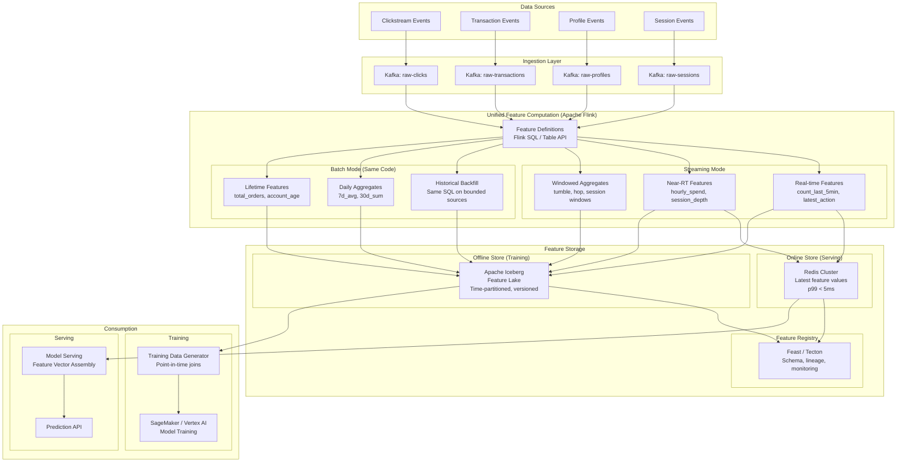
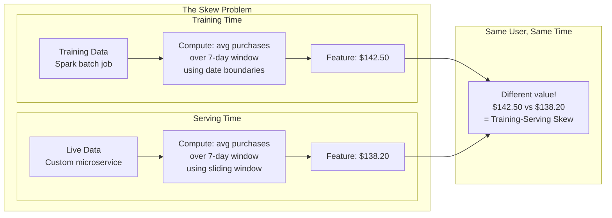
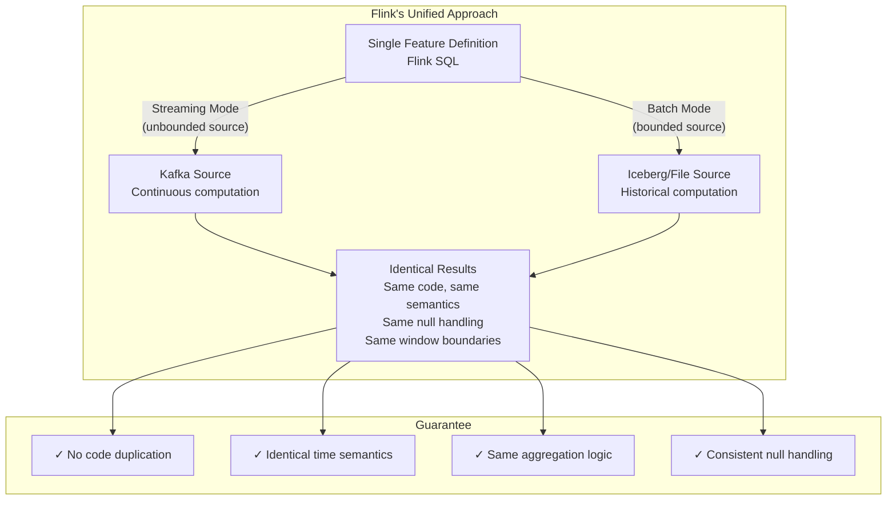
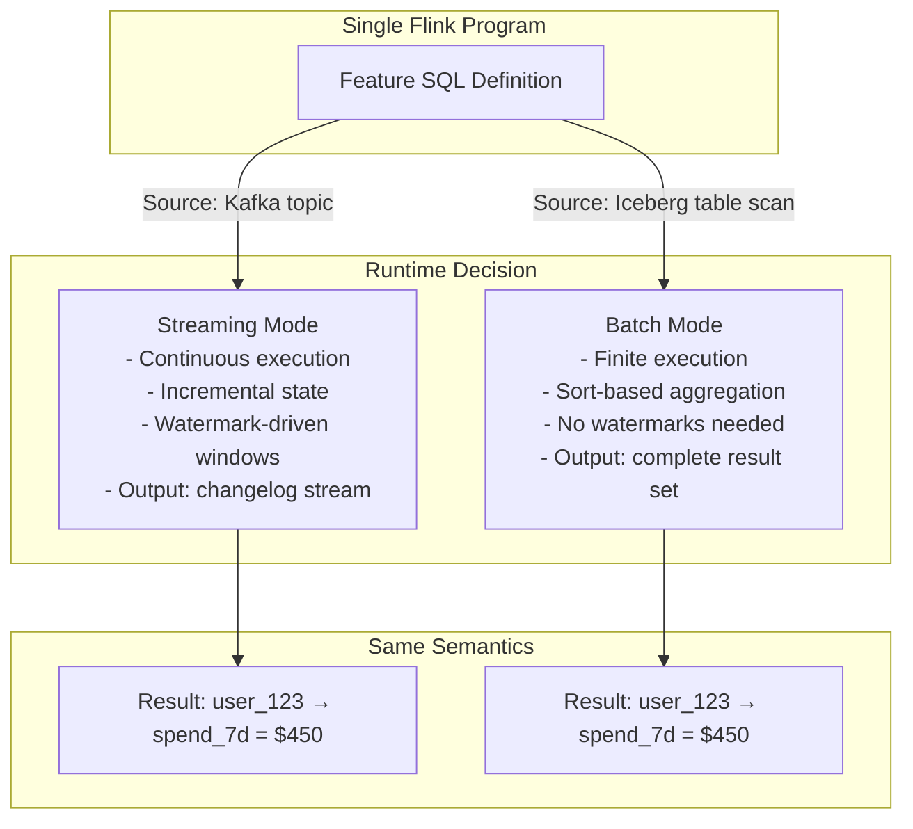
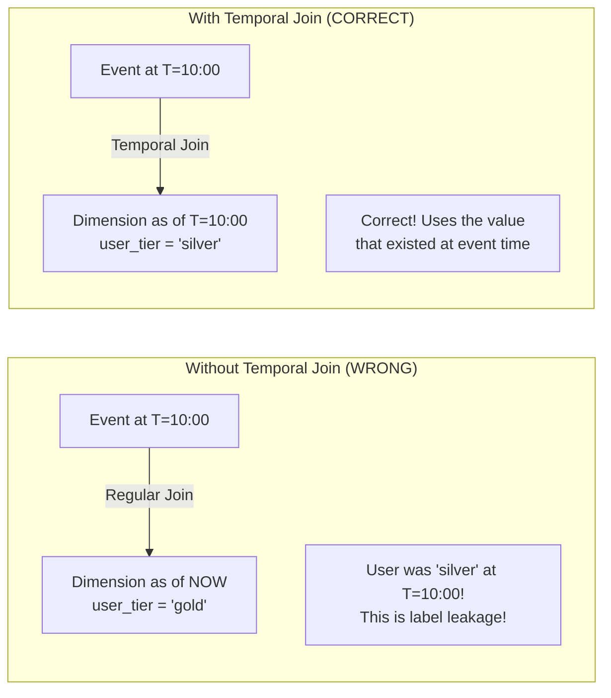
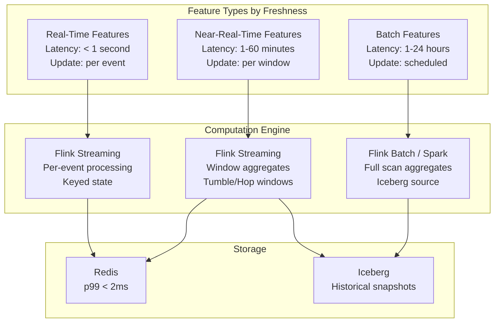
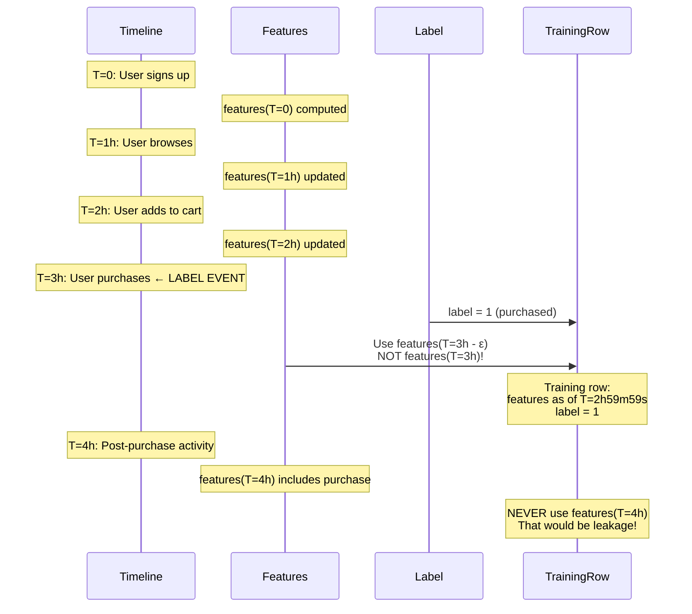
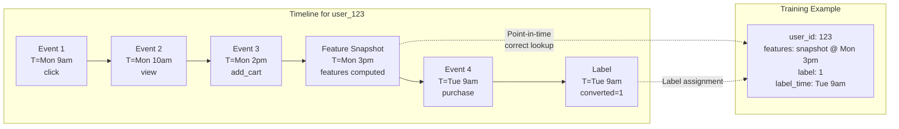

# ML Feature Engineering & Training Data Pipeline at Scale

## 1. Problem Statement

### The Core Challenge

ML models in production require features computed from streaming data—last-7-day purchase aggregates, real-time click counts, session-level features, sliding window statistics. The fundamental problem is:

**Training-serving skew is the #1 ML production problem.**

When features are computed differently for training (batch, retrospective) vs. serving (streaming, real-time), model performance silently degrades in production. Studies show 60-80% of ML bugs trace back to data/feature issues, not model architecture.

### Requirements

| Dimension | Requirement |
|-----------|-------------|
| Data Volume | 50 TB/day raw events → curated feature tables |
| Feature Count | 10,000+ features across 100+ entities |
| Entity Scale | 1 billion+ entities (users, items, merchants) |
| Freshness | Real-time features: < 1 second; Near-RT: < 5 min; Batch: < 1 hour |
| Consistency | Exact same computation logic for training and serving |
| Point-in-time correctness | No future data leakage in training datasets |
| Backfill | Re-compute features historically when definitions change |

### Why This Is Hard

```
Training Pipeline (Batch):
  - Runs on historical data
  - Computes features using Spark/Hive
  - Has access to complete time ranges
  - Uses different code paths, libraries, time semantics

Serving Pipeline (Streaming):
  - Runs on live data
  - Computes features using custom services
  - Only sees data up to "now"
  - Uses different code paths, libraries, time semantics

Result: Silent model degradation. Features that worked in training
        produce different values in production → prediction quality drops.
```

### Business Impact of Training-Serving Skew

- Uber reported **10-20% model accuracy drops** from feature skew in early Michelangelo versions
- Airbnb found that **~30% of model incidents** traced to feature pipeline inconsistencies
- Google's ML paper identified data issues (including skew) as the most common ML technical debt

---

## 2. Architecture Diagram



---

## 3. The Training-Serving Skew Problem

### What Is Training-Serving Skew?

Training-serving skew occurs when the feature values a model saw during training differ systematically from what it sees during inference—even for the same underlying data.



### Root Causes of Skew

| Cause | Example | Impact |
|-------|---------|--------|
| **Code duplication** | Spark SQL for training, Java for serving | Different rounding, null handling |
| **Time semantics** | Calendar day vs. sliding 24h window | Off-by-hours for daily aggregates |
| **Data availability** | Batch sees late data, streaming doesn't | Systematically different counts |
| **Aggregation boundaries** | Inclusive vs. exclusive endpoints | Off-by-one in window boundaries |
| **Null handling** | Default 0 in batch, null in streaming | Model receives unexpected inputs |
| **Feature staleness** | Batch: fresh compute; serving: cached | Stale features in low-traffic entities |

### How Flink Solves Training-Serving Skew



### The Key Insight

Flink's Table API / SQL operates identically on:
- **Bounded sources** (files, Iceberg tables) → produces batch results for training
- **Unbounded sources** (Kafka topics) → produces streaming results for serving

The same SQL query, the same execution semantics, the same results. This is the **only** production-proven way to eliminate training-serving skew at the computation level.

```sql
-- THIS SINGLE DEFINITION runs in both batch and streaming mode
CREATE VIEW user_purchase_features AS
SELECT
    user_id,
    window_start,
    window_end,
    COUNT(*) as purchase_count_7d,
    SUM(amount) as purchase_sum_7d,
    AVG(amount) as purchase_avg_7d,
    MAX(amount) as purchase_max_7d,
    COUNT(DISTINCT merchant_id) as unique_merchants_7d
FROM TABLE(
    HOP(TABLE purchases, DESCRIPTOR(event_time), INTERVAL '1' HOUR, INTERVAL '7' DAY)
)
GROUP BY user_id, window_start, window_end;
```

When this runs on a Kafka source → streaming features. When it runs on an Iceberg table scan → batch features for training. **Zero skew by construction.**

---

## 4. Flink Concepts Used

### 4.1 Table API — Declarative Feature Definitions

The Table API provides a relational abstraction over Flink's dataflow engine. Features are defined declaratively—what to compute, not how to compute it.

**Why it matters for ML features:**
- Feature definitions read like a schema, making them auditable
- Same definition compiles to both streaming and batch execution plans
- Optimizer chooses the best physical plan per execution mode
- Feature engineers don't need to understand stream processing internals

```java
// Feature definition using Table API
TableEnvironment tEnv = TableEnvironment.create(settings);

Table userFeatures = tEnv.from("transactions")
    .window(Over
        .partitionBy($("user_id"))
        .orderBy($("event_time"))
        .preceding(lit(7).days())
        .as("w"))
    .select(
        $("user_id"),
        $("event_time"),
        $("amount").sum().over($("w")).as("spend_7d"),
        $("amount").avg().over($("w")).as("avg_spend_7d"),
        $("transaction_id").count().over($("w")).as("txn_count_7d")
    );
```

**Execution modes:**
- `StreamExecutionEnvironment` → reads from Kafka, continuously updates features
- `ExecutionEnvironment` with bounded sources → batch execution for backfill

### 4.2 Batch-Stream Unification

Flink 1.14+ unified the batch and streaming runtimes. A single program can run in either mode depending on the source boundedness.



**How it works internally:**
- In streaming mode: Flink uses incremental state updates, watermarks for completeness, and emits results as changes
- In batch mode: Flink uses sort-based algorithms, processes all data at once, emits final results
- **Both produce identical logical results** for the same input data and time range

```sql
-- Connector abstraction enables unification
-- Streaming source
CREATE TABLE transactions_stream (
    user_id STRING,
    amount DECIMAL(10,2),
    event_time TIMESTAMP(3),
    WATERMARK FOR event_time AS event_time - INTERVAL '5' SECOND
) WITH (
    'connector' = 'kafka',
    'topic' = 'transactions',
    'properties.bootstrap.servers' = 'kafka:9092',
    'format' = 'avro'
);

-- Batch source (SAME schema, different connector)
CREATE TABLE transactions_batch (
    user_id STRING,
    amount DECIMAL(10,2),
    event_time TIMESTAMP(3),
    WATERMARK FOR event_time AS event_time - INTERVAL '5' SECOND
) WITH (
    'connector' = 'iceberg',
    'catalog-name' = 'feature_catalog',
    'catalog-database' = 'raw',
    'catalog-table' = 'transactions'
);

-- SAME feature query works on both
SELECT user_id,
       COUNT(*) as txn_count_7d,
       SUM(amount) as spend_7d
FROM TABLE(HOP(TABLE transactions_stream, -- or transactions_batch
    DESCRIPTOR(event_time), INTERVAL '1' HOUR, INTERVAL '7' DAY))
GROUP BY user_id, window_start, window_end;
```

### 4.3 Window Aggregate Functions

Windows are the fundamental building block for time-based features. Flink supports:

| Window Type | Use Case | Feature Example |
|------------|----------|-----------------|
| **TUMBLE** | Non-overlapping fixed intervals | Hourly transaction count |
| **HOP** | Overlapping sliding windows | 7-day rolling average (updated hourly) |
| **SESSION** | Activity-gap-based | Session purchase total |
| **CUMULATE** | Expanding with fixed step | Daily cumulative spend |

```sql
-- TUMBLE: Non-overlapping 1-hour windows
-- Use case: hourly feature snapshots
SELECT user_id, window_start, window_end,
    COUNT(*) as clicks_1h,
    COUNT(DISTINCT page_id) as unique_pages_1h
FROM TABLE(
    TUMBLE(TABLE clickstream, DESCRIPTOR(event_time), INTERVAL '1' HOUR)
)
GROUP BY user_id, window_start, window_end;

-- HOP: Sliding window — 7-day window, sliding every 1 hour
-- Use case: rolling aggregates for ML features
SELECT user_id, window_start, window_end,
    SUM(amount) as spend_7d,
    AVG(amount) as avg_txn_7d,
    STDDEV_POP(amount) as stddev_txn_7d,
    COUNT(*) as txn_count_7d,
    MAX(amount) - MIN(amount) as txn_range_7d
FROM TABLE(
    HOP(TABLE transactions, DESCRIPTOR(event_time), 
        INTERVAL '1' HOUR, INTERVAL '7' DAY)
)
GROUP BY user_id, window_start, window_end;

-- SESSION: Gap-based windows (30-minute inactivity gap)
-- Use case: session-level features
SELECT user_id, window_start, window_end,
    COUNT(*) as session_clicks,
    TIMESTAMPDIFF(SECOND, window_start, window_end) as session_duration_sec,
    COUNT(DISTINCT product_id) as products_viewed,
    MAX(CASE WHEN event_type = 'purchase' THEN 1 ELSE 0 END) as converted
FROM TABLE(
    SESSION(TABLE clickstream, DESCRIPTOR(event_time), INTERVAL '30' MINUTE)
)
GROUP BY user_id, window_start, window_end;

-- CUMULATE: Expanding windows with fixed step
-- Use case: daily cumulative features (resets at midnight)
SELECT user_id, window_start, window_end,
    SUM(amount) as cumulative_spend_today,
    COUNT(*) as cumulative_txn_today
FROM TABLE(
    CUMULATE(TABLE transactions, DESCRIPTOR(event_time),
        INTERVAL '1' MINUTE, INTERVAL '1' DAY)
)
GROUP BY user_id, window_start, window_end;
```

### 4.4 Over Windows (OVER Clause)

Over windows compute running aggregates without grouping rows into discrete windows. Each row retains its identity while gaining aggregate context.

**Key difference from GROUP BY windows:**
- GROUP BY windows: N input rows → 1 output row per window
- OVER windows: N input rows → N output rows, each enriched with aggregate

```sql
-- Running aggregates: each event gets features based on preceding events
SELECT 
    user_id,
    event_time,
    amount,
    -- Running sum of last 7 days
    SUM(amount) OVER w AS spend_7d,
    -- Running count
    COUNT(*) OVER w AS txn_count_7d,
    -- Running average
    AVG(amount) OVER w AS avg_amount_7d,
    -- Rank within user's transactions
    ROW_NUMBER() OVER (PARTITION BY user_id ORDER BY event_time) AS txn_sequence,
    -- Time since last transaction
    event_time - LAG(event_time) OVER (PARTITION BY user_id ORDER BY event_time) 
        AS time_since_last_txn
FROM transactions
WINDOW w AS (
    PARTITION BY user_id 
    ORDER BY event_time 
    RANGE BETWEEN INTERVAL '7' DAY PRECEDING AND CURRENT ROW
);
```

**Why this is critical for ML:**
- Produces per-event feature vectors (needed for training data)
- Each training example gets the feature values **as of that event's timestamp**
- Naturally prevents label leakage (only uses preceding data)

### 4.5 Temporal Joins — Point-in-Time Correct Feature Lookups

Temporal joins are the **most critical concept** for training data correctness. They join an event with the version of a dimension table that was valid at the event's timestamp.



```sql
-- Define a versioned table (tracks changes over time)
CREATE TABLE user_profiles (
    user_id STRING,
    tier STRING,
    credit_score INT,
    update_time TIMESTAMP(3),
    WATERMARK FOR update_time AS update_time - INTERVAL '5' SECOND,
    PRIMARY KEY (user_id) NOT ENFORCED
) WITH (
    'connector' = 'kafka',
    'topic' = 'user-profile-changelog',
    'format' = 'debezium-json'
);

-- Temporal join: look up user profile AS OF the transaction time
SELECT 
    t.user_id,
    t.amount,
    t.event_time,
    -- These are the profile values AT THE TIME of the transaction
    p.tier AS user_tier_at_txn_time,
    p.credit_score AS credit_score_at_txn_time
FROM transactions AS t
JOIN user_profiles FOR SYSTEM_TIME AS OF t.event_time AS p
    ON t.user_id = p.user_id;
```

**How Flink implements temporal joins:**
1. Maintains a versioned state of the dimension table (keyed by primary key + timestamp)
2. When a fact event arrives, looks up the dimension state valid at the event's timestamp
3. Emits the joined result with point-in-time correct values
4. Old versions are garbage-collected based on watermark advancement

### 4.6 Changelog Streams — Tracking Feature Value Changes

Flink's changelog streams represent a table as a stream of INSERT, UPDATE, DELETE operations. This is essential for:
- Materializing incrementally-computed features to external stores
- Tracking when features change (for feature drift detection)
- Efficiently updating the online feature store

```sql
-- A feature aggregation produces a changelog stream internally:
-- +I[user_123, 5, $250]     -- Initial insert
-- -U[user_123, 5, $250]     -- Retract previous value
-- +U[user_123, 6, $300]     -- Updated value (new transaction arrived)

-- Materialize to Redis (only sends latest value)
CREATE TABLE feature_sink_redis (
    user_id STRING,
    txn_count_7d BIGINT,
    spend_7d DECIMAL(12,2),
    PRIMARY KEY (user_id) NOT ENFORCED
) WITH (
    'connector' = 'redis',
    'mode' = 'upsert',
    'host' = 'redis-cluster:6379'
);

-- Changelog semantics automatically handle upserts
INSERT INTO feature_sink_redis
SELECT user_id, txn_count_7d, spend_7d
FROM user_purchase_features;
```

**Changelog modes:**

| Mode | Operations | Use Case |
|------|-----------|----------|
| **Append** | INSERT only | Raw events, immutable logs |
| **Upsert** | INSERT + UPDATE (by key) | Feature table materialization |
| **Retract** | INSERT + UPDATE + DELETE | Full table change tracking |

### 4.7 Flink SQL — Feature Definitions as SQL

SQL is the lingua franca for feature definitions because:
- Feature engineers (often data scientists) already know SQL
- SQL is declarative, auditable, and versionable
- Same SQL runs in batch and streaming
- SQL features can be registered in a feature catalog

```sql
-- Complete feature group definition in Flink SQL
-- This single file defines all user transaction features

-- Feature Group: user_transaction_features
-- Entity: user_id
-- Freshness: 1 hour (HOP window slides every hour)
-- History: 7 days

CREATE TEMPORARY VIEW user_transaction_features AS
WITH txn_enriched AS (
    SELECT 
        t.user_id,
        t.amount,
        t.merchant_category,
        t.event_time,
        t.is_international,
        -- Derived features
        HOUR(t.event_time) AS txn_hour,
        DAYOFWEEK(t.event_time) AS txn_day_of_week,
        CASE WHEN HOUR(t.event_time) BETWEEN 22 AND 5 THEN 1 ELSE 0 END AS is_night_txn
    FROM transactions t
)
SELECT 
    user_id,
    window_end AS feature_timestamp,
    -- Volume features
    COUNT(*) AS txn_count_7d,
    COUNT(DISTINCT DATE_FORMAT(event_time, 'yyyy-MM-dd')) AS active_days_7d,
    -- Amount features
    SUM(amount) AS spend_total_7d,
    AVG(amount) AS spend_avg_7d,
    STDDEV_POP(amount) AS spend_stddev_7d,
    MAX(amount) AS spend_max_7d,
    PERCENTILE_APPROX(amount, 0.5) AS spend_median_7d,
    -- Behavioral features
    SUM(is_night_txn) AS night_txn_count_7d,
    SUM(CAST(is_international AS INT)) AS intl_txn_count_7d,
    COUNT(DISTINCT merchant_category) AS unique_categories_7d,
    -- Velocity features
    COUNT(*) / 7.0 AS avg_daily_txn_rate,
    SUM(amount) / NULLIF(COUNT(DISTINCT DATE_FORMAT(event_time, 'yyyy-MM-dd')), 0) 
        AS avg_daily_spend
FROM TABLE(
    HOP(TABLE txn_enriched, DESCRIPTOR(event_time), 
        INTERVAL '1' HOUR, INTERVAL '7' DAY)
)
GROUP BY user_id, window_start, window_end;
```

### 4.8 State Processor API — Backfilling Features from State

The State Processor API allows reading and writing Flink savepoints programmatically. For feature engineering, this enables:
- **Backfilling**: Compute features for historical data and bootstrap state
- **State migration**: Update feature logic and migrate existing state
- **Debugging**: Inspect feature values in a savepoint

```java
// Read feature state from a savepoint for analysis/backfill
SavepointReader reader = SavepointReader.read(
    env, 
    "s3://checkpoints/feature-job/sp-001",
    new HashMapStateBackend()
);

// Read the keyed state from the feature aggregation operator
DataSet<Tuple3<String, Long, Double>> featureState = reader
    .readKeyedState(
        "user-feature-aggregator",  // operator UID
        new FeatureStateReaderFunction()
    );

// Custom state reader
public class FeatureStateReaderFunction 
    extends KeyedStateReaderFunction<String, Tuple3<String, Long, Double>> {
    
    private ValueState<Long> txnCount;
    private ValueState<Double> spendSum;
    
    @Override
    public void open(Configuration config) {
        txnCount = getRuntimeContext().getState(
            new ValueStateDescriptor<>("txn_count_7d", Long.class));
        spendSum = getRuntimeContext().getState(
            new ValueStateDescriptor<>("spend_sum_7d", Double.class));
    }
    
    @Override
    public void readKey(String userId, Context ctx, 
                        Collector<Tuple3<String, Long, Double>> out) throws Exception {
        out.collect(Tuple3.of(userId, txnCount.value(), spendSum.value()));
    }
}

// Write state for bootstrapping (backfill)
SavepointWriter writer = SavepointWriter.newSavepoint(
    env, new HashMapStateBackend(), 128);

DataStream<Tuple3<String, Long, Double>> historicalFeatures = 
    env.readFrom(icebergSource)  // Read historical feature values
       .keyBy(t -> t.f0);

writer.withOperator(
    OperatorIdentifier.forUid("user-feature-aggregator"),
    new FeatureStateBootstrapFunction()
).write("s3://checkpoints/feature-job/sp-bootstrapped");

public class FeatureStateBootstrapFunction 
    extends KeyedStateBootstrapFunction<String, Tuple3<String, Long, Double>> {
    
    private ValueState<Long> txnCount;
    private ValueState<Double> spendSum;
    
    @Override
    public void open(Configuration config) {
        txnCount = getRuntimeContext().getState(
            new ValueStateDescriptor<>("txn_count_7d", Long.class));
        spendSum = getRuntimeContext().getState(
            new ValueStateDescriptor<>("spend_sum_7d", Double.class));
    }
    
    @Override
    public void processElement(Tuple3<String, Long, Double> value, Context ctx) 
            throws Exception {
        txnCount.update(value.f1);
        spendSum.update(value.f2);
    }
}
```

---

## 5. Production Code Examples

### 5.1 Feature Definitions in Flink SQL (Batch + Stream Compatible)

```sql
-- ============================================================
-- Feature Pipeline: Unified Batch/Stream Feature Definitions
-- ============================================================

-- Step 1: Define source (swap connector for batch vs stream)
CREATE TABLE events (
    user_id STRING,
    event_type STRING,
    item_id STRING,
    amount DECIMAL(12,2),
    category STRING,
    device_type STRING,
    geo_country STRING,
    event_time TIMESTAMP(3),
    processing_time AS PROCTIME(),
    WATERMARK FOR event_time AS event_time - INTERVAL '10' SECOND
) WITH (
    'connector' = 'kafka',           -- Change to 'iceberg' for batch
    'topic' = 'user-events',
    'properties.bootstrap.servers' = '${KAFKA_BROKERS}',
    'scan.startup.mode' = 'earliest-offset',
    'format' = 'avro',
    'avro.schema-registry.url' = '${SCHEMA_REGISTRY_URL}'
);

-- Step 2: Real-time features (1-minute tumbling windows)
CREATE TEMPORARY VIEW realtime_features AS
SELECT 
    user_id,
    window_end AS feature_time,
    -- Activity features
    COUNT(*) AS event_count_1min,
    COUNT(DISTINCT event_type) AS unique_actions_1min,
    COUNT(DISTINCT item_id) AS unique_items_1min,
    -- Spending features
    SUM(CASE WHEN event_type = 'purchase' THEN amount ELSE 0 END) AS spend_1min,
    -- Velocity detection
    COUNT(*) / 60.0 AS events_per_second_1min,
    -- Device features
    COUNT(DISTINCT device_type) AS device_count_1min
FROM TABLE(
    TUMBLE(TABLE events, DESCRIPTOR(event_time), INTERVAL '1' MINUTE)
)
GROUP BY user_id, window_start, window_end;

-- Step 3: Hourly features (sliding 24h window, update every hour)  
CREATE TEMPORARY VIEW hourly_features AS
SELECT
    user_id,
    window_end AS feature_time,
    -- 24h aggregates
    COUNT(*) AS event_count_24h,
    SUM(CASE WHEN event_type = 'purchase' THEN 1 ELSE 0 END) AS purchase_count_24h,
    SUM(CASE WHEN event_type = 'purchase' THEN amount ELSE 0 END) AS spend_24h,
    AVG(CASE WHEN event_type = 'purchase' THEN amount END) AS avg_purchase_24h,
    -- Engagement
    COUNT(DISTINCT HOUR(event_time)) AS active_hours_24h,
    -- Diversity
    COUNT(DISTINCT category) AS unique_categories_24h,
    COUNT(DISTINCT geo_country) AS unique_countries_24h
FROM TABLE(
    HOP(TABLE events, DESCRIPTOR(event_time), 
        INTERVAL '1' HOUR, INTERVAL '24' HOUR)
)
GROUP BY user_id, window_start, window_end;

-- Step 4: Weekly features (7d window, update every hour)
CREATE TEMPORARY VIEW weekly_features AS
SELECT
    user_id,
    window_end AS feature_time,
    -- Volume
    COUNT(*) AS event_count_7d,
    SUM(CASE WHEN event_type = 'purchase' THEN 1 ELSE 0 END) AS purchase_count_7d,
    -- Monetary
    SUM(CASE WHEN event_type = 'purchase' THEN amount ELSE 0 END) AS spend_7d,
    AVG(CASE WHEN event_type = 'purchase' THEN amount END) AS avg_purchase_7d,
    STDDEV_POP(CASE WHEN event_type = 'purchase' THEN amount END) AS stddev_purchase_7d,
    MAX(CASE WHEN event_type = 'purchase' THEN amount END) AS max_purchase_7d,
    -- Frequency
    COUNT(DISTINCT DATE_FORMAT(event_time, 'yyyy-MM-dd')) AS active_days_7d,
    COUNT(*) / 7.0 AS daily_event_rate_7d,
    -- Recency (seconds since last event in window)
    TIMESTAMPDIFF(SECOND, MAX(event_time), window_end) AS recency_seconds
FROM TABLE(
    HOP(TABLE events, DESCRIPTOR(event_time), 
        INTERVAL '1' HOUR, INTERVAL '7' DAY)
)
GROUP BY user_id, window_start, window_end;
```

### 5.2 Point-in-Time Correct Join for Training Data

```sql
-- ============================================================
-- Training Data Generation: Point-in-Time Correct Joins
-- ============================================================

-- Labels table: events we want to predict (e.g., conversions)
CREATE TABLE labels (
    user_id STRING,
    label_event STRING,       -- 'purchase', 'churn', 'fraud'
    label_value INT,          -- 1 or 0
    label_time TIMESTAMP(3),
    WATERMARK FOR label_time AS label_time - INTERVAL '0' SECOND
) WITH (
    'connector' = 'iceberg',
    'catalog-name' = 'ml_catalog',
    'catalog-table' = 'training_labels'
);

-- Feature snapshots (materialized by streaming job into Iceberg)
CREATE TABLE feature_snapshots (
    user_id STRING,
    feature_time TIMESTAMP(3),
    -- All feature columns
    event_count_7d BIGINT,
    purchase_count_7d BIGINT,
    spend_7d DECIMAL(12,2),
    avg_purchase_7d DECIMAL(12,2),
    active_days_7d INT,
    -- ... more features
    WATERMARK FOR feature_time AS feature_time - INTERVAL '0' SECOND,
    PRIMARY KEY (user_id, feature_time) NOT ENFORCED
) WITH (
    'connector' = 'iceberg',
    'catalog-name' = 'ml_catalog',
    'catalog-table' = 'user_feature_snapshots'
);

-- Point-in-time correct training data generation
-- Join each label with features AS OF label_time (no future leakage)
SELECT 
    l.user_id,
    l.label_time,
    l.label_value,
    -- Features from the LATEST snapshot BEFORE the label time
    f.event_count_7d,
    f.purchase_count_7d,
    f.spend_7d,
    f.avg_purchase_7d,
    f.active_days_7d
FROM labels l
JOIN feature_snapshots FOR SYSTEM_TIME AS OF l.label_time AS f
    ON l.user_id = f.user_id;

-- Alternative: LATERAL JOIN approach for batch (when temporal join isn't available)
SELECT 
    l.user_id,
    l.label_time,
    l.label_value,
    f.*
FROM labels l
CROSS JOIN LATERAL (
    SELECT *
    FROM feature_snapshots
    WHERE user_id = l.user_id
      AND feature_time <= l.label_time
      AND feature_time >= l.label_time - INTERVAL '1' HOUR  -- freshness SLA
    ORDER BY feature_time DESC
    LIMIT 1
) f;
```

### 5.3 Streaming Feature Computation with Windowed Aggregates (Java)

```java
import org.apache.flink.streaming.api.environment.StreamExecutionEnvironment;
import org.apache.flink.table.api.bridge.java.StreamTableEnvironment;
import org.apache.flink.table.api.*;
import static org.apache.flink.table.api.Expressions.*;

public class StreamingFeaturePipeline {

    public static void main(String[] args) throws Exception {
        StreamExecutionEnvironment env = StreamExecutionEnvironment.getExecutionEnvironment();
        
        // Configuration for production
        env.enableCheckpointing(60_000); // 1 minute checkpoints
        env.getCheckpointConfig().setMinPauseBetweenCheckpoints(30_000);
        env.getCheckpointConfig().setCheckpointTimeout(300_000);
        env.setParallelism(256);
        
        StreamTableEnvironment tEnv = StreamTableEnvironment.create(env);
        
        // Configure state backend for large feature state
        tEnv.getConfig().set("state.backend", "rocksdb");
        tEnv.getConfig().set("state.backend.rocksdb.memory.managed", "true");
        tEnv.getConfig().set("state.checkpoints.dir", "s3://checkpoints/feature-pipeline/");
        tEnv.getConfig().set("state.backend.incremental", "true");
        
        // Register sources
        tEnv.executeSql("""
            CREATE TABLE transactions (
                user_id STRING,
                merchant_id STRING,
                amount DECIMAL(12,2),
                currency STRING,
                category STRING,
                is_online BOOLEAN,
                event_time TIMESTAMP(3),
                WATERMARK FOR event_time AS event_time - INTERVAL '10' SECOND
            ) WITH (
                'connector' = 'kafka',
                'topic' = 'transactions',
                'properties.bootstrap.servers' = 'kafka-prod:9092',
                'properties.group.id' = 'feature-pipeline-v2',
                'scan.startup.mode' = 'latest-offset',
                'format' = 'avro',
                'avro.schema-registry.url' = 'http://schema-registry:8081'
            )
        """);
        
        // Compute 7-day rolling features (updated every hour)
        tEnv.executeSql("""
            CREATE TEMPORARY VIEW user_features_7d AS
            SELECT
                user_id,
                window_end AS feature_timestamp,
                -- Counts
                COUNT(*) AS txn_count_7d,
                COUNT(DISTINCT merchant_id) AS unique_merchants_7d,
                COUNT(DISTINCT category) AS unique_categories_7d,
                COUNT(DISTINCT DATE_FORMAT(event_time, 'yyyy-MM-dd')) AS active_days_7d,
                -- Amounts
                CAST(SUM(amount) AS DECIMAL(14,2)) AS total_spend_7d,
                CAST(AVG(amount) AS DECIMAL(12,2)) AS avg_txn_amount_7d,
                CAST(STDDEV_POP(amount) AS DECIMAL(12,2)) AS stddev_amount_7d,
                CAST(MAX(amount) AS DECIMAL(12,2)) AS max_txn_amount_7d,
                CAST(MIN(amount) AS DECIMAL(12,2)) AS min_txn_amount_7d,
                -- Ratios
                CAST(SUM(CASE WHEN is_online THEN 1 ELSE 0 END) AS DOUBLE) / COUNT(*) 
                    AS online_ratio_7d,
                -- Velocity
                CAST(COUNT(*) AS DOUBLE) / 7.0 AS daily_txn_rate_7d,
                CAST(SUM(amount) AS DOUBLE) / 7.0 AS daily_spend_rate_7d
            FROM TABLE(
                HOP(TABLE transactions, DESCRIPTOR(event_time),
                    INTERVAL '1' HOUR, INTERVAL '7' DAY)
            )
            GROUP BY user_id, window_start, window_end
        """);
        
        // Sink to online store (Redis) — upsert mode
        tEnv.executeSql("""
            CREATE TABLE online_features_sink (
                user_id STRING,
                feature_timestamp TIMESTAMP(3),
                txn_count_7d BIGINT,
                unique_merchants_7d BIGINT,
                total_spend_7d DECIMAL(14,2),
                avg_txn_amount_7d DECIMAL(12,2),
                online_ratio_7d DOUBLE,
                daily_txn_rate_7d DOUBLE,
                PRIMARY KEY (user_id) NOT ENFORCED
            ) WITH (
                'connector' = 'redis',
                'host' = 'redis-cluster:6379',
                'mode' = 'hash',
                'key-prefix' = 'user_features:',
                'ttl' = '604800'
            )
        """);
        
        // Sink to offline store (Iceberg) — append mode for full history
        tEnv.executeSql("""
            CREATE TABLE offline_features_sink (
                user_id STRING,
                feature_timestamp TIMESTAMP(3),
                txn_count_7d BIGINT,
                unique_merchants_7d BIGINT,
                unique_categories_7d BIGINT,
                active_days_7d BIGINT,
                total_spend_7d DECIMAL(14,2),
                avg_txn_amount_7d DECIMAL(12,2),
                stddev_amount_7d DECIMAL(12,2),
                max_txn_amount_7d DECIMAL(12,2),
                min_txn_amount_7d DECIMAL(12,2),
                online_ratio_7d DOUBLE,
                daily_txn_rate_7d DOUBLE,
                daily_spend_rate_7d DOUBLE,
                -- Partitioning
                dt STRING
            ) PARTITIONED BY (dt) WITH (
                'connector' = 'iceberg',
                'catalog-name' = 'feature_catalog',
                'catalog-database' = 'features',
                'catalog-table' = 'user_txn_features_7d',
                'write.format.default' = 'parquet',
                'write.parquet.compression-codec' = 'zstd',
                'write.target-file-size-bytes' = '134217728',
                'write.metadata.delete-after-commit.enabled' = 'true',
                'write.metadata.previous-versions-max' = '10'
            )
        """);
        
        // Execute dual-write: online + offline
        tEnv.executeSql("""
            EXECUTE STATEMENT SET
            BEGIN
                INSERT INTO online_features_sink
                SELECT user_id, feature_timestamp, txn_count_7d, unique_merchants_7d,
                       total_spend_7d, avg_txn_amount_7d, online_ratio_7d, daily_txn_rate_7d
                FROM user_features_7d;
                
                INSERT INTO offline_features_sink
                SELECT *, DATE_FORMAT(feature_timestamp, 'yyyy-MM-dd') AS dt
                FROM user_features_7d;
            END
        """);
    }
}
```

### 5.4 Iceberg Sink for Feature Materialization

```java
import org.apache.flink.table.api.*;
import org.apache.iceberg.flink.FlinkCatalog;

public class IcebergFeatureSink {
    
    public static void configureIcebergCatalog(StreamTableEnvironment tEnv) {
        // Register Iceberg catalog
        tEnv.executeSql("""
            CREATE CATALOG feature_catalog WITH (
                'type' = 'iceberg',
                'catalog-type' = 'hive',
                'uri' = 'thrift://hive-metastore:9083',
                'warehouse' = 's3://data-lake/feature-warehouse',
                'io-impl' = 'org.apache.iceberg.aws.s3.S3FileIO',
                'lock-impl' = 'org.apache.iceberg.hive.HiveLock'
            )
        """);
        
        // Create feature table with proper schema evolution support
        tEnv.executeSql("""
            CREATE TABLE IF NOT EXISTS feature_catalog.features.user_features (
                -- Entity key
                user_id STRING,
                -- Feature timestamp (when this feature was computed)
                feature_timestamp TIMESTAMP(3),
                -- Feature values
                txn_count_7d BIGINT,
                spend_7d DECIMAL(14,2),
                avg_purchase_7d DECIMAL(12,2),
                unique_merchants_7d BIGINT,
                active_days_7d INT,
                -- Metadata
                pipeline_version STRING,
                compute_time TIMESTAMP(3),
                -- Partition columns
                dt STRING,
                hr STRING
            ) PARTITIONED BY (dt, hr)
            WITH (
                'format-version' = '2',
                'write.format.default' = 'parquet',
                'write.parquet.compression-codec' = 'zstd',
                'write.target-file-size-bytes' = '134217728',
                'write.distribution-mode' = 'hash',
                'write.wap.enabled' = 'true',
                'write.metadata.delete-after-commit.enabled' = 'true'
            )
        """);
    }
    
    /**
     * Upsert-based feature materialization using Iceberg's MERGE INTO
     * (available in Flink 1.17+ with Iceberg 1.3+)
     */
    public static void materializeWithUpsert(StreamTableEnvironment tEnv) {
        tEnv.executeSql("""
            -- Use Iceberg's equality delete for efficient upserts
            -- Only the latest feature value per user is kept per partition
            INSERT INTO feature_catalog.features.user_features
            SELECT 
                user_id,
                feature_timestamp,
                txn_count_7d,
                spend_7d,
                avg_purchase_7d,
                unique_merchants_7d,
                active_days_7d,
                'v2.1.0' AS pipeline_version,
                CURRENT_TIMESTAMP AS compute_time,
                DATE_FORMAT(feature_timestamp, 'yyyy-MM-dd') AS dt,
                DATE_FORMAT(feature_timestamp, 'HH') AS hr
            FROM user_features_7d
        """);
    }
}
```

### 5.5 Feature Backfill Using State Processor API

```java
import org.apache.flink.api.java.ExecutionEnvironment;
import org.apache.flink.state.api.*;
import org.apache.flink.state.api.functions.*;
import org.apache.flink.runtime.state.hashmap.HashMapStateBackend;

/**
 * Backfill feature state from historical Iceberg data.
 * 
 * Use case: You deployed a new feature definition and need to 
 * bootstrap the streaming job's state with historical values
 * so it doesn't start from zero.
 */
public class FeatureBackfillJob {
    
    public static void main(String[] args) throws Exception {
        ExecutionEnvironment batchEnv = ExecutionEnvironment.getExecutionEnvironment();
        batchEnv.setParallelism(256);
        
        // Step 1: Read historical feature values from Iceberg
        StreamExecutionEnvironment streamEnv = StreamExecutionEnvironment.getExecutionEnvironment();
        StreamTableEnvironment tEnv = StreamTableEnvironment.create(streamEnv);
        
        // Get latest feature values per user from Iceberg
        Table latestFeatures = tEnv.sqlQuery("""
            SELECT user_id, txn_count_7d, spend_7d, avg_purchase_7d,
                   feature_timestamp
            FROM feature_catalog.features.user_features
            WHERE dt = '2024-01-15'  -- backfill date
            QUALIFY ROW_NUMBER() OVER (
                PARTITION BY user_id ORDER BY feature_timestamp DESC
            ) = 1
        """);
        
        DataStream<FeatureState> featureStates = tEnv.toDataStream(latestFeatures)
            .map(row -> new FeatureState(
                row.getFieldAs("user_id"),
                row.getFieldAs("txn_count_7d"),
                row.getFieldAs("spend_7d"),
                row.getFieldAs("feature_timestamp")
            ));
        
        // Step 2: Create a new savepoint with bootstrapped state
        SavepointWriter writer = SavepointWriter.newSavepoint(
            batchEnv, 
            new HashMapStateBackend(),
            256  // max parallelism must match target job
        );
        
        writer.withOperator(
            OperatorIdentifier.forUid("feature-aggregator-v2"),
            featureStates.keyBy(FeatureState::getUserId),
            new FeatureStateBootstrap()
        );
        
        writer.write("s3://checkpoints/feature-pipeline/backfill-sp-20240115");
        batchEnv.execute("Feature Backfill");
        
        // Step 3: Resume streaming job from bootstrapped savepoint
        // flink run -s s3://checkpoints/feature-pipeline/backfill-sp-20240115 \
        //   feature-pipeline.jar
    }
    
    public static class FeatureStateBootstrap 
            extends KeyedStateBootstrapFunction<String, FeatureState> {
        
        private ValueState<Long> txnCount;
        private ValueState<BigDecimal> spendSum;
        private ListState<TimestampedAmount> windowBuffer;
        
        @Override
        public void open(Configuration config) {
            txnCount = getRuntimeContext().getState(
                new ValueStateDescriptor<>("txn_count_7d", Long.class));
            spendSum = getRuntimeContext().getState(
                new ValueStateDescriptor<>("spend_sum_7d", BigDecimal.class));
            windowBuffer = getRuntimeContext().getListState(
                new ListStateDescriptor<>("window_buffer", TimestampedAmount.class));
        }
        
        @Override
        public void processElement(FeatureState value, Context ctx) throws Exception {
            txnCount.update(value.getTxnCount());
            spendSum.update(value.getSpendSum());
            // Note: window buffer would need individual events for correct
            // window expiration. For approximate backfill, we skip this.
        }
    }
}
```

---

## 6. Feature Types & Computation

### Feature Classification & Computation Strategy



### 6.1 Real-Time Features (< 1 second freshness)

**Examples:**
- Count of events in last 5 minutes
- Latest action type
- Time since last event
- Running session length
- Current cart value

**Computation:** Flink keyed state, updated per-event, no windowing.

```sql
-- Real-time features using processing-time state
-- These update on every event

-- Approach: Use OVER window with ROWS/RANGE preceding
SELECT
    user_id,
    event_time,
    -- Last N events features
    COUNT(*) OVER last_5_events AS recent_event_count,
    -- Running count in time range
    COUNT(*) OVER last_5_min AS events_last_5min,
    -- Latest values
    LAST_VALUE(event_type) OVER ordered_events AS latest_action,
    LAST_VALUE(amount) OVER ordered_events AS latest_amount,
    -- Time since previous event (seconds)
    TIMESTAMPDIFF(SECOND, 
        LAG(event_time) OVER (PARTITION BY user_id ORDER BY event_time),
        event_time
    ) AS seconds_since_last_event
FROM events
WINDOW 
    last_5_events AS (
        PARTITION BY user_id ORDER BY event_time ROWS BETWEEN 5 PRECEDING AND CURRENT ROW
    ),
    last_5_min AS (
        PARTITION BY user_id ORDER BY event_time 
        RANGE BETWEEN INTERVAL '5' MINUTE PRECEDING AND CURRENT ROW
    ),
    ordered_events AS (
        PARTITION BY user_id ORDER BY event_time
    );
```

**Storage:** Redis with TTL. Key pattern: `rt:{entity_type}:{entity_id}:{feature_name}`

### 6.2 Near-Real-Time Features (1-60 minute freshness)

**Examples:**
- Hourly transaction count
- Rolling 1-hour unique merchants
- Session-level aggregates (after session closes)
- 15-minute spending velocity

**Computation:** Flink tumbling/hopping windows with watermarks.

```sql
-- Near-RT: 1-hour tumbling window features
SELECT
    user_id,
    window_end AS feature_time,
    COUNT(*) AS txn_count_1h,
    SUM(amount) AS spend_1h,
    COUNT(DISTINCT merchant_id) AS unique_merchants_1h,
    MAX(amount) AS max_txn_1h,
    SUM(CASE WHEN amount > 500 THEN 1 ELSE 0 END) AS high_value_txn_count_1h
FROM TABLE(
    TUMBLE(TABLE transactions, DESCRIPTOR(event_time), INTERVAL '1' HOUR)
)
GROUP BY user_id, window_start, window_end;

-- Near-RT: Session features (emit when session closes)
SELECT
    user_id,
    window_end AS session_end_time,
    TIMESTAMPDIFF(SECOND, window_start, window_end) AS session_duration_sec,
    COUNT(*) AS session_event_count,
    COUNT(DISTINCT page_id) AS session_unique_pages,
    MAX(CASE WHEN event_type = 'add_to_cart' THEN 1 ELSE 0 END) AS session_has_cart_add,
    SUM(CASE WHEN event_type = 'purchase' THEN amount ELSE 0 END) AS session_revenue
FROM TABLE(
    SESSION(TABLE clickstream, DESCRIPTOR(event_time), INTERVAL '30' MINUTE)
)
GROUP BY user_id, window_start, window_end;
```

**Storage:** Redis (latest) + Iceberg (historical snapshots for training).

### 6.3 Batch Features (1-24 hour freshness)

**Examples:**
- 7-day average purchase amount
- 30-day unique merchants
- Lifetime total orders
- 90-day churn probability input features
- User-item affinity scores

**Computation:** Flink batch mode on Iceberg tables (or Spark for very large scans).

```sql
-- Batch features: computed daily on full history
-- Runs as Flink batch job on Iceberg source

SELECT
    user_id,
    CURRENT_TIMESTAMP AS feature_time,
    -- Lifetime features
    COUNT(*) AS lifetime_txn_count,
    SUM(amount) AS lifetime_spend,
    DATEDIFF(DAY, MIN(event_time), MAX(event_time)) AS account_age_days,
    -- 30-day features
    COUNT(CASE WHEN event_time >= CURRENT_TIMESTAMP - INTERVAL '30' DAY 
          THEN 1 END) AS txn_count_30d,
    SUM(CASE WHEN event_time >= CURRENT_TIMESTAMP - INTERVAL '30' DAY 
        THEN amount ELSE 0 END) AS spend_30d,
    -- Ratios
    CAST(COUNT(CASE WHEN event_time >= CURRENT_TIMESTAMP - INTERVAL '7' DAY 
         THEN 1 END) AS DOUBLE) / 
    NULLIF(COUNT(CASE WHEN event_time >= CURRENT_TIMESTAMP - INTERVAL '30' DAY 
           THEN 1 END), 0) AS weekly_to_monthly_ratio,
    -- Trend features
    SUM(CASE WHEN event_time >= CURRENT_TIMESTAMP - INTERVAL '7' DAY 
        THEN amount ELSE 0 END) / 7.0 -
    SUM(CASE WHEN event_time BETWEEN CURRENT_TIMESTAMP - INTERVAL '14' DAY 
        AND CURRENT_TIMESTAMP - INTERVAL '7' DAY THEN amount ELSE 0 END) / 7.0
        AS spend_trend_wow
FROM transactions
GROUP BY user_id;
```

**Storage:** Iceberg only (too large for Redis; served via batch prediction or pre-computed scores).

### Summary Table

| Feature Type | Freshness | Compute | Storage | Serving Latency | Example |
|---|---|---|---|---|---|
| Real-time | < 1s | Flink per-event | Redis | < 5ms | events_last_5min |
| Near-RT | 1-60 min | Flink windows | Redis + Iceberg | < 5ms (online) | spend_1h |
| Batch | 1-24h | Flink batch | Iceberg | N/A (pre-scored) | lifetime_spend |

---

## 7. Training Data Generation

### 7.1 Point-in-Time Correct Joins (No Label Leakage)

The fundamental rule: **A training example at time T must only use feature values computed from data strictly before time T.**



### 7.2 Entity-Event-Label Timeline



### 7.3 Implementation: Point-in-Time Join

```sql
-- ============================================================
-- Production Training Data Generation Pipeline
-- ============================================================

-- Step 1: Define the prediction task
-- "Predict whether a user will purchase in the next 24 hours"
-- Label: 1 if purchase within 24h, 0 otherwise
-- Feature cut-off: features must be from BEFORE the prediction point

CREATE TEMPORARY VIEW prediction_points AS
SELECT 
    user_id,
    -- Prediction point: every hour for every active user
    prediction_time,
    -- Label: did they purchase in the next 24 hours?
    CASE WHEN EXISTS (
        SELECT 1 FROM transactions t
        WHERE t.user_id = pp.user_id
          AND t.event_time > pp.prediction_time
          AND t.event_time <= pp.prediction_time + INTERVAL '24' HOUR
          AND t.event_type = 'purchase'
    ) THEN 1 ELSE 0 END AS label
FROM prediction_points_raw pp;

-- Step 2: Point-in-time join with feature table
-- Uses AS OF join to get features valid at prediction_time
CREATE TEMPORARY VIEW training_dataset AS
SELECT
    pp.user_id,
    pp.prediction_time,
    pp.label,
    -- Features (all computed BEFORE prediction_time)
    f.txn_count_7d,
    f.spend_7d,
    f.avg_purchase_7d,
    f.unique_merchants_7d,
    f.active_days_7d,
    f.daily_txn_rate_7d,
    -- Additional context features
    HOUR(pp.prediction_time) AS hour_of_day,
    DAYOFWEEK(pp.prediction_time) AS day_of_week
FROM prediction_points pp
-- Temporal join: get feature values AS OF prediction time
JOIN feature_snapshots FOR SYSTEM_TIME AS OF pp.prediction_time AS f
    ON pp.user_id = f.user_id;

-- Step 3: Materialize training dataset to Iceberg
INSERT INTO ml_catalog.training.purchase_prediction_v3
SELECT * FROM training_dataset
WHERE prediction_time BETWEEN '2023-01-01' AND '2024-01-01';
```

### 7.4 Handling Late Data and Feature Freshness

```sql
-- Ensure feature freshness: reject training examples where
-- the feature snapshot is too stale
SELECT *
FROM training_dataset
WHERE 
    -- Feature must be no more than 2 hours old at prediction time
    TIMESTAMPDIFF(HOUR, f.feature_timestamp, pp.prediction_time) <= 2
    -- Feature must exist (not null)
    AND f.txn_count_7d IS NOT NULL;
```

---

## 8. Feature Store Architecture

### Integration with Feast

```mermaid
graph TB
    subgraph "Feature Definition Layer"
        FD[Flink SQL Definitions<br/>Source of truth for computation]
        FEAST_REG[Feast Feature Registry<br/>Schema, entities, metadata]
    end
    
    subgraph "Computation Layer (Flink)"
        STREAM_JOB[Streaming Job<br/>Real-time + Near-RT features]
        BATCH_JOB[Batch Job<br/>Daily/weekly features]
    end
    
    subgraph "Storage Layer"
        ONLINE[Redis<br/>Online Store<br/>Latest values only]
        OFFLINE[Iceberg<br/>Offline Store<br/>Full history]
    end
    
    subgraph "Serving Layer"
        FEAST_SERVE[Feast Online Serving<br/>Feature vector assembly]
        FEAST_HIST[Feast Historical Serving<br/>Training data generation]
    end
    
    subgraph "Consumers"
        TRAIN[Model Training<br/>get_historical_features()]
        INFER[Model Inference<br/>get_online_features()]
    end
    
    FD --> STREAM_JOB
    FD --> BATCH_JOB
    FD --> FEAST_REG
    
    STREAM_JOB --> ONLINE
    STREAM_JOB --> OFFLINE
    BATCH_JOB --> OFFLINE
    
    FEAST_REG --> FEAST_SERVE
    FEAST_REG --> FEAST_HIST
    
    ONLINE --> FEAST_SERVE
    OFFLINE --> FEAST_HIST
    
    FEAST_SERVE --> INFER
    FEAST_HIST --> TRAIN
```

### Feast Feature Definition (Python)

```python
# feature_repo/features.py
from feast import Entity, Feature, FeatureView, FileSource, ValueType
from feast.infra.offline_stores.contrib.iceberg_offline_store import IcebergSource
from datetime import timedelta

# Entity definition
user = Entity(
    name="user_id",
    value_type=ValueType.STRING,
    description="Unique user identifier"
)

# Offline source: Iceberg (populated by Flink batch/streaming)
user_txn_features_source = IcebergSource(
    name="user_txn_features_iceberg",
    table="feature_catalog.features.user_txn_features_7d",
    timestamp_field="feature_timestamp",
    created_timestamp_column="compute_time"
)

# Feature view: registered in Feast, computed by Flink
user_transaction_fv = FeatureView(
    name="user_transaction_features_7d",
    entities=[user],
    ttl=timedelta(hours=2),  # Feature freshness SLA
    schema=[
        Feature(name="txn_count_7d", dtype=ValueType.INT64),
        Feature(name="spend_7d", dtype=ValueType.DOUBLE),
        Feature(name="avg_purchase_7d", dtype=ValueType.DOUBLE),
        Feature(name="unique_merchants_7d", dtype=ValueType.INT64),
        Feature(name="active_days_7d", dtype=ValueType.INT32),
        Feature(name="daily_txn_rate_7d", dtype=ValueType.DOUBLE),
        Feature(name="stddev_amount_7d", dtype=ValueType.DOUBLE),
        Feature(name="online_ratio_7d", dtype=ValueType.DOUBLE),
    ],
    online=True,
    source=user_txn_features_source,
    tags={"team": "ml-platform", "pipeline": "flink-v2"}
)
```

### Tecton Integration Pattern

```python
# Tecton feature definition that uses Flink as compute engine
from tecton import StreamFeatureView, FilteredSource, Aggregation
from tecton.types import Float64, Int64, String
from datetime import timedelta

# Tecton + Flink: Tecton manages orchestration, Flink does computation
@stream_feature_view(
    source=FilteredSource(transactions_stream),
    entities=[user_entity],
    mode="flink_sql",  # Use Flink as execution engine
    online=True,
    offline=True,
    feature_start_time=datetime(2023, 1, 1),
    batch_schedule=timedelta(hours=1),
    ttl=timedelta(days=8),
)
def user_transaction_features(transactions):
    return f"""
        SELECT
            user_id,
            window_end AS feature_timestamp,
            COUNT(*) AS txn_count_7d,
            SUM(amount) AS spend_7d,
            AVG(amount) AS avg_purchase_7d,
            COUNT(DISTINCT merchant_id) AS unique_merchants_7d
        FROM TABLE(
            HOP(TABLE {{transactions}}, DESCRIPTOR(event_time),
                INTERVAL '1' HOUR, INTERVAL '7' DAY)
        )
        GROUP BY user_id, window_start, window_end
    """
```

---

## 9. Scaling: 50TB/day, 10K Features, 1B Entities

### Capacity Planning

| Dimension | Value | Implication |
|-----------|-------|-------------|
| Raw data | 50 TB/day | ~580 MB/s sustained throughput |
| Features | 10,000 | Split into ~200 feature groups |
| Entities | 1 billion | ~10 KB state per entity = 10 TB total state |
| Feature freshness | Mixed (RT/NRT/Batch) | Separate pipelines per SLA |
| Feature snapshots | Hourly for NRT | 24 × 1B rows = 24B rows/day to Iceberg |

### Scaling Architecture

```mermaid
graph TB
    subgraph "Pipeline Decomposition"
        direction TB
        P1[Pipeline 1: RT Features<br/>128 TMs, 512 slots<br/>Kafka → Redis]
        P2[Pipeline 2: NRT Features (1h window)<br/>256 TMs, 1024 slots<br/>Kafka → Redis + Iceberg]
        P3[Pipeline 3: NRT Features (24h window)<br/>256 TMs, 1024 slots<br/>Kafka → Iceberg]
        P4[Pipeline 4: Weekly Features<br/>512 TMs, 2048 slots<br/>Kafka → Iceberg]
        P5[Pipeline 5: Batch Features<br/>1024 TMs, 4096 slots<br/>Iceberg → Iceberg (daily)]
    end
    
    subgraph "State Management"
        S1[RocksDB State Backend<br/>Local SSDs (NVMe)]
        S2[Incremental Checkpoints<br/>to S3 every 2 min]
        S3[State TTL: 8 days<br/>for 7-day windows]
    end
    
    subgraph "Infrastructure"
        K[Kafka: 1000 partitions<br/>3 clusters, rack-aware]
        R[Redis: 100-node cluster<br/>500 GB memory]
        I[Iceberg: S3 + Hive Metastore<br/>Partitioned by dt/hr/entity_prefix]
    end
```

### Key Scaling Strategies

**1. Pipeline Decomposition**
- Don't run one monolithic job. Split by feature freshness SLA.
- Each pipeline has independent parallelism, checkpointing, and failure domains.
- Feature groups with similar computation patterns share a pipeline.

**2. State Management at 10TB Scale**
```yaml
# Flink configuration for large state
state.backend: rocksdb
state.backend.rocksdb.memory.managed: true
state.backend.rocksdb.block.cache-size: 256mb  # per slot
state.backend.rocksdb.writebuffer.size: 128mb
state.backend.rocksdb.writebuffer.count: 4
state.backend.incremental: true
state.checkpoints.dir: s3://checkpoints/feature-pipeline/
state.savepoints.dir: s3://savepoints/feature-pipeline/
execution.checkpointing.interval: 120000  # 2 minutes
execution.checkpointing.min-pause: 60000
state.backend.rocksdb.timer-service.factory: rocksdb  # timers in state

# Memory configuration per TaskManager
taskmanager.memory.process.size: 32g
taskmanager.memory.managed.fraction: 0.7  # For RocksDB
taskmanager.numberOfTaskSlots: 4
```

**3. Kafka Partitioning Strategy**
```
Topic: user-events
Partitions: 1000
Key: user_id (ensures same user → same partition → same Flink subtask)
Throughput: ~580 MB/s across all partitions

Topic: feature-updates (internal)
Partitions: 500
Key: entity_id
Used for: cross-pipeline feature propagation
```

**4. Iceberg Write Optimization**
```sql
-- Partition strategy for 1B entities
-- Hash-partition by user_id prefix for parallel reads
PARTITIONED BY (dt, hr, bucket(64, user_id))

-- Compaction settings
'write.target-file-size-bytes' = '268435456'  -- 256 MB files
'write.distribution-mode' = 'hash'
'commit.manifest.min-count-to-merge' = '10'
'history.expire.max-snapshot-age-ms' = '259200000'  -- 3 days
```

**5. Redis Cluster Sizing**
```
Entities: 1 billion
Features per entity (online): 50 (RT + NRT only)
Avg feature size: 8 bytes (numeric)
Memory per entity: 50 × 8 = 400 bytes + overhead ≈ 600 bytes
Total memory: 1B × 600B = 600 GB
Redis cluster: 100 nodes × 8 GB = 800 GB (with headroom)
Sharding: Consistent hashing on entity_id
TTL: 7 days (features expire if entity inactive)
```

### Monitoring at Scale

| Metric | Alert Threshold | Impact |
|--------|----------------|--------|
| Feature freshness lag | > 2× SLA | Stale features served to models |
| Checkpoint duration | > 5 min | Risk of data loss on failure |
| State size growth | > 10%/day | Memory pressure, OOM risk |
| Kafka consumer lag | > 100K messages | Processing falling behind |
| Feature null rate | > 5% (sudden) | Data quality issue |
| Redis hit rate | < 95% | Missing entities, cold start |
| Iceberg commit latency | > 30s | Write amplification |

---

## 10. Real Companies

### Uber — Michelangelo

**Scale:** 10,000+ models in production, features for 100M+ entities

**Architecture:**
- **Palette (Feature Store):** Centralized feature computation and storage
- **Flink for real-time features:** Computes ~3000 real-time features from trip events, driver telemetry
- **Key Innovation:** Unified feature computation (same DSL for batch and streaming) to solve training-serving skew
- **Features:** ETA prediction, surge pricing, fraud detection, driver matching

**Lessons:**
- Started with separate Spark (training) + custom Java services (serving) → massive skew
- Migrated to unified DSL that compiles to both Spark and Flink
- Feature freshness matters: 10-second features for fraud, 1-hour for recommendations

### Airbnb — Zipline

**Scale:** 1000+ feature pipelines, 10,000+ features, 100M+ entities

**Architecture:**
- **Zipline Framework:** Feature computation framework with batch-streaming unification
- **Chronon (open-sourced successor):** Flink-based streaming feature computation
- **Key Innovation:** Point-in-time correct training data generation at massive scale
- **Features:** Search ranking, pricing suggestions, trust & safety

**Lessons:**
- Temporal correctness (no label leakage) was their biggest accuracy lever — 5-15% model improvement by fixing it
- Moved from Spark-only (hours-stale features) to Flink streaming (minutes-stale)
- Feature backfill is as important as forward computation (definition changes weekly)

### Stripe — Railyard

**Scale:** Fraud detection features computed on billions of transactions/day

**Architecture:**
- **Railyard:** ML feature platform built on Flink
- **Real-time features:** Transaction velocity, merchant patterns, behavioral signals
- **Key Innovation:** Sub-100ms feature computation for real-time fraud scoring at payment time
- **Features:** Radar (fraud), Treasury, payment optimization

**Lessons:**
- Latency is critical: fraud features must be computed before payment authorization (< 100ms)
- State-based features (running counts, velocity) are their most predictive signals
- Feature monitoring (drift detection) caught multiple fraud pattern shifts before models degraded

### Common Patterns Across Companies

| Pattern | Uber | Airbnb | Stripe |
|---------|------|--------|--------|
| Unified batch/stream | ✓ (DSL) | ✓ (Chronon) | ✓ (Flink SQL) |
| Point-in-time joins | ✓ | ✓ (core innovation) | ✓ |
| Feature monitoring | ✓ | ✓ | ✓ (critical for fraud) |
| Online + Offline store | ✓ (Cassandra + Hive) | ✓ (Redis + S3) | ✓ (Redis + Iceberg) |
| Sub-second features | ✓ (fraud, matching) | Partial | ✓ (all payments) |
| Feature backfill | ✓ | ✓ | ✓ |
| Feature versioning | ✓ | ✓ | ✓ |

### Key Takeaway

All three companies converged on the same architecture independently:
1. **Single feature definition** that runs in both batch and streaming
2. **Flink** (or Flink-like) for streaming computation
3. **Point-in-time correctness** as a first-class concern
4. **Dual-write** to online (Redis/Cassandra) and offline (Iceberg/Hive) stores
5. **Feature monitoring** to detect drift and skew in production

This is not coincidence — it's the **only architecture** that solves training-serving skew at scale while meeting latency requirements for real-time ML.

---

## Summary

The ML Feature Engineering Pipeline with Flink provides:

| Capability | How |
|-----------|-----|
| Zero training-serving skew | Same Flink SQL for batch and stream |
| Point-in-time correctness | Temporal joins (FOR SYSTEM_TIME AS OF) |
| Real-time features | Per-event state + OVER windows |
| Windowed features | HOP/TUMBLE/SESSION/CUMULATE |
| Historical backfill | State Processor API + batch mode |
| Feature materialization | Dual-write to Redis + Iceberg |
| 50TB/day scale | Pipeline decomposition, RocksDB state, incremental checkpoints |
| Feature store integration | Feast/Tecton with Flink as compute engine |

This is the production-proven pattern used by the world's most sophisticated ML platforms.
