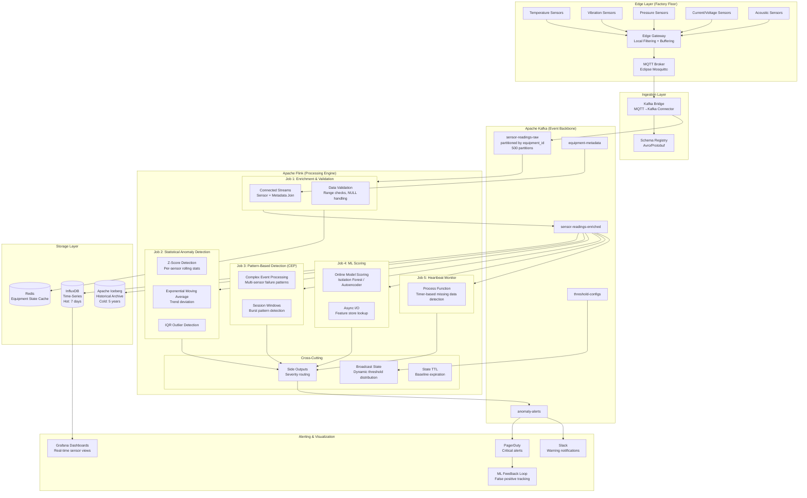
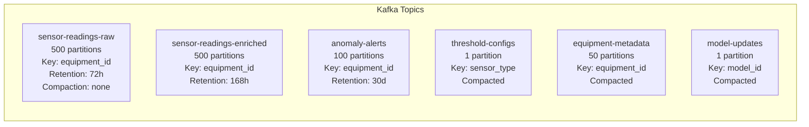
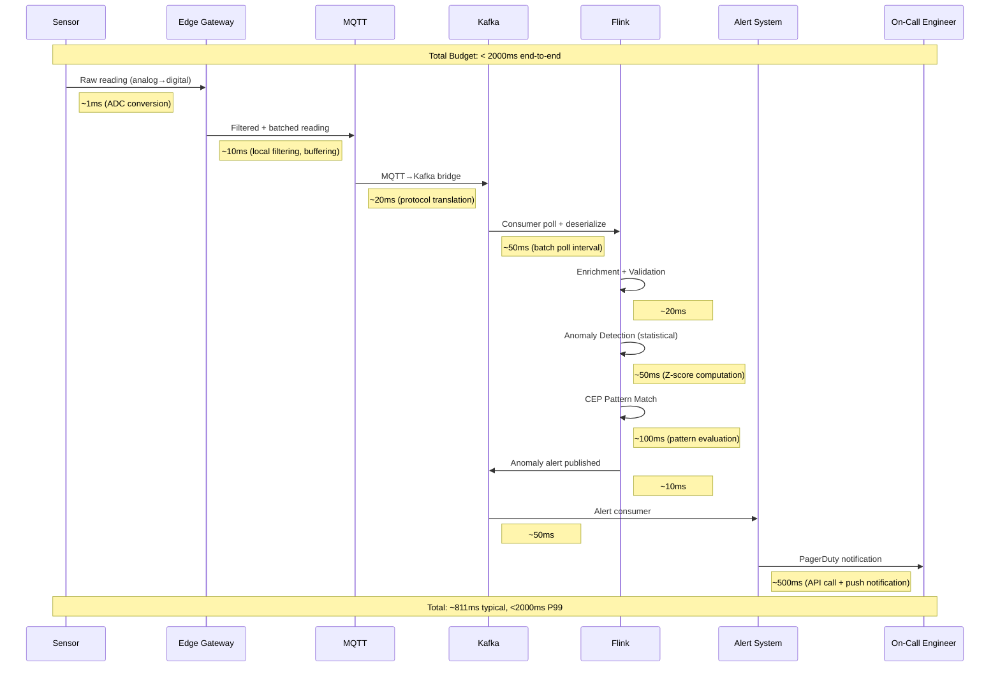
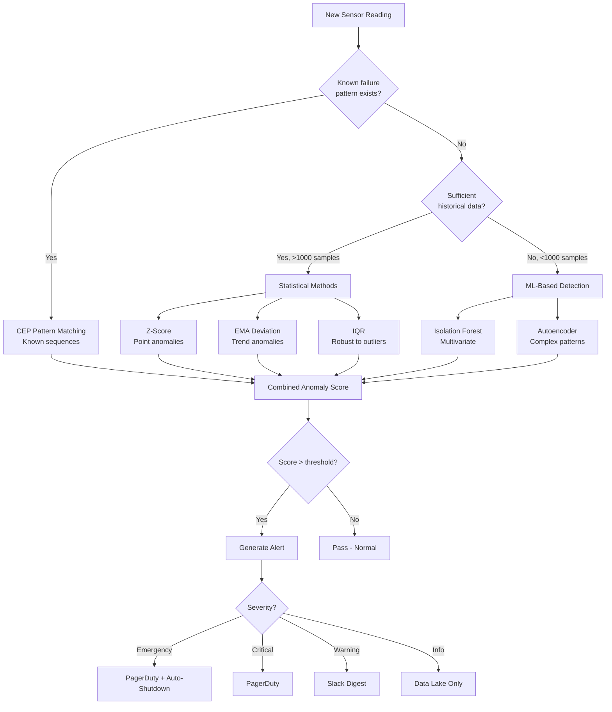
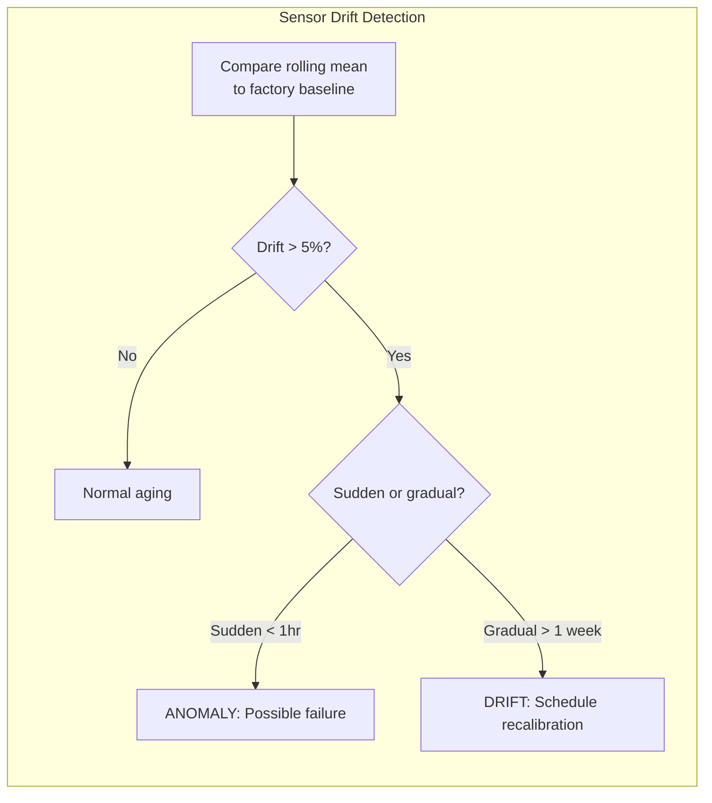
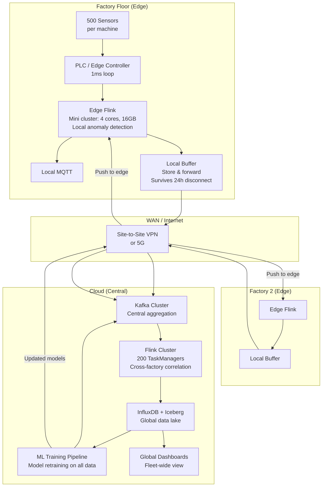
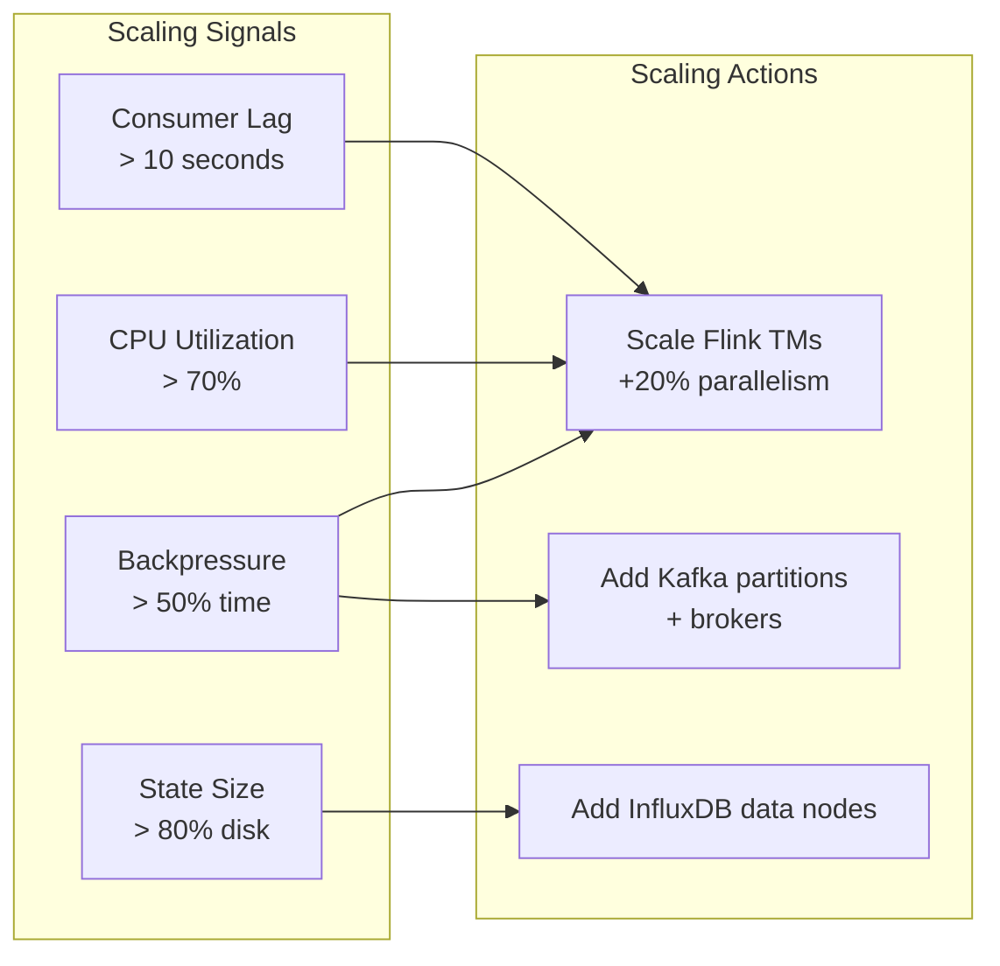

# IoT Sensor Anomaly Detection Pipeline at Scale

## Production-Grade Predictive Maintenance (Tesla/Siemens/GE Style)

---

## 1. Problem Statement

### The $50 Billion Problem

Unplanned downtime costs the manufacturing industry **$50 billion per year** globally. A single hour of downtime at a semiconductor fab costs **$5M+**, an automotive assembly line **$1.3M**, and an offshore oil platform **$2.5M**.

### Scale Requirements

| Metric | Target |
|--------|--------|
| Total sensors monitored | 5,000,000+ |
| Data points ingested/sec | 50,000,000 |
| Raw data volume/day | 100 TB |
| Anomaly detection latency | < 500ms (P99) |
| Alert-to-human latency | < 2 seconds |
| False positive rate | < 0.1% |
| Sensor types | 200+ (temperature, vibration, pressure, current, acoustic) |
| Equipment types | 50,000+ unique models |
| Geographic distribution | 400+ factories across 30 countries |

### Core Objectives

1. **Predictive Maintenance** - Detect equipment failure 24-72 hours before it happens
2. **Multi-Sensor Correlation** - Identify anomalous patterns across sensor arrays (e.g., vibration + temperature spike = bearing failure)
3. **Sub-Second Detection** - Critical anomalies (gas leak, thermal runaway) must trigger within 500ms
4. **Handle Sensor Drift** - Gradual calibration shift must not generate false positives
5. **Graceful Degradation** - Missing sensor readings due to network partitions must not flood alerts
6. **Dynamic Thresholds** - Different equipment ages, environments, and operating conditions require adaptive thresholds

### Why This Is Hard

```
Traditional threshold alerting: "Alert if temperature > 85°C"
Reality: 
  - Normal operating temp varies by machine age (new: 72°C, 5yr old: 78°C)
  - Ambient temperature affects baseline (summer vs winter)
  - Load patterns change baseline (idle vs full production)
  - Gradual drift from 72→78°C over 6 months = normal aging
  - Sudden jump from 72→78°C in 10 minutes = FAILURE IMMINENT
```

---

## 2. Architecture Diagram

### End-to-End System Architecture



### Kafka Topic Architecture



---

## 3. Data Flow

### Sensor Reading to Anomaly Alert (Latency Budget)



### Sensor Data Schema (Protobuf)

```protobuf
syntax = "proto3";

message SensorReading {
    string sensor_id = 1;           // Globally unique sensor ID
    string equipment_id = 2;        // Parent equipment
    string plant_id = 3;            // Factory/plant location
    SensorType sensor_type = 4;     // Enum: TEMPERATURE, VIBRATION, etc.
    double value = 5;               // Sensor value (units depend on type)
    int64 timestamp_ms = 6;         // Event time (sensor clock)
    int64 ingestion_ms = 7;         // Ingestion time (edge gateway)
    Quality quality = 8;            // Data quality indicator
    map<string, string> tags = 9;   // Additional metadata
}

enum SensorType {
    TEMPERATURE = 0;
    VIBRATION_X = 1;
    VIBRATION_Y = 2;
    VIBRATION_Z = 3;
    PRESSURE = 4;
    CURRENT = 5;
    VOLTAGE = 6;
    ACOUSTIC_DB = 7;
    FLOW_RATE = 8;
    HUMIDITY = 9;
}

enum Quality {
    GOOD = 0;
    UNCERTAIN = 1;      // Sensor reports degraded accuracy
    BAD = 2;            // Known bad reading (out of physical range)
    SUBSTITUTED = 3;    // Edge gateway interpolated missing value
}

message AnomalyAlert {
    string alert_id = 1;
    string equipment_id = 2;
    Severity severity = 3;
    string anomaly_type = 4;        // STATISTICAL, PATTERN, ML, HEARTBEAT
    string description = 5;
    repeated SensorReading contributing_readings = 6;
    double confidence = 7;          // 0.0 - 1.0
    int64 detected_at_ms = 8;
    string recommended_action = 9;
    int64 estimated_failure_hours = 10;  // Predicted hours until failure
}

enum Severity {
    INFO = 0;
    WARNING = 1;        // Investigate within 24h
    CRITICAL = 2;       // Investigate within 1h
    EMERGENCY = 3;      // Immediate shutdown required
}
```

---

## 4. Flink Concepts Used (Deep Dive)

### 4.1 Session Windows with Custom Gaps

**Use Case**: Detecting burst patterns in sensor readings. When a machine starts failing, sensors often produce rapid bursts of anomalous readings separated by quiet periods.

**How It Works**: Session windows group events that arrive within a configurable gap. If no event arrives within the gap duration, the window closes and fires. For IoT, this naturally groups "incidents" - a flurry of anomalous readings constitutes one incident.

**Why Custom Gaps**: Different sensor types have different natural reporting frequencies. A temperature sensor reporting every 5 seconds needs a different gap than a vibration sensor reporting at 1000Hz.

```java
// Events within 30 seconds of each other belong to same "incident"
// But gap varies by sensor type via custom gap extractor
sensorStream
    .keyBy(reading -> reading.getEquipmentId())
    .window(EventTimeSessionWindows.withDynamicGap(
        new SessionWindowGapExtractor<SensorReading>() {
            @Override
            public long extract(SensorReading reading) {
                switch (reading.getSensorType()) {
                    case VIBRATION: return 5_000L;    // 5s gap for vibration bursts
                    case TEMPERATURE: return 60_000L; // 60s gap for thermal events
                    case ACOUSTIC: return 10_000L;    // 10s gap for acoustic events
                    default: return 30_000L;
                }
            }
        }
    ))
    .aggregate(new BurstPatternAggregator())
    .filter(burst -> burst.getReadingCount() >= 5)  // At least 5 anomalous readings
    .addSink(alertSink);
```

### 4.2 CEP (Complex Event Processing)

**Use Case**: Detecting known multi-sensor failure patterns. For example, a bearing failure in a motor shows a specific sequence: vibration increase → temperature rise → current spike → failure. CEP lets you define these temporal patterns declaratively.

**How It Works**: Flink CEP provides a pattern API that matches sequences of events within time constraints. It operates on keyed streams, evaluating patterns independently per key (equipment). Internally it uses NFA (Non-deterministic Finite Automaton) for efficient pattern matching.

**Why CEP over Process Functions**: CEP is declarative and composable. Complex temporal patterns with quantifiers (one or more, optional, greedy) are expressed concisely. Pattern libraries can be updated without code changes.

```java
// Pattern: Bearing failure signature
// 1. Vibration RMS exceeds threshold
// 2. Followed by temperature rise within 5 minutes
// 3. Followed by current spike within 10 minutes
Pattern<EnrichedReading, ?> bearingFailurePattern = Pattern
    .<EnrichedReading>begin("vibration_spike")
        .where(new SimpleCondition<EnrichedReading>() {
            @Override
            public boolean filter(EnrichedReading r) {
                return r.getSensorType() == SensorType.VIBRATION
                    && r.getZScore() > 3.0;
            }
        })
        .oneOrMore()
        .greedy()
    .followedBy("temperature_rise")
        .where(new SimpleCondition<EnrichedReading>() {
            @Override
            public boolean filter(EnrichedReading r) {
                return r.getSensorType() == SensorType.TEMPERATURE
                    && r.getDeviationFromBaseline() > 0.15; // 15% above baseline
            }
        })
        .within(Time.minutes(5))
    .followedBy("current_spike")
        .where(new SimpleCondition<EnrichedReading>() {
            @Override
            public boolean filter(EnrichedReading r) {
                return r.getSensorType() == SensorType.CURRENT
                    && r.getZScore() > 2.5;
            }
        })
        .within(Time.minutes(10));
```

### 4.3 Process Function with Timers

**Use Case**: Detecting missing heartbeats. If a sensor stops reporting, it could mean (a) sensor failure, (b) network partition, or (c) equipment shutdown. The process function registers a timer for "expected next reading" and fires an alert if no reading arrives.

**How It Works**: `KeyedProcessFunction` gives access to per-key timers (both event-time and processing-time). For each incoming reading, we update state with the last-seen timestamp and register a timer for `lastSeen + expectedInterval + tolerance`. If the timer fires without being cancelled by a new reading, we emit a "missing heartbeat" alert.

**Why Timers**: They are fault-tolerant (persisted in state backend), work with event-time semantics (important for replay), and scale to millions of concurrent timers efficiently via Flink's timer service (heap or RocksDB-based priority queue).

```java
public class HeartbeatMonitor 
    extends KeyedProcessFunction<String, SensorReading, AnomalyAlert> {

    private ValueState<Long> lastSeenState;
    private ValueState<Long> timerState;
    private MapState<String, Long> expectedIntervalState; // per sensor_id

    @Override
    public void processElement(SensorReading reading, Context ctx, 
                               Collector<AnomalyAlert> out) {
        lastSeenState.update(reading.getTimestampMs());
        
        // Cancel previous timer
        Long previousTimer = timerState.value();
        if (previousTimer != null) {
            ctx.timerService().deleteEventTimeTimer(previousTimer);
        }
        
        // Register new timer: expected_interval * 3 (3 missed readings = alert)
        long expectedInterval = getExpectedInterval(reading.getSensorId());
        long nextTimer = reading.getTimestampMs() + (expectedInterval * 3);
        ctx.timerService().registerEventTimeTimer(nextTimer);
        timerState.update(nextTimer);
    }

    @Override
    public void onTimer(long timestamp, OnTimerContext ctx, 
                        Collector<AnomalyAlert> out) {
        Long lastSeen = lastSeenState.value();
        long silenceDuration = timestamp - lastSeen;
        
        out.collect(AnomalyAlert.newBuilder()
            .setEquipmentId(ctx.getCurrentKey())
            .setSeverity(silenceDuration > 300_000 ? Severity.CRITICAL : Severity.WARNING)
            .setAnomalyType("HEARTBEAT_MISSING")
            .setDescription("No readings for " + (silenceDuration/1000) + "s")
            .setDetectedAtMs(timestamp)
            .build());
    }
}
```

### 4.4 Connected Streams

**Use Case**: Enriching raw sensor readings with equipment metadata (manufacturer, model, install date, last maintenance date, operating parameters). This context is essential for accurate anomaly detection - a 5-year-old motor has different normal baselines than a new one.

**How It Works**: Two streams keyed by the same key are connected. Elements from either stream are processed by a `CoProcessFunction`. The metadata stream updates state; the sensor stream reads that state for enrichment. This avoids external lookups for every reading (50M/sec would overwhelm any database).

```java
DataStream<SensorReading> sensorStream = env
    .addSource(new FlinkKafkaConsumer<>("sensor-readings-raw", ...));

DataStream<EquipmentMetadata> metadataStream = env
    .addSource(new FlinkKafkaConsumer<>("equipment-metadata", ...));

sensorStream
    .keyBy(SensorReading::getEquipmentId)
    .connect(metadataStream.keyBy(EquipmentMetadata::getEquipmentId))
    .process(new EnrichmentFunction());
```

### 4.5 Broadcast State

**Use Case**: Distributing threshold configurations dynamically. Operations teams adjust alert thresholds, add new rules, or suppress alerts during planned maintenance - all without restarting the Flink job.

**How It Works**: A low-volume control stream (threshold updates) is broadcast to ALL parallel instances of an operator. Each instance maintains a local copy of the broadcast state (a `MapState`). The main data stream accesses this state to evaluate thresholds.

**Critical Design Decision**: Broadcast state is stored on-heap (not in RocksDB) since all parallel instances hold identical copies. Keep it small (< 100MB). For IoT, threshold configs are typically < 10MB even for millions of sensors (configs are per sensor_type + equipment_model, not per individual sensor).

```java
MapStateDescriptor<String, ThresholdConfig> thresholdDescriptor =
    new MapStateDescriptor<>("thresholds", String.class, ThresholdConfig.class);

BroadcastStream<ThresholdConfig> broadcastThresholds = thresholdStream
    .broadcast(thresholdDescriptor);

sensorStream
    .keyBy(SensorReading::getEquipmentId)
    .connect(broadcastThresholds)
    .process(new DynamicThresholdFunction());
```

### 4.6 Custom Window Assigners

**Use Case**: Equipment has scheduled maintenance windows, shift patterns, and operational modes. Anomaly detection must respect these: readings during a maintenance window should not trigger alerts, and different shifts may have different baselines (day shift runs equipment harder).

**How It Works**: A custom `WindowAssigner` assigns each element to zero or more windows based on equipment-specific schedules stored in state. Elements during maintenance are assigned to a "maintenance" window (suppressed). Elements during production are assigned to shift-specific windows.

```java
public class EquipmentScheduleWindowAssigner 
    extends WindowAssigner<SensorReading, TimeWindow> {

    @Override
    public Collection<TimeWindow> assignWindows(SensorReading reading, 
            long timestamp, WindowAssignerContext context) {
        
        OperatingSchedule schedule = getSchedule(reading.getEquipmentId());
        
        if (schedule.isMaintenanceWindow(timestamp)) {
            return Collections.emptyList(); // Drop - no window assignment
        }
        
        // Align to shift boundaries (e.g., 8h shifts starting at 06:00, 14:00, 22:00)
        long shiftStart = schedule.getShiftStart(timestamp);
        long shiftEnd = schedule.getShiftEnd(timestamp);
        
        return Collections.singleton(new TimeWindow(shiftStart, shiftEnd));
    }
}
```

### 4.7 Async I/O

**Use Case**: Looking up equipment maintenance history for context. When an anomaly is detected, we need historical context (last 5 maintenance events, known issues, part replacement history) to assess severity and recommend actions. This requires querying an external database but must not block the pipeline.

**How It Works**: `AsyncDataStream` allows non-blocking external lookups. Flink maintains ordering guarantees (ordered or unordered mode) while I/O operations complete asynchronously. Capacity is bounded to prevent overwhelming external systems.

```java
AsyncDataStream.orderedWait(
    anomalyStream,
    new AsyncEquipmentHistoryLookup(), // Implements AsyncFunction
    30, TimeUnit.SECONDS,              // Timeout per request
    100                                 // Max concurrent requests
);
```

### 4.8 Side Outputs

**Use Case**: Routing anomalies by severity level to different downstream systems. EMERGENCY alerts go to PagerDuty immediately. WARNINGS go to a batch digest. INFO events go only to the data lake for ML training.

```java
final OutputTag<AnomalyAlert> emergencyTag = new OutputTag<>("emergency"){};
final OutputTag<AnomalyAlert> warningTag = new OutputTag<>("warning"){};
final OutputTag<AnomalyAlert> infoTag = new OutputTag<>("info"){};

SingleOutputStreamOperator<AnomalyAlert> mainStream = alertStream
    .process(new ProcessFunction<AnomalyAlert, AnomalyAlert>() {
        @Override
        public void processElement(AnomalyAlert alert, Context ctx, 
                                   Collector<AnomalyAlert> out) {
            switch (alert.getSeverity()) {
                case EMERGENCY:
                    ctx.output(emergencyTag, alert);
                    break;
                case CRITICAL:
                    out.collect(alert); // Main output → PagerDuty
                    break;
                case WARNING:
                    ctx.output(warningTag, alert);
                    break;
                default:
                    ctx.output(infoTag, alert);
            }
        }
    });

mainStream.getSideOutput(emergencyTag).addSink(emergencyShutdownSink);
mainStream.addSink(pagerDutySink);
mainStream.getSideOutput(warningTag).addSink(slackDigestSink);
mainStream.getSideOutput(infoTag).addSink(icebergSink);
```

### 4.9 State TTL

**Use Case**: Sensor baselines (rolling mean, standard deviation) should expire after equipment is decommissioned or after prolonged downtime. Without TTL, state grows unboundedly as sensors are added/removed over years.

**How It Works**: State TTL configures automatic expiration of state entries. For IoT, we set TTL to the maximum expected silence period (e.g., 7 days). If a sensor doesn't report for 7 days, its baseline state is cleaned up. When it resumes, the system enters a "learning" phase to re-establish baselines.

```java
StateTtlConfig ttlConfig = StateTtlConfig.newBuilder(Time.days(7))
    .setUpdateType(StateTtlConfig.UpdateType.OnReadAndWrite)
    .setStateVisibility(StateTtlConfig.StateVisibility.NeverReturnExpired)
    .cleanupInRocksdbCompactFilter(1000) // Clean during compaction
    .build();

ValueStateDescriptor<SensorBaseline> baselineDescriptor = 
    new ValueStateDescriptor<>("sensor-baseline", SensorBaseline.class);
baselineDescriptor.enableTimeToLive(ttlConfig);
```

---

## 5. Production Code Examples (Java)

### 5.1 Statistical Anomaly Detection (Z-Score + Moving Average)

```java
/**
 * Per-sensor statistical anomaly detection using online algorithms.
 * Maintains rolling statistics without storing individual readings.
 * Uses Welford's algorithm for numerically stable variance computation.
 */
public class StatisticalAnomalyDetector 
    extends KeyedProcessFunction<String, EnrichedReading, AnomalyAlert> {

    // Per-sensor rolling statistics (Welford's online algorithm)
    private ValueState<Double> meanState;
    private ValueState<Double> m2State;  // Sum of squared deviations
    private ValueState<Long> countState;
    
    // Exponential Moving Average
    private ValueState<Double> emaState;
    private static final double EMA_ALPHA = 0.1; // Smoothing factor
    
    // IQR tracking (approximate using P2 algorithm)
    private ValueState<QuantileEstimator> quantileState;
    
    // Configuration from broadcast state
    private transient double zScoreThreshold = 3.5;
    private transient double emaDeviationThreshold = 0.2;

    @Override
    public void open(Configuration parameters) {
        StateTtlConfig ttl = StateTtlConfig.newBuilder(Time.days(7))
            .setUpdateType(StateTtlConfig.UpdateType.OnReadAndWrite)
            .build();

        ValueStateDescriptor<Double> meanDesc = 
            new ValueStateDescriptor<>("mean", Double.class);
        meanDesc.enableTimeToLive(ttl);
        meanState = getRuntimeContext().getState(meanDesc);

        ValueStateDescriptor<Double> m2Desc = 
            new ValueStateDescriptor<>("m2", Double.class);
        m2Desc.enableTimeToLive(ttl);
        m2State = getRuntimeContext().getState(m2Desc);

        ValueStateDescriptor<Long> countDesc = 
            new ValueStateDescriptor<>("count", Long.class);
        countDesc.enableTimeToLive(ttl);
        countState = getRuntimeContext().getState(countDesc);

        ValueStateDescriptor<Double> emaDesc = 
            new ValueStateDescriptor<>("ema", Double.class);
        emaDesc.enableTimeToLive(ttl);
        emaState = getRuntimeContext().getState(emaDesc);
    }

    @Override
    public void processElement(EnrichedReading reading, Context ctx,
                               Collector<AnomalyAlert> out) throws Exception {
        double value = reading.getValue();
        
        // --- Welford's Online Algorithm for Mean/Variance ---
        Long count = countState.value();
        if (count == null) count = 0L;
        count++;
        
        Double oldMean = meanState.value();
        if (oldMean == null) oldMean = 0.0;
        
        Double oldM2 = m2State.value();
        if (oldM2 == null) oldM2 = 0.0;
        
        double delta = value - oldMean;
        double newMean = oldMean + delta / count;
        double delta2 = value - newMean;
        double newM2 = oldM2 + delta * delta2;
        
        meanState.update(newMean);
        m2State.update(newM2);
        countState.update(count);
        
        // Need minimum samples before alerting (learning phase)
        if (count < 100) {
            return;
        }
        
        // --- Z-Score Computation ---
        double variance = newM2 / (count - 1);
        double stdDev = Math.sqrt(variance);
        double zScore = stdDev > 0 ? Math.abs(value - newMean) / stdDev : 0;
        
        // --- Exponential Moving Average Deviation ---
        Double ema = emaState.value();
        if (ema == null) ema = value;
        double newEma = EMA_ALPHA * value + (1 - EMA_ALPHA) * ema;
        emaState.update(newEma);
        double emaDeviation = Math.abs(value - newEma) / Math.abs(newEma);
        
        // --- Anomaly Scoring ---
        boolean isZScoreAnomaly = zScore > zScoreThreshold;
        boolean isEmaAnomaly = emaDeviation > emaDeviationThreshold;
        
        // Combined score: both methods must agree to reduce false positives
        if (isZScoreAnomaly && isEmaAnomaly) {
            Severity severity = zScore > 5.0 ? Severity.CRITICAL : Severity.WARNING;
            
            out.collect(AnomalyAlert.newBuilder()
                .setAlertId(UUID.randomUUID().toString())
                .setEquipmentId(reading.getEquipmentId())
                .setSeverity(severity)
                .setAnomalyType("STATISTICAL")
                .setDescription(String.format(
                    "Sensor %s: value=%.2f, z-score=%.2f (threshold=%.2f), " +
                    "EMA deviation=%.1f%% (threshold=%.1f%%)",
                    reading.getSensorId(), value, zScore, zScoreThreshold,
                    emaDeviation * 100, emaDeviationThreshold * 100))
                .setConfidence(Math.min(zScore / 5.0, 1.0))
                .setDetectedAtMs(ctx.timerService().currentProcessingTime())
                .build());
        }
        
        // --- Drift Detection (separate, slower alert) ---
        // If mean has shifted significantly from initial baseline
        if (count > 10000 && count % 1000 == 0) {
            detectDrift(reading, newMean, stdDev, ctx, out);
        }
    }
    
    private void detectDrift(EnrichedReading reading, double currentMean,
                            double stdDev, Context ctx, 
                            Collector<AnomalyAlert> out) {
        // Compare current rolling mean to equipment's factory baseline
        Double factoryBaseline = reading.getMetadata().getFactoryBaseline();
        if (factoryBaseline == null) return;
        
        double driftPercent = Math.abs(currentMean - factoryBaseline) / factoryBaseline;
        if (driftPercent > 0.20) { // 20% drift from factory spec
            out.collect(AnomalyAlert.newBuilder()
                .setEquipmentId(reading.getEquipmentId())
                .setSeverity(Severity.WARNING)
                .setAnomalyType("SENSOR_DRIFT")
                .setDescription(String.format(
                    "Sensor %s drifted %.1f%% from factory baseline (%.2f → %.2f)",
                    reading.getSensorId(), driftPercent * 100, 
                    factoryBaseline, currentMean))
                .setRecommendedAction("Schedule sensor recalibration")
                .build());
        }
    }
}
```

### 5.2 CEP Pattern for Multi-Sensor Correlated Failure

```java
/**
 * Detects the classic bearing failure progression:
 * Vibration spike → Temperature rise → Current increase → Imminent failure
 * 
 * Based on ISO 10816 vibration severity standards and 
 * empirical failure data from 50,000+ motor failures.
 */
public class BearingFailureCEPJob {

    public static void main(String[] args) throws Exception {
        StreamExecutionEnvironment env = StreamExecutionEnvironment.getExecutionEnvironment();
        
        // Configure for exactly-once with RocksDB state
        env.enableCheckpointing(60_000, CheckpointingMode.EXACTLY_ONCE);
        env.setStateBackend(new EmbeddedRocksDBStateBackend(true));
        
        DataStream<EnrichedReading> readings = env
            .addSource(new FlinkKafkaConsumer<>(
                "sensor-readings-enriched",
                new EnrichedReadingDeserializer(),
                kafkaProps))
            .assignTimestampsAndWatermarks(
                WatermarkStrategy.<EnrichedReading>forBoundedOutOfOrderness(
                    Duration.ofSeconds(30))
                .withTimestampAssigner((r, t) -> r.getTimestampMs())
                .withIdleness(Duration.ofMinutes(1)));

        // Key by equipment - pattern evaluated per machine
        KeyedStream<EnrichedReading, String> keyedReadings = readings
            .keyBy(EnrichedReading::getEquipmentId);

        // Define the multi-stage failure pattern
        Pattern<EnrichedReading, ?> bearingFailurePattern = Pattern
            .<EnrichedReading>begin("vibration_anomaly")
                .where(new IterativeCondition<EnrichedReading>() {
                    @Override
                    public boolean filter(EnrichedReading r, 
                                         IterativeCondition.Context<EnrichedReading> ctx) {
                        return r.getSensorType() == SensorType.VIBRATION_X
                            || r.getSensorType() == SensorType.VIBRATION_Y
                            || r.getSensorType() == SensorType.VIBRATION_Z;
                    }
                })
                .where(new SimpleCondition<EnrichedReading>() {
                    @Override
                    public boolean filter(EnrichedReading r) {
                        // ISO 10816: >7.1 mm/s RMS = "Dangerous" for Class III machines
                        return r.getValue() > 7.1 || r.getZScore() > 3.0;
                    }
                })
                .timesOrMore(3)  // At least 3 anomalous vibration readings
                .greedy()
            .followedBy("temperature_rise")
                .where(new SimpleCondition<EnrichedReading>() {
                    @Override
                    public boolean filter(EnrichedReading r) {
                        return r.getSensorType() == SensorType.TEMPERATURE
                            && r.getDeviationFromBaseline() > 0.10; // 10%+ above baseline
                    }
                })
                .timesOrMore(2)
                .within(Time.minutes(10))  // Temp rise within 10min of vibration
            .followedBy("current_anomaly")
                .where(new SimpleCondition<EnrichedReading>() {
                    @Override
                    public boolean filter(EnrichedReading r) {
                        return r.getSensorType() == SensorType.CURRENT
                            && r.getZScore() > 2.0;
                    }
                })
                .within(Time.minutes(30)); // Full pattern within 30 minutes

        // Apply pattern and generate alerts
        PatternStream<EnrichedReading> patternStream = CEP.pattern(
            keyedReadings, bearingFailurePattern);

        DataStream<AnomalyAlert> alerts = patternStream.select(
            new PatternSelectFunction<EnrichedReading, AnomalyAlert>() {
                @Override
                public AnomalyAlert select(Map<String, List<EnrichedReading>> pattern) {
                    List<EnrichedReading> vibrations = pattern.get("vibration_anomaly");
                    List<EnrichedReading> temps = pattern.get("temperature_rise");
                    List<EnrichedReading> currents = pattern.get("current_anomaly");
                    
                    // Calculate confidence based on pattern strength
                    double maxVibZScore = vibrations.stream()
                        .mapToDouble(EnrichedReading::getZScore).max().orElse(0);
                    double confidence = Math.min(
                        (maxVibZScore / 5.0) * 0.5 + 
                        (temps.size() / 5.0) * 0.3 + 
                        (currents.size() / 3.0) * 0.2, 1.0);

                    // Estimate time to failure based on progression rate
                    long vibrationStart = vibrations.get(0).getTimestampMs();
                    long currentTime = currents.get(currents.size()-1).getTimestampMs();
                    long progressionMs = currentTime - vibrationStart;
                    // Empirical: failure typically occurs 2-4x the progression time
                    long estimatedHoursToFailure = 
                        (progressionMs * 3) / (1000 * 3600);

                    return AnomalyAlert.newBuilder()
                        .setAlertId(UUID.randomUUID().toString())
                        .setEquipmentId(vibrations.get(0).getEquipmentId())
                        .setSeverity(Severity.CRITICAL)
                        .setAnomalyType("PATTERN_BEARING_FAILURE")
                        .setDescription(String.format(
                            "Bearing failure pattern detected: " +
                            "%d vibration spikes (max z=%.1f) → " +
                            "%d temperature rises → %d current anomalies " +
                            "over %d minutes",
                            vibrations.size(), maxVibZScore,
                            temps.size(), currents.size(),
                            progressionMs / 60000))
                        .setConfidence(confidence)
                        .setEstimatedFailureHours(estimatedHoursToFailure)
                        .setRecommendedAction(
                            "Schedule bearing replacement within " + 
                            estimatedHoursToFailure + " hours. " +
                            "Reduce load immediately to extend remaining life.")
                        .setDetectedAtMs(System.currentTimeMillis())
                        .build();
                }
            });

        alerts.addSink(new FlinkKafkaProducer<>("anomaly-alerts", ...));
        
        env.execute("Bearing Failure CEP Detection");
    }
}
```

### 5.3 Process Function with Timer-Based Heartbeat Monitoring

```java
/**
 * Monitors sensor liveness across 5M+ sensors.
 * Each sensor has an expected reporting interval.
 * Missing N consecutive readings triggers escalating alerts.
 * 
 * Memory efficiency: ~200 bytes per sensor in RocksDB state
 * Total state: 5M sensors * 200B = ~1GB
 */
public class SensorHeartbeatMonitor 
    extends KeyedProcessFunction<String, SensorReading, AnomalyAlert> {

    // State: last seen timestamp per sensor within this equipment
    private MapState<String, Long> lastSeenPerSensor;
    
    // State: expected interval per sensor (learned or configured)
    private MapState<String, Long> expectedIntervals;
    
    // State: consecutive misses (for escalation)
    private MapState<String, Integer> consecutiveMisses;
    
    // State: active timer timestamps (for cleanup)
    private MapState<String, Long> activeTimers;
    
    // Metrics
    private transient Counter missedHeartbeats;
    private transient Counter falseAlarms;

    @Override
    public void open(Configuration parameters) {
        StateTtlConfig ttl = StateTtlConfig.newBuilder(Time.days(7))
            .setUpdateType(StateTtlConfig.UpdateType.OnReadAndWrite)
            .cleanupFullSnapshot()
            .build();

        MapStateDescriptor<String, Long> lastSeenDesc = 
            new MapStateDescriptor<>("lastSeen", String.class, Long.class);
        lastSeenDesc.enableTimeToLive(ttl);
        lastSeenPerSensor = getRuntimeContext().getMapState(lastSeenDesc);
        
        MapStateDescriptor<String, Long> intervalDesc = 
            new MapStateDescriptor<>("intervals", String.class, Long.class);
        expectedIntervals = getRuntimeContext().getMapState(intervalDesc);
        
        MapStateDescriptor<String, Integer> missDesc = 
            new MapStateDescriptor<>("misses", String.class, Integer.class);
        missDesc.enableTimeToLive(ttl);
        consecutiveMisses = getRuntimeContext().getMapState(missDesc);
        
        MapStateDescriptor<String, Long> timerDesc = 
            new MapStateDescriptor<>("timers", String.class, Long.class);
        activeTimers = getRuntimeContext().getMapState(timerDesc);

        missedHeartbeats = getRuntimeContext().getMetricGroup()
            .counter("missed_heartbeats");
    }

    @Override
    public void processElement(SensorReading reading, Context ctx,
                               Collector<AnomalyAlert> out) throws Exception {
        String sensorId = reading.getSensorId();
        long timestamp = reading.getTimestampMs();
        
        // Update last seen
        lastSeenPerSensor.put(sensorId, timestamp);
        
        // Reset consecutive misses (sensor is alive)
        Integer misses = consecutiveMisses.get(sensorId);
        if (misses != null && misses > 0) {
            consecutiveMisses.put(sensorId, 0);
            // Sensor recovered - could emit recovery event
        }
        
        // Learn or use configured interval
        Long expectedInterval = expectedIntervals.get(sensorId);
        if (expectedInterval == null) {
            // Default intervals by sensor type
            expectedInterval = getDefaultInterval(reading.getSensorType());
            expectedIntervals.put(sensorId, expectedInterval);
        }
        
        // Cancel previous timer for this sensor
        Long previousTimer = activeTimers.get(sensorId);
        if (previousTimer != null) {
            ctx.timerService().deleteEventTimeTimer(previousTimer);
        }
        
        // Register new timer: 3x expected interval (tolerance for jitter)
        long nextExpected = timestamp + (expectedInterval * 3);
        ctx.timerService().registerEventTimeTimer(nextExpected);
        activeTimers.put(sensorId, nextExpected);
    }

    @Override
    public void onTimer(long timestamp, OnTimerContext ctx,
                        Collector<AnomalyAlert> out) throws Exception {
        // Find which sensor(s) triggered this timer
        for (Map.Entry<String, Long> entry : activeTimers.entries()) {
            if (entry.getValue() == timestamp) {
                String sensorId = entry.getKey();
                handleMissedHeartbeat(sensorId, timestamp, ctx, out);
            }
        }
    }

    private void handleMissedHeartbeat(String sensorId, long timestamp,
                                       OnTimerContext ctx,
                                       Collector<AnomalyAlert> out) throws Exception {
        missedHeartbeats.inc();
        
        Integer misses = consecutiveMisses.get(sensorId);
        if (misses == null) misses = 0;
        misses++;
        consecutiveMisses.put(sensorId, misses);
        
        Long lastSeen = lastSeenPerSensor.get(sensorId);
        long silenceMs = timestamp - (lastSeen != null ? lastSeen : 0);
        
        // Escalating severity
        Severity severity;
        if (misses >= 10) {
            severity = Severity.CRITICAL; // 10+ missed = likely hardware failure
        } else if (misses >= 5) {
            severity = Severity.WARNING;  // 5+ missed = investigate
        } else {
            severity = Severity.INFO;     // 1-4 missed = log only
            // Don't alert for INFO, just re-register timer
            Long interval = expectedIntervals.get(sensorId);
            if (interval != null) {
                long nextTimer = timestamp + interval;
                ctx.timerService().registerEventTimeTimer(nextTimer);
                activeTimers.put(sensorId, nextTimer);
            }
            return;
        }
        
        out.collect(AnomalyAlert.newBuilder()
            .setAlertId(UUID.randomUUID().toString())
            .setEquipmentId(ctx.getCurrentKey())
            .setSeverity(severity)
            .setAnomalyType("HEARTBEAT_MISSING")
            .setDescription(String.format(
                "Sensor %s: %d consecutive missed readings, silent for %ds",
                sensorId, misses, silenceMs / 1000))
            .setConfidence(Math.min(misses / 10.0, 1.0))
            .setDetectedAtMs(timestamp)
            .setRecommendedAction(misses >= 10 
                ? "Dispatch technician - likely sensor/network hardware failure"
                : "Monitor - possible transient network issue")
            .build());
        
        // Re-register timer for continued monitoring
        Long interval = expectedIntervals.get(sensorId);
        if (interval != null) {
            long nextTimer = timestamp + interval;
            ctx.timerService().registerEventTimeTimer(nextTimer);
            activeTimers.put(sensorId, nextTimer);
        }
    }
    
    private long getDefaultInterval(SensorType type) {
        switch (type) {
            case VIBRATION_X:
            case VIBRATION_Y:
            case VIBRATION_Z: return 1000L;     // 1 second
            case TEMPERATURE:  return 5000L;    // 5 seconds
            case PRESSURE:     return 2000L;    // 2 seconds
            case CURRENT:      return 1000L;    // 1 second
            case ACOUSTIC_DB:  return 500L;     // 500ms
            default:           return 10000L;   // 10 seconds
        }
    }
}
```

### 5.4 Dynamic Threshold Adjustment via Broadcast State

```java
/**
 * Receives threshold configuration updates via broadcast and applies them
 * dynamically to the sensor evaluation pipeline.
 * 
 * Use cases:
 * - Ops team adjusts sensitivity during known maintenance
 * - ML pipeline pushes updated thresholds based on model retraining
 * - Seasonal adjustments (summer vs winter baselines)
 * - Equipment aging adjustments
 */
public class DynamicThresholdFunction 
    extends KeyedBroadcastProcessFunction<String, EnrichedReading, 
                                          ThresholdConfig, AnomalyAlert> {

    private final MapStateDescriptor<String, ThresholdConfig> thresholdDescriptor;
    
    // Per-equipment override state (e.g., suppress during maintenance)
    private ValueState<Boolean> suppressedState;
    private ValueState<Long> suppressUntilState;

    public DynamicThresholdFunction(
            MapStateDescriptor<String, ThresholdConfig> thresholdDescriptor) {
        this.thresholdDescriptor = thresholdDescriptor;
    }

    @Override
    public void open(Configuration parameters) {
        suppressedState = getRuntimeContext().getState(
            new ValueStateDescriptor<>("suppressed", Boolean.class));
        suppressUntilState = getRuntimeContext().getState(
            new ValueStateDescriptor<>("suppressUntil", Long.class));
    }

    @Override
    public void processElement(EnrichedReading reading, ReadOnlyContext ctx,
                               Collector<AnomalyAlert> out) throws Exception {
        // Check suppression
        Boolean suppressed = suppressedState.value();
        if (Boolean.TRUE.equals(suppressed)) {
            Long suppressUntil = suppressUntilState.value();
            if (suppressUntil != null && 
                reading.getTimestampMs() < suppressUntil) {
                return; // Still suppressed
            }
            suppressedState.update(false); // Suppression expired
        }
        
        // Look up threshold for this sensor type + equipment model combination
        String configKey = reading.getSensorType() + ":" + 
                          reading.getMetadata().getEquipmentModel();
        
        ReadOnlyBroadcastState<String, ThresholdConfig> broadcastState = 
            ctx.getBroadcastState(thresholdDescriptor);
        
        ThresholdConfig config = broadcastState.get(configKey);
        if (config == null) {
            // Fall back to sensor-type-only config
            config = broadcastState.get(reading.getSensorType().name());
        }
        if (config == null) {
            // Use hardcoded defaults
            config = ThresholdConfig.getDefault(reading.getSensorType());
        }
        
        // Apply configured thresholds
        double value = reading.getValue();
        double zScore = reading.getZScore();
        
        if (value > config.getAbsoluteMax()) {
            out.collect(buildAlert(reading, Severity.EMERGENCY,
                "Value exceeds absolute maximum: " + value + " > " + 
                config.getAbsoluteMax()));
        } else if (zScore > config.getZScoreThreshold()) {
            out.collect(buildAlert(reading, 
                zScore > config.getCriticalZScore() ? Severity.CRITICAL : Severity.WARNING,
                "Z-score anomaly: " + zScore));
        } else if (value < config.getAbsoluteMin()) {
            out.collect(buildAlert(reading, Severity.WARNING,
                "Value below minimum: " + value + " < " + config.getAbsoluteMin()));
        }
    }

    @Override
    public void processBroadcastElement(ThresholdConfig config, Context ctx,
                                        Collector<AnomalyAlert> out) throws Exception {
        // Update broadcast state with new threshold config
        BroadcastState<String, ThresholdConfig> state = 
            ctx.getBroadcastState(thresholdDescriptor);
        
        state.put(config.getConfigKey(), config);
        
        // Log for audit trail
        LOG.info("Threshold updated: key={}, zScore={}, absoluteMax={}, reason={}",
            config.getConfigKey(), config.getZScoreThreshold(),
            config.getAbsoluteMax(), config.getUpdateReason());
    }
    
    private AnomalyAlert buildAlert(EnrichedReading reading, 
                                    Severity severity, String desc) {
        return AnomalyAlert.newBuilder()
            .setAlertId(UUID.randomUUID().toString())
            .setEquipmentId(reading.getEquipmentId())
            .setSeverity(severity)
            .setAnomalyType("THRESHOLD_BREACH")
            .setDescription(desc)
            .setDetectedAtMs(System.currentTimeMillis())
            .build();
    }
}
```

### 5.5 InfluxDB Time-Series Sink

```java
/**
 * High-throughput InfluxDB sink optimized for IoT workloads.
 * - Batches writes (5000 points or 1 second, whichever first)
 * - Back-pressure aware (drops oldest on overflow)
 * - Retry with exponential backoff
 * - Partitions writes across multiple InfluxDB nodes
 */
public class InfluxDBSensorSink extends RichSinkFunction<EnrichedReading> 
    implements CheckpointedFunction {

    private transient InfluxDBClient client;
    private transient WriteApi writeApi;
    private transient List<Point> buffer;
    
    private static final int BATCH_SIZE = 5000;
    private static final int FLUSH_INTERVAL_MS = 1000;
    private static final int MAX_BUFFER_SIZE = 100_000;
    
    // Metrics
    private transient Counter writtenPoints;
    private transient Counter droppedPoints;
    private transient Histogram writeLatency;

    @Override
    public void open(Configuration parameters) {
        client = InfluxDBClientFactory.create(
            InfluxDBClientOptions.builder()
                .url(getInfluxUrl())
                .authenticateToken(getInfluxToken().toCharArray())
                .org("manufacturing")
                .bucket("sensor_data")
                .build());

        WriteOptions writeOptions = WriteOptions.builder()
            .batchSize(BATCH_SIZE)
            .flushInterval(FLUSH_INTERVAL_MS)
            .bufferLimit(MAX_BUFFER_SIZE)
            .jitterInterval(200)  // Random jitter to avoid thundering herd
            .retryInterval(1000)
            .maxRetries(3)
            .maxRetryDelay(30_000)
            .exponentialBase(2)
            .build();

        writeApi = client.makeWriteApi(writeOptions);
        buffer = new ArrayList<>(BATCH_SIZE);
        
        writtenPoints = getRuntimeContext().getMetricGroup()
            .counter("influx_written_points");
        droppedPoints = getRuntimeContext().getMetricGroup()
            .counter("influx_dropped_points");
    }

    @Override
    public void invoke(EnrichedReading reading, SinkFunction.Context context) {
        Point point = Point.measurement("sensor_reading")
            .addTag("equipment_id", reading.getEquipmentId())
            .addTag("sensor_id", reading.getSensorId())
            .addTag("sensor_type", reading.getSensorType().name())
            .addTag("plant_id", reading.getPlantId())
            .addTag("equipment_model", reading.getMetadata().getEquipmentModel())
            .addField("value", reading.getValue())
            .addField("z_score", reading.getZScore())
            .addField("ema", reading.getEma())
            .addField("quality", reading.getQuality().name())
            .time(reading.getTimestampMs(), WritePrecision.MS);
        
        writeApi.writePoint(point);
        writtenPoints.inc();
    }

    @Override
    public void close() {
        if (writeApi != null) writeApi.close();
        if (client != null) client.close();
    }

    @Override
    public void snapshotState(FunctionSnapshotContext context) throws Exception {
        // Flush pending writes on checkpoint
        if (writeApi != null) {
            writeApi.flush();
        }
    }

    @Override
    public void initializeState(FunctionInitializationContext context) {
        // No state to restore - InfluxDB writes are idempotent by timestamp
    }
}
```

---

## 6. Anomaly Detection Algorithms in Flink

### Algorithm Decision Tree



### Algorithm Comparison

| Algorithm | Latency | Memory/Sensor | Accuracy | Best For | Weakness |
|-----------|---------|---------------|----------|----------|----------|
| **Z-Score** | <1ms | 24 bytes (mean, m2, count) | Good for Gaussian | Point anomalies, single sensor | Assumes normal distribution; sensitive to drift |
| **EMA** | <1ms | 8 bytes | Good for trends | Gradual changes, trend detection | Slow to react to sudden spikes (tuning alpha) |
| **IQR** | ~5ms | ~200 bytes (quantile sketch) | Robust | Non-Gaussian data, outlier-heavy | Requires more memory for sketch |
| **CEP Patterns** | 10-100ms | ~1KB per active pattern | Excellent (for known patterns) | Known failure sequences | Only catches known patterns; maintenance burden |
| **Isolation Forest** | 5-20ms | ~50KB (model) | Very good multivariate | Multi-sensor correlation | Requires offline training; model staleness |
| **Autoencoder** | 10-50ms | ~500KB (model) | Excellent complex patterns | Non-linear relationships | High compute; needs GPU for training |

### Statistical: Z-Score

**When**: Single-sensor point anomaly detection. Simple, fast, low memory.

**Formula**: `z = (x - μ) / σ` where μ and σ are computed via Welford's online algorithm.

**Threshold**: Typically 3.0 (99.7% of normal data) to 4.0 (99.99%).

**Limitation**: Assumes stationary Gaussian distribution. Real sensor data often isn't - it has seasonal patterns, load-dependent baselines, and fat tails.

### Statistical: IQR (Interquartile Range)

**When**: Robust detection when data is non-Gaussian or has existing outliers.

**Formula**: Outlier if `x < Q1 - 1.5*IQR` or `x > Q3 + 1.5*IQR` where `IQR = Q3 - Q1`.

**Implementation**: Use P2 algorithm or t-digest for streaming quantile estimation without storing all values.

### Statistical: Exponential Moving Average (EMA)

**When**: Detecting trend deviations. A sudden departure from the smoothed trend indicates anomaly.

**Formula**: `EMA_t = α * x_t + (1 - α) * EMA_{t-1}`

**α selection**: 
- High α (0.3): Reacts quickly, more false positives
- Low α (0.01): Smooth, catches only major shifts, slow to react

### Pattern-Based: CEP

**When**: Known failure modes exist from historical data / domain experts.

**Examples of patterns**:
- Bearing failure: vibration → heat → current (see code above)
- Pump cavitation: pressure fluctuation + flow drop + acoustic change
- Electrical fault: voltage sag → current spike → breaker trip
- Thermal runaway (batteries): temperature acceleration (dT/dt increasing)

### ML-Based: Isolation Forest (Online Scoring)

**How it works in Flink**: Model trained offline on historical normal data. Loaded into Flink operator state. Each reading scored in real-time. Model refreshed periodically via broadcast state or scheduled reload.

```java
public class IsolationForestScorer extends RichMapFunction<EnrichedReading, ScoredReading> {
    private transient IsolationForest model;
    
    @Override
    public void open(Configuration parameters) {
        // Load pre-trained model from S3/HDFS
        model = ModelLoader.loadIsolationForest(getModelPath());
    }
    
    @Override
    public ScoredReading map(EnrichedReading reading) {
        double[] features = extractFeatures(reading); // value, rate-of-change, hour-of-day, etc.
        double anomalyScore = model.score(features);  // 0.0 (normal) to 1.0 (anomalous)
        return new ScoredReading(reading, anomalyScore);
    }
}
```

### ML-Based: Autoencoder (Reconstruction Error)

**Concept**: Train autoencoder on normal sensor data. At inference, high reconstruction error = anomaly (the model can't compress/reconstruct patterns it hasn't seen).

**In Flink**: Use ONNX Runtime or TensorFlow Serving via Async I/O for inference. Windowed features (last N readings) fed as input vector.

---

## 7. Sensor Data Challenges

### 7.1 Out-of-Order Delivery

**Problem**: Network partitions, edge gateway buffering, and multi-path routing cause readings to arrive out of order. A reading from 5 minutes ago may arrive after a reading from 1 minute ago.

**Solution**: Event-time processing with bounded-out-of-orderness watermarks.

```java
WatermarkStrategy.<SensorReading>forBoundedOutOfOrderness(Duration.ofSeconds(30))
    .withTimestampAssigner((reading, ts) -> reading.getTimestampMs())
    .withIdleness(Duration.ofMinutes(5)) // Don't hold watermark for dead sensors
```

**Trade-off**: Higher watermark delay = more complete results but higher latency. For IoT: 30 seconds is typical (covers most network jitter without excessive delay).

**Late data handling**: Side output late data to a "reconciliation" topic for batch re-processing.

### 7.2 Missing Data Points

**Problem**: Sensors fail, batteries die, network drops packets. Missing data must not trigger false anomalies, but prolonged absence IS an anomaly.

**Solutions**:
1. **Heartbeat monitor** (Process Function with timers) - alerts on sustained absence
2. **Interpolation at edge** - edge gateway fills short gaps with linear interpolation (marked as `SUBSTITUTED` quality)
3. **Allowable gap state** - anomaly detectors track "last valid reading" timestamp and enter "uncertain" mode during gaps

### 7.3 Sensor Drift

**Problem**: Sensors gradually lose calibration over months. A temperature sensor reading 2°C higher than reality looks like normal operation if drift is gradual.



**Detection**: Compare long-term rolling average (30-day EMA) against factory-calibrated baseline. If deviation exceeds threshold AND rate of change is slow (< 0.1%/day), classify as drift rather than anomaly.

### 7.4 High Cardinality

**Problem**: 5M unique sensor IDs means 5M independent state entries per stateful operator. Key distribution, state size, and checkpoint time become critical.

**Solutions**:
- **RocksDB state backend**: Handles state larger than memory (spills to SSD)
- **Incremental checkpoints**: Only checkpoint changed state entries
- **Key group distribution**: Ensure equipment_id hashing distributes evenly across task managers
- **State TTL**: Automatically clean up decommissioned sensors
- **Two-level keying**: Key by `plant_id` for coarse operations, `equipment_id` for fine-grained

---

## 8. Edge-Cloud Architecture

### Edge-Cloud Topology



### Edge vs Cloud Processing

| Aspect | Edge Flink | Cloud Flink |
|--------|-----------|-------------|
| **Latency** | <10ms (local) | 100-500ms (network) |
| **Scope** | Single machine/cell | Cross-factory fleet |
| **Availability** | Operates during network outage | Requires connectivity |
| **Compute** | Limited (4-16 cores) | Unlimited (scale out) |
| **State** | Small (single machine context) | Massive (global fleet state) |
| **Detection** | Simple thresholds, single-machine patterns | ML models, fleet-wide correlation |
| **Use case** | Emergency shutdown, local alerting | Predictive maintenance, fleet analytics |

### What Runs Where

**Edge (< 10ms latency required)**:
- Absolute safety thresholds (temperature > 150°C = SHUTDOWN)
- Single-sensor Z-score detection
- Local heartbeat monitoring
- Data quality filtering and validation
- Local buffering for network resilience

**Cloud (< 500ms latency acceptable)**:
- Multi-sensor CEP pattern detection
- ML model scoring (Isolation Forest, Autoencoder)
- Cross-equipment correlation (are multiple machines failing simultaneously?)
- Fleet-wide anomaly (is this machine degrading faster than its cohort?)
- Long-term trend analysis and drift detection
- Model retraining on global data

---

## 9. Scaling

### Sizing for 5M Sensors at 50M Readings/Second

#### Kafka Cluster

| Parameter | Value | Rationale |
|-----------|-------|-----------|
| Brokers | 30 | ~1.7M msgs/sec/broker |
| Partitions (raw topic) | 500 | ~100K msgs/sec/partition |
| Replication factor | 3 | Durability |
| Retention (raw) | 72 hours | Replay window |
| Disk per broker | 20TB NVMe | 100TB/day / 30 brokers * 3 days * 3 replicas |
| Network per broker | 25 Gbps | Peak throughput with replication |
| Total cluster storage | 600 TB | With replication |

#### Flink Cluster

| Parameter | Value | Rationale |
|-----------|-------|-----------|
| JobManagers | 3 (HA) | Leader election via ZooKeeper |
| TaskManagers | 200 | 50M records/sec / 250K records/sec/TM |
| Cores per TM | 16 | 8 task slots * 2 cores/slot |
| Memory per TM | 64 GB | RocksDB + JVM overhead |
| Total parallelism | 1600 | 200 TMs * 8 slots |
| State backend | RocksDB (incremental) | 5M keys * ~1KB avg = ~5GB state per operator |
| Checkpoint interval | 60 seconds | Balance: recovery time vs overhead |
| Checkpoint storage | S3 (cross-region) | Disaster recovery |
| Total state size | ~500 GB | Across all operators |
| Checkpoint duration | < 30 seconds | Incremental; only changed keys |

#### State Backend Sizing

```
Per-sensor state in statistical detector:
  - mean (8 bytes) + m2 (8 bytes) + count (8 bytes) = 24 bytes
  - EMA (8 bytes)
  - RocksDB overhead per key (~100 bytes)
  Total: ~140 bytes per sensor

5M sensors * 140 bytes = 700 MB (for ONE stateful operator)

With multiple operators (stats, heartbeat, CEP):
  ~5 operators * 700MB = 3.5 GB active state
  
RocksDB block cache: 8 GB per TM (for hot keys)
Total state across cluster: ~500 GB (including CEP partial matches)
```

#### InfluxDB Cluster

| Parameter | Value |
|-----------|-------|
| Nodes | 12 (3 meta + 9 data) |
| Series cardinality | ~50M (sensors * tag combinations) |
| Write throughput | 10M points/sec (after edge pre-aggregation) |
| Retention policy: hot | 7 days (SSD) |
| Retention policy: warm | 90 days (HDD) |
| Retention policy: cold | 5 years → Iceberg |

#### Network Bandwidth

```
Raw data rate: 50M readings/sec * 200 bytes avg = 10 GB/sec
With Kafka replication (3x): 30 GB/sec internal
Flink input: 10 GB/sec
Flink output (enriched): 12 GB/sec (added metadata)
InfluxDB writes: 2 GB/sec (pre-aggregated at 5:1 ratio)
Cross-DC replication: 10 GB/sec

Total network: ~100 Gbps aggregate cluster bandwidth
```

### Auto-Scaling Strategy



---

## 10. Real Companies

### Tesla - Battery Thermal Monitoring

**Scale**: 4M+ vehicles, each with 7000+ battery cells, 200+ sensors per vehicle.

**Challenge**: Detect thermal runaway before it cascades. A single cell overheating can propagate to adjacent cells in seconds.

**Architecture**:
- Edge: Vehicle's MCU runs local anomaly detection (firmware-level)
- Cloud: Fleet-wide analysis of battery degradation curves
- Key pattern: `dT/dt > threshold AND cell_voltage_delta > threshold` = pre-runaway
- Latency requirement: Edge detection < 100ms (safety-critical); cloud analytics < 5 minutes

**Flink-relevant learnings**:
- Session windows for charging/discharging cycles
- CEP for known thermal runaway precursor patterns
- Broadcast state for OTA threshold updates to fleet

### Siemens MindSphere

**Scale**: 1.3M+ connected devices, across manufacturing, energy, transportation.

**Architecture**:
- Edge: Siemens Industrial Edge (runs containerized analytics locally)
- Cloud: MindSphere platform on AWS (Flink-based stream processing)
- Key innovation: "Digital Twin" comparison - deviation between simulated model and real sensor = anomaly
- Partners: Runs on AWS with Kafka + Flink for stream processing layer

**Key patterns**:
- Asset Performance Management (APM) with cross-asset correlation
- Energy optimization via real-time consumption anomaly detection
- Quality prediction: detect defect-producing conditions before parts are made

### GE Digital (Predix → iFIX/CIMPLICITY)

**Scale**: 500,000+ industrial assets (turbines, jet engines, MRI machines).

**Jet Engine Monitoring**:
- 5,000 sensors per engine
- 1 TB data per flight
- Detect blade micro-fractures via vibration spectrum analysis
- Window functions for flight-phase-specific baselines (takeoff vs cruise vs landing)

**Architecture**:
- Edge: On-engine controllers with FPGA-based signal processing
- Cloud: Predix platform for fleet-wide trend analysis
- Key insight: "Physics-informed ML" - anomaly models incorporate thermodynamic equations, not just statistical patterns

### Bosch IoT Suite

**Scale**: Billions of connected devices (automotive + industrial + consumer).

**Automotive focus**:
- Engine control unit monitoring across vehicle fleets
- Predictive brake pad wear from ABS sensor patterns
- Connected supply chain (factory sensor data → logistics → end product)

**Key architectural decision**: Hierarchical edge computing:
1. Sensor-level: Hardware threshold (FPGA, < 1μs)
2. Machine-level: PLC-based rules (< 1ms)
3. Factory-level: Edge Flink cluster (< 100ms)
4. Cloud-level: Central Flink cluster (< 1 second)

---

## Summary

This pipeline demonstrates how Apache Flink serves as the processing backbone for industrial IoT anomaly detection at massive scale. The key architectural principles:

1. **Layered detection**: Simple rules at edge, complex ML in cloud
2. **Multi-algorithm fusion**: No single algorithm catches everything; combine statistical + pattern + ML
3. **Dynamic configuration**: Broadcast state enables zero-downtime threshold updates
4. **Graceful degradation**: Missing data, sensor drift, and network partitions are normal operations, not error conditions
5. **State management**: RocksDB + incremental checkpoints + TTL enable millions of concurrent stateful computations
6. **Exactly-once semantics**: Equipment safety decisions require correctness guarantees

The difference between a $50B/year problem and a solved problem is the latency, accuracy, and reliability of this pipeline.
