# Clickstream & Session Analytics Pipeline at Scale

## 1. Problem Statement

Building a production-grade clickstream analytics system comparable to Google Analytics, Amplitude, or Mixpanel that must handle:

| Requirement | Scale |
|-------------|-------|
| Raw clicks/day | 2B+ events |
| Daily Active Users | 100M+ |
| Session computation | Real-time (< 30s latency) |
| Historical data retention | 3+ years (petabyte-scale) |
| Bot traffic ratio | ~30-40% of raw traffic |
| Concurrent dashboards | 10K+ analysts |

### Core Capabilities Required

1. **Real-time Sessionization** - Group raw click events into logical user sessions with dynamic inactivity-gap boundaries
2. **Engagement Metrics** - Compute time-on-page, scroll depth, interaction frequency per session
3. **Bot Detection** - Identify and filter automated traffic in real-time before it pollutes analytics
4. **Personalization Signals** - Feed real-time user behavior into recommendation engines
5. **Funnel Analysis** - Track conversion paths (e.g., homepage → product → cart → checkout → purchase)
6. **Attribution** - Assign credit to marketing channels for conversions
7. **Identity Resolution** - Stitch anonymous and logged-in sessions across devices

### Why Flink?

- **Event-time processing** handles mobile events arriving minutes late
- **Session windows** natively model user sessions with inactivity gaps
- **Keyed state** maintains per-user session accumulators at 100M+ user scale
- **Exactly-once semantics** ensure metrics are never double-counted
- **Low latency** enables real-time dashboards and personalization

---

## 2. Architecture Diagram

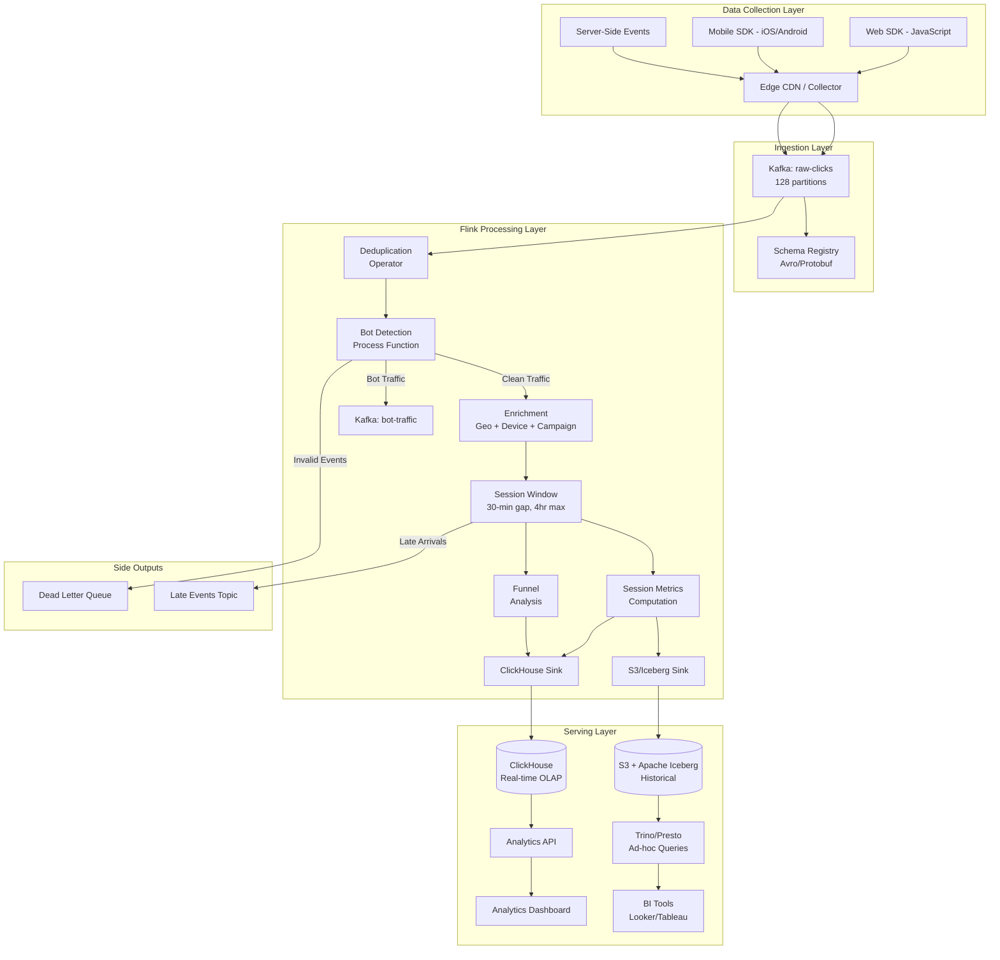

### Detailed Flink Job Topology

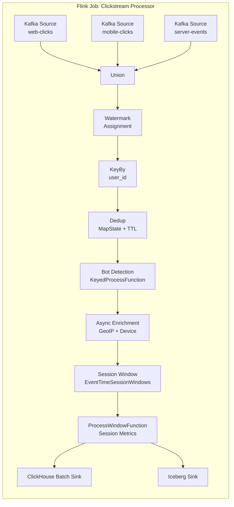

---

## 3. Data Flow

### End-to-End Journey: User Click → Analytics Dashboard

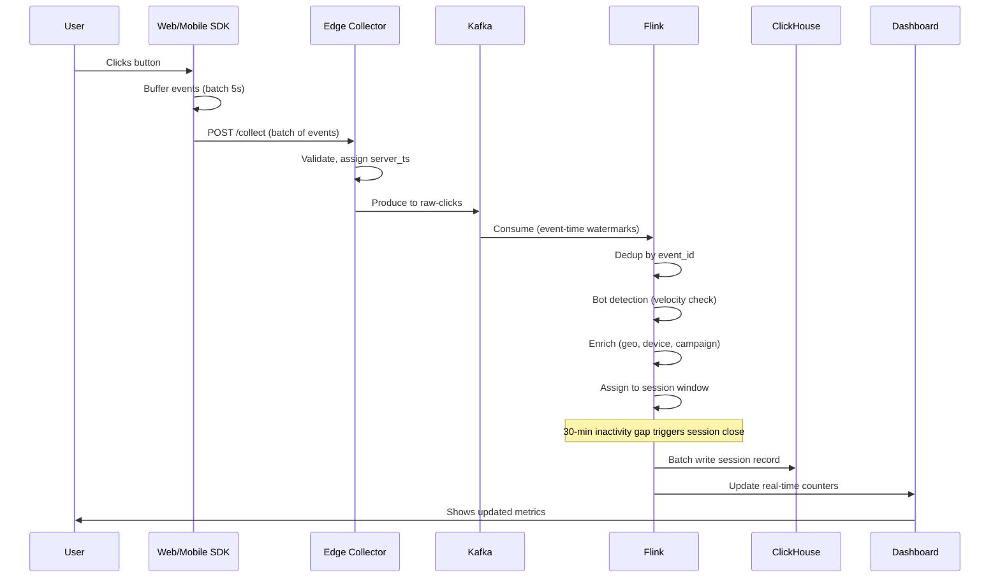

### Event Schema (Protobuf)

```protobuf
message ClickEvent {
    string event_id = 1;          // UUID - dedup key
    string user_id = 2;           // Authenticated user or anonymous ID
    string anonymous_id = 3;      // Device-level anonymous tracking
    int64 event_time_ms = 4;      // Client-side timestamp
    int64 server_time_ms = 5;     // Server receipt timestamp
    string event_type = 6;        // page_view, click, scroll, form_submit
    string page_url = 7;
    string referrer = 8;
    string utm_source = 9;
    string utm_medium = 10;
    string utm_campaign = 11;
    string device_type = 12;      // mobile, desktop, tablet
    string browser = 13;
    string os = 14;
    string ip_address = 15;
    string country = 16;
    map<string, string> properties = 17;  // Custom event properties
}
```

### Session Output Schema

```protobuf
message SessionRecord {
    string session_id = 1;
    string user_id = 2;
    int64 session_start = 3;
    int64 session_end = 4;
    int32 event_count = 5;
    int32 page_view_count = 6;
    int64 duration_ms = 7;
    repeated string pages_visited = 8;
    string entry_page = 9;
    string exit_page = 10;
    string traffic_source = 11;
    string device_type = 12;
    string country = 13;
    bool is_bounce = 14;
    double engagement_score = 15;
    repeated FunnelStep funnel_progress = 16;
}
```

---

## 4. Flink Concepts Used

### 4.1 Session Windows - Dynamic Boundaries Based on Inactivity Gaps

Session windows are the cornerstone of clickstream analytics. Unlike tumbling or sliding windows which have fixed boundaries, session windows **dynamically form around user activity**.

**How It Works:**
- Each incoming event for a user either extends an existing session or starts a new one
- If the gap between consecutive events exceeds the **inactivity threshold** (typically 30 minutes), the previous session closes and a new one begins
- Session boundaries are unique per key (per user)

```mermaid
gantt
    title Session Window Formation (30-min gap)
    dateFormat HH:mm
    axisFormat %H:%M

    section User A
    Click 1       :a1, 10:00, 1m
    Click 2       :a2, 10:05, 1m
    Click 3       :a3, 10:12, 1m
    Session 1     :crit, 10:00, 12m
    30-min gap    :done, 10:12, 30m
    Click 4       :a4, 10:50, 1m
    Click 5       :a5, 10:55, 1m
    Session 2     :crit, 10:50, 5m
```

**Why 30 minutes?** Industry standard (Google Analytics uses 30 min). Represents the threshold where a user has likely "left" and any return is a new intent.

**Challenge:** Pure session windows have no maximum duration - a bot continuously clicking would create a single infinite session. We need a **max duration cap** (covered in code examples).

### 4.2 Event Time Processing - Accurate Sessionization Despite Delays

Mobile events frequently arrive late due to:
- Network connectivity issues (subway, airplane mode)
- SDK batching (5-10 second buffers)
- App backgrounding (events held until next foreground)

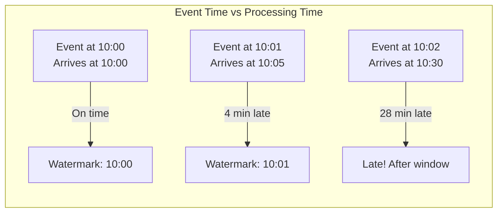

**Configuration:** We use event-time with a bounded-out-of-orderness watermark strategy. Events up to 5 minutes late are processed normally; events beyond that are routed to a side output for reprocessing.

### 4.3 Process Function - Custom Session Logic (Max Duration Cap)

`KeyedProcessFunction` provides:
- Access to keyed state (per-user accumulators)
- Timer registration (fire at specific event-time or processing-time)
- Full control over output (main output + side outputs)

We use it for:
1. **Max session duration enforcement** - Timer fires after 4 hours regardless of activity
2. **Bot detection** - Tracking click velocity in state
3. **Identity stitching** - Merging anonymous → authenticated transitions

### 4.4 Side Outputs - Bot Traffic, Invalid Events, Late Arrivals

Side outputs allow a single operator to produce multiple typed streams without duplicating processing:

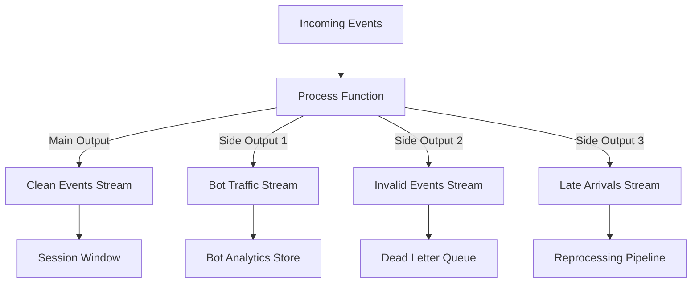

### 4.5 ProcessWindowFunction - Per-Session Metrics

`ProcessWindowFunction` fires when a session window closes and receives:
- All events in the window (the full session)
- The window metadata (start/end times)
- The key (user_id)
- A context for side outputs and timers

This is where we compute per-session aggregates: duration, page count, bounce detection, funnel progress, engagement score.

### 4.6 Watermarks with Idle Sources - Users Who Stop Browsing

**Problem:** If a Kafka partition has no new events (e.g., a partition dedicated to a geographic region during off-hours), its watermark never advances, blocking the entire job's watermark.

**Solution:** `WatermarkStrategy.withIdleness(Duration.ofMinutes(5))` - marks a source as idle after 5 minutes of inactivity, allowing the global watermark to advance based on other active sources.

### 4.7 State TTL - Abandoned Sessions

Not all sessions close cleanly. A user might:
- Close their browser (no "session end" event)
- Lose network connectivity permanently
- Switch devices

**State TTL** ensures that per-user state (dedup maps, session accumulators, bot counters) is automatically cleaned up after a configured duration, preventing unbounded state growth.

```java
StateTtlConfig ttlConfig = StateTtlConfig.newBuilder(Time.hours(6))
    .setUpdateType(StateTtlConfig.UpdateType.OnReadAndWrite)
    .setStateVisibility(StateTtlConfig.StateVisibility.NeverReturnExpired)
    .cleanupInRocksdbCompactFilter(5000)
    .build();
```

### 4.8 Custom Triggers - Early Results for Long Sessions

Default session window behavior: emit results only when the session closes (after 30 min of inactivity). For long sessions (e.g., a user browsing for 2 hours), dashboards see nothing until the session ends.

**Custom triggers** emit partial/early results:
- Every 60 seconds of processing time (for real-time dashboards)
- Every 50 events (for high-activity sessions)
- On session close (final complete result)

### 4.9 Union of Streams - Web + Mobile + API Events

Users interact across multiple platforms. We union all event streams into a single logical stream before sessionization:

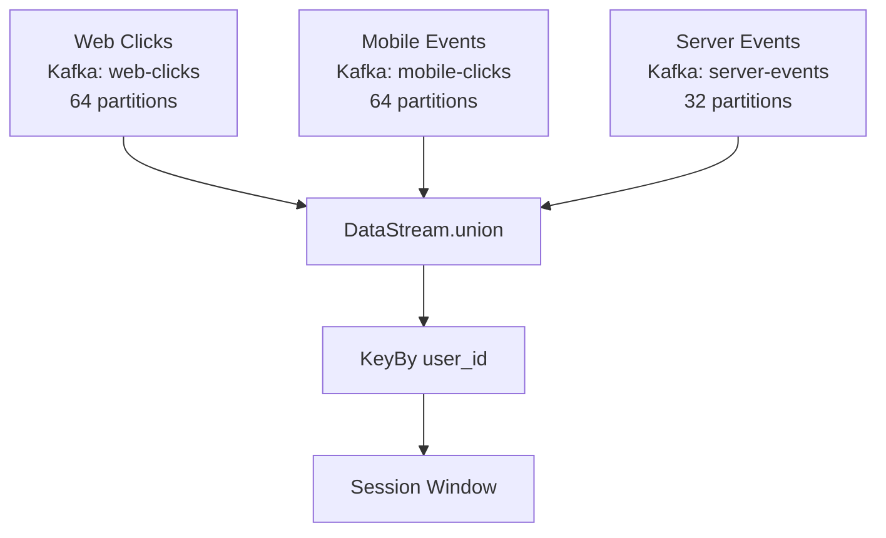

Events from all platforms share the same `user_id` (post-identity-resolution) and get sessionized together, giving a complete cross-platform view.

### 4.10 Keyed State - Per-User Session Accumulator

All state in the clickstream pipeline is **keyed by user_id**:
- `MapState<String, Boolean>` - Deduplication (event_id seen?)
- `ValueState<BotScore>` - Bot detection accumulators
- `ValueState<SessionAccumulator>` - Current session state
- `ListState<ClickEvent>` - Events buffer for late-arriving reordering

At 100M DAU, this means 100M+ active keys in state, backed by RocksDB with incremental checkpointing.

---

## 5. Production Code Examples (Java)

### 5.1 Custom Session Window with Max Duration Cap

```java
/**
 * Custom session window assigner that enforces a maximum session duration.
 * Standard EventTimeSessionWindows have no upper bound - a continuously active
 * user (or bot) would create an infinitely long session.
 * 
 * This implementation caps sessions at MAX_SESSION_DURATION (4 hours) and forces
 * a new session to begin after that threshold.
 */
public class CappedSessionWindowAssigner 
        extends MergingWindowAssigner<Object, TimeWindow> {
    
    private static final long SESSION_GAP = Duration.ofMinutes(30).toMillis();
    private static final long MAX_SESSION_DURATION = Duration.ofHours(4).toMillis();

    @Override
    public Collection<TimeWindow> assignWindows(
            Object element, long timestamp, WindowAssignerContext context) {
        // Each event initially gets its own window [timestamp, timestamp + gap)
        return Collections.singletonList(
            new TimeWindow(timestamp, timestamp + SESSION_GAP));
    }

    @Override
    public void mergeWindows(
            Collection<TimeWindow> windows, MergeCallback<TimeWindow> callback) {
        
        List<TimeWindow> sortedWindows = new ArrayList<>(windows);
        sortedWindows.sort(Comparator.comparingLong(TimeWindow::getStart));
        
        List<Tuple2<TimeWindow, List<TimeWindow>>> mergedGroups = new ArrayList<>();
        TimeWindow currentMerged = null;
        List<TimeWindow> currentGroup = new ArrayList<>();
        
        for (TimeWindow window : sortedWindows) {
            if (currentMerged == null) {
                currentMerged = window;
                currentGroup.add(window);
            } else if (window.getStart() <= currentMerged.getEnd() 
                    && (window.getEnd() - currentMerged.getStart()) <= MAX_SESSION_DURATION) {
                // Windows overlap AND merged result wouldn't exceed max duration
                currentMerged = new TimeWindow(
                    currentMerged.getStart(),
                    Math.max(currentMerged.getEnd(), window.getEnd())
                );
                currentGroup.add(window);
            } else {
                // Gap too large OR would exceed max duration → start new session
                if (currentGroup.size() > 1) {
                    mergedGroups.add(Tuple2.of(currentMerged, new ArrayList<>(currentGroup)));
                }
                currentMerged = window;
                currentGroup = new ArrayList<>();
                currentGroup.add(window);
            }
        }
        
        // Don't forget the last group
        if (currentGroup.size() > 1) {
            mergedGroups.add(Tuple2.of(currentMerged, currentGroup));
        }
        
        // Execute merges
        for (Tuple2<TimeWindow, List<TimeWindow>> group : mergedGroups) {
            callback.merge(group.f1, group.f0);
        }
    }

    @Override
    public Trigger<Object, TimeWindow> getDefaultTrigger(StreamExecutionEnvironment env) {
        return new EarlyFiringSessionTrigger();
    }

    @Override
    public TypeSerializer<TimeWindow> getWindowSerializer(ExecutionConfig config) {
        return new TimeWindow.Serializer();
    }

    @Override
    public boolean isEventTime() {
        return true;
    }
}
```

### 5.2 Bot Detection Using Click Velocity

```java
/**
 * Bot detection using click velocity analysis.
 * 
 * Detection signals:
 * 1. Click frequency > 5 clicks/second sustained for 10+ seconds
 * 2. Perfectly uniform inter-click intervals (< 5ms stddev)
 * 3. No mouse movement events between clicks
 * 4. Impossible geographic jumps between events
 * 5. Known bot User-Agent patterns
 * 
 * Outputs:
 * - Main: clean human traffic
 * - Side output BOT_TAG: confirmed bot traffic
 * - Side output SUSPECT_TAG: suspicious traffic for ML review
 */
public class BotDetectionFunction 
        extends KeyedProcessFunction<String, ClickEvent, ClickEvent> {
    
    private static final OutputTag<ClickEvent> BOT_TAG = 
        new OutputTag<>("bot-traffic", TypeInformation.of(ClickEvent.class));
    private static final OutputTag<ClickEvent> SUSPECT_TAG = 
        new OutputTag<>("suspect-traffic", TypeInformation.of(ClickEvent.class));
    
    // Per-user state
    private transient ValueState<BotDetectionState> detectionState;
    private transient MapState<Long, Integer> clicksPerSecond;
    
    // Thresholds
    private static final int MAX_CLICKS_PER_SECOND = 5;
    private static final int SUSTAINED_SECONDS = 10;
    private static final double MIN_INTERVAL_STDDEV_MS = 5.0;
    private static final int VELOCITY_WINDOW_SIZE = 20;
    
    @Override
    public void open(Configuration parameters) {
        StateTtlConfig ttl = StateTtlConfig.newBuilder(Time.hours(1))
            .setUpdateType(StateTtlConfig.UpdateType.OnReadAndWrite)
            .cleanupFullSnapshot()
            .build();
        
        ValueStateDescriptor<BotDetectionState> stateDesc = 
            new ValueStateDescriptor<>("bot-state", BotDetectionState.class);
        stateDesc.enableTimeToLive(ttl);
        detectionState = getRuntimeContext().getState(stateDesc);
        
        MapStateDescriptor<Long, Integer> clicksDesc = 
            new MapStateDescriptor<>("clicks-per-sec", Long.class, Integer.class);
        clicksDesc.enableTimeToLive(ttl);
        clicksPerSecond = getRuntimeContext().getMapState(clicksDesc);
    }

    @Override
    public void processElement(ClickEvent event, Context ctx, Collector<ClickEvent> out) 
            throws Exception {
        
        BotDetectionState state = detectionState.value();
        if (state == null) {
            state = new BotDetectionState();
        }
        
        // Signal 1: Click velocity
        long secondBucket = event.getEventTimeMs() / 1000;
        Integer count = clicksPerSecond.get(secondBucket);
        clicksPerSecond.put(secondBucket, (count == null ? 0 : count) + 1);
        
        // Signal 2: Inter-click interval analysis
        if (state.getLastClickTime() > 0) {
            long interval = event.getEventTimeMs() - state.getLastClickTime();
            state.addInterval(interval);
        }
        state.setLastClickTime(event.getEventTimeMs());
        state.incrementClickCount();
        
        // Compute bot score
        double botScore = computeBotScore(state, secondBucket);
        state.setBotScore(botScore);
        detectionState.update(state);
        
        // Route based on score
        if (botScore >= 0.9) {
            // Definite bot
            ctx.output(BOT_TAG, event.withBotScore(botScore));
            
            // Register cleanup timer
            ctx.timerService().registerProcessingTimeTimer(
                ctx.timerService().currentProcessingTime() + 3600_000);
        } else if (botScore >= 0.6) {
            // Suspicious - send to both outputs for ML review
            ctx.output(SUSPECT_TAG, event.withBotScore(botScore));
            out.collect(event); // Still process but flag it
        } else {
            // Human traffic
            out.collect(event);
        }
    }
    
    private double computeBotScore(BotDetectionState state, long currentSecond) 
            throws Exception {
        double score = 0.0;
        
        // Check sustained high velocity
        int highVelocitySeconds = 0;
        for (long sec = currentSecond - SUSTAINED_SECONDS; sec <= currentSecond; sec++) {
            Integer c = clicksPerSecond.get(sec);
            if (c != null && c > MAX_CLICKS_PER_SECOND) {
                highVelocitySeconds++;
            }
        }
        if (highVelocitySeconds >= SUSTAINED_SECONDS) {
            score += 0.5;
        } else if (highVelocitySeconds >= 5) {
            score += 0.3;
        }
        
        // Check interval regularity (bots have very uniform timing)
        if (state.getIntervalCount() >= VELOCITY_WINDOW_SIZE) {
            double stddev = state.getIntervalStdDev();
            if (stddev < MIN_INTERVAL_STDDEV_MS) {
                score += 0.4; // Suspiciously uniform
            }
        }
        
        // Check for impossible speed (> 100 clicks without any non-click events)
        if (state.getConsecutiveClicksWithoutMovement() > 100) {
            score += 0.2;
        }
        
        return Math.min(score, 1.0);
    }
    
    @Override
    public void onTimer(long timestamp, OnTimerContext ctx, Collector<ClickEvent> out) 
            throws Exception {
        // Cleanup old per-second counters
        long cutoff = (timestamp / 1000) - 120; // Keep last 2 minutes
        Iterator<Long> keys = clicksPerSecond.keys().iterator();
        while (keys.hasNext()) {
            if (keys.next() < cutoff) {
                keys.remove();
            }
        }
    }
}
```

### 5.3 Session Enrichment (Geo, Device, Campaign)

```java
/**
 * Async enrichment operator that decorates raw click events with:
 * - GeoIP data (country, region, city, lat/lon)
 * - Device classification (parsed User-Agent)
 * - Campaign/UTM attribution
 * - User segment (from user profile service)
 * 
 * Uses AsyncDataStream for non-blocking external lookups with caching.
 */
public class SessionEnrichmentFunction 
        extends RichAsyncFunction<ClickEvent, EnrichedClickEvent> {
    
    private transient AsyncHttpClient httpClient;
    private transient Cache<String, GeoData> geoCache;         // IP → Geo
    private transient Cache<String, DeviceData> deviceCache;    // UA → Device
    private transient Cache<String, UserSegment> segmentCache;  // user_id → Segment
    
    @Override
    public void open(Configuration parameters) {
        httpClient = Dsl.asyncHttpClient(
            Dsl.config()
                .setMaxConnections(200)
                .setRequestTimeout(2000)
                .setReadTimeout(1500)
                .build()
        );
        
        // LRU caches to avoid repeated lookups
        geoCache = Caffeine.newBuilder()
            .maximumSize(100_000)
            .expireAfterWrite(Duration.ofHours(24))
            .build();
            
        deviceCache = Caffeine.newBuilder()
            .maximumSize(50_000)
            .expireAfterWrite(Duration.ofHours(24))
            .build();
            
        segmentCache = Caffeine.newBuilder()
            .maximumSize(1_000_000)
            .expireAfterWrite(Duration.ofMinutes(15))
            .build();
    }

    @Override
    public void asyncInvoke(ClickEvent event, ResultFuture<EnrichedClickEvent> resultFuture) {
        
        // Parallel enrichment lookups
        CompletableFuture<GeoData> geoFuture = resolveGeo(event.getIpAddress());
        CompletableFuture<DeviceData> deviceFuture = resolveDevice(event.getUserAgent());
        CompletableFuture<UserSegment> segmentFuture = resolveSegment(event.getUserId());
        
        CompletableFuture.allOf(geoFuture, deviceFuture, segmentFuture)
            .thenAccept(v -> {
                try {
                    EnrichedClickEvent enriched = EnrichedClickEvent.builder()
                        .clickEvent(event)
                        .geoData(geoFuture.get())
                        .deviceData(deviceFuture.get())
                        .userSegment(segmentFuture.get())
                        .campaignData(extractCampaign(event))
                        .build();
                    resultFuture.complete(Collections.singleton(enriched));
                } catch (Exception e) {
                    // Fallback: emit with partial enrichment
                    resultFuture.complete(Collections.singleton(
                        EnrichedClickEvent.withDefaults(event)));
                }
            })
            .exceptionally(throwable -> {
                resultFuture.complete(Collections.singleton(
                    EnrichedClickEvent.withDefaults(event)));
                return null;
            });
    }
    
    private CompletableFuture<GeoData> resolveGeo(String ip) {
        GeoData cached = geoCache.getIfPresent(ip);
        if (cached != null) {
            return CompletableFuture.completedFuture(cached);
        }
        
        return httpClient.prepareGet("http://geoip-service:8080/lookup/" + ip)
            .execute()
            .toCompletableFuture()
            .thenApply(response -> {
                GeoData geo = GeoData.parse(response.getResponseBody());
                geoCache.put(ip, geo);
                return geo;
            });
    }
    
    private CompletableFuture<DeviceData> resolveDevice(String userAgent) {
        DeviceData cached = deviceCache.getIfPresent(userAgent);
        if (cached != null) {
            return CompletableFuture.completedFuture(cached);
        }
        // Use local UA parser (no network call needed)
        DeviceData device = UserAgentParser.parse(userAgent);
        deviceCache.put(userAgent, device);
        return CompletableFuture.completedFuture(device);
    }
    
    private CampaignData extractCampaign(ClickEvent event) {
        return CampaignData.builder()
            .source(event.getUtmSource())
            .medium(event.getUtmMedium())
            .campaign(event.getUtmCampaign())
            .referrer(event.getReferrer())
            .channel(classifyChannel(event))
            .build();
    }
    
    private String classifyChannel(ClickEvent event) {
        if (event.getUtmMedium() != null) {
            switch (event.getUtmMedium().toLowerCase()) {
                case "cpc": case "ppc": return "paid_search";
                case "social": return "paid_social";
                case "email": return "email";
                case "affiliate": return "affiliate";
            }
        }
        if (event.getReferrer() != null) {
            if (event.getReferrer().contains("google.com")) return "organic_search";
            if (event.getReferrer().contains("facebook.com")) return "organic_social";
            return "referral";
        }
        return "direct";
    }

    @Override
    public void timeout(ClickEvent event, ResultFuture<EnrichedClickEvent> resultFuture) {
        // On timeout, emit with whatever data we have
        resultFuture.complete(Collections.singleton(
            EnrichedClickEvent.withDefaults(event)));
    }
}

// Usage in pipeline:
// AsyncDataStream.unorderedWait(
//     cleanStream, new SessionEnrichmentFunction(),
//     3000, TimeUnit.MILLISECONDS, 1000  // 3s timeout, 1000 concurrent requests
// );
```

### 5.4 Funnel Computation Within Sessions

```java
/**
 * Computes funnel progress within each session.
 * 
 * A funnel is an ordered sequence of steps. For example:
 *   homepage → product_page → add_to_cart → checkout → purchase
 * 
 * For each session, we track:
 * - Which steps were completed
 * - Time between steps (step latency)
 * - Where users dropped off
 * - Whether steps were completed in order
 */
public class FunnelProcessWindowFunction 
        extends ProcessWindowFunction<EnrichedClickEvent, SessionWithFunnel, String, TimeWindow> {
    
    // Funnel definitions loaded from config
    private transient List<FunnelDefinition> funnelDefs;
    
    @Override
    public void open(Configuration parameters) {
        funnelDefs = loadFunnelDefinitions();
    }
    
    @Override
    public void process(
            String userId,
            ProcessWindowFunction<EnrichedClickEvent, SessionWithFunnel, String, TimeWindow>.Context ctx,
            Iterable<EnrichedClickEvent> events,
            Collector<SessionWithFunnel> out) {
        
        // Sort events by event time
        List<EnrichedClickEvent> sortedEvents = new ArrayList<>();
        events.forEach(sortedEvents::add);
        sortedEvents.sort(Comparator.comparingLong(e -> e.getClickEvent().getEventTimeMs()));
        
        // Compute basic session metrics
        SessionMetrics metrics = computeSessionMetrics(sortedEvents, ctx.window());
        
        // Compute funnel progress for each defined funnel
        List<FunnelProgress> funnelResults = new ArrayList<>();
        for (FunnelDefinition funnel : funnelDefs) {
            FunnelProgress progress = computeFunnelProgress(funnel, sortedEvents);
            funnelResults.add(progress);
        }
        
        // Build output
        SessionWithFunnel result = SessionWithFunnel.builder()
            .sessionId(generateSessionId(userId, ctx.window()))
            .userId(userId)
            .sessionStart(ctx.window().getStart())
            .sessionEnd(ctx.window().getEnd())
            .metrics(metrics)
            .funnelProgress(funnelResults)
            .build();
        
        out.collect(result);
    }
    
    private FunnelProgress computeFunnelProgress(
            FunnelDefinition funnel, List<EnrichedClickEvent> events) {
        
        List<FunnelStep> steps = funnel.getSteps();
        int currentStepIndex = 0;
        List<FunnelStepResult> results = new ArrayList<>();
        long previousStepTime = -1;
        
        for (EnrichedClickEvent event : events) {
            if (currentStepIndex >= steps.size()) break;
            
            FunnelStep expectedStep = steps.get(currentStepIndex);
            if (matchesStep(event, expectedStep)) {
                long eventTime = event.getClickEvent().getEventTimeMs();
                long latencyMs = previousStepTime > 0 
                    ? eventTime - previousStepTime : 0;
                
                results.add(FunnelStepResult.builder()
                    .stepName(expectedStep.getName())
                    .completedAt(eventTime)
                    .latencyFromPreviousMs(latencyMs)
                    .build());
                
                previousStepTime = eventTime;
                currentStepIndex++;
            }
        }
        
        return FunnelProgress.builder()
            .funnelName(funnel.getName())
            .totalSteps(steps.size())
            .completedSteps(results.size())
            .stepResults(results)
            .isComplete(results.size() == steps.size())
            .dropOffStep(results.size() < steps.size() 
                ? steps.get(results.size()).getName() : null)
            .build();
    }
    
    private boolean matchesStep(EnrichedClickEvent event, FunnelStep step) {
        ClickEvent click = event.getClickEvent();
        
        // Match by event type
        if (step.getEventType() != null 
                && !step.getEventType().equals(click.getEventType())) {
            return false;
        }
        
        // Match by URL pattern
        if (step.getUrlPattern() != null 
                && !click.getPageUrl().matches(step.getUrlPattern())) {
            return false;
        }
        
        // Match by custom properties
        if (step.getRequiredProperties() != null) {
            for (Map.Entry<String, String> prop : step.getRequiredProperties().entrySet()) {
                if (!prop.getValue().equals(click.getProperties().get(prop.getKey()))) {
                    return false;
                }
            }
        }
        
        return true;
    }
    
    private SessionMetrics computeSessionMetrics(
            List<EnrichedClickEvent> events, TimeWindow window) {
        
        long duration = window.getEnd() - window.getStart();
        int pageViews = 0;
        int clicks = 0;
        Set<String> uniquePages = new HashSet<>();
        
        for (EnrichedClickEvent event : events) {
            String type = event.getClickEvent().getEventType();
            if ("page_view".equals(type)) {
                pageViews++;
                uniquePages.add(event.getClickEvent().getPageUrl());
            } else if ("click".equals(type)) {
                clicks++;
            }
        }
        
        boolean isBounce = pageViews <= 1 && duration < 10_000;
        double engagementScore = computeEngagementScore(events, duration, uniquePages.size());
        
        return SessionMetrics.builder()
            .durationMs(duration)
            .eventCount(events.size())
            .pageViewCount(pageViews)
            .clickCount(clicks)
            .uniquePages(uniquePages.size())
            .entryPage(events.get(0).getClickEvent().getPageUrl())
            .exitPage(events.get(events.size() - 1).getClickEvent().getPageUrl())
            .isBounce(isBounce)
            .engagementScore(engagementScore)
            .trafficSource(events.get(0).getCampaignData().getChannel())
            .device(events.get(0).getDeviceData().getDeviceType())
            .country(events.get(0).getGeoData().getCountry())
            .build();
    }
    
    private double computeEngagementScore(
            List<EnrichedClickEvent> events, long durationMs, int uniquePages) {
        // Engagement = weighted combination of signals
        double durationScore = Math.min(durationMs / 300_000.0, 1.0);  // Cap at 5 min
        double depthScore = Math.min(uniquePages / 5.0, 1.0);          // Cap at 5 pages
        double interactionScore = Math.min(events.size() / 20.0, 1.0); // Cap at 20 events
        
        return (durationScore * 0.3) + (depthScore * 0.4) + (interactionScore * 0.3);
    }
}
```

### 5.5 ClickHouse Batch Sink

```java
/**
 * High-throughput ClickHouse sink using JDBC batch inserts.
 * 
 * Design decisions:
 * - Batch size: 10,000 rows (ClickHouse performs best with large inserts)
 * - Flush interval: 5 seconds (ensures freshness even with low volume)
 * - Retry with exponential backoff on transient failures
 * - Circuit breaker to prevent overwhelming a degraded ClickHouse cluster
 * - Partitioned by toYYYYMMDD(session_start) for efficient querying
 */
public class ClickHouseBatchSink extends RichSinkFunction<SessionWithFunnel>
        implements CheckpointedFunction {
    
    private static final int BATCH_SIZE = 10_000;
    private static final long FLUSH_INTERVAL_MS = 5_000;
    
    private transient Connection connection;
    private transient List<SessionWithFunnel> buffer;
    private transient ScheduledExecutorService scheduler;
    private transient ListState<SessionWithFunnel> checkpointedState;
    
    // Circuit breaker state
    private transient AtomicInteger consecutiveFailures;
    private transient AtomicLong circuitOpenUntil;
    private static final int CIRCUIT_BREAK_THRESHOLD = 5;
    private static final long CIRCUIT_OPEN_DURATION_MS = 30_000;
    
    private final String jdbcUrl;
    private final String tableName;
    
    public ClickHouseBatchSink(String jdbcUrl, String tableName) {
        this.jdbcUrl = jdbcUrl;
        this.tableName = tableName;
    }

    @Override
    public void open(Configuration parameters) throws Exception {
        connection = DriverManager.getConnection(jdbcUrl);
        buffer = new ArrayList<>(BATCH_SIZE);
        consecutiveFailures = new AtomicInteger(0);
        circuitOpenUntil = new AtomicLong(0);
        
        // Periodic flush for low-volume periods
        scheduler = Executors.newSingleThreadScheduledExecutor();
        scheduler.scheduleAtFixedRate(
            this::flushIfNeeded, 
            FLUSH_INTERVAL_MS, FLUSH_INTERVAL_MS, TimeUnit.MILLISECONDS
        );
    }

    @Override
    public void invoke(SessionWithFunnel session, Context context) throws Exception {
        synchronized (buffer) {
            buffer.add(session);
            if (buffer.size() >= BATCH_SIZE) {
                flush();
            }
        }
    }
    
    private void flushIfNeeded() {
        synchronized (buffer) {
            if (!buffer.isEmpty()) {
                try {
                    flush();
                } catch (Exception e) {
                    // Will be retried on next flush cycle
                }
            }
        }
    }
    
    private void flush() throws Exception {
        if (buffer.isEmpty()) return;
        
        // Circuit breaker check
        if (System.currentTimeMillis() < circuitOpenUntil.get()) {
            throw new RuntimeException("Circuit breaker open - ClickHouse unavailable");
        }
        
        String sql = String.format(
            "INSERT INTO %s (session_id, user_id, session_start, session_end, " +
            "duration_ms, event_count, page_view_count, unique_pages, " +
            "entry_page, exit_page, is_bounce, engagement_score, " +
            "traffic_source, device, country, funnel_json) VALUES " +
            "(?, ?, ?, ?, ?, ?, ?, ?, ?, ?, ?, ?, ?, ?, ?, ?)",
            tableName
        );
        
        try (PreparedStatement ps = connection.prepareStatement(sql)) {
            for (SessionWithFunnel session : buffer) {
                SessionMetrics m = session.getMetrics();
                ps.setString(1, session.getSessionId());
                ps.setString(2, session.getUserId());
                ps.setTimestamp(3, new Timestamp(session.getSessionStart()));
                ps.setTimestamp(4, new Timestamp(session.getSessionEnd()));
                ps.setLong(5, m.getDurationMs());
                ps.setInt(6, m.getEventCount());
                ps.setInt(7, m.getPageViewCount());
                ps.setInt(8, m.getUniquePages());
                ps.setString(9, m.getEntryPage());
                ps.setString(10, m.getExitPage());
                ps.setBoolean(11, m.isBounce());
                ps.setDouble(12, m.getEngagementScore());
                ps.setString(13, m.getTrafficSource());
                ps.setString(14, m.getDevice());
                ps.setString(15, m.getCountry());
                ps.setString(16, toJson(session.getFunnelProgress()));
                ps.addBatch();
            }
            
            ps.executeBatch();
            consecutiveFailures.set(0);
            buffer.clear();
            
        } catch (SQLException e) {
            int failures = consecutiveFailures.incrementAndGet();
            if (failures >= CIRCUIT_BREAK_THRESHOLD) {
                circuitOpenUntil.set(
                    System.currentTimeMillis() + CIRCUIT_OPEN_DURATION_MS);
            }
            throw e;
        }
    }
    
    @Override
    public void snapshotState(FunctionSnapshotContext context) throws Exception {
        checkpointedState.clear();
        synchronized (buffer) {
            for (SessionWithFunnel session : buffer) {
                checkpointedState.add(session);
            }
        }
    }
    
    @Override
    public void initializeState(FunctionInitializationContext context) throws Exception {
        ListStateDescriptor<SessionWithFunnel> descriptor = 
            new ListStateDescriptor<>("buffered-sessions", SessionWithFunnel.class);
        checkpointedState = context.getOperatorStateStore().getListState(descriptor);
        
        if (context.isRestored()) {
            buffer = new ArrayList<>(BATCH_SIZE);
            for (SessionWithFunnel session : checkpointedState.get()) {
                buffer.add(session);
            }
        }
    }
    
    @Override
    public void close() throws Exception {
        if (scheduler != null) scheduler.shutdown();
        synchronized (buffer) {
            if (!buffer.isEmpty()) flush();
        }
        if (connection != null) connection.close();
    }
}
```

### 5.6 Main Pipeline Assembly

```java
public class ClickstreamPipeline {
    
    public static void main(String[] args) throws Exception {
        StreamExecutionEnvironment env = StreamExecutionEnvironment.getExecutionEnvironment();
        
        // Checkpointing: exactly-once with 30s intervals
        env.enableCheckpointing(30_000, CheckpointingMode.EXACTLY_ONCE);
        env.getCheckpointConfig().setMinPauseBetweenCheckpoints(10_000);
        env.getCheckpointConfig().setCheckpointTimeout(120_000);
        env.setStateBackend(new EmbeddedRocksDBStateBackend(true));
        env.getCheckpointConfig().setCheckpointStorage("s3://checkpoints/clickstream/");
        
        // Kafka sources
        KafkaSource<ClickEvent> webSource = KafkaSource.<ClickEvent>builder()
            .setBootstrapServers("kafka:9092")
            .setTopics("web-clicks")
            .setGroupId("clickstream-processor")
            .setDeserializer(new ClickEventDeserializer())
            .setStartingOffsets(OffsetsInitializer.committedOffsets(OffsetResetStrategy.LATEST))
            .build();
            
        KafkaSource<ClickEvent> mobileSource = KafkaSource.<ClickEvent>builder()
            .setBootstrapServers("kafka:9092")
            .setTopics("mobile-clicks")
            .setGroupId("clickstream-processor")
            .setDeserializer(new ClickEventDeserializer())
            .setStartingOffsets(OffsetsInitializer.committedOffsets(OffsetResetStrategy.LATEST))
            .build();
        
        // Watermark strategy: 5-min bounded lateness, 2-min idle timeout
        WatermarkStrategy<ClickEvent> wmStrategy = WatermarkStrategy
            .<ClickEvent>forBoundedOutOfOrderness(Duration.ofMinutes(5))
            .withTimestampAssigner((event, ts) -> event.getEventTimeMs())
            .withIdleness(Duration.ofMinutes(2));
        
        // Union all sources
        DataStream<ClickEvent> webStream = env.fromSource(
            webSource, wmStrategy, "web-clicks");
        DataStream<ClickEvent> mobileStream = env.fromSource(
            mobileSource, wmStrategy, "mobile-clicks");
        DataStream<ClickEvent> unified = webStream.union(mobileStream);
        
        // Bot detection
        SingleOutputStreamOperator<ClickEvent> cleanStream = unified
            .keyBy(ClickEvent::getUserId)
            .process(new BotDetectionFunction());
        
        DataStream<ClickEvent> botStream = cleanStream.getSideOutput(
            BotDetectionFunction.BOT_TAG);
        
        // Async enrichment
        DataStream<EnrichedClickEvent> enrichedStream = AsyncDataStream.unorderedWait(
            cleanStream,
            new SessionEnrichmentFunction(),
            3000, TimeUnit.MILLISECONDS,
            1000  // max concurrent async requests
        );
        
        // Session windowing with funnel computation
        DataStream<SessionWithFunnel> sessions = enrichedStream
            .keyBy(e -> e.getClickEvent().getUserId())
            .window(new CappedSessionWindowAssigner())
            .trigger(new EarlyFiringSessionTrigger())
            .process(new FunnelProcessWindowFunction());
        
        // Sinks
        sessions.addSink(new ClickHouseBatchSink(
            "jdbc:clickhouse://clickhouse:8123/analytics", "sessions"));
        
        // Bot traffic to separate Kafka topic for analysis
        botStream.sinkTo(KafkaSink.<ClickEvent>builder()
            .setBootstrapServers("kafka:9092")
            .setRecordSerializer(new ClickEventSerializer("bot-traffic"))
            .build());
        
        env.execute("Clickstream Analytics Pipeline");
    }
}
```

---

## 6. Session Challenges

### 6.1 Cross-Device Sessions

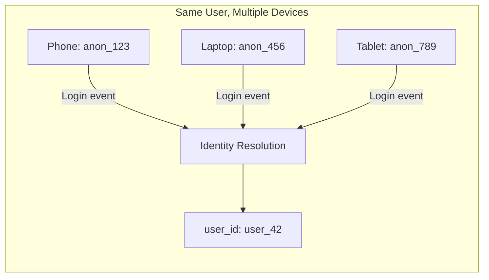

**Problem:** A user browses on phone, then continues on laptop. Without identity resolution, these are separate sessions for separate "users."

**Solution:** 
- Maintain an identity graph mapping `anonymous_id → user_id`
- On login events, retroactively associate previous anonymous events
- Use probabilistic matching (fingerprinting) for users who never log in
- Flink implementation: `BroadcastProcessFunction` with identity mappings broadcast to all operators

### 6.2 Tab-Switching and Background Tabs

**Problem:** User opens 5 tabs simultaneously. Each tab generates events but the user is only "active" in one at a time. Should these be one session or five?

**Solution:**
- Use `document.visibilityState` in the SDK to send `tab_focus`/`tab_blur` events
- Only count active time (exclude background time) in engagement metrics
- All tabs share one session if within the inactivity gap

### 6.3 Long Sessions

**Problem:** Power users (e.g., SaaS app users) may be active for 8+ hours. A single session spanning a workday:
- Grows unbounded state
- Delays window firing (no metrics until session closes)
- Produces unusable analytics (an 8-hour session isn't comparable to a 5-min session)

**Solution:**
- **Max duration cap** (4 hours) - force session split
- **Early firing triggers** - emit intermediate results every 60 seconds
- **Sub-session concept** - split long sessions into 30-min "engagement windows" for comparable metrics

### 6.4 Identity Resolution Pipeline

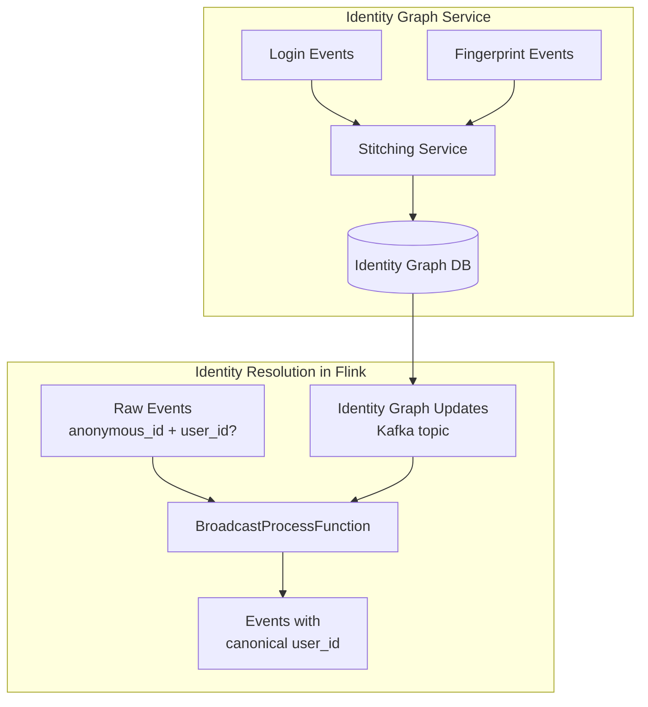

---

## 7. Analytics Capabilities

### 7.1 Core Metrics Computed

| Metric | Computation | Granularity |
|--------|-------------|-------------|
| DAU/WAU/MAU | COUNT(DISTINCT user_id) | Daily/Weekly/Monthly |
| Bounce Rate | Sessions with 1 page_view / Total sessions | Per page, per source |
| Avg Session Duration | AVG(session_end - session_start) | Per segment |
| Pages per Session | AVG(page_view_count) | Per segment |
| Conversion Rate | Funnel completions / Funnel entries | Per funnel |
| Engagement Score | Weighted(duration, depth, interactions) | Per session |

### 7.2 Funnel Analysis

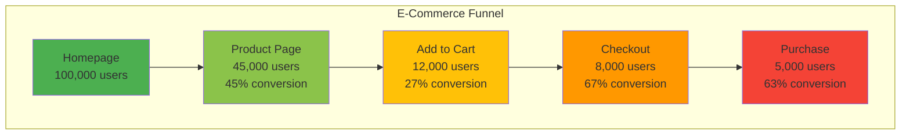

### 7.3 Attribution Models

Computed within the session pipeline:

- **Last-touch:** Credit to the last campaign before conversion
- **First-touch:** Credit to the campaign that acquired the user
- **Linear:** Equal credit across all touchpoints in the session
- **Time-decay:** More credit to recent touchpoints

### 7.4 Real-Time Dashboard Queries (ClickHouse)

```sql
-- DAU with 30-second freshness
SELECT uniqExact(user_id) AS dau
FROM sessions
WHERE session_start >= today();

-- Funnel conversion by traffic source
SELECT 
    traffic_source,
    countIf(JSONExtractInt(funnel_json, 'completed_steps') >= 1) AS step1,
    countIf(JSONExtractInt(funnel_json, 'completed_steps') >= 2) AS step2,
    countIf(JSONExtractInt(funnel_json, 'completed_steps') >= 3) AS step3,
    countIf(JSONExtractBool(funnel_json, 'is_complete')) AS converted
FROM sessions
WHERE session_start >= today()
GROUP BY traffic_source
ORDER BY converted DESC;

-- Engagement distribution
SELECT 
    multiIf(engagement_score < 0.2, 'low',
            engagement_score < 0.6, 'medium', 'high') AS engagement_tier,
    count() AS sessions,
    avg(duration_ms) / 1000 AS avg_duration_sec,
    avg(page_view_count) AS avg_pages
FROM sessions
WHERE session_start >= today() - INTERVAL 7 DAY
GROUP BY engagement_tier;
```

---

## 8. Scaling

### 8.1 Capacity Planning

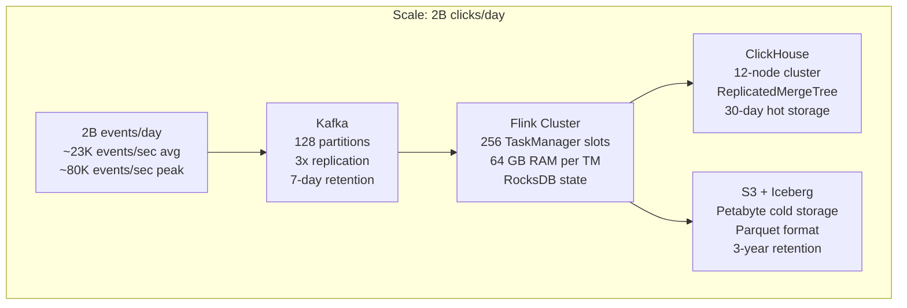

### 8.2 Resource Sizing

| Component | Configuration | Rationale |
|-----------|--------------|-----------|
| Kafka | 128 partitions, 3 brokers, 50TB storage | Peak 80K msg/s, 7-day retention |
| Flink TaskManagers | 64 TMs × 4 slots = 256 parallelism | 1 slot per Kafka partition × 2 |
| Flink State (RocksDB) | 2TB NVMe SSD per TM | 100M active keys × ~2KB/key |
| Checkpoints | S3, 30s interval, incremental | ~50GB per checkpoint |
| ClickHouse | 12 nodes, 128GB RAM each | 100M sessions/day, 30-day hot |
| Iceberg/S3 | Petabyte-scale, Parquet | 3-year history, columnar for analytics |

### 8.3 Performance Optimizations

1. **Kafka Partitioning:** Partition by `murmur3(user_id) % 128` - ensures all events for a user go to the same Flink subtask (required for sessionization)

2. **RocksDB Tuning:**
   ```yaml
   state.backend.rocksdb.block.cache-size: 256mb
   state.backend.rocksdb.writebuffer.size: 128mb
   state.backend.rocksdb.writebuffer.count: 4
   state.backend.rocksdb.compaction.style: LEVEL
   ```

3. **Incremental Checkpoints:** Only changed state since last checkpoint is uploaded (~90% reduction in checkpoint size)

4. **Operator Chaining:** Chain dedup → bot detection → enrichment to avoid unnecessary serialization

5. **Network Buffer Tuning:**
   ```yaml
   taskmanager.network.memory.fraction: 0.15
   taskmanager.network.memory.min: 256mb
   taskmanager.network.memory.max: 1gb
   ```

### 8.4 Backpressure Handling

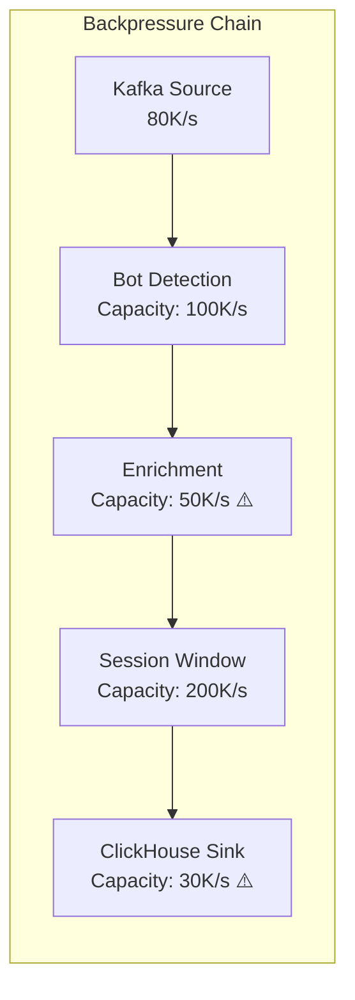

**Mitigation:**
- Identify bottleneck via Flink Web UI backpressure metrics
- Scale enrichment: increase async capacity or add local caching
- Scale sink: increase batch size, add buffer, or scale ClickHouse cluster

---

## 9. Bot Detection Architecture

### 9.1 Multi-Layer Detection

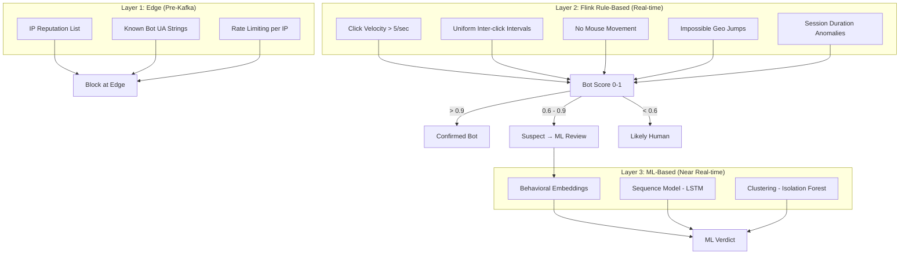

### 9.2 Rule-Based Signals (Implemented in Flink)

| Signal | Threshold | Bot Score Contribution |
|--------|-----------|----------------------|
| Clicks per second | > 5 sustained 10s | +0.5 |
| Inter-click stddev | < 5ms | +0.4 |
| No mouse movement | > 100 consecutive clicks | +0.2 |
| Geo jump | > 1000km in < 60s | +0.3 |
| Session pages/min | > 30 | +0.3 |
| JavaScript disabled | Always | +0.2 |
| Cookie rejection | Repeated | +0.15 |

### 9.3 ML-Based Detection (Offline Training, Online Inference)

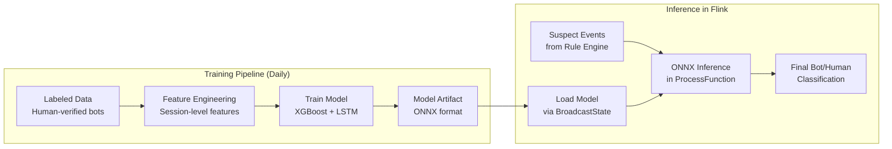

**Features for ML model:**
- Session-level: duration, event_count, unique_pages, time_between_pages distribution
- Behavioral: scroll_depth_variance, mouse_movement_entropy, typing_speed
- Network: TLS fingerprint, HTTP/2 multiplexing patterns, connection reuse

---

## 10. Real Companies

### Spotify - Real-Time Listening Analytics

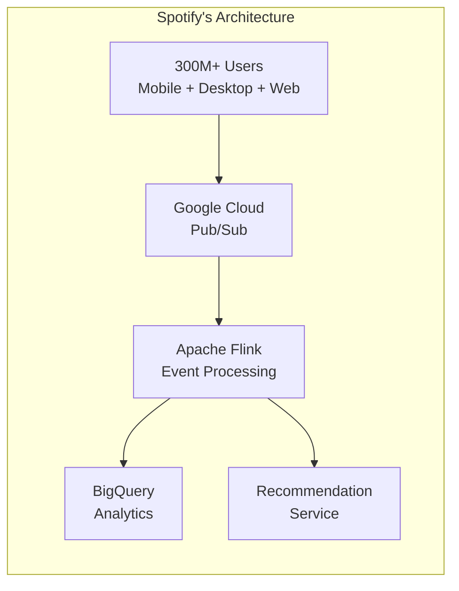

- **Scale:** 1B+ events/day from music playback, search, playlist interactions
- **Sessionization:** "Listening sessions" with custom inactivity gaps (pause > 30 min = new session)
- **Use cases:** Wrapped (year-end stats), Discovery Weekly training data, artist analytics
- **Stack:** Flink on GCP, Cloud Pub/Sub, BigQuery, custom event delivery SDK

### Airbnb - Search & Booking Funnel

- **Scale:** 500M+ events/day from search, listing views, booking interactions
- **Sessionization:** Search sessions (intent-based) with 15-min inactivity gap
- **Funnels:** Search → listing_view → booking_request → booking_confirmed
- **Special challenge:** Sessions span days (search on Monday, book on Friday)
- **Stack:** Flink, Kafka, Hive/Spark for historical, Druid for real-time
- **Identity:** Complex guest/host dual-identity resolution

### Pinterest - Visual Discovery Sessions

- **Scale:** 1B+ pins served/day, 450M+ monthly users
- **Sessionization:** "Discovery sessions" - grouped by visual exploration intent
- **Use cases:** Ad attribution, content quality scoring, homefeed ranking signals
- **Bot detection:** Critical for ad fraud prevention (advertisers pay per engagement)
- **Stack:** Flink, Kafka, Druid, real-time ML models for content recommendation
- **Innovation:** "Pin engagement sessions" use content-similarity as a session boundary (topic switch = new session)

### Twitter/X - Timeline Engagement

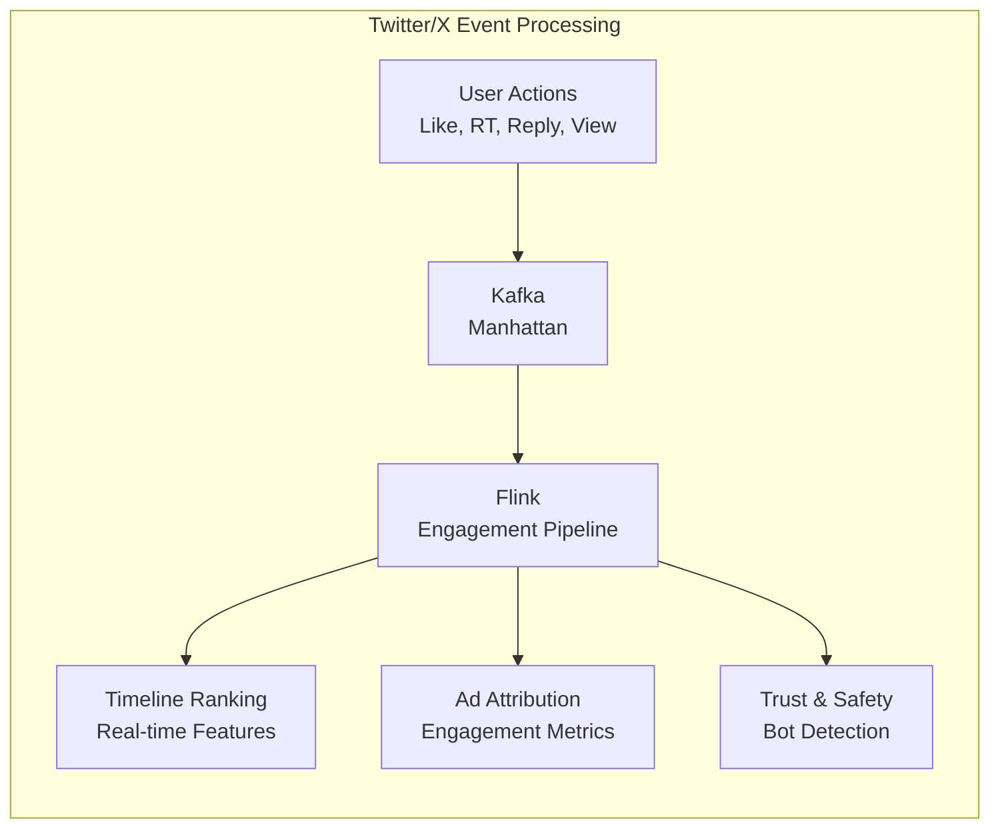

- **Scale:** 500B+ tweet impressions/day, 1M+ tweets/min during peak
- **Sessionization:** "Timeline sessions" - scroll-based with complex engagement scoring
- **Bot detection:** Critical for platform integrity (detecting coordinated inauthentic behavior)
- **Real-time ML features:** Flink computes engagement probability features fed directly into timeline ranking
- **Stack:** Custom Flink deployment (Heron → Flink migration), Kafka, Manhattan (KV store), BigQuery

### Common Patterns Across Companies

| Company | Events/Day | Session Gap | Max Duration | Primary Sink | Key Challenge |
|---------|-----------|-------------|--------------|--------------|---------------|
| Spotify | 1B+ | 30 min | 8 hours | BigQuery | Multi-device listening |
| Airbnb | 500M+ | 15 min | 7 days (search) | Druid + Hive | Multi-day intent |
| Pinterest | 1B+ | 30 min | 4 hours | Druid | Content-based boundaries |
| Twitter/X | 500B impressions | 5 min | 2 hours | Manhattan | Coordinated bot networks |

---

## Summary

The clickstream analytics pipeline represents one of the most demanding Flink use cases:

1. **Extreme scale** - billions of events from hundreds of millions of users
2. **Complex windowing** - session windows with custom boundaries, caps, and early firing
3. **Real-time + historical** - dual-write to OLAP (ClickHouse) and lakehouse (Iceberg)
4. **Multi-signal processing** - sessionization, bot detection, enrichment, and funnel analysis in a single pipeline
5. **Stateful at scale** - per-user state for 100M+ keys backed by RocksDB

The key architectural insight: **treat the session as the fundamental unit of analytics** rather than individual events. Sessions provide the context that transforms raw clicks into actionable user behavior understanding.
