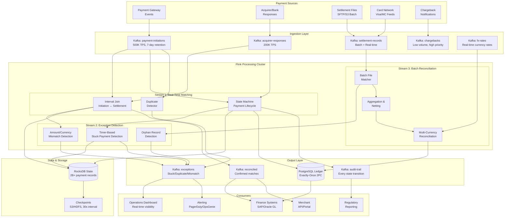
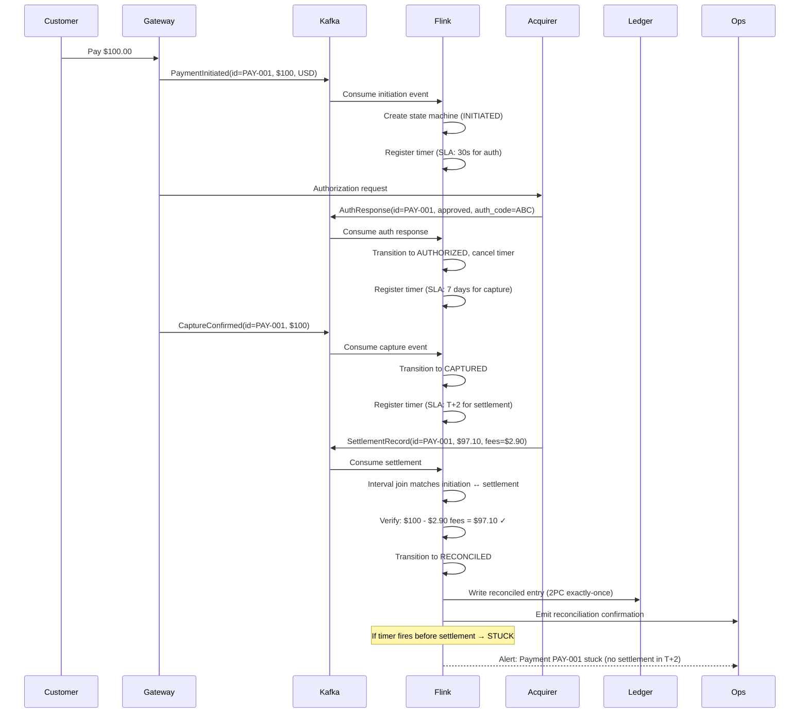
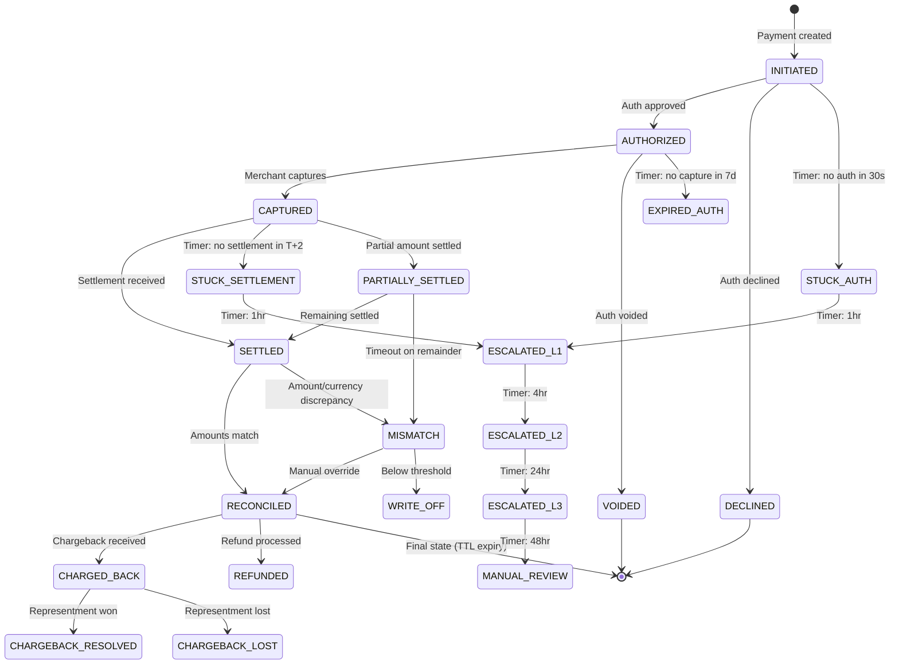
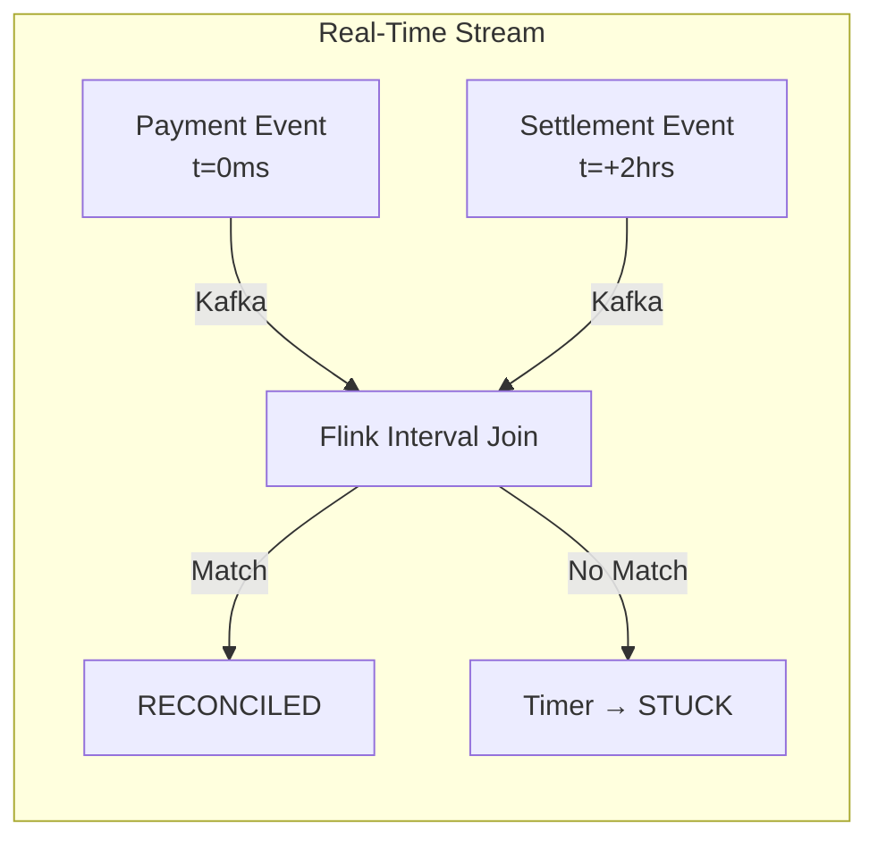
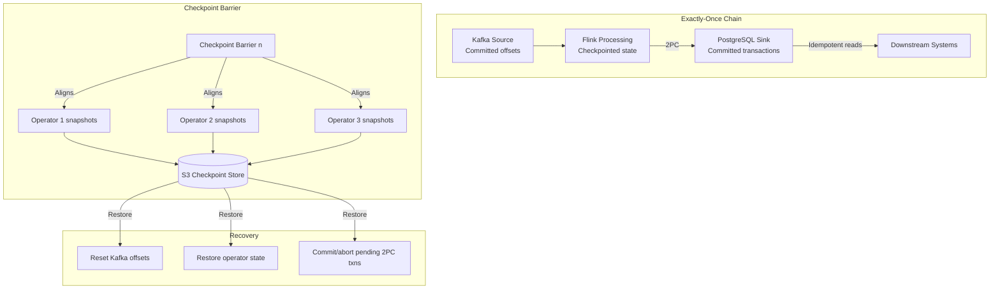
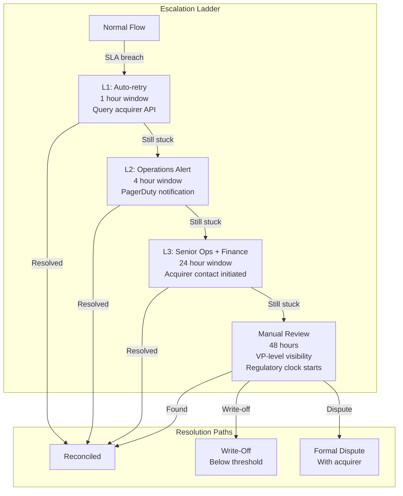

# Payment Reconciliation & Settlement Pipeline at Scale

## 1. Problem Statement

### The $1 Trillion Challenge

Every day, billions of dollars flow through payment networks — credit cards, debit cards, ACH transfers, wire payments, digital wallets. Each transaction involves multiple parties: the merchant, the payment gateway, the acquiring bank, the card network (Visa/Mastercard), and the issuing bank. **Reconciliation** is the process of ensuring that every payment initiated is eventually settled correctly, that every cent is accounted for, and that discrepancies are detected and resolved.

### Scale Parameters

| Metric | Target |
|--------|--------|
| Transaction volume | 500,000 TPS peak |
| Annual transaction value | $1T+ |
| Accuracy requirement | 99.999% (< $10M unreconciled annually) |
| Reconciliation latency | < 5 minutes for real-time, < 2 hours for batch |
| State cardinality | 2B+ active payment records |
| Settlement windows | T+0 to T+3 depending on payment method |
| Currencies | 150+ currencies, real-time FX |
| Acquirers/PSPs | 50+ globally |
| Uptime | 99.99% (< 52 minutes downtime/year) |

### Why This Is Hard

1. **Temporal mismatch**: Payment initiation happens in milliseconds; settlement confirmation arrives hours to days later
2. **Multi-party agreement**: Gateway, acquirer, network, and issuer must all agree on amount, currency, and status
3. **Partial information**: Settlement files arrive in batches with different formats, schemas, and identifiers
4. **Edge cases**: Split settlements, partial captures, multi-currency conversions, chargebacks, refunds, retries
5. **Zero tolerance**: Unlike recommendation systems or analytics, financial reconciliation has zero tolerance for data loss — a single missing transaction can cascade into regulatory violations

### Industry Cost of Failure

- **$1B+ annually** lost industry-wide to unreconciled payments
- **Manual reconciliation** costs $5-50 per exception (hundreds of millions of exceptions/year)
- **Regulatory fines**: PSD2 violations up to 4% of annual turnover, SOX non-compliance leads to criminal penalties
- **Merchant trust**: A single incorrect settlement destroys merchant relationships

### Regulatory Requirements

| Regulation | Requirement |
|-----------|-------------|
| **PCI-DSS** | Encrypt all cardholder data in transit and at rest, full audit trail, access controls |
| **PSD2 (EU)** | Strong Customer Authentication, transaction monitoring, 24hr fraud reporting |
| **SOX (US)** | Internal controls over financial reporting, CEO/CFO certification of accuracy |
| **GDPR** | Right to erasure balanced with financial record-keeping requirements |
| **PSD3 (upcoming)** | Real-time fraud data sharing, enhanced reconciliation requirements |

### Core Reconciliation Questions

For every single payment ($0.01 or $1,000,000), the system must answer:

1. Was this payment **initiated** correctly?
2. Was it **authorized** by the issuer?
3. Was it **captured** (merchant confirmed they want the money)?
4. Was it **settled** (money actually moved)?
5. Does the **settled amount** match the **captured amount** (after fees, FX)?
6. Is the settlement reflected in the **merchant's ledger** correctly?
7. Are there any **duplicates** (same payment processed twice)?
8. Are there any **orphans** (settlement without initiation, or vice versa)?

---

## 2. Architecture Diagram

### High-Level System Architecture



### Data Flow Detail



---

## 3. Reconciliation Flow

### Payment Lifecycle State Machine



### Matching Process

The reconciliation engine performs **three-way matching**:

```
┌─────────────────────────────────────────────────────────────────────┐
│                    THREE-WAY RECONCILIATION                          │
├─────────────────────────────────────────────────────────────────────┤
│                                                                     │
│  Source A (Gateway)     Source B (Acquirer)     Source C (Bank)      │
│  ┌──────────────┐      ┌──────────────┐       ┌──────────────┐    │
│  │ PAY-001      │      │ ACQ-REF-XYZ  │       │ SETTLE-99832 │    │
│  │ $100.00 USD  │      │ $100.00 USD  │       │ $97.10 USD   │    │
│  │ 2024-01-15   │      │ Auth: ABC123 │       │ Fees: $2.90  │    │
│  │ Merchant: M1 │      │ 2024-01-15   │       │ 2024-01-17   │    │
│  └──────┬───────┘      └──────┬───────┘       └──────┬───────┘    │
│         │                      │                      │             │
│         └──────────────────────┼──────────────────────┘             │
│                                │                                    │
│                    ┌───────────▼───────────┐                        │
│                    │   MATCH CRITERIA      │                        │
│                    │   • Payment ID        │                        │
│                    │   • Auth code         │                        │
│                    │   • Amount ± fees     │                        │
│                    │   • Currency          │                        │
│                    │   • Merchant          │                        │
│                    │   • Time window       │                        │
│                    └───────────┬───────────┘                        │
│                                │                                    │
│                    ┌───────────▼───────────┐                        │
│                    │   RESULT              │                        │
│                    │   ✓ RECONCILED        │                        │
│                    │   Net: $97.10         │                        │
│                    │   Fees: $2.90 (2.9%)  │                        │
│                    └──────────────────────-┘                        │
└─────────────────────────────────────────────────────────────────────┘
```

### Matching Keys and Strategies

| Match Level | Primary Key | Fallback Keys | Confidence |
|------------|-------------|---------------|------------|
| Exact | payment_id + auth_code | — | 100% |
| Strong | merchant_id + amount + timestamp(±5min) | card_last4 + amount | 95% |
| Fuzzy | merchant_id + amount(±0.01) + date | reference_number | 80% |
| Manual | Amount + approximate time + merchant | — | Requires human |

---

## 4. Flink Concepts Used

### 4.1 Interval Joins

**Purpose**: Match a payment initiation event with its corresponding settlement event, where the settlement arrives anywhere from seconds to days after initiation.

**Why Interval Joins (not regular joins)**: Regular stream joins require events to share the same timestamp or window. In payments, the initiation happens at time T and settlement at time T + hours/days. Interval joins allow specifying an asymmetric time window: "match this initiation with any settlement that arrives between 0 and 72 hours later."

**Semantics**:
```
stream_a.intervalJoin(stream_b)
    .between(Time.seconds(0), Time.hours(72))  // settlement arrives 0-72hr after initiation
    .process(matchFunction)
```

The interval join maintains state for both streams within the time bounds. For every event in stream A, it looks for matching events in stream B within the specified time window, and vice versa. Events are garbage-collected once they fall outside the window.

**State implications at scale**: With 500K TPS and a 72-hour window, the state holds ~130B events. Each event averages 500 bytes → ~60TB of state in RocksDB. This requires incremental checkpointing and tiered state storage.

### 4.2 KeyedCoProcessFunction

**Purpose**: Implement complex matching logic between two streams that goes beyond simple equi-joins.

**Why needed**: The interval join handles time-bounded matching, but real reconciliation requires:
- Matching on composite keys (payment_id OR auth_code + amount)
- Handling one-to-many relationships (one initiation → multiple partial settlements)
- Maintaining running totals of partially settled amounts
- Emitting different outputs based on match quality

`KeyedCoProcessFunction<K, IN1, IN2, OUT>` receives events from two input streams keyed by the same key, with full access to keyed state and timers. Each stream has its own `processElement` method, giving fine-grained control over the matching logic.

### 4.3 State Machines with ProcessFunction

**Purpose**: Track each payment through its complete lifecycle with well-defined states and valid transitions.

**Design**: Each payment is a state machine instance stored in Flink keyed state. The key is the payment ID. The state includes:
- Current status (enum: INITIATED, AUTHORIZED, CAPTURED, etc.)
- Timestamps for each transition
- Accumulated amounts (for partial settlements)
- Retry counters
- Associated references (auth codes, settlement IDs)

**Why ProcessFunction**: Unlike map/flatMap, ProcessFunction provides access to:
- Keyed state (the state machine itself)
- Timers (for SLA monitoring)
- Side outputs (for routing exceptions)
- Current watermark (for event-time reasoning)

### 4.4 Timers (Event Time & Processing Time)

**Purpose**: Detect payments stuck in intermediate states — the critical exception detection mechanism.

**Event Time Timers**: Fire based on watermark advancement. Used for business SLA detection:
- "If no authorization received within 30 seconds of initiation (event time), mark as stuck"
- Resilient to processing delays — even if the system is backlogged, timers fire correctly relative to event timestamps

**Processing Time Timers**: Fire based on wall clock. Used for operational alerting:
- "If this payment has been in CAPTURED state for 10 minutes of processing time, alert ops"
- Useful for detecting systemic issues (e.g., acquirer feed is down)

**Timer coalescing**: At 500K TPS with timers per payment, millions of timers exist simultaneously. Flink stores timers in RocksDB and processes them in watermark-order, coalescing where possible.

### 4.5 State TTL

**Purpose**: Automatically expire completed reconciliation records to prevent unbounded state growth.

**Configuration**:
- RECONCILED payments: TTL of 7 days (keep for late chargebacks)
- DECLINED/VOIDED: TTL of 24 hours
- Terminal states (CHARGEBACK_RESOLVED): TTL of 90 days (audit requirement)
- STUCK/ESCALATED: No TTL (never auto-expire unresolved issues)

**TTL strategy**: Use `StateTtlConfig` with:
- `UpdateType.OnCreateAndWrite` — reset TTL on every state change
- `StateVisibility.NeverReturnExpired` — never serve stale data
- Cleanup in background during RocksDB compaction

### 4.6 Exactly-Once with Two-Phase Commit

**Purpose**: Guarantee that every payment is recorded exactly once in the ledger — no duplicates, no losses.

**The problem**: If Flink writes a settlement record to PostgreSQL and then crashes before checkpointing, upon recovery it will re-process the same event and write a duplicate. For financial systems, this means a merchant gets paid twice.

**Two-Phase Commit (2PC) Protocol**:
1. **Pre-commit (Phase 1)**: Write to PostgreSQL within a transaction but don't commit. Record the transaction ID in the checkpoint.
2. **Checkpoint completes**: Flink confirms all operators have successfully snapshotted.
3. **Commit (Phase 2)**: Commit the PostgreSQL transaction.
4. **On failure**: If crash before checkpoint → rollback PostgreSQL transaction. If crash after checkpoint but before commit → on recovery, commit the pending transaction.

This extends Kafka's exactly-once semantics end-to-end through Flink to the external database.

### 4.7 MapState

**Purpose**: Maintain an index of pending payments per merchant for efficient lookups and batch reconciliation.

**Structure**: `MapState<PaymentId, PaymentRecord>` keyed by merchant_id. Allows:
- O(1) lookup of any pending payment for a merchant
- Iteration over all pending payments (for batch file matching)
- Size tracking (alert if a merchant has abnormally many pending payments)

**Why MapState over ValueState<Map>**: MapState entries are stored individually in RocksDB, enabling:
- Partial serialization (only touched entries are ser/deser)
- Efficient iteration without loading entire map into memory
- Individual TTL per entry (Flink 1.18+)

### 4.8 Side Outputs

**Purpose**: Route different exception types to different downstream processors without branching the pipeline.

**Output tags**:
- `STUCK_PAYMENTS` → Operations dashboard + alerting
- `DUPLICATES` → Deduplication service + audit
- `MISMATCHES` → Finance team review queue
- `ORPHANS` → Investigation queue
- `AUDIT_EVENTS` → Compliance data lake

Side outputs avoid the overhead of multiple parallel operators reading the same stream and filtering — they enable a single stateful operator to classify and route events in one pass.

---

## 5. Production Code Examples

### 5.1 Payment State Machine Implementation

```java
import org.apache.flink.api.common.state.*;
import org.apache.flink.streaming.api.functions.co.KeyedCoProcessFunction;
import org.apache.flink.util.Collector;
import org.apache.flink.util.OutputTag;
import org.apache.flink.configuration.Configuration;

public class PaymentReconciliationStateMachine 
    extends KeyedCoProcessFunction<String, PaymentEvent, SettlementEvent, ReconciliationResult> {

    // Side output tags for exception routing
    private static final OutputTag<StuckPayment> STUCK_TAG = 
        new OutputTag<>("stuck-payments") {};
    private static final OutputTag<DuplicatePayment> DUPLICATE_TAG = 
        new OutputTag<>("duplicate-payments") {};
    private static final OutputTag<MismatchPayment> MISMATCH_TAG = 
        new OutputTag<>("mismatch-payments") {};
    private static final OutputTag<AuditEvent> AUDIT_TAG = 
        new OutputTag<>("audit-trail") {};

    // Keyed state
    private ValueState<PaymentState> paymentState;
    private MapState<String, SettlementRecord> pendingSettlements;
    private ValueState<Integer> retryCount;
    private ValueState<Long> lastTransitionTimestamp;

    // SLA timers (milliseconds)
    private static final long AUTH_SLA = 30_000;          // 30 seconds
    private static final long CAPTURE_SLA = 7 * 86_400_000L; // 7 days
    private static final long SETTLEMENT_SLA = 3 * 86_400_000L; // T+3
    private static final long ESCALATION_L1 = 3_600_000;  // 1 hour
    private static final long ESCALATION_L2 = 14_400_000; // 4 hours
    private static final long ESCALATION_L3 = 86_400_000; // 24 hours

    @Override
    public void open(Configuration parameters) {
        // Payment lifecycle state with TTL
        StateTtlConfig ttlConfig = StateTtlConfig.newBuilder(org.apache.flink.api.common.time.Time.days(90))
            .setUpdateType(StateTtlConfig.UpdateType.OnCreateAndWrite)
            .setStateVisibility(StateTtlConfig.StateVisibility.NeverReturnExpired)
            .cleanupInRocksdbCompactFilter(1000)
            .build();

        ValueStateDescriptor<PaymentState> stateDesc = 
            new ValueStateDescriptor<>("payment-state", PaymentState.class);
        stateDesc.enableTimeToLive(ttlConfig);
        paymentState = getRuntimeContext().getState(stateDesc);

        MapStateDescriptor<String, SettlementRecord> settlementsDesc = 
            new MapStateDescriptor<>("pending-settlements", String.class, SettlementRecord.class);
        pendingSettlements = getRuntimeContext().getMapState(settlementsDesc);

        ValueStateDescriptor<Integer> retryDesc = 
            new ValueStateDescriptor<>("retry-count", Integer.class);
        retryCount = getRuntimeContext().getState(retryDesc);

        ValueStateDescriptor<Long> timestampDesc = 
            new ValueStateDescriptor<>("last-transition-ts", Long.class);
        lastTransitionTimestamp = getRuntimeContext().getState(timestampDesc);
    }

    // Process payment events (initiations, authorizations, captures)
    @Override
    public void processElement1(PaymentEvent event, Context ctx, Collector<ReconciliationResult> out) 
            throws Exception {
        
        PaymentState current = paymentState.value();
        
        // Duplicate detection
        if (current != null && isDuplicate(current, event)) {
            ctx.output(DUPLICATE_TAG, new DuplicatePayment(
                event.getPaymentId(), 
                event.getEventType(),
                current.getStatus(),
                event.getTimestamp()
            ));
            emitAudit(ctx, "DUPLICATE_DETECTED", event.getPaymentId(), event.toString());
            return;
        }

        switch (event.getEventType()) {
            case INITIATED:
                handleInitiation(event, ctx, out);
                break;
            case AUTHORIZED:
                handleAuthorization(event, ctx, out);
                break;
            case CAPTURED:
                handleCapture(event, ctx, out);
                break;
            case VOIDED:
                handleVoid(event, ctx, out);
                break;
            case REFUND_INITIATED:
                handleRefund(event, ctx, out);
                break;
            default:
                emitAudit(ctx, "UNKNOWN_EVENT_TYPE", event.getPaymentId(), event.toString());
        }
    }

    // Process settlement events from acquirer/bank
    @Override
    public void processElement2(SettlementEvent settlement, Context ctx, Collector<ReconciliationResult> out) 
            throws Exception {
        
        PaymentState current = paymentState.value();
        
        if (current == null) {
            // Settlement arrived before initiation (out of order) — buffer it
            pendingSettlements.put(settlement.getSettlementId(), 
                new SettlementRecord(settlement, System.currentTimeMillis()));
            
            // Register timer to check if initiation arrives
            ctx.timerService().registerEventTimeTimer(
                settlement.getTimestamp() + SETTLEMENT_SLA);
            
            emitAudit(ctx, "ORPHAN_SETTLEMENT_BUFFERED", 
                settlement.getPaymentId(), settlement.toString());
            return;
        }

        if (current.getStatus() == PaymentStatus.CAPTURED || 
            current.getStatus() == PaymentStatus.PARTIALLY_SETTLED) {
            
            reconcileSettlement(current, settlement, ctx, out);
        } else {
            // Settlement received in unexpected state
            ctx.output(MISMATCH_TAG, new MismatchPayment(
                settlement.getPaymentId(),
                "UNEXPECTED_STATE",
                "Settlement received in state: " + current.getStatus(),
                settlement.getAmount(),
                current.getAmount()
            ));
        }
    }

    private void handleInitiation(PaymentEvent event, Context ctx, Collector<ReconciliationResult> out) 
            throws Exception {
        
        PaymentState state = new PaymentState();
        state.setPaymentId(event.getPaymentId());
        state.setMerchantId(event.getMerchantId());
        state.setAmount(event.getAmount());
        state.setCurrency(event.getCurrency());
        state.setStatus(PaymentStatus.INITIATED);
        state.setInitiatedAt(event.getTimestamp());
        state.setAcquirer(event.getAcquirer());
        
        paymentState.update(state);
        lastTransitionTimestamp.update(event.getTimestamp());
        
        // Register SLA timer for authorization
        ctx.timerService().registerEventTimeTimer(event.getTimestamp() + AUTH_SLA);
        
        // Check if there's a buffered settlement (out-of-order)
        checkBufferedSettlements(state, ctx, out);
        
        emitAudit(ctx, "PAYMENT_INITIATED", event.getPaymentId(),
            String.format("amount=%s %s, merchant=%s", 
                event.getAmount(), event.getCurrency(), event.getMerchantId()));
    }

    private void handleAuthorization(PaymentEvent event, Context ctx, Collector<ReconciliationResult> out) 
            throws Exception {
        
        PaymentState current = paymentState.value();
        if (current == null || current.getStatus() != PaymentStatus.INITIATED) {
            emitAudit(ctx, "INVALID_TRANSITION", event.getPaymentId(),
                "AUTH received but state is: " + (current == null ? "NULL" : current.getStatus()));
            return;
        }

        current.setStatus(PaymentStatus.AUTHORIZED);
        current.setAuthCode(event.getAuthCode());
        current.setAuthorizedAt(event.getTimestamp());
        paymentState.update(current);
        lastTransitionTimestamp.update(event.getTimestamp());
        
        // Cancel auth SLA timer, register capture SLA timer
        ctx.timerService().registerEventTimeTimer(event.getTimestamp() + CAPTURE_SLA);
        
        emitAudit(ctx, "PAYMENT_AUTHORIZED", event.getPaymentId(),
            String.format("auth_code=%s", event.getAuthCode()));
    }

    private void handleCapture(PaymentEvent event, Context ctx, Collector<ReconciliationResult> out) 
            throws Exception {
        
        PaymentState current = paymentState.value();
        if (current == null || current.getStatus() != PaymentStatus.AUTHORIZED) {
            emitAudit(ctx, "INVALID_TRANSITION", event.getPaymentId(),
                "CAPTURE received but state is: " + (current == null ? "NULL" : current.getStatus()));
            return;
        }

        current.setStatus(PaymentStatus.CAPTURED);
        current.setCapturedAmount(event.getAmount()); // May be less than authorized (partial capture)
        current.setCapturedAt(event.getTimestamp());
        paymentState.update(current);
        lastTransitionTimestamp.update(event.getTimestamp());
        
        // Register settlement SLA timer
        ctx.timerService().registerEventTimeTimer(event.getTimestamp() + SETTLEMENT_SLA);
        
        emitAudit(ctx, "PAYMENT_CAPTURED", event.getPaymentId(),
            String.format("captured_amount=%s (authorized=%s)", 
                event.getAmount(), current.getAmount()));
    }

    private void reconcileSettlement(PaymentState current, SettlementEvent settlement, 
            Context ctx, Collector<ReconciliationResult> out) throws Exception {
        
        BigDecimal expectedNet = current.getCapturedAmount()
            .subtract(calculateExpectedFees(current));
        BigDecimal actualNet = settlement.getNetAmount();
        BigDecimal tolerance = new BigDecimal("0.01"); // 1 cent tolerance for rounding

        if (expectedNet.subtract(actualNet).abs().compareTo(tolerance) <= 0) {
            // Perfect match — reconciled
            current.setStatus(PaymentStatus.RECONCILED);
            current.setSettledAt(settlement.getTimestamp());
            current.setSettlementId(settlement.getSettlementId());
            current.setFees(settlement.getFees());
            paymentState.update(current);
            
            out.collect(new ReconciliationResult(
                current.getPaymentId(),
                ReconciliationStatus.MATCHED,
                current.getAmount(),
                actualNet,
                settlement.getFees(),
                current.getCurrency()
            ));
            
            emitAudit(ctx, "PAYMENT_RECONCILED", current.getPaymentId(),
                String.format("net=%s, fees=%s", actualNet, settlement.getFees()));
                
        } else if (actualNet.compareTo(expectedNet) < 0 && 
                   current.getStatus() != PaymentStatus.PARTIALLY_SETTLED) {
            // Partial settlement
            current.setStatus(PaymentStatus.PARTIALLY_SETTLED);
            current.setSettledAmount(actualNet);
            paymentState.update(current);
            
            // Register timer for remainder
            ctx.timerService().registerEventTimeTimer(
                settlement.getTimestamp() + SETTLEMENT_SLA);
                
            emitAudit(ctx, "PARTIAL_SETTLEMENT", current.getPaymentId(),
                String.format("settled=%s, expected=%s, remaining=%s", 
                    actualNet, expectedNet, expectedNet.subtract(actualNet)));
        } else {
            // Amount mismatch
            ctx.output(MISMATCH_TAG, new MismatchPayment(
                current.getPaymentId(),
                "AMOUNT_MISMATCH",
                String.format("Expected net=%s, got=%s, diff=%s", 
                    expectedNet, actualNet, expectedNet.subtract(actualNet)),
                expectedNet,
                actualNet
            ));
            
            current.setStatus(PaymentStatus.MISMATCH);
            paymentState.update(current);
        }
    }

    @Override
    public void onTimer(long timestamp, OnTimerContext ctx, Collector<ReconciliationResult> out) 
            throws Exception {
        
        PaymentState current = paymentState.value();
        if (current == null) return;

        switch (current.getStatus()) {
            case INITIATED:
                // No auth received within SLA
                handleStuckPayment(current, "NO_AUTH_RESPONSE", AUTH_SLA, ctx);
                break;
            case AUTHORIZED:
                // No capture within SLA (auth will expire)
                handleStuckPayment(current, "AUTH_EXPIRING_NO_CAPTURE", CAPTURE_SLA, ctx);
                break;
            case CAPTURED:
                // No settlement within SLA
                handleStuckPayment(current, "NO_SETTLEMENT", SETTLEMENT_SLA, ctx);
                break;
            case STUCK_L1:
                escalate(current, PaymentStatus.STUCK_L2, ESCALATION_L2, ctx);
                break;
            case STUCK_L2:
                escalate(current, PaymentStatus.STUCK_L3, ESCALATION_L3, ctx);
                break;
            case STUCK_L3:
                escalate(current, PaymentStatus.MANUAL_REVIEW, 0, ctx);
                break;
            default:
                break;
        }
    }

    private void handleStuckPayment(PaymentState current, String reason, long sla, 
            OnTimerContext ctx) throws Exception {
        
        current.setStatus(PaymentStatus.STUCK_L1);
        paymentState.update(current);
        
        ctx.output(STUCK_TAG, new StuckPayment(
            current.getPaymentId(),
            current.getMerchantId(),
            current.getAmount(),
            current.getCurrency(),
            reason,
            EscalationLevel.L1,
            Duration.ofMillis(sla)
        ));
        
        // Register next escalation timer
        ctx.timerService().registerProcessingTimeTimer(
            ctx.timerService().currentProcessingTime() + ESCALATION_L1);
        
        emitAudit(ctx, "PAYMENT_STUCK", current.getPaymentId(), reason);
    }

    private void escalate(PaymentState current, PaymentStatus newStatus, long nextTimerDelay, 
            OnTimerContext ctx) throws Exception {
        
        current.setStatus(newStatus);
        paymentState.update(current);
        
        EscalationLevel level = EscalationLevel.fromStatus(newStatus);
        
        ctx.output(STUCK_TAG, new StuckPayment(
            current.getPaymentId(),
            current.getMerchantId(),
            current.getAmount(),
            current.getCurrency(),
            "ESCALATED_TO_" + level,
            level,
            Duration.between(
                Instant.ofEpochMilli(current.getInitiatedAt()), Instant.now())
        ));
        
        if (nextTimerDelay > 0) {
            ctx.timerService().registerProcessingTimeTimer(
                ctx.timerService().currentProcessingTime() + nextTimerDelay);
        }
        
        emitAudit(ctx, "PAYMENT_ESCALATED", current.getPaymentId(), level.toString());
    }

    private boolean isDuplicate(PaymentState current, PaymentEvent event) {
        if (event.getEventType() == EventType.INITIATED && 
            current.getStatus() != PaymentStatus.INITIATED) {
            return false; // Re-initiation after void is valid
        }
        // Check idempotency key
        return event.getIdempotencyKey() != null && 
               event.getIdempotencyKey().equals(current.getLastIdempotencyKey());
    }

    private void checkBufferedSettlements(PaymentState state, Context ctx, 
            Collector<ReconciliationResult> out) throws Exception {
        // Check if any settlement arrived before the initiation (out-of-order processing)
        for (Map.Entry<String, SettlementRecord> entry : pendingSettlements.entries()) {
            if (entry.getValue().getPaymentId().equals(state.getPaymentId())) {
                // Found a buffered settlement — process it
                SettlementEvent buffered = entry.getValue().toSettlementEvent();
                pendingSettlements.remove(entry.getKey());
                // Will be processed when state advances to CAPTURED
            }
        }
    }

    private BigDecimal calculateExpectedFees(PaymentState state) {
        // Fee calculation based on merchant agreement, payment method, region
        // Simplified: typically 2.9% + $0.30 for cards
        return state.getCapturedAmount()
            .multiply(new BigDecimal("0.029"))
            .add(new BigDecimal("0.30"))
            .setScale(2, RoundingMode.HALF_UP);
    }

    private void emitAudit(Context ctx, String eventType, String paymentId, String details) {
        ctx.output(AUDIT_TAG, new AuditEvent(
            paymentId,
            eventType,
            details,
            System.currentTimeMillis(),
            getRuntimeContext().getIndexOfThisSubtask()
        ));
    }
}
```

### 5.2 Interval Join for Matching Initiations with Settlements

```java
import org.apache.flink.streaming.api.datastream.DataStream;
import org.apache.flink.streaming.api.windowing.time.Time;
import org.apache.flink.streaming.api.functions.co.ProcessJoinFunction;

public class PaymentSettlementIntervalJoin {

    public static DataStream<ReconciliationResult> buildPipeline(
            DataStream<PaymentEvent> payments,
            DataStream<SettlementEvent> settlements) {

        // Key both streams by payment_id
        KeyedStream<PaymentEvent, String> keyedPayments = payments
            .filter(e -> e.getEventType() == EventType.CAPTURED)
            .assignTimestampsAndWatermarks(
                WatermarkStrategy.<PaymentEvent>forBoundedOutOfOrderness(Duration.ofMinutes(5))
                    .withTimestampAssigner((event, ts) -> event.getTimestamp())
                    .withIdleness(Duration.ofMinutes(1))
            )
            .keyBy(PaymentEvent::getPaymentId);

        KeyedStream<SettlementEvent, String> keyedSettlements = settlements
            .assignTimestampsAndWatermarks(
                WatermarkStrategy.<SettlementEvent>forBoundedOutOfOrderness(Duration.ofHours(1))
                    .withTimestampAssigner((event, ts) -> event.getTimestamp())
                    .withIdleness(Duration.ofMinutes(5))
            )
            .keyBy(SettlementEvent::getPaymentId);

        // Interval join: settlement arrives 0 to 72 hours after capture
        return keyedPayments
            .intervalJoin(keyedSettlements)
            .between(Time.seconds(0), Time.hours(72))
            .upperBoundExclusive()
            .process(new PaymentSettlementMatcher());
    }
}

public class PaymentSettlementMatcher 
    extends ProcessJoinFunction<PaymentEvent, SettlementEvent, ReconciliationResult> {

    @Override
    public void processElement(PaymentEvent payment, SettlementEvent settlement, 
            Context ctx, Collector<ReconciliationResult> out) {
        
        // Validate match quality
        MatchResult match = validateMatch(payment, settlement);
        
        if (match.isExactMatch()) {
            out.collect(new ReconciliationResult(
                payment.getPaymentId(),
                ReconciliationStatus.MATCHED,
                payment.getAmount(),
                settlement.getNetAmount(),
                settlement.getFees(),
                payment.getCurrency(),
                match.getConfidence(),
                Duration.between(
                    Instant.ofEpochMilli(payment.getTimestamp()),
                    Instant.ofEpochMilli(settlement.getTimestamp())
                )
            ));
        } else if (match.isPartialMatch()) {
            out.collect(new ReconciliationResult(
                payment.getPaymentId(),
                ReconciliationStatus.PARTIAL_MATCH,
                payment.getAmount(),
                settlement.getNetAmount(),
                settlement.getFees(),
                payment.getCurrency(),
                match.getConfidence(),
                match.getDiscrepancyReason()
            ));
        }
        // Non-matches are handled by the timer-based stuck detection
    }

    private MatchResult validateMatch(PaymentEvent payment, SettlementEvent settlement) {
        boolean amountMatch = isAmountWithinTolerance(
            payment.getAmount(), settlement.getGrossAmount(), payment.getCurrency());
        boolean currencyMatch = payment.getCurrency().equals(settlement.getCurrency());
        boolean merchantMatch = payment.getMerchantId().equals(settlement.getMerchantId());
        boolean authCodeMatch = payment.getAuthCode() != null && 
            payment.getAuthCode().equals(settlement.getAuthCode());

        if (amountMatch && currencyMatch && merchantMatch && authCodeMatch) {
            return MatchResult.exact();
        } else if (amountMatch && currencyMatch && merchantMatch) {
            return MatchResult.strong("auth_code_missing");
        } else if (currencyMatch && merchantMatch && !amountMatch) {
            return MatchResult.partial("amount_mismatch", 
                payment.getAmount().subtract(settlement.getGrossAmount()));
        }
        return MatchResult.noMatch();
    }

    private boolean isAmountWithinTolerance(BigDecimal expected, BigDecimal actual, String currency) {
        // Different currencies have different rounding tolerances
        BigDecimal tolerance = CurrencyUtils.getReconciliationTolerance(currency);
        return expected.subtract(actual).abs().compareTo(tolerance) <= 0;
    }
}
```

### 5.3 Timer-Based Stuck Payment Detection

```java
import org.apache.flink.streaming.api.functions.KeyedProcessFunction;
import org.apache.flink.api.common.state.ValueState;
import org.apache.flink.api.common.state.ValueStateDescriptor;

public class StuckPaymentDetector 
    extends KeyedProcessFunction<String, PaymentEvent, StuckPaymentAlert> {

    private ValueState<PaymentState> stateStore;
    private ValueState<Long> slaTimerState;
    private ValueState<EscalationLevel> escalationState;

    // Configurable SLAs per payment method and acquirer
    private final Map<String, SLAConfig> slaConfigs;

    public StuckPaymentDetector(Map<String, SLAConfig> slaConfigs) {
        this.slaConfigs = slaConfigs;
    }

    @Override
    public void open(Configuration parameters) {
        stateStore = getRuntimeContext().getState(
            new ValueStateDescriptor<>("payment-state", PaymentState.class));
        slaTimerState = getRuntimeContext().getState(
            new ValueStateDescriptor<>("sla-timer", Long.class));
        escalationState = getRuntimeContext().getState(
            new ValueStateDescriptor<>("escalation-level", EscalationLevel.class));
    }

    @Override
    public void processElement(PaymentEvent event, Context ctx, 
            Collector<StuckPaymentAlert> out) throws Exception {
        
        PaymentState current = stateStore.value();
        
        if (event.getEventType() == EventType.INITIATED) {
            PaymentState state = PaymentState.fromEvent(event);
            stateStore.update(state);
            escalationState.update(EscalationLevel.NONE);
            
            // Get SLA for this payment method + acquirer combination
            SLAConfig sla = slaConfigs.getOrDefault(
                event.getPaymentMethod() + ":" + event.getAcquirer(),
                SLAConfig.DEFAULT);
            
            // Register event-time timer for authorization SLA
            long timerTs = event.getTimestamp() + sla.getAuthSlaMs();
            ctx.timerService().registerEventTimeTimer(timerTs);
            slaTimerState.update(timerTs);
            
        } else if (current != null) {
            // Payment progressed — cancel current timer, register next one
            Long currentTimer = slaTimerState.value();
            if (currentTimer != null) {
                ctx.timerService().deleteEventTimeTimer(currentTimer);
            }
            
            // Reset escalation since payment progressed
            escalationState.update(EscalationLevel.NONE);
            
            // Update state and register next SLA timer
            current.applyEvent(event);
            stateStore.update(current);
            
            if (!current.isTerminal()) {
                SLAConfig sla = slaConfigs.getOrDefault(
                    current.getPaymentMethod() + ":" + current.getAcquirer(),
                    SLAConfig.DEFAULT);
                long nextSla = getNextSla(current.getStatus(), sla);
                long timerTs = event.getTimestamp() + nextSla;
                ctx.timerService().registerEventTimeTimer(timerTs);
                slaTimerState.update(timerTs);
            }
        }
    }

    @Override
    public void onTimer(long timestamp, OnTimerContext ctx, 
            Collector<StuckPaymentAlert> out) throws Exception {
        
        PaymentState current = stateStore.value();
        if (current == null || current.isTerminal()) return;
        
        EscalationLevel currentLevel = escalationState.value();
        EscalationLevel nextLevel = currentLevel.next();
        escalationState.update(nextLevel);
        
        StuckPaymentAlert alert = new StuckPaymentAlert(
            current.getPaymentId(),
            current.getMerchantId(),
            current.getAmount(),
            current.getCurrency(),
            current.getStatus(),
            nextLevel,
            Duration.ofMillis(timestamp - current.getInitiatedAt()),
            current.getAcquirer(),
            getRunbook(current.getStatus(), nextLevel)
        );
        
        out.collect(alert);
        
        // Register next escalation timer (processing time for wall-clock escalation)
        if (nextLevel != EscalationLevel.MANUAL) {
            long nextEscalation = getEscalationDelay(nextLevel);
            ctx.timerService().registerProcessingTimeTimer(
                ctx.timerService().currentProcessingTime() + nextEscalation);
        }
    }

    private long getNextSla(PaymentStatus status, SLAConfig sla) {
        switch (status) {
            case INITIATED: return sla.getAuthSlaMs();
            case AUTHORIZED: return sla.getCaptureSlaMs();
            case CAPTURED: return sla.getSettlementSlaMs();
            default: return sla.getDefaultSlaMs();
        }
    }

    private long getEscalationDelay(EscalationLevel level) {
        switch (level) {
            case L1: return 3_600_000;   // 1 hour
            case L2: return 14_400_000;  // 4 hours  
            case L3: return 86_400_000;  // 24 hours
            default: return 0;
        }
    }

    private String getRunbook(PaymentStatus status, EscalationLevel level) {
        return String.format(
            "https://runbooks.internal/payments/stuck/%s/%s", 
            status.name().toLowerCase(), level.name().toLowerCase());
    }
}
```

### 5.4 Two-Phase Commit Sink to PostgreSQL Ledger

```java
import org.apache.flink.api.common.typeutils.SimpleTypeSerializerSnapshot;
import org.apache.flink.streaming.api.functions.sink.TwoPhaseCommitSinkFunction;

public class PostgresLedgerSink 
    extends TwoPhaseCommitSinkFunction<ReconciliationResult, PostgresTransaction, Void> {

    private final String jdbcUrl;
    private final String username;
    private final String password;
    private final int maxRetries;

    public PostgresLedgerSink(String jdbcUrl, String username, String password) {
        super(
            new KryoSerializer<>(PostgresTransaction.class, new ExecutionConfig()),
            VoidSerializer.INSTANCE
        );
        this.jdbcUrl = jdbcUrl;
        this.username = username;
        this.password = password;
        this.maxRetries = 3;
    }

    @Override
    protected PostgresTransaction beginTransaction() throws Exception {
        Connection connection = DriverManager.getConnection(jdbcUrl, username, password);
        connection.setAutoCommit(false);
        connection.setTransactionIsolation(Connection.TRANSACTION_SERIALIZABLE);
        
        // Set statement timeout to prevent holding locks too long
        try (Statement stmt = connection.createStatement()) {
            stmt.execute("SET statement_timeout = '30s'");
            stmt.execute("SET lock_timeout = '10s'");
        }
        
        return new PostgresTransaction(connection, UUID.randomUUID().toString());
    }

    @Override
    protected void invoke(PostgresTransaction transaction, ReconciliationResult result, Context context) 
            throws Exception {
        
        Connection conn = transaction.getConnection();
        
        // Double-entry bookkeeping: debit and credit must balance
        // Entry 1: Debit the settlement account (money coming in from acquirer)
        insertLedgerEntry(conn, new LedgerEntry(
            result.getPaymentId(),
            transaction.getTransactionId(),
            AccountType.SETTLEMENT_RECEIVABLE,
            result.getMerchantId(),
            result.getNetAmount(),
            result.getCurrency(),
            EntryType.DEBIT,
            result.getReconciliationTimestamp()
        ));
        
        // Entry 2: Credit the merchant payable account (money owed to merchant)
        insertLedgerEntry(conn, new LedgerEntry(
            result.getPaymentId(),
            transaction.getTransactionId(),
            AccountType.MERCHANT_PAYABLE,
            result.getMerchantId(),
            result.getNetAmount(),
            result.getCurrency(),
            EntryType.CREDIT,
            result.getReconciliationTimestamp()
        ));
        
        // Entry 3: Revenue recognition for fees
        if (result.getFees().compareTo(BigDecimal.ZERO) > 0) {
            insertLedgerEntry(conn, new LedgerEntry(
                result.getPaymentId(),
                transaction.getTransactionId(),
                AccountType.FEE_REVENUE,
                result.getMerchantId(),
                result.getFees(),
                result.getCurrency(),
                EntryType.CREDIT,
                result.getReconciliationTimestamp()
            ));
        }
        
        // Update reconciliation status
        updateReconciliationStatus(conn, result);
        
        // Idempotency check: use payment_id + settlement_id as unique constraint
        // PostgreSQL's ON CONFLICT handles duplicate writes gracefully
    }

    private void insertLedgerEntry(Connection conn, LedgerEntry entry) throws SQLException {
        String sql = """
            INSERT INTO ledger_entries 
                (payment_id, transaction_id, account_type, merchant_id, 
                 amount, currency, entry_type, entry_timestamp, created_at)
            VALUES (?, ?, ?, ?, ?, ?, ?, ?, NOW())
            ON CONFLICT (payment_id, account_type, entry_type) 
            DO NOTHING
            """;
        
        try (PreparedStatement ps = conn.prepareStatement(sql)) {
            ps.setString(1, entry.getPaymentId());
            ps.setString(2, entry.getTransactionId());
            ps.setString(3, entry.getAccountType().name());
            ps.setString(4, entry.getMerchantId());
            ps.setBigDecimal(5, entry.getAmount());
            ps.setString(6, entry.getCurrency());
            ps.setString(7, entry.getEntryType().name());
            ps.setTimestamp(8, Timestamp.from(entry.getTimestamp()));
            ps.executeUpdate();
        }
    }

    private void updateReconciliationStatus(Connection conn, ReconciliationResult result) 
            throws SQLException {
        String sql = """
            INSERT INTO reconciliation_results
                (payment_id, status, gross_amount, net_amount, fees, currency,
                 match_confidence, settlement_delay, reconciled_at)
            VALUES (?, ?, ?, ?, ?, ?, ?, ?, NOW())
            ON CONFLICT (payment_id) 
            DO UPDATE SET 
                status = EXCLUDED.status,
                net_amount = EXCLUDED.net_amount,
                fees = EXCLUDED.fees,
                reconciled_at = EXCLUDED.reconciled_at
            """;
        
        try (PreparedStatement ps = conn.prepareStatement(sql)) {
            ps.setString(1, result.getPaymentId());
            ps.setString(2, result.getStatus().name());
            ps.setBigDecimal(3, result.getGrossAmount());
            ps.setBigDecimal(4, result.getNetAmount());
            ps.setBigDecimal(5, result.getFees());
            ps.setString(6, result.getCurrency());
            ps.setDouble(7, result.getMatchConfidence());
            ps.setLong(8, result.getSettlementDelay().toMillis());
            ps.executeUpdate();
        }
    }

    @Override
    protected void preCommit(PostgresTransaction transaction) throws Exception {
        // Verify transaction is still valid before checkpoint
        Connection conn = transaction.getConnection();
        if (conn.isClosed()) {
            throw new RuntimeException("Connection closed before pre-commit");
        }
        // Flush any batched statements
        conn.createStatement().execute("SELECT 1"); // Heartbeat
    }

    @Override
    protected void commit(PostgresTransaction transaction) {
        int attempts = 0;
        while (attempts < maxRetries) {
            try {
                transaction.getConnection().commit();
                transaction.getConnection().close();
                return;
            } catch (SQLException e) {
                attempts++;
                if (attempts >= maxRetries) {
                    // Critical: log for manual intervention
                    LOG.error("CRITICAL: Failed to commit transaction {} after {} attempts. " +
                        "Manual reconciliation required.", 
                        transaction.getTransactionId(), maxRetries, e);
                    throw new RuntimeException("Commit failed", e);
                }
                try { Thread.sleep(100 * attempts); } catch (InterruptedException ie) { break; }
            }
        }
    }

    @Override
    protected void abort(PostgresTransaction transaction) {
        try {
            transaction.getConnection().rollback();
            transaction.getConnection().close();
        } catch (SQLException e) {
            LOG.warn("Error during abort of transaction {}", 
                transaction.getTransactionId(), e);
        }
    }
}
```

### 5.5 Exception Handling and Retry Logic

```java
public class ReconciliationExceptionHandler 
    extends KeyedProcessFunction<String, ReconciliationException, ExceptionResolution> {

    private ValueState<ExceptionState> exceptionState;
    private ValueState<Integer> retryCount;
    private ListState<RetryAttempt> retryHistory;

    private static final int MAX_AUTO_RETRIES = 3;
    private static final long RETRY_BACKOFF_BASE_MS = 60_000; // 1 minute

    @Override
    public void open(Configuration parameters) {
        exceptionState = getRuntimeContext().getState(
            new ValueStateDescriptor<>("exception-state", ExceptionState.class));
        retryCount = getRuntimeContext().getState(
            new ValueStateDescriptor<>("retry-count", Integer.class));
        retryHistory = getRuntimeContext().getListState(
            new ListStateDescriptor<>("retry-history", RetryAttempt.class));
    }

    @Override
    public void processElement(ReconciliationException exception, Context ctx, 
            Collector<ExceptionResolution> out) throws Exception {
        
        Integer currentRetries = retryCount.value();
        if (currentRetries == null) currentRetries = 0;

        ExceptionState state = new ExceptionState(
            exception.getPaymentId(),
            exception.getType(),
            exception.getDetails(),
            ctx.timestamp()
        );
        exceptionState.update(state);

        switch (exception.getType()) {
            case TIMEOUT:
                handleTimeout(exception, currentRetries, ctx, out);
                break;
            case DUPLICATE:
                handleDuplicate(exception, ctx, out);
                break;
            case AMOUNT_MISMATCH:
                handleAmountMismatch(exception, ctx, out);
                break;
            case ORPHAN_SETTLEMENT:
                handleOrphanSettlement(exception, currentRetries, ctx, out);
                break;
            case CURRENCY_MISMATCH:
                handleCurrencyMismatch(exception, ctx, out);
                break;
            default:
                escalateToManual(exception, "UNKNOWN_EXCEPTION_TYPE", ctx, out);
        }
    }

    private void handleTimeout(ReconciliationException exception, int retries, 
            Context ctx, Collector<ExceptionResolution> out) throws Exception {
        
        if (retries < MAX_AUTO_RETRIES) {
            // Exponential backoff retry
            long backoff = RETRY_BACKOFF_BASE_MS * (long) Math.pow(2, retries);
            ctx.timerService().registerProcessingTimeTimer(
                ctx.timerService().currentProcessingTime() + backoff);
            
            retryCount.update(retries + 1);
            retryHistory.add(new RetryAttempt(
                retries + 1, System.currentTimeMillis(), "AUTO_RETRY", backoff));
            
        } else {
            // Max retries exceeded — check if amount warrants manual review
            if (exception.getAmount().compareTo(new BigDecimal("1000")) > 0) {
                escalateToManual(exception, "MAX_RETRIES_HIGH_VALUE", ctx, out);
            } else {
                // Small amount: auto-resolve with write-off
                out.collect(new ExceptionResolution(
                    exception.getPaymentId(),
                    ResolutionType.AUTO_WRITE_OFF,
                    exception.getAmount(),
                    "Amount below threshold after max retries"
                ));
            }
        }
    }

    private void handleDuplicate(ReconciliationException exception, Context ctx, 
            Collector<ExceptionResolution> out) throws Exception {
        
        // Duplicates are always resolved by keeping the first and voiding the second
        out.collect(new ExceptionResolution(
            exception.getPaymentId(),
            ResolutionType.VOID_DUPLICATE,
            exception.getAmount(),
            String.format("Duplicate of %s, voiding second occurrence", 
                exception.getOriginalPaymentId())
        ));
    }

    private void handleAmountMismatch(ReconciliationException exception, Context ctx, 
            Collector<ExceptionResolution> out) throws Exception {
        
        BigDecimal diff = exception.getExpectedAmount()
            .subtract(exception.getActualAmount()).abs();
        BigDecimal threshold = exception.getExpectedAmount()
            .multiply(new BigDecimal("0.001")); // 0.1% tolerance
        
        if (diff.compareTo(threshold) <= 0) {
            // Within tolerance — likely FX rounding, auto-reconcile
            out.collect(new ExceptionResolution(
                exception.getPaymentId(),
                ResolutionType.AUTO_RECONCILED_WITHIN_TOLERANCE,
                diff,
                "Difference within 0.1% tolerance (likely FX rounding)"
            ));
        } else if (diff.compareTo(new BigDecimal("1.00")) <= 0) {
            // Small absolute difference — auto-adjust
            out.collect(new ExceptionResolution(
                exception.getPaymentId(),
                ResolutionType.AUTO_ADJUSTED,
                diff,
                "Small absolute difference, auto-adjusted"
            ));
        } else {
            escalateToManual(exception, "SIGNIFICANT_AMOUNT_MISMATCH", ctx, out);
        }
    }

    private void handleOrphanSettlement(ReconciliationException exception, int retries,
            Context ctx, Collector<ExceptionResolution> out) throws Exception {
        
        if (retries < MAX_AUTO_RETRIES) {
            // Wait for initiation to arrive (out-of-order)
            long backoff = 300_000 * (long) Math.pow(2, retries); // 5min, 10min, 20min
            ctx.timerService().registerProcessingTimeTimer(
                ctx.timerService().currentProcessingTime() + backoff);
            retryCount.update(retries + 1);
        } else {
            escalateToManual(exception, "ORPHAN_SETTLEMENT_UNRESOLVED", ctx, out);
        }
    }

    private void handleCurrencyMismatch(ReconciliationException exception, Context ctx,
            Collector<ExceptionResolution> out) throws Exception {
        // Could be a cross-border payment with currency conversion
        // Check if converted amount matches at the applicable FX rate
        escalateToManual(exception, "CURRENCY_MISMATCH_NEEDS_FX_REVIEW", ctx, out);
    }

    private void escalateToManual(ReconciliationException exception, String reason, 
            Context ctx, Collector<ExceptionResolution> out) throws Exception {
        
        out.collect(new ExceptionResolution(
            exception.getPaymentId(),
            ResolutionType.MANUAL_REVIEW_REQUIRED,
            exception.getAmount(),
            reason
        ));
    }

    @Override
    public void onTimer(long timestamp, OnTimerContext ctx, 
            Collector<ExceptionResolution> out) throws Exception {
        // Retry timer fired — re-query the acquirer for settlement status
        ExceptionState state = exceptionState.value();
        if (state == null) return;
        
        // Emit a retry request to the acquirer query topic
        out.collect(new ExceptionResolution(
            state.getPaymentId(),
            ResolutionType.RETRY_QUERY,
            null,
            "Auto-retry #" + retryCount.value()
        ));
    }
}
```

---

## 6. Reconciliation Types

### 6.1 Real-Time Transaction-Level Matching



- **Latency**: Sub-second matching when both events available
- **Coverage**: ~70% of transactions match within 4 hours
- **Use case**: Card-present transactions, instant payments (FPS, SEPA Instant)

### 6.2 Batch End-of-Day Settlement File Matching

Settlement files arrive as CSV/fixed-width from acquirers, typically at end-of-day:

```java
public class BatchSettlementFileProcessor extends RichFlatMapFunction<SettlementFile, SettlementEvent> {

    @Override
    public void flatMap(SettlementFile file, Collector<SettlementEvent> out) {
        // Parse acquirer-specific format (each acquirer has different format)
        SettlementFileParser parser = ParserFactory.getParser(file.getAcquirerId());
        
        List<SettlementRecord> records = parser.parse(file.getContent());
        
        // Validate file-level totals
        BigDecimal computedTotal = records.stream()
            .map(SettlementRecord::getAmount)
            .reduce(BigDecimal.ZERO, BigDecimal::add);
        
        if (computedTotal.compareTo(file.getHeaderTotal()) != 0) {
            // File-level discrepancy — reject entire file
            throw new SettlementFileException(
                "File total mismatch: header=" + file.getHeaderTotal() + 
                ", computed=" + computedTotal);
        }
        
        for (SettlementRecord record : records) {
            out.collect(record.toSettlementEvent());
        }
    }
}
```

- **Latency**: End-of-day + processing time (typically T+1)
- **Coverage**: Catches remaining ~25% not matched in real-time
- **Use case**: Traditional acquirer settlements, wire transfers, ACH

### 6.3 Cross-System Reconciliation

Ensuring consistency across internal systems:

```
Gateway Ledger          Flink State          PostgreSQL Ledger       Bank Statement
     $100                  $100                   $97.10                $97.10
   (gross)              (captured)            (net of fees)          (actual deposit)
```

Cross-system reconciliation runs as a periodic Flink batch job that:
1. Reads gateway's transaction log
2. Compares against Flink's reconciliation results
3. Validates against bank statement imports
4. Reports discrepancies at the aggregate level (per merchant, per day, per currency)

### 6.4 Multi-Currency Reconciliation

```java
public class MultiCurrencyReconciler 
    extends KeyedCoProcessFunction<String, PaymentEvent, SettlementEvent, ReconciliationResult> {

    // Broadcast state: FX rates updated in real-time
    private MapState<String, BigDecimal> fxRates;  // "USD/EUR" -> 0.92
    private MapState<String, BigDecimal> fxRatesAtCapture;  // Locked rate at capture time

    @Override
    public void processElement2(SettlementEvent settlement, Context ctx, 
            Collector<ReconciliationResult> out) throws Exception {
        
        PaymentState payment = paymentState.value();
        
        if (!payment.getCurrency().equals(settlement.getCurrency())) {
            // Cross-currency settlement
            String pair = payment.getCurrency() + "/" + settlement.getCurrency();
            BigDecimal captureRate = fxRatesAtCapture.get(pair);
            BigDecimal settlementRate = settlement.getAppliedFxRate();
            
            // Calculate expected settlement amount in settlement currency
            BigDecimal expectedInSettlementCcy = payment.getCapturedAmount()
                .multiply(captureRate)
                .setScale(getCurrencyScale(settlement.getCurrency()), RoundingMode.HALF_UP);
            
            // FX tolerance: 0.5% for same-day, 2% for T+2 (rate can move)
            Duration settlementDelay = Duration.between(
                Instant.ofEpochMilli(payment.getCapturedAt()),
                Instant.ofEpochMilli(settlement.getTimestamp()));
            
            BigDecimal fxTolerance = settlementDelay.toHours() < 24 
                ? new BigDecimal("0.005") 
                : new BigDecimal("0.02");
            
            BigDecimal diff = expectedInSettlementCcy.subtract(settlement.getGrossAmount())
                .abs()
                .divide(expectedInSettlementCcy, 6, RoundingMode.HALF_UP);
            
            if (diff.compareTo(fxTolerance) <= 0) {
                // Within FX tolerance — reconciled with FX adjustment
                BigDecimal fxGainLoss = settlement.getGrossAmount()
                    .subtract(expectedInSettlementCcy);
                
                out.collect(ReconciliationResult.crossCurrency(
                    payment.getPaymentId(),
                    payment.getAmount(), payment.getCurrency(),
                    settlement.getGrossAmount(), settlement.getCurrency(),
                    captureRate, settlementRate,
                    fxGainLoss
                ));
            } else {
                // FX difference too large — flag for review
                ctx.output(MISMATCH_TAG, new MismatchPayment(
                    payment.getPaymentId(),
                    "FX_MISMATCH",
                    String.format("Expected %s %s at rate %s, got %s %s at rate %s (diff=%s%%)",
                        expectedInSettlementCcy, settlement.getCurrency(), captureRate,
                        settlement.getGrossAmount(), settlement.getCurrency(), settlementRate,
                        diff.multiply(new BigDecimal("100")))));
            }
        }
    }
}
```

---

## 7. Financial Accuracy Guarantees

### 7.1 Exactly-Once Processing Deep Dive

For financial systems, "at-least-once" is unacceptable (duplicate payments) and "at-most-once" is catastrophic (lost payments). The system must guarantee **exactly-once end-to-end**:



**Configuration for financial workloads**:
```java
env.enableCheckpointing(30_000, CheckpointingMode.EXACTLY_ONCE);
env.getCheckpointConfig().setMinPauseBetweenCheckpoints(15_000);
env.getCheckpointConfig().setCheckpointTimeout(120_000);
env.getCheckpointConfig().setMaxConcurrentCheckpoints(1);
env.getCheckpointConfig().setTolerableCheckpointFailureNumber(0); // Zero tolerance
env.getCheckpointConfig().enableUnalignedCheckpoints(); // Reduce backpressure impact
```

### 7.2 Idempotency Patterns

Every write operation must be idempotent:

```sql
-- PostgreSQL: Idempotent ledger entry
INSERT INTO ledger_entries (payment_id, entry_type, amount, currency, idempotency_key)
VALUES ($1, $2, $3, $4, $5)
ON CONFLICT (idempotency_key) DO NOTHING
RETURNING id;

-- Idempotency key = hash(payment_id + entry_type + amount + timestamp_bucket)
```

### 7.3 Audit Trail Requirements

Every state transition is recorded immutably:

| Field | Description |
|-------|-------------|
| event_id | UUID, globally unique |
| payment_id | Reference to payment |
| previous_state | State before transition |
| new_state | State after transition |
| trigger_event | What caused the transition |
| operator_id | Flink subtask that processed it |
| event_timestamp | When the source event occurred |
| processing_timestamp | When Flink processed it |
| checkpoint_id | Which checkpoint captured this state |

Audit trail is written to an append-only Kafka topic with infinite retention, replicated to a compliance data lake (immutable storage with legal hold).

### 7.4 Double-Entry Bookkeeping in Streaming

Every financial movement creates balanced debit and credit entries:

```
Payment $100 captured and settled ($97.10 net):

DEBIT   Settlement Receivable    $100.00  (money expected from acquirer)
CREDIT  Merchant Payable         $97.10   (money owed to merchant)  
CREDIT  Fee Revenue              $2.90    (our processing fee)

When settlement actually arrives from bank:
DEBIT   Bank Account             $97.10   (actual cash received)
CREDIT  Settlement Receivable    $97.10   (close out the receivable)
```

The streaming system maintains running balances and verifies that debits always equal credits at every checkpoint. Any imbalance triggers an immediate P0 alert.

---

## 8. Exception Handling

### 8.1 Timeout Escalation



### 8.2 Duplicate Detection

Duplicates detected via:
- **Idempotency key match**: Same key submitted twice
- **Fuzzy match**: Same merchant + amount + card + timestamp within 60s
- **Settlement duplicate**: Same settlement ID in multiple files

Resolution: Keep first, void subsequent, alert if already settled.

### 8.3 Partial Settlements

```
Payment: $1000.00
Settlement 1: $600.00 (partial)  → State: PARTIALLY_SETTLED, remaining: $400
Settlement 2: $400.00 (final)   → State: SETTLED → RECONCILED

Timer watches for the remainder. If not received within SLA, escalate.
```

### 8.4 Chargebacks and Reversals

```java
// Chargeback handling reverses the original reconciliation
case CHARGEBACK_RECEIVED:
    // Reverse original entries
    insertLedgerEntry(DEBIT, MERCHANT_PAYABLE, chargebackAmount);
    insertLedgerEntry(CREDIT, CHARGEBACK_RESERVE, chargebackAmount);
    // Start representment timer (merchant has 7 days to contest)
    registerTimer(event.getTimestamp() + REPRESENTMENT_WINDOW);
    break;
```

---

## 9. Scaling

### Infrastructure for 500K TPS

| Component | Configuration |
|-----------|--------------|
| Kafka | 12 brokers, 256 partitions per topic, 7-day retention, 3x replication |
| Flink Cluster | 200 TaskManagers, 8 slots each, 32GB RAM + 500GB NVMe per TM |
| State Backend | RocksDB with incremental checkpoints to S3, tiered storage |
| PostgreSQL | Citus distributed cluster, 16 shards, read replicas |
| Checkpointing | 30s interval, S3 with cross-region replication |
| Network | 25Gbps per node, dedicated VLAN for Flink shuffle |

### Key Scaling Decisions

1. **Parallelism**: 1024 (256 Kafka partitions × 4 consumer factor)
2. **Key distribution**: Payment IDs are UUIDs → uniform distribution across partitions
3. **State size management**: 
   - Active state: ~60TB across cluster (72-hour window × 500K TPS × 500B/event)
   - Incremental checkpoints: only changed SST files uploaded (~2GB per checkpoint)
4. **Backpressure handling**: Unaligned checkpoints prevent checkpoint timeout during backpressure
5. **Hot keys**: Large merchants (Amazon, Walmart) can create hot keys → use composite key (merchant_id + payment_id_prefix) with local pre-aggregation

### 99.999% Accuracy Requirement

At $1T/year, 99.999% accuracy means < $10M unreconciled annually:
- Automated reconciliation: 99.5% (within tolerance, auto-matched)
- Semi-automated (fuzzy match + auto-adjustment): 0.45%
- Manual review: 0.049%
- Actual unreconciled: < 0.001%

---

## 10. Real Companies

### Stripe — Railyard

Stripe's internal reconciliation system ("Railyard") processes hundreds of billions in annual volume:
- **Architecture**: Event-sourced system with Flink-like stream processing on custom infrastructure
- **Key innovation**: "Money movement graph" — models every payment as a DAG of money flows between accounts
- **Scale**: Processes settlement files from 100+ banking partners globally
- **Accuracy**: Zero-tolerance reconciliation with automated exception handling for 99%+ of discrepancies
- **Technology**: Custom stream processor + Scala services + PostgreSQL-based ledger

### Adyen

- **Approach**: Single-platform model (gateway + acquirer), reducing reconciliation complexity
- **Real-time**: Sub-second authorization matching, same-day settlement for many merchants
- **Scale**: €767B+ processed in 2023, all reconciled through their RevenueAccelerate platform
- **Innovation**: Acquirer-agnostic reconciliation — same pipeline handles all payment methods

### Square (Block)

- **Focus**: SMB reconciliation with next-day deposits
- **Architecture**: Kafka + custom stream processing for real-time transaction matching
- **Innovation**: "Instant Deposit" — reconcile and settle in minutes for verified merchants
- **Scale**: $200B+ GPV, millions of merchants, each needing individualized reconciliation

### Visa/Mastercard Settlement

- **VisaNet**: Processes 65,000+ transactions/second, settles through National Net Settlement
- **Clearing**: Batch clearing files (TC05/TC33) processed by every acquiring bank
- **Reconciliation window**: T+1 for domestic, T+2 for cross-border
- **Innovation**: Visa Direct enables real-time settlement, requiring real-time reconciliation
- **Scale**: $14T+ annual volume across 200+ countries

### Common Patterns Across All

1. **Event sourcing**: Every payment state change is an immutable event
2. **Double-entry**: All systems implement streaming double-entry bookkeeping
3. **Tiered reconciliation**: Real-time → batch → manual escalation
4. **Idempotency everywhere**: Every operation is idempotent by design
5. **Regulatory-first**: Audit trails, data retention, and compliance built into the pipeline, not bolted on

---

## Summary

Payment reconciliation at scale is one of the most demanding stream processing applications:
- **Zero data loss**: Every cent must be accounted for
- **Temporal complexity**: Events arrive out of order, hours to days apart
- **Regulatory stakes**: SOX/PCI/PSD2 violations carry criminal penalties
- **Financial precision**: No approximations, no eventual consistency for money

Flink's combination of interval joins (temporal matching), stateful processing (state machines), timers (SLA detection), exactly-once guarantees (2PC), and scalable state management (RocksDB) makes it uniquely suited for this domain. The key insight is that reconciliation is fundamentally a **streaming join problem with complex temporal semantics** — exactly what Flink was designed to solve.
