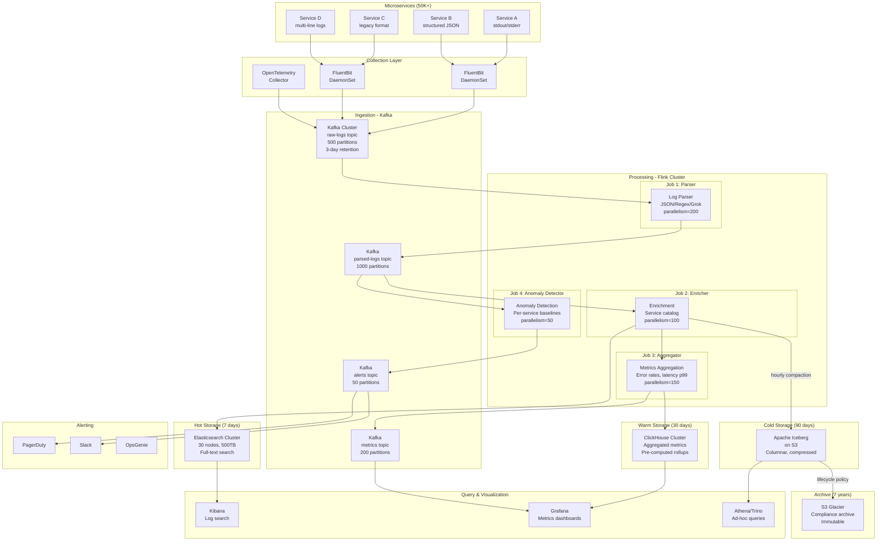
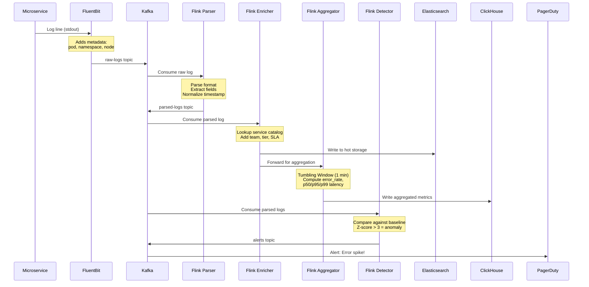
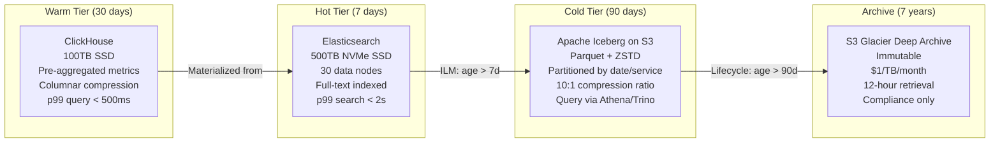
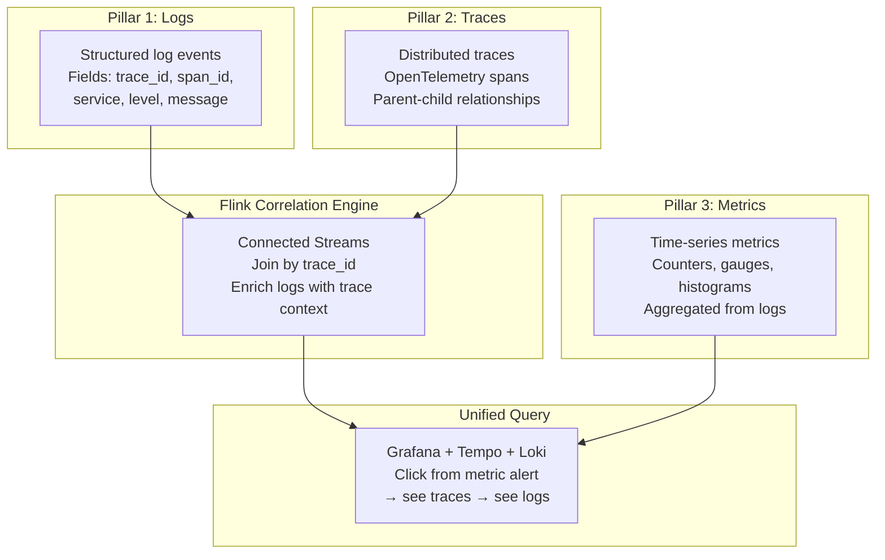

# Log Analytics & Observability Pipeline at Scale

> Building a production-grade log analytics platform processing 10TB+ logs/day from 50K+ microservices — real-time error detection, latency monitoring, and full observability correlation (Datadog/Splunk/Elastic style).

---

## Problem Statement

### The Challenge

Modern microservice architectures generate massive volumes of logs that must be processed in real-time for operational visibility:

- **Volume**: 10TB+ logs/day from 50K+ microservices
- **Variety**: JSON, structured, unstructured, multi-line (stack traces)
- **Velocity**: 1M+ log lines/second sustained, 10x spikes during incidents
- **Detection**: Identify service degradation within 5 seconds
- **Correlation**: Link logs ↔ traces ↔ metrics (3 pillars of observability)
- **Retention**: 7 days hot search, 90 days warm analytics, 7 years archive
- **Cost**: Companies spend $100M+/year on observability infrastructure

### Business Impact

| Metric | Impact |
|--------|--------|
| MTTR (Mean Time To Resolve) | From 45min → 5min with real-time log analytics |
| Incident Detection | From manual → automatic within seconds |
| Cost per GB ingested | $0.50 (Datadog) vs $0.05 (self-built with Flink) |
| Search latency | p99 < 2s across 7 days of data |
| False positive alerts | < 5% with ML-based anomaly detection |

### Real-World Scale Examples

| Company | Log Volume | Services | Stack |
|---------|-----------|----------|-------|
| Uber | 100TB/day | 4000+ | Kafka + Flink + ClickHouse |
| Netflix | 50TB/day | 1000+ | Kafka + Flink + Elasticsearch |
| Cloudflare | 40TB/day | 500+ | Kafka + Flink + ClickHouse |
| Datadog | 100PB+/day (all customers) | - | Custom streaming + ClickHouse |

---

## Architecture Diagram



---

## Pipeline Stages



---

## Flink Concepts Used

### 1. Tumbling Windows - Metric Aggregation

```
Every 1 minute, compute per-service metrics:
╔══════════════════╗╔══════════════════╗╔══════════════════╗
║ Window 10:00-01  ║║ Window 10:01-02  ║║ Window 10:02-03  ║
║                  ║║                  ║║                  ║
║ error_count: 45  ║║ error_count: 12  ║║ error_count: 890 ║◄─ ANOMALY!
║ p99_latency: 2ms ║║ p99_latency: 3ms ║║ p99_latency: 45s ║◄─ ANOMALY!
║ total_requests:  ║║ total_requests:  ║║ total_requests:  ║
║   50,000         ║║   48,000         ║║   52,000         ║
╚══════════════════╝╚══════════════════╝╚══════════════════╝
```

**Why Tumbling Windows**: Fixed boundaries provide consistent time-series data points that align perfectly with monitoring dashboards (1-min granularity matches Grafana refresh).

### 2. Process Function - Log Parsing

Multi-format log parsing requires custom logic that can't be expressed in simple map operations. Process functions give us:
- Access to timestamps for event-time assignment
- Side outputs for routing unparseable logs
- State for multi-line log assembly (stack traces)
- Timers for flushing incomplete multi-line buffers

### 3. Side Outputs - Multi-Sink Routing

```
                                  ┌─→ [ERROR/FATAL] → Elasticsearch (indexed immediately)
                                  │
Parsed Log ──→ Router ────────────├─→ [WARN] → Elasticsearch (batched, lower priority)
                                  │
                                  ├─→ [INFO/DEBUG] → S3/Iceberg (cold storage only)
                                  │
                                  ├─→ [metrics-like] → ClickHouse (aggregation)
                                  │
                                  └─→ [unparseable] → Dead letter queue
```

### 4. Keyed State - Per-Service Baselines

Each service maintains its own error rate baseline in keyed state:
- Rolling average error rate (exponential moving average)
- Standard deviation for anomaly threshold
- Last N windows of metrics for trend detection
- State is keyed by `service_name + environment`

### 5. Broadcast State - Dynamic Parsing Rules

New log formats are deployed constantly. Broadcast state allows:
- Adding new parsing rules without restarting the Flink job
- Rules are broadcast to ALL parallel instances simultaneously
- Each parallel instance applies matching rules to incoming logs
- Rules stored in a control topic in Kafka

### 6. Window Aggregation - Streaming Percentiles

Computing p50/p95/p99 latency in a streaming window is non-trivial:
- Can't sort all values (memory explosion at scale)
- Use approximate algorithms: T-Digest or DDSketch
- Mergeable across parallel instances
- Bounded memory regardless of data volume

### 7. Async I/O - Service Catalog Enrichment

Log enrichment requires looking up service metadata:
- Service name → team, tier, SLA level, oncall rotation
- Async I/O prevents blocking the processing pipeline
- Cache frequently accessed services (LRU cache in operator)
- Fallback to default metadata if lookup fails (don't block pipeline)

### 8. Connected Streams - Log-Trace Correlation

Correlating logs with distributed traces:
- Log stream (high volume, 1M/sec)
- Trace stream (lower volume, 100K/sec)
- Connected by trace_id
- Enriched logs include span context (parent service, duration)
- Enables "show me all logs for this slow trace" queries

---

## Production Code Examples

### Multi-Format Log Parser

```java
public class MultiFormatLogParser extends ProcessFunction<RawLog, ParsedLog> {
    
    // State for multi-line log assembly
    private ValueState<StringBuilder> multiLineBuffer;
    private ValueState<Long> multiLineTimer;
    
    // Side output for unparseable logs
    private static final OutputTag<RawLog> UNPARSEABLE = 
        new OutputTag<>("unparseable") {};
    private static final OutputTag<ParsedLog> HIGH_SEVERITY = 
        new OutputTag<>("high-severity") {};
    
    // Parsing rules from broadcast state
    private MapState<String, ParsingRule> parsingRules;
    
    @Override
    public void open(Configuration parameters) {
        multiLineBuffer = getRuntimeContext().getState(
            new ValueStateDescriptor<>("ml-buffer", StringBuilder.class));
        multiLineTimer = getRuntimeContext().getState(
            new ValueStateDescriptor<>("ml-timer", Long.class));
    }
    
    @Override
    public void processElement(RawLog raw, Context ctx, Collector<ParsedLog> out) 
            throws Exception {
        
        // Check if this is a continuation of a multi-line log (stack trace)
        if (isMultiLineContinuation(raw.getMessage())) {
            appendToMultiLine(raw, ctx);
            return;
        }
        
        // Flush any pending multi-line buffer
        flushMultiLineBuffer(ctx, out);
        
        // Try parsing in order: JSON → structured → regex → grok
        ParsedLog parsed = null;
        
        // 1. Try JSON parsing (fastest, most common)
        if (raw.getMessage().startsWith("{")) {
            parsed = parseJson(raw);
        }
        
        // 2. Try structured format (key=value pairs)
        if (parsed == null) {
            parsed = parseStructured(raw);
        }
        
        // 3. Try regex patterns from dynamic rules
        if (parsed == null) {
            parsed = parseWithDynamicRules(raw);
        }
        
        // 4. Fallback: treat as unstructured text
        if (parsed == null) {
            parsed = parseUnstructured(raw);
        }
        
        // Route based on severity
        if (parsed.getSeverity() == Severity.ERROR || 
            parsed.getSeverity() == Severity.FATAL) {
            ctx.output(HIGH_SEVERITY, parsed);
        }
        
        // Emit to main output
        out.collect(parsed);
    }
    
    private ParsedLog parseJson(RawLog raw) {
        try {
            JsonNode node = objectMapper.readTree(raw.getMessage());
            return ParsedLog.builder()
                .timestamp(extractTimestamp(node))
                .service(raw.getService())
                .level(extractLevel(node))
                .message(extractMessage(node))
                .traceId(node.path("trace_id").asText(null))
                .spanId(node.path("span_id").asText(null))
                .fields(extractFields(node))
                .build();
        } catch (Exception e) {
            return null; // Not valid JSON
        }
    }
    
    @Override
    public void onTimer(long timestamp, OnTimerContext ctx, 
                       Collector<ParsedLog> out) throws Exception {
        // Flush multi-line buffer after 2-second timeout
        flushMultiLineBuffer(ctx, out);
    }
}
```

### Real-Time Percentile Computation (DDSketch)

```java
public class LatencyPercentileAggregator 
        implements AggregateFunction<ParsedLog, LatencyAccumulator, ServiceMetrics> {
    
    @Override
    public LatencyAccumulator createAccumulator() {
        return new LatencyAccumulator();
    }
    
    @Override
    public LatencyAccumulator add(ParsedLog log, LatencyAccumulator acc) {
        acc.totalCount++;
        
        if (log.getLatencyMs() != null) {
            acc.sketch.accept(log.getLatencyMs());
            acc.latencyCount++;
        }
        
        if (log.getSeverity() == Severity.ERROR || 
            log.getSeverity() == Severity.FATAL) {
            acc.errorCount++;
        }
        
        // Track status codes
        acc.statusCounts.merge(log.getStatusCode(), 1L, Long::sum);
        
        return acc;
    }
    
    @Override
    public ServiceMetrics getResult(LatencyAccumulator acc) {
        return ServiceMetrics.builder()
            .totalRequests(acc.totalCount)
            .errorCount(acc.errorCount)
            .errorRate((double) acc.errorCount / acc.totalCount)
            .p50Latency(acc.sketch.getValueAtQuantile(0.50))
            .p95Latency(acc.sketch.getValueAtQuantile(0.95))
            .p99Latency(acc.sketch.getValueAtQuantile(0.99))
            .p999Latency(acc.sketch.getValueAtQuantile(0.999))
            .statusCounts(acc.statusCounts)
            .build();
    }
    
    @Override
    public LatencyAccumulator merge(LatencyAccumulator a, LatencyAccumulator b) {
        a.totalCount += b.totalCount;
        a.errorCount += b.errorCount;
        a.latencyCount += b.latencyCount;
        a.sketch.mergeWith(b.sketch); // DDSketch is mergeable!
        b.statusCounts.forEach((k, v) -> a.statusCounts.merge(k, v, Long::sum));
        return a;
    }
}

// Accumulator with DDSketch for approximate percentiles
public class LatencyAccumulator {
    DDSketch sketch = DDSketches.unboundedDense(0.01); // 1% relative accuracy
    long totalCount = 0;
    long errorCount = 0;
    long latencyCount = 0;
    Map<Integer, Long> statusCounts = new HashMap<>();
}
```

### Error Rate Anomaly Detection

```java
public class ErrorRateAnomalyDetector 
        extends KeyedProcessFunction<String, ServiceMetrics, Alert> {
    
    // Per-service baseline state
    private ValueState<Double> movingAvgErrorRate;
    private ValueState<Double> movingStdDev;
    private ValueState<Long> windowCount;
    private ListState<Double> recentErrorRates; // Last 60 windows (1 hour)
    
    private static final double Z_SCORE_THRESHOLD = 3.0;
    private static final int WARMUP_WINDOWS = 10; // Need 10 min baseline
    
    @Override
    public void open(Configuration params) {
        movingAvgErrorRate = getRuntimeContext().getState(
            new ValueStateDescriptor<>("avg-error-rate", Double.class, 0.0));
        movingStdDev = getRuntimeContext().getState(
            new ValueStateDescriptor<>("std-dev", Double.class, 0.0));
        windowCount = getRuntimeContext().getState(
            new ValueStateDescriptor<>("window-count", Long.class, 0L));
        recentErrorRates = getRuntimeContext().getListState(
            new ListStateDescriptor<>("recent-rates", Double.class));
    }
    
    @Override
    public void processElement(ServiceMetrics metrics, Context ctx, 
                              Collector<Alert> out) throws Exception {
        
        long count = windowCount.value() + 1;
        windowCount.update(count);
        
        double currentErrorRate = metrics.getErrorRate();
        
        // Add to recent history
        recentErrorRates.add(currentErrorRate);
        
        // Trim to last 60 windows
        List<Double> recent = new ArrayList<>();
        recentErrorRates.get().forEach(recent::add);
        if (recent.size() > 60) {
            recent = recent.subList(recent.size() - 60, recent.size());
            recentErrorRates.update(recent);
        }
        
        // Update exponential moving average (alpha = 0.1)
        double alpha = 0.1;
        double prevAvg = movingAvgErrorRate.value();
        double newAvg = alpha * currentErrorRate + (1 - alpha) * prevAvg;
        movingAvgErrorRate.update(newAvg);
        
        // Update standard deviation
        double prevStd = movingStdDev.value();
        double diff = currentErrorRate - newAvg;
        double newStd = Math.sqrt(alpha * diff * diff + (1 - alpha) * prevStd * prevStd);
        movingStdDev.update(newStd);
        
        // Only alert after warmup period
        if (count < WARMUP_WINDOWS) return;
        
        // Compute Z-score
        double zScore = newStd > 0 ? (currentErrorRate - newAvg) / newStd : 0;
        
        if (zScore > Z_SCORE_THRESHOLD && currentErrorRate > 0.01) { // > 1% absolute
            Alert alert = Alert.builder()
                .service(ctx.getCurrentKey())
                .severity(zScore > 5.0 ? Severity.CRITICAL : Severity.WARNING)
                .metric("error_rate")
                .currentValue(currentErrorRate)
                .baseline(newAvg)
                .zScore(zScore)
                .message(String.format(
                    "Error rate spike: %.2f%% (baseline: %.2f%%, z-score: %.1f)",
                    currentErrorRate * 100, newAvg * 100, zScore))
                .timestamp(ctx.timestamp())
                .build();
            
            out.collect(alert);
        }
        
        // Also check latency anomalies
        if (metrics.getP99Latency() > 0) {
            checkLatencyAnomaly(metrics, ctx, out);
        }
    }
}
```

### Multi-Sink Routing with Side Outputs

```java
public class LogRoutingJob {
    
    public static void main(String[] args) throws Exception {
        StreamExecutionEnvironment env = StreamExecutionEnvironment.getExecutionEnvironment();
        
        // Configure for production
        env.enableCheckpointing(60_000); // 1 minute
        env.setRestartStrategy(RestartStrategies.exponentialDelayRestart(
            Duration.ofSeconds(1), Duration.ofMinutes(5), 2.0, Duration.ofMinutes(10), 0.1));
        
        // Source: Kafka raw logs
        KafkaSource<RawLog> source = KafkaSource.<RawLog>builder()
            .setBootstrapServers("kafka:9092")
            .setTopics("raw-logs")
            .setGroupId("log-pipeline-v2")
            .setStartingOffsets(OffsetsInitializer.committedOffsets(
                OffsetResetStrategy.LATEST))
            .setDeserializer(new RawLogDeserializer())
            .build();
        
        DataStream<RawLog> rawLogs = env.fromSource(
            source, WatermarkStrategy.forMonotonousTimestamps(), "kafka-source");
        
        // Parse logs
        OutputTag<RawLog> unparseable = new OutputTag<>("unparseable") {};
        OutputTag<ParsedLog> highSeverity = new OutputTag<>("high-severity") {};
        
        SingleOutputStreamOperator<ParsedLog> parsed = rawLogs
            .process(new MultiFormatLogParser())
            .uid("log-parser")
            .name("Multi-Format Parser")
            .setParallelism(200);
        
        // Get side outputs
        DataStream<RawLog> deadLetterLogs = parsed.getSideOutput(unparseable);
        DataStream<ParsedLog> criticalLogs = parsed.getSideOutput(highSeverity);
        
        // Enrich with service metadata (async)
        DataStream<EnrichedLog> enriched = AsyncDataStream
            .unorderedWait(
                parsed,
                new ServiceCatalogLookup(),
                5, TimeUnit.SECONDS,
                1000) // max concurrent requests
            .uid("enrichment")
            .name("Service Catalog Enrichment")
            .setParallelism(100);
        
        // Route to Elasticsearch (all logs, 7-day retention)
        enriched
            .sinkTo(createElasticsearchSink())
            .uid("es-sink")
            .name("Elasticsearch Sink")
            .setParallelism(50);
        
        // Aggregate metrics per service per minute
        DataStream<ServiceMetrics> metrics = enriched
            .keyBy(log -> log.getService() + ":" + log.getEnvironment())
            .window(TumblingEventTimeWindows.of(Time.minutes(1)))
            .aggregate(new LatencyPercentileAggregator())
            .uid("1min-aggregation")
            .name("1-Minute Metrics Aggregation")
            .setParallelism(150);
        
        // Write metrics to ClickHouse
        metrics
            .addSink(new ClickHouseBatchSink(clickHouseConfig))
            .uid("ch-sink")
            .name("ClickHouse Metrics Sink")
            .setParallelism(30);
        
        // Anomaly detection on metrics
        DataStream<Alert> alerts = metrics
            .keyBy(ServiceMetrics::getServiceKey)
            .process(new ErrorRateAnomalyDetector())
            .uid("anomaly-detector")
            .name("Anomaly Detector")
            .setParallelism(50);
        
        // Route alerts to Kafka
        alerts.sinkTo(createAlertKafkaSink())
            .uid("alert-sink")
            .name("Alert Kafka Sink");
        
        // Cold storage: write to Iceberg (hourly compacted)
        enriched
            .sinkTo(createIcebergSink())
            .uid("iceberg-sink")
            .name("Iceberg Cold Storage")
            .setParallelism(40);
        
        // Dead letter queue
        deadLetterLogs
            .sinkTo(createDLQSink())
            .uid("dlq-sink")
            .name("Dead Letter Queue");
        
        env.execute("Log Analytics Pipeline v2.3.1");
    }
}
```

### Dynamic Parsing Rules via Broadcast State

```java
public class DynamicParsingRuleProcessor 
        extends BroadcastProcessFunction<RawLog, ParsingRule, ParsedLog> {
    
    private static final MapStateDescriptor<String, ParsingRule> RULES_STATE = 
        new MapStateDescriptor<>("parsing-rules", String.class, ParsingRule.class);
    
    @Override
    public void processElement(RawLog log, ReadOnlyContext ctx, 
                              Collector<ParsedLog> out) throws Exception {
        // Get current rules from broadcast state
        ReadOnlyBroadcastState<String, ParsingRule> rules = 
            ctx.getBroadcastState(RULES_STATE);
        
        // Try each rule until one matches
        for (Map.Entry<String, ParsingRule> entry : rules.immutableEntries()) {
            ParsingRule rule = entry.getValue();
            if (rule.matches(log.getService())) {
                ParsedLog parsed = rule.apply(log);
                if (parsed != null) {
                    out.collect(parsed);
                    return;
                }
            }
        }
        
        // Fallback: generic parsing
        out.collect(genericParse(log));
    }
    
    @Override
    public void processBroadcastElement(ParsingRule rule, Context ctx, 
                                       Collector<ParsedLog> out) throws Exception {
        // Update rules in broadcast state
        BroadcastState<String, ParsingRule> state = ctx.getBroadcastState(RULES_STATE);
        
        if (rule.isDeleted()) {
            state.remove(rule.getRuleId());
            LOG.info("Removed parsing rule: {}", rule.getRuleId());
        } else {
            state.put(rule.getRuleId(), rule);
            LOG.info("Updated parsing rule: {} for service pattern: {}", 
                    rule.getRuleId(), rule.getServicePattern());
        }
    }
}
```

---

## Storage Tiering Strategy



### Storage Cost Analysis (10TB/day ingested)

| Tier | Duration | Size | Cost/Month | Query Latency |
|------|----------|------|-----------|---------------|
| Hot (ES) | 7 days | 70TB raw | $15,000 (NVMe i3 instances) | < 2s |
| Warm (CH) | 30 days | 20TB (aggregated) | $3,000 (SSD) | < 500ms |
| Cold (Iceberg) | 90 days | 90TB (compressed) | $2,000 (S3 Standard) | 5-30s |
| Archive | 7 years | 2.5PB (compressed) | $2,500 (Glacier DA) | 12 hours |
| **Total** | - | - | **~$22,500/month** | - |

vs Datadog at $0.10/GB/day ingested: 10TB/day × $0.10/GB × 1000 × 30 = **$30M/month**

---

## Log Processing Challenges & Solutions

### 1. Heterogeneous Formats

```
Challenge: 50K services produce logs in different formats

Solution: Multi-stage parser with priority chain
┌─────────────────────────────────────────────────────────────┐
│ JSON (60%)  →  Try Jackson parse first (fastest)            │
│ Structured (25%)  →  Key=value regex parser                 │
│ Custom (10%)  →  Dynamic Grok rules from broadcast state    │
│ Unknown (5%)  →  Store raw, flag for rule creation          │
└─────────────────────────────────────────────────────────────┘
```

### 2. Volume Spikes During Incidents

```
Normal:    ████████░░ 1M logs/sec
Incident:  ████████████████████ 10M logs/sec (10x spike)

Solutions:
1. Kafka absorption (buffer spikes for 3+ days)
2. Flink reactive scaling (scale up within 2 min)
3. Priority-based processing (ERROR > WARN > INFO > DEBUG)
4. Sampling for DEBUG/INFO during spikes (1:100 sample)
5. Backpressure propagation (don't drop, just slow down)
```

### 3. Multi-Line Log Assembly

```
2024-01-15 10:23:45 ERROR PaymentService - Transaction failed
java.lang.NullPointerException: amount was null
    at com.company.payments.PaymentService.process(PaymentService.java:142)
    at com.company.payments.Handler.handle(Handler.java:56)
    at org.springframework.web.servlet.FrameworkServlet.service(FrameworkServlet.java:897)
Caused by: java.lang.IllegalStateException: Invalid state
    at com.company.payments.Validator.validate(Validator.java:89)
    ... 15 more

Solution: Timer-based assembly in ProcessFunction
- First line (has timestamp) → create new buffer
- Continuation lines (start with whitespace/at/Caused) → append to buffer  
- Next first line OR 2-second timer → flush assembled log
```

### 4. Deduplication

```
Problem: Same log collected by multiple FluentBit instances (overlapping DaemonSets)

Solution: Content-based deduplication
- Hash: SHA256(timestamp + service + message_first_100_chars)
- Store hash in MapState with 5-minute TTL
- Duplicate detected → drop silently
- Memory: ~50 bytes per hash × 1M hashes = 50MB per parallel instance
```

---

## Correlation: Three Pillars of Observability



### Correlation Implementation in Flink

```java
// Connect log stream with trace stream
DataStream<EnrichedLog> correlatedLogs = logStream
    .connect(traceStream)
    .keyBy(
        log -> log.getTraceId(),   // Key logs by trace_id
        trace -> trace.getTraceId() // Key traces by trace_id
    )
    .process(new LogTraceCorrelator())
    .uid("log-trace-correlator");

public class LogTraceCorrelator 
        extends KeyedCoProcessFunction<String, ParsedLog, TraceSpan, EnrichedLog> {
    
    // Cache trace spans for 5 minutes (logs may arrive after trace)
    private MapState<String, TraceSpan> spanCache;
    
    @Override
    public void processElement1(ParsedLog log, Context ctx, 
                               Collector<EnrichedLog> out) throws Exception {
        // Try to find matching span
        TraceSpan span = spanCache.get(log.getSpanId());
        
        EnrichedLog enriched = EnrichedLog.from(log);
        if (span != null) {
            enriched.setParentService(span.getParentService());
            enriched.setSpanDuration(span.getDuration());
            enriched.setTraceStatus(span.getStatus());
        }
        out.collect(enriched);
    }
    
    @Override
    public void processElement2(TraceSpan span, Context ctx, 
                               Collector<EnrichedLog> out) throws Exception {
        // Cache span for future log correlation
        spanCache.put(span.getSpanId(), span);
        
        // Set TTL timer to clean up
        ctx.timerService().registerProcessingTimeTimer(
            ctx.timerService().currentProcessingTime() + 300_000); // 5 min
    }
}
```

---

## Scaling for 10TB/Day

### Capacity Planning

```
Input: 10TB/day = 115 MB/sec sustained = ~1M log lines/sec (avg 115 bytes compressed)

Kafka:
- 500 partitions for raw-logs topic (2MB/sec per partition headroom)
- 3 brokers minimum, 10 recommended for throughput
- 3-day retention = 30TB (with replication factor 3 = 90TB disk)

Flink Parser Job:
- 200 parallelism (5K logs/sec per subtask)
- 200 TaskManager slots
- 2GB heap per slot = 400GB total heap
- RocksDB for multi-line buffer state

Flink Aggregator Job:
- 150 parallelism (50K services × state per service)
- State size: ~500MB (DDSketch + baselines per service)

Flink Anomaly Detector:
- 50 parallelism (lower throughput, higher compute per event)
- State: ~200MB (baselines + history)

Elasticsearch:
- 30 data nodes × 16TB NVMe = 480TB raw capacity
- Replicas: 1 (2x storage = 960TB)
- Usable with 50% headroom: 240TB → 7 days of 10TB/day ✓
```

### Resource Configuration

```yaml
# Flink Parser Job
taskmanager.memory.process.size: 8192m
taskmanager.memory.task.heap.size: 2048m
taskmanager.numberOfTaskSlots: 4
parallelism.default: 200

# Kafka consumer tuning for high throughput
kafka.consumer.fetch.max.bytes: 52428800       # 50MB
kafka.consumer.max.partition.fetch.bytes: 10485760  # 10MB
kafka.consumer.max.poll.records: 10000
```

---

## Monitoring the Log Pipeline Itself

### Key Metrics

| Metric | Warning | Critical | Action |
|--------|---------|----------|--------|
| Kafka consumer lag (raw-logs) | > 100K msgs | > 1M msgs | Scale up parser |
| Parse failure rate | > 2% | > 10% | Check new log formats |
| ES indexing latency | > 5s | > 30s | Check ES cluster health |
| Anomaly false positive rate | > 10% | > 25% | Retune thresholds |
| End-to-end latency (log → dashboard) | > 30s | > 2min | Check backpressure |
| Dead letter queue growth | > 1K/min | > 10K/min | Add parsing rules |

### Prometheus Alerts

```yaml
groups:
  - name: log-pipeline-alerts
    rules:
      - alert: LogPipelineConsumerLagCritical
        expr: flink_taskmanager_job_task_operator_KafkaSourceReader_commitsSucceeded 
              - on(topic) kafka_consumer_group_lag > 1000000
        for: 5m
        labels:
          severity: critical
        annotations:
          summary: "Log pipeline falling behind - lag > 1M messages"
          
      - alert: ParseFailureRateHigh
        expr: |
          rate(log_parse_failures_total[5m]) / 
          rate(log_parse_attempts_total[5m]) > 0.10
        for: 3m
        labels:
          severity: critical
        annotations:
          summary: "Log parse failure rate > 10% - check for new formats"
          
      - alert: AnomalyDetectorDown
        expr: flink_jobmanager_job_uptime{job_name="anomaly-detector"} == 0
        for: 1m
        labels:
          severity: critical
        annotations:
          summary: "Anomaly detector job is down - no alerts being generated"
```

---

## Real Companies

| Company | Implementation | Scale | Key Innovation |
|---------|---------------|-------|----------------|
| **Datadog** | Custom streaming (Kafka + Go consumers + ClickHouse) | 100PB+/day | Log Patterns (ML clustering) |
| **Elastic** | Elasticsearch + Beats + Logstash | Varies | Full-text search excellence |
| **Uber** | Kafka + Flink + ClickHouse (uMonitor) | 100TB/day | Anomaly detection on all metrics |
| **Cloudflare** | Kafka + Flink + ClickHouse | 40TB/day | Real-time DDoS detection from logs |
| **Netflix** | Kafka + Flink + Elasticsearch (Atlas) | 50TB/day | Unified telemetry platform |
| **Stripe** | Kafka + Flink + Elasticsearch | 10TB/day | Financial audit integration |
| **Coinbase** | Kafka + Flink + BigQuery | 5TB/day | Compliance-grade audit trail |

---

## Summary

The log analytics pipeline demonstrates Flink's ability to handle:
- **Multi-format parsing** at 1M lines/sec with Process Functions
- **Real-time aggregation** using Tumbling Windows + DDSketch
- **Anomaly detection** with per-service Keyed State baselines
- **Dynamic configuration** via Broadcast State for parsing rules
- **Multi-sink routing** using Side Outputs for tiered storage
- **Cross-signal correlation** with Connected Streams (logs + traces)

This architecture reduces observability costs by 100x compared to SaaS solutions while providing equal or better detection latency for critical services.
