# Dynamic Pricing Engine Pipeline at Scale

## 1. Problem Statement

### The Challenge

Compute **1M+ price updates per second** across 100K+ geographic zones/product SKUs, incorporating real-time supply/demand signals, competitor prices, historical patterns, weather, events, and regulatory constraints — all within **500ms of any condition change**.

### Industry Context

| Company | Scale | Challenge |
|---------|-------|-----------|
| **Uber** | 14M+ rides/day, millions of concurrent riders/drivers | Surge pricing must balance supply-demand in real-time across 10K+ zones per city |
| **Airlines** | 200M+ fare combinations repriced daily | Revenue management across routes, classes, time horizons |
| **Airbnb** | 7M+ listings, dynamic demand | Smart Pricing suggests optimal nightly rates |
| **Amazon** | 350M+ products, prices change 2.5M times/day | Competitive pricing while maintaining margins |
| **Hotels** | 700K+ properties, seasonal + event-driven demand | Revenue management per room-night |

### Requirements

```
Functional:
- Compute optimal price given real-time supply, demand, competition, external signals
- Update price within 500ms of condition change (surge event, inventory drop, competitor change)
- Support multiple pricing strategies per zone/product (A/B testing)
- Provide price explanation for every update (regulatory, customer support)
- Enforce fairness constraints (price caps, anti-discrimination, geographical equity)

Non-Functional:
- Throughput: 1M price updates/second sustained, 5M burst
- Latency: P50 < 100ms, P99 < 500ms from signal to price publish
- Availability: 99.99% (< 52 min downtime/year)
- Consistency: Eventual (stale price acceptable for 2-5 seconds, not minutes)
- Explainability: Every price must have audit trail of factors
```

### Why This Is Hard

1. **Combinatorial explosion**: Zones x Time-of-day x Day-of-week x Events x Weather = millions of pricing contexts
2. **Conflicting objectives**: Maximize revenue vs. maintain fairness vs. retain customers
3. **Feedback loops**: Price changes affect demand, which affects price (oscillation risk)
4. **Regulatory landscape**: EU Digital Services Act, US state price gouging laws, airline fare transparency rules
5. **Cold start**: New zones/products with no demand history
6. **Real-time ML**: Demand forecasting models must score in < 50ms

---

## 2. Architecture Diagram

### High-Level System Architecture

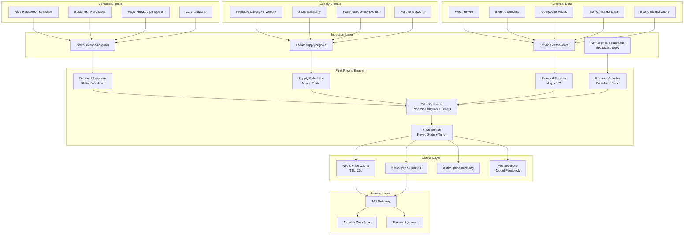

### Detailed Flink Job DAG

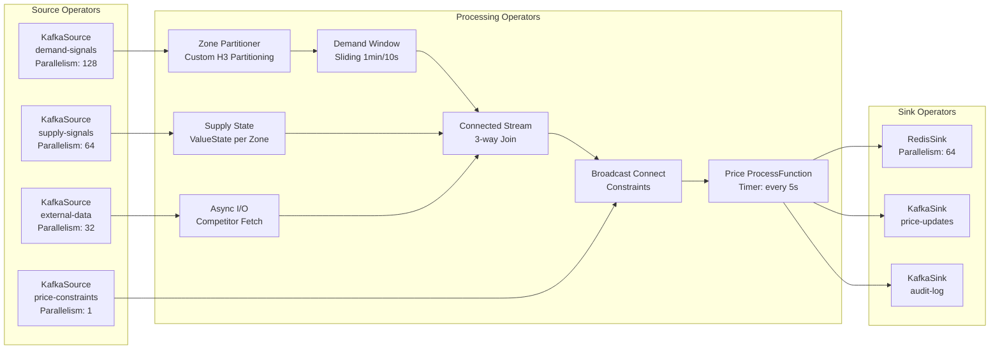

---

## 3. Pricing Pipeline Flow

### End-to-End Signal-to-Price Flow

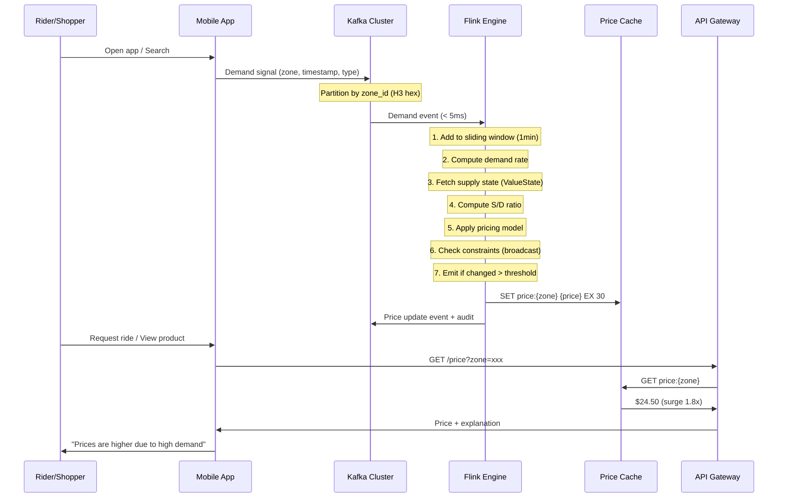

### Timing Breakdown (Target: < 500ms total)

```
Signal Generation:           ~10ms  (app → kafka producer)
Kafka Ingestion:             ~5ms   (producer → broker → consumer)
Flink Window Processing:     ~50ms  (add to window, compute aggregate)
Supply-Demand Computation:   ~20ms  (state lookup + ratio calc)
ML Model Scoring:            ~50ms  (async, pre-fetched)
Constraint Checking:         ~10ms  (broadcast state lookup)
Price Emission:              ~5ms   (state update + downstream)
Redis Write:                 ~3ms   (pipeline write)
─────────────────────────────────────────────────
Total Pipeline Latency:      ~153ms (P50)
                             ~350ms (P95)
                             ~480ms (P99)
```

### Price Update Decision Logic

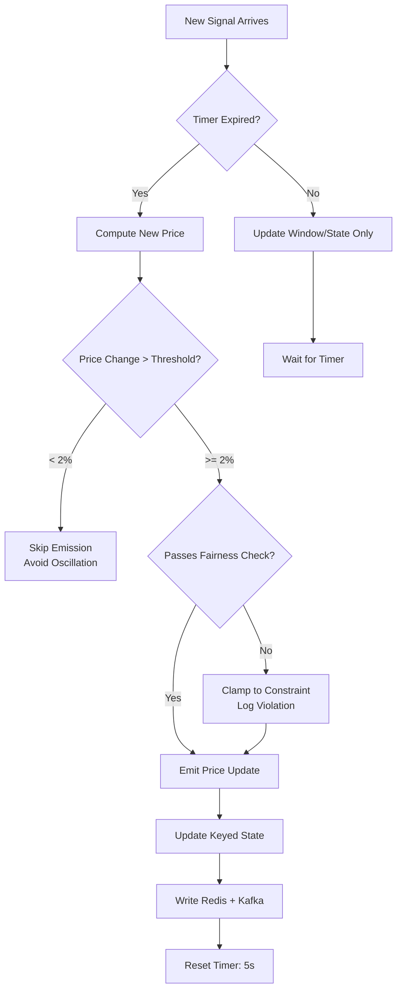

---

## 4. Flink Concepts Used

### 4.1 Process Function with Timers

**Why**: Prices should not update on every single event (oscillation). Instead, we recalculate at fixed intervals (e.g., every 5 seconds) using the latest accumulated state.

**How it works**: A `KeyedProcessFunction` registered per zone/product. On each incoming event, state is updated. A processing-time timer fires every N seconds, triggering price recalculation using all accumulated signals.

```
Timer fires every 5s → Read demand window aggregate + supply state → 
Compute price → Compare with last emitted price → Emit if changed significantly
```

**Why timers instead of pure event-driven**:
- Prevents price oscillation (rapid up/down on individual events)
- Smooths demand signal noise
- Provides deterministic recalculation cadence
- Allows batching of downstream writes (Redis, Kafka)

### 4.2 Sliding Windows

**Why**: Demand must be estimated over a rolling time period, not instantaneously. A single burst of requests shouldn't spike the price if it's transient.

**Configuration**: 1-minute window, sliding every 10 seconds. This gives 6 overlapping windows, each providing a demand snapshot. The pricing function uses the latest completed window plus partial current window with decay weighting.

**Why sliding over tumbling**: Tumbling windows create "cliff effects" at boundaries. A demand spike at minute :59 would disappear at :00. Sliding windows provide continuous, smooth demand estimation.

### 4.3 Connected Streams (3-way)

**Why**: Price computation requires joining three independent streams — demand, supply, and external data — keyed by the same zone/product.

**Challenge**: True 3-way stream joins don't exist natively in Flink. Implementation uses chained `connect()`:

```
demandStream.connect(supplyStream)  → intermediate CoProcessFunction
intermediate.connect(externalStream) → final pricing CoProcessFunction
```

Each side maintains its own state, and the process function accesses all states when computing price. Events from any stream can trigger a re-evaluation.

### 4.4 Heap State Backend

**Why heap over RocksDB for pricing**:

| Aspect | Heap | RocksDB |
|--------|------|---------|
| Read latency | ~100ns (direct memory) | ~10-50μs (serialization + disk) |
| Write latency | ~100ns | ~5-20μs |
| State size limit | JVM heap (bounded) | Disk (unbounded) |
| GC pressure | Higher | Lower |
| Checkpoint speed | Slower (full copy) | Faster (incremental) |

**Decision**: Pricing state per zone is small (~2KB: current price, demand count, supply count, last update timestamp, constraints). With 100K zones, total state is ~200MB — easily fits in heap. The 100x read latency advantage justifies GC tuning cost.

### 4.5 Custom Partitioning

**Why**: Default hash partitioning distributes zones randomly. Geographic zones that are adjacent should be on the same TaskManager for:
- Cross-zone smoothing (neighboring zone prices shouldn't differ by 10x)
- Efficient state access for geographic clustering algorithms
- Co-located processing of demand spillover between adjacent zones

**Implementation**: Custom `Partitioner<String>` using H3 hexagonal index resolution reduction. Zones sharing a parent hex at resolution 4 (from resolution 7) are routed to the same partition.

### 4.6 Broadcast State

**Why**: Price constraints (caps, floors, regulatory limits, global multiplier caps) change infrequently but must be immediately available to all parallel instances without re-keying.

**Contents of broadcast state**:
- Per-zone price caps (regulatory: e.g., 5x max surge in NYC)
- Global surge multiplier ceiling
- Time-based constraints (no surge during emergencies)
- A/B test configurations (which zones get which pricing model)
- Feature flags (enable/disable competitor-aware pricing)

**Update frequency**: Minutes to hours. Pushed via dedicated Kafka topic.

### 4.7 Async I/O

**Why**: Competitor prices and ML model scores require external calls (HTTP/gRPC). Blocking the processing thread would destroy throughput.

**Usage**:
- Fetch competitor prices from scraping service (50-200ms latency)
- Score demand forecast ML model (20-50ms latency)
- Lookup historical baseline from feature store (10-30ms latency)

**Configuration**: Unordered results (pricing is idempotent), capacity of 100 concurrent requests per operator instance, timeout 500ms with fallback to cached value.

### 4.8 Keyed State (ValueState)

**Purpose**: Maintain per-zone/product pricing state that persists across events:

```
ValueState<PricingState>:
  - currentPrice: double
  - lastDemandRate: double
  - lastSupplyCount: int
  - lastUpdateTimestamp: long
  - priceHistory: CircularBuffer<PricePoint>(size=10)
  - consecutiveIncreases: int (for dampening)
  - modelVersion: String
```

This state is checkpointed, so on failover the pricing engine recovers to the last consistent state without cold-start repricing.

### 4.9 Event Time Processing

**Why**: Demand signals may arrive out of order (network delays, mobile app buffering). A rider's request generated at T=0 might arrive at T=3s. Without event-time processing, the demand window would place it in the wrong bucket.

**Watermark strategy**: Bounded out-of-orderness (5 seconds). Signals arriving > 5s late are dropped (acceptable: one stale signal won't materially affect demand estimation over a 1-minute window).

### 4.10 Operator Chaining

**Why**: Every operator boundary requires serialization → network transfer → deserialization. For a latency-critical pipeline, chaining operators that run on the same parallelism eliminates this overhead.

**Chained operators** (same slot):
```
DemandWindowAggregator → DemandRateComputer → PriceOptimizer → ConstraintChecker
```

**Unchained** (different parallelism or requires shuffle):
```
KafkaSource (128) ↛ ZonePartitioner (shuffle) ↛ Processing Chain (256)
```

Savings: ~2-5ms per eliminated boundary at P99.

---

## 5. Production Code Examples

### 5.1 Demand Estimation Using Sliding Windows

```java
public class DemandEstimationJob {

    public static DataStream<DemandEstimate> estimateDemand(
            DataStream<DemandSignal> demandStream) {

        return demandStream
            .assignTimestampsAndWatermarks(
                WatermarkStrategy.<DemandSignal>forBoundedOutOfOrderness(
                    Duration.ofSeconds(5))
                .withTimestampAssigner((signal, ts) -> signal.getEventTime())
                .withIdleness(Duration.ofSeconds(30))
            )
            .keyBy(DemandSignal::getZoneId)
            .window(SlidingEventTimeWindows.of(
                Time.minutes(1),   // window size
                Time.seconds(10)   // slide interval
            ))
            .aggregate(
                new DemandAggregator(),
                new DemandWindowFunction()
            );
    }
}

/**
 * Incremental aggregator: maintains running counts without buffering all events.
 * Memory-efficient for high-throughput zones (100K+ events/min in popular zones).
 */
public class DemandAggregator implements
        AggregateFunction<DemandSignal, DemandAccumulator, DemandMetrics> {

    @Override
    public DemandAccumulator createAccumulator() {
        return new DemandAccumulator();
    }

    @Override
    public DemandAccumulator add(DemandSignal signal, DemandAccumulator acc) {
        acc.totalRequests++;
        acc.weightedRequests += signal.getUrgencyWeight(); // higher for immediate needs
        acc.uniqueUsers.add(signal.getUserIdHash());       // HyperLogLog for cardinality

        // Track demand by sub-category (ride type, fare class, product category)
        acc.categoryDemand.merge(signal.getCategory(), 1L, Long::sum);

        // Track temporal distribution within window for burst detection
        long bucket = signal.getEventTime() / 10_000; // 10s buckets
        acc.temporalBuckets.merge(bucket, 1, Integer::sum);

        return acc;
    }

    @Override
    public DemandMetrics getResult(DemandAccumulator acc) {
        double burstFactor = computeBurstFactor(acc.temporalBuckets);
        return new DemandMetrics(
            acc.totalRequests,
            acc.weightedRequests,
            acc.uniqueUsers.cardinality(),
            acc.categoryDemand,
            burstFactor
        );
    }

    @Override
    public DemandAccumulator merge(DemandAccumulator a, DemandAccumulator b) {
        a.totalRequests += b.totalRequests;
        a.weightedRequests += b.weightedRequests;
        a.uniqueUsers.merge(b.uniqueUsers);
        b.categoryDemand.forEach((k, v) -> a.categoryDemand.merge(k, v, Long::sum));
        b.temporalBuckets.forEach((k, v) -> a.temporalBuckets.merge(k, v, Integer::sum));
        return a;
    }

    private double computeBurstFactor(Map<Long, Integer> buckets) {
        if (buckets.isEmpty()) return 1.0;
        int max = Collections.max(buckets.values());
        double avg = buckets.values().stream().mapToInt(i -> i).average().orElse(1.0);
        return Math.min(max / Math.max(avg, 1.0), 3.0); // cap burst factor at 3x
    }
}

/**
 * Window function adds window metadata to the aggregated result.
 */
public class DemandWindowFunction extends ProcessWindowFunction<
        DemandMetrics, DemandEstimate, String, TimeWindow> {

    @Override
    public void process(String zoneId, Context ctx, Iterable<DemandMetrics> input,
                       Collector<DemandEstimate> out) {
        DemandMetrics metrics = input.iterator().next(); // single aggregate
        TimeWindow window = ctx.window();

        double requestRate = metrics.getTotalRequests() /
            ((window.getEnd() - window.getStart()) / 1000.0); // requests/sec

        out.collect(new DemandEstimate(
            zoneId,
            requestRate,
            metrics.getWeightedRequests(),
            metrics.getUniqueUsers(),
            metrics.getBurstFactor(),
            metrics.getCategoryDemand(),
            window.getEnd(),
            ctx.currentWatermark()
        ));
    }
}
```

### 5.2 Supply-Demand Ratio Computation with Smoothing

```java
/**
 * Computes supply-demand ratio per zone with exponential smoothing
 * to prevent price oscillation from noisy signals.
 */
public class SupplyDemandRatioFunction extends KeyedCoProcessFunction<
        String, DemandEstimate, SupplyUpdate, SupplyDemandRatio> {

    // Per-zone state
    private ValueState<Double> smoothedDemandRate;
    private ValueState<Integer> currentSupply;
    private ValueState<Double> lastRatio;
    private ValueState<Long> lastEmitTime;

    // Exponential smoothing factor (0.3 = 30% new, 70% historical)
    private static final double ALPHA = 0.3;
    // Minimum change to emit update (prevents oscillation)
    private static final double RATIO_CHANGE_THRESHOLD = 0.05;
    // Minimum supply to prevent division-by-zero spikes
    private static final int MIN_SUPPLY_FLOOR = 1;

    @Override
    public void open(Configuration params) {
        smoothedDemandRate = getRuntimeContext().getState(
            new ValueStateDescriptor<>("smoothed-demand", Double.class));
        currentSupply = getRuntimeContext().getState(
            new ValueStateDescriptor<>("current-supply", Integer.class));
        lastRatio = getRuntimeContext().getState(
            new ValueStateDescriptor<>("last-ratio", Double.class));
        lastEmitTime = getRuntimeContext().getState(
            new ValueStateDescriptor<>("last-emit-time", Long.class));
    }

    @Override
    public void processElement1(DemandEstimate demand, Context ctx,
                                Collector<SupplyDemandRatio> out) throws Exception {
        // Exponential moving average of demand rate
        Double prev = smoothedDemandRate.value();
        double smoothed = (prev == null)
            ? demand.getRequestRate()
            : ALPHA * demand.getRequestRate() + (1 - ALPHA) * prev;
        smoothedDemandRate.update(smoothed);

        maybeEmitRatio(ctx, out);
    }

    @Override
    public void processElement2(SupplyUpdate supply, Context ctx,
                                Collector<SupplyDemandRatio> out) throws Exception {
        currentSupply.update(supply.getAvailableCount());
        maybeEmitRatio(ctx, out);
    }

    private void maybeEmitRatio(Context ctx, Collector<SupplyDemandRatio> out)
            throws Exception {
        Double demand = smoothedDemandRate.value();
        Integer supply = currentSupply.value();

        if (demand == null || supply == null) return;

        int effectiveSupply = Math.max(supply, MIN_SUPPLY_FLOOR);
        double ratio = demand / effectiveSupply;

        Double previous = lastRatio.value();
        if (previous != null && Math.abs(ratio - previous) / previous < RATIO_CHANGE_THRESHOLD) {
            return; // change too small, skip
        }

        lastRatio.update(ratio);
        lastEmitTime.update(ctx.timerService().currentProcessingTime());

        String zoneId = ctx.getCurrentKey();
        out.collect(new SupplyDemandRatio(
            zoneId, ratio, demand, effectiveSupply,
            ctx.timerService().currentProcessingTime()
        ));
    }
}
```

### 5.3 Price Optimization with Constraints

```java
/**
 * Core pricing engine: converts supply-demand ratio into actual price
 * with multiple constraint layers and anti-oscillation dampening.
 */
public class PriceOptimizerFunction extends KeyedBroadcastProcessFunction<
        String, SupplyDemandRatio, PriceConstraint, PriceUpdate> {

    private ValueState<PricingState> pricingState;
    private static final MapStateDescriptor<String, PriceConstraint> CONSTRAINT_DESC =
        new MapStateDescriptor<>("constraints", String.class, PriceConstraint.class);

    @Override
    public void open(Configuration params) {
        pricingState = getRuntimeContext().getState(
            new ValueStateDescriptor<>("pricing-state", PricingState.class));
    }

    @Override
    public void processElement(SupplyDemandRatio ratio, ReadOnlyContext ctx,
                               Collector<PriceUpdate> out) throws Exception {
        String zoneId = ctx.getCurrentKey();
        PricingState state = getOrInitState(zoneId);

        // Step 1: Compute raw multiplier from S/D ratio
        double rawMultiplier = computeRawMultiplier(ratio.getRatio());

        // Step 2: Apply dampening (prevent sudden jumps)
        double dampenedMultiplier = applyDampening(rawMultiplier, state);

        // Step 3: Compute candidate price
        double basePrice = state.getBasePrice();
        double candidatePrice = basePrice * dampenedMultiplier;

        // Step 4: Apply constraints from broadcast state
        ReadOnlyBroadcastState<String, PriceConstraint> constraints =
            ctx.getBroadcastState(CONSTRAINT_DESC);

        PriceConstraint zoneConstraint = constraints.get(zoneId);
        PriceConstraint globalConstraint = constraints.get("GLOBAL");

        candidatePrice = applyConstraints(candidatePrice, basePrice,
            zoneConstraint, globalConstraint);

        // Step 5: Check if worth emitting (> 2% change from current)
        if (shouldEmitPrice(candidatePrice, state.getCurrentPrice())) {
            double finalPrice = roundToDisplayPrice(candidatePrice);
            double multiplier = finalPrice / basePrice;

            PriceUpdate update = PriceUpdate.builder()
                .zoneId(zoneId)
                .price(finalPrice)
                .multiplier(multiplier)
                .basePrice(basePrice)
                .demandRate(ratio.getDemandRate())
                .supplyCount(ratio.getSupplyCount())
                .sdRatio(ratio.getRatio())
                .rawMultiplier(rawMultiplier)
                .dampenedMultiplier(dampenedMultiplier)
                .constraintApplied(candidatePrice != basePrice * dampenedMultiplier)
                .timestamp(System.currentTimeMillis())
                .explanation(buildExplanation(ratio, rawMultiplier, multiplier))
                .build();

            out.collect(update);

            // Update state
            state.setCurrentPrice(finalPrice);
            state.setCurrentMultiplier(multiplier);
            state.setLastUpdateTime(System.currentTimeMillis());
            state.addToHistory(finalPrice);
            pricingState.update(state);
        }
    }

    @Override
    public void processBroadcastElement(PriceConstraint constraint, Context ctx,
                                        Collector<PriceUpdate> out) throws Exception {
        ctx.getBroadcastState(CONSTRAINT_DESC).put(constraint.getZoneId(), constraint);
    }

    /**
     * Piecewise linear multiplier function:
     * ratio < 0.5  → multiplier = 1.0 (surplus, no surge)
     * ratio 0.5-1.0 → linear 1.0 to 1.5
     * ratio 1.0-2.0 → linear 1.5 to 2.5
     * ratio 2.0-4.0 → linear 2.5 to 4.0
     * ratio > 4.0   → capped at 5.0
     */
    private double computeRawMultiplier(double ratio) {
        if (ratio <= 0.5) return 1.0;
        if (ratio <= 1.0) return 1.0 + (ratio - 0.5) * 1.0;      // 1.0 → 1.5
        if (ratio <= 2.0) return 1.5 + (ratio - 1.0) * 1.0;      // 1.5 → 2.5
        if (ratio <= 4.0) return 2.5 + (ratio - 2.0) * 0.75;     // 2.5 → 4.0
        return Math.min(5.0, 4.0 + (ratio - 4.0) * 0.25);        // cap at 5.0
    }

    /**
     * Dampening: limit rate of price increase to prevent shock.
     * Max 20% increase per update cycle, unlimited decrease (favor consumers).
     */
    private double applyDampening(double rawMultiplier, PricingState state) {
        double current = state.getCurrentMultiplier();
        if (current <= 0) return rawMultiplier;

        double maxIncrease = current * 1.20; // max 20% increase per cycle
        if (rawMultiplier > maxIncrease) {
            return maxIncrease;
        }
        return rawMultiplier;
    }

    private double applyConstraints(double price, double basePrice,
            PriceConstraint zone, PriceConstraint global) {
        double result = price;

        // Apply zone-specific constraints
        if (zone != null) {
            result = Math.max(result, zone.getMinPrice());
            result = Math.min(result, zone.getMaxPrice());
            double maxMultiplier = zone.getMaxMultiplier();
            result = Math.min(result, basePrice * maxMultiplier);
        }

        // Apply global constraints (regulatory)
        if (global != null) {
            double globalMax = basePrice * global.getMaxMultiplier();
            result = Math.min(result, globalMax);
            if (global.isEmergencyMode()) {
                result = basePrice; // No surge during declared emergencies
            }
        }

        return result;
    }

    private boolean shouldEmitPrice(double candidate, double current) {
        if (current <= 0) return true;
        return Math.abs(candidate - current) / current >= 0.02; // 2% threshold
    }

    private double roundToDisplayPrice(double price) {
        // Round to nearest $0.25 for clean display
        return Math.round(price * 4.0) / 4.0;
    }

    private String buildExplanation(SupplyDemandRatio ratio,
            double rawMultiplier, double finalMultiplier) {
        StringBuilder sb = new StringBuilder();
        sb.append(String.format("Demand: %.1f req/s, Supply: %d units. ",
            ratio.getDemandRate(), ratio.getSupplyCount()));
        if (finalMultiplier > 1.0) {
            sb.append(String.format("High demand (%.1fx ratio) resulted in %.1fx pricing. ",
                ratio.getRatio(), finalMultiplier));
        }
        if (finalMultiplier < rawMultiplier) {
            sb.append("Price was capped by constraints. ");
        }
        return sb.toString();
    }
}
```

### 5.4 Timer-Based Periodic Price Emission

```java
/**
 * Ensures every zone emits a price heartbeat even without new signals.
 * Prevents stale prices when demand drops to zero (price should decrease).
 * Also handles time-decay: if no demand for 30s, begin reducing surge.
 */
public class PeriodicPriceEmitter extends KeyedProcessFunction<
        String, PriceUpdate, PriceUpdate> {

    private ValueState<PriceUpdate> lastPrice;
    private ValueState<Long> lastSignalTime;
    private static final long TIMER_INTERVAL_MS = 5_000;  // every 5 seconds
    private static final long DECAY_START_MS = 30_000;    // start decay after 30s no signal
    private static final double DECAY_RATE = 0.85;        // 15% reduction per cycle

    @Override
    public void open(Configuration params) {
        lastPrice = getRuntimeContext().getState(
            new ValueStateDescriptor<>("last-price", PriceUpdate.class));
        lastSignalTime = getRuntimeContext().getState(
            new ValueStateDescriptor<>("last-signal", Long.class));
    }

    @Override
    public void processElement(PriceUpdate update, Context ctx,
                               Collector<PriceUpdate> out) throws Exception {
        lastPrice.update(update);
        lastSignalTime.update(ctx.timerService().currentProcessingTime());
        out.collect(update); // forward immediately

        // Register next timer
        long nextTimer = ctx.timerService().currentProcessingTime() + TIMER_INTERVAL_MS;
        ctx.timerService().registerProcessingTimeTimer(nextTimer);
    }

    @Override
    public void onTimer(long timestamp, OnTimerContext ctx,
                       Collector<PriceUpdate> out) throws Exception {
        PriceUpdate last = lastPrice.value();
        Long lastSignal = lastSignalTime.value();

        if (last == null) return;

        long timeSinceSignal = timestamp - (lastSignal != null ? lastSignal : 0);

        if (timeSinceSignal > DECAY_START_MS && last.getMultiplier() > 1.0) {
            // Decay surge back toward 1.0
            double newMultiplier = Math.max(1.0,
                (last.getMultiplier() - 1.0) * DECAY_RATE + 1.0);
            double newPrice = last.getBasePrice() * newMultiplier;

            PriceUpdate decayed = last.toBuilder()
                .price(newPrice)
                .multiplier(newMultiplier)
                .timestamp(timestamp)
                .explanation("Price decreasing: demand subsiding")
                .build();

            lastPrice.update(decayed);
            out.collect(decayed);
        }

        // Re-register timer for next cycle
        ctx.timerService().registerProcessingTimeTimer(timestamp + TIMER_INTERVAL_MS);
    }
}
```

### 5.5 Redis Price Cache Sink with TTL

```java
/**
 * High-performance Redis sink using pipelining and connection pooling.
 * Writes price with TTL so stale prices auto-expire if pipeline fails.
 */
public class RedisPriceSink extends RichSinkFunction<PriceUpdate> {

    private transient JedisPool jedisPool;
    private transient List<PriceUpdate> buffer;
    private static final int BATCH_SIZE = 100;
    private static final int TTL_SECONDS = 30;
    private static final int POOL_SIZE = 32;

    @Override
    public void open(Configuration params) {
        JedisPoolConfig poolConfig = new JedisPoolConfig();
        poolConfig.setMaxTotal(POOL_SIZE);
        poolConfig.setMaxIdle(POOL_SIZE);
        poolConfig.setMinIdle(POOL_SIZE / 2);
        poolConfig.setTestOnBorrow(false); // skip validation for speed
        poolConfig.setTestOnReturn(false);

        jedisPool = new JedisPool(poolConfig,
            params.getString("redis.host", "redis-cluster.internal"),
            params.getInteger("redis.port", 6379),
            2000); // 2s connection timeout

        buffer = new ArrayList<>(BATCH_SIZE);
    }

    @Override
    public void invoke(PriceUpdate update, Context ctx) throws Exception {
        buffer.add(update);

        if (buffer.size() >= BATCH_SIZE) {
            flushBuffer();
        }
    }

    private void flushBuffer() {
        if (buffer.isEmpty()) return;

        try (Jedis jedis = jedisPool.getResource()) {
            Pipeline pipeline = jedis.pipelined();

            for (PriceUpdate update : buffer) {
                String key = "price:" + update.getZoneId();
                String value = serializePrice(update);

                pipeline.setex(key, TTL_SECONDS, value);

                // Also write to sorted set for zone-level queries
                pipeline.zadd("prices:active",
                    update.getMultiplier(), update.getZoneId());

                // Write audit hash (last N updates per zone)
                String auditKey = "price:audit:" + update.getZoneId();
                pipeline.lpush(auditKey, serializeAudit(update));
                pipeline.ltrim(auditKey, 0, 99); // keep last 100
                pipeline.expire(auditKey, 3600);  // 1 hour retention
            }

            pipeline.sync();
        }

        buffer.clear();
    }

    @Override
    public void close() {
        flushBuffer();
        if (jedisPool != null) {
            jedisPool.close();
        }
    }

    private String serializePrice(PriceUpdate update) {
        // Compact JSON for Redis storage
        return String.format(
            "{\"p\":%.2f,\"m\":%.2f,\"t\":%d,\"e\":\"%s\"}",
            update.getPrice(), update.getMultiplier(),
            update.getTimestamp(), update.getExplanation()
        );
    }

    private String serializeAudit(PriceUpdate update) {
        return String.format("%d|%.2f|%.2f|%.1f|%d|%s",
            update.getTimestamp(), update.getPrice(), update.getMultiplier(),
            update.getSdRatio(), update.getSupplyCount(), update.getExplanation()
        );
    }
}
```

---

## 6. Pricing Algorithms

### 6.1 Supply-Demand Equilibrium Pricing

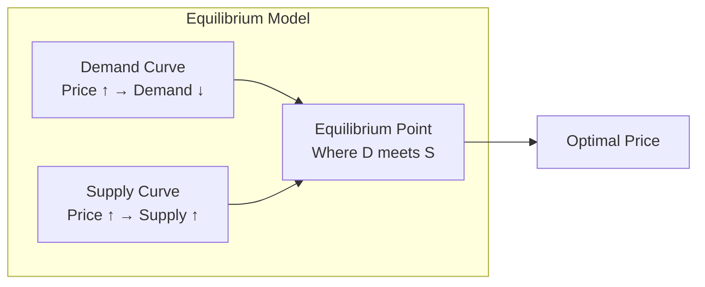

The fundamental pricing equation:

```
P* = P_base × f(D/S)

Where:
- P* = optimal price
- P_base = baseline price (time-of-day, route, product base)
- D = smoothed demand rate (requests/sec)
- S = available supply (drivers, seats, inventory)
- f() = multiplier function (piecewise linear or sigmoid)

Sigmoid variant (smoother transitions):
f(x) = 1 + (max_surge - 1) × sigmoid(k × (x - threshold))
     = 1 + (max_surge - 1) / (1 + e^(-k(x - threshold)))

Parameters:
- max_surge = 5.0 (maximum multiplier)
- k = 2.0 (steepness of surge curve)
- threshold = 1.5 (S/D ratio where surge begins)
```

### 6.2 Time-Decay Weighted Demand

Recent signals matter more than older ones within the window:

```
D_weighted = Σ(signal_i × e^(-λ × (t_now - t_i)))

Where:
- λ = decay constant (0.1 for 10-second half-life)
- t_i = timestamp of signal i
- t_now = current time

Effect: A burst 50 seconds ago contributes ~0.7% vs a burst 5 seconds ago at 60%.
This prevents "sticky surge" from old demand that has already dissipated.
```

### 6.3 Geographic Clustering (H3 Hexagons)

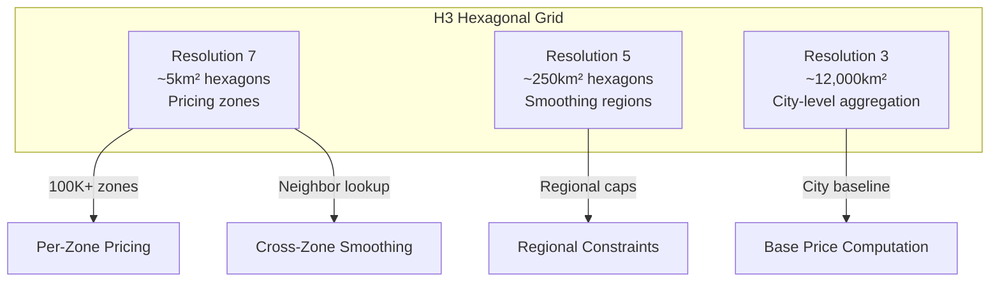

**Why H3 over geohash/S2**:
- Uniform hexagons (no edge distortion unlike rectangles)
- Consistent neighbors (always 6, unlike geohash's 8 with varying distances)
- Hierarchical (resolution 7 → parent at resolution 5 trivially)
- Uber-developed and battle-tested at their scale

**Cross-zone smoothing**:
```
P_zone_smoothed = 0.7 × P_zone + 0.3 × avg(P_neighbors)

Prevents scenario: Zone A has 5x surge, adjacent Zone B has 1x.
Riders walk 50m and get drastically different price. Smoothing ensures
gradual price gradients across space.
```

### 6.4 Competitor-Aware Pricing (Game Theory)

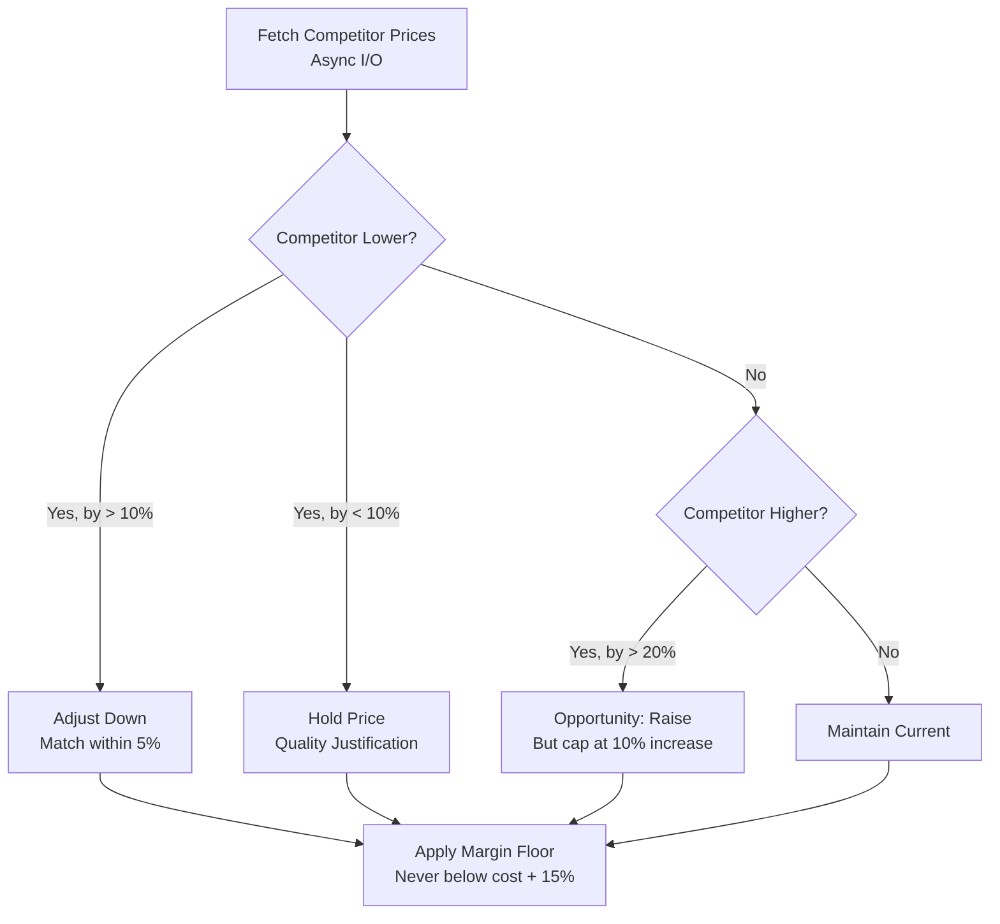

**Nash Equilibrium approach**: Model competitors as rational agents. If both raise prices, both profit. If one undercuts, they gain volume but reduce margins. The equilibrium price balances:
- Customer price sensitivity (elasticity)
- Competitor likely response time (usually 1-24 hours for automated systems)
- Market share objectives vs. margin objectives

### 6.5 ML-Based Demand Forecasting Integration

```java
/**
 * Async I/O operator that scores a demand forecast model.
 * Model predicts demand for next 5/15/30 minutes enabling proactive pricing.
 */
public class DemandForecastAsyncFunction extends RichAsyncFunction<
        DemandEstimate, EnrichedDemand> {

    private transient AsyncHttpClient httpClient;
    private transient Cache<String, ForecastResult> forecastCache;

    @Override
    public void open(Configuration params) {
        httpClient = Dsl.asyncHttpClient(Dsl.config()
            .setConnectTimeout(100)
            .setRequestTimeout(200)
            .setMaxConnections(200)
            .setKeepAlive(true));

        forecastCache = Caffeine.newBuilder()
            .maximumSize(100_000)
            .expireAfterWrite(Duration.ofSeconds(60))
            .build();
    }

    @Override
    public void asyncInvoke(DemandEstimate input,
                           ResultFuture<EnrichedDemand> resultFuture) {
        String cacheKey = input.getZoneId() + ":" +
            (input.getWindowEnd() / 60_000); // cache per minute

        ForecastResult cached = forecastCache.getIfPresent(cacheKey);
        if (cached != null) {
            resultFuture.complete(Collections.singleton(
                new EnrichedDemand(input, cached)));
            return;
        }

        // Build model request
        String url = "http://ml-serving:8080/predict/demand";
        String body = buildModelRequest(input);

        httpClient.preparePost(url)
            .setHeader("Content-Type", "application/json")
            .setBody(body)
            .execute()
            .toCompletableFuture()
            .thenAccept(response -> {
                ForecastResult forecast = parseForecast(response.getResponseBody());
                forecastCache.put(cacheKey, forecast);
                resultFuture.complete(Collections.singleton(
                    new EnrichedDemand(input, forecast)));
            })
            .exceptionally(ex -> {
                // Fallback: use historical average as forecast
                ForecastResult fallback = ForecastResult.fromHistorical(
                    input.getRequestRate());
                resultFuture.complete(Collections.singleton(
                    new EnrichedDemand(input, fallback)));
                return null;
            });
    }

    @Override
    public void timeout(DemandEstimate input,
                       ResultFuture<EnrichedDemand> resultFuture) {
        // Timeout: proceed without forecast, use current demand as proxy
        resultFuture.complete(Collections.singleton(
            new EnrichedDemand(input, ForecastResult.NO_FORECAST)));
    }
}
```

---

## 7. Fairness & Regulation

### 7.1 Price Caps and Floors

```java
/**
 * Constraint types enforced via broadcast state.
 */
public enum ConstraintType {
    ABSOLUTE_MAX,          // $200 max fare regardless
    MULTIPLIER_CAP,        // 3x max in NYC (TLC regulation)
    EMERGENCY_FREEZE,      // No surge during declared emergencies
    TIME_OF_DAY_CAP,       // Max 2x during late night (safety concern)
    MARGIN_FLOOR,          // Never below cost + 15%
    RATE_OF_CHANGE_LIMIT,  // Max 50% increase in 5 minutes
    GEOGRAPHIC_EQUITY      // Max 20% difference between adjacent zones
}
```

### 7.2 Anti-Discrimination Safeguards

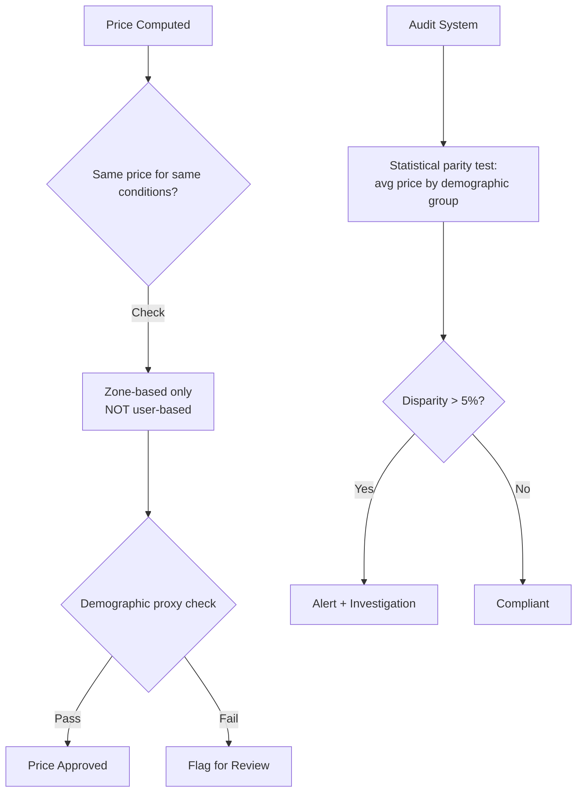

**Key principles**:
- Price is determined by **zone + time + supply/demand**, never by user identity
- No personalized pricing based on device type, browsing history, or inferred demographics
- Regular statistical audits comparing prices across demographic groups
- Zones must not be gerrymandered to create de facto discrimination

### 7.3 Price Explanation & Audit Trail

Every price update produces an audit record:

```json
{
  "zone_id": "8928308280fffff",
  "timestamp": 1706644800000,
  "price": 24.50,
  "base_price": 12.00,
  "multiplier": 2.04,
  "factors": {
    "demand_rate": 45.2,
    "supply_count": 12,
    "sd_ratio": 3.77,
    "raw_multiplier": 2.85,
    "dampening_applied": true,
    "constraint_applied": "MULTIPLIER_CAP",
    "competitor_adjustment": -0.05,
    "event_boost": "concert_msg_sphere"
  },
  "explanation_human": "Prices are 2x higher than usual due to high demand (45 requests/sec with only 12 drivers available). Price was capped by city regulation at 2.04x.",
  "model_version": "pricing-v3.2.1",
  "ab_test_variant": "sigmoid_curve_B"
}
```

### 7.4 A/B Testing of Pricing Strategies

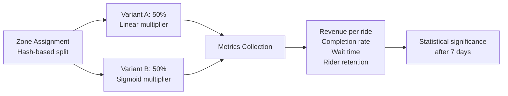

Zones (not users) are assigned to test variants to avoid within-zone price inconsistency. Metrics tracked:
- Revenue per transaction
- Conversion rate (search → booking)
- Customer satisfaction / churn
- Driver/supplier earnings
- Wait time / fulfillment speed

### 7.5 Regulatory Compliance

| Jurisdiction | Rule | Implementation |
|-------------|------|----------------|
| NYC TLC | Max 3x surge for rideshare | `MULTIPLIER_CAP = 3.0` for zones in NYC |
| EU Digital Services Act | Price transparency required | Explanation field mandatory in API response |
| California AB-5 | Worker classification affects pricing | Separate pricing model for employee vs contractor markets |
| Australia | No surge during natural disasters | `EMERGENCY_FREEZE` broadcast on disaster declaration |
| India | Government-set fare caps | `ABSOLUTE_MAX` per city from regulatory table |
| US State Price Gouging | No surge > 10% during state of emergency | Emergency detection → broadcast constraint |

---

## 8. Low Latency Architecture Choices

### 8.1 Heap State Backend vs RocksDB

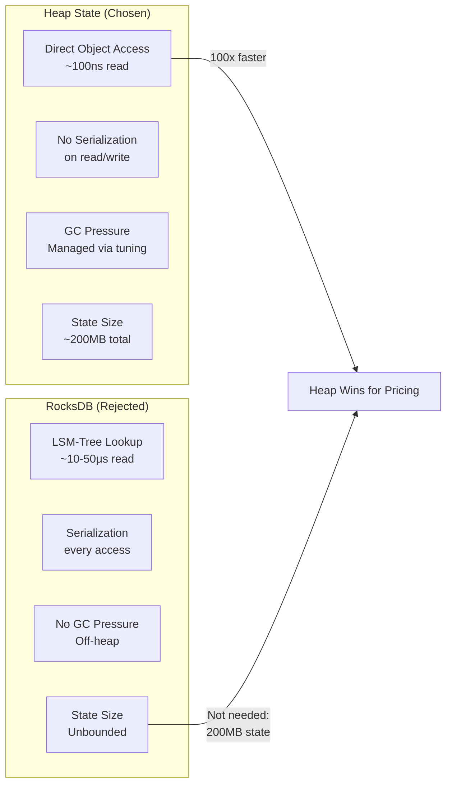

### 8.2 Operator Chaining Optimization

```
Before (unchained): 
Source → [serialize] → network → [deserialize] → Map → [serialize] → network → [deserialize] → Process
Overhead: ~4-8ms per boundary × 3 boundaries = 12-24ms

After (chained):
Source → Map → Process (all in same thread, same slot)
Overhead: ~0ms (direct method calls)

Configuration:
env.disableOperatorChaining(); // disable global
// then selectively chain:
demandStream
    .map(new DemandParser()).startNewChain()
    .keyBy(...)
    .process(new PriceOptimizer())  // chained with downstream
    .addSink(redisSink);            // chained
```

### 8.3 Network Buffer Tuning

```yaml
# flink-conf.yaml for low-latency pricing pipeline
taskmanager.network.memory.floating-buffers-per-gate: 8
taskmanager.network.memory.buffers-per-channel: 4
taskmanager.network.memory.max-buffers-per-channel: 16

# Reduce buffer timeout: flush every 1ms instead of default 100ms
execution.buffer-timeout: 1ms

# Smaller network buffers for faster flush
taskmanager.memory.segment-size: 4kb  # default 32kb

# Credit-based flow control
taskmanager.network.credit-model: true
```

### 8.4 JVM Tuning for Low GC Pause

```bash
# TaskManager JVM options for pricing pipeline
-XX:+UseZGC                          # ZGC for sub-ms pauses
-XX:MaxGCPauseMillis=5               # target 5ms max pause
-Xms8g -Xmx8g                       # fixed heap (no resize pauses)
-XX:+AlwaysPreTouch                  # pre-fault pages at startup
-XX:+UseNUMA                         # NUMA-aware allocation
-XX:ZCollectionInterval=5            # proactive GC every 5s
-XX:ConcGCThreads=4                  # parallel GC threads
-XX:+DisableExplicitGC               # prevent System.gc()
-XX:-UseBiasedLocking                # remove biased lock overhead
-XX:+UseStringDeduplication          # reduce string memory
```

**GC impact on pricing**:
- G1GC: P99 pause ~20-50ms (unacceptable for 500ms budget)
- ZGC: P99 pause ~2-5ms (acceptable)
- Shenandoah: P99 pause ~3-8ms (acceptable alternative)

### Latency Optimization Summary

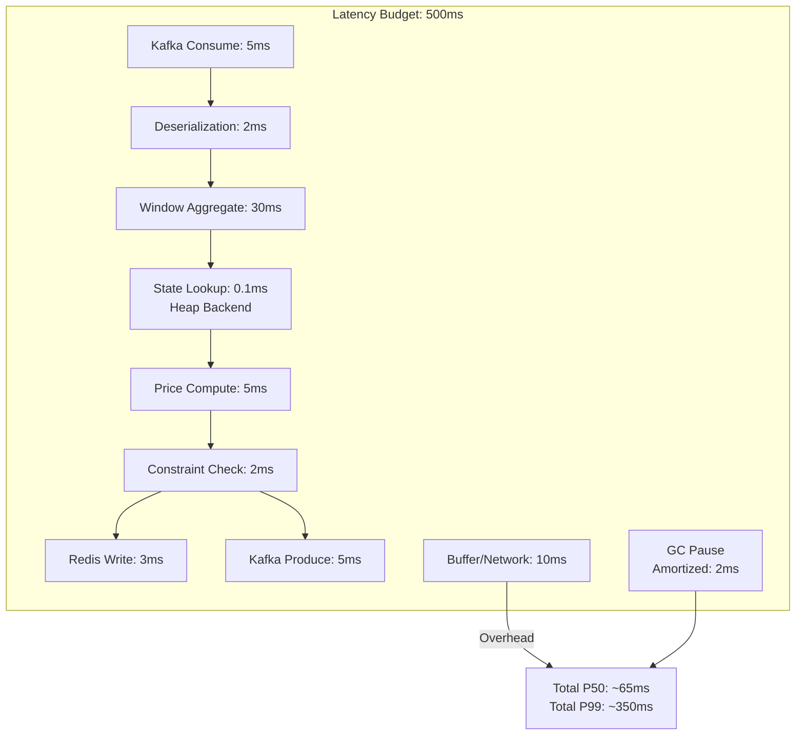

---

## 9. Scaling

### Capacity Planning

| Dimension | Target | Configuration |
|-----------|--------|---------------|
| Price updates/sec | 1M sustained, 5M burst | 256 TaskManager slots, 64 Kafka partitions |
| Zones/products | 100K concurrent | Keyed state, custom partitioner |
| End-to-end latency | P99 < 500ms | Heap state, operator chaining, ZGC |
| Availability | 99.99% | Multi-AZ, standby cluster, fast failover |
| State size | ~200MB per TM | Heap state backend |
| Checkpoint interval | 30 seconds | Unaligned checkpoints |
| Recovery time | < 10 seconds | Small state, fast restore |

### Cluster Topology

```
Production Cluster:
- JobManager: 2 (HA with ZooKeeper)
- TaskManagers: 32 (8 slots each = 256 slots)
- CPU: 8 cores per TM (AMD EPYC for clock speed)
- Memory: 16GB per TM (8GB JVM heap + 8GB managed/network)
- Network: 25 Gbps between TMs

Kafka Cluster:
- Brokers: 12
- Partitions: 64 (demand), 32 (supply), 16 (external)
- Replication: 3
- Retention: 4 hours (pricing signals are ephemeral)

Redis Cluster:
- Nodes: 6 (3 primary + 3 replica)
- Memory: 64GB per node
- Eviction: volatile-ttl
```

### Failover Strategy

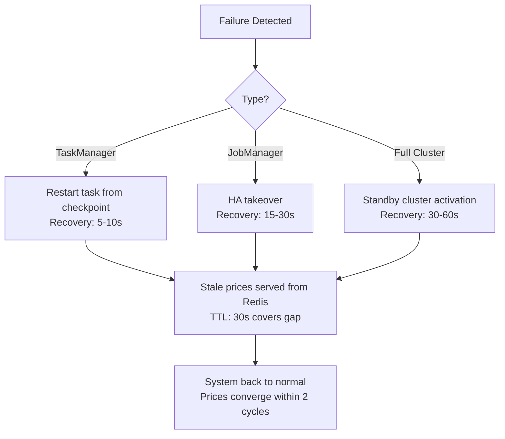

### Backpressure Handling

When downstream (Redis) slows:
1. Flink applies backpressure naturally via credit-based flow control
2. Price updates are deduplicated (only latest per zone matters)
3. Buffer timeout ensures maximum 1ms queuing
4. Circuit breaker: if Redis latency > 100ms, switch to Kafka-only output (async Redis catch-up)

---

## 10. Real Companies

### Uber - Surge Pricing

**Architecture**: Flink-based real-time pricing engine processing millions of rider/driver location pings per second.

- **Zones**: H3 hexagons at resolution 7 (~5km²), 10K+ per major city
- **Signal frequency**: Driver GPS every 4 seconds, rider requests real-time
- **Update cadence**: Prices recalculated every 5 seconds per zone
- **Multiplier range**: 1.0x - 8.0x (varies by city regulation)
- **Key innovation**: "Upfront pricing" — predict ride cost before request, absorb variance
- **Tech stack**: Kafka, Flink, custom ML models (demand forecasting), Redis, Cassandra (audit)

### Lyft - Prime Time

Similar to Uber but with:
- Round percentage increments (25%, 50%, 75%, 100%, 200%)
- More conservative surge caps
- Zone smoothing emphasis (avoid "cross the street" pricing cliffs)

### Airbnb - Smart Pricing

- ML model trained on 1B+ bookings
- Features: seasonality, local events, listing quality, competitor listings, day-of-week
- Host sets min/max; algorithm optimizes within bounds
- Daily repricing (not sub-second like rideshare)
- Revenue increase: 13% for hosts who enable Smart Pricing

### Amazon - Competitive Pricing

- 2.5M price changes daily across 350M+ products
- Monitors competitor prices (Walmart, Target, Best Buy) via scraping
- Considers: margin targets, Buy Box eligibility, inventory velocity, customer lifetime value
- Uses reinforcement learning for long-term revenue optimization
- Sub-minute repricing for high-velocity categories

### Airlines (Sabre/Amadeus)

- 200M+ fare combinations = routes × fare classes × dates × advance purchase
- Revenue Management Systems (RMS) reallocate seat inventory across fare buckets
- EMSR (Expected Marginal Seat Revenue) algorithm core
- Increasingly real-time: moving from batch (hourly) to streaming (per-search)
- Continuous pricing (vs. discrete fare classes) is the industry frontier
- Tech: Moving from legacy mainframe batch to Kafka + Flink architectures

### Key Patterns Across Companies

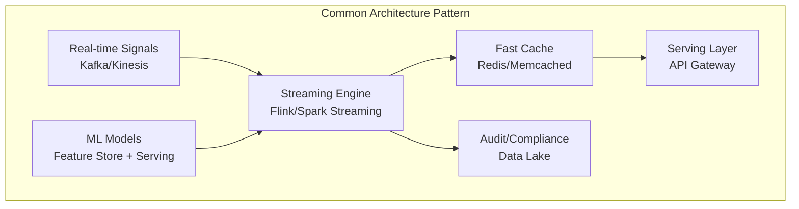

| Aspect | Rideshare | Airlines | E-commerce | Hotels |
|--------|-----------|----------|------------|--------|
| Update frequency | 5 seconds | Minutes-hours | Minutes | Hours-daily |
| Price drivers | S/D ratio, location | Booking curve, class | Competition, inventory | Events, seasonality |
| Constraint source | City regulation | Fare filing rules | MAP, margin floors | Rate parity |
| ML role | Demand forecast | Demand forecast + willingness-to-pay | Price elasticity | Booking probability |
| Latency requirement | < 500ms | < 5s | < 30s | < 5min |

---

## Summary

The dynamic pricing pipeline is one of the most demanding real-time applications: combining ultra-low latency requirements with complex multi-signal processing, ML integration, regulatory compliance, and massive scale. Apache Flink's combination of exactly-once state management, flexible windowing, connected streams, and operator-level performance tuning makes it the industry standard for this workload.

**Key architectural decisions**:
1. Heap state backend for sub-millisecond state access
2. Timer-based emission with dampening to prevent oscillation
3. Broadcast state for constraint propagation
4. Custom H3-based partitioning for geographic locality
5. Async I/O for external enrichment without blocking
6. ZGC for predictable low-pause garbage collection
7. Redis with TTL as serving cache (graceful degradation on failure)
