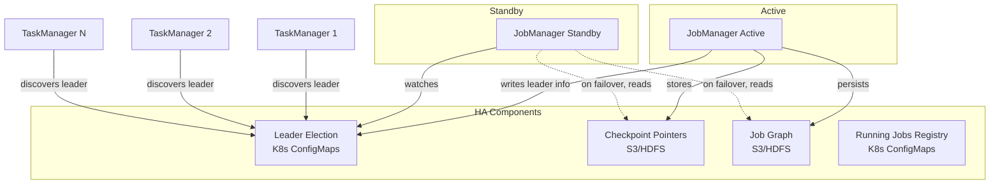
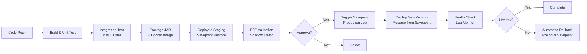
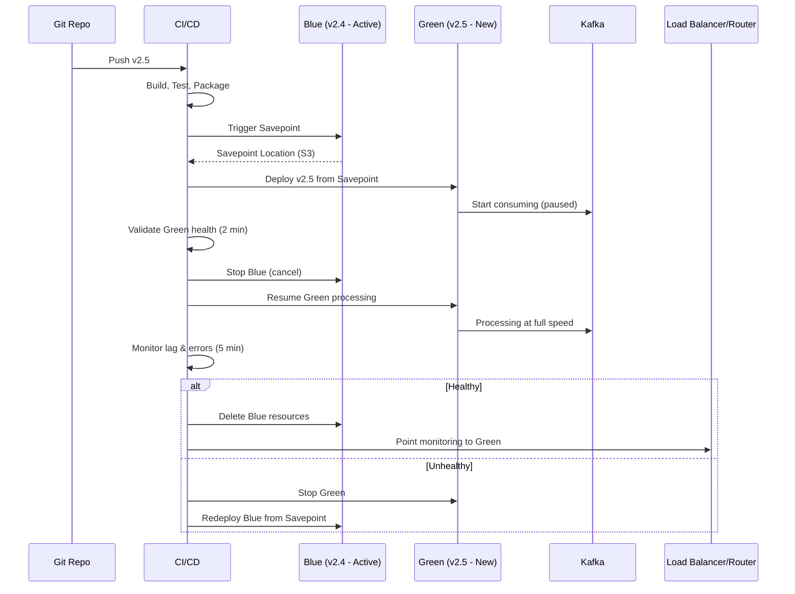
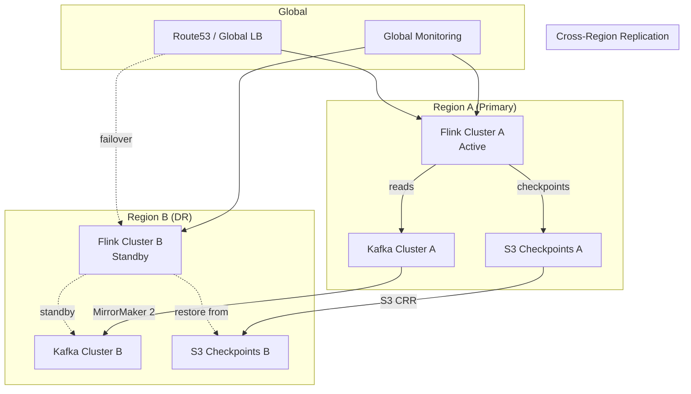

# Production Deployment & Operations for Apache Flink at Scale

> How Uber, Netflix, Alibaba, and ByteDance deploy and operate Flink processing billions of events/day.

---

## Table of Contents

1. [Deployment Modes Comparison](#1-deployment-modes-comparison)
2. [Kubernetes Deployment (Production Standard)](#2-kubernetes-deployment-production-standard)
3. [High Availability Configuration](#3-high-availability-configuration)
4. [CI/CD Pipeline for Flink Jobs](#4-cicd-pipeline-for-flink-jobs)
5. [Zero-Downtime Upgrades](#5-zero-downtime-upgrades)
6. [Multi-Tenancy](#6-multi-tenancy)
7. [Security](#7-security)
8. [Configuration Management](#8-configuration-management)
9. [Disaster Recovery](#9-disaster-recovery)
10. [Operational Runbooks](#10-operational-runbooks)

---

## 1. Deployment Modes Comparison

### 1.1 Standalone (Bare Metal)

Direct deployment on physical/virtual machines without a resource manager.

```bash
# Start JobManager
./bin/jobmanager.sh start

# Start TaskManagers (on each worker node)
./bin/taskmanager.sh start
```

**Architecture:**
- Fixed cluster size, manual scaling
- Used by companies with dedicated hardware (financial trading systems)
- Netflix used this in early Flink adoption before migrating to Kubernetes

### 1.2 YARN (Hadoop Clusters)

Flink runs as a YARN application, leveraging Hadoop cluster resources.

```bash
# Session mode - shared cluster
./bin/yarn-session.sh -n 8 -jm 4096m -tm 8192m -s 4

# Per-job mode (deprecated in 1.15+)
./bin/flink run -m yarn-cluster -p 10 ./my-job.jar

# Application mode on YARN
./bin/flink run-application -t yarn-application ./my-job.jar
```

**Key configs for YARN:**
```yaml
# flink-conf.yaml
yarn.application-attempts: 3
yarn.application-attempt-failures-validity-interval: 60000
yarn.containers.vcores: 4
yarn.taskmanager.env.LD_LIBRARY_PATH: /usr/lib/hadoop/lib/native
```

**Who uses it:** Alibaba (early days), companies with existing Hadoop infrastructure, legacy data platforms.

### 1.3 Kubernetes Native (Flink Operator)

The modern production standard. Uses the [Flink Kubernetes Operator](https://github.com/apache/flink-kubernetes-operator) for lifecycle management.

```
┌─────────────────────────────────────────────────────┐
│  Kubernetes Cluster                                  │
│  ┌───────────────────────────────────────────────┐  │
│  │  Flink Kubernetes Operator                     │  │
│  │  - Watches FlinkDeployment CRDs               │  │
│  │  - Manages job lifecycle                       │  │
│  │  - Handles savepoints/upgrades                 │  │
│  └───────────────────────────────────────────────┘  │
│                                                      │
│  ┌─────────────┐  ┌─────────────┐  ┌────────────┐  │
│  │ Flink Job A │  │ Flink Job B │  │ Flink Job C│  │
│  │ (namespace) │  │ (namespace) │  │ (namespace)│  │
│  └─────────────┘  └─────────────┘  └────────────┘  │
└─────────────────────────────────────────────────────┘
```

### 1.4 Kubernetes Application Mode

Each job is its own self-contained application with its own JobManager — the recommended mode for production.

### 1.5 Comparison Table

| Aspect | Standalone | YARN | K8s Native (Operator) | K8s Application Mode |
|--------|-----------|------|----------------------|---------------------|
| **Resource Management** | Manual | YARN ResourceManager | K8s scheduler | K8s scheduler |
| **Scaling** | Manual restart | Dynamic containers | Reactive/HPA | Reactive/HPA |
| **Isolation** | Process-level | Container-level | Pod/Namespace | Pod/Namespace |
| **HA** | ZooKeeper | YARN attempts + ZK | K8s ConfigMaps | K8s ConfigMaps |
| **Deployment Speed** | Seconds | 30-60s | 10-30s | 10-30s |
| **Ops Complexity** | High | Medium | Low (with operator) | Low (with operator) |
| **Cloud Native** | No | No | Yes | Yes |
| **Auto-recovery** | Manual | YARN restarts | Operator restarts | Operator restarts |
| **Multi-tenancy** | Poor | Fair | Excellent | Excellent |
| **When to Use** | Dev/test, ultra-low-latency trading | Existing Hadoop infra, batch+stream co-location | Production streaming, greenfield | Production streaming (recommended) |
| **Used By** | HFT firms | Legacy enterprises, early Alibaba | Uber, Netflix, Lyft | ByteDance, DoorDash |

---

## 2. Kubernetes Deployment (Production Standard)

### 2.1 Flink Kubernetes Operator Installation

```bash
# Install cert-manager (required)
kubectl apply -f https://github.com/cert-manager/cert-manager/releases/download/v1.13.3/cert-manager.yaml

# Install Flink Kubernetes Operator via Helm
helm repo add flink-operator-repo https://downloads.apache.org/flink/flink-kubernetes-operator-1.7.0/
helm install flink-kubernetes-operator flink-operator-repo/flink-kubernetes-operator \
  --namespace flink-operator \
  --create-namespace \
  --set webhook.create=true \
  --set metrics.port=9999
```

### 2.2 Full FlinkDeployment CRD (Production-Grade)

```yaml
apiVersion: flink.apache.org/v1beta1
kind: FlinkDeployment
metadata:
  name: fraud-detection-pipeline
  namespace: flink-production
  labels:
    app.kubernetes.io/name: fraud-detection
    app.kubernetes.io/version: "2.4.1"
    team: platform-streaming
    cost-center: fraud-prevention
  annotations:
    flinkdeployment.flink.apache.org/max-savepoint-age: "24h"
spec:
  image: registry.internal.company.com/flink/fraud-detection:2.4.1-flink1.18
  imagePullPolicy: IfNotPresent
  flinkVersion: v1_18
  
  serviceAccount: flink-job-sa
  
  # --- Flink Configuration ---
  flinkConfiguration:
    # Checkpointing
    execution.checkpointing.interval: "60000"
    execution.checkpointing.min-pause: "30000"
    execution.checkpointing.timeout: "600000"
    execution.checkpointing.max-concurrent-checkpoints: "1"
    execution.checkpointing.externalized-checkpoint-retention: "RETAIN_ON_CANCELLATION"
    execution.checkpointing.unaligned.enabled: "true"
    
    # State backend - RocksDB
    state.backend.type: rocksdb
    state.backend.rocksdb.localdir: /opt/flink/rocksdb
    state.backend.rocksdb.timer-service.factory: ROCKSDB
    state.backend.incremental: "true"
    state.backend.rocksdb.memory.managed: "true"
    state.backend.rocksdb.block.cache-size: "256mb"
    state.backend.rocksdb.writebuffer.size: "128mb"
    state.backend.rocksdb.writebuffer.count: "4"
    
    # Checkpoint storage
    state.checkpoints.dir: s3://flink-checkpoints-prod/fraud-detection/checkpoints
    state.savepoints.dir: s3://flink-checkpoints-prod/fraud-detection/savepoints
    
    # HA - Kubernetes-based
    high-availability.type: kubernetes
    high-availability.storageDir: s3://flink-checkpoints-prod/fraud-detection/ha
    
    # Network
    taskmanager.network.memory.fraction: "0.15"
    taskmanager.network.memory.min: "128mb"
    taskmanager.network.memory.max: "1gb"
    taskmanager.network.request-backoff.max: "60000"
    
    # Memory
    taskmanager.memory.process.size: "8192m"
    taskmanager.memory.managed.fraction: "0.4"
    taskmanager.memory.network.fraction: "0.15"
    taskmanager.memory.jvm-overhead.fraction: "0.1"
    jobmanager.memory.process.size: "4096m"
    
    # Restart strategy
    restart-strategy.type: exponential-delay
    restart-strategy.exponential-delay.initial-backoff: "1s"
    restart-strategy.exponential-delay.max-backoff: "60s"
    restart-strategy.exponential-delay.backoff-multiplier: "2.0"
    restart-strategy.exponential-delay.reset-backoff-threshold: "120s"
    
    # Metrics
    metrics.reporter.prom.factory.class: "org.apache.flink.metrics.prometheus.PrometheusReporterFactory"
    metrics.reporter.prom.port: "9249"
    metrics.latency.interval: "10000"
    
    # S3 access
    s3.access-key: ""  # Use IRSA/workload identity instead
    s3.endpoint: "s3.us-east-1.amazonaws.com"
    s3.path.style.access: "true"
    fs.s3a.aws.credentials.provider: "com.amazonaws.auth.WebIdentityTokenCredentialsProvider"
    
    # Web UI
    web.cancel.enable: "false"  # Disable cancel from UI in prod
    web.timeout: "120000"
    
    # Slot sharing
    slot.sharing.group.default: "default"
    taskmanager.numberOfTaskSlots: "4"
    
    # Watermarks
    pipeline.auto-watermark-interval: "200"
    
  # --- JobManager ---
  jobManager:
    replicas: 1  # HA handles failover, not replicas
    resource:
      memory: "4096m"
      cpu: 2
    podTemplate:
      spec:
        containers:
          - name: flink-main-container
            env:
              - name: JAVA_TOOL_OPTIONS
                value: "-XX:+UseG1GC -XX:MaxGCPauseMillis=100 -XX:+ParallelRefProcEnabled"
              - name: AWS_REGION
                value: "us-east-1"
            volumeMounts:
              - name: flink-logs
                mountPath: /opt/flink/log
            resources:
              requests:
                memory: "4Gi"
                cpu: "2000m"
              limits:
                memory: "4Gi"
                cpu: "4000m"
        volumes:
          - name: flink-logs
            emptyDir:
              sizeLimit: 5Gi
        affinity:
          podAntiAffinity:
            preferredDuringSchedulingIgnoredDuringExecution:
              - weight: 100
                podAffinityTerm:
                  labelSelector:
                    matchExpressions:
                      - key: component
                        operator: In
                        values:
                          - jobmanager
                  topologyKey: kubernetes.io/hostname
        tolerations:
          - key: "dedicated"
            operator: "Equal"
            value: "flink"
            effect: "NoSchedule"
        nodeSelector:
          node-pool: flink-jobmanager
          
  # --- TaskManagers ---
  taskManager:
    replicas: 20
    resource:
      memory: "8192m"
      cpu: 4
    podTemplate:
      spec:
        containers:
          - name: flink-main-container
            env:
              - name: JAVA_TOOL_OPTIONS
                value: "-XX:+UseG1GC -XX:MaxGCPauseMillis=200 -XX:+ParallelRefProcEnabled -XX:+UseStringDeduplication"
              - name: AWS_REGION
                value: "us-east-1"
            volumeMounts:
              - name: rocksdb-storage
                mountPath: /opt/flink/rocksdb
              - name: flink-logs
                mountPath: /opt/flink/log
            resources:
              requests:
                memory: "8Gi"
                cpu: "4000m"
                ephemeral-storage: "50Gi"
              limits:
                memory: "10Gi"
                cpu: "6000m"
                ephemeral-storage: "100Gi"
        initContainers:
          - name: volume-permissions
            image: busybox:1.36
            command: ['sh', '-c', 'chmod -R 777 /opt/flink/rocksdb']
            volumeMounts:
              - name: rocksdb-storage
                mountPath: /opt/flink/rocksdb
        volumes:
          - name: flink-logs
            emptyDir:
              sizeLimit: 10Gi
        affinity:
          podAntiAffinity:
            preferredDuringSchedulingIgnoredDuringExecution:
              - weight: 80
                podAffinityTerm:
                  labelSelector:
                    matchExpressions:
                      - key: component
                        operator: In
                        values:
                          - taskmanager
                  topologyKey: topology.kubernetes.io/zone
          nodeAffinity:
            requiredDuringSchedulingIgnoredDuringExecution:
              nodeSelectorTerms:
                - matchExpressions:
                    - key: node-pool
                      operator: In
                      values:
                        - flink-taskmanager
        tolerations:
          - key: "dedicated"
            operator: "Equal"
            value: "flink"
            effect: "NoSchedule"
        topologySpreadConstraints:
          - maxSkew: 2
            topologyKey: topology.kubernetes.io/zone
            whenUnsatisfiable: DoNotSchedule
            labelSelector:
              matchLabels:
                app: fraud-detection-pipeline
                component: taskmanager
    volumeClaimTemplates:
      - metadata:
          name: rocksdb-storage
        spec:
          accessModes: ["ReadWriteOnce"]
          storageClassName: gp3-flink
          resources:
            requests:
              storage: 200Gi
              
  # --- Job Configuration ---
  job:
    jarURI: local:///opt/flink/usrlib/fraud-detection-2.4.1.jar
    entryClass: com.company.fraud.FraudDetectionPipeline
    args:
      - "--kafka.bootstrap.servers=kafka-prod.internal:9092"
      - "--kafka.group.id=fraud-detection-prod"
      - "--kafka.source.topic=transactions"
      - "--kafka.sink.topic=fraud-alerts"
      - "--rules.endpoint=http://rules-service.fraud.svc:8080/v2/rules"
    parallelism: 80
    upgradeMode: savepoint
    state: running
    savepointTriggerNonce: 0
    
  # --- Ingress for Web UI ---
  ingress:
    template: "/flink/{{namespace}}/{{name}}(/|$)(.*)"
    className: nginx
    annotations:
      nginx.ingress.kubernetes.io/rewrite-target: "/$2"
      nginx.ingress.kubernetes.io/auth-url: "https://auth.internal.company.com/oauth2/auth"

  # --- Log Configuration ---
  logConfiguration:
    log4j-console.properties: |
      rootLogger.level = INFO
      rootLogger.appenderRef.console.ref = ConsoleAppender
      rootLogger.appenderRef.rolling.ref = RollingFileAppender
      
      appender.console.name = ConsoleAppender
      appender.console.type = CONSOLE
      appender.console.layout.type = JsonLayout
      appender.console.layout.compact = true
      appender.console.layout.eventEol = true
      
      appender.rolling.name = RollingFileAppender
      appender.rolling.type = RollingFile
      appender.rolling.append = true
      appender.rolling.fileName = ${sys:log.file}
      appender.rolling.filePattern = ${sys:log.file}.%i
      appender.rolling.layout.type = JsonLayout
      appender.rolling.layout.compact = true
      appender.rolling.layout.eventEol = true
      appender.rolling.policies.type = Policies
      appender.rolling.policies.size.type = SizeBasedTriggeringPolicy
      appender.rolling.policies.size.size = 100MB
      appender.rolling.strategy.type = DefaultRolloverStrategy
      appender.rolling.strategy.max = 5
      
      logger.kafka.name = org.apache.kafka
      logger.kafka.level = WARN
      logger.flink.name = org.apache.flink
      logger.flink.level = INFO
      logger.checkpoint.name = org.apache.flink.runtime.checkpoint
      logger.checkpoint.level = INFO
```

### 2.3 StorageClass for RocksDB (AWS gp3)

```yaml
apiVersion: storage.k8s.io/v1
kind: StorageClass
metadata:
  name: gp3-flink
provisioner: ebs.csi.aws.com
parameters:
  type: gp3
  iops: "6000"
  throughput: "400"
  encrypted: "true"
  fsType: ext4
reclaimPolicy: Delete
allowVolumeExpansion: true
volumeBindingMode: WaitForFirstConsumer
```

### 2.4 Service Account and RBAC

```yaml
apiVersion: v1
kind: ServiceAccount
metadata:
  name: flink-job-sa
  namespace: flink-production
  annotations:
    # AWS IRSA for S3 access
    eks.amazonaws.com/role-arn: arn:aws:iam::123456789012:role/flink-production-s3-access
---
apiVersion: rbac.authorization.k8s.io/v1
kind: Role
metadata:
  name: flink-job-role
  namespace: flink-production
rules:
  - apiGroups: [""]
    resources: ["configmaps"]
    verbs: ["create", "get", "update", "delete", "list", "watch"]
  - apiGroups: [""]
    resources: ["pods"]
    verbs: ["get", "list", "watch"]
  - apiGroups: [""]
    resources: ["pods/log"]
    verbs: ["get"]
  - apiGroups: [""]
    resources: ["events"]
    verbs: ["create", "patch"]
---
apiVersion: rbac.authorization.k8s.io/v1
kind: RoleBinding
metadata:
  name: flink-job-role-binding
  namespace: flink-production
subjects:
  - kind: ServiceAccount
    name: flink-job-sa
    namespace: flink-production
roleRef:
  kind: Role
  name: flink-job-role
  apiGroup: rbac.authorization.k8s.io
```

### 2.5 Network Policies

```yaml
apiVersion: networking.k8s.io/v1
kind: NetworkPolicy
metadata:
  name: flink-job-network-policy
  namespace: flink-production
spec:
  podSelector:
    matchLabels:
      app: fraud-detection-pipeline
  policyTypes:
    - Ingress
    - Egress
  ingress:
    # Allow intra-cluster Flink communication (JM <-> TM)
    - from:
        - podSelector:
            matchLabels:
              app: fraud-detection-pipeline
      ports:
        - port: 6123  # RPC
        - port: 6124  # Blob server
        - port: 6125  # Query state
    # Allow Prometheus scraping
    - from:
        - namespaceSelector:
            matchLabels:
              name: monitoring
          podSelector:
            matchLabels:
              app: prometheus
      ports:
        - port: 9249
    # Allow operator access
    - from:
        - namespaceSelector:
            matchLabels:
              name: flink-operator
      ports:
        - port: 8081  # REST API
  egress:
    # Kafka
    - to:
        - namespaceSelector:
            matchLabels:
              name: kafka-production
      ports:
        - port: 9092
        - port: 9093
    # S3 (via VPC endpoint)
    - to:
        - ipBlock:
            cidr: 10.0.0.0/8
      ports:
        - port: 443
    # DNS
    - to: []
      ports:
        - port: 53
          protocol: UDP
        - port: 53
          protocol: TCP
    # Internal services
    - to:
        - namespaceSelector:
            matchLabels:
              name: fraud
      ports:
        - port: 8080
```

### 2.6 Horizontal Pod Autoscaler

```yaml
apiVersion: autoscaling/v2
kind: HorizontalPodAutoscaler
metadata:
  name: flink-fraud-detection-hpa
  namespace: flink-production
spec:
  scaleTargetRef:
    apiVersion: flink.apache.org/v1beta1
    kind: FlinkDeployment
    name: fraud-detection-pipeline
  minReplicas: 10
  maxReplicas: 80
  metrics:
    - type: Pods
      pods:
        metric:
          name: flink_taskmanager_job_task_busyTimeMsPerSecond
        target:
          type: AverageValue
          averageValue: "700"  # Scale up when TMs are >70% busy
    - type: External
      external:
        metric:
          name: kafka_consumergroup_lag
          selector:
            matchLabels:
              consumergroup: fraud-detection-prod
              topic: transactions
        target:
          type: AverageValue
          averageValue: "50000"  # Scale if lag > 50k per partition
  behavior:
    scaleUp:
      stabilizationWindowSeconds: 120
      policies:
        - type: Pods
          value: 5
          periodSeconds: 60
    scaleDown:
      stabilizationWindowSeconds: 600
      policies:
        - type: Pods
          value: 2
          periodSeconds: 120
```

### 2.7 PodDisruptionBudget

```yaml
apiVersion: policy/v1
kind: PodDisruptionBudget
metadata:
  name: flink-fraud-detection-pdb
  namespace: flink-production
spec:
  minAvailable: "80%"
  selector:
    matchLabels:
      app: fraud-detection-pipeline
      component: taskmanager
```

---

## 3. High Availability Configuration

### 3.1 Architecture Overview



### 3.2 ZooKeeper-based HA (Legacy)

```yaml
# flink-conf.yaml for ZK-based HA
high-availability.type: zookeeper
high-availability.zookeeper.quorum: zk1:2181,zk2:2181,zk3:2181
high-availability.zookeeper.path.root: /flink
high-availability.cluster-id: /fraud-detection-prod
high-availability.storageDir: s3://flink-ha/fraud-detection/
high-availability.zookeeper.client.session-timeout: 60000
high-availability.zookeeper.client.connection-timeout: 30000
high-availability.zookeeper.client.retry-wait: 5000
high-availability.zookeeper.client.max-retry-attempts: 10
```

### 3.3 Kubernetes-based HA (Modern - Recommended)

```yaml
# flink-conf.yaml for K8s-based HA
high-availability.type: kubernetes
high-availability.cluster-id: fraud-detection-prod
high-availability.storageDir: s3://flink-checkpoints-prod/fraud-detection/ha

# Kubernetes HA uses ConfigMaps for:
# - Leader election (lease-based)
# - Job graph storage pointers
# - Checkpoint counter
# - Running jobs registry

# The actual large objects (job graph, checkpoint data) are stored in storageDir (S3)
# Only metadata/pointers are in ConfigMaps
```

**What's stored where:**

| Data | Storage Location | Purpose |
|------|-----------------|---------|
| Leader election lock | K8s ConfigMap (lease) | Which JM is active |
| Checkpoint counter | K8s ConfigMap | Monotonically increasing checkpoint ID |
| Completed checkpoint pointers | `storageDir` (S3) | Location of actual checkpoint data |
| Job graph | `storageDir` (S3) | Serialized execution graph |
| Running jobs registry | K8s ConfigMap | Which jobs should be running |
| Actual checkpoint data | `state.checkpoints.dir` (S3) | State snapshots |

### 3.4 Recovery Scenarios and Timing

| Scenario | Detection Time | Recovery Time | Data Loss |
|----------|---------------|---------------|-----------|
| TaskManager crash | 30s (heartbeat timeout) | 30-60s (restart + state restore) | None (from checkpoint) |
| JobManager crash | 10-15s (K8s liveness probe) | 30-90s (new JM + rediscover TMs + restore) | None |
| Full cluster restart | Immediate (operator detects) | 2-5 min (all pods + full state restore) | None |
| AZ failure | 30-60s (node NotReady) | 2-5 min (rescheduling + restore) | None |
| Checkpoint storage failure | Next checkpoint interval | Job continues, alert fires | Potential (if crash during gap) |

### 3.5 HA Validation Test

```bash
#!/bin/bash
# ha-validation-test.sh - Test HA failover

set -euo pipefail

NAMESPACE="flink-production"
DEPLOYMENT="fraud-detection-pipeline"
EXPECTED_RECOVERY_SECONDS=120

echo "=== Flink HA Validation Test ==="

# Get current JobManager pod
JM_POD=$(kubectl get pods -n $NAMESPACE -l component=jobmanager,app=$DEPLOYMENT -o jsonpath='{.items[0].metadata.name}')
echo "Current JM: $JM_POD"

# Record current checkpoint ID
CHECKPOINT_ID=$(curl -s "http://localhost:8081/jobs/$(curl -s http://localhost:8081/jobs | jq -r '.jobs[0].id')/checkpoints" | jq '.latest.completed.id')
echo "Last checkpoint: $CHECKPOINT_ID"

# Kill the JobManager
START_TIME=$(date +%s)
kubectl delete pod $JM_POD -n $NAMESPACE --grace-period=0 --force
echo "Killed JM at $(date)"

# Wait for recovery
while true; do
  ELAPSED=$(($(date +%s) - START_TIME))
  JOB_STATUS=$(curl -s http://localhost:8081/jobs 2>/dev/null | jq -r '.jobs[0].status' 2>/dev/null || echo "UNAVAILABLE")
  
  if [ "$JOB_STATUS" == "RUNNING" ]; then
    echo "Job recovered in ${ELAPSED}s"
    break
  fi
  
  if [ $ELAPSED -gt $EXPECTED_RECOVERY_SECONDS ]; then
    echo "FAIL: Recovery exceeded ${EXPECTED_RECOVERY_SECONDS}s"
    exit 1
  fi
  
  sleep 2
done

# Verify state was restored
NEW_CHECKPOINT_ID=$(curl -s "http://localhost:8081/jobs/$(curl -s http://localhost:8081/jobs | jq -r '.jobs[0].id')/checkpoints" | jq '.counts.restored')
echo "Restored from checkpoint: $NEW_CHECKPOINT_ID"
echo "=== HA Test PASSED ==="
```

---

## 4. CI/CD Pipeline for Flink Jobs

### 4.1 Pipeline Overview



### 4.2 GitOps with ArgoCD

```yaml
# argocd/applications/flink-fraud-detection.yaml
apiVersion: argoproj.io/v1alpha1
kind: Application
metadata:
  name: flink-fraud-detection
  namespace: argocd
  annotations:
    notifications.argoproj.io/subscribe.on-sync-succeeded.slack: flink-deployments
    notifications.argoproj.io/subscribe.on-sync-failed.slack: flink-alerts
  finalizers:
    - resources-finalizer.argocd.argoproj.io
spec:
  project: flink-production
  source:
    repoURL: https://github.com/company/flink-deployments.git
    targetRevision: main
    path: production/fraud-detection
    helm:
      valueFiles:
        - values-production.yaml
      parameters:
        - name: image.tag
          value: "2.4.1"
  destination:
    server: https://kubernetes.default.svc
    namespace: flink-production
  syncPolicy:
    automated:
      prune: false      # Never auto-delete — Flink jobs have state
      selfHeal: true
    syncOptions:
      - CreateNamespace=true
      - ApplyOutOfSyncOnly=true
      - RespectIgnoreDifferences=true
    retry:
      limit: 3
      backoff:
        duration: 30s
        factor: 2
        maxDuration: 3m
  ignoreDifferences:
    - group: flink.apache.org
      kind: FlinkDeployment
      jsonPointers:
        - /spec/job/savepointTriggerNonce
        - /status
```

### 4.3 GitHub Actions Pipeline

```yaml
# .github/workflows/flink-deploy.yaml
name: Flink Job CI/CD

on:
  push:
    branches: [main]
    paths:
      - 'jobs/fraud-detection/**'
  pull_request:
    branches: [main]

env:
  REGISTRY: registry.internal.company.com
  IMAGE_NAME: flink/fraud-detection
  FLINK_VERSION: "1.18.1"

jobs:
  build-and-test:
    runs-on: ubuntu-latest
    steps:
      - uses: actions/checkout@v4
      
      - name: Set up JDK 17
        uses: actions/setup-java@v4
        with:
          java-version: '17'
          distribution: 'temurin'
          cache: 'gradle'
          
      - name: Build and Unit Test
        run: ./gradlew :fraud-detection:build :fraud-detection:test
        
      - name: Integration Test (Flink MiniCluster)
        run: ./gradlew :fraud-detection:integrationTest
        env:
          TESTCONTAINERS_RYUK_DISABLED: true
          
      - name: State Compatibility Check
        run: |
          ./gradlew :fraud-detection:stateCompatibilityTest \
            -Pprevious.version=${{ github.event.before }}
            
      - name: Upload JAR
        uses: actions/upload-artifact@v4
        with:
          name: fraud-detection-jar
          path: jobs/fraud-detection/build/libs/fraud-detection-*.jar

  docker-build:
    needs: build-and-test
    runs-on: ubuntu-latest
    outputs:
      image-tag: ${{ steps.meta.outputs.version }}
    steps:
      - uses: actions/checkout@v4
      - uses: actions/download-artifact@v4
        with:
          name: fraud-detection-jar
          path: ./docker/jars/
          
      - name: Docker meta
        id: meta
        uses: docker/metadata-action@v5
        with:
          images: ${{ env.REGISTRY }}/${{ env.IMAGE_NAME }}
          tags: |
            type=sha,prefix={{branch}}-
            type=semver,pattern={{version}}
            
      - name: Build and Push
        uses: docker/build-push-action@v5
        with:
          context: ./docker
          push: true
          tags: ${{ steps.meta.outputs.tags }}
          build-args: |
            FLINK_VERSION=${{ env.FLINK_VERSION }}

  deploy-staging:
    needs: docker-build
    runs-on: ubuntu-latest
    environment: staging
    steps:
      - uses: actions/checkout@v4
      
      - name: Deploy to Staging
        run: |
          # Update image tag in staging FlinkDeployment
          yq eval ".spec.image = \"${{ env.REGISTRY }}/${{ env.IMAGE_NAME }}:${{ needs.docker-build.outputs.image-tag }}\"" \
            -i deployments/staging/fraud-detection.yaml
          
          kubectl apply -f deployments/staging/fraud-detection.yaml
          
      - name: Wait for Job Running
        run: |
          timeout 300 bash -c '
            while true; do
              STATUS=$(kubectl get flinkdeployment fraud-detection-staging -n flink-staging -o jsonpath="{.status.jobStatus.state}")
              if [ "$STATUS" == "RUNNING" ]; then
                echo "Job is RUNNING"
                break
              fi
              echo "Status: $STATUS, waiting..."
              sleep 10
            done
          '
          
      - name: E2E Validation
        run: |
          # Produce test events and verify output
          ./scripts/e2e-test.sh staging 300  # 5 min validation window

  deploy-production:
    needs: [docker-build, deploy-staging]
    runs-on: ubuntu-latest
    environment: production
    steps:
      - uses: actions/checkout@v4
      
      - name: Trigger Savepoint on Current Job
        id: savepoint
        run: |
          SAVEPOINT_PATH=$(kubectl exec -n flink-production deploy/flink-operator -- \
            curl -s -X POST "http://fraud-detection-pipeline-rest:8081/jobs/$JOB_ID/savepoints" \
            -d '{"cancel-job": false, "target-directory": "s3://flink-checkpoints-prod/fraud-detection/savepoints"}' \
            | jq -r '.request-id')
          
          # Wait for savepoint completion
          while true; do
            STATUS=$(curl -s "http://localhost:8081/jobs/$JOB_ID/savepoints/$SAVEPOINT_PATH" | jq -r '.status.id')
            if [ "$STATUS" == "COMPLETED" ]; then
              LOCATION=$(curl -s "http://localhost:8081/jobs/$JOB_ID/savepoints/$SAVEPOINT_PATH" | jq -r '.operation.location')
              echo "savepoint-location=$LOCATION" >> $GITHUB_OUTPUT
              break
            fi
            sleep 5
          done
          
      - name: Deploy New Version
        run: |
          yq eval ".spec.image = \"${{ env.REGISTRY }}/${{ env.IMAGE_NAME }}:${{ needs.docker-build.outputs.image-tag }}\"" \
            -i deployments/production/fraud-detection.yaml
          yq eval ".spec.job.initialSavepointPath = \"${{ steps.savepoint.outputs.savepoint-location }}\"" \
            -i deployments/production/fraud-detection.yaml
            
          kubectl apply -f deployments/production/fraud-detection.yaml
          
      - name: Health Check (5 min)
        run: |
          ./scripts/post-deploy-health-check.sh production 300
          
      - name: Rollback on Failure
        if: failure()
        run: |
          echo "Deployment failed, rolling back..."
          git checkout HEAD~1 -- deployments/production/fraud-detection.yaml
          kubectl apply -f deployments/production/fraud-detection.yaml
```

### 4.4 Canary Deployment Strategy

```yaml
# Deploy canary alongside production - process 5% of partitions
apiVersion: flink.apache.org/v1beta1
kind: FlinkDeployment
metadata:
  name: fraud-detection-canary
  namespace: flink-production
  labels:
    deployment-type: canary
spec:
  image: registry.internal.company.com/flink/fraud-detection:2.5.0-rc1
  flinkVersion: v1_18
  job:
    jarURI: local:///opt/flink/usrlib/fraud-detection-2.5.0-rc1.jar
    entryClass: com.company.fraud.FraudDetectionPipeline
    args:
      - "--kafka.bootstrap.servers=kafka-prod.internal:9092"
      - "--kafka.group.id=fraud-detection-canary"
      - "--kafka.source.topic=transactions"
      - "--kafka.source.partitions=0,1,2,3,4"  # Only 5 of 100 partitions
      - "--kafka.sink.topic=fraud-alerts-canary"
      - "--canary=true"
    parallelism: 5
    upgradeMode: stateless  # Canary doesn't need state preservation
    state: running
  taskManager:
    replicas: 2
    resource:
      memory: "4096m"
      cpu: 2
```

### 4.5 Blue-Green for Stateful Jobs



---

## 5. Zero-Downtime Upgrades

### 5.1 Stop-with-Savepoint → Upgrade → Resume

```bash
#!/bin/bash
# scripts/upgrade-flink-job.sh
set -euo pipefail

NAMESPACE="${1:?Usage: $0 <namespace> <deployment-name> <new-image-tag>}"
DEPLOYMENT="${2:?}"
NEW_TAG="${3:?}"

SAVEPOINT_DIR="s3://flink-checkpoints-prod/${DEPLOYMENT}/savepoints"
TIMEOUT=600

echo "[$(date)] Starting upgrade of $DEPLOYMENT to $NEW_TAG"

# 1. Get current job ID
JOB_ID=$(kubectl get flinkdeployment $DEPLOYMENT -n $NAMESPACE \
  -o jsonpath='{.status.jobStatus.jobId}')
echo "[$(date)] Current job ID: $JOB_ID"

# 2. Trigger savepoint
echo "[$(date)] Triggering savepoint..."
kubectl annotate flinkdeployment $DEPLOYMENT -n $NAMESPACE \
  "flink.apache.org/snapshot-trigger-nonce=$(date +%s)" --overwrite

# 3. Wait for savepoint to complete
ELAPSED=0
while [ $ELAPSED -lt $TIMEOUT ]; do
  SAVEPOINT_STATE=$(kubectl get flinkdeployment $DEPLOYMENT -n $NAMESPACE \
    -o jsonpath='{.status.jobStatus.savepointInfo.lastSavepoint.location}' 2>/dev/null)
  
  if [ -n "$SAVEPOINT_STATE" ] && [ "$SAVEPOINT_STATE" != "null" ]; then
    echo "[$(date)] Savepoint completed: $SAVEPOINT_STATE"
    break
  fi
  
  sleep 5
  ELAPSED=$((ELAPSED + 5))
done

if [ $ELAPSED -ge $TIMEOUT ]; then
  echo "[$(date)] ERROR: Savepoint timed out after ${TIMEOUT}s"
  exit 1
fi

# 4. Update image (operator handles stop + restart from savepoint automatically)
echo "[$(date)] Updating image to $NEW_TAG..."
kubectl patch flinkdeployment $DEPLOYMENT -n $NAMESPACE --type=merge -p \
  "{\"spec\":{\"image\":\"registry.internal.company.com/flink/${DEPLOYMENT}:${NEW_TAG}\"}}"

# 5. Wait for new job to be RUNNING
echo "[$(date)] Waiting for new version to start..."
ELAPSED=0
while [ $ELAPSED -lt $TIMEOUT ]; do
  STATE=$(kubectl get flinkdeployment $DEPLOYMENT -n $NAMESPACE \
    -o jsonpath='{.status.jobStatus.state}' 2>/dev/null)
  
  if [ "$STATE" == "RUNNING" ]; then
    NEW_JOB_ID=$(kubectl get flinkdeployment $DEPLOYMENT -n $NAMESPACE \
      -o jsonpath='{.status.jobStatus.jobId}')
    if [ "$NEW_JOB_ID" != "$JOB_ID" ]; then
      echo "[$(date)] New job running: $NEW_JOB_ID"
      break
    fi
  fi
  
  sleep 10
  ELAPSED=$((ELAPSED + 10))
done

# 6. Post-upgrade validation
echo "[$(date)] Running post-upgrade health checks..."
sleep 60  # Let it stabilize

# Check checkpoint is progressing
CHECKPOINT_COUNT=$(curl -s "http://localhost:8081/jobs/${NEW_JOB_ID}/checkpoints" \
  | jq '.counts.completed // 0')

if [ "$CHECKPOINT_COUNT" -gt 0 ]; then
  echo "[$(date)] SUCCESS: Upgrade complete. Checkpoints progressing."
else
  echo "[$(date)] WARNING: No checkpoints completed yet. Monitor closely."
fi
```

### 5.2 State Compatibility Checklist

```markdown
## Pre-Upgrade State Compatibility Checklist

- [ ] **No removed stateful operators** — Removing a keyed operator loses state
- [ ] **No changed UIDs** — Operator UIDs must remain stable (use `.uid("my-operator")`)
- [ ] **No changed state names** — `ValueState<>("myState")` name unchanged
- [ ] **Compatible state serializers** — Avro/Protobuf with schema evolution, NOT Java serialization
- [ ] **No changed key types** — KeyBy field type unchanged
- [ ] **Parallelism change validated** — Max parallelism must be >= new parallelism
- [ ] **Flink version compatible** — Check release notes for state format changes
- [ ] **RocksDB format compatible** — Major RocksDB version unchanged
- [ ] **Timer format unchanged** — Timer serialization stable
- [ ] **Test restore in staging** — Successfully restored from production savepoint in staging
```

### 5.3 Schema Evolution Handling

```java
// Use Avro or Protobuf for evolvable state schemas
@Override
public void open(Configuration parameters) {
    // Avro-based state descriptor with schema evolution
    AvroTypeInfo<TransactionState> typeInfo = new AvroTypeInfo<>(TransactionState.class);
    
    ValueStateDescriptor<TransactionState> descriptor = 
        new ValueStateDescriptor<>("transaction-state", typeInfo);
    
    // Enable state migration on schema change
    descriptor.enableTimeToLive(StateTtlConfig.newBuilder(Time.days(7))
        .setUpdateType(StateTtlConfig.UpdateType.OnCreateAndWrite)
        .setStateVisibility(StateTtlConfig.StateVisibility.NeverReturnExpired)
        .cleanupInRocksdbCompactFilter(1000)
        .build());
    
    transactionState = getRuntimeContext().getState(descriptor);
}
```

### 5.4 Parallelism Change Procedure

```bash
#!/bin/bash
# Changing parallelism requires savepoint + restart with new parallelism
# IMPORTANT: maxParallelism must be set ahead of time and cannot change

# 1. Verify max parallelism allows the new value
# maxParallelism defaults to operatorParallelism * 1.5 rounded to next power of 2
# Set explicitly: env.setMaxParallelism(1024)

NEW_PARALLELISM=120

# 2. Update FlinkDeployment
kubectl patch flinkdeployment fraud-detection-pipeline -n flink-production --type=merge -p \
  "{\"spec\":{\"job\":{\"parallelism\":${NEW_PARALLELISM}},\"taskManager\":{\"replicas\":$((NEW_PARALLELISM / 4))}}}"

# The operator will:
# 1. Trigger savepoint
# 2. Cancel the job
# 3. Resubmit with new parallelism from savepoint
# 4. State is redistributed across new parallel instances
```

---

## 6. Multi-Tenancy

### 6.1 Namespace-Based Isolation

```yaml
# Terraform module for Flink tenant provisioning
# terraform/modules/flink-tenant/main.tf

resource "kubernetes_namespace" "flink_tenant" {
  metadata {
    name = "flink-${var.team_name}"
    labels = {
      "team"                         = var.team_name
      "cost-center"                  = var.cost_center
      "istio-injection"              = "enabled"
      "pod-security.kubernetes.io/enforce" = "restricted"
    }
  }
}

resource "kubernetes_resource_quota" "flink_quota" {
  metadata {
    name      = "flink-quota"
    namespace = kubernetes_namespace.flink_tenant.metadata[0].name
  }
  spec {
    hard = {
      "requests.cpu"               = var.cpu_quota
      "requests.memory"            = var.memory_quota
      "limits.cpu"                 = var.cpu_limit
      "limits.memory"              = var.memory_limit
      "persistentvolumeclaims"     = var.pvc_count
      "requests.storage"           = var.storage_quota
      "count/pods"                 = var.max_pods
    }
  }
}

resource "kubernetes_limit_range" "flink_limits" {
  metadata {
    name      = "flink-limits"
    namespace = kubernetes_namespace.flink_tenant.metadata[0].name
  }
  spec {
    limit {
      type = "Container"
      default = {
        cpu    = "4"
        memory = "8Gi"
      }
      default_request = {
        cpu    = "2"
        memory = "4Gi"
      }
      max = {
        cpu    = "16"
        memory = "32Gi"
      }
      min = {
        cpu    = "250m"
        memory = "512Mi"
      }
    }
    limit {
      type = "PersistentVolumeClaim"
      max = {
        storage = "500Gi"
      }
    }
  }
}

resource "kubernetes_network_policy" "tenant_isolation" {
  metadata {
    name      = "tenant-isolation"
    namespace = kubernetes_namespace.flink_tenant.metadata[0].name
  }
  spec {
    pod_selector {}
    policy_types = ["Ingress", "Egress"]
    
    ingress {
      from {
        namespace_selector {
          match_labels = {
            "team" = var.team_name
          }
        }
      }
      from {
        namespace_selector {
          match_labels = {
            "name" = "monitoring"
          }
        }
      }
      from {
        namespace_selector {
          match_labels = {
            "name" = "flink-operator"
          }
        }
      }
    }
    
    egress {
      # Allow DNS
      to {
        namespace_selector {}
      }
      ports {
        port     = "53"
        protocol = "UDP"
      }
    }
    egress {
      # Allow Kafka
      to {
        namespace_selector {
          match_labels = {
            "name" = "kafka-production"
          }
        }
      }
      ports {
        port     = "9093"
        protocol = "TCP"
      }
    }
    egress {
      # Allow S3 (HTTPS)
      to {
        ip_block {
          cidr = "0.0.0.0/0"
        }
      }
      ports {
        port     = "443"
        protocol = "TCP"
      }
    }
  }
}

variable "team_name" { type = string }
variable "cost_center" { type = string }
variable "cpu_quota" { type = string; default = "100" }
variable "memory_quota" { type = string; default = "400Gi" }
variable "cpu_limit" { type = string; default = "200" }
variable "memory_limit" { type = string; default = "800Gi" }
variable "pvc_count" { type = string; default = "50" }
variable "storage_quota" { type = string; default = "5Ti" }
variable "max_pods" { type = string; default = "200" }
```

### 6.2 Priority Classes

```yaml
apiVersion: scheduling.k8s.io/v1
kind: PriorityClass
metadata:
  name: flink-critical
value: 1000000
globalDefault: false
description: "Critical production Flink jobs (revenue-impacting)"
---
apiVersion: scheduling.k8s.io/v1
kind: PriorityClass
metadata:
  name: flink-standard
value: 500000
globalDefault: false
description: "Standard production Flink jobs"
---
apiVersion: scheduling.k8s.io/v1
kind: PriorityClass
metadata:
  name: flink-batch
value: 100000
globalDefault: false
preemptionPolicy: Never
description: "Batch/backfill Flink jobs - can be preempted"
```

### 6.3 Shared vs Dedicated Cluster Decision Matrix

| Factor | Shared Cluster | Dedicated Cluster |
|--------|---------------|-------------------|
| **Cost** | Lower (bin-packing) | Higher (reserved) |
| **Isolation** | Namespace + quotas | Full cluster isolation |
| **Noisy Neighbor** | Possible (CPU throttling) | None |
| **Blast Radius** | Multi-team impact | Single team |
| **Ops Overhead** | Lower (one cluster) | Higher (N clusters) |
| **Use When** | Standard workloads, cost-sensitive | PCI/SOX compliance, ultra-low-latency, ML training |
| **Companies** | Most (Uber, Lyft) | Financial services, healthcare |

---

## 7. Security

### 7.1 TLS/mTLS Configuration

```yaml
# flink-conf.yaml - Internal TLS
security.ssl.internal.enabled: true
security.ssl.internal.keystore: /opt/flink/certs/keystore.jks
security.ssl.internal.keystore-password: ${SSL_KEYSTORE_PASSWORD}
security.ssl.internal.key-password: ${SSL_KEY_PASSWORD}
security.ssl.internal.truststore: /opt/flink/certs/truststore.jks
security.ssl.internal.truststore-password: ${SSL_TRUSTSTORE_PASSWORD}

# REST endpoint TLS
security.ssl.rest.enabled: true
security.ssl.rest.keystore: /opt/flink/certs/rest-keystore.jks
security.ssl.rest.keystore-password: ${REST_SSL_KEYSTORE_PASSWORD}
security.ssl.rest.key-password: ${REST_SSL_KEY_PASSWORD}
security.ssl.rest.truststore: /opt/flink/certs/rest-truststore.jks
security.ssl.rest.truststore-password: ${REST_SSL_TRUSTSTORE_PASSWORD}
security.ssl.rest.authentication-enabled: true

# Protocol settings
security.ssl.protocol: TLSv1.3
security.ssl.algorithms: TLS_AES_256_GCM_SHA384,TLS_AES_128_GCM_SHA256
```

**cert-manager for automatic TLS:**

```yaml
apiVersion: cert-manager.io/v1
kind: Certificate
metadata:
  name: flink-internal-tls
  namespace: flink-production
spec:
  secretName: flink-internal-tls-secret
  duration: 8760h  # 1 year
  renewBefore: 720h  # 30 days
  issuerRef:
    name: internal-ca-issuer
    kind: ClusterIssuer
  commonName: "*.flink-production.svc.cluster.local"
  dnsNames:
    - "*.flink-production.svc.cluster.local"
    - "*.flink-production.svc"
  usages:
    - server auth
    - client auth
```

### 7.2 Kerberos Authentication (for HDFS/Hive)

```yaml
# flink-conf.yaml
security.kerberos.login.use-ticket-cache: false
security.kerberos.login.keytab: /opt/flink/keytab/flink.keytab
security.kerberos.login.principal: flink/flink-prod@COMPANY.COM
security.kerberos.login.contexts: Client,KafkaClient

# Mount keytab as secret
# Pod template addition:
volumes:
  - name: kerberos-keytab
    secret:
      secretName: flink-kerberos-keytab
      defaultMode: 0400
```

### 7.3 Secret Management with Vault

```yaml
# Using Vault Agent Injector
apiVersion: flink.apache.org/v1beta1
kind: FlinkDeployment
metadata:
  name: fraud-detection-pipeline
spec:
  podTemplate:
    metadata:
      annotations:
        vault.hashicorp.com/agent-inject: "true"
        vault.hashicorp.com/role: "flink-fraud-detection"
        vault.hashicorp.com/agent-inject-secret-kafka: "secret/data/flink/kafka-credentials"
        vault.hashicorp.com/agent-inject-template-kafka: |
          {{- with secret "secret/data/flink/kafka-credentials" -}}
          kafka.sasl.jaas.config=org.apache.kafka.common.security.scram.ScramLoginModule required
            username="{{ .Data.data.username }}"
            password="{{ .Data.data.password }}";
          {{- end }}
```

### 7.4 RBAC for Flink REST API

```yaml
# Istio AuthorizationPolicy for Flink REST API
apiVersion: security.istio.io/v1
kind: AuthorizationPolicy
metadata:
  name: flink-rest-api-policy
  namespace: flink-production
spec:
  selector:
    matchLabels:
      component: jobmanager
  action: ALLOW
  rules:
    # Operators can do everything
    - from:
        - source:
            principals: ["cluster.local/ns/platform/sa/flink-operator"]
      to:
        - operation:
            paths: ["/*"]
    # Monitoring can read metrics
    - from:
        - source:
            principals: ["cluster.local/ns/monitoring/sa/prometheus"]
      to:
        - operation:
            methods: ["GET"]
            paths: ["/jobs/*/metrics*", "/taskmanagers/*/metrics*"]
    # Developers can view (no mutations in prod)
    - from:
        - source:
            namespaces: ["developer-tools"]
      to:
        - operation:
            methods: ["GET"]
            paths: ["/jobs*", "/overview", "/taskmanagers"]
```

### 7.5 Audit Logging

```yaml
# Kubernetes audit policy for Flink operations
apiVersion: audit.k8s.io/v1
kind: Policy
rules:
  - level: RequestResponse
    resources:
      - group: "flink.apache.org"
        resources: ["flinkdeployments", "flinksessionjobs"]
    verbs: ["create", "update", "patch", "delete"]
  - level: Metadata
    resources:
      - group: ""
        resources: ["configmaps"]
        namespaces: ["flink-production"]
    verbs: ["create", "update", "delete"]
```

---

## 8. Configuration Management

### 8.1 Environment-Specific Configs

```
deployments/
├── base/
│   ├── kustomization.yaml
│   ├── flink-deployment.yaml
│   └── configmap.yaml
├── dev/
│   ├── kustomization.yaml
│   └── patches/
│       ├── resources.yaml      # Small resources
│       ├── parallelism.yaml    # Low parallelism
│       └── config-override.yaml
├── staging/
│   ├── kustomization.yaml
│   └── patches/
│       ├── resources.yaml
│       └── config-override.yaml
└── production/
    ├── kustomization.yaml
    └── patches/
        ├── resources.yaml
        ├── ha.yaml
        ├── security.yaml
        └── config-override.yaml
```

```yaml
# deployments/base/kustomization.yaml
apiVersion: kustomize.config.k8s.io/v1beta1
kind: Kustomization
resources:
  - flink-deployment.yaml
  - configmap.yaml
  - service-account.yaml
  - network-policy.yaml

# deployments/production/kustomization.yaml
apiVersion: kustomize.config.k8s.io/v1beta1
kind: Kustomization
resources:
  - ../base
patches:
  - path: patches/resources.yaml
  - path: patches/ha.yaml
  - path: patches/security.yaml
  - path: patches/config-override.yaml
namespace: flink-production
labels:
  - pairs:
      environment: production
    includeSelectors: false
```

```yaml
# deployments/production/patches/config-override.yaml
apiVersion: flink.apache.org/v1beta1
kind: FlinkDeployment
metadata:
  name: fraud-detection-pipeline
spec:
  flinkConfiguration:
    execution.checkpointing.interval: "60000"
    state.backend.incremental: "true"
    taskmanager.numberOfTaskSlots: "4"
    restart-strategy.type: "exponential-delay"
  job:
    parallelism: 80
  taskManager:
    replicas: 20
    resource:
      memory: "8192m"
      cpu: 4
```

### 8.2 Dynamic Configuration with ConfigMap + Sidecar

```java
// Dynamic config reloading via watched ConfigMap
public class DynamicConfigSource implements Serializable {
    private transient volatile Map<String, String> currentConfig;
    private final String configMapName;
    
    public DynamicConfigSource(String configMapName) {
        this.configMapName = configMapName;
    }
    
    // Sidecar watches ConfigMap and writes to shared volume
    // Flink operator reads from file periodically
    public String get(String key, String defaultValue) {
        if (currentConfig == null) {
            reloadConfig();
        }
        return currentConfig.getOrDefault(key, defaultValue);
    }
    
    private void reloadConfig() {
        // Read from /opt/flink/dynamic-config/config.properties
        // Updated by sidecar watching K8s ConfigMap
    }
}
```

```yaml
# ConfigMap for dynamic feature flags
apiVersion: v1
kind: ConfigMap
metadata:
  name: fraud-detection-dynamic-config
  namespace: flink-production
data:
  config.properties: |
    # Feature flags
    feature.ml-model-v2.enabled=true
    feature.ml-model-v2.percentage=25
    feature.enhanced-logging.enabled=false
    
    # Dynamic thresholds
    fraud.score.threshold=0.85
    fraud.velocity.window-minutes=5
    fraud.velocity.max-transactions=10
    
    # Rate limiting
    alerts.rate-limit.per-second=1000
    alerts.dedup.window-minutes=60
```

### 8.3 A/B Testing Deployments

```yaml
# Two FlinkDeployments processing different partition ranges
# Version A (control) - processes partitions 0-49
apiVersion: flink.apache.org/v1beta1
kind: FlinkDeployment
metadata:
  name: fraud-detection-control
  labels:
    experiment: ab-test-q4
    variant: control
spec:
  job:
    args:
      - "--kafka.source.partitions=0-49"
      - "--model.version=v1.2"
      - "--metrics.prefix=control"
---
# Version B (treatment) - processes partitions 50-99
apiVersion: flink.apache.org/v1beta1
kind: FlinkDeployment
metadata:
  name: fraud-detection-treatment
  labels:
    experiment: ab-test-q4
    variant: treatment
spec:
  job:
    args:
      - "--kafka.source.partitions=50-99"
      - "--model.version=v2.0"
      - "--metrics.prefix=treatment"
```

---

## 9. Disaster Recovery

### 9.1 Multi-Region Architecture



### 9.2 Cross-Region Checkpoint Replication

```yaml
# AWS S3 Cross-Region Replication
resource "aws_s3_bucket" "checkpoints_primary" {
  bucket = "flink-checkpoints-us-east-1"
  
  versioning {
    enabled = true
  }
  
  replication_configuration {
    role = aws_iam_role.replication.arn
    
    rules {
      id     = "flink-checkpoints-replication"
      status = "Enabled"
      
      filter {
        prefix = "fraud-detection/"
      }
      
      destination {
        bucket        = aws_s3_bucket.checkpoints_dr.arn
        storage_class = "STANDARD_IA"
        
        replication_time {
          status = "Enabled"
          time {
            minutes = 15
          }
        }
        
        metrics {
          status = "Enabled"
          event_threshold {
            minutes = 15
          }
        }
      }
    }
  }
}
```

### 9.3 Active-Passive Failover Script

```bash
#!/bin/bash
# scripts/dr-failover.sh
set -euo pipefail

PRIMARY_REGION="us-east-1"
DR_REGION="us-west-2"
PRIMARY_CLUSTER="arn:aws:eks:us-east-1:123456789:cluster/flink-prod"
DR_CLUSTER="arn:aws:eks:us-west-2:123456789:cluster/flink-dr"
DEPLOYMENT="fraud-detection-pipeline"
NAMESPACE="flink-production"

echo "=== DISASTER RECOVERY FAILOVER ==="
echo "Primary: $PRIMARY_REGION → DR: $DR_REGION"
echo "Timestamp: $(date -u +%Y-%m-%dT%H:%M:%SZ)"

# 1. Find latest replicated checkpoint/savepoint
echo "[1/5] Finding latest available checkpoint in DR region..."
LATEST_CHECKPOINT=$(aws s3 ls "s3://flink-checkpoints-${DR_REGION}/${DEPLOYMENT}/checkpoints/" \
  --recursive | sort | tail -1 | awk '{print $NF}')

LATEST_SAVEPOINT=$(aws s3 ls "s3://flink-checkpoints-${DR_REGION}/${DEPLOYMENT}/savepoints/" \
  --recursive | sort | tail -1 | awk '{print $NF}')

# Prefer savepoint (cleaner), fallback to checkpoint
if [ -n "$LATEST_SAVEPOINT" ]; then
  RESTORE_PATH="s3://flink-checkpoints-${DR_REGION}/${LATEST_SAVEPOINT}"
  echo "Using savepoint: $RESTORE_PATH"
else
  RESTORE_PATH="s3://flink-checkpoints-${DR_REGION}/${LATEST_CHECKPOINT}"
  echo "Using checkpoint: $RESTORE_PATH"
fi

# 2. Switch kubectl context to DR cluster
echo "[2/5] Switching to DR cluster..."
aws eks update-kubeconfig --region $DR_REGION --name flink-dr --alias flink-dr
kubectl config use-context flink-dr

# 3. Update DR FlinkDeployment with restore path
echo "[3/5] Deploying to DR region from: $RESTORE_PATH"
kubectl patch flinkdeployment $DEPLOYMENT -n $NAMESPACE --type=merge -p \
  "{\"spec\":{\"job\":{\"initialSavepointPath\":\"${RESTORE_PATH}\",\"state\":\"running\"}}}"

# 4. Wait for job to start
echo "[4/5] Waiting for job to start in DR region..."
TIMEOUT=300
ELAPSED=0
while [ $ELAPSED -lt $TIMEOUT ]; do
  STATE=$(kubectl get flinkdeployment $DEPLOYMENT -n $NAMESPACE \
    -o jsonpath='{.status.jobStatus.state}' 2>/dev/null || echo "UNKNOWN")
  if [ "$STATE" == "RUNNING" ]; then
    echo "Job is RUNNING in DR region"
    break
  fi
  echo "  State: $STATE (${ELAPSED}s elapsed)"
  sleep 10
  ELAPSED=$((ELAPSED + 10))
done

# 5. Update DNS/routing
echo "[5/5] Updating DNS to point to DR region..."
aws route53 change-resource-record-sets --hosted-zone-id Z123456 --change-batch '{
  "Changes": [{
    "Action": "UPSERT",
    "ResourceRecordSet": {
      "Name": "flink-api.company.com",
      "Type": "CNAME",
      "TTL": 60,
      "ResourceRecords": [{"Value": "flink-dr.us-west-2.elb.amazonaws.com"}]
    }
  }]
}'

echo "=== FAILOVER COMPLETE ==="
echo "RPO achieved: ~15 minutes (S3 replication lag)"
echo "RTO achieved: ~$ELAPSED seconds"
```

### 9.4 RPO/RTO Targets

| Tier | RPO Target | RTO Target | Strategy | Cost |
|------|-----------|-----------|----------|------|
| **Tier 1** (Revenue-critical) | < 1 min | < 5 min | Active-Active, dual-write | $$$$$ |
| **Tier 2** (Business-critical) | < 15 min | < 15 min | Active-Passive, S3 CRR | $$$ |
| **Tier 3** (Important) | < 1 hour | < 1 hour | Periodic savepoint copy | $$ |
| **Tier 4** (Best-effort) | < 24 hours | < 4 hours | Daily savepoint backup | $ |

### 9.5 Active-Active with Conflict Resolution

```java
// For active-active: deduplicate events processed by both regions
public class CrossRegionDeduplicator extends KeyedProcessFunction<String, Event, Event> {
    
    // State: set of event IDs already processed
    private MapState<String, Long> processedEvents;
    
    @Override
    public void open(Configuration params) {
        MapStateDescriptor<String, Long> desc = new MapStateDescriptor<>(
            "processed-events", String.class, Long.class);
        
        StateTtlConfig ttl = StateTtlConfig.newBuilder(Time.hours(24))
            .setUpdateType(StateTtlConfig.UpdateType.OnCreateAndWrite)
            .cleanupInRocksdbCompactFilter(10000)
            .build();
        desc.enableTimeToLive(ttl);
        
        processedEvents = getRuntimeContext().getMapState(desc);
    }
    
    @Override
    public void processElement(Event event, Context ctx, Collector<Event> out) throws Exception {
        String eventId = event.getId();
        
        if (!processedEvents.contains(eventId)) {
            processedEvents.put(eventId, ctx.timestamp());
            out.collect(event);
        }
        // Else: duplicate from other region, drop silently
    }
}
```

---

## 10. Operational Runbooks

### 10.1 Job Stuck in INITIALIZING

```bash
#!/bin/bash
# runbook: job-stuck-initializing.sh
echo "=== RUNBOOK: Job Stuck in INITIALIZING ==="

NAMESPACE="${1:-flink-production}"
DEPLOYMENT="${2:-fraud-detection-pipeline}"

echo "1. Check pod status..."
kubectl get pods -n $NAMESPACE -l app=$DEPLOYMENT --sort-by=.status.startTime

echo ""
echo "2. Check for pending pods (resource constraints)..."
kubectl get pods -n $NAMESPACE -l app=$DEPLOYMENT --field-selector=status.phase=Pending -o wide

echo ""
echo "3. Check pod events for scheduling failures..."
kubectl get events -n $NAMESPACE --sort-by=.lastTimestamp | grep -i "fail\|error\|insufficient\|unschedulable" | tail -20

echo ""
echo "4. Check TaskManager logs for connection issues..."
TM_POD=$(kubectl get pods -n $NAMESPACE -l component=taskmanager,app=$DEPLOYMENT -o jsonpath='{.items[0].metadata.name}' 2>/dev/null)
if [ -n "$TM_POD" ]; then
  kubectl logs $TM_POD -n $NAMESPACE --tail=50 | grep -i "error\|exception\|timeout"
fi

echo ""
echo "5. Check JobManager logs..."
JM_POD=$(kubectl get pods -n $NAMESPACE -l component=jobmanager,app=$DEPLOYMENT -o jsonpath='{.items[0].metadata.name}' 2>/dev/null)
if [ -n "$JM_POD" ]; then
  kubectl logs $JM_POD -n $NAMESPACE --tail=50 | grep -i "error\|exception\|restore\|checkpoint"
fi

echo ""
echo "=== COMMON CAUSES ==="
echo "- Insufficient cluster resources (check ResourceQuota)"
echo "- PVC provisioning failure (check StorageClass)"
echo "- Image pull failure (check image name and pull secrets)"
echo "- Savepoint/checkpoint restore failure (incompatible state)"
echo "- Network policy blocking JM-TM communication"
echo "- S3 credentials expired (check IRSA/service account)"

echo ""
echo "=== REMEDIATION ==="
echo "kubectl describe pod <pending-pod> -n $NAMESPACE  # Check events"
echo "kubectl get resourcequota -n $NAMESPACE           # Check quota"
echo "kubectl get pvc -n $NAMESPACE                     # Check PVC status"
```

### 10.2 Checkpoint Failures

```bash
#!/bin/bash
# runbook: checkpoint-failures.sh
echo "=== RUNBOOK: Checkpoint Failures ==="

NAMESPACE="${1:-flink-production}"
DEPLOYMENT="${2:-fraud-detection-pipeline}"

# Get Job ID
JOB_ID=$(kubectl get flinkdeployment $DEPLOYMENT -n $NAMESPACE -o jsonpath='{.status.jobStatus.jobId}')
JM_SVC="${DEPLOYMENT}-rest"

echo "Job ID: $JOB_ID"

echo ""
echo "1. Checkpoint statistics..."
kubectl exec -n $NAMESPACE deploy/$DEPLOYMENT-jobmanager -- \
  curl -s "http://localhost:8081/jobs/$JOB_ID/checkpoints" | jq '{
    counts: .counts,
    latest_completed: .latest.completed | {id, duration, state_size, end_to_end_duration},
    latest_failed: .latest.failed | {id, failure_timestamp, failure_message}
  }'

echo ""
echo "2. Check for backpressure (common checkpoint blocker)..."
kubectl exec -n $NAMESPACE deploy/$DEPLOYMENT-jobmanager -- \
  curl -s "http://localhost:8081/jobs/$JOB_ID/vertices" | \
  jq '.vertices[] | {name, parallelism, status, metrics: .metrics}'

echo ""
echo "3. Check S3 connectivity..."
kubectl exec -n $NAMESPACE deploy/$DEPLOYMENT-jobmanager -- \
  aws s3 ls s3://flink-checkpoints-prod/$DEPLOYMENT/ --max-items 1

echo ""
echo "=== COMMON CAUSES & FIXES ==="
cat << 'EOF'
| Cause | Symptom | Fix |
|-------|---------|-----|
| Backpressure | Checkpoint alignment timeout | Increase timeout, enable unaligned checkpoints |
| S3 throttling | "SlowDown" in logs | Increase checkpoint interval, use S3 Express |
| Large state | Duration > timeout | Increase timeout, enable incremental checkpoints |
| GC pauses | Sporadic failures | Tune GC, increase memory |
| Network partition | TM timeout during checkpoint | Check network policies, increase timeout |
EOF

echo ""
echo "=== IMMEDIATE FIXES ==="
echo "# Enable unaligned checkpoints (helps with backpressure):"
echo "execution.checkpointing.unaligned.enabled: true"
echo ""
echo "# Increase timeout:"
echo "execution.checkpointing.timeout: 1200000  # 20 min"
echo ""
echo "# Increase interval (reduce frequency):"
echo "execution.checkpointing.interval: 120000  # 2 min"
```

### 10.3 OOM Kills

```bash
#!/bin/bash
# runbook: oom-kills.sh
echo "=== RUNBOOK: OOM Kills ==="

NAMESPACE="${1:-flink-production}"
DEPLOYMENT="${2:-fraud-detection-pipeline}"

echo "1. Find OOM-killed pods..."
kubectl get events -n $NAMESPACE --field-selector=reason=OOMKilled --sort-by=.lastTimestamp | tail -10

echo ""
echo "2. Check memory configuration..."
kubectl get flinkdeployment $DEPLOYMENT -n $NAMESPACE -o jsonpath='{.spec.taskManager.resource}' | jq .
echo ""
kubectl get flinkdeployment $DEPLOYMENT -n $NAMESPACE -o json | \
  jq '.spec.flinkConfiguration | with_entries(select(.key | contains("memory")))'

echo ""
echo "3. Current memory usage..."
kubectl top pods -n $NAMESPACE -l app=$DEPLOYMENT --sort-by=memory | head -20

echo ""
echo "=== FLINK MEMORY MODEL ==="
cat << 'EOF'
Total Process Memory
├── Flink Memory
│   ├── Framework Heap (128MB default)
│   ├── Task Heap (user code)
│   ├── Managed Memory (RocksDB, sorting) - fraction: 0.4
│   ├── Network Memory (shuffles) - fraction: 0.1
│   └── Framework Off-Heap (128MB default)
├── JVM Metaspace (256MB default)
└── JVM Overhead (fraction: 0.1, for native code, threads, etc.)

OOM typically means:
- Task Heap too small → increase taskmanager.memory.task.heap.size
- Too many state objects in memory → tune RocksDB cache
- Memory leak in user code → profile with async-profiler
- JVM Overhead insufficient → increase jvm-overhead.fraction
EOF

echo ""
echo "=== FIX ==="
echo "# Option 1: Increase total memory"
echo "kubectl patch flinkdeployment $DEPLOYMENT -n $NAMESPACE --type=merge -p '"
echo '{"spec":{"taskManager":{"resource":{"memory":"12288m"}}}}'
echo "'"
echo ""
echo "# Option 2: Reduce managed memory (if not using RocksDB heavily)"
echo "# In flinkConfiguration: taskmanager.memory.managed.fraction: '0.3'"
echo ""
echo "# Option 3: Increase JVM overhead for native memory"
echo "# In flinkConfiguration: taskmanager.memory.jvm-overhead.fraction: '0.15'"
```

### 10.4 Rescaling Procedure

```bash
#!/bin/bash
# runbook: rescale-job.sh
set -euo pipefail

NAMESPACE="${1:?Usage: $0 <namespace> <deployment> <new-parallelism> <new-tm-replicas>}"
DEPLOYMENT="${2:?}"
NEW_PARALLELISM="${3:?}"
NEW_TM_REPLICAS="${4:?}"

echo "=== RESCALING $DEPLOYMENT ==="
echo "New parallelism: $NEW_PARALLELISM"
echo "New TM replicas: $NEW_TM_REPLICAS"

# Pre-flight checks
echo ""
echo "1. Pre-flight: checking max parallelism..."
JOB_ID=$(kubectl get flinkdeployment $DEPLOYMENT -n $NAMESPACE -o jsonpath='{.status.jobStatus.jobId}')
MAX_PARALLELISM=$(kubectl exec -n $NAMESPACE deploy/$DEPLOYMENT-jobmanager -- \
  curl -s "http://localhost:8081/jobs/$JOB_ID" | jq '[.vertices[].maxParallelism] | min')
echo "Max parallelism: $MAX_PARALLELISM"

if [ "$NEW_PARALLELISM" -gt "$MAX_PARALLELISM" ]; then
  echo "ERROR: New parallelism ($NEW_PARALLELISM) exceeds max ($MAX_PARALLELISM)"
  echo "Max parallelism cannot be changed without losing state!"
  exit 1
fi

# Verify slots per TM
SLOTS=$(kubectl get flinkdeployment $DEPLOYMENT -n $NAMESPACE -o json | \
  jq -r '.spec.flinkConfiguration["taskmanager.numberOfTaskSlots"] // "1"')
TOTAL_SLOTS=$((NEW_TM_REPLICAS * SLOTS))
echo "Total slots available: $TOTAL_SLOTS (${NEW_TM_REPLICAS} TMs × ${SLOTS} slots)"

if [ "$TOTAL_SLOTS" -lt "$NEW_PARALLELISM" ]; then
  echo "ERROR: Not enough slots. Need at least $NEW_PARALLELISM slots."
  exit 1
fi

# Execute rescale
echo ""
echo "2. Applying rescale (operator will savepoint → stop → restart)..."
kubectl patch flinkdeployment $DEPLOYMENT -n $NAMESPACE --type=merge -p \
  "{\"spec\":{\"job\":{\"parallelism\":${NEW_PARALLELISM}},\"taskManager\":{\"replicas\":${NEW_TM_REPLICAS}}}}"

echo ""
echo "3. Monitoring progress..."
while true; do
  STATE=$(kubectl get flinkdeployment $DEPLOYMENT -n $NAMESPACE \
    -o jsonpath='{.status.reconciliationStatus.state}' 2>/dev/null)
  JOB_STATE=$(kubectl get flinkdeployment $DEPLOYMENT -n $NAMESPACE \
    -o jsonpath='{.status.jobStatus.state}' 2>/dev/null)
  echo "  Reconciliation: $STATE | Job: $JOB_STATE"
  
  if [ "$STATE" == "DEPLOYED" ] && [ "$JOB_STATE" == "RUNNING" ]; then
    echo "Rescale complete!"
    break
  fi
  sleep 10
done
```

### 10.5 Emergency Rollback

```bash
#!/bin/bash
# runbook: emergency-rollback.sh
set -euo pipefail

NAMESPACE="${1:?Usage: $0 <namespace> <deployment>}"
DEPLOYMENT="${2:?}"

echo "!!! EMERGENCY ROLLBACK: $DEPLOYMENT !!!"
echo "Timestamp: $(date -u +%Y-%m-%dT%H:%M:%SZ)"

# 1. Find last known good savepoint
echo "1. Finding last successful savepoint..."
SAVEPOINTS=$(aws s3 ls "s3://flink-checkpoints-prod/${DEPLOYMENT}/savepoints/" --recursive | sort -k1,2 | tail -5)
echo "$SAVEPOINTS"
echo ""
echo "Select savepoint (enter S3 path, or 'latest' for most recent):"
read -r SAVEPOINT_CHOICE

if [ "$SAVEPOINT_CHOICE" == "latest" ]; then
  SAVEPOINT_PATH="s3://flink-checkpoints-prod/$(echo "$SAVEPOINTS" | tail -1 | awk '{print $NF}')"
else
  SAVEPOINT_PATH="$SAVEPOINT_CHOICE"
fi
echo "Using: $SAVEPOINT_PATH"

# 2. Get previous image tag from git
echo ""
echo "2. Finding previous image version..."
CURRENT_IMAGE=$(kubectl get flinkdeployment $DEPLOYMENT -n $NAMESPACE -o jsonpath='{.spec.image}')
echo "Current: $CURRENT_IMAGE"

# Get previous from git history
PREVIOUS_IMAGE=$(git log --oneline -5 --follow "deployments/production/${DEPLOYMENT}.yaml" | head -2 | tail -1)
echo "Previous commits: $PREVIOUS_IMAGE"
echo "Enter previous image tag to rollback to:"
read -r ROLLBACK_IMAGE

# 3. Force stop current job
echo ""
echo "3. Stopping current job..."
kubectl patch flinkdeployment $DEPLOYMENT -n $NAMESPACE --type=merge -p \
  '{"spec":{"job":{"state":"suspended"}}}'

# Wait for suspension
sleep 30

# 4. Deploy previous version from savepoint
echo ""
echo "4. Deploying rollback version from savepoint..."
kubectl patch flinkdeployment $DEPLOYMENT -n $NAMESPACE --type=merge -p \
  "{\"spec\":{\"image\":\"${ROLLBACK_IMAGE}\",\"job\":{\"state\":\"running\",\"initialSavepointPath\":\"${SAVEPOINT_PATH}\",\"allowNonRestoredState\":true}}}"

# 5. Monitor
echo ""
echo "5. Monitoring rollback..."
TIMEOUT=300
ELAPSED=0
while [ $ELAPSED -lt $TIMEOUT ]; do
  STATE=$(kubectl get flinkdeployment $DEPLOYMENT -n $NAMESPACE -o jsonpath='{.status.jobStatus.state}' 2>/dev/null)
  if [ "$STATE" == "RUNNING" ]; then
    echo "ROLLBACK SUCCESSFUL - Job is RUNNING"
    echo ""
    echo "Post-rollback actions:"
    echo "  1. Verify consumer lag is decreasing"
    echo "  2. Check for data loss in the gap"
    echo "  3. File incident report"
    echo "  4. Investigate failed version"
    exit 0
  fi
  echo "  State: $STATE (${ELAPSED}s)"
  sleep 10
  ELAPSED=$((ELAPSED + 10))
done

echo "ERROR: Rollback did not complete within ${TIMEOUT}s"
echo "ESCALATE TO ON-CALL LEAD IMMEDIATELY"
exit 1
```

---

## Summary: Production Deployment Checklist

```markdown
## Pre-Production Checklist

### Infrastructure
- [ ] Kubernetes cluster with dedicated Flink node pools
- [ ] Flink Kubernetes Operator installed and monitored
- [ ] StorageClass with provisioned IOPS for RocksDB
- [ ] S3/GCS bucket for checkpoints with lifecycle policies
- [ ] Network policies restricting traffic
- [ ] PodDisruptionBudgets configured

### High Availability
- [ ] Kubernetes-based HA enabled
- [ ] storageDir points to durable storage (S3)
- [ ] Recovery tested (kill JM, verify automatic restart)
- [ ] AZ spread via topology constraints

### Observability
- [ ] Prometheus metrics scraping configured
- [ ] Grafana dashboards for all Flink metrics
- [ ] Alerting on checkpoint failures, lag, backpressure
- [ ] Structured JSON logging with log aggregation
- [ ] Distributed tracing (optional)

### Security
- [ ] TLS for internal communication
- [ ] IRSA/Workload Identity for cloud access (no static keys)
- [ ] Network policies in place
- [ ] RBAC limiting REST API access
- [ ] Secrets in Vault/K8s Secrets (not in config)

### Operations
- [ ] CI/CD pipeline with staging validation
- [ ] Savepoint-based upgrade procedure tested
- [ ] Rollback procedure documented and tested
- [ ] Runbooks for common failure scenarios
- [ ] On-call rotation with escalation paths
- [ ] DR failover tested quarterly

### Performance
- [ ] Load tested at 2x expected peak
- [ ] Checkpoint size and duration baselined
- [ ] GC tuning validated (no long pauses)
- [ ] Backpressure tested and handled
- [ ] Consumer lag SLO defined
```

---

## References

- [Flink Kubernetes Operator Documentation](https://nightlies.apache.org/flink/flink-kubernetes-operator-docs-stable/)
- [Uber: Scaling Flink to 4000+ Jobs](https://www.uber.com/blog/scaling-flink/)
- [Alibaba: Flink at Scale](https://www.alibabacloud.com/blog/flink-at-alibaba)
- [Netflix: Keystone Real-Time Stream Processing](https://netflixtechblog.com/)
- [ByteDance: Running Flink at Massive Scale](https://flink.apache.org/2022/01/04/bytedance-flink.html)
- [Flink Production Readiness Checklist](https://nightlies.apache.org/flink/flink-docs-stable/docs/deployment/overview/)
