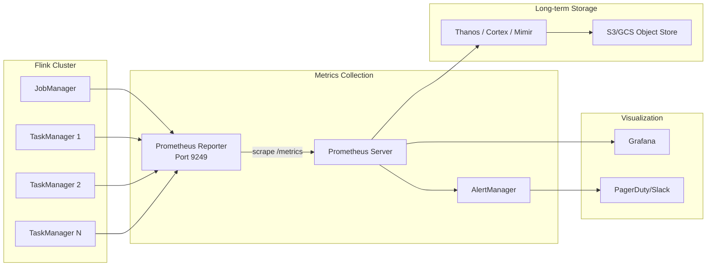
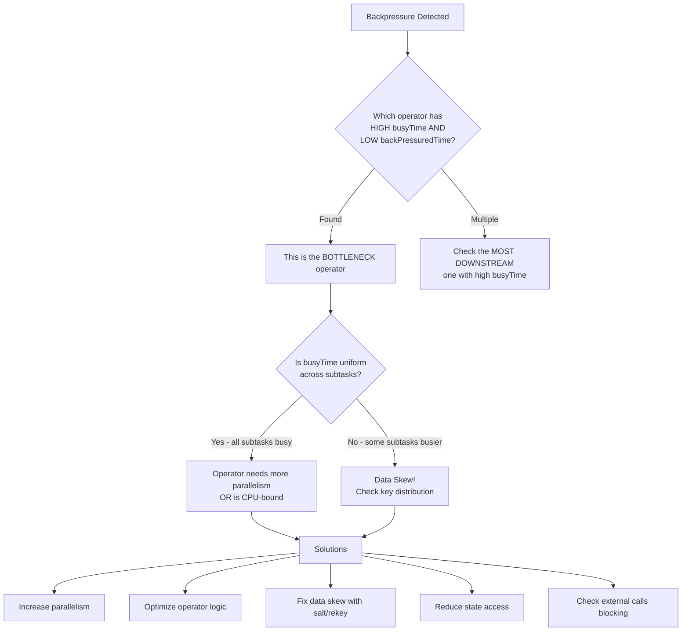
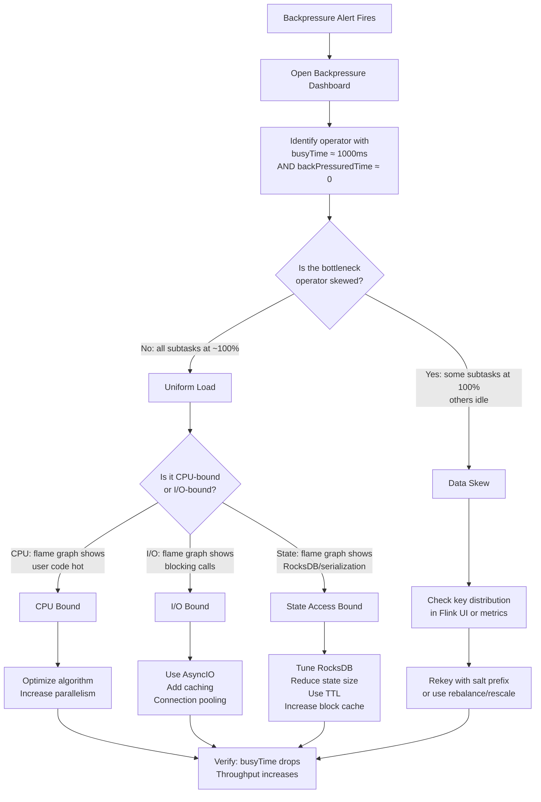
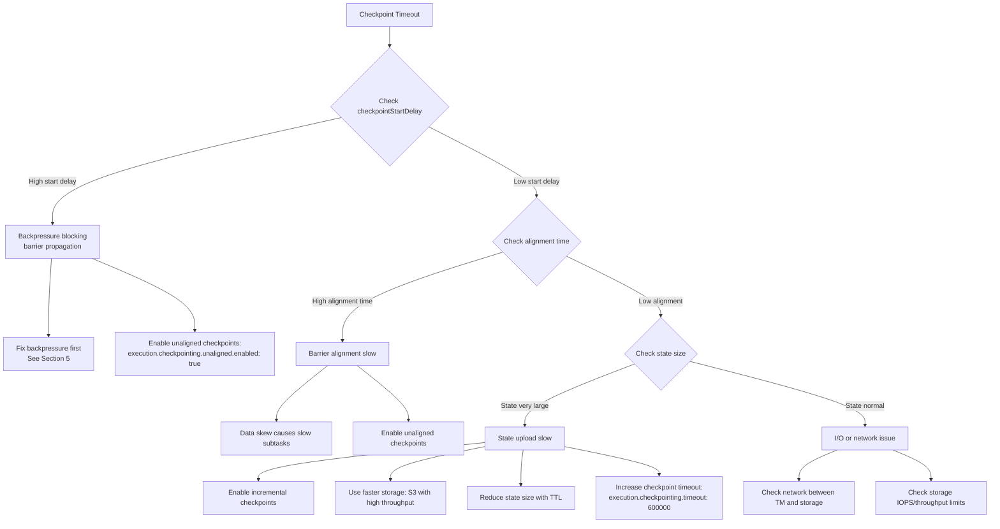

# Monitoring, Alerting & Debugging Apache Flink in Production

> Complete observability guide for billion-scale Flink deployments

---

## Table of Contents

1. [Metrics Architecture](#1-metrics-architecture)
2. [Critical Metrics Dashboard](#2-critical-metrics-dashboard)
3. [Grafana Dashboard JSON](#3-grafana-dashboard-json)
4. [Alerting Rules](#4-alerting-rules)
5. [Backpressure Deep Dive](#5-backpressure-deep-dive)
6. [Debugging Common Production Issues](#6-debugging-common-production-issues)
7. [Distributed Tracing Integration](#7-distributed-tracing-integration)
8. [Log Management for Flink](#8-log-management-for-flink)
9. [Performance Profiling](#9-performance-profiling)
10. [SLA Monitoring](#10-sla-monitoring)

---

## 1. Metrics Architecture

### Flink → Prometheus → Grafana Pipeline

Flink exposes metrics through a hierarchical scope system. In production, the standard pipeline is:

```
Flink TaskManagers/JobManagers
    → Prometheus Reporter (pull-based via /metrics endpoint)
        → Prometheus Server (scrape, store, query)
            → Grafana (visualize)
            → AlertManager (alert)
```

### Metrics Flow Diagram



### Metric Scopes

Flink metrics are organized in a hierarchy:

| Scope | Description | Example Metric |
|-------|-------------|----------------|
| **System** | JVM, OS-level metrics | `Status.JVM.Memory.Heap.Used` |
| **Job** | Per-job aggregates | `numRestarts`, `lastCheckpointDuration` |
| **Operator** | Per-operator aggregates | `numRecordsIn`, `numRecordsOut` |
| **Task** | Per-parallel-instance of operator | `currentInputWatermark` |
| **Subtask** | Individual subtask (parallelism index) | `busyTimeMsPerSecond` |

### Metric Reporter Configuration

**flink-conf.yaml:**

```yaml
# Prometheus Reporter (recommended for production)
metrics.reporter.prometheus.factory.class: org.apache.flink.metrics.prometheus.PrometheusReporterFactory
metrics.reporter.prometheus.port: 9249-9260

# Metric scope formats (customize for your naming convention)
metrics.scope.jm: <host>.jobmanager
metrics.scope.jm.job: <host>.jobmanager.<job_name>
metrics.scope.tm: <host>.taskmanager.<tm_id>
metrics.scope.tm.job: <host>.taskmanager.<tm_id>.<job_name>
metrics.scope.task: <host>.taskmanager.<tm_id>.<job_name>.<task_name>.<subtask_index>
metrics.scope.operator: <host>.taskmanager.<tm_id>.<job_name>.<operator_name>.<subtask_index>

# Latency tracking (adds overhead at scale - sample in production)
metrics.latency.interval: 30000
metrics.latency.granularity: operator

# System metrics
metrics.system-resource: true
metrics.system-resource-probing-interval: 5000
```

**Kubernetes ServiceMonitor for Prometheus Operator:**

```yaml
apiVersion: monitoring.coreos.com/v1
kind: ServiceMonitor
metadata:
  name: flink-metrics
  namespace: flink
  labels:
    release: prometheus
spec:
  selector:
    matchLabels:
      component: taskmanager
  namespaceSelector:
    matchNames:
      - flink
  endpoints:
    - port: metrics
      interval: 10s
      path: /
      honorLabels: true
---
apiVersion: monitoring.coreos.com/v1
kind: ServiceMonitor
metadata:
  name: flink-jobmanager-metrics
  namespace: flink
spec:
  selector:
    matchLabels:
      component: jobmanager
  endpoints:
    - port: metrics
      interval: 10s
      path: /
```

### Custom Metrics in Application Code

```java
public class EnrichedOrderProcessor extends RichFlatMapFunction<Order, EnrichedOrder> {
    
    // Counters
    private transient Counter enrichmentFailures;
    private transient Counter enrichmentSuccesses;
    
    // Gauges
    private transient AtomicLong cacheSize;
    
    // Histograms
    private transient Histogram enrichmentLatency;
    
    // Meters (throughput)
    private transient Meter enrichmentRate;

    @Override
    public void open(Configuration parameters) {
        // Counter - monotonically increasing
        enrichmentFailures = getRuntimeContext()
            .getMetricGroup()
            .addGroup("enrichment")
            .counter("failures");
        
        enrichmentSuccesses = getRuntimeContext()
            .getMetricGroup()
            .addGroup("enrichment")
            .counter("successes");
        
        // Gauge - point-in-time value
        cacheSize = new AtomicLong(0);
        getRuntimeContext()
            .getMetricGroup()
            .addGroup("enrichment")
            .gauge("cache_size", () -> cacheSize.get());
        
        // Histogram - value distribution
        enrichmentLatency = getRuntimeContext()
            .getMetricGroup()
            .addGroup("enrichment")
            .histogram("latency_ms", new DescriptiveStatisticsHistogram(1000));
        
        // Meter - rate of events
        enrichmentRate = getRuntimeContext()
            .getMetricGroup()
            .addGroup("enrichment")
            .meter("rate", new MeterView(60));
    }

    @Override
    public void flatMap(Order order, Collector<EnrichedOrder> out) {
        long start = System.currentTimeMillis();
        try {
            EnrichedOrder enriched = enrich(order);
            out.collect(enriched);
            enrichmentSuccesses.inc();
            enrichmentRate.markEvent();
        } catch (Exception e) {
            enrichmentFailures.inc();
        } finally {
            enrichmentLatency.update(System.currentTimeMillis() - start);
        }
    }
}
```

---

## 2. Critical Metrics Dashboard

### Throughput Metrics

| Metric | PromQL | What It Tells You |
|--------|--------|-------------------|
| Records In/sec | `rate(flink_taskmanager_job_task_operator_numRecordsIn[1m])` | Input throughput per operator |
| Records Out/sec | `rate(flink_taskmanager_job_task_operator_numRecordsOut[1m])` | Output throughput per operator |
| Bytes In/sec | `rate(flink_taskmanager_job_task_operator_numBytesIn[1m])` | Data volume ingested |
| Bytes Out/sec | `rate(flink_taskmanager_job_task_operator_numBytesOut[1m])` | Data volume produced |
| Records In vs Out ratio | `rate(numRecordsOut[1m]) / rate(numRecordsIn[1m])` | Filter ratio / fan-out detection |
| Total throughput | `sum(rate(flink_taskmanager_job_task_operator_numRecordsIn[1m])) by (job_name)` | Job-level aggregate |

**Key Queries:**

```promql
# Per-operator throughput
sum(rate(flink_taskmanager_job_task_operator_numRecordsIn{job_name="$job"}[5m])) by (operator_name)

# Throughput drop detection (compare to 1h ago)
sum(rate(flink_taskmanager_job_task_operator_numRecordsIn{job_name="$job"}[5m]))
/ 
sum(rate(flink_taskmanager_job_task_operator_numRecordsIn{job_name="$job"}[5m] offset 1h))

# Source vs Sink throughput (detect data loss)
sum(rate(flink_taskmanager_job_task_operator_numRecordsOut{operator_name=~".*Source.*"}[5m]))
-
sum(rate(flink_taskmanager_job_task_operator_numRecordsIn{operator_name=~".*Sink.*"}[5m]))
```

### Latency Metrics

| Metric | PromQL | What It Tells You |
|--------|--------|-------------------|
| End-to-end latency | `flink_taskmanager_job_latency_source_id_operator_id_operator_subtask_index_latency` | Processing delay source→sink |
| Event time lag | `time() * 1000 - flink_taskmanager_job_task_operator_currentInputWatermark` | How far behind real-time |
| Watermark lag | `max(flink_taskmanager_job_task_operator_currentInputWatermark) - min(flink_taskmanager_job_task_operator_currentInputWatermark)` | Watermark skew across subtasks |

**Key Queries:**

```promql
# Event time lag in seconds (how far behind real-time)
(time() * 1000 - flink_taskmanager_job_task_operator_currentInputWatermark{operator_name=~".*Window.*"}) / 1000

# P99 end-to-end latency
histogram_quantile(0.99, 
  rate(flink_taskmanager_job_latency_source_id_operator_id_operator_subtask_index_latency_bucket[5m])
)

# Watermark progress rate (should be ~1000ms/sec for caught-up jobs)
rate(flink_taskmanager_job_task_operator_currentInputWatermark[1m]) / 1000
```

### Backpressure Metrics

| Metric | PromQL | Meaning |
|--------|--------|---------|
| busyTimeMsPerSecond | `flink_taskmanager_job_task_busyTimeMsPerSecond` | Time spent processing (0-1000) |
| backPressuredTimeMsPerSecond | `flink_taskmanager_job_task_backPressuredTimeMsPerSecond` | Time blocked by downstream (0-1000) |
| idleTimeMsPerSecond | `flink_taskmanager_job_task_idleTimeMsPerSecond` | Time waiting for input (0-1000) |
| isBackPressured | `flink_taskmanager_job_task_isBackPressured` | Boolean (0/1) |
| Output buffer usage | `flink_taskmanager_job_task_buffers_outPoolUsage` | % of output buffers in use |
| Input buffer usage | `flink_taskmanager_job_task_buffers_inPoolUsage` | % of input buffers in use |

**Key Queries:**

```promql
# Backpressure ratio per operator (>0.5 is concerning)
flink_taskmanager_job_task_backPressuredTimeMsPerSecond{job_name="$job"} / 1000

# Busy ratio (saturated operators)
flink_taskmanager_job_task_busyTimeMsPerSecond{job_name="$job"} / 1000

# Bottleneck operator: high busy + low backpressure = the slow one
flink_taskmanager_job_task_busyTimeMsPerSecond > 800
and
flink_taskmanager_job_task_backPressuredTimeMsPerSecond < 100

# Output buffer saturation
flink_taskmanager_job_task_buffers_outPoolUsage{job_name="$job"} > 0.9
```

### Checkpointing Metrics

| Metric | PromQL | What It Tells You |
|--------|--------|-------------------|
| Duration | `flink_jobmanager_job_lastCheckpointDuration` | Time to complete last checkpoint |
| Size | `flink_jobmanager_job_lastCheckpointSize` | State size in bytes |
| Failed count | `flink_jobmanager_job_numberOfFailedCheckpoints` | Total failures (monotonic) |
| In-progress count | `flink_jobmanager_job_numberOfInProgressCheckpoints` | Stuck checkpoints |
| Alignment duration | `flink_taskmanager_job_task_checkpointAlignmentTime` | Barrier alignment time |
| Start delay | `flink_taskmanager_job_task_checkpointStartDelay` | Time from trigger to start |

**Key Queries:**

```promql
# Checkpoint duration trend
flink_jobmanager_job_lastCheckpointDuration{job_name="$job"}

# Checkpoint failure rate
rate(flink_jobmanager_job_numberOfFailedCheckpoints{job_name="$job"}[10m])

# Checkpoint size growth (state growing?)
deriv(flink_jobmanager_job_lastCheckpointSize{job_name="$job"}[1h])

# Alignment time per subtask (identifies slow subtasks)
flink_taskmanager_job_task_checkpointAlignmentTime{job_name="$job"}

# Checkpoint start delay (backpressure blocking barriers)
max(flink_taskmanager_job_task_checkpointStartDelay{job_name="$job"}) by (task_name)
```

### State & RocksDB Metrics

| Metric | PromQL | What It Tells You |
|--------|--------|-------------------|
| State size | `flink_taskmanager_job_task_operator_state_size` | Operator state bytes |
| RocksDB compaction pending | `flink_taskmanager_job_task_operator_rocksdb_compaction_pending` | Compaction queue depth |
| Block cache hit rate | `flink_taskmanager_job_task_operator_rocksdb_block_cache_hit / (hit + miss)` | Cache effectiveness |
| Live SST files size | `flink_taskmanager_job_task_operator_rocksdb_live_sst_files_size` | Disk usage |
| Write stall duration | `flink_taskmanager_job_task_operator_rocksdb_stall_micros` | Writes blocked |
| Num running compactions | `flink_taskmanager_job_task_operator_rocksdb_num_running_compactions` | Compaction load |

**Key Queries:**

```promql
# Total state size per operator
sum(flink_taskmanager_job_task_operator_rocksdb_live_sst_files_size{job_name="$job"}) by (operator_name)

# RocksDB block cache hit rate
sum(rate(flink_taskmanager_job_task_operator_rocksdb_block_cache_hit[5m])) by (operator_name)
/
(sum(rate(flink_taskmanager_job_task_operator_rocksdb_block_cache_hit[5m])) by (operator_name)
+ sum(rate(flink_taskmanager_job_task_operator_rocksdb_block_cache_miss[5m])) by (operator_name))

# Write stall rate (critical performance issue)
rate(flink_taskmanager_job_task_operator_rocksdb_stall_micros[5m])

# Compaction pressure
flink_taskmanager_job_task_operator_rocksdb_num_running_compactions
+ flink_taskmanager_job_task_operator_rocksdb_compaction_pending
```

### JVM Metrics

| Metric | PromQL | What It Tells You |
|--------|--------|-------------------|
| Heap used | `flink_taskmanager_Status_JVM_Memory_Heap_Used` | Heap consumption |
| GC time | `flink_taskmanager_Status_JVM_GarbageCollector_G1_Old_Generation_Time` | GC overhead |
| GC count | `flink_taskmanager_Status_JVM_GarbageCollector_G1_Young_Generation_Count` | GC frequency |
| Direct memory | `flink_taskmanager_Status_JVM_Memory_Direct_MemoryUsed` | Off-heap usage |
| Thread count | `flink_taskmanager_Status_JVM_Threads_Count` | Thread leaks |
| Metaspace | `flink_taskmanager_Status_JVM_Memory_Metaspace_Used` | Class loading |

**Key Queries:**

```promql
# Heap utilization percentage
flink_taskmanager_Status_JVM_Memory_Heap_Used / flink_taskmanager_Status_JVM_Memory_Heap_Max

# GC time percentage (>5% is bad, >10% is critical)
rate(flink_taskmanager_Status_JVM_GarbageCollector_G1_Old_Generation_Time[5m]) / 1000 * 100

# Direct memory growth (potential leak)
deriv(flink_taskmanager_Status_JVM_Memory_Direct_MemoryUsed[30m])

# Full GC frequency
rate(flink_taskmanager_Status_JVM_GarbageCollector_G1_Old_Generation_Count[5m])
```

### Kafka Consumer Metrics

| Metric | PromQL | What It Tells You |
|--------|--------|-------------------|
| Consumer lag | `flink_taskmanager_job_task_operator_KafkaConsumer_records_lag_max` | Messages behind |
| Consume rate | `flink_taskmanager_job_task_operator_KafkaConsumer_records_consumed_rate` | Read throughput |
| Commit rate | `flink_taskmanager_job_task_operator_KafkaConsumer_commit_rate` | Offset commit frequency |
| Fetch rate | `flink_taskmanager_job_task_operator_KafkaConsumer_fetch_rate` | Fetch request frequency |
| Bytes consumed | `flink_taskmanager_job_task_operator_KafkaConsumer_bytes_consumed_rate` | Data volume |

**Key Queries:**

```promql
# Max consumer lag across all partitions
max(flink_taskmanager_job_task_operator_KafkaConsumer_records_lag_max{job_name="$job"}) by (operator_name)

# Consumer lag trend (growing = falling behind)
deriv(flink_taskmanager_job_task_operator_KafkaConsumer_records_lag_max{job_name="$job"}[10m])

# Consume rate vs production rate
sum(rate(flink_taskmanager_job_task_operator_KafkaConsumer_records_consumed_rate{job_name="$job"}[5m]))

# Per-partition lag (identifies hot partitions)
flink_taskmanager_job_task_operator_KafkaConsumer_records_lag_max{job_name="$job"}
```

### Connector Health Metrics

```promql
# Kafka sink - pending records (buffered but not sent)
flink_taskmanager_job_task_operator_KafkaProducer_record_queue_time_avg

# JDBC sink - pending rows
flink_taskmanager_job_task_operator_numRecordsOut - flink_taskmanager_job_task_operator_numRecordsOutErrors

# Elasticsearch sink - pending actions
flink_taskmanager_job_task_operator_numBytesOut

# Any sink - error rate
rate(flink_taskmanager_job_task_operator_numRecordsOutErrors{job_name="$job"}[5m])
```

---

## 3. Grafana Dashboard JSON

### Job Overview Dashboard

```json
{
  "dashboard": {
    "title": "Flink Job Overview",
    "uid": "flink-job-overview",
    "tags": ["flink", "streaming"],
    "timezone": "browser",
    "refresh": "10s",
    "templating": {
      "list": [
        {
          "name": "job",
          "type": "query",
          "query": "label_values(flink_jobmanager_job_uptime, job_name)",
          "datasource": "Prometheus"
        },
        {
          "name": "operator",
          "type": "query",
          "query": "label_values(flink_taskmanager_job_task_operator_numRecordsIn{job_name=\"$job\"}, operator_name)",
          "datasource": "Prometheus",
          "multi": true,
          "includeAll": true
        }
      ]
    },
    "panels": [
      {
        "title": "Job Uptime",
        "type": "stat",
        "gridPos": {"h": 4, "w": 4, "x": 0, "y": 0},
        "targets": [
          {
            "expr": "flink_jobmanager_job_uptime{job_name=\"$job\"} / 1000",
            "legendFormat": "Uptime (s)"
          }
        ],
        "fieldConfig": {
          "defaults": {
            "unit": "s",
            "thresholds": {
              "steps": [
                {"color": "red", "value": 0},
                {"color": "yellow", "value": 300},
                {"color": "green", "value": 3600}
              ]
            }
          }
        }
      },
      {
        "title": "Restarts",
        "type": "stat",
        "gridPos": {"h": 4, "w": 4, "x": 4, "y": 0},
        "targets": [
          {
            "expr": "flink_jobmanager_job_numRestarts{job_name=\"$job\"}",
            "legendFormat": "Restarts"
          }
        ],
        "fieldConfig": {
          "defaults": {
            "thresholds": {
              "steps": [
                {"color": "green", "value": 0},
                {"color": "yellow", "value": 1},
                {"color": "red", "value": 5}
              ]
            }
          }
        }
      },
      {
        "title": "Checkpoint Status",
        "type": "stat",
        "gridPos": {"h": 4, "w": 4, "x": 8, "y": 0},
        "targets": [
          {
            "expr": "flink_jobmanager_job_lastCheckpointDuration{job_name=\"$job\"}",
            "legendFormat": "Last Duration"
          }
        ],
        "fieldConfig": {
          "defaults": {
            "unit": "ms",
            "thresholds": {
              "steps": [
                {"color": "green", "value": 0},
                {"color": "yellow", "value": 30000},
                {"color": "red", "value": 120000}
              ]
            }
          }
        }
      },
      {
        "title": "Records In/Out per Second",
        "type": "timeseries",
        "gridPos": {"h": 8, "w": 12, "x": 0, "y": 4},
        "targets": [
          {
            "expr": "sum(rate(flink_taskmanager_job_task_operator_numRecordsIn{job_name=\"$job\", operator_name=~\"$operator\"}[1m])) by (operator_name)",
            "legendFormat": "{{operator_name}} - In"
          },
          {
            "expr": "sum(rate(flink_taskmanager_job_task_operator_numRecordsOut{job_name=\"$job\", operator_name=~\"$operator\"}[1m])) by (operator_name)",
            "legendFormat": "{{operator_name}} - Out"
          }
        ],
        "fieldConfig": {
          "defaults": {"unit": "ops"}
        }
      },
      {
        "title": "Event Time Lag",
        "type": "timeseries",
        "gridPos": {"h": 8, "w": 12, "x": 12, "y": 4},
        "targets": [
          {
            "expr": "(time() * 1000 - flink_taskmanager_job_task_operator_currentInputWatermark{job_name=\"$job\", operator_name=~\"$operator\"}) / 1000",
            "legendFormat": "{{operator_name}} - {{subtask_index}}"
          }
        ],
        "fieldConfig": {
          "defaults": {"unit": "s"}
        }
      },
      {
        "title": "Checkpoint Duration Over Time",
        "type": "timeseries",
        "gridPos": {"h": 8, "w": 12, "x": 0, "y": 12},
        "targets": [
          {
            "expr": "flink_jobmanager_job_lastCheckpointDuration{job_name=\"$job\"}",
            "legendFormat": "Checkpoint Duration"
          },
          {
            "expr": "flink_jobmanager_job_lastCheckpointSize{job_name=\"$job\"}",
            "legendFormat": "Checkpoint Size"
          }
        ],
        "fieldConfig": {
          "overrides": [
            {
              "matcher": {"id": "byName", "options": "Checkpoint Duration"},
              "properties": [{"id": "unit", "value": "ms"}]
            },
            {
              "matcher": {"id": "byName", "options": "Checkpoint Size"},
              "properties": [{"id": "unit", "value": "bytes"}, {"id": "custom.axisPlacement", "value": "right"}]
            }
          ]
        }
      },
      {
        "title": "Kafka Consumer Lag",
        "type": "timeseries",
        "gridPos": {"h": 8, "w": 12, "x": 12, "y": 12},
        "targets": [
          {
            "expr": "max(flink_taskmanager_job_task_operator_KafkaConsumer_records_lag_max{job_name=\"$job\"}) by (operator_name)",
            "legendFormat": "{{operator_name}}"
          }
        ]
      }
    ]
  }
}
```

### Backpressure Investigation Dashboard

```json
{
  "dashboard": {
    "title": "Flink Backpressure Investigation",
    "uid": "flink-backpressure",
    "tags": ["flink", "debugging"],
    "refresh": "5s",
    "panels": [
      {
        "title": "Backpressure Ratio per Task",
        "type": "heatmap",
        "gridPos": {"h": 8, "w": 24, "x": 0, "y": 0},
        "targets": [
          {
            "expr": "flink_taskmanager_job_task_backPressuredTimeMsPerSecond{job_name=\"$job\"} / 1000",
            "legendFormat": "{{task_name}} [{{subtask_index}}]"
          }
        ]
      },
      {
        "title": "Busy Time (Saturated = Bottleneck)",
        "type": "timeseries",
        "gridPos": {"h": 8, "w": 12, "x": 0, "y": 8},
        "targets": [
          {
            "expr": "flink_taskmanager_job_task_busyTimeMsPerSecond{job_name=\"$job\"} / 1000",
            "legendFormat": "{{task_name}} [{{subtask_index}}]"
          }
        ],
        "fieldConfig": {
          "defaults": {
            "unit": "percentunit",
            "max": 1,
            "thresholds": {
              "steps": [
                {"color": "green", "value": 0},
                {"color": "yellow", "value": 0.7},
                {"color": "red", "value": 0.9}
              ]
            }
          }
        }
      },
      {
        "title": "Idle Time (Starved = Upstream Slow)",
        "type": "timeseries",
        "gridPos": {"h": 8, "w": 12, "x": 12, "y": 8},
        "targets": [
          {
            "expr": "flink_taskmanager_job_task_idleTimeMsPerSecond{job_name=\"$job\"} / 1000",
            "legendFormat": "{{task_name}} [{{subtask_index}}]"
          }
        ],
        "fieldConfig": {
          "defaults": {"unit": "percentunit", "max": 1}
        }
      },
      {
        "title": "Buffer Pool Usage",
        "type": "timeseries",
        "gridPos": {"h": 8, "w": 12, "x": 0, "y": 16},
        "targets": [
          {
            "expr": "flink_taskmanager_job_task_buffers_outPoolUsage{job_name=\"$job\"}",
            "legendFormat": "Out - {{task_name}} [{{subtask_index}}]"
          },
          {
            "expr": "flink_taskmanager_job_task_buffers_inPoolUsage{job_name=\"$job\"}",
            "legendFormat": "In - {{task_name}} [{{subtask_index}}]"
          }
        ]
      },
      {
        "title": "Checkpoint Start Delay (Backpressure blocking barriers)",
        "type": "timeseries",
        "gridPos": {"h": 8, "w": 12, "x": 12, "y": 16},
        "targets": [
          {
            "expr": "flink_taskmanager_job_task_checkpointStartDelay{job_name=\"$job\"}",
            "legendFormat": "{{task_name}} [{{subtask_index}}]"
          }
        ],
        "fieldConfig": {
          "defaults": {"unit": "ms"}
        }
      }
    ]
  }
}
```

### State & RocksDB Health Dashboard

```json
{
  "dashboard": {
    "title": "Flink State & RocksDB Health",
    "uid": "flink-state-rocksdb",
    "tags": ["flink", "state", "rocksdb"],
    "panels": [
      {
        "title": "Total State Size per Operator",
        "type": "timeseries",
        "gridPos": {"h": 8, "w": 12, "x": 0, "y": 0},
        "targets": [
          {
            "expr": "sum(flink_taskmanager_job_task_operator_rocksdb_live_sst_files_size{job_name=\"$job\"}) by (operator_name)",
            "legendFormat": "{{operator_name}}"
          }
        ],
        "fieldConfig": {"defaults": {"unit": "bytes"}}
      },
      {
        "title": "Block Cache Hit Rate",
        "type": "gauge",
        "gridPos": {"h": 8, "w": 12, "x": 12, "y": 0},
        "targets": [
          {
            "expr": "sum(rate(flink_taskmanager_job_task_operator_rocksdb_block_cache_hit{job_name=\"$job\"}[5m])) by (operator_name) / (sum(rate(flink_taskmanager_job_task_operator_rocksdb_block_cache_hit{job_name=\"$job\"}[5m])) by (operator_name) + sum(rate(flink_taskmanager_job_task_operator_rocksdb_block_cache_miss{job_name=\"$job\"}[5m])) by (operator_name))",
            "legendFormat": "{{operator_name}}"
          }
        ],
        "fieldConfig": {
          "defaults": {
            "unit": "percentunit",
            "thresholds": {
              "steps": [
                {"color": "red", "value": 0},
                {"color": "yellow", "value": 0.8},
                {"color": "green", "value": 0.95}
              ]
            }
          }
        }
      },
      {
        "title": "Write Stall Duration",
        "type": "timeseries",
        "gridPos": {"h": 8, "w": 12, "x": 0, "y": 8},
        "targets": [
          {
            "expr": "rate(flink_taskmanager_job_task_operator_rocksdb_stall_micros{job_name=\"$job\"}[5m])",
            "legendFormat": "{{operator_name}} [{{subtask_index}}]"
          }
        ],
        "fieldConfig": {"defaults": {"unit": "µs"}}
      },
      {
        "title": "Compaction Pending + Running",
        "type": "timeseries",
        "gridPos": {"h": 8, "w": 12, "x": 12, "y": 8},
        "targets": [
          {
            "expr": "flink_taskmanager_job_task_operator_rocksdb_compaction_pending{job_name=\"$job\"} + flink_taskmanager_job_task_operator_rocksdb_num_running_compactions{job_name=\"$job\"}",
            "legendFormat": "{{operator_name}} [{{subtask_index}}]"
          }
        ]
      },
      {
        "title": "Checkpoint Size Growth Rate",
        "type": "timeseries",
        "gridPos": {"h": 8, "w": 24, "x": 0, "y": 16},
        "targets": [
          {
            "expr": "deriv(flink_jobmanager_job_lastCheckpointSize{job_name=\"$job\"}[1h])",
            "legendFormat": "Size Growth Rate (bytes/sec)"
          }
        ],
        "fieldConfig": {"defaults": {"unit": "Bps"}}
      }
    ]
  }
}
```

### Kafka Consumer Lag Dashboard

```json
{
  "dashboard": {
    "title": "Flink Kafka Consumer Lag",
    "uid": "flink-kafka-lag",
    "tags": ["flink", "kafka"],
    "panels": [
      {
        "title": "Consumer Lag (Max per Partition)",
        "type": "timeseries",
        "gridPos": {"h": 10, "w": 24, "x": 0, "y": 0},
        "targets": [
          {
            "expr": "flink_taskmanager_job_task_operator_KafkaConsumer_records_lag_max{job_name=\"$job\"}",
            "legendFormat": "{{operator_name}} [{{subtask_index}}]"
          }
        ],
        "fieldConfig": {
          "defaults": {
            "thresholds": {
              "steps": [
                {"color": "green", "value": 0},
                {"color": "yellow", "value": 10000},
                {"color": "red", "value": 100000}
              ]
            }
          }
        }
      },
      {
        "title": "Lag Growth Rate (positive = falling behind)",
        "type": "timeseries",
        "gridPos": {"h": 8, "w": 12, "x": 0, "y": 10},
        "targets": [
          {
            "expr": "deriv(flink_taskmanager_job_task_operator_KafkaConsumer_records_lag_max{job_name=\"$job\"}[5m])",
            "legendFormat": "{{operator_name}} [{{subtask_index}}]"
          }
        ]
      },
      {
        "title": "Consume Rate",
        "type": "timeseries",
        "gridPos": {"h": 8, "w": 12, "x": 12, "y": 10},
        "targets": [
          {
            "expr": "sum(flink_taskmanager_job_task_operator_KafkaConsumer_records_consumed_rate{job_name=\"$job\"}) by (operator_name)",
            "legendFormat": "{{operator_name}}"
          }
        ],
        "fieldConfig": {"defaults": {"unit": "ops"}}
      },
      {
        "title": "Time to Drain Lag (estimated)",
        "type": "stat",
        "gridPos": {"h": 6, "w": 24, "x": 0, "y": 18},
        "targets": [
          {
            "expr": "max(flink_taskmanager_job_task_operator_KafkaConsumer_records_lag_max{job_name=\"$job\"}) / sum(flink_taskmanager_job_task_operator_KafkaConsumer_records_consumed_rate{job_name=\"$job\"})",
            "legendFormat": "Estimated drain time"
          }
        ],
        "fieldConfig": {"defaults": {"unit": "s"}}
      }
    ]
  }
}
```

---

## 4. Alerting Rules

### Prometheus AlertManager Configuration

```yaml
# alertmanager.yml
global:
  resolve_timeout: 5m
  slack_api_url: 'https://hooks.slack.com/services/xxx/yyy/zzz'
  pagerduty_url: 'https://events.pagerduty.com/v2/enqueue'

route:
  receiver: 'slack-default'
  group_by: ['alertname', 'job_name']
  group_wait: 30s
  group_interval: 5m
  repeat_interval: 4h
  routes:
    - match:
        severity: critical
      receiver: 'pagerduty-critical'
      repeat_interval: 5m
    - match:
        severity: warning
      receiver: 'slack-warning'
      repeat_interval: 30m

receivers:
  - name: 'pagerduty-critical'
    pagerduty_configs:
      - routing_key: '<pagerduty-routing-key>'
        severity: critical
        description: '{{ .CommonAnnotations.summary }}'
  - name: 'slack-warning'
    slack_configs:
      - channel: '#flink-alerts'
        title: '{{ .CommonLabels.alertname }}'
        text: '{{ .CommonAnnotations.description }}'
  - name: 'slack-default'
    slack_configs:
      - channel: '#flink-info'
```

### Alert Rules

```yaml
# flink-alerts.yml
groups:
  - name: flink.critical
    rules:
      # =========== CRITICAL ===========
      
      - alert: FlinkCheckpointFailing
        expr: |
          rate(flink_jobmanager_job_numberOfFailedCheckpoints[10m]) > 0
          and
          flink_jobmanager_job_numberOfInProgressCheckpoints == 0
        for: 5m
        labels:
          severity: critical
        annotations:
          summary: "Flink job {{ $labels.job_name }} checkpoints are failing"
          description: "Checkpoints have been failing for 5+ minutes. Last checkpoint failed. Risk of data loss on failure."
          runbook: "https://wiki.internal/runbooks/flink-checkpoint-failure"

      - alert: FlinkJobRestartLoop
        expr: |
          increase(flink_jobmanager_job_numRestarts[10m]) > 3
        for: 2m
        labels:
          severity: critical
        annotations:
          summary: "Flink job {{ $labels.job_name }} is in a restart loop"
          description: "Job has restarted {{ $value }} times in 10 minutes. Likely crash-looping."
          runbook: "https://wiki.internal/runbooks/flink-restart-loop"

      - alert: FlinkConsumerLagCritical
        expr: |
          max(flink_taskmanager_job_task_operator_KafkaConsumer_records_lag_max) by (job_name) > 1000000
          and
          deriv(flink_taskmanager_job_task_operator_KafkaConsumer_records_lag_max[10m]) > 0
        for: 10m
        labels:
          severity: critical
        annotations:
          summary: "Kafka consumer lag critical for {{ $labels.job_name }}"
          description: "Consumer lag is {{ $value | humanize }} and growing. SLA breach imminent."

      - alert: FlinkJobDown
        expr: |
          absent(flink_jobmanager_job_uptime{job_name="$critical_job"})
        for: 2m
        labels:
          severity: critical
        annotations:
          summary: "Flink job {{ $labels.job_name }} is not running"
          description: "The job metrics have disappeared. Job may have crashed without restart."

      - alert: FlinkCheckpointTimeout
        expr: |
          flink_jobmanager_job_numberOfInProgressCheckpoints > 0
          and
          (time() - flink_jobmanager_job_lastCheckpointRestoreTimestamp) > 600
        for: 5m
        labels:
          severity: critical
        annotations:
          summary: "Checkpoint stuck for {{ $labels.job_name }}"
          description: "A checkpoint has been in-progress for over 10 minutes."

  - name: flink.warning
    rules:
      # =========== WARNING ===========
      
      - alert: FlinkBackpressureHigh
        expr: |
          flink_taskmanager_job_task_backPressuredTimeMsPerSecond > 500
        for: 5m
        labels:
          severity: warning
        annotations:
          summary: "Backpressure detected in {{ $labels.job_name }}"
          description: "Task {{ $labels.task_name }}[{{ $labels.subtask_index }}] is backpressured {{ $value }}ms/sec (>50%)."

      - alert: FlinkGCTimeHigh
        expr: |
          rate(flink_taskmanager_Status_JVM_GarbageCollector_G1_Old_Generation_Time[5m]) > 50
        for: 10m
        labels:
          severity: warning
        annotations:
          summary: "High GC time on TaskManager {{ $labels.instance }}"
          description: "Old Gen GC consuming {{ $value }}ms/sec. May cause checkpoint timeouts."

      - alert: FlinkStateSizeGrowing
        expr: |
          deriv(flink_jobmanager_job_lastCheckpointSize[1h]) > 10485760
        for: 30m
        labels:
          severity: warning
        annotations:
          summary: "State size growing rapidly for {{ $labels.job_name }}"
          description: "State growing at {{ $value | humanize }}B/sec. Check for missing TTL or unbounded state."

      - alert: FlinkCheckpointDurationHigh
        expr: |
          flink_jobmanager_job_lastCheckpointDuration > 120000
        for: 5m
        labels:
          severity: warning
        annotations:
          summary: "Checkpoint taking >2min for {{ $labels.job_name }}"
          description: "Last checkpoint took {{ $value | humanizeDuration }}. Investigate state size and I/O."

      - alert: FlinkConsumerLagWarning
        expr: |
          max(flink_taskmanager_job_task_operator_KafkaConsumer_records_lag_max) by (job_name) > 100000
        for: 15m
        labels:
          severity: warning
        annotations:
          summary: "Kafka consumer lag elevated for {{ $labels.job_name }}"
          description: "Consumer lag is {{ $value | humanize }} messages."

      - alert: FlinkHeapUsageHigh
        expr: |
          flink_taskmanager_Status_JVM_Memory_Heap_Used / flink_taskmanager_Status_JVM_Memory_Heap_Max > 0.9
        for: 10m
        labels:
          severity: warning
        annotations:
          summary: "Heap usage >90% on {{ $labels.instance }}"

      - alert: FlinkRocksDBWriteStall
        expr: |
          rate(flink_taskmanager_job_task_operator_rocksdb_stall_micros[5m]) > 100000
        for: 5m
        labels:
          severity: warning
        annotations:
          summary: "RocksDB write stalls in {{ $labels.job_name }}"
          description: "Operator {{ $labels.operator_name }} experiencing write stalls. Compaction cannot keep up."

  - name: flink.info
    rules:
      # =========== INFO ===========
      
      - alert: FlinkJobRestarted
        expr: |
          increase(flink_jobmanager_job_numRestarts[5m]) > 0
        labels:
          severity: info
        annotations:
          summary: "Flink job {{ $labels.job_name }} restarted"
          description: "Job restarted (total restarts: {{ $value }}). Check logs for root cause."

      - alert: FlinkRescalingTriggered
        expr: |
          changes(flink_jobmanager_job_numRegisteredTaskManagers[5m]) > 0
        labels:
          severity: info
        annotations:
          summary: "TaskManager count changed for {{ $labels.job_name }}"
          description: "Number of registered TaskManagers changed. Rescaling may have occurred."

      - alert: FlinkCheckpointSizeSpike
        expr: |
          flink_jobmanager_job_lastCheckpointSize > 1.5 * avg_over_time(flink_jobmanager_job_lastCheckpointSize[1h])
        labels:
          severity: info
        annotations:
          summary: "Checkpoint size spike for {{ $labels.job_name }}"
```

---

## 5. Backpressure Deep Dive

### Understanding the Three Time Metrics

Every Flink task reports how it spends each second:

```
busyTime + backPressuredTime + idleTime = 1000ms
```

| Metric | Meaning | Interpretation |
|--------|---------|----------------|
| `busyTime = 1000` | Fully utilized | This operator IS the bottleneck |
| `backPressuredTime = 1000` | Blocked by downstream | Downstream IS the bottleneck |
| `idleTime = 1000` | Waiting for data | Upstream is slow or source is idle |

### How to Identify the Bottleneck Operator



### Backpressure vs Source Slowdown

| Symptom | Backpressure | Source Slowdown |
|---------|-------------|-----------------|
| Source idle time | Low (busy reading) | HIGH (no data to read) |
| Source output buffer | Full (100%) | Empty/Low |
| Downstream busy time | High | Low |
| Consumer lag | Growing | Stable/Decreasing |
| Root cause | Processing can't keep up | Not enough input data |

### Debugging Workflow



### Common Causes and Fixes

| Cause | Symptoms | Fix |
|-------|----------|-----|
| **Slow UDF** | busyTime=1000, CPU hot in flame graph | Optimize code, increase parallelism |
| **Data skew** | Some subtasks 100% busy, others idle | Rekey, pre-aggregate, salt keys |
| **State access** | RocksDB read/write in flame graph | Increase block cache, use SSD, reduce state |
| **Serialization** | Kryo/Avro in flame graph | Use POJO, Flink types, avoid Kryo |
| **External calls** | Blocking I/O in flame graph | AsyncIO, caching, circuit breaker |
| **GC pressure** | GC time high, busyTime fluctuates | Reduce object creation, tune heap |
| **Network** | outPoolUsage=100%, shuffle overhead | Increase network buffers, compression |
| **Sink slow** | Sink operator is bottleneck | Batch writes, increase sink parallelism |

### Flame Graph Analysis

Access via Flink Web UI: `http://<jobmanager>:8081/#/jobs/<job-id>/vertices/<vertex-id>/flamegraph`

What to look for:
- **Wide bars at top** = where time is spent
- `org.apache.flink.runtime.state.` = state access overhead
- `org.rocksdb.` = RocksDB operations
- `java.io.` / `java.net.` = I/O operations
- `com.esotericsoftware.kryo` = serialization overhead
- Your package name = application logic

---

## 6. Debugging Common Production Issues

### 6.1 Checkpoint Timeout



**Configuration fixes:**

```yaml
# Enable unaligned checkpoints (Flink 1.11+)
execution.checkpointing.unaligned.enabled: true
execution.checkpointing.aligned-checkpoint-timeout: 30s

# Incremental checkpoints (essential for large state)
state.backend.incremental: true

# Increase timeout
execution.checkpointing.timeout: 600000

# Limit concurrent checkpoints
execution.checkpointing.max-concurrent-checkpoints: 1

# Minimum pause between checkpoints
execution.checkpointing.min-pause: 30000
```

### 6.2 State Growing Unbounded

**Diagnosis:**

```promql
# Is state growing?
deriv(flink_jobmanager_job_lastCheckpointSize[6h])

# Which operator?
topk(5, sum(flink_taskmanager_job_task_operator_rocksdb_live_sst_files_size) by (operator_name))
```

**Common causes and fixes:**

| Cause | Fix |
|-------|-----|
| No TTL on ValueState/MapState | Configure state TTL |
| Window state for late data | Set allowed lateness with bound |
| ListState accumulating forever | Use reducing state or TTL |
| Session windows never closing | Set session gap timeout |
| Deduplication without expiry | TTL or bloom filter |

**State TTL configuration:**

```java
StateTtlConfig ttlConfig = StateTtlConfig
    .newBuilder(Duration.ofHours(24))
    .setUpdateType(StateTtlConfig.UpdateType.OnCreateAndWrite)
    .setStateVisibility(StateTtlConfig.StateVisibility.NeverReturnExpired)
    .cleanupInRocksdbCompactFilter(1000) // clean during compaction
    .build();

ValueStateDescriptor<UserProfile> descriptor = 
    new ValueStateDescriptor<>("user-profile", UserProfile.class);
descriptor.enableTimeToLive(ttlConfig);
```

### 6.3 Hot Keys (Skewed Parallelism)

**Diagnosis:**

```promql
# Subtask-level throughput variance
stddev(rate(flink_taskmanager_job_task_operator_numRecordsIn{operator_name="KeyedProcess"}[5m])) by (operator_name)
/
avg(rate(flink_taskmanager_job_task_operator_numRecordsIn{operator_name="KeyedProcess"}[5m])) by (operator_name)
```

**Coefficient of variation > 0.5 indicates significant skew.**

**Fixes:**

```java
// 1. Salt key for aggregation (two-phase aggregation)
// Phase 1: Pre-aggregate with salted key
input
    .map(event -> {
        int salt = ThreadLocalRandom.current().nextInt(10);
        return Tuple3.of(event.getKey() + "#" + salt, event.getKey(), event.getValue());
    })
    .keyBy(t -> t.f0)
    .window(TumblingEventTimeWindows.of(Time.minutes(1)))
    .reduce((a, b) -> new Tuple3<>(a.f0, a.f1, a.f2 + b.f2))
    // Phase 2: Final aggregation on real key
    .keyBy(t -> t.f1)
    .window(TumblingEventTimeWindows.of(Time.minutes(1)))
    .reduce((a, b) -> new Tuple3<>(a.f0, a.f1, a.f2 + b.f2));

// 2. Local pre-aggregation (Flink built-in)
// Use .reduce() or .aggregate() instead of .process() where possible

// 3. Rebalance before non-keyed operations
source.rebalance().map(...)
```

### 6.4 Serialization Issues

**Symptoms:**
- Slow checkpoints with small state
- High CPU in serialization stack frames
- `KryoException` or `ClassNotFoundException` in logs

**Fixes:**

```java
// Register types to avoid Kryo fallback
env.getConfig().registerTypeWithKryoSerializer(MyClass.class, MySerializer.class);

// Better: use Flink's type system
env.getConfig().enableForceAvro(); // or
env.getConfig().disableGenericTypes(); // fail-fast if Kryo would be used

// Best: use POJOs that Flink can serialize natively
// - public class with public no-arg constructor
// - all fields either public or with getters/setters
// - all fields are Flink-serializable types
```

### 6.5 Classloader Conflicts

**Symptoms:**
- `ClassCastException: X cannot be cast to X`
- `NoSuchMethodError` despite correct dependency
- `LinkageError`

**Fixes:**

```yaml
# flink-conf.yaml
classloader.resolve-order: parent-first  # default: child-first

# Or per-job override for specific packages
classloader.parent-first-patterns.additional: |
  com.google.protobuf.;
  org.apache.avro.;
  org.slf4j;
```

```xml
<!-- Maven: shade conflicting dependencies -->
<plugin>
    <groupId>org.apache.maven.plugins</groupId>
    <artifactId>maven-shade-plugin</artifactId>
    <configuration>
        <relocations>
            <relocation>
                <pattern>com.google.protobuf</pattern>
                <shadedPattern>shaded.com.google.protobuf</shadedPattern>
            </relocation>
        </relocations>
    </configuration>
</plugin>
```

### 6.6 Memory Leaks (Off-Heap, RocksDB)

**Diagnosis:**

```promql
# Direct memory growing without bound
deriv(flink_taskmanager_Status_JVM_Memory_Direct_MemoryUsed[1h])

# Container memory vs JVM heap (gap = off-heap leak)
container_memory_usage_bytes{pod=~".*taskmanager.*"}
- flink_taskmanager_Status_JVM_Memory_Heap_Used

# RocksDB memory (not tracked by JVM)
sum(flink_taskmanager_job_task_operator_rocksdb_block_cache_usage) by (pod)
+ sum(flink_taskmanager_job_task_operator_rocksdb_estimate_table_readers_mem) by (pod)
```

**Fixes:**

```yaml
# Bound RocksDB memory with managed memory
taskmanager.memory.managed.fraction: 0.4
state.backend.rocksdb.memory.managed: true

# Or explicit limits
state.backend.rocksdb.block.cache-size: 256mb
state.backend.rocksdb.writebuffer.size: 64mb
state.backend.rocksdb.writebuffer.count: 3

# Network memory bounds
taskmanager.memory.network.fraction: 0.1
taskmanager.memory.network.min: 64mb
taskmanager.memory.network.max: 1gb
```

### 6.7 Watermark Stalling

**Diagnosis:**

```promql
# Watermark not advancing
deriv(flink_taskmanager_job_task_operator_currentInputWatermark[5m]) == 0

# Which subtask has the lowest watermark?
bottomk(5, flink_taskmanager_job_task_operator_currentInputWatermark{operator_name=~".*Window.*"})
```

**Common causes:**

| Cause | Fix |
|-------|-----|
| Idle partition (no data) | `WatermarkStrategy.withIdleness(Duration.ofMinutes(5))` |
| One slow/stuck source partition | Check Kafka partition health |
| Clock skew in event producers | Normalize timestamps at source |
| Watermark set to `Long.MIN_VALUE` | Check WatermarkGenerator logic |

```java
// Handle idle sources
WatermarkStrategy
    .<Event>forBoundedOutOfOrderness(Duration.ofSeconds(10))
    .withIdleness(Duration.ofMinutes(2))  // Mark source idle after 2min
    .withTimestampAssigner((event, ts) -> event.getTimestamp());
```

---

## 7. Distributed Tracing Integration

### OpenTelemetry with Flink

```java
// Add to flink-conf.yaml
// (Flink 1.18+ has native OTel support)
metrics.reporter.otel.factory.class: org.apache.flink.metrics.otel.OpenTelemetryReporterFactory
metrics.reporter.otel.exporter.endpoint: http://otel-collector:4317

// For custom spans in user code:
public class TracedProcessor extends RichMapFunction<Event, Result> {
    private transient Tracer tracer;
    
    @Override
    public void open(Configuration parameters) {
        tracer = GlobalOpenTelemetry.getTracer("flink-processor");
    }
    
    @Override
    public Result map(Event event) {
        Span span = tracer.spanBuilder("process-event")
            .setAttribute("event.type", event.getType())
            .setAttribute("event.key", event.getKey())
            .startSpan();
        
        try (Scope scope = span.makeCurrent()) {
            Result result = processEvent(event);
            span.setStatus(StatusCode.OK);
            return result;
        } catch (Exception e) {
            span.setStatus(StatusCode.ERROR);
            span.recordException(e);
            throw e;
        } finally {
            span.end();
        }
    }
}
```

### Correlating Across Systems

```java
// Propagate trace context through Kafka headers
public class TracingKafkaDeserializer implements KafkaDeserializationSchema<TracedEvent> {
    
    @Override
    public TracedEvent deserialize(ConsumerRecord<byte[], byte[]> record) {
        // Extract trace context from Kafka headers
        Context extractedContext = GlobalOpenTelemetry.getPropagators()
            .getTextMapPropagator()
            .extract(Context.current(), record.headers(), new KafkaHeadersGetter());
        
        Event event = deserializePayload(record.value());
        return new TracedEvent(event, extractedContext);
    }
}

// In your processing function, restore context
public class CorrelatedProcessor extends RichMapFunction<TracedEvent, Result> {
    @Override
    public Result map(TracedEvent tracedEvent) {
        Span span = tracer.spanBuilder("flink-process")
            .setParent(tracedEvent.getContext())  // Link to upstream span
            .startSpan();
        // ...
    }
}
```

### Latency Breakdown per Operator

```yaml
# OpenTelemetry Collector pipeline for Flink
receivers:
  otlp:
    protocols:
      grpc:
        endpoint: 0.0.0.0:4317

processors:
  batch:
    timeout: 5s
  attributes:
    actions:
      - key: flink.job.name
        action: insert
        from_attribute: job_name
      - key: flink.operator.name
        action: insert
        from_attribute: operator_name

exporters:
  jaeger:
    endpoint: jaeger-collector:14250
  prometheus:
    endpoint: 0.0.0.0:8889

service:
  pipelines:
    traces:
      receivers: [otlp]
      processors: [batch, attributes]
      exporters: [jaeger]
    metrics:
      receivers: [otlp]
      processors: [batch]
      exporters: [prometheus]
```

---

## 8. Log Management for Flink

### Structured Logging Configuration

**log4j2.properties (TaskManager):**

```properties
rootLogger.level = INFO
rootLogger.appenderRef.console.ref = ConsoleAppender

appender.console.name = ConsoleAppender
appender.console.type = Console
appender.console.layout.type = JsonLayout
appender.console.layout.compact = true
appender.console.layout.eventEol = true
appender.console.layout.properties = true
appender.console.layout.stacktraceAsString = true

# Add Flink context (job, operator, subtask)
appender.console.layout.additionalField1.type = KeyValuePair
appender.console.layout.additionalField1.key = component
appender.console.layout.additionalField1.value = taskmanager

# Reduce noise from chatty libraries
logger.akka.name = akka
logger.akka.level = WARN

logger.kafka.name = org.apache.kafka
logger.kafka.level = WARN

logger.hadoop.name = org.apache.hadoop
logger.hadoop.level = WARN

logger.zookeeper.name = org.apache.zookeeper
logger.zookeeper.level = ERROR

# Your application - DEBUG only in dev
logger.app.name = com.yourcompany.flink
logger.app.level = INFO
```

### MDC for Task/Subtask Correlation

```java
public class ContextualProcessor extends RichFlatMapFunction<Event, Result> {
    
    @Override
    public void open(Configuration parameters) {
        // Set MDC context for all log messages from this subtask
        MDC.put("job_name", getRuntimeContext().getJobId().toString());
        MDC.put("operator", getRuntimeContext().getTaskName());
        MDC.put("subtask", String.valueOf(getRuntimeContext().getIndexOfThisSubtask()));
        MDC.put("parallelism", String.valueOf(getRuntimeContext().getNumberOfParallelSubtasks()));
    }
    
    @Override
    public void flatMap(Event event, Collector<Result> out) {
        // Temporarily add event-specific context
        MDC.put("event_key", event.getKey());
        try {
            LOG.info("Processing event");  // Will include all MDC fields in JSON
            // ... processing logic
        } finally {
            MDC.remove("event_key");
        }
    }
}
```

### Log Levels per Environment

| Logger | Dev | Staging | Production |
|--------|-----|---------|------------|
| Root | INFO | INFO | WARN |
| `com.yourcompany` | DEBUG | INFO | INFO |
| `org.apache.flink` | INFO | WARN | WARN |
| `org.apache.kafka` | INFO | WARN | ERROR |
| `org.rocksdb` | INFO | WARN | ERROR |
| Checkpointing | DEBUG | INFO | INFO |
| Restarts | INFO | INFO | INFO |

### Log Aggregation with Kubernetes

```yaml
# Fluent Bit DaemonSet configuration for Flink pods
apiVersion: v1
kind: ConfigMap
metadata:
  name: fluent-bit-config
data:
  fluent-bit.conf: |
    [SERVICE]
        Flush         5
        Daemon        Off
        Log_Level     info
        Parsers_File  parsers.conf

    [INPUT]
        Name              tail
        Tag               flink.*
        Path              /var/log/containers/flink-*.log
        Parser            docker
        Refresh_Interval  5
        Mem_Buf_Limit     50MB

    [FILTER]
        Name          kubernetes
        Match         flink.*
        Kube_URL      https://kubernetes.default.svc:443
        Merge_Log     On
        K8S-Logging.Parser On

    [FILTER]
        Name          modify
        Match         flink.*
        Add           cluster production
        Add           service flink-streaming

    [OUTPUT]
        Name            es
        Match           flink.*
        Host            elasticsearch.logging.svc
        Port            9200
        Index           flink-logs
        Type            _doc
        Logstash_Format On
        Logstash_Prefix flink
        Retry_Limit     3
```

---

## 9. Performance Profiling

### CPU Flame Graphs in Production

**Option 1: Flink Web UI (built-in, Flink 1.13+)**

Access via: `http://<jobmanager>:8081/#/jobs/<job-id>/vertices/<vertex-id>/flamegraph`

Types available:
- **On-CPU**: Where is time spent?
- **Off-CPU**: Where is the task blocked/waiting?
- **Mixed**: Combined view

**Option 2: Async Profiler (more detailed)**

```bash
# Attach to running TaskManager JVM
# Find TM PID
jps | grep TaskManagerRunner

# Profile for 30 seconds
./async-profiler/profiler.sh -d 30 -f /tmp/flamegraph.html -e cpu <TM_PID>

# Profile allocations (memory pressure diagnosis)
./async-profiler/profiler.sh -d 30 -f /tmp/alloc-flame.html -e alloc <TM_PID>

# Profile lock contention
./async-profiler/profiler.sh -d 30 -f /tmp/lock-flame.html -e lock <TM_PID>

# Wall-clock profiling (includes I/O wait time)
./async-profiler/profiler.sh -d 30 -f /tmp/wall-flame.html -e wall <TM_PID>
```

**Kubernetes deployment with profiler:**

```yaml
# Add async-profiler as init container
initContainers:
  - name: async-profiler
    image: your-registry/async-profiler:2.9
    command: ['cp', '-r', '/async-profiler', '/opt/profiler']
    volumeMounts:
      - name: profiler
        mountPath: /opt/profiler

containers:
  - name: taskmanager
    # ... normal TM config
    env:
      - name: JAVA_TOOL_OPTIONS
        value: "-XX:+UnlockDiagnosticVMOptions -XX:+DebugNonSafepoints"
    volumeMounts:
      - name: profiler
        mountPath: /opt/profiler
    securityContext:
      capabilities:
        add: ["SYS_PTRACE"]  # Required for profiler attach
```

### Thread Dump Analysis

```bash
# Take thread dump
jstack <TM_PID> > /tmp/thread-dump.txt

# Or via Kubernetes
kubectl exec -it flink-taskmanager-0 -- jstack 1 > thread-dump.txt

# Repeated dumps (5 dumps, 2 sec apart) for contention analysis
for i in {1..5}; do
  kubectl exec flink-taskmanager-0 -- jstack 1 >> thread-dumps.txt
  echo "---DUMP-SEPARATOR---" >> thread-dumps.txt
  sleep 2
done
```

**What to look for:**

| Thread State | Meaning | Action |
|-------------|---------|--------|
| `RUNNABLE` in user code | CPU-bound processing | Optimize algorithm |
| `BLOCKED` on monitor | Lock contention | Reduce synchronization |
| `WAITING` on I/O | External call blocking | Use AsyncIO |
| `TIMED_WAITING` in GC | GC pause | Tune GC, reduce allocation |
| Many threads in `WAITING` | Thread pool exhaustion | Increase pool size |

### Network Bottleneck Diagnosis

```promql
# Network buffer availability
flink_taskmanager_job_task_buffers_outPoolUsage > 0.95

# Shuffle bytes (data exchange between operators)
rate(flink_taskmanager_job_task_numBytesInRemote[5m])

# Network credit (flow control)
flink_taskmanager_job_task_buffers_inputFloatingBuffersUsage
flink_taskmanager_job_task_buffers_inputExclusiveBuffersUsage
```

**Fixes for network bottlenecks:**

```yaml
# Increase network buffers
taskmanager.network.memory.fraction: 0.15
taskmanager.network.memory.min: 128mb
taskmanager.network.memory.max: 2gb

# Buffer debloating (Flink 1.14+) - auto-tune buffer sizes
taskmanager.network.memory.buffer-debloat.enabled: true
taskmanager.network.memory.buffer-debloat.target: 1000ms

# Compression for shuffle (reduces network I/O)
taskmanager.network.blocking-shuffle.compression.enabled: true
```

---

## 10. SLA Monitoring

### Defining SLOs for Streaming Jobs

| SLO Category | Definition | Target | Measurement |
|-------------|-----------|--------|-------------|
| **Processing Latency** | Time from event creation to processed output | P99 < 30s | End-to-end latency metric |
| **Data Freshness** | Max age of most recent processed event | < 5 minutes | `now() - max(watermark)` |
| **Completeness** | Fraction of events successfully processed | > 99.99% | Records out / Records in |
| **Availability** | Job running and producing output | > 99.9% | Job uptime / total time |
| **Error Rate** | Failed/dropped events | < 0.01% | Error counter / total counter |

### SLA Prometheus Rules

```yaml
groups:
  - name: flink.sla
    rules:
      # ===== Recording Rules (for efficient SLA queries) =====
      
      - record: flink:job:processing_latency_p99
        expr: |
          histogram_quantile(0.99, 
            rate(flink_taskmanager_job_latency_source_id_operator_id_operator_subtask_index_latency_bucket[5m])
          ) / 1000

      - record: flink:job:data_freshness_seconds
        expr: |
          (time() * 1000 - min(flink_taskmanager_job_task_operator_currentInputWatermark) by (job_name)) / 1000

      - record: flink:job:completeness_ratio
        expr: |
          sum(rate(flink_taskmanager_job_task_operator_numRecordsOut{operator_name=~".*Sink.*"}[5m])) by (job_name)
          /
          sum(rate(flink_taskmanager_job_task_operator_numRecordsIn{operator_name=~".*Source.*"}[5m])) by (job_name)

      - record: flink:job:error_rate
        expr: |
          sum(rate(flink_taskmanager_job_task_operator_numRecordsOutErrors[5m])) by (job_name)
          /
          sum(rate(flink_taskmanager_job_task_operator_numRecordsIn[5m])) by (job_name)

      - record: flink:job:availability
        expr: |
          avg_over_time((flink_jobmanager_job_uptime > bool 0)[1h:1m])

      # ===== SLA Breach Alerts =====
      
      - alert: SLA_ProcessingLatencyBreach
        expr: flink:job:processing_latency_p99 > 30
        for: 5m
        labels:
          severity: critical
          sla: processing_latency
        annotations:
          summary: "SLA BREACH: P99 processing latency {{ $value }}s > 30s for {{ $labels.job_name }}"

      - alert: SLA_DataFreshnessBreach
        expr: flink:job:data_freshness_seconds > 300
        for: 5m
        labels:
          severity: critical
          sla: data_freshness
        annotations:
          summary: "SLA BREACH: Data freshness {{ $value | humanizeDuration }} > 5min for {{ $labels.job_name }}"

      - alert: SLA_CompletenessBreach
        expr: flink:job:completeness_ratio < 0.9999
        for: 15m
        labels:
          severity: critical
          sla: completeness
        annotations:
          summary: "SLA BREACH: Completeness {{ $value | humanizePercentage }} < 99.99% for {{ $labels.job_name }}"

      - alert: SLA_ErrorRateBreach
        expr: flink:job:error_rate > 0.0001
        for: 10m
        labels:
          severity: critical
          sla: error_rate
        annotations:
          summary: "SLA BREACH: Error rate {{ $value | humanizePercentage }} > 0.01% for {{ $labels.job_name }}"

      # ===== SLA Burn Rate Alerts (Multi-window) =====
      
      - alert: SLA_LatencyBurnRateHigh
        expr: |
          (
            sum(flink:job:processing_latency_p99 > bool 30) / count(flink:job:processing_latency_p99)
          ) > 0.02
        for: 5m
        labels:
          severity: warning
          sla: burn_rate
        annotations:
          summary: "SLA burn rate high: {{ $value | humanizePercentage }} of time violating latency SLA"
```

### SLA Dashboard (Grafana)

```json
{
  "dashboard": {
    "title": "Flink SLA Dashboard",
    "uid": "flink-sla",
    "panels": [
      {
        "title": "30-Day SLA Compliance",
        "type": "stat",
        "gridPos": {"h": 6, "w": 6, "x": 0, "y": 0},
        "targets": [
          {
            "expr": "avg_over_time(flink:job:availability{job_name=\"$job\"}[30d]) * 100",
            "legendFormat": "Availability %"
          }
        ],
        "fieldConfig": {
          "defaults": {
            "unit": "percent",
            "thresholds": {
              "steps": [
                {"color": "red", "value": 0},
                {"color": "yellow", "value": 99},
                {"color": "green", "value": 99.9}
              ]
            }
          }
        }
      },
      {
        "title": "Error Budget Remaining",
        "type": "gauge",
        "gridPos": {"h": 6, "w": 6, "x": 6, "y": 0},
        "targets": [
          {
            "expr": "1 - (1 - avg_over_time(flink:job:availability{job_name=\"$job\"}[30d])) / (1 - 0.999)",
            "legendFormat": "Budget Remaining"
          }
        ],
        "fieldConfig": {
          "defaults": {
            "unit": "percentunit",
            "min": 0,
            "max": 1,
            "thresholds": {
              "steps": [
                {"color": "red", "value": 0},
                {"color": "yellow", "value": 0.25},
                {"color": "green", "value": 0.5}
              ]
            }
          }
        }
      },
      {
        "title": "P99 Latency vs SLA Target",
        "type": "timeseries",
        "gridPos": {"h": 8, "w": 24, "x": 0, "y": 6},
        "targets": [
          {
            "expr": "flink:job:processing_latency_p99{job_name=\"$job\"}",
            "legendFormat": "P99 Latency"
          },
          {
            "expr": "30",
            "legendFormat": "SLA Target (30s)"
          }
        ],
        "fieldConfig": {
          "defaults": {"unit": "s"},
          "overrides": [
            {
              "matcher": {"id": "byName", "options": "SLA Target (30s)"},
              "properties": [
                {"id": "custom.lineStyle", "value": {"fill": "dash", "dash": [10, 10]}},
                {"id": "color", "value": {"mode": "fixed", "fixedColor": "red"}}
              ]
            }
          ]
        }
      }
    ]
  }
}
```

### SLA Reporting Query (Monthly)

```promql
# Monthly availability (fraction of time job was running)
avg_over_time((flink_jobmanager_job_uptime > bool 0)[30d:1m])

# Monthly P99 latency compliance (fraction of time under SLA)
avg_over_time((flink:job:processing_latency_p99 < bool 30)[30d:1m])

# Total downtime minutes in month
(1 - avg_over_time((flink_jobmanager_job_uptime > bool 0)[30d:1m])) * 30 * 24 * 60

# MTTR (Mean Time To Recovery)
avg(flink_jobmanager_job_lastCheckpointDuration + flink_jobmanager_job_restoring_duration)
```

---

## Summary: Production Observability Checklist

| Category | Must Have | Nice to Have |
|----------|-----------|--------------|
| **Metrics** | Prometheus + Grafana dashboards | Custom business metrics, OTel |
| **Alerts** | Checkpoint failure, restart loop, lag | Burn-rate alerts, anomaly detection |
| **Logs** | Structured JSON, centralized | Trace-correlated logs |
| **Tracing** | N/A for most | OpenTelemetry spans per operator |
| **Profiling** | Flame graphs on-demand | Continuous profiling (Pyroscope) |
| **SLA** | Latency + freshness SLOs | Error budgets, burn-rate windows |
| **Runbooks** | Top 5 failure modes documented | Automated remediation |

---

## Quick Reference: Emergency Debugging

```bash
# 1. Job won't start - check logs
kubectl logs -l component=jobmanager --tail=100

# 2. Job keeps restarting - find exception
kubectl logs -l component=taskmanager | grep -A 20 "Exception"

# 3. Consumer lag spiking - check backpressure
curl http://jobmanager:8081/jobs/<id>/vertices/<vertex>/backpressure

# 4. Checkpoint failing - check alignment
curl http://jobmanager:8081/jobs/<id>/checkpoints

# 5. OOM Kill - check memory breakdown
kubectl describe pod <taskmanager-pod> | grep -A 5 "Last State"

# 6. Thread dump from running TM
kubectl exec <taskmanager-pod> -- jstack 1
```
