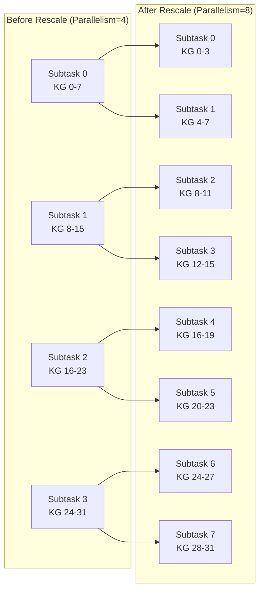
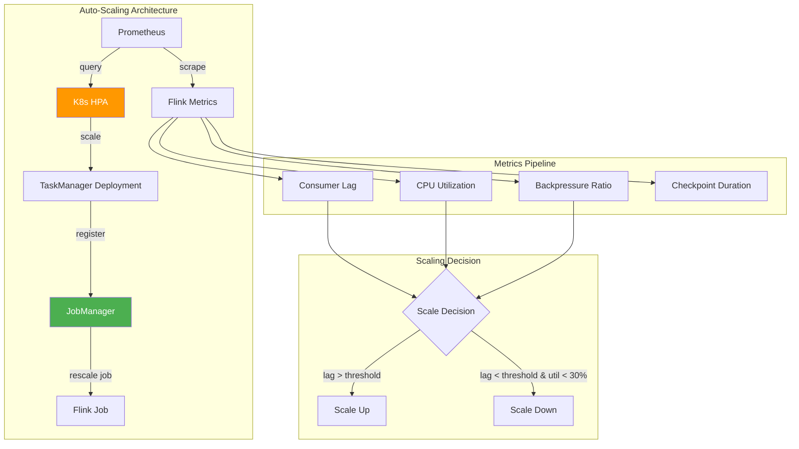
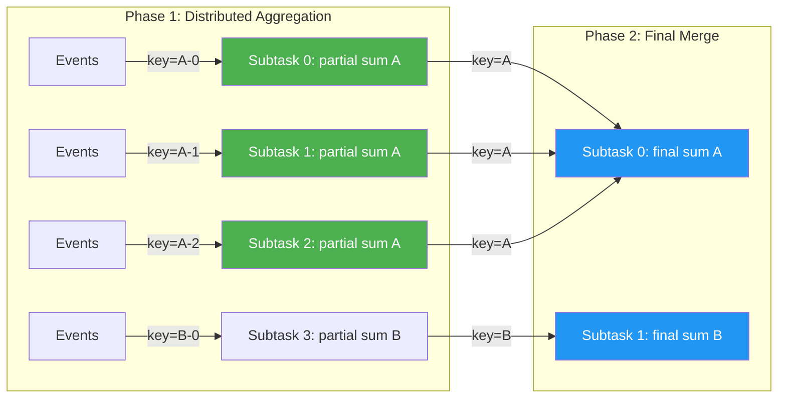
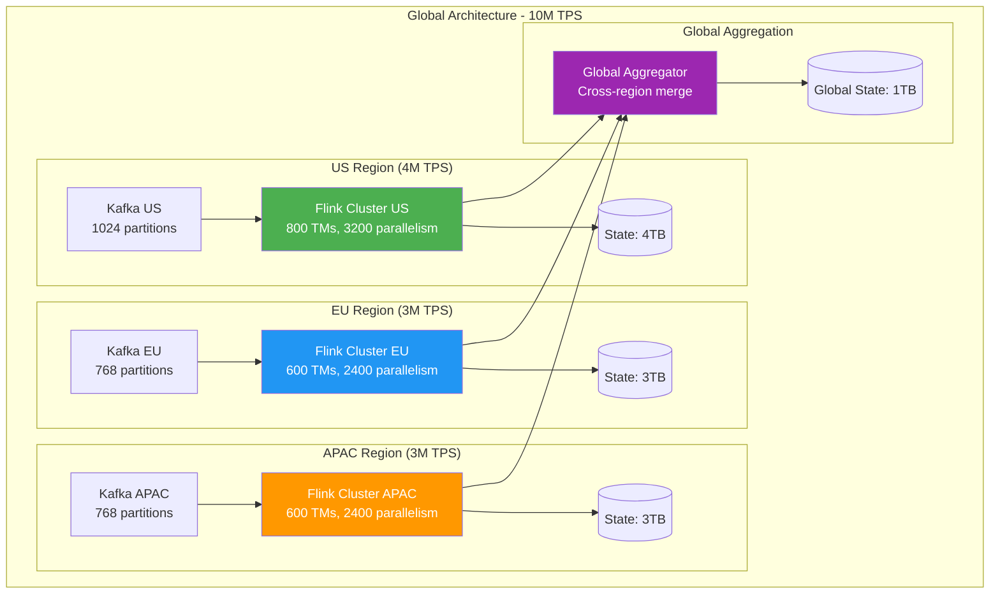

# Scaling Apache Flink for Billions of Transactions

> The complete playbook for going from thousands to billions of transactions per second.

---

## Table of Contents

1. [Scaling Dimensions](#1-scaling-dimensions)
2. [Parallelism Planning](#2-parallelism-planning)
3. [State Scaling Strategies](#3-state-scaling-strategies)
4. [Checkpoint Optimization at Scale](#4-checkpoint-optimization-at-scale)
5. [Network & Shuffle Optimization](#5-network--shuffle-optimization)
6. [Kafka Integration Scaling](#6-kafka-integration-scaling)
7. [Auto-Scaling](#7-auto-scaling-reactive--kubernetes)
8. [Hot Key Mitigation](#8-hot-key-mitigation)
9. [Resource Optimization & Cost](#9-resource-optimization--cost)
10. [Scaling Case Studies](#10-scaling-case-studies)

---

## 1. Scaling Dimensions

Scaling Flink is not one-dimensional. You must reason about four orthogonal axes simultaneously.

```mermaid
graph TB
    subgraph "Scaling Dimensions"
        direction TB
        H[Horizontal Scaling]
        V[Vertical Scaling]
        S[State Scaling]
        N[Network Scaling]
    end

    subgraph "Horizontal"
        H --> H1[More TaskManagers]
        H --> H2[Higher Parallelism]
        H --> H3[More Kafka Partitions]
        H --> H4[Multi-Cluster Federation]
    end

    subgraph "Vertical"
        V --> V1[More CPU cores per TM]
        V --> V2[More Memory per TM]
        V --> V3[Faster Disks SSD/NVMe]
        V --> V4[Higher Network Bandwidth]
    end

    subgraph "State"
        S --> S1[RocksDB Tuning]
        S --> S2[State TTL & Compaction]
        S --> S3[Key Group Redistribution]
        S --> S4[Local Recovery]
    end

    subgraph "Network"
        N --> N1[Buffer Pool Sizing]
        N --> N2[Credit-Based Flow Control]
        N --> N3[Compression]
        N --> N4[Shuffle Optimization]
    end

    style H fill:#4CAF50,color:#fff
    style V fill:#2196F3,color:#fff
    style S fill:#FF9800,color:#fff
    style N fill:#9C27B0,color:#fff
```



### 1.1 Horizontal Scaling: More TaskManagers & Parallelism

Horizontal scaling increases throughput by distributing work across more parallel subtask instances.

**When to use:**
- CPU utilization is high (>70%) across existing TaskManagers
- Backpressure is caused by compute, not I/O
- Source partitions can be increased proportionally

**Key configuration:**

```yaml
# flink-conf.yaml
taskmanager.numberOfTaskSlots: 4          # slots per TM
parallelism.default: 128                   # total parallelism

# Kubernetes deployment
spec:
  replicas: 32                             # 32 TMs × 4 slots = 128 parallelism
```

**Scaling limits:**
- Maximum parallelism bounded by source partitions (for keyed sources)
- Coordination overhead increases with TaskManager count
- Checkpoint barrier alignment takes longer with more subtasks
- Network connections grow as O(n²) for all-to-all shuffles

### 1.2 Vertical Scaling: More Resources per TaskManager

Vertical scaling gives each TaskManager more CPU/memory/disk.

**When to use:**
- State doesn't fit in memory (RocksDB block cache too small)
- GC pressure is high
- Individual operators are CPU-bound with wide pipelines
- Disk I/O is the bottleneck (upgrade to NVMe)

```yaml
# TaskManager resource configuration
taskmanager.memory.process.size: 16384m
taskmanager.memory.flink.size: 12288m
taskmanager.memory.managed.fraction: 0.4   # for RocksDB
taskmanager.memory.network.fraction: 0.1
taskmanager.memory.jvm-overhead.fraction: 0.1
taskmanager.cpu.cores: 4.0
```

**Practical limits:**
- JVM GC pauses increase with heap >32GB (compressed oops limit)
- Diminishing returns on CPU cores per TM beyond ~8 (thread contention)
- Larger TMs = larger blast radius on failure

### 1.3 State Scaling: Managing TB-Scale State

At billions of TPS, state can grow to terabytes. This requires deliberate state architecture.

**Key challenges:**
- Checkpoint size grows linearly with state
- Restore time grows with state size
- Compaction I/O can compete with processing I/O
- Key distribution skew amplifies with scale

### 1.4 Network Scaling: Handling Shuffle at Scale

Every `keyBy()`, `rebalance()`, or `shuffle()` creates all-to-all network connections.

**Network connection count:**
```
connections = upstream_parallelism × downstream_parallelism
```

For parallelism 1000 → 1000, that's **1,000,000 logical connections**.

```yaml
# Network tuning for large clusters
taskmanager.network.memory.min: 256mb
taskmanager.network.memory.max: 1024mb
taskmanager.network.memory.buffers-per-channel: 2
taskmanager.network.memory.floating-buffers-per-gate: 8
taskmanager.network.netty.num-arenas: 4
taskmanager.network.request-backoff.initial: 100
taskmanager.network.request-backoff.max: 10000
```

---

## 2. Parallelism Planning

### 2.1 The Parallelism Formula

```
Required Parallelism = (Target TPS × Processing Latency per Record) / Records per Subtask per Second

Simplified:
P = Target_TPS / Single_Subtask_TPS
```

**More precise formula accounting for overhead:**

```
P = (Target_TPS × Safety_Factor) / (Single_Subtask_TPS × Utilization_Target)

Where:
- Safety_Factor = 1.3 to 2.0 (headroom for spikes)
- Utilization_Target = 0.6 to 0.8 (never run at 100%)
```

### 2.2 Source Parallelism

Source parallelism MUST match or be less than the number of source partitions.

```
Source_Parallelism ≤ Kafka_Partition_Count
```

If you need more parallelism than partitions, you must repartition the Kafka topic first.

```java
// Source with explicit parallelism matching partition count
KafkaSource<String> source = KafkaSource.<String>builder()
    .setBootstrapServers("broker:9092")
    .setTopics("transactions")  // 256 partitions
    .setGroupId("flink-processor")
    .setStartingOffsets(OffsetsInitializer.committedOffsets())
    .setDeserializer(new SimpleStringSchema())
    .build();

DataStream<String> stream = env.fromSource(
    source, 
    WatermarkStrategy.forBoundedOutOfOrderness(Duration.ofSeconds(5)),
    "Kafka Source"
).setParallelism(256);  // Must match partition count
```

### 2.3 Operator Parallelism

Different operators have different scaling characteristics:

| Operator Type | Bottleneck | Parallelism Strategy |
|---|---|---|
| Stateless map/filter | CPU | Match source parallelism or reduce if lightweight |
| Keyed aggregation | State I/O + CPU | Set based on key cardinality and state size |
| Window aggregation | Memory + CPU | Scale with window size × key count |
| Async I/O | External service capacity | Scale to max concurrent connections |
| Join (interval) | State + CPU | Scale based on join state size |

```java
// Compute-bound operator: high parallelism
stream
    .map(new ExpensiveMLInference())
    .setParallelism(512);  // CPU-bound, scale out

// IO-bound operator: limited by external system
stream
    .addSink(new ElasticsearchSink<>(config))
    .setParallelism(64);   // Limited by ES cluster capacity
```

### 2.4 Sink Parallelism

Sink parallelism is capped by downstream system throughput:

```
Sink_Parallelism = min(
    Downstream_Max_TPS / Per_Connection_TPS,
    Upstream_Parallelism
)
```

**Common downstream limits:**

| Sink | Typical Max Writes/s per Connection | Strategy |
|---|---|---|
| Kafka | 50K-200K | Batch + linger.ms |
| Elasticsearch | 5K-20K | Bulk requests |
| JDBC (PostgreSQL) | 2K-10K | Batch inserts |
| Redis | 50K-100K | Pipeline mode |
| S3 (Parquet) | N/A (file-based) | Optimize file size |

### 2.5 Example: Scaling from 10K to 1M TPS

**Starting point: 10K TPS**
```
Current setup:
- Kafka: 16 partitions
- Flink parallelism: 16
- Single subtask TPS: 625 events/s
- TaskManagers: 4 (4 slots each)
- State backend: Heap (2GB total state)
```

**Target: 1M TPS (100x increase)**

```
Step 1: Calculate required parallelism
P = (1,000,000 × 1.5) / (625 × 0.7) = 1,500,000 / 437.5 = 3,429

That's impractical. We need to increase per-subtask throughput first.

Step 2: Optimize per-subtask throughput
- Batch processing in operators: 625 → 5,000 events/s per subtask
- Reduce serialization overhead
- Use binary formats (Avro/Protobuf instead of JSON)

Step 3: Recalculate
P = (1,000,000 × 1.5) / (5,000 × 0.7) = 1,500,000 / 3,500 = 429

Step 4: Infrastructure
- Kafka partitions: 512 (allows future growth)
- Flink parallelism: 512 (matches partitions)
- TaskManagers: 128 (4 slots each)
- State backend: RocksDB (estimated 500GB state)
- Checkpoint storage: S3 with incremental checkpoints
```

**Configuration for 1M TPS:**

```yaml
# flink-conf.yaml for 1M TPS
parallelism.default: 512
taskmanager.numberOfTaskSlots: 4
taskmanager.memory.process.size: 32768m
taskmanager.memory.managed.fraction: 0.5
state.backend: rocksdb
state.backend.incremental: true
state.checkpoints.dir: s3://flink-checkpoints/prod/
state.backend.rocksdb.memory.managed: true
execution.checkpointing.interval: 60000
execution.checkpointing.min-pause: 30000
```

---

## 3. State Scaling Strategies

### 3.1 Key Group Redistribution on Rescale

Flink uses **key groups** as the atomic unit of state redistribution. When parallelism changes, key groups are reassigned.

```
Number of key groups = max parallelism (default: 128 × operator parallelism, capped at 32768)
Key groups per subtask = max_parallelism / current_parallelism
```



**Best practices for max parallelism:**
```java
env.setMaxParallelism(32768);  // Set high for future flexibility
// Key group count = max_parallelism
// Must be set before first deployment (cannot change later)
```

### 3.2 State Size Estimation Formulas

```
Total State Size = Σ (key_count × avg_state_per_key × overhead_factor)

For ValueState:
  state_per_key = serialized_value_size + key_overhead (16-32 bytes for RocksDB)

For ListState:
  state_per_key = num_elements × serialized_element_size + list_overhead

For MapState:
  state_per_key = num_map_entries × (serialized_key_size + serialized_value_size) + map_overhead

For Windows:
  state_per_key = window_size_seconds × events_per_second_per_key × serialized_event_size
```

**Example calculation:**
```
Scenario: Counting transactions per user in 1-hour windows
- Unique users: 50 million
- Avg transactions per user per hour: 20
- Serialized event size: 200 bytes
- Window state per user: 20 × 200 = 4,000 bytes
- Total state: 50M × 4KB = 200GB

With RocksDB overhead (1.5x):
- Total on-disk state: 300GB
- Required managed memory (block cache): 30-60GB (10-20% of state)
```

### 3.3 When to Use RocksDB vs Heap

| Criterion | HashMapStateBackend (Heap) | EmbeddedRocksDBStateBackend |
|---|---|---|
| State size | < 5GB per TM | Unlimited (disk-bound) |
| Latency | Nanoseconds (in-memory) | Microseconds (may hit disk) |
| Serialization | On checkpoint only | On every access |
| GC pressure | High (objects on heap) | Low (off-heap/disk) |
| Checkpoint size | Full snapshot every time | Incremental supported |
| Best for | Low-latency, small state | Large state, TB-scale |

**Decision flowchart:**
```
IF total_state_per_TM < 2GB AND latency_critical:
    USE HeapStateBackend
ELSE IF total_state_per_TM < 5GB AND GC_tuning_acceptable:
    USE HeapStateBackend with large heap
ELSE:
    USE RocksDBStateBackend (always for production at scale)
```

### 3.4 State Compaction and TTL

**State TTL** prevents unbounded state growth:

```java
StateTtlConfig ttlConfig = StateTtlConfig.newBuilder(Duration.ofHours(24))
    .setUpdateType(StateTtlConfig.UpdateType.OnCreateAndWrite)
    .setStateVisibility(StateTtlConfig.StateVisibility.NeverReturnExpired)
    .cleanupFullSnapshot()          // Clean during checkpoint
    .cleanupInRocksdbCompactFilter(1000)  // Clean during RocksDB compaction
    .cleanupIncrementally(10, true)       // Clean incrementally
    .build();

ValueStateDescriptor<UserProfile> descriptor = 
    new ValueStateDescriptor<>("user-profile", UserProfile.class);
descriptor.enableTimeToLive(ttlConfig);
```

**RocksDB compaction tuning for large state:**

```yaml
# Aggressive compaction for write-heavy workloads
state.backend.rocksdb.compaction.style: LEVEL
state.backend.rocksdb.compaction.level.max-size-level-base: 256mb
state.backend.rocksdb.compaction.level.target-file-size-base: 64mb
state.backend.rocksdb.compaction.level.use-dynamic-size: true

# Write buffer tuning
state.backend.rocksdb.writebuffer.size: 128mb
state.backend.rocksdb.writebuffer.count: 4
state.backend.rocksdb.writebuffer.number-to-merge: 2

# Block cache (shared across all column families)
state.backend.rocksdb.memory.managed: true
state.backend.rocksdb.memory.write-buffer-ratio: 0.4
state.backend.rocksdb.memory.high-prio-pool-ratio: 0.1
```

### 3.5 Splitting Large State Across More Parallelism

When individual subtasks hold too much state:

```java
// Problem: 10M keys with parallelism 100 = 100K keys per subtask
// Each key holds 10KB state = 1GB per subtask (too much for fast checkpoints)

// Solution 1: Increase parallelism
// With parallelism 1000 = 10K keys per subtask = 100MB per subtask

// Solution 2: Pre-aggregate to reduce state
stream
    .keyBy(event -> event.getUserId())
    .process(new PreAggregateFunction())  // Reduce state per key
    .setParallelism(1000);

// Solution 3: Use MapState instead of ListState (lazy serialization)
// MapState entries are individually accessible without full deserialization
```

### 3.6 Local Recovery for Faster Restarts

Local recovery keeps a copy of state on the TaskManager's local disk, avoiding full remote download on restart:

```yaml
state.backend.local-recovery: true
taskmanager.state.local.root-dirs: /mnt/nvme/flink-local-recovery

# Combine with working directory for TM-level recovery
process.working-dir: /mnt/nvme/flink-working-dir
```

**Recovery time comparison:**
```
Without local recovery (100GB state from S3):
  Download: 100GB / 1Gbps = ~800 seconds

With local recovery (local NVMe):
  Load from disk: 100GB / 3GBps NVMe = ~33 seconds
  
Speedup: ~24x faster recovery
```

---

## 4. Checkpoint Optimization at Scale

### 4.1 Incremental Checkpoints (Critical for TB State)

Full checkpoints copy ALL state every interval. Incremental checkpoints only copy what changed.

```yaml
state.backend: rocksdb
state.backend.incremental: true
execution.checkpointing.interval: 60000        # 1 minute
execution.checkpointing.min-pause: 30000       # 30s between checkpoints
execution.checkpointing.timeout: 600000        # 10 min timeout
execution.checkpointing.max-concurrent-checkpoints: 1
```

**Size comparison for 1TB state with 1% change rate:**
```
Full checkpoint: 1TB every minute → requires 133Gbps upload bandwidth
Incremental: 10GB every minute → requires 1.3Gbps upload bandwidth

Storage:
Full: Keep 3 checkpoints = 3TB
Incremental: Base (1TB) + deltas (10GB × 60) = 1.6TB
```

### 4.2 Checkpoint File Merging

Introduced in Flink 1.16+ to reduce small files in incremental checkpoints:

```yaml
# Enable file merging (reduces HDFS/S3 small file problem)
execution.checkpointing.file-merging.enabled: true
execution.checkpointing.file-merging.max-file-size: 32mb
```

Without merging, each RocksDB SST file becomes a separate checkpoint file. With thousands of subtasks, this creates millions of small files that overwhelm S3 LIST operations.

### 4.3 S3 Multipart Upload Tuning

```yaml
# S3 checkpoint storage tuning
s3.upload.max.concurrent.uploads: 4
s3.part.size: 67108864                         # 64MB parts
s3.multipart.upload.min-part-size: 67108864
fs.s3a.multipart.size: 67108864
fs.s3a.fast.upload: true
fs.s3a.fast.upload.buffer: disk                # Use disk buffer, not memory
fs.s3a.connection.maximum: 200
fs.s3a.threads.max: 64
```

### 4.4 Parallel Checkpoint Uploads

```yaml
# Parallel upload of state files
state.backend.rocksdb.checkpoint.transfer.thread.num: 4

# Async snapshot threads
execution.checkpointing.unaligned: true        # Unaligned checkpoints
execution.checkpointing.aligned-checkpoint-timeout: 30s
```

### 4.5 Checkpoint Coordinator Tuning

```yaml
# JobManager checkpoint coordinator
execution.checkpointing.num-retained: 3
execution.checkpointing.externalized-checkpoint-retention: RETAIN_ON_CANCELLATION

# Tolerate slow subtasks
execution.checkpointing.tolerable-failed-checkpoints: 3
```

### 4.6 The Golden Rule

```
checkpoint_interval > checkpoint_duration × 2

If this rule is violated:
- Checkpoints overlap (if concurrent > 1) → OOM
- Checkpoints queue up → stale state
- Backpressure builds from synchronous snapshot phases

Example:
- Checkpoint duration: 45 seconds
- Minimum interval: 90 seconds (safe)
- Recommended interval: 120 seconds (with headroom)

Monitoring query:
  checkpoint_duration_p99 < checkpoint_interval × 0.5
```

**Full checkpoint optimization configuration for TB-scale:**

```yaml
# Production checkpoint config for 500GB+ state
state.backend: rocksdb
state.backend.incremental: true
state.backend.rocksdb.memory.managed: true
state.backend.rocksdb.checkpoint.transfer.thread.num: 4

execution.checkpointing.interval: 180000       # 3 minutes
execution.checkpointing.min-pause: 60000       # 1 min minimum between
execution.checkpointing.timeout: 900000        # 15 min timeout
execution.checkpointing.max-concurrent-checkpoints: 1
execution.checkpointing.unaligned.enabled: true
execution.checkpointing.aligned-checkpoint-timeout: 60s
execution.checkpointing.tolerable-failed-checkpoints: 5

state.checkpoints.dir: s3://flink-checkpoints/prod/job-name/
state.savepoints.dir: s3://flink-savepoints/prod/job-name/
state.checkpoints.num-retained: 3

state.backend.local-recovery: true
taskmanager.state.local.root-dirs: /mnt/nvme0/flink-recovery,/mnt/nvme1/flink-recovery
```

---

## 5. Network & Shuffle Optimization

### 5.1 Buffer Pool Sizing

Each network channel requires buffers. Insufficient buffers cause backpressure even when CPU/state is fine.

```
Required buffers per TM = 
    Σ (input_channels × buffers_per_channel) + 
    Σ (input_gates × floating_buffers_per_gate) +
    Σ (output_subpartitions × buffers_per_subpartition)

Where:
  input_channels = number of upstream subtasks sending to this subtask
  output_subpartitions = number of downstream subtasks this subtask sends to
```

**Example: keyBy shuffle with parallelism 512**
```
Each subtask:
- Receives from: 512 upstream subtasks (input channels = 512)
- Sends to: 512 downstream subtasks (output subpartitions = 512)

Buffers per subtask:
- Input: 512 × 2 (exclusive) + 8 (floating) = 1,032
- Output: 512 × 1 = 512
- Total: 1,544 buffers × 32KB = ~48MB per subtask

Per TM (4 slots): 4 × 48MB = 192MB network memory minimum
```

```yaml
taskmanager.memory.network.min: 256mb
taskmanager.memory.network.max: 1024mb
taskmanager.memory.network.fraction: 0.15
taskmanager.network.memory.buffers-per-channel: 2
taskmanager.network.memory.floating-buffers-per-gate: 8
taskmanager.network.sort-shuffle.min-buffers: 512
```

### 5.2 Credit-Based Flow Control Tuning

Flink uses credit-based flow control to prevent OOM while maximizing throughput:

```yaml
# Increase for high-throughput, decrease for memory-constrained
taskmanager.network.memory.buffers-per-channel: 2    # Exclusive credits
taskmanager.network.memory.floating-buffers-per-gate: 8  # Shared pool

# For very high parallelism (>1000), reduce per-channel buffers
# and increase floating buffers to reduce total memory
taskmanager.network.memory.buffers-per-channel: 0
taskmanager.network.memory.floating-buffers-per-gate: 32
# This uses a fully floating model - more memory efficient at scale
```

### 5.3 Network Memory Calculation

```
Total Network Memory per TM = 
    num_slots × (
        sum_over_operators(
            upstream_parallelism × exclusive_buffers +
            floating_buffers_per_gate
        ) +
        sum_over_operators(
            downstream_parallelism × output_buffers
        )
    ) × buffer_size

buffer_size = 32KB (default)
```

### 5.4 Compression for Shuffle Data

```yaml
# Enable compression to reduce network I/O (CPU trade-off)
taskmanager.network.compression.codec: LZ4    # or ZSTD for better ratio

# Beneficial when:
# - Network bandwidth is the bottleneck
# - Data is compressible (text, JSON, repeated patterns)
# - CPU has headroom

# Not beneficial when:
# - Data is already compressed or random
# - CPU is the bottleneck
# - Intra-rack communication (high bandwidth available)
```

### 5.5 Local Recovery to Avoid Network-Based Restore

```yaml
# Working directory based recovery (Flink 1.15+)
process.working-dir: /mnt/nvme/flink-wd
execution.checkpointing.local-backup.enabled: true

# Task-local recovery avoids downloading state from S3
# When a TM restarts on the same node, it reuses local state
state.backend.local-recovery: true
taskmanager.state.local.root-dirs: /mnt/nvme/flink-local
```

---

## 6. Kafka Integration Scaling

### 6.1 Partition Count Planning

```
Kafka Partitions = max(
    Target_TPS / Per_Partition_Throughput,
    Flink_Max_Parallelism_Needed,
    Consumer_Count_Max
)

Per_Partition_Throughput ≈ 10-50 MB/s (depends on message size, replication)

Example:
- Target: 1M TPS, avg message 500 bytes = 500 MB/s
- Per partition: 20 MB/s
- Minimum partitions: 500 MB/s / 20 MB/s = 25
- For Flink parallelism: want 256 subtasks
- Choose: 256 partitions (round up to power of 2)
```

**Topic creation for scale:**
```bash
kafka-topics.sh --create \
    --topic transactions \
    --partitions 256 \
    --replication-factor 3 \
    --config retention.ms=86400000 \
    --config segment.bytes=1073741824 \
    --config min.insync.replicas=2
```

### 6.2 Consumer Group Rebalancing Impact

During rebalancing, ALL consumers stop processing. For large groups this can take minutes.

**Mitigation strategies:**

```java
// Use static group membership to avoid rebalances on restart
Properties props = new Properties();
props.setProperty("group.instance.id", "flink-subtask-" + subtaskIndex);
props.setProperty("session.timeout.ms", "300000");  // 5 min before considered dead

// Flink's KafkaSource handles this internally with:
KafkaSource.<String>builder()
    .setProperty("group.instance.id", "auto")  // Flink assigns per subtask
    .build();
```

### 6.3 Watermark Propagation with Many Partitions

With many partitions, watermark advancement depends on the **slowest** partition:

```java
// Problem: One idle partition holds back global watermark
WatermarkStrategy.<Event>forBoundedOutOfOrderness(Duration.ofSeconds(10))
    .withIdleness(Duration.ofMinutes(2))  // Mark idle after 2 min
    .withTimestampAssigner((event, ts) -> event.getTimestamp());
```

### 6.4 Idle Source Handling

```java
// Idle partitions block watermark progress
// Solution 1: withIdleness
WatermarkStrategy.forBoundedOutOfOrderness(Duration.ofSeconds(5))
    .withIdleness(Duration.ofMinutes(1));

// Solution 2: Custom watermark strategy for sparse topics
public class SparseTopicWatermarkStrategy implements WatermarkStrategy<Event> {
    @Override
    public WatermarkGenerator<Event> createWatermarkGenerator(
            WatermarkGeneratorSupplier.Context context) {
        return new WatermarkGenerator<Event>() {
            private long maxTimestamp = Long.MIN_VALUE;
            
            @Override
            public void onEvent(Event event, long eventTimestamp, WatermarkOutput output) {
                maxTimestamp = Math.max(maxTimestamp, eventTimestamp);
            }
            
            @Override
            public void onPeriodicEmit(WatermarkOutput output) {
                // Emit even when no events arrive (use processing time fallback)
                long watermark = maxTimestamp != Long.MIN_VALUE 
                    ? maxTimestamp - 5000
                    : System.currentTimeMillis() - 60000;
                output.emitWatermark(new Watermark(watermark));
            }
        };
    }
}
```

### 6.5 Batch Reading Optimization

```java
// Maximize fetch throughput for high-volume topics
Properties kafkaProps = new Properties();
kafkaProps.setProperty("fetch.max.bytes", "52428800");       // 50MB per fetch
kafkaProps.setProperty("max.partition.fetch.bytes", "10485760"); // 10MB per partition
kafkaProps.setProperty("fetch.max.wait.ms", "500");          // Wait up to 500ms
kafkaProps.setProperty("max.poll.records", "10000");          // 10K records per poll
kafkaProps.setProperty("receive.buffer.bytes", "1048576");   // 1MB receive buffer

KafkaSource.<String>builder()
    .setProperties(kafkaProps)
    .build();
```

---

## 7. Auto-Scaling (Reactive + Kubernetes)

### 7.1 Flink Reactive Mode

Reactive mode lets Flink automatically adjust parallelism based on available TaskManagers:

```yaml
# Enable reactive mode
scheduler-mode: reactive

# Job automatically scales to use all available slots
# Add TMs → parallelism increases
# Remove TMs → parallelism decreases (with rescale)
```

```java
// Job must be written to support dynamic parallelism
// Avoid hardcoded setParallelism() calls
env.setParallelism(-1);  // Use cluster default (reactive)
```

**Limitations of Reactive Mode:**
- Only supports standalone deployments (not per-job/application mode with fixed resources)
- Rescale triggers savepoint → restore cycle
- Cannot set different parallelism per operator
- All operators scale together

### 7.2 Kubernetes HPA with Custom Metrics



**HPA configuration:**

```yaml
apiVersion: autoscaling/v2
kind: HorizontalPodAutoscaler
metadata:
  name: flink-taskmanager-hpa
spec:
  scaleTargetRef:
    apiVersion: apps/v1
    kind: Deployment
    name: flink-taskmanager
  minReplicas: 8
  maxReplicas: 128
  behavior:
    scaleUp:
      stabilizationWindowSeconds: 60
      policies:
        - type: Pods
          value: 4
          periodSeconds: 60
    scaleDown:
      stabilizationWindowSeconds: 300       # 5 min cool-down
      policies:
        - type: Pods
          value: 2
          periodSeconds: 120
  metrics:
    - type: External
      external:
        metric:
          name: flink_kafka_consumer_lag
          selector:
            matchLabels:
              job_name: "transaction-processor"
        target:
          type: AverageValue
          averageValue: "50000"             # Scale when lag > 50K per TM
    - type: Resource
      resource:
        name: cpu
        target:
          type: Utilization
          averageUtilization: 70
```

### 7.3 Scale-Up Triggers

```python
# Scaling decision logic (implemented in custom controller or KEDA)

def should_scale_up(metrics):
    conditions = [
        metrics.consumer_lag > LAG_THRESHOLD_HIGH,           # 100K+ records behind
        metrics.backpressure_ratio > 0.5,                    # >50% time in backpressure  
        metrics.cpu_utilization > 0.75,                      # >75% CPU
        metrics.checkpoint_duration > checkpoint_interval * 0.7,  # Checkpoints taking too long
    ]
    return any(conditions)

def calculate_scale_factor(metrics):
    # Scale proportionally to lag
    if metrics.consumer_lag > 0:
        target_catchup_time_seconds = 300  # Catch up within 5 min
        required_extra_tps = metrics.consumer_lag / target_catchup_time_seconds
        current_tps = metrics.current_throughput
        scale_factor = (current_tps + required_extra_tps) / current_tps
        return min(scale_factor, 2.0)  # Cap at 2x per scale event
    return 1.0
```

### 7.4 Scale-Down Safely

```yaml
# Scale-down requires savepoint to redistribute state
# Custom controller logic:

# 1. Trigger savepoint
# 2. Wait for savepoint completion
# 3. Scale down TaskManagers
# 4. Job auto-rescales in reactive mode (or restart from savepoint)

# KEDA ScaledObject for safe scale-down
apiVersion: keda.sh/v1alpha1
kind: ScaledObject
metadata:
  name: flink-scaler
spec:
  scaleTargetRef:
    name: flink-taskmanager
  minReplicaCount: 8
  maxReplicaCount: 128
  cooldownPeriod: 300
  advanced:
    horizontalPodAutoscalerConfig:
      behavior:
        scaleDown:
          stabilizationWindowSeconds: 600
          policies:
            - type: Percent
              value: 25
              periodSeconds: 300
```

### 7.5 When NOT to Auto-Scale

- **Large state jobs**: Rescale requires state redistribution (minutes of downtime)
- **Exactly-once sinks**: Rescale may cause duplicate outputs during transition
- **Short spike patterns**: Scale-up + scale-down cost > just buffering the lag
- **Jobs with external side effects**: Rescale replays from checkpoint (duplicates)
- **When checkpoint duration > 5 minutes**: Savepoint for rescale takes too long

**Rule of thumb:**
```
Auto-scale only if:
  state_size < 100GB AND
  rescale_time < acceptable_lag_duration AND
  job_has_no_non-idempotent_side_effects
```

---

## 8. Hot Key Mitigation

### 8.1 Detecting Skewed Keys

```java
// Add a monitoring operator before keyBy to detect skew
stream
    .map(new KeyDistributionMonitor())
    .keyBy(...)
    .process(...);

public class KeyDistributionMonitor extends RichMapFunction<Event, Event> {
    private transient Counter hotKeyCounter;
    private transient Map<String, Long> keyFrequency;
    
    @Override
    public void open(Configuration parameters) {
        hotKeyCounter = getRuntimeContext().getMetricGroup()
            .counter("hot_key_detections");
        keyFrequency = new HashMap<>();
    }
    
    @Override
    public Event map(Event event) {
        String key = event.getKey();
        long count = keyFrequency.merge(key, 1L, Long::sum);
        
        // Alert if single key exceeds 1% of total traffic
        if (count > THRESHOLD) {
            hotKeyCounter.inc();
            LOG.warn("Hot key detected: {} with count {}", key, count);
        }
        return event;
    }
}
```

**Metrics to watch:**
```
# Prometheus queries for skew detection
max(flink_taskmanager_job_task_numRecordsInPerSecond) /
avg(flink_taskmanager_job_task_numRecordsInPerSecond) > 3
# If max/avg ratio > 3, significant skew exists
```

### 8.2 Local Pre-Aggregation (Combiner Pattern)

Reduce data before the shuffle by aggregating locally:

```java
// Instead of:
stream.keyBy(e -> e.getUserId())
      .window(TumblingEventTimeWindows.of(Time.minutes(1)))
      .sum("amount");

// Use local pre-aggregation:
stream
    .map(new LocalPreAggregator())  // Buffers and pre-aggregates locally
    .setParallelism(256)             // Runs on each subtask
    .keyBy(e -> e.getUserId())
    .window(TumblingEventTimeWindows.of(Time.minutes(1)))
    .reduce(new SumReducer());       // Receives pre-aggregated data

public class LocalPreAggregator extends RichMapFunction<Event, PartialAggregate> {
    private transient Map<String, PartialAggregate> buffer;
    private transient long lastFlush;
    private static final long FLUSH_INTERVAL_MS = 1000;
    
    @Override
    public PartialAggregate map(Event event) throws Exception {
        buffer.merge(event.getKey(), 
            new PartialAggregate(event.getAmount(), 1),
            PartialAggregate::combine);
        
        if (System.currentTimeMillis() - lastFlush > FLUSH_INTERVAL_MS) {
            // Flush all buffered aggregates
            flush();
        }
        return null;  // Emit via side output or collector
    }
}
```

### 8.3 Two-Phase Aggregation

```java
// Phase 1: Aggregate by salted key (distributes hot keys)
DataStream<PartialResult> phase1 = stream
    .keyBy(e -> e.getKey() + "-" + ThreadLocalRandom.current().nextInt(10))
    .window(TumblingEventTimeWindows.of(Time.minutes(1)))
    .aggregate(new PartialAggregator())
    .setParallelism(512);

// Phase 2: Aggregate partial results by real key
DataStream<FinalResult> phase2 = phase1
    .keyBy(e -> e.getOriginalKey())
    .window(TumblingEventTimeWindows.of(Time.minutes(1)))
    .aggregate(new FinalAggregator())
    .setParallelism(128);
```



### 8.4 Key Splitting with Combine

```java
public class SaltedKeyAggregation {
    
    private static final int SALT_FACTOR = 16;  // Split each key into 16 sub-keys
    
    public static DataStream<Result> aggregate(DataStream<Event> input) {
        // Split phase
        DataStream<PartialResult> split = input
            .keyBy(e -> e.getKey() + "#" + (e.hashCode() & (SALT_FACTOR - 1)))
            .window(TumblingEventTimeWindows.of(Time.minutes(1)))
            .reduce(new PartialReducer())
            .setParallelism(1024);
        
        // Combine phase
        return split
            .map(r -> { r.setKey(r.getKey().split("#")[0]); return r; })
            .keyBy(PartialResult::getKey)
            .window(TumblingEventTimeWindows.of(Time.minutes(1)))
            .reduce(new FinalReducer())
            .setParallelism(256);
    }
}
```

### 8.5 Rebalance Before keyBy

When upstream operators produce skewed output:

```java
// If source partitions are imbalanced
stream
    .rebalance()      // Round-robin redistribution (adds network shuffle)
    .keyBy(e -> e.getKey())
    .process(new MyProcessor());
```

### 8.6 Salting Technique

```java
// Generic salting utility
public class KeySalter<T> implements KeySelector<T, String> {
    private final KeySelector<T, String> originalKeySelector;
    private final int saltBuckets;
    
    public KeySalter(KeySelector<T, String> keySelector, int saltBuckets) {
        this.originalKeySelector = keySelector;
        this.saltBuckets = saltBuckets;
    }
    
    @Override
    public String getKey(T value) throws Exception {
        String originalKey = originalKeySelector.getKey(value);
        int salt = Math.abs(value.hashCode() % saltBuckets);
        return originalKey + "|" + salt;
    }
}

// Usage
stream.keyBy(new KeySalter<>(Event::getUserId, 32))
      .window(...)
      .aggregate(new PartialAgg());
```

---

## 9. Resource Optimization & Cost

### 9.1 Right-Sizing TaskManagers

**The sweet spot for TaskManager sizing:**

```
Optimal TM configuration:
- CPU: 4-8 cores (matches slot count)
- Memory: 8-32GB (depends on state backend)
- Slots: 1-4 per TM (1 slot for isolation, 4 for efficiency)
- Disk: NVMe for RocksDB workloads

Formula for TM memory:
TM_memory = slots × (
    heap_per_slot +           # 1-4GB for application
    managed_per_slot +        # 0.5-2GB for RocksDB
    network_per_slot          # 64-256MB for buffers
) + jvm_overhead              # 256MB-1GB
```

**Comparison of TM sizing strategies:**

| Strategy | Config | Pros | Cons |
|---|---|---|---|
| Few large TMs | 32GB, 8 slots | Less overhead, better locality | Large blast radius |
| Many small TMs | 8GB, 2 slots | Fast recovery, fine-grained scaling | More coordination overhead |
| **Recommended** | **16GB, 4 slots** | **Balance of isolation and efficiency** | - |

### 9.2 Spot/Preemptible Instances for Batch

```yaml
# Kubernetes node pool for batch Flink jobs
apiVersion: v1
kind: NodePool
metadata:
  name: flink-batch-spot
spec:
  instanceTypes:
    - m5.2xlarge
    - m5a.2xlarge
    - m6i.2xlarge
  capacityType: SPOT
  labels:
    workload-type: flink-batch
  taints:
    - key: spot-instance
      effect: NoSchedule

---
# Flink batch job tolerating spot interruptions
apiVersion: flink.apache.org/v1beta1
kind: FlinkDeployment
metadata:
  name: batch-etl-job
spec:
  taskManager:
    resource:
      memory: "8192m"
      cpu: 4
    replicas: 32
  podTemplate:
    spec:
      tolerations:
        - key: spot-instance
          operator: Exists
      nodeSelector:
        workload-type: flink-batch
```

### 9.3 Reserved Instances for Streaming

Streaming jobs run 24/7 - always use reserved/committed pricing:

```
Cost comparison for 128 TaskManagers (m5.2xlarge):
- On-demand: $0.384/hr × 128 × 8760 hrs = $430,571/year
- 1-year reserved (no upfront): $0.242/hr × 128 × 8760 = $271,498/year (37% savings)
- 3-year reserved (all upfront): $0.152/hr × 128 × 8760 = $170,557/year (60% savings)
- Savings plans (compute): Similar to reserved with more flexibility
```

### 9.4 Memory Optimization

```yaml
# Shared managed memory for multiple RocksDB instances in same slot
state.backend.rocksdb.memory.managed: true

# This shares a single block cache across all RocksDB instances
# Without it, each state creates its own cache → OOM

# Memory breakdown for 16GB TM with 4 slots:
taskmanager.memory.process.size: 16384m
# JVM Metaspace: 256m
# JVM Overhead: 1638m (10%)
# Framework Heap: 128m
# Framework Off-Heap: 128m  
# Task Heap: 6144m (for application objects)
# Task Off-Heap: 0m
# Managed Memory: 6554m (40%, for RocksDB)
# Network Memory: 1638m (10%)
```

### 9.5 Cost per Million Events Calculation

```
Cost per Million Events = 
    (Total_Infrastructure_Cost_per_Hour) / (TPS × 3600 / 1,000,000)

Example:
- 128 TMs × m5.2xlarge reserved = $30.98/hr
- JobManager (m5.xlarge) = $0.192/hr
- S3 checkpoint storage = ~$2/hr (estimated)
- Kafka cluster = $15/hr (6 brokers)
- Total: $48.17/hr

- Throughput: 1M TPS
- Events per hour: 3.6 billion
- Cost per million events: $48.17 / 3,600 = $0.0134

Comparison at different scales:
| Scale | Infra Cost/hr | Events/hr | Cost per 1M events |
|-------|--------------|-----------|-------------------|
| 10K TPS | $5/hr | 36M | $0.139 |
| 100K TPS | $15/hr | 360M | $0.042 |
| 1M TPS | $48/hr | 3.6B | $0.013 |
| 10M TPS | $350/hr | 36B | $0.010 |

Economies of scale: 10x throughput ≠ 10x cost (typically 3-5x)
```

---

## 10. Scaling Case Studies

### 10.1 From 10K to 100K TPS (Simple Parallelism Increase)

**Scenario:** E-commerce transaction processor hitting latency SLA at 10K TPS during sale events.

```
Before:
- Kafka: 32 partitions
- Flink parallelism: 32
- TaskManagers: 8 (4 slots)
- State: 20GB (Heap)
- Checkpoint: 15s full snapshots to S3

Changes needed:
1. Increase Kafka partitions: 32 → 128
2. Increase Flink parallelism: 32 → 128
3. Add TaskManagers: 8 → 32
4. Switch to RocksDB (state will grow to 200GB)
5. Enable incremental checkpoints

After:
- Kafka: 128 partitions
- Flink parallelism: 128
- TaskManagers: 32 (4 slots)
- State: 200GB (RocksDB, incremental checkpoints)
- Checkpoint: 60s incremental to S3

Cost increase: ~4x ($5/hr → $20/hr)
Throughput increase: 10x (10K → 100K TPS)
```

### 10.2 From 100K to 1M TPS (Architecture Changes Needed)

**Scenario:** Payment processing system needs 10x scale for international expansion.

```
Architectural changes required:

1. State backend redesign:
   - Split monolithic state into multiple smaller states
   - Introduce state TTL (24h → 4h for temporary state)
   - Pre-aggregate before keyed operations
   
2. Pipeline restructuring:
   - Break single job into 3 jobs (ingest → process → sink)
   - Use Kafka as intermediate buffer between stages
   - Each stage scales independently
   
3. Kafka tier upgrade:
   - 128 → 512 partitions per topic
   - 6 → 24 brokers
   - Enable tiered storage for historical data
   
4. Network optimization:
   - Enable shuffle compression (LZ4)
   - Increase network buffers
   - Co-locate related operators in slot sharing groups
   
5. Checkpoint optimization:
   - Unaligned checkpoints for backpressure tolerance
   - Increase interval: 60s → 180s
   - Local recovery on NVMe
```

```yaml
# Multi-stage pipeline configuration

# Stage 1: Ingest & Enrich (parallelism 512)
stage1:
  parallelism: 512
  source: kafka-transactions (512 partitions)
  sink: kafka-enriched (512 partitions)
  state: minimal (lookup only)
  
# Stage 2: Aggregate & Detect (parallelism 256)
stage2:
  parallelism: 256
  source: kafka-enriched (512 partitions, consumer parallelism 256)
  operations: windowed aggregation, fraud detection
  state: 500GB (RocksDB)
  sink: kafka-results (128 partitions)

# Stage 3: Sink & Notify (parallelism 128)
stage3:
  parallelism: 128
  source: kafka-results (128 partitions)
  sinks: PostgreSQL, Elasticsearch, notification service
  state: minimal (exactly-once bookkeeping)
```

### 10.3 From 1M to 10M TPS (Multi-Cluster, Partitioning Redesign)

**Scenario:** Global financial platform processing all market data streams.

```
At this scale, single-cluster Flink cannot handle the load.
Key architectural decisions:

1. Multi-cluster federation:
   - Partition by geography (US, EU, APAC)
   - Each region runs independent Flink cluster
   - Cross-region aggregation via async replication
   
2. Data partitioning redesign:
   - Primary partition: region
   - Secondary partition: asset class
   - Tertiary partition: hash(instrument_id)
   - Total partitions per topic: 2048+
   
3. Hardware optimization:
   - Bare metal or dedicated instances (no noisy neighbors)
   - 25Gbps networking minimum
   - NVMe storage for all state
   - NUMA-aware TM placement
   
4. Flink cluster sizing per region:
   - 512+ TaskManagers
   - 2048+ total parallelism
   - 10+ TB aggregate state
   - Dedicated checkpoint storage (not shared S3)
```



### 10.4 Alibaba's 600K+ Core Deployment

Alibaba runs one of the world's largest Flink deployments for Singles' Day (11.11):

```
Scale:
- 600,000+ CPU cores dedicated to Flink
- Peak: 2.5 billion events/second during 11.11
- 10,000+ Flink jobs running simultaneously
- Petabytes of state managed

Key techniques:
1. Custom Flink fork (Blink, now merged back):
   - Batch/streaming unified runtime
   - Optimized RocksDB integration
   - Custom memory management
   
2. Resource management:
   - Fine-grained resource allocation (not slot-based)
   - Dynamic resource adjustment without restart
   - Multi-tenant isolation with resource quotas
   
3. State management:
   - Disaggregated state storage (state not on TM local disk)
   - Remote state access with caching
   - Shared state backend across jobs
   
4. Scheduling:
   - Speculative execution for slow tasks
   - Workload-aware scheduling
   - Priority-based resource allocation

5. Infrastructure:
   - Custom bare-metal clusters
   - RDMA networking
   - Persistent memory (Intel Optane) for state
```

### 10.5 Uber's 4000+ Jobs Cluster

Uber operates one of the largest multi-tenant Flink platforms:

```
Scale:
- 4,000+ Flink jobs in production
- Multiple Flink clusters (hundreds of TMs each)
- Processing trillions of events daily
- Primary use cases: surge pricing, ETA, fraud detection

Architecture decisions:
1. Platform approach:
   - Self-service Flink platform (FlinkSQL + API)
   - Centralized cluster management
   - Shared Kafka infrastructure
   
2. Multi-tenancy:
   - Job-level resource isolation
   - Fair-share scheduling
   - Per-job checkpoint storage quotas
   - Priority levels (P0 real-time pricing > P2 analytics)
   
3. Operational excellence:
   - Automated canary deployments
   - Automated rollback on SLA breach
   - Predictive scaling based on historical patterns
   - Chaos engineering (random TM kills)
   
4. Cost optimization:
   - Right-sizing recommendations engine
   - Idle job detection and alerting
   - Shared cluster reduces per-job overhead
   - Bin-packing optimization for TM utilization

Lessons learned:
- Standardize on few TM sizes (small/medium/large)
- Invest heavily in observability (custom dashboards per job)
- State size is the #1 operational challenge
- Schema evolution breaks jobs more than code changes
```

---

## Summary: The Scaling Playbook

```
┌─────────────────────────────────────────────────────────────┐
│                    SCALING DECISION TREE                      │
├─────────────────────────────────────────────────────────────┤
│                                                              │
│  Current TPS < 100K?                                         │
│    → Increase parallelism + Kafka partitions                 │
│    → Optimize serialization (Avro/Protobuf)                  │
│    → Enable RocksDB + incremental checkpoints                │
│                                                              │
│  100K < TPS < 1M?                                            │
│    → Split pipeline into stages                              │
│    → Two-phase aggregation for hot keys                      │
│    → Network compression + buffer tuning                     │
│    → Local recovery on NVMe                                  │
│                                                              │
│  1M < TPS < 10M?                                             │
│    → Multi-cluster with regional partitioning                │
│    → Dedicated hardware (bare metal / dedicated instances)   │
│    → Custom state backend tuning                             │
│    → Unaligned checkpoints + large intervals                 │
│                                                              │
│  TPS > 10M?                                                  │
│    → Multi-region federation                                 │
│    → Disaggregated state storage                             │
│    → Custom Flink fork considerations                        │
│    → Dedicated infrastructure team                           │
│                                                              │
└─────────────────────────────────────────────────────────────┘
```

**Key formulas to remember:**

```
Parallelism:         P = (TPS × SafetyFactor) / (SubtaskTPS × Utilization)
Network buffers:     Buffers = Parallelism² × buffers_per_channel × buffer_size
Checkpoint rule:     Interval > Duration × 2
State size:          TotalState = Keys × StatePerKey × Overhead
Recovery time:       T_recover = StateSize / (NetworkBW or DiskBW)
Cost efficiency:     $/M_events = InfraCost_hr / (TPS × 3.6)
```
