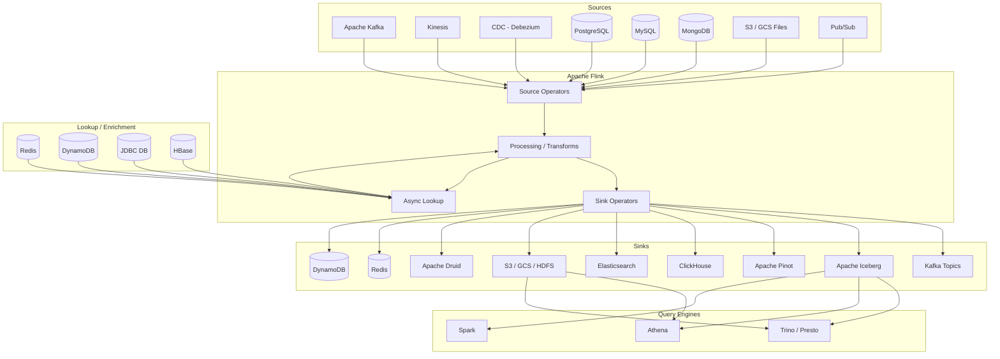
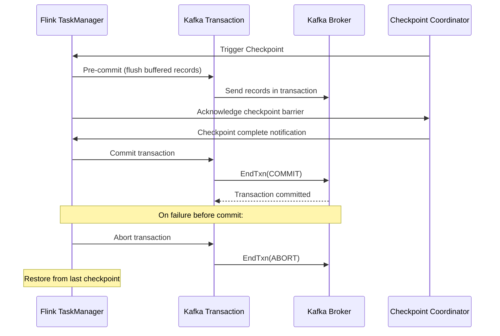
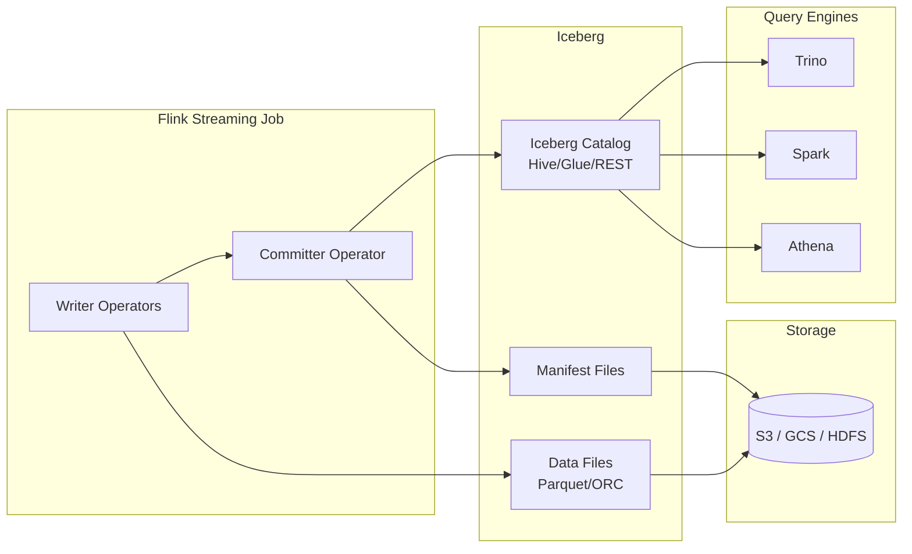
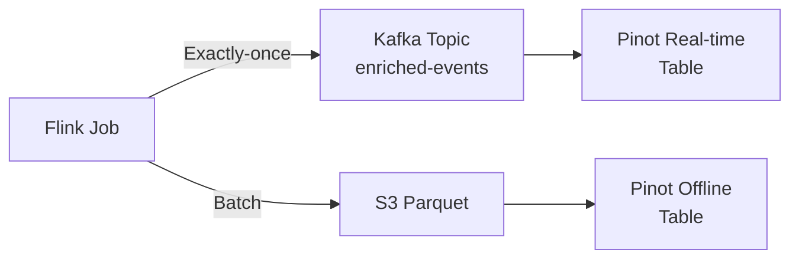
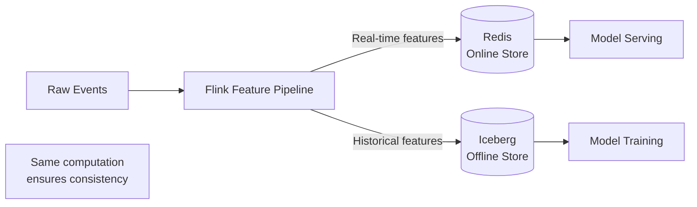
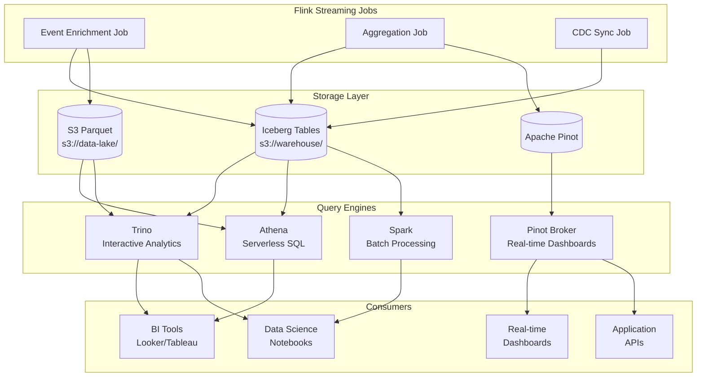

# Technology Integration Patterns — Flink in the Data Ecosystem

## 1. Integration Architecture Overview

Flink serves as the central stream processing engine connecting sources, sinks, and lookup enrichment stores in a modern data platform.



### Connector Guarantee Levels

| Connector | Source Guarantee | Sink Guarantee | Notes |
|-----------|----------------|----------------|-------|
| Kafka | Exactly-once | Exactly-once | Via 2PC Kafka transactions |
| Iceberg | Exactly-once | Exactly-once | Via Flink checkpointing + Iceberg commit |
| S3/GCS FileSink | N/A | Exactly-once | Staging + commit on checkpoint |
| Elasticsearch | N/A | At-least-once* | Exactly-once via idempotent writes |
| Redis | N/A | At-least-once | Idempotent by nature (key-based) |
| JDBC (XA) | N/A | Exactly-once | XA two-phase commit |
| JDBC (non-XA) | N/A | At-least-once | May duplicate on recovery |
| ClickHouse | N/A | At-least-once | Dedup via ReplacingMergeTree |
| Pinot | N/A | At-least-once | Dedup via primary key upsert |
| Kinesis | At-least-once | At-least-once | No native 2PC |
| CDC (Debezium) | Exactly-once | N/A | With Flink checkpointing |

### Connector Classification

- **Source Connectors**: Read data into Flink (bounded or unbounded)
- **Sink Connectors**: Write results from Flink
- **Lookup Sources**: Point-query enrichment during processing (sync or async I/O)
- **Hybrid**: Some connectors (Kafka, JDBC) serve multiple roles

---

## 2. Kafka Integration (Deep Dive)

### KafkaSource (New API) vs FlinkKafkaConsumer (Legacy)

| Feature | KafkaSource (FLIP-27) | FlinkKafkaConsumer (Legacy) |
|---------|----------------------|----------------------------|
| API Style | Unified Source framework | SourceFunction |
| Watermark strategy | Per-partition watermarks | Per-source watermarks |
| Bounded/Unbounded | Both | Unbounded only |
| Dynamic partition discovery | Built-in | Polling-based |
| Parallelism decoupling | Source splits != partitions | 1:1 partition mapping |
| Maintenance status | Active | Deprecated (Flink 1.17+) |

### KafkaSource — New API (DataStream)

```java
import org.apache.flink.connector.kafka.source.KafkaSource;
import org.apache.flink.connector.kafka.source.enumerator.initializer.OffsetsInitializer;
import org.apache.flink.api.common.serialization.SimpleStringSchema;
import org.apache.flink.api.common.eventtime.WatermarkStrategy;

KafkaSource<String> source = KafkaSource.<String>builder()
    .setBootstrapServers("broker1:9092,broker2:9092,broker3:9092")
    .setTopics("events-topic")
    .setGroupId("flink-consumer-group-prod")
    .setStartingOffsets(OffsetsInitializer.committedOffsets(OffsetResetStrategy.EARLIEST))
    .setValueOnlyDeserializer(new SimpleStringSchema())
    // Dynamic partition discovery every 5 minutes
    .setProperty("partition.discovery.interval.ms", "300000")
    // Kafka consumer properties
    .setProperty("fetch.min.bytes", "1048576")        // 1MB min fetch
    .setProperty("fetch.max.wait.ms", "500")
    .setProperty("max.partition.fetch.bytes", "5242880") // 5MB per partition
    .setProperty("session.timeout.ms", "30000")
    .setProperty("heartbeat.interval.ms", "10000")
    .setProperty("max.poll.records", "2000")
    .setProperty("security.protocol", "SASL_SSL")
    .setProperty("sasl.mechanism", "SCRAM-SHA-512")
    .setProperty("sasl.jaas.config", 
        "org.apache.kafka.common.security.scram.ScramLoginModule required " +
        "username=\"flink-prod\" password=\"${KAFKA_PASSWORD}\";")
    .build();

// Watermark strategy with per-partition alignment
WatermarkStrategy<String> watermarkStrategy = WatermarkStrategy
    .<String>forBoundedOutOfOrderness(Duration.ofSeconds(5))
    .withTimestampAssigner((event, timestamp) -> extractTimestamp(event))
    .withIdleness(Duration.ofMinutes(1))
    .withWatermarkAlignment("kafka-source-group", Duration.ofSeconds(3), Duration.ofSeconds(1));

DataStream<String> stream = env.fromSource(
    source, 
    watermarkStrategy, 
    "Kafka Source"
);
```

### Exactly-Once with Kafka Transactions (Two-Phase Commit)



```java
// Kafka Sink with Exactly-Once (Flink 1.17+)
import org.apache.flink.connector.kafka.sink.KafkaSink;
import org.apache.flink.connector.kafka.sink.KafkaRecordSerializationSchema;
import org.apache.flink.connector.base.DeliveryGuarantee;

KafkaSink<String> sink = KafkaSink.<String>builder()
    .setBootstrapServers("broker1:9092,broker2:9092,broker3:9092")
    .setRecordSerializer(
        KafkaRecordSerializationSchema.builder()
            .setTopic("output-topic")
            .setValueSerializationSchema(new SimpleStringSchema())
            .setKeySerializationSchema(new KeyExtractor())
            .setPartitioner(new CustomPartitioner())
            .build()
    )
    .setDeliveryGuarantee(DeliveryGuarantee.EXACTLY_ONCE)
    .setTransactionalIdPrefix("flink-prod-job-v1")
    .setProperty("transaction.timeout.ms", "900000") // 15 min (must be < broker max)
    .setProperty("acks", "all")
    .setProperty("retries", "2147483647")
    .setProperty("enable.idempotence", "true")
    .setProperty("max.in.flight.requests.per.connection", "5")
    .setProperty("batch.size", "65536")           // 64KB
    .setProperty("linger.ms", "100")
    .setProperty("buffer.memory", "67108864")     // 64MB
    .setProperty("compression.type", "zstd")
    .build();

stream.sinkTo(sink);
```

**Critical Production Settings for Exactly-Once:**
```properties
# Broker-side: transaction.max.timeout.ms must be >= Flink's transaction.timeout.ms
# Flink checkpoint interval should be < transaction.timeout.ms
# Consumer isolation.level=read_committed to only see committed transactions

# Flink configuration
execution.checkpointing.interval: 60000          # 1 minute
execution.checkpointing.timeout: 600000          # 10 minutes
execution.checkpointing.min-pause: 30000
state.backend.incremental: true
```

### Schema Registry Integration

```java
// Avro with Confluent Schema Registry
import org.apache.flink.formats.avro.registry.confluent.ConfluentRegistryAvroDeserializationSchema;
import org.apache.flink.formats.avro.registry.confluent.ConfluentRegistryAvroSerializationSchema;

// Deserialization (Source)
KafkaSource<GenericRecord> avroSource = KafkaSource.<GenericRecord>builder()
    .setBootstrapServers("broker:9092")
    .setTopics("events-avro")
    .setGroupId("flink-avro-consumer")
    .setStartingOffsets(OffsetsInitializer.earliest())
    .setDeserializer(
        KafkaRecordDeserializationSchema.of(
            ConfluentRegistryAvroDeserializationSchema.forGeneric(
                schema,
                "https://schema-registry:8081",
                Map.of(
                    "basic.auth.credentials.source", "USER_INFO",
                    "basic.auth.user.info", "user:password"
                )
            )
        )
    )
    .build();

// Serialization (Sink) with schema evolution
KafkaSink<GenericRecord> avroSink = KafkaSink.<GenericRecord>builder()
    .setBootstrapServers("broker:9092")
    .setRecordSerializer(
        KafkaRecordSerializationSchema.builder()
            .setTopic("output-avro")
            .setValueSerializationSchema(
                ConfluentRegistryAvroSerializationSchema.forGeneric(
                    "output-avro-value",
                    outputSchema,
                    "https://schema-registry:8081"
                )
            )
            .build()
    )
    .setDeliveryGuarantee(DeliveryGuarantee.EXACTLY_ONCE)
    .setTransactionalIdPrefix("flink-avro-sink")
    .build();
```

### Flink SQL with Kafka

```sql
-- Source table with Schema Registry
CREATE TABLE kafka_events (
    event_id STRING,
    user_id BIGINT,
    event_type STRING,
    properties MAP<STRING, STRING>,
    event_time TIMESTAMP(3),
    processing_time AS PROCTIME(),
    WATERMARK FOR event_time AS event_time - INTERVAL '5' SECOND
) WITH (
    'connector' = 'kafka',
    'topic' = 'user-events',
    'properties.bootstrap.servers' = 'broker1:9092,broker2:9092',
    'properties.group.id' = 'flink-sql-consumer',
    'scan.startup.mode' = 'group-offsets',
    'properties.auto.offset.reset' = 'earliest',
    'format' = 'avro-confluent',
    'avro-confluent.url' = 'https://schema-registry:8081',
    'avro-confluent.basic-auth.credentials-source' = 'USER_INFO',
    'avro-confluent.basic-auth.user-info' = 'user:password',
    'properties.partition.discovery.interval.ms' = '300000'
);

-- Sink table with exactly-once
CREATE TABLE kafka_enriched_output (
    event_id STRING,
    user_id BIGINT,
    user_name STRING,
    event_type STRING,
    event_time TIMESTAMP(3)
) WITH (
    'connector' = 'kafka',
    'topic' = 'enriched-events',
    'properties.bootstrap.servers' = 'broker1:9092,broker2:9092',
    'format' = 'avro-confluent',
    'avro-confluent.url' = 'https://schema-registry:8081',
    'sink.delivery-guarantee' = 'exactly-once',
    'sink.transactional-id-prefix' = 'flink-sql-sink-v1',
    'properties.transaction.timeout.ms' = '900000'
);
```

### Watermark Alignment Across Partitions

```java
// Problem: Fast partitions advance watermarks while slow partitions lag
// Solution: Watermark alignment pauses fast sources

WatermarkStrategy<Event> strategy = WatermarkStrategy
    .<Event>forBoundedOutOfOrderness(Duration.ofSeconds(10))
    .withTimestampAssigner((event, ts) -> event.getTimestamp())
    // Global alignment group - all sources in group align watermarks
    .withWatermarkAlignment(
        "kafka-alignment-group",    // Group name
        Duration.ofSeconds(20),     // Max drift between sources
        Duration.ofSeconds(3)       // Update interval
    )
    // Handle idle partitions (no events for 2 minutes)
    .withIdleness(Duration.ofMinutes(2));
```

---

## 3. Apache Iceberg Integration

### Architecture Overview



### Flink SQL CREATE TABLE with Iceberg

```sql
-- Create Iceberg catalog
CREATE CATALOG iceberg_catalog WITH (
    'type' = 'iceberg',
    'catalog-type' = 'hive',
    'uri' = 'thrift://hive-metastore:9083',
    'warehouse' = 's3://data-lake/warehouse',
    'io-impl' = 'org.apache.iceberg.aws.s3.S3FileIO',
    's3.endpoint' = 'https://s3.us-east-1.amazonaws.com',
    'clients' = '5'
);

-- Or with AWS Glue catalog
CREATE CATALOG glue_catalog WITH (
    'type' = 'iceberg',
    'catalog-type' = 'glue',
    'warehouse' = 's3://data-lake/warehouse',
    'io-impl' = 'org.apache.iceberg.aws.s3.S3FileIO'
);

USE CATALOG iceberg_catalog;
CREATE DATABASE IF NOT EXISTS analytics;
USE analytics;

-- Create partitioned Iceberg table
CREATE TABLE user_events (
    event_id STRING,
    user_id BIGINT,
    event_type STRING,
    event_payload STRING,
    event_time TIMESTAMP(3),
    dt STRING
) PARTITIONED BY (dt) WITH (
    'format-version' = '2',
    'write.format.default' = 'parquet',
    'write.parquet.compression-codec' = 'zstd',
    'write.target-file-size-bytes' = '134217728',    -- 128MB target file
    'write.distribution-mode' = 'hash',              -- hash distribute before write
    'write.metadata.delete-after-commit.enabled' = 'true',
    'write.metadata.previous-versions-max' = '50',
    'write.upsert.enabled' = 'true'                  -- Enable upsert mode
);

-- Streaming insert into Iceberg
INSERT INTO user_events
SELECT 
    event_id,
    user_id,
    event_type,
    event_payload,
    event_time,
    DATE_FORMAT(event_time, 'yyyy-MM-dd') as dt
FROM kafka_events;
```

### DataStream API — Streaming Writes

```java
import org.apache.iceberg.flink.sink.FlinkSink;
import org.apache.iceberg.flink.TableLoader;
import org.apache.iceberg.catalog.TableIdentifier;

// Table loader with Hive catalog
TableLoader tableLoader = TableLoader.fromCatalog(
    CatalogLoader.hive(
        "iceberg_catalog",
        new Configuration(),
        Map.of(
            "uri", "thrift://hive-metastore:9083",
            "warehouse", "s3://data-lake/warehouse"
        )
    ),
    TableIdentifier.of("analytics", "user_events")
);

// Streaming write with exactly-once
FlinkSink.forRowData(rowDataStream)
    .tableLoader(tableLoader)
    .tableSchema(tableSchema)
    .distributionMode(DistributionMode.HASH)
    .writeParallelism(16)
    .upsert(true)                                    // Upsert mode (requires equality fields)
    .equalityFieldColumns(Arrays.asList("event_id")) // Primary key for upsert
    .set("write.format.default", "parquet")
    .set("write.parquet.compression-codec", "zstd")
    .set("write.target-file-size-bytes", "134217728")
    .append();

// IMPORTANT: Iceberg commits happen at Flink checkpoints
// Configure checkpoint interval to control commit frequency
env.enableCheckpointing(60_000); // Commit every 1 minute
```

### Schema Evolution

```sql
-- Add columns (backward compatible)
ALTER TABLE user_events ADD COLUMNS (
    device_type STRING AFTER event_type,
    country STRING
);

-- Rename columns
ALTER TABLE user_events RENAME COLUMN event_payload TO payload;

-- Flink handles schema evolution transparently:
-- Old data files retain old schema; reads project to current schema
-- New writes use new schema automatically
```

### Compaction Management

```java
// Flink-based compaction job (runs periodically via Airflow)
// Rewrites small files into optimally-sized files

Actions.forTable(table)
    .rewriteDataFiles()
    .option("target-file-size-bytes", "134217728") // 128MB
    .option("min-file-size-bytes", "67108864")     // 64MB min (compact below this)
    .option("max-file-size-bytes", "201326592")    // 192MB max
    .option("min-input-files", "5")                // Only compact if 5+ small files
    .option("max-concurrent-file-group-rewrites", "10")
    .filter(Expressions.greaterThanOrEqual("dt", "2024-01-01"))
    .execute();

// Expire old snapshots
table.expireSnapshots()
    .expireOlderThan(System.currentTimeMillis() - TimeUnit.DAYS.toMillis(7))
    .retainLast(100)
    .commit();

// Remove orphan files
Actions.forTable(table)
    .removeOrphanFiles()
    .olderThan(System.currentTimeMillis() - TimeUnit.DAYS.toMillis(3))
    .execute();
```

### Exactly-Once Writes to Iceberg

The mechanism:
1. Writer operators produce data files during processing
2. On checkpoint, writers send file metadata (not data) to the single Committer operator
3. Committer performs an atomic Iceberg commit with all file metadata
4. If checkpoint fails, uncommitted data files are cleaned up
5. Result: exactly one Iceberg snapshot per successful checkpoint

```
Checkpoint N:
  Writers → produce files f1, f2, f3
  Barrier arrives → writers snapshot file list to state
  Committer receives file list → Iceberg atomic commit (snapshot N)
  
Failure after files written but before commit:
  Restore from checkpoint N-1 → orphan files cleaned by maintenance
```

---

## 4. Apache Pinot / ClickHouse / Druid (OLAP Sinks)

### Comparison Table

| Feature | Apache Pinot | ClickHouse | Apache Druid |
|---------|-------------|------------|--------------|
| **Primary use case** | User-facing analytics | Internal analytics / BI | Time-series analytics |
| **Ingestion model** | Real-time + offline | Batch inserts | Real-time + batch |
| **Query latency** | p99 < 100ms | p99 < 500ms | p99 < 200ms |
| **Upsert support** | Yes (v0.10+) | ReplacingMergeTree | No native upsert |
| **Best for** | Multi-tenant SaaS dashboards | Ad-hoc exploration | Event-driven time-series |
| **Exactly-once** | Dedup via primary key | Dedup via ReplacingMergeTree | Dedup via Kafka offsets |
| **Flink connector** | Via Kafka (recommended) | JDBC / HTTP batch | Via Kafka (recommended) |
| **Concurrency** | 1000s QPS | 100s QPS | 1000s QPS |
| **Join support** | Limited (lookup joins) | Full SQL joins | Limited |
| **Storage** | Columnar segments | Columnar (MergeTree) | Columnar segments |

### Real-Time Ingestion: Flink → Kafka → Pinot



```sql
-- Flink writes enriched data to Kafka (Pinot consumes from Kafka directly)
-- This is the recommended pattern: Flink → Kafka → Pinot

-- Pinot table config (for reference)
-- Real-time table consumes from Kafka topic written by Flink
```

```java
// Flink writes to Kafka topic that Pinot consumes
// Pinot provides native Kafka real-time ingestion (no custom Flink-Pinot connector needed)

// For direct Pinot writes (when Kafka is not desired):
public class PinotSinkFunction extends RichSinkFunction<RowData> {
    private transient PinotClient client;
    private final List<GenericRow> buffer = new ArrayList<>();
    private final int batchSize;
    
    @Override
    public void invoke(RowData value, Context context) throws Exception {
        buffer.add(convertToGenericRow(value));
        if (buffer.size() >= batchSize) {
            flush();
        }
    }
    
    private void flush() throws Exception {
        // Batch insert via Pinot's ingestion API
        client.ingestBatch("events_table", buffer);
        buffer.clear();
    }
    
    @Override
    public void snapshotState(FunctionSnapshotContext context) throws Exception {
        flush(); // Ensure all buffered records are sent before checkpoint
    }
}
```

### ClickHouse Batch Sink

```java
// ClickHouse JDBC Sink with batching
import org.apache.flink.connector.jdbc.JdbcSink;
import org.apache.flink.connector.jdbc.JdbcExecutionOptions;
import org.apache.flink.connector.jdbc.JdbcConnectionOptions;

DataStream<Event> events = /* ... */;

events.addSink(JdbcSink.sink(
    "INSERT INTO events (event_id, user_id, event_type, event_time, properties) VALUES (?, ?, ?, ?, ?)",
    (ps, event) -> {
        ps.setString(1, event.getEventId());
        ps.setLong(2, event.getUserId());
        ps.setString(3, event.getEventType());
        ps.setTimestamp(4, Timestamp.from(event.getEventTime()));
        ps.setString(5, event.getPropertiesJson());
    },
    JdbcExecutionOptions.builder()
        .withBatchSize(10_000)              // Batch 10K rows
        .withBatchIntervalMs(5_000)         // Or flush every 5 seconds
        .withMaxRetries(3)
        .build(),
    new JdbcConnectionOptions.JdbcConnectionOptionsBuilder()
        .withUrl("jdbc:clickhouse://clickhouse-cluster:8123/analytics")
        .withDriverName("com.clickhouse.jdbc.ClickHouseDriver")
        .withUsername("flink_writer")
        .withPassword("${CH_PASSWORD}")
        .build()
));
```

```sql
-- ClickHouse table designed for Flink ingestion
CREATE TABLE analytics.events ON CLUSTER '{cluster}'
(
    event_id String,
    user_id UInt64,
    event_type LowCardinality(String),
    event_time DateTime64(3),
    properties String,
    -- Version column for dedup
    _version UInt64 DEFAULT toUnixTimestamp64Milli(event_time)
)
ENGINE = ReplicatedReplacingMergeTree('/clickhouse/tables/{shard}/events', '{replica}', _version)
PARTITION BY toYYYYMM(event_time)
ORDER BY (user_id, event_type, event_time)
TTL event_time + INTERVAL 90 DAY;
```

### Druid Ingestion from Flink

```json
// Druid supervisor spec — consumes from Kafka topic written by Flink
{
  "type": "kafka",
  "dataSchema": {
    "dataSource": "flink_enriched_events",
    "timestampSpec": {"column": "event_time", "format": "iso"},
    "dimensionsSpec": {
      "dimensions": ["event_id", "user_id", "event_type", "country"]
    },
    "granularitySpec": {
      "queryGranularity": "minute",
      "segmentGranularity": "hour"
    }
  },
  "ioConfig": {
    "topic": "enriched-events",
    "consumerProperties": {"bootstrap.servers": "broker:9092"},
    "useEarliestOffset": true
  },
  "tuningConfig": {
    "type": "kafka",
    "maxRowsPerSegment": 5000000,
    "maxRowsInMemory": 500000
  }
}
```

---

## 5. Redis / DynamoDB (Low-Latency Stores)

### Async I/O for Redis Lookups

```java
import org.apache.flink.streaming.api.functions.async.RichAsyncFunction;
import org.apache.flink.streaming.api.functions.async.ResultFuture;
import io.lettuce.core.RedisClient;
import io.lettuce.core.api.async.RedisAsyncCommands;
import io.lettuce.core.codec.StringCodec;
import io.lettuce.core.resource.ClientResources;

public class RedisAsyncLookup extends RichAsyncFunction<Event, EnrichedEvent> {
    
    private transient RedisClient client;
    private transient RedisAsyncCommands<String, String> commands;
    
    @Override
    public void open(Configuration parameters) {
        ClientResources resources = ClientResources.builder()
            .ioThreadPoolSize(4)
            .computationThreadPoolSize(4)
            .build();
        client = RedisClient.create(resources, "redis://redis-cluster:6379");
        client.setOptions(ClientOptions.builder()
            .autoReconnect(true)
            .disconnectedBehavior(DisconnectedBehavior.REJECT_COMMANDS)
            .timeoutOptions(TimeoutOptions.enabled(Duration.ofSeconds(2)))
            .build());
        commands = client.connect().async();
    }
    
    @Override
    public void asyncInvoke(Event event, ResultFuture<EnrichedEvent> resultFuture) {
        String key = "user:" + event.getUserId();
        
        CompletableFuture<String> future = commands.hgetall(key).toCompletableFuture()
            .thenApply(map -> {
                EnrichedEvent enriched = new EnrichedEvent(event);
                enriched.setUserName(map.get("name"));
                enriched.setUserTier(map.get("tier"));
                return enriched;
            });
        
        future.whenComplete((result, throwable) -> {
            if (throwable != null) {
                // Fallback: emit event without enrichment
                resultFuture.complete(Collections.singleton(new EnrichedEvent(event)));
            } else {
                resultFuture.complete(Collections.singleton(result));
            }
        });
    }
    
    @Override
    public void timeout(Event event, ResultFuture<EnrichedEvent> resultFuture) {
        // On timeout, pass through without enrichment
        resultFuture.complete(Collections.singleton(new EnrichedEvent(event)));
    }
    
    @Override
    public void close() {
        if (client != null) client.shutdown();
    }
}

// Usage with capacity and timeout configuration
DataStream<EnrichedEvent> enriched = AsyncDataStream.unorderedWait(
    eventStream,
    new RedisAsyncLookup(),
    5000,                              // Timeout: 5 seconds
    TimeUnit.MILLISECONDS,
    200                                // Max concurrent requests (back-pressure)
);
```

### Redis Sink for Feature Store Updates

```java
public class RedisSinkFunction extends RichSinkFunction<FeatureVector> 
    implements CheckpointedFunction {
    
    private transient RedisClient client;
    private transient RedisAsyncCommands<String, String> commands;
    private final List<RedisFuture<?>> pendingFutures = new ArrayList<>();
    private final int maxBatchSize = 1000;
    
    @Override
    public void invoke(FeatureVector value, Context context) throws Exception {
        String key = "features:" + value.getEntityId();
        Map<String, String> featureMap = value.toMap();
        
        // Pipeline commands for throughput
        RedisFuture<?> future = commands.hset(key, featureMap);
        commands.expire(key, 86400); // 24h TTL
        pendingFutures.add(future);
        
        if (pendingFutures.size() >= maxBatchSize) {
            flushPending();
        }
    }
    
    private void flushPending() throws Exception {
        commands.flushCommands();
        for (RedisFuture<?> f : pendingFutures) {
            f.get(5, TimeUnit.SECONDS);
        }
        pendingFutures.clear();
    }
    
    @Override
    public void snapshotState(FunctionSnapshotContext context) throws Exception {
        flushPending();
    }
}
```

### DynamoDB Sink with Batch Writes

```java
import software.amazon.awssdk.services.dynamodb.DynamoDbAsyncClient;
import software.amazon.awssdk.services.dynamodb.model.*;

public class DynamoDBBatchSink extends RichSinkFunction<UserProfile> 
    implements CheckpointedFunction {
    
    private transient DynamoDbAsyncClient client;
    private final List<WriteRequest> buffer = new ArrayList<>();
    private static final int BATCH_SIZE = 25; // DynamoDB max batch size
    private static final String TABLE_NAME = "user-profiles";
    
    @Override
    public void open(Configuration parameters) {
        client = DynamoDbAsyncClient.builder()
            .region(Region.US_EAST_1)
            .httpClient(NettyNioAsyncHttpClient.builder()
                .maxConcurrency(50)
                .connectionTimeout(Duration.ofSeconds(5))
                .build())
            .overrideConfiguration(ClientOverrideConfiguration.builder()
                .retryPolicy(RetryPolicy.builder()
                    .numRetries(5)
                    .build())
                .build())
            .build();
    }
    
    @Override
    public void invoke(UserProfile profile, Context context) throws Exception {
        Map<String, AttributeValue> item = Map.of(
            "user_id", AttributeValue.builder().s(profile.getUserId()).build(),
            "features", AttributeValue.builder().m(profile.getFeatureMap()).build(),
            "updated_at", AttributeValue.builder().n(String.valueOf(System.currentTimeMillis())).build()
        );
        
        buffer.add(WriteRequest.builder()
            .putRequest(PutRequest.builder().item(item).build())
            .build());
        
        if (buffer.size() >= BATCH_SIZE) {
            flush();
        }
    }
    
    private void flush() throws Exception {
        if (buffer.isEmpty()) return;
        
        BatchWriteItemRequest request = BatchWriteItemRequest.builder()
            .requestItems(Map.of(TABLE_NAME, new ArrayList<>(buffer)))
            .build();
        
        // Retry unprocessed items with exponential backoff
        CompletableFuture<BatchWriteItemResponse> future = client.batchWriteItem(request);
        BatchWriteItemResponse response = future.get(10, TimeUnit.SECONDS);
        
        Map<String, List<WriteRequest>> unprocessed = response.unprocessedItems();
        int retries = 0;
        while (!unprocessed.isEmpty() && retries < 5) {
            Thread.sleep((long) Math.pow(2, retries) * 100);
            BatchWriteItemResponse retry = client.batchWriteItem(
                BatchWriteItemRequest.builder().requestItems(unprocessed).build()
            ).get(10, TimeUnit.SECONDS);
            unprocessed = retry.unprocessedItems();
            retries++;
        }
        
        buffer.clear();
    }
    
    @Override
    public void snapshotState(FunctionSnapshotContext context) throws Exception {
        flush();
    }
}
```

### Rate Limiting Pattern

```java
// Guava RateLimiter for external store protection
public class RateLimitedSink<T> extends RichSinkFunction<T> {
    private transient RateLimiter rateLimiter;
    private final SinkFunction<T> delegate;
    private final double permitsPerSecond;
    
    @Override
    public void open(Configuration parameters) throws Exception {
        rateLimiter = RateLimiter.create(permitsPerSecond);
        // ... delegate.open()
    }
    
    @Override
    public void invoke(T value, Context context) throws Exception {
        rateLimiter.acquire(); // Blocks if rate exceeded
        delegate.invoke(value, context);
    }
}
```

---

## 6. Elasticsearch / OpenSearch Integration

### Bulk Indexing from Flink

```java
import org.apache.flink.connector.elasticsearch.sink.Elasticsearch7SinkBuilder;
import org.apache.flink.connector.elasticsearch.sink.FlushBackoffType;

ElasticsearchSink<Event> esSink = new Elasticsearch7SinkBuilder<Event>()
    .setHosts(new HttpHost("es-node1", 9200, "https"),
              new HttpHost("es-node2", 9200, "https"),
              new HttpHost("es-node3", 9200, "https"))
    .setEmitter((event, context, indexer) -> {
        indexer.add(new IndexRequest("events-" + event.getDatePartition())
            .id(event.getEventId())          // Idempotent: same ID = upsert
            .routing(event.getUserId())       // Consistent routing
            .source(Map.of(
                "event_id", event.getEventId(),
                "user_id", event.getUserId(),
                "event_type", event.getEventType(),
                "timestamp", event.getTimestamp(),
                "payload", event.getPayload()
            ), XContentType.JSON));
    })
    // Bulk request configuration
    .setBulkFlushMaxActions(5000)
    .setBulkFlushMaxSizeMb(10)
    .setBulkFlushInterval(5000)    // 5 seconds
    // Retry on transient failures
    .setBulkFlushBackoffStrategy(FlushBackoffType.EXPONENTIAL, 5, 1000)
    // Connection settings
    .setConnectionUsername("flink_writer")
    .setConnectionPassword("${ES_PASSWORD}")
    .setConnectionRequestTimeout(30_000)
    .setConnectionTimeout(10_000)
    .setSocketTimeout(60_000)
    .build();

stream.sinkTo(esSink);
```

### Flink SQL with Elasticsearch

```sql
CREATE TABLE es_events (
    event_id STRING,
    user_id BIGINT,
    event_type STRING,
    event_time TIMESTAMP(3),
    payload STRING,
    PRIMARY KEY (event_id) NOT ENFORCED
) WITH (
    'connector' = 'elasticsearch-7',
    'hosts' = 'https://es-node1:9200;https://es-node2:9200',
    'index' = 'events-{event_time|yyyy-MM-dd}',  -- Dynamic index by date
    'username' = 'flink_writer',
    'password' = '${ES_PASSWORD}',
    'sink.bulk-flush.max-actions' = '5000',
    'sink.bulk-flush.max-size' = '10mb',
    'sink.bulk-flush.interval' = '5s',
    'sink.bulk-flush.backoff.strategy' = 'EXPONENTIAL',
    'sink.bulk-flush.backoff.max-retries' = '5',
    'sink.bulk-flush.backoff.delay' = '1s',
    'format' = 'json'
);

-- Upsert semantics (uses event_id as document _id)
INSERT INTO es_events
SELECT event_id, user_id, event_type, event_time, payload
FROM kafka_events;
```

### Document Routing and Index Lifecycle

```java
// Custom routing for co-located queries
indexer.add(new IndexRequest("events-2024-01")
    .id(event.getEventId())
    .routing(String.valueOf(event.getUserId() % 32))  // 32 routing groups
    .source(eventJson, XContentType.JSON));

// Partial updates (reduce write amplification)
indexer.add(new UpdateRequest("events-2024-01", event.getEventId())
    .routing(event.getRouting())
    .doc(Map.of("status", event.getNewStatus(), "updated_at", Instant.now().toString()))
    .docAsUpsert(true));  // Create if not exists
```

### Exactly-Once via Idempotent Writes

Elasticsearch doesn't support transactions, but exactly-once semantics can be achieved:

1. **Document ID = deterministic key** (e.g., event_id)
2. On Flink failure + replay, the same documents are re-indexed with same IDs
3. Elasticsearch overwrites existing documents with same ID → no duplicates
4. **Caveat**: partial updates may not be idempotent (use version conflicts or scripted updates)

```java
// Version-based conflict resolution for true idempotency
indexer.add(new IndexRequest("events-2024-01")
    .id(event.getEventId())
    .version(event.getSequenceNumber())     // Use Kafka offset as version
    .versionType(VersionType.EXTERNAL)      // Only accept higher versions
    .source(eventJson, XContentType.JSON));
```

---

## 7. Database Integration (JDBC/CDC)

### JDBC Lookup Source (Dimension Enrichment)

```sql
-- Dimension table for lookup joins
CREATE TABLE user_dim (
    user_id BIGINT,
    user_name STRING,
    email STRING,
    tier STRING,
    country STRING,
    PRIMARY KEY (user_id) NOT ENFORCED
) WITH (
    'connector' = 'jdbc',
    'url' = 'jdbc:postgresql://pg-primary:5432/users',
    'table-name' = 'users',
    'username' = 'flink_reader',
    'password' = '${PG_PASSWORD}',
    'lookup.cache.max-rows' = '50000',
    'lookup.cache.ttl' = '5min',
    'lookup.max-retries' = '3',
    'lookup.partial-cache.expire-after-write' = '10min',
    'lookup.partial-cache.expire-after-access' = '5min',
    'lookup.partial-cache.cache-missing-key' = 'true'
);

-- Temporal join (lookup join)
SELECT 
    e.event_id,
    e.user_id,
    u.user_name,
    u.tier,
    e.event_type,
    e.event_time
FROM kafka_events AS e
JOIN user_dim FOR SYSTEM_TIME AS OF e.processing_time AS u
    ON e.user_id = u.user_id;
```

### JDBC Sink with XA Transactions (Exactly-Once)

```java
// Exactly-once JDBC sink using XA (two-phase commit)
import org.apache.flink.connector.jdbc.JdbcExactlyOnceOptions;
import org.apache.flink.connector.jdbc.JdbcSink;

stream.addSink(JdbcSink.exactlyOnceSink(
    "INSERT INTO aggregated_metrics (metric_key, value, window_end) " +
    "VALUES (?, ?, ?) ON CONFLICT (metric_key, window_end) DO UPDATE SET value = EXCLUDED.value",
    (ps, metric) -> {
        ps.setString(1, metric.getKey());
        ps.setDouble(2, metric.getValue());
        ps.setTimestamp(3, Timestamp.from(metric.getWindowEnd()));
    },
    JdbcExecutionOptions.builder()
        .withBatchSize(1000)
        .withBatchIntervalMs(5000)
        .withMaxRetries(3)
        .build(),
    JdbcExactlyOnceOptions.builder()
        .withTransactionPerConnection(true) // Required for PostgreSQL
        .build(),
    // XA DataSource factory
    () -> {
        PGXADataSource xaDataSource = new PGXADataSource();
        xaDataSource.setUrl("jdbc:postgresql://pg-primary:5432/metrics");
        xaDataSource.setUser("flink_writer");
        xaDataSource.setPassword(System.getenv("PG_PASSWORD"));
        return xaDataSource;
    }
));
```

### CDC Sources (Flink CDC)

```sql
-- MySQL CDC Source
CREATE TABLE orders_cdc (
    order_id BIGINT,
    customer_id BIGINT,
    amount DECIMAL(10, 2),
    status STRING,
    created_at TIMESTAMP(3),
    updated_at TIMESTAMP(3),
    PRIMARY KEY (order_id) NOT ENFORCED
) WITH (
    'connector' = 'mysql-cdc',
    'hostname' = 'mysql-primary',
    'port' = '3306',
    'username' = 'flink_cdc',
    'password' = '${MYSQL_PASSWORD}',
    'database-name' = 'ecommerce',
    'table-name' = 'orders',
    'server-id' = '5401-5404',           -- Range for parallel readers
    'scan.incremental.snapshot.enabled' = 'true',
    'scan.incremental.snapshot.chunk.size' = '8096',
    'debezium.snapshot.mode' = 'initial',
    'debezium.slot.name' = 'flink_orders_slot'
);

-- PostgreSQL CDC Source
CREATE TABLE pg_users_cdc (
    user_id BIGINT,
    username STRING,
    email STRING,
    status STRING,
    updated_at TIMESTAMP(3),
    PRIMARY KEY (user_id) NOT ENFORCED
) WITH (
    'connector' = 'postgres-cdc',
    'hostname' = 'pg-primary',
    'port' = '5432',
    'username' = 'flink_cdc',
    'password' = '${PG_PASSWORD}',
    'database-name' = 'users_db',
    'schema-name' = 'public',
    'table-name' = 'users',
    'slot.name' = 'flink_users_slot',
    'decoding.plugin.name' = 'pgoutput',
    'debezium.snapshot.mode' = 'initial'
);

-- MongoDB CDC Source
CREATE TABLE mongo_products_cdc (
    _id STRING,
    name STRING,
    category STRING,
    price DECIMAL(10, 2),
    inventory INT,
    PRIMARY KEY (_id) NOT ENFORCED
) WITH (
    'connector' = 'mongodb-cdc',
    'hosts' = 'mongo-rs1:27017,mongo-rs2:27017',
    'username' = 'flink_cdc',
    'password' = '${MONGO_PASSWORD}',
    'database' = 'catalog',
    'collection' = 'products'
);

-- Real-time CDC join: orders enriched with latest user info
SELECT 
    o.order_id,
    o.amount,
    o.status,
    u.username,
    u.email
FROM orders_cdc o
JOIN pg_users_cdc u ON o.customer_id = u.user_id;
```

### Temporal Table Join with Versioned Tables

```sql
-- Create versioned table from CDC stream
CREATE TABLE orders_versioned (
    order_id BIGINT,
    status STRING,
    amount DECIMAL(10, 2),
    update_time TIMESTAMP(3),
    PRIMARY KEY (order_id) NOT ENFORCED,
    WATERMARK FOR update_time AS update_time - INTERVAL '5' SECOND
) WITH (
    'connector' = 'mysql-cdc',
    'hostname' = 'mysql-primary',
    'port' = '3306',
    'username' = 'flink_cdc',
    'password' = '${MYSQL_PASSWORD}',
    'database-name' = 'ecommerce',
    'table-name' = 'orders'
);

-- Event-time temporal join (point-in-time lookup)
SELECT 
    p.payment_id,
    p.order_id,
    p.payment_time,
    o.status AS order_status_at_payment_time,
    o.amount
FROM payments AS p
JOIN orders_versioned FOR SYSTEM_TIME AS OF p.payment_time AS o
    ON p.order_id = o.order_id;
```

---

## 8. ML Framework Integration

### TensorFlow Serving via Async I/O

```java
public class TFServingAsyncFunction extends RichAsyncFunction<FeatureVector, Prediction> {
    
    private transient AsyncHttpClient httpClient;
    private final String modelEndpoint;
    
    public TFServingAsyncFunction(String endpoint) {
        this.modelEndpoint = endpoint; // e.g., "http://tf-serving:8501/v1/models/fraud_model:predict"
    }
    
    @Override
    public void open(Configuration parameters) {
        httpClient = Dsl.asyncHttpClient(Dsl.config()
            .setMaxConnections(100)
            .setMaxConnectionsPerHost(50)
            .setConnectTimeout(5000)
            .setRequestTimeout(10000)
            .setKeepAlive(true)
            .build());
    }
    
    @Override
    public void asyncInvoke(FeatureVector input, ResultFuture<Prediction> resultFuture) {
        String requestBody = String.format(
            "{\"instances\": [{\"features\": %s}]}", 
            input.toJsonArray()
        );
        
        httpClient.preparePost(modelEndpoint)
            .setHeader("Content-Type", "application/json")
            .setBody(requestBody)
            .execute()
            .toCompletableFuture()
            .thenApply(response -> {
                JsonNode result = objectMapper.readTree(response.getResponseBody());
                double score = result.get("predictions").get(0).get(0).asDouble();
                return new Prediction(input.getEntityId(), score, input.getTimestamp());
            })
            .whenComplete((prediction, throwable) -> {
                if (throwable != null) {
                    resultFuture.complete(Collections.singleton(
                        Prediction.fallback(input.getEntityId())));
                } else {
                    resultFuture.complete(Collections.singleton(prediction));
                }
            });
    }
    
    @Override
    public void timeout(FeatureVector input, ResultFuture<Prediction> resultFuture) {
        resultFuture.complete(Collections.singleton(Prediction.timeout(input.getEntityId())));
    }
}

// Apply with concurrency control
DataStream<Prediction> predictions = AsyncDataStream.orderedWait(
    featureStream,
    new TFServingAsyncFunction("http://tf-serving:8501/v1/models/fraud:predict"),
    3000,       // 3s timeout
    TimeUnit.MILLISECONDS,
    100         // 100 concurrent requests
);
```

### ONNX Runtime Embedded Inference

```java
// Embedded inference — no network calls, lowest latency
public class ONNXInferenceFunction extends RichMapFunction<FeatureVector, Prediction> {
    
    private transient OrtEnvironment env;
    private transient OrtSession session;
    
    @Override
    public void open(Configuration parameters) throws Exception {
        env = OrtEnvironment.getEnvironment();
        OrtSession.SessionOptions opts = new OrtSession.SessionOptions();
        opts.setIntraOpNumThreads(2);
        opts.setOptimizationLevel(OrtSession.SessionOptions.OptLevel.ALL_OPT);
        
        // Load model from distributed filesystem (cached locally)
        byte[] modelBytes = loadModelFromS3("s3://models/fraud_v3.onnx");
        session = env.createSession(modelBytes, opts);
    }
    
    @Override
    public Prediction map(FeatureVector input) throws Exception {
        float[][] features = new float[][]{input.toFloatArray()};
        OnnxTensor tensor = OnnxTensor.createTensor(env, features);
        
        OrtSession.Result result = session.run(Map.of("input", tensor));
        float[][] output = (float[][]) result.get(0).getValue();
        
        tensor.close();
        result.close();
        
        return new Prediction(input.getEntityId(), output[0][0], input.getTimestamp());
    }
    
    @Override
    public void close() throws Exception {
        if (session != null) session.close();
        if (env != null) env.close();
    }
}
```

### SageMaker Endpoint Integration

```java
public class SageMakerAsyncFunction extends RichAsyncFunction<FeatureVector, Prediction> {
    
    private transient SageMakerRuntimeAsyncClient client;
    
    @Override
    public void open(Configuration parameters) {
        client = SageMakerRuntimeAsyncClient.builder()
            .region(Region.US_EAST_1)
            .httpClient(NettyNioAsyncHttpClient.builder()
                .maxConcurrency(50)
                .build())
            .build();
    }
    
    @Override
    public void asyncInvoke(FeatureVector input, ResultFuture<Prediction> resultFuture) {
        InvokeEndpointRequest request = InvokeEndpointRequest.builder()
            .endpointName("fraud-model-prod")
            .contentType("application/json")
            .body(SdkBytes.fromUtf8String(input.toJson()))
            .build();
        
        client.invokeEndpoint(request)
            .thenApply(response -> {
                String body = response.body().asUtf8String();
                double score = parseScore(body);
                return new Prediction(input.getEntityId(), score, input.getTimestamp());
            })
            .whenComplete((pred, err) -> {
                if (err != null) {
                    resultFuture.complete(Collections.singleton(Prediction.fallback(input.getEntityId())));
                } else {
                    resultFuture.complete(Collections.singleton(pred));
                }
            });
    }
}
```

### Feature Store Writes (Online + Offline Consistency)



```java
// Single Flink job writes to both online (Redis) and offline (Iceberg) stores
DataStream<FeatureVector> features = events
    .keyBy(Event::getUserId)
    .window(TumblingEventTimeWindows.of(Time.minutes(5)))
    .aggregate(new FeatureAggregator());

// Branch 1: Online store (Redis)
features.addSink(new RedisSinkFunction());

// Branch 2: Offline store (Iceberg via Kafka → Iceberg or direct)
features.sinkTo(icebergSink);
```

---

## 9. Object Storage (S3/GCS/HDFS)

### Flink FileSink (StreamingFileSink)

```java
import org.apache.flink.connector.file.sink.FileSink;
import org.apache.flink.formats.parquet.avro.ParquetAvroWriters;
import org.apache.flink.core.fs.Path;
import org.apache.flink.streaming.api.functions.sink.filesystem.rollingpolicies.OnCheckpointRollingPolicy;
import org.apache.flink.streaming.api.functions.sink.filesystem.bucketassigners.DateTimeBucketAssigner;

// Parquet sink with date-hour bucketing
FileSink<GenericRecord> fileSink = FileSink
    .forBulkFormat(
        new Path("s3://data-lake/events/"),
        ParquetAvroWriters.forGenericRecord(avroSchema)
    )
    .withBucketAssigner(new DateTimeBucketAssigner<>("'dt='yyyy-MM-dd'/hr='HH"))
    .withRollingPolicy(OnCheckpointRollingPolicy.build())
    .withOutputFileConfig(OutputFileConfig.builder()
        .withPartPrefix("events")
        .withPartSuffix(".parquet")
        .build())
    .build();

stream.sinkTo(fileSink);
```

### Custom Bucketing Strategy

```java
// Custom bucket assigner: by date + event_type
public class EventBucketAssigner implements BucketAssigner<Event, String> {
    
    @Override
    public String getBucketId(Event event, Context context) {
        LocalDateTime dt = Instant.ofEpochMilli(event.getTimestamp())
            .atZone(ZoneOffset.UTC).toLocalDateTime();
        return String.format("dt=%s/hr=%02d/event_type=%s",
            dt.toLocalDate(), dt.getHour(), event.getEventType());
    }
    
    @Override
    public SimpleVersionedSerializer<String> getSerializer() {
        return SimpleVersionedStringSerializer.INSTANCE;
    }
}
```

### File Rolling Policies

```java
// Row-format sink with size + time + inactivity rolling
FileSink<String> sink = FileSink
    .forRowFormat(new Path("s3://logs/"), new SimpleStringEncoder<String>("UTF-8"))
    .withRollingPolicy(
        DefaultRollingPolicy.builder()
            .withMaxPartSize(MemorySize.ofMebiBytes(256))    // Roll at 256MB
            .withRolloverInterval(Duration.ofMinutes(15))     // Roll every 15 min
            .withInactivityInterval(Duration.ofMinutes(5))    // Roll after 5 min idle
            .build()
    )
    .withBucketAssigner(new DateTimeBucketAssigner<>("yyyy-MM-dd/HH"))
    .withBucketCheckInterval(60_000) // Check bucket state every minute
    .build();
```

### Exactly-Once with S3

The FileSink achieves exactly-once via a two-phase approach:

```
Phase 1 (Writing):
  - Records written to in-progress files: s3://bucket/path/.part-0-0.inprogress
  
Phase 2 (On Checkpoint):
  - In-progress files finalized → pending files: .part-0-0.pending
  - Pending files committed (renamed to final): part-0-0.parquet
  
Recovery:
  - Uncommitted in-progress files are discarded
  - Already committed files are not re-written
  - Result: each record appears exactly once in output
```

**S3-specific configuration:**
```yaml
# flink-conf.yaml
s3.access-key: ${AWS_ACCESS_KEY_ID}
s3.secret-key: ${AWS_SECRET_ACCESS_KEY}
s3.endpoint: s3.us-east-1.amazonaws.com
s3.path.style.access: false

# Critical for exactly-once with S3
s3.entropy.key: _entropy_
s3.entropy.length: 4

# Performance tuning
s3.upload.max.concurrent.uploads: 10
s3.part.size: 67108864  # 64MB multipart upload part size
```

### Format and Compression Comparison

| Format | Compression | Read Speed | Write Speed | File Size | Use Case |
|--------|-------------|-----------|-------------|-----------|----------|
| Parquet + Snappy | Good | Fast | Fast | Medium | Default choice, Athena/Trino |
| Parquet + ZSTD | Excellent | Medium | Medium | Small | Cold storage, cost optimization |
| Parquet + LZ4 | Moderate | Fastest | Fastest | Large | Low-latency reads |
| ORC + ZLIB | Excellent | Fast | Medium | Small | Hive ecosystem |
| ORC + Snappy | Good | Fastest | Fast | Medium | Spark ecosystem |
| Avro + Snappy | Moderate | Fast | Fastest | Large | Schema evolution, row-based access |
| JSON + GZIP | Good | Slow | Fast | Medium | Debugging, human-readable |
| CSV + GZIP | Good | Medium | Fastest | Medium | Legacy systems |

**Recommendation**: Parquet + ZSTD for most analytical workloads. Parquet + Snappy if read latency is critical.

### Flink SQL FileSink

```sql
CREATE TABLE s3_events (
    event_id STRING,
    user_id BIGINT,
    event_type STRING,
    event_time TIMESTAMP(3),
    dt STRING,
    hr STRING
) PARTITIONED BY (dt, hr) WITH (
    'connector' = 'filesystem',
    'path' = 's3://data-lake/events/',
    'format' = 'parquet',
    'parquet.compression' = 'ZSTD',
    'sink.partition-commit.trigger' = 'partition-time',
    'sink.partition-commit.delay' = '1 h',
    'sink.partition-commit.policy.kind' = 'success-file,metastore',
    'sink.partition-commit.success-file.name' = '_SUCCESS',
    'sink.rolling-policy.file-size' = '256MB',
    'sink.rolling-policy.rollover-interval' = '15 min',
    'sink.rolling-policy.check-interval' = '1 min',
    'auto-compaction' = 'true',
    'compaction.file-size' = '256MB'
);

INSERT INTO s3_events
SELECT 
    event_id, user_id, event_type, event_time,
    DATE_FORMAT(event_time, 'yyyy-MM-dd') as dt,
    DATE_FORMAT(event_time, 'HH') as hr
FROM kafka_events;
```

---

## 10. Orchestration Integration

### Airflow + Flink

```python
# Airflow DAG for Flink job management
from airflow import DAG
from airflow.providers.apache.flink.operators.flink import FlinkKubernetesOperator
from airflow.providers.http.sensors.http import HttpSensor
from airflow.operators.python import PythonOperator
from datetime import datetime, timedelta

default_args = {
    'owner': 'data-platform',
    'retries': 3,
    'retry_delay': timedelta(minutes=5),
}

with DAG(
    'flink_daily_compaction',
    default_args=default_args,
    schedule_interval='0 2 * * *',  # 2 AM daily
    start_date=datetime(2024, 1, 1),
    catchup=False,
) as dag:
    
    # Submit Flink batch job for Iceberg compaction
    compact_iceberg = FlinkKubernetesOperator(
        task_id='compact_iceberg_tables',
        application_file='k8s/flink-compaction-job.yaml',
        namespace='flink-jobs',
        kubernetes_conn_id='k8s_prod',
    )
    
    # Monitor streaming job health
    check_streaming_job = HttpSensor(
        task_id='check_streaming_job_health',
        http_conn_id='flink_rest',
        endpoint='/jobs/{{ var.value.streaming_job_id }}/status',
        response_check=lambda response: response.json()['state'] == 'RUNNING',
        poke_interval=60,
        timeout=300,
    )
    
    # Trigger savepoint before upgrade
    def trigger_savepoint(**context):
        import requests
        job_id = Variable.get("streaming_job_id")
        resp = requests.post(
            f"http://flink-jobmanager:8081/jobs/{job_id}/savepoints",
            json={"cancel-job": False, "target-directory": "s3://savepoints/"}
        )
        savepoint_id = resp.json()["request-id"]
        context['ti'].xcom_push(key='savepoint_id', value=savepoint_id)
    
    savepoint_task = PythonOperator(
        task_id='trigger_savepoint',
        python_callable=trigger_savepoint,
    )
    
    check_streaming_job >> savepoint_task >> compact_iceberg
```

### Kubernetes Operator

```yaml
# Flink Kubernetes Operator - FlinkDeployment CRD
apiVersion: flink.apache.org/v1beta1
kind: FlinkDeployment
metadata:
  name: event-processing-prod
  namespace: flink-prod
spec:
  image: company/flink:1.18-java17
  flinkVersion: v1_18
  flinkConfiguration:
    execution.checkpointing.interval: "60000"
    execution.checkpointing.min-pause: "30000"
    state.backend: rocksdb
    state.backend.incremental: "true"
    state.checkpoints.dir: s3://flink-state/checkpoints
    state.savepoints.dir: s3://flink-state/savepoints
    high-availability: kubernetes
    high-availability.storageDir: s3://flink-state/ha
    kubernetes.operator.savepoint.history.max.count: "5"
    kubernetes.operator.job.autoscaler.enabled: "true"
    kubernetes.operator.job.autoscaler.metrics.window: "5m"
    kubernetes.operator.job.autoscaler.target.utilization: "0.7"
  serviceAccount: flink-sa
  jobManager:
    resource:
      memory: "4096m"
      cpu: 2
    replicas: 1
  taskManager:
    resource:
      memory: "8192m"
      cpu: 4
    replicas: 6
  job:
    jarURI: s3://flink-jars/event-processing-2.1.0.jar
    entryClass: com.company.EventProcessingJob
    parallelism: 24
    upgradeMode: savepoint
    state: running
    savepointTriggerNonce: 0
  restartNonce: 0
```

### Event-Driven Orchestration with Temporal

```java
// Temporal workflow that coordinates Flink + downstream systems
@WorkflowInterface
public interface DataPipelineWorkflow {
    @WorkflowMethod
    void runPipeline(PipelineConfig config);
}

@ActivityInterface
public interface FlinkActivities {
    String submitJob(FlinkJobSpec spec);
    JobStatus waitForCompletion(String jobId, Duration timeout);
    String triggerSavepoint(String jobId);
}

public class DataPipelineWorkflowImpl implements DataPipelineWorkflow {
    
    private final FlinkActivities flink = Workflow.newActivityStub(FlinkActivities.class,
        ActivityOptions.newBuilder().setStartToCloseTimeout(Duration.ofHours(2)).build());
    
    @Override
    public void runPipeline(PipelineConfig config) {
        // 1. Submit Flink batch job
        String jobId = flink.submitJob(config.getFlinkSpec());
        
        // 2. Wait for completion
        JobStatus status = flink.waitForCompletion(jobId, Duration.ofHours(1));
        if (status != JobStatus.FINISHED) {
            throw new RuntimeException("Flink job failed: " + status);
        }
        
        // 3. Trigger downstream (e.g., Iceberg compaction, Pinot segment push)
        // Saga pattern: compensate on failure
        Saga.Builder saga = new Saga.Builder();
        saga.addCompensation(() -> rollbackIcebergSnapshot(config));
        
        compactIcebergTable(config.getTableName());
        saga.addCompensation(() -> revertCompaction(config));
        
        refreshPinotSegments(config.getPinotTable());
    }
}
```

---

## 11. Query Engines on Flink Output



### Trino Querying Iceberg Tables Written by Flink

```sql
-- Trino: query real-time Iceberg table maintained by Flink
-- Flink commits every 1 minute → data visible within 1 minute

-- Time-travel query (see state at specific snapshot)
SELECT * FROM iceberg_catalog.analytics.user_events
FOR VERSION AS OF 7234891234;

-- Incremental reads (only changes since last snapshot)
SELECT * FROM iceberg_catalog.analytics.user_events
WHERE "$snapshot_id" > 7234891234;

-- Federated query joining Flink's Iceberg output with other sources
SELECT 
    e.user_id,
    e.event_type,
    COUNT(*) as event_count,
    u.user_name,
    u.tier
FROM iceberg_catalog.analytics.user_events e
JOIN postgresql.public.users u ON e.user_id = u.user_id
WHERE e.dt = '2024-01-15'
GROUP BY e.user_id, e.event_type, u.user_name, u.tier;
```

### Athena on S3 Parquet from Flink

```sql
-- Create external table on Flink's S3 output (Hive-style partitioning)
CREATE EXTERNAL TABLE events_parquet (
    event_id string,
    user_id bigint,
    event_type string,
    event_time timestamp
)
PARTITIONED BY (dt string, hr string)
STORED AS PARQUET
LOCATION 's3://data-lake/events/'
TBLPROPERTIES ('parquet.compression'='ZSTD');

-- Add partitions (or use MSCK REPAIR TABLE for auto-discovery)
MSCK REPAIR TABLE events_parquet;

-- Query
SELECT event_type, COUNT(*) as cnt
FROM events_parquet
WHERE dt = '2024-01-15' AND hr BETWEEN '08' AND '17'
GROUP BY event_type
ORDER BY cnt DESC;
```

### Unified Real-Time + Historical Query Pattern

```
┌─────────────────────────────────────────────────────────┐
│                    Query Federation                       │
├─────────────────────────────────────────────────────────┤
│                                                          │
│  Real-time (last 2 hours): Pinot → sub-second queries   │
│  Recent (2h - 7 days):     Iceberg → Trino (seconds)    │
│  Historical (7+ days):     S3 Parquet → Athena (minutes)│
│                                                          │
│  Application logic routes queries to appropriate engine  │
│  based on time range in WHERE clause                     │
│                                                          │
└─────────────────────────────────────────────────────────┘
```

---

## 12. Integration Patterns Summary Table

| Technology | Connector Type | Guarantee | Latency | Throughput | Primary Use Case | Key Config |
|-----------|---------------|-----------|---------|------------|-----------------|------------|
| **Kafka (Source)** | Source (FLIP-27) | Exactly-once | ms | 1M+ msg/s | Event ingestion | `partition.discovery.interval.ms` |
| **Kafka (Sink)** | Sink | Exactly-once | ms | 1M+ msg/s | Event routing | `transactional-id-prefix`, 2PC |
| **Iceberg** | Source + Sink | Exactly-once | 1 min (checkpoint) | 100K+ rows/s | Data lakehouse | `write.distribution-mode=hash` |
| **S3 FileSink** | Sink | Exactly-once | Minutes | 500MB+/s | Data lake archival | `sink.rolling-policy.file-size` |
| **Elasticsearch** | Sink | At-least-once* | Seconds | 50K+ docs/s | Full-text search | `setBulkFlushMaxActions(5000)` |
| **Redis (Lookup)** | Async I/O | N/A | < 1ms | 100K+/s | Enrichment | `AsyncDataStream.unorderedWait` |
| **Redis (Sink)** | Sink | At-least-once | ms | 100K+/s | Feature store / cache | Pipeline + batch flush |
| **ClickHouse** | JDBC Sink | At-least-once* | Seconds | 200K+ rows/s | OLAP analytics | `withBatchSize(10000)`, ReplacingMergeTree |
| **Pinot** | Via Kafka | At-least-once* | Seconds | 100K+ rows/s | User-facing analytics | Upsert mode for dedup |
| **DynamoDB** | Custom Sink | At-least-once | ms | 25K+ WCU | Key-value serving | `BatchWriteItem`, exponential backoff |
| **PostgreSQL (JDBC)** | Lookup + Sink | Exactly-once (XA) | ms | 10K+ rows/s | Dimension tables / results | XA transactions |
| **MySQL CDC** | Source | Exactly-once | ms | 50K+ rows/s | Change capture | `scan.incremental.snapshot.enabled` |
| **TF Serving** | Async I/O | N/A | 10-50ms | 5K+/s | ML inference | Concurrency limit, timeout |
| **ONNX Runtime** | Embedded (map) | N/A | < 1ms | 50K+/s | Low-latency ML | In-process, no network |
| **Druid** | Via Kafka | At-least-once | Seconds | 100K+ rows/s | Time-series OLAP | Kafka supervisor spec |

\* Achieves effective exactly-once via idempotent writes (document ID / primary key dedup)

### Production Checklist for Any Integration

1. **Define delivery guarantee** — exactly-once requires 2PC or idempotent writes
2. **Set appropriate batch sizes** — balance latency vs throughput
3. **Configure timeouts** — prevent cascading failures from slow external systems
4. **Implement rate limiting** — protect downstream systems from Flink's throughput
5. **Add dead-letter queues** — route failed records for investigation
6. **Monitor connector metrics** — track lag, buffer utilization, error rates
7. **Test failure scenarios** — checkpoint recovery, network partitions, slow sinks
8. **Schema evolution strategy** — plan for field additions/removals
9. **Credential rotation** — use secret managers, not hardcoded values
10. **Capacity planning** — size external systems to match Flink's output rate

---

*Last updated: 2024-01 | Flink 1.18+ | Production-validated patterns*
