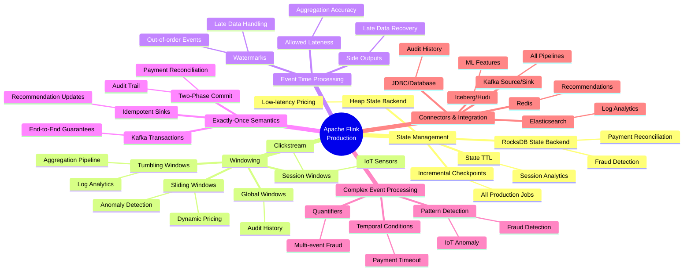
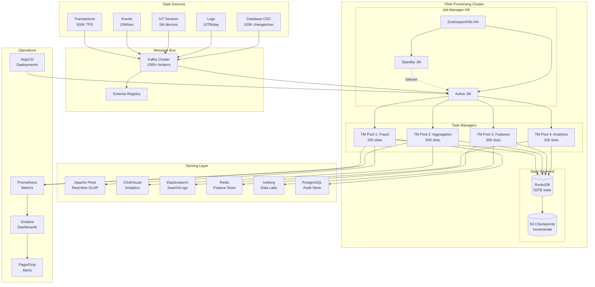

# Apache Flink Production at Scale - Top 10 Real-World Problems

> A world-class guide to solving billion-scale data engineering problems with Apache Flink. Each problem includes production architecture, deployment patterns, monitoring strategies, and scaling techniques used by companies like Uber, Netflix, Alibaba, Stripe, and Spotify.

---

## Why This Guide Exists

Most Flink tutorials show toy examples. This guide shows how **real companies** deploy Flink to handle **billions of transactions daily** — with all the operational complexity that entails: state management at terabyte scale, exactly-once guarantees under failure, zero-downtime upgrades, and cost optimization.

---

## Guide Structure

```
10-flink-production-at-scale/
├── README.md                          ← You are here
├── 00-flink-architecture-internals.md ← Core concepts & internals
├── 01-fraud-detection-pipeline.md     ← Problem 1: Real-time fraud detection
├── 02-audit-history-pipeline.md       ← Problem 2: History & audit trails
├── 03-real-time-aggregation-pipeline.md ← Problem 3: Aggregation at scale
├── 04-recommendation-system-pipeline.md ← Problem 4: Real-time recommendations
├── 05-ml-feature-engineering-pipeline.md ← Problem 5: ML feature engineering
├── 06-iot-anomaly-detection-pipeline.md ← Problem 6: IoT anomaly detection
├── 07-clickstream-analytics-pipeline.md ← Problem 7: Clickstream & sessions
├── 08-payment-reconciliation-pipeline.md ← Problem 8: Payment settlement
├── 09-log-analytics-observability-pipeline.md ← Problem 9: Log analytics
├── 10-dynamic-pricing-pipeline.md     ← Problem 10: Dynamic pricing
├── 11-deployment-production-operations.md ← Production deployment
├── 12-monitoring-alerting-debugging.md ← Monitoring & debugging
├── 13-scaling-billions-transactions.md ← Scaling strategies
└── 14-technology-integration-patterns.md ← Ecosystem integrations
```

---

## Top 10 Production Problems

| # | Problem | Industry | Scale | Key Flink Concepts |
|---|---------|----------|-------|-------------------|
| 1 | [Fraud Detection](01-fraud-detection-pipeline.md) | Banking/Fintech | 500K TPS | CEP, Stateful Processing, Low Latency |
| 2 | [Audit & History](02-audit-history-pipeline.md) | Finance/Healthcare | 1B events/day | Event Sourcing, CDC, Exactly-Once |
| 3 | [Real-time Aggregation](03-real-time-aggregation-pipeline.md) | E-commerce | 10M events/sec | Windows, Watermarks, Late Data |
| 4 | [Recommendation System](04-recommendation-system-pipeline.md) | Media/Retail | 100M users | Async I/O, Broadcast State |
| 5 | [ML Feature Engineering](05-ml-feature-engineering-pipeline.md) | All Industries | 50TB/day | Table API, Batch-Stream Unification |
| 6 | [IoT Anomaly Detection](06-iot-anomaly-detection-pipeline.md) | Manufacturing | 5M sensors | Session Windows, Pattern Matching |
| 7 | [Clickstream Analytics](07-clickstream-analytics-pipeline.md) | AdTech/Media | 2B clicks/day | Session Windows, Side Outputs |
| 8 | [Payment Reconciliation](08-payment-reconciliation-pipeline.md) | Payments | $1T/year | Interval Joins, State TTL |
| 9 | [Log Analytics](09-log-analytics-observability-pipeline.md) | Platform/SRE | 10TB logs/day | Windowed Aggregation, Sinks |
| 10 | [Dynamic Pricing](10-dynamic-pricing-pipeline.md) | Travel/Ride-sharing | 1M prices/sec | Process Functions, Timers |

---

## Flink Concepts Mapped to Problems



---

## Production Architecture Overview



---

## Technology Stack Per Problem

| Problem | Source | Flink API | State | Sink | Query Engine |
|---------|--------|-----------|-------|------|-------------|
| Fraud Detection | Kafka (Avro) | DataStream + CEP | RocksDB (100GB) | Kafka → Alert Service | - |
| Audit History | Debezium CDC | Table API | RocksDB (1TB) | Iceberg + PostgreSQL | Trino/Athena |
| Aggregation | Kafka (Protobuf) | DataStream | RocksDB (500GB) | Pinot + ClickHouse | Pinot SQL |
| Recommendations | Kafka + Redis | DataStream + Async I/O | RocksDB (200GB) | Redis + DynamoDB | - |
| ML Features | Kafka + Iceberg | Table API + DataStream | RocksDB (2TB) | Iceberg + Feature Store | Spark/Trino |
| IoT Anomaly | MQTT → Kafka | DataStream + CEP | RocksDB (300GB) | InfluxDB + Kafka | Grafana |
| Clickstream | Kafka (JSON) | DataStream | RocksDB (500GB) | ClickHouse + S3 | ClickHouse SQL |
| Payments | Kafka (Avro) | DataStream | RocksDB (100GB) | PostgreSQL + Kafka | - |
| Log Analytics | Kafka (JSON) | DataStream | RocksDB (1TB) | Elasticsearch + S3 | Kibana/Athena |
| Dynamic Pricing | Kafka + gRPC | DataStream + Process | Heap (50GB) | Redis + Kafka | - |

---

## Scale Reference Numbers (Production)

| Metric | Value | Which Problems |
|--------|-------|---------------|
| Events/second ingested | 10M+ | Aggregation, Clickstream |
| Transactions/second | 500K+ | Fraud, Payments |
| State size per job | 50GB - 2TB | All |
| Checkpoint interval | 1-5 minutes | All |
| Checkpoint size (incremental) | 1-10GB | All |
| Recovery time (from checkpoint) | 30s - 3min | All |
| Parallelism per job | 100-2000 | Depends on throughput |
| TaskManagers per cluster | 50-500 | Multi-tenant clusters |
| End-to-end latency | 50ms - 30s | Depends on use case |
| Kafka partitions consumed | 1000-10000 | High throughput jobs |

---

## How to Use This Guide

1. **Start with Internals** → [00-flink-architecture-internals.md](00-flink-architecture-internals.md)
2. **Pick a Problem** → Choose from the 10 production problems above
3. **Understand Deployment** → [11-deployment-production-operations.md](11-deployment-production-operations.md)
4. **Set Up Monitoring** → [12-monitoring-alerting-debugging.md](12-monitoring-alerting-debugging.md)
5. **Plan Scaling** → [13-scaling-billions-transactions.md](13-scaling-billions-transactions.md)
6. **Integrate Ecosystem** → [14-technology-integration-patterns.md](14-technology-integration-patterns.md)

---

## Companies Using Flink at Scale

| Company | Scale | Use Cases |
|---------|-------|-----------|
| **Alibaba** | 600K+ cores, 40+ PB state | Search ranking, recommendations, fraud |
| **Uber** | 4000+ Flink jobs | Surge pricing, ETA, marketplace |
| **Netflix** | 1M+ events/sec per job | Content recommendations, A/B testing |
| **Stripe** | 500K TPS | Fraud detection, payment routing |
| **Spotify** | 10B+ events/day | Personalization, ad targeting |
| **Pinterest** | 1M+ events/sec | Real-time signals, recommendations |
| **Lyft** | 1000+ jobs | Pricing, ETAs, driver matching |
| **Shopify** | 1B+ events/day | Fraud, inventory, analytics |
| **Coinbase** | 100K+ TPS | Compliance, fraud, market data |
| **DoorDash** | 500K+ events/sec | Delivery ETAs, demand prediction |

---

## Prerequisites

- Understanding of distributed systems concepts
- Familiarity with Kafka fundamentals
- Basic Java/Scala/Python knowledge
- Knowledge of SQL (for Flink SQL examples)
