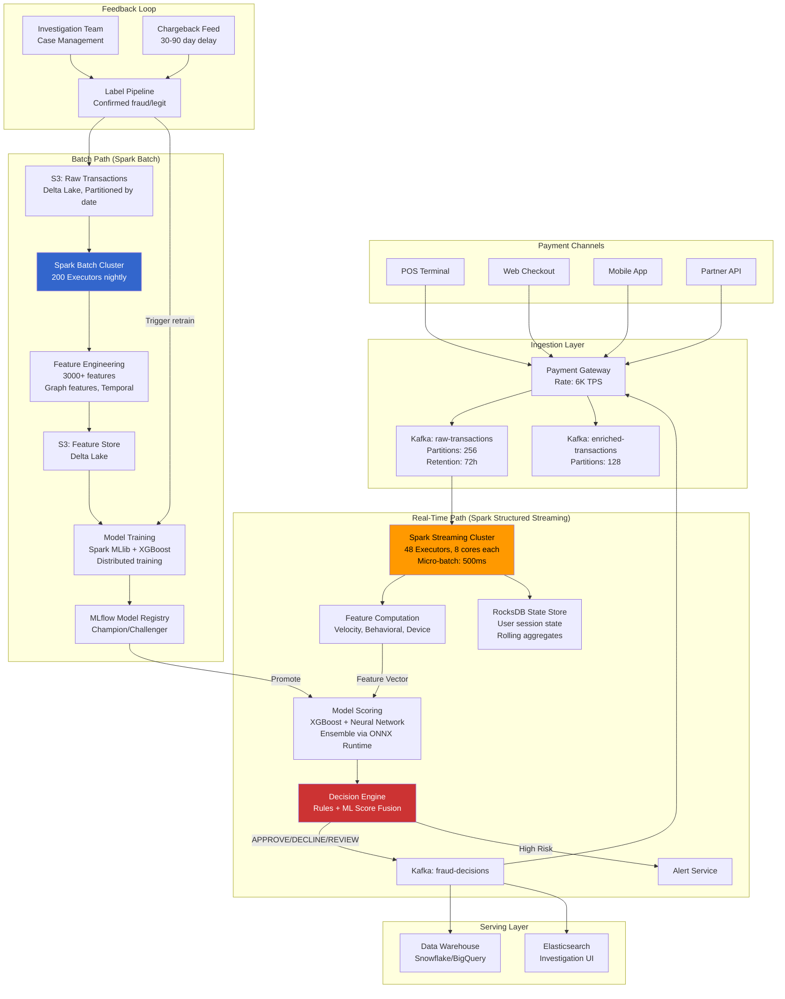
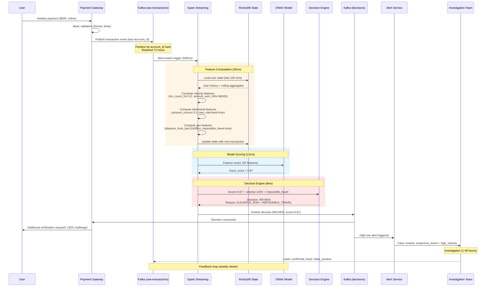
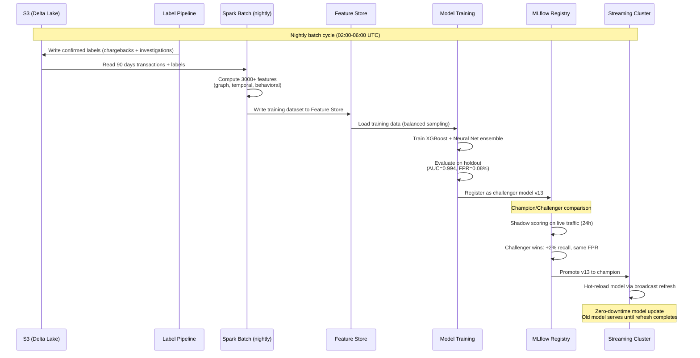

# Real-Time + Batch Fraud Detection Pipeline with Apache Spark

## 1. Problem Statement

### Scale & Requirements

| Metric | Target |
|--------|--------|
| Daily transaction volume | 500M–2B transactions |
| Real-time scoring latency | P99 < 100ms (from Kafka ingestion to decision) |
| Batch processing window | Nightly 4-hour window for full feature recomputation |
| False positive rate | < 0.1% (1 in 1000 flagged transactions is legitimate) |
| False negative rate | < 0.01% (miss rate for actual fraud) |
| Availability | 99.99% (< 52 min downtime/year) |
| Data retention | 7 years (regulatory: PCI-DSS, BSA/AML) |

### Fraud Types

| Type | Description | Detection Approach |
|------|-------------|-------------------|
| **Card-Not-Present (CNP)** | Stolen card details used online | Velocity checks, device fingerprinting, geo-anomaly |
| **Account Takeover (ATO)** | Attacker gains access to legitimate account | Behavioral biometrics, session anomaly, impossible travel |
| **Synthetic Identity** | Fabricated identity using real+fake PII | Graph analysis, identity clustering, credit bureau cross-ref |
| **Money Laundering** | Structuring, layering, smurfing | Network flow analysis, temporal pattern detection |
| **Friendly Fraud** | Legitimate cardholder disputes valid purchase | Purchase pattern, delivery confirmation, chargeback history |
| **Merchant Fraud** | Collusive or fake merchant | Transaction graph analysis, burst detection |

### Why Spark?

- **Unified engine**: Single framework for streaming + batch + ML
- **Stateful streaming**: Native support for windowed aggregations with state (critical for velocity features)
- **Scale**: Linear horizontal scaling from 10 to 10,000 cores
- **Ecosystem**: MLlib, GraphX, Delta Lake integration
- **Exactly-once**: Checkpoint-based recovery for financial data correctness

---

## 2. Architecture Diagram



### Latency Budget Breakdown

```
Payment Gateway → Kafka Produce:     5ms
Kafka → Spark Ingestion:            15ms (micro-batch trigger)
Feature Computation:                 25ms (stateful aggregation)
Model Scoring:                       12ms (ONNX optimized)
Decision Engine (rules):              8ms
Kafka Produce (decision):             5ms
Kafka → Payment Gateway:            10ms
─────────────────────────────────────────
Total P50:                          ~50ms
Total P99:                          ~85ms
```

---

## 3. Spark Concepts Explained in Context

### 3.1 Structured Streaming: Micro-Batch vs Continuous

**Micro-batch mode** (used in production by most fraud systems):

```
Trigger interval: 500ms
Each micro-batch:
  1. Read new offsets from Kafka (all 256 partitions)
  2. Build query plan via Catalyst
  3. Execute: deserialize → compute features → score → write
  4. Commit offsets atomically with checkpoint
```

| Mode | Latency | Throughput | Exactly-Once | Production Use |
|------|---------|------------|--------------|----------------|
| Micro-batch (500ms) | 500ms–1s | Very High | Yes | Primary mode |
| Micro-batch (100ms) | 100–200ms | High | Yes | Low-latency variant |
| Continuous (experimental) | ~1ms | Medium | At-least-once | Not recommended for finance |

**Why not continuous mode for fraud?** Financial transactions require exactly-once semantics. Continuous mode only supports at-least-once, meaning a transaction could be scored twice leading to duplicate declines — unacceptable for payment processing.

### 3.2 Watermarking: Late-Arriving Transactions

Transactions arrive late due to: batch settlement from POS networks, partner API retries, timezone-based settlement windows.

```python
# Watermark = max event time seen - threshold
# Any event older than watermark is dropped from stateful aggregations
# but still scored individually

streaming_df = (
    spark.readStream
    .format("kafka")
    .load()
    .withWatermark("transaction_timestamp", "10 minutes")
)
```

**Impact on fraud detection:**
- A 10-minute watermark means velocity features (e.g., "transactions in last 5 min") are accurate for events arriving within 10 minutes of their actual time
- Late events beyond the watermark are still scored but with degraded feature quality (use last-known aggregate values from the state store)
- For batch reprocessing, no watermark is needed — full history is available

### 3.3 State Management (RocksDB State Store)

The streaming job maintains per-user state for real-time feature computation:

```
State per user_id (key):
├── last_50_transactions (amount, merchant_category, geo, timestamp)
├── rolling_aggregates
│   ├── txn_count_1min, txn_count_5min, txn_count_1hr, txn_count_24hr
│   ├── sum_amount_1hr, sum_amount_24hr
│   ├── unique_merchants_1hr, unique_merchants_24hr
│   └── unique_countries_24hr
├── device_history (last 10 device fingerprints)
├── session_info (login_time, auth_method, ip)
└── risk_accumulator (ewma risk score)
```

**Why RocksDB over in-memory (HashMapStateStore)?**
- 500M users × ~2KB state each = ~1TB total state
- RocksDB: spills to local SSD, supports incremental checkpointing
- HashMapStateStore: purely in-memory, OOM at scale

```python
# RocksDB state store configuration
spark.conf.set("spark.sql.streaming.stateStore.providerClass",
               "org.apache.spark.sql.execution.streaming.state.RocksDBStateStoreProvider")
spark.conf.set("spark.sql.streaming.stateStore.rocksdb.compactOnCommit", "false")
spark.conf.set("spark.sql.streaming.stateStore.rocksdb.changelogCheckpointing.enabled", "true")
```

### 3.4 Window Functions

```python
from pyspark.sql.functions import window

# TUMBLING WINDOW: Non-overlapping 5-minute buckets
# Use case: "Total spend per 5-min block" for structuring detection
tumbling = (
    transactions
    .groupBy(window("transaction_timestamp", "5 minutes"), "user_id")
    .agg(sum("amount").alias("total_5min"))
)

# SLIDING WINDOW: 1-hour window sliding every 1 minute
# Use case: "Rolling 1-hour transaction count" for velocity
sliding = (
    transactions
    .groupBy(window("transaction_timestamp", "1 hour", "1 minute"), "user_id")
    .agg(count("*").alias("txn_count_1hr"))
)

# SESSION WINDOW: Gap-based sessions (30-min inactivity gap)
# Use case: "Transactions in current shopping session"
session = (
    transactions
    .groupBy(session_window("transaction_timestamp", "30 minutes"), "user_id")
    .agg(
        count("*").alias("session_txn_count"),
        sum("amount").alias("session_total"),
        countDistinct("merchant_id").alias("session_merchants")
    )
)
```

### 3.5 Broadcast Variables

```python
# Broadcast fraud rules (updated every 5 minutes via driver)
# Size: ~50MB (rules, blacklists, thresholds)
fraud_rules = spark.sparkContext.broadcast({
    "blocked_bins": set(load_blocked_bins()),          # ~100K BINs
    "blocked_merchants": set(load_blocked_merchants()), # ~50K merchants
    "country_risk_scores": load_country_risk(),         # 250 countries
    "velocity_thresholds": load_velocity_thresholds(),  # Per merchant-category
    "model_weights": load_model_weights()               # ONNX model bytes (~200MB)
})

# Refresh broadcast on schedule (cannot update in-place; replace reference)
def refresh_rules():
    global fraud_rules
    fraud_rules.unpersist()
    fraud_rules = spark.sparkContext.broadcast(load_fresh_rules())

# Schedule refresh every 5 minutes from driver
```

### 3.6 Accumulators

```python
# Cluster-wide fraud counters (approximate, for monitoring only)
fraud_detected_counter = spark.sparkContext.accumulator(0)
total_scored_counter = spark.sparkContext.accumulator(0)
model_timeout_counter = spark.sparkContext.accumulator(0)
late_event_counter = spark.sparkContext.accumulator(0)

def score_transaction(row):
    total_scored_counter.add(1)
    score = model.predict(row.features)
    if score > 0.85:
        fraud_detected_counter.add(1)
    return score

# Expose via Spark metrics sink → Prometheus → Grafana
```

### 3.7 Checkpointing

```python
# Checkpoint stores:
# 1. Kafka offsets (which messages have been processed)
# 2. State store snapshots (user aggregates)
# 3. Sink commit log (what's been written)

query = (
    scored_transactions
    .writeStream
    .format("kafka")
    .option("checkpointLocation", "s3://fraud-checkpoints/streaming/v3/")
    .option("kafka.bootstrap.servers", KAFKA_BROKERS)
    .trigger(processingTime="500 milliseconds")
    .start()
)
```

**Checkpoint directory structure:**
```
s3://fraud-checkpoints/streaming/v3/
├── offsets/          # Kafka offsets per micro-batch
│   ├── 0            # Batch 0 offsets
│   ├── 1
│   └── ...
├── commits/          # Successfully committed batches
├── state/            # RocksDB snapshots (incremental)
│   ├── 0/           # Partition 0 state
│   │   ├── 1.delta  # Incremental state update
│   │   ├── 5.snapshot # Full snapshot every 10 batches
│   │   └── ...
│   └── ...
└── metadata          # Query metadata
```

**Exactly-once guarantee flow:**
1. Read offsets for batch N from checkpoint
2. Process data, update state
3. Write output to Kafka (idempotent producer)
4. Commit offsets + state + sink atomically to checkpoint
5. If crash at any point: restart replays from last committed batch

### 3.8 Catalyst Optimizer

For the streaming fraud query, Catalyst performs:

```
Logical Plan:
  ReadStream(Kafka) → Deserialize(Avro) → Filter(valid) → 
  StatefulAggregate(windows) → MapPartitions(score) → WriteSink(Kafka)

Physical Plan (after optimization):
1. Predicate pushdown: Filters pushed before deserialization
2. Column pruning: Only read needed Kafka value fields
3. Projection elimination: Remove intermediate columns early
4. Whole-stage codegen: Fuse operators into single JVM method
5. State store partition co-location: Minimize shuffle for stateful ops
```

The optimizer ensures that even complex feature computation pipelines execute efficiently by generating optimized Java bytecode at runtime.

---

## 4. Data Model

### 4.1 Transaction Schema

```python
from pyspark.sql.types import *

transaction_schema = StructType([
    # Core transaction fields
    StructField("transaction_id", StringType(), False),       # UUID
    StructField("timestamp", TimestampType(), False),
    StructField("amount", DecimalType(12, 2), False),
    StructField("currency", StringType(), False),             # ISO 4217
    StructField("transaction_type", StringType(), False),     # PURCHASE, WITHDRAWAL, TRANSFER, REFUND
    
    # Card/Account
    StructField("card_hash", StringType(), False),            # Tokenized PAN (SHA-256)
    StructField("card_bin", StringType(), True),              # First 6 digits
    StructField("card_brand", StringType(), True),            # VISA, MC, AMEX
    StructField("account_id", StringType(), False),
    StructField("account_age_days", IntegerType(), True),
    
    # Merchant
    StructField("merchant_id", StringType(), False),
    StructField("merchant_name", StringType(), True),
    StructField("merchant_category_code", StringType(), True), # MCC 4-digit
    StructField("merchant_country", StringType(), True),       # ISO 3166-1
    StructField("merchant_risk_level", StringType(), True),    # LOW, MEDIUM, HIGH
    
    # Channel & Device
    StructField("channel", StringType(), False),              # POS, ECOM, MOBILE, ATM
    StructField("device_fingerprint", StringType(), True),
    StructField("device_type", StringType(), True),           # iOS, Android, Desktop, Unknown
    StructField("browser_hash", StringType(), True),
    StructField("ip_address", StringType(), True),            # Hashed or raw depending on jurisdiction
    StructField("ip_country", StringType(), True),
    StructField("ip_risk_score", FloatType(), True),          # From IP reputation service
    
    # Geolocation
    StructField("geo_lat", DoubleType(), True),
    StructField("geo_lon", DoubleType(), True),
    StructField("geo_city", StringType(), True),
    StructField("geo_country", StringType(), True),
    
    # Authentication
    StructField("auth_method", StringType(), True),           # PIN, 3DS, BIOMETRIC, NONE
    StructField("three_ds_version", StringType(), True),
    StructField("cvv_match", BooleanType(), True),
    StructField("avs_match", StringType(), True),             # FULL, PARTIAL, NONE
    
    # Behavioral
    StructField("time_since_last_txn_sec", IntegerType(), True),
    StructField("is_recurring", BooleanType(), True),
    StructField("is_first_merchant", BooleanType(), True),
    
    # Metadata
    StructField("ingestion_timestamp", TimestampType(), False),
    StructField("source_system", StringType(), False),
    StructField("schema_version", IntegerType(), False),
])
```

### 4.2 Feature Vector

```python
feature_schema = StructType([
    StructField("transaction_id", StringType(), False),
    StructField("account_id", StringType(), False),
    StructField("feature_timestamp", TimestampType(), False),
    
    # Velocity features (computed in streaming)
    StructField("txn_count_1min", IntegerType()),
    StructField("txn_count_5min", IntegerType()),
    StructField("txn_count_1hr", IntegerType()),
    StructField("txn_count_24hr", IntegerType()),
    StructField("txn_amount_sum_1hr", DecimalType(12, 2)),
    StructField("txn_amount_sum_24hr", DecimalType(12, 2)),
    StructField("txn_amount_max_24hr", DecimalType(12, 2)),
    StructField("unique_merchants_1hr", IntegerType()),
    StructField("unique_merchants_24hr", IntegerType()),
    StructField("unique_countries_24hr", IntegerType()),
    StructField("unique_devices_24hr", IntegerType()),
    
    # Behavioral features
    StructField("amount_zscore_vs_user_history", FloatType()),    # How unusual is this amount
    StructField("merchant_category_frequency", FloatType()),       # How often user shops this MCC
    StructField("hour_of_day_frequency", FloatType()),            # How often user transacts at this hour
    StructField("geo_distance_from_last_txn_km", FloatType()),    # Impossible travel indicator
    StructField("time_since_last_txn_ratio", FloatType()),        # vs user's typical interval
    StructField("device_age_days", IntegerType()),                # How long this device has been seen
    StructField("device_txn_count", IntegerType()),               # Transactions from this device
    
    # Risk indicators
    StructField("ip_risk_score", FloatType()),
    StructField("merchant_fraud_rate_30d", FloatType()),          # Batch-computed
    StructField("bin_fraud_rate_30d", FloatType()),               # Batch-computed
    StructField("country_pair_risk", FloatType()),                # Card country vs merchant country
    
    # Graph features (batch-computed, joined in streaming)
    StructField("shared_device_accounts", IntegerType()),         # Accounts sharing this device
    StructField("shared_ip_accounts", IntegerType()),
    StructField("account_cluster_size", IntegerType()),           # Connected component size
    StructField("account_cluster_fraud_rate", FloatType()),
    
    # Embedding features (from trained models)
    StructField("user_behavior_embedding", ArrayType(FloatType())),  # 64-dim
    StructField("merchant_embedding", ArrayType(FloatType())),       # 32-dim
    StructField("transaction_sequence_embedding", ArrayType(FloatType())),  # 128-dim from LSTM
])
```

### 4.3 Decision Output

```python
decision_schema = StructType([
    StructField("transaction_id", StringType(), False),
    StructField("decision", StringType(), False),           # APPROVE, DECLINE, REVIEW, STEP_UP
    StructField("risk_score", FloatType(), False),          # 0.0 - 1.0
    StructField("model_scores", MapType(StringType(), FloatType())),  # Per-model scores
    StructField("triggered_rules", ArrayType(StringType())),
    StructField("decision_reason_code", StringType()),      # Top reason for decision
    StructField("decision_latency_ms", IntegerType()),
    StructField("model_version", StringType()),
    StructField("feature_snapshot", MapType(StringType(), StringType())),  # Key features for explainability
    StructField("decision_timestamp", TimestampType()),
])
```

---

## 5. Implementation

### 5.1 Streaming Ingestion from Kafka

```python
from pyspark.sql import SparkSession
from pyspark.sql.functions import *
from pyspark.sql.avro.functions import from_avro
import json

spark = (
    SparkSession.builder
    .appName("fraud-detection-streaming")
    .config("spark.sql.streaming.stateStore.providerClass",
            "org.apache.spark.sql.execution.streaming.state.RocksDBStateStoreProvider")
    .config("spark.sql.streaming.stateStore.rocksdb.changelogCheckpointing.enabled", "true")
    .getOrCreate()
)

# Read from Kafka with Avro deserialization
raw_stream = (
    spark.readStream
    .format("kafka")
    .option("kafka.bootstrap.servers", "kafka-broker-1:9092,kafka-broker-2:9092,kafka-broker-3:9092")
    .option("subscribe", "raw-transactions")
    .option("startingOffsets", "latest")
    .option("maxOffsetsPerTrigger", 500000)        # Cap per micro-batch
    .option("kafka.max.partition.fetch.bytes", "10485760")  # 10MB
    .option("kafka.fetch.max.wait.ms", "200")
    .option("kafka.consumer.poll.ms", "200")
    .option("failOnDataLoss", "false")             # Handle topic compaction
    .load()
)

# Schema registry integration for Avro
avro_schema = open("/schemas/transaction_v3.avsc").read()

transactions = (
    raw_stream
    .select(
        col("key").cast("string").alias("transaction_id"),
        from_avro(col("value"), avro_schema).alias("data"),
        col("timestamp").alias("kafka_timestamp"),
        col("partition").alias("kafka_partition"),
        col("offset").alias("kafka_offset")
    )
    .select("transaction_id", "data.*", "kafka_timestamp")
    .withColumn("processing_timestamp", current_timestamp())
    .withWatermark("timestamp", "10 minutes")
)

# Validate and route
valid_transactions = transactions.filter(
    col("amount").isNotNull() &
    col("account_id").isNotNull() &
    (col("amount") > 0) &
    (col("amount") < 1000000)  # Sanity check: $1M max
)

invalid_transactions = transactions.subtract(valid_transactions)
```

### 5.2 Real-Time Feature Computation

```python
from pyspark.sql.functions import window, count, sum as spark_sum, max as spark_max
from pyspark.sql.functions import countDistinct, avg, stddev, last, first
from pyspark.sql.functions import udf, pandas_udf
from pyspark.sql.types import FloatType
import numpy as np

# ============================================================
# VELOCITY FEATURES via Stateful Aggregation
# ============================================================

# Multi-window velocity computation using flatMapGroupsWithState
# This is more efficient than multiple separate window aggregations

from pyspark.sql.streaming import GroupState, GroupStateTimeout
from dataclasses import dataclass
from typing import List, Tuple
import time

@dataclass
class UserState:
    """Per-user state maintained in RocksDB"""
    recent_transactions: List[dict]  # Last 100 transactions
    txn_count_1min: int = 0
    txn_count_5min: int = 0
    txn_count_1hr: int = 0
    txn_count_24hr: int = 0
    amount_sum_1hr: float = 0.0
    amount_sum_24hr: float = 0.0
    unique_merchants_24hr: set = None
    unique_countries_24hr: set = None
    last_geo_lat: float = 0.0
    last_geo_lon: float = 0.0
    last_txn_timestamp: float = 0.0

def compute_velocity_features(account_id: str, 
                               transactions: List[Row],
                               state: GroupState) -> List[Row]:
    """
    Stateful processing: maintain per-user transaction history
    and compute velocity features for each incoming transaction.
    """
    # Load or initialize state
    if state.exists:
        user_state = state.get
    else:
        user_state = UserState(recent_transactions=[], unique_merchants_24hr=set(),
                               unique_countries_24hr=set())
    
    now = time.time()
    results = []
    
    for txn in sorted(transactions, key=lambda x: x.timestamp):
        txn_ts = txn.timestamp.timestamp()
        
        # Evict old transactions from state
        user_state.recent_transactions = [
            t for t in user_state.recent_transactions
            if now - t["timestamp"] < 86400  # Keep 24 hours
        ]
        
        # Compute velocity features from current state
        recent = user_state.recent_transactions
        txn_count_1min = sum(1 for t in recent if txn_ts - t["timestamp"] < 60)
        txn_count_5min = sum(1 for t in recent if txn_ts - t["timestamp"] < 300)
        txn_count_1hr = sum(1 for t in recent if txn_ts - t["timestamp"] < 3600)
        txn_count_24hr = len(recent)
        
        amount_sum_1hr = sum(t["amount"] for t in recent if txn_ts - t["timestamp"] < 3600)
        amount_sum_24hr = sum(t["amount"] for t in recent)
        
        merchants_24hr = set(t["merchant_id"] for t in recent)
        countries_24hr = set(t["geo_country"] for t in recent if t.get("geo_country"))
        
        # Geo distance (impossible travel detection)
        geo_distance_km = 0.0
        if user_state.last_geo_lat and txn.geo_lat:
            geo_distance_km = haversine(
                user_state.last_geo_lat, user_state.last_geo_lon,
                txn.geo_lat, txn.geo_lon
            )
        
        # Time since last transaction
        time_since_last = txn_ts - user_state.last_txn_timestamp if user_state.last_txn_timestamp else -1
        
        # Amount z-score vs user history
        amounts = [t["amount"] for t in recent]
        amount_zscore = 0.0
        if len(amounts) >= 5:
            mean_amt = np.mean(amounts)
            std_amt = np.std(amounts)
            if std_amt > 0:
                amount_zscore = (float(txn.amount) - mean_amt) / std_amt
        
        # Build feature row
        feature_row = Row(
            transaction_id=txn.transaction_id,
            account_id=account_id,
            txn_count_1min=txn_count_1min,
            txn_count_5min=txn_count_5min,
            txn_count_1hr=txn_count_1hr,
            txn_count_24hr=txn_count_24hr,
            amount_sum_1hr=amount_sum_1hr,
            amount_sum_24hr=amount_sum_24hr,
            unique_merchants_24hr=len(merchants_24hr),
            unique_countries_24hr=len(countries_24hr),
            geo_distance_km=geo_distance_km,
            time_since_last_sec=time_since_last,
            amount_zscore=amount_zscore,
            # Pass through original transaction fields for scoring
            amount=float(txn.amount),
            merchant_category_code=txn.merchant_category_code,
            channel=txn.channel,
            ip_risk_score=txn.ip_risk_score or 0.0,
            timestamp=txn.timestamp,
        )
        results.append(feature_row)
        
        # Update state
        user_state.recent_transactions.append({
            "timestamp": txn_ts,
            "amount": float(txn.amount),
            "merchant_id": txn.merchant_id,
            "geo_country": txn.geo_country,
        })
        user_state.last_geo_lat = txn.geo_lat or user_state.last_geo_lat
        user_state.last_geo_lon = txn.geo_lon or user_state.last_geo_lon
        user_state.last_txn_timestamp = txn_ts
    
    # Persist state with timeout (evict users inactive > 48 hours)
    state.update(user_state)
    state.setTimeoutDuration("48 hours")
    
    return results


def haversine(lat1, lon1, lat2, lon2):
    """Calculate distance in km between two geo points."""
    R = 6371  # Earth radius in km
    dlat = np.radians(lat2 - lat1)
    dlon = np.radians(lon2 - lon1)
    a = np.sin(dlat/2)**2 + np.cos(np.radians(lat1)) * np.cos(np.radians(lat2)) * np.sin(dlon/2)**2
    return R * 2 * np.arcsin(np.sqrt(a))


# Apply stateful feature computation
features_stream = (
    valid_transactions
    .groupByKey(lambda row: row.account_id)
    .flatMapGroupsWithState(
        compute_velocity_features,
        outputMode="append",
        stateType=UserState,
        timeoutType=GroupStateTimeout.ProcessingTimeTimeout
    )
)
```

### 5.3 Model Scoring

```python
import onnxruntime as ort
import numpy as np
from pyspark.sql.functions import pandas_udf, struct
import pandas as pd

# ============================================================
# MODEL SCORING with ONNX Runtime (vectorized UDF)
# ============================================================

# Model is broadcast to all executors
MODEL_PATH = "/models/fraud_ensemble_v12.onnx"
model_bytes = spark.sparkContext.broadcast(open(MODEL_PATH, "rb").read())

# Feature columns for model input
FEATURE_COLS = [
    "txn_count_1min", "txn_count_5min", "txn_count_1hr", "txn_count_24hr",
    "amount_sum_1hr", "amount_sum_24hr",
    "unique_merchants_24hr", "unique_countries_24hr",
    "geo_distance_km", "time_since_last_sec", "amount_zscore",
    "amount", "ip_risk_score",
]

@pandas_udf("float")
def score_fraud_model(features: pd.DataFrame) -> pd.Series:
    """
    Vectorized UDF for model scoring.
    Uses ONNX Runtime for inference — runs on each executor.
    Processes entire partition batch at once for efficiency.
    """
    # Lazy-initialize ONNX session (once per executor JVM)
    if not hasattr(score_fraud_model, "_session"):
        import io
        sess_options = ort.SessionOptions()
        sess_options.intra_op_num_threads = 2
        sess_options.inter_op_num_threads = 1
        sess_options.graph_optimization_level = ort.GraphOptimizationLevel.ORT_ENABLE_ALL
        score_fraud_model._session = ort.InferenceSession(
            model_bytes.value, sess_options, providers=["CPUExecutionProvider"]
        )
    
    # Prepare input array
    input_array = features[FEATURE_COLS].fillna(0).values.astype(np.float32)
    
    # Run inference
    input_name = score_fraud_model._session.get_inputs()[0].name
    output_name = score_fraud_model._session.get_outputs()[0].name
    scores = score_fraud_model._session.run(
        [output_name], {input_name: input_array}
    )[0]
    
    # Return fraud probability (column 1 = fraud class)
    return pd.Series(scores[:, 1])


# Apply model scoring
scored_stream = (
    features_stream
    .withColumn("fraud_score", score_fraud_model(struct(*FEATURE_COLS)))
)

# ============================================================
# DECISION ENGINE: Combine ML score with rules
# ============================================================

rules_broadcast = spark.sparkContext.broadcast({
    "hard_decline_score": 0.95,
    "review_score": 0.70,
    "step_up_score": 0.50,
    "max_amount_no_auth": 500.0,
    "max_velocity_1min": 5,
    "blocked_countries": {"KP", "IR", "SY"},
})

def apply_decision_rules(score, amount, txn_count_1min, geo_country, channel):
    """Combine ML score with business rules."""
    rules = rules_broadcast.value
    
    # Hard rules (override ML)
    if geo_country in rules["blocked_countries"]:
        return "DECLINE", "BLOCKED_COUNTRY"
    if txn_count_1min > rules["max_velocity_1min"]:
        return "DECLINE", "VELOCITY_BREACH"
    
    # ML-driven decisions
    if score >= rules["hard_decline_score"]:
        return "DECLINE", "HIGH_RISK_SCORE"
    elif score >= rules["review_score"]:
        return "REVIEW", "ELEVATED_RISK"
    elif score >= rules["step_up_score"] and channel == "ECOM":
        return "STEP_UP", "MODERATE_RISK_ECOM"
    else:
        return "APPROVE", "LOW_RISK"


decision_udf = udf(apply_decision_rules, 
                    StructType([
                        StructField("decision", StringType()),
                        StructField("reason_code", StringType())
                    ]))

final_stream = (
    scored_stream
    .withColumn("decision_result", 
                decision_udf("fraud_score", "amount", "txn_count_1min", 
                           "geo_country", "channel"))
    .withColumn("decision", col("decision_result.decision"))
    .withColumn("reason_code", col("decision_result.reason_code"))
    .withColumn("decision_timestamp", current_timestamp())
)
```

### 5.4 Alert Generation and Output

```python
from pyspark.sql.functions import to_json, struct

# ============================================================
# WRITE DECISIONS TO KAFKA
# ============================================================

# Primary output: all decisions
decision_output = (
    final_stream
    .select(
        col("transaction_id").alias("key"),
        to_json(struct(
            "transaction_id", "decision", "fraud_score",
            "reason_code", "decision_timestamp",
            "txn_count_1min", "txn_count_5min", "amount_zscore"
        )).alias("value")
    )
    .writeStream
    .format("kafka")
    .option("kafka.bootstrap.servers", KAFKA_BROKERS)
    .option("topic", "fraud-decisions")
    .option("checkpointLocation", "s3://fraud-checkpoints/decisions/v3/")
    .trigger(processingTime="500 milliseconds")
    .start()
)

# High-priority alerts (DECLINE + REVIEW) → separate topic for investigation
alerts = final_stream.filter(col("decision").isin("DECLINE", "REVIEW"))

alert_output = (
    alerts
    .select(
        col("account_id").alias("key"),
        to_json(struct("*")).alias("value")
    )
    .writeStream
    .format("kafka")
    .option("kafka.bootstrap.servers", KAFKA_BROKERS)
    .option("topic", "fraud-alerts")
    .option("checkpointLocation", "s3://fraud-checkpoints/alerts/v3/")
    .trigger(processingTime="500 milliseconds")
    .start()
)

# Dead letter queue for processing errors
invalid_output = (
    invalid_transactions
    .select(
        col("transaction_id").alias("key"),
        to_json(struct("*")).alias("value")
    )
    .writeStream
    .format("kafka")
    .option("kafka.bootstrap.servers", KAFKA_BROKERS)
    .option("topic", "fraud-dlq")
    .option("checkpointLocation", "s3://fraud-checkpoints/dlq/v3/")
    .trigger(processingTime="5 seconds")
    .start()
)

# Wait for all queries
spark.streams.awaitAnyTermination()
```

### 5.5 Batch Feature Engineering for Model Training

```python
from pyspark.sql import SparkSession
from pyspark.sql.functions import *
from pyspark.sql.window import Window
from delta.tables import DeltaTable

# ============================================================
# BATCH FEATURE ENGINEERING (runs nightly)
# ============================================================

spark_batch = (
    SparkSession.builder
    .appName("fraud-batch-features")
    .config("spark.sql.extensions", "io.delta.sql.DeltaSparkSessionExtension")
    .config("spark.sql.catalog.spark_catalog", "org.apache.spark.sql.delta.catalog.DeltaCatalog")
    .getOrCreate()
)

# Read 90 days of historical transactions from Delta Lake
transactions_90d = (
    spark_batch.read
    .format("delta")
    .load("s3://fraud-data/transactions/")
    .filter(col("timestamp") >= date_sub(current_date(), 90))
)

# Window specifications
user_window_7d = Window.partitionBy("account_id").orderBy("timestamp").rangeBetween(-7*86400, 0)
user_window_30d = Window.partitionBy("account_id").orderBy("timestamp").rangeBetween(-30*86400, 0)
user_window_90d = Window.partitionBy("account_id").orderBy("timestamp").rangeBetween(-90*86400, 0)

# ============================================================
# BEHAVIORAL FEATURES (per user, historical patterns)
# ============================================================

user_features = (
    transactions_90d
    .groupBy("account_id")
    .agg(
        # Transaction patterns
        count("*").alias("total_txn_count_90d"),
        avg("amount").alias("avg_amount_90d"),
        stddev("amount").alias("stddev_amount_90d"),
        expr("percentile_approx(amount, 0.5)").alias("median_amount_90d"),
        expr("percentile_approx(amount, 0.95)").alias("p95_amount_90d"),
        
        # Temporal patterns
        avg(hour("timestamp").cast("float")).alias("avg_txn_hour"),
        stddev(hour("timestamp").cast("float")).alias("stddev_txn_hour"),
        countDistinct(dayofweek("timestamp")).alias("active_days_of_week"),
        
        # Merchant diversity
        countDistinct("merchant_id").alias("unique_merchants_90d"),
        countDistinct("merchant_category_code").alias("unique_mcc_90d"),
        
        # Geographic patterns
        countDistinct("geo_country").alias("unique_countries_90d"),
        countDistinct("geo_city").alias("unique_cities_90d"),
        
        # Device patterns
        countDistinct("device_fingerprint").alias("unique_devices_90d"),
        
        # Channel mix
        (count(when(col("channel") == "ECOM", 1)) / count("*")).alias("ecom_ratio"),
        (count(when(col("channel") == "POS", 1)) / count("*")).alias("pos_ratio"),
        (count(when(col("channel") == "MOBILE", 1)) / count("*")).alias("mobile_ratio"),
    )
)

# ============================================================
# GRAPH FEATURES (device/IP sharing networks)
# ============================================================

# Build account-device bipartite graph
account_device = (
    transactions_90d
    .select("account_id", "device_fingerprint")
    .filter(col("device_fingerprint").isNotNull())
    .distinct()
)

# Find accounts sharing devices (potential fraud rings)
device_sharing = (
    account_device.alias("a")
    .join(account_device.alias("b"), 
          (col("a.device_fingerprint") == col("b.device_fingerprint")) &
          (col("a.account_id") != col("b.account_id")))
    .groupBy(col("a.account_id").alias("account_id"))
    .agg(
        countDistinct(col("b.account_id")).alias("shared_device_accounts"),
        countDistinct(col("a.device_fingerprint")).alias("shared_devices")
    )
)

# Connected components for cluster analysis (using GraphFrames)
from graphframes import GraphFrame

vertices = account_device.select(col("account_id").alias("id")).distinct()
edges = (
    account_device.alias("a")
    .join(account_device.alias("b"),
          (col("a.device_fingerprint") == col("b.device_fingerprint")) &
          (col("a.account_id") < col("b.account_id")))
    .select(col("a.account_id").alias("src"), col("b.account_id").alias("dst"))
    .distinct()
)

graph = GraphFrame(vertices, edges)
components = graph.connectedComponents()

cluster_features = (
    components
    .groupBy("component")
    .agg(
        count("*").alias("cluster_size"),
        collect_set("id").alias("cluster_members")
    )
    .select(explode("cluster_members").alias("account_id"), "cluster_size")
)

# ============================================================
# JOIN ALL FEATURES AND WRITE TO FEATURE STORE
# ============================================================

# Join with labels (confirmed fraud from investigations + chargebacks)
labels = (
    spark_batch.read.format("delta")
    .load("s3://fraud-data/labels/")
    .filter(col("label_date") >= date_sub(current_date(), 90))
    .select("transaction_id", "is_fraud", "fraud_type", "label_source")
)

training_data = (
    transactions_90d
    .join(user_features, "account_id", "left")
    .join(device_sharing, "account_id", "left")
    .join(cluster_features, "account_id", "left")
    .join(labels, "transaction_id", "left")
    .fillna(0, subset=["shared_device_accounts", "cluster_size"])
    .withColumn("is_fraud", coalesce(col("is_fraud"), lit(False)))
)

# Write to feature store (Delta Lake with Z-ordering for fast lookups)
(
    training_data
    .write
    .format("delta")
    .mode("overwrite")
    .option("overwriteSchema", "true")
    .save("s3://fraud-data/feature-store/training/")
)

# Optimize for query performance
spark_batch.sql("""
    OPTIMIZE delta.`s3://fraud-data/feature-store/training/`
    ZORDER BY (account_id, timestamp)
""")

print(f"Training data written: {training_data.count()} rows")
print(f"Fraud rate: {training_data.filter(col('is_fraud')).count() / training_data.count():.4%}")
```

---

## 6. Production Configuration

### 6.1 Spark Session Configuration

```python
# spark-defaults.conf for streaming fraud detection cluster

spark_conf = {
    # ========== Application ==========
    "spark.app.name": "fraud-detection-streaming-v3",
    
    # ========== Resource Allocation ==========
    "spark.executor.instances": "48",
    "spark.executor.cores": "8",
    "spark.executor.memory": "32g",
    "spark.executor.memoryOverhead": "8g",        # For ONNX Runtime native memory
    "spark.driver.memory": "16g",
    "spark.driver.cores": "8",
    
    # ========== Streaming ==========
    "spark.sql.streaming.minBatchesToRetain": "100",
    "spark.sql.streaming.stateStore.providerClass": 
        "org.apache.spark.sql.execution.streaming.state.RocksDBStateStoreProvider",
    "spark.sql.streaming.stateStore.rocksdb.compactOnCommit": "false",
    "spark.sql.streaming.stateStore.rocksdb.changelogCheckpointing.enabled": "true",
    "spark.sql.streaming.stateStore.rocksdb.blockCacheSizeMB": "256",
    "spark.sql.streaming.stateStore.maintenanceInterval": "30s",
    
    # ========== Shuffle & Memory ==========
    "spark.sql.shuffle.partitions": "256",         # Match Kafka partitions
    "spark.sql.adaptive.enabled": "true",
    "spark.sql.adaptive.coalescePartitions.enabled": "true",
    "spark.memory.fraction": "0.8",
    "spark.memory.storageFraction": "0.3",
    
    # ========== Serialization ==========
    "spark.serializer": "org.apache.spark.serializer.KryoSerializer",
    "spark.kryoserializer.buffer.max": "512m",
    
    # ========== Network ==========
    "spark.network.timeout": "600s",
    "spark.executor.heartbeatInterval": "30s",
    "spark.rpc.askTimeout": "300s",
    
    # ========== Checkpointing ==========
    "spark.sql.streaming.checkpointLocation": "s3://fraud-checkpoints/streaming/v3/",
    
    # ========== S3 (for checkpoint) ==========
    "spark.hadoop.fs.s3a.impl": "org.apache.hadoop.fs.s3a.S3AFileSystem",
    "spark.hadoop.fs.s3a.fast.upload": "true",
    "spark.hadoop.fs.s3a.fast.upload.buffer": "disk",
    "spark.hadoop.fs.s3a.multipart.size": "104857600",  # 100MB
    "spark.hadoop.fs.s3a.connection.maximum": "200",
    
    # ========== Metrics ==========
    "spark.metrics.conf.*.sink.prometheusServlet.class":
        "org.apache.spark.metrics.sink.PrometheusServlet",
    "spark.metrics.conf.*.sink.prometheusServlet.path": "/metrics",
    "spark.ui.prometheus.enabled": "true",
    
    # ========== Fault Tolerance ==========
    "spark.task.maxFailures": "4",
    "spark.speculation": "true",
    "spark.speculation.multiplier": "2.0",
    "spark.speculation.quantile": "0.9",
}
```

### 6.2 Kafka Consumer Configuration

```python
kafka_config = {
    "kafka.bootstrap.servers": "kafka-1:9092,kafka-2:9092,kafka-3:9092",
    "subscribe": "raw-transactions",
    "startingOffsets": "latest",
    "maxOffsetsPerTrigger": "500000",
    "kafka.group.id": "fraud-streaming-consumer-v3",
    
    # Consumer tuning
    "kafka.max.partition.fetch.bytes": "10485760",    # 10MB per partition
    "kafka.fetch.max.bytes": "104857600",             # 100MB total per fetch
    "kafka.fetch.max.wait.ms": "200",                 # Low wait for low latency
    "kafka.max.poll.records": "10000",
    "kafka.session.timeout.ms": "30000",
    "kafka.heartbeat.interval.ms": "10000",
    "kafka.request.timeout.ms": "60000",
    
    # Security
    "kafka.security.protocol": "SASL_SSL",
    "kafka.sasl.mechanism": "SCRAM-SHA-512",
    "kafka.sasl.jaas.config": "org.apache.kafka.common.security.scram.ScramLoginModule required;",
    "kafka.ssl.truststore.location": "/certs/kafka-truststore.jks",
    
    # Performance
    "kafka.receive.buffer.bytes": "1048576",          # 1MB
    "kafka.fetch.min.bytes": "1",                     # Don't wait for min data
    "failOnDataLoss": "false",
}
```

### 6.3 Resource Allocation Summary

```
Streaming Cluster (always-on):
├── Driver: 1x r6i.2xlarge (8 cores, 64GB RAM)
├── Executors: 48x r6i.4xlarge (16 cores, 128GB RAM, using 8 cores + 32GB per executor)
├── Total cores: 384 executor cores
├── Total memory: 1.5TB executor heap + 384GB overhead
├── State store: ~1TB across executor local NVMe SSDs
└── Cost: ~$45/hour ($32K/month)

Batch Cluster (nightly, 4 hours):
├── Driver: 1x r6i.4xlarge
├── Executors: 200x r6i.4xlarge (spot instances, 70% discount)
├── Total cores: 1600 cores
├── Runtime: ~4 hours
└── Cost: ~$120/night ($3.6K/month)
```

---

## 7. Scaling Strategy

### 7.1 Scaling from 1M to 1B Transactions/Day

| Scale | TPS | Kafka Partitions | Spark Executors | State Store Size | Strategy |
|-------|-----|------------------|-----------------|------------------|----------|
| 1M/day | 12 | 16 | 4 | 10GB | Single cluster, in-memory state |
| 10M/day | 120 | 32 | 8 | 50GB | Single cluster, RocksDB |
| 100M/day | 1,200 | 64 | 24 | 200GB | Single cluster, NVMe SSDs |
| 500M/day | 6,000 | 256 | 48 | 1TB | Single cluster, optimized |
| 1B/day | 12,000 | 512 | 96 | 2TB | Multi-cluster, sharded by region |
| 5B/day | 60,000 | 2048 | 400+ | 10TB | Multi-cluster, tiered scoring |

### 7.2 Partition Strategy

```python
# Kafka topic partition key: account_id hash
# This ensures all transactions for a user go to the same partition
# → Same Spark task → same state store partition → efficient stateful processing

# Spark shuffle partitions aligned with Kafka partitions
spark.conf.set("spark.sql.shuffle.partitions", "256")  # = Kafka partitions

# For batch: partition by date + account_id hash bucket
(
    transactions
    .write
    .format("delta")
    .partitionBy("date")  # Daily partitions for time-range queries
    .option("dataChange", "true")
    .save("s3://fraud-data/transactions/")
)

# Z-order for fast point lookups
# ZORDER BY (account_id) within each date partition
```

### 7.3 Dynamic Allocation for Burst Traffic

```python
# Kubernetes-based autoscaling with Spark on K8s

spark_dynamic_config = {
    "spark.dynamicAllocation.enabled": "true",
    "spark.dynamicAllocation.minExecutors": "24",       # Black Friday minimum
    "spark.dynamicAllocation.maxExecutors": "200",      # Burst capacity
    "spark.dynamicAllocation.initialExecutors": "48",   # Normal load
    "spark.dynamicAllocation.executorIdleTimeout": "120s",
    "spark.dynamicAllocation.schedulerBacklogTimeout": "5s",  # Scale up fast
    
    # Kubernetes autoscaler integration
    "spark.kubernetes.allocation.batch.size": "10",     # Request 10 pods at a time
    "spark.kubernetes.executor.request.cores": "7",
    "spark.kubernetes.executor.limit.cores": "8",
}

# Custom scaling logic based on Kafka consumer lag
# Monitored by external controller that adjusts maxOffsetsPerTrigger
# and requests executor scale-up via Spark REST API

# Black Friday profile:
# - Pre-scale to 150 executors 2 hours before
# - maxOffsetsPerTrigger increased to 2,000,000
# - Trigger interval reduced to 200ms
# - Extra Kafka partitions added (512 → 1024) with topic expansion
```

### 7.4 Multi-Cluster Geo-Redundant Deployment

```
Region: us-east-1 (Primary)
├── Streaming Cluster A (active): Processes NA transactions
├── Streaming Cluster B (standby): Hot standby, replays from Kafka on failover

Region: eu-west-1
├── Streaming Cluster C (active): Processes EU transactions (GDPR compliance)

Region: ap-southeast-1
├── Streaming Cluster D (active): Processes APAC transactions

Cross-region:
├── Kafka MirrorMaker 2: Replicate topics across regions
├── Model Registry: Single source, replicated artifacts to each region
├── Feature Store: Delta Lake with cross-region replication
└── Decision aggregation: Global Kafka topic for unified reporting
```

---

## 8. Monitoring & Alerting

### 8.1 Key Metrics

```yaml
# Prometheus metrics exported from Spark + custom application metrics

# Processing Health
- spark_streaming_processing_rate_total          # Records/sec processed
- spark_streaming_batch_duration_seconds         # Time per micro-batch
- spark_streaming_input_rate_total               # Records/sec ingested
- spark_streaming_state_rows_total               # Number of state entries
- spark_streaming_state_memory_bytes             # State store memory usage

# Kafka Consumer
- kafka_consumer_lag_max                         # Max lag across partitions
- kafka_consumer_lag_sum                         # Total lag
- kafka_consumer_fetch_rate                      # Fetch requests/sec

# Fraud Detection
- fraud_transactions_scored_total                # Total scored
- fraud_decisions_total{decision="DECLINE"}      # Declined count
- fraud_decisions_total{decision="APPROVE"}      # Approved count
- fraud_decisions_total{decision="REVIEW"}       # Sent to review
- fraud_score_histogram                          # Score distribution
- fraud_model_latency_seconds                    # Model inference time
- fraud_false_positive_rate_estimated            # From feedback loop

# Infrastructure
- spark_executor_count                           # Active executors
- spark_executor_memory_used_bytes               # Per executor
- spark_task_failures_total                      # Failed tasks
- spark_jvm_gc_pause_seconds                     # GC pauses
```

### 8.2 Grafana Dashboard (JSON Model)

```json
{
  "title": "Fraud Detection Pipeline",
  "panels": [
    {
      "title": "Processing Latency (P50/P95/P99)",
      "type": "timeseries",
      "targets": [
        {"expr": "histogram_quantile(0.50, spark_streaming_batch_duration_seconds_bucket)"},
        {"expr": "histogram_quantile(0.95, spark_streaming_batch_duration_seconds_bucket)"},
        {"expr": "histogram_quantile(0.99, spark_streaming_batch_duration_seconds_bucket)"}
      ],
      "thresholds": [{"value": 0.5, "color": "yellow"}, {"value": 1.0, "color": "red"}]
    },
    {
      "title": "Throughput (TPS)",
      "type": "stat",
      "targets": [{"expr": "rate(fraud_transactions_scored_total[1m])"}]
    },
    {
      "title": "Kafka Consumer Lag",
      "type": "timeseries",
      "targets": [{"expr": "kafka_consumer_lag_sum{group='fraud-streaming-consumer-v3'}"}],
      "thresholds": [{"value": 100000, "color": "yellow"}, {"value": 1000000, "color": "red"}]
    },
    {
      "title": "Decision Distribution",
      "type": "piechart",
      "targets": [{"expr": "rate(fraud_decisions_total[5m])"}]
    },
    {
      "title": "Fraud Rate (% of transactions declined)",
      "type": "gauge",
      "targets": [{"expr": "rate(fraud_decisions_total{decision='DECLINE'}[1h]) / rate(fraud_transactions_scored_total[1h]) * 100"}],
      "thresholds": [{"value": 0.5, "color": "green"}, {"value": 2.0, "color": "yellow"}, {"value": 5.0, "color": "red"}]
    },
    {
      "title": "State Store Size",
      "type": "timeseries",
      "targets": [{"expr": "spark_streaming_state_rows_total"}]
    },
    {
      "title": "Model Inference Latency",
      "type": "histogram",
      "targets": [{"expr": "fraud_model_latency_seconds_bucket"}]
    }
  ]
}
```

### 8.3 Alert Rules

```yaml
# Prometheus alerting rules

groups:
  - name: fraud_pipeline_critical
    rules:
      - alert: FraudPipelineDown
        expr: absent(spark_streaming_processing_rate_total) == 1
        for: 2m
        labels:
          severity: critical
          team: fraud-engineering
        annotations:
          summary: "Fraud detection pipeline is not processing"
          runbook: "https://runbook.internal/fraud/pipeline-down"

      - alert: HighConsumerLag
        expr: kafka_consumer_lag_sum{group="fraud-streaming-consumer-v3"} > 500000
        for: 3m
        labels:
          severity: warning
        annotations:
          summary: "Kafka lag exceeding 500K messages ({{ $value }})"

      - alert: ProcessingLatencyHigh
        expr: histogram_quantile(0.99, spark_streaming_batch_duration_seconds_bucket) > 2.0
        for: 5m
        labels:
          severity: critical
        annotations:
          summary: "P99 batch duration exceeds 2 seconds"

      - alert: AnomalousFraudRate
        expr: |
          rate(fraud_decisions_total{decision="DECLINE"}[10m]) /
          rate(fraud_transactions_scored_total[10m]) > 0.05
        for: 5m
        labels:
          severity: critical
        annotations:
          summary: "Fraud decline rate exceeds 5% — possible model issue or attack"

      - alert: StateStoreGrowth
        expr: delta(spark_streaming_state_rows_total[1h]) > 10000000
        for: 10m
        labels:
          severity: warning
        annotations:
          summary: "State store growing abnormally fast — check TTL eviction"

      - alert: ModelScoringTimeout
        expr: rate(fraud_model_timeout_total[5m]) > 10
        for: 2m
        labels:
          severity: critical
        annotations:
          summary: "Model scoring timeouts detected — check ONNX runtime"
```

---

## 9. Failure Handling

### 9.1 Streaming Job Failure Scenarios

| Failure | Impact | Recovery | RTO |
|---------|--------|----------|-----|
| Executor OOM | Tasks redistributed | Spark re-schedules on surviving executors | ~30s |
| Driver crash | Full job stop | Kubernetes restarts, recovers from checkpoint | 2–5 min |
| Kafka broker down | Partial partition unavailability | Consumer rebalances, other partitions continue | ~30s |
| State store corruption | Lost user aggregates | Rebuild from last checkpoint snapshot | 5–15 min |
| Checkpoint S3 unavailable | Cannot commit batches | Job stalls, retries; manual failover to DR | 5–10 min |
| Model file corrupted | Scoring returns garbage | Fallback to rules-only mode via feature flag | Instant |
| Full cluster failure | Complete outage | Failover to standby cluster in another AZ | 5–10 min |

### 9.2 Checkpoint Recovery Flow

```
Normal operation:
  Batch N: Read offsets → Process → Write output → Commit checkpoint
  Batch N+1: Read next offsets → Process → Write → Commit

Failure at "Process" step of Batch N+1:
  1. Job restarts (driver or executor failure)
  2. Spark reads checkpoint: last committed = Batch N
  3. Re-reads Kafka from Batch N+1 offsets (stored in checkpoint)
  4. Reloads state store from last snapshot + replay deltas
  5. Re-processes Batch N+1 from scratch
  6. Writes output (Kafka idempotent producer deduplicates)
  7. Commits checkpoint for Batch N+1
  
Result: Exactly-once end-to-end
```

### 9.3 Exactly-Once Semantics Explanation

```
Three requirements for exactly-once in Spark Structured Streaming:

1. REPLAYABLE SOURCE (Kafka):
   - Kafka retains messages for 72 hours
   - Spark tracks offsets per partition in checkpoint
   - On restart, re-reads exact same offsets → deterministic input

2. IDEMPOTENT PROCESSING (Spark engine):
   - Same input + same state = same output (deterministic)
   - State restored exactly to pre-failure state via checkpoint
   - No external side effects during processing

3. IDEMPOTENT SINK (Kafka producer):
   - enable.idempotence=true on Kafka producer
   - Duplicate writes (from replay) are deduplicated by Kafka broker
   - Alternative: transactional writes with read_committed consumers

Together: Source replay + deterministic processing + idempotent sink = exactly-once
```

### 9.4 Dead Letter Queue Pattern

```python
# Transactions that cannot be processed are routed to DLQ

from pyspark.sql.functions import try_to_timestamp, when

def safe_process_with_dlq(raw_stream):
    """Process with error handling — unparseable events go to DLQ."""
    
    # Attempt to parse
    parsed = (
        raw_stream
        .withColumn("parse_result", try_parse_transaction(col("value")))
        .withColumn("parse_error", col("parse_result.error"))
    )
    
    # Good records
    valid = (
        parsed
        .filter(col("parse_error").isNull())
        .select("parse_result.transaction.*")
    )
    
    # Bad records → DLQ with metadata
    invalid = (
        parsed
        .filter(col("parse_error").isNotNull())
        .select(
            col("key"),
            struct(
                col("value").alias("original_message"),
                col("parse_error").alias("error"),
                current_timestamp().alias("error_timestamp"),
                col("kafka_partition"),
                col("kafka_offset")
            ).alias("dlq_record")
        )
    )
    
    return valid, invalid

# DLQ consumers:
# 1. Automated retry service (retries with updated schema after deploy)
# 2. Manual investigation dashboard (shows parse errors)
# 3. Alerting (spike in DLQ rate = potential schema mismatch)
```

---

## 10. Companies Using This Pattern

| Company | Scale | Architecture Notes |
|---------|-------|--------------------|
| **PayPal** | 1B+ txn/day | Spark Streaming + proprietary ML platform; graph-based fraud detection for money laundering; <100ms scoring |
| **Stripe** (Radar) | 500M+ txn/day | Spark for batch features + real-time scoring via custom service; uses card network signals + behavioral features |
| **Capital One** | 300M+ txn/day | Spark on AWS EMR; real-time + batch; transitioned from rules-only to ML-first; massive feature store |
| **Visa** | 65K TPS peak | Spark batch for model training; custom C++ engine for real-time (latency requirements too tight for JVM); ~500 risk attributes |
| **Netflix** | 250M subscriptions | Spark for subscription fraud, account sharing detection, payment retry abuse; session-based features |
| **Uber** | Real-time ride pricing | Spark Streaming for rider/driver fraud (fake GPS, promo abuse, collusion rings); graph features critical |
| **Adyen** | 500M+ txn/day | RevenueProtect system; Spark batch + Flink streaming (migrated from Spark Streaming for lower latency) |
| **JPMorgan** | Undisclosed | Spark on internal cloud; AML transaction monitoring; SAR filing automation; 10,000+ node clusters |

### Key Lessons from Production

1. **PayPal**: Graph features (shared devices/IPs) catch 40% more fraud than behavioral features alone
2. **Stripe**: Ensemble of specialized models (CNP, ATO, merchant) outperforms single model by 25%
3. **Capital One**: Feature store with point-in-time correctness is critical — training/serving skew causes 3-5% accuracy loss
4. **Netflix**: Session windows + impossible travel detection catches 90% of account sharing fraud
5. **Uber**: Real-time graph computation too expensive; batch graph features refreshed every 15 minutes suffice

---

## 11. End-to-End Workflow Diagram



### Batch Retraining Workflow



---

## Summary

This fraud detection pipeline demonstrates Spark's unique value proposition: **a single unified engine** that handles real-time scoring (Structured Streaming), batch feature engineering (Spark SQL/DataFrames), ML training (MLlib/XGBoost), and graph analysis (GraphFrames) — all sharing the same code, libraries, and data formats.

**Key architectural decisions:**
1. **500ms micro-batch** over continuous mode — exactly-once semantics trump sub-second latency for financial data
2. **RocksDB state store** over in-memory — scales to hundreds of millions of users
3. **ONNX Runtime** over native Spark ML serving — 10x faster inference, model portability
4. **Delta Lake** as the storage layer — ACID transactions, time travel for point-in-time features, Z-ordering for fast lookups
5. **Champion/Challenger** deployment — safe model updates with automatic rollback
6. **Kafka as the backbone** — decouples payment gateway from fraud system, enables replay and multi-consumer architectures
