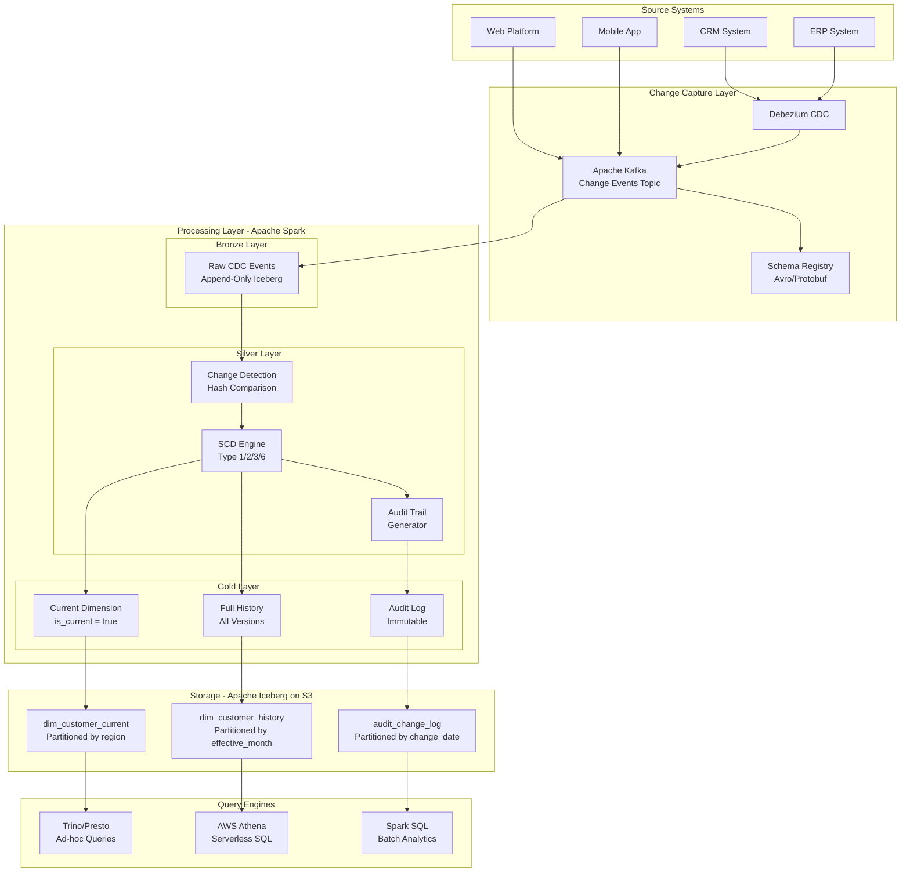
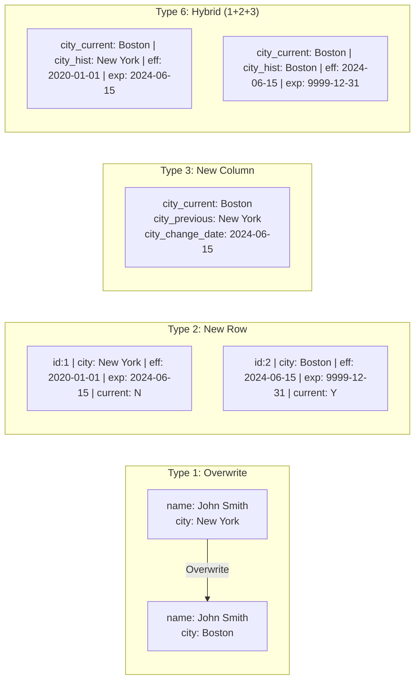
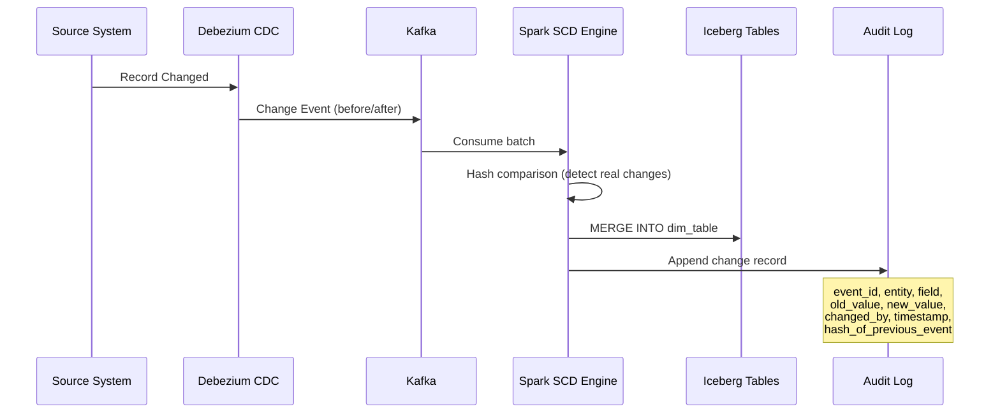
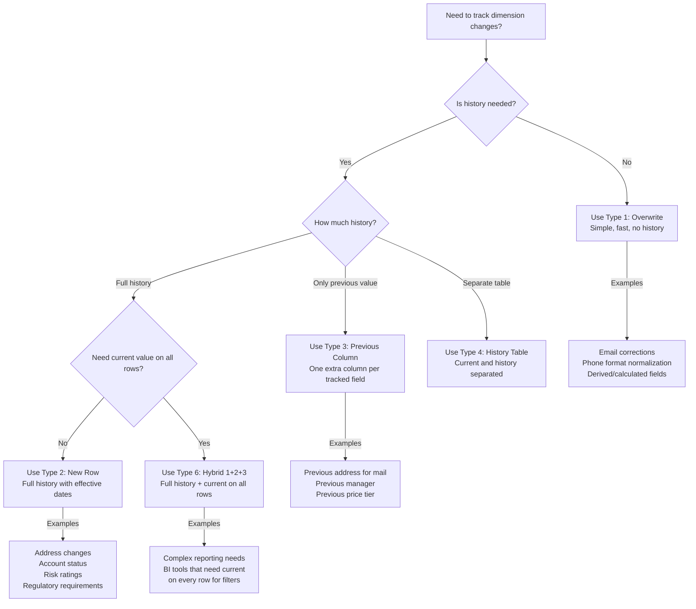

# Slowly Changing Dimensions & Historical Audit Trail at Billion Scale

> **Production Pattern**: SCD Type 1/2/3/6 implementation with full audit trail using Spark + Iceberg for 500M+ dimension records with 50M daily updates.

---

## 1. Problem Statement

### The Business Challenge

Every enterprise data warehouse must maintain dimensional history:

| Challenge | Scale | Impact |
|-----------|-------|--------|
| Customer records changing daily | 500M customers, 50M updates/day | Incorrect analytics without history |
| Regulatory audit requirements | SOX, GDPR, HIPAA | Legal penalties up to 4% revenue |
| Point-in-time queries | "What was this customer's status on Jan 1?" | Business-critical reporting |
| Zero-downtime requirement | 24/7 global operations | Cannot lock tables for updates |
| Data lineage | Track every field change | Compliance and debugging |

### Real-World Scenarios

```
Scenario 1: Banking - Customer KYC
- 200M customer records
- Address, phone, employment, risk score change frequently
- Must show "what did we know about this customer when we approved that loan?"
- SOX requires 7-year audit trail

Scenario 2: E-Commerce - Product Catalog
- 500M product records across 50 categories
- Price, description, category, availability change 50M times/day
- Must track price history for price-match guarantees
- GDPR requires knowing what data existed when consent was given

Scenario 3: Healthcare - Patient Records
- 100M patient records
- Diagnoses, medications, providers change
- HIPAA requires complete modification history
- Must support point-in-time clinical queries
```

---

## 2. Architecture Diagrams

### End-to-End SCD Pipeline



### SCD Type Comparison



### Audit Trail Architecture



---

## 3. Spark Concepts Explained in Context

### MERGE INTO (Iceberg)

The `MERGE INTO` statement provides atomic upsert semantics critical for SCD:

```python
# Iceberg MERGE INTO for SCD Type 2
# This is an ATOMIC operation - readers see either old or new state, never partial
spark.sql("""
    MERGE INTO catalog.db.dim_customer AS target
    USING staged_updates AS source
    ON target.customer_id = source.customer_id AND target.is_current = true
    WHEN MATCHED AND target.row_hash != source.row_hash THEN
        UPDATE SET 
            is_current = false,
            effective_to = source.change_timestamp,
            updated_at = current_timestamp()
    WHEN NOT MATCHED THEN
        INSERT (customer_id, name, city, effective_from, effective_to, is_current, row_hash)
        VALUES (source.customer_id, source.name, source.city, 
                source.change_timestamp, '9999-12-31', true, source.row_hash)
""")
```

**Why Iceberg MERGE is superior to Hive/Parquet:**
- **Atomic**: All changes visible at once (snapshot isolation)
- **Concurrent readers**: No lock contention during MERGE
- **Row-level deletes**: Only rewrite affected files (not entire partitions)
- **Conflict detection**: Optimistic concurrency with retry

### Window Functions for Change Detection

```python
from pyspark.sql import functions as F
from pyspark.sql.window import Window

# Detect changes using lag() to compare with previous version
window_spec = Window.partitionBy("customer_id").orderBy("event_timestamp")

changes_detected = cdc_events.withColumn(
    "prev_row_hash", F.lag("row_hash").over(window_spec)
).withColumn(
    "is_actual_change", 
    F.when(F.col("row_hash") != F.col("prev_row_hash"), True)
     .when(F.col("prev_row_hash").isNull(), True)  # First record
     .otherwise(False)
).filter("is_actual_change = true")
```

### Partitioning Strategy for SCD Tables

```python
# WRONG: Partitioning by customer_id (too many partitions = small files)
# WRONG: Partitioning by effective_date (too many partitions, hard to query current)

# CORRECT for Type 2 History Table:
# Partition by effective_month + bucket by customer_id
spark.sql("""
    CREATE TABLE catalog.db.dim_customer_history (
        surrogate_key BIGINT,
        customer_id STRING,
        name STRING,
        city STRING,
        effective_from TIMESTAMP,
        effective_to TIMESTAMP,
        is_current BOOLEAN,
        row_hash STRING
    ) USING iceberg
    PARTITIONED BY (months(effective_from), bucket(16, customer_id))
""")

# CORRECT for Current Dimension (hot path):
# Partition by region for balanced query access
spark.sql("""
    CREATE TABLE catalog.db.dim_customer_current (
        customer_id STRING,
        name STRING,
        city STRING,
        region STRING,
        last_updated TIMESTAMP,
        row_hash STRING
    ) USING iceberg
    PARTITIONED BY (region)
    TBLPROPERTIES (
        'write.target-file-size-bytes' = '536870912',  -- 512MB
        'read.split.target-size' = '134217728'  -- 128MB
    )
""")
```

### Broadcast Joins for Dimension Lookups

```python
# When applying SCD updates, broadcast the incoming changes (smaller)
# against the existing dimension (larger)
from pyspark.sql.functions import broadcast

# Incoming changes: typically 50M records (fits after filtering)
# Existing current dimension: 500M records

# Strategy: Filter existing to only potentially affected records first
affected_customers = incoming_changes.select("customer_id").distinct()

existing_affected = (
    current_dimension
    .join(broadcast(affected_customers), "customer_id")
)

# Now join incoming with filtered existing (much smaller)
scd_comparison = existing_affected.join(
    incoming_changes,
    "customer_id",
    "full_outer"
)
```

### Schema Evolution

```python
# Iceberg supports schema evolution without rewriting data
# Adding a new column to SCD table - existing rows get NULL for new column

spark.sql("""
    ALTER TABLE catalog.db.dim_customer_history 
    ADD COLUMN loyalty_tier STRING AFTER city
""")

# Renaming a column (Iceberg tracks by column ID, not name)
spark.sql("""
    ALTER TABLE catalog.db.dim_customer_history 
    RENAME COLUMN city TO city_name
""")

# Existing snapshots still readable with old schema
# New writes include the new column
# Point-in-time queries automatically handle schema differences
```

### Time Travel with Iceberg

```python
# Query the dimension as it existed at a specific point in time
# Uses Iceberg snapshot isolation

# What was this customer's record on January 1, 2024?
historical_view = spark.read.option(
    "as-of-timestamp", 
    "2024-01-01T00:00:00.000Z"
).format("iceberg").load("catalog.db.dim_customer_history")

# Or by snapshot ID
specific_snapshot = spark.read.option(
    "snapshot-id", 
    12345678901234
).format("iceberg").load("catalog.db.dim_customer_history")

# Point-in-time query using effective dates (SCD Type 2)
customer_at_date = spark.sql("""
    SELECT * FROM catalog.db.dim_customer_history
    WHERE customer_id = 'CUST-12345'
      AND effective_from <= TIMESTAMP '2024-01-01'
      AND effective_to > TIMESTAMP '2024-01-01'
""")
```

---

## 4. SCD Type Implementations

### Type 1: Overwrite (No History)

**When to use**: Non-critical attributes where history doesn't matter (e.g., data corrections, derived fields)

```python
from pyspark.sql import SparkSession, functions as F

def scd_type1_update(spark, incoming_df, target_table):
    """
    SCD Type 1: Simply overwrite the existing record.
    Use for: email corrections, phone format changes, derived fields.
    """
    
    # MERGE INTO handles both updates and inserts atomically
    incoming_df.createOrReplaceTempView("incoming_updates")
    
    spark.sql(f"""
        MERGE INTO {target_table} AS target
        USING incoming_updates AS source
        ON target.customer_id = source.customer_id
        WHEN MATCHED THEN
            UPDATE SET 
                target.name = source.name,
                target.email = source.email,
                target.phone = source.phone,
                target.updated_at = current_timestamp()
        WHEN NOT MATCHED THEN
            INSERT (customer_id, name, email, phone, created_at, updated_at)
            VALUES (source.customer_id, source.name, source.email, 
                    source.phone, current_timestamp(), current_timestamp())
    """)
```

### Type 2: Add New Row (Full History)

**When to use**: Critical attributes requiring full history (address, status, risk rating)

```python
from pyspark.sql import SparkSession, functions as F
from pyspark.sql.window import Window
import hashlib

class SCDType2Engine:
    """
    Production SCD Type 2 implementation handling:
    - Multiple changes to same entity in one batch
    - Backdated changes
    - Logical deletes (soft delete with end-dating)
    - Surrogate key generation
    - Concurrent batch processing
    """
    
    def __init__(self, spark, target_table, business_key_cols, tracked_cols):
        self.spark = spark
        self.target_table = target_table
        self.business_key_cols = business_key_cols
        self.tracked_cols = tracked_cols
    
    def compute_row_hash(self, df):
        """Compute hash of tracked columns for change detection."""
        hash_cols = [F.coalesce(F.col(c).cast("string"), F.lit("__NULL__")) 
                     for c in self.tracked_cols]
        return df.withColumn(
            "row_hash", 
            F.sha2(F.concat_ws("||", *hash_cols), 256)
        )
    
    def process_batch(self, incoming_df, batch_timestamp):
        """
        Process a batch of incoming records against existing SCD2 table.
        
        Steps:
        1. Compute hash of incoming records
        2. Get current records from target
        3. Compare hashes to detect actual changes
        4. For changed records: expire old, insert new
        5. For new records: insert directly
        6. Handle multiple changes per entity in same batch
        """
        
        # Step 1: Prepare incoming with hash and dedup within batch
        incoming_with_hash = self.compute_row_hash(incoming_df)
        
        # Handle multiple changes to same entity in one batch
        # Keep only the latest change per entity
        window_latest = Window.partitionBy(self.business_key_cols).orderBy(
            F.col("event_timestamp").desc()
        )
        
        incoming_deduped = (
            incoming_with_hash
            .withColumn("row_num", F.row_number().over(window_latest))
            .filter("row_num = 1")
            .drop("row_num")
        )
        
        # Step 2: Get current records from target
        current_records = (
            self.spark.read.format("iceberg")
            .load(self.target_table)
            .filter("is_current = true")
        )
        current_with_hash = self.compute_row_hash(current_records)
        
        # Step 3: Identify changes (hash mismatch) and new records
        bk_join_condition = " AND ".join(
            [f"incoming.{c} = existing.{c}" for c in self.business_key_cols]
        )
        
        comparison = incoming_deduped.alias("incoming").join(
            current_with_hash.alias("existing"),
            [F.col(f"incoming.{c}") == F.col(f"existing.{c}") 
             for c in self.business_key_cols],
            "left"
        )
        
        # Records that actually changed (hash differs)
        changed_records = comparison.filter(
            (F.col("existing.row_hash").isNotNull()) &  # Exists in target
            (F.col("incoming.row_hash") != F.col("existing.row_hash"))  # Actually changed
        ).select("incoming.*")
        
        # Brand new records (not in target)
        new_records = comparison.filter(
            F.col("existing.row_hash").isNull()
        ).select("incoming.*")
        
        # Step 4: Apply changes using MERGE
        # First: Expire old current records for changed entities
        changed_entity_ids = changed_records.select(self.business_key_cols)
        
        updates_to_expire = (
            changed_records
            .withColumn("effective_to", F.lit(batch_timestamp))
            .withColumn("is_current", F.lit(False))
            .withColumn("operation", F.lit("EXPIRE"))
        )
        
        # New version rows for changed records
        new_versions = (
            changed_records
            .withColumn("surrogate_key", F.monotonically_increasing_id())
            .withColumn("effective_from", F.lit(batch_timestamp))
            .withColumn("effective_to", F.lit("9999-12-31").cast("timestamp"))
            .withColumn("is_current", F.lit(True))
            .withColumn("version", F.lit(None))  # Will be set by trigger
            .withColumn("operation", F.lit("INSERT_NEW_VERSION"))
        )
        
        # Insert brand new entities
        new_inserts = (
            new_records
            .withColumn("surrogate_key", F.monotonically_increasing_id())
            .withColumn("effective_from", F.lit(batch_timestamp))
            .withColumn("effective_to", F.lit("9999-12-31").cast("timestamp"))
            .withColumn("is_current", F.lit(True))
            .withColumn("version", F.lit(1))
            .withColumn("operation", F.lit("INSERT_NEW_ENTITY"))
        )
        
        # Step 5: Execute MERGE atomically
        all_changes = updates_to_expire.union(new_versions).union(new_inserts)
        all_changes.createOrReplaceTempView("scd2_changes")
        
        self.spark.sql(f"""
            MERGE INTO {self.target_table} AS target
            USING scd2_changes AS source
            ON target.customer_id = source.customer_id 
               AND target.is_current = true
               AND source.operation = 'EXPIRE'
            WHEN MATCHED THEN
                UPDATE SET 
                    target.is_current = false,
                    target.effective_to = source.effective_to,
                    target.updated_at = current_timestamp()
        """)
        
        # Insert new versions and new entities
        new_versions.union(new_inserts).select(
            "surrogate_key", *self.business_key_cols, *self.tracked_cols,
            "effective_from", "effective_to", "is_current", "row_hash"
        ).writeTo(self.target_table).append()
        
        return {
            "changed_count": changed_records.count(),
            "new_count": new_records.count(),
            "total_processed": incoming_deduped.count()
        }


# Usage
spark = SparkSession.builder \
    .appName("SCD-Type2-Pipeline") \
    .config("spark.sql.catalog.iceberg", "org.apache.iceberg.spark.SparkCatalog") \
    .config("spark.sql.catalog.iceberg.type", "glue") \
    .getOrCreate()

scd_engine = SCDType2Engine(
    spark=spark,
    target_table="iceberg.warehouse.dim_customer",
    business_key_cols=["customer_id"],
    tracked_cols=["name", "email", "phone", "address_line1", "city", 
                  "state", "zip_code", "country", "status", "segment"]
)

# Process daily batch
from datetime import datetime
incoming_data = spark.read.format("iceberg").load("iceberg.staging.customer_updates")
result = scd_engine.process_batch(incoming_data, datetime.now())
print(f"SCD2 Results: {result}")
```

### Type 3: Previous Value Column

**When to use**: When only the immediately previous value matters (e.g., previous address for mail forwarding)

```python
def scd_type3_update(spark, incoming_df, target_table, tracked_col):
    """
    SCD Type 3: Store current and previous value in same row.
    Adds columns: {col}_previous, {col}_change_date
    """
    
    incoming_df.createOrReplaceTempView("incoming")
    
    spark.sql(f"""
        MERGE INTO {target_table} AS target
        USING incoming AS source
        ON target.customer_id = source.customer_id
        WHEN MATCHED AND target.{tracked_col} != source.{tracked_col} THEN
            UPDATE SET 
                target.{tracked_col}_previous = target.{tracked_col},
                target.{tracked_col} = source.{tracked_col},
                target.{tracked_col}_change_date = current_timestamp(),
                target.updated_at = current_timestamp()
        WHEN NOT MATCHED THEN
            INSERT (customer_id, {tracked_col}, {tracked_col}_previous, 
                    {tracked_col}_change_date, created_at, updated_at)
            VALUES (source.customer_id, source.{tracked_col}, NULL, 
                    NULL, current_timestamp(), current_timestamp())
    """)
```

### Type 6: Hybrid (1+2+3 Combined)

**When to use**: Need full history AND fast current-value queries with previous value

```python
def scd_type6_update(spark, incoming_df, target_table, batch_timestamp):
    """
    SCD Type 6 (Hybrid):
    - Type 2: New row for each change (full history)
    - Type 3: Previous value columns on each row
    - Type 1: Update current value on ALL historical rows
    
    This gives:
    - Full history (Type 2)
    - Easy access to previous value (Type 3)
    - Current value on every row for easy reporting (Type 1)
    """
    
    incoming_df.createOrReplaceTempView("incoming")
    
    # Step 1: Expire current rows and insert new versions (Type 2)
    spark.sql(f"""
        MERGE INTO {target_table} AS target
        USING incoming AS source
        ON target.customer_id = source.customer_id AND target.is_current = true
        WHEN MATCHED AND target.city_historical != source.city THEN
            UPDATE SET 
                target.is_current = false,
                target.effective_to = '{batch_timestamp}',
                target.city_current = source.city,  -- Type 1: update on ALL rows later
                target.city_previous = target.city_historical  -- Type 3
    """)
    
    # Step 2: Insert new current version
    spark.sql(f"""
        INSERT INTO {target_table}
        SELECT 
            customer_id,
            city AS city_current,        -- Type 1: current value
            city AS city_historical,     -- Type 2: value at this point in time
            (SELECT city_historical 
             FROM {target_table} t2 
             WHERE t2.customer_id = incoming.customer_id 
               AND t2.is_current = false
             ORDER BY effective_to DESC LIMIT 1) AS city_previous,  -- Type 3
            '{batch_timestamp}' AS effective_from,
            '9999-12-31' AS effective_to,
            true AS is_current
        FROM incoming
        WHERE customer_id IN (
            SELECT customer_id FROM incoming 
            EXCEPT 
            SELECT customer_id FROM {target_table} WHERE is_current = true
        )
    """)
    
    # Step 3: Update city_current on ALL historical rows (Type 1 aspect)
    spark.sql(f"""
        UPDATE {target_table} 
        SET city_current = (
            SELECT city_historical 
            FROM {target_table} t2 
            WHERE t2.customer_id = {target_table}.customer_id 
              AND t2.is_current = true
        )
        WHERE is_current = false
    """)
```

---

## 5. Audit Trail Implementation

### Audit Event Schema

```python
from pyspark.sql.types import StructType, StructField, StringType, TimestampType, LongType

audit_schema = StructType([
    StructField("audit_event_id", StringType(), False),  # UUID
    StructField("event_timestamp", TimestampType(), False),
    StructField("pipeline_id", StringType(), False),
    StructField("pipeline_run_id", StringType(), False),
    StructField("entity_type", StringType(), False),     # "customer", "product", etc.
    StructField("entity_id", StringType(), False),       # Business key
    StructField("field_name", StringType(), False),      # Which column changed
    StructField("old_value", StringType(), True),        # Previous value (NULL for inserts)
    StructField("new_value", StringType(), True),        # New value (NULL for deletes)
    StructField("change_type", StringType(), False),     # INSERT, UPDATE, DELETE
    StructField("changed_by", StringType(), False),      # User/system that initiated
    StructField("change_source", StringType(), False),   # "CRM_CDC", "MANUAL_FIX", etc.
    StructField("change_reason", StringType(), True),    # Optional business reason
    StructField("previous_event_hash", StringType(), False),  # Hash chain
    StructField("event_hash", StringType(), False),      # SHA-256 of this event
    StructField("batch_id", StringType(), False),        # Which processing batch
])
```

### Hash Chain for Tamper Detection

```python
import hashlib
import json
from pyspark.sql import functions as F
from pyspark.sql.types import StringType

class AuditTrailWriter:
    """
    Implements blockchain-lite hash chain for tamper-proof audit trail.
    Each event contains hash of previous event, creating an unbreakable chain.
    """
    
    def __init__(self, spark, audit_table):
        self.spark = spark
        self.audit_table = audit_table
    
    def get_last_event_hash(self, entity_type, entity_id):
        """Get the hash of the most recent audit event for this entity."""
        result = self.spark.sql(f"""
            SELECT event_hash 
            FROM {self.audit_table}
            WHERE entity_type = '{entity_type}' AND entity_id = '{entity_id}'
            ORDER BY event_timestamp DESC
            LIMIT 1
        """)
        
        if result.count() == 0:
            return "GENESIS_HASH_" + entity_type + "_" + entity_id
        return result.first()["event_hash"]
    
    @staticmethod
    @F.udf(StringType())
    def compute_event_hash(event_id, entity_id, field_name, old_value, 
                           new_value, timestamp_str, previous_hash):
        """Compute SHA-256 hash including previous event hash (chain)."""
        content = json.dumps({
            "event_id": event_id,
            "entity_id": entity_id,
            "field_name": field_name,
            "old_value": old_value,
            "new_value": new_value,
            "timestamp": timestamp_str,
            "previous_hash": previous_hash
        }, sort_keys=True)
        return hashlib.sha256(content.encode()).hexdigest()
    
    def write_audit_events(self, changes_df, entity_type, pipeline_id, batch_id):
        """
        Write audit events for all field-level changes detected.
        Explodes row-level changes into field-level audit events.
        """
        from pyspark.sql.functions import explode, array, struct, lit, col
        import uuid
        
        # Explode row changes into field-level changes
        tracked_fields = [c for c in changes_df.columns 
                         if c.startswith("old_") or c.startswith("new_")]
        
        field_names = list(set(
            c.replace("old_", "").replace("new_", "") 
            for c in tracked_fields
        ))
        
        audit_events = []
        for field in field_names:
            field_changes = changes_df.filter(
                F.col(f"old_{field}") != F.col(f"new_{field}")
            ).select(
                F.expr("uuid()").alias("audit_event_id"),
                F.current_timestamp().alias("event_timestamp"),
                F.lit(pipeline_id).alias("pipeline_id"),
                F.lit(batch_id).alias("batch_id"),
                F.lit(entity_type).alias("entity_type"),
                F.col("entity_id"),
                F.lit(field).alias("field_name"),
                F.col(f"old_{field}").cast("string").alias("old_value"),
                F.col(f"new_{field}").cast("string").alias("new_value"),
                F.lit("UPDATE").alias("change_type"),
                F.lit("SCD_PIPELINE").alias("changed_by"),
                F.lit("CDC_EVENT").alias("change_source")
            )
            audit_events.append(field_changes)
        
        if audit_events:
            all_audit = audit_events[0]
            for ae in audit_events[1:]:
                all_audit = all_audit.union(ae)
            
            # Append to immutable audit table
            all_audit.writeTo(self.audit_table).append()
            
            return all_audit.count()
        return 0
    
    def verify_integrity(self, entity_type, entity_id):
        """Verify hash chain integrity for an entity's audit trail."""
        events = self.spark.sql(f"""
            SELECT * FROM {self.audit_table}
            WHERE entity_type = '{entity_type}' AND entity_id = '{entity_id}'
            ORDER BY event_timestamp ASC
        """).collect()
        
        for i, event in enumerate(events):
            if i == 0:
                expected_prev = f"GENESIS_HASH_{entity_type}_{entity_id}"
            else:
                expected_prev = events[i-1]["event_hash"]
            
            if event["previous_event_hash"] != expected_prev:
                return {
                    "valid": False,
                    "broken_at": event["audit_event_id"],
                    "expected_prev_hash": expected_prev,
                    "actual_prev_hash": event["previous_event_hash"]
                }
        
        return {"valid": True, "events_verified": len(events)}
```

---

## 6. Point-in-Time Queries

```python
def point_in_time_lookup(spark, table, entity_id, as_of_date):
    """
    Answer: "What did this record look like on a specific date?"
    Uses SCD Type 2 effective dates for exact point-in-time reconstruction.
    """
    return spark.sql(f"""
        SELECT *
        FROM {table}
        WHERE customer_id = '{entity_id}'
          AND effective_from <= TIMESTAMP '{as_of_date}'
          AND effective_to > TIMESTAMP '{as_of_date}'
    """)

def reconstruct_full_state_at_time(spark, table, as_of_date):
    """
    Reconstruct the ENTIRE dimension table as it existed at a point in time.
    Useful for regulatory reporting: "Show me all customer data as of fiscal year end"
    """
    return spark.sql(f"""
        SELECT *
        FROM {table}
        WHERE effective_from <= TIMESTAMP '{as_of_date}'
          AND effective_to > TIMESTAMP '{as_of_date}'
    """)

def track_entity_changes(spark, table, entity_id):
    """
    Show complete change history for an entity.
    Useful for customer service: "What changes happened to this account?"
    """
    return spark.sql(f"""
        SELECT 
            effective_from AS change_date,
            effective_to,
            is_current,
            name,
            city,
            status,
            row_hash,
            LAG(row_hash) OVER (
                PARTITION BY customer_id ORDER BY effective_from
            ) AS previous_hash
        FROM {table}
        WHERE customer_id = '{entity_id}'
        ORDER BY effective_from ASC
    """)
```

---

## 7. Scaling Strategy

### Handling 500M Records with 50M Daily Updates

```python
# Production configuration for large-scale SCD processing

spark = SparkSession.builder \
    .appName("SCD2-Production-Pipeline") \
    .config("spark.sql.shuffle.partitions", "2000") \
    .config("spark.sql.adaptive.enabled", "true") \
    .config("spark.sql.adaptive.coalescePartitions.enabled", "true") \
    .config("spark.sql.adaptive.skewJoin.enabled", "true") \
    .config("spark.sql.iceberg.handle-timestamp-without-timezone", "true") \
    .config("spark.executor.memory", "16g") \
    .config("spark.executor.cores", "4") \
    .config("spark.executor.instances", "100") \
    .config("spark.driver.memory", "8g") \
    .config("spark.sql.autoBroadcastJoinThreshold", "256m") \
    .config("spark.sql.iceberg.merge.cardinality-check.enabled", "false") \
    .getOrCreate()
```

### Partition Strategy for Performance

```
Table: dim_customer_history (SCD Type 2)
- Partitioned by: months(effective_from)
- Sorted by: customer_id within each partition
- Z-ordered: customer_id, effective_from

Query patterns optimized:
1. "Get current record for customer X" -> is_current filter + customer_id
2. "Get record at point in time" -> effective_from partition pruning + customer_id
3. "Get all changes in date range" -> effective_from partition pruning
```

### Table Maintenance

```python
# Compaction (run daily during off-peak)
spark.sql("""
    CALL iceberg.system.rewrite_data_files(
        table => 'catalog.db.dim_customer_history',
        strategy => 'sort',
        sort_order => 'customer_id ASC, effective_from ASC',
        options => map(
            'target-file-size-bytes', '536870912',   -- 512MB target
            'min-file-size-bytes', '67108864',       -- 64MB minimum (compact if smaller)
            'max-file-size-bytes', '1073741824',     -- 1GB max
            'partial-progress.enabled', 'true',
            'partial-progress.max-commits', '10'
        )
    )
""")

# Expire old snapshots (keep 7 days for time travel)
spark.sql("""
    CALL iceberg.system.expire_snapshots(
        table => 'catalog.db.dim_customer_history',
        older_than => TIMESTAMP '2024-06-01 00:00:00',
        retain_last => 168  -- Keep last 7 days of hourly snapshots
    )
""")

# Remove orphan files
spark.sql("""
    CALL iceberg.system.remove_orphan_files(
        table => 'catalog.db.dim_customer_history',
        older_than => TIMESTAMP '2024-05-25 00:00:00'
    )
""")
```

---

## 8. Production Configuration

```properties
# spark-defaults.conf for SCD Pipeline

# Core settings
spark.sql.catalog.iceberg=org.apache.iceberg.spark.SparkCatalog
spark.sql.catalog.iceberg.type=glue
spark.sql.catalog.iceberg.warehouse=s3://data-lake-prod/warehouse

# Memory for MERGE operations (join-heavy)
spark.executor.memory=16g
spark.executor.memoryOverhead=4g
spark.driver.memory=8g
spark.driver.memoryOverhead=2g

# Parallelism for 50M record batches
spark.sql.shuffle.partitions=2000
spark.default.parallelism=2000

# AQE for dynamic optimization
spark.sql.adaptive.enabled=true
spark.sql.adaptive.coalescePartitions.enabled=true
spark.sql.adaptive.coalescePartitions.minPartitionSize=64MB
spark.sql.adaptive.skewJoin.enabled=true
spark.sql.adaptive.skewJoin.skewedPartitionFactor=5
spark.sql.adaptive.skewJoin.skewedPartitionThresholdInBytes=256MB

# Join optimization
spark.sql.autoBroadcastJoinThreshold=256MB
spark.sql.join.preferSortMergeJoin=true

# Iceberg-specific
spark.sql.iceberg.merge.cardinality-check.enabled=false
spark.sql.extensions=org.apache.iceberg.spark.extensions.IcebergSparkSessionExtensions

# Write optimization
spark.sql.iceberg.write.target-file-size-bytes=536870912
spark.hadoop.fs.s3a.committer.name=magic
spark.hadoop.fs.s3a.committer.magic.enabled=true
```

---

## 9. Monitoring & Data Quality

```python
class SCDMonitor:
    """Monitor SCD pipeline health and data quality."""
    
    def __init__(self, spark, metrics_table):
        self.spark = spark
        self.metrics_table = metrics_table
    
    def validate_no_gaps(self, table, entity_id):
        """Ensure no gaps in effective date ranges for an entity."""
        return self.spark.sql(f"""
            WITH ordered AS (
                SELECT 
                    effective_from,
                    effective_to,
                    LEAD(effective_from) OVER (
                        PARTITION BY customer_id ORDER BY effective_from
                    ) AS next_effective_from
                FROM {table}
                WHERE customer_id = '{entity_id}'
            )
            SELECT * FROM ordered
            WHERE effective_to != next_effective_from
              AND next_effective_from IS NOT NULL
        """)
    
    def validate_no_overlaps(self, table, entity_id):
        """Ensure no overlapping effective date ranges."""
        return self.spark.sql(f"""
            SELECT a.*, b.effective_from AS overlap_with
            FROM {table} a
            JOIN {table} b 
              ON a.customer_id = b.customer_id
              AND a.surrogate_key != b.surrogate_key
              AND a.effective_from < b.effective_to
              AND a.effective_to > b.effective_from
            WHERE a.customer_id = '{entity_id}'
        """)
    
    def validate_single_current(self, table):
        """Ensure exactly one current record per entity."""
        return self.spark.sql(f"""
            SELECT customer_id, COUNT(*) AS current_count
            FROM {table}
            WHERE is_current = true
            GROUP BY customer_id
            HAVING COUNT(*) != 1
        """)
    
    def compute_metrics(self, table, batch_id):
        """Compute and store pipeline metrics."""
        metrics = self.spark.sql(f"""
            SELECT 
                '{batch_id}' AS batch_id,
                current_timestamp() AS computed_at,
                COUNT(*) AS total_records,
                COUNT(CASE WHEN is_current THEN 1 END) AS current_records,
                COUNT(CASE WHEN NOT is_current THEN 1 END) AS historical_records,
                AVG(DATEDIFF(effective_to, effective_from)) AS avg_record_lifespan_days,
                MAX(effective_from) AS latest_change
            FROM {table}
        """)
        metrics.writeTo(self.metrics_table).append()
        return metrics
```

---

## 10. Decision Flowchart: Which SCD Type to Use



---

## 11. Companies Using This Pattern

| Company | Use Case | Scale | SCD Type |
|---------|----------|-------|----------|
| **Amazon** | Product catalog history (price, description, category) | 500M products, 100M changes/day | Type 2 + Audit |
| **JPMorgan Chase** | Customer KYC records (regulatory requirement) | 200M customers, 7-year retention | Type 2 + Type 6 |
| **Kaiser Permanente** | Patient records (HIPAA compliance) | 100M patients, full history | Type 2 + Audit chain |
| **Walmart** | Supplier/vendor dimension | 200K suppliers, daily updates | Type 2 |
| **Netflix** | Content metadata (title, cast, ratings) | 50M titles across regions | Type 6 |
| **Insurance (AIG)** | Policy holder dimension (claims history) | 50M policies | Type 2 + Type 4 |

---

## 12. Complete Production Pipeline (End-to-End)

```python
from pyspark.sql import SparkSession
from datetime import datetime
import logging

logging.basicConfig(level=logging.INFO)
logger = logging.getLogger("SCD2Pipeline")

class ProductionSCD2Pipeline:
    """
    Complete production SCD2 pipeline with:
    - CDC ingestion from Kafka/S3
    - Change detection
    - SCD Type 2 processing
    - Audit trail generation
    - Data quality validation
    - Metrics collection
    """
    
    def __init__(self, spark, config):
        self.spark = spark
        self.config = config
        self.scd_engine = SCDType2Engine(
            spark=spark,
            target_table=config["target_table"],
            business_key_cols=config["business_keys"],
            tracked_cols=config["tracked_columns"]
        )
        self.audit_writer = AuditTrailWriter(spark, config["audit_table"])
        self.monitor = SCDMonitor(spark, config["metrics_table"])
    
    def run(self):
        """Execute complete SCD2 pipeline."""
        batch_id = f"batch_{datetime.now().strftime('%Y%m%d_%H%M%S')}"
        batch_timestamp = datetime.now()
        
        logger.info(f"Starting SCD2 pipeline batch: {batch_id}")
        
        try:
            # Step 1: Read incoming changes
            incoming = self.read_incoming_changes()
            incoming_count = incoming.count()
            logger.info(f"Read {incoming_count} incoming records")
            
            if incoming_count == 0:
                logger.info("No incoming changes. Exiting.")
                return {"status": "no_changes", "batch_id": batch_id}
            
            # Step 2: Process SCD Type 2
            scd_result = self.scd_engine.process_batch(incoming, batch_timestamp)
            logger.info(f"SCD2 results: {scd_result}")
            
            # Step 3: Generate audit trail
            audit_count = self.audit_writer.write_audit_events(
                changes_df=incoming,
                entity_type=self.config["entity_type"],
                pipeline_id=self.config["pipeline_id"],
                batch_id=batch_id
            )
            logger.info(f"Wrote {audit_count} audit events")
            
            # Step 4: Data quality validation
            quality_issues = self.validate_quality()
            if quality_issues > 0:
                logger.error(f"Data quality issues detected: {quality_issues}")
                # Alert but don't fail - data is already written
            
            # Step 5: Collect metrics
            self.monitor.compute_metrics(self.config["target_table"], batch_id)
            
            return {
                "status": "success",
                "batch_id": batch_id,
                "incoming_count": incoming_count,
                "changed_count": scd_result["changed_count"],
                "new_count": scd_result["new_count"],
                "audit_events": audit_count,
                "quality_issues": quality_issues
            }
            
        except Exception as e:
            logger.error(f"Pipeline failed: {str(e)}")
            raise
    
    def read_incoming_changes(self):
        """Read CDC events from staging area."""
        return (
            self.spark.read
            .format("iceberg")
            .load(self.config["staging_table"])
            .filter(f"processing_status = 'pending'")
            .orderBy("event_timestamp")
        )
    
    def validate_quality(self):
        """Run data quality checks post-processing."""
        issues = 0
        
        # Check for duplicate current records
        duplicates = self.monitor.validate_single_current(
            self.config["target_table"]
        )
        dup_count = duplicates.count()
        if dup_count > 0:
            logger.error(f"Found {dup_count} entities with multiple current records")
            issues += dup_count
        
        return issues


# Run the pipeline
if __name__ == "__main__":
    spark = SparkSession.builder \
        .appName("Production-SCD2-Pipeline") \
        .config("spark.sql.catalog.iceberg", "org.apache.iceberg.spark.SparkCatalog") \
        .config("spark.sql.catalog.iceberg.type", "glue") \
        .config("spark.sql.extensions", 
                "org.apache.iceberg.spark.extensions.IcebergSparkSessionExtensions") \
        .getOrCreate()
    
    config = {
        "target_table": "iceberg.warehouse.dim_customer",
        "staging_table": "iceberg.staging.customer_cdc_events",
        "audit_table": "iceberg.audit.customer_change_log",
        "metrics_table": "iceberg.monitoring.scd_pipeline_metrics",
        "business_keys": ["customer_id"],
        "tracked_columns": ["name", "email", "phone", "address", "city", 
                           "state", "zip", "country", "status", "segment",
                           "risk_score", "credit_limit"],
        "entity_type": "customer",
        "pipeline_id": "scd2_customer_daily"
    }
    
    pipeline = ProductionSCD2Pipeline(spark, config)
    result = pipeline.run()
    print(f"Pipeline completed: {result}")
```

---

## Summary

| Aspect | Recommendation |
|--------|---------------|
| **SCD Type** | Type 2 for most regulatory/audit use cases |
| **Storage** | Apache Iceberg (MERGE INTO, time travel, schema evolution) |
| **Partitioning** | By months(effective_from) + bucket(customer_id) |
| **Change Detection** | SHA-256 hash of tracked columns |
| **Audit** | Immutable append-only table with hash chain |
| **Scaling** | AQE + broadcast joins + incremental processing |
| **Monitoring** | No gaps, no overlaps, single current per entity |
| **Retention** | 7 years for compliance, tiered storage for cost |
