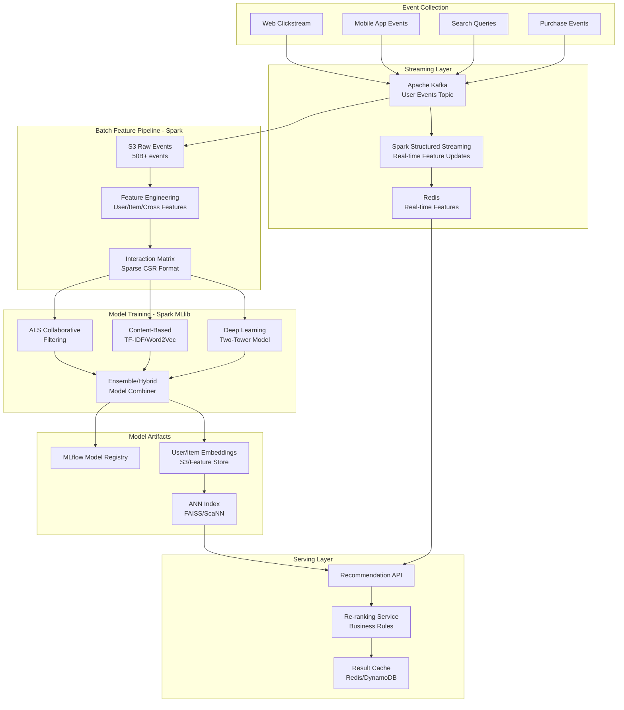
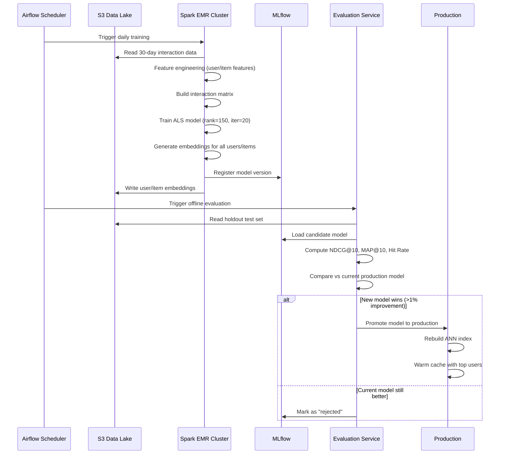
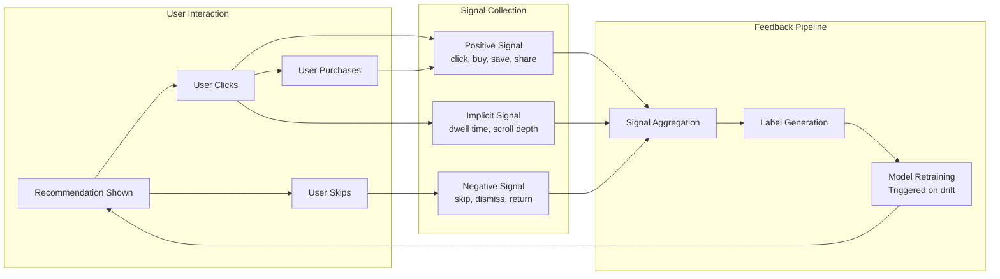
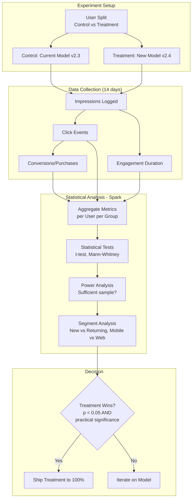

# Recommendation Engine Data Pipeline at Scale with Apache Spark

> **Production Pattern**: Building personalized recommendation systems processing 50B+ interactions for 500M users using Spark MLlib, collaborative filtering, and deep learning feature pipelines.

---

## 1. Problem Statement

### The Business Challenge

| Challenge | Scale | Business Impact |
|-----------|-------|-----------------|
| Personalization for every user | 500M users, 100M items | 35% of Amazon revenue from recommendations |
| Fresh recommendations | <6 hours from interaction to recommendation | Stale recs = 15% engagement drop |
| Cold start (new users/items) | 5M new users/month, 1M new items/week | Cannot recommend = lost revenue |
| Multiple strategies needed | Collaborative + Content + Deep Learning | No single algorithm wins everywhere |
| Offline evaluation | NDCG, MAP, Hit Rate, Coverage | Must validate before deploying |

### Real-World Scenarios

```
Scenario 1: Netflix - Movie Recommendations
- 230M subscribers, 15K titles, 500M ratings
- Batch recomputation nightly, real-time re-ranking
- Problem: New show released → must recommend within hours
- "Taste communities" of similar users

Scenario 2: Spotify - Discover Weekly  
- 500M users, 100M tracks, 4B+ listening events/day
- Collaborative filtering (users who listened to X also liked Y)
- Audio feature extraction for content-based
- 30 songs personalized weekly for every user

Scenario 3: Amazon - Product Recommendations
- 300M customers, 350M products
- "Customers who bought X also bought Y"
- Real-time session-based recommendations
- Multi-objective: relevance + profit margin + inventory
```

---

## 2. Architecture Diagrams

### End-to-End Recommendation Pipeline



### Model Training Pipeline



### Feedback Loop



---

## 3. Spark Concepts Explained in Context

### MLlib ALS (Alternating Least Squares)

```python
from pyspark.ml.recommendation import ALS
from pyspark.ml.evaluation import RegressionEvaluator

# ALS decomposes the user-item interaction matrix into two lower-rank matrices:
# R ≈ U × V^T
# Where U = user factors (500M × rank), V = item factors (100M × rank)

# Key parameters:
# - rank: dimensionality of latent factors (higher = more expressive, more compute)
# - maxIter: convergence iterations
# - regParam: L2 regularization (prevents overfitting)
# - implicitPrefs: use implicit feedback (views, clicks) vs explicit (ratings)
# - alpha: confidence scaling for implicit feedback

als = ALS(
    rank=150,                    # 150 latent factors
    maxIter=20,                  # 20 ALS iterations
    regParam=0.1,                # Regularization
    implicitPrefs=True,          # Implicit feedback (clicks, not ratings)
    alpha=40.0,                  # Confidence scaling
    userCol="user_id_idx",       # Integer user index
    itemCol="item_id_idx",       # Integer item index
    ratingCol="interaction_score",  # Aggregated interaction weight
    coldStartStrategy="drop",    # Handle cold-start in evaluation
    nonnegative=True,            # Non-negative factorization
    numUserBlocks=200,           # Parallelism for user factors
    numItemBlocks=200            # Parallelism for item factors
)

# Training
model = als.fit(training_data)

# Generate top-K recommendations for ALL users
all_recommendations = model.recommendForAllUsers(50)  # Top 50 per user
```

### Broadcast Variables for Embeddings

```python
from pyspark.sql import functions as F

# Item embeddings are relatively small (100M items × 150 dims = ~60GB)
# But for scoring, we often work with a subset

# Broadcast popular item embeddings for fast lookup
popular_items = item_embeddings.filter("popularity_rank <= 10000")
popular_items_bc = spark.sparkContext.broadcast(
    popular_items.collect()  # Only broadcast manageable subset
)

# For full-scale: use join with partitioning instead of broadcast
# Partition both user and item embeddings by a common key
user_embeddings_partitioned = (
    user_embeddings
    .repartition(1000, "user_segment")  # Partition by user segment
    .cache()
)
```

### Custom Partitioners for Co-location

```python
# Ensure user data and their interactions are co-located on same executor
# This eliminates shuffle during the recommendation generation phase

from pyspark.sql import functions as F

# Strategy: Partition both user_profiles and user_interactions by user_id
num_partitions = 2000

user_profiles_partitioned = (
    user_profiles
    .repartition(num_partitions, "user_id")
    .sortWithinPartitions("user_id")
)

user_interactions_partitioned = (
    user_interactions
    .repartition(num_partitions, "user_id")
    .sortWithinPartitions("user_id", "event_timestamp")
)

# Now joining these is a narrow transformation (no shuffle needed)
# because both are partitioned identically by user_id
```

### Window Functions for Engagement Metrics

```python
from pyspark.sql.window import Window

# Compute user engagement features using window functions
user_window_7d = Window.partitionBy("user_id").orderBy("event_date").rangeBetween(-7, 0)
user_window_30d = Window.partitionBy("user_id").orderBy("event_date").rangeBetween(-30, 0)

user_features = interactions.groupBy("user_id", "event_date").agg(
    F.count("*").alias("daily_interactions")
).withColumn(
    "interactions_7d", F.sum("daily_interactions").over(user_window_7d)
).withColumn(
    "interactions_30d", F.sum("daily_interactions").over(user_window_30d)
).withColumn(
    "engagement_trend", 
    F.col("interactions_7d") / F.col("interactions_30d")  # >1 means increasing engagement
)

# Item-level features
item_window = Window.partitionBy("item_id").orderBy("event_date").rangeBetween(-7, 0)

item_features = interactions.groupBy("item_id", "event_date").agg(
    F.countDistinct("user_id").alias("daily_unique_users")
).withColumn(
    "trending_score", F.sum("daily_unique_users").over(item_window)
)
```

### DataFrame Operations: Pivot for Feature Engineering

```python
# Create user-genre preference matrix using pivot
user_genre_preferences = (
    interactions
    .join(item_catalog.select("item_id", "genre"), "item_id")
    .groupBy("user_id")
    .pivot("genre", ["action", "comedy", "drama", "horror", "sci-fi", "romance"])
    .agg(F.count("*"))
    .na.fill(0)
)

# Normalize to get preference distribution
genre_cols = ["action", "comedy", "drama", "horror", "sci-fi", "romance"]
total_interactions = sum([F.col(g) for g in genre_cols])

for genre in genre_cols:
    user_genre_preferences = user_genre_preferences.withColumn(
        f"{genre}_pref", F.col(genre) / total_interactions
    )
```

---

## 4. Data Model

### Interaction Events Schema

```python
from pyspark.sql.types import *

interaction_schema = StructType([
    StructField("event_id", StringType(), False),
    StructField("user_id", StringType(), False),
    StructField("item_id", StringType(), False),
    StructField("event_type", StringType(), False),     # view, click, add_to_cart, purchase, rating
    StructField("event_timestamp", TimestampType(), False),
    StructField("session_id", StringType(), True),
    StructField("platform", StringType(), True),        # web, ios, android
    StructField("duration_seconds", IntegerType(), True),  # Time spent
    StructField("rating", FloatType(), True),           # Explicit rating if given
    StructField("context", MapType(StringType(), StringType()), True)  # position, source, etc.
])
```

### Interaction Score Computation

```python
def compute_interaction_scores(interactions_df):
    """
    Convert raw events into weighted interaction scores for ALS.
    Different event types have different signal strengths.
    """
    event_weights = {
        "purchase": 10.0,
        "add_to_cart": 5.0,
        "click": 2.0,
        "view": 1.0,
        "search_click": 3.0,
        "save": 4.0,
        "share": 6.0
    }
    
    # Apply time decay: recent interactions weighted higher
    weighted = interactions_df.withColumn(
        "event_weight",
        F.when(F.col("event_type") == "purchase", 10.0)
         .when(F.col("event_type") == "add_to_cart", 5.0)
         .when(F.col("event_type") == "click", 2.0)
         .when(F.col("event_type") == "view", 1.0)
         .otherwise(1.0)
    ).withColumn(
        "days_ago", F.datediff(F.current_date(), F.to_date("event_timestamp"))
    ).withColumn(
        "time_decay", F.exp(-0.01 * F.col("days_ago"))  # Exponential decay
    ).withColumn(
        "weighted_score", F.col("event_weight") * F.col("time_decay")
    )
    
    # Aggregate per user-item pair
    interaction_scores = (
        weighted
        .groupBy("user_id", "item_id")
        .agg(
            F.sum("weighted_score").alias("interaction_score"),
            F.count("*").alias("interaction_count"),
            F.max("event_timestamp").alias("last_interaction")
        )
    )
    
    return interaction_scores
```

---

## 5. Implementation

### Complete ALS Collaborative Filtering Pipeline

```python
from pyspark.sql import SparkSession
from pyspark.ml.recommendation import ALS, ALSModel
from pyspark.ml.evaluation import RegressionEvaluator
from pyspark.sql import functions as F
from pyspark.sql.window import Window
import mlflow

class CollaborativeFilteringPipeline:
    """
    Production collaborative filtering pipeline using Spark MLlib ALS.
    Handles: index mapping, training, evaluation, recommendation generation.
    """
    
    def __init__(self, spark, config):
        self.spark = spark
        self.config = config
        self.user_index_map = None
        self.item_index_map = None
    
    def build_index_mappings(self, interactions_df):
        """
        ALS requires integer indices for users and items.
        Create stable, reproducible mappings.
        """
        # User index: dense integer mapping
        self.user_index_map = (
            interactions_df
            .select("user_id").distinct()
            .withColumn("user_id_idx", F.monotonically_increasing_id().cast("int"))
        )
        
        # Item index: dense integer mapping
        self.item_index_map = (
            interactions_df
            .select("item_id").distinct()
            .withColumn("item_id_idx", F.monotonically_increasing_id().cast("int"))
        )
        
        # Cache for multiple uses
        self.user_index_map.cache()
        self.item_index_map.cache()
        
        # Save mappings for serving layer
        self.user_index_map.write.format("iceberg").mode("overwrite").save(
            self.config["user_index_table"]
        )
        self.item_index_map.write.format("iceberg").mode("overwrite").save(
            self.config["item_index_table"]
        )
    
    def prepare_training_data(self, interactions_df):
        """Prepare interaction matrix with integer indices."""
        scored = compute_interaction_scores(interactions_df)
        
        indexed = (
            scored
            .join(self.user_index_map, "user_id")
            .join(self.item_index_map, "item_id")
            .select("user_id_idx", "item_id_idx", "interaction_score")
        )
        
        return indexed
    
    def train_model(self, training_data, validation_data):
        """Train ALS model with MLflow tracking."""
        
        with mlflow.start_run(run_name="als_collaborative_filtering"):
            # Log parameters
            rank = self.config.get("rank", 150)
            max_iter = self.config.get("max_iter", 20)
            reg_param = self.config.get("reg_param", 0.1)
            alpha = self.config.get("alpha", 40.0)
            
            mlflow.log_params({
                "rank": rank,
                "max_iter": max_iter,
                "reg_param": reg_param,
                "alpha": alpha,
                "training_size": training_data.count(),
                "validation_size": validation_data.count()
            })
            
            als = ALS(
                rank=rank,
                maxIter=max_iter,
                regParam=reg_param,
                implicitPrefs=True,
                alpha=alpha,
                userCol="user_id_idx",
                itemCol="item_id_idx",
                ratingCol="interaction_score",
                coldStartStrategy="drop",
                nonnegative=True,
                numUserBlocks=200,
                numItemBlocks=200
            )
            
            model = als.fit(training_data)
            
            # Evaluate on validation set
            predictions = model.transform(validation_data)
            evaluator = RegressionEvaluator(
                metricName="rmse",
                labelCol="interaction_score",
                predictionCol="prediction"
            )
            rmse = evaluator.evaluate(predictions)
            mlflow.log_metric("rmse", rmse)
            
            # Custom metrics
            ndcg = self.compute_ndcg(model, validation_data, k=10)
            hit_rate = self.compute_hit_rate(model, validation_data, k=10)
            mlflow.log_metrics({"ndcg@10": ndcg, "hit_rate@10": hit_rate})
            
            # Log model
            mlflow.spark.log_model(model, "als_model")
            
            return model
    
    def generate_recommendations(self, model, top_k=50):
        """Generate top-K recommendations for all users."""
        
        # Generate recommendations (returns DataFrame with user_id_idx, recommendations)
        all_recs = model.recommendForAllUsers(top_k)
        
        # Explode recommendations array and join back to original IDs
        exploded_recs = (
            all_recs
            .withColumn("rec", F.explode("recommendations"))
            .select(
                "user_id_idx",
                F.col("rec.item_id_idx").alias("item_id_idx"),
                F.col("rec.rating").alias("score")
            )
            .withColumn("rank", F.row_number().over(
                Window.partitionBy("user_id_idx").orderBy(F.desc("score"))
            ))
        )
        
        # Map back to original IDs
        recommendations = (
            exploded_recs
            .join(self.user_index_map, "user_id_idx")
            .join(self.item_index_map, "item_id_idx")
            .select("user_id", "item_id", "score", "rank")
        )
        
        return recommendations
    
    def compute_ndcg(self, model, test_data, k=10):
        """Compute NDCG@K on test set."""
        # Get top-K predictions for test users
        test_users = test_data.select("user_id_idx").distinct()
        recs = model.recommendForUserSubset(test_users, k)
        
        # Compare with actual interactions
        actual = (
            test_data
            .groupBy("user_id_idx")
            .agg(F.collect_set("item_id_idx").alias("actual_items"))
        )
        
        predicted = (
            recs
            .withColumn("rec", F.explode("recommendations"))
            .groupBy("user_id_idx")
            .agg(F.collect_list(F.col("rec.item_id_idx")).alias("predicted_items"))
        )
        
        combined = actual.join(predicted, "user_id_idx")
        
        # Compute NDCG using UDF
        @F.udf("double")
        def ndcg_udf(actual_items, predicted_items):
            import math
            dcg = 0.0
            for i, item in enumerate(predicted_items[:k]):
                if item in actual_items:
                    dcg += 1.0 / math.log2(i + 2)
            
            ideal_dcg = sum(1.0 / math.log2(i + 2) for i in range(min(len(actual_items), k)))
            return dcg / ideal_dcg if ideal_dcg > 0 else 0.0
        
        ndcg_scores = combined.withColumn(
            "ndcg", ndcg_udf("actual_items", "predicted_items")
        )
        
        return ndcg_scores.agg(F.avg("ndcg")).first()[0]
    
    def compute_hit_rate(self, model, test_data, k=10):
        """Compute Hit Rate@K (fraction of users with at least 1 relevant rec)."""
        test_users = test_data.select("user_id_idx").distinct()
        recs = model.recommendForUserSubset(test_users, k)
        
        actual = test_data.select("user_id_idx", "item_id_idx").distinct()
        
        predicted = (
            recs
            .withColumn("rec", F.explode("recommendations"))
            .select("user_id_idx", F.col("rec.item_id_idx").alias("item_id_idx"))
        )
        
        hits = predicted.join(actual, ["user_id_idx", "item_id_idx"]).select("user_id_idx").distinct()
        
        total_users = test_users.count()
        hit_users = hits.count()
        
        return hit_users / total_users if total_users > 0 else 0.0


# Execute pipeline
spark = SparkSession.builder \
    .appName("Recommendation-Pipeline") \
    .config("spark.executor.memory", "32g") \
    .config("spark.executor.cores", "8") \
    .config("spark.executor.instances", "100") \
    .config("spark.sql.shuffle.partitions", "2000") \
    .config("spark.driver.memory", "16g") \
    .config("spark.serializer", "org.apache.spark.serializer.KryoSerializer") \
    .config("spark.kryoserializer.buffer.max", "1024m") \
    .getOrCreate()

config = {
    "rank": 150,
    "max_iter": 20,
    "reg_param": 0.1,
    "alpha": 40.0,
    "user_index_table": "catalog.rec.user_index",
    "item_index_table": "catalog.rec.item_index",
    "recommendations_table": "catalog.rec.user_recommendations",
}

pipeline = CollaborativeFilteringPipeline(spark, config)

# Load interactions (last 30 days)
interactions = spark.read.format("iceberg").load("catalog.events.user_interactions") \
    .filter("event_date >= current_date() - INTERVAL 30 DAYS")

# Build indices
pipeline.build_index_mappings(interactions)

# Prepare data with time-based train/test split
training_data = pipeline.prepare_training_data(
    interactions.filter("event_date < current_date() - INTERVAL 3 DAYS")
)
test_data = pipeline.prepare_training_data(
    interactions.filter("event_date >= current_date() - INTERVAL 3 DAYS")
)

training_data.cache()
test_data.cache()

# Train and evaluate
model = pipeline.train_model(training_data, test_data)

# Generate recommendations for all users
recommendations = pipeline.generate_recommendations(model, top_k=50)

# Write to serving layer
recommendations.write.format("iceberg").mode("overwrite").save(
    config["recommendations_table"]
)
```

### Content-Based Filtering

```python
from pyspark.ml.feature import HashingTF, IDF, Word2Vec, Tokenizer
from pyspark.ml import Pipeline

class ContentBasedPipeline:
    """Content-based filtering using item features and text similarity."""
    
    def __init__(self, spark):
        self.spark = spark
    
    def compute_item_embeddings(self, item_catalog):
        """Compute item embeddings from text descriptions using TF-IDF and Word2Vec."""
        
        # Tokenize item descriptions
        tokenizer = Tokenizer(inputCol="description", outputCol="words")
        
        # TF-IDF features
        hashing_tf = HashingTF(inputCol="words", outputCol="raw_features", numFeatures=10000)
        idf = IDF(inputCol="raw_features", outputCol="tfidf_features")
        
        # Word2Vec for dense embeddings
        word2vec = Word2Vec(
            vectorSize=100,
            minCount=5,
            inputCol="words",
            outputCol="w2v_embedding"
        )
        
        pipeline = Pipeline(stages=[tokenizer, hashing_tf, idf, word2vec])
        model = pipeline.fit(item_catalog)
        
        return model.transform(item_catalog)
    
    def compute_item_similarity(self, item_embeddings, top_k=50):
        """Compute item-item similarity matrix using cosine similarity."""
        from pyspark.ml.linalg import Vectors
        from pyspark.ml.feature import BucketedRandomProjectionLSH
        
        # Use LSH for approximate nearest neighbors (scalable)
        brp = BucketedRandomProjectionLSH(
            inputCol="w2v_embedding",
            outputCol="hashes",
            bucketLength=2.0,
            numHashTables=5
        )
        
        lsh_model = brp.fit(item_embeddings)
        
        # Find similar items for each item
        similar_items = lsh_model.approxSimilarityJoin(
            item_embeddings, item_embeddings, 
            threshold=0.5,  # Cosine distance threshold
            distCol="distance"
        ).filter("datasetA.item_id != datasetB.item_id")
        
        # Rank by similarity
        ranked = (
            similar_items
            .select(
                F.col("datasetA.item_id").alias("item_id"),
                F.col("datasetB.item_id").alias("similar_item_id"),
                (1.0 - F.col("distance")).alias("similarity_score")
            )
            .withColumn("rank", F.row_number().over(
                Window.partitionBy("item_id").orderBy(F.desc("similarity_score"))
            ))
            .filter(f"rank <= {top_k}")
        )
        
        return ranked
    
    def generate_content_recommendations(self, user_history, item_similarity, top_k=20):
        """Generate recommendations based on content similarity to user's past interactions."""
        
        # Get items similar to what user has interacted with
        user_based_recs = (
            user_history
            .join(item_similarity, user_history.item_id == item_similarity.item_id)
            .groupBy("user_id", "similar_item_id")
            .agg(
                F.sum(F.col("interaction_score") * F.col("similarity_score")).alias("rec_score")
            )
            # Remove items user already interacted with
            .join(user_history, 
                  (F.col("user_id") == user_history.user_id) & 
                  (F.col("similar_item_id") == user_history.item_id),
                  "left_anti")
            .withColumn("rank", F.row_number().over(
                Window.partitionBy("user_id").orderBy(F.desc("rec_score"))
            ))
            .filter(f"rank <= {top_k}")
        )
        
        return user_based_recs
```

### Real-time Feature Updates (Streaming)

```python
from pyspark.sql.streaming import StreamingQuery

def build_realtime_feature_pipeline(spark):
    """
    Update user features in real-time from Kafka events.
    Feeds into recommendation re-ranking.
    """
    
    # Read from Kafka
    events_stream = (
        spark.readStream
        .format("kafka")
        .option("kafka.bootstrap.servers", "kafka-prod:9092")
        .option("subscribe", "user-events")
        .option("startingOffsets", "latest")
        .option("maxOffsetsPerTrigger", "1000000")
        .load()
        .select(F.from_json(
            F.col("value").cast("string"), 
            interaction_schema
        ).alias("event"))
        .select("event.*")
    )
    
    # Compute session-level features
    session_features = (
        events_stream
        .withWatermark("event_timestamp", "30 minutes")
        .groupBy(
            F.window("event_timestamp", "5 minutes"),
            "user_id"
        )
        .agg(
            F.count("*").alias("events_5min"),
            F.countDistinct("item_id").alias("unique_items_5min"),
            F.collect_set("event_type").alias("event_types_5min"),
            F.avg("duration_seconds").alias("avg_duration_5min")
        )
    )
    
    # Write to Redis for real-time serving
    def write_to_redis(batch_df, batch_id):
        """Write features to Redis for real-time recommendation re-ranking."""
        import redis
        r = redis.Redis(host='redis-prod', port=6379)
        
        for row in batch_df.collect():
            key = f"user_features:{row.user_id}"
            r.hset(key, mapping={
                "events_5min": row.events_5min,
                "unique_items_5min": row.unique_items_5min,
                "avg_duration_5min": row.avg_duration_5min or 0
            })
            r.expire(key, 3600)  # 1 hour TTL
    
    query = (
        session_features.writeStream
        .foreachBatch(write_to_redis)
        .trigger(processingTime="30 seconds")
        .option("checkpointLocation", "s3://checkpoints/realtime-features/")
        .start()
    )
    
    return query
```

---

## 6. Cold Start Handling

```python
class ColdStartHandler:
    """Handle recommendations for new users and new items."""
    
    def __init__(self, spark):
        self.spark = spark
    
    def new_user_recommendations(self, user_profile, popular_items, content_recs):
        """
        For new users with no interaction history:
        1. Use demographic/profile-based similarity
        2. Fall back to popularity
        3. Use onboarding preferences if available
        """
        
        # Strategy 1: Find similar users by profile
        similar_users = self.find_similar_users_by_profile(user_profile)
        
        # Strategy 2: Popular items in user's declared categories
        category_popular = (
            popular_items
            .filter(F.col("category").isin(user_profile.preferred_categories))
            .limit(20)
        )
        
        # Strategy 3: Global trending items
        trending = popular_items.filter("trending_score > 0.8").limit(10)
        
        # Combine with weights
        combined = (
            similar_users.withColumn("source", F.lit("profile_similar")).withColumn("weight", F.lit(0.5))
            .union(category_popular.withColumn("source", F.lit("category_popular")).withColumn("weight", F.lit(0.3)))
            .union(trending.withColumn("source", F.lit("trending")).withColumn("weight", F.lit(0.2)))
        )
        
        return combined.orderBy(F.desc(F.col("score") * F.col("weight")))
    
    def new_item_recommendations(self, item, item_catalog, content_model):
        """
        For new items with no interactions:
        1. Content-based similarity to existing popular items
        2. Category-based default placement
        3. Exploration-exploitation boost
        """
        
        # Find similar items by content features
        item_embedding = content_model.transform(item)
        similar_items = content_model.find_similar(item_embedding, top_k=20)
        
        # Users who liked similar items would likely like this
        target_users = (
            self.spark.read.format("iceberg").load("catalog.rec.user_recommendations")
            .filter(F.col("item_id").isin([r.item_id for r in similar_items.collect()]))
            .select("user_id")
            .distinct()
        )
        
        return target_users
```

---

## 7. Scaling Strategy

### Handling 50B Interactions

```python
# Challenge: 50B interaction records for matrix factorization
# Solution: Multi-level sampling and incremental approach

# Level 1: Time-based filtering (last 90 days most relevant)
recent_interactions = all_interactions.filter(
    "event_date >= current_date() - INTERVAL 90 DAYS"
)  # Reduces to ~15B

# Level 2: Interaction threshold (users with <3 interactions not useful)
active_users = (
    recent_interactions
    .groupBy("user_id")
    .agg(F.count("*").alias("cnt"))
    .filter("cnt >= 3")
)
filtered = recent_interactions.join(active_users.select("user_id"), "user_id")
# Reduces to ~10B

# Level 3: Negative sampling (for implicit feedback, not all zeros matter)
# Sample 5x negatives per positive
positive_pairs = filtered.select("user_id", "item_id").distinct()

# Level 4: Blocked ALS computation
# Spark MLlib ALS automatically blocks the matrix into numUserBlocks × numItemBlocks
# Set these to optimize parallelism vs communication
als = ALS(
    numUserBlocks=500,   # 500 user blocks × 500 item blocks = 250K block pairs
    numItemBlocks=500,   # Each block fits in executor memory
    # ...
)
```

### Cluster Sizing

```
For 500M users × 100M items with rank=150:

User factors: 500M × 150 × 4 bytes = 300 GB
Item factors: 100M × 150 × 4 bytes = 60 GB
Interaction matrix: ~10B non-zero entries × 12 bytes = 120 GB

Recommended cluster:
- 100 executors × 32GB memory × 8 cores
- Driver: 16GB
- Total cluster memory: 3.2 TB (for shuffles and intermediate data)
- Training time: ~2 hours for 20 iterations
```

---

## 8. Production Configuration

```properties
# spark-defaults.conf for Recommendation Pipeline

# Cluster sizing for ALS training
spark.executor.memory=32g
spark.executor.memoryOverhead=8g
spark.executor.cores=8
spark.executor.instances=100
spark.driver.memory=16g

# Serialization (critical for ML workloads)
spark.serializer=org.apache.spark.serializer.KryoSerializer
spark.kryoserializer.buffer.max=1024m
spark.kryo.registrationRequired=false

# Shuffle optimization
spark.sql.shuffle.partitions=2000
spark.shuffle.compress=true
spark.shuffle.spill.compress=true

# Caching for iterative algorithms
spark.storage.memoryFraction=0.4
spark.memory.fraction=0.8

# AQE for post-training operations
spark.sql.adaptive.enabled=true
spark.sql.adaptive.coalescePartitions.enabled=true

# Network for shuffle-heavy ALS
spark.network.timeout=800s
spark.rpc.askTimeout=800s
spark.shuffle.io.maxRetries=10
spark.shuffle.io.retryWait=30s
```

---

## 9. Evaluation Pipeline

```python
class RecommendationEvaluator:
    """Comprehensive offline evaluation of recommendation models."""
    
    def __init__(self, spark):
        self.spark = spark
    
    def evaluate_all_metrics(self, recommendations, test_interactions, k_values=[5, 10, 20, 50]):
        """Compute all offline metrics."""
        
        results = {}
        for k in k_values:
            top_k_recs = recommendations.filter(f"rank <= {k}")
            
            results[f"ndcg@{k}"] = self.ndcg_at_k(top_k_recs, test_interactions, k)
            results[f"hit_rate@{k}"] = self.hit_rate_at_k(top_k_recs, test_interactions)
            results[f"map@{k}"] = self.map_at_k(top_k_recs, test_interactions, k)
            results[f"coverage@{k}"] = self.catalog_coverage(top_k_recs)
            results[f"diversity@{k}"] = self.intra_list_diversity(top_k_recs)
        
        return results
    
    def catalog_coverage(self, recommendations):
        """What fraction of items appear in at least one user's recommendations?"""
        total_items = self.spark.read.format("iceberg").load("catalog.items.catalog").count()
        recommended_items = recommendations.select("item_id").distinct().count()
        return recommended_items / total_items
    
    def intra_list_diversity(self, recommendations):
        """Average pairwise distance between items in each user's recommendation list."""
        # Join with item embeddings to compute diversity
        item_embeddings = self.spark.read.format("iceberg").load("catalog.rec.item_embeddings")
        
        user_recs_with_features = (
            recommendations
            .join(item_embeddings, "item_id")
            .groupBy("user_id")
            .agg(F.collect_list("embedding").alias("rec_embeddings"))
        )
        
        @F.udf("double")
        def avg_pairwise_distance(embeddings):
            """Compute average cosine distance between all pairs."""
            import numpy as np
            if len(embeddings) < 2:
                return 0.0
            vecs = [np.array(e) for e in embeddings]
            distances = []
            for i in range(len(vecs)):
                for j in range(i+1, len(vecs)):
                    cos_sim = np.dot(vecs[i], vecs[j]) / (
                        np.linalg.norm(vecs[i]) * np.linalg.norm(vecs[j])
                    )
                    distances.append(1 - cos_sim)
            return float(np.mean(distances))
        
        diversity = user_recs_with_features.withColumn(
            "diversity", avg_pairwise_distance("rec_embeddings")
        )
        
        return diversity.agg(F.avg("diversity")).first()[0]
```

---

## 10. Monitoring & Alerting

```python
# Key metrics to monitor for recommendation quality

monitoring_metrics = {
    "model_metrics": {
        "ndcg@10": {"threshold": 0.15, "alert_on": "below"},
        "hit_rate@10": {"threshold": 0.30, "alert_on": "below"},
        "coverage": {"threshold": 0.60, "alert_on": "below"},
    },
    "pipeline_metrics": {
        "training_time_hours": {"threshold": 4.0, "alert_on": "above"},
        "recommendation_generation_hours": {"threshold": 2.0, "alert_on": "above"},
        "users_without_recs_pct": {"threshold": 5.0, "alert_on": "above"},
    },
    "serving_metrics": {
        "p99_latency_ms": {"threshold": 100, "alert_on": "above"},
        "cache_hit_rate": {"threshold": 0.90, "alert_on": "below"},
        "empty_response_rate": {"threshold": 0.01, "alert_on": "above"},
    }
}
```

---

## 11. Companies Using This Pattern

| Company | System | Scale | Approach |
|---------|--------|-------|----------|
| **Netflix** | Cinematch → Deep Learning | 230M users, 15K titles | Hybrid: ALS + DNN + contextual bandits |
| **Spotify** | Discover Weekly | 500M users, 100M tracks | Collaborative filtering + audio features |
| **Amazon** | Item-to-item CF | 300M users, 350M items | Item-based CF (scalable to catalog size) |
| **YouTube** | Deep Neural Network | 2B users, 800M videos | Two-tower DNN + candidate generation |
| **LinkedIn** | Job recommendations | 900M members, 60M jobs | Hybrid: CF + content + network features |
| **TikTok** | For You Page | 1B users | Multi-task learning + real-time signals |

---

## 12. Workflow Diagrams

### A/B Testing Evaluation Flow



---

## Summary

| Aspect | Recommendation |
|--------|---------------|
| **Algorithm** | ALS for collaborative filtering (implicit feedback) |
| **Scale** | 500M users × 100M items with rank=150 |
| **Training** | Daily batch, 100 executors × 32GB, ~2 hours |
| **Cold Start** | Profile similarity + popularity + exploration |
| **Evaluation** | NDCG@10, Hit Rate, Coverage, Diversity |
| **Serving** | Pre-computed top-50, ANN index for real-time |
| **Freshness** | <6 hours from interaction to updated recommendations |
| **Framework** | Spark MLlib + MLflow + FAISS for ANN |
