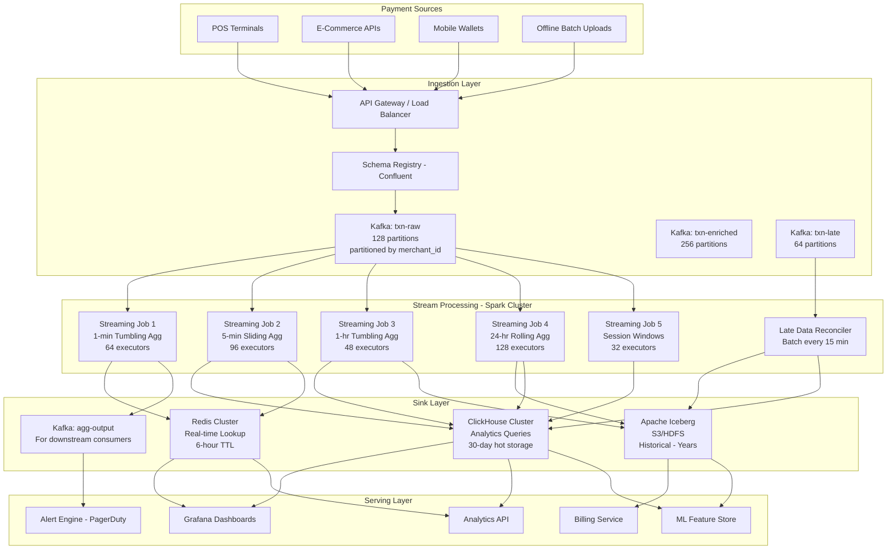
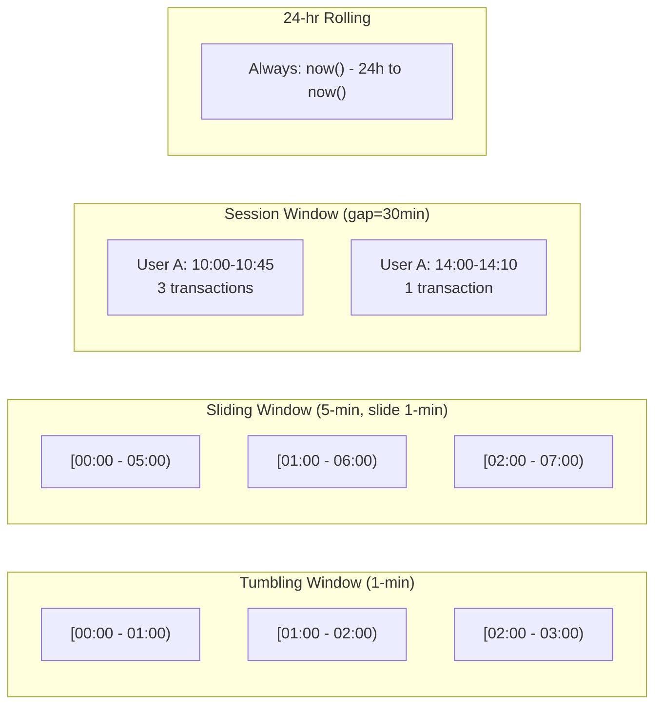
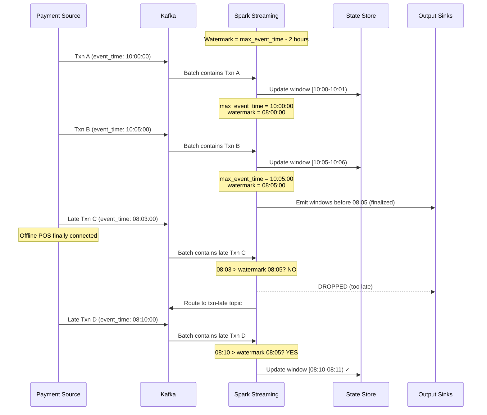
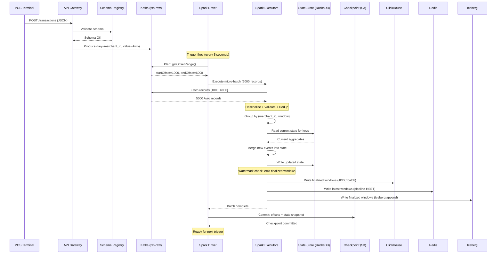
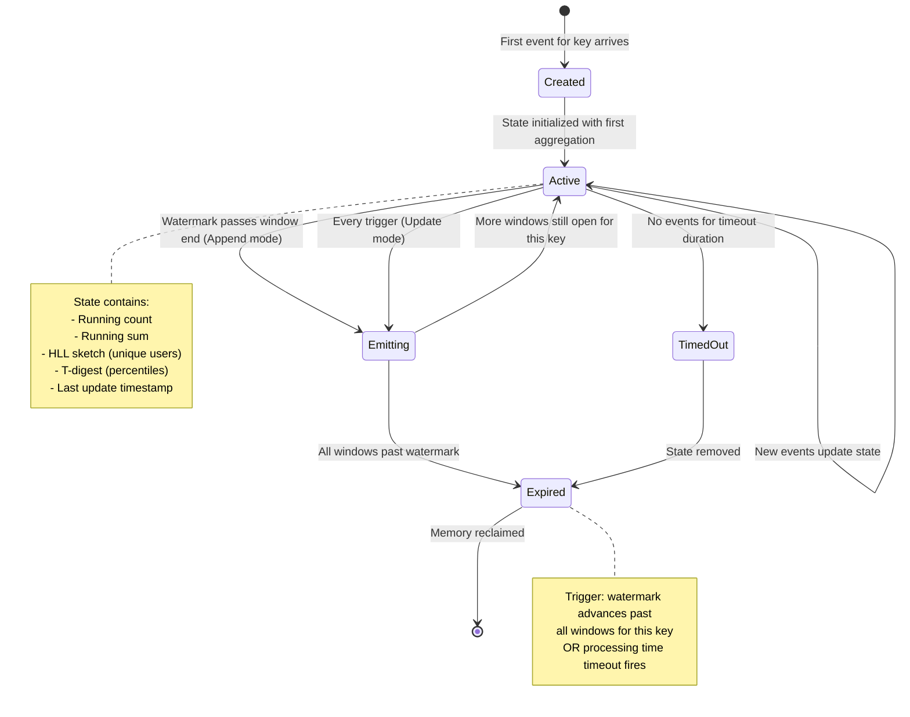
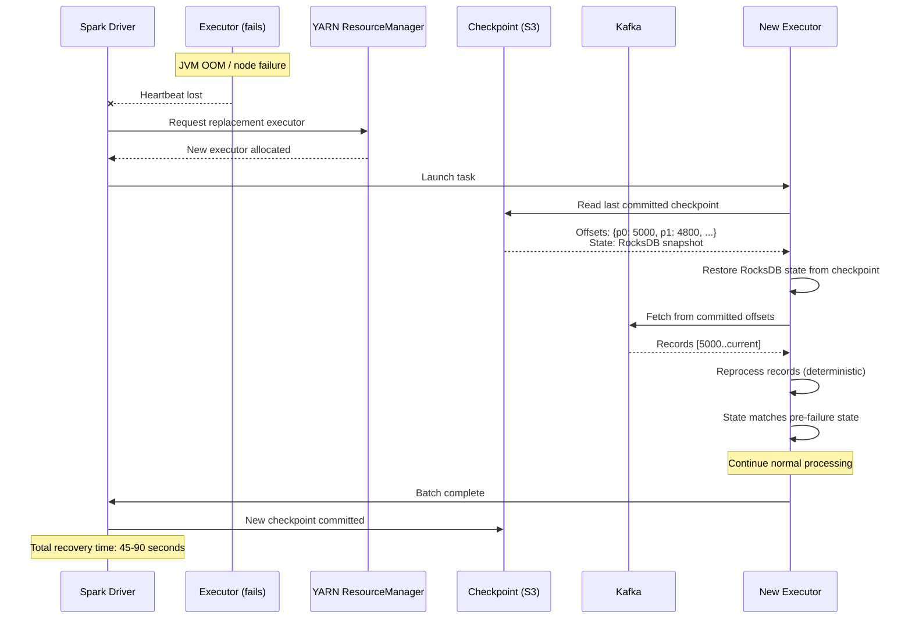

# Real-Time Transaction Aggregation at Billion Scale with Spark Structured Streaming

## 1. Problem Statement

### Scale Requirements

| Metric | Value |
|--------|-------|
| Transactions/day | 3.2 Billion |
| Average TPS | 35,000 |
| Peak TPS (Black Friday, flash sales) | 200,000 |
| Unique merchants | 12 Million |
| Unique users | 450 Million |
| Transaction categories | 2,400 |
| Geographic regions | 195 countries |

### Aggregation Requirements

**Real-time aggregated metrics needed:**
- Per-merchant: total revenue, transaction count, average ticket size, refund rate
- Per-user: spending totals, category breakdown, velocity (transactions per hour)
- Per-category: volume trends, cross-merchant comparison
- Per-geo: regional spend patterns, currency-adjusted totals

**Time windows:**
- 1-minute tumbling: real-time alerting (fraud velocity checks)
- 5-minute sliding: dashboard metrics with smooth curves
- 1-hour tumbling: billing engine inputs
- 24-hour rolling: daily merchant settlement calculations

**Late data reality:**
- Offline POS terminals batch-upload when reconnected (up to 2 hours late)
- International payment networks with settlement delays (up to 4 hours)
- Retry/reconciliation events from payment processors (up to 24 hours)
- Must produce correct final aggregates despite late arrivals

**Consumers of aggregated data:**
- Real-time dashboards (< 5s freshness)
- Alerting engine (< 10s detection latency)
- Billing/settlement system (hourly, must be exact)
- ML feature store (5-minute features for fraud models)
- Analytics platform (ad-hoc queries over historical aggregates)

---

## 2. Architecture Diagrams

### Full System Architecture



### Windowing Strategy



### Late Data Handling with Watermarks



---

## 3. Spark Structured Streaming Concepts (Deep Dive)

### 3.1 Triggers

Triggers control how frequently the streaming query processes new data.

| Trigger | Behavior | Use Case |
|---------|----------|----------|
| `processingTime("10 seconds")` | Micro-batch every 10s | Standard production streaming |
| `processingTime("0 seconds")` | Next batch immediately after previous | Maximum throughput when catching up |
| `once()` | Single batch, then stop | Backfill / testing |
| `availableNow()` | Process all available, then stop | Incremental batch processing |
| `continuous("1 second")` | True continuous (experimental) | Ultra-low latency (< 1ms) |

**Production choice for this system:**
- 1-minute aggregation job: `processingTime("5 seconds")` — balances latency and throughput
- 5-minute aggregation: `processingTime("30 seconds")` — larger batches for efficiency
- 1-hour aggregation: `processingTime("60 seconds")` — less urgency
- 24-hour rolling: `processingTime("120 seconds")` — heavy state, needs time

### 3.2 Output Modes

| Mode | Behavior | When to Use | State Impact |
|------|----------|-------------|--------------|
| **Append** | Only new rows emitted after watermark | Windowed aggs with watermark | State cleaned after watermark |
| **Update** | Only changed rows re-emitted | Real-time dashboards, Redis updates | State kept until watermark |
| **Complete** | Entire result table every batch | Small result sets, testing | State never cleaned (dangerous at scale) |

**Production choice:**
- Append mode for Iceberg/ClickHouse sinks (immutable writes)
- Update mode for Redis sink (overwrite current values)
- Never complete mode at this scale (12M merchants = unbounded state)

### 3.3 Watermarking

Watermarks define the threshold for late data acceptance:

```
watermark = max(event_time seen across all partitions) - threshold
```

**Key behaviors:**
1. State for windows older than watermark is dropped (memory reclaimed)
2. Events with event_time < watermark are dropped in append mode
3. Watermark advances monotonically (never goes backward)
4. Global watermark = minimum across all partitions (slowest partition dictates)

**Tradeoff: Completeness vs. Latency**

| Watermark Delay | Late Data Captured | Output Latency | State Size |
|-----------------|-------------------|----------------|------------|
| 10 seconds | ~95% | 10s | Small |
| 2 minutes | ~99% | 2min | Medium |
| 2 hours | ~99.99% | 2hr | Large (dangerous) |

**Our strategy:** Use 2-hour watermark for the primary pipeline, with a separate reconciliation job for data arriving after 2 hours.

### 3.4 Stateful Processing

#### mapGroupsWithState (one output per group per trigger)

Used for: maintaining running state per merchant (e.g., running total)

```
Input events -> Group by key -> Update state -> Emit one output per group
```

#### flatMapGroupsWithState (zero or more outputs per group per trigger)

Used for: session windows, complex alerting (emit alert only when threshold crossed)

```
Input events -> Group by key -> Update state -> Emit 0..N outputs
```

**State timeout types:**
- `ProcessingTimeTimeout`: expire after wall-clock duration
- `EventTimeTimeout`: expire based on watermark advancement

### 3.5 State Store Backends

| Backend | Characteristics | When to Use |
|---------|----------------|-------------|
| **HDFSBackedStateStore** (default) | In-memory HashMap, versioned snapshots to HDFS | State < executor memory, fast lookups |
| **RocksDBStateStoreProvider** | On-disk LSM tree, spills to local SSD | Large state (our case: 12M merchant states) |

**RocksDB advantages at our scale:**
- State can exceed executor memory (spills to SSD)
- Incremental checkpointing (only changed keys)
- Bloom filters for fast negative lookups
- Compression reduces storage 3-5x

### 3.6 Exactly-Once Semantics

End-to-end exactly-once requires:

1. **Replayable source**: Kafka with offset tracking ✓
2. **Deterministic processing**: Same input → same output ✓
3. **Idempotent sink**: Write with unique ID / transactional write ✓

Spark achieves this via:
- Checkpointing offsets + state atomically
- On failure: replay from last checkpoint offsets
- Recompute produces identical results
- Sink must handle duplicates (idempotent writes)

### 3.7 Kafka Source Internals

**Offset management:**
- Spark tracks offsets in checkpoint (NOT Kafka consumer groups)
- Each micro-batch: `startOffset → endOffset` range per partition
- On restart: reads last committed offsets from checkpoint

**Rate limiting:**
```
maxOffsetsPerTrigger = 5,000,000  # Max records per batch across all partitions
minPartitions = 256               # Force more parallel reads than Kafka partitions
```

**Backpressure:** Spark doesn't have explicit backpressure. Instead:
- If processing takes longer than trigger interval, next batch starts immediately
- Monitor `processingRate` vs `inputRate` — if inputRate > processingRate, you're falling behind

### 3.8 Multiple Sinks with foreachBatch

`foreachBatch` gives you a regular DataFrame per micro-batch, enabling:
- Writing to multiple sinks in one batch
- Complex transformations per batch
- Transactional writes
- Custom retry logic

### 3.9 Stream-Stream Joins

Join transactions with refund events (both streams):
- Requires watermark on both sides
- State maintained for join window duration
- Inner, left outer, right outer supported

### 3.10 Deduplication

`dropDuplicates` with watermark for bounded state:
- Keeps seen IDs in state until watermark passes
- After watermark: ID evicted, duplicate arriving after = not caught
- Must combine with downstream idempotent writes

---

## 4. Data Model

### Transaction Schema (Avro)

```json
{
  "type": "record",
  "name": "Transaction",
  "namespace": "com.payments.events",
  "fields": [
    {"name": "transaction_id", "type": "string", "doc": "UUID, globally unique"},
    {"name": "merchant_id", "type": "string", "doc": "Merchant identifier"},
    {"name": "user_id", "type": "string", "doc": "End-user identifier"},
    {"name": "amount_cents", "type": "long", "doc": "Amount in smallest currency unit"},
    {"name": "currency", "type": "string", "doc": "ISO 4217 currency code"},
    {"name": "category_id", "type": "int", "doc": "Merchant category code (MCC)"},
    {"name": "transaction_type", "type": {"type": "enum", "name": "TxnType", "symbols": ["PURCHASE", "REFUND", "AUTH", "CAPTURE", "VOID"]}},
    {"name": "event_timestamp", "type": {"type": "long", "logicalType": "timestamp-millis"}, "doc": "When transaction occurred"},
    {"name": "processing_timestamp", "type": {"type": "long", "logicalType": "timestamp-millis"}, "doc": "When received by system"},
    {"name": "geo_country", "type": "string"},
    {"name": "geo_region", "type": ["null", "string"], "default": null},
    {"name": "geo_city", "type": ["null", "string"], "default": null},
    {"name": "channel", "type": {"type": "enum", "name": "Channel", "symbols": ["ONLINE", "IN_STORE", "MOBILE", "RECURRING"]}},
    {"name": "card_network", "type": "string", "doc": "VISA, MASTERCARD, AMEX, etc."},
    {"name": "is_international", "type": "boolean"},
    {"name": "metadata", "type": {"type": "map", "values": "string"}, "default": {}}
  ]
}
```

### Aggregated Output: Per-Merchant (1-minute window)

```json
{
  "merchant_id": "string",
  "window_start": "timestamp",
  "window_end": "timestamp",
  "txn_count": "long",
  "total_amount_cents": "long",
  "avg_amount_cents": "double",
  "refund_count": "long",
  "refund_amount_cents": "long",
  "unique_users": "long (approx via HLL)",
  "currency_breakdown": "map<string, long>",
  "channel_breakdown": "map<string, long>",
  "category_breakdown": "map<int, long>"
}
```

### Aggregated Output: Per-User (5-minute sliding)

```json
{
  "user_id": "string",
  "window_start": "timestamp",
  "window_end": "timestamp",
  "txn_count": "long",
  "total_spend_cents": "long",
  "merchant_count": "long (approx via HLL)",
  "top_category": "int",
  "velocity_per_minute": "double",
  "is_velocity_anomaly": "boolean"
}
```

### Aggregated Output: Per-Category Per-Geo (1-hour)

```json
{
  "category_id": "int",
  "geo_country": "string",
  "window_start": "timestamp",
  "window_end": "timestamp",
  "txn_count": "long",
  "total_amount_usd_cents": "long",
  "unique_merchants": "long",
  "unique_users": "long",
  "avg_ticket_size_cents": "double",
  "p50_amount_cents": "long",
  "p95_amount_cents": "long",
  "p99_amount_cents": "long"
}
```

---

## 5. Implementation (PySpark)

### 5.1 Streaming Ingestion from Kafka

```python
from pyspark.sql import SparkSession
from pyspark.sql.functions import *
from pyspark.sql.types import *
from pyspark.sql.avro.functions import from_avro
import json

spark = SparkSession.builder \
    .appName("txn-aggregation-1min") \
    .config("spark.sql.streaming.stateStore.providerClass",
            "org.apache.spark.sql.execution.streaming.state.RocksDBStateStoreProvider") \
    .config("spark.sql.streaming.stateStore.rocksdb.compactOnCommit", "false") \
    .config("spark.sql.streaming.stateStore.rocksdb.changelogCheckpointing.enabled", "true") \
    .config("spark.sql.shuffle.partitions", "256") \
    .config("spark.sql.streaming.metricsEnabled", "true") \
    .getOrCreate()

# Schema Registry integration
schema_registry_url = "https://schema-registry.internal:8081"
# In production, fetch schema from registry; here we define inline for clarity
avro_schema = open("/etc/spark/schemas/transaction_v3.avsc").read()

# Read from Kafka
raw_stream = spark.readStream \
    .format("kafka") \
    .option("kafka.bootstrap.servers", "kafka-broker-1:9092,kafka-broker-2:9092,kafka-broker-3:9092") \
    .option("subscribe", "txn-raw") \
    .option("startingOffsets", "latest") \
    .option("maxOffsetsPerTrigger", "5000000") \
    .option("kafka.fetch.max.bytes", "104857600") \
    .option("kafka.max.partition.fetch.bytes", "10485760") \
    .option("kafka.session.timeout.ms", "60000") \
    .option("kafka.heartbeat.interval.ms", "20000") \
    .option("kafka.request.timeout.ms", "70000") \
    .option("failOnDataLoss", "false") \
    .option("kafka.isolation.level", "read_committed") \
    .load()

# Deserialize Avro with schema
transactions = raw_stream \
    .select(
        col("key").cast("string").alias("merchant_id_key"),
        from_avro(col("value"), avro_schema).alias("txn"),
        col("timestamp").alias("kafka_timestamp"),
        col("partition").alias("kafka_partition"),
        col("offset").alias("kafka_offset")
    ) \
    .select(
        "txn.transaction_id",
        "txn.merchant_id",
        "txn.user_id",
        "txn.amount_cents",
        "txn.currency",
        "txn.category_id",
        "txn.transaction_type",
        col("txn.event_timestamp").cast("timestamp").alias("event_time"),
        col("txn.processing_timestamp").cast("timestamp").alias("processing_time"),
        "txn.geo_country",
        "txn.geo_region",
        "txn.channel",
        "txn.card_network",
        "txn.is_international",
        "kafka_timestamp",
        "kafka_partition",
        "kafka_offset"
    )

# Schema validation: drop malformed records, route to DLQ
valid_transactions = transactions \
    .filter(col("transaction_id").isNotNull()) \
    .filter(col("merchant_id").isNotNull()) \
    .filter(col("amount_cents") > 0) \
    .filter(col("event_time").isNotNull()) \
    .filter(col("event_time") > lit("2020-01-01").cast("timestamp"))

# Deduplication within watermark window
deduped_transactions = valid_transactions \
    .withWatermark("event_time", "2 hours") \
    .dropDuplicates(["transaction_id"])
```

### 5.2 Multi-Window Aggregation

#### 1-Minute Tumbling Window: Per-Merchant Totals

```python
from pyspark.sql.functions import window, count, sum as _sum, avg, approx_count_distinct

# 1-minute tumbling window per merchant
merchant_1min_agg = deduped_transactions \
    .withWatermark("event_time", "2 hours") \
    .groupBy(
        window("event_time", "1 minute"),
        "merchant_id"
    ) \
    .agg(
        count("*").alias("txn_count"),
        _sum("amount_cents").alias("total_amount_cents"),
        avg("amount_cents").alias("avg_amount_cents"),
        _sum(when(col("transaction_type") == "REFUND", 1).otherwise(0)).alias("refund_count"),
        _sum(when(col("transaction_type") == "REFUND", col("amount_cents")).otherwise(0)).alias("refund_amount_cents"),
        approx_count_distinct("user_id", 0.05).alias("unique_users_approx"),
        count(when(col("is_international") == True, 1)).alias("international_txn_count"),
        # Currency breakdown as map
        collect_list(struct("currency", "amount_cents")).alias("currency_details")
    ) \
    .select(
        col("merchant_id"),
        col("window.start").alias("window_start"),
        col("window.end").alias("window_end"),
        col("txn_count"),
        col("total_amount_cents"),
        col("avg_amount_cents"),
        col("refund_count"),
        col("refund_amount_cents"),
        col("unique_users_approx"),
        col("international_txn_count")
    )
```

#### 5-Minute Sliding Window: Moving Average

```python
# 5-minute sliding window, sliding every 1 minute
# Produces an output for every 1-min slide
merchant_5min_sliding = deduped_transactions \
    .withWatermark("event_time", "2 hours") \
    .groupBy(
        window("event_time", "5 minutes", "1 minute"),  # windowDuration, slideDuration
        "merchant_id"
    ) \
    .agg(
        count("*").alias("txn_count_5min"),
        _sum("amount_cents").alias("total_amount_5min"),
        avg("amount_cents").alias("avg_amount_5min"),
        approx_count_distinct("user_id", 0.05).alias("unique_users_5min"),
        # Compute TPS within window
        (count("*") / lit(300)).alias("avg_tps_5min")  # 300 seconds in 5 min
    ) \
    .select(
        "merchant_id",
        col("window.start").alias("window_start"),
        col("window.end").alias("window_end"),
        "txn_count_5min",
        "total_amount_5min",
        "avg_amount_5min",
        "unique_users_5min",
        "avg_tps_5min"
    )
```

#### Session Window: User Shopping Sessions

```python
# Session window with 30-minute gap
# A "session" ends when user has no activity for 30 minutes
user_sessions = deduped_transactions \
    .withWatermark("event_time", "2 hours") \
    .groupBy(
        session_window("event_time", "30 minutes"),
        "user_id"
    ) \
    .agg(
        count("*").alias("session_txn_count"),
        _sum("amount_cents").alias("session_total_cents"),
        min("event_time").alias("session_start"),
        max("event_time").alias("session_end"),
        approx_count_distinct("merchant_id", 0.05).alias("merchants_visited"),
        collect_set("category_id").alias("categories"),
        first("geo_country").alias("session_country")
    ) \
    .withColumn("session_duration_seconds",
        unix_timestamp("session_end") - unix_timestamp("session_start"))
```

#### Custom Business-Hour Aggregation

```python
# Business hours: 9 AM - 5 PM in merchant's timezone
# Non-business hours: everything else
# This requires enrichment with merchant timezone

business_hour_agg = deduped_transactions \
    .withColumn("hour_of_day", hour("event_time")) \
    .withColumn("is_business_hours",
        (col("hour_of_day") >= 9) & (col("hour_of_day") < 17)) \
    .withWatermark("event_time", "2 hours") \
    .groupBy(
        window("event_time", "1 hour"),
        "merchant_id",
        "is_business_hours"
    ) \
    .agg(
        count("*").alias("txn_count"),
        _sum("amount_cents").alias("total_amount_cents"),
        avg("amount_cents").alias("avg_amount_cents")
    )
```

### 5.3 Stateful Processing: Running Percentiles

```python
from pyspark.sql.streaming import GroupState, GroupStateTimeout
from pyspark.sql.types import StructType, StructField, StringType, LongType, DoubleType, ArrayType
import numpy as np

# Schema for the state: running percentile sketch
# Using t-digest approximation for streaming percentiles

# State schema stored per merchant
state_schema = StructType([
    StructField("merchant_id", StringType()),
    StructField("centroids", ArrayType(StructType([
        StructField("mean", DoubleType()),
        StructField("count", LongType())
    ]))),
    StructField("total_count", LongType()),
    StructField("last_updated", LongType())
])

# Output schema
output_schema = StructType([
    StructField("merchant_id", StringType()),
    StructField("window_end", StringType()),
    StructField("p50_amount_cents", LongType()),
    StructField("p95_amount_cents", LongType()),
    StructField("p99_amount_cents", LongType()),
    StructField("total_count", LongType())
])


def update_percentile_state(merchant_id, events, state: GroupState):
    """
    Custom stateful processing for running percentile computation.
    Uses a simplified t-digest approach for streaming percentile estimation.
    """
    import json
    from datetime import datetime

    # Get existing state or initialize
    if state.exists:
        current_state = state.get
        centroids = current_state["centroids"]
        total_count = current_state["total_count"]
    else:
        centroids = []
        total_count = 0

    # Process new events
    new_amounts = []
    for event in events:
        new_amounts.append(event.amount_cents)

    if not new_amounts:
        # No new data, check timeout
        if state.hasTimedOut():
            state.remove()
            return iter([])
        return iter([])

    # Update t-digest centroids (simplified)
    for amount in new_amounts:
        centroids.append({"mean": float(amount), "count": 1})
        total_count += 1

    # Compress centroids if too many (keep ~200 centroids)
    if len(centroids) > 500:
        centroids = _compress_centroids(centroids, target=200)

    # Update state
    state.update({
        "merchant_id": merchant_id,
        "centroids": centroids,
        "total_count": total_count,
        "last_updated": int(datetime.utcnow().timestamp() * 1000)
    })

    # Set timeout: if no data for 2 hours, clean up state
    state.setTimeoutDuration("2 hours")

    # Compute percentiles from centroids
    p50 = _percentile_from_centroids(centroids, total_count, 0.50)
    p95 = _percentile_from_centroids(centroids, total_count, 0.95)
    p99 = _percentile_from_centroids(centroids, total_count, 0.99)

    yield {
        "merchant_id": merchant_id,
        "window_end": datetime.utcnow().isoformat(),
        "p50_amount_cents": int(p50),
        "p95_amount_cents": int(p95),
        "p99_amount_cents": int(p99),
        "total_count": total_count
    }


def _compress_centroids(centroids, target=200):
    """Merge nearby centroids to maintain bounded state size."""
    sorted_c = sorted(centroids, key=lambda c: c["mean"])
    if len(sorted_c) <= target:
        return sorted_c

    step = len(sorted_c) // target
    compressed = []
    for i in range(0, len(sorted_c), step):
        batch = sorted_c[i:i+step]
        total_count = sum(c["count"] for c in batch)
        weighted_mean = sum(c["mean"] * c["count"] for c in batch) / total_count
        compressed.append({"mean": weighted_mean, "count": total_count})
    return compressed


def _percentile_from_centroids(centroids, total_count, percentile):
    """Estimate percentile from t-digest centroids."""
    sorted_c = sorted(centroids, key=lambda c: c["mean"])
    target = percentile * total_count
    running = 0
    for c in sorted_c:
        running += c["count"]
        if running >= target:
            return c["mean"]
    return sorted_c[-1]["mean"] if sorted_c else 0


# Apply stateful processing
percentile_stream = deduped_transactions \
    .groupBy("merchant_id") \
    .applyInPandasWithState(
        update_percentile_state,
        outputStructType=output_schema,
        stateStructType=state_schema,
        outputMode="update",
        timeoutConf=GroupStateTimeout.ProcessingTimeTimeout
    )
```

### 5.4 HyperLogLog for Cardinality Estimation

```python
# Built-in approx_count_distinct uses HyperLogLog internally
# For custom HLL that can be serialized/merged across windows:

from pyspark.sql.functions import approx_count_distinct

# Per-merchant unique user count (HLL with 5% relative error)
merchant_cardinality = deduped_transactions \
    .withWatermark("event_time", "2 hours") \
    .groupBy(
        window("event_time", "1 hour"),
        "merchant_id"
    ) \
    .agg(
        approx_count_distinct("user_id", 0.05).alias("unique_users"),
        approx_count_distinct("geo_city", 0.1).alias("unique_cities"),
        approx_count_distinct("category_id", 0.01).alias("unique_categories")
    )
```

### 5.5 Multiple Sink Writing with foreachBatch

```python
from datetime import datetime
import redis
import clickhouse_connect

def write_to_multiple_sinks(batch_df, batch_id):
    """
    foreachBatch function that writes aggregation results to:
    1. ClickHouse (analytics)
    2. Redis (real-time API serving)
    3. Iceberg (historical storage)
    """
    if batch_df.isEmpty():
        return

    # Cache the DataFrame since we'll use it multiple times
    batch_df = batch_df.persist()
    record_count = batch_df.count()

    try:
        # -------- SINK 1: ClickHouse --------
        write_to_clickhouse(batch_df, batch_id)

        # -------- SINK 2: Redis --------
        write_to_redis(batch_df, batch_id)

        # -------- SINK 3: Iceberg --------
        write_to_iceberg(batch_df, batch_id)

        print(f"Batch {batch_id}: wrote {record_count} records to all sinks")

    except Exception as e:
        print(f"Batch {batch_id} FAILED: {e}")
        # Metrics counter for alerting
        raise  # Re-raise to trigger Spark retry
    finally:
        batch_df.unpersist()


def write_to_clickhouse(df, batch_id):
    """Write to ClickHouse using JDBC with idempotent inserts."""
    df.select(
        "merchant_id", "window_start", "window_end",
        "txn_count", "total_amount_cents", "avg_amount_cents",
        "refund_count", "unique_users_approx"
    ).write \
        .format("jdbc") \
        .option("url", "jdbc:clickhouse://clickhouse-cluster:8123/analytics") \
        .option("dbtable", "merchant_agg_1min") \
        .option("user", "spark_writer") \
        .option("password", "${CLICKHOUSE_PASSWORD}") \
        .option("batchsize", "50000") \
        .option("isolationLevel", "NONE") \
        .option("createTableOptions",
                "ENGINE = ReplacingMergeTree(window_start) "
                "PARTITION BY toYYYYMMDD(window_start) "
                "ORDER BY (merchant_id, window_start)") \
        .mode("append") \
        .save()


def write_to_redis(df, batch_id):
    """Write latest aggregations to Redis for real-time API serving."""

    def write_partition_to_redis(partition):
        r = redis.Redis(
            host='redis-cluster.internal',
            port=6379,
            password='${REDIS_PASSWORD}',
            decode_responses=True,
            socket_connect_timeout=5,
            socket_timeout=5
        )
        pipe = r.pipeline(transaction=False)

        count = 0
        for row in partition:
            key = f"merchant_agg:1min:{row.merchant_id}"
            value = {
                "window_start": row.window_start.isoformat(),
                "window_end": row.window_end.isoformat(),
                "txn_count": str(row.txn_count),
                "total_amount_cents": str(row.total_amount_cents),
                "avg_amount_cents": str(row.avg_amount_cents),
                "refund_count": str(row.refund_count),
                "unique_users": str(row.unique_users_approx),
                "batch_id": str(batch_id)
            }
            pipe.hset(key, mapping=value)
            pipe.expire(key, 21600)  # 6-hour TTL
            count += 1

            if count % 1000 == 0:
                pipe.execute()
                pipe = r.pipeline(transaction=False)

        pipe.execute()
        r.close()

    df.foreachPartition(write_partition_to_redis)


def write_to_iceberg(df, batch_id):
    """Write to Apache Iceberg for historical analytics."""
    df.select(
        "merchant_id", "window_start", "window_end",
        "txn_count", "total_amount_cents", "avg_amount_cents",
        "refund_count", "refund_amount_cents", "unique_users_approx"
    ) \
    .withColumn("processing_date", current_date()) \
    .writeTo("catalog.analytics.merchant_agg_1min") \
    .option("merge-schema", "true") \
    .append()


# Start the streaming query with foreachBatch
query = merchant_1min_agg \
    .writeStream \
    .outputMode("update") \
    .foreachBatch(write_to_multiple_sinks) \
    .option("checkpointLocation", "s3a://checkpoints/merchant-1min-agg/v3/") \
    .trigger(processingTime="5 seconds") \
    .queryName("merchant_1min_aggregation") \
    .start()
```

### 5.6 Stream-Stream Join: Transactions + Refunds

```python
# Join transaction stream with refund stream to compute net amounts
# Refund arrives within 72 hours of original transaction

transactions_stream = deduped_transactions \
    .filter(col("transaction_type") == "PURCHASE") \
    .withWatermark("event_time", "2 hours") \
    .alias("txn")

refunds_stream = deduped_transactions \
    .filter(col("transaction_type") == "REFUND") \
    .withWatermark("event_time", "74 hours") \
    .withColumnRenamed("transaction_id", "refund_id") \
    .withColumn("original_txn_id",
        col("metadata").getItem("original_transaction_id")) \
    .alias("refund")

# Stream-stream join with time constraint
joined = transactions_stream.join(
    refunds_stream,
    expr("""
        txn.transaction_id = refund.original_txn_id AND
        refund.event_time >= txn.event_time AND
        refund.event_time <= txn.event_time + INTERVAL 72 HOURS
    """),
    "leftOuter"  # Keep transactions even without refund
).select(
    col("txn.transaction_id"),
    col("txn.merchant_id"),
    col("txn.amount_cents").alias("original_amount"),
    col("refund.amount_cents").alias("refund_amount"),
    col("txn.event_time").alias("txn_time"),
    col("refund.event_time").alias("refund_time"),
    when(col("refund.refund_id").isNotNull(), True).otherwise(False).alias("was_refunded")
)
```

---

## 6. Late Data Handling

### 6.1 Watermark Configuration Strategy

```python
# Tiered watermark strategy based on aggregation window
# Shorter windows can tolerate shorter watermarks (re-aggregated hourly anyway)

# 1-min agg: 10-minute watermark (fast output, reconciled later)
fast_agg = transactions.withWatermark("event_time", "10 minutes")

# 5-min agg: 30-minute watermark (balanced)
medium_agg = transactions.withWatermark("event_time", "30 minutes")

# 1-hour agg: 2-hour watermark (captures most late data)
slow_agg = transactions.withWatermark("event_time", "2 hours")

# 24-hour agg: 4-hour watermark (settlement accuracy)
daily_agg = transactions.withWatermark("event_time", "4 hours")
```

### 6.2 Side-Output for Late Events

```python
# Route late events to a separate topic for reconciliation
# This requires custom logic since Spark doesn't have native side-output

def route_late_events(batch_df, batch_id):
    """
    In foreachBatch, detect and route late events before aggregation.
    Late = event_time < (current_processing_time - watermark_threshold)
    """
    current_time = datetime.utcnow()
    watermark_threshold_seconds = 7200  # 2 hours

    from pyspark.sql.functions import lit, unix_timestamp

    # Tag events as on-time or late
    tagged = batch_df.withColumn(
        "is_late",
        unix_timestamp(lit(current_time)) - unix_timestamp("event_time") > watermark_threshold_seconds
    )

    # On-time events: process normally
    on_time = tagged.filter(~col("is_late"))

    # Late events: route to late-data topic
    late = tagged.filter(col("is_late"))

    if late.count() > 0:
        late.select(
            col("merchant_id").cast("string").alias("key"),
            to_avro(struct("*")).alias("value")
        ).write \
            .format("kafka") \
            .option("kafka.bootstrap.servers", "kafka-broker-1:9092") \
            .option("topic", "txn-late") \
            .save()

        print(f"Batch {batch_id}: routed {late.count()} late events")

    return on_time
```

### 6.3 Reconciliation Job

```python
# Runs every 15 minutes as a separate Spark job
# Reads late events and corrects historical aggregations in Iceberg

def run_reconciliation():
    """
    Batch job that reads late-arriving transactions and updates
    historical aggregations using Iceberg MERGE INTO.
    """
    spark = SparkSession.builder \
        .appName("txn-late-reconciliation") \
        .config("spark.sql.extensions", "org.apache.iceberg.spark.extensions.IcebergSparkSessionExtensions") \
        .getOrCreate()

    # Read late events from Kafka (batch mode)
    late_events = spark.read \
        .format("kafka") \
        .option("kafka.bootstrap.servers", "kafka-broker-1:9092") \
        .option("subscribe", "txn-late") \
        .option("startingOffsets", "earliest") \
        .option("endingOffsets", "latest") \
        .load()

    # Deserialize and re-aggregate
    late_transactions = late_events.select(
        from_avro(col("value"), avro_schema).alias("txn")
    ).select("txn.*")

    # Re-compute aggregations for affected windows
    late_agg = late_transactions \
        .groupBy(
            window("event_time", "1 minute"),
            "merchant_id"
        ) \
        .agg(
            count("*").alias("late_txn_count"),
            _sum("amount_cents").alias("late_total_amount")
        )

    # MERGE INTO existing Iceberg table
    late_agg.createOrReplaceTempView("late_corrections")

    spark.sql("""
        MERGE INTO catalog.analytics.merchant_agg_1min t
        USING late_corrections s
        ON t.merchant_id = s.merchant_id
           AND t.window_start = s.window_start
        WHEN MATCHED THEN UPDATE SET
            t.txn_count = t.txn_count + s.late_txn_count,
            t.total_amount_cents = t.total_amount_cents + s.late_total_amount,
            t.avg_amount_cents = (t.total_amount_cents + s.late_total_amount)
                                 / (t.txn_count + s.late_txn_count)
        WHEN NOT MATCHED THEN INSERT *
    """)

    # Clear consumed late events (commit offsets)
    print(f"Reconciliation complete: corrected {late_agg.count()} windows")
```

---

## 7. Production Configuration

### 7.1 Spark Streaming Configuration

```properties
# spark-defaults.conf for 200K TPS peak processing

# ---- Application ----
spark.app.name=txn-aggregation-1min
spark.master=yarn
spark.submit.deployMode=cluster

# ---- Resources ----
spark.driver.memory=16g
spark.driver.cores=4
spark.driver.maxResultSize=4g
spark.executor.memory=32g
spark.executor.memoryOverhead=8g
spark.executor.cores=8
spark.executor.instances=64
# Total: 64 executors × 8 cores = 512 cores, 64 × 32GB = 2TB memory

# ---- Shuffle ----
spark.sql.shuffle.partitions=512
spark.shuffle.compress=true
spark.shuffle.spill.compress=true
spark.reducer.maxSizeInFlight=96m
spark.shuffle.file.buffer=1m

# ---- Streaming ----
spark.sql.streaming.metricsEnabled=true
spark.sql.streaming.stateStore.providerClass=org.apache.spark.sql.execution.streaming.state.RocksDBStateStoreProvider
spark.sql.streaming.stateStore.maintenanceInterval=600s
spark.sql.streaming.noDataMicroBatches.enabled=false
spark.sql.streaming.pollingDelay=10ms

# ---- RocksDB State Store ----
spark.sql.streaming.stateStore.rocksdb.compactOnCommit=false
spark.sql.streaming.stateStore.rocksdb.changelogCheckpointing.enabled=true
spark.sql.streaming.stateStore.rocksdb.blockSizeKB=32
spark.sql.streaming.stateStore.rocksdb.blockCacheSizeMB=512
spark.sql.streaming.stateStore.rocksdb.lockAcquireTimeoutMs=120000
spark.sql.streaming.stateStore.rocksdb.maxWriteBufferNumber=4
spark.sql.streaming.stateStore.rocksdb.writeBufferSizeMB=128

# ---- Checkpoint ----
spark.sql.streaming.checkpointLocation=s3a://checkpoints/prod/
spark.sql.streaming.minBatchesToRetain=200

# ---- Serialization ----
spark.serializer=org.apache.spark.serializer.KryoSerializer
spark.kryoserializer.buffer.max=1g
spark.sql.avro.compression.codec=snappy

# ---- Network ----
spark.network.timeout=600s
spark.rpc.askTimeout=600s
spark.sql.broadcastTimeout=600

# ---- Adaptive Query Execution ----
spark.sql.adaptive.enabled=true
spark.sql.adaptive.coalescePartitions.enabled=true
spark.sql.adaptive.skewJoin.enabled=true

# ---- S3 (for checkpoints) ----
spark.hadoop.fs.s3a.impl=org.apache.hadoop.fs.s3a.S3AFileSystem
spark.hadoop.fs.s3a.fast.upload=true
spark.hadoop.fs.s3a.fast.upload.buffer=bytebuffer
spark.hadoop.fs.s3a.multipart.size=104857600
spark.hadoop.fs.s3a.connection.maximum=200
```

### 7.2 Kafka Consumer Tuning

```properties
# Kafka consumer properties for Spark Structured Streaming
# Applied via .option("kafka.<property>", value) on readStream

kafka.fetch.min.bytes=1048576
kafka.fetch.max.bytes=104857600
kafka.max.partition.fetch.bytes=10485760
kafka.fetch.max.wait.ms=500
kafka.session.timeout.ms=60000
kafka.heartbeat.interval.ms=20000
kafka.request.timeout.ms=70000
kafka.connections.max.idle.ms=600000
kafka.receive.buffer.bytes=1048576
kafka.max.poll.records=10000
kafka.isolation.level=read_committed
kafka.auto.offset.reset=latest
kafka.enable.auto.commit=false
```

### 7.3 Resource Allocation by Job

| Streaming Job | Executors | Cores/Exec | Memory/Exec | Partitions | Trigger |
|---------------|-----------|-----------|-------------|------------|---------|
| 1-min merchant agg | 64 | 8 | 32 GB | 512 | 5s |
| 5-min sliding agg | 96 | 8 | 32 GB | 512 | 30s |
| 1-hour agg | 48 | 4 | 16 GB | 256 | 60s |
| 24-hour rolling | 128 | 8 | 64 GB | 1024 | 120s |
| Session windows | 32 | 4 | 16 GB | 256 | 30s |
| **Total cluster** | **368** | **2,432 cores** | **~12 TB** | - | - |

### 7.4 Performance Benchmarks

| Metric | Value |
|--------|-------|
| Sustained throughput | 180K events/sec |
| Peak throughput | 210K events/sec |
| P50 end-to-end latency (1-min agg) | 3.2 seconds |
| P99 end-to-end latency (1-min agg) | 8.7 seconds |
| Average batch duration (5s trigger) | 3.8 seconds |
| State size (12M merchants, 1-min) | ~48 GB |
| State size (24-hr rolling, all keys) | ~2.1 TB |
| Checkpoint write time | 1.2 seconds (incremental) |
| Recovery time from failure | 45-90 seconds |

---

## 8. Scaling Strategy

### 8.1 Horizontal Scaling

```python
# Scaling formula:
# Required parallelism = peak_tps / per_partition_throughput
# 200,000 TPS / ~800 events/sec/partition = 250 partitions minimum

# Step 1: Scale Kafka partitions (online operation)
# kafka-topics.sh --alter --topic txn-raw --partitions 256

# Step 2: Increase Spark shuffle partitions to match
spark.conf.set("spark.sql.shuffle.partitions", "512")  # 2x Kafka partitions

# Step 3: Add executors
# Dynamic allocation for streaming (Spark 3.4+)
spark.conf.set("spark.dynamicAllocation.enabled", "true")
spark.conf.set("spark.dynamicAllocation.minExecutors", "48")
spark.conf.set("spark.dynamicAllocation.maxExecutors", "128")
spark.conf.set("spark.dynamicAllocation.executorIdleTimeout", "120s")
```

### 8.2 State Store Size Management

```python
# Problem: 12M merchants × state per merchant = unbounded growth
# Solutions:

# 1. TTL-based cleanup (Spark 3.2+)
spark.conf.set("spark.sql.streaming.stateStore.stateSchemaCheck", "false")
# State entries with no update for TTL duration are evicted

# 2. Custom state cleanup in flatMapGroupsWithState
def update_with_cleanup(key, events, state: GroupState):
    if state.hasTimedOut():
        state.remove()
        return iter([])  # No output for expired state
    # ... normal processing
    state.setTimeoutDuration("6 hours")  # Clean up inactive merchants

# 3. Two-tier architecture:
# - Hot tier: top 100K merchants by volume (in-memory state)
# - Cold tier: remaining 11.9M merchants (RocksDB with aggressive compaction)
```

### 8.3 Multi-Cluster Strategy

```
Cluster 1 (Real-time):     1-min and 5-min aggregations
                           Focus: low latency, smaller state
                           64 executors, 5-second trigger

Cluster 2 (Analytics):     1-hour and 24-hour aggregations
                           Focus: large state, high throughput
                           128 executors, 60-120s trigger

Cluster 3 (Sessions):      Session windows + complex stateful
                           Focus: unbounded state per user
                           32 executors, custom timeouts

Cluster 4 (Reconciliation): Late data processing
                           Batch mode, runs every 15 min
                           48 executors, availableNow trigger
```

### 8.4 Graceful Scaling Without Data Loss

```python
# When adding partitions to Kafka or changing Spark parallelism:

# 1. Stop query gracefully
for query in spark.streams.active:
    query.stop()  # Commits final checkpoint

# 2. Verify checkpoint is clean
# Check: s3://checkpoints/merchant-1min-agg/v3/offsets/<latest>
# Should have committed offset for every partition

# 3. Restart with new configuration
# Spark auto-discovers new Kafka partitions on restart
# Existing offsets preserved, new partitions start from "latest" or "earliest"

# 4. For Spark partition changes: checkpoint is compatible
# Changing spark.sql.shuffle.partitions requires NO checkpoint change
# State is repartitioned transparently on restart
```

---

## 9. Failure Handling

### 9.1 Checkpoint-Based Recovery

```
Recovery sequence:
1. Spark detects executor/driver failure
2. New attempt reads last committed checkpoint:
   - Kafka offsets (exact position per partition)
   - State store snapshot (RocksDB SST files)
   - Sink commit log (which batch_ids completed)
3. Replays from last committed offset
4. Recomputes state updates
5. Writes to sink (idempotent: same batch_id → same data)
6. Commits new checkpoint
```

**Checkpoint storage reliability:**
```properties
# S3 with versioning for checkpoint durability
spark.hadoop.fs.s3a.change.detection.mode=warn
spark.hadoop.fs.s3a.change.detection.source=etag
spark.hadoop.fs.s3a.retry.limit=10
spark.hadoop.fs.s3a.retry.interval=500ms
```

### 9.2 Idempotent Sink Writes

```python
# ClickHouse: ReplacingMergeTree deduplicates by (merchant_id, window_start)
# Even if same batch writes twice, final result is correct

# Redis: HSET is inherently idempotent (overwrites with same value)

# Iceberg: Use batch_id in metadata for deduplication
def write_to_iceberg_idempotent(df, batch_id):
    """Iceberg write with batch_id tracking to prevent duplicates."""
    # Check if batch already written
    existing = spark.sql(f"""
        SELECT 1 FROM catalog.analytics.batch_log
        WHERE batch_id = {batch_id} AND job_name = 'merchant_1min_agg'
    """)

    if existing.count() > 0:
        print(f"Batch {batch_id} already committed to Iceberg, skipping")
        return

    # Write data
    df.writeTo("catalog.analytics.merchant_agg_1min").append()

    # Record batch as committed
    spark.sql(f"""
        INSERT INTO catalog.analytics.batch_log
        VALUES ({batch_id}, 'merchant_1min_agg', current_timestamp())
    """)
```

### 9.3 Handling Kafka Rebalances

```python
# Spark Structured Streaming handles rebalances internally:
# - Uses assign (not subscribe) mode under the hood after first planning
# - Partition discovery every spark.sql.streaming.kafka.partitionDiscoveryInterval

# Key configs to prevent rebalance storms:
# kafka.session.timeout.ms=60000  (high to avoid false timeouts under GC)
# kafka.heartbeat.interval.ms=20000
# kafka.max.poll.interval.ms=300000  (5 min for slow batches)
```

### 9.4 Stuck Batch Detection and Recovery

```python
from pyspark.sql.streaming import StreamingQueryListener
import time

class StuckBatchDetector(StreamingQueryListener):
    def __init__(self, max_batch_duration_seconds=300):
        self.max_duration = max_batch_duration_seconds
        self.batch_start_times = {}

    def onQueryStarted(self, event):
        print(f"Query started: {event.name} [{event.id}]")

    def onQueryProgress(self, event):
        progress = event.progress
        batch_duration = progress.batchDuration  # milliseconds

        if batch_duration and batch_duration > self.max_duration * 1000:
            self._alert_stuck_batch(
                query_name=progress.name,
                batch_id=progress.batchId,
                duration_ms=batch_duration
            )

        # Check processing rate vs input rate
        if progress.inputRowsPerSecond > 0:
            ratio = progress.processedRowsPerSecond / progress.inputRowsPerSecond
            if ratio < 0.5:  # Processing less than half of incoming
                self._alert_falling_behind(progress.name, ratio)

    def onQueryTerminated(self, event):
        if event.exception:
            self._alert_query_failed(event.name, event.exception)

    def _alert_stuck_batch(self, query_name, batch_id, duration_ms):
        # Send to PagerDuty / Slack
        print(f"ALERT: {query_name} batch {batch_id} running for {duration_ms}ms")

    def _alert_falling_behind(self, query_name, ratio):
        print(f"WARN: {query_name} processing at {ratio:.1%} of input rate")

    def _alert_query_failed(self, query_name, exception):
        print(f"CRITICAL: {query_name} terminated: {exception}")


spark.streams.addListener(StuckBatchDetector(max_batch_duration_seconds=300))
```

### 9.5 Manual Offset Management for Replay

```python
# Replay specific time range (e.g., after discovering a bug)

# Step 1: Find Kafka offsets for time range
# kafka-consumer-groups.sh --bootstrap-server ... --reset-offsets \
#   --topic txn-raw --to-datetime 2024-01-15T10:00:00.000

# Step 2: Start new streaming query from specific offsets
replay_stream = spark.readStream \
    .format("kafka") \
    .option("subscribe", "txn-raw") \
    .option("startingOffsetsByTimestamp",
            '{"txn-raw": {"0": 1705312800000, "1": 1705312800000}}') \
    .option("endingOffsets",  # Stop at specific point
            '{"txn-raw": {"0": 5000000, "1": 5000000}}') \
    .load()

# Step 3: Write to separate checkpoint location
# (never corrupt production checkpoint)
replay_query = replay_stream \
    .writeStream \
    .option("checkpointLocation", "s3://checkpoints/replay-2024-01-15/") \
    .start()
```

---

## 10. Monitoring

### 10.1 Key Streaming Metrics

```python
# StreamingQueryProgress fields to monitor:

# Input metrics
# - inputRowsPerSecond: rate of data arriving
# - numInputRows: total rows in this batch

# Processing metrics
# - processedRowsPerSecond: throughput
# - batchDuration: total time for micro-batch (ms)
# - triggerExecution.latency: breakdown of batch phases

# State metrics (per stateful operator)
# - stateOperators[].numRowsTotal: current state size
# - stateOperators[].numRowsUpdated: rows changed this batch
# - stateOperators[].memoryUsedBytes: state memory
# - stateOperators[].numRowsDroppedByWatermark: late events dropped

# Source metrics
# - sources[].startOffset / endOffset: Kafka offsets
# - sources[].numInputRows: rows read from Kafka
```

### 10.2 StreamingQueryListener for Prometheus

```python
from pyspark.sql.streaming import StreamingQueryListener
from prometheus_client import Gauge, Counter, Histogram, start_http_server

# Prometheus metrics
INPUT_RATE = Gauge('spark_streaming_input_rows_per_second', 'Input rate',
                   ['query_name'])
PROCESS_RATE = Gauge('spark_streaming_processed_rows_per_second', 'Processing rate',
                     ['query_name'])
BATCH_DURATION = Histogram('spark_streaming_batch_duration_ms', 'Batch duration',
                           ['query_name'],
                           buckets=[1000, 2000, 5000, 10000, 30000, 60000, 120000])
STATE_ROWS = Gauge('spark_streaming_state_rows_total', 'State size',
                   ['query_name', 'operator'])
LATE_EVENTS = Counter('spark_streaming_late_events_dropped', 'Late events dropped',
                      ['query_name'])
BATCH_ERRORS = Counter('spark_streaming_batch_errors_total', 'Batch errors',
                       ['query_name'])


class PrometheusStreamingListener(StreamingQueryListener):
    def onQueryStarted(self, event):
        pass

    def onQueryProgress(self, event):
        p = event.progress
        name = p.name or "unknown"

        INPUT_RATE.labels(query_name=name).set(p.inputRowsPerSecond or 0)
        PROCESS_RATE.labels(query_name=name).set(p.processedRowsPerSecond or 0)

        if p.batchDuration:
            BATCH_DURATION.labels(query_name=name).observe(p.batchDuration)

        # State metrics
        for i, op in enumerate(p.stateOperators):
            STATE_ROWS.labels(
                query_name=name,
                operator=f"op_{i}"
            ).set(op.numRowsTotal)

            if op.numRowsDroppedByWatermark:
                LATE_EVENTS.labels(query_name=name).inc(op.numRowsDroppedByWatermark)

    def onQueryTerminated(self, event):
        if event.exception:
            name = event.name or "unknown"
            BATCH_ERRORS.labels(query_name=name).inc()


# Start Prometheus endpoint on executor
start_http_server(9090)
spark.streams.addListener(PrometheusStreamingListener())
```

### 10.3 End-to-End Latency Tracking

```python
# Measure: time from transaction occurrence to aggregation available in sink

def measure_e2e_latency(batch_df, batch_id):
    """Track end-to-end latency per micro-batch."""
    from pyspark.sql.functions import current_timestamp, unix_timestamp

    if batch_df.isEmpty():
        return batch_df

    latency_stats = batch_df.select(
        (unix_timestamp(current_timestamp()) - unix_timestamp("window_end")).alias("e2e_latency_sec")
    ).agg(
        avg("e2e_latency_sec").alias("avg_latency"),
        expr("percentile_approx(e2e_latency_sec, 0.5)").alias("p50_latency"),
        expr("percentile_approx(e2e_latency_sec, 0.95)").alias("p95_latency"),
        expr("percentile_approx(e2e_latency_sec, 0.99)").alias("p99_latency"),
        max("e2e_latency_sec").alias("max_latency")
    ).collect()[0]

    # Emit to Prometheus / StatsD
    print(f"Batch {batch_id} E2E latency: "
          f"p50={latency_stats.p50_latency:.1f}s "
          f"p95={latency_stats.p95_latency:.1f}s "
          f"p99={latency_stats.p99_latency:.1f}s")

    return batch_df
```

### 10.4 Grafana Dashboard Design

**Dashboard panels (recommended layout):**

```
Row 1: Overview
┌─────────────────┬─────────────────┬─────────────────┬─────────────────┐
│  Input Rate     │  Processing     │  Batch Duration │  State Size     │
│  (events/sec)   │  Rate (e/s)     │  (p50, p99)     │  (GB)           │
│  35,000 ▲       │  36,200 ▲       │  3.2s / 8.7s    │  48 GB          │
└─────────────────┴─────────────────┴─────────────────┴─────────────────┘

Row 2: Health
┌─────────────────────────────────┬─────────────────────────────────────┐
│  Processing Ratio               │  Late Events Dropped                │
│  (processed/input - should >1)  │  (per minute)                       │
│  ████████████ 1.03              │  ▁▂▁▁▃▁▁ 42/min                    │
└─────────────────────────────────┴─────────────────────────────────────┘

Row 3: End-to-End Latency
┌─────────────────────────────────────────────────────────────────────────┐
│  E2E Latency Over Time (p50, p95, p99)                                  │
│  ─── p50: 3.2s   ─── p95: 6.8s   ─── p99: 8.7s                       │
│  ▂▂▃▂▂▂▃▃▂▂▂▂▃▂▂▂▂▃▃▃▅▃▃▂▂▂▂▂▃▂▂▂▂▃                                │
└─────────────────────────────────────────────────────────────────────────┘

Row 4: Kafka Consumer Lag
┌─────────────────────────────────────────────────────────────────────────┐
│  Consumer Lag by Partition (should be near 0)                            │
│  Partition 0: 124  Partition 1: 89  Partition 2: 156  ...              │
│  ALERT if any partition > 100,000                                       │
└─────────────────────────────────────────────────────────────────────────┘

Row 5: State Store
┌─────────────────┬─────────────────┬─────────────────────────────────────┐
│  State Rows     │  State Memory   │  Checkpoint Duration                │
│  12.1M entries  │  48 GB          │  1.2s (incremental)                 │
└─────────────────┴─────────────────┴─────────────────────────────────────┘
```

**Alert rules:**
```yaml
# Prometheus alerting rules
groups:
  - name: spark_streaming
    rules:
      - alert: StreamingFallingBehind
        expr: spark_streaming_processed_rows_per_second / spark_streaming_input_rows_per_second < 0.8
        for: 5m
        labels:
          severity: warning

      - alert: StreamingCriticallyBehind
        expr: spark_streaming_processed_rows_per_second / spark_streaming_input_rows_per_second < 0.5
        for: 2m
        labels:
          severity: critical

      - alert: BatchDurationHigh
        expr: spark_streaming_batch_duration_ms{quantile="0.99"} > 30000
        for: 5m
        labels:
          severity: warning

      - alert: StateStoreOOM
        expr: spark_streaming_state_rows_total > 50000000
        for: 10m
        labels:
          severity: critical

      - alert: StreamingQueryStopped
        expr: absent(spark_streaming_input_rows_per_second{query_name="merchant_1min_aggregation"})
        for: 2m
        labels:
          severity: critical
```

---

## 11. Companies Using This Pattern

### Visa
- **Scale**: 65,000 TPS peak, 150B transactions/year
- **Use case**: Real-time authorization analytics, merchant settlement computation
- **Stack**: Custom Spark Streaming on bare metal + VisaNet proprietary infrastructure
- **Notable**: Multi-region active-active with eventual consistency between regions

### Square/Block
- **Scale**: ~35K TPS during peak hours
- **Use case**: Real-time merchant dashboard (live sales, inventory), instant deposit calculations
- **Stack**: Spark Structured Streaming on Kubernetes, Kafka, ClickHouse
- **Notable**: Per-merchant session tracking for "business hours" analytics

### Shopify
- **Scale**: 10K TPS steady, 150K+ TPS during flash sales (Kylie Cosmetics, etc.)
- **Use case**: Live store analytics for merchants, fraud velocity checks
- **Stack**: Flink (primary) + Spark for batch reconciliation on GCP
- **Notable**: Extreme burst handling — must scale 15x within 30 seconds

### Uber
- **Scale**: 100K+ events/sec across ride, eats, freight
- **Use case**: Real-time trip pricing, surge detection, driver earnings
- **Stack**: Apache Flink (moved from Spark Streaming for lower latency)
- **Notable**: Custom stateful processing for geospatial aggregations (H3 hexagons)

### DoorDash
- **Scale**: 50K orders/min during dinner peak
- **Use case**: Real-time order volume by restaurant/region, delivery time predictions
- **Stack**: Flink + Spark on AWS EMR, Kafka, Redis
- **Notable**: Session windows for "dinner rush" detection per restaurant

### Stripe
- **Scale**: Billions of API calls/day, financial transaction aggregation
- **Use case**: Real-time revenue recognition, merchant billing, fraud scoring features
- **Stack**: Custom stream processing + Spark for batch, on AWS
- **Notable**: Exactly-once billing guarantee with idempotency keys

---

## 12. Workflow Diagrams

### Transaction Flow Through Windowed Aggregation



### State Lifecycle Diagram



### Failure Recovery Sequence



---

## Summary: Key Production Decisions

| Decision | Choice | Rationale |
|----------|--------|-----------|
| State backend | RocksDB | 12M merchants won't fit in memory |
| Watermark | 2 hours | Captures 99.99% of late data from offline POS |
| Output mode | Update (Redis), Append (Iceberg/CH) | Match sink semantics |
| Trigger interval | 5s (1-min agg), 30-120s (longer windows) | Balance latency vs efficiency |
| Deduplication | dropDuplicates + idempotent sinks | Belt and suspenders |
| Checkpointing | S3 with changelog (incremental) | Fast recovery, durable |
| Scaling | Separate clusters per window type | Isolate failure domains |
| Late data | Side-output + reconciliation job | Correct without blocking |
| Sink writes | foreachBatch with persist() | Multi-sink atomicity-ish |
| Serialization | Avro (Kafka) + Parquet (Iceberg) | Schema evolution + compression |
