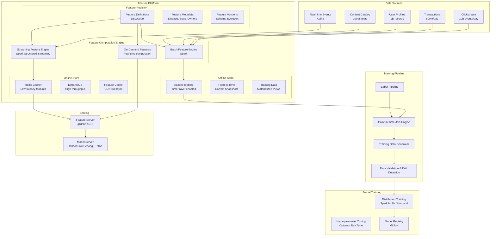
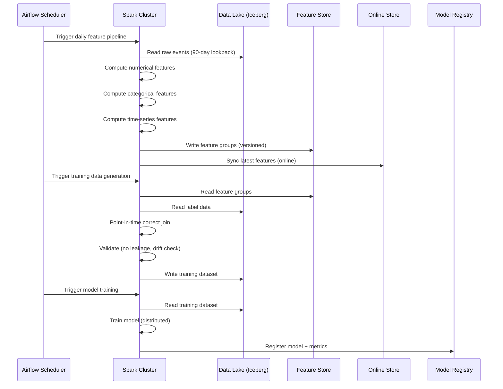
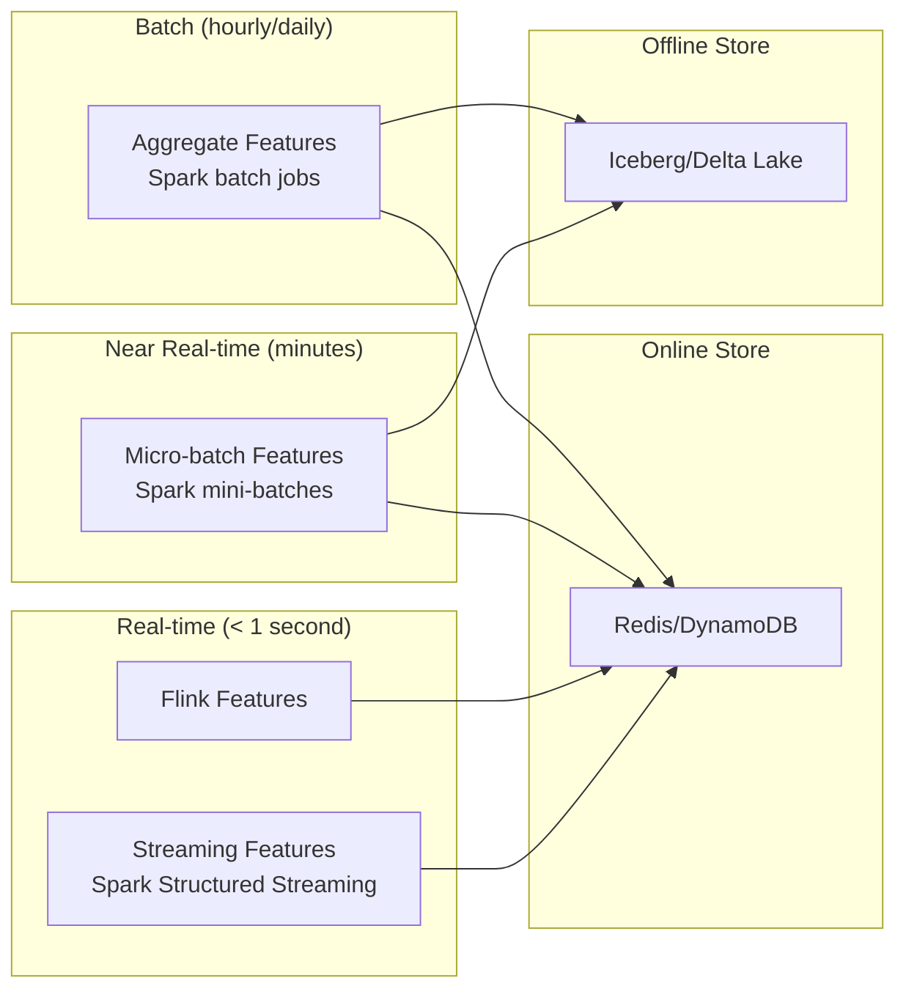
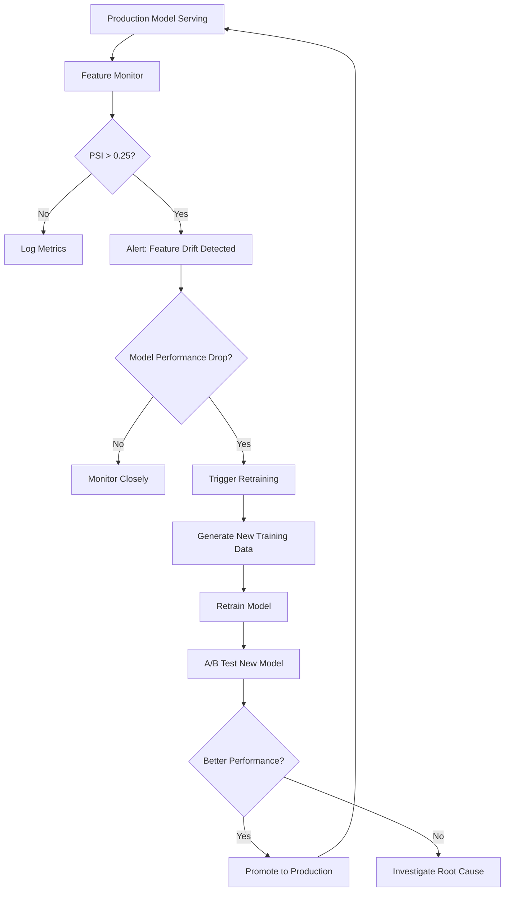

# ML Feature Engineering & Training Data Pipeline at Scale with Apache Spark

## 1. Problem Statement

Modern ML platforms face extraordinary challenges when operating at enterprise scale:

- **200+ production ML models** serving predictions across fraud detection, recommendations, pricing, search ranking, and forecasting
- **100TB+ raw data** spanning clickstreams, transactions, user profiles, content metadata, and real-time events
- **Training-serving skew** — the #1 silent killer of ML systems where features computed differently in training vs. serving lead to degraded model performance
- **Point-in-time correctness** — using only information available at prediction time; any data leakage from the future invalidates the entire training pipeline
- **Feature freshness requirements** ranging from milliseconds (fraud) to daily (recommendations)
- **Thousands of features** shared across teams, requiring governance, versioning, and discoverability
- **Reproducibility** — ability to recreate any training dataset exactly as it was at any point in time

### The Cost of Getting It Wrong

| Issue | Impact |
|-------|--------|
| Training-serving skew | 5-20% model performance degradation in production |
| Data leakage | Models appear great offline, fail catastrophically online |
| Feature computation inconsistency | Silent model degradation over weeks |
| Lack of point-in-time joins | Regulatory violations in finance/healthcare |
| No feature versioning | Impossible to debug model regressions |

### Scale Requirements

```
Daily data volume:      100+ TB raw events
Feature computations:   50,000+ unique features
Models served:          200+ production models
Prediction volume:      1B+ predictions/day
Feature freshness:      Milliseconds to daily
Training data size:     10-50TB per model
Cluster size:           500-2000 nodes
```

---

## 2. Architecture Diagram



---

## 3. Core Spark Concepts for Feature Engineering

### 3.1 Window Functions (Rolling Aggregates)

Window functions are the backbone of feature engineering — they compute aggregates over a sliding window of rows without collapsing the dataset.

```python
from pyspark.sql import SparkSession, Window
from pyspark.sql import functions as F
from pyspark.sql.types import *

spark = SparkSession.builder \
    .appName("FeatureEngineering") \
    .config("spark.sql.adaptive.enabled", "true") \
    .config("spark.sql.adaptive.coalescePartitions.enabled", "true") \
    .config("spark.sql.shuffle.partitions", "2000") \
    .getOrCreate()

# Rolling window over time ranges
time_window_7d = Window.partitionBy("user_id") \
    .orderBy(F.col("event_timestamp").cast("long")) \
    .rangeBetween(-7 * 86400, 0)  # 7 days in seconds

time_window_30d = Window.partitionBy("user_id") \
    .orderBy(F.col("event_timestamp").cast("long")) \
    .rangeBetween(-30 * 86400, 0)

# Row-based windows
row_window = Window.partitionBy("user_id") \
    .orderBy("event_timestamp") \
    .rowsBetween(-10, 0)  # Last 10 events

# Compute rolling features
features_df = events_df.withColumn(
    "txn_count_7d", F.count("transaction_id").over(time_window_7d)
).withColumn(
    "txn_sum_7d", F.sum("amount").over(time_window_7d)
).withColumn(
    "txn_avg_30d", F.avg("amount").over(time_window_30d)
).withColumn(
    "txn_stddev_30d", F.stddev("amount").over(time_window_30d)
).withColumn(
    "last_10_avg", F.avg("amount").over(row_window)
)
```

### 3.2 Pandas UDFs (Vectorized UDFs)

Pandas UDFs provide 10-100x speedup over row-at-a-time UDFs by leveraging Apache Arrow for serialization and vectorized Pandas operations.

```python
from pyspark.sql.functions import pandas_udf, PandasUDFType
import pandas as pd
import numpy as np

# Scalar Pandas UDF - applied element-wise on batches
@pandas_udf(DoubleType())
def compute_entropy(values: pd.Series) -> pd.Series:
    """Compute Shannon entropy for categorical distributions."""
    def entropy(x):
        if x is None or len(str(x)) == 0:
            return 0.0
        probs = pd.Series(list(str(x))).value_counts(normalize=True)
        return -np.sum(probs * np.log2(probs))
    return values.apply(entropy)

# Grouped Map Pandas UDF - full control over group processing
@pandas_udf(schema, PandasUDFType.GROUPED_MAP)
def compute_user_features(pdf: pd.DataFrame) -> pd.DataFrame:
    """Compute complex features per user group."""
    user_id = pdf["user_id"].iloc[0]
    
    # Time-series features
    pdf = pdf.sort_values("event_timestamp")
    pdf["time_since_last"] = pdf["event_timestamp"].diff().dt.total_seconds()
    pdf["rolling_mean_5"] = pdf["amount"].rolling(5, min_periods=1).mean()
    pdf["rolling_std_5"] = pdf["amount"].rolling(5, min_periods=1).std().fillna(0)
    pdf["ewma_amount"] = pdf["amount"].ewm(span=7).mean()
    
    # Behavioral features
    pdf["session_rank"] = range(1, len(pdf) + 1)
    pdf["amount_zscore"] = (pdf["amount"] - pdf["amount"].mean()) / (pdf["amount"].std() + 1e-8)
    
    return pdf[["user_id", "event_timestamp", "time_since_last", 
                "rolling_mean_5", "rolling_std_5", "ewma_amount",
                "session_rank", "amount_zscore"]]

# Apply grouped map
user_features = events_df.groupBy("user_id").apply(compute_user_features)
```

### 3.3 Pivot/Unpivot for Feature Matrices

```python
# Pivot: Convert event types to columns (wide format for ML)
pivoted_features = events_df.groupBy("user_id") \
    .pivot("event_type", ["click", "purchase", "view", "search", "add_to_cart"]) \
    .agg(
        F.count("*").alias("count"),
        F.sum("amount").alias("total"),
        F.avg("amount").alias("avg")
    )

# Unpivot: Convert wide feature table to long format (for feature store)
unpivoted = pivoted_features.selectExpr(
    "user_id",
    "stack(5, 'click_count', click_count, 'purchase_count', purchase_count, "
    "'view_count', view_count, 'search_count', search_count, "
    "'cart_count', add_to_cart_count) as (feature_name, feature_value)"
)
```

### 3.4 Join Strategies and Optimization

```python
# Broadcast join for dimension tables < 1GB
from pyspark.sql.functions import broadcast

enriched = large_events_df.join(
    broadcast(dim_categories),  # Force broadcast
    "category_id",
    "left"
)

# Sort-merge join for large-large joins (default for big tables)
# Ensure both sides are bucketed on join key for optimal performance
events_df.write.bucketBy(256, "user_id").sortBy("user_id").saveAsTable("events_bucketed")
profiles_df.write.bucketBy(256, "user_id").sortBy("user_id").saveAsTable("profiles_bucketed")

# Join bucketed tables — no shuffle required!
bucketed_join = spark.table("events_bucketed").join(
    spark.table("profiles_bucketed"),
    "user_id"
)
```

### 3.5 Caching Strategy

```python
# Cache frequently reused intermediate DataFrames
base_features = compute_base_features(events_df)
base_features.cache()
base_features.count()  # Force materialization

# Use DISK_ONLY for large DataFrames that don't fit in memory
from pyspark import StorageLevel
large_features = compute_all_features(events_df)
large_features.persist(StorageLevel.DISK_ONLY)

# Checkpoint to break lineage (prevents OOM on deep DAGs)
spark.sparkContext.setCheckpointDir("s3://bucket/checkpoints/")
complex_features = deep_computation_chain(events_df)
complex_features.checkpoint()  # Breaks lineage, writes to reliable storage
```

### 3.6 ML Pipeline (Spark MLlib)

```python
from pyspark.ml import Pipeline
from pyspark.ml.feature import (
    VectorAssembler, StandardScaler, StringIndexer,
    OneHotEncoder, Imputer, Bucketizer
)

# Build a feature transformation pipeline
numeric_cols = ["amount", "frequency", "recency", "tenure_days"]
categorical_cols = ["device_type", "country", "channel"]

# Imputation
imputer = Imputer(inputCols=numeric_cols, outputCols=[f"{c}_imputed" for c in numeric_cols])

# Categorical encoding
indexers = [StringIndexer(inputCol=c, outputCol=f"{c}_idx", handleInvalid="keep") 
            for c in categorical_cols]
encoders = [OneHotEncoder(inputCol=f"{c}_idx", outputCol=f"{c}_vec") 
            for c in categorical_cols]

# Assemble all features
assembler_inputs = [f"{c}_imputed" for c in numeric_cols] + [f"{c}_vec" for c in categorical_cols]
assembler = VectorAssembler(inputCols=assembler_inputs, outputCol="features_raw")

# Scale
scaler = StandardScaler(inputCol="features_raw", outputCol="features", withStd=True, withMean=True)

pipeline = Pipeline(stages=[imputer] + indexers + encoders + [assembler, scaler])
pipeline_model = pipeline.fit(training_data)
```

### 3.7 Bucketing for Repeated Joins

```python
# Pre-bucket data on commonly joined keys
# This eliminates shuffle for downstream joins
features_df.write \
    .mode("overwrite") \
    .bucketBy(512, "user_id") \
    .sortBy("user_id", "feature_timestamp") \
    .option("path", "s3://feature-store/bucketed/user_features") \
    .saveAsTable("user_features_bucketed")

# Subsequent joins on user_id require NO shuffle
labels = spark.table("labels_bucketed")  # Also bucketed by user_id
training_data = spark.table("user_features_bucketed").join(labels, "user_id")
```

### 3.8 Adaptive Query Execution (AQE)

```python
spark.conf.set("spark.sql.adaptive.enabled", "true")
spark.conf.set("spark.sql.adaptive.coalescePartitions.enabled", "true")
spark.conf.set("spark.sql.adaptive.coalescePartitions.minPartitionSize", "64MB")
spark.conf.set("spark.sql.adaptive.skewJoin.enabled", "true")
spark.conf.set("spark.sql.adaptive.skewJoin.skewedPartitionFactor", "5")
spark.conf.set("spark.sql.adaptive.skewJoin.skewedPartitionThresholdInBytes", "256MB")
spark.conf.set("spark.sql.adaptive.localShuffleReader.enabled", "true")
```

---

## 4. Feature Categories with Full PySpark Code

### 4.1 Numerical Features (Aggregations & Rolling Windows)

```python
class NumericalFeatureEngine:
    """Production numerical feature computation engine."""
    
    def __init__(self, spark: SparkSession):
        self.spark = spark
    
    def compute_aggregation_features(self, events_df, entity_col="user_id"):
        """Compute multi-granularity aggregation features."""
        
        # Define time windows
        windows = {
            "1h": 3600,
            "6h": 21600,
            "1d": 86400,
            "7d": 604800,
            "30d": 2592000,
            "90d": 7776000
        }
        
        result = events_df.select(entity_col, "event_timestamp").distinct()
        
        for period_name, seconds in windows.items():
            w = Window.partitionBy(entity_col) \
                .orderBy(F.col("event_timestamp").cast("long")) \
                .rangeBetween(-seconds, 0)
            
            period_features = events_df.withColumn(
                f"txn_count_{period_name}", F.count("transaction_id").over(w)
            ).withColumn(
                f"txn_sum_{period_name}", F.sum("amount").over(w)
            ).withColumn(
                f"txn_avg_{period_name}", F.avg("amount").over(w)
            ).withColumn(
                f"txn_max_{period_name}", F.max("amount").over(w)
            ).withColumn(
                f"txn_min_{period_name}", F.min("amount").over(w)
            ).withColumn(
                f"txn_stddev_{period_name}", F.stddev("amount").over(w)
            ).withColumn(
                f"unique_merchants_{period_name}", 
                F.approx_count_distinct("merchant_id").over(w)
            )
            
            result = result.join(
                period_features.select(
                    entity_col, "event_timestamp",
                    *[c for c in period_features.columns if period_name in c]
                ),
                [entity_col, "event_timestamp"],
                "left"
            )
        
        return result
    
    def compute_ratio_features(self, features_df):
        """Compute ratio and derived features."""
        return features_df.withColumn(
            "velocity_1d_vs_30d",
            F.col("txn_count_1d") / (F.col("txn_count_30d") / 30.0 + 1e-8)
        ).withColumn(
            "amount_vs_avg_ratio",
            F.col("txn_sum_1d") / (F.col("txn_avg_30d") + 1e-8)
        ).withColumn(
            "coefficient_of_variation_30d",
            F.col("txn_stddev_30d") / (F.col("txn_avg_30d") + 1e-8)
        ).withColumn(
            "spending_acceleration",
            (F.col("txn_sum_7d") / 7.0) - (F.col("txn_sum_30d") / 30.0)
        )
    
    def compute_percentile_features(self, events_df, entity_col="user_id"):
        """Compute percentile-based features using approx_percentile."""
        return events_df.groupBy(entity_col).agg(
            F.percentile_approx("amount", 0.25).alias("amount_p25"),
            F.percentile_approx("amount", 0.50).alias("amount_p50"),
            F.percentile_approx("amount", 0.75).alias("amount_p75"),
            F.percentile_approx("amount", 0.95).alias("amount_p95"),
            F.percentile_approx("amount", 0.99).alias("amount_p99"),
            (F.percentile_approx("amount", 0.75) - F.percentile_approx("amount", 0.25)).alias("amount_iqr"),
        )
```

### 4.2 Categorical Features (Encoding)

```python
class CategoricalFeatureEngine:
    """Categorical feature encoding at scale."""
    
    def __init__(self, spark: SparkSession):
        self.spark = spark
    
    def target_encoding(self, df, cat_col, target_col, smoothing=10):
        """
        Target encoding with Bayesian smoothing to prevent overfitting.
        Uses global mean as prior, blends with category mean based on sample size.
        """
        global_mean = df.select(F.avg(target_col)).first()[0]
        
        # Category statistics
        cat_stats = df.groupBy(cat_col).agg(
            F.avg(target_col).alias("cat_mean"),
            F.count("*").alias("cat_count")
        )
        
        # Bayesian smoothing: blend category mean with global mean
        cat_stats = cat_stats.withColumn(
            f"{cat_col}_target_encoded",
            (F.col("cat_count") * F.col("cat_mean") + smoothing * F.lit(global_mean)) /
            (F.col("cat_count") + smoothing)
        )
        
        return df.join(
            broadcast(cat_stats.select(cat_col, f"{cat_col}_target_encoded")),
            cat_col, "left"
        ).fillna(global_mean, subset=[f"{cat_col}_target_encoded"])
    
    def frequency_encoding(self, df, cat_col):
        """Encode categories by their frequency (count/ratio)."""
        total_count = df.count()
        
        freq_stats = df.groupBy(cat_col).agg(
            F.count("*").alias(f"{cat_col}_freq_count"),
            (F.count("*") / F.lit(total_count)).alias(f"{cat_col}_freq_ratio")
        )
        
        return df.join(broadcast(freq_stats), cat_col, "left")
    
    def woe_encoding(self, df, cat_col, target_col):
        """
        Weight of Evidence encoding for binary classification.
        WoE = ln(Distribution of Events / Distribution of Non-Events)
        """
        total_events = df.filter(F.col(target_col) == 1).count()
        total_non_events = df.filter(F.col(target_col) == 0).count()
        
        cat_stats = df.groupBy(cat_col).agg(
            F.sum(F.when(F.col(target_col) == 1, 1).otherwise(0)).alias("events"),
            F.sum(F.when(F.col(target_col) == 0, 1).otherwise(0)).alias("non_events")
        )
        
        cat_stats = cat_stats.withColumn(
            "dist_events", F.col("events") / F.lit(total_events)
        ).withColumn(
            "dist_non_events", F.col("non_events") / F.lit(total_non_events)
        ).withColumn(
            f"{cat_col}_woe",
            F.log((F.col("dist_events") + 1e-8) / (F.col("dist_non_events") + 1e-8))
        ).withColumn(
            f"{cat_col}_iv",
            (F.col("dist_events") - F.col("dist_non_events")) * F.col(f"{cat_col}_woe")
        )
        
        return df.join(
            broadcast(cat_stats.select(cat_col, f"{cat_col}_woe", f"{cat_col}_iv")),
            cat_col, "left"
        )
    
    def hash_encoding(self, df, cat_col, num_buckets=1000):
        """Hash encoding for high-cardinality categoricals."""
        return df.withColumn(
            f"{cat_col}_hashed",
            F.abs(F.hash(F.col(cat_col))) % F.lit(num_buckets)
        )
    
    def interaction_features(self, df, col1, col2):
        """Create interaction features between two categoricals."""
        return df.withColumn(
            f"{col1}_x_{col2}",
            F.concat_ws("_", F.col(col1), F.col(col2))
        )
```

### 4.3 Time-Series Features (Lag, Rolling Statistics)

```python
class TimeSeriesFeatureEngine:
    """Time-series feature engineering at scale."""
    
    def __init__(self, spark: SparkSession):
        self.spark = spark
    
    def compute_lag_features(self, df, entity_col, time_col, value_cols, lags=[1, 3, 7, 14, 30]):
        """Compute lag features for multiple columns and lag periods."""
        
        w = Window.partitionBy(entity_col).orderBy(time_col)
        
        result = df
        for col in value_cols:
            for lag in lags:
                result = result.withColumn(
                    f"{col}_lag_{lag}",
                    F.lag(col, lag).over(w)
                )
                # Also compute difference from lag
                result = result.withColumn(
                    f"{col}_diff_{lag}",
                    F.col(col) - F.lag(col, lag).over(w)
                )
                # Percent change
                result = result.withColumn(
                    f"{col}_pct_change_{lag}",
                    (F.col(col) - F.lag(col, lag).over(w)) / 
                    (F.abs(F.lag(col, lag).over(w)) + 1e-8)
                )
        
        return result
    
    def compute_rolling_statistics(self, df, entity_col, time_col, value_col, windows=[7, 14, 30, 90]):
        """Compute rolling statistics over various windows."""
        
        result = df
        for win_size in windows:
            w = Window.partitionBy(entity_col) \
                .orderBy(time_col) \
                .rowsBetween(-win_size, -1)  # Exclude current row to prevent leakage
            
            result = result.withColumn(
                f"{value_col}_rolling_mean_{win_size}", F.avg(value_col).over(w)
            ).withColumn(
                f"{value_col}_rolling_std_{win_size}", F.stddev(value_col).over(w)
            ).withColumn(
                f"{value_col}_rolling_min_{win_size}", F.min(value_col).over(w)
            ).withColumn(
                f"{value_col}_rolling_max_{win_size}", F.max(value_col).over(w)
            ).withColumn(
                f"{value_col}_rolling_sum_{win_size}", F.sum(value_col).over(w)
            ).withColumn(
                f"{value_col}_rolling_skew_{win_size}",
                # Skewness approximation
                (F.avg(F.pow(F.col(value_col) - F.avg(value_col).over(w), 3)).over(w)) /
                (F.pow(F.stddev(value_col).over(w), 3) + 1e-8)
            )
        
        return result
    
    def compute_temporal_features(self, df, timestamp_col):
        """Extract temporal features from timestamp."""
        return df.withColumn(
            "hour_of_day", F.hour(timestamp_col)
        ).withColumn(
            "day_of_week", F.dayofweek(timestamp_col)
        ).withColumn(
            "day_of_month", F.dayofmonth(timestamp_col)
        ).withColumn(
            "week_of_year", F.weekofyear(timestamp_col)
        ).withColumn(
            "month", F.month(timestamp_col)
        ).withColumn(
            "is_weekend", F.when(F.dayofweek(timestamp_col).isin(1, 7), 1).otherwise(0)
        ).withColumn(
            "is_month_end", F.when(F.dayofmonth(timestamp_col) >= 28, 1).otherwise(0)
        ).withColumn(
            "hour_sin", F.sin(2 * 3.14159 * F.hour(timestamp_col) / 24.0)
        ).withColumn(
            "hour_cos", F.cos(2 * 3.14159 * F.hour(timestamp_col) / 24.0)
        ).withColumn(
            "dow_sin", F.sin(2 * 3.14159 * F.dayofweek(timestamp_col) / 7.0)
        ).withColumn(
            "dow_cos", F.cos(2 * 3.14159 * F.dayofweek(timestamp_col) / 7.0)
        )
    
    def compute_inter_event_features(self, df, entity_col, time_col):
        """Compute features based on time between events."""
        w = Window.partitionBy(entity_col).orderBy(time_col)
        
        return df.withColumn(
            "time_since_prev_event",
            F.col(time_col).cast("long") - F.lag(time_col).over(w).cast("long")
        ).withColumn(
            "time_to_next_event",
            F.lead(time_col).over(w).cast("long") - F.col(time_col).cast("long")
        ).withColumn(
            "event_sequence_num", F.row_number().over(w)
        ).withColumn(
            "avg_inter_event_time",
            F.avg(
                F.col(time_col).cast("long") - F.lag(time_col).over(w).cast("long")
            ).over(Window.partitionBy(entity_col).orderBy(time_col).rowsBetween(-10, 0))
        )
```

### 4.4 Text Features (TF-IDF, Word2Vec)

```python
from pyspark.ml.feature import (
    Tokenizer, StopWordsRemover, HashingTF, IDF,
    Word2Vec, CountVectorizer, NGram
)

class TextFeatureEngine:
    """Text feature engineering with Spark ML."""
    
    def __init__(self, spark: SparkSession):
        self.spark = spark
    
    def compute_tfidf_features(self, df, text_col, num_features=10000):
        """Compute TF-IDF features from text column."""
        
        # Tokenize
        tokenizer = Tokenizer(inputCol=text_col, outputCol="tokens")
        
        # Remove stop words
        remover = StopWordsRemover(inputCol="tokens", outputCol="filtered_tokens")
        
        # N-grams
        bigram = NGram(n=2, inputCol="filtered_tokens", outputCol="bigrams")
        
        # Hashing TF
        hashing_tf = HashingTF(
            inputCol="filtered_tokens", 
            outputCol="raw_features",
            numFeatures=num_features
        )
        
        # IDF
        idf = IDF(inputCol="raw_features", outputCol="tfidf_features")
        
        pipeline = Pipeline(stages=[tokenizer, remover, hashing_tf, idf])
        model = pipeline.fit(df)
        
        return model.transform(df)
    
    def compute_word2vec_features(self, df, text_col, vector_size=100, min_count=5):
        """Compute Word2Vec embeddings."""
        
        tokenizer = Tokenizer(inputCol=text_col, outputCol="tokens")
        tokenized = tokenizer.transform(df)
        
        word2vec = Word2Vec(
            vectorSize=vector_size,
            minCount=min_count,
            inputCol="tokens",
            outputCol="w2v_features",
            maxIter=10,
            numPartitions=100
        )
        
        model = word2vec.fit(tokenized)
        return model.transform(tokenized)
    
    def compute_text_statistics(self, df, text_col):
        """Compute statistical features from text."""
        return df.withColumn(
            f"{text_col}_length", F.length(text_col)
        ).withColumn(
            f"{text_col}_word_count", F.size(F.split(text_col, " "))
        ).withColumn(
            f"{text_col}_avg_word_length",
            F.length(F.regexp_replace(text_col, " ", "")) / 
            (F.size(F.split(text_col, " ")) + 1e-8)
        ).withColumn(
            f"{text_col}_unique_word_ratio",
            F.size(F.array_distinct(F.split(F.lower(text_col), " "))) /
            (F.size(F.split(text_col, " ")) + 1e-8)
        ).withColumn(
            f"{text_col}_uppercase_ratio",
            F.length(F.regexp_replace(text_col, "[^A-Z]", "")) /
            (F.length(text_col) + 1e-8)
        ).withColumn(
            f"{text_col}_digit_ratio",
            F.length(F.regexp_replace(text_col, "[^0-9]", "")) /
            (F.length(text_col) + 1e-8)
        ).withColumn(
            f"{text_col}_special_char_ratio",
            F.length(F.regexp_replace(text_col, "[a-zA-Z0-9 ]", "")) /
            (F.length(text_col) + 1e-8)
        )
```

### 4.5 Graph Features (PageRank, Connected Components)

```python
from graphframes import GraphFrame

class GraphFeatureEngine:
    """Graph-based feature computation using GraphFrames."""
    
    def __init__(self, spark: SparkSession):
        self.spark = spark
    
    def compute_pagerank_features(self, edges_df, src_col="src", dst_col="dst", max_iter=10):
        """Compute PageRank for entity importance scoring."""
        
        # Create vertices from edges
        vertices = edges_df.select(F.col(src_col).alias("id")) \
            .union(edges_df.select(F.col(dst_col).alias("id"))) \
            .distinct()
        
        edges = edges_df.select(
            F.col(src_col).alias("src"),
            F.col(dst_col).alias("dst")
        )
        
        graph = GraphFrame(vertices, edges)
        
        # Run PageRank
        pagerank_results = graph.pageRank(resetProbability=0.15, maxIter=max_iter)
        
        return pagerank_results.vertices.select(
            F.col("id").alias("entity_id"),
            F.col("pagerank").alias("graph_pagerank")
        )
    
    def compute_degree_features(self, edges_df, src_col="src", dst_col="dst"):
        """Compute in-degree, out-degree, and total degree."""
        
        out_degree = edges_df.groupBy(F.col(src_col).alias("entity_id")).agg(
            F.count("*").alias("out_degree"),
            F.countDistinct(dst_col).alias("unique_out_degree")
        )
        
        in_degree = edges_df.groupBy(F.col(dst_col).alias("entity_id")).agg(
            F.count("*").alias("in_degree"),
            F.countDistinct(src_col).alias("unique_in_degree")
        )
        
        return out_degree.join(in_degree, "entity_id", "full_outer").fillna(0).withColumn(
            "total_degree", F.col("in_degree") + F.col("out_degree")
        ).withColumn(
            "degree_ratio", F.col("in_degree") / (F.col("out_degree") + 1e-8)
        )
    
    def compute_connected_components(self, edges_df, src_col="src", dst_col="dst"):
        """Find connected components (e.g., fraud rings)."""
        
        vertices = edges_df.select(F.col(src_col).alias("id")) \
            .union(edges_df.select(F.col(dst_col).alias("id"))) \
            .distinct()
        
        edges = edges_df.select(
            F.col(src_col).alias("src"),
            F.col(dst_col).alias("dst")
        )
        
        graph = GraphFrame(vertices, edges)
        
        # Connected components
        components = graph.connectedComponents()
        
        # Component size as feature
        component_sizes = components.groupBy("component").agg(
            F.count("*").alias("component_size")
        )
        
        return components.join(component_sizes, "component").select(
            F.col("id").alias("entity_id"),
            "component",
            "component_size"
        )
```

---

## 5. Point-in-Time Correct Joins — THE Critical Section

### 5.1 The Data Leakage Problem

Point-in-time correctness is the single most important concept in ML feature engineering for production systems. Getting this wrong means:

1. **Future information leaks into training** — your model learns patterns that won't exist at inference time
2. **Artificially inflated offline metrics** — models look great in backtesting but fail in production
3. **Regulatory violations** — in finance, using future data constitutes illegal front-running

```
WRONG (Data Leakage):
─────────────────────────────────────────────────────────────
Timeline:     Jan 1    Jan 5    Jan 10    Jan 15    Jan 20
              │        │        │         │         │
Feature:      │   User makes   │    Feature computed here
              │   purchase      │    using ALL purchases
              │        ▲        │    including Jan 5! ✗
              │        │        │         │
Label:        │        │        │    Event to predict
              │        │        │    happened here
─────────────────────────────────────────────────────────────

CORRECT (Point-in-Time):
─────────────────────────────────────────────────────────────
Timeline:     Jan 1    Jan 5    Jan 10    Jan 15    Jan 20
              │        │        │         │         │
Feature:      │   User makes   │    Feature computed here
              │   purchase      │    using ONLY data before
              │        ▲        │    Jan 15 ✓
              │        │        │         │
Label:        │        │        │    Event to predict
              │        │        │    happened here
─────────────────────────────────────────────────────────────
```

### 5.2 Temporal Join (As-Of Join) Implementation

The "as-of join" retrieves the most recent feature value as of a given timestamp. Spark doesn't have a native as-of join, so we implement it using window functions.

```python
class PointInTimeJoinEngine:
    """
    Production point-in-time correct join engine.
    
    Ensures that for each entity at each label timestamp,
    only features computed BEFORE that timestamp are used.
    """
    
    def __init__(self, spark: SparkSession):
        self.spark = spark
    
    def as_of_join(
        self,
        entity_df,           # DataFrame with entity_id, label_timestamp, label
        feature_df,          # DataFrame with entity_id, feature_timestamp, features...
        entity_col="entity_id",
        entity_time_col="label_timestamp",
        feature_time_col="feature_timestamp",
        max_lookback_seconds=None  # Optional: max staleness allowed
    ):
        """
        Perform point-in-time correct as-of join.
        
        For each (entity_id, label_timestamp) in entity_df,
        find the most recent row in feature_df where
        feature_timestamp <= label_timestamp.
        
        Args:
            entity_df: Labels/spine with entity + timestamp
            feature_df: Features with entity + timestamp
            entity_col: Entity identifier column
            entity_time_col: Timestamp column in entity_df
            feature_time_col: Timestamp column in feature_df
            max_lookback_seconds: If set, features older than this are excluded
        
        Returns:
            Joined DataFrame with point-in-time correct features
        """
        
        # Step 1: Cross-join condition - feature must be BEFORE label
        join_condition = [
            entity_df[entity_col] == feature_df[entity_col],
            feature_df[feature_time_col] <= entity_df[entity_time_col]
        ]
        
        # Optional: Add max staleness constraint
        if max_lookback_seconds:
            join_condition.append(
                feature_df[feature_time_col] >= 
                (entity_df[entity_time_col].cast("long") - max_lookback_seconds).cast("timestamp")
            )
        
        # Step 2: Join and rank by recency
        joined = entity_df.join(feature_df, join_condition, "left")
        
        # Step 3: For each (entity, label_timestamp), keep only the most recent feature
        w = Window.partitionBy(
            entity_df[entity_col], 
            entity_df[entity_time_col]
        ).orderBy(F.col(feature_time_col).desc())
        
        result = joined.withColumn("_pit_rank", F.row_number().over(w)) \
            .filter(F.col("_pit_rank") == 1) \
            .drop("_pit_rank", feature_df[entity_col])
        
        return result
    
    def as_of_join_optimized(
        self,
        entity_df,
        feature_df,
        entity_col="entity_id",
        entity_time_col="label_timestamp",
        feature_time_col="feature_timestamp"
    ):
        """
        Optimized as-of join using union + window approach.
        More efficient than cross-join for large datasets.
        
        Strategy:
        1. Union entity_df and feature_df into a single timeline
        2. Use window function to forward-fill features
        3. Filter back to only entity_df rows
        """
        
        # Mark source
        entity_marked = entity_df.withColumn("_source", F.lit("entity")) \
            .withColumn("_unified_ts", F.col(entity_time_col))
        
        feature_cols = [c for c in feature_df.columns 
                       if c not in [entity_col, feature_time_col]]
        
        feature_marked = feature_df.withColumn("_source", F.lit("feature")) \
            .withColumn("_unified_ts", F.col(feature_time_col))
        
        # Add missing columns to each side
        for col in entity_df.columns:
            if col not in feature_marked.columns and col != entity_time_col:
                feature_marked = feature_marked.withColumn(col, F.lit(None))
        
        for col in feature_cols:
            if col not in entity_marked.columns:
                entity_marked = entity_marked.withColumn(col, F.lit(None))
        
        # Select common columns for union
        common_cols = [entity_col, "_unified_ts", "_source"] + \
                     [c for c in entity_df.columns if c != entity_col and c != entity_time_col] + \
                     feature_cols
        
        # Union both DataFrames
        unified = entity_marked.select(*[c for c in common_cols if c in entity_marked.columns]) \
            .unionByName(
                feature_marked.select(*[c for c in common_cols if c in feature_marked.columns]),
                allowMissingColumns=True
            )
        
        # Window: order by time, forward-fill features
        w = Window.partitionBy(entity_col) \
            .orderBy("_unified_ts") \
            .rowsBetween(Window.unboundedPreceding, 0)
        
        # Forward fill each feature column
        for col in feature_cols:
            unified = unified.withColumn(
                col, F.last(col, ignorenulls=True).over(w)
            )
        
        # Filter to only entity rows (these now have correct features)
        result = unified.filter(F.col("_source") == "entity") \
            .drop("_source", "_unified_ts")
        
        return result
    
    def multi_feature_table_pit_join(
        self,
        spine_df,
        feature_tables: list,
        entity_col="entity_id",
        spine_time_col="event_timestamp"
    ):
        """
        Join multiple feature tables with point-in-time correctness.
        
        Args:
            spine_df: The spine/entity DataFrame with timestamps
            feature_tables: List of dicts with keys:
                - df: Feature DataFrame
                - time_col: Timestamp column name
                - prefix: Feature name prefix
                - max_staleness: Max allowed feature age in seconds
        """
        
        result = spine_df
        
        for ft in feature_tables:
            feature_df = ft["df"]
            time_col = ft["time_col"]
            prefix = ft.get("prefix", "")
            max_staleness = ft.get("max_staleness", None)
            
            # Rename feature columns with prefix
            feature_cols = [c for c in feature_df.columns 
                          if c not in [entity_col, time_col]]
            
            for col in feature_cols:
                feature_df = feature_df.withColumnRenamed(col, f"{prefix}_{col}")
            
            # Perform as-of join
            result = self.as_of_join(
                result, feature_df,
                entity_col=entity_col,
                entity_time_col=spine_time_col,
                feature_time_col=time_col,
                max_lookback_seconds=max_staleness
            )
        
        return result
```

### 5.3 Preventing Common Leakage Patterns

```python
class LeakageDetector:
    """Detect common data leakage patterns in feature pipelines."""
    
    @staticmethod
    def validate_no_future_leakage(training_df, label_time_col, feature_time_cols):
        """Verify no feature timestamps exceed label timestamps."""
        
        violations = training_df
        for ft_col in feature_time_cols:
            violations = violations.filter(
                F.col(ft_col) > F.col(label_time_col)
            )
        
        violation_count = violations.count()
        if violation_count > 0:
            raise ValueError(
                f"CRITICAL: Found {violation_count} rows with future data leakage! "
                f"Feature timestamps exceed label timestamps."
            )
        
        print(f"✓ No future leakage detected across {len(feature_time_cols)} feature time columns")
    
    @staticmethod
    def validate_feature_staleness(training_df, label_time_col, feature_time_col, max_staleness_days=90):
        """Check for excessively stale features that may indicate join issues."""
        
        stale_count = training_df.filter(
            F.datediff(F.col(label_time_col), F.col(feature_time_col)) > max_staleness_days
        ).count()
        
        total_count = training_df.count()
        stale_ratio = stale_count / total_count
        
        if stale_ratio > 0.1:
            print(f"⚠ WARNING: {stale_ratio*100:.1f}% of features are older than {max_staleness_days} days")
        
        return stale_ratio
    
    @staticmethod
    def validate_label_not_in_features(feature_cols, label_col):
        """Ensure the label or its proxies aren't accidentally in features."""
        suspicious = [c for c in feature_cols if label_col.lower() in c.lower()]
        if suspicious:
            raise ValueError(f"SUSPICIOUS: Columns {suspicious} may leak label information")
```

---

## 6. Feature Store Integration

### 6.1 Writing to Offline Store (Apache Iceberg)

```python
class OfflineFeatureStore:
    """Write features to Iceberg-based offline feature store."""
    
    def __init__(self, spark: SparkSession, catalog="feature_catalog", warehouse="s3://feature-store/"):
        self.spark = spark
        self.catalog = catalog
        self.warehouse = warehouse
        
        # Configure Iceberg
        spark.conf.set(f"spark.sql.catalog.{catalog}", "org.apache.iceberg.spark.SparkCatalog")
        spark.conf.set(f"spark.sql.catalog.{catalog}.type", "hadoop")
        spark.conf.set(f"spark.sql.catalog.{catalog}.warehouse", warehouse)
    
    def write_feature_group(
        self,
        features_df,
        feature_group_name: str,
        entity_col: str = "entity_id",
        timestamp_col: str = "feature_timestamp",
        mode: str = "append",
        partition_by: list = None
    ):
        """Write a feature group to the offline store with time-travel support."""
        
        table_name = f"{self.catalog}.features.{feature_group_name}"
        
        if partition_by is None:
            partition_by = ["dt"]  # Default: partition by date
        
        # Add partition column
        features_with_partition = features_df.withColumn(
            "dt", F.to_date(timestamp_col)
        ).withColumn(
            "feature_write_timestamp", F.current_timestamp()
        )
        
        # Write to Iceberg with snapshot isolation
        features_with_partition.writeTo(table_name) \
            .tableProperty("write.format.default", "parquet") \
            .tableProperty("write.parquet.compression-codec", "zstd") \
            .tableProperty("write.metadata.delete-after-commit.enabled", "true") \
            .tableProperty("write.metadata.previous-versions-max", "100") \
            .partitionedBy(F.col("dt")) \
            .option("merge-schema", "true") \
            .append() if mode == "append" else \
        features_with_partition.writeTo(table_name).overwritePartitions()
        
        # Record metadata
        self._register_feature_metadata(feature_group_name, features_df, entity_col, timestamp_col)
    
    def read_features_at_timestamp(self, feature_group_name: str, as_of_timestamp: str):
        """Read features as they existed at a specific timestamp (time travel)."""
        table_name = f"{self.catalog}.features.{feature_group_name}"
        
        return self.spark.read \
            .option("as-of-timestamp", as_of_timestamp) \
            .table(table_name)
    
    def read_features_at_snapshot(self, feature_group_name: str, snapshot_id: int):
        """Read features from a specific Iceberg snapshot."""
        table_name = f"{self.catalog}.features.{feature_group_name}"
        
        return self.spark.read \
            .option("snapshot-id", snapshot_id) \
            .table(table_name)
    
    def _register_feature_metadata(self, feature_group_name, df, entity_col, timestamp_col):
        """Register feature metadata for discovery."""
        feature_cols = [c for c in df.columns if c not in [entity_col, timestamp_col]]
        
        metadata = self.spark.createDataFrame([{
            "feature_group": feature_group_name,
            "entity_key": entity_col,
            "timestamp_col": timestamp_col,
            "features": feature_cols,
            "schema": df.schema.json(),
            "registered_at": str(pd.Timestamp.now()),
            "row_count": df.count()
        }])
        
        metadata.write.mode("append").saveAsTable(f"{self.catalog}.metadata.feature_registry")
```

### 6.2 Writing to Online Store (Redis)

```python
class OnlineFeatureStore:
    """Sync features to Redis for low-latency serving."""
    
    def __init__(self, spark: SparkSession, redis_host="redis-cluster.internal", redis_port=6379):
        self.spark = spark
        self.redis_host = redis_host
        self.redis_port = redis_port
    
    def sync_to_redis(self, features_df, feature_group_name: str, entity_col: str, ttl_seconds: int = 86400):
        """
        Write latest features to Redis for online serving.
        Uses foreachPartition for efficient batch writes.
        """
        
        # Get only the latest feature per entity
        w = Window.partitionBy(entity_col).orderBy(F.col("feature_timestamp").desc())
        latest_features = features_df.withColumn("_rank", F.row_number().over(w)) \
            .filter(F.col("_rank") == 1) \
            .drop("_rank")
        
        # Serialize features to JSON for Redis storage
        feature_cols = [c for c in latest_features.columns 
                       if c not in [entity_col, "feature_timestamp"]]
        
        redis_df = latest_features.select(
            F.col(entity_col).alias("key"),
            F.to_json(F.struct(*feature_cols)).alias("value")
        )
        
        # Write to Redis using foreachPartition
        def write_partition_to_redis(partition):
            import redis
            import json
            
            r = redis.Redis(host="redis-cluster.internal", port=6379, decode_responses=True)
            pipe = r.pipeline(transaction=False)
            batch_size = 1000
            count = 0
            
            for row in partition:
                redis_key = f"features:{feature_group_name}:{row.key}"
                pipe.setex(redis_key, ttl_seconds, row.value)
                count += 1
                
                if count % batch_size == 0:
                    pipe.execute()
                    pipe = r.pipeline(transaction=False)
            
            if count % batch_size != 0:
                pipe.execute()
        
        redis_df.foreachPartition(write_partition_to_redis)
        
        print(f"✓ Synced {latest_features.count()} entities to Redis for {feature_group_name}")
```

---

## 7. Training Data Generation

### 7.1 Label Pipeline

```python
class LabelPipeline:
    """Generate labels for ML training with proper temporal handling."""
    
    def __init__(self, spark: SparkSession):
        self.spark = spark
    
    def generate_binary_labels(
        self,
        events_df,
        positive_event: str,
        entity_col: str = "user_id",
        observation_window_days: int = 7,
        prediction_window_days: int = 14
    ):
        """
        Generate binary labels: did entity perform positive_event
        within prediction_window after observation_window?
        
        Timeline:
        |----observation_window----|----prediction_window----|
        ^                         ^                         ^
        features computed here    prediction point          label computed here
        """
        
        # Define observation dates (when we make predictions)
        observation_dates = events_df.select(
            entity_col,
            F.date_add(F.to_date("event_timestamp"), observation_window_days).alias("prediction_date")
        ).distinct()
        
        # Check for positive events in prediction window
        positive_events = events_df.filter(F.col("event_type") == positive_event)
        
        labels = observation_dates.join(
            positive_events.select(
                F.col(entity_col),
                F.to_date("event_timestamp").alias("event_date")
            ),
            entity_col, "left"
        ).withColumn(
            "in_window",
            F.when(
                (F.col("event_date") >= F.col("prediction_date")) &
                (F.col("event_date") <= F.date_add(F.col("prediction_date"), prediction_window_days)),
                1
            ).otherwise(0)
        ).groupBy(entity_col, "prediction_date").agg(
            F.max("in_window").alias("label")
        )
        
        return labels
    
    def negative_sampling(self, positive_df, all_entities_df, entity_col, negative_ratio=5):
        """
        Generate negative samples for implicit feedback scenarios.
        For each positive, sample N negatives from non-interacted entities.
        """
        
        # Get all entities that are NOT positive
        positive_entities = positive_df.select(entity_col).distinct()
        negative_candidates = all_entities_df.join(positive_entities, entity_col, "left_anti")
        
        # Sample negatives
        positive_count = positive_df.count()
        negative_count = positive_count * negative_ratio
        
        negative_fraction = min(1.0, negative_count / negative_candidates.count())
        negatives = negative_candidates.sample(False, negative_fraction) \
            .limit(negative_count) \
            .withColumn("label", F.lit(0))
        
        positives = positive_df.withColumn("label", F.lit(1))
        
        return positives.unionByName(negatives, allowMissingColumns=True)
    
    def time_aware_split(self, df, timestamp_col, train_ratio=0.7, val_ratio=0.15):
        """
        Temporal train/val/test split — NEVER random split for time-series!
        
        Random splitting causes leakage because future data appears in training.
        Always split on time boundaries.
        """
        
        # Get time boundaries
        time_stats = df.agg(
            F.min(timestamp_col).alias("min_ts"),
            F.max(timestamp_col).alias("max_ts")
        ).first()
        
        min_ts = time_stats["min_ts"]
        max_ts = time_stats["max_ts"]
        
        total_duration = (max_ts - min_ts).total_seconds()
        train_end = min_ts + pd.Timedelta(seconds=total_duration * train_ratio)
        val_end = min_ts + pd.Timedelta(seconds=total_duration * (train_ratio + val_ratio))
        
        train_df = df.filter(F.col(timestamp_col) < F.lit(train_end))
        val_df = df.filter(
            (F.col(timestamp_col) >= F.lit(train_end)) &
            (F.col(timestamp_col) < F.lit(val_end))
        )
        test_df = df.filter(F.col(timestamp_col) >= F.lit(val_end))
        
        print(f"Train: {train_df.count()} | Val: {val_df.count()} | Test: {test_df.count()}")
        return train_df, val_df, test_df
    
    def handle_class_imbalance(self, df, label_col="label", strategy="oversample", target_ratio=0.5):
        """Handle class imbalance in training data."""
        
        positive_count = df.filter(F.col(label_col) == 1).count()
        negative_count = df.filter(F.col(label_col) == 0).count()
        
        if strategy == "undersample":
            # Undersample majority class
            target_negative = int(positive_count / target_ratio - positive_count)
            negatives_sampled = df.filter(F.col(label_col) == 0) \
                .sample(False, target_negative / negative_count)
            return df.filter(F.col(label_col) == 1).union(negatives_sampled)
        
        elif strategy == "oversample":
            # Oversample minority class (with replacement)
            target_positive = int(negative_count * target_ratio / (1 - target_ratio))
            oversample_ratio = target_positive / positive_count
            
            positives_oversampled = df.filter(F.col(label_col) == 1) \
                .sample(True, oversample_ratio)
            return df.filter(F.col(label_col) == 0).union(positives_oversampled)
        
        elif strategy == "weight":
            # Add sample weights instead of resampling
            weight_positive = negative_count / (positive_count + negative_count)
            weight_negative = positive_count / (positive_count + negative_count)
            
            return df.withColumn(
                "sample_weight",
                F.when(F.col(label_col) == 1, weight_positive).otherwise(weight_negative)
            )
```

---

## 8. Full Production Pipeline

```python
from datetime import datetime, timedelta
from typing import Dict, List

class ProductionFeaturePipeline:
    """
    End-to-end production ML feature engineering pipeline.
    
    Orchestrates:
    1. Raw data ingestion
    2. Feature computation (multiple feature groups)
    3. Point-in-time correct joins
    4. Training data materialization
    5. Feature store sync
    6. Monitoring & validation
    """
    
    def __init__(self, spark: SparkSession, config: Dict):
        self.spark = spark
        self.config = config
        
        # Initialize engines
        self.numerical_engine = NumericalFeatureEngine(spark)
        self.categorical_engine = CategoricalFeatureEngine(spark)
        self.timeseries_engine = TimeSeriesFeatureEngine(spark)
        self.text_engine = TextFeatureEngine(spark)
        self.graph_engine = GraphFeatureEngine(spark)
        self.pit_join_engine = PointInTimeJoinEngine(spark)
        self.offline_store = OfflineFeatureStore(spark)
        self.online_store = OnlineFeatureStore(spark)
        self.label_pipeline = LabelPipeline(spark)
    
    def run(self, execution_date: str):
        """Run the complete feature pipeline for a given date."""
        
        print(f"{'='*60}")
        print(f"Feature Pipeline Execution: {execution_date}")
        print(f"{'='*60}")
        
        # Step 1: Load raw data
        print("\n[1/8] Loading raw data...")
        raw_data = self._load_raw_data(execution_date)
        
        # Step 2: Compute features by category
        print("\n[2/8] Computing features...")
        feature_groups = self._compute_all_features(raw_data)
        
        # Step 3: Write to offline store
        print("\n[3/8] Writing to offline store...")
        self._write_to_offline_store(feature_groups)
        
        # Step 4: Generate labels
        print("\n[4/8] Generating labels...")
        labels = self._generate_labels(raw_data, execution_date)
        
        # Step 5: Point-in-time join
        print("\n[5/8] Performing point-in-time joins...")
        training_data = self._pit_join(labels, feature_groups)
        
        # Step 6: Validate
        print("\n[6/8] Validating training data...")
        self._validate(training_data)
        
        # Step 7: Materialize training data
        print("\n[7/8] Materializing training dataset...")
        self._materialize_training_data(training_data, execution_date)
        
        # Step 8: Sync to online store
        print("\n[8/8] Syncing to online store...")
        self._sync_online(feature_groups)
        
        print(f"\n{'='*60}")
        print(f"Pipeline completed successfully!")
        print(f"{'='*60}")
    
    def _load_raw_data(self, execution_date: str) -> Dict:
        """Load raw data from various sources."""
        
        date = execution_date
        lookback_90d = (datetime.strptime(date, "%Y-%m-%d") - timedelta(days=90)).strftime("%Y-%m-%d")
        
        return {
            "transactions": self.spark.read.table("raw.transactions")
                .filter(F.col("dt").between(lookback_90d, date)),
            "clickstream": self.spark.read.table("raw.clickstream")
                .filter(F.col("dt").between(lookback_90d, date)),
            "user_profiles": self.spark.read.table("raw.user_profiles"),
            "product_catalog": self.spark.read.table("raw.product_catalog"),
            "user_interactions": self.spark.read.table("raw.user_item_interactions")
                .filter(F.col("dt").between(lookback_90d, date)),
        }
    
    def _compute_all_features(self, raw_data: Dict) -> Dict:
        """Compute all feature groups."""
        
        feature_groups = {}
        
        # Numerical features from transactions
        feature_groups["txn_numerical"] = self.numerical_engine \
            .compute_aggregation_features(raw_data["transactions"])
        feature_groups["txn_numerical"].cache()
        
        # Categorical features
        feature_groups["user_categorical"] = self.categorical_engine \
            .frequency_encoding(raw_data["user_profiles"], "country")
        
        # Time-series features
        feature_groups["user_timeseries"] = self.timeseries_engine \
            .compute_rolling_statistics(
                raw_data["transactions"], "user_id", "event_timestamp", "amount"
            )
        feature_groups["user_timeseries"].cache()
        
        # Temporal features
        feature_groups["temporal"] = self.timeseries_engine \
            .compute_temporal_features(raw_data["clickstream"], "event_timestamp")
        
        return feature_groups
    
    def _write_to_offline_store(self, feature_groups: Dict):
        """Persist all feature groups to the offline store."""
        for name, df in feature_groups.items():
            self.offline_store.write_feature_group(
                df, name, entity_col="user_id", timestamp_col="event_timestamp"
            )
    
    def _generate_labels(self, raw_data: Dict, execution_date: str):
        """Generate labels for the prediction task."""
        return self.label_pipeline.generate_binary_labels(
            raw_data["transactions"],
            positive_event="purchase",
            observation_window_days=7,
            prediction_window_days=14
        )
    
    def _pit_join(self, labels, feature_groups: Dict):
        """Perform point-in-time correct join of all feature groups."""
        
        feature_tables = [
            {"df": df, "time_col": "event_timestamp", "prefix": name, "max_staleness": 7776000}
            for name, df in feature_groups.items()
        ]
        
        return self.pit_join_engine.multi_feature_table_pit_join(
            spine_df=labels,
            feature_tables=feature_tables,
            entity_col="user_id",
            spine_time_col="prediction_date"
        )
    
    def _validate(self, training_data):
        """Validate training data quality."""
        
        total = training_data.count()
        null_ratio = training_data.select(
            *[(F.sum(F.when(F.col(c).isNull(), 1).otherwise(0)) / total).alias(c)
              for c in training_data.columns]
        ).first()
        
        high_null_cols = [c for c in training_data.columns if null_ratio[c] > 0.5]
        if high_null_cols:
            print(f"⚠ High null columns (>50%): {high_null_cols}")
        
        # Check label distribution
        label_dist = training_data.groupBy("label").count().collect()
        print(f"Label distribution: {dict([(r['label'], r['count']) for r in label_dist])}")
    
    def _materialize_training_data(self, training_data, execution_date: str):
        """Write final training data."""
        training_data.write \
            .mode("overwrite") \
            .partitionBy("dt") \
            .parquet(f"s3://ml-training/datasets/{execution_date}/")
    
    def _sync_online(self, feature_groups: Dict):
        """Sync latest features to online store."""
        for name, df in feature_groups.items():
            self.online_store.sync_to_redis(df, name, "user_id", ttl_seconds=86400)


# Execute pipeline
if __name__ == "__main__":
    spark = SparkSession.builder \
        .appName("ProductionFeaturePipeline") \
        .config("spark.sql.adaptive.enabled", "true") \
        .config("spark.sql.shuffle.partitions", "2000") \
        .config("spark.executor.memory", "16g") \
        .config("spark.executor.cores", "4") \
        .config("spark.driver.memory", "8g") \
        .config("spark.sql.autoBroadcastJoinThreshold", "500MB") \
        .config("spark.serializer", "org.apache.spark.serializer.KryoSerializer") \
        .getOrCreate()
    
    config = {
        "execution_date": "2024-01-15",
        "lookback_days": 90,
        "feature_store_path": "s3://feature-store/",
        "training_output_path": "s3://ml-training/",
    }
    
    pipeline = ProductionFeaturePipeline(spark, config)
    pipeline.run(config["execution_date"])
```

---

## 9. Scaling for 100TB+

### 9.1 Partitioning Strategy

```python
# Partition raw data by date + entity hash for parallel processing
raw_events.write \
    .partitionBy("dt", "entity_hash_bucket") \
    .option("maxRecordsPerFile", 1000000) \
    .parquet("s3://data-lake/events/")

# For feature computation: partition by entity for window operations
features_df.repartition(2000, "user_id") \
    .sortWithinPartitions("user_id", "event_timestamp")
```

### 9.2 Multi-Stage Computation

```python
def compute_features_at_scale(spark, execution_date, num_entity_buckets=100):
    """
    Process 100TB+ by breaking into entity buckets.
    Each bucket processed independently, then merged.
    """
    
    results = []
    
    for bucket_id in range(num_entity_buckets):
        # Process one bucket at a time
        bucket_data = spark.read.table("raw.events") \
            .filter(F.col("entity_hash_bucket") == bucket_id) \
            .filter(F.col("dt") >= F.date_sub(F.lit(execution_date), 90))
        
        # Compute features for this bucket
        bucket_features = compute_features(bucket_data)
        
        # Write intermediate results
        bucket_features.write \
            .mode("overwrite") \
            .parquet(f"s3://intermediate/features/bucket={bucket_id}/")
        
        results.append(f"s3://intermediate/features/bucket={bucket_id}/")
    
    # Read all buckets back
    all_features = spark.read.parquet("s3://intermediate/features/")
    return all_features
```

### 9.3 Production Spark Configuration for 100TB

```python
spark_config = {
    # Cluster sizing
    "spark.executor.instances": "500",
    "spark.executor.memory": "32g",
    "spark.executor.cores": "8",
    "spark.driver.memory": "16g",
    "spark.driver.maxResultSize": "8g",
    
    # Shuffle optimization
    "spark.sql.shuffle.partitions": "4000",
    "spark.shuffle.compress": "true",
    "spark.shuffle.spill.compress": "true",
    "spark.reducer.maxSizeInFlight": "96m",
    
    # AQE
    "spark.sql.adaptive.enabled": "true",
    "spark.sql.adaptive.coalescePartitions.enabled": "true",
    "spark.sql.adaptive.skewJoin.enabled": "true",
    
    # Memory management
    "spark.memory.fraction": "0.8",
    "spark.memory.storageFraction": "0.3",
    "spark.sql.windowExec.buffer.spill.threshold": "4096",
    
    # I/O optimization
    "spark.sql.files.maxPartitionBytes": "256MB",
    "spark.sql.parquet.filterPushdown": "true",
    "spark.sql.parquet.mergeSchema": "false",
    "spark.hadoop.parquet.enable.summary-metadata": "false",
    
    # Serialization
    "spark.serializer": "org.apache.spark.serializer.KryoSerializer",
    "spark.kryoserializer.buffer.max": "1024m",
    
    # Dynamic allocation
    "spark.dynamicAllocation.enabled": "true",
    "spark.dynamicAllocation.minExecutors": "100",
    "spark.dynamicAllocation.maxExecutors": "2000",
    "spark.dynamicAllocation.executorIdleTimeout": "120s",
}
```

---

## 10. Monitoring & Drift Detection

### 10.1 Population Stability Index (PSI)

```python
class FeatureDriftMonitor:
    """Monitor feature distributions for drift using PSI and KL-divergence."""
    
    def __init__(self, spark: SparkSession):
        self.spark = spark
    
    def compute_psi(self, reference_df, current_df, feature_col, num_bins=10):
        """
        Compute Population Stability Index (PSI).
        
        PSI < 0.1: No significant change
        0.1 <= PSI < 0.25: Moderate change, investigate
        PSI >= 0.25: Significant shift, retrain model
        """
        
        # Compute percentile-based bins from reference
        percentiles = [i/num_bins for i in range(num_bins + 1)]
        boundaries = reference_df.approxQuantile(feature_col, percentiles, 0.01)
        boundaries = sorted(list(set(boundaries)))  # Remove duplicates
        
        if len(boundaries) < 3:
            return 0.0  # Not enough variance
        
        # Bucket both distributions
        bucketizer_ref = Bucketizer(
            splits=boundaries + [float("inf")],
            inputCol=feature_col,
            outputCol="bucket"
        )
        
        ref_bucketed = bucketizer_ref.transform(
            reference_df.select(feature_col).filter(F.col(feature_col).isNotNull())
        )
        cur_bucketed = bucketizer_ref.transform(
            current_df.select(feature_col).filter(F.col(feature_col).isNotNull())
        )
        
        # Compute proportions
        ref_counts = ref_bucketed.groupBy("bucket").count() \
            .withColumnRenamed("count", "ref_count")
        cur_counts = cur_bucketed.groupBy("bucket").count() \
            .withColumnRenamed("count", "cur_count")
        
        ref_total = reference_df.filter(F.col(feature_col).isNotNull()).count()
        cur_total = current_df.filter(F.col(feature_col).isNotNull()).count()
        
        # PSI calculation
        psi_df = ref_counts.join(cur_counts, "bucket", "full_outer") \
            .fillna(1, ["ref_count", "cur_count"]) \
            .withColumn("ref_pct", F.col("ref_count") / F.lit(ref_total)) \
            .withColumn("cur_pct", F.col("cur_count") / F.lit(cur_total)) \
            .withColumn(
                "psi_component",
                (F.col("cur_pct") - F.col("ref_pct")) * 
                F.log(F.col("cur_pct") / F.col("ref_pct"))
            )
        
        psi_value = psi_df.agg(F.sum("psi_component")).first()[0]
        
        return psi_value
    
    def compute_kl_divergence(self, reference_df, current_df, feature_col, num_bins=50):
        """
        Compute KL-Divergence between reference and current distributions.
        KL(P||Q) = sum(P(x) * log(P(x)/Q(x)))
        """
        
        # Similar binning approach as PSI
        percentiles = [i/num_bins for i in range(num_bins + 1)]
        boundaries = reference_df.approxQuantile(feature_col, percentiles, 0.01)
        boundaries = sorted(list(set(boundaries)))
        
        if len(boundaries) < 3:
            return 0.0
        
        bucketizer = Bucketizer(
            splits=boundaries + [float("inf")],
            inputCol=feature_col, outputCol="bucket"
        )
        
        ref_dist = bucketizer.transform(reference_df.select(feature_col).dropna()) \
            .groupBy("bucket").count().withColumnRenamed("count", "ref_count")
        cur_dist = bucketizer.transform(current_df.select(feature_col).dropna()) \
            .groupBy("bucket").count().withColumnRenamed("count", "cur_count")
        
        ref_total = reference_df.select(feature_col).dropna().count()
        cur_total = current_df.select(feature_col).dropna().count()
        
        # Add smoothing (Laplace) and compute KL
        epsilon = 1e-8
        kl_df = ref_dist.join(cur_dist, "bucket", "full_outer") \
            .fillna(1) \
            .withColumn("p", (F.col("ref_count") + epsilon) / F.lit(ref_total + epsilon * num_bins)) \
            .withColumn("q", (F.col("cur_count") + epsilon) / F.lit(cur_total + epsilon * num_bins)) \
            .withColumn("kl_component", F.col("p") * F.log(F.col("p") / F.col("q")))
        
        return kl_df.agg(F.sum("kl_component")).first()[0]
    
    def monitor_all_features(self, reference_df, current_df, feature_cols, alert_threshold=0.25):
        """Monitor all features and alert on significant drift."""
        
        results = []
        alerts = []
        
        for col in feature_cols:
            psi = self.compute_psi(reference_df, current_df, col)
            kl = self.compute_kl_divergence(reference_df, current_df, col)
            
            status = "OK" if psi < 0.1 else "WARNING" if psi < 0.25 else "CRITICAL"
            results.append({"feature": col, "psi": psi, "kl_divergence": kl, "status": status})
            
            if psi >= alert_threshold:
                alerts.append(f"ALERT: {col} PSI={psi:.4f} (threshold={alert_threshold})")
        
        results_df = self.spark.createDataFrame(results)
        
        if alerts:
            print("\n".join(alerts))
            # In production: send to PagerDuty/Slack
        
        return results_df
```

---

## 11. Industry Implementations

### 11.1 Uber Michelangelo

Uber's Michelangelo platform pioneered the concept of a centralized feature store:

- **Scale**: 10,000+ features, 100+ production models
- **Architecture**: Cassandra (online) + Hive/HDFS (offline)
- **Key Innovation**: DSL for feature definitions that generates both batch (Spark) and online (Flink) computation code from a single source — eliminating training-serving skew by construction
- **Point-in-Time**: Implemented temporal joins at the platform level, making it impossible for data scientists to accidentally leak future data

### 11.2 Airbnb Zipline

Airbnb's Zipline feature platform:

- **Scale**: 50,000+ features, 200+ ML teams
- **Architecture**: Feature backfill system that can recompute any feature at any point in time
- **Key Innovation**: "Time-travel" ability to recreate exactly what features looked like at any historical timestamp — critical for debugging model regressions
- **Implementation**: Spark-based batch computation with Kafka streaming for real-time features, unified through a single API

### 11.3 LinkedIn Feathr

LinkedIn's open-source feature store (now Apache project):

- **Scale**: Trillion+ feature computations daily
- **Architecture**: Spark (offline) + Venice (online store)
- **Key Innovation**: Feature anchoring — features are defined relative to data sources and automatically materialized to both offline and online stores
- **Point-in-Time**: Built-in observation/label join semantics that enforce temporal correctness

---

## 12. Workflow Diagrams

### Training Data Generation Workflow



### Feature Freshness Tiers



### Drift Detection & Retraining Loop



---

## Summary

Building ML feature engineering pipelines at 100TB+ scale requires mastering:

1. **Point-in-time correctness** — the non-negotiable foundation
2. **Window functions** — the workhorse of feature computation
3. **Feature store architecture** — offline (Iceberg) + online (Redis) with consistent semantics
4. **Temporal joins** — as-of joins implemented via window functions in Spark
5. **Drift monitoring** — PSI/KL-divergence to detect when features shift
6. **Scalability patterns** — bucketing, partitioning, checkpointing, AQE

The key insight: **training-serving skew is a systems problem, not a modeling problem**. The feature platform must enforce consistency between training and serving by construction, not by convention.
