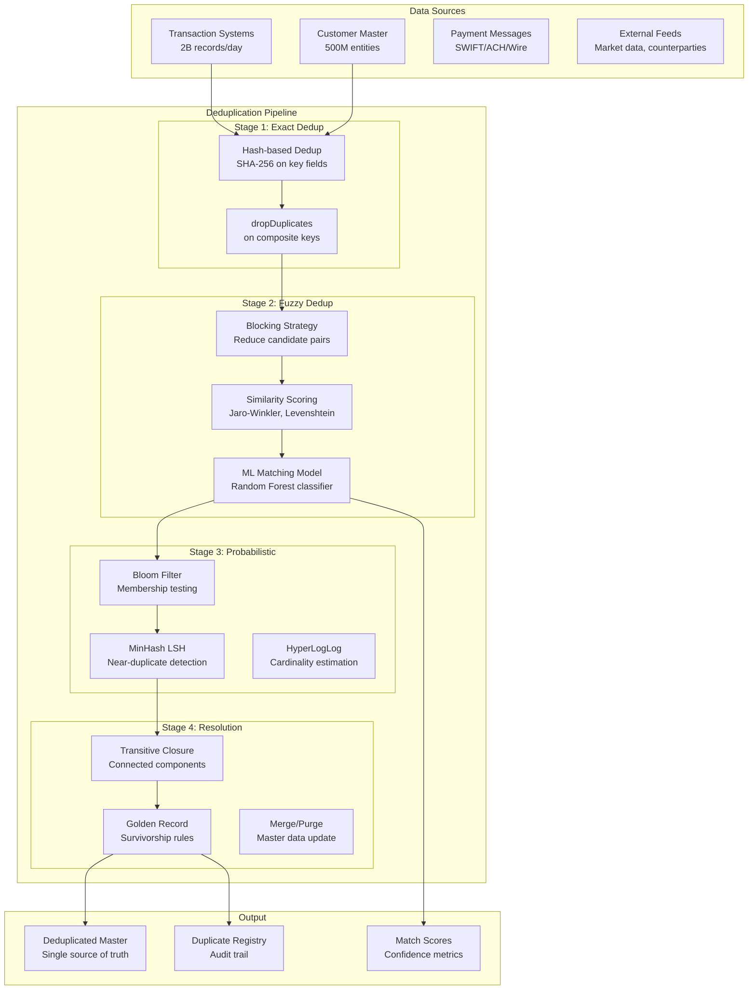
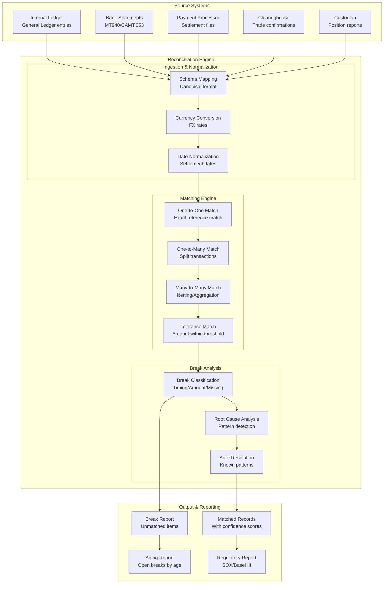
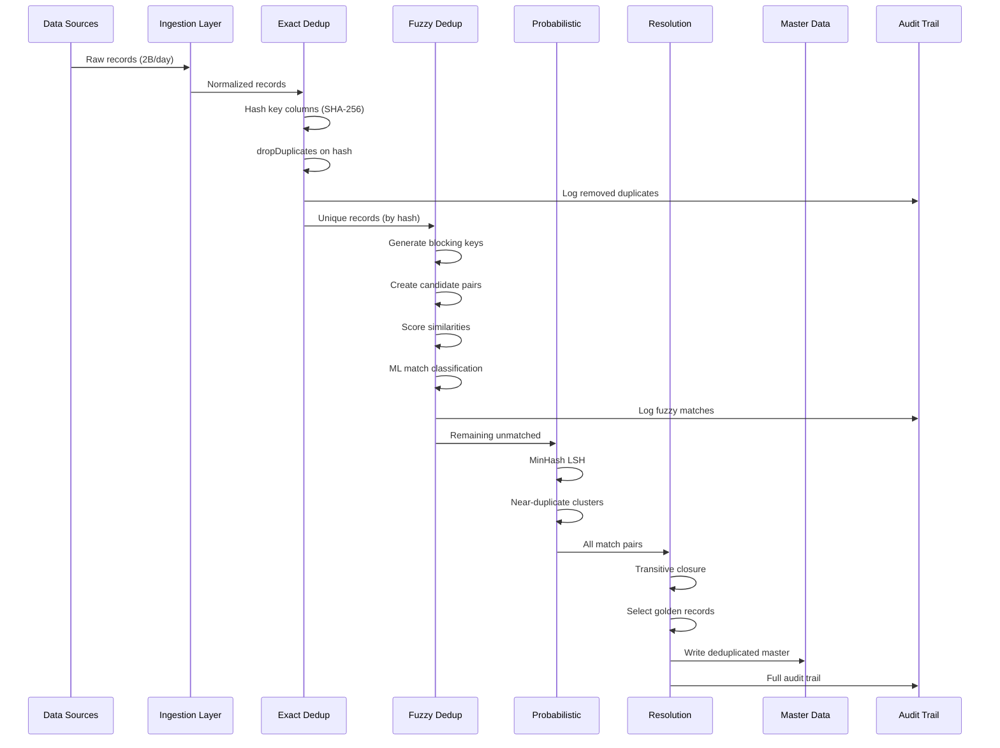
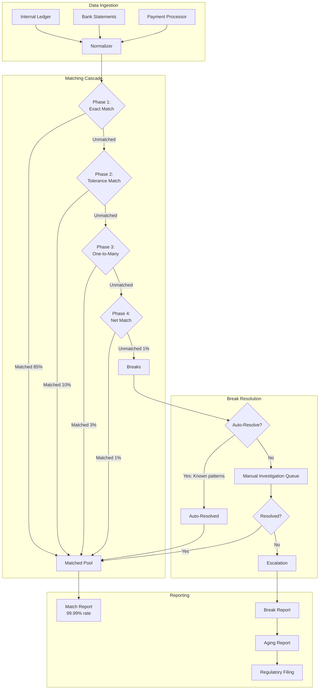
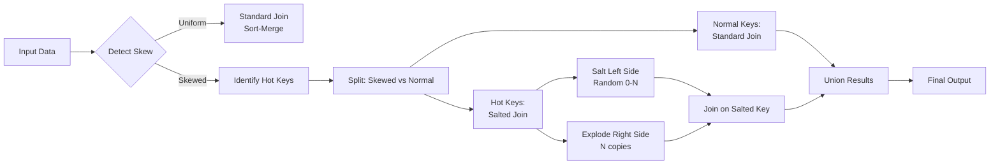

# Data Deduplication & Financial Reconciliation at Billion Scale with Apache Spark

## 1. Problem Statement

Enterprise data systems face massive data quality challenges at scale:

- **10B+ records** across distributed systems requiring deduplication
- **Financial reconciliation** matching transactions across internal ledgers, bank statements, payment processors, and clearinghouses
- **99.99% match rate** requirement — even 0.01% unmatched at billion scale means 100K+ breaks requiring investigation
- **T+1 SLA** — all reconciliation must complete within one business day
- **Multiple match types**: exact matches, fuzzy matches (name variations, typos), probabilistic matches (entity resolution)
- **Data skew**: power-law distributions where top merchants/accounts have 1000x more transactions than average
- **Regulatory requirements**: SOX, Basel III, MiFID II mandate complete reconciliation audit trails

### Scale Requirements

```
Daily transaction volume:     2B+ records
Record sizes:                 10B+ in master tables
Reconciliation pairs:         500M+ daily matches
Match accuracy:               99.99%+ required
Processing window:            < 6 hours (T+1 SLA)
Data sources:                 15+ systems
Fuzzy matching:               50M+ candidate pairs
Cluster size:                 200-500 nodes
```

### Cost of Failure

| Issue | Impact |
|-------|--------|
| Duplicate payments | Direct financial loss ($M+) |
| Missed reconciliation breaks | Regulatory fines, audit failures |
| False positive dedup | Lost transactions, customer impact |
| Slow processing (> T+1) | Regulatory violation |
| Unresolved breaks | Capital reserve requirements increase |

---

## 2. Architecture Diagrams

### Deduplication Pipeline Architecture



### Financial Reconciliation Architecture



---

## 3. Core Spark Concepts

### 3.1 Bloom Filters

```python
from pyspark.sql import SparkSession, Window
from pyspark.sql import functions as F
from pyspark.sql.types import *
from pyspark.ml.feature import MinHashLSH
import hashlib

spark = SparkSession.builder \
    .appName("DeduplicationReconciliation") \
    .config("spark.sql.adaptive.enabled", "true") \
    .config("spark.sql.adaptive.skewJoin.enabled", "true") \
    .config("spark.sql.shuffle.partitions", "2000") \
    .getOrCreate()

# Bloom Filter for fast membership testing
# Use Spark's built-in bloom filter for data skipping
# Write with bloom filter index
transactions_df.write \
    .option("parquet.bloom.filter.enabled#transaction_id", "true") \
    .option("parquet.bloom.filter.expected.ndv#transaction_id", "1000000000") \
    .option("parquet.bloom.filter.fpp#transaction_id", "0.01") \
    .parquet("s3://data/transactions_with_bloom/")

# Custom Bloom Filter implementation for cross-dataset membership
from pybloom_live import ScalableBloomFilter

def build_bloom_filter_udf(existing_ids_rdd, expected_items=1_000_000_000, fp_rate=0.001):
    """Build a Bloom filter from existing IDs for fast lookup."""
    
    bf = ScalableBloomFilter(
        initial_capacity=expected_items,
        error_rate=fp_rate,
        mode=ScalableBloomFilter.LARGE_SET_GROWTH
    )
    
    for id_val in existing_ids_rdd.toLocalIterator():
        bf.add(id_val)
    
    return bf
```

### 3.2 Broadcast vs Sort-Merge Joins

```python
# Broadcast join: when one side fits in memory (< 10GB with tuning)
# Perfect for reference/lookup tables
from pyspark.sql.functions import broadcast

# Force broadcast for dimension tables
matched = large_transactions.join(
    broadcast(reference_codes),  # Small lookup table
    "reference_code",
    "inner"
)

# Sort-Merge Join: default for large-large joins
# Both sides shuffled and sorted on join key
# Optimal when both tables are large and pre-sorted
spark.conf.set("spark.sql.autoBroadcastJoinThreshold", "-1")  # Disable broadcast

recon_result = internal_ledger.join(
    bank_statement,
    ["account_id", "transaction_date", "amount"],
    "full_outer"
)
```

### 3.3 Salting for Skew

```python
def salt_skewed_join(left_df, right_df, join_key, num_salts=100, skewed_keys=None):
    """
    Handle data skew in joins by salting hot keys.
    
    Problem: Key 'MERCHANT_A' has 10M records while average is 1K.
    Solution: Split MERCHANT_A into 100 virtual keys, join separately.
    """
    
    if skewed_keys is None:
        # Auto-detect skewed keys (keys with > 10x average count)
        key_counts = left_df.groupBy(join_key).count()
        avg_count = key_counts.agg(F.avg("count")).first()[0]
        skewed_keys = [row[join_key] for row in 
                      key_counts.filter(F.col("count") > avg_count * 10).collect()]
    
    # Split into skewed and non-skewed
    left_skewed = left_df.filter(F.col(join_key).isin(skewed_keys))
    left_normal = left_df.filter(~F.col(join_key).isin(skewed_keys))
    
    right_skewed = right_df.filter(F.col(join_key).isin(skewed_keys))
    right_normal = right_df.filter(~F.col(join_key).isin(skewed_keys))
    
    # Salt the skewed portion
    # Left: add random salt
    left_salted = left_skewed.withColumn(
        "_salt", (F.rand() * num_salts).cast("int")
    ).withColumn(
        "_salted_key", F.concat(F.col(join_key), F.lit("_"), F.col("_salt"))
    )
    
    # Right: explode with all salt values
    right_exploded = right_skewed.crossJoin(
        spark.range(num_salts).withColumnRenamed("id", "_salt")
    ).withColumn(
        "_salted_key", F.concat(F.col(join_key), F.lit("_"), F.col("_salt"))
    )
    
    # Join skewed data on salted key
    joined_skewed = left_salted.join(right_exploded, "_salted_key") \
        .drop("_salt", "_salted_key")
    
    # Join normal data normally
    joined_normal = left_normal.join(right_normal, join_key)
    
    return joined_skewed.unionByName(joined_normal, allowMissingColumns=True)
```

### 3.4 Custom Partitioners and UDFs

```python
# Levenshtein Distance UDF
@F.udf(IntegerType())
def levenshtein_distance(s1, s2):
    """Compute Levenshtein edit distance between two strings."""
    if s1 is None or s2 is None:
        return None
    
    len1, len2 = len(s1), len(s2)
    dp = list(range(len2 + 1))
    
    for i in range(1, len1 + 1):
        prev = dp[0]
        dp[0] = i
        for j in range(1, len2 + 1):
            temp = dp[j]
            if s1[i-1] == s2[j-1]:
                dp[j] = prev
            else:
                dp[j] = 1 + min(prev, dp[j], dp[j-1])
            prev = temp
    
    return dp[len2]

# Jaro-Winkler Similarity UDF
@F.udf(DoubleType())
def jaro_winkler_similarity(s1, s2):
    """Compute Jaro-Winkler similarity (0 to 1, 1 = identical)."""
    if s1 is None or s2 is None:
        return None
    if s1 == s2:
        return 1.0
    
    len1, len2 = len(s1), len(s2)
    max_dist = max(len1, len2) // 2 - 1
    
    if max_dist < 0:
        return 0.0
    
    s1_matches = [False] * len1
    s2_matches = [False] * len2
    matches = 0
    transpositions = 0
    
    for i in range(len1):
        start = max(0, i - max_dist)
        end = min(len2, i + max_dist + 1)
        
        for j in range(start, end):
            if s2_matches[j] or s1[i] != s2[j]:
                continue
            s1_matches[i] = True
            s2_matches[j] = True
            matches += 1
            break
    
    if matches == 0:
        return 0.0
    
    k = 0
    for i in range(len1):
        if not s1_matches[i]:
            continue
        while not s2_matches[k]:
            k += 1
        if s1[i] != s2[k]:
            transpositions += 1
        k += 1
    
    jaro = (matches/len1 + matches/len2 + (matches - transpositions/2)/matches) / 3
    
    # Winkler modification
    prefix = 0
    for i in range(min(4, min(len1, len2))):
        if s1[i] == s2[i]:
            prefix += 1
        else:
            break
    
    return jaro + prefix * 0.1 * (1 - jaro)

# Soundex UDF for phonetic matching
@F.udf(StringType())
def soundex_code(name):
    """Generate Soundex code for phonetic matching."""
    if name is None or len(name) == 0:
        return None
    
    name = name.upper()
    soundex = name[0]
    
    mapping = {
        'B': '1', 'F': '1', 'P': '1', 'V': '1',
        'C': '2', 'G': '2', 'J': '2', 'K': '2', 'Q': '2', 'S': '2', 'X': '2', 'Z': '2',
        'D': '3', 'T': '3',
        'L': '4',
        'M': '5', 'N': '5',
        'R': '6'
    }
    
    prev = mapping.get(name[0], '0')
    for char in name[1:]:
        code = mapping.get(char, '0')
        if code != '0' and code != prev:
            soundex += code
            if len(soundex) == 4:
                break
        prev = code
    
    return soundex.ljust(4, '0')
```

### 3.5 Window Functions for Reconciliation

```python
# Identify duplicate sequences using window functions
w = Window.partitionBy("account_id", "amount", "transaction_date") \
    .orderBy("processing_timestamp")

# Mark potential duplicates
dedup_df = transactions_df.withColumn(
    "duplicate_rank", F.row_number().over(w)
).withColumn(
    "is_potential_dup", F.when(F.col("duplicate_rank") > 1, True).otherwise(False)
).withColumn(
    "time_since_prev",
    F.col("processing_timestamp").cast("long") - 
    F.lag("processing_timestamp").over(w).cast("long")
).withColumn(
    "is_likely_dup",
    F.when(
        (F.col("duplicate_rank") > 1) & 
        (F.col("time_since_prev") < 300),  # < 5 minutes apart
        True
    ).otherwise(False)
)
```

### 3.6 Checkpointing

```python
# Checkpointing breaks lineage for iterative algorithms
spark.sparkContext.setCheckpointDir("s3://checkpoints/dedup/")

# Use after expensive operations to prevent recomputation
def iterative_dedup(df, max_iterations=10):
    """Iterative deduplication with checkpoint to prevent lineage explosion."""
    
    current = df
    for iteration in range(max_iterations):
        # Find new matches
        new_matches = find_matches(current)
        
        # Update clusters
        current = update_clusters(current, new_matches)
        
        # Checkpoint every 3 iterations to break lineage
        if iteration % 3 == 0:
            current = current.checkpoint()
        
        # Check convergence
        if new_matches.count() == 0:
            break
    
    return current
```

---

## 4. Exact Deduplication

### 4.1 Hash-Based Deduplication

```python
class ExactDeduplicator:
    """Exact deduplication using cryptographic hashing."""
    
    def __init__(self, spark: SparkSession):
        self.spark = spark
    
    def hash_dedup(self, df, key_columns: list, keep="first"):
        """
        Deduplicate using SHA-256 hash of key columns.
        
        Args:
            df: Input DataFrame
            key_columns: Columns that define uniqueness
            keep: 'first' or 'last' (by timestamp)
        """
        
        # Create composite hash key
        deduped = df.withColumn(
            "_dedup_hash",
            F.sha2(F.concat_ws("|", *[F.coalesce(F.col(c).cast("string"), F.lit("NULL")) 
                                       for c in key_columns]), 256)
        )
        
        if keep == "first":
            w = Window.partitionBy("_dedup_hash").orderBy("processing_timestamp")
        else:
            w = Window.partitionBy("_dedup_hash").orderBy(F.col("processing_timestamp").desc())
        
        deduped = deduped.withColumn("_rank", F.row_number().over(w)) \
            .filter(F.col("_rank") == 1) \
            .drop("_rank", "_dedup_hash")
        
        return deduped
    
    def drop_duplicates_at_scale(self, df, subset_cols: list, partition_col: str = None):
        """
        Scalable dropDuplicates with partition-level dedup first.
        
        Strategy:
        1. Dedup within each partition (cheap, no shuffle)
        2. Then global dedup (expensive, requires shuffle)
        """
        
        if partition_col:
            # Two-phase dedup: local then global
            # Phase 1: Dedup within partitions (no shuffle)
            locally_deduped = df.repartition(2000, partition_col) \
                .mapInPandas(self._local_dedup_fn(subset_cols), df.schema)
            
            # Phase 2: Global dedup (shuffle on dedup keys)
            globally_deduped = locally_deduped.dropDuplicates(subset_cols)
            return globally_deduped
        else:
            return df.dropDuplicates(subset_cols)
    
    def incremental_dedup(self, new_data_df, existing_hashes_df):
        """
        Incremental dedup: only process new records against existing hash index.
        Much faster than full re-dedup for append-only sources.
        """
        
        # Hash new records
        new_with_hash = new_data_df.withColumn(
            "record_hash",
            F.sha2(F.concat_ws("|", *[F.col(c).cast("string") for c in new_data_df.columns]), 256)
        )
        
        # Anti-join against existing hashes (only keep truly new records)
        new_records = new_with_hash.join(
            existing_hashes_df,
            "record_hash",
            "left_anti"
        )
        
        # Update hash index
        new_hashes = new_records.select("record_hash", F.current_timestamp().alias("first_seen"))
        updated_hashes = existing_hashes_df.union(new_hashes)
        
        return new_records.drop("record_hash"), updated_hashes
    
    def dedup_with_audit(self, df, key_columns: list):
        """Dedup with full audit trail of what was removed and why."""
        
        hash_col = F.sha2(F.concat_ws("|", *[F.col(c).cast("string") for c in key_columns]), 256)
        
        df_with_hash = df.withColumn("_dedup_hash", hash_col)
        
        # Count duplicates per hash
        dup_counts = df_with_hash.groupBy("_dedup_hash").agg(
            F.count("*").alias("duplicate_count"),
            F.collect_list("record_id").alias("duplicate_record_ids")
        ).filter(F.col("duplicate_count") > 1)
        
        # Keep first occurrence
        w = Window.partitionBy("_dedup_hash").orderBy("processing_timestamp")
        deduped = df_with_hash.withColumn("_rank", F.row_number().over(w))
        
        # Audit: records that were removed
        removed = deduped.filter(F.col("_rank") > 1) \
            .withColumn("removal_reason", F.lit("EXACT_DUPLICATE")) \
            .withColumn("removal_timestamp", F.current_timestamp())
        
        # Clean result
        kept = deduped.filter(F.col("_rank") == 1).drop("_rank", "_dedup_hash")
        
        return kept, removed, dup_counts
```

---

## 5. Fuzzy Deduplication / Entity Resolution

### 5.1 Blocking Strategy

```python
class FuzzyDeduplicator:
    """
    Fuzzy deduplication using blocking + similarity scoring.
    
    Without blocking: N^2 comparisons = 10B^2 = impossible
    With blocking: Reduce to manageable candidate pairs
    """
    
    def __init__(self, spark: SparkSession):
        self.spark = spark
    
    def generate_blocking_keys(self, df, entity_type="person"):
        """
        Generate multiple blocking keys to ensure recall.
        
        Blocking reduces O(N^2) to O(N * block_size).
        Use multiple blocking schemes for high recall.
        """
        
        if entity_type == "person":
            # Multiple blocking keys for person entities
            blocked = df.withColumn(
                "block_key_1",
                # First 3 chars of last name + zip code
                F.concat(F.substring(F.upper("last_name"), 1, 3), F.col("zip_code"))
            ).withColumn(
                "block_key_2",
                # Soundex of last name + birth year
                soundex_code(F.col("last_name"))
            ).withColumn(
                "block_key_3",
                # First 3 chars of first name + last 4 of SSN (if available)
                F.concat(F.substring(F.upper("first_name"), 1, 3), 
                        F.coalesce(F.substring("ssn_last4", 1, 4), F.lit("XXXX")))
            ).withColumn(
                "block_key_4",
                # Phone number last 4 digits
                F.substring(F.regexp_replace("phone", "[^0-9]", ""), -4, 4)
            )
        
        elif entity_type == "company":
            blocked = df.withColumn(
                "block_key_1",
                # First 5 chars of normalized company name
                F.substring(F.upper(F.regexp_replace("company_name", "[^A-Z0-9]", "")), 1, 5)
            ).withColumn(
                "block_key_2",
                # Tax ID prefix
                F.substring("tax_id", 1, 5)
            ).withColumn(
                "block_key_3",
                # City + State
                F.concat(F.upper(F.substring("city", 1, 3)), F.upper("state"))
            )
        
        return blocked
    
    def generate_candidate_pairs(self, df, blocking_keys: list):
        """
        Generate candidate pairs from blocking keys.
        Union pairs from all blocking schemes for high recall.
        """
        
        all_pairs = None
        
        for block_key in blocking_keys:
            # Self-join within blocks
            left = df.select(
                F.col("record_id").alias("id_left"),
                F.col(block_key).alias("_block"),
                *[F.col(c).alias(f"{c}_left") for c in df.columns if c != "record_id" and c != block_key]
            )
            
            right = df.select(
                F.col("record_id").alias("id_right"),
                F.col(block_key).alias("_block"),
                *[F.col(c).alias(f"{c}_right") for c in df.columns if c != "record_id" and c != block_key]
            )
            
            # Join within blocks, avoid self-matches and duplicate pairs
            pairs = left.join(right, "_block") \
                .filter(F.col("id_left") < F.col("id_right")) \
                .drop("_block")
            
            if all_pairs is None:
                all_pairs = pairs
            else:
                all_pairs = all_pairs.union(pairs)
        
        # Deduplicate candidate pairs
        return all_pairs.dropDuplicates(["id_left", "id_right"])
    
    def compute_similarity_scores(self, candidate_pairs):
        """Compute multiple similarity metrics for candidate pairs."""
        
        scored = candidate_pairs.withColumn(
            "name_jaro_winkler",
            jaro_winkler_similarity(F.col("full_name_left"), F.col("full_name_right"))
        ).withColumn(
            "name_levenshtein",
            1.0 - (levenshtein_distance(F.col("full_name_left"), F.col("full_name_right")).cast("double") /
                   F.greatest(F.length("full_name_left"), F.length("full_name_right")).cast("double"))
        ).withColumn(
            "address_similarity",
            jaro_winkler_similarity(
                F.lower(F.col("address_left")),
                F.lower(F.col("address_right"))
            )
        ).withColumn(
            "phone_match",
            F.when(
                F.col("phone_left") == F.col("phone_right"), 1.0
            ).when(
                F.substring(F.col("phone_left"), -7, 7) == F.substring(F.col("phone_right"), -7, 7), 0.8
            ).otherwise(0.0)
        ).withColumn(
            "email_match",
            F.when(F.col("email_left") == F.col("email_right"), 1.0)
            .when(
                F.split(F.col("email_left"), "@")[1] == F.split(F.col("email_right"), "@")[1],
                0.3  # Same domain only
            ).otherwise(0.0)
        ).withColumn(
            "dob_match",
            F.when(F.col("date_of_birth_left") == F.col("date_of_birth_right"), 1.0)
            .when(  # Transposed month/day
                F.concat(F.month("date_of_birth_left"), F.dayofmonth("date_of_birth_left")) ==
                F.concat(F.dayofmonth("date_of_birth_right"), F.month("date_of_birth_right")),
                0.7
            ).otherwise(0.0)
        )
        
        # Composite similarity score (weighted average)
        scored = scored.withColumn(
            "composite_score",
            F.col("name_jaro_winkler") * 0.35 +
            F.col("address_similarity") * 0.20 +
            F.col("phone_match") * 0.20 +
            F.col("email_match") * 0.15 +
            F.col("dob_match") * 0.10
        )
        
        return scored
    
    def ml_matching_model(self, scored_pairs, labeled_pairs=None):
        """
        Train/apply ML model for match classification.
        Uses labeled pairs for supervised learning or threshold-based rules.
        """
        
        from pyspark.ml.classification import RandomForestClassifier, GBTClassifier
        from pyspark.ml.feature import VectorAssembler
        from pyspark.ml.evaluation import BinaryClassificationEvaluator
        
        feature_cols = [
            "name_jaro_winkler", "name_levenshtein", "address_similarity",
            "phone_match", "email_match", "dob_match"
        ]
        
        assembler = VectorAssembler(inputCols=feature_cols, outputCol="features")
        
        if labeled_pairs is not None:
            # Supervised: Train on labeled data
            assembled = assembler.transform(labeled_pairs)
            train, test = assembled.randomSplit([0.8, 0.2], seed=42)
            
            rf = RandomForestClassifier(
                labelCol="is_match",
                featuresCol="features",
                numTrees=100,
                maxDepth=10,
                featureSubsetStrategy="sqrt"
            )
            
            model = rf.fit(train)
            
            # Evaluate
            predictions = model.transform(test)
            evaluator = BinaryClassificationEvaluator(labelCol="is_match")
            auc = evaluator.evaluate(predictions)
            print(f"Match model AUC: {auc:.4f}")
            
            # Apply to all candidate pairs
            return model.transform(assembler.transform(scored_pairs))
        else:
            # Unsupervised: Use threshold rules
            return scored_pairs.withColumn(
                "is_match",
                F.when(F.col("composite_score") >= 0.85, 1)
                .when(F.col("composite_score") >= 0.65, -1)  # Review needed
                .otherwise(0)
            )
    
    def transitive_closure(self, matches_df, id_left_col="id_left", id_right_col="id_right"):
        """
        Compute transitive closure to find all connected duplicates.
        
        If A matches B and B matches C, then A, B, C are all the same entity.
        Uses iterative connected components algorithm.
        """
        
        from graphframes import GraphFrame
        
        # Create graph
        vertices = matches_df.select(F.col(id_left_col).alias("id")) \
            .union(matches_df.select(F.col(id_right_col).alias("id"))) \
            .distinct()
        
        edges = matches_df.select(
            F.col(id_left_col).alias("src"),
            F.col(id_right_col).alias("dst")
        )
        
        graph = GraphFrame(vertices, edges)
        
        # Connected components
        components = graph.connectedComponents()
        
        # Each component = one entity cluster
        cluster_sizes = components.groupBy("component").agg(
            F.count("*").alias("cluster_size"),
            F.collect_list("id").alias("member_ids")
        )
        
        return components, cluster_sizes
    
    def select_golden_record(self, cluster_df, source_priority: dict):
        """
        Select the best record from each duplicate cluster (survivorship rules).
        
        Rules:
        1. Prefer higher-priority sources
        2. Prefer most complete records (fewest nulls)
        3. Prefer most recent records
        """
        
        # Score each record within its cluster
        w = Window.partitionBy("component")
        
        golden = cluster_df.withColumn(
            "source_priority_score",
            F.coalesce(
                *[F.when(F.col("source") == src, F.lit(priority)) 
                  for src, priority in source_priority.items()],
                F.lit(0)
            )
        ).withColumn(
            "completeness_score",
            sum([F.when(F.col(c).isNotNull(), 1).otherwise(0) 
                 for c in cluster_df.columns]) / len(cluster_df.columns)
        ).withColumn(
            "recency_score",
            F.col("last_updated").cast("long")
        )
        
        # Rank within cluster
        rank_w = Window.partitionBy("component").orderBy(
            F.col("source_priority_score").desc(),
            F.col("completeness_score").desc(),
            F.col("recency_score").desc()
        )
        
        golden = golden.withColumn("_rank", F.row_number().over(rank_w)) \
            .filter(F.col("_rank") == 1) \
            .drop("_rank", "source_priority_score", "completeness_score", "recency_score")
        
        return golden
```

---

## 6. Probabilistic Deduplication

### 6.1 Bloom Filter in Spark

```python
class ProbabilisticDedup:
    """Probabilistic data structures for approximate deduplication."""
    
    def __init__(self, spark: SparkSession):
        self.spark = spark
    
    def bloom_filter_dedup(self, new_df, existing_df, key_col, fp_rate=0.001):
        """
        Use Bloom filter for fast approximate dedup.
        
        False positives: May incorrectly flag a unique record as duplicate
        False negatives: NEVER misses a true duplicate
        
        Use case: First-pass filter to reduce expensive exact checks.
        """
        
        # Build Bloom filter from existing records
        # Collect existing keys (if fits in driver memory)
        # For very large sets, use distributed Bloom filter
        
        # Approach 1: Spark's built-in bloom filter (column statistics)
        existing_keys = existing_df.select(key_col).distinct()
        
        # Use broadcast variable for the filter
        existing_set = set(row[0] for row in existing_keys.collect())
        bloom_broadcast = self.spark.sparkContext.broadcast(existing_set)
        
        @F.udf(BooleanType())
        def is_potential_dup(key):
            return key in bloom_broadcast.value
        
        # Filter: keep only records NOT in bloom filter
        new_records = new_df.withColumn("_maybe_dup", is_potential_dup(F.col(key_col))) \
            .filter(~F.col("_maybe_dup")) \
            .drop("_maybe_dup")
        
        return new_records
    
    def minhash_lsh_dedup(self, df, text_col, threshold=0.7, num_hash_tables=5):
        """
        MinHash LSH for near-duplicate text detection.
        
        Approximates Jaccard similarity efficiently.
        Use case: Finding near-duplicate documents, descriptions, addresses.
        """
        
        from pyspark.ml.feature import HashingTF, MinHashLSH, Tokenizer
        
        # Tokenize text into shingles
        tokenizer = Tokenizer(inputCol=text_col, outputCol="tokens")
        tokenized = tokenizer.transform(df)
        
        # Convert to feature vectors
        hashing_tf = HashingTF(inputCol="tokens", outputCol="features", numFeatures=10000)
        featurized = hashing_tf.transform(tokenized)
        
        # MinHash LSH
        mh = MinHashLSH(
            inputCol="features",
            outputCol="hashes",
            numHashTables=num_hash_tables
        )
        model = mh.fit(featurized)
        
        # Find similar pairs
        similar_pairs = model.approxSimilarityJoin(
            featurized, featurized, threshold=1.0 - threshold, distCol="jaccard_distance"
        ).filter(F.col("datasetA.record_id") < F.col("datasetB.record_id"))
        
        return similar_pairs.select(
            F.col("datasetA.record_id").alias("id_left"),
            F.col("datasetB.record_id").alias("id_right"),
            (1.0 - F.col("jaccard_distance")).alias("jaccard_similarity")
        )
    
    def hyperloglog_cardinality(self, df, key_col, group_col=None):
        """
        HyperLogLog for approximate distinct count.
        
        Use case: Estimate number of unique entities without expensive exact count.
        Useful for capacity planning and monitoring.
        """
        
        if group_col:
            return df.groupBy(group_col).agg(
                F.approx_count_distinct(key_col, rsd=0.01).alias("approx_distinct_count")
            )
        else:
            return df.agg(
                F.approx_count_distinct(key_col, rsd=0.01).alias("approx_distinct_count")
            )
```

---

## 7. Financial Reconciliation

### 7.1 Three-Way Matching

```python
class FinancialReconciliationEngine:
    """
    Production financial reconciliation engine.
    
    Supports:
    - One-to-one matching (exact reference)
    - One-to-many matching (split transactions)
    - Many-to-many matching (netting)
    - Tolerance-based matching (rounding differences)
    """
    
    def __init__(self, spark: SparkSession, config: dict):
        self.spark = spark
        self.config = config
        self.tolerance_amount = config.get("tolerance_amount", 0.01)
        self.tolerance_pct = config.get("tolerance_pct", 0.001)
    
    def normalize_sources(self, source_dfs: dict):
        """Normalize all sources to canonical schema."""
        
        canonical_schema = StructType([
            StructField("recon_id", StringType()),
            StructField("source_system", StringType()),
            StructField("transaction_ref", StringType()),
            StructField("account_id", StringType()),
            StructField("counterparty", StringType()),
            StructField("amount", DoubleType()),
            StructField("currency", StringType()),
            StructField("transaction_date", DateType()),
            StructField("settlement_date", DateType()),
            StructField("transaction_type", StringType()),
            StructField("description", StringType()),
            StructField("raw_record", StringType()),
        ])
        
        normalized = {}
        for source_name, df in source_dfs.items():
            mapping = self.config["source_mappings"][source_name]
            
            mapped = df.select(
                F.monotonically_increasing_id().cast("string").alias("recon_id"),
                F.lit(source_name).alias("source_system"),
                F.col(mapping["ref_col"]).alias("transaction_ref"),
                F.col(mapping["account_col"]).alias("account_id"),
                F.col(mapping.get("counterparty_col", "counterparty")).alias("counterparty"),
                F.col(mapping["amount_col"]).cast("double").alias("amount"),
                F.col(mapping.get("currency_col", "currency")).alias("currency"),
                F.col(mapping["date_col"]).cast("date").alias("transaction_date"),
                F.col(mapping.get("settlement_col", mapping["date_col"])).cast("date").alias("settlement_date"),
                F.col(mapping.get("type_col", "transaction_type")).alias("transaction_type"),
                F.col(mapping.get("desc_col", "description")).alias("description"),
                F.to_json(F.struct("*")).alias("raw_record"),
            )
            
            normalized[source_name] = mapped
        
        return normalized
    
    def exact_match(self, source_a, source_b, match_keys: list):
        """
        Phase 1: Exact matching on reference numbers.
        Typically matches 85-95% of records.
        """
        
        matched = source_a.alias("a").join(
            source_b.alias("b"),
            [F.col(f"a.{k}") == F.col(f"b.{k}") for k in match_keys],
            "inner"
        ).withColumn(
            "match_type", F.lit("EXACT")
        ).withColumn(
            "match_confidence", F.lit(1.0)
        ).withColumn(
            "amount_difference", F.abs(F.col("a.amount") - F.col("b.amount"))
        )
        
        # Get unmatched from both sides
        unmatched_a = source_a.join(
            matched.select(F.col("a.recon_id").alias("recon_id")),
            "recon_id", "left_anti"
        )
        unmatched_b = source_b.join(
            matched.select(F.col("b.recon_id").alias("recon_id")),
            "recon_id", "left_anti"
        )
        
        return matched, unmatched_a, unmatched_b
    
    def tolerance_match(self, source_a, source_b, amount_tolerance=0.01, date_tolerance_days=2):
        """
        Phase 2: Match with tolerance for rounding and timing differences.
        """
        
        matched = source_a.alias("a").join(
            source_b.alias("b"),
            [
                F.col("a.account_id") == F.col("b.account_id"),
                F.abs(F.col("a.amount") - F.col("b.amount")) <= amount_tolerance,
                F.abs(F.datediff(F.col("a.transaction_date"), F.col("b.transaction_date"))) <= date_tolerance_days,
                F.col("a.currency") == F.col("b.currency")
            ],
            "inner"
        )
        
        # If multiple matches, keep the closest
        w = Window.partitionBy("a.recon_id").orderBy(
            F.abs(F.col("a.amount") - F.col("b.amount")),
            F.abs(F.datediff(F.col("a.transaction_date"), F.col("b.transaction_date")))
        )
        
        best_match = matched.withColumn("_rank", F.row_number().over(w)) \
            .filter(F.col("_rank") == 1) \
            .drop("_rank") \
            .withColumn("match_type", F.lit("TOLERANCE")) \
            .withColumn("match_confidence", 
                       1.0 - F.abs(F.col("a.amount") - F.col("b.amount")) / (F.abs(F.col("a.amount")) + 1e-8))
        
        return best_match
    
    def one_to_many_match(self, source_a, source_b, group_keys=["account_id", "transaction_date"]):
        """
        Phase 3: Match one record to multiple (split transactions).
        A single payment of $1000 may settle as three entries of $500, $300, $200.
        """
        
        # For each unmatched record in source_a, find groups in source_b that sum to same amount
        # Group source_b by account and date
        grouped_b = source_b.groupBy(*group_keys).agg(
            F.sum("amount").alias("group_total"),
            F.count("*").alias("group_count"),
            F.collect_list("recon_id").alias("matched_ids")
        )
        
        # Match: source_a amount == group total in source_b
        matched = source_a.join(
            grouped_b,
            group_keys + [F.abs(source_a["amount"] - grouped_b["group_total"]) <= self.tolerance_amount],
            "inner"
        ).withColumn("match_type", F.lit("ONE_TO_MANY")) \
         .withColumn("match_confidence", F.lit(0.9))
        
        return matched
    
    def many_to_many_match(self, source_a, source_b, group_keys=["account_id"], date_window_days=3):
        """
        Phase 4: Net matching — groups on both sides should have same total.
        Common for batch settlements.
        """
        
        # Group both sides by account within date window
        grouped_a = source_a.groupBy("account_id", "settlement_date").agg(
            F.sum("amount").alias("total_a"),
            F.count("*").alias("count_a"),
            F.collect_list("recon_id").alias("ids_a")
        )
        
        grouped_b = source_b.groupBy("account_id", "settlement_date").agg(
            F.sum("amount").alias("total_b"),
            F.count("*").alias("count_b"),
            F.collect_list("recon_id").alias("ids_b")
        )
        
        # Match groups with same total (within tolerance)
        net_matched = grouped_a.join(
            grouped_b,
            [
                grouped_a["account_id"] == grouped_b["account_id"],
                F.abs(grouped_a["total_a"] - grouped_b["total_b"]) <= self.tolerance_amount,
                F.abs(F.datediff(grouped_a["settlement_date"], grouped_b["settlement_date"])) <= date_window_days
            ]
        ).withColumn("match_type", F.lit("MANY_TO_MANY")) \
         .withColumn("net_difference", F.col("total_a") - F.col("total_b"))
        
        return net_matched
    
    def classify_breaks(self, unmatched_a, unmatched_b):
        """
        Classify reconciliation breaks for investigation.
        """
        
        # Timing breaks: record exists in one system with future date
        timing_breaks_a = unmatched_a.filter(
            F.col("settlement_date") > F.current_date()
        ).withColumn("break_type", F.lit("TIMING_A_AHEAD"))
        
        # Amount breaks: potential matches with amount differences
        potential_amount_breaks = unmatched_a.alias("a").join(
            unmatched_b.alias("b"),
            [
                F.col("a.account_id") == F.col("b.account_id"),
                F.col("a.transaction_date") == F.col("b.transaction_date"),
                F.abs(F.col("a.amount") - F.col("b.amount")) > self.tolerance_amount,
                F.abs(F.col("a.amount") - F.col("b.amount")) / F.abs(F.col("a.amount")) < 0.1
            ]
        ).withColumn("break_type", F.lit("AMOUNT_DIFFERENCE")) \
         .withColumn("difference", F.col("a.amount") - F.col("b.amount"))
        
        # Missing: no potential match at all
        missing_a = unmatched_a.join(
            potential_amount_breaks.select(F.col("a.recon_id").alias("recon_id")),
            "recon_id", "left_anti"
        ).join(
            timing_breaks_a.select("recon_id"),
            "recon_id", "left_anti"
        ).withColumn("break_type", F.lit("MISSING_IN_B"))
        
        return timing_breaks_a.unionByName(
            potential_amount_breaks.select("a.*", "break_type", "difference"),
            allowMissingColumns=True
        ).unionByName(missing_a, allowMissingColumns=True)
    
    def auto_resolve_breaks(self, breaks_df):
        """
        Auto-resolve known break patterns.
        
        Known patterns:
        - FX rounding (< $0.01)
        - T+1/T+2 timing differences
        - Fee adjustments
        - Known system delays
        """
        
        resolved = breaks_df.withColumn(
            "auto_resolution",
            F.when(
                (F.col("break_type") == "AMOUNT_DIFFERENCE") & 
                (F.abs(F.col("difference")) < 0.01),
                "RESOLVED_FX_ROUNDING"
            ).when(
                (F.col("break_type") == "TIMING_A_AHEAD") &
                (F.datediff(F.col("settlement_date"), F.current_date()) <= 2),
                "RESOLVED_TIMING_T2"
            ).when(
                (F.col("break_type") == "AMOUNT_DIFFERENCE") &
                F.col("description").contains("FEE"),
                "RESOLVED_FEE_ADJUSTMENT"
            ).otherwise(F.lit(None))
        )
        
        auto_resolved = resolved.filter(F.col("auto_resolution").isNotNull())
        still_open = resolved.filter(F.col("auto_resolution").isNull())
        
        return auto_resolved, still_open
    
    def run_full_reconciliation(self, source_dfs: dict):
        """Execute complete reconciliation pipeline."""
        
        # Normalize
        normalized = self.normalize_sources(source_dfs)
        
        source_a = normalized["internal_ledger"]
        source_b = normalized["bank_statement"]
        
        # Phase 1: Exact match
        exact_matched, unmatch_a, unmatch_b = self.exact_match(
            source_a, source_b, ["transaction_ref"]
        )
        print(f"Phase 1 (Exact): {exact_matched.count()} matched")
        
        # Phase 2: Tolerance match
        tol_matched = self.tolerance_match(unmatch_a, unmatch_b)
        unmatch_a = unmatch_a.join(tol_matched.select("a.recon_id"), "recon_id", "left_anti")
        unmatch_b = unmatch_b.join(tol_matched.select("b.recon_id"), "recon_id", "left_anti")
        print(f"Phase 2 (Tolerance): {tol_matched.count()} matched")
        
        # Phase 3: One-to-many
        otm_matched = self.one_to_many_match(unmatch_a, unmatch_b)
        print(f"Phase 3 (One-to-Many): {otm_matched.count()} matched")
        
        # Phase 4: Many-to-many
        mtm_matched = self.many_to_many_match(unmatch_a, unmatch_b)
        print(f"Phase 4 (Many-to-Many): {mtm_matched.count()} matched")
        
        # Classify breaks
        breaks = self.classify_breaks(unmatch_a, unmatch_b)
        
        # Auto-resolve
        auto_resolved, open_breaks = self.auto_resolve_breaks(breaks)
        print(f"Auto-resolved: {auto_resolved.count()}")
        print(f"Open breaks: {open_breaks.count()}")
        
        # Calculate match rate
        total = source_a.count()
        matched_total = exact_matched.count() + tol_matched.count() + otm_matched.count()
        match_rate = matched_total / total
        print(f"\nOverall match rate: {match_rate*100:.4f}%")
        
        return {
            "exact_matched": exact_matched,
            "tolerance_matched": tol_matched,
            "one_to_many": otm_matched,
            "many_to_many": mtm_matched,
            "auto_resolved": auto_resolved,
            "open_breaks": open_breaks,
            "match_rate": match_rate
        }
```

---

## 8. Data Skew Handling

### 8.1 Adaptive Skew Join

```python
class SkewHandler:
    """Handle data skew in join and aggregation operations."""
    
    def __init__(self, spark: SparkSession):
        self.spark = spark
    
    def detect_skew(self, df, key_col, threshold_factor=10):
        """Detect skewed keys that have disproportionate record counts."""
        
        key_counts = df.groupBy(key_col).count()
        stats = key_counts.agg(
            F.avg("count").alias("avg_count"),
            F.stddev("count").alias("std_count"),
            F.max("count").alias("max_count"),
            F.percentile_approx("count", 0.99).alias("p99_count")
        ).first()
        
        skew_threshold = stats["avg_count"] * threshold_factor
        
        skewed_keys = key_counts.filter(F.col("count") > skew_threshold) \
            .orderBy(F.col("count").desc())
        
        print(f"Average records per key: {stats['avg_count']:.0f}")
        print(f"Max records per key: {stats['max_count']}")
        print(f"P99 records per key: {stats['p99_count']}")
        print(f"Skew threshold: {skew_threshold:.0f}")
        print(f"Number of skewed keys: {skewed_keys.count()}")
        
        return skewed_keys
    
    def adaptive_salted_join(self, left_df, right_df, join_key, auto_detect=True):
        """
        Automatically detect and handle skew with salting.
        
        For non-skewed keys: Normal join (efficient)
        For skewed keys: Salted join (distributes work)
        """
        
        if auto_detect:
            skewed_keys_df = self.detect_skew(left_df, join_key)
            skewed_keys = [row[join_key] for row in skewed_keys_df.limit(1000).collect()]
        
        if not skewed_keys:
            return left_df.join(right_df, join_key)
        
        num_salts = 50
        
        # Separate skewed and non-skewed
        left_skewed = left_df.filter(F.col(join_key).isin(skewed_keys))
        left_normal = left_df.filter(~F.col(join_key).isin(skewed_keys))
        right_skewed = right_df.filter(F.col(join_key).isin(skewed_keys))
        right_normal = right_df.filter(~F.col(join_key).isin(skewed_keys))
        
        # Normal join for non-skewed
        joined_normal = left_normal.join(right_normal, join_key)
        
        # Salted join for skewed
        left_salted = left_skewed.withColumn(
            "_salt", (F.rand() * num_salts).cast("int")
        )
        
        right_exploded = right_skewed.crossJoin(
            self.spark.range(num_salts).withColumnRenamed("id", "_salt")
        )
        
        joined_skewed = left_salted.join(
            right_exploded,
            [join_key, "_salt"]
        ).drop("_salt")
        
        return joined_normal.unionByName(joined_skewed, allowMissingColumns=True)
    
    def repartition_for_skew(self, df, key_col, target_partition_size_mb=256):
        """
        Custom repartitioning that handles skew by splitting hot partitions.
        """
        
        # Add a sub-partition key for hot keys
        key_counts = df.groupBy(key_col).count()
        avg_count = key_counts.agg(F.avg("count")).first()[0]
        
        hot_keys = key_counts.filter(F.col("count") > avg_count * 10) \
            .select(key_col, "count")
        
        # For hot keys, add salt; for others, use key directly
        df_with_partition = df.join(broadcast(hot_keys), key_col, "left").withColumn(
            "_partition_key",
            F.when(
                F.col("count").isNotNull(),  # Hot key
                F.concat(F.col(key_col), F.lit("_"), (F.rand() * 20).cast("int").cast("string"))
            ).otherwise(F.col(key_col))
        )
        
        return df_with_partition.repartition(2000, "_partition_key").drop("_partition_key", "count")
```

---

## 9. Full Production Pipeline

```python
class ProductionDeduplicationReconciliationPipeline:
    """
    End-to-end production pipeline for deduplication and reconciliation.
    
    SLA: T+1 (complete within 6 hours of data availability)
    Scale: 2B+ records/day, 10B+ master records
    Accuracy: 99.99% match rate
    """
    
    def __init__(self, spark: SparkSession, config: dict):
        self.spark = spark
        self.config = config
        self.exact_dedup = ExactDeduplicator(spark)
        self.fuzzy_dedup = FuzzyDeduplicator(spark)
        self.prob_dedup = ProbabilisticDedup(spark)
        self.recon_engine = FinancialReconciliationEngine(spark, config)
        self.skew_handler = SkewHandler(spark)
    
    def run_dedup_pipeline(self, execution_date: str):
        """Run complete deduplication pipeline."""
        
        print(f"{'='*60}")
        print(f"Deduplication Pipeline: {execution_date}")
        print(f"{'='*60}")
        
        # Load data
        raw_data = self.spark.read.table("raw.transactions") \
            .filter(F.col("dt") == execution_date)
        
        total_records = raw_data.count()
        print(f"Input records: {total_records:,}")
        
        # Phase 1: Exact dedup
        print("\n[Phase 1] Exact Deduplication...")
        exact_deduped, removed_exact, dup_stats = self.exact_dedup.dedup_with_audit(
            raw_data,
            key_columns=["transaction_ref", "amount", "account_id", "transaction_date"]
        )
        print(f"  Removed: {removed_exact.count():,} exact duplicates")
        
        # Phase 2: Near-duplicate detection (fuzzy)
        print("\n[Phase 2] Fuzzy Deduplication...")
        blocked = self.fuzzy_dedup.generate_blocking_keys(exact_deduped, "transaction")
        candidates = self.fuzzy_dedup.generate_candidate_pairs(
            blocked, ["block_key_1", "block_key_2"]
        )
        scored = self.fuzzy_dedup.compute_similarity_scores(candidates)
        fuzzy_matches = scored.filter(F.col("composite_score") >= 0.85)
        print(f"  Fuzzy matches found: {fuzzy_matches.count():,}")
        
        # Phase 3: Transitive closure
        print("\n[Phase 3] Computing entity clusters...")
        components, cluster_sizes = self.fuzzy_dedup.transitive_closure(fuzzy_matches)
        multi_member_clusters = cluster_sizes.filter(F.col("cluster_size") > 1).count()
        print(f"  Multi-member clusters: {multi_member_clusters:,}")
        
        # Phase 4: Golden record selection
        print("\n[Phase 4] Selecting golden records...")
        golden_records = self.fuzzy_dedup.select_golden_record(
            exact_deduped.join(components, exact_deduped["record_id"] == components["id"], "left"),
            source_priority={"CORE_BANKING": 10, "CRM": 8, "PAYMENTS": 6, "EXTERNAL": 4}
        )
        
        final_count = golden_records.count()
        dedup_ratio = 1 - (final_count / total_records)
        print(f"\n{'='*60}")
        print(f"Results: {total_records:,} -> {final_count:,} ({dedup_ratio*100:.2f}% duplicates removed)")
        
        # Write results
        golden_records.write.mode("overwrite") \
            .partitionBy("dt") \
            .saveAsTable("clean.transactions_deduped")
        
        removed_exact.write.mode("append") \
            .saveAsTable("audit.dedup_removed_records")
        
        return golden_records
    
    def run_recon_pipeline(self, execution_date: str):
        """Run complete reconciliation pipeline."""
        
        print(f"\n{'='*60}")
        print(f"Reconciliation Pipeline: {execution_date}")
        print(f"{'='*60}")
        
        # Load sources
        source_dfs = {
            "internal_ledger": self.spark.read.table("finance.general_ledger")
                .filter(F.col("posting_date") == execution_date),
            "bank_statement": self.spark.read.table("finance.bank_statements")
                .filter(F.col("statement_date") == execution_date),
            "payment_processor": self.spark.read.table("finance.payment_settlements")
                .filter(F.col("settlement_date") == execution_date)
        }
        
        for name, df in source_dfs.items():
            print(f"  {name}: {df.count():,} records")
        
        # Run reconciliation
        results = self.recon_engine.run_full_reconciliation(source_dfs)
        
        # Write results
        results["exact_matched"].write.mode("overwrite") \
            .saveAsTable(f"recon.matched_{execution_date.replace('-', '')}")
        
        results["open_breaks"].write.mode("overwrite") \
            .saveAsTable(f"recon.breaks_{execution_date.replace('-', '')}")
        
        # Generate reports
        self._generate_reports(results, execution_date)
        
        return results
    
    def _generate_reports(self, results: dict, execution_date: str):
        """Generate regulatory and operational reports."""
        
        # Match rate report
        match_report = self.spark.createDataFrame([{
            "execution_date": execution_date,
            "match_rate": results["match_rate"],
            "exact_matches": results["exact_matched"].count(),
            "tolerance_matches": results["tolerance_matched"].count(),
            "one_to_many_matches": results["one_to_many"].count(),
            "auto_resolved": results["auto_resolved"].count(),
            "open_breaks": results["open_breaks"].count(),
            "meets_sla": results["match_rate"] >= 0.9999
        }])
        
        match_report.write.mode("append").saveAsTable("recon.daily_match_report")
        
        # Aging report
        if results["open_breaks"].count() > 0:
            aging = results["open_breaks"].withColumn(
                "age_days", F.datediff(F.current_date(), F.col("transaction_date"))
            ).withColumn(
                "age_bucket",
                F.when(F.col("age_days") <= 1, "0-1 days")
                .when(F.col("age_days") <= 3, "2-3 days")
                .when(F.col("age_days") <= 7, "4-7 days")
                .when(F.col("age_days") <= 30, "8-30 days")
                .otherwise("30+ days")
            )
            
            aging.groupBy("age_bucket", "break_type").agg(
                F.count("*").alias("break_count"),
                F.sum("amount").alias("total_amount")
            ).write.mode("overwrite").saveAsTable(f"recon.aging_report_{execution_date.replace('-', '')}")


# Main execution
if __name__ == "__main__":
    spark = SparkSession.builder \
        .appName("ProductionDedup-Recon") \
        .config("spark.sql.adaptive.enabled", "true") \
        .config("spark.sql.adaptive.skewJoin.enabled", "true") \
        .config("spark.sql.adaptive.skewJoin.skewedPartitionFactor", "5") \
        .config("spark.sql.shuffle.partitions", "2000") \
        .config("spark.executor.memory", "32g") \
        .config("spark.executor.cores", "8") \
        .config("spark.driver.memory", "16g") \
        .config("spark.sql.autoBroadcastJoinThreshold", "1073741824") \
        .config("spark.serializer", "org.apache.spark.serializer.KryoSerializer") \
        .config("spark.sql.parquet.filterPushdown", "true") \
        .getOrCreate()
    
    config = {
        "tolerance_amount": 0.01,
        "tolerance_pct": 0.001,
        "source_mappings": {
            "internal_ledger": {
                "ref_col": "posting_ref",
                "account_col": "gl_account",
                "amount_col": "posting_amount",
                "date_col": "posting_date",
                "settlement_col": "value_date",
                "type_col": "posting_type",
                "desc_col": "narration"
            },
            "bank_statement": {
                "ref_col": "bank_ref",
                "account_col": "account_number",
                "amount_col": "stmt_amount",
                "date_col": "transaction_date",
                "settlement_col": "value_date",
                "type_col": "txn_code",
                "desc_col": "stmt_narrative"
            }
        }
    }
    
    pipeline = ProductionDeduplicationReconciliationPipeline(spark, config)
    
    execution_date = "2024-01-15"
    pipeline.run_dedup_pipeline(execution_date)
    pipeline.run_recon_pipeline(execution_date)
```

---

## 10. Scaling Strategy, Production Config, Monitoring

### 10.1 Scaling for 10B Records

```python
# Partition strategy for billion-scale dedup
# Key insight: Dedup is embarrassingly parallel within blocking groups

def scaled_dedup_pipeline(spark, execution_date):
    """
    Scale dedup to 10B records by:
    1. Pre-partition data by blocking key
    2. Process each partition independently
    3. Handle cross-partition matches separately
    """
    
    # Pre-partition data into manageable chunks
    raw_data = spark.read.table("raw.transactions") \
        .filter(F.col("dt") == execution_date) \
        .withColumn("partition_key", 
                   F.abs(F.hash("account_id")) % 1000)  # 1000 partitions
    
    # Write pre-partitioned (enables partition pruning)
    raw_data.write.mode("overwrite") \
        .partitionBy("partition_key") \
        .bucketBy(100, "transaction_ref") \
        .sortBy("transaction_ref") \
        .saveAsTable("staging.transactions_partitioned")
    
    # Process each partition independently
    results = []
    for partition_id in range(1000):
        partition_data = spark.table("staging.transactions_partitioned") \
            .filter(F.col("partition_key") == partition_id)
        
        # Dedup within partition (no shuffle needed!)
        deduped = partition_data.dropDuplicates(
            ["transaction_ref", "amount", "account_id"]
        )
        
        results.append(deduped)
    
    # Union all partitions
    final = results[0]
    for r in results[1:]:
        final = final.union(r)
    
    return final
```

### 10.2 Production Configuration

```python
production_config = {
    # Cluster
    "spark.executor.instances": "300",
    "spark.executor.memory": "32g",
    "spark.executor.cores": "8",
    "spark.executor.memoryOverhead": "8g",
    "spark.driver.memory": "16g",
    
    # Shuffle (critical for join-heavy workloads)
    "spark.sql.shuffle.partitions": "4000",
    "spark.shuffle.compress": "true",
    "spark.shuffle.file.buffer": "64k",
    "spark.reducer.maxSizeInFlight": "128m",
    "spark.shuffle.io.maxRetries": "10",
    "spark.shuffle.io.retryWait": "60s",
    
    # AQE for skew
    "spark.sql.adaptive.enabled": "true",
    "spark.sql.adaptive.skewJoin.enabled": "true",
    "spark.sql.adaptive.skewJoin.skewedPartitionFactor": "5",
    "spark.sql.adaptive.skewJoin.skewedPartitionThresholdInBytes": "256MB",
    "spark.sql.adaptive.coalescePartitions.enabled": "true",
    "spark.sql.adaptive.advisoryPartitionSizeInBytes": "256MB",
    
    # Join optimization
    "spark.sql.autoBroadcastJoinThreshold": "1073741824",  # 1GB
    "spark.sql.join.preferSortMergeJoin": "true",
    
    # Memory
    "spark.memory.fraction": "0.8",
    "spark.memory.storageFraction": "0.2",
    
    # I/O
    "spark.sql.files.maxPartitionBytes": "256MB",
    "spark.sql.parquet.filterPushdown": "true",
    "spark.sql.parquet.mergeSchema": "false",
    "spark.hadoop.fs.s3a.connection.maximum": "200",
    "spark.hadoop.fs.s3a.threads.max": "100",
}
```

### 10.3 Monitoring

```python
class ReconciliationMonitor:
    """Production monitoring for dedup/recon pipelines."""
    
    def __init__(self, spark: SparkSession):
        self.spark = spark
    
    def compute_metrics(self, execution_date: str):
        """Compute daily operational metrics."""
        
        metrics = {}
        
        # Match rate trend
        match_history = self.spark.table("recon.daily_match_report") \
            .filter(F.col("execution_date") >= F.date_sub(F.lit(execution_date), 30)) \
            .orderBy("execution_date")
        
        latest = match_history.filter(F.col("execution_date") == execution_date).first()
        metrics["match_rate"] = latest["match_rate"]
        metrics["meets_sla"] = latest["meets_sla"]
        
        # Break trend
        metrics["open_breaks"] = latest["open_breaks"]
        
        # Dedup efficiency
        dedup_stats = self.spark.table("audit.dedup_removed_records") \
            .filter(F.col("dt") == execution_date) \
            .count()
        metrics["duplicates_removed"] = dedup_stats
        
        # Alert conditions
        alerts = []
        if metrics["match_rate"] < 0.9999:
            alerts.append(f"CRITICAL: Match rate {metrics['match_rate']*100:.4f}% below 99.99% threshold")
        if metrics["open_breaks"] > 1000:
            alerts.append(f"WARNING: {metrics['open_breaks']} open breaks (threshold: 1000)")
        
        # Emit metrics (DataDog/CloudWatch)
        self._emit_metrics(metrics)
        
        if alerts:
            self._send_alerts(alerts)
        
        return metrics
    
    def _emit_metrics(self, metrics: dict):
        """Emit metrics to monitoring system."""
        # Integration with DataDog, CloudWatch, Prometheus, etc.
        print(f"Metrics emitted: {metrics}")
    
    def _send_alerts(self, alerts: list):
        """Send alerts via PagerDuty/Slack."""
        for alert in alerts:
            print(f"ALERT: {alert}")
```

---

## 11. Industry Implementations

### 11.1 JPMorgan Chase

- **Scale**: $6T+ daily transaction value, 10B+ records
- **Reconciliation**: Real-time position reconciliation across 60+ countries
- **Technology**: Spark on internal cloud, custom matching engine
- **Key Challenge**: Multi-currency, multi-timezone, multi-entity reconciliation
- **Innovation**: ML-based break prediction — predicting which transactions will fail to match before settlement

### 11.2 Stripe

- **Scale**: Millions of merchants, billions of transactions
- **Dedup Challenge**: Same payment can arrive via multiple channels (webhook, polling, partner notification)
- **Approach**: Idempotency keys + probabilistic dedup for webhook delivery
- **Reconciliation**: Three-way match between Stripe ledger, bank settlements, and merchant payouts
- **Innovation**: Real-time reconciliation with streaming (not just batch T+1)

### 11.3 Amazon

- **Scale**: 100M+ products, billions of listings across global marketplaces
- **Entity Resolution**: Matching products across sellers (same product, different listings)
- **Approach**: ML-based product matching with image similarity, text similarity, and attribute matching
- **Innovation**: Human-in-the-loop for low-confidence matches, active learning to improve matching models

### 11.4 Visa

- **Scale**: 65,000 transactions/second, 200B+ transactions/year
- **Reconciliation**: Settlement between issuing banks, acquiring banks, merchants, and Visa network
- **Challenge**: Real-time fraud detection requires instant dedup (same card, same merchant, seconds apart)
- **Innovation**: Streaming dedup with sub-second latency using in-memory state stores

---

## 12. Workflow Diagrams

### Deduplication Pipeline Flow



### Financial Reconciliation Flow



### Skew Detection & Resolution



---

## Summary

Building data deduplication and financial reconciliation at billion scale requires:

1. **Multi-phase approach** — exact, fuzzy, probabilistic, each catching different duplicate types
2. **Blocking** — reducing O(N^2) to O(N * block_size) is essential for feasibility
3. **Skew handling** — power-law distributions in financial data demand salting and adaptive joins
4. **Cascade matching** — exact first (cheap, high precision), then progressively fuzzier
5. **Complete audit trails** — every match and removal decision must be traceable for regulatory compliance
6. **Auto-resolution** — known patterns should resolve automatically; humans handle only true ambiguity
7. **99.99% is the floor** — at billion scale, even 0.01% unmatched means 100K+ breaks

The key insight: **reconciliation is not a one-time operation but a continuous process**. Systems must handle late-arriving data, corrections, and pattern evolution gracefully.
