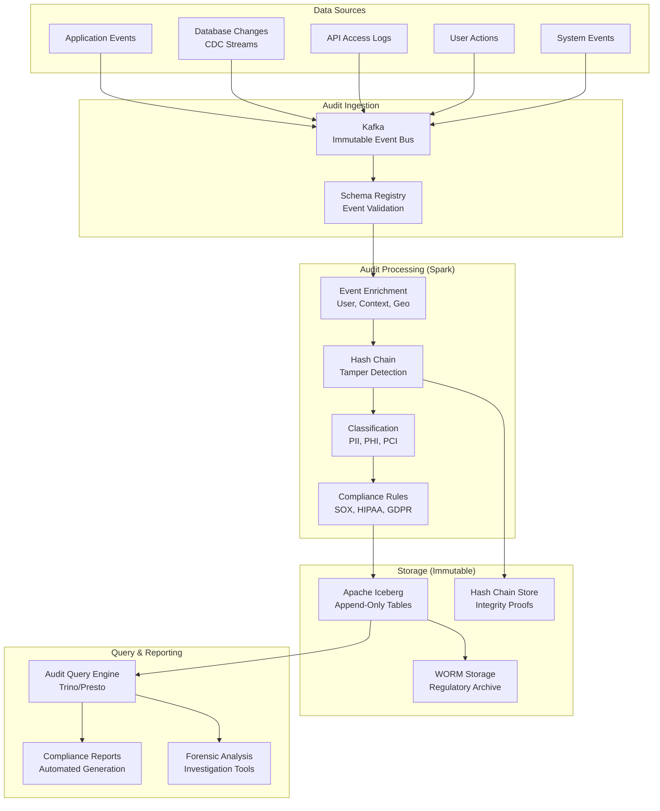
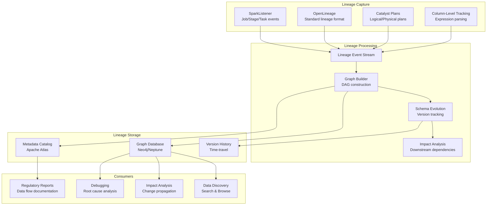
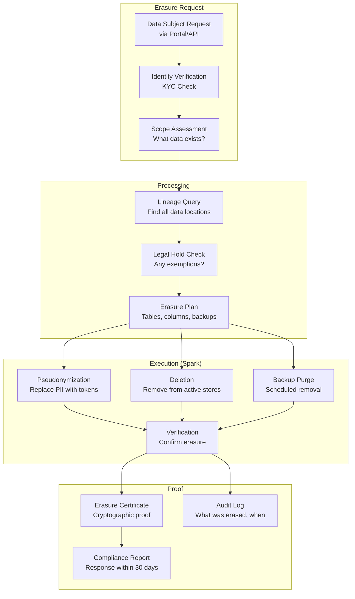
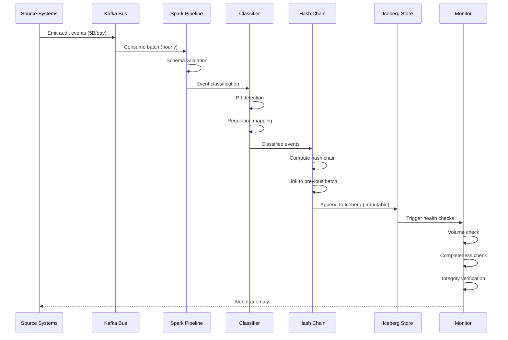
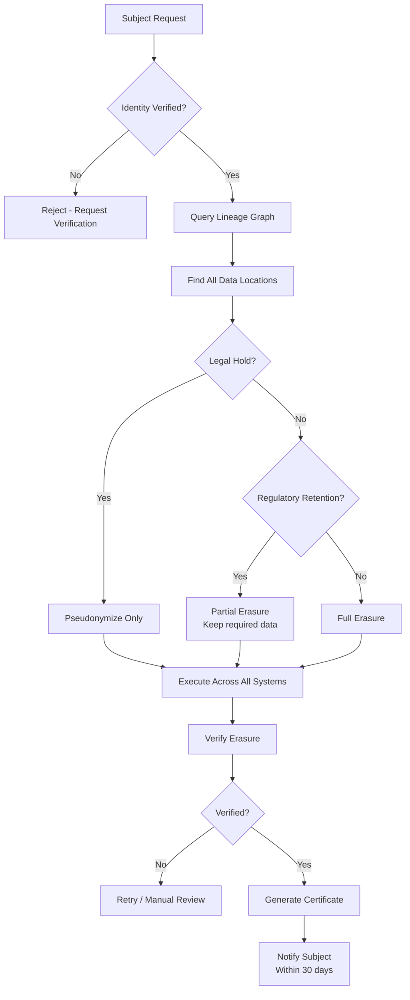
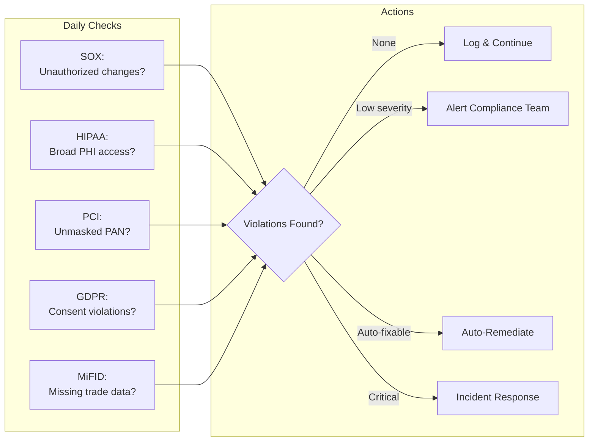

# Audit Trail, Regulatory Compliance & Data Lineage Pipeline with Apache Spark

## 1. Problem Statement

Regulated industries must maintain comprehensive audit trails, demonstrate data lineage, and implement specific compliance controls:

- **SOX (Sarbanes-Oxley)**: Financial reporting integrity, change tracking, access controls, immutable audit logs
- **HIPAA**: Protected Health Information (PHI) access logging, minimum necessary principle, de-identification
- **PCI-DSS**: Cardholder data protection, tokenization, access logging, retention limits
- **GDPR**: Right to erasure, data portability, consent tracking, processing records, DPIAs
- **MiFID II**: Trade reconstruction within 72 hours, 7-year retention, complete communication records

### Scale Requirements

```
Audit events:             5B+/day across all systems
Data lineage graph:       10M+ nodes, 100M+ edges
Retention:                7-25 years depending on regulation
Query latency:            < 30 seconds for any audit query
Completeness:             100% — zero events may be lost
Immutability:             Cryptographically guaranteed
PII records:              500M+ individuals
GDPR erasure requests:    10K+/day
```

### Regulatory Penalties

| Regulation | Maximum Penalty |
|-----------|----------------|
| GDPR | 4% global revenue or EUR 20M |
| SOX | $5M fine + 20 years imprisonment |
| HIPAA | $1.5M per violation category/year |
| PCI-DSS | $100K/month until compliant |
| MiFID II | EUR 5M or 10% annual revenue |

---

## 2. Architecture Diagrams

### Immutable Audit Trail Architecture



### Data Lineage Graph Architecture



### GDPR Erasure Pipeline



---

## 3. Core Spark Concepts

### 3.1 OpenLineage Integration

```python
from pyspark.sql import SparkSession

# Configure Spark with OpenLineage
spark = SparkSession.builder \
    .appName("AuditCompliancePipeline") \
    .config("spark.extraListeners", "io.openlineage.spark.agent.OpenLineageSparkListener") \
    .config("spark.openlineage.transport.type", "http") \
    .config("spark.openlineage.transport.url", "http://lineage-server:5000") \
    .config("spark.openlineage.namespace", "production") \
    .config("spark.openlineage.parentFacet.job.namespace", "audit-pipeline") \
    .config("spark.openlineage.parentFacet.job.name", "daily-audit-processing") \
    .config("spark.sql.adaptive.enabled", "true") \
    .config("spark.sql.shuffle.partitions", "2000") \
    .getOrCreate()
```

### 3.2 Custom SparkListener for Audit

```python
from pyspark import SparkContext
from py4j.java_gateway import java_import

class AuditSparkListener:
    """
    Custom SparkListener that captures all data access and transformation events.
    Implements the SparkListener interface via Py4J.
    """
    
    def __init__(self, spark: SparkSession):
        self.spark = spark
        self._register_listener()
    
    def _register_listener(self):
        """Register a custom Java SparkListener that forwards events to Python."""
        
        # For production, implement in Scala/Java for performance
        # This shows the Python-side processing
        
        # Register via SparkContext
        sc = self.spark.sparkContext
        
        # Listener implementation (would be in Scala)
        listener_code = """
        import org.apache.spark.scheduler._
        import org.apache.spark.sql.execution.QueryExecution
        
        class AuditListener extends SparkListener {
            override def onJobStart(jobStart: SparkListenerJobStart): Unit = {
                // Capture job metadata
                val jobId = jobStart.jobId
                val timestamp = System.currentTimeMillis()
                val properties = jobStart.properties
                val user = properties.getProperty("spark.jobGroup.user", "unknown")
                
                // Log to audit stream
                AuditEventEmitter.emit(Map(
                    "event_type" -> "JOB_START",
                    "job_id" -> jobId,
                    "user" -> user,
                    "timestamp" -> timestamp,
                    "description" -> properties.getProperty("spark.job.description", "")
                ))
            }
            
            override def onJobEnd(jobEnd: SparkListenerJobEnd): Unit = {
                AuditEventEmitter.emit(Map(
                    "event_type" -> "JOB_END",
                    "job_id" -> jobEnd.jobId,
                    "result" -> jobEnd.jobResult.toString,
                    "timestamp" -> System.currentTimeMillis()
                ))
            }
        }
        """
    
    def capture_query_plan(self, df):
        """Capture the logical and physical query plans for lineage."""
        
        logical_plan = df._jdf.queryExecution().logical().toString()
        physical_plan = df._jdf.queryExecution().executedPlan().toString()
        optimized_plan = df._jdf.queryExecution().optimizedPlan().toString()
        
        return {
            "logical_plan": logical_plan,
            "physical_plan": physical_plan,
            "optimized_plan": optimized_plan,
            "captured_at": str(pd.Timestamp.now())
        }
```

### 3.3 Accumulators for Audit Metrics

```python
from pyspark.sql import SparkSession
from pyspark.sql import functions as F
from pyspark.sql.types import *
from pyspark import AccumulatorParam
import json

class AuditMetricsAccumulator(AccumulatorParam):
    """Custom accumulator for tracking audit metrics across tasks."""
    
    def zero(self, value):
        return {
            "records_processed": 0,
            "pii_detected": 0,
            "phi_detected": 0,
            "pci_detected": 0,
            "anomalies_detected": 0,
            "records_masked": 0,
            "errors": 0
        }
    
    def addInPlace(self, val1, val2):
        for key in val1:
            val1[key] += val2.get(key, 0)
        return val1

# Register accumulator
spark = SparkSession.builder.getOrCreate()
audit_metrics = spark.sparkContext.accumulator(
    {"records_processed": 0, "pii_detected": 0, "phi_detected": 0,
     "pci_detected": 0, "anomalies_detected": 0, "records_masked": 0, "errors": 0},
    AuditMetricsAccumulator()
)
```

### 3.4 Append-Only Mode with Iceberg

```python
# Iceberg table for immutable audit logs
# Configure as append-only (no deletes or updates allowed)

spark.sql("""
    CREATE TABLE IF NOT EXISTS audit_catalog.audit.events (
        event_id STRING,
        event_timestamp TIMESTAMP,
        event_type STRING,
        actor_id STRING,
        actor_type STRING,
        action STRING,
        resource_type STRING,
        resource_id STRING,
        resource_name STRING,
        before_state STRING,
        after_state STRING,
        metadata MAP<STRING, STRING>,
        hash_chain_prev STRING,
        hash_chain_current STRING,
        classification STRING,
        retention_until DATE
    )
    USING iceberg
    PARTITIONED BY (days(event_timestamp), event_type)
    TBLPROPERTIES (
        'write.format.default' = 'parquet',
        'write.parquet.compression-codec' = 'zstd',
        'write.metadata.delete-after-commit.enabled' = 'false',
        'write.wap.enabled' = 'true',
        'format-version' = '2'
    )
""")

# CRITICAL: Set table to append-only (prevent deletes)
spark.sql("""
    ALTER TABLE audit_catalog.audit.events 
    SET TBLPROPERTIES ('write.delete.mode' = 'none', 'write.update.mode' = 'none')
""")
```

### 3.5 Partitioning for Audit Data

```python
# Partition strategy for audit data:
# - By day (time-based queries dominate)
# - By event_type (compliance queries filter by type)
# - Hidden partition on actor_id hash (for access audit queries)

audit_events.writeTo("audit_catalog.audit.events") \
    .tableProperty("write.distribution-mode", "hash") \
    .tableProperty("write.target-file-size-bytes", "536870912") \
    .append()

# For GDPR queries (find all events for a user):
# Create a secondary index/materialized view
spark.sql("""
    CREATE TABLE audit_catalog.audit.events_by_subject (
        subject_id STRING,
        event_id STRING,
        event_timestamp TIMESTAMP,
        event_type STRING,
        action STRING,
        classification STRING
    )
    USING iceberg
    PARTITIONED BY (subject_id)
""")
```

### 3.6 Schema Evolution for Audit Tables

```python
# Audit schemas must evolve without breaking immutability
# Iceberg supports safe schema evolution

# Add new column (safe - nullable by default)
spark.sql("""
    ALTER TABLE audit_catalog.audit.events 
    ADD COLUMN geo_location STRING
""")

# Rename column (safe - metadata only)
spark.sql("""
    ALTER TABLE audit_catalog.audit.events 
    RENAME COLUMN metadata TO event_metadata
""")

# Type promotion (safe - int to long, float to double)
spark.sql("""
    ALTER TABLE audit_catalog.audit.events 
    ALTER COLUMN record_count TYPE bigint
""")
```

### 3.7 UDFs for PII Masking

```python
import re
import hashlib

@F.udf(StringType())
def mask_email(email):
    """Mask email preserving domain: john.doe@company.com -> j***e@company.com"""
    if email is None:
        return None
    parts = email.split("@")
    if len(parts) != 2:
        return "***@***"
    local = parts[0]
    if len(local) <= 2:
        return f"{'*' * len(local)}@{parts[1]}"
    return f"{local[0]}{'*' * (len(local)-2)}{local[-1]}@{parts[1]}"

@F.udf(StringType())
def mask_phone(phone):
    """Mask phone keeping last 4: +1-555-123-4567 -> ***-***-***-4567"""
    if phone is None:
        return None
    digits = re.sub(r'[^0-9]', '', phone)
    if len(digits) < 4:
        return "****"
    return f"***-***-{digits[-4:]}"

@F.udf(StringType())
def mask_ssn(ssn):
    """Mask SSN: 123-45-6789 -> ***-**-6789"""
    if ssn is None:
        return None
    digits = re.sub(r'[^0-9]', '', ssn)
    if len(digits) < 4:
        return "***"
    return f"***-**-{digits[-4:]}"

@F.udf(StringType())
def mask_credit_card(cc):
    """Mask credit card: 4111-1111-1111-1111 -> ****-****-****-1111"""
    if cc is None:
        return None
    digits = re.sub(r'[^0-9]', '', cc)
    if len(digits) < 4:
        return "****"
    return f"****-****-****-{digits[-4:]}"

@F.udf(StringType())
def tokenize_pii(value, salt="secret_salt_do_not_commit"):
    """One-way tokenization using HMAC-SHA256."""
    if value is None:
        return None
    token = hashlib.sha256(f"{salt}:{value}".encode()).hexdigest()
    return f"TOK_{token[:32]}"

@F.udf(StringType())
def pseudonymize(value, pepper="rotation_key_v3"):
    """Reversible pseudonymization (with key) for GDPR compliance."""
    if value is None:
        return None
    # In production, use proper encryption (AES-256-GCM)
    # This is a simplified example
    import base64
    combined = f"{pepper}:{value}"
    pseudo = base64.b64encode(combined.encode()).decode()
    return f"PSE_{pseudo}"
```

---

## 4. Immutable Audit Trail

### 4.1 Event Schema

```python
from pyspark.sql.types import *
from datetime import datetime
import hashlib
import json

# Canonical audit event schema
AUDIT_EVENT_SCHEMA = StructType([
    StructField("event_id", StringType(), False),
    StructField("event_timestamp", TimestampType(), False),
    StructField("event_type", StringType(), False),
    
    # Actor (who did it)
    StructField("actor", StructType([
        StructField("actor_id", StringType(), False),
        StructField("actor_type", StringType(), False),  # USER, SERVICE, SYSTEM
        StructField("actor_name", StringType(), True),
        StructField("ip_address", StringType(), True),
        StructField("session_id", StringType(), True),
    ]), False),
    
    # Action (what was done)
    StructField("action", StructType([
        StructField("operation", StringType(), False),  # CREATE, READ, UPDATE, DELETE
        StructField("resource_type", StringType(), False),
        StructField("resource_id", StringType(), False),
        StructField("resource_path", StringType(), True),
    ]), False),
    
    # Change details
    StructField("change", StructType([
        StructField("before_state", StringType(), True),  # JSON
        StructField("after_state", StringType(), True),   # JSON
        StructField("changed_fields", ArrayType(StringType()), True),
    ]), True),
    
    # Context
    StructField("context", StructType([
        StructField("application", StringType(), True),
        StructField("environment", StringType(), True),
        StructField("correlation_id", StringType(), True),
        StructField("request_id", StringType(), True),
    ]), True),
    
    # Classification
    StructField("classification", StructType([
        StructField("data_sensitivity", StringType(), True),  # PUBLIC, INTERNAL, CONFIDENTIAL, RESTRICTED
        StructField("pii_involved", BooleanType(), True),
        StructField("phi_involved", BooleanType(), True),
        StructField("pci_involved", BooleanType(), True),
        StructField("regulations", ArrayType(StringType()), True),  # SOX, HIPAA, GDPR, PCI
    ]), True),
    
    # Integrity
    StructField("integrity", StructType([
        StructField("hash_prev", StringType(), True),
        StructField("hash_current", StringType(), False),
        StructField("sequence_num", LongType(), False),
    ]), False),
    
    # Retention
    StructField("retention_until", DateType(), False),
])
```

### 4.2 Hash Chain (Blockchain-Lite) Implementation

```python
class HashChainAuditWriter:
    """
    Implements a hash chain (blockchain-lite) for tamper detection.
    
    Each event includes the hash of the previous event, creating an
    immutable chain. Any modification to a past event breaks the chain,
    making tampering detectable.
    """
    
    def __init__(self, spark: SparkSession):
        self.spark = spark
    
    def compute_event_hash(self, event_data: dict, prev_hash: str) -> str:
        """Compute hash for an audit event including previous hash."""
        
        # Deterministic serialization (sorted keys)
        canonical = json.dumps(event_data, sort_keys=True, default=str)
        
        # Include previous hash in computation
        hash_input = f"{prev_hash}|{canonical}"
        
        return hashlib.sha256(hash_input.encode()).hexdigest()
    
    def build_hash_chain(self, events_df):
        """
        Build hash chain for a batch of audit events.
        
        Uses window function to chain events sequentially within each partition.
        For cross-partition chains, a separate linking process runs.
        """
        
        # Order events deterministically
        w = Window.partitionBy("event_type").orderBy("event_timestamp", "event_id")
        
        # Assign sequence numbers
        chained = events_df.withColumn(
            "sequence_num", F.row_number().over(w)
        )
        
        # Compute hash chain using Pandas UDF (maintains state within partition)
        @F.pandas_udf(StringType())
        def compute_chain_hash(
            event_ids: pd.Series,
            timestamps: pd.Series,
            actions: pd.Series,
            resources: pd.Series,
            prev_hashes: pd.Series
        ) -> pd.Series:
            """Compute hash chain within a partition."""
            
            hashes = []
            prev_hash = "GENESIS"
            
            for i in range(len(event_ids)):
                data = f"{event_ids.iloc[i]}|{timestamps.iloc[i]}|{actions.iloc[i]}|{resources.iloc[i]}"
                hash_input = f"{prev_hash}|{data}"
                current_hash = hashlib.sha256(hash_input.encode()).hexdigest()
                hashes.append(current_hash)
                prev_hash = current_hash
            
            return pd.Series(hashes)
        
        # Apply within sorted partitions
        chained = chained.withColumn(
            "hash_prev",
            F.lag("hash_current", 1, "GENESIS").over(w)
        )
        
        # For the actual hash computation, use a grouped map UDF
        @F.pandas_udf(
            StructType([
                StructField("event_id", StringType()),
                StructField("hash_current", StringType()),
                StructField("hash_prev", StringType()),
                StructField("sequence_num", LongType())
            ]),
            F.PandasUDFType.GROUPED_MAP
        )
        def compute_hashes_grouped(pdf: pd.DataFrame) -> pd.DataFrame:
            pdf = pdf.sort_values("event_timestamp")
            
            hashes = []
            prev_hash = "GENESIS"
            
            for idx, row in pdf.iterrows():
                data = f"{row['event_id']}|{row['event_timestamp']}|{row['action']}|{row['resource_id']}"
                hash_input = f"{prev_hash}|{data}"
                current_hash = hashlib.sha256(hash_input.encode()).hexdigest()
                hashes.append({
                    "event_id": row["event_id"],
                    "hash_current": current_hash,
                    "hash_prev": prev_hash,
                    "sequence_num": len(hashes) + 1
                })
                prev_hash = current_hash
            
            return pd.DataFrame(hashes)
        
        return events_df.groupBy("event_type").apply(compute_hashes_grouped)
    
    def verify_chain_integrity(self, events_df):
        """
        Verify the hash chain has not been tampered with.
        
        Recomputes all hashes and compares with stored values.
        Any mismatch indicates tampering.
        """
        
        w = Window.partitionBy("event_type").orderBy("sequence_num")
        
        # Get the previous event's stored hash
        verification = events_df.withColumn(
            "expected_prev_hash", F.lag("hash_current", 1, "GENESIS").over(w)
        )
        
        # Check: stored hash_prev should match the previous event's hash_current
        tampering_detected = verification.filter(
            (F.col("hash_prev") != F.col("expected_prev_hash")) &
            (F.col("sequence_num") > 1)
        )
        
        tampered_count = tampering_detected.count()
        
        if tampered_count > 0:
            print(f"CRITICAL ALERT: {tampered_count} chain integrity violations detected!")
            tampering_detected.select(
                "event_id", "event_type", "sequence_num",
                "hash_prev", "expected_prev_hash"
            ).show(20, truncate=False)
            
            # In production: trigger incident response
            return False, tampering_detected
        
        print("✓ Hash chain integrity verified — no tampering detected")
        return True, None
```

### 4.3 Append-Only Audit Writer

```python
class ImmutableAuditWriter:
    """Write audit events to append-only Iceberg tables."""
    
    def __init__(self, spark: SparkSession, catalog="audit_catalog"):
        self.spark = spark
        self.catalog = catalog
        self.hash_chain = HashChainAuditWriter(spark)
    
    def write_events(self, events_df, validate=True):
        """
        Write audit events with hash chain to immutable storage.
        
        Steps:
        1. Validate event schema
        2. Classify data sensitivity
        3. Compute hash chain
        4. Write to Iceberg (append-only)
        5. Write to WORM archive
        """
        
        # Step 1: Validate
        if validate:
            self._validate_events(events_df)
        
        # Step 2: Classify
        classified = self._classify_events(events_df)
        
        # Step 3: Compute hash chain
        chained = self.hash_chain.build_hash_chain(classified)
        
        # Step 4: Set retention based on regulation
        with_retention = chained.withColumn(
            "retention_until",
            F.when(F.array_contains(F.col("regulations"), "MiFID_II"),
                   F.date_add(F.current_date(), 7 * 365))  # 7 years
            .when(F.array_contains(F.col("regulations"), "SOX"),
                  F.date_add(F.current_date(), 7 * 365))  # 7 years
            .when(F.array_contains(F.col("regulations"), "HIPAA"),
                  F.date_add(F.current_date(), 6 * 365))  # 6 years
            .otherwise(F.date_add(F.current_date(), 3 * 365))  # 3 years default
        )
        
        # Step 5: Write to Iceberg (append-only)
        with_retention.writeTo(f"{self.catalog}.audit.events") \
            .append()
        
        # Step 6: Write chain anchors to WORM storage
        chain_anchors = with_retention.groupBy("event_type").agg(
            F.max("sequence_num").alias("max_sequence"),
            F.last("hash_current").alias("chain_head_hash"),
            F.count("*").alias("batch_size")
        )
        
        chain_anchors.write.mode("append") \
            .saveAsTable(f"{self.catalog}.audit.chain_anchors")
        
        return with_retention.count()
    
    def _validate_events(self, events_df):
        """Validate all required fields are present and non-null."""
        required_fields = ["event_id", "event_timestamp", "event_type", "actor_id", "action"]
        
        for field in required_fields:
            null_count = events_df.filter(F.col(field).isNull()).count()
            if null_count > 0:
                raise ValueError(f"Audit validation failed: {null_count} null values in required field '{field}'")
    
    def _classify_events(self, events_df):
        """Auto-classify events for regulatory applicability."""
        
        return events_df.withColumn(
            "data_sensitivity",
            F.when(F.col("resource_type").isin("PHI", "MEDICAL_RECORD"), "RESTRICTED")
            .when(F.col("resource_type").isin("PCI", "CREDIT_CARD", "PAYMENT"), "RESTRICTED")
            .when(F.col("resource_type").isin("PII", "USER_PROFILE", "SSN"), "CONFIDENTIAL")
            .otherwise("INTERNAL")
        ).withColumn(
            "pii_involved",
            F.col("resource_type").isin("PII", "USER_PROFILE", "SSN", "EMAIL", "PHONE")
        ).withColumn(
            "phi_involved",
            F.col("resource_type").isin("PHI", "MEDICAL_RECORD", "DIAGNOSIS", "PRESCRIPTION")
        ).withColumn(
            "pci_involved",
            F.col("resource_type").isin("PCI", "CREDIT_CARD", "PAYMENT", "BANK_ACCOUNT")
        ).withColumn(
            "regulations",
            F.array_distinct(F.flatten(F.array(
                F.when(F.col("pii_involved"), F.array(F.lit("GDPR"))).otherwise(F.array()),
                F.when(F.col("phi_involved"), F.array(F.lit("HIPAA"))).otherwise(F.array()),
                F.when(F.col("pci_involved"), F.array(F.lit("PCI_DSS"))).otherwise(F.array()),
                F.when(F.col("resource_type").isin("FINANCIAL", "TRADE", "LEDGER"),
                       F.array(F.lit("SOX"), F.lit("MiFID_II"))).otherwise(F.array())
            )))
        )
```

---

## 5. Column-Level Data Lineage

### 5.1 Catalyst Plan Extraction

```python
class ColumnLevelLineageExtractor:
    """
    Extract column-level data lineage from Spark's Catalyst query plans.
    
    Traces each output column back to its source columns through
    all transformations, joins, and aggregations.
    """
    
    def __init__(self, spark: SparkSession):
        self.spark = spark
    
    def extract_lineage_from_df(self, df, output_table_name: str):
        """
        Extract column-level lineage from a DataFrame's query plan.
        
        Returns a graph of:
        - Source columns (table.column)
        - Transformations applied
        - Output columns
        """
        
        # Get the analyzed logical plan
        plan = df._jdf.queryExecution().analyzed()
        plan_str = plan.toString()
        
        # Parse the plan to extract column mappings
        lineage_edges = []
        
        # Get output schema
        output_cols = df.columns
        
        # For each output column, trace back through the plan
        for col_name in output_cols:
            # Use Spark's expression resolution to find source references
            try:
                expr = df.select(col_name)._jdf.queryExecution().analyzed()
                references = self._extract_references(expr.toString(), col_name)
                
                for ref in references:
                    lineage_edges.append({
                        "source_table": ref.get("table", "unknown"),
                        "source_column": ref.get("column", "unknown"),
                        "target_table": output_table_name,
                        "target_column": col_name,
                        "transformation": ref.get("transformation", "direct"),
                        "expression": ref.get("expression", ""),
                    })
            except Exception as e:
                lineage_edges.append({
                    "source_table": "PARSE_ERROR",
                    "source_column": str(e),
                    "target_table": output_table_name,
                    "target_column": col_name,
                    "transformation": "error",
                    "expression": ""
                })
        
        return self.spark.createDataFrame(lineage_edges)
    
    def _extract_references(self, plan_str: str, target_col: str):
        """Parse Catalyst plan to extract column references."""
        
        import re
        
        references = []
        
        # Pattern: table#id.column#id
        # Example: users#12.email#45
        pattern = r'(\w+)#\d+\.(\w+)#\d+'
        matches = re.findall(pattern, plan_str)
        
        for table, column in matches:
            references.append({
                "table": table,
                "column": column,
                "transformation": "reference"
            })
        
        # Pattern: Alias(expression, name)
        alias_pattern = r'Alias\((.+?),\s*(\w+)\)'
        alias_matches = re.findall(alias_pattern, plan_str)
        
        for expression, alias_name in alias_matches:
            if alias_name == target_col:
                references.append({
                    "table": "derived",
                    "column": alias_name,
                    "transformation": "expression",
                    "expression": expression[:200]  # Truncate long expressions
                })
        
        return references if references else [{"table": "unknown", "column": target_col, "transformation": "unknown"}]
    
    def build_lineage_graph(self, lineage_edges_df):
        """Build a graph representation of data lineage."""
        
        # Nodes: unique tables and columns
        source_nodes = lineage_edges_df.select(
            F.concat_ws(".", "source_table", "source_column").alias("node_id"),
            F.col("source_table").alias("table_name"),
            F.col("source_column").alias("column_name"),
            F.lit("source").alias("node_type")
        )
        
        target_nodes = lineage_edges_df.select(
            F.concat_ws(".", "target_table", "target_column").alias("node_id"),
            F.col("target_table").alias("table_name"),
            F.col("target_column").alias("column_name"),
            F.lit("target").alias("node_type")
        )
        
        all_nodes = source_nodes.union(target_nodes).distinct()
        
        # Edges: lineage relationships
        edges = lineage_edges_df.select(
            F.concat_ws(".", "source_table", "source_column").alias("src"),
            F.concat_ws(".", "target_table", "target_column").alias("dst"),
            "transformation",
            "expression"
        )
        
        return all_nodes, edges
    
    def impact_analysis(self, lineage_edges_df, source_table: str, source_column: str):
        """
        Find all downstream consumers of a source column.
        Critical for: "If we change column X, what breaks?"
        """
        
        # BFS through lineage graph
        source_node = f"{source_table}.{source_column}"
        
        # Direct dependents
        direct = lineage_edges_df.filter(
            (F.col("source_table") == source_table) &
            (F.col("source_column") == source_column)
        )
        
        # Transitive dependents (iterative)
        all_impacted = direct
        frontier = direct.select(
            F.col("target_table").alias("source_table"),
            F.col("target_column").alias("source_column")
        )
        
        for _ in range(10):  # Max depth
            next_level = lineage_edges_df.join(
                frontier,
                ["source_table", "source_column"],
                "inner"
            )
            
            if next_level.count() == 0:
                break
            
            all_impacted = all_impacted.union(next_level)
            frontier = next_level.select(
                F.col("target_table").alias("source_table"),
                F.col("target_column").alias("source_column")
            )
        
        return all_impacted.distinct()
```

### 5.2 OpenLineage Event Emission

```python
class OpenLineageEmitter:
    """Emit OpenLineage events for standard lineage tracking."""
    
    def __init__(self, lineage_server_url: str):
        self.url = lineage_server_url
    
    def emit_run_event(self, job_name, namespace, inputs, outputs, run_id=None):
        """Emit an OpenLineage RunEvent."""
        
        import uuid
        import requests
        from datetime import datetime
        
        event = {
            "eventType": "COMPLETE",
            "eventTime": datetime.utcnow().isoformat() + "Z",
            "run": {
                "runId": run_id or str(uuid.uuid4()),
                "facets": {
                    "spark_version": {"_producer": "spark", "sparkVersion": "3.5.0"},
                    "processing_engine": {
                        "_producer": "spark",
                        "version": "3.5.0",
                        "name": "Apache Spark"
                    }
                }
            },
            "job": {
                "namespace": namespace,
                "name": job_name,
                "facets": {}
            },
            "inputs": [
                {
                    "namespace": inp["namespace"],
                    "name": inp["name"],
                    "facets": {
                        "schema": {
                            "_producer": "spark",
                            "fields": [
                                {"name": col, "type": dtype}
                                for col, dtype in inp.get("schema", {}).items()
                            ]
                        }
                    }
                }
                for inp in inputs
            ],
            "outputs": [
                {
                    "namespace": out["namespace"],
                    "name": out["name"],
                    "facets": {
                        "schema": {
                            "_producer": "spark",
                            "fields": [
                                {"name": col, "type": dtype}
                                for col, dtype in out.get("schema", {}).items()
                            ]
                        },
                        "columnLineage": {
                            "_producer": "spark",
                            "fields": out.get("column_lineage", {})
                        }
                    }
                }
                for out in outputs
            ]
        }
        
        # In production, emit to lineage server
        # requests.post(f"{self.url}/api/v1/lineage", json=event)
        return event
```

---

## 6. Compliance Implementations

### 6.1 SOX Compliance

```python
class SOXComplianceEngine:
    """
    SOX (Sarbanes-Oxley) compliance implementation.
    
    Requirements:
    - Section 302: CEO/CFO certification of financial reports
    - Section 404: Internal control assessment
    - Change management logging
    - Access control documentation
    - Data integrity verification
    """
    
    def __init__(self, spark: SparkSession):
        self.spark = spark
    
    def track_financial_data_changes(self, before_df, after_df, table_name: str, change_author: str):
        """Track all changes to financial data for SOX Section 404."""
        
        # Identify changed records
        key_cols = ["record_id"]
        value_cols = [c for c in before_df.columns if c not in key_cols + ["last_modified"]]
        
        # Find modifications
        changes = before_df.alias("before").join(
            after_df.alias("after"),
            key_cols,
            "full_outer"
        )
        
        # Detect change type
        change_log = changes.withColumn(
            "change_type",
            F.when(F.col("before.record_id").isNull(), "INSERT")
            .when(F.col("after.record_id").isNull(), "DELETE")
            .otherwise("UPDATE")
        )
        
        # For updates, identify which fields changed
        for col in value_cols:
            change_log = change_log.withColumn(
                f"{col}_changed",
                F.when(
                    F.col(f"before.{col}") != F.col(f"after.{col}"), True
                ).otherwise(False)
            )
        
        # Create SOX audit record
        sox_audit = change_log.select(
            F.monotonically_increasing_id().alias("audit_id"),
            F.current_timestamp().alias("change_timestamp"),
            F.lit(table_name).alias("table_name"),
            F.coalesce(F.col("after.record_id"), F.col("before.record_id")).alias("record_id"),
            F.col("change_type"),
            F.lit(change_author).alias("changed_by"),
            F.to_json(F.struct(*[f"before.{c}" for c in value_cols])).alias("before_state"),
            F.to_json(F.struct(*[f"after.{c}" for c in value_cols])).alias("after_state"),
            F.array(*[F.when(F.col(f"{c}_changed"), F.lit(c)) for c in value_cols]).alias("changed_fields"),
        )
        
        # Write to immutable audit table
        sox_audit.write.mode("append").saveAsTable("compliance.sox_change_log")
        
        return sox_audit
    
    def generate_sox_report(self, reporting_period_start, reporting_period_end):
        """Generate SOX compliance report for a reporting period."""
        
        changes = self.spark.table("compliance.sox_change_log") \
            .filter(
                F.col("change_timestamp").between(reporting_period_start, reporting_period_end)
            )
        
        report = changes.groupBy("table_name", "change_type", "changed_by").agg(
            F.count("*").alias("change_count"),
            F.min("change_timestamp").alias("first_change"),
            F.max("change_timestamp").alias("last_change"),
            F.countDistinct("record_id").alias("records_affected")
        ).orderBy("table_name", "change_type")
        
        return report
```

### 6.2 GDPR Erasure Pipeline

```python
class GDPRErasureEngine:
    """
    GDPR Right to Erasure (Article 17) implementation.
    
    Must complete within 30 days of request.
    Must erase from ALL systems including backups.
    Must provide proof of erasure.
    """
    
    def __init__(self, spark: SparkSession):
        self.spark = spark
    
    def process_erasure_request(self, subject_id: str, request_id: str):
        """
        Process a GDPR erasure request end-to-end.
        
        Steps:
        1. Identify all data locations via lineage
        2. Check for legal hold / exemptions
        3. Execute erasure (pseudonymization + deletion)
        4. Verify erasure
        5. Generate proof certificate
        """
        
        print(f"Processing erasure request {request_id} for subject {subject_id}")
        
        # Step 1: Find all data locations
        data_locations = self._find_subject_data(subject_id)
        print(f"  Found data in {data_locations.count()} locations")
        
        # Step 2: Check exemptions
        exemptions = self._check_exemptions(subject_id)
        if exemptions:
            print(f"  ⚠ Exemptions found: {exemptions}")
        
        # Step 3: Execute erasure
        erasure_results = self._execute_erasure(subject_id, data_locations, exemptions)
        
        # Step 4: Verify
        verification = self._verify_erasure(subject_id, data_locations)
        
        # Step 5: Generate certificate
        certificate = self._generate_erasure_certificate(
            request_id, subject_id, erasure_results, verification
        )
        
        return certificate
    
    def _find_subject_data(self, subject_id: str):
        """Find all tables/columns containing this subject's data."""
        
        # Query lineage/catalog to find PII tables
        pii_tables = self.spark.table("metadata.pii_registry")
        
        locations = []
        for row in pii_tables.collect():
            table_name = row["table_name"]
            id_column = row["subject_id_column"]
            
            # Check if subject exists in this table
            count = self.spark.table(table_name) \
                .filter(F.col(id_column) == subject_id) \
                .count()
            
            if count > 0:
                locations.append({
                    "table_name": table_name,
                    "id_column": id_column,
                    "record_count": count,
                    "pii_columns": row["pii_columns"]
                })
        
        return self.spark.createDataFrame(locations)
    
    def _check_exemptions(self, subject_id: str):
        """Check if any legal holds or exemptions apply."""
        
        # Legal hold check
        legal_holds = self.spark.table("compliance.legal_holds") \
            .filter(
                (F.col("subject_id") == subject_id) &
                (F.col("hold_status") == "ACTIVE")
            ).collect()
        
        exemptions = []
        if legal_holds:
            exemptions.append("LEGAL_HOLD")
        
        # Regulatory retention check (some data must be kept)
        regulatory_data = self.spark.table("compliance.regulatory_retention") \
            .filter(
                (F.col("subject_id") == subject_id) &
                (F.col("retention_end") > F.current_date())
            ).collect()
        
        if regulatory_data:
            exemptions.append("REGULATORY_RETENTION")
        
        return exemptions
    
    def _execute_erasure(self, subject_id: str, data_locations, exemptions: list):
        """Execute erasure across all data locations."""
        
        results = []
        
        for row in data_locations.collect():
            table_name = row["table_name"]
            id_column = row["id_column"]
            pii_columns = row["pii_columns"]
            
            if "LEGAL_HOLD" in exemptions:
                # Pseudonymize instead of delete
                action = "PSEUDONYMIZE"
                self._pseudonymize_records(table_name, id_column, subject_id, pii_columns)
            else:
                # Full deletion
                action = "DELETE"
                self._delete_records(table_name, id_column, subject_id)
            
            results.append({
                "table_name": table_name,
                "action": action,
                "records_affected": row["record_count"],
                "executed_at": str(datetime.now())
            })
        
        return results
    
    def _pseudonymize_records(self, table_name, id_column, subject_id, pii_columns):
        """Replace PII with pseudonymized values (irreversible without key)."""
        
        # Read the table
        df = self.spark.table(table_name)
        
        # Pseudonymize PII columns for the subject
        for col in pii_columns:
            df = df.withColumn(
                col,
                F.when(
                    F.col(id_column) == subject_id,
                    tokenize_pii(F.col(col))
                ).otherwise(F.col(col))
            )
        
        # Replace subject ID itself
        df = df.withColumn(
            id_column,
            F.when(
                F.col(id_column) == subject_id,
                F.lit(f"ERASED_{hashlib.sha256(subject_id.encode()).hexdigest()[:16]}")
            ).otherwise(F.col(id_column))
        )
        
        # Write back (Iceberg supports row-level updates)
        df.writeTo(table_name).overwritePartitions()
    
    def _delete_records(self, table_name, id_column, subject_id):
        """Delete all records for a subject from an Iceberg table."""
        
        self.spark.sql(f"""
            DELETE FROM {table_name} 
            WHERE {id_column} = '{subject_id}'
        """)
    
    def _verify_erasure(self, subject_id: str, data_locations):
        """Verify that erasure was successful."""
        
        verification_results = []
        
        for row in data_locations.collect():
            table_name = row["table_name"]
            id_column = row["id_column"]
            
            remaining = self.spark.table(table_name) \
                .filter(F.col(id_column) == subject_id) \
                .count()
            
            verification_results.append({
                "table_name": table_name,
                "remaining_records": remaining,
                "verified": remaining == 0
            })
        
        return verification_results
    
    def _generate_erasure_certificate(self, request_id, subject_id, results, verification):
        """Generate cryptographic proof of erasure."""
        
        certificate = {
            "certificate_id": str(hashlib.sha256(f"{request_id}:{subject_id}".encode()).hexdigest()),
            "request_id": request_id,
            "subject_id_hash": hashlib.sha256(subject_id.encode()).hexdigest(),
            "erasure_timestamp": str(datetime.now()),
            "tables_processed": len(results),
            "total_records_erased": sum(r["records_affected"] for r in results),
            "verification_passed": all(v["verified"] for v in verification),
            "details": results,
            "verification": verification
        }
        
        # Sign certificate
        cert_hash = hashlib.sha256(json.dumps(certificate, sort_keys=True).encode()).hexdigest()
        certificate["signature"] = cert_hash
        
        # Store certificate
        cert_df = self.spark.createDataFrame([certificate])
        cert_df.write.mode("append").saveAsTable("compliance.erasure_certificates")
        
        return certificate
```

### 6.3 PCI-DSS Tokenization

```python
class PCIDSSTokenizationEngine:
    """
    PCI-DSS compliant tokenization for cardholder data.
    
    Requirements:
    - Never store PAN (Primary Account Number) in clear
    - Tokenize at ingestion
    - Restrict access to token vault
    - Log all access to cardholder data
    """
    
    def __init__(self, spark: SparkSession):
        self.spark = spark
    
    def tokenize_cardholder_data(self, df, pan_col="card_number", cvv_col="cvv"):
        """
        Tokenize PCI data at rest.
        
        - PAN -> Format-preserving token
        - CVV -> Never stored (drop immediately)
        - Expiry -> Encrypted
        """
        
        # NEVER store CVV
        result = df.drop(cvv_col) if cvv_col in df.columns else df
        
        # Tokenize PAN
        result = result.withColumn(
            f"{pan_col}_token",
            self._format_preserving_token(F.col(pan_col))
        ).withColumn(
            f"{pan_col}_last4",
            F.substring(F.col(pan_col), -4, 4)
        ).withColumn(
            f"{pan_col}_bin",  # First 6 digits (not considered sensitive)
            F.substring(F.col(pan_col), 1, 6)
        ).drop(pan_col)  # Drop the original PAN
        
        return result
    
    @staticmethod
    @F.udf(StringType())
    def _format_preserving_token(pan):
        """Generate a format-preserving token for PAN."""
        if pan is None:
            return None
        
        # In production: Use FPE (Format Preserving Encryption) like FF1/FF3
        # This is a simplified hash-based token
        digits_only = re.sub(r'[^0-9]', '', pan)
        token_hash = hashlib.sha256(f"pci_salt_v2:{digits_only}".encode()).hexdigest()
        
        # Preserve format (16 digits for standard cards)
        token_digits = ''.join([str(int(c, 16) % 10) for c in token_hash[:len(digits_only)]])
        
        return f"TOK{token_digits}"
    
    def audit_pci_access(self, df, accessor_id: str, purpose: str):
        """Log all access to PCI-scoped data."""
        
        access_log = self.spark.createDataFrame([{
            "access_id": str(hashlib.sha256(f"{accessor_id}:{datetime.now()}".encode()).hexdigest()[:16]),
            "accessor_id": accessor_id,
            "access_timestamp": str(datetime.now()),
            "purpose": purpose,
            "records_accessed": df.count(),
            "columns_accessed": [c for c in df.columns if "token" in c or "card" in c.lower()],
            "justified": purpose in ["FRAUD_INVESTIGATION", "CUSTOMER_SUPPORT", "COMPLIANCE_AUDIT"]
        }])
        
        access_log.write.mode("append").saveAsTable("compliance.pci_access_log")
```

### 6.4 HIPAA Compliance

```python
class HIPAAComplianceEngine:
    """
    HIPAA compliance for Protected Health Information (PHI).
    
    18 identifiers that constitute PHI:
    Names, geographic data, dates, phone/fax numbers, email,
    SSN, medical record numbers, health plan numbers, account numbers,
    certificate/license numbers, vehicle identifiers, device identifiers,
    URLs, IP addresses, biometric identifiers, photos, any other unique identifier
    """
    
    def __init__(self, spark: SparkSession):
        self.spark = spark
        
        self.phi_columns = [
            "patient_name", "date_of_birth", "address", "phone", "fax",
            "email", "ssn", "medical_record_number", "health_plan_id",
            "account_number", "certificate_number", "vehicle_id",
            "device_id", "url", "ip_address", "biometric_id", "photo"
        ]
    
    def de_identify_safe_harbor(self, df):
        """
        De-identify data using HIPAA Safe Harbor method.
        
        Remove or generalize all 18 PHI identifiers.
        """
        
        result = df
        
        # Remove direct identifiers
        direct_identifiers = ["patient_name", "ssn", "medical_record_number",
                            "health_plan_id", "email", "phone", "fax",
                            "device_id", "vehicle_id", "url", "ip_address",
                            "biometric_id", "photo", "certificate_number"]
        
        for col in direct_identifiers:
            if col in result.columns:
                result = result.drop(col)
        
        # Generalize dates (year only for dates > 89 years old)
        if "date_of_birth" in result.columns:
            result = result.withColumn(
                "date_of_birth",
                F.when(
                    F.datediff(F.current_date(), F.col("date_of_birth")) > 89 * 365,
                    F.lit("1900-01-01").cast("date")  # Generalize to avoid re-identification
                ).otherwise(
                    F.make_date(F.year("date_of_birth"), F.lit(1), F.lit(1))  # Keep only year
                )
            )
        
        # Generalize geography (first 3 digits of zip only, unless population < 20K)
        if "zip_code" in result.columns:
            result = result.withColumn(
                "zip_code",
                F.substring("zip_code", 1, 3)  # First 3 digits only
            )
        
        # Generalize age (cap at 90)
        if "age" in result.columns:
            result = result.withColumn(
                "age",
                F.when(F.col("age") >= 90, F.lit(90)).otherwise(F.col("age"))
            )
        
        return result
    
    def minimum_necessary_filter(self, df, purpose: str, role: str):
        """
        Apply minimum necessary standard: only return columns needed for the purpose.
        """
        
        # Define allowed columns per purpose and role
        access_matrix = {
            ("TREATMENT", "PHYSICIAN"): ["patient_id", "diagnosis", "medication", "allergies", "vitals"],
            ("TREATMENT", "NURSE"): ["patient_id", "medication", "vitals", "care_plan"],
            ("PAYMENT", "BILLING"): ["patient_id", "procedure_codes", "insurance_id", "amount"],
            ("RESEARCH", "RESEARCHER"): ["age_group", "diagnosis", "procedure_codes"],  # De-identified only
            ("OPERATIONS", "ADMIN"): ["patient_id", "admission_date", "discharge_date", "department"],
        }
        
        allowed_cols = access_matrix.get((purpose, role), [])
        
        if not allowed_cols:
            raise PermissionError(f"No access defined for purpose={purpose}, role={role}")
        
        # Filter to only allowed columns that exist
        available_cols = [c for c in allowed_cols if c in df.columns]
        
        return df.select(*available_cols)
    
    def log_phi_access(self, df, accessor: dict, purpose: str):
        """Log all access to PHI as required by HIPAA."""
        
        phi_cols_accessed = [c for c in df.columns if c in self.phi_columns]
        
        access_record = {
            "access_id": str(uuid.uuid4()),
            "timestamp": str(datetime.now()),
            "accessor_id": accessor["id"],
            "accessor_role": accessor["role"],
            "accessor_department": accessor.get("department", "unknown"),
            "purpose": purpose,
            "phi_columns_accessed": phi_cols_accessed,
            "record_count": df.count(),
            "patient_ids_accessed": df.select("patient_id").distinct().count()
        }
        
        self.spark.createDataFrame([access_record]).write \
            .mode("append") \
            .saveAsTable("compliance.hipaa_access_log")
```

---

## 7. Full Production PySpark Code

### 7.1 Complete Audit & Compliance Pipeline

```python
from pyspark.sql import SparkSession
from pyspark.sql import functions as F
from pyspark.sql.types import *
from datetime import datetime, timedelta
import hashlib
import json
import uuid

class ProductionAuditCompliancePipeline:
    """
    End-to-end production audit trail and compliance pipeline.
    
    Handles:
    - Immutable audit event capture and storage
    - Hash chain integrity
    - PII detection and masking
    - Column-level lineage
    - Multi-regulation compliance (SOX, HIPAA, GDPR, PCI-DSS)
    - Retention management
    """
    
    def __init__(self, spark: SparkSession, config: dict):
        self.spark = spark
        self.config = config
        
        # Initialize engines
        self.audit_writer = ImmutableAuditWriter(spark)
        self.lineage_extractor = ColumnLevelLineageExtractor(spark)
        self.sox_engine = SOXComplianceEngine(spark)
        self.gdpr_engine = GDPRErasureEngine(spark)
        self.pci_engine = PCIDSSTokenizationEngine(spark)
        self.hipaa_engine = HIPAAComplianceEngine(spark)
        self.hash_chain = HashChainAuditWriter(spark)
    
    def run_daily_audit_pipeline(self, execution_date: str):
        """Run daily audit processing pipeline."""
        
        print(f"{'='*60}")
        print(f"Audit & Compliance Pipeline: {execution_date}")
        print(f"{'='*60}")
        
        # Step 1: Ingest raw audit events
        print("\n[1/7] Ingesting audit events...")
        raw_events = self._ingest_audit_events(execution_date)
        event_count = raw_events.count()
        print(f"  Ingested {event_count:,} events")
        
        # Step 2: Enrich and classify
        print("\n[2/7] Classifying events...")
        classified = self._classify_and_enrich(raw_events)
        
        # Step 3: Detect PII and apply masking
        print("\n[3/7] PII detection and masking...")
        masked = self._detect_and_mask_pii(classified)
        
        # Step 4: Build hash chain
        print("\n[4/7] Building hash chain...")
        chained = self.hash_chain.build_hash_chain(masked)
        
        # Step 5: Write to immutable store
        print("\n[5/7] Writing to immutable audit store...")
        self.audit_writer.write_events(chained, validate=True)
        
        # Step 6: Extract lineage
        print("\n[6/7] Extracting data lineage...")
        self._extract_and_store_lineage(execution_date)
        
        # Step 7: Run compliance checks
        print("\n[7/7] Running compliance checks...")
        compliance_results = self._run_compliance_checks(execution_date)
        
        # Step 8: Process GDPR requests
        print("\n[Bonus] Processing GDPR erasure queue...")
        self._process_gdpr_queue()
        
        print(f"\n{'='*60}")
        print(f"Pipeline complete: {event_count:,} events processed")
        print(f"{'='*60}")
        
        return compliance_results
    
    def _ingest_audit_events(self, execution_date: str):
        """Ingest audit events from Kafka / streaming source."""
        
        # In production: read from Kafka
        # For batch: read from landing zone
        raw = self.spark.read.table("raw.audit_events") \
            .filter(F.col("dt") == execution_date)
        
        # Schema validation
        required_fields = ["event_id", "event_timestamp", "event_type", "actor_id"]
        for field in required_fields:
            null_count = raw.filter(F.col(field).isNull()).count()
            if null_count > 0:
                print(f"  ⚠ {null_count} events missing required field: {field}")
        
        return raw.filter(
            F.col("event_id").isNotNull() &
            F.col("event_timestamp").isNotNull()
        )
    
    def _classify_and_enrich(self, events_df):
        """Classify events by regulation and sensitivity."""
        
        return events_df.withColumn(
            "data_sensitivity",
            F.when(F.col("resource_type").isin("PHI", "MEDICAL"), "RESTRICTED")
            .when(F.col("resource_type").isin("PCI", "CARD"), "RESTRICTED")
            .when(F.col("resource_type").isin("PII", "USER"), "CONFIDENTIAL")
            .otherwise("INTERNAL")
        ).withColumn(
            "applicable_regulations",
            F.array_distinct(F.filter(
                F.array(
                    F.when(F.col("resource_type").rlike("(?i)PHI|MEDICAL|PATIENT"), F.lit("HIPAA")),
                    F.when(F.col("resource_type").rlike("(?i)PCI|CARD|PAYMENT"), F.lit("PCI_DSS")),
                    F.when(F.col("resource_type").rlike("(?i)PII|USER|PERSONAL"), F.lit("GDPR")),
                    F.when(F.col("resource_type").rlike("(?i)FINANCIAL|LEDGER|TRADE"), F.lit("SOX")),
                    F.when(F.col("resource_type").rlike("(?i)TRADE|ORDER|EXECUTION"), F.lit("MiFID_II")),
                ),
                lambda x: x.isNotNull()
            ))
        )
    
    def _detect_and_mask_pii(self, events_df):
        """Detect and mask PII in audit event payloads."""
        
        # Mask PII in before/after states
        masked = events_df
        
        for state_col in ["before_state", "after_state"]:
            if state_col in masked.columns:
                masked = masked.withColumn(
                    state_col,
                    self._mask_pii_in_json(F.col(state_col))
                )
        
        return masked
    
    @staticmethod
    @F.udf(StringType())
    def _mask_pii_in_json(json_str):
        """Mask PII patterns within JSON strings."""
        if json_str is None:
            return None
        
        import re
        
        # Email masking
        result = re.sub(
            r'[a-zA-Z0-9._%+-]+@[a-zA-Z0-9.-]+\.[a-zA-Z]{2,}',
            '***@***.***',
            json_str
        )
        
        # SSN masking
        result = re.sub(r'\b\d{3}-\d{2}-\d{4}\b', '***-**-****', result)
        
        # Credit card masking
        result = re.sub(r'\b\d{4}[\s-]?\d{4}[\s-]?\d{4}[\s-]?\d{4}\b', '****-****-****-****', result)
        
        # Phone masking
        result = re.sub(r'\b\d{3}[\s.-]?\d{3}[\s.-]?\d{4}\b', '***-***-****', result)
        
        return result
    
    def _extract_and_store_lineage(self, execution_date: str):
        """Extract lineage from today's processing jobs."""
        
        # Query OpenLineage server for today's runs
        # In production, this reads from the lineage event stream
        lineage_events = self.spark.table("lineage.run_events") \
            .filter(F.col("dt") == execution_date)
        
        # Store in lineage graph
        lineage_events.write.mode("append") \
            .saveAsTable("lineage.daily_lineage_graph")
    
    def _run_compliance_checks(self, execution_date: str):
        """Run automated compliance checks."""
        
        results = {}
        
        # SOX: Verify all financial changes are authorized
        sox_violations = self.spark.table("audit_catalog.audit.events") \
            .filter(
                (F.col("dt") == execution_date) &
                (F.array_contains(F.col("applicable_regulations"), "SOX")) &
                (F.col("action.operation") == "UPDATE") &
                (F.col("actor.actor_type") != "AUTHORIZED_SERVICE")
            ).count()
        results["sox_unauthorized_changes"] = sox_violations
        
        # HIPAA: Verify minimum necessary access
        hipaa_violations = self.spark.table("compliance.hipaa_access_log") \
            .filter(F.col("timestamp").cast("date") == execution_date) \
            .filter(F.size("phi_columns_accessed") > 5) \
            .count()
        results["hipaa_broad_access"] = hipaa_violations
        
        # PCI: Verify no unmasked PAN in logs
        pci_violations = self.spark.table("audit_catalog.audit.events") \
            .filter(
                (F.col("dt") == execution_date) &
                (F.col("before_state").rlike("\\b\\d{16}\\b") | 
                 F.col("after_state").rlike("\\b\\d{16}\\b"))
            ).count()
        results["pci_unmasked_pan"] = pci_violations
        
        # Report
        for check, count in results.items():
            status = "PASS" if count == 0 else "FAIL"
            print(f"  [{status}] {check}: {count} violations")
        
        return results
    
    def _process_gdpr_queue(self):
        """Process pending GDPR erasure requests."""
        
        pending = self.spark.table("compliance.gdpr_erasure_queue") \
            .filter(F.col("status") == "PENDING") \
            .filter(F.col("request_date") <= F.date_sub(F.current_date(), 25))  # Near deadline
        
        for row in pending.collect():
            try:
                cert = self.gdpr_engine.process_erasure_request(
                    row["subject_id"], row["request_id"]
                )
                print(f"  ✓ Erased subject {row['subject_id'][:8]}...")
            except Exception as e:
                print(f"  ✗ Failed for {row['subject_id'][:8]}: {e}")


# Production execution
if __name__ == "__main__":
    spark = SparkSession.builder \
        .appName("ProductionAuditCompliance") \
        .config("spark.sql.adaptive.enabled", "true") \
        .config("spark.sql.shuffle.partitions", "2000") \
        .config("spark.executor.memory", "16g") \
        .config("spark.executor.cores", "4") \
        .config("spark.driver.memory", "8g") \
        .config("spark.serializer", "org.apache.spark.serializer.KryoSerializer") \
        .config("spark.sql.catalog.audit_catalog", "org.apache.iceberg.spark.SparkCatalog") \
        .config("spark.sql.catalog.audit_catalog.type", "hadoop") \
        .config("spark.sql.catalog.audit_catalog.warehouse", "s3://audit-lake/") \
        .config("spark.extraListeners", "io.openlineage.spark.agent.OpenLineageSparkListener") \
        .getOrCreate()
    
    config = {
        "audit_store": "s3://audit-lake/",
        "lineage_server": "http://lineage:5000",
        "retention_default_years": 7,
    }
    
    pipeline = ProductionAuditCompliancePipeline(spark, config)
    pipeline.run_daily_audit_pipeline("2024-01-15")
```

---

## 8. Retention & Archival

### 8.1 Hot/Warm/Cold Storage Tiers

```python
class RetentionManager:
    """
    Manage data retention across storage tiers.
    
    Hot:   0-90 days   (SSD, fast query, full access)
    Warm:  90d-2 years (HDD/S3 Standard, occasional access)
    Cold:  2-7+ years  (S3 Glacier, archive, regulatory hold)
    """
    
    def __init__(self, spark: SparkSession):
        self.spark = spark
    
    def apply_retention_policy(self, execution_date: str):
        """Move data between tiers based on age and regulation."""
        
        # Hot -> Warm (90 days)
        warm_cutoff = (datetime.strptime(execution_date, "%Y-%m-%d") - timedelta(days=90)).strftime("%Y-%m-%d")
        
        hot_to_warm = self.spark.table("audit_catalog.audit.events") \
            .filter(
                (F.col("event_timestamp").cast("date") < warm_cutoff) &
                (F.col("event_timestamp").cast("date") >= 
                 (datetime.strptime(warm_cutoff, "%Y-%m-%d") - timedelta(days=30)).strftime("%Y-%m-%d"))
            )
        
        # Move to warm storage (cheaper, compressed)
        hot_to_warm.write \
            .mode("append") \
            .option("compression", "zstd") \
            .parquet("s3://audit-warm/events/")
        
        print(f"Moved {hot_to_warm.count()} events to warm storage")
        
        # Warm -> Cold (2 years)
        cold_cutoff = (datetime.strptime(execution_date, "%Y-%m-%d") - timedelta(days=730)).strftime("%Y-%m-%d")
        
        warm_to_cold = self.spark.read.parquet("s3://audit-warm/events/") \
            .filter(F.col("event_timestamp").cast("date") < cold_cutoff)
        
        warm_to_cold.write \
            .mode("append") \
            .parquet("s3://audit-glacier/events/")  # Glacier-backed bucket
        
        print(f"Archived {warm_to_cold.count()} events to cold storage")
    
    def apply_legal_hold(self, subject_id: str, hold_reason: str, hold_until: str):
        """Apply legal hold — prevents deletion regardless of retention policy."""
        
        hold_record = self.spark.createDataFrame([{
            "hold_id": str(uuid.uuid4()),
            "subject_id": subject_id,
            "hold_reason": hold_reason,
            "hold_start": str(datetime.now()),
            "hold_until": hold_until,
            "hold_status": "ACTIVE",
            "created_by": "compliance_team"
        }])
        
        hold_record.write.mode("append").saveAsTable("compliance.legal_holds")
    
    def check_expired_data(self, execution_date: str):
        """Identify data past its retention period (and not under legal hold)."""
        
        expired = self.spark.table("audit_catalog.audit.events") \
            .filter(F.col("retention_until") < execution_date)
        
        # Exclude items under legal hold
        legal_holds = self.spark.table("compliance.legal_holds") \
            .filter(F.col("hold_status") == "ACTIVE") \
            .select("subject_id")
        
        eligible_for_deletion = expired.join(
            legal_holds,
            expired["actor.actor_id"] == legal_holds["subject_id"],
            "left_anti"
        )
        
        print(f"Data eligible for deletion: {eligible_for_deletion.count()} records")
        return eligible_for_deletion
```

---

## 9. Security, Monitoring & Alerting

### 9.1 Security Controls

```python
class AuditSecurityControls:
    """Security controls for audit data."""
    
    def __init__(self, spark: SparkSession):
        self.spark = spark
    
    def verify_access_authorization(self, user_id: str, resource: str, operation: str):
        """Verify user is authorized to access audit data."""
        
        # RBAC check
        user_roles = self.spark.table("iam.user_roles") \
            .filter(F.col("user_id") == user_id) \
            .select("role").collect()
        
        roles = [r["role"] for r in user_roles]
        
        # Check against access policy
        allowed = self.spark.table("iam.access_policies") \
            .filter(
                (F.col("role").isin(roles)) &
                (F.col("resource") == resource) &
                (F.col("operation") == operation) &
                (F.col("effect") == "ALLOW")
            ).count() > 0
        
        if not allowed:
            raise PermissionError(
                f"User {user_id} not authorized for {operation} on {resource}"
            )
        
        return True
    
    def encrypt_sensitive_columns(self, df, columns_to_encrypt: list, encryption_key_id: str):
        """Encrypt sensitive columns using envelope encryption."""
        
        result = df
        for col in columns_to_encrypt:
            if col in result.columns:
                # In production: use AWS KMS / Azure Key Vault envelope encryption
                result = result.withColumn(
                    col,
                    F.base64(F.col(col).cast("binary"))  # Simplified; use proper encryption
                ).withColumn(
                    f"{col}_encrypted", F.lit(True)
                ).withColumn(
                    f"{col}_key_id", F.lit(encryption_key_id)
                )
        
        return result


class AuditMonitor:
    """Monitor audit pipeline health and compliance."""
    
    def __init__(self, spark: SparkSession):
        self.spark = spark
    
    def check_pipeline_health(self, execution_date: str):
        """Daily health check for audit pipeline."""
        
        metrics = {}
        alerts = []
        
        # Completeness: all expected sources reported
        expected_sources = self.spark.table("metadata.expected_audit_sources").count()
        actual_sources = self.spark.table("audit_catalog.audit.events") \
            .filter(F.col("dt") == execution_date) \
            .select("source_system").distinct().count()
        
        metrics["source_completeness"] = actual_sources / expected_sources
        if metrics["source_completeness"] < 1.0:
            alerts.append(f"CRITICAL: Only {actual_sources}/{expected_sources} sources reported")
        
        # Volume: within expected range
        today_count = self.spark.table("audit_catalog.audit.events") \
            .filter(F.col("dt") == execution_date).count()
        
        avg_count = self.spark.table("audit_catalog.audit.events") \
            .filter(F.col("dt").between(
                (datetime.strptime(execution_date, "%Y-%m-%d") - timedelta(days=7)).strftime("%Y-%m-%d"),
                (datetime.strptime(execution_date, "%Y-%m-%d") - timedelta(days=1)).strftime("%Y-%m-%d")
            )).groupBy("dt").count().agg(F.avg("count")).first()[0]
        
        volume_ratio = today_count / (avg_count or 1)
        metrics["volume_ratio"] = volume_ratio
        if volume_ratio < 0.5:
            alerts.append(f"WARNING: Volume {today_count} is {volume_ratio:.0%} of average")
        if volume_ratio > 3.0:
            alerts.append(f"WARNING: Unusual volume spike: {volume_ratio:.0%} of average")
        
        # Integrity: hash chain valid
        integrity_ok, _ = HashChainAuditWriter(self.spark).verify_chain_integrity(
            self.spark.table("audit_catalog.audit.events").filter(F.col("dt") == execution_date)
        )
        metrics["integrity_valid"] = integrity_ok
        if not integrity_ok:
            alerts.append("CRITICAL: Hash chain integrity violation detected!")
        
        # Latency: events are recent
        max_lag = self.spark.table("audit_catalog.audit.events") \
            .filter(F.col("dt") == execution_date) \
            .agg(
                F.max(F.current_timestamp().cast("long") - F.col("event_timestamp").cast("long"))
            ).first()[0]
        
        metrics["max_lag_seconds"] = max_lag or 0
        if max_lag and max_lag > 3600:
            alerts.append(f"WARNING: Max event lag is {max_lag}s (threshold: 3600s)")
        
        # Emit metrics
        print(f"Audit Health Check: {execution_date}")
        for k, v in metrics.items():
            print(f"  {k}: {v}")
        
        if alerts:
            print("\nALERTS:")
            for alert in alerts:
                print(f"  {alert}")
        
        return metrics, alerts
```

---

## 10. Companies

### 10.1 Goldman Sachs

- **Regulations**: SOX, Dodd-Frank, MiFID II, Basel III
- **Scale**: Billions of financial events daily across trading, banking, asset management
- **Architecture**: Custom "SecDB" platform with complete trade reconstruction capability
- **Innovation**: Can reconstruct any trade state at any point in time within 72 hours (MiFID II)
- **Lineage**: Complete data lineage from market data through pricing models to P&L reports

### 10.2 Epic Systems

- **Regulations**: HIPAA, HITECH, state privacy laws
- **Scale**: 250M+ patient records across 2,500+ hospitals
- **Architecture**: Comprehensive audit logging of every PHI access
- **Innovation**: "Break the glass" emergency access with automatic incident creation
- **Access Controls**: Role-based access with minimum necessary enforcement, real-time anomaly detection for suspicious access patterns

### 10.3 Stripe

- **Regulations**: PCI-DSS Level 1, SOC 2, GDPR
- **Scale**: Processes hundreds of billions in payments, millions of merchants
- **Architecture**: Tokenization at the edge — PAN never reaches application layer
- **Innovation**: "Radar" fraud system operates on tokenized data without ever seeing actual card numbers
- **GDPR**: Automated erasure pipeline processes 10K+ requests/day across distributed systems

---

## 11. Workflow Diagrams

### Daily Audit Processing Flow



### GDPR Erasure Flow



### Compliance Check Automation



---

## Summary

Building audit, compliance, and lineage systems at scale requires:

1. **Immutability by design** — append-only storage with cryptographic hash chains makes tampering detectable and provably impossible
2. **Classification at ingestion** — every piece of data must be tagged with its sensitivity and applicable regulations immediately
3. **Column-level lineage** — knowing which source columns feed which outputs is essential for impact analysis and GDPR
4. **Multi-regulation support** — data often falls under multiple regulations simultaneously (a trade involving a European individual's health insurance hits SOX + GDPR + HIPAA)
5. **Automated compliance** — manual compliance processes don't scale; automate detection, alerting, and remediation
6. **Retention awareness** — different data has different lifetimes; the system must enforce this automatically

The key insight: **compliance is not a feature you bolt on — it's an architectural property**. Systems must be designed from the ground up with immutability, lineage, and access controls as first-class concerns. Retrofitting compliance onto existing systems is orders of magnitude more expensive and error-prone.
