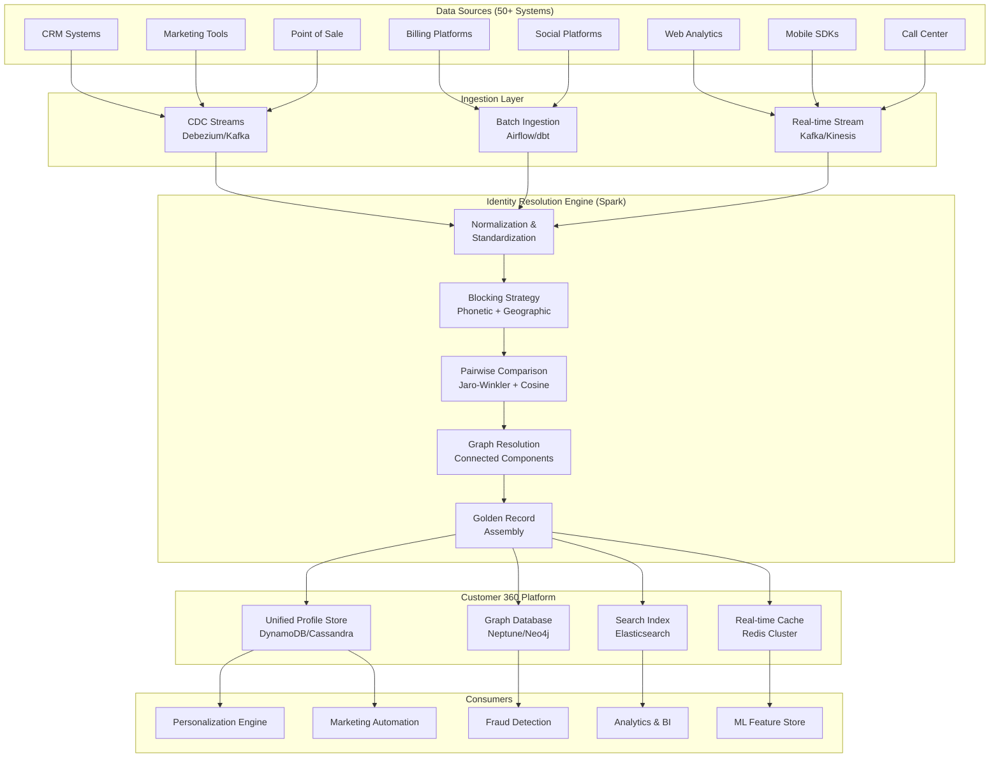
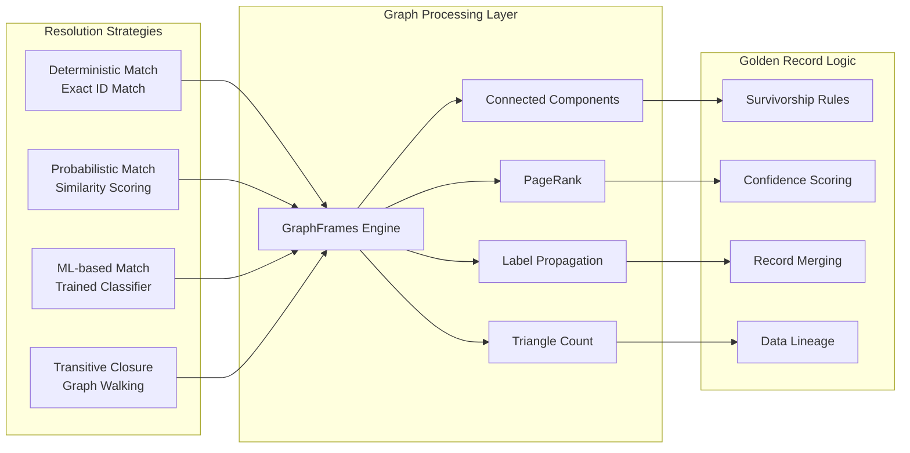
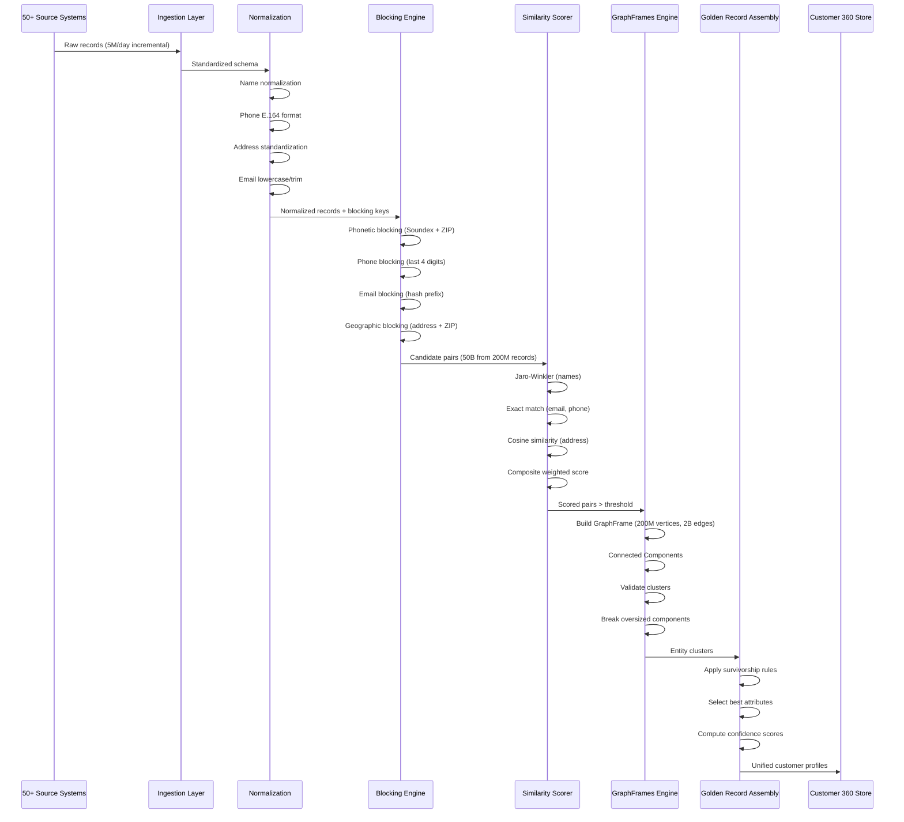
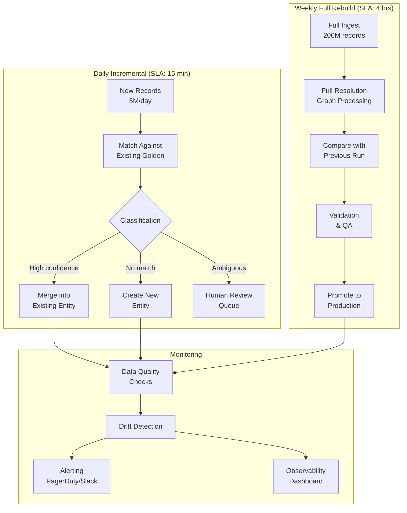
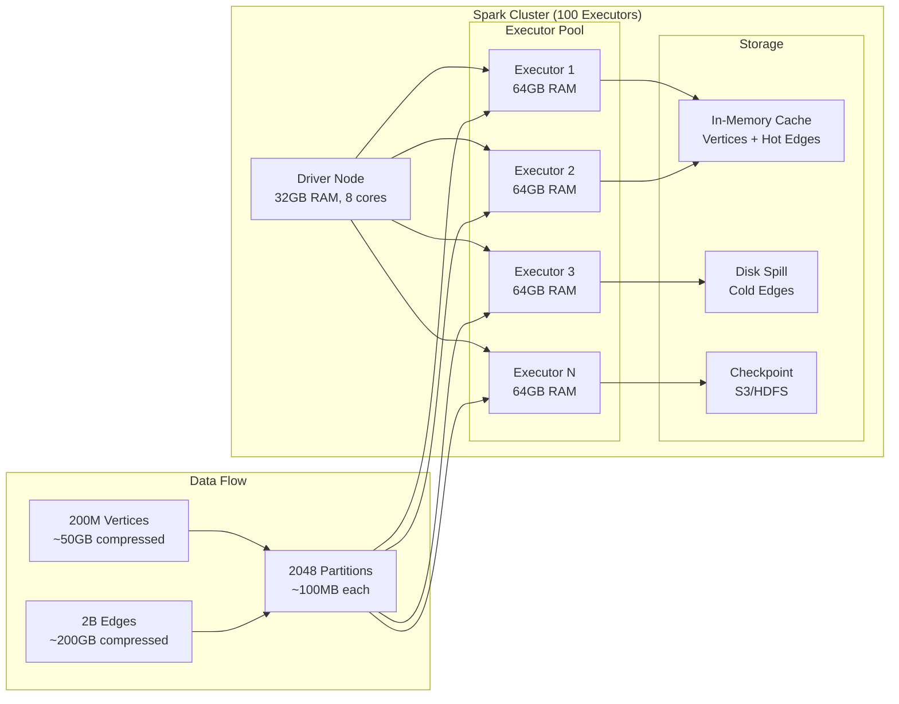
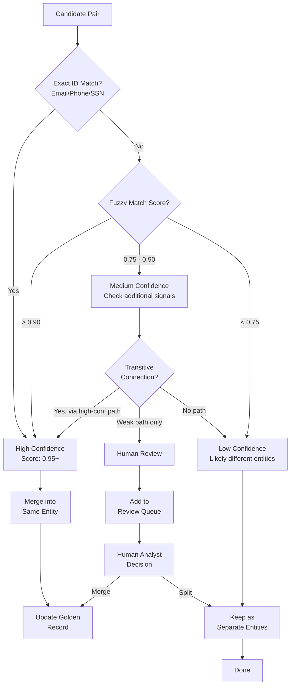
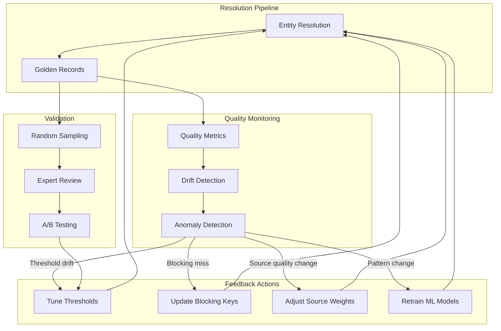

# Customer 360 & Entity Resolution with Spark GraphX at Billion Scale

## 1. Problem Statement

### The Identity Crisis at Enterprise Scale

Modern enterprises face a fundamental challenge: customer data is fragmented across 50+ systems,
creating an incomplete and often contradictory view of each customer. This fragmentation leads to:

- **200M+ customer records** spread across CRM, billing, marketing, support, web analytics, mobile apps
- **2B+ identity fragments** including emails, phone numbers, device IDs, cookies, loyalty IDs
- **No single source of truth** — the same person appears as 15-20 different records
- **Data quality degradation** — 30% of records have conflicting information
- **Revenue leakage** — duplicate marketing spend, missed cross-sell, poor personalization

### Systems Contributing to Fragmentation

| System Category | Examples | Identity Keys |
|----------------|----------|---------------|
| CRM | Salesforce, HubSpot, Dynamics | Email, Account ID |
| Billing | SAP, Oracle, NetSuite | Billing ID, SSN fragment |
| Marketing | Marketo, Pardot, Mailchimp | Email, Cookie ID |
| Web Analytics | GA4, Adobe Analytics | Device ID, Session ID |
| Mobile | Firebase, Amplitude | IDFA, GAID, App User ID |
| Support | Zendesk, ServiceNow | Ticket Email, Phone |
| Social | Facebook, LinkedIn | Social ID, Email |
| Point of Sale | Square, Shopify | Card Token, Loyalty ID |
| Call Center | Genesys, Five9 | Phone, ANI |
| IoT/Connected | Device Telemetry | Device Serial, MAC |

### Scale Requirements

```
Total customer records:     200,000,000
Identity fragments:         2,000,000,000
Pairwise comparisons (naive): 2 x 10^16 (impossible)
Pairwise after blocking:    50,000,000,000 (feasible with Spark)
Graph vertices:             200,000,000
Graph edges:                2,000,000,000
Daily incremental records:  5,000,000
Resolution SLA:             < 4 hours for full rebuild
Incremental SLA:            < 15 minutes
```

---

## 2. Architecture Overview

### Entity Resolution Pipeline



### Customer 360 Platform Architecture



---

## 3. Spark GraphX / GraphFrames Core Concepts

### 3.1 Vertices and Edges

In the context of Customer 360:
- **Vertices** = Identity fragments (each record from each source system)
- **Edges** = Relationships between fragments (shared email, same phone, same address, etc.)

```python
from pyspark.sql import SparkSession
from pyspark.sql.types import *
from pyspark.sql.functions import *
from graphframes import GraphFrame

spark = SparkSession.builder \
    .appName("Customer360-GraphConcepts") \
    .config("spark.jars.packages", "graphframes:graphframes:0.8.3-spark3.5-s_2.12") \
    .getOrCreate()

# Vertices: Each identity fragment is a vertex
vertices_schema = StructType([
    StructField("id", StringType(), False),           # Unique fragment ID
    StructField("source_system", StringType(), True),
    StructField("first_name", StringType(), True),
    StructField("last_name", StringType(), True),
    StructField("email", StringType(), True),
    StructField("phone", StringType(), True),
    StructField("address", StringType(), True),
    StructField("city", StringType(), True),
    StructField("state", StringType(), True),
    StructField("zip_code", StringType(), True),
    StructField("dob", DateType(), True),
    StructField("record_quality_score", FloatType(), True),
    StructField("last_updated", TimestampType(), True),
])

# Edges: Relationships between fragments
edges_schema = StructType([
    StructField("src", StringType(), False),
    StructField("dst", StringType(), False),
    StructField("relationship_type", StringType(), True),  # same_email, same_phone, similar_name
    StructField("confidence_score", FloatType(), True),
    StructField("match_attributes", StringType(), True),
])
```

### 3.2 Pregel API (Message Passing)

The Pregel model is the foundation of iterative graph computation:
- Each vertex has a state
- In each superstep, vertices send messages to neighbors
- Vertices update their state based on received messages
- Computation halts when no more messages are sent

```python
from graphframes.lib import Pregel

def entity_resolution_pregel(graph):
    """
    Use Pregel to propagate cluster IDs through the graph.
    Each vertex starts with its own ID as cluster ID.
    In each iteration, vertices adopt the minimum cluster ID from neighbors.
    """
    result = graph.pregel \
        .setMaxIter(10) \
        .withVertexColumn(
            "cluster_id",
            col("id"),  # Initial value: own ID
            coalesce(
                Pregel.msg(),  # Message from neighbors
                col("cluster_id")  # Keep current if no message
            )
        ) \
        .sendMsgToDst(
            when(
                Pregel.src("cluster_id") < Pregel.dst("cluster_id"),
                Pregel.src("cluster_id")
            )
        ) \
        .sendMsgToSrc(
            when(
                Pregel.dst("cluster_id") < Pregel.src("cluster_id"),
                Pregel.dst("cluster_id")
            )
        ) \
        .aggMsgs(min(Pregel.msg())) \
        .run()
    
    return result
```

### 3.3 Connected Components

The most critical algorithm for entity resolution — finds all vertices reachable from each other:

```python
def find_customer_clusters(graph):
    """
    Connected Components identifies which fragments belong to the same customer.
    All fragments in a connected component = same real-world entity.
    """
    # Requires checkpoint directory for iterative computation
    spark.sparkContext.setCheckpointDir("/tmp/graphframes-checkpoints")
    
    # Run connected components
    cc_result = graph.connectedComponents()
    
    # Each vertex now has a 'component' column = cluster ID
    cluster_stats = cc_result.groupBy("component") \
        .agg(
            count("*").alias("cluster_size"),
            countDistinct("source_system").alias("source_count"),
            collect_set("source_system").alias("sources")
        )
    
    return cc_result, cluster_stats
```

### 3.4 PageRank for Influence Scoring

```python
def compute_influence_scores(graph, reset_probability=0.15, max_iter=20):
    """
    PageRank identifies the most authoritative/influential identity fragment.
    Higher PageRank = more connections = more authoritative record.
    Used to select the 'golden record' source for each attribute.
    """
    pr_result = graph.pageRank(
        resetProbability=reset_probability,
        maxIter=max_iter
    )
    
    # Vertices now have 'pagerank' column
    return pr_result.vertices.orderBy(desc("pagerank"))
```

### 3.5 Label Propagation for Community Detection

```python
def detect_households(graph, max_iter=5):
    """
    Label Propagation finds communities (households, organizations).
    Vertices adopt the label most common among their neighbors.
    """
    lp_result = graph.labelPropagation(maxIter=max_iter)
    
    # Group by label to find household clusters
    households = lp_result.groupBy("label") \
        .agg(
            count("*").alias("household_size"),
            collect_list("first_name").alias("members")
        ) \
        .filter(col("household_size") > 1)
    
    return households
```

---

## 4. Entity Resolution Implementation

### 4.1 Data Normalization & Standardization

```python
from pyspark.sql.functions import (
    col, lower, trim, regexp_replace, soundex, 
    substring, concat, lit, when, udf, sha2
)
from pyspark.sql.types import StringType, FloatType, ArrayType

class DataNormalizer:
    """Standardize identity attributes across all source systems."""
    
    @staticmethod
    def normalize_name(df, col_name):
        """Normalize name fields."""
        return df.withColumn(
            f"{col_name}_normalized",
            trim(
                regexp_replace(
                    regexp_replace(
                        lower(col(col_name)),
                        r"[^a-z\s\-']", ""  # Remove special chars
                    ),
                    r"\s+", " "  # Collapse whitespace
                )
            )
        )
    
    @staticmethod
    def normalize_phone(df, col_name):
        """Normalize phone to E.164 format."""
        return df.withColumn(
            f"{col_name}_normalized",
            regexp_replace(
                regexp_replace(col(col_name), r"[^\d]", ""),
                r"^1(\d{10})$", "$1"  # Remove leading country code
            )
        )
    
    @staticmethod
    def normalize_email(df, col_name):
        """Normalize email addresses."""
        return df.withColumn(
            f"{col_name}_normalized",
            lower(trim(col(col_name)))
        ).withColumn(
            f"{col_name}_domain",
            regexp_replace(lower(trim(col(col_name))), r".*@", "")
        )
    
    @staticmethod
    def normalize_address(df):
        """Standardize address components."""
        address_abbreviations = {
            "street": "st", "avenue": "ave", "boulevard": "blvd",
            "drive": "dr", "lane": "ln", "road": "rd",
            "court": "ct", "place": "pl", "circle": "cir",
            "apartment": "apt", "suite": "ste", "unit": "unit"
        }
        
        result = df.withColumn(
            "address_normalized",
            lower(trim(col("address")))
        )
        
        for full, abbr in address_abbreviations.items():
            result = result.withColumn(
                "address_normalized",
                regexp_replace(col("address_normalized"), full, abbr)
            )
        
        return result.withColumn(
            "address_normalized",
            regexp_replace(col("address_normalized"), r"[^a-z0-9\s]", "")
        )

    @staticmethod
    def create_blocking_keys(df):
        """Generate multiple blocking keys for each record."""
        return df \
            .withColumn("block_soundex_ln",
                concat(soundex(col("last_name_normalized")), 
                       substring(col("zip_code"), 1, 3))) \
            .withColumn("block_phone_last4",
                substring(col("phone_normalized"), -4, 4)) \
            .withColumn("block_email_hash",
                substring(sha2(col("email_normalized"), 256), 1, 8)) \
            .withColumn("block_name_dob",
                concat(
                    substring(col("first_name_normalized"), 1, 2),
                    substring(col("last_name_normalized"), 1, 3),
                    col("dob").cast("string")
                )) \
            .withColumn("block_address",
                concat(
                    regexp_replace(col("address_normalized"), r"\s+", ""),
                    col("zip_code")
                ))
```

### 4.2 Blocking Strategy

Blocking reduces the comparison space from O(n^2) to manageable levels:

```python
class BlockingStrategy:
    """
    Multi-pass blocking to generate candidate pairs.
    Each blocking pass uses different keys to catch different match patterns.
    """
    
    def __init__(self, spark):
        self.spark = spark
    
    def phonetic_blocking(self, df):
        """
        Block on Soundex of last name + first 3 digits of ZIP.
        Catches: spelling variations, typos in names.
        """
        blocked = df.groupBy("block_soundex_ln") \
            .agg(
                collect_list(struct("*")).alias("records"),
                count("*").alias("block_size")
            ) \
            .filter(col("block_size").between(2, 1000))  # Filter mega-blocks
        
        return blocked
    
    def phone_blocking(self, df):
        """
        Block on last 4 digits of phone number.
        Catches: different formatting of same phone.
        """
        return df.filter(col("phone_normalized").isNotNull()) \
            .groupBy("block_phone_last4") \
            .agg(
                collect_list(struct("*")).alias("records"),
                count("*").alias("block_size")
            ) \
            .filter(col("block_size").between(2, 500))
    
    def email_blocking(self, df):
        """
        Block on email hash prefix.
        Catches: exact email matches across systems.
        """
        return df.filter(col("email_normalized").isNotNull()) \
            .groupBy("block_email_hash") \
            .agg(
                collect_list(struct("*")).alias("records"),
                count("*").alias("block_size")
            ) \
            .filter(col("block_size").between(2, 200))
    
    def geographic_blocking(self, df):
        """
        Block on address + ZIP.
        Catches: same household, address variations.
        """
        return df.filter(col("address_normalized").isNotNull()) \
            .groupBy("block_address") \
            .agg(
                collect_list(struct("*")).alias("records"),
                count("*").alias("block_size")
            ) \
            .filter(col("block_size").between(2, 100))
    
    def generate_candidate_pairs(self, df):
        """
        Multi-pass blocking: union candidates from all strategies.
        Deduplicates pairs to avoid redundant comparisons.
        """
        from pyspark.sql.functions import explode, arrays_zip, col
        
        # Run all blocking strategies
        phonetic_blocks = self.phonetic_blocking(df)
        phone_blocks = self.phone_blocking(df)
        email_blocks = self.email_blocking(df)
        geo_blocks = self.geographic_blocking(df)
        
        def blocks_to_pairs(blocks_df, block_type):
            """Convert blocks to candidate pairs using self-join within blocks."""
            exploded = blocks_df.select(
                explode("records").alias("record")
            ).select("record.*")
            
            # Self-join within each block
            left = exploded.alias("left")
            right = exploded.alias("right")
            
            pairs = left.join(
                right,
                (col("left.block_soundex_ln") == col("right.block_soundex_ln")) &
                (col("left.id") < col("right.id")),  # Avoid self-pairs and duplicates
                "inner"
            ).select(
                col("left.id").alias("id_left"),
                col("right.id").alias("id_right"),
                lit(block_type).alias("block_source")
            )
            
            return pairs
        
        # Generate pairs from each blocking strategy
        all_pairs = blocks_to_pairs(phonetic_blocks, "phonetic") \
            .union(blocks_to_pairs(phone_blocks, "phone")) \
            .union(blocks_to_pairs(email_blocks, "email")) \
            .union(blocks_to_pairs(geo_blocks, "geographic"))
        
        # Deduplicate pairs
        unique_pairs = all_pairs.dropDuplicates(["id_left", "id_right"])
        
        return unique_pairs
```

### 4.3 Pairwise Comparison (Similarity Scoring)

```python
import jellyfish
from pyspark.sql.functions import udf
from pyspark.sql.types import FloatType, StructType, StructField

class SimilarityScorer:
    """Compute similarity scores between candidate pairs."""
    
    @staticmethod
    @udf(FloatType())
    def jaro_winkler_similarity(s1, s2):
        """Jaro-Winkler similarity for name comparison."""
        if s1 is None or s2 is None:
            return 0.0
        try:
            return float(jellyfish.jaro_winkler_similarity(s1, s2))
        except:
            return 0.0
    
    @staticmethod
    @udf(FloatType())
    def levenshtein_similarity(s1, s2):
        """Normalized Levenshtein distance."""
        if s1 is None or s2 is None:
            return 0.0
        try:
            max_len = max(len(s1), len(s2))
            if max_len == 0:
                return 1.0
            dist = jellyfish.levenshtein_distance(s1, s2)
            return 1.0 - (dist / max_len)
        except:
            return 0.0
    
    @staticmethod
    @udf(FloatType())
    def exact_match_score(s1, s2):
        """Binary exact match."""
        if s1 is None or s2 is None:
            return 0.0
        return 1.0 if s1 == s2 else 0.0
    
    @staticmethod
    @udf(FloatType())
    def numeric_similarity(s1, s2):
        """Similarity for numeric strings (phone, ZIP)."""
        if s1 is None or s2 is None:
            return 0.0
        try:
            s1_clean = ''.join(filter(str.isdigit, s1))
            s2_clean = ''.join(filter(str.isdigit, s2))
            if not s1_clean or not s2_clean:
                return 0.0
            max_len = max(len(s1_clean), len(s2_clean))
            matching = sum(1 for a, b in zip(s1_clean, s2_clean) if a == b)
            return matching / max_len
        except:
            return 0.0
    
    @staticmethod
    @udf(FloatType())
    def address_cosine_similarity(addr1, addr2):
        """Token-based cosine similarity for addresses."""
        if addr1 is None or addr2 is None:
            return 0.0
        try:
            tokens1 = set(addr1.lower().split())
            tokens2 = set(addr2.lower().split())
            if not tokens1 or not tokens2:
                return 0.0
            intersection = tokens1 & tokens2
            return len(intersection) / (len(tokens1) * len(tokens2)) ** 0.5
        except:
            return 0.0
    
    def compute_composite_score(self, pairs_df, records_df):
        """
        Compute weighted composite similarity score for each candidate pair.
        """
        # Join pair records with their attributes
        left_records = records_df.alias("l")
        right_records = records_df.alias("r")
        
        scored_pairs = pairs_df \
            .join(left_records, pairs_df.id_left == col("l.id")) \
            .join(right_records, pairs_df.id_right == col("r.id"))
        
        # Compute individual field similarities
        scored_pairs = scored_pairs \
            .withColumn("sim_first_name",
                self.jaro_winkler_similarity(
                    col("l.first_name_normalized"),
                    col("r.first_name_normalized")
                )) \
            .withColumn("sim_last_name",
                self.jaro_winkler_similarity(
                    col("l.last_name_normalized"),
                    col("r.last_name_normalized")
                )) \
            .withColumn("sim_email",
                self.exact_match_score(
                    col("l.email_normalized"),
                    col("r.email_normalized")
                )) \
            .withColumn("sim_phone",
                self.numeric_similarity(
                    col("l.phone_normalized"),
                    col("r.phone_normalized")
                )) \
            .withColumn("sim_address",
                self.address_cosine_similarity(
                    col("l.address_normalized"),
                    col("r.address_normalized")
                )) \
            .withColumn("sim_dob",
                self.exact_match_score(
                    col("l.dob").cast("string"),
                    col("r.dob").cast("string")
                ))
        
        # Weighted composite score
        weights = {
            "sim_email": 0.30,
            "sim_phone": 0.20,
            "sim_last_name": 0.15,
            "sim_first_name": 0.10,
            "sim_address": 0.15,
            "sim_dob": 0.10,
        }
        
        composite_expr = sum(
            col(field) * weight 
            for field, weight in weights.items()
        )
        
        scored_pairs = scored_pairs.withColumn(
            "composite_score", composite_expr
        )
        
        return scored_pairs
```

### 4.4 Graph-Based Resolution with Connected Components

```python
class GraphEntityResolver:
    """
    Build a graph from high-confidence pairs and resolve entities
    using connected components.
    """
    
    def __init__(self, spark, match_threshold=0.75, high_confidence_threshold=0.90):
        self.spark = spark
        self.match_threshold = match_threshold
        self.high_confidence_threshold = high_confidence_threshold
    
    def build_resolution_graph(self, scored_pairs, records_df):
        """
        Build GraphFrame from scored pairs above threshold.
        """
        # Filter to matches above threshold
        edges = scored_pairs \
            .filter(col("composite_score") >= self.match_threshold) \
            .select(
                col("id_left").alias("src"),
                col("id_right").alias("dst"),
                col("composite_score").alias("weight"),
                when(col("composite_score") >= self.high_confidence_threshold, "high")
                    .otherwise("medium").alias("confidence_level")
            )
        
        # Vertices are all records
        vertices = records_df.select(
            col("id"),
            col("source_system"),
            col("first_name_normalized").alias("first_name"),
            col("last_name_normalized").alias("last_name"),
            col("email_normalized").alias("email"),
            col("phone_normalized").alias("phone"),
            col("record_quality_score"),
            col("last_updated")
        )
        
        # Create GraphFrame
        graph = GraphFrame(vertices, edges)
        
        return graph
    
    def resolve_entities(self, graph):
        """
        Run connected components to find entity clusters.
        Each connected component = one real-world entity.
        """
        # Set checkpoint directory (required for connected components)
        self.spark.sparkContext.setCheckpointDir(
            "s3a://data-lake/checkpoints/entity-resolution/"
        )
        
        # Run connected components
        resolved = graph.connectedComponents()
        
        # Add cluster statistics
        cluster_stats = resolved.groupBy("component") \
            .agg(
                count("*").alias("cluster_size"),
                countDistinct("source_system").alias("source_count"),
                collect_set("source_system").alias("source_systems"),
                max("record_quality_score").alias("max_quality_score"),
                min("record_quality_score").alias("min_quality_score"),
            )
        
        # Flag suspicious clusters (too large = potential false positives)
        cluster_stats = cluster_stats.withColumn(
            "needs_review",
            when(col("cluster_size") > 50, True).otherwise(False)
        )
        
        return resolved, cluster_stats
    
    def validate_clusters(self, resolved_df, graph):
        """
        Post-resolution validation to catch false merges.
        Uses graph structure to identify weak links.
        """
        # Find bridges (edges whose removal disconnects the component)
        # Approximate: edges with lowest weight in each component
        edges_with_components = graph.edges \
            .join(
                resolved_df.select("id", "component"),
                graph.edges.src == resolved_df.id
            ) \
            .select("src", "dst", "weight", "component")
        
        # Find minimum weight edge per component
        weak_links = edges_with_components.groupBy("component") \
            .agg(min("weight").alias("min_edge_weight")) \
            .filter(col("min_edge_weight") < 0.60)  # Suspicious weak links
        
        return weak_links
```

### 4.5 Golden Record Assembly

```python
class GoldenRecordAssembler:
    """
    Assemble the best 'golden record' from each entity cluster
    using survivorship rules.
    """
    
    # Source system priority for each attribute
    SOURCE_PRIORITY = {
        "first_name": ["CRM", "BILLING", "MARKETING", "WEB"],
        "last_name": ["CRM", "BILLING", "MARKETING", "WEB"],
        "email": ["CRM", "MARKETING", "BILLING", "WEB"],
        "phone": ["BILLING", "CRM", "CALL_CENTER", "MARKETING"],
        "address": ["BILLING", "CRM", "POS", "MARKETING"],
        "dob": ["BILLING", "CRM", "GOVERNMENT", "MARKETING"],
    }
    
    # Recency vs authority weights
    SURVIVORSHIP_WEIGHTS = {
        "recency": 0.4,
        "authority": 0.3,
        "completeness": 0.2,
        "frequency": 0.1,
    }
    
    def __init__(self, spark):
        self.spark = spark
    
    def assemble_golden_records(self, resolved_df):
        """
        For each cluster (component), select the best value for each attribute.
        """
        from pyspark.sql.window import Window
        
        # Window per cluster, ordered by quality
        cluster_window = Window.partitionBy("component") \
            .orderBy(
                desc("record_quality_score"),
                desc("last_updated")
            )
        
        # Rank records within each cluster
        ranked = resolved_df.withColumn(
            "rank_in_cluster", row_number().over(cluster_window)
        )
        
        # For each cluster, apply survivorship rules
        golden_records = resolved_df.groupBy("component") \
            .agg(
                # Best name: highest quality source
                first("first_name", ignorenulls=True).alias("golden_first_name"),
                first("last_name", ignorenulls=True).alias("golden_last_name"),
                
                # Best email: most recent non-null
                first("email", ignorenulls=True).alias("golden_email"),
                
                # All emails for the entity
                collect_set("email").alias("all_emails"),
                
                # Best phone
                first("phone", ignorenulls=True).alias("golden_phone"),
                collect_set("phone").alias("all_phones"),
                
                # Metadata
                count("*").alias("fragment_count"),
                countDistinct("source_system").alias("source_count"),
                collect_set("source_system").alias("all_sources"),
                max("last_updated").alias("last_activity"),
                max("record_quality_score").alias("confidence_score"),
                
                # Generate stable customer ID
                min("id").alias("customer_id"),  # Deterministic: smallest fragment ID
            )
        
        return golden_records
    
    def compute_completeness_score(self, golden_records):
        """Score how complete each golden record is."""
        required_fields = [
            "golden_first_name", "golden_last_name", "golden_email",
            "golden_phone"
        ]
        
        completeness_expr = sum(
            when(col(f).isNotNull(), 1).otherwise(0)
            for f in required_fields
        ) / len(required_fields)
        
        return golden_records.withColumn(
            "completeness_score", completeness_expr
        )
    
    def write_golden_records(self, golden_records, output_path):
        """Write golden records to data lake with partitioning."""
        golden_records \
            .withColumn("partition_date", current_date()) \
            .withColumn("partition_bucket", 
                abs(hash(col("customer_id"))) % 256) \
            .repartition(256, "partition_bucket") \
            .write \
            .mode("overwrite") \
            .partitionBy("partition_date", "partition_bucket") \
            .parquet(output_path)
```

---

## 5. Graph Analytics

### 5.1 Household Detection

```python
class HouseholdDetector:
    """
    Detect household relationships using graph analytics.
    Members of the same household share address and/or last name.
    """
    
    def __init__(self, spark):
        self.spark = spark
    
    def build_household_graph(self, golden_records):
        """
        Build a graph where edges represent potential household relationships.
        """
        # Vertices = golden records (resolved customers)
        vertices = golden_records.select(
            col("customer_id").alias("id"),
            col("golden_first_name").alias("first_name"),
            col("golden_last_name").alias("last_name"),
            col("golden_email").alias("email"),
            col("golden_phone").alias("phone"),
        )
        
        # Edges: same address OR same last name + same ZIP
        address_edges = golden_records.alias("a") \
            .join(
                golden_records.alias("b"),
                (col("a.golden_address") == col("b.golden_address")) &
                (col("a.customer_id") < col("b.customer_id")) &
                (col("a.golden_address").isNotNull()),
                "inner"
            ) \
            .select(
                col("a.customer_id").alias("src"),
                col("b.customer_id").alias("dst"),
                lit("same_address").alias("relationship"),
                lit(0.9).alias("weight")
            )
        
        lastname_edges = golden_records.alias("a") \
            .join(
                golden_records.alias("b"),
                (col("a.golden_last_name") == col("b.golden_last_name")) &
                (col("a.golden_zip") == col("b.golden_zip")) &
                (col("a.customer_id") < col("b.customer_id")),
                "inner"
            ) \
            .select(
                col("a.customer_id").alias("src"),
                col("b.customer_id").alias("dst"),
                lit("same_lastname_zip").alias("relationship"),
                lit(0.7).alias("weight")
            )
        
        edges = address_edges.union(lastname_edges)
        
        graph = GraphFrame(vertices, edges)
        return graph
    
    def detect_households(self, graph):
        """Run label propagation to detect household clusters."""
        households = graph.labelPropagation(maxIter=5)
        
        # Aggregate household information
        household_profiles = households.groupBy("label") \
            .agg(
                count("*").alias("household_size"),
                collect_list("first_name").alias("member_names"),
                first("last_name").alias("household_name"),
                sum("lifetime_value").alias("household_ltv"),
            ) \
            .filter(col("household_size").between(2, 10)) \
            .withColumnRenamed("label", "household_id")
        
        return household_profiles
```

### 5.2 Influence Scoring with PageRank

```python
class InfluenceScorer:
    """
    Compute customer influence scores using PageRank.
    Customers who refer others, share content, or connect communities
    have higher influence.
    """
    
    def __init__(self, spark):
        self.spark = spark
    
    def build_interaction_graph(self, transactions_df, referrals_df, social_df):
        """
        Build multi-relational graph from customer interactions.
        """
        vertices = transactions_df.select(
            col("customer_id").alias("id")
        ).distinct()
        
        # Referral edges (high weight)
        referral_edges = referrals_df.select(
            col("referrer_id").alias("src"),
            col("referred_id").alias("dst"),
            lit("referral").alias("type"),
            lit(3.0).alias("weight")
        )
        
        # Co-purchase edges (medium weight)
        copurchase_edges = transactions_df.alias("a") \
            .join(
                transactions_df.alias("b"),
                (col("a.product_id") == col("b.product_id")) &
                (col("a.customer_id") < col("b.customer_id")) &
                (abs(datediff(col("a.purchase_date"), col("b.purchase_date"))) <= 7),
                "inner"
            ) \
            .select(
                col("a.customer_id").alias("src"),
                col("b.customer_id").alias("dst"),
                lit("co_purchase").alias("type"),
                lit(1.0).alias("weight")
            )
        
        # Social connection edges
        social_edges = social_df.select(
            col("user_id").alias("src"),
            col("connected_user_id").alias("dst"),
            lit("social").alias("type"),
            lit(2.0).alias("weight")
        )
        
        edges = referral_edges \
            .union(copurchase_edges) \
            .union(social_edges)
        
        graph = GraphFrame(vertices, edges)
        return graph
    
    def compute_influence(self, graph):
        """Run PageRank to compute influence scores."""
        pr_result = graph.pageRank(
            resetProbability=0.15,
            maxIter=20
        )
        
        # Normalize scores to 0-100
        from pyspark.sql.window import Window
        
        w = Window.orderBy("pagerank")
        influence_scores = pr_result.vertices \
            .withColumn(
                "influence_percentile",
                percent_rank().over(w) * 100
            ) \
            .withColumn(
                "influence_tier",
                when(col("influence_percentile") >= 95, "platinum")
                .when(col("influence_percentile") >= 80, "gold")
                .when(col("influence_percentile") >= 50, "silver")
                .otherwise("bronze")
            )
        
        return influence_scores
```

### 5.3 Fraud Ring Detection

```python
class FraudRingDetector:
    """
    Detect fraud rings using graph patterns:
    - Shared identifiers across accounts that shouldn't share them
    - Dense subgraphs indicating coordinated activity
    - Unusual transaction patterns within communities
    """
    
    def __init__(self, spark):
        self.spark = spark
    
    def build_fraud_graph(self, accounts_df, transactions_df, devices_df):
        """
        Build graph connecting accounts through shared attributes.
        """
        vertices = accounts_df.select(
            col("account_id").alias("id"),
            col("creation_date"),
            col("account_status"),
            col("risk_score")
        )
        
        # Shared device edges
        device_edges = devices_df.alias("a") \
            .join(
                devices_df.alias("b"),
                (col("a.device_fingerprint") == col("b.device_fingerprint")) &
                (col("a.account_id") != col("b.account_id")),
                "inner"
            ) \
            .select(
                col("a.account_id").alias("src"),
                col("b.account_id").alias("dst"),
                lit("shared_device").alias("type"),
                lit(0.8).alias("suspicion_weight")
            )
        
        # Shared IP edges
        ip_edges = transactions_df.alias("a") \
            .join(
                transactions_df.alias("b"),
                (col("a.ip_address") == col("b.ip_address")) &
                (col("a.account_id") != col("b.account_id")) &
                (abs(datediff(col("a.txn_date"), col("b.txn_date"))) <= 1),
                "inner"
            ) \
            .select(
                col("a.account_id").alias("src"),
                col("b.account_id").alias("dst"),
                lit("shared_ip").alias("type"),
                lit(0.6).alias("suspicion_weight")
            )
        
        # Money flow edges
        money_flow_edges = transactions_df \
            .filter(col("transaction_type") == "transfer") \
            .select(
                col("sender_account").alias("src"),
                col("receiver_account").alias("dst"),
                lit("money_flow").alias("type"),
                lit(0.5).alias("suspicion_weight")
            )
        
        edges = device_edges.union(ip_edges).union(money_flow_edges)
        graph = GraphFrame(vertices, edges)
        return graph
    
    def detect_rings(self, graph):
        """
        Detect fraud rings using multiple graph algorithms.
        """
        # 1. Find connected components (potential rings)
        self.spark.sparkContext.setCheckpointDir("/tmp/fraud-checkpoints")
        components = graph.connectedComponents()
        
        # 2. Compute triangle count (dense subgraphs = coordinated fraud)
        triangles = graph.triangleCount()
        
        # 3. Find suspicious components
        ring_candidates = components.groupBy("component") \
            .agg(
                count("*").alias("ring_size"),
                avg("risk_score").alias("avg_risk"),
                sum(when(col("account_status") == "flagged", 1).otherwise(0))
                    .alias("flagged_count")
            ) \
            .filter(
                (col("ring_size") >= 3) &
                (col("ring_size") <= 100) &
                ((col("avg_risk") > 0.7) | (col("flagged_count") >= 2))
            ) \
            .withColumn("ring_score",
                col("ring_size") * col("avg_risk") * 
                (1 + col("flagged_count") * 0.5)
            ) \
            .orderBy(desc("ring_score"))
        
        # 4. Get ring members with details
        ring_members = components.join(
            ring_candidates.select("component", "ring_score"),
            "component"
        ).orderBy(desc("ring_score"), "component")
        
        return ring_candidates, ring_members
    
    def find_motifs(self, graph):
        """
        Use motif finding to detect specific fraud patterns.
        """
        # Pattern: A sends money to B, B sends money to C, C sends back to A
        circular_flow = graph.find("(a)-[e1]->(b); (b)-[e2]->(c); (c)-[e3]->(a)") \
            .filter(
                (col("e1.type") == "money_flow") &
                (col("e2.type") == "money_flow") &
                (col("e3.type") == "money_flow")
            )
        
        # Pattern: Multiple accounts sharing same device
        shared_device_cluster = graph.find(
            "(a)-[e1]->(hub); (b)-[e2]->(hub); (c)-[e3]->(hub)"
        ).filter(
            (col("e1.type") == "shared_device") &
            (col("e2.type") == "shared_device") &
            (col("e3.type") == "shared_device") &
            (col("a.id") != col("b.id")) &
            (col("b.id") != col("c.id"))
        )
        
        return circular_flow, shared_device_cluster
```

---

## 6. Complete Production Pipeline

### 6.1 End-to-End Entity Resolution Pipeline

```python
"""
Production Entity Resolution Pipeline
--------------------------------------
Processes 200M customer records across 50+ systems
Resolves 2B identity fragments into unified customer profiles
"""

from pyspark.sql import SparkSession
from pyspark.sql.functions import *
from pyspark.sql.types import *
from pyspark.sql.window import Window
from graphframes import GraphFrame
from datetime import datetime, timedelta
import logging

# Configure logging
logging.basicConfig(level=logging.INFO)
logger = logging.getLogger("EntityResolution")


class ProductionEntityResolutionPipeline:
    """
    End-to-end production pipeline for Customer 360 entity resolution.
    """
    
    def __init__(self, config):
        self.config = config
        self.spark = self._create_spark_session()
        self.normalizer = DataNormalizer()
        self.blocker = BlockingStrategy(self.spark)
        self.scorer = SimilarityScorer()
        self.resolver = GraphEntityResolver(
            self.spark,
            match_threshold=config["match_threshold"],
            high_confidence_threshold=config["high_confidence_threshold"]
        )
        self.assembler = GoldenRecordAssembler(self.spark)
        self.metrics = PipelineMetrics()
    
    def _create_spark_session(self):
        """Create optimized Spark session for graph processing."""
        return SparkSession.builder \
            .appName("Customer360-EntityResolution-Production") \
            .config("spark.jars.packages", 
                    "graphframes:graphframes:0.8.3-spark3.5-s_2.12") \
            .config("spark.sql.shuffle.partitions", "2048") \
            .config("spark.default.parallelism", "2048") \
            .config("spark.sql.adaptive.enabled", "true") \
            .config("spark.sql.adaptive.coalescePartitions.enabled", "true") \
            .config("spark.sql.adaptive.skewJoin.enabled", "true") \
            .config("spark.serializer", "org.apache.spark.serializer.KryoSerializer") \
            .config("spark.kryoserializer.buffer.max", "1024m") \
            .config("spark.driver.memory", "32g") \
            .config("spark.executor.memory", "64g") \
            .config("spark.executor.cores", "8") \
            .config("spark.executor.instances", "100") \
            .config("spark.memory.fraction", "0.8") \
            .config("spark.memory.storageFraction", "0.3") \
            .config("spark.sql.broadcastTimeout", "600") \
            .config("spark.network.timeout", "800s") \
            .config("spark.sql.parquet.compression.codec", "zstd") \
            .config("spark.checkpoint.compress", "true") \
            .config("spark.graphx.pregel.checkpointInterval", "4") \
            .getOrCreate()
    
    def run_full_pipeline(self):
        """Execute the full entity resolution pipeline."""
        start_time = datetime.now()
        logger.info(f"Starting full entity resolution pipeline at {start_time}")
        
        try:
            # Step 1: Ingest and normalize
            logger.info("Step 1: Ingesting and normalizing records...")
            raw_records = self._ingest_all_sources()
            normalized = self._normalize_records(raw_records)
            self.metrics.record_count = normalized.count()
            logger.info(f"Normalized {self.metrics.record_count:,} records")
            
            # Step 2: Blocking
            logger.info("Step 2: Generating candidate pairs via blocking...")
            candidate_pairs = self.blocker.generate_candidate_pairs(normalized)
            candidate_pairs.cache()
            self.metrics.candidate_pairs = candidate_pairs.count()
            logger.info(f"Generated {self.metrics.candidate_pairs:,} candidate pairs")
            
            # Step 3: Pairwise scoring
            logger.info("Step 3: Computing pairwise similarity scores...")
            scored_pairs = self.scorer.compute_composite_score(
                candidate_pairs, normalized
            )
            scored_pairs.cache()
            
            # Step 4: Graph resolution
            logger.info("Step 4: Building resolution graph...")
            graph = self.resolver.build_resolution_graph(scored_pairs, normalized)
            
            logger.info("Step 5: Running connected components...")
            resolved, cluster_stats = self.resolver.resolve_entities(graph)
            self.metrics.cluster_count = cluster_stats.count()
            logger.info(f"Resolved into {self.metrics.cluster_count:,} entities")
            
            # Step 5: Validation
            logger.info("Step 6: Validating clusters...")
            weak_links = self.resolver.validate_clusters(resolved, graph)
            self.metrics.suspicious_clusters = weak_links.count()
            
            # Step 6: Golden record assembly
            logger.info("Step 7: Assembling golden records...")
            golden_records = self.assembler.assemble_golden_records(resolved)
            golden_records = self.assembler.compute_completeness_score(golden_records)
            
            # Step 7: Write outputs
            logger.info("Step 8: Writing outputs...")
            self._write_outputs(golden_records, resolved, cluster_stats)
            
            # Step 8: Compute graph analytics
            logger.info("Step 9: Running graph analytics...")
            self._run_graph_analytics(graph, golden_records)
            
            end_time = datetime.now()
            duration = end_time - start_time
            logger.info(f"Pipeline completed in {duration}")
            self.metrics.duration_seconds = duration.total_seconds()
            self._publish_metrics()
            
        except Exception as e:
            logger.error(f"Pipeline failed: {str(e)}")
            self._alert_on_failure(e)
            raise
    
    def _ingest_all_sources(self):
        """Ingest from all source systems."""
        sources = [
            ("s3a://data-lake/raw/crm/", "CRM"),
            ("s3a://data-lake/raw/billing/", "BILLING"),
            ("s3a://data-lake/raw/marketing/", "MARKETING"),
            ("s3a://data-lake/raw/web_analytics/", "WEB"),
            ("s3a://data-lake/raw/mobile/", "MOBILE"),
            ("s3a://data-lake/raw/social/", "SOCIAL"),
            ("s3a://data-lake/raw/pos/", "POS"),
            ("s3a://data-lake/raw/call_center/", "CALL_CENTER"),
        ]
        
        all_records = None
        for path, source_name in sources:
            df = self.spark.read.parquet(path) \
                .withColumn("source_system", lit(source_name)) \
                .withColumn("ingestion_timestamp", current_timestamp())
            
            if all_records is None:
                all_records = df
            else:
                all_records = all_records.unionByName(df, allowMissingColumns=True)
        
        return all_records
    
    def _normalize_records(self, df):
        """Apply all normalization steps."""
        result = df
        result = self.normalizer.normalize_name(result, "first_name")
        result = self.normalizer.normalize_name(result, "last_name")
        result = self.normalizer.normalize_phone(result, "phone")
        result = self.normalizer.normalize_email(result, "email")
        result = self.normalizer.normalize_address(result)
        result = self.normalizer.create_blocking_keys(result)
        
        # Compute record quality score
        result = result.withColumn(
            "record_quality_score",
            (
                when(col("email_normalized").isNotNull(), 0.2).otherwise(0.0) +
                when(col("phone_normalized").isNotNull(), 0.2).otherwise(0.0) +
                when(col("first_name_normalized").isNotNull(), 0.15).otherwise(0.0) +
                when(col("last_name_normalized").isNotNull(), 0.15).otherwise(0.0) +
                when(col("address_normalized").isNotNull(), 0.15).otherwise(0.0) +
                when(col("dob").isNotNull(), 0.15).otherwise(0.0)
            )
        )
        
        return result
    
    def _write_outputs(self, golden_records, resolved, cluster_stats):
        """Write all pipeline outputs."""
        output_base = self.config["output_path"]
        run_date = datetime.now().strftime("%Y-%m-%d")
        
        # Golden records
        golden_records.write \
            .mode("overwrite") \
            .partitionBy("partition_bucket") \
            .parquet(f"{output_base}/golden_records/date={run_date}")
        
        # Resolution mapping (fragment -> customer)
        resolved.select("id", "component", "source_system") \
            .withColumnRenamed("component", "customer_id") \
            .write \
            .mode("overwrite") \
            .parquet(f"{output_base}/resolution_map/date={run_date}")
        
        # Cluster statistics
        cluster_stats.write \
            .mode("overwrite") \
            .parquet(f"{output_base}/cluster_stats/date={run_date}")
    
    def _run_graph_analytics(self, graph, golden_records):
        """Run additional graph analytics after resolution."""
        # Household detection
        household_detector = HouseholdDetector(self.spark)
        hh_graph = household_detector.build_household_graph(golden_records)
        households = household_detector.detect_households(hh_graph)
        
        households.write \
            .mode("overwrite") \
            .parquet(f"{self.config['output_path']}/households/")
        
        logger.info(f"Detected {households.count():,} households")
    
    def _publish_metrics(self):
        """Publish pipeline metrics to monitoring system."""
        metrics_data = {
            "pipeline": "entity_resolution",
            "timestamp": datetime.now().isoformat(),
            "record_count": self.metrics.record_count,
            "candidate_pairs": self.metrics.candidate_pairs,
            "cluster_count": self.metrics.cluster_count,
            "suspicious_clusters": self.metrics.suspicious_clusters,
            "duration_seconds": self.metrics.duration_seconds,
        }
        logger.info(f"Pipeline metrics: {metrics_data}")
    
    def _alert_on_failure(self, exception):
        """Send alert on pipeline failure."""
        logger.error(f"ALERT: Entity Resolution pipeline failed - {exception}")


class PipelineMetrics:
    """Track pipeline execution metrics."""
    def __init__(self):
        self.record_count = 0
        self.candidate_pairs = 0
        self.cluster_count = 0
        self.suspicious_clusters = 0
        self.duration_seconds = 0


# Pipeline configuration
PRODUCTION_CONFIG = {
    "match_threshold": 0.75,
    "high_confidence_threshold": 0.90,
    "output_path": "s3a://data-lake/customer360/",
    "checkpoint_path": "s3a://data-lake/checkpoints/",
    "max_cluster_size": 50,
    "blocking_max_block_size": 1000,
}

# Execute
if __name__ == "__main__":
    pipeline = ProductionEntityResolutionPipeline(PRODUCTION_CONFIG)
    pipeline.run_full_pipeline()
```

### 6.2 Incremental Resolution Pipeline

```python
class IncrementalEntityResolution:
    """
    Process daily incremental records (5M/day) and merge into existing graph.
    Target SLA: < 15 minutes.
    """
    
    def __init__(self, spark, config):
        self.spark = spark
        self.config = config
    
    def run_incremental(self, new_records_path, existing_golden_path):
        """
        Incrementally resolve new records against existing golden records.
        """
        logger.info("Starting incremental entity resolution...")
        
        # Load new records
        new_records = self.spark.read.parquet(new_records_path)
        new_count = new_records.count()
        logger.info(f"Processing {new_count:,} new records")
        
        # Load existing golden records
        existing = self.spark.read.parquet(existing_golden_path)
        
        # Normalize new records
        normalizer = DataNormalizer()
        normalized_new = normalizer.normalize_name(new_records, "first_name")
        normalized_new = normalizer.normalize_name(normalized_new, "last_name")
        normalized_new = normalizer.normalize_phone(normalized_new, "phone")
        normalized_new = normalizer.normalize_email(normalized_new, "email")
        normalized_new = normalizer.normalize_address(normalized_new)
        normalized_new = normalizer.create_blocking_keys(normalized_new)
        
        # Block new records against existing golden records
        candidate_pairs = self._block_against_existing(normalized_new, existing)
        
        # Score pairs
        scorer = SimilarityScorer()
        scored = scorer.compute_composite_score(candidate_pairs, normalized_new)
        
        # Classify: match to existing, create new, or flag for review
        matches = scored.filter(col("composite_score") >= self.config["match_threshold"])
        new_entities = scored.filter(col("composite_score") < self.config["new_entity_threshold"])
        review_queue = scored.filter(
            (col("composite_score") >= self.config["new_entity_threshold"]) &
            (col("composite_score") < self.config["match_threshold"])
        )
        
        # Update existing golden records with matches
        updated_golden = self._merge_matches(existing, matches, normalized_new)
        
        # Create new golden records for unmatched
        new_golden = self._create_new_golden(new_entities, normalized_new)
        
        # Combine
        final_golden = updated_golden.union(new_golden)
        
        # Write
        final_golden.write \
            .mode("overwrite") \
            .parquet(existing_golden_path)
        
        # Write review queue
        review_queue.write \
            .mode("append") \
            .parquet(f"{self.config['output_path']}/review_queue/")
        
        logger.info(
            f"Incremental complete: {matches.count()} matched, "
            f"{new_entities.count()} new, {review_queue.count()} for review"
        )
    
    def _block_against_existing(self, new_records, existing):
        """Block new records against existing golden records."""
        # Join on blocking keys
        pairs = new_records.alias("new").join(
            existing.alias("existing"),
            (
                (col("new.block_email_hash") == col("existing.email_hash")) |
                (col("new.block_phone_last4") == col("existing.phone_last4")) |
                (col("new.block_soundex_ln") == col("existing.soundex_ln"))
            ),
            "inner"
        ).select(
            col("new.id").alias("id_left"),
            col("existing.customer_id").alias("id_right"),
            lit("incremental_block").alias("block_source")
        )
        
        return pairs
    
    def _merge_matches(self, existing, matches, new_records):
        """Merge matched new records into existing golden records."""
        # Get the best match for each new record
        w = Window.partitionBy("id_left").orderBy(desc("composite_score"))
        best_matches = matches.withColumn("rank", row_number().over(w)) \
            .filter(col("rank") == 1) \
            .select("id_left", "id_right", "composite_score")
        
        # Update golden records with new information
        updated = existing.join(
            best_matches,
            existing.customer_id == best_matches.id_right,
            "left"
        ).withColumn(
            "fragment_count",
            when(col("id_left").isNotNull(), col("fragment_count") + 1)
                .otherwise(col("fragment_count"))
        ).withColumn(
            "last_activity", current_timestamp()
        ).drop("id_left", "id_right", "composite_score", "rank")
        
        return updated
    
    def _create_new_golden(self, new_entities, new_records):
        """Create golden records for truly new entities."""
        new_golden = new_records.join(
            new_entities.select("id_left").distinct(),
            new_records.id == new_entities.id_left
        ).select(
            col("id").alias("customer_id"),
            col("first_name_normalized").alias("golden_first_name"),
            col("last_name_normalized").alias("golden_last_name"),
            col("email_normalized").alias("golden_email"),
            col("phone_normalized").alias("golden_phone"),
            lit(1).alias("fragment_count"),
            lit(1).alias("source_count"),
            current_timestamp().alias("last_activity"),
            col("record_quality_score").alias("confidence_score"),
        )
        
        return new_golden
```

---

## 7. Scaling Strategy for 200M Vertices and 2B Edges

### 7.1 Partitioning Strategy

```python
class GraphPartitioningStrategy:
    """
    Strategies for partitioning large graphs across a Spark cluster.
    """
    
    @staticmethod
    def hash_partition_vertices(vertices_df, num_partitions=2048):
        """Hash partition vertices by ID for even distribution."""
        return vertices_df.repartition(num_partitions, "id")
    
    @staticmethod
    def edge_cut_partitioning(edges_df, num_partitions=2048):
        """
        Partition edges to minimize cross-partition communication.
        Co-locate edges with their source vertices.
        """
        return edges_df.repartition(num_partitions, "src")
    
    @staticmethod
    def geographic_partitioning(vertices_df, num_partitions=256):
        """
        Partition by geographic region for locality-aware processing.
        Useful for address-based blocking.
        """
        return vertices_df.repartition(num_partitions, "state", "zip_prefix")
    
    @staticmethod
    def hybrid_partitioning(vertices_df, edges_df):
        """
        Two-level partitioning:
        1. Coarse: by geographic region
        2. Fine: by hash within region
        """
        vertices_partitioned = vertices_df \
            .withColumn("zip_prefix", substring("zip_code", 1, 3)) \
            .withColumn("partition_key", 
                concat(col("zip_prefix"), lit("_"),
                       (hash("id") % 8).cast("string"))) \
            .repartition(2048, "partition_key")
        
        return vertices_partitioned


class ScalingOptimizations:
    """
    Performance optimizations for billion-scale graph processing.
    """
    
    @staticmethod
    def broadcast_small_tables(spark, df, threshold_mb=500):
        """Broadcast tables under threshold for map-side joins."""
        size_bytes = spark.sparkContext._jvm.org.apache.spark.sql \
            .functions.lit(0)  # Placeholder - use actual size estimation
        
        if df.count() < 10_000_000:  # Under 10M rows
            return broadcast(df)
        return df
    
    @staticmethod
    def iterative_connected_components(graph, max_component_size=1000):
        """
        For very large graphs, run connected components iteratively:
        1. First pass: find components using high-confidence edges only
        2. Second pass: attempt to merge components using lower-confidence edges
        3. Break oversized components
        """
        spark = graph.vertices.sparkSession
        spark.sparkContext.setCheckpointDir("s3a://data-lake/checkpoints/cc/")
        
        # Pass 1: High confidence only
        high_conf_edges = graph.edges.filter(col("weight") >= 0.90)
        high_conf_graph = GraphFrame(graph.vertices, high_conf_edges)
        pass1_result = high_conf_graph.connectedComponents()
        
        # Pass 2: Medium confidence, only between different components
        medium_edges = graph.edges.filter(
            (col("weight") >= 0.75) & (col("weight") < 0.90)
        )
        
        # Add component info to edges
        medium_with_components = medium_edges \
            .join(pass1_result.select("id", "component").alias("src_comp"),
                  medium_edges.src == col("src_comp.id")) \
            .join(pass1_result.select("id", "component").alias("dst_comp"),
                  medium_edges.dst == col("dst_comp.id")) \
            .filter(col("src_comp.component") != col("dst_comp.component"))
        
        # Pass 2 graph: components as vertices, medium edges between them
        # This dramatically reduces graph size
        component_vertices = pass1_result.select(
            col("component").alias("id")
        ).distinct()
        
        component_edges = medium_with_components.select(
            col("src_comp.component").alias("src"),
            col("dst_comp.component").alias("dst"),
            max("weight").alias("weight")
        ).groupBy("src", "dst").agg(max("weight").alias("weight"))
        
        meta_graph = GraphFrame(component_vertices, component_edges)
        pass2_result = meta_graph.connectedComponents()
        
        # Map back to original vertices
        final_mapping = pass1_result \
            .join(pass2_result.select(
                col("id").alias("old_component"),
                col("component").alias("final_component")
            ), pass1_result.component == col("old_component")) \
            .select("id", "final_component")
        
        return final_mapping
    
    @staticmethod
    def salted_join_for_skew(left_df, right_df, join_col, num_salts=10):
        """
        Handle skewed joins (mega-blocks) by salting keys.
        """
        # Add salt to the large side
        salted_left = left_df.withColumn(
            "salt", (rand() * num_salts).cast("int")
        ).withColumn(
            "salted_key", concat(col(join_col), lit("_"), col("salt"))
        )
        
        # Explode the small side to match all salts
        from pyspark.sql.functions import explode, array, sequence
        
        salted_right = right_df.crossJoin(
            spark.range(num_salts).withColumnRenamed("id", "salt")
        ).withColumn(
            "salted_key", concat(col(join_col), lit("_"), col("salt"))
        )
        
        # Join on salted key
        result = salted_left.join(salted_right, "salted_key") \
            .drop("salt", "salted_key")
        
        return result
    
    @staticmethod
    def checkpoint_strategy(df, iteration, interval=3):
        """Checkpoint every N iterations to prevent lineage explosion."""
        if iteration % interval == 0:
            df = df.checkpoint(eager=True)
        else:
            df = df.localCheckpoint(eager=True)
        return df
```

### 7.2 Memory Management

```python
class MemoryManagement:
    """
    Memory management strategies for large graph processing.
    """
    
    SPARK_MEMORY_CONFIG = {
        # Executor memory layout
        "spark.executor.memory": "64g",
        "spark.executor.memoryOverhead": "16g",  # 25% overhead for off-heap
        "spark.memory.fraction": "0.8",          # 80% for execution + storage
        "spark.memory.storageFraction": "0.3",   # 30% of memory for caching
        
        # Serialization
        "spark.serializer": "org.apache.spark.serializer.KryoSerializer",
        "spark.kryoserializer.buffer.max": "1024m",
        "spark.kryoserializer.buffer": "64m",
        
        # Shuffle
        "spark.sql.shuffle.partitions": "2048",
        "spark.shuffle.compress": "true",
        "spark.shuffle.spill.compress": "true",
        
        # Off-heap
        "spark.memory.offHeap.enabled": "true",
        "spark.memory.offHeap.size": "8g",
    }
    
    @staticmethod
    def selective_caching(df, storage_level="MEMORY_AND_DISK_SER"):
        """Cache with serialization to reduce memory footprint."""
        from pyspark import StorageLevel
        
        levels = {
            "MEMORY_ONLY": StorageLevel.MEMORY_ONLY,
            "MEMORY_AND_DISK": StorageLevel.MEMORY_AND_DISK,
            "MEMORY_AND_DISK_SER": StorageLevel.MEMORY_AND_DISK_SER,
            "DISK_ONLY": StorageLevel.DISK_ONLY,
        }
        
        return df.persist(levels.get(storage_level, StorageLevel.MEMORY_AND_DISK_SER))
    
    @staticmethod
    def column_pruning(df, required_columns):
        """Aggressively prune columns before expensive operations."""
        return df.select(*required_columns)
    
    @staticmethod
    def filter_pushdown(df):
        """Ensure filter pushdown is effective for Parquet/Delta."""
        # Spark does this automatically for Parquet, but ensure predicates
        # are pushdown-compatible (no UDFs in filter)
        return df
```

### 7.3 Cluster Sizing Guide

| Workload | Records | Vertices | Edges | Executors | Cores | Memory | Duration |
|----------|---------|----------|-------|-----------|-------|--------|----------|
| Small | 10M | 10M | 100M | 20 | 160 | 1.3 TB | 30 min |
| Medium | 50M | 50M | 500M | 50 | 400 | 3.2 TB | 1.5 hr |
| Large | 200M | 200M | 2B | 100 | 800 | 6.4 TB | 3.5 hr |
| XL | 500M | 500M | 5B | 200 | 1600 | 12.8 TB | 7 hr |

---

## 8. Production Configuration & Monitoring

### 8.1 Spark Configuration

```python
PRODUCTION_SPARK_CONFIG = {
    # Application
    "spark.app.name": "Customer360-EntityResolution",
    
    # Cluster resources
    "spark.master": "yarn",
    "spark.submit.deployMode": "cluster",
    "spark.driver.memory": "32g",
    "spark.driver.cores": "8",
    "spark.executor.memory": "64g",
    "spark.executor.cores": "8",
    "spark.executor.instances": "100",
    "spark.dynamicAllocation.enabled": "true",
    "spark.dynamicAllocation.minExecutors": "50",
    "spark.dynamicAllocation.maxExecutors": "200",
    "spark.dynamicAllocation.executorIdleTimeout": "120s",
    
    # Memory
    "spark.memory.fraction": "0.8",
    "spark.memory.storageFraction": "0.3",
    "spark.memory.offHeap.enabled": "true",
    "spark.memory.offHeap.size": "8g",
    
    # Shuffle
    "spark.sql.shuffle.partitions": "2048",
    "spark.shuffle.compress": "true",
    "spark.shuffle.file.buffer": "1m",
    "spark.reducer.maxSizeInFlight": "96m",
    "spark.shuffle.io.maxRetries": "10",
    "spark.shuffle.io.retryWait": "30s",
    
    # Adaptive Query Execution
    "spark.sql.adaptive.enabled": "true",
    "spark.sql.adaptive.coalescePartitions.enabled": "true",
    "spark.sql.adaptive.coalescePartitions.minPartitionSize": "64m",
    "spark.sql.adaptive.skewJoin.enabled": "true",
    "spark.sql.adaptive.skewJoin.skewedPartitionFactor": "5",
    "spark.sql.adaptive.skewJoin.skewedPartitionThresholdInBytes": "512m",
    
    # Network
    "spark.network.timeout": "800s",
    "spark.rpc.askTimeout": "600s",
    "spark.sql.broadcastTimeout": "600",
    
    # Serialization
    "spark.serializer": "org.apache.spark.serializer.KryoSerializer",
    "spark.kryoserializer.buffer.max": "1024m",
    
    # GraphFrames specific
    "spark.graphx.pregel.checkpointInterval": "4",
    "spark.jars.packages": "graphframes:graphframes:0.8.3-spark3.5-s_2.12",
    
    # I/O
    "spark.sql.parquet.compression.codec": "zstd",
    "spark.hadoop.parquet.enable.summary-metadata": "false",
    "spark.sql.files.maxPartitionBytes": "256m",
    "spark.sql.files.openCostInBytes": "8m",
    
    # Speculation
    "spark.speculation": "true",
    "spark.speculation.multiplier": "2",
    "spark.speculation.quantile": "0.9",
    
    # Checkpointing
    "spark.checkpoint.compress": "true",
}
```

### 8.2 Monitoring & Alerting

```python
class PipelineMonitor:
    """
    Production monitoring for entity resolution pipeline.
    """
    
    def __init__(self, spark, config):
        self.spark = spark
        self.config = config
        self.metrics_buffer = []
    
    def monitor_data_quality(self, df, stage_name):
        """Track data quality metrics at each stage."""
        total = df.count()
        metrics = {
            "stage": stage_name,
            "total_records": total,
            "null_email_pct": df.filter(col("email").isNull()).count() / total * 100,
            "null_phone_pct": df.filter(col("phone").isNull()).count() / total * 100,
            "null_name_pct": df.filter(col("last_name").isNull()).count() / total * 100,
            "duplicate_email_pct": (
                total - df.dropDuplicates(["email"]).count()
            ) / total * 100,
        }
        self.metrics_buffer.append(metrics)
        return metrics
    
    def monitor_resolution_quality(self, cluster_stats):
        """Monitor resolution quality metrics."""
        metrics = {
            "total_clusters": cluster_stats.count(),
            "avg_cluster_size": cluster_stats.agg(
                avg("cluster_size")).collect()[0][0],
            "max_cluster_size": cluster_stats.agg(
                max("cluster_size")).collect()[0][0],
            "single_record_clusters": cluster_stats.filter(
                col("cluster_size") == 1).count(),
            "oversized_clusters": cluster_stats.filter(
                col("cluster_size") > 50).count(),
            "multi_source_clusters": cluster_stats.filter(
                col("source_count") > 1).count(),
        }
        
        # Alert on anomalies
        if metrics["max_cluster_size"] > 1000:
            self._alert("CRITICAL: Cluster size > 1000 detected - possible false merge")
        
        if metrics["oversized_clusters"] > metrics["total_clusters"] * 0.01:
            self._alert("WARNING: > 1% of clusters are oversized")
        
        return metrics
    
    def monitor_graph_health(self, graph):
        """Monitor graph structure health."""
        vertex_count = graph.vertices.count()
        edge_count = graph.edges.count()
        avg_degree = edge_count * 2 / vertex_count
        
        # Degree distribution
        degrees = graph.degrees
        degree_stats = degrees.agg(
            avg("degree").alias("avg_degree"),
            max("degree").alias("max_degree"),
            expr("percentile_approx(degree, 0.99)").alias("p99_degree"),
        ).collect()[0]
        
        metrics = {
            "vertex_count": vertex_count,
            "edge_count": edge_count,
            "avg_degree": degree_stats["avg_degree"],
            "max_degree": degree_stats["max_degree"],
            "p99_degree": degree_stats["p99_degree"],
        }
        
        # Alert on super-nodes (potential data quality issue)
        if degree_stats["max_degree"] > 10000:
            self._alert(
                f"CRITICAL: Super-node detected with degree {degree_stats['max_degree']}"
            )
        
        return metrics
    
    def monitor_performance(self, stage_name, start_time, end_time, record_count):
        """Track performance metrics."""
        duration = (end_time - start_time).total_seconds()
        throughput = record_count / duration if duration > 0 else 0
        
        metrics = {
            "stage": stage_name,
            "duration_seconds": duration,
            "record_count": record_count,
            "throughput_records_per_sec": throughput,
        }
        
        # Alert on SLA breach
        sla_limits = {
            "normalization": 1800,      # 30 min
            "blocking": 1800,           # 30 min
            "scoring": 3600,            # 60 min
            "graph_resolution": 3600,   # 60 min
            "golden_assembly": 1800,    # 30 min
        }
        
        if stage_name in sla_limits and duration > sla_limits[stage_name]:
            self._alert(
                f"SLA BREACH: {stage_name} took {duration:.0f}s "
                f"(limit: {sla_limits[stage_name]}s)"
            )
        
        return metrics
    
    def _alert(self, message):
        """Send alert via configured channels."""
        logger.warning(f"ALERT: {message}")
        # In production: PagerDuty, Slack, CloudWatch, etc.


class DataQualityChecks:
    """
    Pre and post-resolution data quality validation.
    """
    
    @staticmethod
    def pre_resolution_checks(df):
        """Validate input data before resolution."""
        checks = []
        total = df.count()
        
        # Check 1: Minimum record count
        if total < 1_000_000:
            checks.append(("FAIL", f"Record count too low: {total:,}"))
        else:
            checks.append(("PASS", f"Record count: {total:,}"))
        
        # Check 2: Key field population
        email_pct = df.filter(col("email").isNotNull()).count() / total
        if email_pct < 0.5:
            checks.append(("WARN", f"Email population: {email_pct:.1%}"))
        
        # Check 3: Source system coverage
        source_count = df.select("source_system").distinct().count()
        if source_count < 5:
            checks.append(("WARN", f"Only {source_count} source systems"))
        
        # Check 4: Freshness
        max_date = df.agg(max("last_updated")).collect()[0][0]
        if max_date and (datetime.now() - max_date).days > 2:
            checks.append(("WARN", "Data may be stale (>2 days old)"))
        
        return checks
    
    @staticmethod
    def post_resolution_checks(golden_records, previous_golden=None):
        """Validate resolution output."""
        checks = []
        current_count = golden_records.count()
        
        # Check 1: Not too many single-fragment clusters
        single_fragment = golden_records.filter(col("fragment_count") == 1).count()
        single_pct = single_fragment / current_count
        if single_pct > 0.7:
            checks.append(("WARN", f"High singleton rate: {single_pct:.1%}"))
        
        # Check 2: Completeness
        avg_completeness = golden_records.agg(
            avg("completeness_score")).collect()[0][0]
        if avg_completeness < 0.6:
            checks.append(("WARN", f"Low completeness: {avg_completeness:.2f}"))
        
        # Check 3: Stability vs previous run
        if previous_golden is not None:
            prev_count = previous_golden.count()
            change_pct = abs(current_count - prev_count) / prev_count
            if change_pct > 0.10:
                checks.append((
                    "FAIL",
                    f"Entity count changed by {change_pct:.1%} "
                    f"({prev_count:,} -> {current_count:,})"
                ))
        
        return checks
```

### 8.3 Observability Dashboard Metrics

```yaml
# Datadog/Grafana dashboard configuration
dashboards:
  entity_resolution:
    panels:
      - title: "Pipeline Duration"
        metric: "entity_resolution.duration_seconds"
        threshold_warning: 10800  # 3 hours
        threshold_critical: 14400  # 4 hours
      
      - title: "Entity Count"
        metric: "entity_resolution.cluster_count"
        anomaly_detection: true
        
      - title: "Resolution Rate"
        metric: "entity_resolution.multi_source_pct"
        description: "% of entities resolved across 2+ systems"
        
      - title: "Graph Density"
        metric: "entity_resolution.avg_degree"
        threshold_critical: 50  # Indicates data quality issue
        
      - title: "Oversized Clusters"
        metric: "entity_resolution.oversized_clusters"
        threshold_warning: 100
        threshold_critical: 500
      
      - title: "Throughput"
        metric: "entity_resolution.throughput_records_per_sec"
        threshold_warning_low: 50000
      
      - title: "Data Freshness"
        metric: "entity_resolution.max_record_age_hours"
        threshold_warning: 24
        threshold_critical: 48

    alerts:
      - name: "Pipeline SLA Breach"
        condition: "duration_seconds > 14400"
        severity: critical
        channels: [pagerduty, slack]
      
      - name: "Cluster Explosion"
        condition: "max_cluster_size > 1000"
        severity: critical
        channels: [pagerduty]
      
      - name: "Resolution Drift"
        condition: "abs(cluster_count_change_pct) > 10"
        severity: warning
        channels: [slack]
```

---

## 9. Companies Using This Pattern

### Enterprise Implementations

| Company | Scale | Use Case | Technology Stack |
|---------|-------|----------|-----------------|
| **Experian** | 1B+ records | Consumer identity resolution | Spark + proprietary graph engine |
| **Acxiom (LiveRamp)** | 250M+ identities | Identity graph for advertising | Spark GraphX + custom resolution |
| **TransUnion** | 500M+ records | Credit identity matching | Spark + TrueVision platform |
| **Salesforce (CDP)** | Variable per tenant | Customer Data Platform | Spark + GraphFrames |
| **Adobe (RTCDP)** | 100M+ per client | Real-time customer profiles | Spark + identity service |
| **Informatica MDM** | Enterprise-scale | Master Data Management | Spark + proprietary matching |
| **Reltio** | 100M+ | Cloud-native MDM | Spark + Neo4j + ML models |
| **Amperity** | 50M-500M | Customer Data Platform | Spark + custom graph resolution |
| **Mastercard** | 2B+ transactions | Payment identity graph | Spark GraphX + custom Pregel |
| **PayPal** | 400M+ accounts | Fraud ring detection | Spark + GraphX + ML |

### Key Learnings from Production Deployments

1. **Blocking is everything** — 90% of resolution quality depends on blocking strategy
2. **Iterative refinement** — No single pass achieves perfect resolution
3. **Human-in-the-loop** — Always have a review queue for ambiguous cases
4. **Stability matters** — Customers notice when their profiles merge/split
5. **Incremental > Full rebuild** — Only do full rebuilds weekly/monthly
6. **Graph size management** — Prune edges below threshold before expensive algorithms
7. **Monitor for drift** — Entity count should be stable day-over-day
8. **Source priority** — Not all systems are equal; billing is more authoritative than web

---

## 10. Workflow Diagrams

### Entity Resolution Workflow



### Daily Operations Workflow



### Graph Processing Architecture



### Identity Resolution Decision Tree



### Data Quality Feedback Loop



---

## Summary

Entity resolution at billion scale requires:

1. **Smart blocking** to reduce O(n^2) to feasible comparisons
2. **Graph-based resolution** via Connected Components for transitive closure
3. **Iterative processing** with checkpointing for convergence
4. **Survivorship rules** for deterministic golden record assembly
5. **Continuous monitoring** for drift, quality, and SLA compliance
6. **Incremental processing** for daily updates within 15-minute SLA
7. **Graph analytics** (PageRank, Label Propagation) for downstream value

The combination of Spark's distributed computing with GraphFrames' graph algorithms provides the only viable open-source path to resolving identities at this scale within production SLAs.
