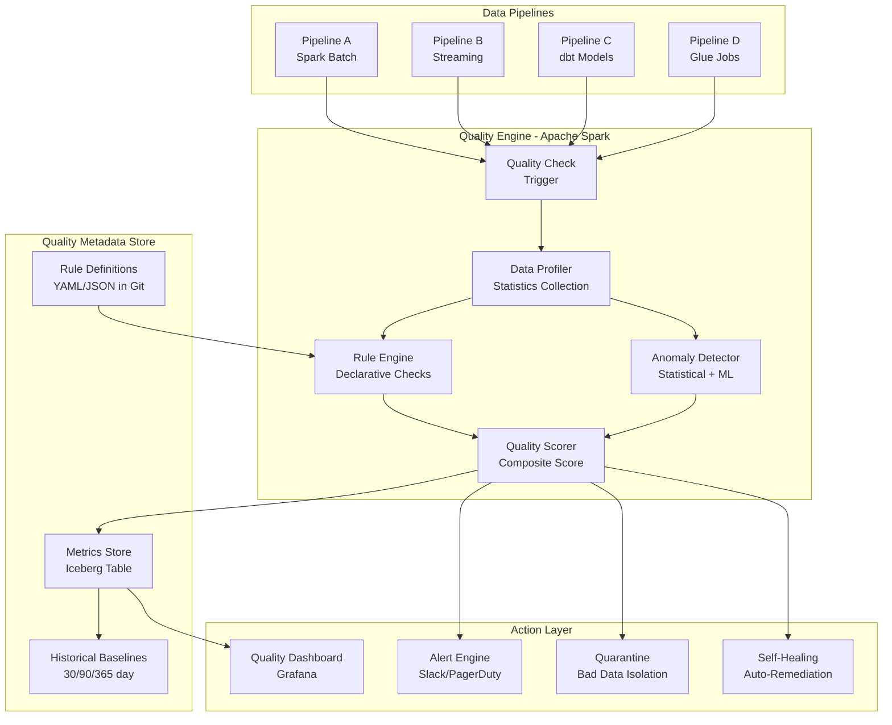
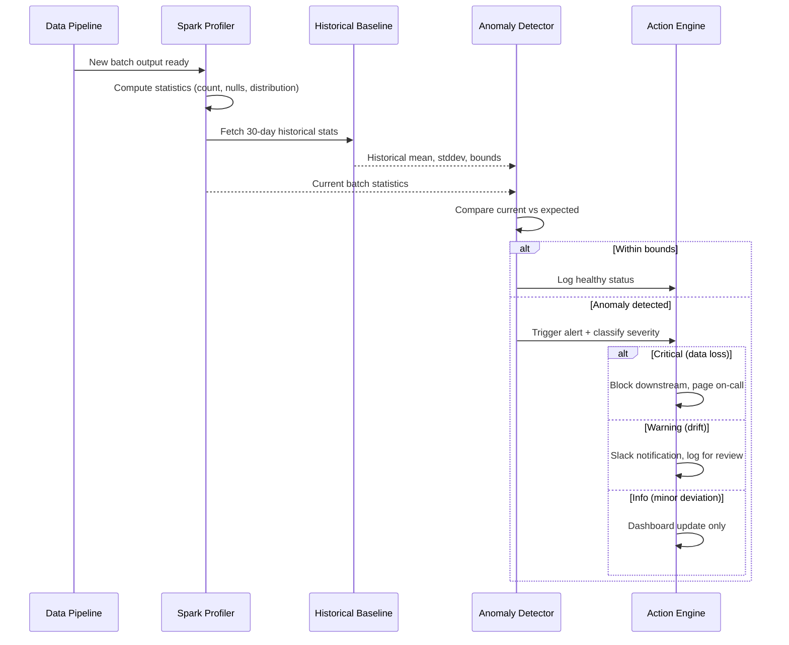
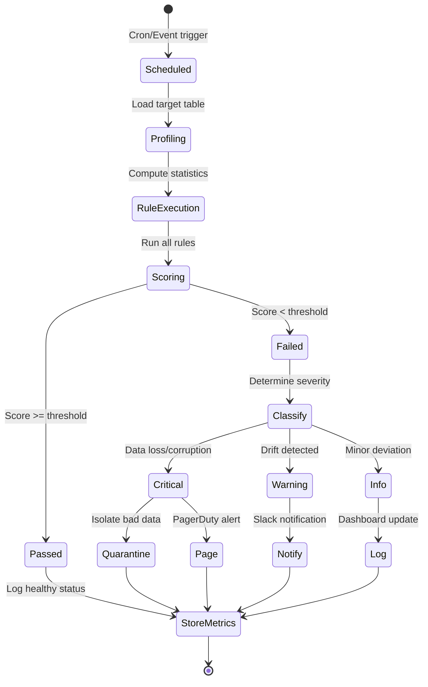
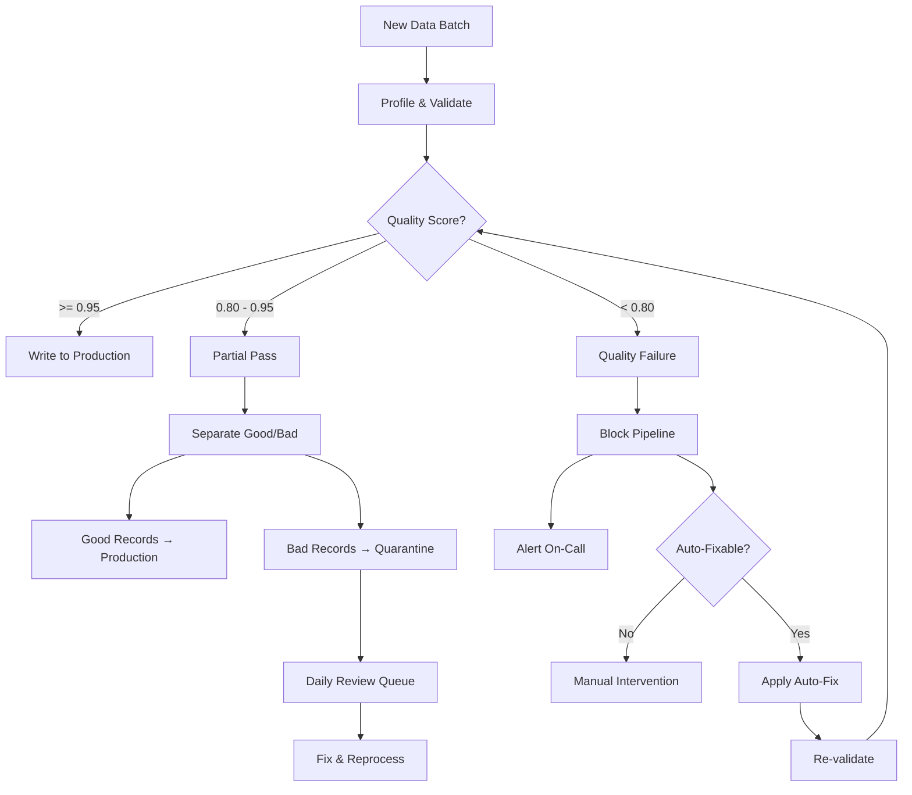

# Data Quality & Observability Platform at Scale with Apache Spark

> **Production Pattern**: Automated data quality monitoring across 5000+ pipelines processing 10PB+ daily, with anomaly detection, self-healing, and zero-config observability using Apache Spark.

---

## 1. Problem Statement

### The Business Challenge

| Challenge | Scale | Cost of Failure |
|-----------|-------|-----------------|
| Bad data reaching downstream consumers | 5000+ pipelines | $15M/year in bad decisions |
| No automated quality gates | 10PB+ processed daily | Manual detection takes days |
| Schema changes breaking pipelines | 100+ source systems | 48-hour recovery time |
| Data drift undetected | Gradual distribution shifts | ML model degradation |
| Freshness SLA violations | T+2 hour requirement | Revenue reporting delays |
| No observability into pipeline health | 500+ data engineers | Reactive firefighting |

### The Six Pillars of Data Observability

```
1. FRESHNESS - Is the data up to date? When was the last update?
2. VOLUME   - Is the expected amount of data present?
3. SCHEMA   - Has the structure changed unexpectedly?
4. DISTRIBUTION - Are values within expected statistical bounds?
5. LINEAGE  - Where did this data come from? What does it affect?
6. QUALITY  - Does it pass business rules and constraints?
```

---

## 2. Architecture Diagrams

### Data Quality Platform Architecture



### Anomaly Detection Pipeline



---

## 3. Spark Concepts for Data Quality

### DataFrame Statistics

```python
from pyspark.sql import functions as F

# Built-in profiling
df.describe()  # count, mean, stddev, min, max
df.summary()   # adds percentiles (25%, 50%, 75%)

# Approximate quantiles (scalable to billions)
quantiles = df.approxQuantile("amount", [0.01, 0.05, 0.25, 0.5, 0.75, 0.95, 0.99], 0.01)

# Column-level statistics
stats = df.agg(
    F.count("*").alias("total_rows"),
    F.sum(F.when(F.col("amount").isNull(), 1).otherwise(0)).alias("null_count"),
    F.countDistinct("customer_id").alias("unique_customers"),
    F.avg("amount").alias("mean_amount"),
    F.stddev("amount").alias("stddev_amount"),
    F.min("amount").alias("min_amount"),
    F.max("amount").alias("max_amount"),
    F.kurtosis("amount").alias("kurtosis"),
    F.skewness("amount").alias("skewness")
)
```

### Window Functions for Historical Comparison

```python
from pyspark.sql.window import Window

# Compare current batch metrics to historical
metrics_window = Window.partitionBy("table_name", "column_name") \
    .orderBy("check_date") \
    .rowsBetween(-30, -1)  # Last 30 days

quality_metrics_with_history = quality_metrics.withColumn(
    "historical_mean", F.avg("metric_value").over(metrics_window)
).withColumn(
    "historical_stddev", F.stddev("metric_value").over(metrics_window)
).withColumn(
    "z_score", 
    (F.col("metric_value") - F.col("historical_mean")) / F.col("historical_stddev")
).withColumn(
    "is_anomaly", F.abs(F.col("z_score")) > 3.0
)
```

### Accumulators for Violation Counting

```python
from pyspark.sql import SparkSession

spark = SparkSession.builder.getOrCreate()

# Create accumulators for quality metrics
null_violations = spark.sparkContext.accumulator(0)
range_violations = spark.sparkContext.accumulator(0)
format_violations = spark.sparkContext.accumulator(0)

def check_row_quality(row):
    """Check quality rules per row using accumulators."""
    if row.amount is None:
        null_violations.add(1)
    if row.amount is not None and (row.amount < 0 or row.amount > 1000000):
        range_violations.add(1)
    if row.email and not re.match(r'^[\w\.-]+@[\w\.-]+\.\w+$', row.email):
        format_violations.add(1)

# Apply checks
df.foreach(check_row_quality)

print(f"Null violations: {null_violations.value}")
print(f"Range violations: {range_violations.value}")
print(f"Format violations: {format_violations.value}")
```

---

## 4. Quality Dimensions & Implementation

### Completeness

```python
class CompletenessChecker:
    """Check null rates and required field presence."""
    
    def __init__(self, spark):
        self.spark = spark
    
    def check_null_rates(self, df, thresholds=None):
        """
        Compute null rate for every column.
        thresholds: dict of column_name -> max_allowed_null_rate
        """
        total_count = df.count()
        
        null_counts = df.select([
            F.sum(F.when(F.col(c).isNull() | F.isnan(c) | (F.col(c) == ""), 1).otherwise(0))
             .alias(c)
            for c in df.columns
        ])
        
        results = []
        for col_name in df.columns:
            null_count = null_counts.first()[col_name]
            null_rate = null_count / total_count if total_count > 0 else 0
            
            threshold = (thresholds or {}).get(col_name, 0.05)  # Default 5%
            passed = null_rate <= threshold
            
            results.append({
                "column": col_name,
                "null_count": null_count,
                "null_rate": round(null_rate, 6),
                "threshold": threshold,
                "passed": passed,
                "severity": "CRITICAL" if null_rate > 0.5 else "WARNING" if not passed else "OK"
            })
        
        return results
    
    def check_required_fields(self, df, required_columns):
        """Verify that required columns have zero nulls."""
        violations = {}
        for col in required_columns:
            null_count = df.filter(F.col(col).isNull()).count()
            if null_count > 0:
                violations[col] = null_count
        return violations
    
    def check_conditional_completeness(self, df, rules):
        """
        Field A must be non-null WHEN condition is met.
        Example: shipping_address required when order_type = 'physical'
        """
        results = []
        for rule in rules:
            condition = rule["condition"]
            required_field = rule["required_field"]
            
            violations = df.filter(condition).filter(F.col(required_field).isNull()).count()
            results.append({
                "rule": f"{required_field} required when {condition}",
                "violations": violations,
                "passed": violations == 0
            })
        return results
```

### Accuracy

```python
class AccuracyChecker:
    """Validate data accuracy against business rules."""
    
    def check_range_validity(self, df, range_rules):
        """
        Check numeric columns are within expected ranges.
        range_rules: [{"column": "age", "min": 0, "max": 150}, ...]
        """
        results = []
        for rule in range_rules:
            col = rule["column"]
            min_val = rule.get("min")
            max_val = rule.get("max")
            
            condition = F.lit(False)
            if min_val is not None:
                condition = condition | (F.col(col) < min_val)
            if max_val is not None:
                condition = condition | (F.col(col) > max_val)
            
            violations = df.filter(F.col(col).isNotNull() & condition).count()
            total = df.filter(F.col(col).isNotNull()).count()
            
            results.append({
                "column": col,
                "range": f"[{min_val}, {max_val}]",
                "violations": violations,
                "violation_rate": violations / total if total > 0 else 0,
                "passed": violations == 0
            })
        return results
    
    def check_referential_integrity(self, df, reference_df, join_column):
        """Check all foreign key values exist in reference table."""
        orphans = df.join(
            reference_df.select(join_column).distinct(),
            join_column,
            "left_anti"
        )
        orphan_count = orphans.count()
        total_count = df.count()
        
        return {
            "join_column": join_column,
            "orphan_count": orphan_count,
            "orphan_rate": orphan_count / total_count if total_count > 0 else 0,
            "passed": orphan_count == 0,
            "sample_orphans": orphans.limit(10).collect() if orphan_count > 0 else []
        }
    
    def check_cross_field_consistency(self, df, rules):
        """
        Validate relationships between columns.
        Example: start_date < end_date, quantity * price = total
        """
        results = []
        for rule in rules:
            condition = rule["condition"]  # SQL expression
            description = rule["description"]
            
            violations = df.filter(f"NOT ({condition})").count()
            results.append({
                "rule": description,
                "condition": condition,
                "violations": violations,
                "passed": violations == 0
            })
        return results
```

### Volume Anomaly Detection

```python
class VolumeChecker:
    """Detect unexpected record count changes."""
    
    def __init__(self, spark, metrics_table):
        self.spark = spark
        self.metrics_table = metrics_table
    
    def check_volume(self, table_name, current_count, method="zscore"):
        """
        Compare current record count against historical baseline.
        Methods: zscore, iqr, percentage
        """
        # Get historical counts (last 30 days)
        history = self.spark.sql(f"""
            SELECT metric_value AS record_count
            FROM {self.metrics_table}
            WHERE table_name = '{table_name}'
              AND metric_name = 'record_count'
              AND check_date >= current_date() - INTERVAL 30 DAYS
            ORDER BY check_date
        """).collect()
        
        historical_counts = [row.record_count for row in history]
        
        if len(historical_counts) < 7:
            return {"status": "INSUFFICIENT_HISTORY", "passed": True}
        
        import numpy as np
        mean = np.mean(historical_counts)
        std = np.std(historical_counts)
        
        if method == "zscore":
            z_score = (current_count - mean) / std if std > 0 else 0
            is_anomaly = abs(z_score) > 3.0
            
            return {
                "current_count": current_count,
                "historical_mean": round(mean, 2),
                "historical_std": round(std, 2),
                "z_score": round(z_score, 2),
                "is_anomaly": is_anomaly,
                "passed": not is_anomaly,
                "direction": "HIGH" if z_score > 0 else "LOW"
            }
        
        elif method == "iqr":
            q1, q3 = np.percentile(historical_counts, [25, 75])
            iqr = q3 - q1
            lower_bound = q1 - 1.5 * iqr
            upper_bound = q3 + 1.5 * iqr
            is_anomaly = current_count < lower_bound or current_count > upper_bound
            
            return {
                "current_count": current_count,
                "lower_bound": round(lower_bound, 2),
                "upper_bound": round(upper_bound, 2),
                "is_anomaly": is_anomaly,
                "passed": not is_anomaly
            }
    
    def check_partition_volume(self, df, partition_col, expected_partitions=None):
        """Check each partition has reasonable volume."""
        partition_counts = df.groupBy(partition_col).count().collect()
        
        counts = [row["count"] for row in partition_counts]
        mean_count = sum(counts) / len(counts) if counts else 0
        
        anomalies = []
        for row in partition_counts:
            ratio = row["count"] / mean_count if mean_count > 0 else 0
            if ratio < 0.1 or ratio > 10:  # 10x deviation from mean
                anomalies.append({
                    "partition": row[partition_col],
                    "count": row["count"],
                    "ratio_to_mean": round(ratio, 2)
                })
        
        return {
            "total_partitions": len(partition_counts),
            "mean_per_partition": round(mean_count, 2),
            "anomalous_partitions": anomalies,
            "passed": len(anomalies) == 0
        }
```

### Distribution (PSI - Population Stability Index)

```python
class DistributionChecker:
    """Detect distribution shifts using PSI and KL-divergence."""
    
    def compute_psi(self, df_reference, df_current, column, n_bins=10):
        """
        Population Stability Index (PSI).
        PSI < 0.1: No significant shift
        PSI 0.1-0.25: Moderate shift (investigate)
        PSI > 0.25: Significant shift (action required)
        """
        # Compute histogram bins from reference
        min_val = df_reference.agg(F.min(column)).first()[0]
        max_val = df_reference.agg(F.max(column)).first()[0]
        
        bin_edges = [min_val + i * (max_val - min_val) / n_bins for i in range(n_bins + 1)]
        
        # Bucket both distributions
        def compute_bucket_proportions(df, column, bin_edges):
            """Compute proportion in each bucket."""
            total = df.count()
            proportions = []
            
            for i in range(len(bin_edges) - 1):
                count = df.filter(
                    (F.col(column) >= bin_edges[i]) & 
                    (F.col(column) < bin_edges[i + 1])
                ).count()
                prop = max(count / total, 0.0001)  # Avoid log(0)
                proportions.append(prop)
            
            return proportions
        
        ref_props = compute_bucket_proportions(df_reference, column, bin_edges)
        curr_props = compute_bucket_proportions(df_current, column, bin_edges)
        
        # PSI calculation
        import math
        psi = sum(
            (curr - ref) * math.log(curr / ref)
            for curr, ref in zip(curr_props, ref_props)
        )
        
        severity = "OK" if psi < 0.1 else "WARNING" if psi < 0.25 else "CRITICAL"
        
        return {
            "column": column,
            "psi": round(psi, 4),
            "severity": severity,
            "passed": psi < 0.25,
            "reference_distribution": ref_props,
            "current_distribution": curr_props
        }
    
    def check_categorical_drift(self, df_reference, df_current, column):
        """Check if categorical value distribution has shifted."""
        ref_dist = (
            df_reference
            .groupBy(column)
            .count()
            .withColumn("ref_pct", F.col("count") / df_reference.count())
            .select(column, "ref_pct")
        )
        
        curr_dist = (
            df_current
            .groupBy(column)
            .count()
            .withColumn("curr_pct", F.col("count") / df_current.count())
            .select(column, "curr_pct")
        )
        
        comparison = ref_dist.join(curr_dist, column, "full_outer").na.fill(0)
        
        # Flag significant shifts (>50% relative change)
        shifts = comparison.withColumn(
            "relative_change",
            F.abs(F.col("curr_pct") - F.col("ref_pct")) / F.greatest(F.col("ref_pct"), F.lit(0.001))
        ).filter("relative_change > 0.5")
        
        return {
            "column": column,
            "shifted_categories": shifts.count(),
            "passed": shifts.count() == 0,
            "details": shifts.collect()
        }
```

### Freshness

```python
class FreshnessChecker:
    """Monitor data freshness and staleness."""
    
    def check_table_freshness(self, table_name, max_age_hours=24):
        """Check if table was updated within expected window."""
        from pyspark.sql import functions as F
        
        # Option 1: Check Iceberg snapshot timestamp
        snapshots = self.spark.sql(f"""
            SELECT committed_at 
            FROM {table_name}.snapshots 
            ORDER BY committed_at DESC 
            LIMIT 1
        """)
        
        if snapshots.count() == 0:
            return {"passed": False, "reason": "No snapshots found"}
        
        last_update = snapshots.first()["committed_at"]
        from datetime import datetime, timedelta
        age_hours = (datetime.now() - last_update).total_seconds() / 3600
        
        return {
            "table": table_name,
            "last_updated": str(last_update),
            "age_hours": round(age_hours, 2),
            "max_allowed_hours": max_age_hours,
            "passed": age_hours <= max_age_hours,
            "severity": "CRITICAL" if age_hours > max_age_hours * 2 else 
                       "WARNING" if age_hours > max_age_hours else "OK"
        }
    
    def check_event_freshness(self, df, timestamp_column, max_delay_minutes=60):
        """Check if most recent events are within expected freshness."""
        latest_event = df.agg(F.max(timestamp_column)).first()[0]
        
        from datetime import datetime
        delay_minutes = (datetime.now() - latest_event).total_seconds() / 60
        
        return {
            "latest_event": str(latest_event),
            "delay_minutes": round(delay_minutes, 2),
            "max_allowed_minutes": max_delay_minutes,
            "passed": delay_minutes <= max_delay_minutes
        }
```

---

## 5. Great Expectations + Spark Integration

```python
# Great Expectations with Spark DataFrame execution engine
import great_expectations as gx
from great_expectations.core.batch import RuntimeBatchRequest

def setup_great_expectations_with_spark(spark, df, table_name):
    """Configure Great Expectations with Spark backend."""
    
    context = gx.get_context()
    
    # Add Spark datasource
    datasource = context.sources.add_or_update_spark(name="spark_datasource")
    
    # Create data asset
    data_asset = datasource.add_dataframe_asset(name=table_name)
    
    # Build batch request
    batch_request = data_asset.build_batch_request(dataframe=df)
    
    # Create expectation suite
    suite = context.add_or_update_expectation_suite(
        expectation_suite_name=f"{table_name}_quality_suite"
    )
    
    # Add expectations
    validator = context.get_validator(
        batch_request=batch_request,
        expectation_suite_name=f"{table_name}_quality_suite"
    )
    
    # Completeness expectations
    validator.expect_column_values_to_not_be_null("customer_id")
    validator.expect_column_values_to_not_be_null("transaction_date")
    
    # Range expectations
    validator.expect_column_values_to_be_between("amount", min_value=0, max_value=1000000)
    validator.expect_column_values_to_be_between("age", min_value=0, max_value=150)
    
    # Uniqueness
    validator.expect_column_values_to_be_unique("transaction_id")
    
    # Pattern matching
    validator.expect_column_values_to_match_regex("email", r'^[\w\.-]+@[\w\.-]+\.\w+$')
    
    # Distribution
    validator.expect_column_mean_to_be_between("amount", min_value=50, max_value=500)
    validator.expect_column_stdev_to_be_between("amount", min_value=10, max_value=200)
    
    # Referential integrity (custom)
    validator.expect_column_distinct_values_to_be_in_set(
        "status", ["active", "inactive", "pending", "closed"]
    )
    
    # Volume
    validator.expect_table_row_count_to_be_between(min_value=900000, max_value=1100000)
    
    # Save and run
    validator.save_expectation_suite(discard_failed_expectations=False)
    
    # Run validation
    checkpoint = context.add_or_update_checkpoint(
        name=f"{table_name}_checkpoint",
        validations=[{
            "batch_request": batch_request,
            "expectation_suite_name": f"{table_name}_quality_suite"
        }]
    )
    
    result = checkpoint.run()
    return result
```

---

## 6. Custom Spark Quality Framework

### Rule Definition (YAML)

```yaml
# quality_rules/transactions.yaml
table: catalog.silver.transactions
owner: payments-team
schedule: "@hourly"

rules:
  completeness:
    - column: transaction_id
      max_null_rate: 0.0
      severity: CRITICAL
    - column: amount
      max_null_rate: 0.001
      severity: HIGH
    - column: merchant_name
      max_null_rate: 0.05
      severity: MEDIUM

  accuracy:
    - column: amount
      min: 0.01
      max: 999999.99
      severity: HIGH
    - condition: "start_date <= end_date"
      description: "Start must precede end"
      severity: CRITICAL

  volume:
    method: zscore
    threshold: 3.0
    min_history_days: 7
    severity: HIGH

  freshness:
    max_age_hours: 2
    timestamp_column: event_timestamp
    severity: CRITICAL

  distribution:
    - column: amount
      method: psi
      threshold: 0.25
      reference_window_days: 30
      severity: HIGH

  uniqueness:
    - columns: [transaction_id]
      severity: CRITICAL
    - columns: [customer_id, transaction_date, amount, merchant_id]
      description: "Likely duplicates"
      severity: HIGH

  custom:
    - name: currency_check
      condition: "currency IN ('USD', 'EUR', 'GBP', 'JPY', 'CAD')"
      severity: MEDIUM
    - name: future_date_check
      condition: "transaction_date <= current_date()"
      severity: HIGH
```

### Rule Engine Implementation

```python
import yaml
from dataclasses import dataclass
from typing import List, Dict, Any

@dataclass
class QualityResult:
    rule_name: str
    dimension: str
    passed: bool
    severity: str
    details: Dict[str, Any]
    table: str
    check_time: str

class SparkQualityEngine:
    """
    Production data quality engine with declarative rule definitions.
    Supports: completeness, accuracy, volume, freshness, distribution, uniqueness, custom rules.
    """
    
    def __init__(self, spark, config_path, metrics_table):
        self.spark = spark
        self.config = self._load_config(config_path)
        self.metrics_table = metrics_table
        self.results: List[QualityResult] = []
    
    def _load_config(self, path):
        with open(path, 'r') as f:
            return yaml.safe_load(f)
    
    def run_all_checks(self, df):
        """Execute all configured quality checks."""
        from datetime import datetime
        
        self.results = []
        table_name = self.config["table"]
        check_time = datetime.now().isoformat()
        
        # Run each dimension
        if "completeness" in self.config.get("rules", {}):
            self._check_completeness(df, table_name, check_time)
        
        if "accuracy" in self.config.get("rules", {}):
            self._check_accuracy(df, table_name, check_time)
        
        if "volume" in self.config.get("rules", {}):
            self._check_volume(df, table_name, check_time)
        
        if "freshness" in self.config.get("rules", {}):
            self._check_freshness(df, table_name, check_time)
        
        if "distribution" in self.config.get("rules", {}):
            self._check_distribution(df, table_name, check_time)
        
        if "uniqueness" in self.config.get("rules", {}):
            self._check_uniqueness(df, table_name, check_time)
        
        if "custom" in self.config.get("rules", {}):
            self._check_custom(df, table_name, check_time)
        
        # Compute overall quality score
        total_checks = len(self.results)
        passed_checks = sum(1 for r in self.results if r.passed)
        quality_score = passed_checks / total_checks if total_checks > 0 else 1.0
        
        # Store results
        self._store_results()
        
        return {
            "table": table_name,
            "total_checks": total_checks,
            "passed": passed_checks,
            "failed": total_checks - passed_checks,
            "quality_score": round(quality_score, 4),
            "critical_failures": [r for r in self.results if not r.passed and r.severity == "CRITICAL"],
            "all_passed": all(r.passed for r in self.results)
        }
    
    def _check_completeness(self, df, table_name, check_time):
        """Run completeness checks."""
        total_count = df.count()
        rules = self.config["rules"]["completeness"]
        
        for rule in rules:
            col = rule["column"]
            max_null_rate = rule["max_null_rate"]
            severity = rule.get("severity", "MEDIUM")
            
            null_count = df.filter(F.col(col).isNull()).count()
            null_rate = null_count / total_count if total_count > 0 else 0
            passed = null_rate <= max_null_rate
            
            self.results.append(QualityResult(
                rule_name=f"completeness_{col}",
                dimension="completeness",
                passed=passed,
                severity=severity,
                details={
                    "column": col,
                    "null_rate": round(null_rate, 6),
                    "threshold": max_null_rate,
                    "null_count": null_count
                },
                table=table_name,
                check_time=check_time
            ))
    
    def _check_accuracy(self, df, table_name, check_time):
        """Run accuracy checks."""
        rules = self.config["rules"]["accuracy"]
        
        for rule in rules:
            if "column" in rule:
                col = rule["column"]
                min_val = rule.get("min")
                max_val = rule.get("max")
                
                condition = F.lit(True)
                if min_val is not None:
                    condition = condition & (F.col(col) >= min_val)
                if max_val is not None:
                    condition = condition & (F.col(col) <= max_val)
                
                violations = df.filter(F.col(col).isNotNull() & ~condition).count()
                total = df.filter(F.col(col).isNotNull()).count()
                passed = violations == 0
                
                self.results.append(QualityResult(
                    rule_name=f"accuracy_range_{col}",
                    dimension="accuracy",
                    passed=passed,
                    severity=rule.get("severity", "MEDIUM"),
                    details={"column": col, "violations": violations, "total": total},
                    table=table_name,
                    check_time=check_time
                ))
            
            elif "condition" in rule:
                condition = rule["condition"]
                violations = df.filter(f"NOT ({condition})").count()
                passed = violations == 0
                
                self.results.append(QualityResult(
                    rule_name=f"accuracy_custom_{rule['description'][:30]}",
                    dimension="accuracy",
                    passed=passed,
                    severity=rule.get("severity", "MEDIUM"),
                    details={"condition": condition, "violations": violations},
                    table=table_name,
                    check_time=check_time
                ))
    
    def _check_volume(self, df, table_name, check_time):
        """Run volume anomaly detection."""
        vol_config = self.config["rules"]["volume"]
        current_count = df.count()
        
        checker = VolumeChecker(self.spark, self.metrics_table)
        result = checker.check_volume(table_name, current_count, vol_config.get("method", "zscore"))
        
        self.results.append(QualityResult(
            rule_name="volume_anomaly",
            dimension="volume",
            passed=result.get("passed", True),
            severity=vol_config.get("severity", "HIGH"),
            details=result,
            table=table_name,
            check_time=check_time
        ))
    
    def _check_uniqueness(self, df, table_name, check_time):
        """Run uniqueness checks."""
        rules = self.config["rules"]["uniqueness"]
        
        for rule in rules:
            columns = rule["columns"]
            
            total = df.count()
            distinct = df.select(columns).distinct().count()
            duplicates = total - distinct
            
            passed = duplicates == 0
            
            self.results.append(QualityResult(
                rule_name=f"uniqueness_{'_'.join(columns)}",
                dimension="uniqueness",
                passed=passed,
                severity=rule.get("severity", "HIGH"),
                details={
                    "columns": columns,
                    "total_rows": total,
                    "distinct_rows": distinct,
                    "duplicate_rows": duplicates
                },
                table=table_name,
                check_time=check_time
            ))
    
    def _check_custom(self, df, table_name, check_time):
        """Run custom SQL-based rules."""
        rules = self.config["rules"]["custom"]
        
        for rule in rules:
            name = rule["name"]
            condition = rule["condition"]
            
            violations = df.filter(f"NOT ({condition})").count()
            passed = violations == 0
            
            self.results.append(QualityResult(
                rule_name=f"custom_{name}",
                dimension="custom",
                passed=passed,
                severity=rule.get("severity", "MEDIUM"),
                details={"name": name, "condition": condition, "violations": violations},
                table=table_name,
                check_time=check_time
            ))
    
    def _store_results(self):
        """Store quality check results to metrics table."""
        from pyspark.sql import Row
        from datetime import datetime
        
        rows = [
            Row(
                table_name=r.table,
                rule_name=r.rule_name,
                dimension=r.dimension,
                passed=r.passed,
                severity=r.severity,
                details=str(r.details),
                check_time=r.check_time
            )
            for r in self.results
        ]
        
        if rows:
            results_df = self.spark.createDataFrame(rows)
            results_df.writeTo(self.metrics_table).append()
    
    def _check_freshness(self, df, table_name, check_time):
        """Check data freshness."""
        config = self.config["rules"]["freshness"]
        checker = FreshnessChecker()
        checker.spark = self.spark
        
        ts_col = config["timestamp_column"]
        max_hours = config["max_age_hours"]
        
        latest = df.agg(F.max(ts_col)).first()[0]
        if latest:
            from datetime import datetime
            age_hours = (datetime.now() - latest).total_seconds() / 3600
            passed = age_hours <= max_hours
        else:
            age_hours = float('inf')
            passed = False
        
        self.results.append(QualityResult(
            rule_name="freshness_check",
            dimension="freshness",
            passed=passed,
            severity=config.get("severity", "HIGH"),
            details={"latest_event": str(latest), "age_hours": round(age_hours, 2), "max_hours": max_hours},
            table=table_name,
            check_time=check_time
        ))
    
    def _check_distribution(self, df, table_name, check_time):
        """Check distribution stability."""
        rules = self.config["rules"]["distribution"]
        
        for rule in rules:
            col = rule["column"]
            threshold = rule.get("threshold", 0.25)
            ref_days = rule.get("reference_window_days", 30)
            
            # Load reference data from previous period
            reference_df = self.spark.sql(f"""
                SELECT {col} FROM {table_name}
                WHERE event_date BETWEEN current_date() - INTERVAL {ref_days} DAYS 
                  AND current_date() - INTERVAL 1 DAY
            """)
            
            checker = DistributionChecker()
            result = checker.compute_psi(reference_df, df, col)
            
            self.results.append(QualityResult(
                rule_name=f"distribution_psi_{col}",
                dimension="distribution",
                passed=result["passed"],
                severity=rule.get("severity", "HIGH"),
                details=result,
                table=table_name,
                check_time=check_time
            ))
```

---

## 7. Self-Healing Pipeline

```python
class SelfHealingPipeline:
    """
    Automatically quarantine bad data and attempt remediation.
    """
    
    def __init__(self, spark, config):
        self.spark = spark
        self.config = config
        self.quarantine_table = config["quarantine_table"]
    
    def process_with_quality_gates(self, df, quality_config_path):
        """
        Process data with automatic quality gates.
        Bad records are quarantined; good records proceed.
        """
        # Run quality checks
        engine = SparkQualityEngine(
            self.spark, quality_config_path, self.config["metrics_table"]
        )
        results = engine.run_all_checks(df)
        
        # If critical failures, quarantine bad records
        if results["critical_failures"]:
            good_df, bad_df = self._separate_quality(df, results)
            
            # Quarantine bad records
            if bad_df.count() > 0:
                self._quarantine(bad_df, results)
            
            # Alert
            self._send_alert(results)
            
            return good_df
        
        return df
    
    def _separate_quality(self, df, results):
        """Separate good and bad records based on quality failures."""
        # Build filter condition from failed rules
        bad_conditions = []
        
        for failure in results["critical_failures"]:
            details = failure.details
            if failure.dimension == "completeness":
                bad_conditions.append(F.col(details["column"]).isNull())
            elif failure.dimension == "accuracy" and "column" in details:
                col = details["column"]
                bad_conditions.append(
                    (F.col(col) < details.get("min", float('-inf'))) |
                    (F.col(col) > details.get("max", float('inf')))
                )
        
        if bad_conditions:
            combined_bad = bad_conditions[0]
            for cond in bad_conditions[1:]:
                combined_bad = combined_bad | cond
            
            bad_df = df.filter(combined_bad)
            good_df = df.filter(~combined_bad)
        else:
            good_df = df
            bad_df = self.spark.createDataFrame([], df.schema)
        
        return good_df, bad_df
    
    def _quarantine(self, bad_df, results):
        """Write bad records to quarantine table with metadata."""
        quarantined = bad_df.withColumn(
            "quarantine_reason", F.lit(str([f.rule_name for f in results["critical_failures"]]))
        ).withColumn(
            "quarantine_timestamp", F.current_timestamp()
        ).withColumn(
            "quarantine_batch_id", F.lit(results.get("batch_id", "unknown"))
        )
        
        quarantined.writeTo(self.quarantine_table).append()
    
    def _send_alert(self, results):
        """Send alert for quality failures."""
        import requests
        
        slack_webhook = self.config.get("slack_webhook")
        if slack_webhook:
            message = {
                "text": f":warning: Data Quality Alert\n"
                       f"Table: {results['table']}\n"
                       f"Failed checks: {results['failed']}/{results['total_checks']}\n"
                       f"Quality score: {results['quality_score']}\n"
                       f"Critical failures: {[f.rule_name for f in results['critical_failures']]}"
            }
            requests.post(slack_webhook, json=message)
```

---

## 8. Anomaly Detection with ML

```python
from pyspark.ml.feature import VectorAssembler
from pyspark.ml.clustering import KMeans

class MLAnomalyDetector:
    """ML-based anomaly detection for data quality metrics."""
    
    def isolation_forest_detection(self, metrics_df, feature_cols):
        """
        Use Isolation Forest for multivariate anomaly detection.
        (Using sklearn via Pandas UDF for Spark scalability)
        """
        from pyspark.sql.functions import pandas_udf
        from pyspark.sql.types import BooleanType
        import pandas as pd
        
        @pandas_udf(BooleanType())
        def detect_anomalies(features_series: pd.Series) -> pd.Series:
            from sklearn.ensemble import IsolationForest
            import numpy as np
            
            # Convert to numpy array
            features = np.vstack(features_series.values)
            
            clf = IsolationForest(
                contamination=0.05,  # Expect 5% anomalies
                random_state=42,
                n_estimators=200
            )
            
            predictions = clf.fit_predict(features)
            return pd.Series(predictions == -1)  # -1 = anomaly
        
        # Assemble features
        assembler = VectorAssembler(inputCols=feature_cols, outputCol="features")
        featured_df = assembler.transform(metrics_df)
        
        # Apply detection
        result = featured_df.withColumn(
            "is_anomaly", 
            detect_anomalies("features")
        )
        
        return result
    
    def seasonal_detection(self, metrics_df, metric_col, date_col):
        """
        Detect anomalies accounting for seasonal patterns.
        Uses day-of-week and time-of-day as features.
        """
        enhanced = metrics_df.withColumn(
            "day_of_week", F.dayofweek(date_col)
        ).withColumn(
            "hour_of_day", F.hour(date_col)
        ).withColumn(
            "is_weekend", F.when(F.dayofweek(date_col).isin([1, 7]), 1).otherwise(0)
        )
        
        # Compute expected value for this day/hour combination
        baseline_window = Window.partitionBy("day_of_week", "hour_of_day") \
            .orderBy(date_col) \
            .rowsBetween(-28, -1)  # Last 4 weeks same day/hour
        
        with_baseline = enhanced.withColumn(
            "expected_value", F.avg(metric_col).over(baseline_window)
        ).withColumn(
            "expected_stddev", F.stddev(metric_col).over(baseline_window)
        ).withColumn(
            "deviation", 
            F.abs(F.col(metric_col) - F.col("expected_value")) / 
            F.greatest(F.col("expected_stddev"), F.lit(0.001))
        ).withColumn(
            "is_seasonal_anomaly", F.col("deviation") > 3.0
        )
        
        return with_baseline
```

---

## 9. Production Configuration

```properties
# spark-defaults.conf for Quality Jobs

spark.app.name=DataQualityEngine
spark.executor.memory=8g
spark.executor.cores=4
spark.executor.instances=20
spark.driver.memory=4g

# Quality jobs are typically I/O bound (reading lots of tables)
spark.sql.adaptive.enabled=true
spark.sql.adaptive.coalescePartitions.enabled=true
spark.sql.shuffle.partitions=200

# Sampling for large tables (compute quality on sample)
# Application-level sampling:
# df.sample(fraction=0.01) for tables > 1B rows
```

---

## 10. Monitoring & Meta-Monitoring

```python
# Monitor the quality system itself
meta_monitoring = {
    "quality_checks_executed": {
        "description": "Are quality checks running on schedule?",
        "alert_if": "< expected_count_for_hour",
        "severity": "CRITICAL"
    },
    "quality_check_duration": {
        "description": "Are checks completing in time?",
        "alert_if": "> 30 minutes per table",
        "severity": "HIGH"
    },
    "alert_volume": {
        "description": "Are we generating too many alerts (fatigue)?",
        "alert_if": "> 50 alerts/day per team",
        "severity": "MEDIUM"
    },
    "coverage": {
        "description": "What % of tables have quality checks?",
        "target": "> 80% of gold layer tables",
        "severity": "LOW"
    }
}
```

---

## 11. Companies Using This Pattern

| Company | Platform | Scale | Approach |
|---------|----------|-------|----------|
| **Airbnb** | Minerva + custom | 100K+ datasets | Automated quality scoring |
| **Uber** | uDQ platform | 10K+ tables | Rule engine + ML anomaly |
| **Netflix** | Custom Spark | 50PB+ | Statistical bounds + alerts |
| **LinkedIn** | Datahub + quality | 100K+ datasets | Integrated catalog + quality |
| **Monte Carlo** | Commercial | Multi-tenant | ML-based observability |
| **Bigeye** | Commercial | SaaS | Auto-generated monitors |

---

## 12. Workflow Diagrams

### Quality Check Lifecycle



### Self-Healing Pipeline Flow



---

## Summary

| Dimension | Check Type | Method | Threshold |
|-----------|-----------|--------|-----------|
| **Completeness** | Null rates | Exact count | < 0.1% for critical fields |
| **Accuracy** | Range/format | Rule-based | Zero violations for critical |
| **Freshness** | Staleness | Timestamp check | < 2 hours for gold |
| **Volume** | Record count | Z-score | \|z\| < 3.0 |
| **Distribution** | Value shift | PSI | < 0.25 |
| **Schema** | Structure | Schema comparison | Zero unexpected changes |
| **Uniqueness** | Duplicates | Distinct count | Zero for PK columns |
