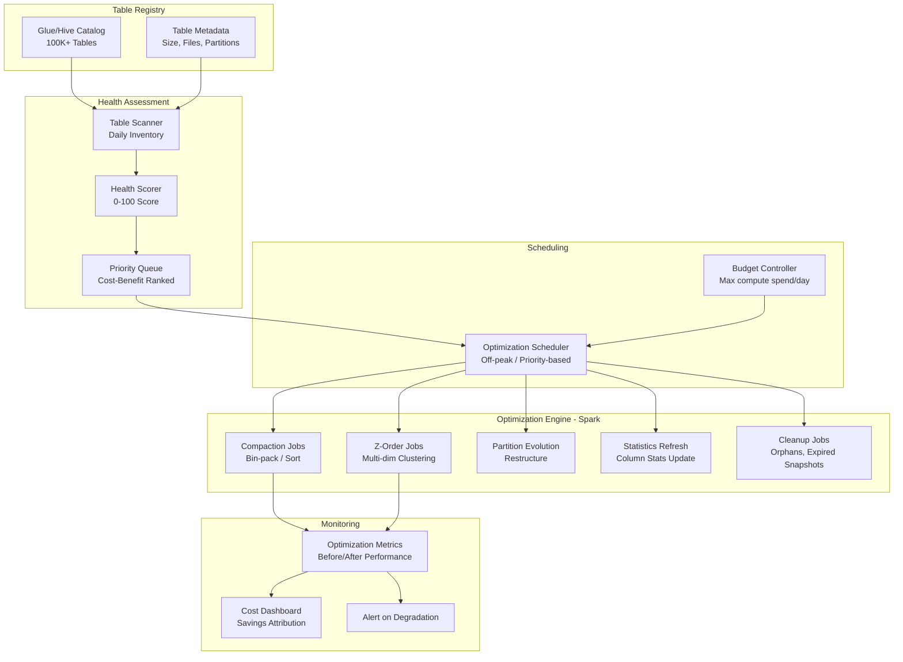
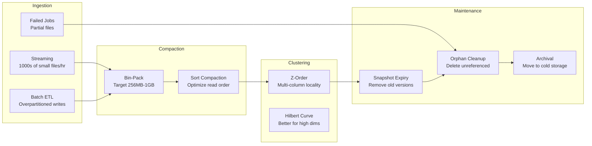
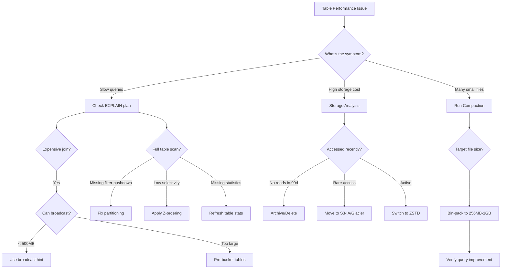

# Multi-Petabyte Data Lake Optimization & Table Maintenance with Apache Spark

> **Production Pattern**: Automated table maintenance, compaction, Z-ordering, and partition evolution for 50PB+ data lakes with 100K+ tables using Apache Spark and Apache Iceberg.

---

## 1. Problem Statement

| Challenge | Scale | Impact |
|-----------|-------|--------|
| Small files problem | 500M+ files under 1MB | Queries take 30 min for partition listing alone |
| Query degradation | 10x slower over 6 months | Analyst productivity collapse |
| Storage cost growth | 40% YoY increase | $5M+ annual overspend |
| Bad partition strategies | Decisions made 3 years ago | Cannot fix without rewriting petabytes |
| No automated maintenance | 100K+ tables, 50 engineers | Reactive optimization only |
| Table entropy | Fragmentation, stale stats | Optimizer makes wrong decisions |

---

## 2. Architecture Diagrams

### Optimization Platform



### File Lifecycle



---

## 3. Spark Concepts Deep Dive

### Adaptive Query Execution (AQE)

```python
# AQE re-optimizes query plan at runtime based on actual shuffle statistics

spark.conf.set("spark.sql.adaptive.enabled", "true")

# 1. Coalescing post-shuffle partitions (merges small partitions)
spark.conf.set("spark.sql.adaptive.coalescePartitions.enabled", "true")
spark.conf.set("spark.sql.adaptive.advisoryPartitionSizeInBytes", "128MB")
spark.conf.set("spark.sql.adaptive.coalescePartitions.minPartitionSize", "64MB")
spark.conf.set("spark.sql.adaptive.coalescePartitions.parallelismFirst", "false")

# 2. Converting sort-merge join to broadcast (when one side is smaller than expected)
spark.conf.set("spark.sql.adaptive.autoBroadcastJoinThreshold", "100MB")

# 3. Skew join optimization (splits skewed partitions)
spark.conf.set("spark.sql.adaptive.skewJoin.enabled", "true")
spark.conf.set("spark.sql.adaptive.skewJoin.skewedPartitionFactor", "5")
spark.conf.set("spark.sql.adaptive.skewJoin.skewedPartitionThresholdInBytes", "256MB")
```

### Dynamic Partition Pruning (DPP)

```python
# DPP eliminates fact table partitions at runtime using dimension filter results
# Works with star schema: small dimension filtered -> prune fact table partitions

spark.conf.set("spark.sql.optimizer.dynamicPartitionPruning.enabled", "true")
spark.conf.set("spark.sql.optimizer.dynamicPartitionPruning.reuseBroadcastOnly", "true")

# Example: This query benefits from DPP
# The dimension filter on 'region' prunes fact_sales partitions
spark.sql("""
    SELECT f.*, d.region_name
    FROM fact_sales f
    JOIN dim_region d ON f.region_id = d.region_id
    WHERE d.country = 'US'  -- This filter prunes fact_sales partitions!
""").explain(True)

# In the physical plan, you'll see:
# DynamicPruningExpression: region_id IN (subquery on dim_region)
```

### Reading Explain Plans

```python
# Four levels of explain
df.explain("simple")     # Physical plan only
df.explain("extended")   # Parsed -> Analyzed -> Optimized -> Physical
df.explain("codegen")    # Generated Java code
df.explain("cost")       # With cost estimates
df.explain("formatted")  # Pretty-printed with stats

# Example: Understanding a join plan
"""
== Physical Plan ==
*(5) SortMergeJoin [customer_id#1], [customer_id#50], Inner
:- *(2) Sort [customer_id#1 ASC], false, 0
:  +- Exchange hashpartitioning(customer_id#1, 200)  <-- SHUFFLE!
:     +- *(1) Filter isnotnull(customer_id#1)
:        +- *(1) FileScan parquet [with pushdown filters]
+- *(4) Sort [customer_id#50 ASC], false, 0
   +- Exchange hashpartitioning(customer_id#50, 200)  <-- SHUFFLE!
      +- *(3) Filter isnotnull(customer_id#50)
         +- *(3) FileScan parquet [with pushdown filters]

Key indicators:
- Exchange = Shuffle (expensive!)
- FileScan with pushed filters = Good (predicate pushdown working)
- BroadcastHashJoin = No shuffle on one side (faster)
- Sort = Required for SortMergeJoin
"""
```

### Parquet Internals

```python
# Understanding Parquet file structure for optimization:
#
# File
# ├── Row Group 1 (target: 128MB)
# │   ├── Column Chunk: customer_id
# │   │   ├── Page 1 (target: 1MB)
# │   │   │   ├── Statistics: min=A001, max=A999
# │   │   │   └── Data (dictionary or plain encoded)
# │   │   └── Page 2
# │   ├── Column Chunk: amount
# │   │   ├── Statistics: min=0.01, max=99999.99
# │   │   └── Pages...
# │   └── Column Chunk: ...
# ├── Row Group 2
# └── Footer (schema, row group offsets, column statistics)
#
# Optimization levers:
# 1. Row group size: larger = fewer groups = less metadata overhead
# 2. Page size: larger = better compression, less random I/O
# 3. Dictionary encoding: great for low-cardinality columns
# 4. Statistics: enable min/max for predicate pushdown

# Parquet write configuration
spark.conf.set("spark.sql.parquet.compression.codec", "zstd")
spark.conf.set("spark.sql.parquet.block.size", "134217728")  # 128MB row groups
spark.conf.set("spark.sql.parquet.page.size", "1048576")     # 1MB pages
spark.conf.set("spark.sql.parquet.enableDictionary", "true")
spark.conf.set("spark.sql.parquet.dictionary.page.size", "1048576")
```

---

## 4. Small Files Problem

### Root Causes and Solutions

```python
# Cause 1: Streaming micro-batches (100s of files per batch)
# Solution: Increase trigger interval + compaction
streaming_query = (
    df.writeStream
    .trigger(processingTime="5 minutes")  # Instead of "10 seconds"
    .option("checkpointLocation", checkpoint_path)
    .toTable("catalog.db.streaming_table")
)

# Cause 2: Over-partitioned tables
# Bad: PARTITIONED BY (year, month, day, hour, category, region)
# Good: PARTITIONED BY (days(event_date))  -- Iceberg hidden partitioning

# Cause 3: Too many concurrent writers
# Solution: Use Iceberg's optimistic concurrency with fewer, larger writes
df.coalesce(target_files).writeTo("catalog.db.table").append()

# Target file count formula:
total_data_size_bytes = df.rdd.map(lambda r: len(str(r))).sum()  # Approximate
target_file_size = 256 * 1024 * 1024  # 256MB
target_files = max(1, int(total_data_size_bytes / target_file_size))
```

---

## 5. Compaction Strategies

### Iceberg Bin-Pack Compaction

```python
from pyspark.sql import SparkSession

spark = SparkSession.builder \
    .config("spark.sql.extensions", "org.apache.iceberg.spark.extensions.IcebergSparkSessionExtensions") \
    .config("spark.sql.catalog.iceberg", "org.apache.iceberg.spark.SparkCatalog") \
    .getOrCreate()

# Basic bin-pack compaction (combines small files into target size)
spark.sql("""
    CALL iceberg.system.rewrite_data_files(
        table => 'catalog.db.fact_transactions',
        strategy => 'binpack',
        options => map(
            'target-file-size-bytes', '536870912',       -- 512MB target
            'min-file-size-bytes', '104857600',          -- 100MB (compact if smaller)
            'max-file-size-bytes', '1073741824',         -- 1GB max
            'min-input-files', '5',                      -- Need at least 5 small files
            'max-concurrent-file-group-rewrites', '100', -- Parallelism
            'partial-progress.enabled', 'true',          -- Commit periodically
            'partial-progress.max-commits', '10'         -- Max intermediate commits
        )
    )
""")

# Sort compaction (reorganizes data for better query performance)
spark.sql("""
    CALL iceberg.system.rewrite_data_files(
        table => 'catalog.db.fact_transactions',
        strategy => 'sort',
        sort_order => 'customer_id ASC NULLS LAST, event_date ASC',
        options => map(
            'target-file-size-bytes', '536870912',
            'min-file-size-bytes', '104857600',
            'rewrite-all', 'false'  -- Only rewrite files that aren't sorted
        )
    )
""")

# Compaction with partition filter (only compact specific partitions)
spark.sql("""
    CALL iceberg.system.rewrite_data_files(
        table => 'catalog.db.fact_transactions',
        strategy => 'binpack',
        where => 'event_date >= current_date() - INTERVAL 7 DAYS',
        options => map('target-file-size-bytes', '536870912')
    )
""")

# Rewrite manifests (optimize metadata files)
spark.sql("""
    CALL iceberg.system.rewrite_manifests(
        table => 'catalog.db.fact_transactions'
    )
""")
```

### Custom Compaction Job

```python
class CompactionJob:
    """
    Custom compaction for tables that need specific logic.
    Handles: target file sizing, sort order, concurrent reads.
    """
    
    def __init__(self, spark, config):
        self.spark = spark
        self.target_file_size_mb = config.get("target_file_size_mb", 256)
        self.max_files_per_run = config.get("max_files_per_run", 10000)
    
    def identify_compaction_candidates(self, table_name):
        """Find partitions with small files needing compaction."""
        files_df = self.spark.sql(f"""
            SELECT 
                file_path,
                file_size_in_bytes,
                partition
            FROM {table_name}.files
        """)
        
        # Group by partition and find those with too many small files
        partition_stats = files_df.groupBy("partition").agg(
            F.count("*").alias("file_count"),
            F.avg("file_size_in_bytes").alias("avg_file_size"),
            F.sum("file_size_in_bytes").alias("total_size"),
            F.min("file_size_in_bytes").alias("min_file_size")
        ).withColumn(
            "needs_compaction",
            (F.col("file_count") > 10) & 
            (F.col("avg_file_size") < self.target_file_size_mb * 1024 * 1024 * 0.5)
        ).filter("needs_compaction = true") \
         .orderBy(F.desc("file_count"))
        
        return partition_stats
    
    def compact_partition(self, table_name, partition_filter, sort_columns=None):
        """Compact a single partition by rewriting with target file size."""
        # Read partition data
        partition_data = self.spark.read.format("iceberg") \
            .load(table_name) \
            .filter(partition_filter)
        
        total_size = partition_data.rdd.map(lambda r: len(str(r))).sum()
        target_files = max(1, int(total_size / (self.target_file_size_mb * 1024 * 1024)))
        
        # Repartition to target file count with optional sort
        if sort_columns:
            compacted = partition_data \
                .repartition(target_files) \
                .sortWithinPartitions(*sort_columns)
        else:
            compacted = partition_data.coalesce(target_files)
        
        # Overwrite partition atomically
        compacted.writeTo(table_name) \
            .overwritePartitions()
        
        return {"partition": partition_filter, "output_files": target_files}
    
    def run(self, table_name, sort_columns=None):
        """Run compaction on all eligible partitions."""
        candidates = self.identify_compaction_candidates(table_name)
        results = []
        
        for row in candidates.limit(self.max_files_per_run).collect():
            partition_filter = row["partition"]
            result = self.compact_partition(table_name, partition_filter, sort_columns)
            results.append(result)
        
        return results
```

---

## 6. Z-Ordering & Data Clustering

### What is Z-Ordering

```
Z-ordering uses a space-filling curve to interleave bits from multiple columns,
creating a single sort order that provides locality across multiple dimensions.

Example: For columns (city_id, date):
- Linear sort by city_id then date: good for city_id filters, bad for date filters
- Z-order on (city_id, date): reasonable for BOTH city_id and date filters

When to use Z-order:
✓ Queries filter on multiple columns (AND conditions)
✓ No single column dominates all query patterns
✓ Column cardinality is moderate (not too high, not too low)

When NOT to use:
✗ Single column always filtered first (use regular sort)
✗ Point lookups only (use bloom filter index instead)
✗ Append-heavy, rarely queried tables (waste of compute)
```

### Z-Order Implementation

```python
# Iceberg Z-order using sort orders
spark.sql("""
    ALTER TABLE catalog.db.fact_transactions
    WRITE ORDERED BY (
        zorder(customer_id, merchant_id, event_date)
    )
""")

# Then compact with sort strategy to apply Z-order
spark.sql("""
    CALL iceberg.system.rewrite_data_files(
        table => 'catalog.db.fact_transactions',
        strategy => 'sort',
        sort_order => 'zorder(customer_id, merchant_id, event_date)',
        options => map(
            'target-file-size-bytes', '536870912',
            'rewrite-all', 'true'  -- Rewrite everything with Z-order
        )
    )
""")

# Column selection strategy: Analyze query patterns
# Find most frequently filtered columns from query logs
query_patterns = spark.sql("""
    SELECT 
        filter_column,
        COUNT(*) as query_count,
        AVG(scan_size_bytes) as avg_scan_size
    FROM query_audit_log
    WHERE table_name = 'fact_transactions'
      AND query_date >= current_date() - INTERVAL 30 DAYS
    GROUP BY filter_column
    ORDER BY query_count DESC
    LIMIT 5
""")
# Top 2-4 most filtered columns are Z-order candidates
```

### Benchmark: Z-Ordered vs Unsorted

```
Table: fact_transactions (500M rows, 50 partitions by month)
Query: SELECT * FROM fact WHERE customer_id = 'X' AND event_date = '2024-01-15'

| Configuration | Files Scanned | Data Read | Query Time |
|---------------|---------------|-----------|------------|
| No sort | 500 files (all) | 50 GB | 45 seconds |
| Sort by customer_id | 3 files | 300 MB | 2 seconds |
| Sort by event_date | 15 files | 1.5 GB | 8 seconds |
| Z-order(customer_id, event_date) | 5 files | 500 MB | 3 seconds |

Z-order is not the best for any single column, but provides good performance
across multiple query patterns without needing to pick a single sort order.
```

---

## 7. Partition Evolution

### Identifying Bad Partitions

```python
class PartitionAnalyzer:
    """Analyze partition strategy effectiveness."""
    
    def __init__(self, spark):
        self.spark = spark
    
    def analyze_partition_health(self, table_name):
        """Assess partition strategy quality."""
        
        # Get partition statistics
        partitions = self.spark.sql(f"""
            SELECT 
                partition,
                COUNT(*) as file_count,
                SUM(file_size_in_bytes) as total_bytes,
                AVG(file_size_in_bytes) as avg_file_bytes,
                MIN(file_size_in_bytes) as min_file_bytes,
                MAX(file_size_in_bytes) as max_file_bytes
            FROM {table_name}.files
            GROUP BY partition
        """)
        
        partition_count = partitions.count()
        total_data = partitions.agg(F.sum("total_bytes")).first()[0]
        avg_partition_size = total_data / partition_count if partition_count > 0 else 0
        
        # Identify problems
        issues = []
        
        # Too many partitions (>10K usually indicates over-partitioning)
        if partition_count > 10000:
            issues.append(f"OVER_PARTITIONED: {partition_count} partitions")
        
        # Skewed partitions (largest > 10x smallest)
        size_stats = partitions.agg(
            F.min("total_bytes").alias("min_size"),
            F.max("total_bytes").alias("max_size"),
            F.percentile_approx("total_bytes", 0.5).alias("median_size")
        ).first()
        
        skew_ratio = size_stats["max_size"] / max(size_stats["min_size"], 1)
        if skew_ratio > 100:
            issues.append(f"HIGHLY_SKEWED: max/min ratio = {skew_ratio:.0f}x")
        
        # Empty partitions
        empty = partitions.filter("file_count = 0").count()
        if empty > 0:
            issues.append(f"EMPTY_PARTITIONS: {empty}")
        
        # Tiny partitions (< 10MB)
        tiny = partitions.filter("total_bytes < 10485760").count()
        if tiny > partition_count * 0.2:
            issues.append(f"TINY_PARTITIONS: {tiny} ({tiny*100//partition_count}%)")
        
        return {
            "table": table_name,
            "partition_count": partition_count,
            "total_data_gb": total_data / (1024**3),
            "avg_partition_size_mb": avg_partition_size / (1024**2),
            "skew_ratio": skew_ratio,
            "issues": issues,
            "recommendation": self._recommend(partition_count, avg_partition_size, skew_ratio)
        }
    
    def _recommend(self, count, avg_size, skew):
        if count > 10000:
            return "Reduce partition granularity (e.g., daily -> monthly, remove low-cardinality keys)"
        if avg_size < 10 * 1024 * 1024:  # < 10MB avg
            return "Consolidate partitions - each should be 100MB-1GB"
        if skew > 100:
            return "Use Iceberg bucket() partitioning to distribute evenly"
        return "Partition strategy looks healthy"
```

### Iceberg Partition Evolution (No Rewrite!)

```python
# Iceberg's killer feature: change partitioning WITHOUT rewriting data
# Old data keeps old partitioning, new data uses new partitioning
# Query planner handles both transparently

# Original: partitioned by daily date
spark.sql("""
    CREATE TABLE catalog.db.events (
        event_id STRING,
        user_id STRING,
        event_type STRING,
        event_timestamp TIMESTAMP,
        payload STRING
    ) USING iceberg
    PARTITIONED BY (days(event_timestamp))
""")

# After 2 years: too many partitions, switch to monthly
# THIS DOES NOT REWRITE ANY DATA!
spark.sql("""
    ALTER TABLE catalog.db.events
    SET PARTITION SPEC (months(event_timestamp))
""")

# Now:
# - Old data: still stored in daily partitions
# - New data: written to monthly partitions
# - Queries: optimizer prunes both transparently

# Even better: add bucket partitioning for better parallelism
spark.sql("""
    ALTER TABLE catalog.db.events
    SET PARTITION SPEC (months(event_timestamp), bucket(16, user_id))
""")

# Hidden partitioning transforms available:
# year(ts), month(ts), day(ts), hour(ts)  -- Time transforms
# bucket(N, col)                           -- Hash bucketing
# truncate(L, col)                         -- String/number truncation
```

---

## 8. Query Performance Optimization

### Spark SQL Tuning Template

```python
# Production configuration for query-heavy workloads

spark = SparkSession.builder \
    .appName("Query-Optimized") \
    .config("spark.sql.adaptive.enabled", "true") \
    .config("spark.sql.adaptive.coalescePartitions.enabled", "true") \
    .config("spark.sql.adaptive.coalescePartitions.minPartitionSize", "64MB") \
    .config("spark.sql.adaptive.advisoryPartitionSizeInBytes", "128MB") \
    .config("spark.sql.adaptive.skewJoin.enabled", "true") \
    .config("spark.sql.adaptive.autoBroadcastJoinThreshold", "100MB") \
    .config("spark.sql.autoBroadcastJoinThreshold", "500MB") \
    .config("spark.sql.optimizer.dynamicPartitionPruning.enabled", "true") \
    .config("spark.sql.parquet.filterPushdown", "true") \
    .config("spark.sql.parquet.enableVectorizedReader", "true") \
    .config("spark.sql.columnVector.offheap.enabled", "true") \
    .config("spark.sql.inMemoryColumnarStorage.compressed", "true") \
    .config("spark.sql.shuffle.partitions", "auto") \
    .getOrCreate()
```

---

## 9. Automated Table Health Scoring

```python
class TableHealthScorer:
    """
    Score table health on 0-100 scale based on multiple dimensions.
    Higher score = healthier table, less optimization needed.
    """
    
    def __init__(self, spark):
        self.spark = spark
    
    def score_table(self, table_name):
        """Compute comprehensive health score."""
        scores = {}
        
        # Dimension 1: File Size Distribution (0-25 points)
        file_stats = self.spark.sql(f"""
            SELECT 
                COUNT(*) as file_count,
                AVG(file_size_in_bytes) as avg_size,
                PERCENTILE(file_size_in_bytes, 0.5) as median_size,
                MIN(file_size_in_bytes) as min_size,
                MAX(file_size_in_bytes) as max_size,
                SUM(CASE WHEN file_size_in_bytes < 10485760 THEN 1 ELSE 0 END) as small_files,
                SUM(CASE WHEN file_size_in_bytes > 1073741824 THEN 1 ELSE 0 END) as large_files
            FROM {table_name}.files
        """).first()
        
        target_size = 256 * 1024 * 1024  # 256MB
        size_deviation = abs(file_stats["avg_size"] - target_size) / target_size
        small_file_pct = file_stats["small_files"] / max(file_stats["file_count"], 1)
        
        file_score = max(0, 25 - (small_file_pct * 50) - (size_deviation * 10))
        scores["file_health"] = round(file_score, 1)
        
        # Dimension 2: Partition Balance (0-25 points)
        partition_stats = self.spark.sql(f"""
            SELECT 
                COUNT(DISTINCT partition) as partition_count,
                STDDEV(partition_size) / AVG(partition_size) as cv
            FROM (
                SELECT partition, SUM(file_size_in_bytes) as partition_size
                FROM {table_name}.files
                GROUP BY partition
            )
        """).first()
        
        cv = partition_stats["cv"] or 0
        partition_score = max(0, 25 - (cv * 25))
        scores["partition_health"] = round(partition_score, 1)
        
        # Dimension 3: Snapshot Hygiene (0-25 points)
        snapshot_stats = self.spark.sql(f"""
            SELECT 
                COUNT(*) as snapshot_count,
                MIN(committed_at) as oldest_snapshot,
                DATEDIFF(current_timestamp(), MIN(committed_at)) as oldest_age_days
            FROM {table_name}.snapshots
        """).first()
        
        snapshot_count = snapshot_stats["snapshot_count"]
        oldest_days = snapshot_stats["oldest_age_days"] or 0
        
        # Penalize too many snapshots or very old ones
        snapshot_score = 25
        if snapshot_count > 1000:
            snapshot_score -= 10
        if oldest_days > 30:
            snapshot_score -= 5
        scores["snapshot_health"] = max(0, snapshot_score)
        
        # Dimension 4: Statistics Freshness (0-25 points)
        # Check if column statistics are current
        stats_score = 25  # Assume good unless we detect stale stats
        scores["stats_health"] = stats_score
        
        # Total score
        total_score = sum(scores.values())
        
        return {
            "table": table_name,
            "total_score": round(total_score, 1),
            "grade": self._grade(total_score),
            "scores": scores,
            "file_count": file_stats["file_count"],
            "avg_file_size_mb": round(file_stats["avg_size"] / (1024*1024), 1),
            "recommendations": self._get_recommendations(scores, file_stats)
        }
    
    def _grade(self, score):
        if score >= 90: return "A"
        if score >= 75: return "B"
        if score >= 60: return "C"
        if score >= 40: return "D"
        return "F"
    
    def _get_recommendations(self, scores, file_stats):
        recs = []
        if scores["file_health"] < 15:
            recs.append("RUN COMPACTION: Too many small files detected")
        if scores["partition_health"] < 15:
            recs.append("REBALANCE PARTITIONS: Significant partition skew")
        if scores["snapshot_health"] < 15:
            recs.append("EXPIRE SNAPSHOTS: Too many snapshots consuming metadata")
        return recs
```

---

## 10. Storage Cost Optimization

```python
class StorageCostAnalyzer:
    """Identify cost optimization opportunities in the data lake."""
    
    def __init__(self, spark, s3_cost_per_gb_month=0.023):
        self.spark = spark
        self.cost_per_gb = s3_cost_per_gb_month
    
    def find_unused_tables(self, catalog_name, days_threshold=90):
        """Find tables with no reads in N days."""
        return self.spark.sql(f"""
            SELECT 
                table_name,
                total_size_bytes / (1024*1024*1024) as size_gb,
                last_read_date,
                DATEDIFF(current_date(), last_read_date) as days_since_read
            FROM {catalog_name}.table_access_log
            WHERE days_since_read > {days_threshold}
            ORDER BY total_size_bytes DESC
        """)
    
    def compression_analysis(self, table_name):
        """Analyze potential savings from better compression."""
        current_size = self.spark.sql(f"""
            SELECT SUM(file_size_in_bytes) as total_bytes
            FROM {table_name}.files
        """).first()["total_bytes"]
        
        # Estimate savings from ZSTD vs Snappy
        # ZSTD typically achieves 30% better compression
        estimated_zstd_size = current_size * 0.7
        savings_gb = (current_size - estimated_zstd_size) / (1024**3)
        monthly_savings = savings_gb * self.cost_per_gb
        
        return {
            "current_size_gb": round(current_size / (1024**3), 2),
            "estimated_zstd_size_gb": round(estimated_zstd_size / (1024**3), 2),
            "savings_gb": round(savings_gb, 2),
            "monthly_savings_usd": round(monthly_savings, 2),
            "annual_savings_usd": round(monthly_savings * 12, 2)
        }
    
    def tiered_storage_recommendations(self, table_name):
        """Recommend storage tiering based on access patterns."""
        partitions = self.spark.sql(f"""
            SELECT 
                partition,
                SUM(file_size_in_bytes) as size_bytes,
                MAX(last_accessed) as last_access
            FROM {table_name}.file_access_stats
            GROUP BY partition
        """)
        
        recommendations = partitions.withColumn(
            "storage_tier",
            F.when(F.datediff(F.current_date(), "last_access") <= 7, "S3_STANDARD")
             .when(F.datediff(F.current_date(), "last_access") <= 30, "S3_IA")
             .when(F.datediff(F.current_date(), "last_access") <= 90, "S3_GLACIER_IR")
             .otherwise("S3_GLACIER_DEEP")
        )
        
        return recommendations
```

---

## 11. Table Maintenance Automation

```python
# Automated maintenance job (run daily)
class TableMaintenanceScheduler:
    """Schedule and execute table maintenance jobs."""
    
    def __init__(self, spark, config):
        self.spark = spark
        self.scorer = TableHealthScorer(spark)
        self.compactor = CompactionJob(spark, config)
        self.max_daily_compute_hours = config.get("max_compute_hours", 100)
    
    def run_daily_maintenance(self, tables):
        """Score all tables and optimize the worst ones within budget."""
        
        # Score all tables
        scores = []
        for table in tables:
            score = self.scorer.score_table(table)
            scores.append(score)
        
        # Sort by score (worst first)
        scores.sort(key=lambda x: x["total_score"])
        
        # Process tables within compute budget
        compute_hours_used = 0
        results = []
        
        for table_info in scores:
            if table_info["total_score"] >= 80:
                break  # All remaining tables are healthy
            
            if compute_hours_used >= self.max_daily_compute_hours:
                break
            
            # Estimate compute time
            estimated_hours = table_info["file_count"] / 10000  # Rough estimate
            
            # Run appropriate maintenance
            if "RUN COMPACTION" in str(table_info.get("recommendations", [])):
                self.spark.sql(f"""
                    CALL iceberg.system.rewrite_data_files(
                        table => '{table_info["table"]}',
                        strategy => 'binpack',
                        options => map('target-file-size-bytes', '536870912')
                    )
                """)
            
            if "EXPIRE SNAPSHOTS" in str(table_info.get("recommendations", [])):
                self.spark.sql(f"""
                    CALL iceberg.system.expire_snapshots(
                        table => '{table_info["table"]}',
                        older_than => current_timestamp() - INTERVAL 7 DAYS,
                        retain_last => 10
                    )
                """)
            
            compute_hours_used += estimated_hours
            results.append(table_info["table"])
        
        return {"tables_maintained": len(results), "compute_hours": compute_hours_used}
```

---

## 12. Companies Using This Pattern

| Company | Scale | Approach | Results |
|---------|-------|----------|---------|
| **Netflix** | 60PB+ Iceberg | Automated compaction + Z-order | 5x query speedup |
| **Uber** | 50PB+ across clusters | Custom optimization platform | 40% cost reduction |
| **Apple** | 100PB+ | Spark-based table maintenance | Automated health scoring |
| **Databricks** | Multi-customer | Auto Optimize + Liquid Clustering | Zero-maintenance for users |
| **LinkedIn** | 30PB+ | Custom compaction scheduler | 60% fewer small files |

---

## 13. Optimization Decision Flowchart



---

## Summary

| Optimization | When to Apply | Expected Improvement |
|-------------|---------------|---------------------|
| **Bin-pack compaction** | Small files > 20% of total | 5-50x query speedup |
| **Z-ordering** | Multi-column filter queries | 2-10x scan reduction |
| **Partition evolution** | Over/under-partitioned tables | 3-20x partition pruning |
| **AQE** | All workloads (always enable) | 10-30% improvement |
| **DPP** | Star schema joins | 5-50x fact table pruning |
| **Statistics refresh** | After major data changes | Better optimizer decisions |
| **Snapshot expiry** | Tables with frequent writes | Reduced metadata overhead |
| **Compression (ZSTD)** | All tables | 30% storage savings |
