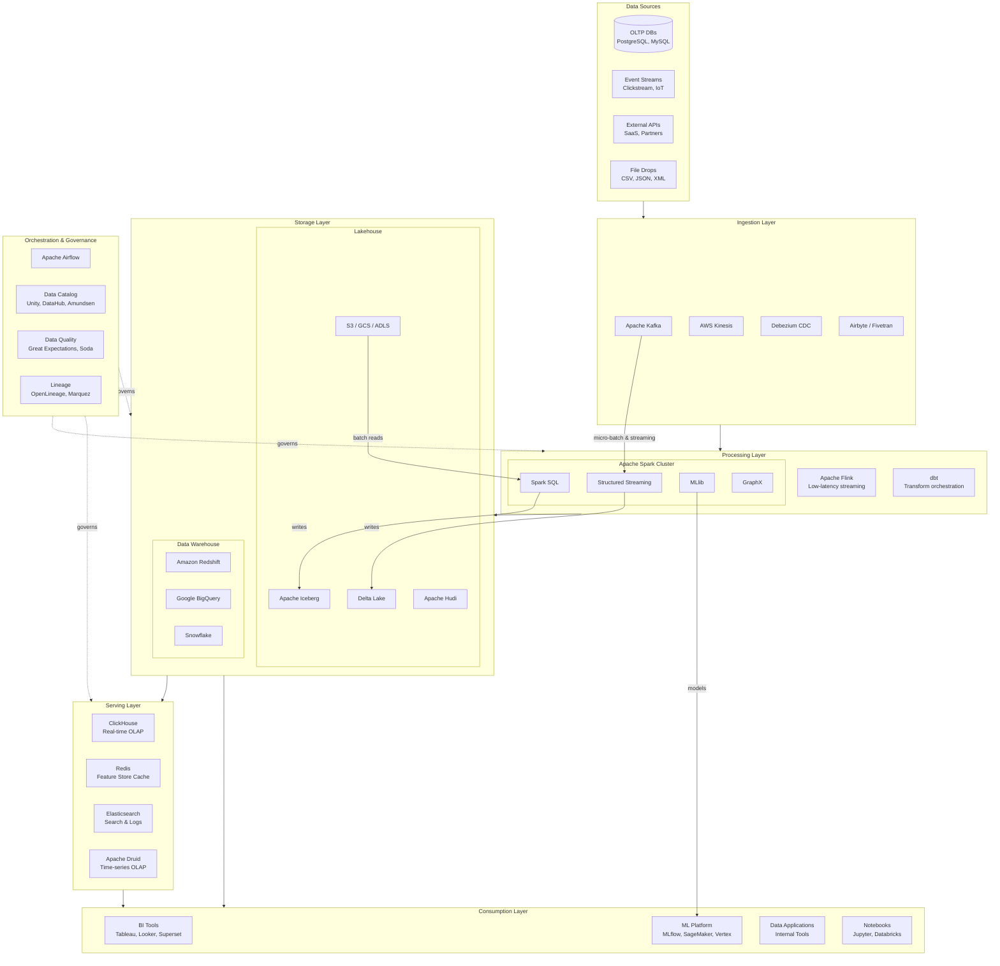
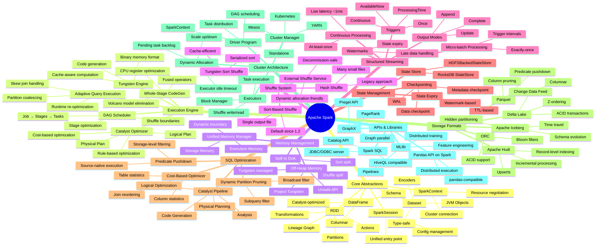
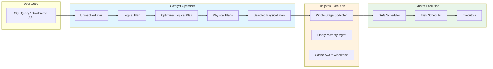
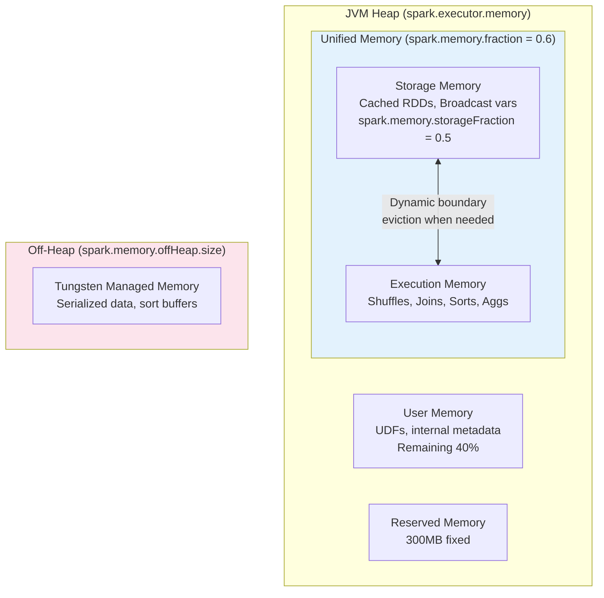
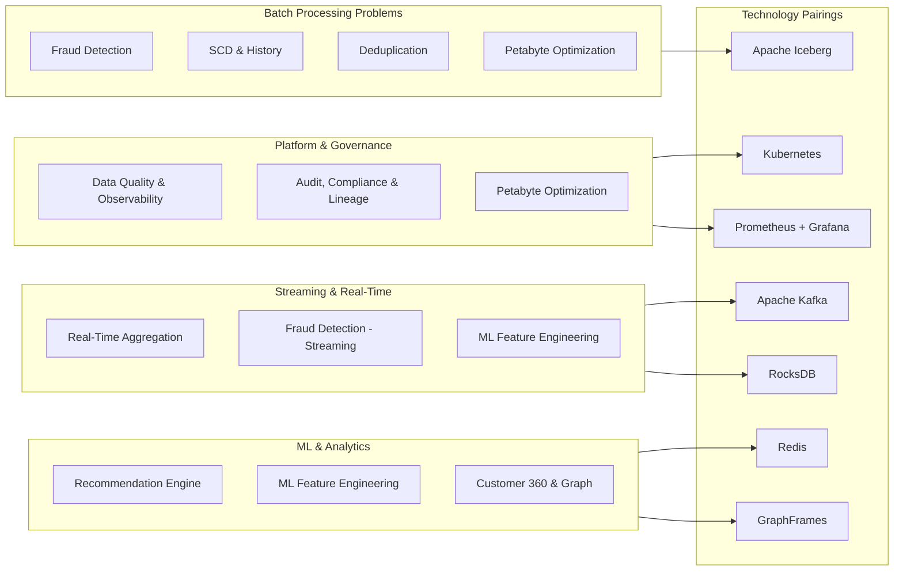
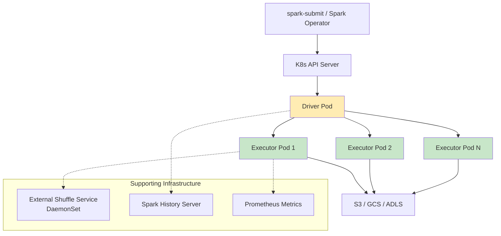
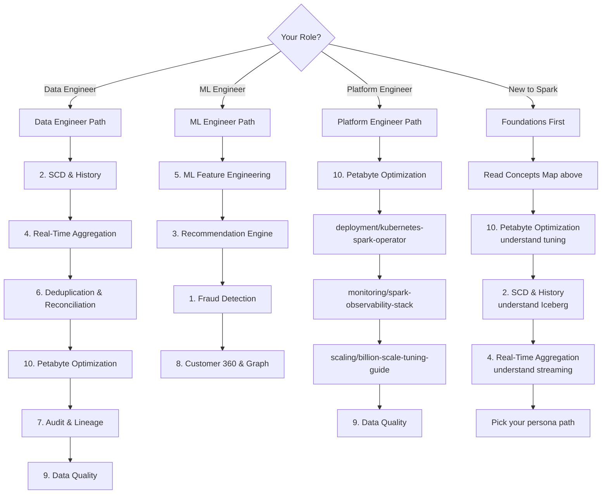

# Apache Spark Production at Scale: Solving Real-World Problems at Billion-Transaction Scale

> A comprehensive guide to mastering Apache Spark in production environments processing billions of transactions daily. Each problem addresses a real-world scenario encountered at companies operating at massive scale.

---

## Table of Contents

- [Master Architecture Diagram](#master-architecture-diagram)
- [Spark Concepts Map](#spark-concepts-map)
- [The 10 Production Problems](#the-10-production-problems)
- [Technology Stack Overview](#technology-stack-overview)
- [Spark Deployment Modes](#spark-deployment-modes)
- [Production Readiness Checklist](#production-readiness-checklist)
- [How to Use This Guide](#how-to-use-this-guide)

---

## Master Architecture Diagram

How Apache Spark fits within the modern data platform ecosystem:



---

## Spark Concepts Map

A comprehensive view of all major Apache Spark concepts organized by category:



### Execution Flow Detail



### Memory Model



---

## The 10 Production Problems

| # | Problem | Spark Concepts Used | Scale | Technologies | Link |
|---|---------|-------------------|-------|--------------|------|
| 1 | **Fraud Detection Pipeline** | Structured Streaming, ML Pipelines, State Store, Watermarks | 500K TPS, <100ms latency | Kafka, Spark ML, Iceberg, Redis | [→ Problem 1](./01-fraud-detection-pipeline.md) |
| 2 | **Slowly Changing Dimensions & History** | MERGE INTO, SCD Type 2, Iceberg Time Travel, Partitioning | 500M dimension records | Iceberg, Spark SQL, Delta Lake | [→ Problem 2](./02-slowly-changing-dimensions-history.md) |
| 3 | **Recommendation Engine Pipeline** | ALS, Broadcast Joins, UDFs, Pandas UDFs, MLlib Pipelines | 100M users × 10M items | Spark ML, Feature Store, Redis, Kafka | [→ Problem 3](./03-recommendation-engine-pipeline.md) |
| 4 | **Real-Time Aggregation at Billions** | Structured Streaming, Watermarks, State Store, Triggers, Output Modes | 10B events/day | Kafka, RocksDB, ClickHouse, Iceberg | [→ Problem 4](./04-real-time-aggregation-billions.md) |
| 5 | **ML Feature Engineering & Training** | Spark ML Pipelines, Feature Transformers, Pandas UDFs, Distributed Training | 50TB/day, 1000+ features | Spark ML, Feature Store, SageMaker, Iceberg | [→ Problem 5](./05-ml-feature-engineering-training.md) |
| 6 | **Data Deduplication & Reconciliation** | Bloom Filters, LSH, Graph Connected Components, Window Functions | 10B records/day | Spark SQL, GraphFrames, Iceberg | [→ Problem 6](./06-data-deduplication-reconciliation.md) |
| 7 | **Audit, Compliance & Lineage** | OpenLineage, SparkListener, Immutable Storage, Catalyst Extensions | SOX/HIPAA/PCI, 10-year retention | OpenLineage, Iceberg, S3 Object Lock, KMS | [→ Problem 7](./07-audit-compliance-lineage.md) |
| 8 | **Customer 360 & Graph Processing** | GraphFrames, Entity Resolution, Connected Components, PageRank | 500M profiles, billion edges | GraphFrames, Spark SQL, Neo4j, Iceberg | [→ Problem 8](./08-customer-360-graph-processing.md) |
| 9 | **Data Quality & Observability** | Statistical Profiling, Anomaly Detection, Schema Validation, Custom Metrics | 1000+ pipelines, 10K+ tables | Great Expectations, Spark SQL, Prometheus | [→ Problem 9](./09-data-quality-observability.md) |
| 10 | **Multi-Petabyte Optimization** | AQE, DPP, Z-order, Bucketing, Compaction, Partition Evolution | 50PB lakehouse | Iceberg, Spark SQL, S3, Graviton | [→ Problem 10](./10-multi-petabyte-optimization.md) |

---

## Technology Stack Overview

### By Problem Category



### Technology Matrix

| Technology | Used In Problems | Role |
|-----------|-----------------|------|
| **Apache Kafka** | 1, 4, 5 | Event streaming, source/sink |
| **Apache Iceberg** | 1, 2, 4, 5, 6, 7, 8, 10 | Table format, MERGE, schema evolution, compaction |
| **Kubernetes** | Deployment | Cluster management, Spark Operator, auto-scaling |
| **Prometheus/Grafana** | Monitoring | Metrics, alerting, SLA tracking |
| **GraphFrames** | 6, 8 | Entity resolution, connected components, PageRank |
| **Redis** | 1, 3, 5 | Feature serving cache, low-latency lookups |
| **RocksDB** | 4 | Streaming state backend |
| **Great Expectations** | 9 | Data quality validation |
| **OpenLineage** | 7 | Column-level lineage tracking |
| **Spark ML / MLlib** | 1, 3, 5 | ALS, pipelines, feature transformers |
| **AWS EMR / Databricks** | Deployment | Managed Spark clusters, spot integration |
| **ClickHouse** | 4 | Real-time OLAP serving layer |

---

## Spark Deployment Modes

```mermaid
graph TB
    subgraph Modes["Deployment Modes"]
        direction LR

        subgraph Local["Local Mode"]
            L1[Single JVM]
            L2[local / local[*] / local[N]]
            L3["Use: Dev & Testing"]
        end

        subgraph Standalone["Standalone Mode"]
            S1[Spark Master + Workers]
            S2[Simple cluster setup]
            S3["Use: Small dedicated clusters"]
        end

        subgraph YARN["YARN Mode"]
            Y1[Hadoop ResourceManager]
            Y2[Client & Cluster deploy modes]
            Y3["Use: Shared Hadoop clusters"]
        end

        subgraph K8s["Kubernetes Mode"]
            K1[K8s Scheduler]
            K2[Pod-per-executor]
            K3["Use: Cloud-native, multi-tenant"]
        end
    end

    subgraph DeployType["Deploy Modes"]
        Client["Client Mode<br/>Driver on submitting machine<br/>Interactive use"]
        ClusterM["Cluster Mode<br/>Driver inside cluster<br/>Production jobs"]
    end

    YARN --> Client
    YARN --> ClusterM
    K8s --> Client
    K8s --> ClusterM
    Standalone --> Client
    Standalone --> ClusterM
```

### Kubernetes Spark Architecture (Production Recommended)



---

## Production Readiness Checklist

### Pre-Deployment

| Category | Item | Priority |
|----------|------|----------|
| **Configuration** | Set `spark.sql.adaptive.enabled=true` (AQE) | Critical |
| **Configuration** | Configure `spark.sql.shuffle.partitions` based on data size | Critical |
| **Configuration** | Enable dynamic allocation with min/max bounds | High |
| **Configuration** | Set appropriate `spark.executor.memory` and `spark.executor.cores` | Critical |
| **Configuration** | Configure off-heap memory for large shuffles | High |
| **Stability** | Enable external shuffle service | Critical |
| **Stability** | Configure checkpointing for streaming jobs | Critical |
| **Stability** | Set `spark.task.maxFailures` (default 4) | Medium |
| **Stability** | Configure speculative execution for stragglers | Medium |
| **Monitoring** | Expose Spark metrics to Prometheus/Datadog | Critical |
| **Monitoring** | Configure Spark History Server with event log retention | High |
| **Monitoring** | Set up alerting on job duration, failure rate, shuffle spill | High |
| **Storage** | Use columnar formats (Parquet/ORC) with appropriate compression | Critical |
| **Storage** | Implement table format (Iceberg/Delta) for ACID and evolution | High |
| **Storage** | Schedule compaction for streaming sink tables | High |
| **Security** | Enable Kerberos/IAM authentication | Critical |
| **Security** | Configure encryption at rest and in transit | High |
| **Security** | Implement column-level access control | Medium |
| **Testing** | Unit test transformations with small local DataFrames | Critical |
| **Testing** | Integration test with realistic data volumes | High |
| **Testing** | Chaos test: kill executors, simulate OOM, network partition | Medium |

### Key Spark Configurations for Production

```properties
# Adaptive Query Execution
spark.sql.adaptive.enabled=true
spark.sql.adaptive.coalescePartitions.enabled=true
spark.sql.adaptive.skewJoin.enabled=true
spark.sql.adaptive.skewJoin.skewedPartitionThresholdInBytes=256MB

# Memory
spark.executor.memory=8g
spark.executor.memoryOverhead=2g
spark.memory.fraction=0.6
spark.memory.storageFraction=0.5
spark.memory.offHeap.enabled=true
spark.memory.offHeap.size=4g

# Shuffle
spark.sql.shuffle.partitions=auto  # AQE will handle
spark.shuffle.service.enabled=true
spark.shuffle.compress=true
spark.shuffle.spill.compress=true

# Dynamic Allocation
spark.dynamicAllocation.enabled=true
spark.dynamicAllocation.minExecutors=2
spark.dynamicAllocation.maxExecutors=100
spark.dynamicAllocation.executorIdleTimeout=60s
spark.dynamicAllocation.schedulerBacklogTimeout=1s

# Serialization
spark.serializer=org.apache.spark.serializer.KryoSerializer
spark.kryoserializer.buffer.max=1024m

# Speculation
spark.speculation=true
spark.speculation.multiplier=1.5
spark.speculation.quantile=0.9

# Network
spark.network.timeout=600s
spark.rpc.askTimeout=600s
```

---

## How to Use This Guide

### Learning Paths by Persona



### Recommended Approach for Each Problem

1. **Read the Problem Statement** - Understand the business context and scale
2. **Study the Architecture Diagram** - See how components interact
3. **Understand Root Causes** - Why does this happen at scale?
4. **Review the Solution** - Implementation with code examples
5. **Study the Trade-offs** - Every solution has costs
6. **Run the Code** - Hands-on with provided examples
7. **Apply to Your Context** - Adapt for your specific scale and stack

### Prerequisites

| Skill | Level Required | Resource |
|-------|---------------|----------|
| Python/Scala | Intermediate | - |
| SQL | Intermediate | - |
| Distributed Systems Concepts | Basic | - |
| Cloud (AWS/GCP/Azure) | Basic | - |
| Spark DataFrame API | Basic | [Spark Documentation](https://spark.apache.org/docs/latest/) |
| Docker/Kubernetes | Basic (for Platform path) | - |

---

## Directory Structure

```
10-spark-production-at-scale/
├── README.md                              # This file
├── 01-fraud-detection-pipeline.md         # Streaming fraud detection with ML
├── 02-slowly-changing-dimensions-history.md  # SCD Type 2, MERGE INTO, history
├── 03-recommendation-engine-pipeline.md   # ALS, deep learning, feature store
├── 04-real-time-aggregation-billions.md   # Structured Streaming, stateful
├── 05-ml-feature-engineering-training.md  # Feature pipelines, distributed training
├── 06-data-deduplication-reconciliation.md  # Bloom filters, LSH, graph dedup
├── 07-audit-compliance-lineage.md         # OpenLineage, SOX/HIPAA/PCI
├── 08-customer-360-graph-processing.md    # GraphFrames, entity resolution
├── 09-data-quality-observability.md       # Great Expectations, profiling
├── 10-multi-petabyte-optimization.md      # AQE, DPP, Z-order, compaction
├── deployment/
│   ├── kubernetes-spark-operator.md       # K8s Spark Operator, Volcano, namespaces
│   └── emr-databricks-config.md           # EMR, Databricks, spot instances
├── monitoring/
│   └── spark-observability-stack.md       # Prometheus, Grafana, SparkListener, SLAs
└── scaling/
    └── billion-scale-tuning-guide.md      # Memory, shuffle, AQE tuning at scale
```

---

## Quick Reference: When to Use What

| Situation | First Thing to Check | Relevant Problem File |
|-----------|---------------------|---------------|
| Need real-time fraud scoring | Structured Streaming + ML models | [01 - Fraud Detection](./01-fraud-detection-pipeline.md) |
| Tracking dimension history | SCD Type 2 with MERGE INTO | [02 - SCD & History](./02-slowly-changing-dimensions-history.md) |
| Building recommendation system | ALS, collaborative filtering, feature store | [03 - Recommendation Engine](./03-recommendation-engine-pipeline.md) |
| Aggregating billions of events | Structured Streaming, watermarks, state | [04 - Real-Time Aggregation](./04-real-time-aggregation-billions.md) |
| ML feature pipelines at scale | Spark ML, Pandas UDFs, distributed training | [05 - ML Feature Engineering](./05-ml-feature-engineering-training.md) |
| Deduplicating massive datasets | Bloom filters, LSH, connected components | [06 - Deduplication](./06-data-deduplication-reconciliation.md) |
| Regulatory audit requirements | OpenLineage, immutable storage, lineage | [07 - Audit & Compliance](./07-audit-compliance-lineage.md) |
| Building unified customer view | GraphFrames, entity resolution | [08 - Customer 360](./08-customer-360-graph-processing.md) |
| Data quality at pipeline scale | Statistical profiling, anomaly detection | [09 - Data Quality](./09-data-quality-observability.md) |
| Optimizing petabyte-scale lakehouse | AQE, DPP, Z-order, bucketing, compaction | [10 - Petabyte Optimization](./10-multi-petabyte-optimization.md) |
| Deploying Spark on Kubernetes | Spark Operator, Volcano, namespaces | [Deployment - K8s](./deployment/kubernetes-spark-operator.md) |
| Monitoring 500+ Spark jobs | Prometheus, Grafana, SparkListener | [Monitoring](./monitoring/spark-observability-stack.md) |
| Tuning for billion-scale | Memory, shuffle, partitions, AQE | [Scaling Guide](./scaling/billion-scale-tuning-guide.md) |

---

*Built for engineers who operate Spark at scale. Each problem is battle-tested from real production incidents at billion-transaction workloads.*
