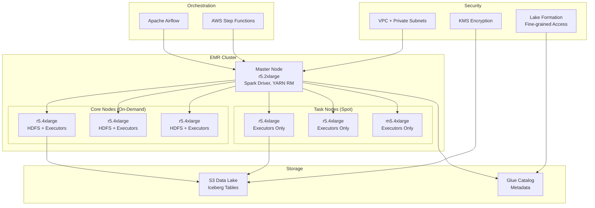
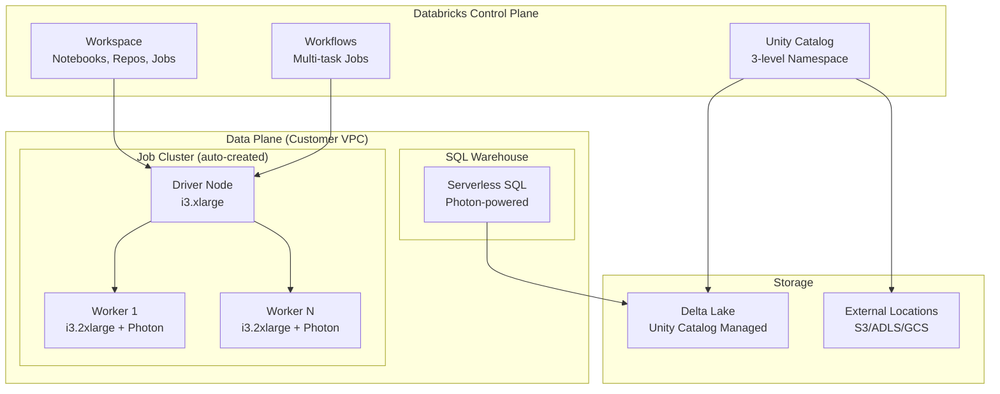
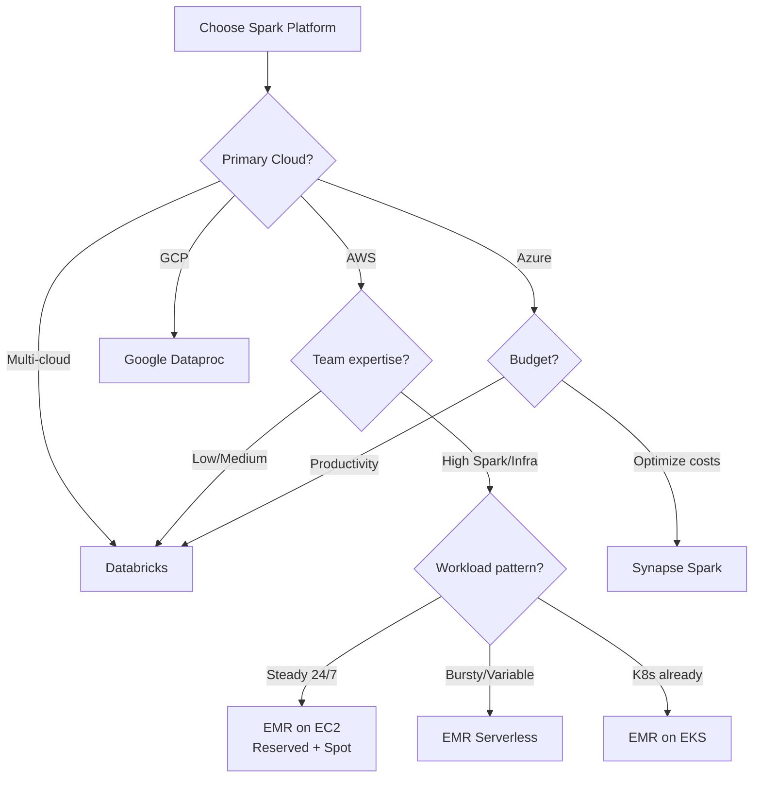

# Production Spark Deployment: EMR, Databricks, Dataproc & Cloud-Managed Platforms

> **Production Pattern**: Deploying and managing Spark workloads at scale across cloud-managed platforms with infrastructure-as-code, orchestration, cost optimization, and multi-environment governance.

---

## 1. Platform Comparison

| Feature | EMR on EC2 | EMR Serverless | Databricks | Dataproc | Synapse Spark |
|---------|-----------|---------------|------------|----------|---------------|
| **Cost Model** | Per-instance-hour | Per-vCPU-hour | DBU-based | Per-instance-hour | Per-vCore-hour |
| **Scaling Speed** | 5-10 min (new nodes) | Seconds (pre-init) | 2-5 min | 5-10 min | 2-5 min |
| **Max Cluster** | 1000+ nodes | Auto-managed | 1000+ workers | 1000+ nodes | 200 nodes |
| **Management** | Medium (you manage EMR) | Low (serverless) | Low (managed) | Medium | Low |
| **Table Format** | Iceberg/Delta/Hudi | Same | Delta (native) | Iceberg/Delta | Delta (native) |
| **Catalog** | Glue Catalog | Glue Catalog | Unity Catalog | Hive Metastore | Purview |
| **Photon/Accel** | No | No | Yes (3x faster) | No | No |
| **Spot Support** | Yes (managed) | N/A | Yes | Yes | No |
| **Best For** | Full control, custom | Burst workloads | Productivity | GCP shops | Azure shops |

---

## 2. Architecture Diagrams

### AWS EMR Architecture



### Databricks Architecture



---

## 3. AWS EMR Production Configuration

### Instance Fleet Configuration

```json
{
  "InstanceFleets": [
    {
      "Name": "Master",
      "InstanceFleetType": "MASTER",
      "TargetOnDemandCapacity": 1,
      "InstanceTypeConfigs": [
        {
          "InstanceType": "r5.2xlarge",
          "WeightedCapacity": 1,
          "EbsConfiguration": {
            "EbsBlockDeviceConfigs": [{
              "VolumeSpecification": {"VolumeType": "gp3", "SizeInGB": 100, "Iops": 3000},
              "VolumesPerInstance": 1
            }]
          }
        }
      ]
    },
    {
      "Name": "Core",
      "InstanceFleetType": "CORE",
      "TargetOnDemandCapacity": 64,
      "InstanceTypeConfigs": [
        {"InstanceType": "r5.4xlarge", "WeightedCapacity": 16},
        {"InstanceType": "r5.2xlarge", "WeightedCapacity": 8},
        {"InstanceType": "r6g.4xlarge", "WeightedCapacity": 16}
      ],
      "LaunchSpecifications": {
        "OnDemandSpecification": {
          "AllocationStrategy": "lowest-price"
        }
      }
    },
    {
      "Name": "Task",
      "InstanceFleetType": "TASK",
      "TargetSpotCapacity": 128,
      "InstanceTypeConfigs": [
        {"InstanceType": "r5.4xlarge", "WeightedCapacity": 16, "BidPriceAsPercentageOfOnDemandPrice": 60},
        {"InstanceType": "r5.8xlarge", "WeightedCapacity": 32, "BidPriceAsPercentageOfOnDemandPrice": 60},
        {"InstanceType": "r6g.4xlarge", "WeightedCapacity": 16, "BidPriceAsPercentageOfOnDemandPrice": 60},
        {"InstanceType": "m5.4xlarge", "WeightedCapacity": 16, "BidPriceAsPercentageOfOnDemandPrice": 60}
      ],
      "LaunchSpecifications": {
        "SpotSpecification": {
          "TimeoutDurationMinutes": 10,
          "TimeoutAction": "SWITCH_TO_ON_DEMAND",
          "AllocationStrategy": "capacity-optimized"
        }
      }
    }
  ]
}
```

### EMR Managed Scaling

```json
{
  "ComputeLimits": {
    "UnitType": "InstanceFleetUnits",
    "MinimumCapacityUnits": 64,
    "MaximumCapacityUnits": 256,
    "MaximumOnDemandCapacityUnits": 64,
    "MaximumCoreCapacityUnits": 64
  }
}
```

### Spark Configuration for EMR

```properties
# /etc/spark/conf/spark-defaults.conf on EMR

# Core settings
spark.master=yarn
spark.submit.deployMode=cluster
spark.yarn.maxAppAttempts=2

# Memory (r5.4xlarge = 128GB RAM, use ~80%)
spark.executor.memory=24g
spark.executor.memoryOverhead=6g
spark.executor.cores=5
spark.driver.memory=8g
spark.driver.memoryOverhead=2g

# Dynamic allocation
spark.dynamicAllocation.enabled=true
spark.dynamicAllocation.minExecutors=5
spark.dynamicAllocation.maxExecutors=200
spark.dynamicAllocation.executorIdleTimeout=120s
spark.dynamicAllocation.schedulerBacklogTimeout=5s
spark.shuffle.service.enabled=true

# S3 optimization (EMRFS)
spark.hadoop.fs.s3.consistent=true
spark.hadoop.fs.s3.consistent.retryPeriodSeconds=10
spark.hadoop.fs.s3.consistent.retryCount=5
spark.sql.hive.metastore.client.factory.class=com.amazonaws.glue.catalog.metastore.AWSGlueDataCatalogHiveClientFactory

# Iceberg
spark.sql.extensions=org.apache.iceberg.spark.extensions.IcebergSparkSessionExtensions
spark.sql.catalog.glue_catalog=org.apache.iceberg.spark.SparkCatalog
spark.sql.catalog.glue_catalog.warehouse=s3://my-data-lake/warehouse
spark.sql.catalog.glue_catalog.catalog-impl=org.apache.iceberg.aws.glue.GlueCatalog
spark.sql.catalog.glue_catalog.io-impl=org.apache.iceberg.aws.s3.S3FileIO

# AQE
spark.sql.adaptive.enabled=true
spark.sql.adaptive.coalescePartitions.enabled=true
spark.sql.adaptive.skewJoin.enabled=true
spark.sql.adaptive.advisoryPartitionSizeInBytes=256MB

# Compression
spark.io.compression.codec=zstd
spark.sql.parquet.compression.codec=zstd

# Shuffle
spark.sql.shuffle.partitions=2000
spark.shuffle.compress=true
```

### EMR Serverless Configuration

```python
import boto3

emr_serverless = boto3.client('emr-serverless')

# Create application
app = emr_serverless.create_application(
    name='spark-etl-production',
    releaseLabel='emr-7.0.0',
    type='SPARK',
    initialCapacity={
        'DRIVER': {
            'workerCount': 1,
            'workerConfiguration': {
                'cpu': '4 vCPU',
                'memory': '16 GB',
                'disk': '200 GB'
            }
        },
        'EXECUTOR': {
            'workerCount': 20,  # Pre-initialized workers (fast start)
            'workerConfiguration': {
                'cpu': '4 vCPU',
                'memory': '32 GB',
                'disk': '200 GB'
            }
        }
    },
    maximumCapacity={
        'cpu': '2000 vCPU',
        'memory': '8000 GB',
        'disk': '200000 GB'
    },
    autoStartConfiguration={'enabled': True},
    autoStopConfiguration={'enabled': True, 'idleTimeoutMinutes': 5}
)

# Submit job
job = emr_serverless.start_job_run(
    applicationId=app['applicationId'],
    executionRoleArn='arn:aws:iam::123456789012:role/EMRServerlessRole',
    jobDriver={
        'sparkSubmit': {
            'entryPoint': 's3://my-bucket/jobs/etl_pipeline.py',
            'sparkSubmitParameters': (
                '--conf spark.executor.memory=24g '
                '--conf spark.executor.cores=4 '
                '--conf spark.sql.adaptive.enabled=true '
                '--conf spark.sql.shuffle.partitions=auto'
            )
        }
    },
    configurationOverrides={
        'monitoringConfiguration': {
            's3MonitoringConfiguration': {
                'logUri': 's3://my-bucket/logs/'
            }
        }
    }
)
```

### Security Configuration

```python
# EMR Security Configuration
security_config = {
    "EncryptionConfiguration": {
        "EnableInTransitEncryption": True,
        "EnableAtRestEncryption": True,
        "InTransitEncryptionConfiguration": {
            "TLSCertificateConfiguration": {
                "CertificateProviderType": "PEM",
                "S3Object": "s3://certs-bucket/my-certs.zip"
            }
        },
        "AtRestEncryptionConfiguration": {
            "S3EncryptionConfiguration": {
                "EncryptionMode": "SSE-KMS",
                "AwsKmsKey": "arn:aws:kms:us-east-1:123456:key/xxx"
            },
            "LocalDiskEncryptionConfiguration": {
                "EncryptionKeyProviderType": "AwsKms",
                "AwsKmsKey": "arn:aws:kms:us-east-1:123456:key/yyy",
                "EnableEbsEncryption": True
            }
        }
    }
}
```

---

## 4. Databricks Production Configuration

### Unity Catalog Setup

```sql
-- Three-level namespace: catalog.schema.table
CREATE CATALOG production_analytics;
CREATE SCHEMA production_analytics.gold;

-- Fine-grained access control
GRANT USAGE ON CATALOG production_analytics TO `data-analysts`;
GRANT SELECT ON SCHEMA production_analytics.gold TO `data-analysts`;
GRANT ALL PRIVILEGES ON SCHEMA production_analytics.silver TO `data-engineers`;

-- Column-level masking
CREATE FUNCTION mask_ssn(ssn STRING)
RETURNS STRING
RETURN CASE WHEN is_member('pii-viewers') THEN ssn 
            ELSE CONCAT('***-**-', RIGHT(ssn, 4)) END;

ALTER TABLE customers ALTER COLUMN ssn SET MASK mask_ssn;
```

### Job Cluster Configuration

```json
{
  "job_clusters": [
    {
      "job_cluster_key": "etl_cluster",
      "new_cluster": {
        "spark_version": "14.3.x-scala2.12",
        "node_type_id": "i3.2xlarge",
        "num_workers": 0,
        "autoscale": {
          "min_workers": 5,
          "max_workers": 50
        },
        "spark_conf": {
          "spark.sql.adaptive.enabled": "true",
          "spark.sql.adaptive.coalescePartitions.enabled": "true",
          "spark.sql.shuffle.partitions": "auto",
          "spark.databricks.delta.optimizeWrite.enabled": "true",
          "spark.databricks.delta.autoCompact.enabled": "true"
        },
        "aws_attributes": {
          "first_on_demand": 1,
          "availability": "SPOT_WITH_FALLBACK",
          "spot_bid_price_percent": 60,
          "instance_profile_arn": "arn:aws:iam::123456:instance-profile/databricks-role"
        },
        "runtime_engine": "PHOTON",
        "custom_tags": {
          "team": "data-platform",
          "cost_center": "DE-001"
        }
      }
    }
  ]
}
```

### Delta Lake Optimization (Databricks)

```sql
-- Auto Optimize: automatically compacts small files
ALTER TABLE catalog.schema.table SET TBLPROPERTIES (
    'delta.autoOptimize.optimizeWrite' = 'true',
    'delta.autoOptimize.autoCompact' = 'true'
);

-- Liquid Clustering (replaces Z-ORDER + partitioning)
-- Iceberg-like: automatically reorganizes data based on cluster keys
ALTER TABLE catalog.schema.table CLUSTER BY (customer_id, event_date);

-- Predictive I/O (auto-accelerates queries)
ALTER TABLE catalog.schema.table SET TBLPROPERTIES (
    'delta.enableDeletionVectors' = 'true'
);
```

---

## 5. Terraform IaC

### EMR Cluster Module

```hcl
# modules/emr/main.tf
resource "aws_emr_cluster" "spark" {
  name          = var.cluster_name
  release_label = "emr-7.0.0"
  applications  = ["Spark", "Hive", "Livy"]
  
  service_role = aws_iam_role.emr_service.arn
  
  ec2_attributes {
    subnet_id                         = var.subnet_id
    emr_managed_master_security_group = aws_security_group.master.id
    emr_managed_slave_security_group  = aws_security_group.core.id
    instance_profile                  = aws_iam_instance_profile.emr_ec2.arn
    key_name                          = var.key_name
  }
  
  master_instance_fleet {
    name                      = "Master"
    target_on_demand_capacity = 1
    instance_type_configs {
      instance_type     = "r5.2xlarge"
      weighted_capacity = 1
    }
  }
  
  core_instance_fleet {
    name                      = "Core"
    target_on_demand_capacity = var.core_capacity
    instance_type_configs {
      instance_type     = "r5.4xlarge"
      weighted_capacity = 16
      ebs_config {
        size                 = 100
        type                 = "gp3"
        volumes_per_instance = 2
      }
    }
    instance_type_configs {
      instance_type     = "r6g.4xlarge"
      weighted_capacity = 16
    }
  }
  
  configurations_json = jsonencode([
    {
      Classification = "spark-defaults"
      Properties = {
        "spark.executor.memory"                    = "24g"
        "spark.executor.cores"                     = "5"
        "spark.dynamicAllocation.enabled"          = "true"
        "spark.sql.adaptive.enabled"               = "true"
        "spark.sql.catalog.glue_catalog"           = "org.apache.iceberg.spark.SparkCatalog"
        "spark.sql.catalog.glue_catalog.catalog-impl" = "org.apache.iceberg.aws.glue.GlueCatalog"
      }
    },
    {
      Classification = "spark-hive-site"
      Properties = {
        "hive.metastore.client.factory.class" = "com.amazonaws.glue.catalog.metastore.AWSGlueDataCatalogHiveClientFactory"
      }
    }
  ])
  
  managed_scaling_policy {
    compute_limits {
      unit_type                       = "InstanceFleetUnits"
      minimum_capacity_units          = var.min_capacity
      maximum_capacity_units          = var.max_capacity
      maximum_ondemand_capacity_units = var.max_on_demand
      maximum_core_capacity_units     = var.core_capacity
    }
  }
  
  auto_termination_policy {
    idle_timeout = 3600  # Terminate after 1 hour idle
  }
  
  tags = var.tags
}
```

---

## 6. Orchestration

### Airflow + EMR

```python
from airflow import DAG
from airflow.providers.amazon.aws.operators.emr import (
    EmrCreateJobFlowOperator,
    EmrAddStepsOperator,
    EmrTerminateJobFlowOperator,
)
from airflow.providers.amazon.aws.sensors.emr import EmrStepSensor
from datetime import datetime, timedelta

default_args = {
    'owner': 'data-platform',
    'retries': 2,
    'retry_delay': timedelta(minutes=10),
}

with DAG(
    'spark_etl_pipeline',
    default_args=default_args,
    schedule_interval='0 2 * * *',  # Daily at 2 AM
    start_date=datetime(2024, 1, 1),
    catchup=False,
    max_active_runs=1,
) as dag:
    
    create_cluster = EmrCreateJobFlowOperator(
        task_id='create_emr_cluster',
        job_flow_overrides={
            'Name': 'daily-etl-{{ ds }}',
            'ReleaseLabel': 'emr-7.0.0',
            'Applications': [{'Name': 'Spark'}],
            'Instances': {
                'InstanceFleets': [...]  # From config above
            },
            'Steps': [],
            'BootstrapActions': [],
            'Configurations': [...]
        }
    )
    
    add_etl_step = EmrAddStepsOperator(
        task_id='run_etl_job',
        job_flow_id="{{ task_instance.xcom_pull(task_ids='create_emr_cluster') }}",
        steps=[{
            'Name': 'ETL Pipeline',
            'ActionOnFailure': 'CONTINUE',
            'HadoopJarStep': {
                'Jar': 'command-runner.jar',
                'Args': [
                    'spark-submit',
                    '--deploy-mode', 'cluster',
                    '--conf', 'spark.sql.adaptive.enabled=true',
                    's3://my-bucket/jobs/daily_etl.py',
                    '--date', '{{ ds }}'
                ]
            }
        }]
    )
    
    wait_for_step = EmrStepSensor(
        task_id='wait_for_etl',
        job_flow_id="{{ task_instance.xcom_pull(task_ids='create_emr_cluster') }}",
        step_id="{{ task_instance.xcom_pull(task_ids='run_etl_job')[0] }}",
        poke_interval=60,
        timeout=7200,
    )
    
    terminate_cluster = EmrTerminateJobFlowOperator(
        task_id='terminate_cluster',
        job_flow_id="{{ task_instance.xcom_pull(task_ids='create_emr_cluster') }}",
        trigger_rule='all_done',
    )
    
    create_cluster >> add_etl_step >> wait_for_step >> terminate_cluster
```

### Airflow + Databricks

```python
from airflow.providers.databricks.operators.databricks import (
    DatabricksSubmitRunOperator,
    DatabricksRunNowOperator,
)

submit_spark_job = DatabricksSubmitRunOperator(
    task_id='run_databricks_etl',
    databricks_conn_id='databricks_default',
    json={
        'run_name': 'daily_etl_{{ ds }}',
        'new_cluster': {
            'spark_version': '14.3.x-scala2.12',
            'node_type_id': 'i3.2xlarge',
            'autoscale': {'min_workers': 5, 'max_workers': 50},
            'runtime_engine': 'PHOTON'
        },
        'spark_python_task': {
            'python_file': 'dbfs:/jobs/daily_etl.py',
            'parameters': ['--date', '{{ ds }}']
        },
        'timeout_seconds': 7200,
    }
)
```

---

## 7. Cost Optimization

| Strategy | Savings | Implementation |
|----------|---------|----------------|
| Spot instances (Task nodes) | 60-70% | capacity-optimized allocation |
| Graviton/ARM (r6g, m6g) | 30% | Drop-in replacement |
| Auto-termination | 20-40% | Idle timeout = 1 hour |
| Right-sizing | 15-25% | Monitor actual memory/CPU usage |
| Reserved capacity (Core) | 30-40% | 1-year commitment for base load |
| EMR Serverless (burst) | Variable | Pay only for compute used |
| S3 Intelligent-Tiering | 10-15% | Auto-tier infrequently accessed data |

---

## 8. Monitoring Per Platform

### EMR CloudWatch Metrics

```python
# Key CloudWatch metrics to monitor:
emr_metrics = {
    "IsIdle": "Cluster idle (ready for termination)",
    "AppsRunning": "Number of running applications",
    "AppsPending": "Queued applications (scale up signal)",
    "HDFSUtilization": "HDFS disk usage (for core nodes)",
    "MemoryAvailableMB": "Available memory across cluster",
    "YARNMemoryAvailablePercentage": "% YARN memory free",
    "ContainerPending": "Pending containers (need more nodes)",
}

# CloudWatch Alarm for stuck jobs
# If AppsRunning > 0 for > 6 hours, alert
```

---

## 9. Companies Using These Platforms

| Company | Platform | Scale | Notes |
|---------|----------|-------|-------|
| **Netflix** | EMR | 10K+ clusters/day | Custom AMI, spot-heavy |
| **Apple** | EMR | Massive scale | Largest EMR customer |
| **Comcast** | Databricks | 10PB+ | Unity Catalog, Delta |
| **Shell** | Databricks | Global | Multi-cloud (AWS + Azure) |
| **Spotify** | Dataproc | Large | GCP ecosystem |
| **Uber** | Custom + EMR | 100PB+ | Custom platform on top |

---

## 10. Migration Decision Flowchart


