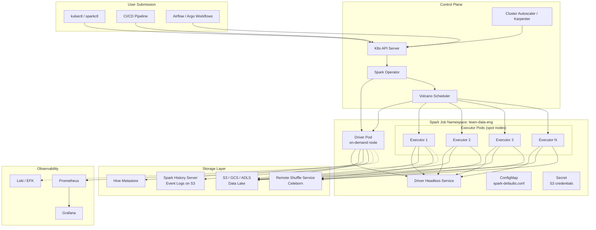
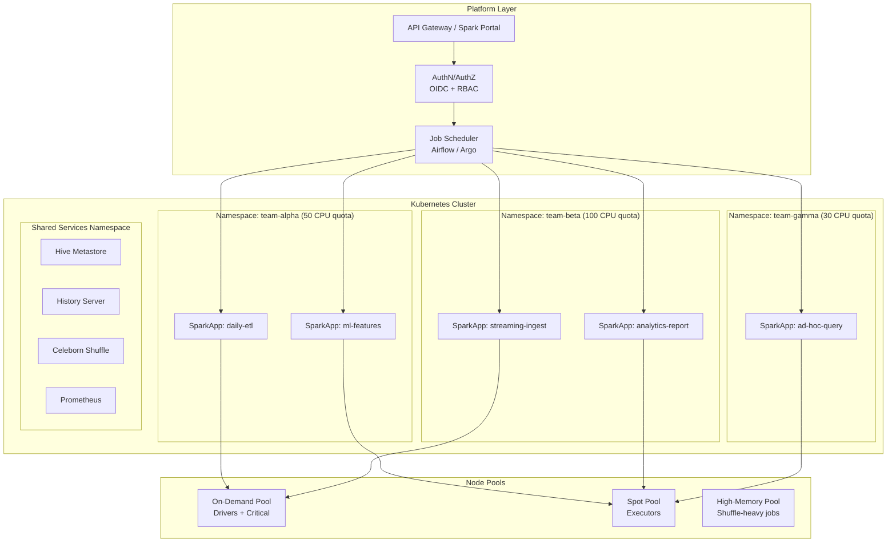
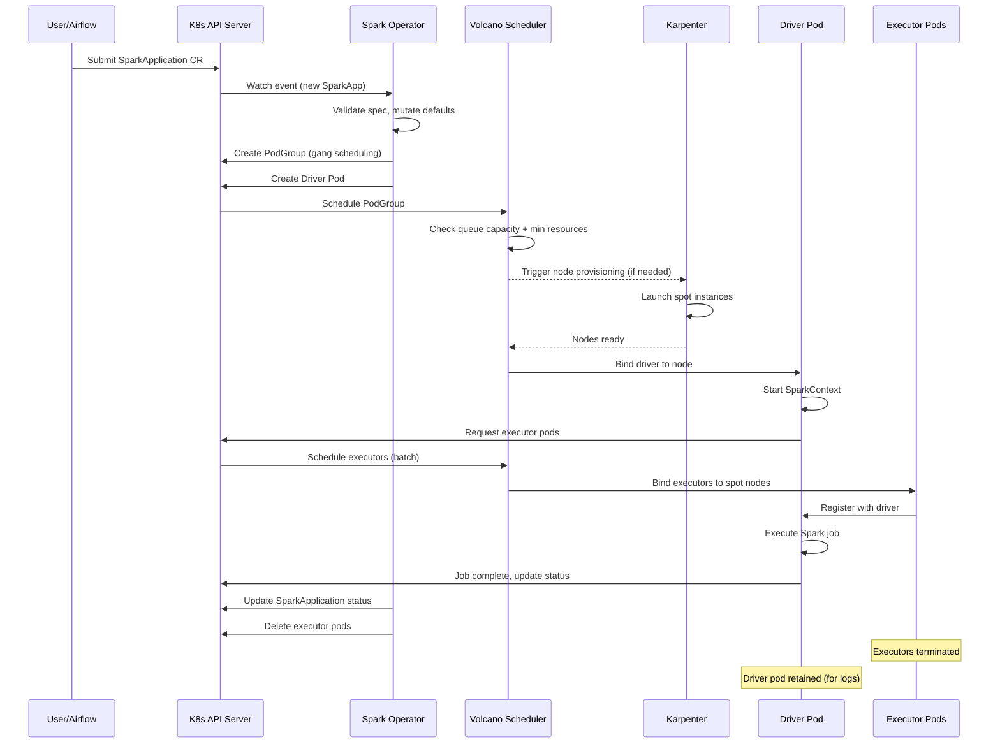
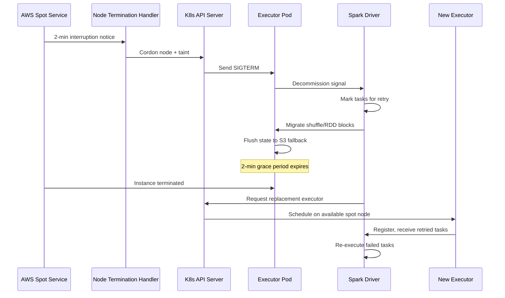
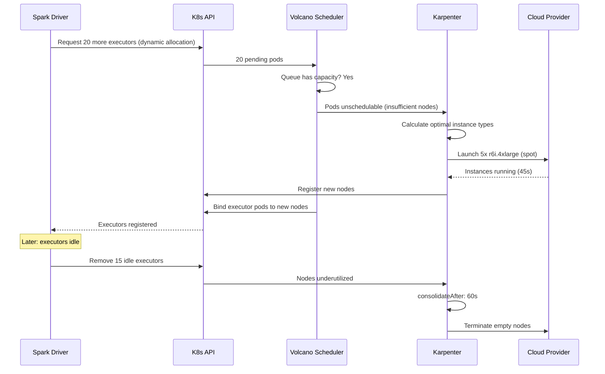

# Production Spark on Kubernetes: Spark Operator, Volcano, and Cloud-Native Deployment

## 1. Why Kubernetes for Spark

### The Shift from YARN to Kubernetes

Traditional Spark deployments on YARN created isolated clusters dedicated solely to batch/streaming analytics. Kubernetes enables **converged infrastructure** where Spark shares resources with ML training, serving, streaming, and microservices.

| Dimension | YARN | Kubernetes |
|-----------|------|------------|
| Resource sharing | Spark-only cluster | Shared with all workloads |
| Scaling | Manual node addition | Auto-scaling (Karpenter, CAS) |
| Isolation | Queue-based | Namespace + cgroup + network policy |
| Packaging | JARs + configs | Container images (immutable) |
| Multi-tenancy | YARN queues | Namespaces + RBAC + quotas |
| Cloud integration | Manual | Native (spot, PVCs, IAM) |
| Cost | Dedicated clusters always-on | Scale-to-zero, bin-packing |

### Key Benefits

**Resource Sharing**: A single K8s cluster runs ETL pipelines (Spark), ML training (PyTorch), model serving (TensorFlow Serving), and web services. Spark executors use resources freed by serving pods during off-peak hours.

**Container Isolation and Reproducibility**: Every Spark job runs in a Docker image containing the exact Spark version, dependencies, and configuration. No more "works on my cluster" issues.

**Cost Optimization with Spot Instances**: Executors run on spot/preemptible nodes (60-90% cheaper). Drivers run on on-demand nodes for reliability. Kubernetes handles the scheduling automatically via node affinity.

**Multi-Tenancy**: Teams get isolated namespaces with resource quotas, network policies, and RBAC. Cost attribution happens at the namespace level via labels and metrics.

---

## 2. Architecture Diagrams

### Spark on Kubernetes Architecture



### Multi-Tenant Platform Architecture



### CI/CD Pipeline for Spark Applications

```mermaid
graph LR
    subgraph "Developer"
        CODE[Spark Code + Tests]
        PR[Pull Request]
    end

    subgraph "CI Pipeline"
        UT[Unit Tests<br/>spark-testing-base]
        IT[Integration Tests<br/>Testcontainers + MinIO]
        BUILD[Docker Build<br/>Multi-stage]
        SCAN[Image Scan<br/>Trivy]
        PUSH[Push to ECR/GCR]
    end

    subgraph "CD Pipeline (ArgoCD)"
        SYNC[GitOps Sync]
        APPLY[Apply SparkApplication]
        VALIDATE[Health Check]
        ROLLBACK[Rollback on Failure]
    end

    CODE --> PR --> UT --> IT --> BUILD --> SCAN --> PUSH
    PUSH --> SYNC --> APPLY --> VALIDATE
    VALIDATE -->|Failed| ROLLBACK
```



---

## 3. Spark Kubernetes Operator

### Installation via Helm

```bash
# Add the Spark Operator Helm repository
helm repo add spark-operator https://kubeflow.github.io/spark-operator
helm repo update

# Create namespace for the operator
kubectl create namespace spark-operator

# Install Spark Operator with production settings
helm install spark-operator spark-operator/spark-operator \
  --namespace spark-operator \
  --set webhook.enable=true \
  --set webhook.port=443 \
  --set metrics.enable=true \
  --set metrics.port=10254 \
  --set metrics.endpoint=/metrics \
  --set spark.jobNamespaces='{team-alpha,team-beta,team-gamma}' \
  --set controller.workers=10 \
  --set resourceQuotaEnforcement.enable=true \
  --set batchScheduler.enable=true \
  --set batchScheduler.default=volcano \
  --set image.tag=v2.0.0 \
  --set replicas=2 \
  --set podDisruptionBudget.enable=true \
  --set podDisruptionBudget.minAvailable=1
```

### Production Helm Values (`values-production.yaml`)

```yaml
# values-production.yaml
replicaCount: 2

image:
  repository: ghcr.io/kubeflow/spark-operator
  tag: v2.0.0
  pullPolicy: IfNotPresent

controller:
  workers: 10
  logLevel: info

webhook:
  enable: true
  port: 443
  failurePolicy: Fail
  timeoutSeconds: 30

metrics:
  enable: true
  port: 10254
  endpoint: /metrics
  prefix: spark_operator_

spark:
  jobNamespaces:
    - team-alpha
    - team-beta
    - team-gamma
    - team-data-platform

batchScheduler:
  enable: true
  default: volcano

resourceQuotaEnforcement:
  enable: true

podDisruptionBudget:
  enable: true
  minAvailable: 1

resources:
  requests:
    cpu: 500m
    memory: 512Mi
  limits:
    cpu: "2"
    memory: 1Gi

tolerations:
  - key: "dedicated"
    operator: "Equal"
    value: "platform"
    effect: "NoSchedule"

nodeSelector:
  node-role: platform

serviceAccount:
  create: true
  annotations:
    eks.amazonaws.com/role-arn: arn:aws:iam::123456789012:role/spark-operator-role
```

### SparkApplication CRD

The Spark Operator introduces a `SparkApplication` Custom Resource Definition (CRD) that declaratively defines Spark jobs:

```yaml
apiVersion: sparkoperator.k8s.io/v1beta2
kind: SparkApplication
metadata:
  name: example-app
  namespace: team-alpha
spec:
  type: Scala
  mode: cluster
  image: "registry.company.com/spark/etl-pipeline:v2.3.1"
  mainClass: com.company.etl.DailyPipeline
  mainApplicationFile: "local:///opt/spark/jars/etl-pipeline.jar"
  sparkVersion: "3.5.0"
  restartPolicy:
    type: OnFailure
    onFailureRetries: 3
    onFailureRetryInterval: 60
    onSubmissionFailureRetries: 5
    onSubmissionFailureRetryInterval: 30
  driver:
    cores: 2
    memory: "4g"
    serviceAccount: spark-driver-sa
  executor:
    cores: 4
    instances: 10
    memory: "8g"
```

### ScheduledSparkApplication

```yaml
apiVersion: sparkoperator.k8s.io/v1beta2
kind: ScheduledSparkApplication
metadata:
  name: daily-etl-pipeline
  namespace: team-alpha
spec:
  schedule: "0 2 * * *"  # 2 AM daily
  concurrencyPolicy: Forbid
  successfulRunHistoryLimit: 5
  failedRunHistoryLimit: 5
  template:
    type: Scala
    mode: cluster
    image: "registry.company.com/spark/etl:v2.3.1"
    mainClass: com.company.etl.DailyIngestion
    mainApplicationFile: "local:///opt/spark/jars/etl.jar"
    arguments:
      - "--date"
      - "{{.ScheduledTime.Format \"2006-01-02\"}}"
    sparkVersion: "3.5.0"
    restartPolicy:
      type: OnFailure
      onFailureRetries: 3
      onFailureRetryInterval: 120
    driver:
      cores: 2
      memory: "4g"
      serviceAccount: spark-driver-sa
    executor:
      cores: 4
      instances: 20
      memory: "16g"
```

---

## 4. Production Configuration

### Complete Production SparkApplication YAML

```yaml
apiVersion: sparkoperator.k8s.io/v1beta2
kind: SparkApplication
metadata:
  name: production-etl-daily-revenue
  namespace: team-data-eng
  labels:
    app.kubernetes.io/name: revenue-etl
    app.kubernetes.io/version: "2.3.1"
    team: data-engineering
    cost-center: "CC-1234"
    environment: production
    data-classification: confidential
spec:
  type: Scala
  mode: cluster
  image: "123456789012.dkr.ecr.us-east-1.amazonaws.com/spark/revenue-etl:v2.3.1-spark3.5"
  imagePullPolicy: Always
  imagePullSecrets:
    - ecr-pull-secret
  mainClass: com.company.etl.revenue.DailyRevenueAggregation
  mainApplicationFile: "local:///opt/spark/jars/revenue-etl-2.3.1.jar"
  arguments:
    - "--execution-date"
    - "2024-01-15"
    - "--output-path"
    - "s3a://data-lake-prod/warehouse/revenue/daily/"
    - "--partitions"
    - "200"
  sparkVersion: "3.5.0"
  
  # Batch Scheduler (Volcano)
  batchScheduler: volcano
  batchSchedulerOptions:
    queue: production
    priorityClassName: high-priority
  
  # Restart Policy
  restartPolicy:
    type: OnFailure
    onFailureRetries: 3
    onFailureRetryInterval: 120
    onSubmissionFailureRetries: 5
    onSubmissionFailureRetryInterval: 60
  
  # Spark Configuration
  sparkConf:
    # Performance
    "spark.sql.adaptive.enabled": "true"
    "spark.sql.adaptive.coalescePartitions.enabled": "true"
    "spark.sql.adaptive.skewJoin.enabled": "true"
    "spark.sql.shuffle.partitions": "200"
    "spark.default.parallelism": "200"
    
    # Memory Management
    "spark.memory.fraction": "0.8"
    "spark.memory.storageFraction": "0.3"
    "spark.sql.windowExec.buffer.in.memory.threshold": "4096"
    
    # Shuffle
    "spark.shuffle.service.enabled": "false"
    "spark.celeborn.client.spark.shuffle.writer": "hash"
    "spark.celeborn.master.endpoints": "celeborn-master.shared-services:9097"
    "spark.shuffle.manager": "org.apache.spark.shuffle.celeborn.SparkShuffleManager"
    
    # S3 Configuration
    "spark.hadoop.fs.s3a.impl": "org.apache.hadoop.fs.s3a.S3AFileSystem"
    "spark.hadoop.fs.s3a.aws.credentials.provider": "com.amazonaws.auth.WebIdentityTokenCredentialsProvider"
    "spark.hadoop.fs.s3a.connection.maximum": "200"
    "spark.hadoop.fs.s3a.fast.upload": "true"
    "spark.hadoop.fs.s3a.path.style.access": "false"
    "spark.hadoop.fs.s3a.committer.name": "magic"
    "spark.hadoop.fs.s3a.committer.magic.enabled": "true"
    
    # Hive Metastore
    "spark.sql.catalogImplementation": "hive"
    "spark.hadoop.hive.metastore.uris": "thrift://hive-metastore.shared-services:9083"
    
    # Dynamic Allocation
    "spark.dynamicAllocation.enabled": "true"
    "spark.dynamicAllocation.initialExecutors": "10"
    "spark.dynamicAllocation.minExecutors": "5"
    "spark.dynamicAllocation.maxExecutors": "100"
    "spark.dynamicAllocation.executorIdleTimeout": "120s"
    "spark.dynamicAllocation.schedulerBacklogTimeout": "30s"
    "spark.dynamicAllocation.shuffleTracking.enabled": "true"
    
    # Metrics
    "spark.metrics.conf.*.sink.prometheusServlet.class": "org.apache.spark.metrics.sink.PrometheusServlet"
    "spark.metrics.conf.*.sink.prometheusServlet.path": "/metrics/prometheus"
    "spark.ui.prometheus.enabled": "true"
    
    # Event Logging
    "spark.eventLog.enabled": "true"
    "spark.eventLog.dir": "s3a://spark-events-prod/logs/"
    "spark.eventLog.compress": "true"
    "spark.eventLog.rolling.enabled": "true"
    "spark.eventLog.rolling.maxFileSize": "128m"
    
    # Speculation
    "spark.speculation": "true"
    "spark.speculation.multiplier": "3"
    "spark.speculation.quantile": "0.9"
    
    # Kubernetes-specific
    "spark.kubernetes.allocation.batch.size": "10"
    "spark.kubernetes.allocation.batch.delay": "1s"
    "spark.kubernetes.executor.deleteOnTermination": "true"
    "spark.kubernetes.submission.waitAppCompletion": "false"

  hadoopConf:
    "fs.s3a.endpoint": "s3.us-east-1.amazonaws.com"
    "fs.s3a.region": "us-east-1"

  # ============ DRIVER CONFIGURATION ============
  driver:
    cores: 4
    coreLimit: "4000m"
    memory: "8g"
    memoryOverhead: "2g"
    serviceAccount: spark-driver-sa
    
    labels:
      spark-role: driver
      team: data-engineering
      version: "2.3.1"
    
    annotations:
      prometheus.io/scrape: "true"
      prometheus.io/port: "4040"
      prometheus.io/path: "/metrics/prometheus"
      cluster-autoscaler.kubernetes.io/safe-to-evict: "false"
    
    # Schedule driver on on-demand nodes
    nodeSelector:
      node.kubernetes.io/instance-type-lifecycle: on-demand
      spark-role: driver
    
    affinity:
      nodeAffinity:
        requiredDuringSchedulingIgnoredDuringExecution:
          nodeSelectorTerms:
            - matchExpressions:
                - key: karpenter.sh/capacity-type
                  operator: In
                  values:
                    - on-demand
        preferredDuringSchedulingIgnoredDuringExecution:
          - weight: 100
            preference:
              matchExpressions:
                - key: topology.kubernetes.io/zone
                  operator: In
                  values:
                    - us-east-1a
    
    tolerations:
      - key: "spark-driver"
        operator: "Equal"
        value: "true"
        effect: "NoSchedule"
    
    podSecurityContext:
      runAsUser: 185
      runAsGroup: 185
      fsGroup: 185
    
    securityContext:
      runAsNonRoot: true
      readOnlyRootFilesystem: true
      allowPrivilegeEscalation: false
      capabilities:
        drop:
          - ALL
    
    env:
      - name: AWS_REGION
        value: "us-east-1"
      - name: SPARK_DRIVER_MEMORY
        value: "8g"
    
    envFrom:
      - secretRef:
          name: spark-secrets
    
    volumeMounts:
      - name: spark-conf
        mountPath: /opt/spark/conf
      - name: tmp-dir
        mountPath: /tmp
      - name: spark-local
        mountPath: /data/spark-local

  # ============ EXECUTOR CONFIGURATION ============
  executor:
    cores: 4
    coreLimit: "4000m"
    memory: "14g"
    memoryOverhead: "2g"
    instances: 10
    
    labels:
      spark-role: executor
      team: data-engineering
    
    annotations:
      prometheus.io/scrape: "true"
      prometheus.io/port: "4040"
      prometheus.io/path: "/metrics/prometheus"
      cluster-autoscaler.kubernetes.io/safe-to-evict: "true"
    
    # Schedule executors on spot nodes
    nodeSelector:
      spark-role: executor
    
    affinity:
      nodeAffinity:
        requiredDuringSchedulingIgnoredDuringExecution:
          nodeSelectorTerms:
            - matchExpressions:
                - key: karpenter.sh/capacity-type
                  operator: In
                  values:
                    - spot
                - key: node.kubernetes.io/instance-type
                  operator: In
                  values:
                    - r6i.2xlarge
                    - r6i.4xlarge
                    - r5.2xlarge
                    - r5.4xlarge
                    - m6i.4xlarge
      podAntiAffinity:
        preferredDuringSchedulingIgnoredDuringExecution:
          - weight: 50
            podAffinityTerm:
              labelSelector:
                matchExpressions:
                  - key: spark-role
                    operator: In
                    values:
                      - executor
              topologyKey: topology.kubernetes.io/zone
    
    tolerations:
      - key: "spark-executor"
        operator: "Equal"
        value: "true"
        effect: "NoSchedule"
      - key: "kubernetes.azure.com/scalesetpriority"
        operator: "Equal"
        value: "spot"
        effect: "NoSchedule"
    
    podSecurityContext:
      runAsUser: 185
      runAsGroup: 185
      fsGroup: 185
    
    securityContext:
      runAsNonRoot: true
      readOnlyRootFilesystem: true
      allowPrivilegeEscalation: false
      capabilities:
        drop:
          - ALL
    
    volumeMounts:
      - name: spark-local
        mountPath: /data/spark-local
      - name: tmp-dir
        mountPath: /tmp

  # ============ VOLUMES ============
  volumes:
    - name: spark-conf
      configMap:
        name: spark-defaults-config
    - name: tmp-dir
      emptyDir:
        medium: Memory
        sizeLimit: 1Gi
    - name: spark-local
      emptyDir:
        sizeLimit: 100Gi

  # ============ MONITORING ============
  monitoring:
    exposeDriverMetrics: true
    exposeExecutorMetrics: true
    prometheus:
      jmxExporterJar: /prometheus/jmx_prometheus_javaagent.jar
      port: 8090

  # ============ DEPENDENCIES ============
  deps:
    jars:
      - "s3a://spark-jars-prod/celeborn-client-spark-3-shaded_2.12-0.4.0.jar"
      - "s3a://spark-jars-prod/delta-core_2.12-3.0.0.jar"
    packages:
      - "io.delta:delta-spark_2.12:3.0.0"
```

### Karpenter Configuration for Spark Workloads

```yaml
# karpenter-nodepool-spark-driver.yaml
apiVersion: karpenter.sh/v1beta1
kind: NodePool
metadata:
  name: spark-drivers
spec:
  template:
    metadata:
      labels:
        spark-role: driver
        karpenter.sh/capacity-type: on-demand
    spec:
      requirements:
        - key: karpenter.sh/capacity-type
          operator: In
          values: ["on-demand"]
        - key: kubernetes.io/arch
          operator: In
          values: ["amd64"]
        - key: node.kubernetes.io/instance-type
          operator: In
          values:
            - m6i.xlarge
            - m6i.2xlarge
            - m5.xlarge
            - m5.2xlarge
        - key: topology.kubernetes.io/zone
          operator: In
          values:
            - us-east-1a
            - us-east-1b
      nodeClassRef:
        name: spark-driver-class
      taints:
        - key: spark-driver
          value: "true"
          effect: NoSchedule
  limits:
    cpu: 200
    memory: 400Gi
  disruption:
    consolidationPolicy: WhenUnderutilized
    consolidateAfter: 30s
---
# karpenter-nodepool-spark-executor.yaml
apiVersion: karpenter.sh/v1beta1
kind: NodePool
metadata:
  name: spark-executors
spec:
  template:
    metadata:
      labels:
        spark-role: executor
        karpenter.sh/capacity-type: spot
    spec:
      requirements:
        - key: karpenter.sh/capacity-type
          operator: In
          values: ["spot"]
        - key: kubernetes.io/arch
          operator: In
          values: ["amd64"]
        - key: node.kubernetes.io/instance-type
          operator: In
          values:
            - r6i.2xlarge    # 8 vCPU, 64 GB
            - r6i.4xlarge    # 16 vCPU, 128 GB
            - r5.2xlarge     # 8 vCPU, 64 GB
            - r5.4xlarge     # 16 vCPU, 128 GB
            - r5a.2xlarge    # 8 vCPU, 64 GB
            - r5a.4xlarge    # 16 vCPU, 128 GB
            - m6i.4xlarge    # 16 vCPU, 64 GB
            - m6i.8xlarge    # 32 vCPU, 128 GB
        - key: topology.kubernetes.io/zone
          operator: In
          values:
            - us-east-1a
            - us-east-1b
            - us-east-1c
      nodeClassRef:
        name: spark-executor-class
      taints:
        - key: spark-executor
          value: "true"
          effect: NoSchedule
  limits:
    cpu: 2000
    memory: 8000Gi
  disruption:
    consolidationPolicy: WhenEmpty
    consolidateAfter: 60s
  weight: 10
---
apiVersion: karpenter.k8s.aws/v1beta1
kind: EC2NodeClass
metadata:
  name: spark-executor-class
spec:
  amiFamily: AL2
  role: KarpenterNodeRole-spark-cluster
  subnetSelectorTerms:
    - tags:
        karpenter.sh/discovery: spark-cluster
  securityGroupSelectorTerms:
    - tags:
        karpenter.sh/discovery: spark-cluster
  blockDeviceMappings:
    - deviceName: /dev/xvda
      ebs:
        volumeSize: 200Gi
        volumeType: gp3
        iops: 5000
        throughput: 250
        deleteOnTermination: true
  userData: |
    #!/bin/bash
    # Pre-pull Spark base image for faster executor startup
    ctr images pull 123456789012.dkr.ecr.us-east-1.amazonaws.com/spark/base:3.5.0
  tags:
    Team: data-platform
    CostCenter: CC-1234
```

### Volcano Scheduler Configuration

```yaml
# volcano-queue-production.yaml
apiVersion: scheduling.volcano.sh/v1beta1
kind: Queue
metadata:
  name: production
spec:
  weight: 100
  capability:
    cpu: "1000"
    memory: "4000Gi"
  reclaimable: false
  guarantee:
    resource:
      cpu: "200"
      memory: "800Gi"
---
apiVersion: scheduling.volcano.sh/v1beta1
kind: Queue
metadata:
  name: development
spec:
  weight: 30
  capability:
    cpu: "200"
    memory: "800Gi"
  reclaimable: true
---
apiVersion: scheduling.volcano.sh/v1beta1
kind: Queue
metadata:
  name: adhoc
spec:
  weight: 10
  capability:
    cpu: "100"
    memory: "400Gi"
  reclaimable: true
---
# PodGroup for gang scheduling (auto-created by Spark Operator when batchScheduler=volcano)
apiVersion: scheduling.volcano.sh/v1beta1
kind: PodGroup
metadata:
  name: spark-revenue-etl-podgroup
  namespace: team-data-eng
spec:
  minMember: 6  # 1 driver + 5 min executors
  minResources:
    cpu: "24"
    memory: "78Gi"
  queue: production
  priorityClassName: high-priority
```

**Why Gang Scheduling Matters**: Without gang scheduling, Spark may acquire a driver pod but never get enough executors (due to resource pressure). The job hangs, wasting the driver's resources. Volcano ensures all-or-nothing: either the minimum number of pods (driver + min executors) are schedulable, or none are.

---

## 5. Multi-Tenancy

### Namespace-per-Team Setup

```yaml
# namespace-team-alpha.yaml
apiVersion: v1
kind: Namespace
metadata:
  name: team-alpha
  labels:
    team: alpha
    cost-center: "CC-5678"
    environment: production
---
# ResourceQuota
apiVersion: v1
kind: ResourceQuota
metadata:
  name: spark-quota
  namespace: team-alpha
spec:
  hard:
    requests.cpu: "200"
    requests.memory: "800Gi"
    limits.cpu: "400"
    limits.memory: "1600Gi"
    pods: "500"
    count/sparkapplications.sparkoperator.k8s.io: "20"
    persistentvolumeclaims: "50"
---
# LimitRange
apiVersion: v1
kind: LimitRange
metadata:
  name: spark-limits
  namespace: team-alpha
spec:
  limits:
    - type: Pod
      max:
        cpu: "32"
        memory: "128Gi"
    - type: Container
      default:
        cpu: "4"
        memory: "8Gi"
      defaultRequest:
        cpu: "2"
        memory: "4Gi"
      max:
        cpu: "16"
        memory: "64Gi"
      min:
        cpu: "500m"
        memory: "512Mi"
---
# NetworkPolicy - isolate namespace traffic
apiVersion: networking.k8s.io/v1
kind: NetworkPolicy
metadata:
  name: spark-network-policy
  namespace: team-alpha
spec:
  podSelector: {}
  policyTypes:
    - Ingress
    - Egress
  ingress:
    # Allow intra-namespace traffic (driver <-> executor)
    - from:
        - podSelector: {}
    # Allow Prometheus scraping
    - from:
        - namespaceSelector:
            matchLabels:
              app: monitoring
      ports:
        - port: 4040
        - port: 8090
  egress:
    # Allow intra-namespace traffic
    - to:
        - podSelector: {}
    # Allow DNS
    - to:
        - namespaceSelector: {}
      ports:
        - port: 53
          protocol: UDP
    # Allow S3/external storage
    - to:
        - ipBlock:
            cidr: 0.0.0.0/0
      ports:
        - port: 443
    # Allow Hive Metastore
    - to:
        - namespaceSelector:
            matchLabels:
              app: shared-services
      ports:
        - port: 9083
---
# RBAC - Service Account for Spark Driver
apiVersion: v1
kind: ServiceAccount
metadata:
  name: spark-driver-sa
  namespace: team-alpha
  annotations:
    eks.amazonaws.com/role-arn: arn:aws:iam::123456789012:role/spark-team-alpha-role
---
apiVersion: rbac.authorization.k8s.io/v1
kind: Role
metadata:
  name: spark-driver-role
  namespace: team-alpha
rules:
  - apiGroups: [""]
    resources: ["pods", "services", "configmaps"]
    verbs: ["get", "list", "watch", "create", "delete", "patch"]
  - apiGroups: [""]
    resources: ["pods/log"]
    verbs: ["get"]
  - apiGroups: [""]
    resources: ["persistentvolumeclaims"]
    verbs: ["get", "list", "create", "delete"]
---
apiVersion: rbac.authorization.k8s.io/v1
kind: RoleBinding
metadata:
  name: spark-driver-binding
  namespace: team-alpha
subjects:
  - kind: ServiceAccount
    name: spark-driver-sa
    namespace: team-alpha
roleRef:
  kind: Role
  name: spark-driver-role
  apiGroup: rbac.authorization.k8s.io
---
# Priority Classes
apiVersion: scheduling.k8s.io/v1
kind: PriorityClass
metadata:
  name: spark-critical
value: 1000000
globalDefault: false
description: "Critical production Spark jobs that cannot be preempted"
preemptionPolicy: PreemptLowerPriority
---
apiVersion: scheduling.k8s.io/v1
kind: PriorityClass
metadata:
  name: spark-production
value: 100000
globalDefault: false
description: "Standard production Spark jobs"
preemptionPolicy: PreemptLowerPriority
---
apiVersion: scheduling.k8s.io/v1
kind: PriorityClass
metadata:
  name: spark-development
value: 10000
globalDefault: false
description: "Development/adhoc Spark jobs - can be preempted"
preemptionPolicy: PreemptLowerPriority
```

---

## 6. Storage Configuration

### S3 Optimized Configuration

```yaml
sparkConf:
  # S3A Committer (prevents partial writes)
  "spark.hadoop.fs.s3a.committer.name": "magic"
  "spark.hadoop.fs.s3a.committer.magic.enabled": "true"
  "spark.hadoop.mapreduce.outputcommitter.factory.scheme.s3a": "org.apache.hadoop.fs.s3a.commit.S3ACommitterFactory"
  
  # S3A Performance Tuning
  "spark.hadoop.fs.s3a.connection.maximum": "200"
  "spark.hadoop.fs.s3a.threads.max": "64"
  "spark.hadoop.fs.s3a.connection.establish.timeout": "5000"
  "spark.hadoop.fs.s3a.connection.timeout": "200000"
  "spark.hadoop.fs.s3a.fast.upload": "true"
  "spark.hadoop.fs.s3a.fast.upload.buffer": "bytebuffer"
  "spark.hadoop.fs.s3a.multipart.size": "67108864"   # 64MB parts
  "spark.hadoop.fs.s3a.multipart.threshold": "134217728"  # 128MB threshold
  
  # S3 Express One Zone (if using)
  # "spark.hadoop.fs.s3a.endpoint.region": "us-east-1"
  # "spark.hadoop.fs.s3express.auth.enabled": "true"
```

### Local SSD for Shuffle (NVMe)

```yaml
# For jobs not using remote shuffle service
executor:
  volumeMounts:
    - name: spark-local-dir
      mountPath: /data/spark-local
volumes:
  - name: spark-local-dir
    hostPath:
      path: /mnt/nvme/spark   # NVMe SSD on instance
      type: DirectoryOrCreate

# Alternative: emptyDir with size limit
volumes:
  - name: spark-local-dir
    emptyDir:
      sizeLimit: 200Gi
```

### Remote Shuffle Service (Apache Celeborn)

```yaml
# celeborn-deployment.yaml
apiVersion: apps/v1
kind: StatefulSet
metadata:
  name: celeborn-worker
  namespace: shared-services
spec:
  replicas: 10
  serviceName: celeborn-worker
  selector:
    matchLabels:
      app: celeborn-worker
  template:
    metadata:
      labels:
        app: celeborn-worker
    spec:
      containers:
        - name: celeborn-worker
          image: apache/celeborn:0.4.0
          ports:
            - containerPort: 9098
              name: rpc
            - containerPort: 9099
              name: push
            - containerPort: 9100
              name: replicate
          resources:
            requests:
              cpu: "4"
              memory: "16Gi"
            limits:
              cpu: "8"
              memory: "32Gi"
          volumeMounts:
            - name: shuffle-disk-1
              mountPath: /mnt/disk1
            - name: shuffle-disk-2
              mountPath: /mnt/disk2
          env:
            - name: CELEBORN_WORKER_STORAGE_DIRS
              value: "/mnt/disk1:disktype=SSD,/mnt/disk2:disktype=SSD"
            - name: CELEBORN_WORKER_FLUSHER_BUFFER_SIZE
              value: "256k"
      nodeSelector:
        node-role: shuffle-service
  volumeClaimTemplates:
    - metadata:
        name: shuffle-disk-1
      spec:
        accessModes: ["ReadWriteOnce"]
        storageClassName: gp3-high-iops
        resources:
          requests:
            storage: 500Gi
    - metadata:
        name: shuffle-disk-2
      spec:
        accessModes: ["ReadWriteOnce"]
        storageClassName: gp3-high-iops
        resources:
          requests:
            storage: 500Gi
---
apiVersion: apps/v1
kind: Deployment
metadata:
  name: celeborn-master
  namespace: shared-services
spec:
  replicas: 3
  selector:
    matchLabels:
      app: celeborn-master
  template:
    metadata:
      labels:
        app: celeborn-master
    spec:
      containers:
        - name: celeborn-master
          image: apache/celeborn:0.4.0
          command: ["/opt/celeborn/sbin/start-master.sh"]
          ports:
            - containerPort: 9097
              name: rpc
          resources:
            requests:
              cpu: "2"
              memory: "4Gi"
---
apiVersion: v1
kind: Service
metadata:
  name: celeborn-master
  namespace: shared-services
spec:
  selector:
    app: celeborn-master
  ports:
    - port: 9097
      targetPort: 9097
      name: rpc
```

---

## 7. Networking

### Spark Driver Service

The Spark Operator automatically creates a headless service for the driver, enabling executor-to-driver communication:

```yaml
# Auto-created by operator, but can be customized
apiVersion: v1
kind: Service
metadata:
  name: production-etl-daily-revenue-driver-svc
  namespace: team-data-eng
spec:
  type: ClusterIP
  clusterIP: None  # Headless
  selector:
    spark-role: driver
    sparkoperator.k8s.io/app-name: production-etl-daily-revenue
  ports:
    - name: driver-rpc
      port: 7078
    - name: blockmanager
      port: 7079
    - name: spark-ui
      port: 4040
```

### Ingress for Spark UI and History Server

```yaml
apiVersion: networking.k8s.io/v1
kind: Ingress
metadata:
  name: spark-history-server
  namespace: shared-services
  annotations:
    nginx.ingress.kubernetes.io/auth-url: "https://auth.company.com/oauth2/auth"
    nginx.ingress.kubernetes.io/auth-signin: "https://auth.company.com/oauth2/start"
    nginx.ingress.kubernetes.io/proxy-body-size: "0"
    cert-manager.io/cluster-issuer: "letsencrypt-prod"
spec:
  ingressClassName: nginx
  tls:
    - hosts:
        - spark-history.company.com
      secretName: spark-history-tls
  rules:
    - host: spark-history.company.com
      http:
        paths:
          - path: /
            pathType: Prefix
            backend:
              service:
                name: spark-history-server
                port:
                  number: 18080
```

### Spark History Server Deployment

```yaml
apiVersion: apps/v1
kind: Deployment
metadata:
  name: spark-history-server
  namespace: shared-services
spec:
  replicas: 2
  selector:
    matchLabels:
      app: spark-history-server
  template:
    metadata:
      labels:
        app: spark-history-server
    spec:
      serviceAccountName: spark-history-sa
      containers:
        - name: spark-history-server
          image: apache/spark:3.5.0
          command:
            - /opt/spark/sbin/start-history-server.sh
          env:
            - name: SPARK_HISTORY_OPTS
              value: >-
                -Dspark.history.fs.logDirectory=s3a://spark-events-prod/logs/
                -Dspark.history.fs.cleaner.enabled=true
                -Dspark.history.fs.cleaner.maxAge=30d
                -Dspark.history.ui.port=18080
                -Dspark.history.retainedApplications=200
                -Dspark.hadoop.fs.s3a.aws.credentials.provider=com.amazonaws.auth.WebIdentityTokenCredentialsProvider
          ports:
            - containerPort: 18080
          resources:
            requests:
              cpu: "1"
              memory: "2Gi"
            limits:
              cpu: "2"
              memory: "4Gi"
          livenessProbe:
            httpGet:
              path: /
              port: 18080
            initialDelaySeconds: 30
          readinessProbe:
            httpGet:
              path: /
              port: 18080
            initialDelaySeconds: 15
```

---

## 8. CI/CD Pipeline

### Multi-Stage Dockerfile for Spark Applications

```dockerfile
# Dockerfile
# Stage 1: Build
FROM maven:3.9-eclipse-temurin-17 AS builder
WORKDIR /app
COPY pom.xml .
RUN mvn dependency:go-offline -B
COPY src/ src/
RUN mvn package -DskipTests -B

# Stage 2: Test
FROM builder AS tester
RUN mvn test -B

# Stage 3: Runtime
FROM apache/spark:3.5.0-java17
USER root

# Install additional dependencies
COPY --from=builder /app/target/revenue-etl-2.3.1.jar /opt/spark/jars/
COPY --from=builder /app/target/dependency/*.jar /opt/spark/jars/

# Add Prometheus JMX exporter
ADD https://repo1.maven.org/maven2/io/prometheus/jmx/jmx_prometheus_javaagent/0.20.0/jmx_prometheus_javaagent-0.20.0.jar /prometheus/jmx_prometheus_javaagent.jar
COPY conf/prometheus-jmx-config.yaml /prometheus/config.yaml

# Security: run as spark user
RUN chown -R spark:spark /opt/spark /prometheus
USER spark

ENTRYPOINT ["/opt/entrypoint.sh"]
```

### GitOps with ArgoCD

```yaml
# argocd-application.yaml
apiVersion: argoproj.io/v1alpha1
kind: Application
metadata:
  name: spark-jobs-team-alpha
  namespace: argocd
spec:
  project: data-platform
  source:
    repoURL: https://github.com/company/spark-jobs
    targetRevision: main
    path: deployments/team-alpha
    directory:
      recurse: true
  destination:
    server: https://kubernetes.default.svc
    namespace: team-alpha
  syncPolicy:
    automated:
      prune: true
      selfHeal: true
    syncOptions:
      - CreateNamespace=false
      - ApplyOutOfSyncOnly=true
    retry:
      limit: 3
      backoff:
        duration: 5s
        factor: 2
        maxDuration: 3m
```

### GitHub Actions Pipeline

```yaml
# .github/workflows/spark-deploy.yaml
name: Spark Application CI/CD
on:
  push:
    branches: [main]
    paths: ['src/**', 'pom.xml', 'Dockerfile']
  pull_request:
    branches: [main]

env:
  ECR_REGISTRY: 123456789012.dkr.ecr.us-east-1.amazonaws.com
  IMAGE_NAME: spark/revenue-etl

jobs:
  test:
    runs-on: ubuntu-latest
    steps:
      - uses: actions/checkout@v4
      - uses: actions/setup-java@v4
        with:
          java-version: '17'
          distribution: 'temurin'
      - run: mvn test -B

  build-and-push:
    needs: test
    runs-on: ubuntu-latest
    if: github.ref == 'refs/heads/main'
    outputs:
      image-tag: ${{ steps.meta.outputs.version }}
    steps:
      - uses: actions/checkout@v4
      - uses: aws-actions/configure-aws-credentials@v4
        with:
          role-to-assume: arn:aws:iam::123456789012:role/github-actions
          aws-region: us-east-1
      - uses: aws-actions/amazon-ecr-login@v2
      - id: meta
        run: echo "version=$(git rev-parse --short HEAD)-$(date +%Y%m%d)" >> $GITHUB_OUTPUT
      - uses: docker/build-push-action@v5
        with:
          push: true
          tags: |
            ${{ env.ECR_REGISTRY }}/${{ env.IMAGE_NAME }}:${{ steps.meta.outputs.version }}
            ${{ env.ECR_REGISTRY }}/${{ env.IMAGE_NAME }}:latest
      - name: Scan image
        uses: aquasecurity/trivy-action@master
        with:
          image-ref: "${{ env.ECR_REGISTRY }}/${{ env.IMAGE_NAME }}:${{ steps.meta.outputs.version }}"
          severity: "CRITICAL,HIGH"
          exit-code: "1"

  deploy:
    needs: build-and-push
    runs-on: ubuntu-latest
    steps:
      - uses: actions/checkout@v4
        with:
          repository: company/spark-gitops
          token: ${{ secrets.GITOPS_TOKEN }}
      - name: Update image tag
        run: |
          sed -i "s|image:.*revenue-etl:.*|image: \"${{ env.ECR_REGISTRY }}/${{ env.IMAGE_NAME }}:${{ needs.build-and-push.outputs.image-tag }}\"|" \
            deployments/team-alpha/revenue-etl.yaml
      - name: Commit and push
        run: |
          git config user.name "github-actions"
          git config user.email "actions@github.com"
          git commit -am "Deploy revenue-etl:${{ needs.build-and-push.outputs.image-tag }}"
          git push
```

---

## 9. Monitoring & Observability

### Prometheus ServiceMonitor

```yaml
apiVersion: monitoring.coreos.com/v1
kind: ServiceMonitor
metadata:
  name: spark-applications
  namespace: monitoring
spec:
  namespaceSelector:
    matchNames:
      - team-alpha
      - team-beta
      - team-gamma
  selector:
    matchLabels:
      spark-role: driver
  endpoints:
    - port: spark-ui
      path: /metrics/prometheus
      interval: 30s
```

### PrometheusRule for Alerts

```yaml
apiVersion: monitoring.coreos.com/v1
kind: PrometheusRule
metadata:
  name: spark-alerts
  namespace: monitoring
spec:
  groups:
    - name: spark.rules
      rules:
        - alert: SparkJobOOM
          expr: |
            kube_pod_container_status_last_terminated_reason{reason="OOMKilled", 
              namespace=~"team-.*", container="spark-kubernetes-executor"} > 0
          for: 1m
          labels:
            severity: warning
          annotations:
            summary: "Spark executor OOMKilled in {{ $labels.namespace }}"
            description: "Pod {{ $labels.pod }} was OOMKilled. Consider increasing executor memory."

        - alert: SparkJobStuck
          expr: |
            time() - kube_pod_start_time{namespace=~"team-.*", 
              label_spark_role="driver"} > 14400
          for: 5m
          labels:
            severity: critical
          annotations:
            summary: "Spark job running > 4 hours in {{ $labels.namespace }}"

        - alert: SparkExecutorPendingTooLong
          expr: |
            kube_pod_status_phase{phase="Pending", namespace=~"team-.*",
              label_spark_role="executor"} == 1
          for: 10m
          labels:
            severity: warning
          annotations:
            summary: "Spark executor stuck in Pending for >10min"

        - alert: SparkResourceWaste
          expr: |
            (1 - (rate(container_cpu_usage_seconds_total{namespace=~"team-.*", 
              container="spark-kubernetes-executor"}[5m]) 
            / on(pod) kube_pod_container_resource_requests{resource="cpu"})) > 0.7
          for: 30m
          labels:
            severity: info
          annotations:
            summary: "Spark executor using <30% of requested CPU"

        - alert: SparkJobFailedRetries
          expr: |
            spark_operator_spark_app_failure_count > 3
          labels:
            severity: critical
          annotations:
            summary: "Spark job {{ $labels.name }} failed all retries"
```

### Grafana Dashboard (ConfigMap)

```yaml
apiVersion: v1
kind: ConfigMap
metadata:
  name: spark-k8s-dashboard
  namespace: monitoring
  labels:
    grafana_dashboard: "1"
data:
  spark-on-k8s.json: |
    {
      "title": "Spark on Kubernetes",
      "panels": [
        {
          "title": "Running Spark Applications",
          "type": "stat",
          "targets": [{"expr": "count(kube_pod_info{label_spark_role='driver', namespace=~'team-.*'})"}]
        },
        {
          "title": "Total Executor Pods",
          "type": "stat",
          "targets": [{"expr": "count(kube_pod_info{label_spark_role='executor', namespace=~'team-.*'})"}]
        },
        {
          "title": "CPU Usage by Team",
          "type": "timeseries",
          "targets": [{"expr": "sum by (namespace)(rate(container_cpu_usage_seconds_total{namespace=~'team-.*', label_spark_role=~'.+'}[5m]))"}]
        },
        {
          "title": "Memory Usage by Team",
          "type": "timeseries",
          "targets": [{"expr": "sum by (namespace)(container_memory_working_set_bytes{namespace=~'team-.*', label_spark_role=~'.+'})"}]
        },
        {
          "title": "Job Duration Distribution",
          "type": "histogram",
          "targets": [{"expr": "spark_operator_spark_app_running_duration_seconds_bucket"}]
        },
        {
          "title": "Pending Executors",
          "type": "timeseries",
          "targets": [{"expr": "count(kube_pod_status_phase{phase='Pending', namespace=~'team-.*', label_spark_role='executor'})"}]
        }
      ]
    }
```

---

## 10. Cost Optimization

### Spot Instance Strategy

```yaml
# Executor: always spot (tasks are retried on loss)
executor:
  annotations:
    cluster-autoscaler.kubernetes.io/safe-to-evict: "true"
  nodeSelector:
    karpenter.sh/capacity-type: spot
  tolerations:
    - key: "karpenter.sh/capacity-type"
      operator: "Equal"
      value: "spot"
      effect: "NoSchedule"

# Driver: always on-demand (holds job state)
driver:
  annotations:
    cluster-autoscaler.kubernetes.io/safe-to-evict: "false"
  nodeSelector:
    karpenter.sh/capacity-type: on-demand
```

### Right-Sizing Recommendations Script

```bash
#!/bin/bash
# analyze-spark-resource-usage.sh
# Identifies over-provisioned Spark jobs for cost reduction

echo "=== Spark Jobs with CPU utilization < 30% (last 7d) ==="
kubectl exec -n monitoring prometheus-0 -- promtool query instant \
  'avg by (namespace, label_sparkoperator_k8s_io_app_name) (
    rate(container_cpu_usage_seconds_total{label_spark_role="executor"}[1h])
    / on(pod) kube_pod_container_resource_requests{resource="cpu"}
  ) < 0.3'

echo "=== Spark Jobs with Memory utilization < 40% (last 7d) ==="
kubectl exec -n monitoring prometheus-0 -- promtool query instant \
  'avg by (namespace, label_sparkoperator_k8s_io_app_name) (
    container_memory_working_set_bytes{label_spark_role="executor"}
    / on(pod) kube_pod_container_resource_requests{resource="memory"}
  ) < 0.4'
```

### Cost Attribution Labels

Every SparkApplication should include cost labels:

```yaml
metadata:
  labels:
    cost-center: "CC-1234"
    team: "data-engineering"
    project: "revenue-pipeline"
    environment: "production"
```

Use Kubecost or OpenCost to aggregate costs per label.

---

## 11. Security

### IRSA (IAM Roles for Service Accounts) - AWS

```yaml
# ServiceAccount with IRSA annotation
apiVersion: v1
kind: ServiceAccount
metadata:
  name: spark-driver-sa
  namespace: team-alpha
  annotations:
    eks.amazonaws.com/role-arn: arn:aws:iam::123456789012:role/spark-team-alpha
---
# IAM Policy (Terraform)
# resource "aws_iam_policy" "spark_team_alpha" {
#   policy = jsonencode({
#     Version = "2012-10-17"
#     Statement = [
#       {
#         Effect = "Allow"
#         Action = ["s3:GetObject", "s3:PutObject", "s3:ListBucket"]
#         Resource = [
#           "arn:aws:s3:::data-lake-prod/team-alpha/*",
#           "arn:aws:s3:::data-lake-prod"
#         ]
#       }
#     ]
#   })
# }
```

### Vault Integration for Secrets

```yaml
# Pod annotation for Vault Agent sidecar injection
driver:
  annotations:
    vault.hashicorp.com/agent-inject: "true"
    vault.hashicorp.com/role: "spark-team-alpha"
    vault.hashicorp.com/agent-inject-secret-db-creds: "secret/data/spark/team-alpha/db"
    vault.hashicorp.com/agent-inject-template-db-creds: |
      {{- with secret "secret/data/spark/team-alpha/db" -}}
      export DB_URL="{{ .Data.data.url }}"
      export DB_USER="{{ .Data.data.username }}"
      export DB_PASS="{{ .Data.data.password }}"
      {{- end }}
```

### Pod Security Standards

```yaml
# Enforce restricted pod security
apiVersion: v1
kind: Namespace
metadata:
  name: team-alpha
  labels:
    pod-security.kubernetes.io/enforce: restricted
    pod-security.kubernetes.io/audit: restricted
    pod-security.kubernetes.io/warn: restricted
```

### Admission Controller (OPA Gatekeeper)

```yaml
apiVersion: constraints.gatekeeper.sh/v1beta1
kind: K8sSparkImageAllowlist
metadata:
  name: spark-image-allowlist
spec:
  match:
    kinds:
      - apiGroups: ["sparkoperator.k8s.io"]
        kinds: ["SparkApplication"]
    namespaces: ["team-alpha", "team-beta"]
  parameters:
    allowedRegistries:
      - "123456789012.dkr.ecr.us-east-1.amazonaws.com/spark/"
```

---

## 12. Failure Handling

### Spot Instance Interruption Handling

```yaml
# SparkApplication config for graceful spot handling
sparkConf:
  # Enable graceful decommissioning
  "spark.decommission.enabled": "true"
  "spark.storage.decommission.enabled": "true"
  "spark.storage.decommission.rddBlocks.enabled": "true"
  "spark.storage.decommission.shuffleBlocks.enabled": "true"
  "spark.storage.decommission.fallbackStorage.path": "s3a://spark-fallback/decommission/"
  
  # Task retry on executor loss
  "spark.task.maxFailures": "8"
  "spark.stage.maxConsecutiveAttempts": "4"
  
  # Blacklist nodes with repeated failures
  "spark.excludeOnFailure.enabled": "true"
  "spark.excludeOnFailure.timeout": "300s"
  "spark.excludeOnFailure.task.maxTaskAttemptsPerNode": "2"
```

### AWS Node Termination Handler

```bash
# Deploy AWS Node Termination Handler for spot interruption awareness
helm install aws-node-termination-handler \
  --namespace kube-system \
  eks/aws-node-termination-handler \
  --set enableSpotInterruptionDraining=true \
  --set enableScheduledEventDraining=true \
  --set enableRebalanceMonitoring=true
```

### PodDisruptionBudget for Streaming Jobs

```yaml
apiVersion: policy/v1
kind: PodDisruptionBudget
metadata:
  name: streaming-job-pdb
  namespace: team-alpha
spec:
  minAvailable: "80%"
  selector:
    matchLabels:
      sparkoperator.k8s.io/app-name: streaming-ingest
      spark-role: executor
```

### Driver Recovery

```yaml
restartPolicy:
  type: OnFailure
  onFailureRetries: 3
  onFailureRetryInterval: 120    # seconds between retries
  onSubmissionFailureRetries: 5
  onSubmissionFailureRetryInterval: 60

# For streaming: use checkpointing
sparkConf:
  "spark.sql.streaming.checkpointLocation": "s3a://checkpoints-prod/streaming-ingest/"
```

---

## 13. Complete Production YAML Examples

### Streaming SparkApplication

```yaml
apiVersion: sparkoperator.k8s.io/v1beta2
kind: SparkApplication
metadata:
  name: kafka-to-lake-streaming
  namespace: team-alpha
  labels:
    app: streaming-ingest
    team: alpha
    tier: critical
spec:
  type: Scala
  mode: cluster
  image: "123456789012.dkr.ecr.us-east-1.amazonaws.com/spark/streaming-ingest:v1.8.0"
  mainClass: com.company.streaming.KafkaToLakeIngestion
  mainApplicationFile: "local:///opt/spark/jars/streaming-ingest-1.8.0.jar"
  sparkVersion: "3.5.0"
  
  batchScheduler: volcano
  batchSchedulerOptions:
    queue: production
    priorityClassName: spark-critical
  
  restartPolicy:
    type: Always  # Always restart streaming jobs
    onFailureRetryInterval: 30
  
  sparkConf:
    # Structured Streaming
    "spark.sql.streaming.checkpointLocation": "s3a://checkpoints-prod/kafka-to-lake/"
    "spark.sql.streaming.minBatchesToRetain": "100"
    "spark.sql.streaming.stateStore.providerClass": "org.apache.spark.sql.execution.streaming.state.RocksDBStateStoreProvider"
    
    # Kafka
    "spark.kafka.bootstrap.servers": "kafka-bootstrap.kafka:9092"
    "spark.kafka.consumer.group.id": "spark-lake-ingest"
    
    # Graceful shutdown
    "spark.streaming.stopGracefullyOnShutdown": "true"
    "spark.decommission.enabled": "true"
    
    # Dynamic allocation for streaming
    "spark.dynamicAllocation.enabled": "true"
    "spark.dynamicAllocation.minExecutors": "5"
    "spark.dynamicAllocation.maxExecutors": "50"
    "spark.dynamicAllocation.executorIdleTimeout": "300s"
  
  driver:
    cores: 2
    memory: "4g"
    serviceAccount: spark-driver-sa
    nodeSelector:
      karpenter.sh/capacity-type: on-demand
    annotations:
      cluster-autoscaler.kubernetes.io/safe-to-evict: "false"
    lifecycle:
      preStop:
        exec:
          command: ["/bin/sh", "-c", "sleep 30"]  # Grace period for checkpoint
  
  executor:
    cores: 4
    memory: "12g"
    instances: 10
    nodeSelector:
      karpenter.sh/capacity-type: spot
    annotations:
      cluster-autoscaler.kubernetes.io/safe-to-evict: "true"
    volumeMounts:
      - name: rocksdb-state
        mountPath: /tmp/rocksdb
  
  volumes:
    - name: rocksdb-state
      emptyDir:
        sizeLimit: 50Gi
```

### ScheduledSparkApplication with Dependency Chain

```yaml
apiVersion: sparkoperator.k8s.io/v1beta2
kind: ScheduledSparkApplication
metadata:
  name: hourly-metrics-aggregation
  namespace: team-alpha
spec:
  schedule: "15 * * * *"  # 15 minutes past every hour
  concurrencyPolicy: Forbid
  successfulRunHistoryLimit: 24
  failedRunHistoryLimit: 10
  template:
    type: Python
    mode: cluster
    image: "123456789012.dkr.ecr.us-east-1.amazonaws.com/spark/metrics-agg:v3.1.0"
    pythonVersion: "3"
    mainApplicationFile: "local:///opt/spark/app/hourly_metrics.py"
    arguments:
      - "--hour"
      - "{{.ScheduledTime.Add (duration \"-1h\").Format \"2006-01-02T15\"}}"
    sparkVersion: "3.5.0"
    sparkConf:
      "spark.sql.adaptive.enabled": "true"
      "spark.dynamicAllocation.enabled": "true"
      "spark.dynamicAllocation.minExecutors": "3"
      "spark.dynamicAllocation.maxExecutors": "20"
    restartPolicy:
      type: OnFailure
      onFailureRetries: 2
      onFailureRetryInterval: 300
    driver:
      cores: 2
      memory: "4g"
      serviceAccount: spark-driver-sa
      nodeSelector:
        karpenter.sh/capacity-type: on-demand
    executor:
      cores: 4
      memory: "8g"
      instances: 5
      nodeSelector:
        karpenter.sh/capacity-type: spot
```

---

## 14. Companies Using This Pattern

| Company | Scale | Key Innovations |
|---------|-------|-----------------|
| **Apple** | 10,000+ Spark jobs/day on K8s | Custom scheduler, massive multi-tenant platform |
| **Lyft** | Pioneered Spark Operator | Open-sourced the operator, Flyte orchestration |
| **Palantir** | Foundry platform on K8s | Managed Spark-as-a-service for enterprises |
| **Databricks** | K8s backend for serverless | Photon engine on K8s, auto-scaling innovation |
| **Google** | Dataproc on GKE | Managed Spark with GKE auto-provisioning |
| **Uber** | Hybrid YARN + K8s | Gradual migration, custom resource management |
| **Spotify** | All ML/data on GKE | Backstage integration, standardized templates |
| **Netflix** | Titus (K8s-based) for Spark | Custom container orchestration for Spark |
| **LinkedIn** | 100K+ Spark apps/day | Unified compute platform on K8s |
| **Airbnb** | K8s-native data platform | Custom admission controllers, cost optimization |

### Key Lessons from Production Deployments

1. **Gang scheduling is mandatory** - Without it, partial resource allocation causes deadlocks at scale
2. **Remote shuffle service pays for itself** - Eliminates local disk dependency, enables aggressive spot usage
3. **Driver pods must be on on-demand** - Losing a driver loses the entire job
4. **Image pull time matters** - Pre-pull images on nodes or use image caching (e.g., kube-fledged)
5. **Pod startup time** - Spark executor pod startup (pull + JVM init) adds 30-60s latency; batch allocation helps

---

## 15. Workflow Diagrams

### Job Submission Lifecycle



### Spot Interruption Handling Flow



### Auto-Scaling Sequence



---

## Quick Reference Commands

```bash
# Submit a SparkApplication
kubectl apply -f spark-app.yaml

# Check status
kubectl get sparkapplication -n team-alpha
kubectl describe sparkapplication production-etl -n team-alpha

# View driver logs
kubectl logs -f production-etl-driver -n team-alpha

# List all running Spark jobs across namespaces
kubectl get sparkapplication --all-namespaces -o wide

# Delete a running job
kubectl delete sparkapplication production-etl -n team-alpha

# Port-forward to Spark UI
kubectl port-forward production-etl-driver 4040:4040 -n team-alpha

# Check Volcano queue status
kubectl get queue -o wide

# Check PodGroup scheduling status
kubectl get podgroup -n team-alpha

# View Spark Operator metrics
kubectl port-forward -n spark-operator svc/spark-operator-metrics 10254:10254

# Force restart a streaming job
kubectl delete sparkapplication streaming-ingest -n team-alpha
kubectl apply -f streaming-ingest.yaml

# Check resource quota usage
kubectl describe resourcequota spark-quota -n team-alpha

# View Karpenter provisioning decisions
kubectl logs -l app.kubernetes.io/name=karpenter -n karpenter --tail=100
```

---

## Summary

Production Spark on Kubernetes requires a layered approach:

| Layer | Components |
|-------|-----------|
| **Scheduling** | Spark Operator + Volcano (gang scheduling) |
| **Compute** | Karpenter (spot executors, on-demand drivers) |
| **Storage** | S3 + Celeborn (remote shuffle) |
| **Multi-tenancy** | Namespaces + ResourceQuota + RBAC + NetworkPolicy |
| **Observability** | Prometheus + Grafana + Loki |
| **Security** | IRSA + Pod Security Standards + OPA |
| **CI/CD** | GitOps (ArgoCD) + Docker multi-stage builds |
| **Reliability** | Decommissioning + checkpoints + PDB + retries |

This architecture scales from tens to thousands of concurrent Spark applications while maintaining isolation, cost efficiency, and operational simplicity.
