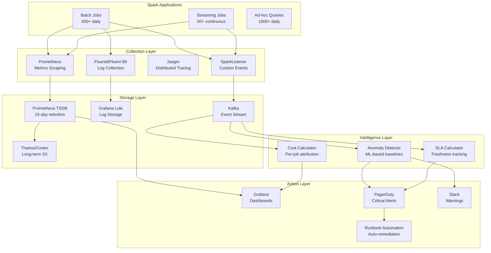
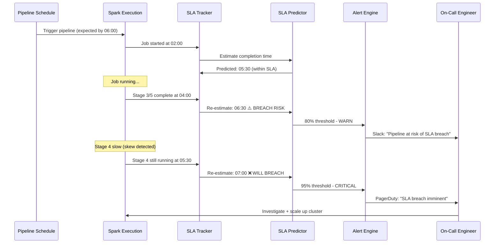
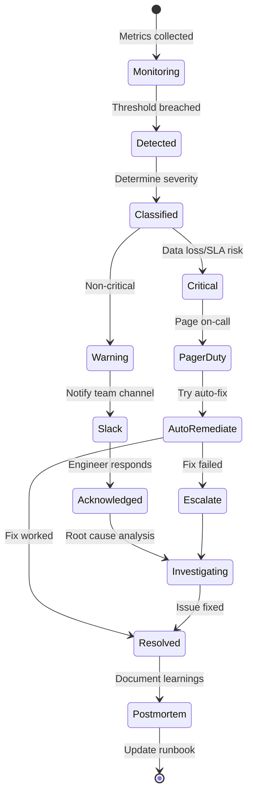

# Spark Production Observability: Metrics, Monitoring, Alerting & SLA Management

> **Production Pattern**: Complete observability stack for 500+ Spark applications with real-time metrics, intelligent alerting, SLA prediction, and automated incident response.

---

## 1. Problem Statement

| Challenge | Requirement | Impact of Missing |
|-----------|-------------|-------------------|
| Job failure detection | < 1 minute | Hours of stale data |
| Alert notification | < 5 minutes from detection | Missed SLAs, downstream impact |
| Pipeline success rate | 99.9% SLA | Revenue reporting failures |
| Cost attribution | Per-team granularity | Budget overruns, no accountability |
| Capacity planning | 30-day forecast | Cluster undersizing, job failures |
| Root cause analysis | < 30 minutes | Extended outages |

---

## 2. Architecture Diagrams

### Full Observability Stack



### SLA Management Flow



---

## 3. Spark Internal Metrics

### Driver Metrics

```python
# Key driver metrics to monitor:

driver_metrics = {
    # DAG Scheduler
    "DAGScheduler.job.activeJobs": "Currently running jobs",
    "DAGScheduler.stage.failedStages": "Stages that failed (alert if > 0)",
    "DAGScheduler.stage.waitingStages": "Stages waiting for dependencies",
    "DAGScheduler.stage.runningStages": "Currently executing stages",
    
    # Task Scheduler  
    "scheduler.task.activeTasks": "Tasks currently running across executors",
    "scheduler.task.completedTasks": "Total completed tasks",
    "scheduler.task.killedTasks": "Tasks killed (OOM, timeout)",
    "scheduler.task.skippedTasks": "Tasks skipped (cached data)",
    
    # Block Manager
    "BlockManager.memory.memUsed_MB": "Cache memory usage",
    "BlockManager.memory.remainingMem_MB": "Available cache memory",
    "BlockManager.disk.diskSpaceUsed_MB": "Disk usage for spill/cache",
    
    # Streaming (if applicable)
    "streaming.inputRate-total": "Records/sec from all sources",
    "streaming.processingRate-total": "Records/sec processed",
    "streaming.latency": "End-to-end processing latency",
    "streaming.stateOperators.numRowsTotal": "State store total rows",
    "streaming.stateOperators.memoryUsedBytes": "State store memory",
}
```

### Executor Metrics

```python
executor_metrics = {
    # JVM
    "jvm.heap.used": "Current heap usage (alert if > 90% of max)",
    "jvm.heap.max": "Maximum heap size",
    "jvm.non-heap.used": "Metaspace, code cache, etc.",
    "jvm.GC.G1-Young-Generation.time": "Young gen GC time (ms)",
    "jvm.GC.G1-Old-Generation.time": "Old gen GC time (alert if > 10% of task time)",
    "jvm.GC.G1-Young-Generation.count": "Young gen GC frequency",
    
    # Shuffle
    "shuffle.read.localBytesRead": "Shuffle data read from local disk",
    "shuffle.read.remoteBytesRead": "Shuffle data read from network",
    "shuffle.read.fetchWaitTime": "Time waiting for shuffle fetch",
    "shuffle.write.bytesWritten": "Shuffle data written",
    "shuffle.write.writeTime": "Time spent writing shuffle",
    
    # Task
    "task.completionTime": "Task duration distribution",
    "task.jvmGCTime": "GC time during task",
    "task.resultSerializationTime": "Time serializing results",
    "task.shuffleReadMetrics.fetchWaitTime": "Shuffle fetch wait",
    
    # I/O
    "filesystem.s3.read_bytes": "Bytes read from S3",
    "filesystem.s3.write_bytes": "Bytes written to S3",
}
```

---

## 4. Prometheus + Grafana Setup

### metrics.properties (Spark Configuration)

```properties
# /etc/spark/conf/metrics.properties
# Enable Prometheus sink for all components

*.sink.prometheus.class=org.apache.spark.metrics.sink.PrometheusServlet
*.sink.prometheus.path=/metrics/prometheus

# JMX sink (for JMX exporter)
*.sink.jmx.class=org.apache.spark.metrics.sink.JmxSink

# Enable all metric sources
driver.source.jvm.class=org.apache.spark.metrics.source.JvmSource
executor.source.jvm.class=org.apache.spark.metrics.source.JvmSource

# Application-level metrics
*.source.application.class=org.apache.spark.metrics.source.ApplicationSource
```

### AlertManager Rules

```yaml
# prometheus/alerts/spark_alerts.yml
groups:
  - name: spark_job_alerts
    rules:
      - alert: SparkJobFailed
        expr: spark_job_status{status="FAILED"} > 0
        for: 1m
        labels:
          severity: critical
          team: "{{ $labels.team }}"
        annotations:
          summary: "Spark job {{ $labels.job_name }} failed"
          runbook: "https://runbooks.internal/spark-job-failure"

      - alert: SparkExecutorOOMRisk
        expr: (jvm_heap_used / jvm_heap_max) > 0.90
        for: 5m
        labels:
          severity: warning
        annotations:
          summary: "Executor {{ $labels.executor_id }} at 90% heap usage"

      - alert: SparkStreamingLag
        expr: spark_streaming_processing_rate < spark_streaming_input_rate * 0.8
        for: 10m
        labels:
          severity: critical
        annotations:
          summary: "Streaming job {{ $labels.app_name }} falling behind"

      - alert: SparkShuffleSpill
        expr: rate(spark_shuffle_spill_bytes_total[5m]) > 1073741824
        for: 5m
        labels:
          severity: warning
        annotations:
          summary: "High shuffle spill rate on {{ $labels.executor_id }}"

      - alert: SparkStateSizeGrowing
        expr: rate(spark_streaming_state_rows_total[1h]) > 100000
        for: 30m
        labels:
          severity: warning
        annotations:
          summary: "State store growing rapidly for {{ $labels.app_name }}"
```

---

## 5. Custom SparkListener

```python
from pyspark import SparkContext
from pyspark.sql import SparkSession
import json
import time
from datetime import datetime

class ProductionSparkListener:
    """
    Custom SparkListener that captures job/stage/task events
    and publishes them to Kafka for downstream processing.
    """
    
    def __init__(self, app_name, owner, pipeline_id):
        self.app_name = app_name
        self.owner = owner
        self.pipeline_id = pipeline_id
        self.job_start_times = {}
        self.stage_start_times = {}
        self.metrics = {
            "jobs_completed": 0,
            "jobs_failed": 0,
            "total_tasks": 0,
            "total_task_time_ms": 0,
            "total_shuffle_read_bytes": 0,
            "total_shuffle_write_bytes": 0,
            "total_spill_bytes": 0,
            "max_task_time_ms": 0,
        }
    
    def on_job_start(self, job_id, stage_count):
        """Called when a Spark job starts."""
        self.job_start_times[job_id] = time.time()
        self._publish_event({
            "event_type": "JOB_START",
            "job_id": job_id,
            "stage_count": stage_count,
            "timestamp": datetime.now().isoformat(),
            "app_name": self.app_name,
            "owner": self.owner,
            "pipeline_id": self.pipeline_id,
        })
    
    def on_job_end(self, job_id, status, error_message=None):
        """Called when a Spark job completes (success or failure)."""
        start_time = self.job_start_times.pop(job_id, time.time())
        duration_seconds = time.time() - start_time
        
        if status == "SUCCEEDED":
            self.metrics["jobs_completed"] += 1
        else:
            self.metrics["jobs_failed"] += 1
        
        self._publish_event({
            "event_type": "JOB_END",
            "job_id": job_id,
            "status": status,
            "duration_seconds": round(duration_seconds, 2),
            "error_message": error_message,
            "timestamp": datetime.now().isoformat(),
            "app_name": self.app_name,
            "owner": self.owner,
        })
    
    def on_stage_completed(self, stage_id, stage_info):
        """Called when a stage completes. Contains task metrics."""
        task_metrics = stage_info.get("task_metrics", {})
        
        self.metrics["total_tasks"] += task_metrics.get("num_tasks", 0)
        self.metrics["total_shuffle_read_bytes"] += task_metrics.get("shuffle_read_bytes", 0)
        self.metrics["total_shuffle_write_bytes"] += task_metrics.get("shuffle_write_bytes", 0)
        self.metrics["total_spill_bytes"] += task_metrics.get("spill_bytes", 0)
        
        # Detect skew: max task time >> median task time
        max_task = task_metrics.get("max_task_time_ms", 0)
        median_task = task_metrics.get("median_task_time_ms", 1)
        skew_ratio = max_task / median_task if median_task > 0 else 0
        
        if skew_ratio > 10:
            self._publish_event({
                "event_type": "SKEW_DETECTED",
                "stage_id": stage_id,
                "skew_ratio": round(skew_ratio, 1),
                "max_task_ms": max_task,
                "median_task_ms": median_task,
                "timestamp": datetime.now().isoformat(),
            })
    
    def compute_cost(self, executor_hours, instance_type="r5.4xlarge"):
        """Compute approximate job cost based on executor-hours."""
        # On-demand pricing per hour
        pricing = {
            "r5.4xlarge": 1.008,
            "r5.2xlarge": 0.504,
            "r6g.4xlarge": 0.8064,  # Graviton (20% cheaper)
            "m5.4xlarge": 0.768,
        }
        rate = pricing.get(instance_type, 1.0)
        return round(executor_hours * rate, 2)
    
    def get_summary(self):
        """Get pipeline execution summary."""
        return {
            "app_name": self.app_name,
            "owner": self.owner,
            "metrics": self.metrics,
            "cost_estimate": self.compute_cost(
                self.metrics["total_task_time_ms"] / 3600000  # Convert ms to hours
            )
        }
    
    def _publish_event(self, event):
        """Publish event to Kafka (or log for now)."""
        print(json.dumps(event))
        # In production: kafka_producer.send("spark-events", json.dumps(event))
```

---

## 6. StreamingQueryListener

```python
from pyspark.sql.streaming import StreamingQueryListener
import json
from datetime import datetime

class ProductionStreamingListener(StreamingQueryListener):
    """
    Monitor streaming query health in real-time.
    Tracks: throughput, latency, state size, backpressure.
    """
    
    def __init__(self, alert_config):
        self.alert_config = alert_config
        self.query_metrics = {}
    
    def onQueryStarted(self, event):
        """Called when a streaming query starts."""
        self.query_metrics[event.id] = {
            "name": event.name,
            "start_time": datetime.now().isoformat(),
            "batches_processed": 0,
            "total_input_rows": 0,
        }
        print(f"[STREAMING] Query started: {event.name} (id={event.id})")
    
    def onQueryProgress(self, event):
        """Called after each micro-batch completes. Rich metrics available."""
        progress = event.progress
        query_id = progress.id
        
        # Extract key metrics
        metrics = {
            "query_name": progress.name,
            "batch_id": progress.batchId,
            "timestamp": progress.timestamp,
            "input_rows_per_second": progress.inputRowsPerSecond,
            "processed_rows_per_second": progress.processedRowsPerSecond,
            "batch_duration_ms": progress.batchDuration,
            "num_input_rows": progress.numInputRows,
        }
        
        # State operator metrics
        if progress.stateOperators:
            for op in progress.stateOperators:
                metrics["state_rows_total"] = op.numRowsTotal
                metrics["state_rows_updated"] = op.numRowsUpdated
                metrics["state_memory_bytes"] = op.memoryUsedBytes
                metrics["state_custom_metrics"] = op.customMetrics
        
        # Source metrics (Kafka offsets, etc.)
        if progress.sources:
            for source in progress.sources:
                metrics["source_start_offset"] = source.startOffset
                metrics["source_end_offset"] = source.endOffset
                metrics["source_rows"] = source.numInputRows
        
        # Lag detection
        input_rate = metrics["input_rows_per_second"] or 0
        process_rate = metrics["processed_rows_per_second"] or 0
        
        if input_rate > 0 and process_rate < input_rate * 0.8:
            self._alert(
                "STREAMING_LAG",
                f"Query {progress.name} falling behind: "
                f"input={input_rate:.0f}/s, processing={process_rate:.0f}/s",
                severity="warning"
            )
        
        # State growth alert
        state_rows = metrics.get("state_rows_total", 0)
        if state_rows > self.alert_config.get("max_state_rows", 100_000_000):
            self._alert(
                "STATE_TOO_LARGE",
                f"State for {progress.name} has {state_rows:,} rows",
                severity="warning"
            )
        
        # Update cumulative metrics
        if query_id in self.query_metrics:
            self.query_metrics[query_id]["batches_processed"] += 1
            self.query_metrics[query_id]["total_input_rows"] += metrics["num_input_rows"]
        
        # Publish metrics
        self._publish_metrics(metrics)
    
    def onQueryTerminated(self, event):
        """Called when query stops (error or graceful shutdown)."""
        if event.exception:
            self._alert(
                "STREAMING_TERMINATED",
                f"Query terminated with error: {event.exception}",
                severity="critical"
            )
        print(f"[STREAMING] Query terminated: id={event.id}, exception={event.exception}")
    
    def _alert(self, alert_type, message, severity="warning"):
        """Send alert."""
        print(f"[ALERT-{severity.upper()}] {alert_type}: {message}")
        # In production: send to PagerDuty/Slack
    
    def _publish_metrics(self, metrics):
        """Publish to Prometheus/StatsD."""
        # In production: push to metrics backend
        pass


# Register listener
spark.streams.addListener(ProductionStreamingListener(
    alert_config={
        "max_state_rows": 50_000_000,
        "max_batch_duration_ms": 60000,
        "min_processing_rate_pct": 0.8,
    }
))
```

---

## 7. SLA Management

```python
class SLATracker:
    """
    Track pipeline SLAs and predict breaches before they happen.
    """
    
    def __init__(self, spark, sla_config_table, metrics_table):
        self.spark = spark
        self.sla_config_table = sla_config_table
        self.metrics_table = metrics_table
    
    def check_all_slas(self):
        """Check all pipeline SLAs and return status."""
        sla_configs = self.spark.read.format("iceberg").load(self.sla_config_table).collect()
        
        results = []
        for sla in sla_configs:
            result = self._check_single_sla(sla)
            results.append(result)
            
            if result["status"] == "BREACH_IMMINENT":
                self._escalate(result, level="critical")
            elif result["status"] == "AT_RISK":
                self._escalate(result, level="warning")
        
        return results
    
    def _check_single_sla(self, sla_config):
        """Check a single pipeline SLA."""
        pipeline = sla_config["pipeline_id"]
        sla_deadline = sla_config["deadline_utc"]  # e.g., "06:00:00"
        sla_type = sla_config["sla_type"]  # freshness, completeness, latency
        
        if sla_type == "freshness":
            return self._check_freshness_sla(pipeline, sla_deadline)
        elif sla_type == "completeness":
            return self._check_completeness_sla(pipeline, sla_config)
        elif sla_type == "latency":
            return self._check_latency_sla(pipeline, sla_config)
    
    def _check_freshness_sla(self, pipeline, deadline):
        """Is the data available by the deadline?"""
        from datetime import datetime, time
        
        now = datetime.utcnow()
        deadline_time = datetime.strptime(deadline, "%H:%M:%S").time()
        deadline_today = datetime.combine(now.date(), deadline_time)
        
        # Check if latest data is from today
        latest_run = self.spark.sql(f"""
            SELECT MAX(completion_time) as last_complete
            FROM {self.metrics_table}
            WHERE pipeline_id = '{pipeline}'
              AND run_date = current_date()
              AND status = 'SUCCESS'
        """).first()
        
        if latest_run and latest_run["last_complete"]:
            return {
                "pipeline": pipeline,
                "sla_type": "freshness",
                "status": "MET",
                "completed_at": str(latest_run["last_complete"]),
                "deadline": deadline
            }
        
        # Not complete yet - estimate if we'll make it
        time_remaining = (deadline_today - now).total_seconds() / 3600  # hours
        
        # Get historical completion times
        avg_duration = self.spark.sql(f"""
            SELECT AVG(duration_hours) as avg_hours
            FROM {self.metrics_table}
            WHERE pipeline_id = '{pipeline}'
              AND status = 'SUCCESS'
              AND run_date >= current_date() - INTERVAL 30 DAYS
        """).first()["avg_hours"] or 4.0
        
        # Is the job running?
        is_running = self.spark.sql(f"""
            SELECT COUNT(*) > 0 as running
            FROM {self.metrics_table}
            WHERE pipeline_id = '{pipeline}'
              AND run_date = current_date()
              AND status = 'RUNNING'
        """).first()["running"]
        
        if not is_running:
            return {"pipeline": pipeline, "status": "NOT_STARTED", "sla_type": "freshness"}
        
        # Predict completion
        if time_remaining < 0:
            return {"pipeline": pipeline, "status": "BREACHED", "sla_type": "freshness"}
        elif time_remaining < avg_duration * 0.2:
            return {"pipeline": pipeline, "status": "BREACH_IMMINENT", "sla_type": "freshness"}
        elif time_remaining < avg_duration * 0.5:
            return {"pipeline": pipeline, "status": "AT_RISK", "sla_type": "freshness"}
        else:
            return {"pipeline": pipeline, "status": "ON_TRACK", "sla_type": "freshness"}
    
    def _escalate(self, result, level):
        """Escalate SLA issue based on level."""
        if level == "critical":
            # PagerDuty
            print(f"[PAGERDUTY] SLA {result['status']} for {result['pipeline']}")
        elif level == "warning":
            # Slack
            print(f"[SLACK] SLA at risk for {result['pipeline']}")
```

---

## 8. Incident Response Automation

```python
class SparkIncidentResponder:
    """Automated incident response for Spark job failures."""
    
    def __init__(self, spark):
        self.spark = spark
        self.remediation_actions = {
            "OOM": self._handle_oom,
            "SHUFFLE_FETCH_FAILURE": self._handle_shuffle_failure,
            "STREAMING_STOPPED": self._handle_streaming_restart,
            "TASK_TIMEOUT": self._handle_task_timeout,
        }
    
    def respond(self, incident_type, context):
        """Auto-respond to detected incident."""
        handler = self.remediation_actions.get(incident_type)
        if handler:
            return handler(context)
        return {"action": "MANUAL_INTERVENTION_REQUIRED", "type": incident_type}
    
    def _handle_oom(self, context):
        """Auto-remediation for OOM failures."""
        return {
            "action": "RETRY_WITH_CONFIG",
            "new_config": {
                "spark.executor.memory": "32g",  # Increase from 16g
                "spark.executor.memoryOverhead": "8g",
                "spark.sql.shuffle.partitions": "4000",  # More partitions = smaller each
            },
            "reason": "OOM detected - increasing memory and partitions"
        }
    
    def _handle_shuffle_failure(self, context):
        """Handle shuffle fetch failures (usually node loss)."""
        return {
            "action": "RETRY",
            "max_retries": 3,
            "new_config": {
                "spark.shuffle.io.maxRetries": "10",
                "spark.shuffle.io.retryWait": "60s",
            },
            "reason": "Shuffle fetch failure - likely node loss, retrying with more resilience"
        }
    
    def _handle_streaming_restart(self, context):
        """Restart failed streaming query from checkpoint."""
        return {
            "action": "RESTART_FROM_CHECKPOINT",
            "checkpoint_location": context.get("checkpoint_path"),
            "reason": "Streaming query terminated - restarting from last checkpoint"
        }
    
    def _handle_task_timeout(self, context):
        """Handle tasks that exceed timeout (likely skew)."""
        return {
            "action": "RETRY_WITH_CONFIG",
            "new_config": {
                "spark.sql.adaptive.skewJoin.enabled": "true",
                "spark.sql.adaptive.skewJoin.skewedPartitionFactor": "3",
                "spark.task.maxFailures": "8",
            },
            "reason": "Task timeout - enabling skew handling"
        }
```

---

## 9. Capacity Planning

```python
class CapacityPlanner:
    """Forecast resource needs based on historical usage."""
    
    def __init__(self, spark, metrics_table):
        self.spark = spark
        self.metrics_table = metrics_table
    
    def forecast_growth(self, days_ahead=30):
        """Predict resource needs for next N days."""
        # Get historical daily resource usage
        history = self.spark.sql(f"""
            SELECT 
                run_date,
                SUM(executor_hours) as daily_executor_hours,
                SUM(data_processed_tb) as daily_data_tb,
                MAX(peak_executors) as peak_executors
            FROM {self.metrics_table}
            WHERE run_date >= current_date() - INTERVAL 90 DAYS
            GROUP BY run_date
            ORDER BY run_date
        """).toPandas()
        
        # Simple linear regression for forecasting
        import numpy as np
        
        x = np.arange(len(history))
        y = history["daily_executor_hours"].values
        
        # Fit linear trend
        slope, intercept = np.polyfit(x, y, 1)
        
        # Forecast
        future_x = np.arange(len(history), len(history) + days_ahead)
        forecast = slope * future_x + intercept
        
        return {
            "current_daily_executor_hours": round(y[-1], 1),
            "forecast_30d_executor_hours": round(forecast[-1], 1),
            "growth_rate_pct_per_day": round(slope / intercept * 100, 2),
            "recommended_max_executors": int(forecast[-1] / 8) + 50,  # Buffer
            "estimated_monthly_cost": round(forecast.mean() * 30 * 1.0, 2),  # $1/executor-hour
        }
```

---

## 10. Workflow Diagrams

### Alert Lifecycle



---

## 11. Companies Using This Pattern

| Company | Stack | Scale | Key Innovation |
|---------|-------|-------|----------------|
| **Netflix** | Custom + Prometheus | 10K+ jobs/day | Predictive SLA management |
| **Uber** | uMonitor + Grafana | 100K+ pipelines | ML anomaly detection |
| **Databricks** | Built-in Ganglia + custom | Multi-tenant | Per-workspace metrics |
| **LinkedIn** | Custom observability | 50K+ datasets | Data freshness prediction |
| **Airbnb** | Custom + Datadog | 10K+ pipelines | Self-healing pipelines |

---

## Summary

| Layer | Tool | Purpose |
|-------|------|---------|
| **Metrics** | Prometheus + Grafana | Real-time dashboards, alerting |
| **Logs** | Fluentd + Loki | Structured log search, correlation |
| **Events** | SparkListener + Kafka | Custom business metrics, cost |
| **Alerting** | AlertManager + PagerDuty | Intelligent escalation |
| **SLA** | Custom tracker | Breach prediction, compliance |
| **Remediation** | Auto-responder | Retry, scale-up, restart |
| **Planning** | Capacity forecaster | Growth prediction, right-sizing |
